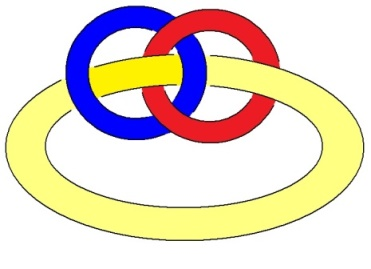

# Leçon 01 | 15 Novembre 1977

<!-- source-url: http://staferla.free.fr/S25/S25.docx -->
<!-- seminar: s25 -->
<!-- lesson: 01 -->

<!-- id: s25-01-0001 -->

*J’avais là un bon prétexte de ne pas faire mon séminaire, que je n’ai pas la moindre envie de faire.*

<!-- id: s25-01-0002 -->

*Bien entendu, malgré tout, ça ne serait qu’un prétexte.*

<!-- id: s25-01-0003 -->

*Qu’est-ce que vous êtes gentils de vous déranger comme ça pour ce que j’ai à vous dire !*

<!-- id: s25-01-0004 -->

*Voilà, j’ai intitulé mon séminaire - vous entendez ? – j’ai intitulé mon séminaire cette année* « *Le moment de conclure* ».

<!-- id: s25-01-0005 -->

Ce que j’ai à vous dire je vais vous le dire, c’est que la psychanalyse est à prendre au sérieux, bien que ça ne soit pas une science. C’est même pas une science du tout.

<!-- id: s25-01-0006 -->

Parce que l’ennuyeux...

<!-- id: s25-01-0007 -->

> comme l’a montré surabon­damment un nommé Karl Popper ...c’est que *ce n’est pas une science parce que c’est irréfutable*.

<!-- id: s25-01-0008 -->

C’est une pratique qui durera ce qu’elle durera.

<!-- id: s25-01-0009 -->

C’est une pratique de bavardage.

<!-- id: s25-01-0010 -->

Aucun bavardage n’est sans risques.

<!-- id: s25-01-0011 -->

Déjà le mot « *bavardage* » implique quelque chose.

<!-- id: s25-01-0012 -->

Ce que ça implique est suf­fisamment dit par le mot « *bavardage* ».

<!-- id: s25-01-0013 -->

Ce qui veut dire qu’il n’y a pas que les phrases...

<!-- id: s25-01-0014 -->

> c’est-à-dire ce qu’on appelle les propositions ...qui impli­quent des conséquences, les mots aussi.

<!-- id: s25-01-0015 -->

« *Bavardage* » met la parole au rang de *baver* ou de *postillonner*.

<!-- id: s25-01-0016 -->

Elle la réduit à la sorte d’*éclaboussement* qui en résulte. Voilà.

<!-- id: s25-01-0017 -->

Ça n’empêche pas que l’analyse a des conséquences : elle *dit* *quelque chose*.

<!-- id: s25-01-0018 -->

Qu’est-ce que ça veut dire : « *dire* » ?

<!-- id: s25-01-0019 -->

« *Dire* » a quelque chose à faire avec le temps.

<!-- id: s25-01-0020 -->

L’absence de temps, c’est une chose qu’on rêve, c’est ce qu’on appelle « *l’éternité* ».

<!-- id: s25-01-0021 -->

Et ce rêve consiste à imaginer qu’on se réveille. On passe son temps à rêver...

<!-- id: s25-01-0022 -->

> on ne rêve pas seulement quand on dort ...*l’inconscient, c’est très exactement l’hypothèse qu’on ne rêve pas seule­ment quand on dort*.

<!-- id: s25-01-0023 -->

Je voudrais vous faire remarquer que ce qu’on appelle « *le raisonnable* » est un fantasme.

<!-- id: s25-01-0024 -->

C’est tout à fait manifeste dans le début de la science.

<!-- id: s25-01-0025 -->

La géométrie euclidienne a tous les caractères du fantasme.

<!-- id: s25-01-0026 -->

Un *fantasme* n’est pas un rêve, c’est une aspiration.

<!-- id: s25-01-0027 -->

L’idée de la ligne, de la *ligne droite* par exemple, c’est manifestement un *fantasme*. Par bonheur, on en est sorti.

<!-- id: s25-01-0028 -->

Je veux dire que la topologie a restitué ce qu’on doit appeler *le tissage*.

<!-- id: s25-01-0029 -->

L’idée de « *voisinage »*, c’est simplement l’idée de « *consistance »*, si tant est qu’on se permette de donner corps au mot *idée*.

<!-- id: s25-01-0030 -->

C’est pas facile. Il y a quand même des philosophes grecs qui, à l’« *idée »*, ont essayé de donner corps.

<!-- id: s25-01-0031 -->

Une idée, ça a un corps : c’est le mot qui la représente.

<!-- id: s25-01-0032 -->

*Et le mot* a une propriété tout à fait curieuse, c’est qu’il *fait la chose*.

<!-- id: s25-01-0033 -->

J’aimerais *équi­voquer* et écrire c’est qu’il « *fêle à chose* », ce n’est pas une mauvaise façon d’équivoquer.

<!-- id: s25-01-0034 -->

User de l’écriture pour *équi­voquer*, ça peut servir parce que nous avons besoin de l’*équi­voque* précisément pour l’analyse.

<!-- id: s25-01-0035 -->

Nous avons besoin de l’*équi­voque* - c’est la définition de l’analyse - parce que, comme le mot l’implique, l’*équi­voque* est tout de suite versant vers le sexe.

<!-- id: s25-01-0036 -->

Le sexe - je vous l’ai dit - c’est un dire.

<!-- id: s25-01-0037 -->

Ça vaut ce que ça vaut, *le sexe ne définit pas un rapport*.

<!-- id: s25-01-0038 -->

C’est ce que j’ai énoncé en formulant « *qu’il n’y a pas de rapport sexuel »*.

<!-- id: s25-01-0039 -->

Ça veut seulement dire que *chez l’homme*...

<!-- id: s25-01-0040 -->

> et sans doute à cause de l’existence du signifiant *...l’ensemble de ce qui pourrait être rapport sexuel* est un ensemble...

<!-- id: s25-01-0041 -->

> on est arrivé à cogiter ça, on ne sait d’ailleurs pas très bien comment ça s’est produit ...*est un ensemble vide*.

<!-- id: s25-01-0042 -->

Alors c’est ce qui permet bien des choses.

<!-- id: s25-01-0043 -->

Cette notion d’*ensemble vide* est ce qui convient au *rapport sexuel*.

<!-- id: s25-01-0044 -->

Le psychanalyste est un rhéteur...

<!-- id: s25-01-0045 -->

> pour continuer d’équivoquer, je dirai qu’il « *rhétifie* », ce qui implique qu’il rectifie ...l’analyste est un rhéteur, c’est-à-dire que *rectus,* le mot latin, équivoque avec la « *rhétification* ».

<!-- id: s25-01-0046 -->

On essaie de dire la vérité.

<!-- id: s25-01-0047 -->

On essaie de dire la vérité, mais ça n’est pas facile parce qu’il y a de grands obstacles à ce qu’on dise la vérité, ne serait-ce qu’on se trompe dans le choix des mots.

<!-- id: s25-01-0048 -->

*La Vérité* a affaire avec le *Réel* et le *Réel* est doublé, si l’on peut dire, par le *Symbolique*.

<!-- id: s25-01-0049 -->

Ιl m’est arrivé de recevoir d’un nommé Michel Coornaert...

<!-- id: s25-01-0050 -->

> je l’ai reçu par l’intermédiaire de quelqu’un qui me veut du *bien* et à qui le Coornaert en question l’avait envoyé ...j’ai reçu de ce Coornaert *un machin* qui s’appelle « *Knots and links ».*

<!-- id: s25-01-0051 -->

C’est anglais, ce qui veut dire, parce que ce n’est pas tout simple, il faut métalanguer, c’est-à-dire traduire, on ne parle jamais d’une langue que dans une autre langue.

<!-- id: s25-01-0052 -->

Si j’ai dit qu’il n’y a pas de métalangage, c’est pour dire que le langage, ça n’existe pas.

<!-- id: s25-01-0053 -->

Il n’y a que des supports multiples du langage qui s’appellent « *lalangue* », et ce qu’il fau­drait bien c’est que l’analyse arrive...

<!-- id: s25-01-0054 -->

> par une supposition ...arrive à défaire par la parole ce qui s’est fait par la parole.

<!-- id: s25-01-0055 -->

Dans l’ordre du rêve qui se donne le champ d’user du *langage*, il y a une bavure, qui est que Freud appelle ce qui est en jeu le *Wunsch*...

<!-- id: s25-01-0056 -->

> c’est un mot, comme on le sait, allemand ...et le *Wunsch* dont il s’agit a pour pro­priété qu’on ne sait pas si c’est un souhait, qui de toute façon est en l’air, un souhait adressé à qui ?

<!-- id: s25-01-0057 -->

Dès qu’on veut le dire, on est forcé de suppo­ser qu’il y a un interlocuteur, et à partir de ce moment-là on est dans la magie.

<!-- id: s25-01-0058 -->

On est forcé de savoir ce qu’on demande.

<!-- id: s25-01-0059 -->

Mais justement, ce qui définit la demande, c’est qu’on ne demande jamais que par ce qu’on désire...

<!-- id: s25-01-0060 -->

> je veux dire : en passant par ce qu’on désire ...et ce qu’on désire, on ne le sait pas. C’est bien pour ça que j’ai mis l’accent sur *le désir de l’analyste*.

<!-- id: s25-01-0061 -->

Le *sujet supposé savoir,* d’où j’ai sup­porté, défini le transfert: *supposé-savoir quoi ?*

<!-- id: s25-01-0062 -->

Comment opérer ?

<!-- id: s25-01-0063 -->

Mais ça serait tout à fait excessif que dire que l’analyste sait comment opérer.

<!-- id: s25-01-0064 -->

Ce qu’il faudrait, c’est qu’il sache opérer convenablement, c’est-à-dire qu’il se rende compte de la portée des mots pour son analysant, ce qu’incontestablement il ignore.

<!-- id: s25-01-0065 -->

De sorte qu’il faut que je vous trace ce qu’il en est de ce que j’ai appelé, j’ai avancé sous la forme du nœud borroméen.

<!-- id: s25-01-0066 -->

Quelqu’un qui n’est autre...

<!-- id: s25-01-0067 -->

> il faut bien que je le nomme ...que J.Β. Lefebvre-Pontalis a accordé une interview au *Monde.* Ιl aurait mieux fait de s’abstenir. Ιl aurait mieux fait de s’abstenir parce que ce qu’il a dit ne vaut pas cher : à ce qu’il paraît que mon nœud borroméen serait une façon d’étrangler le monde, de faire suffoquer. Ouais ! Bon...

<!-- id: s25-01-0068 -->

Voilà quand même ce que je peux verser au dossier de ce nœud borroméen.

<!-- id: s25-01-0069 -->

Ιl est bien évident que c’est comme ça que ça se dessine :

<!-- id: s25-01-0070 -->

<!-- id: s25-01-0071 -->

Je veux dire qu’on interrompt...

<!-- id: s25-01-0072 -->

> parce qu’on pro­jette les choses ...on interrompt ce dont il s’agit, c’est-à-dire une corde.

<!-- id: s25-01-0073 -->

Une corde ça fait un nœud, et je me souviens qu’il y eût un temps où le nommé Soury fit reproche...

<!-- id: s25-01-0074 -->

> à quelqu’un qui est ici présent ...fit reproche d’avoir fait ce nœud de tra­vers.

<!-- id: s25-01-0075 -->

Je ne sais plus très bien com­ment il l’avait fait effectivement.

<!-- id: s25-01-0076 -->

Mais disons qu’ici on a bien le droit, puisque le nœud borroméen a pour propriété de ne pas nommer chacun des cercles d’une façon qui soit uni­voque. Dans *le nœud borroméen* vous avez ceci, ce qui fait que vous pouvez désigner chacun de ces cercles par le terme que vous voudrez, je veux dire qu’il est indifférent que ceci soit appelé I.R.S. ici, à condition de ne pas abuser, je veux dire de mettre les trois lettres, vous avez toujours un nœud borroméen.

<!-- id: s25-01-0077 -->

Supposez qu’ici, nous désignions comme distincts le R et le S, à savoir le *Réel* et le *Symbolique*, il reste le 3ème qui est l’*Imaginaire*.

<!-- id: s25-01-0078 -->

Si nous nouons, comme c’est ici représenté : le *Symbolique* avec le *Réel*, ce qui bien sûr serait l’idéal, à savoir, que puisque les mots font la chose, *la Chose freudienne, la Crachose freudienne,* je veux dire que c’est justement de l’inadéquation des mots aux choses que nous avons affaire.

<!-- id: s25-01-0079 -->

Ce que j’ai appelé « *la Chose freudienne »,* c’était que les mots se moulent dans les choses.

<!-- id: s25-01-0080 -->

Mais il est un fait, c’est que ça ne passe pas, qu’il n’y a ni crachat ni *cra­chose,* et que l’adéquation du *Symbolique* ne fait les choses que fantasmatiquement, de sorte que le lien...

<!-- id: s25-01-0081 -->

> l’anneau que serait ce *Symbolique* par rapport au *Réel,* ou ce *Réel* par rapport au *Symbolique* ...ne tienne pas.

<!-- id: s25-01-0082 -->

Je veux dire qu’il est tout à fait simple de s’apercevoir qu’à condition d’assou­plir la corde de l’*Imaginaire*, ce qui s’ensuit est très exactement ce par quoi l’*Imaginaire* ne tient pas...

<!-- id: s25-01-0083 -->

> comme vous le voyez d’une façon manifeste ...ne tient pas, puisqu’il est clair qu’ici, passant sous le *Symbolique*, cet *Imaginaire* vient ici, et il vient ici quoique, quoiqu’il soit sous le *Symbolique*.

<!-- id: s25-01-0084 -->

Je vous prie de vous rendre compte qu’ici c’est libre, à savoir que l’*Imaginaire* suggéré par le *Symbolique* se libère.

<!-- id: s25-01-0085 -->

C’est bien en cela que l’histoire de l’écriture vient suggérer *qu’il n’y a pas de rapport sexuel*.

<!-- id: s25-01-0086 -->

L’*analyse*, dans l’occasion, se consume elle-même.

<!-- id: s25-01-0087 -->

Je veux dire que si nous faisons une abstraction sur l’analyse, nous l’annulons.

<!-- id: s25-01-0088 -->

Si nous nous apercevons que nous ne parlons que d’apparentement ou de parenté, il nous vient à l’idée de parler d’autre chose et c’est bien en quoi l’analyse, à l’occasion, échouerait.

<!-- id: s25-01-0089 -->

Mais c’est un fait que cha­cun ne parle que de ça.

<!-- id: s25-01-0090 -->

La névrose est-elle naturelle ?

<!-- id: s25-01-0091 -->

Elle n’est naturelle que pour autant que chez un homme, il y a un *Symbolique*.

<!-- id: s25-01-0092 -->

Et le fait qu’il y ait un *Symbolique* implique qu’un signifiant nouveau émerge, un signifiant nouveau à quoi le *moi*, c’est-à-dire la conscience, s’identifierait.

<!-- id: s25-01-0093 -->

Mais ce qu’il y a de propre au signifiant, que j’ai appelé du nom d’**S1**, c’est qu’il n’y a qu’un rapport qui le définisse, le rapport qu’il a avec **S2:S1** → **S2**. C’est en tant que *le sujet est divisé* *entre* cet **S1** et cet **S2** qu’il se supporte, de sorte qu’on ne peut pas dire que ce soit un seul des deux signifiants qui le représente.

<!-- id: s25-01-0094 -->

La névrose est-elle naturelle ?

<!-- id: s25-01-0095 -->

Ιl s’agirait de définir la nature de la natu­re.

<!-- id: s25-01-0096 -->

Qu’est-ce qui peut être dit de la nature de la nature ?

<!-- id: s25-01-0097 -->

Rien que ceci qu’il y a quelque chose dont nous avons l’imagination qu’on puisse en rendre compte par l’*organique*, je veux dire par le fait qu’il y ait des êtres vivants. Mais qu’il y ait des êtres vivants, non seulement ne va pas de soi, mais il a fallu élucubrer *toute une genèse*, je veux dire que ce qu’on a appelé *les gènes*, assurément veut dire quelque chose, mais ce n’est qu’un vouloir dire.

<!-- id: s25-01-0098 -->

Nous n’avons nulle part présent que ce jaillissement de la lignée soit *évo­lutionniste*, soit même à l’occasion *créationniste*, ça se vaut. L’élucubration *créationniste* ne vaut pas mieux que l’élucubration *évolutionniste*, puisque de toute façon ça n’est qu’une hypothèse. La logique ne se supporte que de peu de choses.

<!-- id: s25-01-0099 -->

Si nous ne croyons pas d’une façon en somme gratuite que *les mots font les choses*, la logique n’a pas de raison d’être.

<!-- id: s25-01-0100 -->

Ce que j’ai appelé le rhéteur qu’il y a dans l’analyse - c’est l’analyste dont il s’agit - le rhéteur n’opère que par suggestion.

<!-- id: s25-01-0101 -->

Ιl suggère, c’est le propre du rhéteur, il n’impose pas d’aucune façon quelque chose qui aurait consistance et c’est même pour cela que j’ai dési­gné de l’« *ex* » ce qui ne se supporte que d’*ex-sister*.

<!-- id: s25-01-0102 -->

Comment faut-il que l’analyste opère pour être un convenable rhéteur ?

<!-- id: s25-01-0103 -->

C’est bien là que nous arrivons à une ambiguïté.

<!-- id: s25-01-0104 -->

L’inconscient, dit-on, ne connaît pas la contradiction, c’est bien en quoi il faut que l’analyste opère par quelque chose qui ne fasse pas fondement sur la contradiction.

<!-- id: s25-01-0105 -->

Ιl n’est pas dit que ce dont il s’agisse soit vrai ou faux.

<!-- id: s25-01-0106 -->

Ce qui fait le vrai et ce qui fait le faux, c’est ce qu’on appelle le poids de l’analyste et c’est en cela que je dis qu’il est rhéteur.

<!-- id: s25-01-0107 -->

L’hypothèse que l’*inconscient* soit une extrapolation n’est pas absurde, et c’est bien pourquoi Freud a eu recours à ce qu’on appelle « *la pulsion* ».

<!-- id: s25-01-0108 -->

La pulsion est quelque chose qui ne se supporte que d’être nommée, et d’être nommée d’une façon qui la tire, si je puis dire, par les cheveux, c’est-à-dire qui présuppose que toute pulsion...

<!-- id: s25-01-0109 -->

> au nom de quelque chose qui se trou­ve exister chez l’enfant ...que toute pulsion est sexuelle.

<!-- id: s25-01-0110 -->

Mais rien ne dit que quelque chose mérite d’être appelé « *pulsion »*, avec cette inflexion qui la réduit à être *sexuelle*.

<!-- id: s25-01-0111 -->

Ce qui dans le sexuel importe, c’est le comique, c’est que, quand un homme est femme, c’est à ce moment-là qu’il aime, c’est-à-dire qu’il aspi­re au quelque chose qui est son objet.

<!-- id: s25-01-0112 -->

Par contre, c’est au titre d’homme qu’il désire, c’est-à-dire qu’il se supporte de quelque chose qui s’appelle proprement « *bander* ». Ouais...

<!-- id: s25-01-0113 -->

La vie n’est pas tragique, elle est comique, et c’est pourtant assez curieux que Freud n’ait rien trouvé de mieux que de désigner du « *complexe d’Œdipe »*, c’est-à-dire d’une tragédie, ce dont il s’agissait dans l’affaire.

<!-- id: s25-01-0114 -->

On ne voit pas pourquoi Freud a désigné...

<!-- id: s25-01-0115 -->

> alors qu’il pouvait prendre un chemin plus court ...a désigné d’autre chose que d’une comédie, ce à quoi il avait affaire dans ce rapport qui lie le *Symbolique*, l’*Imaginaire* et le *Réel*.

<!-- id: s25-01-0116 -->

Pour que l’*Imaginaire* s’exfolie, il n’y a qu’à le réduire au fantasme.

<!-- id: s25-01-0117 -->

L’important est que la science elle-même n’est qu’un fantasme, et que l’idée d’un réveil soit à proprement parler impensable.

<!-- id: s25-01-0118 -->

Voilà ce que j’avais à vous dire aujourd’hui.
