# Leçon 08 | 14 Mars 1978

<!-- source-url: http://staferla.free.fr/S25/S25.docx -->
<!-- seminar: s25 -->
<!-- lesson: 08 -->

<!-- id: s25-08-0001 -->

[Soury](#SOURY14Mars)

<!-- id: s25-08-0002 -->

Lacan

<!-- id: s25-08-0003 -->

Quelqu’un a émis à mon sujet, l’imputation que je faisais faire de la recherche à mon auditoire, ou plus exactement que j’y parvenais. C’est François Wahl dans l’occasion. C’est bien à quoi je devais arriver.

<!-- id: s25-08-0004 -->

J’avais énoncé autrefois que « *Je ne cherche pas, je trouve* ».

<!-- id: s25-08-0005 -->

Ce sont des mots empruntés à quelqu’un qui avait de son temps une certaine notoriété, à savoir le peintre Picasso.

<!-- id: s25-08-0006 -->

Actuellement *je ne trouve pas, je cherche*. *Je cherche*, et même quelques personnes veulent bien m’accompagner dans cette recherche.

<!-- id: s25-08-0007 -->

Autrement dit j’ai évidé, si l’on peut dire, ces ronds de ficelle avec lesquels je faisais autre­fois des chaînes borroméennes.

<!-- id: s25-08-0008 -->

Ces chaînes borroméennes, je les ai transfor­mées, non pas en tores, mais en tissus toriques.

<!-- id: s25-08-0009 -->

Autrement dit, ce sont des tores qui portent maintenant mes ronds de ficelle.

<!-- id: s25-08-0010 -->

Ce n’est pas commode parce qu’un tore, c’est une surface et qu’il y a deux manières de traiter une surface.

<!-- id: s25-08-0011 -->

Une surface ça porte des traits et ces traits...

<!-- id: s25-08-0012 -->

> qui se trouvent être sur une des pages de la surface, autrement dit une des faces de la surface ...ces traits, c’est actuellement ce qui incarne, supporte, mes *ronds de ficelle*, mes *ronds de ficelle* qui sont toujours *borroméens*.

<!-- id: s25-08-0013 -->

En fait le tore, il est au centre de ces traits. Ιl est fabriqué à peu près comme ça, et les traits sont à la surface.

<!-- id: s25-08-0014 -->

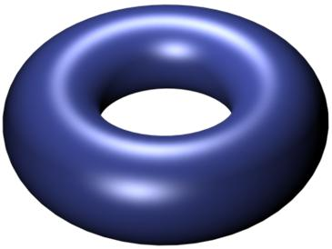 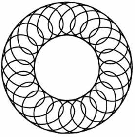

<!-- id: s25-08-0015 -->

Ce qui implique que le tore lui-même n’est pas borroméen.

<!-- id: s25-08-0016 -->

1 3 2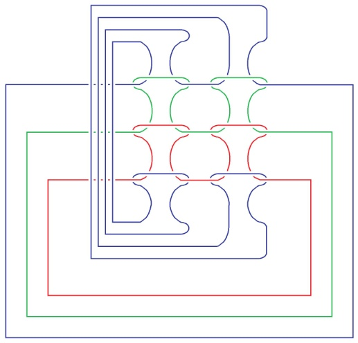 4 5 7 6 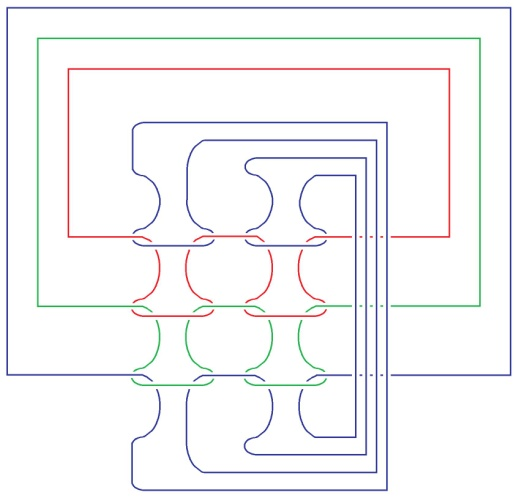8

<!-- id: s25-08-0017 -->

Ça, c’est un tableau de Soury. Ιl y distingue 2 éléments. À savoir, le fait qu’un tore peut se retourner*, il se retourne de deux façons*. Soit que le tore soit troué, troué de l’extérieur. Dans ce cas-là, comme on peut le voir ici, *[il est capable de se retourner](http://upload.wikimedia.org/wikipedia/commons/b/ba/Inside-out_torus_%28animated%2C_small%29.gif).*

<!-- id: s25-08-0018 -->

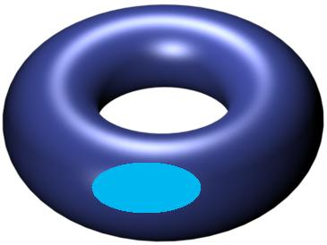 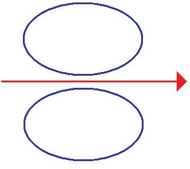

<!-- id: s25-08-0019 -->

C’est-à-dire que, pour dessiner les choses comme cela, il se retourne à l’en­vers, et qu’il en résulte que ce dans quoi on entre, à savoir ce que j’appel­lerai âme du tore, devient l’axe. À savoir que le résultat de ce retournement est quelque chose qui se présente comme ceci en coupe. À savoir que l’âme du tore en devient l’axe. En d’autres termes, ceci vient se fermer ici et ce dont il s’agit dans le tore devient l’axe, à savoir que l’âme est formée du reploiement du trou.

<!-- id: s25-08-0020 -->

Au contraire, le retournement par coupure qui a pour effet aussi de transformer le tore en permettant - voilà la coupure - en permettant de le retourner comme ceci, substitue également l’âme et l’axe. Ici le tore ayant ce qu’on appelle son âme, et ici du fait de la coupure, ce qui était d’abord l’âme du tore - voilà la coupure - devenant son axe :

<!-- id: s25-08-0021 -->

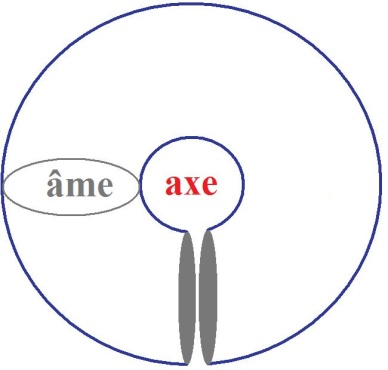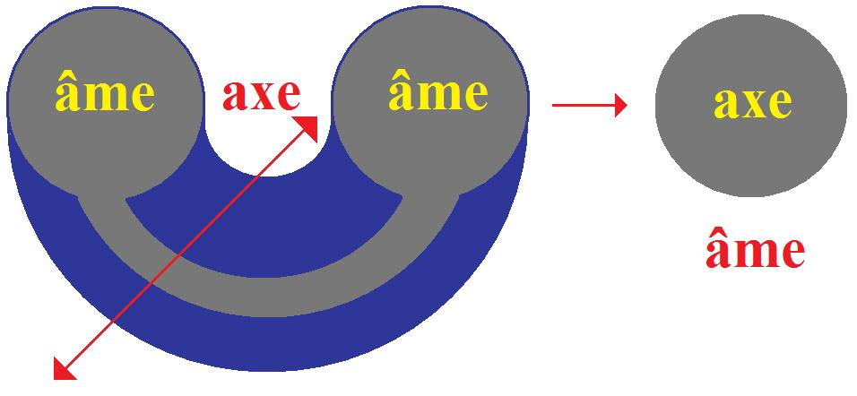

<!-- id: s25-08-0022 -->

Ιl me semble, quant à moi, que les deux cas sont homogènes.

<!-- id: s25-08-0023 -->

Néanmoins le fait que Soury distingue ce *retournement par coupure* du *retournement par trou*, m’impressionne.

<!-- id: s25-08-0024 -->

À savoir que je fais grande confiance à Soury.

<!-- id: s25-08-0025 -->

Autrement dit ce qui s’appelle ici un carrefour de bandes - on dit un carrefour de bandes - se réfère au tore troué.

<!-- id: s25-08-0026 -->

Ici aussi le retournement dont il s’agit est un retournement torique, c’est-à-dire du fait d’un trou.

<!-- id: s25-08-0027 -->

Je vais donner la parole maintenant à Soury qui se trouvera en posture de défendre sa position.

<!-- id: s25-08-0028 -->

Bien sûr, il y a quelque chose qui m’impressionne. C’est que le tore...

<!-- id: s25-08-0029 -->

> pour le dessiner comme ceci, c’est-à-dire en perspective ...le tore a pour propriété d’admettre un type de coupure qui est très exacte­ment celui-ci :

<!-- id: s25-08-0030 -->

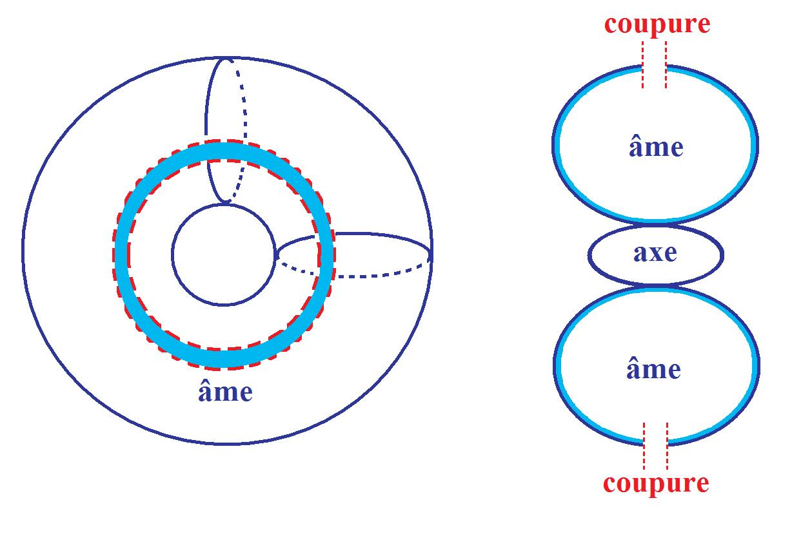

<!-- id: s25-08-0031 -->

Si à partir de cette coupure on retourne le tore, c’est-à-dire qu’on fait passer la coupure par derrière le tore, l’axe reste l’axe et l’âme reste l’âme :

<!-- id: s25-08-0032 -->

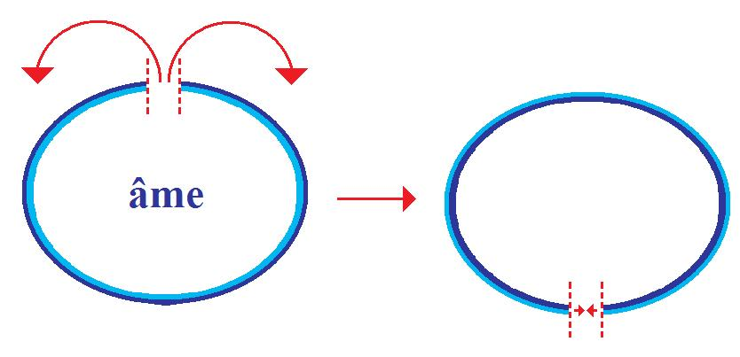

<!-- id: s25-08-0033 -->

Ιl y a retournement du tore, mais sans modifier ce qui se trou­ve distributivement l’axe et l’âme - ceci est l’axe.

<!-- id: s25-08-0034 -->

Est-ce que ceci suffit à permettre que le retournement par coupure opère autrement sur le tore ?

<!-- id: s25-08-0035 -->

C’est bien ce dont je pose la question.

<!-- id: s25-08-0036 -->

Et là-dessus, je vais donner la paro­le à Soury qui veut bien, dans mon embarras, prendre le relais de ce dont il s’agit.

<!-- id: s25-08-0037 -->

Prenez place ici...

<!-- id: s25-08-0038 -->

[Intervention de Pierre Soury](#Mars14)

<!-- id: s25-08-0039 -->

J’aurais besoin du tableau aussi, j’aurai besoin de dessiner.

<!-- id: s25-08-0040 -->

Ιl s’agirait de la différence entre *le trouage* et *la coupure* du tore.

<!-- id: s25-08-0041 -->

Et même il s’agit de la différence entre le *retournement*, le *trouage* et la *cou­pure*.

<!-- id: s25-08-0042 -->

Alors je vais essayer de présenter la différence entre *cou­pure* et *trouage* du tore…

<!-- id: s25-08-0043 -->

> enfin d’abord en ne m’occupant pas que ça peut servir à faire du *retournement* …simplement que *couper le tore* et *trouer le tore*, com­ment c’est différent.

<!-- id: s25-08-0044 -->

Je dessine un tore. J’ai besoin de craies de couleur. Voilà. Alors, voici le tore.

<!-- id: s25-08-0045 -->

Sur le tore… des cercles peuvent être sur le tore. Ιl y a des *cercles réductibles*…

<!-- id: s25-08-0046 -->

> des *cercles réductibles* c’est des cercles qui par déformation peuvent être réduits …et il y a des *cercles non-réductibles*, alors comme *cercle non-réduc­tible* :

<!-- id: s25-08-0047 -->

- il y a le cercle *méridien*,

<!-- id: s25-08-0048 -->

- il y a le cercle *longitude,*

<!-- id: s25-08-0049 -->

- et il y a d’autres cercles. Voilà :

<!-- id: s25-08-0050 -->

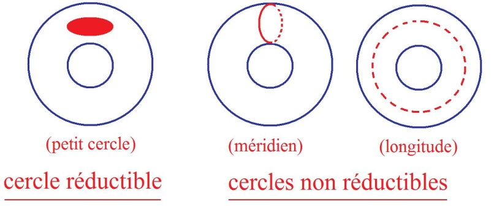

<!-- id: s25-08-0051 -->

J’ai dessiné un cercle sur le tore qui n’est ni le cercle *méridien*, ni le cercle *longitude* :

<!-- id: s25-08-0052 -->

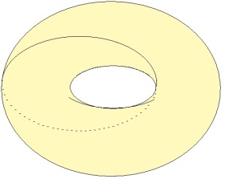

<!-- id: s25-08-0053 -->

Alors lorsqu’il y a un cercle sur le tore, c’est possible de couper le long de ce cercle et le résultat... Bon alors :

<!-- id: s25-08-0054 -->

- *le trouage* c’est ce cas-là, c’est couper le long d’un cercle réductible.

<!-- id: s25-08-0055 -->

- *et la coupure* c’est couper le long d’un cercle non réductible.

<!-- id: s25-08-0056 -->

Si on coupe le long d’un petit cercle, un cercle réductible, un petit cercle, qu’est-ce qui reste ?

<!-- id: s25-08-0057 -->

Ιl reste d’une part *un petit disque*, le petit disque.

<!-- id: s25-08-0058 -->

Et d’autre part il reste *une surface à bord*, une surface avec bord que je dessine :

<!-- id: s25-08-0059 -->

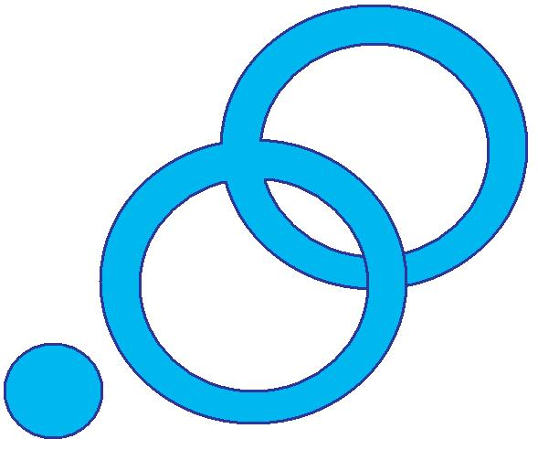

<!-- id: s25-08-0060 -->

Voilà. Alors ce dessin-là représente une *sur­face avec bord*. Voilà le résultat du *trouage*.

<!-- id: s25-08-0061 -->

Dire *trouage*, c’est ne pas s’in­téresser au *petit disque* qui reste et dire que le tore troué c’est ça.

<!-- id: s25-08-0062 -->

Le tore troué, c’est une *surface avec bord* qui est dessinée ici.

<!-- id: s25-08-0063 -->

Si le tore est coupé le long d’un cercle *non-réductible*, alors c’est ça la coupure, alors qu’est-ce qui reste ?

<!-- id: s25-08-0064 -->

D’abord il ne reste qu’un seul mor­ceau. Je vais dire ce qui reste : il reste une bande *plus ou moins nouée* et *plus ou moins tordue*.

<!-- id: s25-08-0065 -->

Alors je vais dessiner *ce qui reste par une coupu­re méridienne. Par une coupu­re méridienne, il reste une bande qui n’est ni nouée, ni tordue* :

<!-- id: s25-08-0066 -->

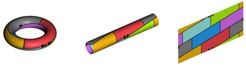

<!-- id: s25-08-0067 -->

Par une coupure longitudi­nale aussi, il reste la même chose : une bande qui n’est ni nouée, ni tor­due.

<!-- id: s25-08-0068 -->

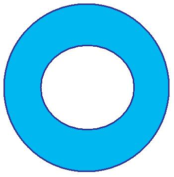

<!-- id: s25-08-0069 -->

Et ça aussi ce sont des surfaces avec bord. Mais il y a quand même une différence, c’est que :

<!-- id: s25-08-0070 -->

- là c’était une surface avec *un seul bord,*

<!-- id: s25-08-0071 -->

<!-- id: s25-08-0072 -->

- et ici ce sont des surfaces avec *deux bords*.

<!-- id: s25-08-0073 -->

<!-- id: s25-08-0074 -->

Si la coupure est faite le long d’un cercle pas si simple...

<!-- id: s25-08-0075 -->

> pas si simple que le *cercle méridien* ou que le *cercle longitude* ...alors ce qui reste c’est une bande. Ιl reste encore une bande, mais qui est plus ou moins *nouée,* plus ou moins *tordue*.

<!-- id: s25-08-0076 -->

Alors par exemple, enfin pour un certain cercle, on obtient une bande qui est nouée en trèfle et qui est tordue :

<!-- id: s25-08-0077 -->

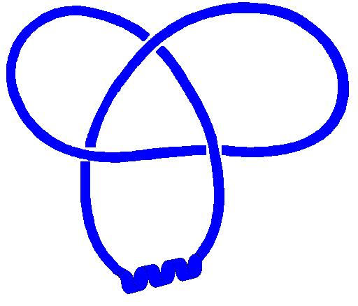

<!-- id: s25-08-0078 -->

Alors la torsion... je ne me rappelle pas la tor­sion correspondante - donc je dessine, j’ai toutes chances de faire une erreur là, c’est-à-dire que ce n’est pas n’importe quelle torsion, mais je ne me rappelle plus quelle torsion il y a.

<!-- id: s25-08-0079 -->

Bon, bref c’est une bande qui est nouée et tordue et on peut séparer sa partie nouée et sa partie tordue.

<!-- id: s25-08-0080 -->

C’est-à-dire que le nouage de cette bande peut être représenté par un nœud :

<!-- id: s25-08-0081 -->

- bon ici le nœud de trèfle :

<!-- id: s25-08-0082 -->

> 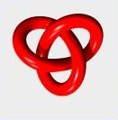

<!-- id: s25-08-0083 -->

- et la torsion peut être comptabilisée, c’est un certain nombre de tours :

<!-- id: s25-08-0084 -->

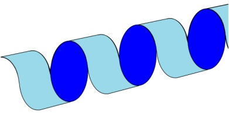

<!-- id: s25-08-0085 -->

Dans le cas du trèfle, il y a une torsion de - je crois - trois tours, il y a 3 tours de torsion… enfin, si c’est pas trois, c’est six, je peux me tromper. Donc là je n’ai pas indiqué ces choses-là pour bien montrer qu’il s’agit de bandes.

<!-- id: s25-08-0086 -->

Donc le tore coupé, c’est une bande plus ou moins nouée, plus ou moins tordue, donc ça donne certains nœuds, pas tous les nœuds, et ça donne une cer­taine torsion.

<!-- id: s25-08-0087 -->

Ιl y a certains cercles sur le tore que Monsieur Lacan a men­tionné.

<!-- id: s25-08-0088 -->

C’est des cercles qu’il avait mis en correspondance avec *Désir* et *Demande*. Voilà ! Ces cercles, on peut les repérer par :

<!-- id: s25-08-0089 -->

- combien de fois ils tournent autour de l’âme,

<!-- id: s25-08-0090 -->

- et combien de fois il tournent autour de l’axe.

<!-- id: s25-08-0091 -->

Ces cercles il y en a beaucoup, mais ils peuvent être repérés et ce repérage peut être justifié. Bref !

<!-- id: s25-08-0092 -->

Les cercles qu’avaient présenté Monsieur Lacan, c’est des cercles qui tournaient :

<!-- id: s25-08-0093 -->

- une fois seulement, soit *autour de l’axe* soit *autour de l’âme*

<!-- id: s25-08-0094 -->

- et puis plusieurs fois… \[soit autour de l’âme soit autour de l’axe\]

<!-- id: s25-08-0095 -->

Là j’en dessine un qui tourne une seule fois autour de l’axe et plusieurs fois autour de l’âme :

<!-- id: s25-08-0096 -->

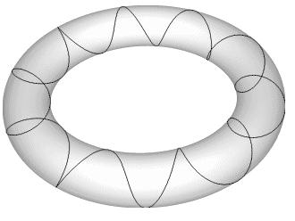

<!-- id: s25-08-0097 -->

Là j’en ai dessiné un qui tourne *une fois* autour de l’axe et *cinq fois* autour de l’âme.

<!-- id: s25-08-0098 -->

Alors si le tore est coupé selon un cercle comme ça, le résultat est une bande qui est tordue, mais qui n’est pas nouée, c’est-à-dire que le résultat, le tore coupé le long d’un cercle comme ça, pour celui-là un cinq, il va y avoir 5 tours et pas de nouage, 5 tours de torsion et pas de nouage, alors...

<!-- id: s25-08-0099 -->

> je suis en train de me tromper, c’est-à-dire je suis en train de confondre les tours et les demi-tours,
>
> je n’en ai pas dessiné assez. Voilà. Bon ! ...alors ce que j’ai dessiné là, c’est une bande qui est tordue et qui n’est pas nouée :

<!-- id: s25-08-0100 -->

<!-- id: s25-08-0101 -->

Donc les cercles qu’a mentionnés Monsieur LACAN parmi tous les cercles sur le tore, ça a été le cercle méridien et le cercle lon­gitude qui donnent une bande ni nouée, ni tordue et puis ces cercles-là correspondant à désir-demande, qui donnent une bande qui est tordue et pas nouée. Pour le moment déjà, ça fait une différence entre trouage et coupure.

<!-- id: s25-08-0102 -->

Alors voici ici le résultat du *trouage*...

<!-- id: s25-08-0103 -->

> il n’y a qu’une façon de *trouer*, alors que des façons de *couper*, il y en a autant qu’il y a de *cercles* sur le *tore* ...alors voilà *le résultat du trouage*, voilà *le résultat de la coupure*.

<!-- id: s25-08-0104 -->

- *Ici le résultat du trouage, c’est une surface avec bord qui n’a qu’un seul bord*.

<!-- id: s25-08-0105 -->

- *Le résultat de la coupure, ce sont des surfaces à deux bords*, mais c’est une surface spécialement simple, puisque c’est une bande.

<!-- id: s25-08-0106 -->

Ça, c’est déjà une façon de montrer la différence entre *trouage et coupure*, c’est que *le tore troué et le tore coupé*, ce n’est pas la même chose.

<!-- id: s25-08-0107 -->

Maintenant par rapport au retournement.

<!-- id: s25-08-0108 -->

Je vais m’engager dans : dire les différences entre trouage et coupure par rapport au retournement.

<!-- id: s25-08-0109 -->

D’abord quelque chose, c’est que *couper* le long d’un cercle... disons :

<!-- id: s25-08-0110 -->

- dans la coupure le trouage est implicite,

<!-- id: s25-08-0111 -->

- c’est-à-dire que dans « *couper* » *le trouage est implicite*,

<!-- id: s25-08-0112 -->

- c’est-à-dire dans la cou­pure il y a beaucoup plus que d’enlever seulement un petit trou.

<!-- id: s25-08-0113 -->

La cou­pure peut être présentée comme quelque chose *d’en plus* par rapport au trouage.

<!-- id: s25-08-0114 -->

C’est-à-dire qu’on peut faire un trouage d’abord, et à partir de ce trouage, couper.

<!-- id: s25-08-0115 -->

La coupure donc peut être décomposée en deux temps d’abord trouer et ensuite couper à partir du trouage.

<!-- id: s25-08-0116 -->

Et donc ça peut être fait ici, c’est-à-dire que ça, c’est le tore troué, bon, eh bien, la coupure peut être obtenue...

<!-- id: s25-08-0117 -->

> enfin si c’est considéré comme deux étapes, 1ère étape : *trouer*, 2ème étape : *couper* à partir du tore *troué* ...la coupure peut être montrée là-dessus, c’est-à-dire sur le tore troué.

<!-- id: s25-08-0118 -->

Alors je vais montrer, je vais indiquer, sans le dessiner, les coupures les plus simples. Mettons une coupure méridienne...

<!-- id: s25-08-0119 -->

> dans le tore troué, la distinction méridien-longi­tude s’est perdue ...mettons enfin une coupure méridienne, ça peut être par exemple de couper ici \[1\].

<!-- id: s25-08-0120 -->

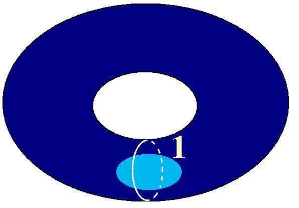

<!-- id: s25-08-0121 -->

Bon je vais le dessiner quand même. Voilà, mettons ça, c’est une coupure méridienne.

<!-- id: s25-08-0122 -->

Alors là-dessus, on peut voir qu’il reste une bande, c’est-à-dire qu’une fois coupé ici \[1\], la coupure ici laisse ça :

<!-- id: s25-08-0123 -->

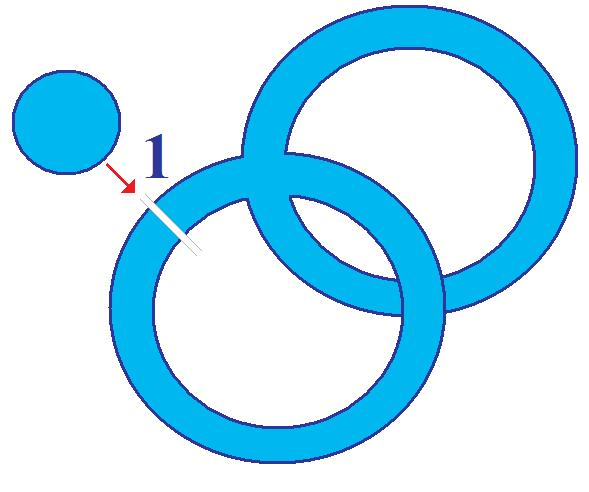

<!-- id: s25-08-0124 -->

Alors on peut éventuellement imaginer les déformations là-des­sus, comme quoi ceci peut se résorber et ceci peut se résorber et ce qui reste c’est bien une bande :

<!-- id: s25-08-0125 -->

<!-- id: s25-08-0126 -->

Donc on peut retrouver à par­tir du tore troué que la coupure méridienne laisse une bande.

<!-- id: s25-08-0127 -->

De même si ça avait été une coupure longitudinale, la coupure longitudinale aurait aussi laissé une bande.

<!-- id: s25-08-0128 -->

Je vais effacer cette coupure que j’ai faite là, pour dessiner une coupure moins simple, une coupure selon un cercle qui n’est pas au plus simple. Alors je vais faire la coupure, je vais dessiner une certaine coupure. Je des­sine d’abord.

<!-- id: s25-08-0129 -->

J’ai peur de me tromper quand même. Alors j’ai fait une coupure qui repart du bord du trou, enfin j’ai fait une coupure qui s’en­clenche à partir du bord du trou du trouage, alors je l’ai enclenchée ici :

<!-- id: s25-08-0130 -->

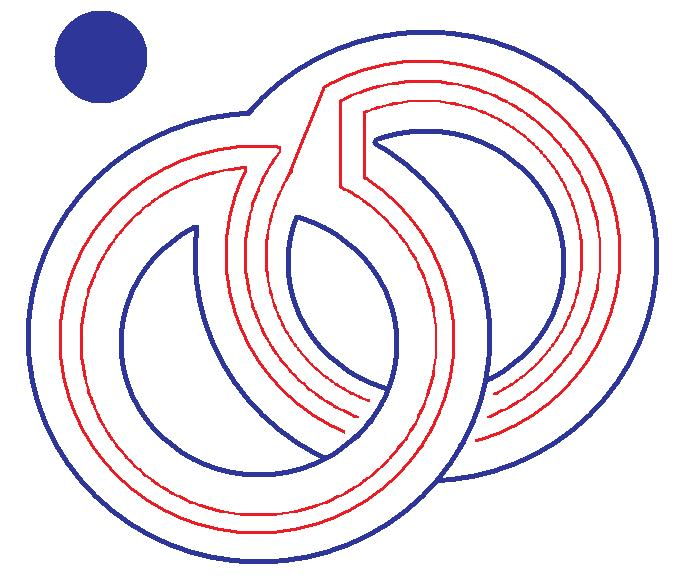

<!-- id: s25-08-0131 -->

Voilà, un cercle. C’est un cercle qui fait deux tours autour de l’axe, enfin deux tours et trois tours puisque, une fois le tore troué, la distinction de l’intérieur et de l’extérieur est perdue et la distinction de l’âme et de l’axe est perdue.

<!-- id: s25-08-0132 -->

Perdue ? Pas tout à fait perdue, je vais y arri­ver, mais on ne peut plus distinguer méridien et longitude.

<!-- id: s25-08-0133 -->

Alors j’ai dessiné une coupure du tore troué. Et à partir de ce dessin, avec de la patience, c’est possible de restituer la bande nouée et tordue qui sera obte­nue. En dessinant sur le tore troué, par des procédés de dessin, on peut arriver à savoir le résultat de la coupure. C’est-à-dire qu’ici, j’ai choisi un cercle qui tourne deux fois d’une part et trois fois d’autre part, parce que le résultat de cette coupure-là, ce sera un nouage en trèfle.

<!-- id: s25-08-0134 -->

Ça, c’est une coupure qui n’est pas la plus simple et le résultat est une bande qui est nouée et qui est tordue.

<!-- id: s25-08-0135 -->

Donc dans la coupure, le trouage est implicite. On peut le dire autre­ment c’est *que couper le tore c’est faire beaucoup plus que trouer*.

<!-- id: s25-08-0136 -->

C’est-à-dire que l’espace du trouage qui est créé, il est largement créé, à l’occa­sion d’une coupure. Donc tout ce qui peut se faire par trouage peut se faire par coupure. En particulier le retournement qui peut se faire par trouage peut se faire par coupure.

<!-- id: s25-08-0137 -->

Mais par coupure, il y a des retournements, il y a d’autres retourne­ments qui sont possibles.

<!-- id: s25-08-0138 -->

Ιl y a certains retournements qui ne sont pas possibles par trouage et qui sont possibles par coupure.

<!-- id: s25-08-0139 -->

Alors je vais dire la différence entre les retournements permis par coupure et permis par trouage.

<!-- id: s25-08-0140 -->

Je vais effacer la partie droite. Pour pouvoir distinguer ça, il y a besoin de *différenciation*, c’est-à-dire, j’ai besoin de différencier *l’âme* et *l’axe* par des couleurs. Alors je vais utiliser bleu et rouge pour l’âme et l’axe.

<!-- id: s25-08-0141 -->

Et j’ai besoin encore de différenciation : c’est de différencier les deux faces du tore.

<!-- id: s25-08-0142 -->

Le tore est une surface sans bords, c’est une surface qui a deux faces et j’ai besoin de cette différenciation-là.

<!-- id: s25-08-0143 -->

Bon alors ici, le tore on ne lui voit qu’une seule de ses faces, je vais utiliser vert et jaune pour les deux faces.

<!-- id: s25-08-0144 -->

Et ici on voit qu’une seule face. Pour le tore, on ne lui voit bien qu’une seule face, on ne voit pas la face intérieure jaune.

<!-- id: s25-08-0145 -->

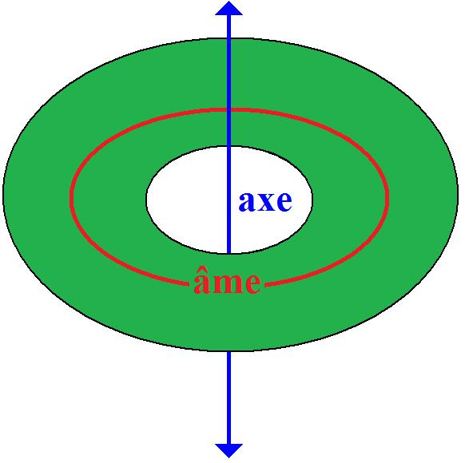

<!-- id: s25-08-0146 -->

Donc c’est vert et jaune, les deux faces du tore. Et *il y a une corres­pondance* entre le couple âme-axe, et le couple des deux faces.

<!-- id: s25-08-0147 -->

Il y a une correspondance, c’est-à-dire que :

<!-- id: s25-08-0148 -->

- la face verte, qui est ici la face extérieu­re, est en correspondance avec l’axe,

<!-- id: s25-08-0149 -->

- et la face jaune, face intérieure, est en correspondance avec l’âme .

<!-- id: s25-08-0150 -->

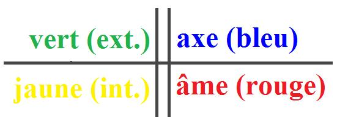

<!-- id: s25-08-0151 -->

J’ai introduit deux couples, mais ces deux couples sont actuellement - parce que c’est ça qui va se perdre – actuellement c’est le couple des deux faces et le couple intérieur-extérieur liés.

<!-- id: s25-08-0152 -->

Alors la différence entre coupu­re et trouage, retournement par coupure, retournement par trouage...

<!-- id: s25-08-0153 -->

enfin... *la* différence, *<u>une</u>* différence ...c’est que *le retournement par troua­ge* ne touche pas, ne change pas cette liaison des deux faces avec l’in­térieur-extérieur.

<!-- id: s25-08-0154 -->

Alors que *le retournement par coupure* dissocie cette liaison. Alors *le retournement par troua­ge*, qu’est-ce qu’il en reste ?

<!-- id: s25-08-0155 -->

Dans cette présentation-là du tore troué, on ne lui voit qu’une seule face - je prends toujours la face verte - cette surface est colorée maintenant, ces deux faces sont colorées, elle a une face jaune et une face verte.

<!-- id: s25-08-0156 -->

Et dans cette présen­tation plane il n’y a que la face verte qui est visible, la face jaune apparaî­trait par retournement du plan...

<!-- id: s25-08-0157 -->

Attention là, je parle de plu­sieurs retournements à la fois en ce moment, c’est dangereux.

<!-- id: s25-08-0158 -->

Je viens de mélanger retournement du plan et retournement du tore.

<!-- id: s25-08-0159 -->

Alors voilà le tore troué. Dans l’état du tore troué, *âme et axe*, je peux les représenter comme *deux axes*.

<!-- id: s25-08-0160 -->

Alors, je vais situer *l’âme* et *l’axe* par rapport au tore troué. J’ai une chance sur deux de me tromper. \[Rires\]

<!-- id: s25-08-0161 -->

La face verte correspond avec l’axe bleu. Je place là l’axe, c’est une droite. Ça c’est l’axe bleu, et maintenant l’axe rouge.

<!-- id: s25-08-0162 -->

Alors pourquoi je dessine deux axes ? Ιl y a des raisons, je vais dire la raison de dessiner deux axes pour le tore troué.

<!-- id: s25-08-0163 -->

Alors du tore d’origine, je ne conserve que *son âme* et *son* *axe*, qui sont représentés ici. Le tore une fois retourné, aura *comme âme* et *comme axe* ceci. Donc le retourne­ment du tore, c’est l’échange de l’âme et de l’axe, c’est le passage de ça à ça :

<!-- id: s25-08-0164 -->

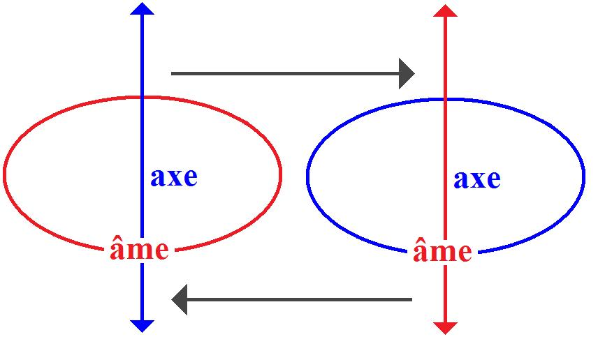

<!-- id: s25-08-0165 -->

Eh bien, le tore troué, c’est un état à deux axes. Je ne fais que l’affirmer. Je vais le redessiner.

<!-- id: s25-08-0166 -->

Finalement, je ne fais que redessiner ce qu’il y a là-bas, mais je le redessine là dans sa position de charnière, d’intermédiai­re. Voilà *le tore troué*, surface avec deux axes :

<!-- id: s25-08-0167 -->

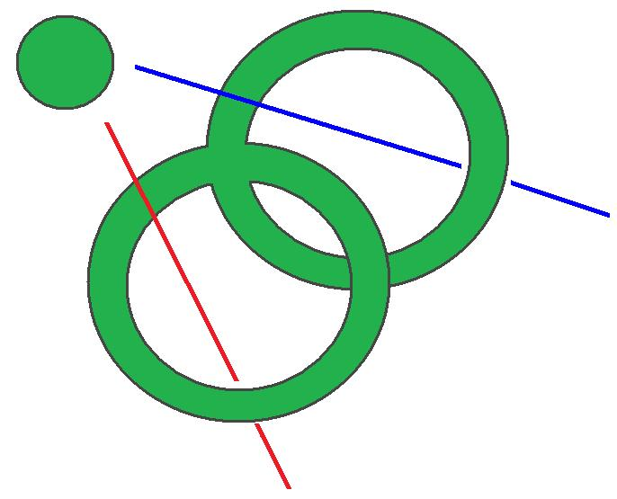

<!-- id: s25-08-0168 -->

Et j’en mentionne une autre version, c’est que si on ne garde de ça que le cercle bord - c’est-à-dire qu’on ne garde que le bord - ce qu’il en reste de ça, c’est…je vais le dessiner toujours au milieu : voilà - ceci, c’est conser­ver les deux axes du tore qui sont ici en bleu et rouge et le cercle en bord du trou :

<!-- id: s25-08-0169 -->

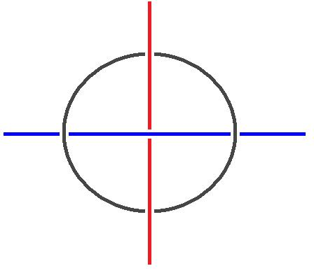

<!-- id: s25-08-0170 -->

Ici, c’était conserver la surface avec bord :

<!-- id: s25-08-0171 -->

<!-- id: s25-08-0172 -->

Et ici, c’est conserver seu­lement le bord :

<!-- id: s25-08-0173 -->

<!-- id: s25-08-0174 -->

Alors ce qui est au milieu là fait charnière dans l’opéra­tion du retournement, d’échange de l’âme et de l’axe.

<!-- id: s25-08-0175 -->

Alors, je mentionne cette figure-là, parce qu’il y a une configuration borroméenne, c’est-à­-dire qu’intérieur et extérieur et bord du trou, forment une configuration borroméenne.

<!-- id: s25-08-0176 -->

Finalement je n’ai fait qu’affirmer que dans cet état inter­médiaire, *l’âme* et *l’axe* tous les deux pouvaient… Au moment de cet état intermédiaire qui est l’état d’indétermination, charnière entre intérieur et extérieur…

<!-- id: s25-08-0177 -->

> c’est-à-dire qu’ici, intérieur et extérieur se *différencient*
>
> et ici intérieur et extérieur ne *se différencient pas* : ici le couple *intérieur-exté­rieur* est à l’état de vacillation …dans l’état du *tore troué*, la *distinction inté­rieur-extérieur* est perdue. Alors ça c’était au sujet du tore troué.

<!-- id: s25-08-0178 -->

Alors maintenant j’efface ce schéma-là, *le schéma de correspondance* …encore que *je risque d’en avoir besoin du schéma de correspondance* de départ entre le couple des deux faces et le couple intérieur-extérieur. Alors il y a « *vert* » qui correspond à « *bleu* » et puis « *jaune* » qui correspond à « *rouge* ».

<!-- id: s25-08-0179 -->

Alors quand le tore est coupé, il va… Mais ça, de mémoire je ne sais pas comment sont disposés… Donc je vais le dessiner. Éventuellement je me trompe, mais ça ne me gênera pas pour ce dont j’ai besoin.

<!-- id: s25-08-0180 -->

Je vais dessiner un tore coupé, je vais le dessiner comme une *bande nouée et tordue*. Ici je suis en train de redessiner une *bande nouée et tordue*, obtenue par coupure du tore.

<!-- id: s25-08-0181 -->

Voilà. Alors pour indiquer que c’est une bande, je mets ces petits traits, mais je ne vais pas mettre des petits traits partout.

<!-- id: s25-08-0182 -->

Voilà, ça c’est le dessin d’une bande nouée et tordue obtenue par coupure du tore.

<!-- id: s25-08-0183 -->

Alors j’arrête de dessiner les petits traits. L’âme et l’axe maintenant sont ici, ce qui était anciennement l’âme et l’axe, maintenant ce sont deux axes. Alors voilà les deux axes : intérieur et extérieur, et maintenant le couple des deux faces.

<!-- id: s25-08-0184 -->

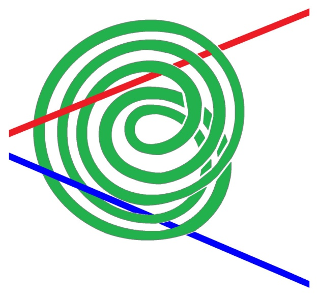

<!-- id: s25-08-0185 -->

Alors cette bande, telle qu’elle est dessinée, encore une fois, on lui voit qu’une face…

<!-- id: s25-08-0186 -->

> ce n’est pas *par hasard*, c’est-à-dire que je privilégie systé­matiquement les dessins où on ne voit qu’une face …donc, voilà la bande nouée et tordue avec une face jaune et une face verte. Et ici on ne lui voit que sa face verte. Voilà.

<!-- id: s25-08-0187 -->

Alors je vais quand même dessiner les deux faces, pour faire voir les deux faces dans un autre cas.

<!-- id: s25-08-0188 -->

C’est que, ici j’avais dessiné antérieurement une bande qui n’était pas nouée et qui était tordue. Alors là on voit les deux faces.

<!-- id: s25-08-0189 -->

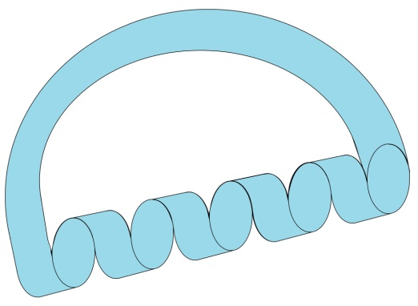

<!-- id: s25-08-0190 -->

C’est-à-dire qu’à l’occasion de *la torsion* on voit *l’autre face*, c’est-à-dire que dans cette partie-là, on voit du jaune, il y a du jaune et du vert. Enfin, ça c’est pour montrer que dans un dessin de surface avec bord, les deux faces peuvent apparaître. C’est le hasard de certains dessins qui font qu’on voit toujours la même face.

<!-- id: s25-08-0191 -->

Alors ici donc, voilà les deux axes anciennement intérieur et extérieur, et le tore coupé, cette bande. Eh bien, je ne sais pas si c’est imaginable que là-dedans le couple du jaune et du vert est devenu indépendant du couple du bleu et du rouge.

<!-- id: s25-08-0192 -->

C’est-à-dire que cette bande… tout ceci ce n’est qu’une bande, mettons, on peut lui donner un demi-tour tout le long et ça sera toujours le même objet et la face jaune joue le même rôle que la face verte.

<!-- id: s25-08-0193 -->

Alors dans cette situation-là *du tore coupé* avec ses deux axes, le couple des deux faces : verte et jaune, et le couple intérieur-extérieur : bleu et rouge, sont devenus indépendants. Ce qui indique quelque chose sur la différen­ce des deux retournements.

<!-- id: s25-08-0194 -->

Dans *le retournement par trouage*, on échange l’intérieur et l’extérieur, on échange les deux faces et ils s’échangent ensemble. C’est-à-dire qu’au moment où ça échange le couple intérieur-extérieur, ça échange les deux faces.

<!-- id: s25-08-0195 -->

C’est-à-dire, si ce tore coloré en jaune et vert, quand on le retourne, s’il était d’extérieur vert, après il sera d’extérieur jaune.

<!-- id: s25-08-0196 -->

Dans *le retourne­ment par trouage*, on inverse simultanément les deux faces et l’inté­rieur-extérieur.

<!-- id: s25-08-0197 -->

Au contraire *le retournement par coupure* permet de dissocier cette liaison.

<!-- id: s25-08-0198 -->

C’est-à-dire que, une fois le tore coupé, on peut le refermer de, non pas de… Je vais le dire autrement.

<!-- id: s25-08-0199 -->

Au lieu de voir le tore troué ou le tore coupé comme un intermédiaire, je vais le décrire différemment.

<!-- id: s25-08-0200 -->

Le *tore troué* peut être refermé de *deux façons différentes*.

<!-- id: s25-08-0201 -->

Mais le *tore coupé* lui, peut être refermé de *quatre façons différentes*. Enfin, j’hésite entre deux façons de formuler :

<!-- id: s25-08-0202 -->

- une façon où le tore troué ou le tore coupé apparaît comme un intermédiaire entre deux états du tore,

<!-- id: s25-08-0203 -->

- et une autre façon de parler où les deux états du tore sont décrits comme *deux façons de fermer cette surface avec bord*.

<!-- id: s25-08-0204 -->

Alors une fois le tore coupé, il est pos­sible de le refermer de multiples façons. C’est-à-dire qu’il est possible de le refermer comme il était à l’origine, c’est-à-dire avec l’axe extérieur bleu et la face extérieure verte.

<!-- id: s25-08-0205 -->

Mais il est possible de le refermer n’importe comment : il est possible de le refermer avec l’axe extérieur rouge et avec la face extérieure verte ou jaune. C’est-à-dire qu’il y a quatre façons de refermer ce tore coupé, en combinant de toutes les façons possibles pour fixer le couple bleu-rouge en intérieur-extérieur - en âme et en axe - et pour fixer le couple vert-jaune en face intérieure et face extérieure.

<!-- id: s25-08-0206 -->

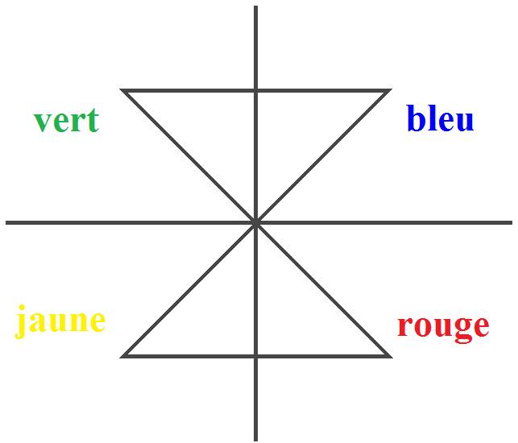

<!-- id: s25-08-0207 -->

C’est des histoires de couples \[Rires\], de binaires. Je trouve assez difficile de présenter des considérations d’exactitude.

<!-- id: s25-08-0208 -->

Là je me suis embarqué dans… Enfin c’était trouage et coupure.

<!-- id: s25-08-0209 -->

Enfin ces histoires de couples ou de binaires sont toujours liées à des histoires d’exactitude.

<!-- id: s25-08-0210 -->

Lacan - Le vert peut s’associer au bleu et au rouge.

<!-- id: s25-08-0211 -->

Pierre Soury - Oui, oui.

<!-- id: s25-08-0212 -->

Lacan - Et d’un autre côté, le jaune peut s’associer aussi au bleu et au rouge.

<!-- id: s25-08-0213 -->

Pierre Soury - Oui, oui

<!-- id: s25-08-0214 -->

Χ - Mais est-ce que ce que tu dis est vrai aussi pour une coupure simple, comme *la coupure méridienne* ou *la longitudinale* ?

<!-- id: s25-08-0215 -->

Pierre Soury - Oui, oui.

<!-- id: s25-08-0216 -->

Y - C’est-à-dire la séparation entre vert et jaune et l’axe et l’âme, est également vraie pour une simple coupure.

<!-- id: s25-08-0217 -->

Pierre Soury - Tout à fait.

<!-- id: s25-08-0218 -->

Χ - Parce que là tu l’as montré pour une coupure complexe, mais tu aurais pu le montrer sur une coupure simple… Pierre Soury

<!-- id: s25-08-0219 -->

Oui, c’est vrai que c’est la même chose pour une coupure méridienne ou une coupure longitudinale. Ça produit la même chose que la coupure en général : c’est-à-dire la dissociation du couple des deux faces et du couple intérieur-extérieur.

<!-- id: s25-08-0220 -->

Χ - Est-ce que tu ne pourrais pas le montrer sur une coupure méri­dienne simple ?

<!-- id: s25-08-0221 -->

Pierre Soury - Si, si, oui, c’est bien… Lacan - Qui est-ce qui m’a envoyé ce papier ? C’est quelqu’un qui a assisté à ce que SOURY fait, de travaux pratiques.

<!-- id: s25-08-0222 -->

Χ - C’est moi.

<!-- id: s25-08-0223 -->

Lacan

<!-- id: s25-08-0224 -->

Qui est-ce ? C’est vous deux ? Écoutez, je suis tout à fait inté­ressé par cet objet Α et l’autre que vous désignez d’une étoile.

<!-- id: s25-08-0225 -->

Je veux dire l’objet Α et l’objet qui est désigné comme ça. Je suis intéressé et j’aime­rais beaucoup savoir ce que vous avez tiré de ce qu’a expliqué Soury aujourd’hui. Si vous veniez me le dire, j’en serais content.

<!-- id: s25-08-0226 -->

Χ - Là ce que montre Soury, c’est effectivement une erreur qu’il y avait dans le papier.

<!-- id: s25-08-0227 -->

Lacan - Comment ? Dans le papier, oui. Dans le papier que vous m’avez envoyé, oui.

<!-- id: s25-08-0228 -->

Χ - À savoir que ce n’était pas effectivement un retournement par trou, mais un retournement par coupure.

<!-- id: s25-08-0229 -->

Lacan

<!-- id: s25-08-0230 -->

C’est ça. Bon, je suis très content de le savoir parce que je m’étais cassé la tête sur cette erreur.

<!-- id: s25-08-0231 -->

Voilà, je crois que Soury a comblé nos vœux, et je continuerai la prochaine fois.
