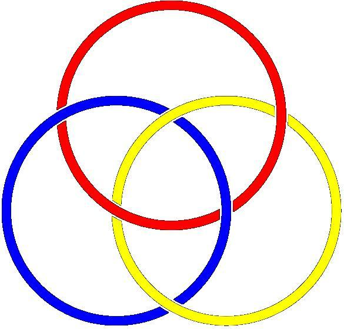
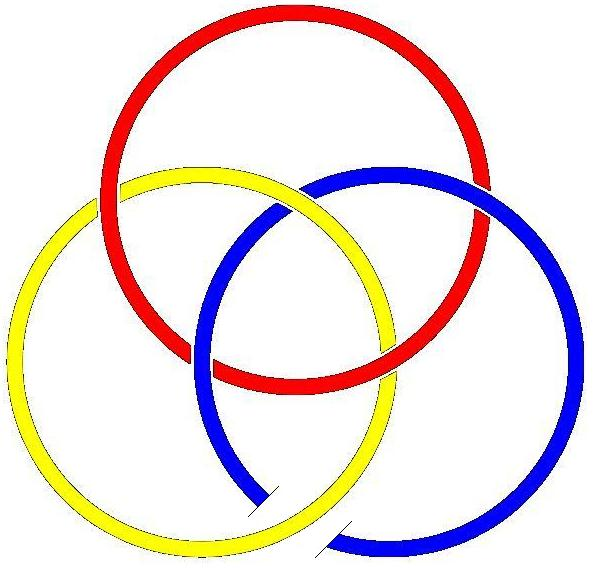

# Leçon 04 | 10 Janvier 1978

<!-- source-url: http://staferla.free.fr/S25/S25.docx -->
<!-- seminar: s25 -->
<!-- lesson: 04 -->

<!-- id: s25-04-0001 -->

J’ai été un peu surmené parce que samedi et dimanche il y a eu un congrès de mon École.

<!-- id: s25-04-0002 -->

Comme on préférait que - enfin Simatos préférait - qu’il n’y ait que les membres de cette École, on a été un peu loin et je n’en suis revenu que difficilement.

<!-- id: s25-04-0003 -->

Quelqu’un - c’est quelqu’un qui parle avec moi - quelqu’un en atten­dait...

<!-- id: s25-04-0004 -->

> vu le sujet qui n’était autre que ce que j’appelle « *la passe »* *...*quelqu’un en attendait quelques lumières sur la fin de la l’analyse.

<!-- id: s25-04-0005 -->

La fin de la l’analyse, on peut la définir.

<!-- id: s25-04-0006 -->

La fin de la l’analyse, c’est quand on a 2 fois tourné en rond, c’est-à-dire retrouvé ce dont on est prisonnier.

<!-- id: s25-04-0007 -->

Recommencer 2 fois le tournage en rond, c’est pas certain que ce soit nécessaire, il suffit qu’on voie ce dont on est captif.

<!-- id: s25-04-0008 -->

Et l’inconscient c’est ça, c’est la face de Réel*...*

<!-- id: s25-04-0009 -->

> peut-être que vous avez une idée - après m’avoir entendu de nombreuses fois -
>
> peut-être que vous avez une idée de ce que j’appelle le *Réel* *...*c’est la face de Réel de ce dont on est empêtré. Ιl y a quelqu’un qui s’appelle Soury et qui a bien voulu prêter attention à ce que j’énonce concernant les ronds de ficelle, et il m’a interrogé sur ce que ça signifie, sur ce que ça signifie qu’il ait pu *écrire* comme ça les ronds de ficelle.

<!-- id: s25-04-0010 -->

Car c’est comme ça qu’il les *écrit*.

<!-- id: s25-04-0011 -->

<!-- id: s25-04-0012 -->

L’analyse ne consiste pas à ce qu’on soit libéré de ses sinthomes...

<!-- id: s25-04-0013 -->

> puisque c’est comme ça que je l’écris, symptôme *...*l’analyse consiste à ce qu’on sache pourquoi on en est empêtré.

<!-- id: s25-04-0014 -->

Ça se produit du fait qu’il y a le Symbolique.

<!-- id: s25-04-0015 -->

Le Symbolique, c’est le langage : on apprend à parler et ça laisse des traces.

<!-- id: s25-04-0016 -->

Ça laisse des traces et de ce fait ça laisse des conséquences qui ne sont rien d’autre que le sinthome*,* et l’analyse consiste*...*

<!-- id: s25-04-0017 -->

> y’a quand même un progrès dans l’analyse *...*l’analyse consiste à se rendre comp­te de pourquoi on a ces sinthomes*,* de sorte que l’analyse est liée au savoir. *C’est très suspect.*

<!-- id: s25-04-0018 -->

C’est très suspect et ça prête à toutes les suggestions.

<!-- id: s25-04-0019 -->

C’est bien le mot qu’il faut éviter.

<!-- id: s25-04-0020 -->

*L’inconscient c’est ça*, c’est qu’on a appris à parler, et que de ce fait on s’est laissé par le langage suggérer toutes sortes de choses.

<!-- id: s25-04-0021 -->

Ce que j’essaie, c’est d’élucider quelque chose sur ce que c’est vraiment que l’analyse.

<!-- id: s25-04-0022 -->

On ne peut le savoir que si on me demande - à moi - une analyse. C’est la façon dont, l’analyse, je la conçois.

<!-- id: s25-04-0023 -->

C’est bien pour ça que j’ai tracé une fois pour toutes *ces ronds de ficel­le* que, bien entendu, je rate sans cesse dans leur figuration.

<!-- id: s25-04-0024 -->

Je veux dire qu’ici :

<!-- id: s25-04-0025 -->

>  vous le voyez bien, j’ai dû faire ici une coupure et que cette coupure, je l’avais pourtant préparée, il n’en reste pas moins qu’il a fallu que je la refasse.

<!-- id: s25-04-0026 -->

Compter, c’est difficile et je vais vous dire pourquoi : c’est qu’il est impossible de compter sans deux espèces de chiffres.

<!-- id: s25-04-0027 -->

Tout part du 0, et chacun sait que le 0 est tout à fait capital.

<!-- id: s25-04-0028 -->

> 1\* 2 3 4 5 6 7 8 9
>
> 0 1 2 3 4 5 6 7 8 9

<!-- id: s25-04-0029 -->

Le résultat, c’est que, ici \[0\] c’est 1.

<!-- id: s25-04-0030 -->

Voilà en quoi ça commence au 1, en quoi le 1 qui est ici \[1\*\] et le 1 qui est là \[0\] se distinguent.

<!-- id: s25-04-0031 -->

Et bien entendu, ce n’est pas la même espèce de chiffre qui fonctionne pour ici marquer le 1 qui permet 16.

<!-- id: s25-04-0032 -->

La mathématique fait référence à l’*écrit*, à l’*écrit* comme tel.

<!-- id: s25-04-0033 -->

Et la pen­sée mathématique, c’est le fait qu’on peut se représenter un écrit.

<!-- id: s25-04-0034 -->

Quel est le lien, sinon le lieu, de la représentation de l’écrit ?

<!-- id: s25-04-0035 -->

Nous avons la suggestion que le Réel ne cesse pas de s’écrire.

<!-- id: s25-04-0036 -->

C’est bien par l’écriture que se produit le forçage.

<!-- id: s25-04-0037 -->

Ça s’écrit, tout de même le *Réel*.

<!-- id: s25-04-0038 -->

Car il faut le dire : comment le *Réel* appa­raîtrait-il s’il ne s’écrivait pas ?

<!-- id: s25-04-0039 -->

C’est bien en quoi le *Réel* est là, il est là par ma façon de l’écrire : l’écriture est un artifice.

<!-- id: s25-04-0040 -->

Le *Réel* n’apparaît donc que par un artifice, un artifice lié au fait qu’il y a de la parole et même du *dire*.

<!-- id: s25-04-0041 -->

Et le *dire* concer­ne ce qu’on appelle *la vérité*. C’est bien pourquoi je dis que *la vérité* on ne peut pas la *dire*.

<!-- id: s25-04-0042 -->

Dans cette histoire de *la passe,* je suis conduit...

<!-- id: s25-04-0043 -->

> puisque *la passe* c’est moi qui l’ai - comme on dit - *produite*, produite dans mon École ...dans l’es­poir de savoir ce qui pouvait bien surgir dans ce qu’on appelle l’esprit, l’esprit d’un analysant pour se constituer, je veux dire recevoir des gens qui viennent lui demander une analyse.

<!-- id: s25-04-0044 -->

Ça pourrait peut-être se faire par écrit.

<!-- id: s25-04-0045 -->

Je l’ai suggéré à quelqu’un, qui d’ailleurs était plus que d’accord.

<!-- id: s25-04-0046 -->

*Passer* par *écrit*, ça a une chance d’être un peu plus près de ce qu’on peut atteindre du *Réel* que ce qui se fait actuellement, puisque j’ai tenté de suggérer à mon École que des passeurs pouvaient être nommés par quelques-uns.

<!-- id: s25-04-0047 -->

L’ennuyeux c’est que ces écrits on ne les lira pas.

<!-- id: s25-04-0048 -->

Au nom de quoi ? Au nom de ceci que de *l’écrit* on en a trop lu.

<!-- id: s25-04-0049 -->

Alors quelle chance y a-t-­il qu’on le lise ?

<!-- id: s25-04-0050 -->

C’est là couché sur le papier, mais le papier c’est aussi le papier hygiénique.

<!-- id: s25-04-0051 -->

Les chinois se sont aperçus de ça, qu’il y a du papier dit hygiénique, le papier avec lequel on se torche le cul.

<!-- id: s25-04-0052 -->

Impossible donc de savoir qui lit.

<!-- id: s25-04-0053 -->

Il y a sûrement de l’écriture dans l’inconscient, ne serait-ce que parce que *le rêve*, principe de l’inconscient \- ça, c’est ce que dit Freud - *le lapsus* et même *le trait d’esprit* se définissent par le *lisible *:

<!-- id: s25-04-0054 -->

- un *rêve*, on le fait, on ne sait pas pourquoi et puis après coup, ça se lit,

<!-- id: s25-04-0055 -->

- un *lapsus* de même,

<!-- id: s25-04-0056 -->

- et tout ce que dit Freud du *trait d’esprit* est bien comme étant lié à cette économie qu’est l’*écriture*, économie par rapport à la parole.

<!-- id: s25-04-0057 -->

Le lisible, c’est en cela que consiste le savoir. Et en somme, c’est court.

<!-- id: s25-04-0058 -->

Ce que je dis du transfert est que je l’ai timidement avancé comme étant le sujet...

<!-- id: s25-04-0059 -->

> un sujet est toujours supposé, il n’y a pas de sujet bien entendu, il n’y a que le supposé ...le supposé-savoir. Qu’est-ce que ça peut bien vouloir dire ? Le supposé-savoir-lire-*autrement*.

<!-- id: s25-04-0060 -->

L’*autrement* en question, c’est bien celui que j’écris - moi aussi - de la façon suivante : S(A).

<!-- id: s25-04-0061 -->

*Autrement*, qu’est-ce que ça veut dire ?

<!-- id: s25-04-0062 -->

Ιl s’agit du grand Α là, à savoir du grand Autre.

<!-- id: s25-04-0063 -->

Est-ce qu’autrement veut dire « *Autrement* » que ce bafouillage qu’on appelle psychologie ? Non !

<!-- id: s25-04-0064 -->

« *Autrement* » désigne un manque : c’est de manquer autrement qu’il s’agit.

<!-- id: s25-04-0065 -->

« *Autrement* » dans l’occasion, est-ce que ça veut dire autrement que quiconque ?

<!-- id: s25-04-0066 -->

C’est bien en ça que l’élucubration de Freud est vraiment probléma­tique.

<!-- id: s25-04-0067 -->

Tracer des voies, laisser des traces de ce qu’on formule, c’est ça qui est enseigner, et enseigner n’est rien d’autre aussi que tourner en rond.

<!-- id: s25-04-0068 -->

On a énoncé, comme ça, on ne sait pas pourquoi, il y a eu un nommé Cantor qui a fait la théorie des ensembles.

<!-- id: s25-04-0069 -->

Ιl a distingué deux types d’en­semble : l’ensemble qui est *dénombrable*...

<!-- id: s25-04-0070 -->

> et - il le remarque - à l’inté­rieur de l’écriture, à savoir que c’est à l’intérieur de l’écriture
>
> qu’il fait équivaloir la série des nombres entiers, par exemple, avec la série des nombres pairs ...un ensemble n’est *dénombrable* qu’à partir du moment où on démontre qu’il est bi-univoque.

<!-- id: s25-04-0071 -->

Mais justement dans l’analyse, c’est *l’équivoque* qui domine.

<!-- id: s25-04-0072 -->

Je veux dire que c’est à partir du moment où il y a une confusion entre ce *Réel...*

<!-- id: s25-04-0073 -->

> que nous sommes bien amenés à appeler « *Chose »* ...il y a une équivoque entre ce *Réel* et le langage, puisque le langage, bien sûr, est imparfait, c’est bien là ce qui se démontre de tout ce qui s’est dit de plus sûr.

<!-- id: s25-04-0074 -->

*Le langage est imparfait*, y a un nommé Paul Henri [^1] qui a publié ça chez Klincksieck, il appelle ça « *Le langage* : *un mauvais outil ».*

<!-- id: s25-04-0075 -->

On peut pas dire mieux. Le lan­gage est un mauvais outil, et c’est bien pour ça que nous n’avons aucune idée du *Réel*.

<!-- id: s25-04-0076 -->

C’est bien là-dessus que je voudrais conclure.

<!-- id: s25-04-0077 -->

L’*inconscient* c’est ce que j’ai dit, ça n’empêche pas de compter, de compter de 2 façons qui ne sont, elles, que des façons d’écrire. Ce qu’y a de plus *Réel*, c’est l’*écrit,* et l’*écrit* est *confusionnel*.

<!-- id: s25-04-0078 -->

Voilà, je m’en tiendrai là pour aujourd’hui, puisque comme vous le voyez, j’ai des raisons d’être fatigué.

## Notes

[^1]: Paul Henri : « *Le mauvais outil* », Klincksieck 1977, Coll. Horizons du langage.
