# Leçon 05 | 17 Janvier 1978

<!-- source-url: http://staferla.free.fr/S25/S25.docx -->
<!-- seminar: s25 -->
<!-- lesson: 05 -->

<!-- id: s25-05-0001 -->

<u>Pierre</u> [Soury](#SOURY17Janvier)

<!-- id: s25-05-0002 -->

LACAN Ιl n’y a rien de plus dissymétrique qu’un tore, ça saute aux yeux.

<!-- id: s25-05-0003 -->

Je viens de voir Soury - *où est-ce qu’il est ? Ιl est là* - je viens de voir Soury et je lui ai fait part de cette idée.

<!-- id: s25-05-0004 -->

Ιl m’a aussi­tôt illustré ce dont il s’agit, en me marquant par une petite construction à lui, le bien-fondé de ce que, je ne peux pas dire : *j’énonçais*. Parce qu’à la vérité... Voilà !

<!-- id: s25-05-0005 -->

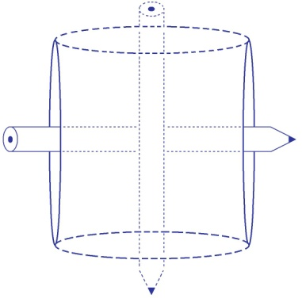

<!-- id: s25-05-0006 -->

Alors ça je vais vous le montrer, je vais le faire circuler.

<!-- id: s25-05-0007 -->

C’est une construction que Soury a bien voulu faire à mon intention.

<!-- id: s25-05-0008 -->

Vous allez voir qu’ici il y a un passage, qu’il y a dans ce qui est construit là, *une double épaisseur*, et que pour marquer l’ensemble du papier, ici il y a *une double épaisseur* mais là il n’y en a qu’une, je veux dire : à ce niveau-là qui se constitue dans l’ensemble de la feuille.

<!-- id: s25-05-0009 -->

Derrière donc ce qui ici fait *double épaisseur*, il n’y en a qu’*une troisième*. Voilà, je vous fais circuler ce bout de papier.

<!-- id: s25-05-0010 -->

Je vous recommande de profiter de *la double épaisseur* pour vous aper­cevoir que c’est un tore.

<!-- id: s25-05-0011 -->

En d’autres termes, que ceci :

<!-- id: s25-05-0012 -->

<!-- id: s25-05-0013 -->

est à peu près construit comme ça :

<!-- id: s25-05-0014 -->

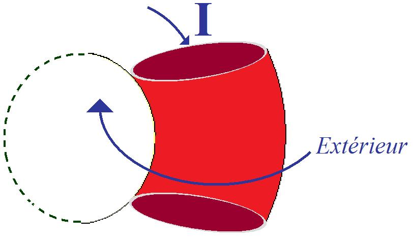

<!-- id: s25-05-0015 -->

À savoir qu’on passe le doigt par ici \[**I**\], mais que là, c’est ce qu’on peut appeler l’extérieur du tore qui se continue avec le reste de l’extérieur - je vous le fais, je vous le passe - c’est ce que j’appelle dissymétrie. Voilà !

<!-- id: s25-05-0016 -->

C’est ce que j’appelle aussi « *ce qui fait trou* », car un tore fait *trou*. J’ai réussi...

<!-- id: s25-05-0017 -->

> pas tout de suite, après un certain nombre d’approxima­tions ...j’ai réussi à vous donner l’idée du *trou*. Un tore ça passe - à juste titre - pour troué. Ιl y a plus d’un *trou* chez ce que l’on appelle l’« *homme* ». C’en est même une véritable passoire : j’entre où ?

<!-- id: s25-05-0018 -->

Ce point d’interrogation a sa réponse pour « *tout tétrume un* »...

<!-- id: s25-05-0019 -->

> je ne vois pas pourquoi je n’écrirais pas ça comme ça, à l’occasion ...ce point d’inter­rogation - viens-je de dire - a sa réponse pour « *tout tétrume un* » : j’écrirais ça « *l’amort* »*.*

<!-- id: s25-05-0020 -->

Ce qu’il y a de bizarre dans les...

<!-- id: s25-05-0021 -->

> parce que pourquoi ne pas l’écrire aussi comme ça : « *les trumains* », là, je les mets au pluriel ...ce qu’il y a de bizarre dans « *les trumains* »...

<!-- id: s25-05-0022 -->

> pourquoi ne pas écrire ça comme ça aussi, puisqu’aussi bien se servir de cette orthographe en français est jus­tifié par le fait que « *les* », signe du pluriel, vaut bien d’être substitué à « *l’être* » qui n’est comme on dit
>
> qu’une copule, c’est-à-dire ne vaut pas cher. Ne vaut pas cher par l’usage qu’on « *amphest* » : amphigourique ! ...ce qu’il y a de curieux, c’est que l’homme tient beaucoup à être mor­tel. Ιl accapare la mort !

<!-- id: s25-05-0023 -->

Alors que tous les êtres vivants sont promis à la mort, il veut qu’il n’y en ait que pour lui !

<!-- id: s25-05-0024 -->

D’où l’activité déployée autour des enterrements. Ιl y a même eu des gens autrefois, qui ont pris soin de perpétuer ce que j’écris « *laïque hors la vie *»* *ils ont pris soin de perpétuer ça en en faisant des momies.

<!-- id: s25-05-0025 -->

Ιl faut dire que les « *nés après* » y ont mis bon ordre ! On a sérieusement secoué ces momies.

<!-- id: s25-05-0026 -->

*Je me suis informé auprès de ma fille*...

<!-- id: s25-05-0027 -->

> parce que dans mon dictionnaire français-grec, il n’y avait pas de momies ...*je me suis informé auprès de ma fille*...

<!-- id: s25-05-0028 -->

> qui a eu la bonté de se déranger pour se décarcasser pour trouver un dictionnaire fran­çais-grec ...*je me suis informé auprès de ma fille* \[*Rires*\], et j’ai appris que « *momie* » ça se dit comme ça en grec : σκελετόν σώμα \[squeleton soma \], le *corps-squelette*. Précisément les *momies* sont faites pour conserver l’ap­parence du corps. Τήρητιχομενον σώμα \[terétikomenon soma\], c’est aussi ce qu’elle m’a livré, je veux dire que Τήρητιχομενον σώμα \[terétikomenon soma\], ça veut dire « *empêcher de pour­rir* ».

<!-- id: s25-05-0029 -->

Sans doute les Égyptiens aimaient bien le poisson frais et c’est évi­dent qu’avant d’appliquer à ce qui était mort, *la momification*...

<!-- id: s25-05-0030 -->

> c’est tout au moins la remarque qu’on m’a fait à cette occasion ...les *momies*, c’est pas spécialement ragoûtant.

<!-- id: s25-05-0031 -->

D’où le sans-gêne avec lequel on a mani­pulé toutes ces *momies* éminemment cassables.

<!-- id: s25-05-0032 -->

C’est à quoi se sont consa­crés les « *nés après* »*.*

<!-- id: s25-05-0033 -->

Ça se dit en Quetchua, soit du côté de Cuzco - Cuzco s’écrit comme ça - on y parle quelquefois le Quetchua.

<!-- id: s25-05-0034 -->

On y parle le Quetchua grâce au fait que les Espagnols...

<!-- id: s25-05-0035 -->

> puisque tout le monde parle espagnol ...les Espagnols prennent soin de conserver cette langue.

<!-- id: s25-05-0036 -->

Ce que j’appelle les « *nés après* » ça se dit en Quetchua : « *ceux qui se forment dans le ventre de la mère* » et ça s’écrit...

<!-- id: s25-05-0037 -->

> puisqu’il y a une écriture Quechua ...ça se dit : « *Runayay* ».

<!-- id: s25-05-0038 -->

Voilà ce que j’ai appris avec - mon Dieu ! - ce que j’ap­pellerai une « [*vélaire*](https://www.cnrtl.fr/definition/v%C3%A9laire) ».

<!-- id: s25-05-0039 -->

Une *vélaire* qui m’apprend à vêler le Quetchua, c’est-à-dire à faire comme si c’était ma langue maternelle, à en accoucher.

<!-- id: s25-05-0040 -->

Ιl faut dire que cette *vélaire* a eu l’occasion de m’expliquer qu’en Quechua ça passe beaucoup par *le voile*, ça s’aspire terriblement.

<!-- id: s25-05-0041 -->

Un *affreux* du nom de Freud, a mis au point un bafouillage qu’il a qua­lifié d’« *analyse *» - on ne sait pourquoi - pour énoncer la seule vérité qui comp­te : *il n’y a pas de rapport sexuel* chez « *les trumains* »*.* C’est moi qui en ai conclu ça.

<!-- id: s25-05-0042 -->

Après expérience faite de l’*« analyse »,* j’ai réussi à formuler ça. Oui... J’ai réussi à formuler ça, non sans peine… Et c’est ce qui m’a conduit à m’apercevoir qu’il fallait faire quelques nœuds borroméens.

<!-- id: s25-05-0043 -->

Supposons que nous suivions la règle, à savoir que comme je le dis :

<!-- id: s25-05-0044 -->

- au-­dessus de celui qui est au-dessus,

<!-- id: s25-05-0045 -->

- et au-dessous de celui qui est au-dessous.

<!-- id: s25-05-0046 -->

Eh bien, il est bien manifeste que - comme vous le voyez - ça ne colle pas.

<!-- id: s25-05-0047 -->

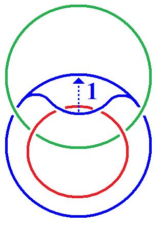

<!-- id: s25-05-0048 -->

À savoir qu’il suffit que vous soule­viez ça \[1\] pour vous apercevoir qu’il y en a un au-dessus, un au milieu et un au-dessous, et que par conséquent les 3 sont libres l’un de l’autre. C’est bien pourquoi il faut que ça soit dissymétrique.

<!-- id: s25-05-0049 -->

Ιl faut que ça soit comme ça, pour repro­duire la façon dont je l’ai dessiné une première fois :

<!-- id: s25-05-0050 -->

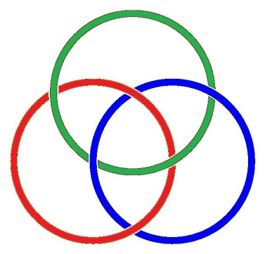

<!-- id: s25-05-0051 -->

Il faut qu’ici ça soit en dessous, ici au-dessus, ici en dessous et ici en dessus. C’est grâce à quoi il y a nœud borroméen. Autrement dit *il faut que ça alterne*. Ça peut aussi bien alter­ner dans l’autre sens, en quoi consiste très précisément la dis­symétrie.

<!-- id: s25-05-0052 -->

J’ai essayé de m’apercevoir de ce que comportait le fait que... autant ne pas se faire croiser le trait noir avec le trait rouge plus de deux fois. On pourrait aussi bien le faire se croiser plus de deux fois, on pourrait le faire se croiser quatre fois, ça ne changerait rien à la véritable nature du nœud borroméen.

<!-- id: s25-05-0053 -->

Ιl y a une suite à tout ça : Soury - qui y est pour quelque chose - a élucu­bré quelques considérations sur le tore.

<!-- id: s25-05-0054 -->

Un tore, c’est quelque chose comme ça. Supposez que nous fassions tenir un tore à l’intérieur d’un autre :

<!-- id: s25-05-0055 -->

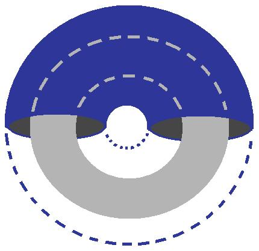

<!-- id: s25-05-0056 -->

C’est là que commencent les histoires d’*intérieur* et d’*extérieur*, parce que *retournons* celui qui est *à l’intérieur* de cette façon là.

<!-- id: s25-05-0057 -->

Je veux dire : ne retournons pas seulement celui-ci \[bleu\], mais retournons du même coup celui-là \[*rouge*\] :

<!-- id: s25-05-0058 -->

 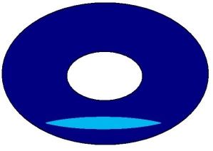 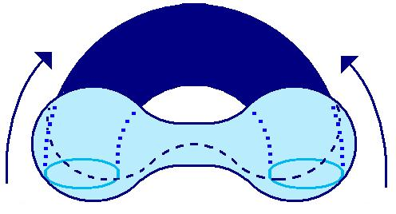 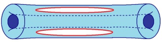

<!-- id: s25-05-0059 -->

Ιl en résulte quelque chose qui va faire que ce qui était d’abord en dedans va venir au-dehors, et comme le tore en question a un trou, ce qui est en dehors va rester en dehors et va aboutir à cette forme que j’ai appelée la « *forme en trique* », où l’autre tore va venir en dedans.

<!-- id: s25-05-0060 -->

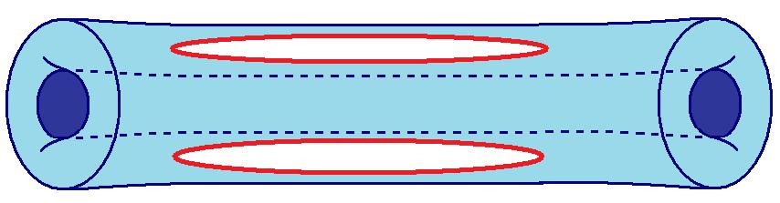 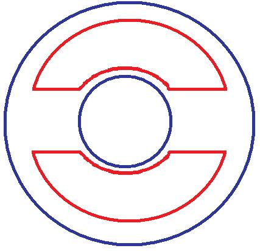

<!-- id: s25-05-0061 -->

Comment est-ce qu’il faut considérer ces choses ? *Ιl est très difficile de parler ici d’intérieur quand il y a un trou à l’intérieur d’un tore*.

<!-- id: s25-05-0062 -->

C’est tout à fait différent de ce qu’il en est de la sphère. Une sphère, si vous me per­mettez de la dessiner maintenant, c’est quelque chose de comme ça.

<!-- id: s25-05-0063 -->

<!-- id: s25-05-0064 -->

La sphère se retourne, elle aussi. On peut définir sa surface comme visant l’intérieur. Ιl y aura une autre surface qui visera l’extérieur. Si nous la retournons, l’intérieur sera au-dehors - par définition - de la sphère, l’exté­rieur sera dedans.

<!-- id: s25-05-0065 -->

Mais dans le cas du tore, *du fait de l’existence du trou*, du trou à l’intérieur, nous aurons ce qu’on appelle une gran­de perturbation. Le trou à l’intérieur, c’est ce qui va perturber tout ce qu’il en est du tore.

<!-- id: s25-05-0066 -->

À savoir qu’il y aura dans cette *trique*, il y aura une néces­sité à ce que ce qui est à l’intérieur devienne quoi ?

<!-- id: s25-05-0067 -->

Précisément le trou. Et nous aurons une équivoque concernant ce trou qui devient dès lors un extérieur.

<!-- id: s25-05-0068 -->

Le fait que l’être vivant se définisse à peu près comme *une trique*, à savoir qu’il ait *une bouche*, voire *un anus*, et aussi quelque chose qui meuble l’intérieur de son corps, c’est quelque chose qui a des conséquences, des conséquences qui ne sont pas minces.

<!-- id: s25-05-0069 -->

Ιl me semble, à moi, que ça n’est pas sans rapport avec l’existence du 0 et du 1.

<!-- id: s25-05-0070 -->

Que le 0 ce soit essentiellement ce trou, c’est ce qui vaut la peine d’être approfondi.

<!-- id: s25-05-0071 -->

J’aimerais bien qu’ici Soury prenne la parole, je veux dire par là que s’il voulait bien parler du 1 et du 0, il m’agréerait.

<!-- id: s25-05-0072 -->

Ça a le plus étroit rap­port avec ce que nous articulons concernant le corps.

<!-- id: s25-05-0073 -->

Le zéro, c’est un trou et peut-être pourra-t-il nous en dire plus long.

<!-- id: s25-05-0074 -->

Je parle du zéro et du un comme consistance.

<!-- id: s25-05-0075 -->

Vous venez ? Je vais vous passer ça puisque aussi bien... Allons-y.

<!-- id: s25-05-0076 -->

[Intervention de Pierre Soury](#Janv17)

<!-- id: s25-05-0077 -->

Sur le 0 et le 1... Sur le 0 et le 1 *de l’arithmé­tique* *!*

<!-- id: s25-05-0078 -->

Il y a quelque chose qui est analogue au 0 et au 1 de l’arithmé­tique dans les « *chaînes* ».

<!-- id: s25-05-0079 -->

Le 0 et le 1 de l’arithmétique, ils apparaissent avec des préoccupa­tions de systématisme.

<!-- id: s25-05-0080 -->

C’est quand les nombres deviennent un système de nombres, que les cas limites, les cas extrêmes, les cas dégénérés, comme le 0 et le 1, prennent un intérêt.

<!-- id: s25-05-0081 -->

Donc ce qui fait exister le 0 et le 1, c’est des préoccupations de systématisme.

<!-- id: s25-05-0082 -->

Dans le cas des nombres, c’est les opérations sur les nombres qui font tenir le 0 et le 1.

<!-- id: s25-05-0083 -->

Par exemple, par rapport à l’« *opération somme* »...

<!-- id: s25-05-0084 -->

> par rapport à l’addition : l’« *opération somme* » ...le 0 apparaît comme « *élé­ment neutre* »...

<!-- id: s25-05-0085 -->

> c’est des termes qui sont en place ...le 0 apparaît comme *élé­ment neutre* et le 1 apparaît comme élément générateur.

<!-- id: s25-05-0086 -->

C’est-à-dire que par somme, on peut obtenir tous les nombres à partir du 1, on ne peut obtenir aucun nombre à partir du 0, donc ce qui repère le 0 et le 1, c’est le rôle qu’ils jouent par rapport à l’*addition*.

<!-- id: s25-05-0087 -->

Alors, dans les « *chaînes* » il y a des choses analogues à ça. Mais alors il s’agit bien d’un point de vue systématique sur les *chaînes*, enfin d’un point de vue sur toutes les chaînes : toutes les chaînes borroméennes et les chaînes comme formant système.

<!-- id: s25-05-0088 -->

X *-* Qu’est-ce que ça veut dire « *systématique* » ? \[*Rires*\]

<!-- id: s25-05-0089 -->

Pierre Soury

<!-- id: s25-05-0090 -->

Enfin déjà je ne crois pas à la possibilité d’exposer *ces choses-là*.

<!-- id: s25-05-0091 -->

C’est-à-dire que *ces choses-là* tiennent dans les *écritures* et je crois à peine à la possibilité de *parler* *ces choses-là*.

<!-- id: s25-05-0092 -->

Alors la possibilité de répondre... Enfin, pour *ces choses-là* je ne crois pas que *la parole* puisse prendre en charge *ces choses-là*.

<!-- id: s25-05-0093 -->

Enfin, que le systématisme ça tient dans les écritures, et que justement, tout ce qui est systématique, *la parole* peut pratiquement pas le prendre en charge. Enfin ce qui serait systématique et ce qui le serait pas, je ne sais pas.

<!-- id: s25-05-0094 -->

Mais c’est plutôt que ce que peuvent *por­ter* *les écritures* et *la parole*, c’est pas *la même chose*.

<!-- id: s25-05-0095 -->

Et que *la parole* qui voudrait rendre compte *des écritures* me paraît acrobatique, scabreuse.

<!-- id: s25-05-0096 -->

Alors « *systématique* », ce qui est typique du systématisme, c’est le nombre, c’est les nombres et l’arithmétique. Oui !

<!-- id: s25-05-0097 -->

C’est-à-dire des *nombres* on ne connaît que *les opérations sur les nombres*, c’est-à-dire qu’on ne connaît que le système des nombres : on ne connaît pas les nombres, on ne connaît que le système des nombres.

<!-- id: s25-05-0098 -->

Alors voyez, il y a un peu de systématisme dans *les chaînes*.

<!-- id: s25-05-0099 -->

Enfin, il y a quelque chose dans *les chaînes* qui se comporte comme l’addition, c’est une certaine opération d’*enlacement* : qui fait qu’une *chaîne* et une *chaîne*, ça fait une autre *chaîne*, comme un *nombre* et un *nombre*, ça fait un autre *nombre*.

<!-- id: s25-05-0100 -->

Alors cette opération d’*enlacement*, je vais pas essayer de la *défi­nir*, je vais pas essayer de la *présenter*, de l’*introduire*.

<!-- id: s25-05-0101 -->

Mais alors, par rapport à cette opération d’enlacement, la *chaîne borro­méenne*, la *chaîne à* 3 apparaît comme le cas *générateur*, le cas exemplaire, le cas qui engendre tout le reste. C’est-à-dire que l’exemplarité de la *chaî­ne à* 3 pourrait se démontrer.

<!-- id: s25-05-0102 -->

En s’appuyant sur un article de Milnor qui s’appelle « *Links groups »* en anglais, l’exemplarité de la chaîne borroméenne pourrait se démontrer, c’est-à-dire que toute chaîne borroméenne peut être obtenue à partir de la *chaîne à* 3.

<!-- id: s25-05-0103 -->

En particulier les *chaînes* à un nombre quelconque d’éléments, peuvent être obtenues à partir de la *chaî­ne à* 3.

<!-- id: s25-05-0104 -->

Ce qui fait que la *chaîne à* 3 est quelque chose qui *engendre tout*.

<!-- id: s25-05-0105 -->

C’est quelque chose qui est *générateur* et qui est comparable au 1 de l’arithmétique.

<!-- id: s25-05-0106 -->

Au même sens où le 1 est *générateur* dans le système des nombres, la *chaîne à* 3, borroméenne, est *génératrice*.

<!-- id: s25-05-0107 -->

Toutes les chaînes borroméennes peuvent être obtenues à partir de la *chaîne à* 3, par certaines opérations.

<!-- id: s25-05-0108 -->

Donc la *chaîne à* 3 joue le même rôle que le 1. Alors il y a quelque chose qui joue le même rôle que le 0, c’est la *chaîne à* 2, qui est un cas dégénéré, enfin qui est un cas dégénéré de chaîne borroméenne.

<!-- id: s25-05-0109 -->

Alors la *chaîne à* 2, je vais la dessiner. Je vais la dessiner parce qu’elle a été dessinée moins souvent que la *chaîne à* 3.

<!-- id: s25-05-0110 -->

C’est une présenta­tion plane de la *chaîne à* 2. C’est deux cercles pris l’un dans l’autre. On peut le faire avec les doigts.

<!-- id: s25-05-0111 -->

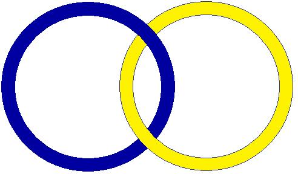 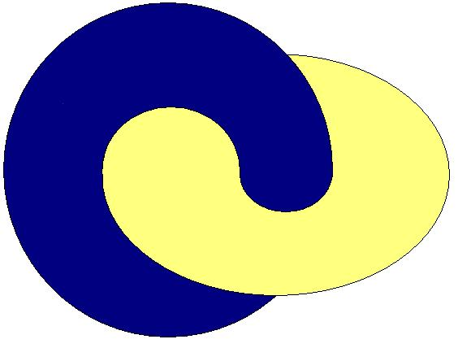

<!-- id: s25-05-0112 -->

La *chaîne à* 2, c’est un cas dégénéré. Dans les préoccupations de systé­matisme, les cas dégénérés prennent de l’importance.

<!-- id: s25-05-0113 -->

C’est tout à fait ana­logue pour le 0, enfin le 0 est un nombre dégénéré.

<!-- id: s25-05-0114 -->

Mais c’est à par­tir du moment où il y a des préoccupations de systématisme sur les nombres, que le 0 prend de l’importance.

<!-- id: s25-05-0115 -->

C’est-à-dire que c’est un...

<!-- id: s25-05-0116 -->

> tiens, ça me permet de répondre à cette histoire de systématisme : c’est qu’un critère, un signe tout à fait de ce qui est systématique ou non-systé­matique, c’est selon que les cas dégénérés sont exclus ou ne sont pas exclus.
>
> Alors je pourrais répondre :

<!-- id: s25-05-0117 -->

- le *systématisme* c’est quand on inclut *les cas dégénérés*,

<!-- id: s25-05-0118 -->

- le *non-systématique* c’est quand on exclut *les cas dégénérés*. ...enfin, le 0 c’est un cas dégénéré, et qui prend de l’importance.

<!-- id: s25-05-0119 -->

Alors pour les chaînes, pour l’opération d’*enlacement* sur les chaînes, ou l’opé­ration d’*enlacement* sur les *chaînes borroméennes*, ce qui joue le rôle du 0, c’est la *chaîne à* 2. La *chaîne à* 2 n’engendre rien, n’engendre qu’el­le-même : la *chaîne à* 2 fonctionne comme le 0, c’est-à-dire que 0 + 0 = 0. *Enlacer* la *chaîne à* 2 avec elle-même, ça fait toujours la *chaîne à* 2.

<!-- id: s25-05-0120 -->

De ce point de vue de l’enlacement, la *chaîne à* 4 est obtenue à partir de deux *chaînes à* 3, c’est-à-dire 3 et 3 font 4.

<!-- id: s25-05-0121 -->

La *chaîne à* 4 est obtenue par enla­cement de deux *chaînes à* 3.

<!-- id: s25-05-0122 -->

Enfin, c’est analogue à l’arithmétique, mais en se repérant sur les nombres de cercles, ça fait 3 et 3 font 4.

<!-- id: s25-05-0123 -->

Comme ça, ça pourrait être décrit comme 2 et 2 font 2. Enfin, le fait que 2 est *neutre*, est *neutre* ou *dégénéré*… Ce sont les termes qui existent à ce sujet-là, c’est de dire « *élément générateur* », « *élément neutre* », enfin les termes dans la cul­ture mathématique : le 1 est un élément *générateur*, le 0 est un élément *neutre*.

<!-- id: s25-05-0124 -->

Je ren­force un peu ces termes en disant - au lieu de dire *générateur* et *neutre -* en disant « *exemplaire »* et « *dégénéré »*.

<!-- id: s25-05-0125 -->

C’est-à-dire que le 1 serait un nombre *exem­plaire* et le 0 un nombre *dégénéré*.

<!-- id: s25-05-0126 -->

La *chaîne à* 3 est la *chaîne borro­méenne* *exemplaire* et la *chaîne à* 2 est la *chaîne borroméenne* *dégénérée*.

<!-- id: s25-05-0127 -->

*Dégénérée*, on peut le voir de différentes façons. C’est ça ! Aussi, le fait que cette chaîne est *dégénérée*, on peut le voir de différentes façons : de dif­férentes façons c’est trop ! J’ai plusieurs raisons de qualifier la *chaîne à 2* de *dégénérée*, et plusieurs raisons, c’est trop !

<!-- id: s25-05-0128 -->

Une raison, c’est que c’est l’élé­ment neutre pour l’*enlacement*, c’est qu’*enlacée* avec elle-même, elle ne donne qu’elle-même, elle n’engendre rien d’autre qu’elle-même, *elle est dégénérée au sens d’être un élément neutre par rapport à l’opération enla­cement*. C’est un sens.

<!-- id: s25-05-0129 -->

Un 2ème sens d’être *dégénérée*, c’est que la propriété borroméenne *dégénère* à 2.

<!-- id: s25-05-0130 -->

La propriété borroméenne est le fait que chaque élément est indispensable : quand on enlève un élément, les autres ne tiennent plus ensemble.

<!-- id: s25-05-0131 -->

Un élément fait tenir tous les autres, *chacun est indispensable*, tous tiennent ensemble, mais pas sans chacun.

<!-- id: s25-05-0132 -->

La propriété borroméenne, ça dit quelque chose à partir de 3, mais à 2 tout est borroméen.

<!-- id: s25-05-0133 -->

À 2 tout est borroméen parce que tenir ensemble...

<!-- id: s25-05-0134 -->

> enfin tenir ensemble à deux, enfin chacun est indispensable à deux ...est automatique­ment réalisé. Alors qu’à partir de 3 le «*chacun est indispensable* », n’est pas automatiquement réalisé.

<!-- id: s25-05-0135 -->

C’est-à-dire que c’est une propriété qui peut être vraie ou fausse, c’est oui ou non : oui ou non une chaîne est borro­méenne.

<!-- id: s25-05-0136 -->

À 2, toutes les chaînes sont borroméennes. Donc la proprié­té borroméenne *dégénère* à 2.

<!-- id: s25-05-0137 -->

Alors une 3ème raison pour laquel­le *cette chaîne est* *dégénérée*, c’est que dans cette chaîne, *un cercle est le retournement de l’autre cercle*.

<!-- id: s25-05-0138 -->

Une autre façon de le dire, c’est que ces deux cercles ont même voisinage. Enfin, ça c’est des histoires de surface.

<!-- id: s25-05-0139 -->

C’est que si ces deux cercles sont remplacés par leurs 2 surfaces-voisi­nages, c’est la même surface, et ces 2 cercles ne sont que le dédouble­ment l’un de l’autre. C’est un pur dédoublement, c’est une pure complé­mentation.

<!-- id: s25-05-0140 -->

Mais ça se voit sur les surfaces, ça. Ça se voit sur les chaînes de surface, et pas sur les chaînes de cercles.

<!-- id: s25-05-0141 -->

Ça se voit sur les chaînes de sur­face qui sont associées à cette chaîne de cercles.

<!-- id: s25-05-0142 -->

C’est-à-dire, si cette chaîne de 2 cercles cor­respond à une chaîne de 2 tores, cette chaîne de deux tores corres­pond au dédoublement du tore.

<!-- id: s25-05-0143 -->

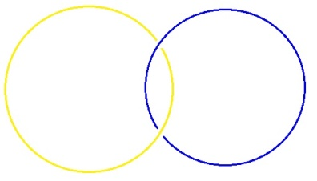  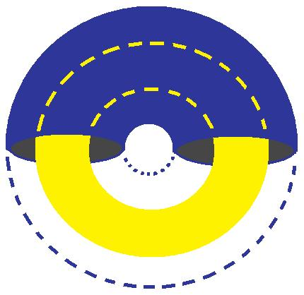

<!-- id: s25-05-0144 -->

Alors ça, c’est pas évident : que 2 tores enlacés, c’est la même chose que 2 tores qui sont le dédoublement l’un de l’autre, au même titre que le pneu et la chambre à air. Le pneu et la chambre à air, c’est le dédoublement d’un tore en deux tores.

<!-- id: s25-05-0145 -->

Deux tores qui ne sont que deux versions d’un même tore, c’est un tore dédoublé.

<!-- id: s25-05-0146 -->

Que deux tores étant le dédouble­ment d’un tore, c’est la même chose que deux tores enlacés, c’est pas évi­dent.

<!-- id: s25-05-0147 -->

C’est le retournement qui dit ça, et le retournement c’est pas évi­dent.

<!-- id: s25-05-0148 -->

Ces deux cercles, c’est la même chose que ces deux tores, enlacés.

<!-- id: s25-05-0149 -->

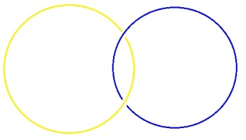 

<!-- id: s25-05-0150 -->

Ces deux tores enlacés, c’est la même chose qu’un tore dédoublé.

<!-- id: s25-05-0151 -->

 

<!-- id: s25-05-0152 -->

Et ça c’est une raison de dire que ça c’est une chaîne dégénérée.

<!-- id: s25-05-0153 -->

Chaîne dégénérée, parce que ça, ça fait que de dire : ce 2, le 2 de ces 2 cercles, c’est que la division de l’espace en 2 moitiés.

<!-- id: s25-05-0154 -->

Voilà, ça, c’est un critère pour dire qu’une chaîne est *dégénérée*, c’est que les éléments de la chaîne ne représen­tent qu’une division de l’espace.

<!-- id: s25-05-0155 -->

Ces deux cercles-là valent pour la divi­sion de l’espace en deux moitiés.

<!-- id: s25-05-0156 -->

C’est en ce sens-là que c’est dégénéré, c’est que ces deux-là, ce n’est que deux moitiés de l’espace.

<!-- id: s25-05-0157 -->

Alors pourquoi deux cercles qui ne font que représenter deux moitiés de l’espace, pourquoi c’est une *dégénérescence* ?

<!-- id: s25-05-0158 -->

Eh bien, parce que dans le cas général des chaînes, le « plusieurs-cercles » des chaînes, ne représente pas une division de l’espace en plusieurs parties, mais il se trouve qu’ici ces deux cercles ne font que représenter une divi­sion, une répartition, une séparation de l’espace en deux parties.

<!-- id: s25-05-0159 -->

Lacan

<!-- id: s25-05-0160 -->

Je voudrais quand même intervenir. Intervenir pour vous faire remarquer que si vous retournez ce cercle-là par exemple \[bleu\], le cercle de droite, vous libérez du même coup le cercle de gauche. Je veux dire que ce que vous obtenez, c’est ce que j’appelle *« la trique* ».

<!-- id: s25-05-0161 -->

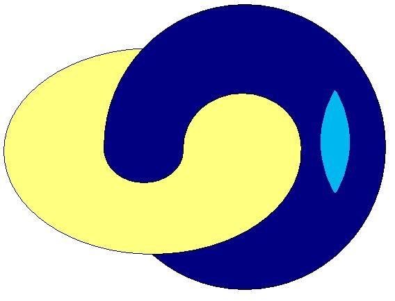  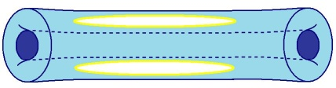

<!-- id: s25-05-0162 -->

C’est-à-dire que cette *trique* est libre. Et c’est quand même très différent du tore à l’intérieur du tore.

<!-- id: s25-05-0163 -->

Pierre Soury

<!-- id: s25-05-0164 -->

Bon, c’est différent. Voilà, enfin, de désimpliquer l’un de l’autre les deux tores, ça peut se faire que par une coupure.

<!-- id: s25-05-0165 -->

C’est pas seulement par retournement, par retournement on peut pas désimpliquer les deux tores.

<!-- id: s25-05-0166 -->

Ce qui se verrait, par exemple, si on fait le retournement avec un petit trou, enfin par trouage.

<!-- id: s25-05-0167 -->

Si on fait le retour­nement d’un tore par trouage, on ne peut pas, on ne peut pas désimpliquer ces deux tores.

<!-- id: s25-05-0168 -->

On ne peut pas les désimpliquer, les désenchaîner, les désenlacer. C’est seulement si on fait une coupure.

<!-- id: s25-05-0169 -->

Mais faire *une coupu­re*, c’est faire beaucoup plus que *le retournement*, faire *une coupure*, c’est faire plus que *le trouage*, et faire *le trouage*, c’est faire plus que *le retour­nement*.

<!-- id: s25-05-0170 -->

C’est-à-dire que faire une coupure, c’est faire beaucoup plus que le retournement.

<!-- id: s25-05-0171 -->

On peut faire *le retournement par coupure*, mais ce qui se fait par coupure n’est pas représentatif de ce qui se fait par retourne­ment.

<!-- id: s25-05-0172 -->

Et ça, ça en serait justement un exemple :

<!-- id: s25-05-0173 -->

- c’est que par coupure on peut désimpliquer, on peut désenchaîner l’inté­rieur et l’extérieur,

<!-- id: s25-05-0174 -->

- alors que par retournement, il est pas question de désimpliquer la complémentarité de *l’intérieur* et de *l’extérieur*.

<!-- id: s25-05-0175 -->

C’est que ce qui est fait par coupure, c’est beaucoup plus que ce qui est fait par retournement, bien que la coupure puisse apparaître comme une façon de faire le retournement.

<!-- id: s25-05-0176 -->

Là-dedans, la coupure c’est plus que le trouage, et le trouage c’est plus que le retournement.

<!-- id: s25-05-0177 -->

*Le retournement* peut être fait par *trouage*. *Le trouage*, non, j’hésite à dire que le trouage pourrait être fait par *coupure*, quand même. Mais dans la coupure, il y a un trouage, il y a un trouage implicite dans la coupure.

<!-- id: s25-05-0178 -->

Lacan

<!-- id: s25-05-0179 -->

En d’autres termes, ce que vous obtenez par trouage, c’est un effet comme ça :

<!-- id: s25-05-0180 -->

  

<!-- id: s25-05-0181 -->

Pierre Soury - Oui, oui.

<!-- id: s25-05-0182 -->

Lacan Ιl *y* a quelque chose qui n’est quand même pas maîtrisé, c’est quand même un résultat différent de celui-là !

<!-- id: s25-05-0183 -->

<!-- id: s25-05-0184 -->

Pierre Soury - Non, non. C’est la même chose.

<!-- id: s25-05-0185 -->

Lacan

<!-- id: s25-05-0186 -->

C’est justement sur ça « *c’est la même chose* », que je désirerais obtenir de vous une réponse : quand nous retournons les deux tores \[l’un dans l’autre\] :

<!-- id: s25-05-0187 -->

<!-- id: s25-05-0188 -->

nous obtenons ceci :

<!-- id: s25-05-0189 -->

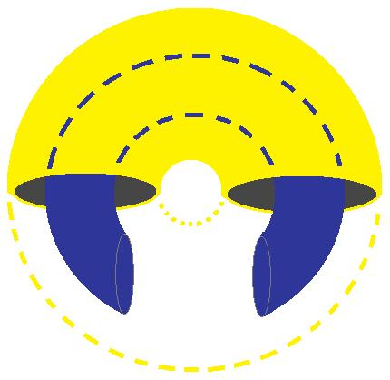 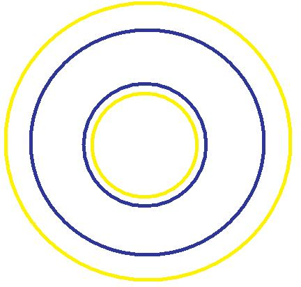

<!-- id: s25-05-0190 -->

C’est quand même quelque chose de *complètement différent* de ça :

<!-- id: s25-05-0191 -->

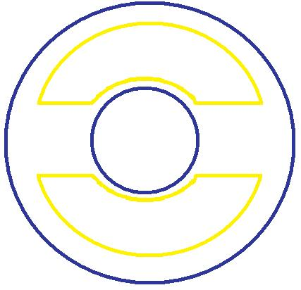

<!-- id: s25-05-0192 -->

qui ressemble beaucoup plus à ça :

<!-- id: s25-05-0193 -->

  

<!-- id: s25-05-0194 -->

Ιl y a quelque chose là qui ne me paraît pas maîtrisé, parce que ceci :

<!-- id: s25-05-0195 -->

<!-- id: s25-05-0196 -->

c’est exactement la même chose que ça :

<!-- id: s25-05-0197 -->

<!-- id: s25-05-0198 -->

Pierre Soury - Bon. Alors ça, c’est deux tores enlacés :

<!-- id: s25-05-0199 -->

<!-- id: s25-05-0200 -->

Ça, c’est deux tores emboîtés :

<!-- id: s25-05-0201 -->

<!-- id: s25-05-0202 -->

Ça, c’est deux tores enlacés :

<!-- id: s25-05-0203 -->

<!-- id: s25-05-0204 -->

Ça, c’est deux tores libres l’un de l’autre, indépendants :

<!-- id: s25-05-0205 -->

<!-- id: s25-05-0206 -->

Alors, ce qui est la même chose, c’est ça : deux tores, deux tores enlacés. Et ça c’est deux tores enlacés… Lacan *-* Ceux-là ne sont pas enlacés, ils sont l’un à l’in­térieur de l’autre.

<!-- id: s25-05-0207 -->

Pierre Soury

<!-- id: s25-05-0208 -->

Ah bon ! Bon, bon… J’avais cru que c’était ça. Ah bon… il s’agit des deux tores : du noir et du rouge ?

<!-- id: s25-05-0209 -->

Alors là il s’agit de *deux tores emboîtés* : un noir et un rouge emboîtés ici. Ici de deux tores emboîtés, et ici de *deux tores enlacés*.

<!-- id: s25-05-0210 -->

Lacan

<!-- id: s25-05-0211 -->

C’est ça qui dans les catégories n’est pas maîtrisé, dans les catégories d’enlacement et d’emboîtement.

<!-- id: s25-05-0212 -->

J’essaierai de trouver la solu­tion, mais ceci est proprement semblable à l’enlacement. L’enlacement est différent !
