# Leçon 12 | 09 Mai 1978

<!-- source-url: http://staferla.free.fr/S25/S25.docx -->
<!-- seminar: s25 -->
<!-- lesson: 12 -->

<!-- id: s25-12-0001 -->

Les choses peuvent légitimement être dites « *savoir comment se compor­ter* ».

<!-- id: s25-12-0002 -->

C’est nous qui découvrons comment elles font.

<!-- id: s25-12-0003 -->

Le tournant est qu’il faille que nous les imaginions.

<!-- id: s25-12-0004 -->

Ça n’est pas toujours facile, car il y faut quelques précautions oratoires, c’est-à-dire parlées.

<!-- id: s25-12-0005 -->

Ainsi c’est *la coupure* qui réalise le nœud à 3 sur un tore.

<!-- id: s25-12-0006 -->

Pour com­pléter cette coupure il faut, si je puis dire l’étaler, c’est-à-dire *la redoubler* de façon à *faire une bande*.

<!-- id: s25-12-0007 -->

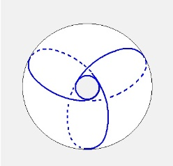 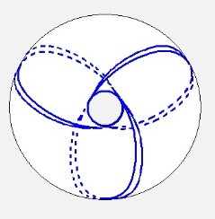

<!-- id: s25-12-0008 -->

C’est ce que vous voyez là à droite - la cou­pure, c’est là à gauche - c’est ce que vous voyez là à droite dans ce des­sin dont il faut dire qu’il n’est pas sans maladresse.

<!-- id: s25-12-0009 -->

Ιl faut *la redoubler*, grâce à quoi la figure de la bande apparaît, qui - elle - donne support, c’est-à-dire *étoffe* au nœud à 3.

<!-- id: s25-12-0010 -->

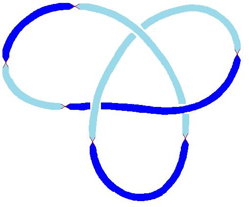

<!-- id: s25-12-0011 -->

C’est certainement pour cela que j’ai énoncé cette absurdité qu’il était impossible d’établir un nœud sur un tore...

<!-- id: s25-12-0012 -->

ce que Lagarrigue a relevé légi­timement ...car *la coupure* ne suffit pas à faire *le nœud*, il y faut *la bande* dont vous savez comment on la produit : en redoublant la coupure, un peu à droite, un peu à gauche, bref en la redoublant.

<!-- id: s25-12-0013 -->

Car une *coupure* ne suffit pas à faire un *nœud*, il y faut de l’étoffe, l’étoffe d’une chambre à air à l’occasion qui y suffit. Mais il ne faut pas croire que la coupure suf­fise à faire de la chambre à air une *bande de Mœbius*, même par exemple à triple demi-torsion. C’est la figure que j’ai indiquée là - celle qui redouble la coupure :

<!-- id: s25-12-0014 -->

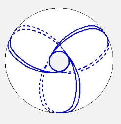

<!-- id: s25-12-0015 -->

c’est la figure que j’ai indiquée là qui donne *étoffe* à ce nœud à 3. Je vous fais remarquer que ce nœud à 3, c’est quelque chose qui ne se produit que de *la coupure par le milieu de* ce que j’ai appelé *la triple bande de Mœbius *:

<!-- id: s25-12-0016 -->

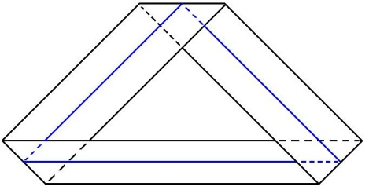→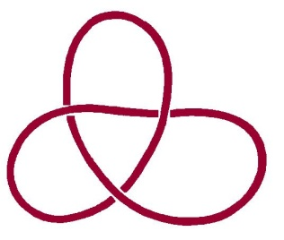

<!-- id: s25-12-0017 -->

C’est à couper par le milieu cette triple *bande de Mœbius* que le nœud à 3apparaît, de sorte qu’après tout c’est ce qui m’excuse d’avoir énoncé ce fait absurde.

<!-- id: s25-12-0018 -->

La triple *bande de Mœbius* n’est pas capable de se coucher sur un tore.

<!-- id: s25-12-0019 -->

D’où il résulte que si on *découpe* ceci tel que c’était primitivement, à savoir *la coupure* - *la simple coupure* – ça ne fait pas un nœud à 3*,* et si on coupe *la chambre à air* de la façon qui est représentée là \[coupure redou­blée\], et bien ce qu’on obtient c’est quelque chose qui est bien différent de ce qu’on attendait, à savoir que c’est une chose quatre fois pliée, à l’oc­casion par exemple, ceci est l’intérieur de *la chambre à air*, ceci est à l’in­térieur aussi et ceci est à l’extérieur :

<!-- id: s25-12-0020 -->

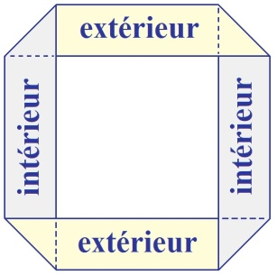

<!-- id: s25-12-0021 -->

C’est bien en quoi il n’est pas possible d’obtenir directement ceci...

<!-- id: s25-12-0022 -->

> à savoir ce qui résulte de la bande à l’intérieur de *la coupure* ...il n’est pas pos­sible de l’obtenir directement, puisque c’est ce qui ne résulte que de la sec­tion par le milieu de *la triple bande de Mœbius*. C’est peut-être ce qui m’excuse d’avoir formulé cette absurdité que j’ai avouée *tout à l’heure*.

<!-- id: s25-12-0023 -->

Néanmoins c’est un fait que la coupure en question réalise sur le tore quelque chose d’équivalent au nœud et que le nommé Lagarrigue a eu rai­son de me le reprocher.

<!-- id: s25-12-0024 -->

Ce que j’ai dit sur les choses qui peuvent légitimement être dites « *savoir comment se compor­ter* », c’est quelque chose qui suppose l’emploi de ce que j’ai appelé l’*Imaginaire*. Ce que j’ai dit tout à l’heure, qu’il fallait \- cette étoffe - que nous l’*imaginions*, nous suggère qu’il y a quelque chose de *pre­mier* dans le fait qu’il y a *des tissus*.

<!-- id: s25-12-0025 -->

Le tissu est particulièrement lié à l’imagination, au point que j’avancerai qu’un tissu, son support c’est à proprement parler ce que j’ai appelé à l’instant l’*Imaginaire*.

<!-- id: s25-12-0026 -->

Et ce qui est frappant c’est justement ça, à savoir que le tissu ça s’*imagine* seulement.

<!-- id: s25-12-0027 -->

Nous trouvons donc là quelque chose qui fait que ce qui passe pour *s’imaginer le moins* relève quand même de l’*Imaginaire*. Ιl faut dire que le tissu c’est pas facile à *imaginer*, puisque là ça se rencontre seulement dans la *coupure*.

<!-- id: s25-12-0028 -->

Si J’ai parlé du *Symbolique*, d’*Imaginaire* et de *Réel*, c’est bien parce que le *Réel* c’est le tissu.

<!-- id: s25-12-0029 -->

Alors comment l’imaginer, ce tissu ? Eh bien, c’est là précisément qu’est la béance entre l’*Imaginaire* et le *Réel*, et ce qu’il y a entre eux, c’est l’*inhibition* précisément à *imaginer*.

<!-- id: s25-12-0030 -->

Mais qu’est-ce que c’est que cette *inhibition*, puisque aussi bien nous en avons là un exemple : il n’y a *rien de plus difficile que d’imaginer le Réel*. Là il semble que nous tournions en rond et que dans cette affaire de *tissu*, le *Réel*, c’est bien ça qui nous échappe et c’est bien pour ça que nous avons l’*inhibition*.

<!-- id: s25-12-0031 -->

C’est la béance entre l’*Imaginaire* et le *Réel*...

<!-- id: s25-12-0032 -->

> si tant est que nous puissions encore la *supporter* ...c’est la béance entre l’*Imaginaire* et le *Réel* qui fait notre *inhibition*.

<!-- id: s25-12-0033 -->

*L’Imaginaire, le Réel et le Symbolique,* c’est ce que j’ai avancé comme *étant* 3 *fonctions qui se situent en ce qu’on appelle une* *tresse*.

<!-- id: s25-12-0034 -->

Ιl est clair que si on part d’ici, ceci est une *tresse :*

<!-- id: s25-12-0035 -->

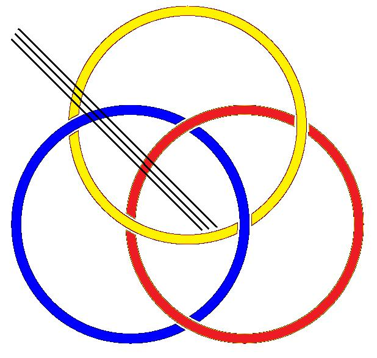

<!-- id: s25-12-0036 -->

Et ce qu’il y a de curieux, c’est que cette *tresse* est bien particulière.

<!-- id: s25-12-0037 -->

Ιl y a quelque chose que je voudrais aujourd’hui produire devant vous. Voilà ce que c’est :

<!-- id: s25-12-0038 -->

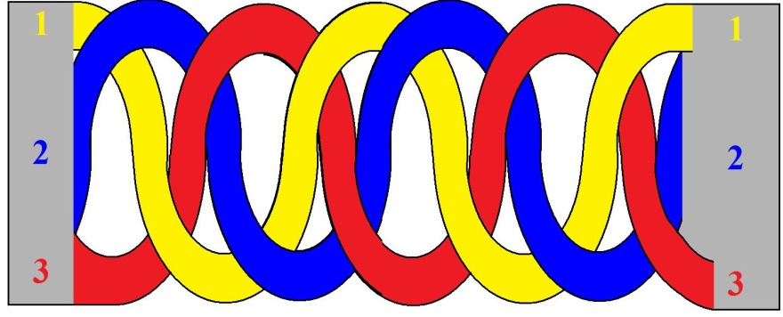

<!-- id: s25-12-0039 -->

C’est quelque chose qui se présente comme une bande.

<!-- id: s25-12-0040 -->

2 recouvre 1, ici c’est 1 recouvre 3, ici c’est 2 qui passe sous 3, ici c’est 1, ici c’est 3, ici c’est 1, ici c’est 2, ici c’est 3.

<!-- id: s25-12-0041 -->

Et pour tout dire, à la fin, nous retrouverons après six échanges le 1-2-­3.

<!-- id: s25-12-0042 -->

Eh bien ceci, à savoir l’équivalence de ceci qu’on appelle la « *bande de Slade* » avec ce que j’ai figuré ici comme 1-2-­3, cette équivalence se démontre dans le fait qu’il est possible de réduire à cette *bande de Slade*…

<!-- id: s25-12-0043 -->

> par une convenable manipulation de ce en quoi consiste le niveau où j’ai écrit 1-2-­3 …il est possible de réduire par une convenable manipulation, ceci à ceci :

<!-- id: s25-12-0044 -->

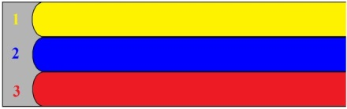 → 

<!-- id: s25-12-0045 -->

En d’autres termes : *une ceinture tressée* qui se termine par quelque chose qui est l’équivalent de cet 1-2-­3, c’est-à-dire à l’occasion *un cein­turon*, et je veux dire ce qui se détache de cette façon-là. \[*Lacan détache sa ceinture. Rires*\]

<!-- id: s25-12-0046 -->

Il est non seulement possible mais aisé à démontrer que cette ceinture, si elle est passée à l’intérieur de cette *tresse,* que cette ceinture… il est plus que possible dans une ceinture tressée d’obtenir, à l’aide du bout de la courroie et du ceinturon, d’obtenir le dénouement de la *tresse*, je parle de la *tresse borroméenne*.

<!-- id: s25-12-0047 -->

L’équivalent donc de la *tresse borroméenne*, c’est exactement ce qui se pose comme *non tressé* et c’est pour vous *signaler* cette équivalence que je vous assure qu’effectivement vous pouvez le confirmer de la façon la plus précise.

<!-- id: s25-12-0048 -->

C’est sans doute dif­ficile d’imaginer ce fait, mais c’est un fait.

<!-- id: s25-12-0049 -->

Je voudrais vous suggérer quelque chose qui a toute son importance, c’est ceci : c’est que comment - *la bande de Mœbius* - la fait-on la plus cour­te ?

<!-- id: s25-12-0050 -->

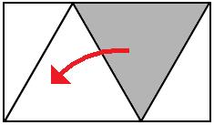

<!-- id: s25-12-0051 -->

En *repliant ce triangle-là sur celui-ci*, il en résulte ceci, à savoir que quelque chose se replie qui est ce morceau-là :

<!-- id: s25-12-0052 -->

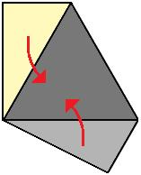

<!-- id: s25-12-0053 -->

Eh bien, il s’agit de s’aper­cevoir qu’une *bande de Mœbius* sera produite du fait du rabattement de ceci ici et de cela ici : c’est une *bande de Mœbius* ordinaire. Trouvez l’équivalent pour ce qui est de *la bande de Mœbius* triple.

<!-- id: s25-12-0054 -->

Cette *bande de Mœbius* est à peu près comme ceci :

<!-- id: s25-12-0055 -->

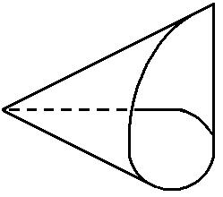

<!-- id: s25-12-0056 -->

Chose curieuse, attaquez-vous à cette histoire de la plus courte *bande de Mœbius*, vous verrez qu’*il y a une autre solution*, je veux dire qu’il y a une façon de la faire encore plus courte, en partant toujours du même tri­angle équilatéral.

<!-- id: s25-12-0057 -->

Qu’est-ce qui est le rapport entre ça et *la psychanalyse* ? Je mettrais en évidence plusieurs choses, c’est à savoir que les choses dont il s’agit ont le rapport le plus étroit avec *la psychanalyse*.

<!-- id: s25-12-0058 -->

Le rapport de l’*Imaginaire*, du *Symbolique* et du *Réel*, c’est là quelque chose qui tient par essence à *la psychanalyse*.

<!-- id: s25-12-0059 -->

Je ne m’y suis pas aventuré pour rien, ne serait-ce qu’en ceci que la primauté du tissu…

<!-- id: s25-12-0060 -->

> c’est-à-dire de ce que j’appelle en l’occasion : *les choses* …la primauté du tissu est essentiellement ce qui est nécessité par la mise en valeur de ce qu’il en est de l’étoffe d’une psychanalyse.

<!-- id: s25-12-0061 -->

Si nous n’allons pas tout droit à cette distance entre l’*Imaginaire* et le *Réel*, nous sommes sans recours pour ce qu’il en est de ce qui dis­tingue - dans une psychanalyse - la béance entre l’*Imaginaire* et le *Réel*.

<!-- id: s25-12-0062 -->

Ce n’est pas pour rien que j’ai pris cette voie. *La Chose* est ce à quoi nous devons coller et *la Chose* en tant qu’*imaginée*, c’est-à-dire le *tissu* en tant que *représenté*. La différence entre *la représentation* et *l’obje*t est quelque chose de capital.

<!-- id: s25-12-0063 -->

C’est au point que *l’objet* dont il s’agit est quelque chose qui peut avoir plusieurs *présentations*.

<!-- id: s25-12-0064 -->

Je vais vous laisser là aujourd’hui, pour peut-être refaire mon séminaire l’année prochaine à la date qui conviendra.

<!-- id: s25-12-0065 -->

\[Fin du séminaire\]

<!-- id: s25-12-0066 -->

[Table des séances](#Table)
