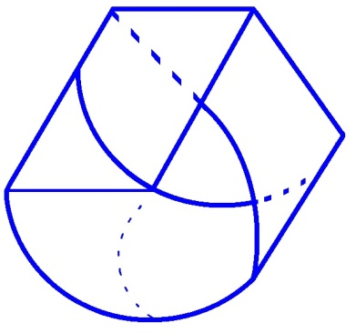
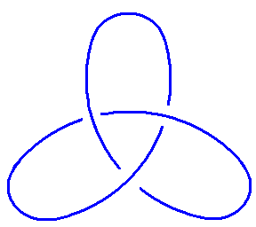
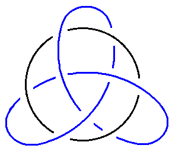
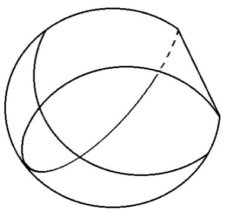
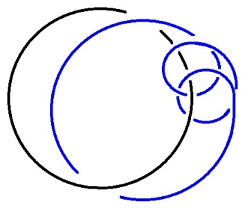
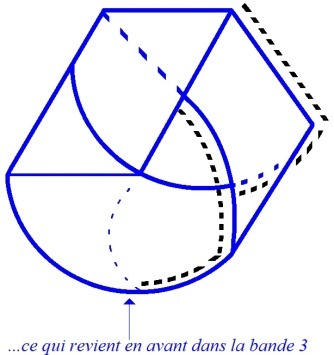
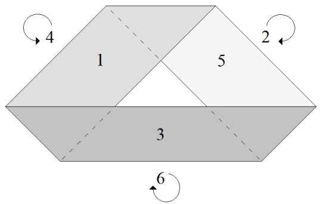
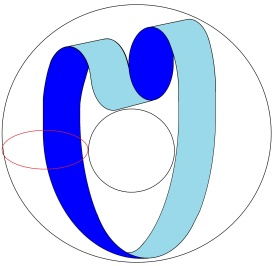
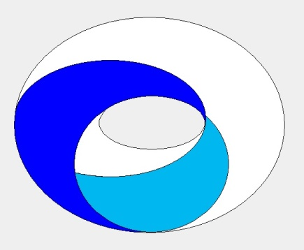

# Leçon 01 | 21 Novembre 1978

<!-- source-url: http://staferla.free.fr/S26/S26 La topologie et le temps.docx -->
<!-- seminar: s26 -->
<!-- lesson: 01 -->

<!-- id: s26-01-0001 -->

Il y a une correspondance entre la topologie et la pratique.

<!-- id: s26-01-0002 -->

Cette correspondance consiste en les temps.

<!-- id: s26-01-0003 -->

La topologie résiste, c’est en cela que la correspondance existe.

<!-- id: s26-01-0004 -->

Il y a une bande de Mœbius que nous avons tracée :

<!-- id: s26-01-0005 -->

<!-- id: s26-01-0006 -->

C’est ce qu’on appelle une bande triple. On peut remarquer que cette bande triple, ce qui la caractérise c’est qu’elle a des bords et que ses bords sont à peu près comme ceci :

<!-- id: s26-01-0007 -->

<!-- id: s26-01-0008 -->

Ses bords sont ceci :

<!-- id: s26-01-0009 -->

<!-- id: s26-01-0010 -->

pour mieux dire ceci :

<!-- id: s26-01-0011 -->

<!-- id: s26-01-0012 -->

Si vous rabattez ces bords, vous obtenez quelque chose qui se présente comme ça : Et le cercle noir prend alors cet aspect là. Voilà à peu près ce que ça donne.

<!-- id: s26-01-0013 -->

Ici le cercle noir est blanc. \[*Lacan désigne un rond de ficelle blanc passant à l’intérieur d’un enroulage de ficelle jaune*\].

<!-- id: s26-01-0014 -->

Voilà, je vous le passe.

<!-- id: s26-01-0015 -->

<!-- id: s26-01-0016 -->

|     |     |     |
|-----|-----|-----|
|     |     |     |
|     |     |     |
|     |     |     |

<!-- id: s26-01-0017 -->

Il y a une façon - cette bande - de la couvrir \[*pointillés*\] :

<!-- id: s26-01-0018 -->

<!-- id: s26-01-0019 -->

Après ça, ça passe derrière la bande suivante.

<!-- id: s26-01-0020 -->

Mais ce qu’il faut voir, c’est que *ce qui passe derrière* la bande suivante est précisément *ce qui revient en avant de la bande 3*, après quoi ça revient derrière ce qui est là inscrit, je veux dire derrière la bande de Mœbius triple.

<!-- id: s26-01-0021 -->

C’est pourquoi ça revient en avant.

<!-- id: s26-01-0022 -->

De sorte que ce qu’on a, c’est

<!-- id: s26-01-0023 -->

- en avant : 1, 3, 5,

<!-- id: s26-01-0024 -->

- derrière : 2, 4, 6, ...6 qui rejoint le 1.

<!-- id: s26-01-0025 -->

C’est bien ce que j’ai - de *la bande enveloppante* – marqué \[*en* *pointillés*\].

<!-- id: s26-01-0026 -->

Vous pouvez la manipuler et même en recouvrir la bande triple.

<!-- id: s26-01-0027 -->

Vous avez ici un autre exemplaire de ce que j’ai appelé pour l’instant « *la bande enveloppante *».

<!-- id: s26-01-0028 -->

Vous pouvez en constater l’identité avec...

<!-- id: s26-01-0029 -->

Ce qu’il y a de frappant, c’est qu’*une bande de Mœbius* normale...

<!-- id: s26-01-0030 -->

> en voilà un exemple :
>
>  ...*une bande de Mœbius* normale - c’est à dire *une bande de Mœbius* comme ça - a également le 1 et le 2 et le 3 et le 4 à la même place :

<!-- id: s26-01-0031 -->

- tous ceux-là : 2, 4, 6, sont derrière,

<!-- id: s26-01-0032 -->

- et ceux-là : 1, 3, 5, sont devant.

<!-- id: s26-01-0033 -->

Voilà le 1, il passe derrière ici au 2 et il passe devant au 3. Au 4, il passe derrière, ce qui lui permet de revenir devant au 5 et de passer par derrière pour rejoindre le 1 par ce qu’on appelle le 6.

<!-- id: s26-01-0034 -->

La bande enveloppante a donc deux bords dans *la bande de Mœbius* à 3.

<!-- id: s26-01-0035 -->

Ce qu’on voit facilement sur la bande que je fais circuler à l’instant.

<!-- id: s26-01-0036 -->

C’est un point important, vous pourrez le contrôler sur ce que je vous ai fait circuler à l’instant.

<!-- id: s26-01-0037 -->

Il y a quelque chose de commun entre toutes *les bandes de Mœbius*, ne serait-ce que cette alternance.

<!-- id: s26-01-0038 -->

Est-ce qu’il est possible - c’est certain... - de couper les bandes de Mœbius ?

<!-- id: s26-01-0039 -->

Non seulement on peut couper chacune, mais on peut couper aussi ce que j’appelle la doublure.

<!-- id: s26-01-0040 -->

Qu’est ce que la doublure ?

<!-- id: s26-01-0041 -->

Il peut y avoir une doublure toute seule. Mais dans ce cas, il faut couper la bande de Mœbius, la bande de Mœbius qui est en somme l’âme de l’affaire.

<!-- id: s26-01-0042 -->

Il y a un moyen de tracer sur un tore une bande de Mœbius.

<!-- id: s26-01-0043 -->

Voilà comment on le trace s’il s’agit de la bande à trois.

<!-- id: s26-01-0044 -->

→  →  → 

<!-- id: s26-01-0045 -->

Il faut pour cela pincer le tore et accoler les deux surfaces qui sont celles du tore [^1].

<!-- id: s26-01-0046 -->

La face intérieure disparaît, elle est tamponnée, écrasée.

<!-- id: s26-01-0047 -->

Il est aussi facile de faire avec le tore *une bande à* 3...

<!-- id: s26-01-0048 -->

ce que je voulais dire c’était qu’il était aussi facile de faire *une bande à* 1.

<!-- id: s26-01-0049 -->

<!-- id: s26-01-0050 -->

Il y a quand même une béance entre la psychanalyse et la topologie.

<!-- id: s26-01-0051 -->

Ce dont je m’efforce, c’est - cette béance - de la combler.

<!-- id: s26-01-0052 -->

La topologie est exemplaire, elle permet dans la pratique de faire un certain nombre de métaphores.

<!-- id: s26-01-0053 -->

Il y a une équivalence entre la structure et la topologie.

<!-- id: s26-01-0054 -->

C’est ça le « *Ça* » dont il s’agit dans Groddeck, c’est ça qui est « *Ça* ».

<!-- id: s26-01-0055 -->

Il faut s’orienter dans la structure.

<!-- id: s26-01-0056 -->

Il n’y a pas que les nœuds borroméens.

<!-- id: s26-01-0057 -->

Pour généraliser ce qu’on appelle les nœuds borroméens, il peut y avoir une façon de faire qui ne fait pas qu’un nœud soit, en en coupant un, libéré de tous les autres.

<!-- id: s26-01-0058 -->

Il y a une certaine façon de préciser qu’en en coupant 2 sur 5, c’est très précisément ce qui nécessite que les 3 qui restent soient libres.

<!-- id: s26-01-0059 -->

C’est ce qu’on appelle la généralisation des nœuds borroméens.

<!-- id: s26-01-0060 -->

En en coupant 2 sur 5, les 3 autres sont libres.

<!-- id: s26-01-0061 -->

J’essaierai de vous en donner un exemple d’ici la fin de l’année.

<!-- id: s26-01-0062 -->

Voilà, j’ai parlé une heure. Je vous remercie de votre attention.

## Notes

[^1]: Cf. « *L’étourdit* » : « *Un peu de topologie vient maintenant*. », *Scilicet* n° 4, Seuil, 1973, p. 26
