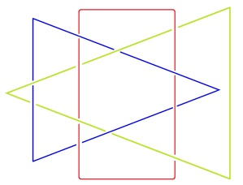
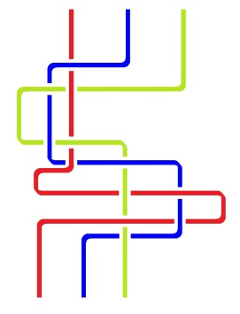

# Leçon 04 | 9 janvier 1979

<!-- source-url: http://staferla.free.fr/S26/S26 La topologie et le temps.docx -->
<!-- seminar: s26 -->
<!-- lesson: 04 -->

<!-- id: s26-04-0001 -->

Il n’y a pas de rapport sexuel, c’est ce que j’ai énoncé.

<!-- id: s26-04-0002 -->

Qu’est-ce qui y supplée, parce que il est clair que les gens...

<!-- id: s26-04-0003 -->

> ce qu’on appelle tel, soit les êtres humains ...les gens font l’amour.

<!-- id: s26-04-0004 -->

Il y a à ça une explication : la possibilité...

<!-- id: s26-04-0005 -->

> notons que « *le possible* », c’est ce que nous avons défini comme « *ce qui cesse de s’écrire* » ...la possibilité d’un 3ème sexe.

<!-- id: s26-04-0006 -->

Pourquoi il y en a 2 d’ailleurs, ça s’explique mal.

<!-- id: s26-04-0007 -->

C’est ce qui est évoqué dans la doublure d’Ève, à savoir Lilith.

<!-- id: s26-04-0008 -->

L’évocation n’est pourtant pas une chose précise.

<!-- id: s26-04-0009 -->

C’est justement de précision, c’est-à-dire de *Réel*, que j’ai fait état en rêvant à ce qu’il en est du *nœud borroméen*.

<!-- id: s26-04-0010 -->

Le nœud borroméen a comme consistance de s’imaginer.

<!-- id: s26-04-0011 -->

Quelle est la différence entre l’*Imaginaire* et ce qu’on appelle le *Symbolique*, autrement dit le langage.

<!-- id: s26-04-0012 -->

Le langage a ses lois dont l’universalité est le modèle, la particularité ne l’est pas moins.

<!-- id: s26-04-0013 -->

Ce que l’*Imaginaire* fait, il imagine le *Réel* : c’est une réflexion.

<!-- id: s26-04-0014 -->

Une réflexion tient au miroir, c’est donc dans le miroir que s’exerce une fonction.

<!-- id: s26-04-0015 -->

Le miroir est le plus simple des appareils.

<!-- id: s26-04-0016 -->

C’est une fonction en quelque sorte toute naturelle.

<!-- id: s26-04-0017 -->

C’est curieux que j’aie choisi le nœud borroméen pour en faire quelque chose.

<!-- id: s26-04-0018 -->

Mais le nœud borroméen a pour propriété qu’on peut commencer par n’importe lequel.

<!-- id: s26-04-0019 -->

Tout au contraire, celui-ci (I) : on ne peut pas commencer par n’importe lequel.

<!-- id: s26-04-0020 -->

Si on commence par celui-là (le vert), il y a un obstacle, ça fait *tresse* comme le démontre le dessin qui est à gauche (III), mais si on tire celui-là vers la droite, ce sont les deux autres qui sont entraînés et on ne sait pas ce qu’il est de ce qui peut résulter de cet entraînement.

<!-- id: s26-04-0021 -->

En tout cas, ce sont les deux autres.

<!-- id: s26-04-0022 -->

C’est le même cas pour celui-ci (II) et c’est bien pourquoi ce qui est là ne peut pas servir à symboliser *l’Imaginaire*, *le Symbolique* et *le Réel*. Car ce qu’on symbolise dans *l’Imaginaire*, *le Symbolique* et *le Réel*, c’est l’intérieur du cercle (V), c’est le champ intérieur du cercle, le champ : c.h.a.m.p.

<!-- id: s26-04-0023 -->

De sorte que ce dont il s’agit c’est d’une métaphore. Il serait beaucoup plus difficile d’installer une métaphore dans ce dessin-là (I) que dans celui-ci (V), à plus forte raison dans le 3ème dessin (II).

<!-- id: s26-04-0024 -->

  

<!-- id: s26-04-0025 -->

I V II

<!-- id: s26-04-0026 -->

Car le troisième dessin (II) a l’air plus compliqué, mais c’est le même.

<!-- id: s26-04-0027 -->

C’est le même étant donné que le rouge a là une inflexion qui pourrait permettre de régulariser, de faire rentrer le dessin de gauche (I) dans le dessin de droite (II).

<!-- id: s26-04-0028 -->

La différence, c’est que celui-ci (II) colle avec celui-là (III)

<!-- id: s26-04-0029 -->

 

<!-- id: s26-04-0030 -->

> II III et que celui-ci (V) se tresse comme celui-là (IV) :

<!-- id: s26-04-0031 -->

 

<!-- id: s26-04-0032 -->

V IV

<!-- id: s26-04-0033 -->

La métaphore du nœud borroméen à l’état le plus simple est impropre.

<!-- id: s26-04-0034 -->

C’est un abus de métaphore, parce qu’en réalité il n’y a pas de chose qui supporte *l’Imaginaire*, *le Symbolique* et *le Réel*. Qu’il n’y ait pas de rapport sexuel, c’est ce qui est l’essentiel de ce que j’énonce.

<!-- id: s26-04-0035 -->

*Qu’il n’y ait pas de rapport sexuel* parce qu’il y a un *Imaginaire*, un *Symbolique* et un *Réel*, c’est ce que je n’ai pas osé dire.

<!-- id: s26-04-0036 -->

Je l’ai quand même dit.

<!-- id: s26-04-0037 -->

Il est bien évident que j’ai eu tort, mais je m’y suis laissé glisser... je m’y suis laissé glisser tout simplement.

<!-- id: s26-04-0038 -->

C’est embêtant, c’est même plus qu’ennuyeux.

<!-- id: s26-04-0039 -->

C’est d’autant plus ennuyeux que c’est injustifié.

<!-- id: s26-04-0040 -->

C’est ce qui m’apparait aujourd’hui, c’est du même coup ce que je vous avoue. Bien !
