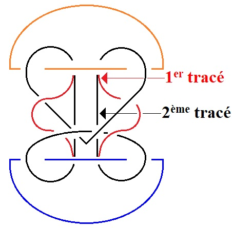
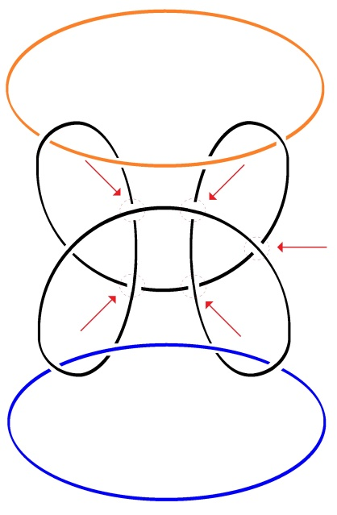
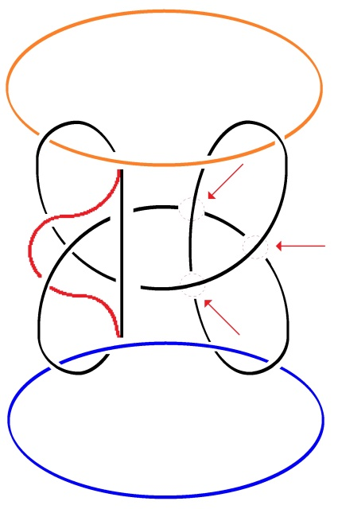

# Leçon 07 | 13 Mars 1979

<!-- source-url: http://staferla.free.fr/S26/S26 La topologie et le temps.docx -->
<!-- seminar: s26 -->
<!-- lesson: 07 -->

<!-- id: s26-07-0001 -->

Il y quelque chose que je vous ai dit : pourquoi n’y aurait-il pas un troisième sexe ?

<!-- id: s26-07-0002 -->

Tout ça vient de ce que j’ai étudié le borroméen généralisé.

<!-- id: s26-07-0003 -->

→ 

<!-- id: s26-07-0004 -->

→  → 

<!-- id: s26-07-0005 -->

**Nœud dénoué**

<!-- id: s26-07-0006 -->

Le borroméen généralisé, il va de soi que je n’y comprends rien, je m’embrouille...

<!-- id: s26-07-0007 -->

Je m’embrouille, ce dont vous témoigne le fait qu’en écrivant au tableau, je m’y suis, c’est le cas de le dire, absolument embrouillé.

<!-- id: s26-07-0008 -->

Je voudrais aujourd’hui vous faire sentir que le borroméen généralisé, ce n’est pas une petite affaire...

<!-- id: s26-07-0009 -->

Je m’embrouille et je vous congédie de ce fait.
