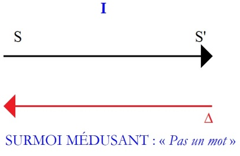
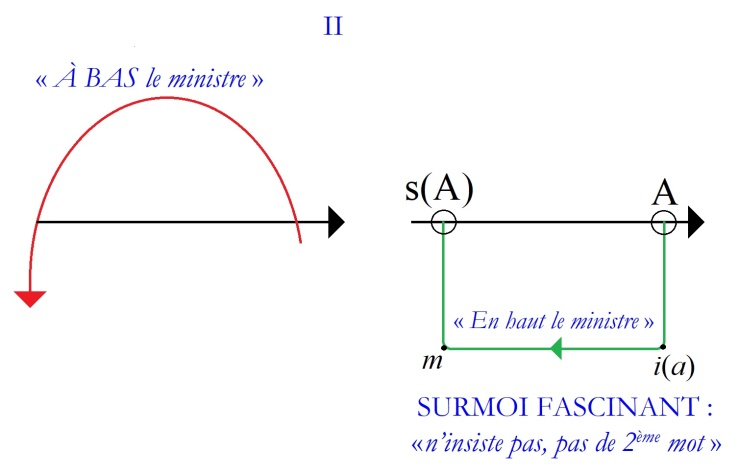
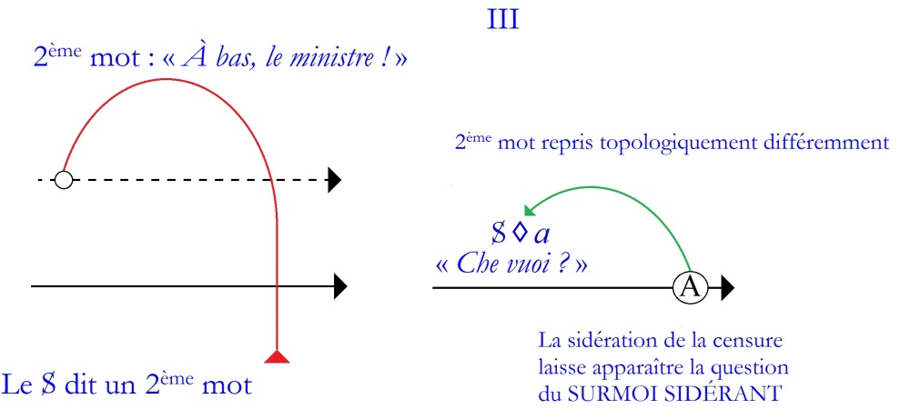
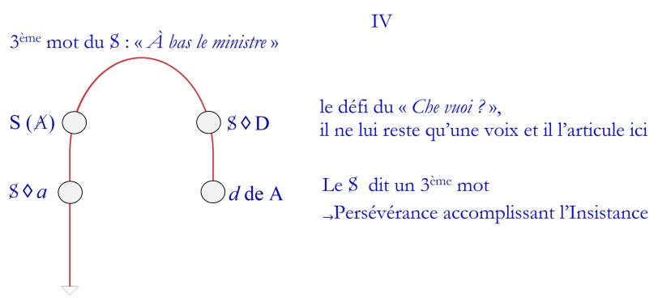
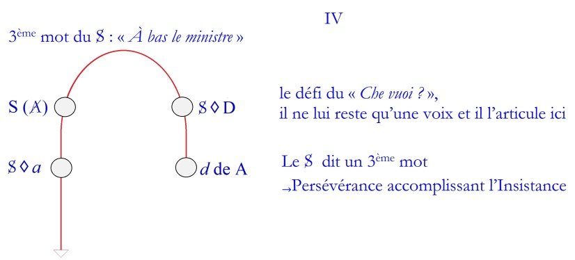
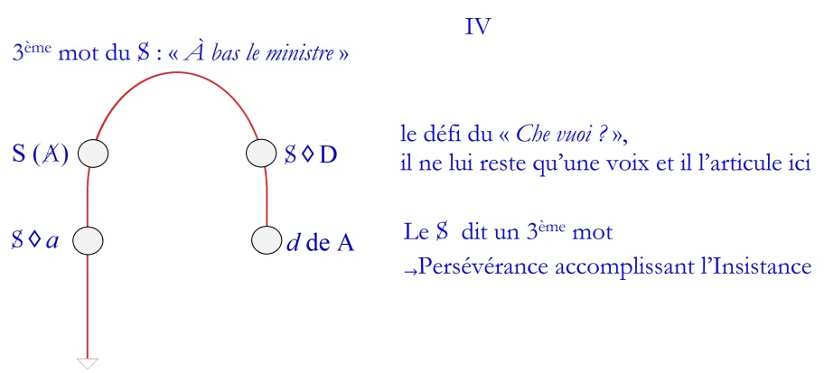
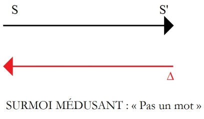
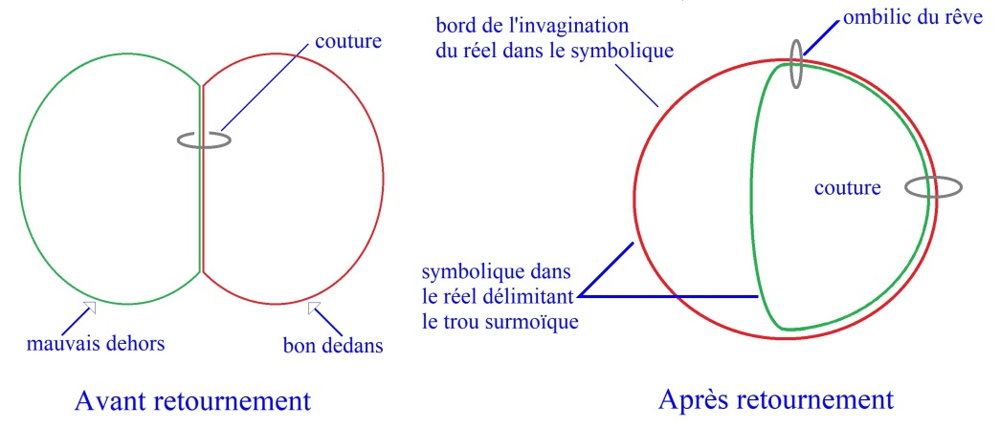

# Leçon 09 | 8 mai 1979

<!-- source-url: http://staferla.free.fr/S26/S26 La topologie et le temps.docx -->
<!-- seminar: s26 -->
<!-- lesson: 09 -->

<!-- id: s26-09-0001 -->

<u>Alain Didier-Weill</u>

<!-- id: s26-09-0002 -->

Lacan - Je vais passer la parole à Alain Didier-Weill

<!-- id: s26-09-0003 -->

Alain Didier- Weill

<!-- id: s26-09-0004 -->

Je ne vous demanderai pas d’être indulgent avec ce que je vais essayer de vous dire, mais tout au moins de tenir compte de ce que c’est un travail qui a été préparé dans la hâte, voire la précipitation, puisque le Dr Lacan m’a demandé de vous en faire part hier.

<!-- id: s26-09-0005 -->

Alors tenez compte que ça n’a pas la qualité vraiment d’un écrit.

<!-- id: s26-09-0006 -->

Et je vais essayer de vous transmettre, je vais essayer de vous rendre compte de la rencontre, je dirai de deux enseignements, que je reçois

<!-- id: s26-09-0007 -->

- et de Lacan,

<!-- id: s26-09-0008 -->

- et du dialogue analytique.

<!-- id: s26-09-0009 -->

Double rencontre en ce qu’il m’a fallu *longtemps* je dirai, pour repérer en quoi et comment les élucubrations qui se sont trouvées s’imposer à moi dans le cadre du dialogue analytique, en quoi finalement ces élucubrations étaient

<!-- id: s26-09-0010 -->

- d’une part inscriptibles sur le graphe dont - je dois vous dire - les ressources n’ont pas fini de m’étonner,

<!-- id: s26-09-0011 -->

- et d’autre part, en s’inscrivant, inscriraient comme je vais essayer de vous le montrer, une relation articulée entre la topologie et le temps, c’est-à-dire rencontraient finalement le thème du séminaire de cette année.

<!-- id: s26-09-0012 -->

En l’occurrence , cette articulation entre topologie et temps que j’ai soumise au Dr Lacan se supporte d’un repérage, dont je vais maintenant essayer de vous rendre compte, d’une dialectique de la parole du sujet parlant en tant qu’*habité* je dirai, par un certain rythme temporel, rythme à trois temps comme la valse, qui exigerait finalement que le sujet ait à compter jusqu’à trois pour dire un mot.

<!-- id: s26-09-0013 -->

Ce rythme à trois temps, je vais essayer de vous transmettre la façon dont il m’apparait inférable à l’existence de trois *surmoi*, représentant chacun synchroniquement dans la structure et diachroniquement une étape nécessaire de franchissement pour qu’advienne la parole.

<!-- id: s26-09-0014 -->

Je vais annoncer, si vous voulez, d’emblée la couleur avant la démonstration proprement dite et provisoirement donc, j’avance ce que je vais essayer de soutenir, c’est qu’il y aurait :

<!-- id: s26-09-0015 -->

- un 1er *surmoi* dont la fonction serait d’enjoindre au sujet : « *tu ne diras pas un mot* »,

<!-- id: s26-09-0016 -->

- un 2ème *surmoi* dont la fonction serait d’énoncer « *tu n’en diras pas deux* »,

<!-- id: s26-09-0017 -->

- un 3ème dont la fonction serait : « *tu n’en diras pas trois* ».

<!-- id: s26-09-0018 -->

Dans la mesure où dans le cadre d’une séance de séminaire ça me parait ardu d’exposer point par point cette notion, il faut bien prendre un fil : l’idée qui m’est venue pour rentrer dans cette histoire est de me supporter d’un petit apologue de Freud, et ce petit apologue c’est celui que prend Freud dans la *Traundeutung* la 1ère fois qu’il introduit le terme de « censure » qui est cet ancêtre du Surmoi, et dans la *Traundeutung*, si vous voulez vous y reporter, c’est après le commentaire que Freud fait du « rêve de l’oncle Joseph ».

<!-- id: s26-09-0019 -->

Alors cet apologue est le suivant. Si vous voulez, cet apologue va me permettre d’essayer de vous montrer en quoi la division du sujet est inférable à une division du *surmoi*.

<!-- id: s26-09-0020 -->

Dans cet apologue, Freud compare le *surmoi*, le censeur, à un souverain qui régnerait sur des sujets, et des sujets qui se trouvent en position de rebeller, de se révolter contre un ministre devenu impopulaire, cause de révolte.

<!-- id: s26-09-0021 -->

Ce que repère Freud tout de suite, c’est que les sujets ont à leur disposition leur révolte et ont un savoir élémentaire, le Roi, le censeur, est dans la position d’un savoir d’une autre structure, puisque la position du Roi est la suivante, c’est qu’il sait qu’il doit compter sur l’opinion publique, mais il sait qu’il doit faire comme si cette opinion publique ne comptait pas pour lui, c’est-à-dire que, schématiquement, la révolte éclate aux cris : « *À bas le ministre !* ».

<!-- id: s26-09-0022 -->

Ce que dit Freud dans un premier temps, il dit : eh bien voilà, le censeur pour apaiser la révolte, il fonctionne comme quelqu’un qui ne considère pas que ses sujets sont représentés comme sujets par ce signifiant, « *À bas le ministre !* », et il fait donc comme si ses sujets parlant n’existaient pas comme tels, sans que se soit pour autant une provocation \- ça c’est important- et il répond, on pourrait dire, par un message inversé, cette réponse étant le fait qu’il promeut le ministre à une distinction supérieure, c’est-à-dire qu’il répond à la limite, si vous voulez, par « *En haut le ministre* ».

<!-- id: s26-09-0023 -->

J’ai écrit ceci là, sur ces graphes, vous voyez, j’en suis au point (**I**) : le sujet dit un premier mot.

<!-- id: s26-09-0024 -->

<!-- id: s26-09-0025 -->

Le premier mot, nous sommes sur la cellule élémentaire du graphe, un premier mot : « *À bas le ministre !* ».

<!-- id: s26-09-0026 -->

À ce premier mot, le Surmoi répond, parce que le Surmoi il est bon prince, on pourrait dire.

<!-- id: s26-09-0027 -->

Il est bon prince parce qu’il dit : « *Un mot : passe... pour un mot je passe, d’accord, mais n’insiste pas !* » c’est-à-dire pour un mot ça va, mais pas un deuxième.

<!-- id: s26-09-0028 -->

<!-- id: s26-09-0029 -->

Et la stratégie du *surmoi*... c’est pour ça que vous voyez, le Surmoi, j’ai écrit cette réponse du *surmoi* en utilisant l’inversion de l’étage inférieur *moïque*, c’est-à-dire ce qui introduit le champ de la dénégation dans la mesure où la censure est alliée avec le *moi* à ce niveau-là.

<!-- id: s26-09-0030 -->

Et le message inversé qui consiste à écrire ici « *En haut le ministre !* » : j’élève le ministre, eh bien, a pour effet, remarque Freud, de suspendre le message du sujet qui, alors qu’il disait : « *À bas le ministre !* » , de l’effet de cette réponse du *surmoi*, le message va être interrompu et le sujet va la boucler.

<!-- id: s26-09-0031 -->

Je veux dire que Freud ne va pas plus loin que ce petit apologue, mais il a le mérite quand même de montrer que cette stratégie, s’il l’écrit ainsi, c’est qu’elle se révèle opérante, comme l’expérience l’apprend, et en quoi est-ce que c’est opérant, en quoi est-ce que cette réponse de la censure a-t-elle le pouvoir d’interrompre le message du sujet ?

<!-- id: s26-09-0032 -->

*Une série de points*...

<!-- id: s26-09-0033 -->

Si vous voulez, cliniquement vous pouvez repérer que l’injonction de la censure a ceci de particulier : ça peut vous évoquer qu’à son injonction le commandement surmoïque a ceci de particulier de s’opposer au commandant que serait un commandant à galon, c’est que le commandement surmoïque, il ne représente pas le sujet pour un autre signifiant, à l’opposé du *commandant de division* qui, s’il donne un ordre si féroce soit-il et qui voudrait se rapprocher de l’ordre surmoïque, n’y atteint pas.

<!-- id: s26-09-0034 -->

Si vous souscrivez à l’ordre du *commandant de division*, je dirais que ce n’est pas pour autant que vous êtes *désubjectivés*, c’est par exemple pour ne pas avoir d’emmerdements, pour avoir votre permission.

<!-- id: s26-09-0035 -->

Mais si vous obéissez à l’injonction surmoïque, c’est que vous êtes dans cette position que me disait d’une façon très pertinente une analysante: qu’est-ce qui fait que devant certains que je rencontre, qui me disent un mot si bête soit-il éventuellement, je suis dans l’impossibilité radicale de contredire, pas possible de dire non. Non.

<!-- id: s26-09-0036 -->

Ceci dit, ce qu’il faut - ça, c’est le premier point - ce qu’il faut comprendre, c’est que, comme je vous le disais...

<!-- id: s26-09-0037 -->

> parce que, vous le voyez, la censure a laissé passer un premier mot ...l’important c’est de comprendre que « *pour une fois ça passe, mais n’insiste pas* ».

<!-- id: s26-09-0038 -->

« *N’insiste pas* », ça veut dire : n’en rajoute pas, et vous sentez là que ce « *N’insiste pas* », c’est la racine même de cette dimension qui saisit le sujet qui est celle de l’angoisse du ridicule. Regardez autour de vous, écoutez, observez vous-même : généralement *l’angoisse du ridicule*, *l’angoisse du paraître con*, de paraître idiot, voire de paraitre laid, n’est pas autre chose que l’obéissance finalement à cette idée : n’insiste pas, écrase, tu serais ridicule.

<!-- id: s26-09-0039 -->

Et effectivement le sujet, à ce moment-là, se dédit et quand il se dédit de cette façon-là, quand il se rétracte, il est dans la position de culpabilité la plus intense et il a raison de l’être parce que c’est ça la culpabilité : c’est de céder sur la responsabilité, c’est-à-dire sur la responsabilité à répondre.

<!-- id: s26-09-0040 -->

Autre point, si vous voulez : à la censure qui a laissé passer un mot, mais qui ne veut pas qu’un 2ème mot soit dit, c’est-à-dire qui ne veut pas que ce 1er dit soit soutenu par un 2ème dit, dans le fond c’est tout ce que l’enseignement du rêve nous apprend... Regardez par exemple cet exemple qui a été commenté par Lacan dans « Les *formations de l’inconscient* », ce rêve que vous connaissez, je pense : une analysante rêve sur le mot « *canal* », je ne reprends pas le rêve en détail, mais la signification, à l’issue de *l’interprétation du rêve*, révèle que le mot « *canal* », elle veut dire là à Freud : « *Vos théories me font bidonner, c’est pas sérieux* ».

<!-- id: s26-09-0041 -->

La censure laisse passer le mot « canal ». Ce qu’elle ne laisse pas passer, c’est que le sujet disant « canal » reconnaît que s’il soutenait ce mot là, c’est-à-dire que s’il voyait d’où il parlait, ça le mettrait en position de dire à Freud : « *Vos théories me font marrer, ne sont pas sérieuses* ». Et éventuellement on peut penser que si elle avait dit à Freud dans le cadre de sa séance : « *Vos théories, du sublime au ridicule, il n’y a qu’un pas !* », si elle le lui avait dit, elle aurait fait l’économie de ce rêve.

<!-- id: s26-09-0042 -->

Donc la censure, comme vous le voyez, ne voulant pas que le 1er mot soit confirmé par un 2ème mot, ce à quoi la censure fait obstacle, c’est que le sujet trouve en lui le point d’au-delà d’où il peut soutenir le 1er dit qu’il a avancé.

<!-- id: s26-09-0043 -->

Autre point décisif que je veux souligner avant d’aller plus loin, c’est que le sujet ayant dit un mot, il ne fait pas de doute qu’il est un sujet parlant. La censure va avoir une autre stratégie : comme il ne fait pas de doute, il va prendre, je dirais, le biais de rendre le sujet douteux, c’est-à-dire que le sujet est mis en position, s’il insistait, d’être confronté à un autre qui est en position de le soupçonner.

<!-- id: s26-09-0044 -->

Quelle est la différence entre, un sujet « soupçonné » ou un sujet « supposé » ?

<!-- id: s26-09-0045 -->

Eh bien, je dirais

<!-- id: s26-09-0046 -->

- *qu’un sujet supposé* c’est un sujet qui est éventuellement supposé pouvoir vous surprendre,

<!-- id: s26-09-0047 -->

- *un sujet soupçonné*, à l’encontre, c’est un sujet dont fondamentalement rien ne saurait surprendre venant de lui, puisqu’il y a, par rapport au sujet soupçonné, une prévention, une présomption plus exactement, et que rien de lui ne saurait surprendre : quoi qu’il dise, ça sera intégré quelque part et ça n’aura rien de surprenant.

<!-- id: s26-09-0048 -->

Si vous voulez, vous voyez par là que nous sommes très proches, ce censeur, il est très proche du « non-dupe » dont nous a parlé Lacan en son temps, il en est très proche parce qu’il est dans la position :

<!-- id: s26-09-0049 -->

> « *tu ne m’auras pas, on ne me la fait pas, quoi que tu disais je sais où situer ce que tu as à dire*
>
> *et dans cette position de méfiance, de soupçon, je t’ai à l’œil, je ne serai pas surpris.* »

<!-- id: s26-09-0050 -->

Je débouche là sur un point tout à fait fondamental, c’est qu’une fonction tout à fait décisive de la censure...

<!-- id: s26-09-0051 -->

> c’est un point qui, à mon avis, n’a pas assez été retenu ...est de considérer ce prévenu qu’est le sujet pour elle, de prévenir *toute surprise* *possible* venant de lui et en particulier - ça c’est textuellement dans Freud - Freud dit qu’une des fonctions de la censure est de dépouiller de son intensité ce qu’il appelle « *le signifiant de haute valeur psychique* ».

<!-- id: s26-09-0052 -->

Ce *signifiant de haute valeur psychique* autour duquel je vais centrer ce travail, c’est - je vous le signale en passant - le signifiant qui est la cause du rêve, c’est le signifiant que le sujet a rencontré dans la journée et auquel ayant été confronté il est resté coi, bouche bée, sans répondant et avec l’esprit d’escalier qui caractérise ce sujet qui n’a pas pu répondre, il lui faut le temps d’incubation de la journée et il n’arrive à répondre que dans la nuit avec l’aide d’un rêve à ce signifiant qui l’a, pour l’instant interloqué avant de voir de plus près de quoi il retourne.

<!-- id: s26-09-0053 -->

Le problème de la censure, c’est que sa fonction c’est surtout de prévenir le sujet contre le fait qu’il puisse accéder à cet état de *fading*, de sidération par ce *signifiant de haute valeur psychique* qui est donc dépouillé de son efficace.

<!-- id: s26-09-0054 -->

Encore un mot de ce censeur, ou ce « non-dupe », vous pouvez imaginer que c’est dans la mesure où le fait de ne pas pouvoir être surpris nécessite chez lui le développement - je crois qu’on peut le dire- d’une intelligence importante, puisqu’il aura réponse à tout, rien ne saurait le surprendre.

<!-- id: s26-09-0055 -->

Maintenant je vais me permettre de continuer cet apologue que Freud avait commencé, et de faire un peu de fiction.

<!-- id: s26-09-0056 -->

<!-- id: s26-09-0057 -->

On en est là : « *n’insiste pas* ».

<!-- id: s26-09-0058 -->

Effectivement le sujet s’est désisté, il n’a pas insisté sous l’effet de ce que je viens d’essayer de dire.

<!-- id: s26-09-0059 -->

Maintenant rien ne nous empêche d’imaginer quelles sont les conditions qui permettraient au 1er mot dit par le sujet...

<!-- id: s26-09-0060 -->

> c’est-à-dire « *À bas, le ministre !* » ...quelles seraient les conditions qui feraient que cet « *À bas, le ministre !* » revienne, c’est-à-dire soit repris.

<!-- id: s26-09-0061 -->

Alors là on pourrait - je passe un peu - mais on pourrait en détaillant les choses, montrer par quel processus le sujet accéderait au savoir ou à la tromperie qui est celle du censeur.

<!-- id: s26-09-0062 -->

Mais pour l’instant retenons cette idée : c’est qu’à un moment donné, après un temps, disons *d’effacement du sujet*, de silence, se reproduit un 2ème mot par lequel le sujet reprend sa révolte, c’est-à-dire : « *À bas, le ministre !* ».

<!-- id: s26-09-0063 -->

Mais, vous voyez, ce 2ème mot ne s’écrit pas sur le graphe

<!-- id: s26-09-0064 -->

- de la même façon,

<!-- id: s26-09-0065 -->

- c’est-à-dire au même lieu,

<!-- id: s26-09-0066 -->

- c’est-à-dire que ça peut être le même mot, il n’est pas le même parce qu’il est situé topologiquement tout à fait différemment.

<!-- id: s26-09-0067 -->

Alors quel est l’impact de ce 2ème mot, de cette reprise disons de la révolte, quel est son impact, qu’est-ce qui se passe quand il se situe à cet étage supérieur du graphe, c’est-à-dire quand il reprend le fait qu’il se soit dédit et il ne se dédit pas dans un premier temps. C’est l’amorce de la persévération.

<!-- id: s26-09-0068 -->

<!-- id: s26-09-0069 -->

Je dirais qu’il y a deux éléments qui concourent à la production de ce 2ème mot :

<!-- id: s26-09-0070 -->

- je dirais d’abord, il y a l’insistance de répétition, c’est-à-dire de la production de cet au-delà d’où le sujet peut répondre de son 1er dit,

<!-- id: s26-09-0071 -->

- et puis il y a ensuite le fait que cette relation *d’ordre imaginaire* avec le censeur qui prend comme point d’appui la haine, la haine du persécuteur et qui représente un point d’appui pour le sujet, dans cette relation spéculaire de « *Tu ne m’auras pas, tu ne feras pas taire, c’est moi qui aurait le dernier mot* », il y a cette dimension dans cette reprise également.

<!-- id: s26-09-0072 -->

Maintenant une fois que le mot a été dit, il se passe quelque chose de tout à fait important qui est la chose suivante, une fois que le mot une 2ème fois a été dit : « *À bas, le ministre !* », ce qui se passe c’est que le censeur qui disait : « *Tu ne diras pas deux fois* », le censeur est en position j’allais dire d’être *censuré*, mais en tout cas : *le censeur, on passe outre*, c’est-à-dire que le censeur devant cette position, sa vocation de censeur, sa fonction n’a plus lieu d’être et je crois qu’on peut avancer là que le censeur est objectivement sidéré.

<!-- id: s26-09-0073 -->

Que le censeur soit objectivement sidéré se traduit par le fait que le sujet est alors déshabité par la censure qui le déshabite littéralement, et ce vide qui se fait en lui du fait de cette censure qui le déshabite, c’est le sujet qui en reçoit le contrecoup qui est, lui, d’être sidéré.

<!-- id: s26-09-0074 -->

Prenons un exemple tout bête dans les étapes de la Révolution Française, quand après les premières émeutes, un matin le peuple de Paris ayant appris que son 16ème censeur s’était enfui à Varennes, avait abdiqué, en était sidéré. Michelet raconte dans les « *Mémoires* » que pendant quelques heures dans la matinée, le peuple de Paris était littéralement comme sidéré, c’est-à-dire sans voix, du fait que brusquement la consistance de l’autre, qui était là pour soutenir une relation persécutive de censeur, disparaissant, le sujet du coup c’est lui qui en recevait le contrecoup que j’appelle de sidération. Je m’expliquerai après sur ce mot d’avantage.

<!-- id: s26-09-0075 -->

Ce qui va se produire, c’est que dans le vide qui se produit du fait de la sidération de la censure, dans ce vide-là, à ce moment-là, ce vide va laisser le champ au surgissement effectivement de quelque chose de nouveau et de radicalement surprenant et étonnant, qui est - comme je vous l’ai écrit sur le graphe - la voix que Lacan dit quelque part « *mugissante* » du « *Che vuoi ?* » c’est-à-dire que la censure est sidérée.

<!-- id: s26-09-0076 -->

<!-- id: s26-09-0077 -->

Le contrecoup de cette sidération fait que ce que j’appelle, dans la façon dont je présente les choses ce matin, « *le* 3ème *surmoi* » va se faire entendre.

<!-- id: s26-09-0078 -->

C’est-à-dire que dans ce vide constitué, à ce moment-là le sujet entend ce « *Che vuoi ?* » et ce qui apparaît de tout à fait nouveau, c’est que ce « *Che vuoi ? *» n’a plus la consistance d’un censeur persécutif, ce « *Che vuoi ?* » n’est pas quelqu’un qui répond, qui donne des réponses comme un censeur puisque la réponse énigmatique, radicalement énigmatique et étonnante...

<!-- id: s26-09-0079 -->

> mais quand je dis étonnante, c’est au sens fort, il faut entendre le mot tonnerre ...c’est que ce « *Che vuoi ?* », il donne une réponse qui est une question : « *Che vuoi ?* ».

<!-- id: s26-09-0080 -->

Alors vous voyez que le surgissement de ce « *Che vuoi ?* » dont l’origine est le signifiant de l’Autre, qui est en rapport avec le signifiant du Nom du Père, mais j’essayerai peut-être de mieux le soutenir tout à l’heure, dont je dirais qu’à ce moment-là tout se passait comme si le signifiant du Nom du Père chutait dans le Réel, qu’il avait cet effet : il fonctionne à ce moment-là ce « *Che vuoi ?* » comme ce « *signifiant de haute intensité psychique* » que Freud met à la racine de la cause du rêve.

<!-- id: s26-09-0081 -->

Et ce « *Che vuoi ?* » il met à ce moment-là le sujet en position de soutenir son désir avec d’autres coordonnées que celles par lesquelles il le soutenait quand par exemple il avait repris sa révolte ici :

<!-- id: s26-09-0082 -->

<!-- id: s26-09-0083 -->

...mais avec comme point d’appui *un persécuteur* qui, s’il était *inconscient*, était quand même articulé à la structure du *moi*, parce que *la censure* et *le moi* travaillent en collaboration.

<!-- id: s26-09-0084 -->

Donc ce qu’on peut dire, ce que je dirais, si vous voulez, du surgissement du « *Che vuoi ?* », ce que je dirais, du surgissement du « *Che vuoi ?* », c’est que la question qui est renvoyée au sujet, c’est :

<!-- id: s26-09-0085 -->

> « *Bon, je prends acte du fait que tu as insisté et maintenant qu’est-ce que tu vas faire. C’est-à-dire est-ce que cette insistance,*
>
> *tu vas pouvoir la soutenir par un 3ème mot, est-ce qu’un 3ème mot va te permettre de trouver les coordonnées*
>
> *d’articuler un 3ème mot, un 3ème signifiant qui va faire que cette insistance*, *tu vas la transmuter en persévérance ?* »

<!-- id: s26-09-0086 -->

« *Persévérance* », entendez là le « *perseverare diabolicum* » que Freud avait repéré dans la compulsion de répétition qu’il avait alors qualifiée de « *démoniaque* ».

<!-- id: s26-09-0087 -->

<!-- id: s26-09-0088 -->

Vous voyez que tout à l’opposé du censeur...

<!-- id: s26-09-0089 -->

> qui, lui, serait en position de dire : « *Pour une fois je passe : errare humanum est* »,
>
> *« l’erreur n’est pas grave »* en un mot ...là où ça devient grave, c’est si l’insistance se transforme en persévérance.

<!-- id: s26-09-0090 -->

Quelques mots maintenant sur l’effet de ce signifiant sidérant qu’est le « *Che vuoi ?* ».

<!-- id: s26-09-0091 -->

Il est repérable, ce signifiant sidérant, dans de nombreux écrits de Freud : il est repérable dans la *Traumdeutung*, mais sans que Freud ait fait un lien entre ses différentes manifestations.

<!-- id: s26-09-0092 -->

Dans la *Traumdeutung* donc, il le situe après le rêve en particulier de « *la monographie botanique* », il le situe comme ce « *signifiant de haute intensité psychique* » cause du rêve.

<!-- id: s26-09-0093 -->

Il est situé également dès le début dans le premier chapitre de la « *Psychopathologie de la vie quotidienne* », le premier exemple, l’exemple de Signorelli qui est fondé sur le refoulement du signifiant « *Herr* » (seigneur), ce signifiant « *Herr* », on peut dire *incarne* en tant que signifiant du père mort, incarne cette question du « *Che vuoi ?* » que Freud dans cet exemple s’emploie à ne pas entendre, mais parce que Freud est Freud il se trouve que ça ne tombe pas aux oubliettes et qu’il va aller le repêcher et le retrouver et l’articuler en son nom propre à la fin et il en fait un écrit.

<!-- id: s26-09-0094 -->

C’est repérable également, ce *signifiant sidérant*, dans « *Les mots d’esprit*... » quand Freud repère que la dialectique par laquelle l’éclat de rire survient, il la décrit après une dialectique qu’il appelle « sidération et lumière » : dans un 1er temps, l’auditeur reçoit le mot et avant d’éclater de rire, avant que la métaphore accomplisse son œuvre, il y a un temps de sidération où le sujet est en suspens.

<!-- id: s26-09-0095 -->

Le terme de Freud pour qualifier ce *signifiant sidérant* qui...

<!-- id: s26-09-0096 -->

je ne dis pas que ce mot « sidérant » est la meilleur traduction, c’est la traduction qui est proposée par Marie Bonaparte et Nathan dans « *Les mots d’esprit*... », c’est la traduction du terme *Verblüffung.* Voici ce que le dictionnaire, le catalogue des mots que donne le dictionnaire sur *Verblüffung* : *foudroyé, étonné, sidéré, interloqué, atterré, stupéfié, abasourdi.*

<!-- id: s26-09-0097 -->

Enfin, vous voyez, par cette constellation de signifiants, il y a la notion d’une position subjective par laquelle le sujet serait frappé d’imbécillité ou il resterait sans mot.

<!-- id: s26-09-0098 -->

Et vous voyez que trois directions finalement s’imposent de ce cernage par ce signifiant :

<!-- id: s26-09-0099 -->

- je dirais qu’une 1ère direction désigne la nature de ce qui se manifeste au « *parl’être* » qui est le surgissement d’une manifestation inattendue du Réel : *par le sidéral, par le tonnerre, par la foudre,* le sujet se trouve *étonné, foudroyé, sidéré*.

<!-- id: s26-09-0100 -->

- 2ème direction qui regroupe des signifiants évoquant la réponse du sujet à cette manifestation du Réel par laquelle le sujet consiste à *choir du lieu symbolique* où il se soutenait équivoquement entre 2 *signifiants*, à choir de façon univoque, comme cette loque qu’est l’*objet (a)*, dans le réel,

<!-- id: s26-09-0101 -->

> et ces signifiants nous disent qu’alors le sujet tombe des nues interloqué, comme une loque. Où tombe-t-il effectivement ? Il tombe là où on tombe : par terre, il est atterré.

<!-- id: s26-09-0102 -->

- Et la 3ème direction qui s’impose de ce cernage, c’est de repérer *le moment d’immobilité, d’imbécillité stupide*,

<!-- id: s26-09-0103 -->

> à laquelle est réduit le sujet fixé à terre, puisque là ce sont les termes de stupeur, stupidité, stupéfié...
>
> qui en ancien français veut dire paralysé,
>
> ...qui qualifient cette impossibilité de déplacement par laquelle le corps, pas plus que la parole, ne peuvent être dits de ce que le sujet reste interdit.

<!-- id: s26-09-0104 -->

Bon. Vous voyez donc qu’après ce « *Che vuoi ?* » redoutable, il se trouve que le sujet peut abdiquer :

<!-- id: s26-09-0105 -->

- il a encore le temps, c’est le cas de Freud quand le « Herr » terrifiant surgit dans un premier temps,

<!-- id: s26-09-0106 -->

- et puis il se trouve pouvoir insister et prolonger son insistance et le défi du « *Che vuoi ?* »,

<!-- id: s26-09-0107 -->

- il ne lui reste qu’une voix et il l’articule ici :

<!-- id: s26-09-0108 -->

<!-- id: s26-09-0109 -->

C’est - vous voyez, j’ai marqué - à ce moment-là le sujet pour la 3ème fois dit : « *À bas le ministre !* ».

<!-- id: s26-09-0110 -->

Cette 3ème fois, c’est toujours le même mot, mais j’espère vous faire sentir que *même si c’est le même mot*, *ce n’est pas du tout le même mot*, c’est-à-dire qu’il est situé dans de tout autres coordonnées que celles qui lui ont fait dire

<!-- id: s26-09-0111 -->

- « *À bas le ministre !* »n° 1,

<!-- id: s26-09-0112 -->

- « *À bas le ministre !* » n° 2.

<!-- id: s26-09-0113 -->

Dans celui-ci qui intervient, il y a *cette inversion du* « *Che vuoi ?* », dont la formule est : « *Que veux-tu ?* », *cette inversion*...

<!-- id: s26-09-0114 -->

- qui part d’ici au niveau de la Demande où le sujet est en position de se demander : « *Je me demande ce que tu veux et*... »,

<!-- id: s26-09-0115 -->

- joignant, arrivant jusqu’au fantasme : « ...*ce qu’est je* ».

<!-- id: s26-09-0116 -->

Vous voyez qu’au niveau du fantasme il y a 2 flèches divergentes et que le franchissement est possible avec la production de ce 3ème mot écrit par Lacan : S(A) et que la production de ce signifiant, 3ème mot, a ceci de tout à fait énigmatique, je dirais que c’est le mot le plus risqué qui soit, parce que c’est un mot qui engage à quelque chose de radicalement *énigmatique* puisqu’il engage le sujet

<!-- id: s26-09-0117 -->

- à ne plus se désister sur son *insistance*,

<!-- id: s26-09-0118 -->

- à ne plus se désister sur une promesse quant à son désir, une promesse qui a ceci d’énigmatique, c’est qu’elle n’est pas un serment qui a un contenu explicite, elle est promesse d’il ne sait quoi, simplement de soutenir ce désir sans même savoir ce qu’il est.

<!-- id: s26-09-0119 -->

Vous voyez qu’on arrive donc au terme de ces schémas à l’idée que 3 temps intérieurs doivent être franchis pour que le sujet articule le mot qui dans l’existence engage son être.

<!-- id: s26-09-0120 -->

Peut-être sommairement on peut voir une métaphore de ce chiffre 3

<!-- id: s26-09-0121 -->

- dans le fait qu’une représentation au théâtre par exemple, s’annonce par « *toc-toc-toc* », les 3 coups,

<!-- id: s26-09-0122 -->

- par le fait que sans même que vous comptiez sur vos doigts, si vous vous annoncez à la porte de quelqu’un, vous ferez « *toc-toc-toc* » sans compter ça se fait tout seul.

<!-- id: s26-09-0123 -->

Maintenant... vous voyez je me suis permis de qualifier

<!-- id: s26-09-0124 -->

- le 2ème Surmoi de *fascinant*,

<!-- id: s26-09-0125 -->

- le \[3ème\] Surmoi « *Che vuoi ?* » de *sidérant* parce qu’il me paraît qu’il y a un certain nombre de raisons...

<!-- id: s26-09-0126 -->

> je ne vais peut-être pas avoir le temps de les développer là vraiment
>
> ...mais il y a un certain nombre de raisons qui nous autorisent à repérer que le *surmoi* procède de la structure d’un regard.

<!-- id: s26-09-0127 -->

Par regard, il ne faut pas entendre quelque chose qui a un rapport quelconque avec l’organe de la vue.

<!-- id: s26-09-0128 -->

Par regard, j’entends quelque chose tel que Lacan l’articule dans le Séminaire XI où il montre qu’un sujet peut être brusquement sous le regard de l’Autre alors que surpris dans la forêt ou à l’affût, c’est un bruit où un craquement qui s’imposent à lui comme la dimension d’une présence regardante qui n’a rien à voir avec le problème de la vue.

<!-- id: s26-09-0129 -->

Rien n’illustre d’ailleurs mieux cette incarnation du regard que, par exemple, les films de Fritz Lang où il met si souvent en scène des aveugles, des aveugles qui précisément incarnent, on ne peut mieux, cette présence surmoïque du regard.

<!-- id: s26-09-0130 -->

Alors je reviens puisque j’ai dit au début que je pensais qu’on pouvait isoler 3 « *surmoi* ».

<!-- id: s26-09-0131 -->

Le 1er Surmoi qui me paraît isolable, je l’ai appelé *surmoi médusant*, *surmoi fascinant*, *surmoi sidérant*.

<!-- id: s26-09-0132 -->

*Surmoi médusant*, vous voyez là je l’ai illustré du fait qu’il dirait : « *Pas un mot* » (**I**).

<!-- id: s26-09-0133 -->

Et je pense qu’on peut l’incarner de la façon la plus élémentaire du graphe de Lacan, c’est-à-dire que les lignes Δ et SS’ ne crochent pas.

<!-- id: s26-09-0134 -->

<!-- id: s26-09-0135 -->

**I**

<!-- id: s26-09-0136 -->

Ce *surmoi médusant*, il me semble qu’on pourrait le repérer comme étant ce qui est à l’œuvre dans l’univers de certains psychotiques, c’est-à-dire un univers dans lequel le sujet est littéralement médusé, c’est-à-dire sous le regard de cette Méduse qu’est son Autre...

<!-- id: s26-09-0137 -->

> je vous rappelle que sous le regard de la Méduse un sujet est pétrifié, c’est-à-dire que
>
> pour l’éternité, il n’y a plus de temps, il n’y a plus de diachronie,
>
> pour l’éternité il est figé, il perd la disposition du mouvement langagier ou du mouvement corporel ...on peut ajouter que le psychotique, pensez au petit Dick dans le *Séminaire* II, est un être qu’on pourrait dire *invisible*, il se considère comme invisible en tant qu’il serait *regardé de partout*.

<!-- id: s26-09-0138 -->

Vous entendez effectivement certains schizophrènes qui qualifient ce regard qui vient de partout, ils sont regardés par les animaux, par tout les gens qu’ils croisent dans le métro, par le soleil, par les étoiles.

<!-- id: s26-09-0139 -->

Le problème, c’est que ce regard médusant, ce regard qui serait le surmoi le plus féroce, le plus archaïque qui soit, qui ne donne pas la possibilité d’un mot, parce que sous le regard l’Autre dit : « *Je sais tout de toi, tu n’as rien à dire, puisque mon regard fonctionne comme ce savoir absolu* », Le sujet n’est plus dans *la dimension d’une* *supposition* quelconque dans son rapport à l’Autre. Je vous ferai remarquer...

<!-- id: s26-09-0140 -->

> ça mérite tout de même la peine d’être marqué ...que le regard chez le psychotique, par opposition au Surmoi chez le névrosé, participe...

<!-- id: s26-09-0141 -->

> en tout cas dans la *Traumdeutung* ...participe de l’*inconscient*, la censure est inconsciente en partie et c’est pour cela que Freud l’a isolé très tardivement.

<!-- id: s26-09-0142 -->

Je vous ferai remarquer que Freud a d’abord isolé le *surmoi* chez le psychotique dans « *L’introduction au narcissisme* » et si vous lisez ce texte, vous verrez que *cette présence surmoïque* qu’il isole chez le psychotique *est une présence regardante*.

<!-- id: s26-09-0143 -->

C’est extrêmement net chez Freud, il en décrit dans le délire l’influence où cette instance qui surveille, qui ne cesse d’observer, qui a sans cesse à l’œil, c’est une dimension d’une présence qui n’attend pas une parole de l’Autre, puisqu’elle met l’Autre, le psychotique, en position, non pas de parler, mais de se montrer, et c’est ça la dimension monstrueuse de la monstration.

<!-- id: s26-09-0144 -->

Quelle est la différence entre le *surmoi fascinant* et le *surmoi médusant* ?

<!-- id: s26-09-0145 -->

Je dirais que le *surmoi fascinant* est limité dans l’espace et dans le temps :

<!-- id: s26-09-0146 -->

- c’est-à-dire que le sujet peut se déprendre du regard fascinant, le sujet il n’est pas impossible qu’il la rompe dans la temporalité.

<!-- id: s26-09-0147 -->

- Ceci dit, dans le cadre spatial, dans l’espace, dans le regard fascinant, le sujet est regardé d’un lieu qu’il voit, qui est localisable. Prenez l’exemple du rêve d’Irma qui est commenté dans le Séminaire II, eh bien, on peut dire que Freud, c’est *ce regard fascinant* sous lequel il se décompose quand Irma bouche bée lui offre sa gorge ouverte, et on peut dire que cette bouche bée lui dit : « *Regarde, je te regarde* » et sous ce regard qui sort de cette bouche bée, Freud pendant tout un temps est l’objet d’une fascination dont il se déprendra - j’y reviendrai tout à l’heure, je signale juste ça - par le fait que ce *surmoi fascinant*, il va pouvoir être castré par un certain processus, c’est-à-dire il va pouvoir être interrompu et Freud va pouvoir passer à autre chose.

<!-- id: s26-09-0148 -->

Maintenant ce que je me suis permis d’appeler regard « *sidérant* », c’est parce que le « *Che vuoi ?* » me parait incarner encore une fois cette dimension d’une présence regardante, à la différence près qu’il ne s’agit pas d’un regard qui serait visible pour le sujet, mais à ce moment-là le sujet serait regardé d’un lieu qu’il ne connait pas, il ne sait pas d’où il est regardé, c’est un regard qui introduit l’Autre comme radicalement invisible et c’est en ceci que si dans la fascination, point important, je dirais que Freud en aucun cas n’est surpris, il est fasciné, mais il n’est pas surpris parce que ce qu’il voit est quelque chose de l’ordre de la contiguïté, est quelque chose de l’ordre de l’étrange non inquiétant, de trop familier pour qu’il soit surpris.

<!-- id: s26-09-0149 -->

Dans le signifiant sidérant, ce qui sidère, c’est que là effectivement le sujet est radicalement surpris et que cette surprise passe par le fait que la *spécularité*, l’*imaginaire* éclate.

<!-- id: s26-09-0150 -->

Maintenant je voudrais essayer de prolonger cette *dialectique diachronique* par laquelle on peut passer ainsi d’un *surmoi* à un autre avec une certaine dialectique du sujet et essayer de rendre compte d’une *dialectique topologique*.

<!-- id: s26-09-0151 -->

Si ces différences pour moi sont effectivement isolables, comment rendre compte...

<!-- id: s26-09-0152 -->

> dans la mesure où l’identification dite primordiale d’incorporation est à la racine du *surmoi* ...comment rendre compte de la dialectique entre

<!-- id: s26-09-0153 -->

- incorporation du signifiant su Nom du Père,

<!-- id: s26-09-0154 -->

- et métaphore paternelle, métaphore du signifiant du Nom du Père.

<!-- id: s26-09-0155 -->

Effectivement nous sommes fondés à reconnaître l’incorporation comme présidant à l’origine du *surmoi* précoce. Ceci, c’est quelque chose que Lacan nous a habitués à comprendre, c’est-à-dire on peut considérer que l’enfant par exemple dans sa forme la plus précoce, alors qu’il adresse à l’Autre cette demande, la demande d’une présence autre, symbolique, d’être reconnu, enfin d’une reconnaissance d’une présence, quand l’Autre à ce niveau-là est défaillant, au niveau de la reconnaissance symbolique, on peut dire que l’enfant supplée à ce défaut de satisfaction symbolique, à cette *Versagung*, qu’il supplée à cette déficience du don par l’incorporation de l’objet, c’est-à-dire qu’il substitue à la satisfaction symbolique une satisfaction de l’ordre du besoin, de la tendance.

<!-- id: s26-09-0156 -->

Voyez une autre métaphore incarnant le *surmoi* ainsi dans le fait que... c’est repéré par Spitz dans le jeu où l’enfant rit dans l’échange avec l’adulte qui se masque et se démasque. L’adulte se démasque, l’enfant effectivement se trouve éclater de rire, il jubile et cette joie, nous pouvons la comprendre comme la découverte pour l’enfant qu’il y a un au-delà du regard qu’incarne *le masque*, parce que la fonction du masque c’est d’incarner *la présence du regard*, mais si sous ce masque, quand l’adulte se démasque, il se trouve qu’il y a un deuxième masque, alors là ce qui apparaît chez l’enfant c’est quelque chose de l’ordre de l’angoisse, et cette angoisse pourquoi ?

<!-- id: s26-09-0157 -->

C’est qu’à lui, brusquement est révélé qu’au-delà du masque en fait il débouche sur le fait qu’il n’y a pas d’au-delà et il est alors en présence effectivement d’un regard irréductible face auquel il ne peut répondre que par ce processus tout à fait énigmatique de l’incorporation.

<!-- id: s26-09-0158 -->

Vous voyez qu’on peut repérer dans l’incorporation

<!-- id: s26-09-0159 -->

- aussi bien l’incorporation de la parole, ce moignon de parole qui va être l’ancêtre du surmoi précoce,

<!-- id: s26-09-0160 -->

- que l’incorporation vraisemblablement du regard.

<!-- id: s26-09-0161 -->

Voyez encore une image de ce *surmoi regardant* dans cette métaphore qu’a soutenue Lacan de *l’aveugle et du paralytique* où c’est effectivement l’aveugle le véritable maître moïque et surmoïque du paralytique.

<!-- id: s26-09-0162 -->

Enfin je n’insiste pas là sur ce point.

<!-- id: s26-09-0163 -->

Alors maintenant comment rendre compte de la dialectique entre incorporation et refoulement originaire.

<!-- id: s26-09-0164 -->

Très brièvement je pense qu’on est peut-être fondé à repérer au moins trois incorporations :

<!-- id: s26-09-0165 -->

- *une incorporation pré-œdipienne*, celle que Freud repère dans le couple *Bejahung-Ausstossung*, incorporation qui a été repérée par Mélanie Klein d’ailleurs quand elle repère que l’enfant dans la mère incorpore un signifiant du père, le signifiant phallique,

<!-- id: s26-09-0166 -->

- *une incorporation œdipienne* qui correspond à l’incorporation qui marquerait la résolution du complexe d’Œdipe,

<!-- id: s26-09-0167 -->

- *une incorporation post-œdipienne*, si on peut dire, qui correspondrait à l’incorporation de ce père qui est l’auteur de l’avoir si mal foutu.

<!-- id: s26-09-0168 -->

Ces incorporations ont des destins différents et en tout cas leurs destins - que j’essaierai de montrer si j’ai le temps -c’est d’être ponctué chacun par un certain refoulement originaire.

<!-- id: s26-09-0169 -->

Maintenant pour rendre compte d’une façon fondée d’une telle incorporation, je crois qu’il faut prendre des sources que nous avons, les sources premières que nous avons sur l’incorporation qui sont dans « *Totem et tabou* » et voici un point que je voudrais faire saillir à propos de « *Totem et tabou* », c’est le point suivant : ce livre, ce qui est frappant c’est qu’il ait été l’objet d’*une exécration générale*, bien qu’il ait été au dire de Freud son livre préféré.

<!-- id: s26-09-0170 -->

Et quelque chose m’a retenu, c’est : qu’est-ce qui fait que des gens, au moins comme Lévi-Strauss, soient tellement passés à côté de la lecture d’un livre comme « *Totem et tabou* »,

<!-- id: s26-09-0171 -->

- c’est-à-dire qu’est ce qui fait que quelqu’un comme Lévi-Strauss ait été amené à faire à Freud la critique qu’il a faite à Malinowski,

<!-- id: s26-09-0172 -->

- c’est-à-dire qu’il a fait cette lecture de « *Totem et tabou* » consistant à repérer que Freud ne ferait qu’une théorie affective du sacré,

<!-- id: s26-09-0173 -->

- c’est-à-dire qu’il n’y aurait pas d’après Lévi-Strauss de promotion du signifiant dans « *Totem et tabou* ».

<!-- id: s26-09-0174 -->

Et alors si nous nous demandons ce qui fait que le signifiant est effectivement assez... il semble comme ça pas évidemment repérable, on peut remarquer que la notion d’ambivalence qui centre le travail de Freud, eh bien, cette notion d’ambivalence effectivement prête à confusion parce que Freud, dans l’ambivalence, il oppose en gros *des couples affectifs*, *l’amour - la haine*, *l’horreur - l’intérêt* et dans ce couple affectif quelque chose prête à confusion parce qu’on peut, dans une lecture superficielle, avoir le sentiment qu’il promeut le domaine de l’affect.

<!-- id: s26-09-0175 -->

En vérité ce n’est pas le cas, mais si on veut serrer les choses de plus près, il faudrait montrer que substituer à ce couple *ambivalentiel* que Freud a repéré, je crois que nous aurions intérêt à substituer deux couples *ambivalentiels* en tant qu’il y a deux séries de constellations signifiantes qu’il faut opposer, les associer et les dissocier.

<!-- id: s26-09-0176 -->

Alors quels sont ces couples ?

<!-- id: s26-09-0177 -->

Si vous voulez, je pense qu’en particulier dans le chapitre où Freud parle du père mort

<!-- id: s26-09-0178 -->

- en tant que le père mort va donner, si on peut dire, l’ancêtre quand les rites sont convenablement rendus,

<!-- id: s26-09-0179 -->

- ou en tant que le père mort va donner naissance au revenant, au démon, au spectre.

<!-- id: s26-09-0180 -->

Entre l’ancêtre et le revenant, il y a effectivement une dialectique très particulière où j’essaierai de montrer tout à l’heure que la notion de réversibilité à laquelle nous avons été sensibilisés au Séminaire de l’an dernier peut nous aider peut-être à comprendre quelque chose.

<!-- id: s26-09-0181 -->

Dans le mythe en tout cas, dans la forme héroïque du mythe, quelque chose nous est rendu de cette dialectique, de ce va-et-vient très particulier qu’il y a entre l’ancêtre et le spectre qui est ceci...

<!-- id: s26-09-0182 -->

> ces choses sont rapportées par Durkheim, par Frazer, par les sources de Freud, Spencer et Gillen ...eh bien, le mouvement de va-et-vient qu’il y a entre le spectre et l’ancêtre se manifeste par exemple par le fait que : il y a le père mort, dans un premier temps l’âme va rester ici-bas, elle ne veut pas foutre le camp, elle reste là, elle demeure là et pourquoi, c’est la question que nous abordons? Pourquoi ?

<!-- id: s26-09-0183 -->

Il se trouve qu’elle est malfaisante et dangereuse. Ce spectre qui ne veut pas foutre le camp, qui reste là, il y a toute une série de rites qui le convient à rejoindre l’île des Morts, l’au-delà et alors on nous raconte, par exemple chez Durkeim c’est assez joliment décrit, qu’il y a des trajets incessants comme ça :

<!-- id: s26-09-0184 -->

- c’est-à-dire que le spectre est là pendant un certain temps, les rites sont rendus : il fout le camp dans l’île des Morts, il y reste,

<!-- id: s26-09-0185 -->

- il fait un deuxième retour, il revient parce qu’il ne se plait pas à l’île des Morts, il revient de nouveau roder, de nouveau des rites sont faits : il repart une 2ème fois,

<!-- id: s26-09-0186 -->

- il se trouve qu’il revient une deuxième fois et enfin, si les rites sont parfaitement exécutés :

<!-- id: s26-09-0187 -->

> il repart pour la 3ème et dernière fois à l’île des Morts d’où il ne reviendra pas.

<!-- id: s26-09-0188 -->

Vous voyez qu’il y a une réversibilité entre

<!-- id: s26-09-0189 -->

- cet ancêtre, ce signifiant du Nom du Père en tant qu’assumant sa fonction symbolique,

<!-- id: s26-09-0190 -->

- et cette possibilité de retour dans le Réel et sous une forme qui n’est plus celle d’un signifiant, mais d’un *objet* que nous pouvons qualifier de *petit (a)* .

<!-- id: s26-09-0191 -->

Alors pourquoi devons-nous dissocier deux couples « ambivalentiels » ?

<!-- id: s26-09-0192 -->

On a intérêt parce que l’ancêtre et le spectre, autour de chacun d’entre eux, il y a deux mouvement « ambivalentiels » que chacun soutient et qui sont comparables, mais qui doivent être différenciés.

<!-- id: s26-09-0193 -->

Chacun des deux, effectivement il y a une position ambivalente sur chacun des deux en tant que l’ancêtre soutient... chacun des deux, je dirais, à la fois incarne un intérêt et un mouvement de répulsion.

<!-- id: s26-09-0194 -->

Mais cet intérêt et cette répulsion sont de structure tout à fait différente à cause des différences de topologie.

<!-- id: s26-09-0195 -->

L’ancêtre, je dirais, dans le mouvement d’intérêt ou positif qu’il soutient, l’ancêtre - les mouvements positifs, ce sont les sentiments de l’ordre de la vénération, du respect, voire de l’extase dans une certaine communion avec lui et les sentiments de répulsion sont de l’ordre de la terreur sacrée, sont de l’ordre de l’effroi sacré, sont de l’ordre de ce que j’ai qualifié tout à l’heure de la sidération, de l’étonnement le plus radical quand cet au-delà qui est évoqué - dans la prière par exemple - s’il arrive que cet au-delà du Symbolique alors que la prière semble appeler cet au-delà, si jamais cet au-delà se manifeste dans le Réel - il faut songer à ce vers de Prévert : « *Notre Père qui êtes aux Cieux, restez-y *» - eh bien c’est ça, parce que si jamais il vient dans le Réel, s’il vient chuter dans le Réel, c’est la catastrophe, enfin la catastrophe c’est tout au moins cette sidération et ce mugissement du « *Che vuoi ?* ».

<!-- id: s26-09-0196 -->

Le problème, c’est que tout à l’inverse, le mouvement ambivalentiel du spectre mérite d’être différencié parce que l’intérêt qu’il suscite, je dirais qu’il est de curiosité, d’une attraction comme disent certains, une attraction malsaine, voyez la fréquentation et les délices que certains semblent éprouver à voir les films d’horreur où il s’agit ni plus ni moins tout à fait bêtement et débilement de mettre en scène les revenants et les spectres, qu’est ce que le délice d’avoir des angoisses avec l’appréhension de ce retour de cet objet ?

<!-- id: s26-09-0197 -->

Ce que je voudrais vous faire remarquer, c’est que l’étonnement que suscite la rencontre du spectre justement n’est pas un étonnement parce que c’est quelque chose que dans le fond le sujet s’attend toujours à rencontrer, ce n’est pas un étonnement, ça n’a rien à voir avec la *Verblüffung*, ça n’est pas sans rapport, mais ça n’est pas un étonnement parce que c’est quelque chose de l’ordre de l’inquiétante étrangeté, de cette familiarité qui fait que je dirais que le sujet ne cesse de s’attendre à voir retourner dans le Réel cette présence qu’il attend tout le temps à voir se manifester.

<!-- id: s26-09-0198 -->

Et peut-être ne faut-il pas voir dans autre chose que dans ce retour que le sujet attend le fait que, si vous l’observez, quand vous êtes dans une salle, bien souvent vous ne pouvez pas vous empêcher de vous retourner derrière vous pour voir ce qui se passerait, comme s’il pouvait se passer ou passer quelque chose. Parce qu’effectivement on peut penser que cette présence qui est dans le Réel ne vous oublie pas parce qu’elle est inoubliable, elle n’est pas de l’ordre de ce qui peut être refoulé.

<!-- id: s26-09-0199 -->

Alors vous voyez que la dimension du spectre, du fantôme est quelque chose qui soutient une ambivalence d’un autre ordre que terreur sacrée et sidération, mais qui soutien quelque chose de l’ordre de l’angoisse et l’autre pôle étant l’intérêt est quelque chose qui est proche de la tentation.

<!-- id: s26-09-0200 -->

Freud dit d’ailleurs du *mana* dans « *Totem et tabou* » qu’il a comme pouvoir de rappeler au sujet des désirs refoulés et, les lui rappelant, de ressusciter ces désirs oubliés, c’est-à-dire que la notion de tentation est là présente.

<!-- id: s26-09-0201 -->

À partir de là, nous allons voir que nous pouvons faire deux lectures du « *Che vuoi ?* ».

<!-- id: s26-09-0202 -->

Ces deux lectures du « *Che vuoi ?* » je dirais qu’on peut les faire selon la façon dont dans le graphe le poinçon qui sépare *le sujet* du *petit a* , selon que dans le graphe,

<!-- id: s26-09-0203 -->

- c’est *l’Autre* qui est en position de (*a*), ça c’est le cas du spectre,

<!-- id: s26-09-0204 -->

- ou que c’est *le sujet* qui se trouve choir en position de (*a*) du fait de la sidération par le signifiant *Verblüffung*.

<!-- id: s26-09-0205 -->

En ceci on pourrait dire que le « *Che vuoi ?* » incarne cette ambivalence qui n’est pas *explicitée* dans Freud mais *écrit* du fait du poinçon, du fait que *le petit* (*a*), on peut le faire jouer :

<!-- id: s26-09-0206 -->

- il peut ou bien incarner l’angoisse par l’apparition, et remarquez que la première fois dont Lacan introduit le « *Che vuoi ?* », c’est en se référant au « *Diable amoureux* » de Cazotte où il apparaît comme *une apparition*, comme *ce chameau mugissant* et qui va fonctionner comme tentateur,

<!-- id: s26-09-0207 -->

- l’autre fonction du « *Che vuoi ?* », c’est celle par laquelle ça serait, non pas l’angoisse qui prévaudrait, mais cette sidération par le signifiant que Freud qualifie de signifiant de « *haute valeur psychique* », le signifiant de la *Verblüffung*.

<!-- id: s26-09-0208 -->

Maintenant Freud, si vous voulez, ce qui est très intéressant si on lit ligne à ligne...

<!-- id: s26-09-0209 -->

> je me permets de le faire pendant cinq minutes

<!-- id: s26-09-0210 -->

...Freud, du fait qu’il n’a pas distingué très nettement ces deux catégories, qu’il n’a pas à sa disposition l’*objet petit* (*a*) peut-être, ni celle du Réel, Freud est très flottant dans l’interprétation qu’il donne de de la crainte de l’ancêtre où de la crainte du fantôme et il interprète la crainte du mort comme une agressivité refoulée qui serait projetée.

<!-- id: s26-09-0211 -->

Ce qu’on peut voir cependant, c’est qu’il n’est pas satisfait du terme de « *projection* » qu’il emploie et ce qui ne le satisfait pas dans le terme de « *projection* » qu’il emploie est tout à fait perceptible.

<!-- id: s26-09-0212 -->

Voilà ce qu’il écrit : cette projection énigmatique, cette projection au dehors d’une perception intérieure, dit-il, il en dit ceci : dans des conditions encore insuffisamment élucidées, nos perceptions internes de nos processus intellectuels et affectifs...

<!-- id: s26-09-0213 -->

> c’est tout à fait énigmatique chez Freud
>
> cette notion de perception interne de processus intellectuels et affectifs ...sont comme des perceptions sensorielles projetées au dehors.

<!-- id: s26-09-0214 -->

Perceptions sensorielles, vous voyez par là que la dimension du Réel lacanien est promue par Freud par la dimension d’un retour sensoriel par le Réel. À propos de cette perception interne de ce qui serait sensoriel, rappelons ce que Freud écrit 4 pages plus loin, c’est dans la page où il pose que c’est sur le terrain de l’ambivalence affective que la conscience morale s’inscrit, voilà ce qu’il écrit : « *la conscience morale est la perception interne de la forclusion de certains désirs que nous éprouvons* »

<!-- id: s26-09-0215 -->

Il dit bien *forclusion*, c’est-à-dire *Verwerfung*.

<!-- id: s26-09-0216 -->

Alors là, je crois qu’on peut créditer Freud quand il emploie le terme de *Verwerfung* et pas de *Verdrangung* qu’il sait ce qu’il fait, même s’il est un peu flottant dans ce petit bouquin, et qu’il faut prendre au pied de la lettre le fait qu’il utilise le terme là de *Verwerfung*.

<!-- id: s26-09-0217 -->

On peut cependant, rien ne nous empêche de le faire, c’est de voir dans l’évolution de la pensée de Freud, sept ans plus tard, dans « *La dénégation* », comment il reprend le terme de *Verwerfung*; dans « *La dénégation* », où il traite également de l’incorporation du destin du père, il a pour qualifier la présence de ce qui n’a pas pu échoir à l’incorporation positive, à la Bejahung, il a pour qualifier le destin de ce qui n’a pas été Bejahung, de ce qui n’a pas échu à la symbolisation, il a différents termes : le terme qui été retenu par Lacan est celui d’*Ausstossung* qui a été traduit par *expulsion*, *rejet*, et il a un autre terme qui me paraît tout à fait retenable et intéressant qui est le terme de *Werfen*, c’est-à-dire qu’il n’emploie plus le terme de *Verwerfung*, il emploie *Verfen*, c’est-à-dire que ce qui me paraît important, c’est que supprimant le préfixe « *ver* » qui dans *Verwerfung* qualifie *un rejet* avec cette connotation *d’impossibilité de retour*, c’est-à-dire quelque chose de l’ordre de l’irrémédiable.

<!-- id: s26-09-0218 -->

Avec la notion de ce qui est *Werfen*, il y a effectivement une notion d’exclusion radicale,

<!-- id: s26-09-0219 -->

- mais l’impossibilité de retour n’est pas exclue radicalement,

<!-- id: s26-09-0220 -->

- c’est-à-dire qu’une réversibilité de retour n’est pas exclue radicalement,

<!-- id: s26-09-0221 -->

- c’est-à-dire qu’une réversibilité n’est pas impossible,

<!-- id: s26-09-0222 -->

- ça ne veut pas dire qu’elle va se faire comme ça, mais elle n’est pas impossible.

<!-- id: s26-09-0223 -->

Alors vous voyez que j’en arrive à la pensée qu’on peut dire que ce qui était de l’ordre de cette perception interne, dont parle Freud, des désirs qui ont été *Werfen*, eh bien nous pouvons là repérer

<!-- id: s26-09-0224 -->

- la notion de ce qui du père incorporé n’a pas pu être entièrement incorporable,

<!-- id: s26-09-0225 -->

- la notion de ce déchet, de ce reste, parce que tout du père n’est pas incorporable : il y a un déchet.

<!-- id: s26-09-0226 -->

Il faut sans doute corriger le texte de « *La Verneinung* » où Freud semble, pour qualifier à la fois ce qui est introjecté et ce qui est expulsé, Freud prend le parti de dire, comme s’il y avait une position antécédente du sujet : ceci je le mets dans le bon dedans, et ceci je le mets dans le bon dehors, comme si préexistait un choix.

<!-- id: s26-09-0227 -->

Il semble que nous sommes plutôt autorisés à penser qu’il n’y a pas deux « *ceci* », mais qu’il n’y en a qu’un seul, que le sujet incorpore et qu’il se trouve que quelque chose déchoit de cette incorporation.

<!-- id: s26-09-0228 -->

Maintenant avant d’essayer de passer à autre chose, pour fixer les idées je voudrais rappeler que le rêve d’Irma et le commentaire qu’en donne Jacques Lacan donne la possibilité de situer ces deux réels que j’essaie de situer,

<!-- id: s26-09-0229 -->

- c’est-à-dire ce réel qu’incarnerait l’ancêtre comme étant ce qui est au-delà et qui ne se manifeste pas au sujet,

<!-- id: s26-09-0230 -->

- et ce réel qui est de l’ordre de celui qui se manifeste par le biais du revenant.

<!-- id: s26-09-0231 -->

X dans la salle : (Inaudible)

<!-- id: s26-09-0232 -->

Alain Didier-Weill : Oui, on pourrait sûrement montrer par rapport à ce que vous dites, peut-être que *le drame* en particulier *du psychotique*, c’est celui de ne pas accéder dans le fond à l’inconscient, c’est-à-dire d’être fondamentalement celui qui serait conscient du fait de ne pas être arrivé à refouler et de ce que son univers serait peuplé uniquement effectivement de quelque chose de l’ordre du *Verwerfung*.

<!-- id: s26-09-0233 -->

On peut penser que la conscience du névrosé, qui n’est pas une conscience, mais une mauvaise conscience, est une mauvaise conscience en ceci qu’elle est le produit d’un mauvais inconscient qui n’arrive pas tout à symboliser et que c’est ce reste dans le fond qui éveille, qui nous empêche ou qui nous donne des insomnies, ou qui nous empêche de refouler plus avant.

<!-- id: s26-09-0234 -->

Pour reprendre et concrétiser un peu ce que je disais, on peut voir sur le rêve d’Irma, repérer les différents temps qui ont été dit là.

<!-- id: s26-09-0235 -->

1er temps dans le rêve d’Irma, on peut dire que Freud est fasciné, angoissé par le regard qui se pose sur lui.

<!-- id: s26-09-0236 -->

Le propre de Freud, sans doute parce que c’est lui, c’est qu’il ne répond pas à ce réel...

<!-- id: s26-09-0237 -->

> mais ça a été déjà remarqué, ...en se réveillant ni en faisant un rêve de désir sexuel, le propre de Freud c’est que cette angoisse, on pourrait dire cette fascination, va laisser place à la sidération, de ce que vraisemblablement on peut dire qu’il y a eu une castration du regard fascinant qui est sur lui, castration qui va être opérée justement par la mise en œuvre d’un au-delà - au-delà du Principe de Plaisir - et cette sidération qui va succéder à l’angoisse, je dirais qu’elle s’introduit selon la dialectique du mot d’esprit : sidération et lumière, c’est-à-dire que Freud va faire une sorte de mot d’esprit, c’est-à-dire qu’il va articuler ce signifiant S(A) par la mise en jeu finalement de cette présence qui est en lui quand tout est perdu, puisque sous l’effet de ce Réel horrible et angoissant qui se montre à lui, il se dissout, tout fout le camp, et au moment où tout fout le camp, eh bien, il ne trouve que quelque chose qui tient bon, quelque chose *répond présent* et répond en l’occurrence « *triméthylamine* » et répond présent, comme je l’ai démontré tout à l’heure sur la dialectique, après la survenue de cette sidération du « *Che vuoi* ? ».

<!-- id: s26-09-0238 -->

On pourrait dire que cet au-delà seul a pu répondre à l’action dissolvante du *petit* (*a*) dans le Réel en tant que cet au-delà est le Réel même de l’inconscient.

<!-- id: s26-09-0239 -->

Je sais que cette notion, j’en ai parlé avec quelques amis qui la trouve critiquable, ça l’est peut-être, c’est peut-être un peu sommairement dit d’opposer 2 Réels qui entretiendraient entre eux une réversibilité, enfin l’important c’est qu’en tout cas le rêve d’Irma que nous connaissons tous, permet de fixer les choses de la façon suivante : ces 2 réels sont particulièrement présents dans le rêve même, dans le texte du rêve, mais qui est dans une petite note en bas de page - il y a une fonction topologique de la note vraisemblablement - eh bien, ce 2ème Réel correspond à une 2ème béance que Freud nous indique prendre le relais de son principe de plaisir qui est dissout et cette 2ème béance, c’est celle qui ressort à l’ombilic du rêve où dans sa réponse à Marcel Ritter, Lacan a reconnu cette dimension de l’*Unnerkannte*, de l’impossible à reconnaître, du refoulement originaire.

<!-- id: s26-09-0240 -->

Ces 2 béances qui sont dans ce rêve d’Irma, eh bien de cette 2ème béance, jaillit ce « *triméthylamine* » dans cette relation avec le 1er Réel.

<!-- id: s26-09-0241 -->

Alors pour terminer - parce que c’est plus tard que je pensais - je voudrais maintenant essayer de...

<!-- id: s26-09-0242 -->

là c’est des élucubrations, je dois dire que c’est quelque chose que j’aborde avec beaucoup d’humilité, mais il me semble qu’il n’est pas impossible de rendre compte avec les idées que nous apportées la notion de *retournement de tore* du séminaire de l’an dernier, de ces deux béances, de ces deux réels, il n’est peut-être pas impossible d’en rendre compte topologiquement.

<!-- id: s26-09-0243 -->

Je dois vous dire que cette possibilité effectivement qui m’est apparue l’an dernier avec l’aide de Cantardo Calligaris, je suis effectivement assez timide dans son maniement pour en parler de façon soutenue, mais enfin le Dr Lacan ne m’a pas complètement découragé de tenter de le faire, alors je vous soumets ce que ça va donner.

<!-- id: s26-09-0244 -->

<!-- id: s26-09-0245 -->

Alors pour aujourd’hui je me contente de dessiner très succinctement ce que représenterait...

<!-- id: s26-09-0246 -->

voilà, je vais vous faire passer ça, c’est deux tores - j’ai pris des chaussettes - deux tores,

<!-- id: s26-09-0247 -->

- l’un qui représenterait ce mythique « *bon dedans* »,

<!-- id: s26-09-0248 -->

- l’autre le mythique « *mauvais dehors* », dans lequel je me suis permis de faire 2 trous, et je me suis permis de créer une couture, une couture qui est là (voir schéma), elle est là - c’est très mauvais - le tore *Ausstossung* *Werfung*, parce que le problème c’est que je suis en train d’essayer de parler d’un réel qui ne serait pas le Réel, disons dont nous sommes habitués à reconnaître les causes d’une forclusion irréversible, il s’agit d’essayer de voir en quoi quelque chose de *la forclusion* ou du *Werfung* serait réversible.

<!-- id: s26-09-0249 -->

Voilà, ce « *mauvais dehors* », ce « *bon dedans* », le retournement, vous verrez...

<!-- id: s26-09-0250 -->

je vais vous faire passer ça, c’est retourné déjà, vous voyez qu’en vert j’ai dessiné ce qui serait le trou symbolique dans le Réel, en rouge le trou réel dans le Symbolique ...et vous verrez que si vous vous amusez en manipulant deux tels tores dont la particularité est d’être séparés et liés en même temps par deux trous dont je me suis permis de métaphoriser la liaison par une couture, à procéder au retournement en invaginant par le trou mis en commun, le tore du « *mauvais dehors* » dans celui du « *bon dedans* », vous vous apercevrez qu’après retournement les deux tores de départ se retrouvent, non plus béants l’un dans l’autre, articulation dont se supporterait peut-être le *surmoi archaïque*...

<!-- id: s26-09-0251 -->

> c’est un soutien provisoire que je me donne ...mais séparé l’un de l’autre par une torsion qui, amenant le trou réel dans le trou symbolique, pourrait métaphoriser cette nouvelle articulation dont se supporterait le 2ème *surmoi* qui ainsi se substituerait au 1er surmoi du fait donc d’un refoulement originaire du signifiant phallique, refoulement dont le retournement serait le support et qui ferait passer de ce 1er surmoi archaïque au 2nd.

<!-- id: s26-09-0252 -->

Je prends là l’exemple du passage entre le 1er et le 2ème *surmoi*, c’est-à-dire que le 2ème *surmoi* incarnerait ce qui reste du Réel du 1er *surmoi* après symbolisation. Le Réel subsiste, mais d’une façon plus symbolisable, enfin plus articulée et on pourrait peut-être avec le 3ème *surmoi* continuer l’opération, c’est-à-dire aller jusqu’au point de réduction ultime du Réel, voir jusqu’où le refoulement originaire peut arriver à frayer dans le Réel, à l’articuler.

<!-- id: s26-09-0253 -->

Je n’en suis pas là. Alors je vous fais passer cette « *chaussette* », vous verrez, si ça peut vous...

<!-- id: s26-09-0254 -->

Bon, je vais conclure le plus rapidement possible par quelques considérations sur le signifiant du Nom du Père.

<!-- id: s26-09-0255 -->

Je voulais vous rappeler qu’avant que Lacan ait introduit le problème de la métaphore du Nom du Père dans le séminaire « *Les formations de l’inconscient* », il l’a introduit par une réflexion sur la fonction de l’ennui ?

<!-- id: s26-09-0256 -->

Ça m’a paru tout à fait saisissant et au point où j’en suis, il m’est apparu que de l’ennui, on pourrait articuler par rapport à ce que j’ai essayé de dire aujourd’hui que l’ennui dans le fond, c’est ce qui se produit quand un sujet n’est plus apte à la surprise, à l’étonnement, je parle toujours de l’étonnement au sens fort, au sens de la *Verbluffung*, de *la sidération*.

<!-- id: s26-09-0257 -->

Sans aller bien loin, regardez les enfants dont la relance du désir est incessamment articulée par le fait que l’ennui ils ne connaissent pas : tout les étonne. Qu’est-ce qui fait qu’un sujet puisse perdre l’aptitude à être étonné, à être surpris et à connaître l’ennui ?

<!-- id: s26-09-0258 -->

Dans l’ennui, je dirais, ce qui nous arrive, c’est que nous accédons à une perception douloureuse de la répétition, la répétition se donne à nous sous le biais du monotone et par cette dimension du monotone, ce qui se produit, si vous y pensez bien, vous verrez que ça coïncide avec quelque chose...

<!-- id: s26-09-0259 -->

> je m’excuse d’aller un peu vite, mais je crois qu’on peut le dire quand même ...ça correspond avec quelque chose de l’ordre de l’usure de la métaphore paternelle.

<!-- id: s26-09-0260 -->

Les métaphores s’usent : regardez un mot d’esprit, il fait de l’effet un temps, un mot d’esprit s’use, une fois usé, effectivement il est monotone. Je dirais que l’usure de la métaphore, l’effet de cette usure...

<!-- id: s26-09-0261 -->

> et cette usure se produit justement sous l’effet de l’impact de ces signifiants
>
> qui persistent dans le Réel et qui sont corrodants sur la métaphore ...cette usure, je dirais qu’elle est liée à l’apparition du déchet dans notre univers.

<!-- id: s26-09-0262 -->

Sans aller bien loin, regardez par exemple un symptôme, le cas que je vous citais tout à l’heure, l’oubli de mot de Freud de Signorelli, Freud n’a pas réussi à métaphoriser le *signifiant de haute intensité psychique* « Herr », *le seigneur,* et n’étant pas arrivé à le symboliser, qu’est-ce qui arrive ?

<!-- id: s26-09-0263 -->

Il arrive que ce qui reste, c’est des déchets, et des déchets métonymiques parce que la métonymie, c’est quelque chose de l’ordre du déchet, de la contiguïté et c’est quelque chose qui essentiellement ne surprend pas. Rien de moins surprenant que la contiguïté dans la mesure où elle renvoie d’un autre à l’autre, à un autre qui ne s’écrit jamais avec une majuscule.

<!-- id: s26-09-0264 -->

L’usure de la métaphore, vous pouvez repérer qu’elle est lié à l’apparition dans notre univers du déchet,

<!-- id: s26-09-0265 -->

- que ce déchet soit de l’ordre subjectif avec ce qu’on appelle *la culpabilité* ou *le pêché,*

<!-- id: s26-09-0266 -->

- ou que ce déchet soit même l’apparition de ce déchet qu’est notre corps propre dans la mesure ou notre corps dans la perspective de cet ennui ou de cette monotonie, ce qui lui arrive, c’est qu’il peut se mettre parfois à être, je dirais, soumis à une loi qui serait la loi exclusive du réel, je veux dire la loi de la pesanteur, je veux dire par là que lorsque notre corps se mettrait à se manifester par le fait qu’il pèse parce qu’il ne serait soumis qu’à la loi de la pesanteur, eh bien, vous avez là, l’accentuation de la fonction de ce déchet qu’est notre corps tout à l’opposé, si vous voulez, quand le corps est soumis à cet autre Réel qui est celui du signifiant qui l’allège, ce qui fait que vous voyez certaines personnes marcher dans la rue qui semblent ne pas peser, qui semblent être comme une plume, quel que soit leur poids, c’est quelque chose de cette nature et on peut dire que ce déchet qu’est le corps quand il se met à peser, eh bien, nous pouvons l’opposer à ce qui arrive au corps quand brusquement il s’allège, il s’allège par exemple dans la fête ou dans le repas totémique, ou tout simplement dans l’amour, dans le coup de foudre, la foudre sidération, ce que représente pour un homme ce signifiant de haute intensité psychique qu’est la femme, ce signifiant sidérant, il faut reconnaître qu’il a le pouvoir, en suscitant l’amour - et puis le terme de ce terme de femme fatale nous fait peut-être sentir que par cette fatalité, ce que l’homme rencontre de fatal, c’est quelque chose de l’ordre du signifiant du Nom du Père - eh bien, qu’est-ce qui se passe quand on perd la tête dans l’amour, ou le corps, c’est que vous devenez tellement légers ou allégés que comme à la limite, comme le maniaque vous perdez votre lest, vous devenez fous, ne pesez plus rien, vous perdez le corps, la tête.

<!-- id: s26-09-0267 -->

Et alors ce que je voulais vous signaler, c’est que cette consomption ou cette consumation du reste qu’est cette consumation du corps quand il ne pèse plus, eh bien, repérez que justement dans le repas totémique ou dans les fêtes qui sont étudiées dans les sociétés magiques, les restes, corrélativement à l’incorporation du père, il y a cette cérémonie, ce qui a été peu retenu par Freud, qui consiste à brûler les restes.

<!-- id: s26-09-0268 -->

Tout ce qui est de l’ordre du déchet, de la moisissure est entassé pendant le temps de la vie profane et brûlé avec la plus grande précaution dans le temps du repas totémique.

<!-- id: s26-09-0269 -->

Et je crois que c’est quelque chose qui nous permettrait d’articuler une question que Freud pose sans aller plus loin, il se demande qu’est-ce qui fait que périodiquement il vit la menace - il parle de l’homme totémique - la menace de la disparition en lui de la force du père qui a été incorporé.

<!-- id: s26-09-0270 -->

Il pose cette question, il repère que c’est du fait de cette menace de disparition, que l’incorporation doit avoir lieu, sans effectivement poser la question : qu’est-ce qui procède à cette dégénérescence, si on peut dire, de la puissance paternelle incorporée.

<!-- id: s26-09-0271 -->

Je conclurai là en vous rappelant que Freud a écrit « *Totem et tabou* » dans le cadre...

<!-- id: s26-09-0272 -->

> cette recherche sur le signifiant du Nom du Père qu’est « *Totem et tabou* » ...il l’a écrit dans le cadre de sa diatribe avec Jung et il l’écrit pour rompre avec Jung et pour rompre avec ce qu’il appelle la religion aryenne.

<!-- id: s26-09-0273 -->

Et à Jung se posait la question de la dégénérescence de l’énergie vitale des allemands, de la race allemande...

<!-- id: s26-09-0274 -->

> je ne vais pas avoir le temps d’aller beaucoup plus loin ...à Jung qui se posait cette question, Freud répond en partie, comme il peut, dans ce texte.

<!-- id: s26-09-0275 -->

Ce qui est intéressant, c’est de voir la façon dont Jung pose le problème.

<!-- id: s26-09-0276 -->

Jung se dit quand le national-socialisme éclot, la question qu’il se pose est d’une naïveté extraordinaire...

<!-- id: s26-09-0277 -->

> c’est une question qui est d’autant plus frappante qu’elle a été posée à *un congrès des langues romanes* par un analyste qui pensait faire le reproche le plus cinglant possible à l’enseignement de Lacan,

<!-- id: s26-09-0278 -->

...Jung se pose la question suivante : mais avant l’explosion de cette énergie extraordinaire que manifeste le national-socialisme, où était cette énergie inouïe ?

<!-- id: s26-09-0279 -->

Il pose un problème là, non pas de topologie, mais pratiquement de topographie, c’est-à-dire qu’il se dit : si ça apparait, c’est que ça devait bien être quelque part. C’est tout à fait la théorie des psychanalystes qui promeuvent l’affect au rang du signifiant et qui vous disent : quand un affect apparait, il faut bien qu’avant d’apparaitre il ait été quelque part, il devait être quelque part, ça ne nait pas de rien du tout.

<!-- id: s26-09-0280 -->

Alors à Jung qui pose cette question, et effectivement vous sentez que ce qui est en question pour Jung dans cette démarche, c’est le drame dans le fond que représente pour tout individu le fait que ce soit le même père, le même père mort qui soit à l’origine à la fois du signifiant du Nom du Père et à la fois du Surmoi, de ce Surmoi persécutif quasiment mélancolique, parce que l’incorporation dans le fond que nous faisons du père, le deuil que nous faisons du père en tant qu’il est ou qu’il serait cet individu infoutu *de nous avoir mieux foutus que ça*, c’est un deuil impossible qui confine à la mélancolie.

<!-- id: s26-09-0281 -->

Il faut vivre avec, il faut faire avec, mais on conçoit que ce ne soit pas facile, pour ne pas dire impossible et on conçoit que dans la religion totémique ce qui se passe, c’est que le signifiant sait d’emblée ce qu’il a incorporé : c’est le père. Je dis ça parce qu’il faut le démarquer des religions de possession.

<!-- id: s26-09-0282 -->

Dans les religions de possession ou chamaniques, le sujet est possédé par un esprit, il ne sait pas lequel, ce n’est que dans un temps ultérieur que la divinité va se nommer et va déclarer ses insignes.

<!-- id: s26-09-0283 -->

Donc ça ne va pas de soi de savoir quel est le père incorporé et effectivement la doctrine de Jung montre que ça ne va pas de soi, puisque le père qui a été incorporé, eh bien, ça ne va pas de soi, qu’il aurait fallu effectivement attendre les découvertes de Chamberlain pour avoir situé ça du côté des Indes.

<!-- id: s26-09-0284 -->

En conclusion, je terminerai en disant ceci, c’est que dans le fond, la métaphore paternelle a pour fonction de soutenir une antinomie qui est celle qui consiste à susciter cet excès d’énergie dont parle Jung, dont parlent tous les gens qui sont angoissés par la notion d’une décadence, d’une déperdition énergétique, qui consiste à susciter un excès d’énergie pulsionnel qui déborde toute parole, toute nomination...

<!-- id: s26-09-0285 -->

> c’est un petit peu le *mana* dont nous parle Lévi-Strauss ...et en même temps qui consiste à ne pas céder à ce mouvement d’une force vitale qui voudrait s’émanciper, n’appartenir qu’à lui-même dans la fraîcheur d’une innocence retrouvée.

<!-- id: s26-09-0286 -->

Le signifiant du Nom du Père fonde l’excédent pulsionnel pour autant que ne cédant pas au le fait qu’il le fonde et, s’il cède, nous voyons l’émancipation de ces forces de vie dont Jung fait l’apologie, dont les psychotiques font l’expérience que nous connaissons...

<!-- id: s26-09-0287 -->

> Artaud par exemple qui toute sa vie évoque la présence vitales qui le côtoient avec la nostalgie
>
> de ne pas en être possédé comme cela se passait dans le théâtre antique,
>
> parce que ces forces, il en a la conscience, le savoir, mais il ne peut pas les articuler ...quand il ne cède pas, il peut arriver que le sujet parvienne conformément au graphe qui est aussi la façon dont le *parl’être* peut travailler à utiliser l’effet de l’insistance de cet excès en le pointant sur le même point d’où en lui insiste cet excès, alors que cet excès sourcé dans le manque de signifiant accepte, fait retour sur lui-même et procède à la nomination, à la métaphorisation donc de ce signifiant toujours nouveau du fait de cesser de ne pas trouver le point ou il insiste.

<!-- id: s26-09-0288 -->

C’est en somme une des grandes leçons, un des grands exemples que nous pouvons retenir de Freud ou de Lacan. Mais pour prendre exemple sur le fait de proférer des énoncés dont la consistance n’a pas à être octroyée par la conscience, n’a pas a être octroyée par le souci de l’élaboration secondaire de se contredire, mais par celui de ne pas se dédire. Et effectivement que deviendrait notre travail s’il était raidi par un *surmoi* prémunissant de *la fonction de l’étonnement*. Voilà.
