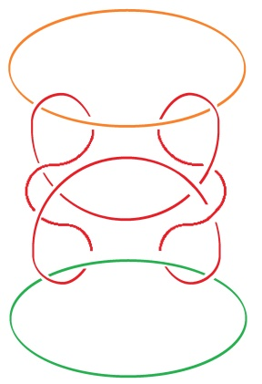
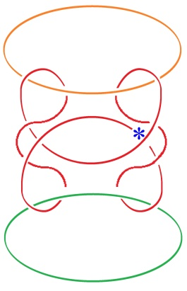

# Leçon 08 | 20 mars 1979

<!-- source-url: http://staferla.free.fr/S26/S26 La topologie et le temps.docx -->
<!-- seminar: s26 -->
<!-- lesson: 08 -->

<!-- id: s26-08-0001 -->

Il y a quelqu’un qui m’a écrit pour me dire ce qu’il avait pensé de mon dernier séminaire.

<!-- id: s26-08-0002 -->

Eh bien, à la vérité, ce que j’avais fait était ça : c’est un borroméen généralisé \[ I \]...

<!-- id: s26-08-0003 -->

> alors que la personne qui m’a écrit l’a réduit à ce qui est \[*un borroméen*\] normal \[ II \], ...à savoir que ceci \[*bo. généralisé*\] a été découvert en mettant en continuité ces deux : vert et noir \[ III \].

<!-- id: s26-08-0004 -->

Le vert et le noir sont là.

<!-- id: s26-08-0005 -->

  

<!-- id: s26-08-0006 -->

**I II III**

<!-- id: s26-08-0007 -->

Une autre façon de le résoudre :

<!-- id: s26-08-0008 -->

- ça serait de *mettre en continuité* ce que j’ai dessiné d’abord en jaune (orange) et ce que j’ai dessiné en rouge \[ II \],

<!-- id: s26-08-0009 -->

- ou bien encore de mettre en continuité ce que j’ai dessiné là en rouge avec ce que j’ai dessiné en noir \[ II \].

<!-- id: s26-08-0010 -->

La question est de savoir ce qui est *homotopique* : ce qui est *homotopique* est à l’intérieur d’une consistance \[ IV \].

<!-- id: s26-08-0011 -->

J’ai commis la dernière fois, quelque chose qui était de cet ordre \[ IV \], je veux dire qu’à l’intérieur d’une même corde l’homotopie consiste à pouvoir transgresser la figure.

<!-- id: s26-08-0012 -->

Il en résulte que le nœud se défait. Il suffit de traverser la corde en un point \*. C’est de la même corde qu’il s’agit.

<!-- id: s26-08-0013 -->

 **→** 

<!-- id: s26-08-0014 -->

**1er état 2ème état**

<!-- id: s26-08-0015 -->

**IV** **V**

<!-- id: s26-08-0016 -->

X - Il faut que la même corde se traverse en trois points.

<!-- id: s26-08-0017 -->

Lacan : Oui, vous croyez cela.

<!-- id: s26-08-0018 -->

X :

<!-- id: s26-08-0019 -->

- La torsion à droite... pardon : la torsion à gauche en haut,

<!-- id: s26-08-0020 -->

- à droite en bas

<!-- id: s26-08-0021 -->

- et à gauche...

<!-- id: s26-08-0022 -->

Si vous ne corrigez qu’un point, comme vous l’avez dit, elle ne se dénoue pas.

<!-- id: s26-08-0023 -->

Lacan : vous croyez qu’en modifiant ceci, elle ne se dénoue pas ? Alors il faut modifier ces points-là ?

<!-- id: s26-08-0024 -->

X : (inaudible)

<!-- id: s26-08-0025 -->

Lacan : Bien. Au revoir !
