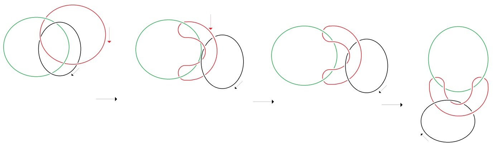

# Leçon 02 | 20 novembre 1979

<!-- source-url: http://staferla.free.fr/S27/S27 Dissolution.docx -->
<!-- seminar: s27 -->
<!-- lesson: 02 -->

<!-- id: s27-02-0001 -->

Je m’excuse d’avoir mis en cause Solange Faladé à la dernière séance.

<!-- id: s27-02-0002 -->

Je voudrais aujourd’hui reprendre le nœud borroméen.

<!-- id: s27-02-0003 -->

Le nœud borroméen se dessine comme ça.

<!-- id: s27-02-0004 -->

Il est dans n’importe quel ordre.

<!-- id: s27-02-0005 -->

Il est clair que le 4ème ordre....schéma n°4

<!-- id: s27-02-0006 -->

Il y a moyen de faire passer quoi que ce soit dans n’importe quelle fonction.

<!-- id: s27-02-0007 -->

C’est indifférent que l’ordre soit respecté.

<!-- id: s27-02-0008 -->

En d’autres termes n’importe quoi peut occuper une fonction quelconque.

<!-- id: s27-02-0009 -->

