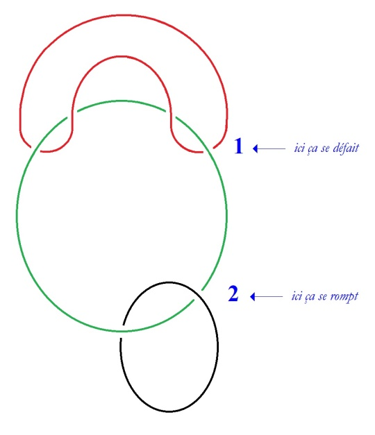

# Leçon 03 | 11 décembre 1979

<!-- source-url: http://staferla.free.fr/S27/S27 Dissolution.docx -->
<!-- seminar: s27 -->
<!-- lesson: 03 -->

<!-- id: s27-03-0001 -->

Je vais essayer de vous dire ce que c’est que le nœud borroméen.

<!-- id: s27-03-0002 -->

Le nœud borroméen se défait tout seul.

<!-- id: s27-03-0003 -->

Il y a un minimum de 3, il faut en effet pour qu’il puisse se défaire qu’il y en ait 3.

<!-- id: s27-03-0004 -->

Lévogyre et dextrogyre ici on peut considérer qu’il est lévogyre...

<!-- id: s27-03-0005 -->

> ou : si vous considérez qu’il est lévogyre il tourne à gauche ...il est néanmoins douteux qu’il soit lévogyre, de fait on pourrait considérer qu’il tourne à droite.

<!-- id: s27-03-0006 -->

C’est une question de mise à plat. Si on le met à plat dans le sens contraire il est dextrogyre.

<!-- id: s27-03-0007 -->

Que la chose se défasse, c’est ce qui est illustré par le fait

<!-- id: s27-03-0008 -->

- qu’ici ça se défait, schéma : **1**,

<!-- id: s27-03-0009 -->

- et qu’ici ça se rompt : **2**.

<!-- id: s27-03-0010 -->

Il est donc ...

<!-- id: s27-03-0011 -->

