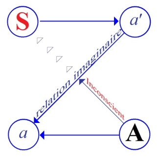

# Leçon 04 | 07 Décembre 1955

<!-- source-url: http://staferla.free.fr/S3/S3 PSYCHOSES.docx -->
<!-- seminar: s3 -->
<!-- lesson: 04 -->

<!-- id: s3-04-0001 -->

FREUD, dans deux articles intitulés respectivement *« La perte de la réalité dans les névroses et dans les psychoses »*[^10], *« Névroses et psychoses »*[^11], a fourni des renseignements intéressants sur la question.

<!-- id: s3-04-0002 -->

Je vais essayer de mettre l’accent sur ce qui différencie la névrose de la psychose quant aux perturbations qu’elles apportent dans les rapports du sujet avec la réalité. C’est une occasion de rappeler de façon très fine et très structurée, ce qu’il faut entendre par refoulement dans la névrose. C’est là qu’il nous fait remarquer qu’il doit y avoir une raison profonde, structurale, à l’organisation très différente des rapports du sujet avec la réalité, dans l’une et l’autre. Il est bien clair qu’un névrosé n’a pas les mêmes rapports avec la réalité qu’un psychotique dont le caractère clinique est précisément de vous donner, de vous communiquer, de vous rendre compte de la relation avec la réalité profondément pervertie, c’est ça que l’on appelle le délire.

<!-- id: s3-04-0003 -->

Ce dont il s’agit donc dans FREUD, c’est de voir comment il faut articuler dans notre explication cette différence. Précisément quand nous parlons de névrose, nous faisons jouer un certain rôle à une fuite, à un évitement, à un conflit de la réalité, à une certaine part, et la part dans le déclenchement c’est la notion de traumatisme, tension initiale de la névrose, c’est une notion étiologique. La fonction de la réalité dans le déclenchement de la névrose est une chose, autre chose est le moment de la névrose où il va y avoir chez le sujet une certaine rupture avec la réalité.

<!-- id: s3-04-0004 -->

FREUD le souligne, au départ la réalité qui est sacrifiée dans la névrose est une partie de la réalité psychique, nous entrons déjà dans une distinction très importante : « *réalité* » n’est pas synonyme de « *réalité extérieure* ». Le sujet au départ, au moment où il déclenche sa névrose, élide, scotomise comme on a dit depuis, une partie de sa réalité psychique, où dans un autre langage : de son « *id* », ceci est oublié. Il n’y a pas de raison pour que ceci ne continue pas à se faire entendre, d’une façon qui est celle sur laquelle tout mon enseignement met l’accent, à se faire entendre d’une façon articulée, d’une façon « *symbolique* ». Et à ce propos, on ne peut pas manquer de citer au passage parmi d’autres témoignages, l’indication qu’il y a dans FREUD, et ceci aurait gagné à être mieux articulé.

<!-- id: s3-04-0005 -->

\[*Aber die neue, phantastische Außenwelt der Psychose will sich an die Stelle der äußeren Realität setzen, die der Neurose hingegen lehnt sich wie* *das Kinderspiel gern an ein Stück der Realität an - ein anderes als das, wogegen sie sich wehren mußte -, verleiht ihm eine besondere Bedeutung* *und einen geheimen Sinn, den wir nicht immer ganz zutreffend einen symbolischen heißen.*\]

<!-- id: s3-04-0006 -->

J’entends que dans l’un de ses articles, celui de « *La perte de la réalité dans la névrose et dans la psychose »*, il insiste, il articule des différences, il précise la façon dont le monde fantastique, dit-il - c’est ici qu’il le désigne - qui est cette sorte de « *magasin* » mis à part de la réalité et dans lequel il \[le sujet\] conserve des ressources à l’usage de construction du monde extérieur.

<!-- id: s3-04-0007 -->

Ce *magasin,* c’est là que la psychose va emprunter le matériel dont nous verrons ce qu’elle a à faire tout à l’heure. Mais à ce propos il dit que la névrose est quelque chose de bien différent, que cette réalité que le sujet à un moment élidait, il tentera de la faire ressurgir en lui prêtant une signification particulière et un sens secret que nous appelons « *symbolique* », sans y mettre toujours l’accent convenable. Il souligne bien là, que la façon en quelque sorte impressionniste dont nous usons du terme « *symbolique* », n’a jamais été précisée d’une façon qui soit vraiment conforme à ce dont il s’agit.

<!-- id: s3-04-0008 -->

Je vous signale au passage qu’aussi bien…

<!-- id: s3-04-0009 -->

> pour le désir de vous donner ce que certains souhaitent, c’est-à-dire des références dans le texte,
>
> je n’ai pas toujours la possibilité de le faire parce qu’il faut que mon discours n’en soit pas rompu,
>
> et que néanmoins je vous apporte les citations quand il est nécessaire

<!-- id: s3-04-0010 -->

…il y a d’autres passages dans FREUD qui sont significatifs : l’appel, la nécessité ressentie par lui à une pleine articulation de cet *ordre symbolique*, c’est bien de cela qu’il s’agit dans la névrose, à laquelle il oppose la psychose pour autant que dans la psychose c’est avec la réalité extérieure qu’il y a eu un moment trou et rupture, et que là c’est *le fantastique* qui va être appelé à remplir la béance.

<!-- id: s3-04-0011 -->

Pouvons-nous nous contenter entièrement d’une définition, d’une opposition aussi simple ?

<!-- id: s3-04-0012 -->

Il faut bien voir que c’est en somme dans la névrose, au second temps, et pour autant que la réalité ne parvient pas à être pleinement réarticulée d’une façon symbolique dans le monde extérieur, qu’il y aura chez elle cette fuite partielle de la réalité, qui prend ici une forme différente, qui prend la forme de ne pas pouvoir toujours affronter cette partie de la réalité, ce vide mène à cette réorganisation d’une façon secrète de la réalité conservée.

<!-- id: s3-04-0013 -->

Est-ce que nous pouvons nous contenter de cela comme division entre névrose et psychose ? D’ailleurs dans la psychose, c’est bel et bien la réalité qui est elle-même pourvue d’abord d’un trou qui est ensuite comblé avec ce monde fantastique. Sûrement pas ! Et FREUD lui-même précise à la suite de la lecture du texte de SCHREBER, qu’il ne nous suffit pas de voir comment sont faits les symptômes, il nous faut voir le mécanisme de cette formation. Sans doute mettons-nous au premier plan la possibilité de remplacer *un trou, une faille, un point* *de rupture* dans la structure du monde extérieur, par la pièce rapportée du fantasme psychotique.

<!-- id: s3-04-0014 -->

Pour l’expliquer nous avons *le mécanisme de la projection*. Je commence par là aujourd’hui, non par hasard, certes, puisque c’est la suite de mon discours, mais en y mettant un point d’insistance tout à fait particulier, pour la raison qu’il me revient de certains d’entre vous qui travaillent sur les textes freudiens que j’ai déjà commentés, et qui en revenant sur un passage dont j’ai souligné l’importance, sont restés hésitants sur le sens à donner à un morceau pourtant très clair du texte, à propos de cette hallucination épisodique où se montrent les virtualités paranoïaques de *L’Homme aux loups*.

<!-- id: s3-04-0015 -->

Et tout en saisissant fort bien ce que je veux dire, ce que j’ai articulé, ce que j’ai souligné en disant

<!-- id: s3-04-0016 -->

> « *Ce qui a été rejeté du symbolique réparait dans le réel.* »

<!-- id: s3-04-0017 -->

Là dessus la discussion peut s’élever sur la façon dont je traduis « *le malade n’en veut rien savoir* ». Agir avec le refoulé par le mécanisme du refoulement, c’est en savoir quelque chose, car le refoulement et le retour du refoulé, sont une seule et même chose qui est exprimée ailleurs que dans le langage conscient du sujet.

<!-- id: s3-04-0018 -->

Ce qui a fait difficulté pour certains d’entre eux c’est qu’ils ne saisissent pas que ce dont il s’agit c’est la façon dont il y a un savoir. Mais je vous apporterai un autre fait qui est emprunté au Président SCHREBER, au moment où FREUD nous expliquait le mécanisme propre de *la projection*, qui bien entendu est immédiatement suggéré comme mécanisme de cette *réapparition du fantasme dans la réalité*. FREUD ici s’arrête expressément et remarque que nous ne pouvons pas, purement et simplement, parler de *projection* :

<!-- id: s3-04-0019 -->

- comme il n’est que trop évident, à regarder combien la *projection* a quelque chose qui s’exercerait d’une façon différente dans le délire de jalousie, par exemple, dit *« projectif »*, et qui consiste à imputer à son conjoint des infidélités dont on se sent soi-même plus ou moins réellement coupable, imaginativement coupable,

<!-- id: s3-04-0020 -->

- et autre chose est l’apparition du délire de persécution qui se manifeste bien en effet par des intuitions interprétatives dans le réel, quand ce dont il s’agit est la fameuse pulsion homosexuelle que notre théorie met à la base du *délire*.

<!-- id: s3-04-0021 -->

Et c’est là qu’il s’exprime :

<!-- id: s3-04-0022 -->

> « *Il n’est pas correct et exact que la sensation intérieurement réprimée*…
>
> la *Verdrängung* est une *symbolisation*, c’est *le retour du refoulé*, au contraire *Unterdrückung* c’est simplement l’indication qu’il y a quelque chose qui est *intérieurement réprimé*
>
> … *de la dire projetée de nouveau vers l’extérieur, bien plutôt nous devons dire que ce qui est*…
>
> Vous vous rappelez peut-être l’accent d’insistance qu’il a mis sur l’usage de ce mot
>
> et qu’on le sache ou qu’on ne le sache pas, personne ne me fera croire que FREUD ne savait pas soulever l’euphémisme *« isolé »*

<!-- id: s3-04-0023 -->

…*rejeté, revient de l’extérieur.* »

<!-- id: s3-04-0024 -->

\[*An der Symptombildung bei Paranoia ist vor allem jener Zug auffällig, der die Benennung Projektion verdient. Eine innere Wahrnehmung wird unterdrückt, und zum Ersatz für sie kommt ihr Inhalt, nachdem er eine gewisse Entstellung erfahren hat, als Wahrnehmung von außen zum Bewußtsein. Die Entstellung besteht beim Verfolgungswahn in einer Affektverwandlung; was als Liebe innen hätte verspürt werden sollen, wird als Haß von außen wahrgenommen. Man wäre versucht, diesen merkwürdigen Vorgang als das Bedeutsamste der Paranoia und als absolut pathognomonisch für dieselbe hinzustellen, wenn man nicht rechtzeitig daran erinnert würde, daß 1. die Projektion nicht bei allen Formen von Paranoia die gleiche Rolle spielt und 2. daß sie nicht nur bei Paranoia, sondern auch unter anderen Verhältnissen im Seelenleben vorkommt, ja, daß ihr ein regelmäßiger Anteil an unserer Einstellung zur Außenwelt zugewiesen ist. Wenn wir die Ursachen gewisser Sinnesempfindungen nicht wie die anderer in uns selbst suchen, sondern sie nach außen verlegen, so verdient auch dieser normale Vorgang den Namen einer Projektion.*\]

<!-- id: s3-04-0025 -->

Voilà je pense un texte de plus avec ceux que j’ai déjà cités dans le même registre, qui sont - vous le savez - les textes *pivots*.

<!-- id: s3-04-0026 -->

Et c’est précisément le texte de la *Verneinung* [^12] que nous a commenté M. HIPPOLYTE, et qui nous a permis d’articuler de façon précise cette notion : qu’il y a un moment qui est si l’on peut dire le moment d’origine de la symbolisation - entendez bien que cette origine n’est pas un point du développement - qu’il faut *un commencement* à la symbolisation, et que c’est à tout moment du développement qu’il peut se produire ce quelque chose :

<!-- id: s3-04-0027 -->

- qui est le contraire de la *Bejahung*, dans la théorie que développe FREUD,

<!-- id: s3-04-0028 -->

- qui est une *Verneinung primitive*, dont la *Verneinung* dans ses conséquences cliniques est une suite.

<!-- id: s3-04-0029 -->

Bref, cette distinction essentielle : ces deux mécanismes de la *Verneinung* et de la *Bejahung,* met le rattachement de la « *projection* » désormais entre guillemets, et qu’il vaudrait mieux abandonner puisque aussi bien c’est quelque chose qui apparaît d’une nature essentiellement différente de la projection psychologique, de celle qui fait qu’à ceux auxquels nous ne portons que des sentiments fort mélangés, nous accueillerons toujours d’eux tout ce qu’ils feront avec au moins une attitude de doute perplexe quant à leurs intentions.

<!-- id: s3-04-0030 -->

Cette projection dans la psychose ce n’est pas la même chose, elle n’est que le mécanisme qui fait que ce qui est pris dans la *Verwerfung*, *ce qui a été mis hors de la symbolisation générale structurant le sujet, revient du dehors*.

<!-- id: s3-04-0031 -->

Qu’est-ce que c’est que *le jeu de la muscade, ce singulier jeu de bateleur* auquel nous serions en proie, qui fait que ce qui pour vous dans la façon dont s’enregistre tous ces phénomènes, s’inscrit très bien, *il y a le symbolique, l’imaginaire et le réel* ? Comme nous ne connaissons pas *le bateleur*, nous pouvons poser la question que je mets cette année à l’ordre du jour à propos du Président SCHREBER.

<!-- id: s3-04-0032 -->

Pourquoi est-ce que je la mets à l’ordre du jour ? Parce que c’est elle qui nous permettra d’articuler d’une façon qui évite *les confusions* perpétuellement faites dans la théorie analytique, au sujet de ce qu’on appelle « *relation à la réalité* ». Parce que c’est elle qui nous permettra du même coup de concevoir et d’articuler quel est le but de l’analyse, et quand on parle d’« *adaptation à la réalité* », de quoi parle-t-on, car personne n’en sait rien tant qu’on n’a pas défini ce que c’est que *la réalité*, ce qui n’est pas quelque chose de simple.

<!-- id: s3-04-0033 -->

Pour introduire la voie dessinée au problème, je vais partir de quelque chose de tout à fait *actuel*. Car il ne peut être dit que tout ceci est purement et simplement un commentaire de texte au sens où il s’agirait d’une pure et simple *exégèse*. Ces choses vivent pour nous tous les jours dans notre pratique, sujet dont nous avons à faire dans *nos contrôles*, dans la façon dont nous dirigeons *notre interprétation,* notre idée de la façon dont il convient d’en agir avec *les résistances*. Je vais prendre un exemple, celui d’une chose qu’une partie d’entre vous a pu entendre vendredi dernier à ma présentation de malade, où j’ai présenté deux personnes dans un seul délire, ce qu’on appelle « *un délire à deux* ».

<!-- id: s3-04-0034 -->

L’une d’elles, la plus jeune, la fille qui pas plus que la mère n’a été très facile à mettre en valeur, elle avait dû être examinée et présentée avant que je m’en occupe - vu la fonction que jouent les malades dans un service d’enseignement - une bonne dizaine de fois : on a beau être délirant, ces sortes d’exercices vous viennent assez rapidement par-dessus la tête, et elle n’était pas particulièrement bien disposée.

<!-- id: s3-04-0035 -->

Néanmoins certaines choses ont pu être manifestées, ne serait-ce que ceci : par exemple que ce délire paranoïaque \- puisque c’était une paranoïaque - est quelque chose qui loin de supposer cette base caractérielle d’« *orgueil »*, de « *méfiance »*, de « *susceptibilité »*, de « *rigidité »* comme on dit « *psychologique »*, présentait - au moins chez la jeune fille - un sentiment, au contraire, extraordinairement bienveillant.

<!-- id: s3-04-0036 -->

Je dirais même presque qu’elle avait un sentiment…

<!-- id: s3-04-0037 -->

> à côté de la chaîne d’interprétations difficiles à mettre en évidence dont elle se sentait victime

<!-- id: s3-04-0038 -->

…le sentiment qu’elle ne pouvait au contraire n’être qu’une personne aussi gentille, aussi bonne, et que par-dessus le marché, qu’au milieu de tant d’épreuves subies, elle ne pouvait que bénéficier de la sympathie générale, et en vérité dans le témoignage qu’on voyait sur elle, son chef de service qui avait eu affaire à elle, ne parlait pas autrement d’elle que comme d’une femme charmante et aimée de tous.

<!-- id: s3-04-0039 -->

Bref, après avoir eu toutes les peines du monde à aborder le sujet et ses rapports avec les autres, j’ai approché du centre qui était là, manifestement présent, car bien entendu son souci fondamental était bien de me prouver qu’il n’y avait aucun élément sujet à des réticences, et de ne pas le livrer à la mauvaise interprétation dont elle était assurée à l’avance qu’aurait pu en prendre le médecin.

<!-- id: s3-04-0040 -->

Tout de même elle m’a livré qu’un jour, dans son couloir, au moment où elle sortait, elle avait eu affaire à une sorte de « *mal élevé* » dont elle n’avait pas à s’étonner, puisque c’était ce vilain homme marié qui était l’amant régulier d’une de ses voisines aux mœurs légères, et à son passage celui-là…

<!-- id: s3-04-0041 -->

> elle ne pouvait quand même pas me le dissimuler, elle l’avait encore sur le cœur

<!-- id: s3-04-0042 -->

…lui avait dit *un gros mot*, *un gros mot* qu’elle n’était pas non plus disposée à me dire, parce que - comme elle s’exprimait - cela la dépréciait.

<!-- id: s3-04-0043 -->

Néanmoins je crois qu’une certaine douceur que j’avais mise dans son approche, avait fait que nous en étions après cinq minutes d’entretien, quand même à une bonne entente, et là elle m’avoue avec en effet un rire de concession, qu’elle n’était pas là-dedans elle-même tout à fait blanche. C’est-à-dire qu’elle avait quand même, elle, dit *quelque chose* au passage, et ce quelque chose elle me l’avoue plus facilement que ce qu’elle a entendu, ce qu’elle a dit c’est : « *Je viens de chez le charcutier.* »

<!-- id: s3-04-0044 -->

Naturellement je suis comme tout le monde, je tombe dans les mêmes fautes que vous, je veux dire que je fais tout ce que je vous dis de ne pas faire, je n’en ai pas moins tort, même si ça me réussit : une opinion vraie n’en reste pas moins purement et simplement une opinion du point de vue de la science, c’est quelque chose qui a été développé par SPINOZA.

<!-- id: s3-04-0045 -->

Si vous comprenez tant mieux, gardez-le pour vous, *l’important n’est pas de comprendre, l’important est d’atteindre le vrai* : si vous comprenez par hasard, même si vous comprenez vous ne comprenez pas. Naturellement je comprends, ce qui prouve que nous avons tous en commun avec les délirants un petit quelque chose, c’est-à-dire que j’ai en moi, comme nous tous, ce qu’il y a de délirant dans l’homme normal.

<!-- id: s3-04-0046 -->

« *Je viens de chez le charcutier* » : si on me dit qu’il y a quelque chose à comprendre, je peux tout aussi bien articuler qu’il y a là une référence au cochon, je n’ai pas dit cochon, j’ai dit porc, mais elle était bien d’accord et c’était ce qu’elle voulait que je comprenne, c’était peut-être ce qu’elle voulait que l’autre comprenne. Seulement c’est justement ce qu’il ne faut pas faire parce que ce à quoi il faut s’intéresser, c’est à savoir pourquoi elle voulait justement que l’autre comprenne cela. Seulement pourquoi elle ne le lui disait pas clairement? Pourquoi s’exprimait-elle par allusion ? C’est cela qui est l’important, et si je comprends ce n’est pas à cela que je m’arrêterai puisque j’aurai déjà compris.

<!-- id: s3-04-0047 -->

Voilà donc ce qui vous manifeste ce que c’est d’entrer dans le jeu du patient, que collaborer à sa résistance, car la résistance du patient c’est toujours la vôtre, et quand une résistance réussit c’est parce que vous êtes dedans jusqu’au cou, parce que vous « *comprenez* ». *Vous comprenez*, vous avez tort, car ce qu’il s’agit précisément de *comprendre* c’est *pourquoi on donne quelque chose à comprendre*. C’est à cela qu’il faut que nous arrivions, c’est là le point essentiel. C’est pourquoi elle a dit : « *Je viens de chez le charcutier* », et non pas : « *cochon !* ».

<!-- id: s3-04-0048 -->

Comprenez d’abord que vous avez là la chance unique de toucher du doigt ce que je n’ai pas eu la chance d’avoir dans beaucoup d’autres expériences dans l’examen des malades, et j’insistais sur le moment même…

<!-- id: s3-04-0049 -->

> c’est à cela que j’ai limité mon commentaire car à ce moment-là le temps me manquait
>
> pour faire le développement de cet élément

<!-- id: s3-04-0050 -->

…je vous faisais remarquer qu’il s’agissait là d’une perle, et en effet je vous ai montré l’analogie très évidente avec cette découverte qui a consisté à s’apercevoir un jour que certains malades qui se plaignaient d’hallucinations auditives, faisaient manifestement des mouvements de gorge, des mouvements de lèvres, autrement dit que nous saisissions que c’étaient eux-mêmes qui les articulaient. Là c’est quelque chose qui n’est pas pareil, qui est analogue, c’est intéressant parce que c’est analogue : c’est encore plus intéressant parce que ce n’est pas pareil.

<!-- id: s3-04-0051 -->

Tâchez de voir et de vous intéresser un instant à ceci, cette perle consiste en ce qu’elle nous dit :

<!-- id: s3-04-0052 -->

> « *J’ai dit : « Je viens de chez le charcutier »* »

<!-- id: s3-04-0053 -->

Et alors là elle nous lâche le coup : qu’a-t-il dit, lui ? Il a dit : « *Truie !* ».

<!-- id: s3-04-0054 -->

C’est *« la réponse* - comme on dit - *du berger à la bergère* : *fil-aiguille, mon âme-ma vie,* c’est comme cela que ça se passe dans l’existence. Il faut nous arrêter un petit instant là-dessus : « Le voilà bien content - vous dites-vous - c’est ce qu’il nous enseigne* : « dans la parole, le sujet reçoit son message sous une forme inversée. »* ».

<!-- id: s3-04-0055 -->

Détrompez-vous, ce n’est justement pas cela. Il y a même une différence, je crois que c’est en y regardant de près que nous pourrons voir que le message dont il s’agit n’est pas tout à fait identique - bien loin de là - à la parole, tout au moins au sens où je vous l’articule : comme cette forme de médiation par où le sujet reçoit son message, de l’Autre, sous une forme inversée.

<!-- id: s3-04-0056 -->

D’abord quel est ce personnage ? Nous avons dit que c’est un homme marié, l’amant d’une fille qui est elle-même très impliquée dans le délire dont le sujet est victime, de cette voisine. elle en est, non pas le centre, mais le personnage fondamental. Ses rapports avec ces deux personnages sont ambigus : assurément ce sont des personnages persécuteurs et hostiles, mais sous un mode qui n’est pas tellement revendiquant, comme ont pu s’en étonner ceux qui étaient présents à l’entretien, c’est plutôt la perplexité, comment ces commères ont-elles pu arriver à faire sans doute cette pétition d’amener les deux patientes à l’hôpital ?

<!-- id: s3-04-0057 -->

C’est là quelque chose qui caractérise plutôt les rapports de ce sujet avec l’extérieur, c’est une tendance à répéter le motif de l’intérêt universel qui leur est accordé, c’est là sans doute ce qui permet de comprendre les ébauches d’éléments *érotomaniaques* que nous saisissons dans l’observation, qui ne sont pas à proprement parler des *érotomanies*, mais c’était en effet des sentiments comme celui « *qu’on s’intéressait à elles* ». Cette « *truie* » dont il s’agit, *qu’est-ce que c’est* ?

<!-- id: s3-04-0058 -->

C’est son message en effet, mais est-ce que ce n’est pas plutôt son propre message ? Si nous voyons en effet quelque chose qui s’est passé au départ de tout ce qui est dit, et le sentiment que la voisine poussait deux femmes isolées :

<!-- id: s3-04-0059 -->

- qui sont restées *étroitement liées* dans l’existence,

<!-- id: s3-04-0060 -->

- qui *n’ont pas pu se séparer* lors du *mariage* de la plus jeune,

<!-- id: s3-04-0061 -->

- qui ont fui soudain une situation dramatique qui semblait être créée dans les relations conjugales

<!-- id: s3-04-0062 -->

> de la plus jeune, qui est partie au maximum semble-t-il, de la peur d’après les certificats médicaux, devant des menaces de son mari qui ne voulait rien moins que de « *la couper en rondelles* ».

<!-- id: s3-04-0063 -->

Nous avons là le sentiment que *l’injure* dont il s’agit…

<!-- id: s3-04-0064 -->

> puisque le terme d’*injure* est vraiment là essentiel,
>
> il a toujours été mis en valeur dans la phénoménologie clinique de la paranoïa

<!-- id: s3-04-0065 -->

…s’accorde avec le procès de défense, voire d’expulsion auquel les deux patientes se sont senties commandées de procéder par rapport à la voisine, considérée comme primordialement envahissante:

<!-- id: s3-04-0066 -->

elle venait toujours frapper pendant qu’elles étaient à leur toilette, ou au moment où elles commençaient quelque chose, pendant qu’elles étaient en train de dîner, de lire, c’était une personne essentiellement portée à l’intrusion, et donc il s’agissait avant tout de l’écarter. Les choses n’ont commencé à devenir problématiques qu’à partir du moment où cette expulsion, ce refus, ce rejet de la patiente a pris force de plein exercice, au moment où elles l’ont vraiment « vidée ».

<!-- id: s3-04-0067 -->

Est-ce donc quelque chose que nous allons voir plus ou moins sur le plan de la projection, d’un mécanisme de défense, que les patientes :

<!-- id: s3-04-0068 -->

- dont la vie intime s’est déroulée en dehors de l’élément masculin,

<!-- id: s3-04-0069 -->

- qui a toujours fait de l’élément masculin un étranger avec lequel elles ne se sont jamais accordées,

<!-- id: s3-04-0070 -->

- pour qui le monde est essentiellement féminin.

<!-- id: s3-04-0071 -->

Et cette relation avec les personnes de leur sexe, est-ce là quelque chose du type d’une projection dans le besoin, dans la nécessité de rester elles-mêmes, de rester en couple, bref de quelque chose que nous sentons apparenté à cette fixation homosexuelle au sens le plus large du terme, en tant qu’il est la base de ce que nous a dit FREUD, des relations sociales qui, dans un monde féminin isolé où vivent ces deux femmes, ont fait qu’elles se trouvent, non pas tant dans la posture de recevoir leurs propres rapports de l’Autre, que de le dire à l’autre elles-mêmes.

<!-- id: s3-04-0072 -->

L’injure est-elle le mode de défense qui revient en quelque sorte par réflexion dans cette relation dont nous voyons combien il est compréhensible qu’elle s’étende à partir du moment où elle s’est établie à tous les autres, quels qu’ils soient, en tant que tels ? Ceci bien entendu est concevable, et déjà laisse entendre que c’est bien de, non pas le message reçu sous une forme inversée, mais du propre message du sujet qu’il s’agit.

<!-- id: s3-04-0073 -->

Devons-nous là nous arrêter ? Non certes, il ne suffit pas, car ceci peut en effet nous faire comprendre qu’elles se sentent entourées de sentiments hostiles, la question n’est pas là, la question est la suivante : « *truie* » a été entendu réellement, dans le réel, le personnage en question a dit : « *truie* ». C’est la réalité qui parle. *Qui est-ce qui parle ?*

<!-- id: s3-04-0074 -->

C’est bien le cas où nous saisissons que c’est dans ce terme que se pose la question. Puisqu’il y a hallucination, c’est la réalité qui parle, ça fait partie des prémisses, nous avons posé la réalité comme ce qui est constitué par une sensation, une perception. Il n’y a pas là-dessus d’ambiguïté, elle ne dit pas :

<!-- id: s3-04-0075 -->

« *J’ai eu le sentiment qu’il me répondait : « truie ! »* ». elle dit :

<!-- id: s3-04-0076 -->

« *J’ai dit « je viens de chez le charcutier » et il m’a dit « truie ! ».* »

<!-- id: s3-04-0077 -->

Ou bien nous nous contentons de nous dire : « *Voilà*, *elle est hallucinée, d’accord*... », ou nous essayons...

<!-- id: s3-04-0078 -->

> ce qui peut paraître une entreprise insensée, mais n’est-ce pas le rôle des psychanalystes,
>
> jusqu’à présent de s’être livrés à des entreprises insensées ?

<!-- id: s3-04-0079 -->

...nous essayons d’aller un petit peu plus loin, de voir ce que ceci veut dire. Est-ce que d’abord *la réalité*, dans la façon dont nous l’entendons, *la réalité des objets*, presque quelque chose de réel au sens vulgaire du mot, est-ce que c’est cela ?

<!-- id: s3-04-0080 -->

D’abord, *qui parle ?* Est-ce que, avant de nous demander « *qui parle ?* », nous ne pouvons pas nous demander qui d’habitude parle dans la réalité pour nous ? Est-ce justement *la réalité* quand quelqu’un nous parle ? Je crois que l’intérêt des remarques que je vous ai faites la dernière fois sur *l’autre* et *l’Autre*… *l’autre* avec un petit a et *l’Autre* avec un grand A …c’est de vous faire remarquer que si c’est l’Autre qui parle - avec un grand A - l’Autre n’est pas purement et simplement la réalité devant laquelle vous êtes, à savoir l’individu qui articule \[le petit autre\] : *l’Autre est au-delà de cette réalité* puisque dans la vraie parole, *l’Autre c’est ce devant quoi vous vous faites reconnaître*, parce que cette parole, mais vous ne pouvez strictement vous en faire reconnaître que parce qu’il est d’abord reconnu, *il doit être reconnu pour que vous puissiez vous faire reconnaître*.

<!-- id: s3-04-0081 -->

Cette *réciprocité*, cette dimension supplémentaire qui est nécessaire pour que ce soit un Autre avec qui *la parole,* dont je vous ai donné des exemples typiques, avec qui *la parole donnait le* « *Tu es mon maître.* », *ou* « *Tu es ma femme.* ». Comme d’autre part la parole mensongère, qui en est, tout en étant le contraire, l’équivalent, suppose précisément ce quelque chose qui est reconnu comme un *Autre absolu *:

<!-- id: s3-04-0082 -->

- *quelque chose qui est visé au-delà de tout ce que vous pourrez connaître*,

<!-- id: s3-04-0083 -->

- *quelque chose pour qui la reconnaissance n’a justement à valoir que parce qu’il est au-delà du connu*, que parce que c’est *en le reconnaissant et dans la reconnaissance* que vous l’instituez, non pas comme un élément pur et simple de la réalité, un pion, une marionnette, mais *quelque chose qui est irréductible*,

<!-- id: s3-04-0084 -->

- *quelque chose* de l’existence duquel comme sujet dépend la valeur même de la parole dans laquelle vous vous faites reconnaître,

<!-- id: s3-04-0085 -->

- *quelque chose qui naît, que ce soit en disant à quelqu’un « Tu es ma femme » vous lui disiez implicitement « Je suis ton homme », mais vous lui dites d’abord « Tu es ma femme. », c’est-à-dire que vous l’instituez dans la position d’être par vous reconnue, moyennant quoi elle pourra vous reconnaître.*

<!-- id: s3-04-0086 -->

Cette *parole* est donc toujours *un au-delà du langage*, même à travers le discours, et les choses sont tellement vraies qu’à partir d’un tel engagement, comme d’ailleurs à partir de n’importe quelle autre *parole*, fut-ce un mensonge, tout le discours qui va suivre, et là j’entends discours y compris des actes, des démarches, un acte de contorsion, qui dès lors prendront en effet la marionnette, mais la première de celles qui seront prises dans le jeu c’est vous-même, et à partir d’une *parole*.

<!-- id: s3-04-0087 -->

C’est *à partir d’une parole* que s’institue ce jeu en tout comparable à ce qui se passe dans « *Alice au Pays des Merveilles »*, quand serviteurs et autres personnages de la Cour de la Reine se mettent à jouer aux cartes en s’habillant de ces cartes, et en devenant eux-mêmes le « *Roi de cœur* », la « *Dame de pique* » et le « *Valet de carreau* ».

<!-- id: s3-04-0088 -->

Vous êtes engagés à partir d’une *parole*

<!-- id: s3-04-0089 -->

- non pas simplement à *la soutenir* ou à *la renier*, ou *la récuser*, ou à *la réfuter*, ou à *la confirmer* par votre discours,

<!-- id: s3-04-0090 -->

- mais la plupart du temps à faire toutes sortes de choses qui soient *dans la règle du jeu*, et quand bien même la Reine changerait à tout moment la règle, que ça ne changerait en rien la question, c’est à savoir qu’une fois introduit dans le jeu des symboles \[Cf. aussi La lettre volée, les α, β, γ, δ\], vous êtes tout de même toujours forcés de vous comporter selon une certaine règle.

<!-- id: s3-04-0091 -->

En d’autres termes, *chacun sait que quand une marionnette parle, ce n’est pas elle qui parle, c’est quelqu’un qui parle derrière*. La question est de savoir quelle est la fonction du personnage rencontré en cette occasion, et ce que nous pouvons dire pour le sujet, c’est qu’il est, lui, manifestement quelque chose de *réel* qui parle, et c’est cela qui est intéressant, elle ne dit pas que c’est *quelqu’un derrière elle qui parle*, elle en reçoit sa propre parole, non pas inversée, mais sa propre parole dans *l’autre* qui est elle-même, son reflet dans le miroir, son semblable, sans même discuter la question. « *Truie !* » est donnée du *tac au tac*, et on ne sait pas quel est le premier *tac* avec le « *Je viens de chez le charcutier* ».

<!-- id: s3-04-0092 -->

La parole s’exprime dans le réel, elle s’exprime dans la marionnette, l’Autre dont il s’agit dans cette situation n’est pas au-delà du partenaire, il est au-delà du sujet lui-même, et c’est cela qui est le signe, la structure de l’allusion, elle s’indique elle-même dans un au-delà de ce qu’elle dit.

<!-- id: s3-04-0093 -->

<!-- id: s3-04-0094 -->

En d’autres termes, si nous plaçons dans un schéma *le jeu des quatre* qu’implique ce que je vous ai dit la dernière fois :

<!-- id: s3-04-0095 -->

- le S,

<!-- id: s3-04-0096 -->

- le A,

<!-- id: s3-04-0097 -->

- le petit *a*,

<!-- id: s3-04-0098 -->

- le petit *a’*.

<!-- id: s3-04-0099 -->

le petit *a* c’est le monsieur qu’elle rencontre dans le couloir. Il n’y a pas de grand A, il y a *quelque chose* qui va de *a* à *a’*, *a’* c’est ce qui dit « *Je viens de chez le charcutier* », et de qui dit-on « *Je viens de chez le charcutier* » ? : de S.

<!-- id: s3-04-0100 -->

Petit *a,* lui, dit « *Truie !* ».

<!-- id: s3-04-0101 -->

*a’* la personne qui nous parle et qui a parlé en tant que délirante, *reçoit* sans aucun doute *son propre message de quelque part sous une forme inversée*, elle le reçoit du petit *autre*, et ce qu’elle dit concerne *l’au-delà qu’elle est elle-même en tant que sujet*, et dont par définition, simplement parce qu’elle est sujet humain, elle ne peut parler que par allusion. Il n’y a qu’un seul moyen de parler de ce S, de ce *sujet* que nous sommes radicalement, c’est :

<!-- id: s3-04-0102 -->

- soit de s’adresser vraiment à l’*Autre* grand A et *d’en recevoir le message* qui vous concerne *sous une forme inversée*,

<!-- id: s3-04-0103 -->

- soit - autre moyen - d’indiquer sa direction, son existence, sous la forme de l’allusion.

<!-- id: s3-04-0104 -->

C’est en cela qu’elle est proprement une paranoïaque. Le cycle pour elle comporte une exclusion de ce *grand Autre,* le circuit se ferme sur les *deux petits autres* qui sont :

<!-- id: s3-04-0105 -->

- la marionnette en face d’elle qui parle, et dans laquelle résonne son message à elle,

<!-- id: s3-04-0106 -->

- et elle-même qui, comme *moi*, est toujours un autre et qui parle par allusion.

<!-- id: s3-04-0107 -->

C’est même cela qui est important, elle en parle tellement bien par allusion qu’elle ne sait pas ce qu’elle en dit, car en fin de compte, si nous regardons les choses de près, que dit-elle ? Elle dit : « *Je viens de chez le charcutier* ». Qui vient de chez le charcutier ? Un cochon découpé : elle ne sait pas qu’elle le dit, mais le dit quand même. Cet *autre* à qui elle parle, elle lui dit d’elle-même :

<!-- id: s3-04-0108 -->

- « *moi la truie, je viens de chez le charcutier* ». « *Je suis déjà disjointe, corps morcelé, « membra dispecta », délirante, de sorte que mon monde s’en va en morceaux, comme moi-même.* »

<!-- id: s3-04-0109 -->

C’est cela qu’elle lui dit. Et en effet cette façon déjà de s’exprimer si compréhensible qu’elle nous paraisse \- quand même, le moins qu’on puisse dire - est un tout petit peu drôle.

<!-- id: s3-04-0110 -->

Vous croyez que c’est tout ce qu’on peut en tirer ? Non ! Il a encore autre chose. Il y a quelque chose dans l’ordre d’une certaine temporalité, d’une certaine succession des temps. Il est *tout à fait clair* dans les propos de la patiente, qu’on ne sait pas qui a parlé le premier.

<!-- id: s3-04-0111 -->

Selon toute apparence ce n’est pas notre patiente, ou tout au moins ça ne l’est pas forcément, en tout cas nous n’en saurons jamais rien, nous n’allons pas chronométrer « *les paroles déréelles* » avec une articulation… Mais je vous fais remarquer que si *le développement* que je viens de faire *est* *correct*, si *la parole* du sujet *est* bel et bien *dans l’ordre*, le moins que nous puissions dire, c’est que la locution - à savoir le « *Je viens de chez le charcutier* » - présuppose la réponse : « *Truie !* », justement parce que la réponse est l’allocution - *avec l apostrophe* – c’est-à-dire ce que vraiment la patiente dit.

<!-- id: s3-04-0112 -->

J’ai fait remarquer qu’il y a quelque chose de tout à fait différent de ce qui se passe dans *la parole vraie*, dans le « *tu es ma femme* » ou le « *tu es mon maître* », où tout au contraire la locution est la réponse. Ce qui répond à la parole c’est en effet cette consécration de l’autre comme « *ma femme* », ou comme « *mon maître* », et donc ici la réponse, contrairement à l’autre cas, présuppose la locution. Voilà donc la situation dans le cas du sujet et de la parole délirante : *l’Autre* est exclu véritablement, il n’y a pas de *vérité* derrière cette parole délirante en tant que telle, et reçue de lui.

<!-- id: s3-04-0113 -->

Aussi bien d’ailleurs il y en a si peu que le sujet lui-même n’y met aucune vérité : il est, vis-à-vis de ce phénomène, dans la perplexité du phénomène brut en fin de compte, et il faut longtemps pour qu’il essaie autour de cela de reconstituer un ordre que nous appellerons « *l’ordre délirant* ». Il le restitue, non pas comme on le croit : par déduction et construction, mais d’une façon dont nous verrons ultérieurement qu’elle ne doit pas être sans rapport avec le phénomène primitif lui-même.

<!-- id: s3-04-0114 -->

*L’Autre* donc est exclu véritablement, et ce qui concerne le sujet est *dit par l’autre réellement*, mais par *quel autre* ? Par *le petit autre*, par une *ombre d’autre*, comme s’exprimera le sujet, notre SCHREBER, par exemple quand il nous dira que tous ces partenaires depuis quelque temps, tous les êtres humains qu’il rencontre sont des bonshommes « *foutus à la six-quatre-deux* ». Marquons bien aussi cette espèce de caractère irréel, tendant à l’irréel, que ce « *petit autre des ombres* » donne, mais ce n’est pas tout de même dans le texte.

<!-- id: s3-04-0115 -->

Donc des hommes « *bâclés à la six-quatre-deux* », je ne suis pas encore capable de vous donner une traduction valable complètement, il y a des résonances en allemand que j’ai essayé de vous donner dans le « *foutus* ».

<!-- id: s3-04-0116 -->

Mais alors nous allons peut-être nous apercevoir ici de quelque chose : c’est qu’après nous être intéressés à *la parole*, nous allons maintenant nous intéresser au *langage*. Il apparaît clairement que la répartition triple du *symbolique,* de *l’imaginaire* et du *réel* s’applique justement au *langage*, car le soin qu’il prend d’éliminer l’articulation motrice de son analyse du langage, montre bien qu’il en distingue l’autonomie, et que *le langage réel* c’est le discours concret, parce que le langage *ça parle*.

<!-- id: s3-04-0117 -->

Et c’est sûrement dans *une relation* qui est « *de l’autre* », celle du *symbolique* et de *l’imaginaire*, que se trouve la distinction des deux autres termes dans lesquels il articule la structure du langage, c’est-à-dire le signifiant… Il faut entendre *le matériel signifiant* tel qu’il est. Et je vous dis au passage que si vous n’y voyez pas bel et bien *le matériel signifiant* comme quelque chose dont je vous dis toujours ce que c’est, c’est-à-dire *le matériel signifiant* est là sur la table, dans ces livres, il est là, vous n’y pouvez rien et vous n’y pouvez rien comprendre, et *les langues artificielles* sont toujours faites en essayant de se relier sur la signification. Comme je le disais récemment à quelqu’un qui me rappelait *les formes de déduction* qui règlent l’*espéranto *: quand on connaît « *bœuf* », on peut déduire « *vache* » « *génisse* », « *veau* » et tout ce qu’on voudra. Et je lui répondais « *Demandez donc comment on dit « mort aux vaches ! » en espéranto,* *ça doit se déduire de « vive le roi ! ».* » Et ceci seul suffit à réfuter l’existence des langues artificielles qui ont pour propriété de morceler la signification, c’est pour cela qu’elles sont *stupides* et généralement inutilisées.

<!-- id: s3-04-0118 -->

Donc il y a le signifiant, *le symbolique*, c’est le matériel. Et puis *il y a la signification, laquelle renvoie toujours à la signification*, et bien entendu le signifiant peut être pris là-dedans à partir du moment où vous lui donnez une signification, que vous créez un autre signifiant en tant que signifiant quelque chose dans *cette fonction de signification*. C’est pour cela qu’on peut parler du langage, mais la partition signifiant-signifié se reproduira toujours.

<!-- id: s3-04-0119 -->

*Que la signification d’autre part soit de la nature de l’imaginaire*, ce n’est pas douteux, car en fin de compte elle est, comme *l’imaginaire*, toujours évanescente. Elle est strictement liée, comme on dit, à ce qui vous intéresse, c’est-à-dire à ce en quoi vous êtes pris, et que vous sauriez que la faim et que l’amour c’est la même chose, vous seriez comme tous les animaux véritablement motivés, mais ce qui, grâce à l’existence du *signifiant*, vous entraîne beaucoup plus loin, c’est toujours votre petite signification personnelle, à la fois d’une généricité absolument désespérante, humaine trop humaine, qui vous entraîne.

<!-- id: s3-04-0120 -->

Seulement comme il y a ce sacré *système du signifiant,* dont vous n’avez pas encore pu comprendre :

<!-- id: s3-04-0121 -->

- ni comment il est là,

<!-- id: s3-04-0122 -->

- ni comment il existe,

<!-- id: s3-04-0123 -->

- ni à quoi il sert,

<!-- id: s3-04-0124 -->

- ni à quoi il vous mène : c’est par lui que vous êtes amenés.

<!-- id: s3-04-0125 -->

Que se passe-t-il ? Nous avons plusieurs remarques à faire dans cette distinction essentielle. D’abord il y a une modification qui se produit dans le signifiant : le signifiant présente des espèces de phénomènes du type de précipitation, alourdissement subit de certains de ses éléments, qui justement donnent le poids, la force d’inertie, qui « *prennent* » de façon surprenante dans *le système des structures*, dans l’ensemble synchronique de la langue en tant que donnée. Quoi qu’il fasse quand il parle, le sujet a à sa disposition l’ensemble du matériel de la langue, et c’est à partir de là que se forme le discours concret.

<!-- id: s3-04-0126 -->

Il y a d’abord *un ensemble synchronique* qui est « *la langue* », en tant que *système simultané des groupes d’opposition structurés* qui la constituent. Et puis il y a ce qui se passe *diachroniquement*, dans le temps, qui est le discours. On ne peut pas ne pas mettre le discours dans un certain sens du temps et dans un sens qui est défini d’une façon linéaire, nous dit M. De SAUSSURE.

<!-- id: s3-04-0127 -->

Je lui laisse la responsabilité de cette affirmation, *non pas que je la crois fausse*, car c’est *fondamentalement vrai*, il n’y a pas de discours sans *un certain ordre temporel* et par conséquent sans une certaine *succession concrète*, même si elle est virtuelle. Il est bien certain que si je lis cette page en commençant par le bas et en remontant à l’envers, ça ne fera pas la même chose que si je lis dans le bon sens.

<!-- id: s3-04-0128 -->

Et dans certains cas ça peut engendrer une très grave confusion : « *je suis le fils de mon père* », et dire en même temps « *mon père est mon fils* » ça n’a pas le même sens. Il suffit de renverser la phrase. Ce n’est pas tout à fait exact que ce soit une simple ligne, nous dirions que c’est plus probablement une « *portée* », mais il y a des lignes.

<!-- id: s3-04-0129 -->

Diachroniquement donc… C’est dans ce diachronisme que s’installe le discours : ce signifiant comme existant synchroniquement, le voilà déjà suffisamment caractérisé dans le parler délirant par quelque chose qu’il faut noter : à savoir que certains de ces éléments s’isolent, prennent une valeur, se chargent de signification, mais une signification tout court, qui caractérise avant tout le sens, le poids particulier que prend le mot.

<!-- id: s3-04-0130 -->

Comme par exemple « *Nervenanhang* », *adjonction de nerfs*, dans ce cas ce mot est lui-même un mot de *la langue fondamentale*, c’est-à-dire que le sujet SCHREBER distingue parfaitement les mots qui lui sont venus d’une façon inspirée précisément par la voie des *Nervenanhang*, et qui sont des mots qui lui sont venus et qui lui ont été répétés dans leur signification élective qu’il ne comprend pas toujours bien : « *assassinat d’âme* » par exemple est pour lui problématique, mais il sait que ça a un sens particulier.

<!-- id: s3-04-0131 -->

Et en quelque sorte le livre en est fleuri, parsemé, mais il en parle dans un discours qui est bien *le nôtre*. C’est-à-dire que son livre est remarquablement écrit, clair, aisé et est quelque chose d’aussi cohérent que bien des systèmes philosophiques, par rapport à ce qui se passe de notre temps où nous voyons perpétuellement tout d’un coup un monsieur se *piquer,* au détour d’un chemin, d’une *tarentule* [^13] qui lui fait apercevoir le *Bovarysme* et aussi bien la durée comme étant tout d’un coup la clé du monde, et qui se met à reconstruire le monde entier autour d’une notion alors qu’on ne sait pas pourquoi c’est celle-là qu’il a choisie et qu’il a été ramasser.

<!-- id: s3-04-0132 -->

Je ne vois pas que le système de SCHREBER soit d’une moindre valeur que celle de ces philosophes dont je viens de vous profiler le thème général, je dirai même que, comme vous le verrez certainement, il y a quelquefois plus à apprendre dans le texte de SCHREBER, car il va extrêmement loin et ce qui en fin de compte apparaît dans FREUD au moment où il termine son développement, c’est au fond que ce type a écrit des choses tout à fait épatantes : « *cela ressemble à ce que j’ai écrit* » dit FREUD.

<!-- id: s3-04-0133 -->

Ce livre, qui est écrit dans un discours qui est le discours commun, nous signale les mots qui ont pris ce poids dont on peut dire que déjà il dissocie, il rompt l’ensemble du système signifiant comme tel. Nous appellerons cela « *érotisation* », et nous éviterons les explications trop simples.

<!-- id: s3-04-0134 -->

Il s’agit d’analyser ce qui se passe : le signifiant est chargé de quelque chose et le sujet s’en aperçoit très bien, il y a même un moment où SCHREBER emploie, pour définir les diverses forces articulées du monde auquel il a affaire, le terme « *instance* ». Lui aussi a ses petites instances et il dit cela :

<!-- id: s3-04-0135 -->

« *« Instance » c’est de moi, ce ne sont pas les autres qui me l’ont dit, c’est mon discours ordinaire.* »

<!-- id: s3-04-0136 -->

La parole la voilà au niveau du signifiant. Ce qui se passe au niveau de la signification, vous êtes justement en train de voir aussi ce qui se passe incontestablement et qui se situe au niveau du rêve comme une injure et c’est toujours une rupture du système du langage, le mot d’amour aussi.

<!-- id: s3-04-0137 -->

De toute façon, que « *Truie !* » soit chargé de sens obscur - ce qui est probable - ou qu’il ne le soit pas, nous avons déjà l’indication de cette dissociation. La signification comme toute signification qui se respecte, renvoie à une autre signification, c’est même cela qui caractérise dans le cas du sujet, l’allusion : elle a dit « *Je viens* *de chez le charcutier.* », elle nous indique que ça renvoie à une autre signification, naturellement ça oblique un peu, c’est-à-dire qu’elle préfère que ce soit moi qui comprenne…

<!-- id: s3-04-0138 -->

> méfiez-vous toujours des gens qui vous diront  « *vous comprenez* »,
>
> c’est toujours pour vous envoyer ailleurs que là où il s’agit d’aller

<!-- id: s3-04-0139 -->

…là aussi elle le fait, elle m’indique : « *vous comprenez bien* ».

<!-- id: s3-04-0140 -->

Ça veut dire qu’elle-même n’en est pas très sûre, et que sa signification renvoie, non pas tellement à un système de signification qui soit continu, accordable, mais à la signification en tant qu’*ineffable*, à la signification de *sa réalité à elle*, foncière, et comme je vous l’ai dit à son morcelage personnel.

<!-- id: s3-04-0141 -->

Et puis il y a le *réel* bel et bien de l’articulation, et c’est cela « *la muscade* » en tant qu’elle est passée dans *l’autre*. Ce qu’il est important de voir c’est en quoi *la parole réelle*, j’entends la parole en tant qu’articulée, apparaît en un autre point du champ et en un point qui n’est pas n’importe lequel, qui est *l’autre*, *la marionnette* en tant qu’élément du monde extérieur.

<!-- id: s3-04-0142 -->

Je crois que je vais vous laisser là aujourd’hui, je pensais pousser plus loin ce discours, et je ne dis pas qu’il fasse ainsi un système clos, mais je ne veux pas vous renvoyer trop tard.

<!-- id: s3-04-0143 -->

Cette analyse de structure a une fin : c’est de vous montrer, de vous amorcer ce dans quoi j’entrerai la prochaine fois. C’est à savoir que la parole en tant qu’elle est le médium du sujet, du grand S, qui est toujours ce qui est pour nous le problème et dont l’analyse nous avertit qu’elle n’est pas « *ce qu’un vain peuple pense* ».

<!-- id: s3-04-0144 -->

- C’est-à-dire qu’*il y a la personne réelle* \[réel\] qui est devant vous en tant qu’elle tient de la place, en tant qu’à la rigueur vous pouvez en mettre dix dans votre bureau et que vous ne pouvez pas en mettre 150, il y a cela dans la présence d’un être humain : ça tient de la place.

<!-- id: s3-04-0145 -->

- Et puis *il y a ce que vous voyez* \[imaginaire\] *qui n’est pas n’importe quoi*, qui est quelque chose qui manifestement vous captive et qui est capable de vous faire tout d’un coup vous faire vous jeter à son cou – acte inconsidéré qui est de l’ordre de l’*imaginaire*.

<!-- id: s3-04-0146 -->

- Et puis *il y a autre chose : l’Autre* \[symbolique\] dont nous parlions qui est aussi bien le sujet, qui n’est pas

<!-- id: s3-04-0147 -->

> ce que vous croyez, ce n’est pas le reflet de ce que vous voyez en face de vous, ce n’est pas purement et simplement ce qui se produit en tant que vous vous voyez vous voir.

<!-- id: s3-04-0148 -->

Si ce n’est pas vrai, cela veut dire que FREUD n’a jamais rien dit de vrai, car l’inconscient veut dire cela. Il s’agit avec cette *parole*, de voir ce qui se passe dans ce rapport du grand S au grand A, ce dont il s’agit pour nous c’est de voir où dans tout cela se situe la réalité, mais pour le savoir il faut que nous parlions de ce qui est le matériel : il y a le sujet et puis il y a le *a*, *l’autre de l’altérité*. *Dans cette altérité il y a plusieurs altérités possibles*.

<!-- id: s3-04-0149 -->

Nous allons voir comment va se manifester cette *altérité* dans un délire complet comme celui de SCHREBER. Je vous indique déjà que là, l’Autre de l’altérité en tant que correspondant à cet S, c’est-à-dire à ce grand Autre, est quelque part. Il y a dans cette altérité des autres qui sont des sujets, mais qui ne sont pas connus de nous.

<!-- id: s3-04-0150 -->

Et dans cette altérité

<!-- id: s3-04-0151 -->

- il y a d’abord *la base, l’ordre du monde,* le jour et la nuit, le soleil et la lune, *les choses qui reviennent toujours à la même place* \[*réel*\], ce que SCHREBER appelle l’ordre naturel du monde, on ne peut pas marcher sans cela.

<!-- id: s3-04-0152 -->

- Il y a une altérité qui est de la nature du *symbolique*, c’est l’Autre auquel on s’adresse *au-delà de ce qu’on voit*.

<!-- id: s3-04-0153 -->

- Et puis dans le milieu il y a les objets \[*imaginaire*\].

<!-- id: s3-04-0154 -->

Nous avions les trois dans la parole :

<!-- id: s3-04-0155 -->

1)  signifiant \[*Symbolique*\],

<!-- id: s3-04-0156 -->

2)  signification \[*Imaginaire*\],

<!-- id: s3-04-0157 -->

3)  et discours réel concret \[*Réel*\].

<!-- id: s3-04-0158 -->

Et puis nous avons au niveau du S quelque chose qui est au niveau de *l’imaginaire*, le *moi* et le *corps morcelé* ou pas, mais plutôt morcelé.

<!-- id: s3-04-0159 -->

Si vous prenez ce petit tableau général, nous verrons la prochaine fois et nous essaierons de comprendre ce qui se passe chez SCHREBER, le délirant parvenu à l’épanouissement complet, le délirant parfaitement adapté en fin de compte, car c’est cela qui caractérise le cas SCHREBER, il n’a jamais cessé de débloquer à plein tuyau, mais quand même il s’était si bien adapté que le directeur de la maison de santé disait : « *Il est tellement gentil* ».

<!-- id: s3-04-0160 -->

Nous avons la chance d’avoir là un homme qui nous communique tout le système, et à un moment où il est arrivé à son plein épanouissement.

<!-- id: s3-04-0161 -->

Avant de nous demander comment il y est entré, avant de faire l’histoire de la « *phase prépsychotique* », avant de nous demander les choses dans le sens du *développement*, nous allons prendre les choses telles qu’elles nous sont données - et il y a bien quelques raisons pour cela - telles qu’elles nous sont données dans l’observation de FREUD - qui n’a jamais eu que le livre, qui n’a jamais vu le patient - nous allons partir comme on le dit toujours - ce qui est la source d’inexplicables confusions - d’une idée de la genèse, nous en arriverons peut-être ensuite à prendre le texte, le premier et le deuxième chapitre du délire de SCHREBER.

<!-- id: s3-04-0162 -->

Nous allons tâcher, à l’intérieur de cela de voir ce qui se passe, de voir comment l’*affaire* est pleinement développée. Vous verrez comment se modifient les différents éléments d’un système construit en fonction des coordonnées du langage, ce qui est quand même légitime quand il s’agit de quelque chose qui ne nous est donné que par un livre : c’est peut-être ce qui nous permettra de reconstituer efficacement la dynamique du cas.

<!-- id: s3-04-0163 -->

Mais pour commencer, partons de la dialectique.

<!-- id: s3-04-0164 -->

[Sigmund Freud : Der Realitätsverlust bei Neurose und Psychose](#Table) (1924)\) \[[Retour 07-12](#Retour_Der_Realitätsverlust_bei_Neurose)\] Ich habe kürzlich1) einen der unterscheidenden Züge zwischen Neurose und Psychose dahin bestimmt, daß bei ersterer das Ich in Abhängigkeit von der Realität ein Stück des Es (Trieblebens) unterdrückt, während sich dasselbe Ich bei der Psychose im Dienste des Es von einem Stück der Realität zurückzieht. Für die Neurose wäre also die Übermacht des Realeinflusses, für die Psychose die des Es maßgebend. Der Realitätsverlust wäre für die Psychose von vorneherein gegeben; für die Neurose, sollte man meinen, wäre er vermieden. Das stimmt nun abar gar nicht zur Erfahrung, die wir alle machen können, daß jede Neurose das Verhältnis des Kranken zur Realität irgendwie stört, daß sie ihm ein Mittel ist, sich von ihr zurückzuziehen, und in ihren schweren Ausbildungen direkt eine Flucht aus dem realen Leben bedeutet. Dieser Widerspruch erscheint bedenklich, allein er ist leicht zu beseitigen, und seine Aufklärung wird unser Verständnis der Neurose nur gefördert haben. Der Widerspruch besteht nämlich nur so lange, als wir die Eingangs­situation der Neurose ins Auge fassen, in welcher das Ich im Dienst der Realität die Verdrängung einer Triebregung vornimmt. Das ist aber noch nicht die Neurose selbst. Diese besteht vielmehr in den Vorgängen, welche dem geschädigten Anteil des Es eine Entschädigung bringen, also in der Reaktion gegen die Verdrängung und im Mißglücken derselben. Die Lockerung des Verhältnisses zur Realität ist dann die Folge dieses zweiten Schrittes in der Neurosenbildung, und es sollte uns nicht verwundern, wenn die Detail­untersuchung zeigte, daß der Realitätsverlust gerade jenes Stück der Realität betrifft, über dessen Anforderung die Triebverdrängung erfolgte. Die Charakteristik der Neurose als Erfolg einer mißglückten Verdrängung ist nichts Neues. Wir haben es immer so gesagt, und nur infolge des neuen Zusammenhanges war es notwendig, es zu wiederholen. Das nämliche Bedenken wird übrigens in besonders eindrucksvoller Weise wiederauftreten, wenn es sich um einen Fall von Neurose handelt, dessen Veranlassung (»die traumatische Szene«) bekannt ist und an dem man sehen kann, wie sich die Person von einem solchen Erlebnis abwendet und es der Amnesie überantwortet. Ich will zum Beispiel auf einen vor langen Jahren analysierten Fall zurückgreifen,2) in dem das in ihren Schwager ver­liebte Mädchen am Totenbett der Schwester durch die Idee erschüttert wird: »Nun ist er frei und kann dich heiraten.« Diese Szene wird sofort vergessen und damit der Regressionsvorgang eingeleitet, der zu den hysterischen Schmerzen führt. Es ist aber gerade hier lehrreich, zu sehen, auf welchem Wege die Neurose den Konflikt zu erledigen versucht. Sie entwertet die reale Veränderung, indem sie den in Betracht kommenden Triebanspruch, also die Liebe zum Schwager, verdrängt. Die psychotische Reaktion wäre gewesen, die Tatsache des Todes der Schwester zu verleugnen. Man könnte nun erwarten, daß sich bei der Entstehung der Psychose etwas dem Vorgang bei der Neurose Analoges ereignet, natürlich zwischen anderen Instanzen. Also daß auch bei der Psychose zwei Schritte deutlich werden, von denen der erste das Ich diesmal von der Realität losreißt, der zweite aber den Schaden wiedergutmachen will und nun die Beziehung zur Realität auf Kosten des Es wiederherstellt. Wirklich ist auch etwas Analoges an der Psychose zu beobachten; es gibt auch hier zwei Schritte, von denen der zweite den Charakter der Reparation an sich trägt, aber dann weicht die Analogie einer viel weiter gehenden Gleichsinnigkeit der Vorgänge. Der zweite Schritt der Psychose will auch den Realitätsverlust ausgleichen, aber nicht auf Kosten einer Einschränkung des Es wie bei der Neurose auf Kosten der Realbeziehung, sondern auf einem anderen, mehr selbstherrlichen Weg durch Schöpfung einer neuen Realität, welche nicht mehr den nämlichen Anstoß bietet wie die verlassene. Der zweite Schritt wird also bei der Neurose wie bei der Psychose von denselben Tendenzen getragen, er dient in beiden Fällen dem Machtbestreben des Es, das sich von der Realität nicht zwingen läßt. Neurose wie Psychose sind also beide Ausdruck der Rebellion des Es gegen die Außenwelt, seiner Unlust oder, wenn man will, seiner Unfähigkeit, sich der realen Not, der *Anangê*, anzupassen. Neurose und Psychose unterscheiden sich weit mehr voneinander in der ersten, einleitenden Reaktion als in dem auf sie folgenden Reparationsversuch. Der anfängliche Unterschied kommt dann im Endergebnis in der Art zum Ausdruck, daß bei der Neurose ein Stück der Realität fluchtartig vermieden, bei der Psychose aber umgebaut wird. Oder: Bei der Psychose folgt auf die anfängliche Flucht eine aktive Phase des Umbaues, bei der Neurose auf den anfänglichen Gehorsam ein nachträglicher Fluchtversuch. Oder noch anders ausgedrückt: Die Neurose verleugnet die Realität nicht, sie will nur nichts von ihr wissen; die Psychose verleugnet sie und sucht sie zu ersetzen. Normal oder »gesund« heißen wir ein Verhalten, welches bestimmte Züge beider Reaktionen vereinigt, die Realität sowenig verleugnet wie die Neurose, sich aber dann wie die Psychose um ihre Abänderung bemüht. Dies zweckmäßige, normale Verhalten führt natürlich zu einer äußeren Arbeitsleistung an der Außenwelt und begnügt sich nicht wie bei der Psychose mit der Herstellung innerer Veränderungen; es ist nicht mehr *autoplastisch,* sondern *alloplastisch*. Die Umarbeitung der Realität geschieht bei der Psychose an den psychischen Niederschlägen der bisherigen Beziehungen zu ihr, also an den Erinnerungsspuren, Vorstellungen und Urteilen, die man bisher von ihr gewonnen hatte und durch welche sie im Seelenleben vertreten war. Aber diese Beziehung war nie eine abgeschlossene, sie wurde fortlaufend durch neue Wahrnehmungen bereichert und abgeändert. Somit stellt sich auch für die Psychose die Aufgabe her, sich solche Wahrnehmungen zu verschaffen, wie sie der neuen Realität entsprechen würden, was in gründlichster Weise auf dem Wege der Halluzination erreicht wird. Wenn die Erinnerungstäu­schungen, Wahnbildungen und Halluzinationen bei so vielen Formen und Fällen von Psychose den peinlichsten Charakter zeigen und mit Angst­entwicklung verbunden sind, so ist das wohl ein Anzeichen dafür, daß sich der ganze Umbildungsprozeß gegen heftig widerstrebende Kräfte vollzieht. Man darf sich den Vorgang nach dem uns besser bekannten Vorbild der Neurose konstruieren. Hier sehen wir, daß jedesmal mit Angst reagiert wird, sooft der verdrängte Trieb einen Vorstoß macht, und daß das Ergebnis des Konflikts doch nur ein Kompromiß und als Befriedigung unvollkommen ist. Wahrscheinlich drängt sich bei der Psychose das abgewiesene Stück der Realität immer wieder dem Seelenleben auf, wie bei der Neurose der verdrängte Trieb, und darum sind auch die Folgen in beiden Fällen die gleichen. Die Erörterung der verschiedenen Mechanismen, welche bei den Psychosen die Abwendung von der Realität und den Wiederaufbau einer solchen bewerkstelligen sollen, sowie des Ausmaßes von Erfolg, das sie erzielen können, ist eine noch nicht in Angriff genommene Aufgabe der speziellen Psychiatrie. Es ist also eine weitere Analogie zwischen Neurose und Psychose, daß bei beiden die Aufgabe, die im zweiten Schritt in Angriff genommen wird, teilweise mißlingt, indem sich der verdrängte Trieb keinen vollen Ersatz schaffen kann (Neurose) und die Realitätsvertretung sich nicht in die befriedigenden Formen umgießen läßt. (Wenigstens nicht bei allen Formen der psychischen Erkrankungen.) Aber die Akzente sind in den zwei Fällen anders verteilt. Bei der Psychose ruht der Akzent ganz auf dem ersten Schritt, der an sich krankhaft ist und nur zu Kranksein führen kann, bei der Neurose hingegen auf dem zweiten, dem Mißlingen der Verdrängung, während der erste Schritt gelingen kann und auch im Rahmen der Gesundheit ungezählte Male gelungen ist, wenn auch nicht ganz ohne Kosten zu madien und Anzeichen des erforderten psychischen Aufwandes zu hinterlassen. Diese Differenzen und vielleicht noch viele andere sind die Folge der topischen Verschiedenheit in der Ausgangssituation des pathogenen Konflikts, ob das Ich darin seiner Anhänglichkeit an die reale Welt oder seiner Abhängigkeit vom Es nachgegeben hat. Die Neurose begnügt sich in der Regel damit, das betreffende Stück der Realität zu vermeiden und sich gegen das Zusammentreffen mit ihm zu schützen. Der scharfe Unterschied zwischen Neurose und Psychose wird aber dadurch abgeschwächt, daß es auch bei der Neurose an Versuchen nicht fehlt, die unerwünschte Realität durch eine wunschgerechtere zu ersetzen. Die Möglichkeit hiezu gibt die Existenz einer *Phantasiewelt,* eines Gebietes, das seinerzeit bei der Einsetzung des Realitätsprinzips von der realen Außenwelt abgesondert wurde, seither nach Art einer »Schonung« von den Anforderungen der Lebensnotwendigkeit freigehalten wird und das dem Ich nicht unzugänglich ist, aber ihm nur lose anhängt. Aus dieser Phantasiewelt entnimmt die Neurose das Material für ihre Wunschneubildungen und findet es dort gewöhnlich auf dem Wege der Regression in eine befriedigendere reale Vorzeit. Es ist kaum zweifelhaft, daß die Phantasiewelt bei der Psychose die nämliche Rolle spielt, daß sie auch hier die Vorratskammer darstellt, aus der der Stoff oder die Muster für den Aufbau der neuen Realität geholt werden. Aber die neue, phantastische Außenwelt der Psychose will sich an die Stelle der äußeren Realität setzen, die der Neurose hingegen lehnt sich wie das Kinderspiel gern an ein Stück der Realität an — ein anderes als das, wogegen sie sich wehren mußte —, verleiht ihm eine besondere Bedeutung und einen geheimen Sinn, den wir nicht immer ganz zutreffend einen *symbolischen* heißen. So kommt für beide, Neurose wie Psychose, nicht nur die Frage des *Realitätsverlustes,* sondern auch die eines *Realitätsersatzes* in Betracht. \) \[Erstveröffentlichung: *Internationale Zeitschrift für Psychoanalyse*, Bd. 10 (4), 1924, S. 374-9. *Gesammelte Werke*, Bd. 13, S. 363–8.\] 1) ›Neurose und Psychose‹ (1924 *b*). 2) In den *Studien über Hysterie* (1895).

<!-- id: s3-04-0165 -->

[Sigmund Freud : Neurose und Psychose](#Table) (1924 \[1923\])\*) \[[Retour 07-12](#Retour_Neurose_und_Psychose)\]

<!-- id: s3-04-0166 -->

In meiner kürzlich erschienenen Schrift *Das Ich und das Es* \[1923 *b*\] habe ich eine Gliederung des seelischen Apparates angegeben, auf deren Grund sich eine Reihe von Beziehungen in einfacher und übersichtlicher Weise darstellen läßt. In anderen Punkten, zum Beispiel was die Herkunft und Rolle des Uber–Ichs betrifft, bleibt genug des Dunkeln und Unerledigten. Man darf nun fordern, daß eine solche Aufstellung sich auch für andere Dinge als brauchbar und förderlich erweise, wäre es auch nur, um bereits Bekanntes in neuer Auffassung zu sehen, es anders zu gruppieren und überzeugender zu beschreiben. Mit solcher Anwendung könnte auch eine vorteilhafte Rückkehr von der grauen Theorie zur ewig grünenden Erfahrung verbunden sein. Am genannten Orte sind die vielfältigen Abhängigkeiten des Ichs geschil­dert, seine Mittelstellung zwischen Außenwelt und Es und sein Bestreben, all seinen Herren gleichzeitig zu Willen zu sein. Im Zusammenhange eines von anderer Seite angeregten Gedankenganges, der sich mit der Entstehung und Verhütung der Psychosen beschäftigte, ergab sich mir nun eine einfache Formel, welche die vielleicht wichtigste genetische Differenz zwischen Neurose und Psychose behandelt: *die Neurose sei der Erfolg eines Konflikts zwischen dem Ich und seinem Es, die Psychose aber der analoge Ausgang einer solchen Störung in den Beziehungen zwischen Ich und Außenwelt.* Es ist sicherlich eine berechtigte Mahnung, daß man gegen so einfache Problemlösungen mißtrauisch sein soll. Auch wird unsere äußerste Erwartung nicht weiter gehen, als daß diese Formel sich im gröbsten als richtig erweise. Aber auch das wäre schon etwas. Man besinnt sich auch sofort an eine ganze Reihe von Einsichten und Funden, welche unseren Satz zu bekräftigen scheinen. Die Übertragungsneurosen entstehen nach dem Ergebnis aller unserer Analysen dadurch, daß das Ich eine im Es mächtige Triebregung nicht aufnehmen und nicht zur motorischen Erledigung befördern will oder ihr das Objekt bestreitet, auf das sie zielt. Das Ich erwehrt sich ihrer dann durch den Mechanismus der Verdrängung; das Verdrängte sträubt sich gegen dieses Schicksal, schafft sich auf Wegen, über die das Ich keine Macht hat, eine Ersatzvertretung, die sich dem Ich auf dem Wege des Kompromisses aufdrängt, das Symptom; das Ich findet seine Einheitlichkeit durch diesen Eindringling bedroht und geschädigt, setzt den Kampf gegen das Symptom fort, wie es sich gegen die ursprüngliche Triebregung gewehrt hatte, und dies alles ergibt das Bild der Neurose. Es ist kein Einwand, daß das Ich, wenn es die Verdrängung vornimmt, im Grunde den Geboten seines Über–Ichs folgt, die wiederum solchen Einflüssen der realen Außenwelt entstammen, welche im Über–Ich ihre Vertretung gefunden haben. Es bleibt doch dabei, daß das Ich sich auf die Seite dieser Mächte geschlagen hat, daß in ihm deren Anforderungen stärker sind als die Triebansprüche des Es und daß das Ich die Macht ist, welche die Verdrängung gegen jenen Anteil des Es ins Werk setzt und durch die Gegenbesetzung des Widerstandes befestigt. Im Dienste des Über–Ichs und der Realität ist das Ich in Konflikt mit dem Es geraten, und dies ist der Sachverhalt bei allen Ubertragungsneurosen. Auf der anderen Seite wird es uns ebenso leicht, aus unserer bisherigen Einsicht in den Mechanismus der Psychosen Beispiele anzuführen, welche auf die Störung des Verhältnisses zwischen Ich und Außenwelt hinweisen. Bei der Amentia Meynerts, der akuten halluzinatorischen Verworrenheit, der vielleicht extremsten und frappantesten Form von Psychose, wird die Außen­welt entweder gar nicht wahrgenommen, oder ihre Wahrnehmung bleibt völlig unwirksam. Normalerweise beherrscht ja die Außenwelt das Ich auf zwei Wegen: erstens durch die immer von neuem möglichen aktuellen Wahr­nehmungen, zweitens durch den Erinnerungsschatz früherer Wahrnehmun­gen, die als »Innenwelt« einen Besitz und Bestandteil des Ichs bilden. In der Amentia wird nun nicht nur die Annahme neuer Wahrnehmungen verweigert, es wird auch der Innenwelt, welche die Außenwelt als ihr Abbild bisher vertrat, die Bedeutung (Besetzung) entzogen; das Ich schafft sich selbst­herrlich eine neue Außen– und Innenwelt, und es ist kein Zweifel an zwei Tatsachen, daß diese neue Welt im Sinne der Wunschregungen des Es auf­gebaut ist und daß eine schwere, unerträglich erscheinende Wunschver­sagung der Realität das Motiv dieses Zerfalles mit der Außenwelt ist. Die innere Verwandtschaft dieser Psychose mit dem normalen Traum ist nicht zu verkennen. Die Bedingung des Träumens ist aber der Schlafzustand, zu dessen Charakteren die volle Abwendung von Wahrnehmung und Außenwelt gehört. Von anderen Formen von Psychose, den Schizophrenien, weiß man, daß sie zum Ausgang in affektiven Stumpfsinn, das heißt zum Verlust alles Anteiles an der Außenwelt tendieren. Über die Genese der Wahnbildungen haben uns einige Analysen gelehrt, daß der Wahn wie ein aufgesetzter Fleck dort gefunden wird, wo ursprünglich ein Einriß in der Beziehung des Ichs zur Außenwelt entstanden war. Wenn die Bedingung des Konflikts mit der Außenwelt nicht noch weit auffälliger ist, als wir sie jetzt erkennen, so hat dies seinen Grund in der Tatsache, daß im Krankheitsbild der Psychose die Erscheinungen des pathogenen Vorganges oft von denen eines Heilungs– oder Rekonstruktionsversuches überdeckt werden. Die gemeinsame Ätiologie für den Ausbruch einer Psychoneurose oder Psychose bleibt immer die Versagung, die Nichterfüllung eines jener ewig unbezwungenen Kindheitswünsche, die so tief in unserer phylogenetisch bestimmten Organisation wurzeln. Diese Versagung ist im letzten Grunde immer eine äußere; im einzelnen Fall kann sie von jener inneren Instanz (im Über–Ich) ausgehen, welche die Vertretung der Realitätsforderung über­nommen hat. Der pathogene Effekt hängt nun davon ab, ob das Ich in solcher Konfliktspannung seiner Abhängigkeit von der Außenwelt treu bleibt und das Es zu knebeln versucht oder ob es sich vom Es überwältigen und damit von der Realität losreißen läßt. Eine Komplikation wird in diese anschei­nend einfache Lage aber durch die Existenz des Über–Ichs eingetragen, welches in noch nicht durchschauter Verknüpfung Einflüsse aus dem Es wie aus der Außenwelt in sich vereinigt, gewissermaßen ein Idealvorbild für das ist, worauf alles Streben des Ichs abzielt, die Versöhnung seiner mehrfachen Abhängigkeiten. Das Verhalten des Über–Ichs wäre, was bisher nicht gesche­hen ist, bei allen Formen psychischer Erkrankung in Betracht zu ziehen. Wir können aber vorläufig postulieren, es muß auch Affektionen geben, denen ein Konflikt zwischen Ich und Über–Ich zugrunde liegt. Die Analyse gibt uns ein Recht anzunehmen, daß die Melancholie ein Muster dieser Gruppe ist, und dann würden wir für solche Störungen den Namen »narzißtische Psychoneu­rosen« in Anspruch nehmen. Es stimmt ja nicht übel zu unseren Eindrücken, wenn wir Motive finden, Zustände wie die Melancholie von den anderen Psychosen zu sondern. Dann merken wir aber, daß wir unsere einfache genetische Formel vervollständigen konnten, ohne sie fallenzulassen. Die Übertragungsneurose entspricht dem Konflikt zwischen Ich und Es, die narzißtische Neurose dem zwischen Ich und Über–Ich, die Psychose dem zwischen Ich und Außenwelt. Wir wissen freilich zunächst nicht zu sagen, ob wir wirklich neue Einsichten gewonnen oder nur unseren Formelschatz bereichert haben, aber ich meine, diese Anwendungsmöglichkeit muß uns doch Mut machen, die vorgeschlagene Gliederung des seelischen Apparates in Ich, Über–Ich und Es weiter im Auge zu behalten. Die Behauptung, daß Neurosen und Psychosen durch die Konflikte des Ichs mit seinen verschiedenen herrschenden Instanzen entstehen, also einem Fehlschlagen in der Funktion des Ichs entsprechen, das doch das Bemühen zeigt, all die verschiedenen Ansprüche miteinander zu versöhnen, fordert eine andere Erörterung zu ihrer Ergänzung heraus. Man möchte wissen, unter welchen Umständen und durch welche Mittel es dem Ich gelingt, aus solchen gewiß immer vorhandenen Konflikten ohne Erkrankung zu entkommen. Dies ist nun ein neues Forschungsgebiet, auf dem sich gewiß die verschiedensten Faktoren zur Berücksichtigung einfinden werden. Zwei Momente lassen sich aber sofort herausheben. Der Ausgang aller solchen Situationen wird unzweifelhaft von ökonomischen Verhältnissen, von den relativen Größen der miteinander ringenden Strebungen abhängen. Und ferner: es wird dem Ich möglich sein, den Bruch nach irgendeiner Seite dadurch zu vermeiden, daß es sich selbst deformiert, sich Einbußen an seiner Einheitlichkeit gefallen läßt, eventuell sogar sich zerklüftet oder zerteilt. Damit rückten die Inkonsequenzen, Verschrobenheiten und Narrheiten der Menschen in ein ähnliches Licht wie ihre sexuellen Perversionen, durch deren Annahme sie sich ja Verdrängungen ersparen. Zum Schlusse ist der Frage zu gedenken, welches der einer Verdrängung analoge Mechanismus sein mag, durch den das Ich sich von der Außenwelt ablöst. Ich meine, dies ist ohne neue Untersuchungen nicht zu beantworten, aber er müßte, wie die Verdrängung, eine Abziehung der vom Ich ausgeschickten Besetzung zum Inhalt haben.

<!-- id: s3-04-0167 -->

\_\_\_\_\_\_\_\_\_\_\_\_\_\_\_\_\_\_\_\_\_\_

<!-- id: s3-04-0168 -->

\) \[Erstveröffentlichung: *Internationale Zeitschrift für Psychoanalyse*, Bd. 10 (1), 1924, S. 1–5. — *Gesammelte Werke*, Bd. 13, S. 387–91.\]

<!-- id: s3-04-0169 -->

[Sigmund Freud : Die Verneinung](#Table) (1925)\) \[[Retour 07-12](#Retour_Die_Verneinung)\]

<!-- id: s3-04-0170 -->

Die Art, wie unsere Patienten ihre Einfälle während der analytischen Arbeit vorbringen, gibt uns Anlaß zu einigen interessanten Beobachtungen. »Sie werden jetzt denken, ich will etwas Beleidigendes sagen, aber ich habe wirklich nicht diese Absicht.« Wir verstehen, das ist die Abweisung eines eben auftauchenden Einfalles durch Projektion. Oder: »Sie fragen, wer diese Person im Traum sein kann. Die Mutter ist es *nicht. «* Wir berichtigen: »Also ist es die Mutter.« Wir nehmen uns die Freiheit, bei der Deutung von der Verneinung abzusehen und den reinen Inhalt des Einfalls herauszugreifen. Es ist so, als ob der Patient gesagt hätte: »Mir ist zwar die Mutter zu dieser Person eingefallen, aber ich habe keine Lust, diesen Einfall gelten zu lassen.« Gelegentlich kann man sich eine gesuchte Aufklärung über das unbewußte Verdrängte auf eine sehr bequeme Weise verschaffen. Man fragt: »Was hal­ten Sie wohl für das Allerunwahrscheinlichste in jener Situation? Was, meinen Sie, ist Ihnen damals am fernsten gelegen?« Geht der Patient in die Falle und nennt das, woran er am wenigsten glauben kann, so hat er damit fast immer das Richtige zugestanden. Ein hübsches Gegenstück zu diesem Versuch stellt sich oft beim Zwangsneurotiker her, der bereits in das Verständnis seiner Symptome eingeführt worden ist. »Ich habe eine neue Zwangsvorstellung bekommen. Mir ist sofort dazu eingefallen, sie könnte dies Bestimmte bedeuten. Aber nein, das kann ja nicht wahr sein, sonst hätte es mir nicht einfallen können.« Was er mit dieser der Kur abgelauschten Begründung verwirft, ist natürlich der richtige Sinn der neuen Zwangsvorstellung. Ein verdrängter Vorstellungs– oder Gedankeninhalt kann also zum Be­wußtsein durchdringen, unter der Bedingung, daß er sich *verneinen* läßt. Die Verneinung ist eine Art, das Verdrängte zur Kenntnis zu nehmen, eigentlich schon eine Aufhebung der Verdrängung, aber freilich keine Annahme des Verdrängten. Man sieht, wie sich hier die intellektuelle Funktion vom affektiven Vorgang scheidet. Mit Hilfe der Verneinung wird nur die eine Folge des Verdrängungsvorganges rückgängig gemacht, daß dessen Vorstellung­sinhalt nicht zum Bewußtsein gelangt. Es resultiert daraus eine Art von intellektueller Annahme des Verdrängten bei Fortbestand des Wesentlichen an der Verdrängung.1) Im Verlauf der analytischen Arbeit schaffen wir oft eine andere, sehr wichtige und ziemlich befremdende Abänderung derselben Situation. Es gelingt uns, auch die Verneinung zu besiegen und die volle intellektuelle Annahme des Verdrängten durchzusetzen — der Verdrängungs­vorgang selbst ist damit noch nicht aufgehoben. Da es die Aufgabe der intellektuellen Urteilsfunktion ist, Gedankeninhalte zu bejahen oder zu verneinen, haben uns die vorstehenden Bemerkungen zum psychologischen Ursprung dieser Funktion geführt. Etwas im Urteil verneinen, heißt im Grunde: »Das ist etwas, was ich am liebsten verdrängen möchte.« Die Verurteilung ist der intellektuelle Ersatz der Verdrängung, ihr »Nein« ein Merkzeichen derselben, ein Ursprungszertifikat etwa wie das *»made in Germany«.* Vermittels des Verneinungssymbols macht sich das Denken von den Einschränkungen der Verdrängung frei und bereichert sich um Inhalte, deren es für seine Leistung nicht entbehren kann. Die Urteilsfunktion hat im wesentlichen zwei Entscheidungen zu treffen. Sie soll einem Ding eine Eigenschaft zu– oder absprechen, und sie soll einer Vorstellung die Existenz in der Realität zugestehen oder bestreiten. Die Eigenschaft, über die entschieden werden soll, könnte ursprünglich gut oder schlecht, nützlich oder schädlich gewesen sein. In der Sprache der ältesten, oralen Triebregungen ausgedrückt: »Das will ich essen oder will es aus­spucken«, und in weitergehender Übertragung: »Das will ich in mich einfüh­ren und das aus mir ausschließen.« Also: »Es soll in mir oder außer mir sein.« Das ursprüngliche Lust–Ich will, wie ich an anderer Stelle ausgeführt habe, alles Gute sich introjizieren, alles Schlechte von sich werfen. Das Schlechte, das dem Ich Fremde, das Außenbefindliche, ist ihm zunächst identisch2) . Die andere der Entscheidungen der Urteilsfunktion, die über die reale Existenz eines vorgestellten Dinges, ist ein Interesse des endgültigen Real–Ichs, das sich aus dem anfänglichen Lust–Ich entwickelt. (Realitätsprüfung.) Nun handelt es sich nicht mehr darum, ob etwas Wahrgenommenes (ein Ding) ins Ich aufgenommen werden soll oder nicht, sondern ob etwas im Ich als Vorstellung Vorhandenes auch in der Wahrnehmung (Realität) wieder­gefunden werden kann. Es ist, wie man sieht, wieder eine Frage des *Außen und Innen.* Das Nichtreale, bloß Vorgestellte, Subjektive, ist nur innen; das andere, Reale, auch im *Draußen* vorhanden. In dieser Entwicklung ist die Rücksicht auf das Lustprinzip beiseite gesetzt worden. Die Erfahrung hat gelehrt, es ist nicht nur wichtig, ob ein Ding (Befriedigungsobjekt) die »gute« Eigenschaft besitzt, also die Aufnahme ins Ich verdient, sondern auch, ob es in der Außenwelt da ist, so daß man sich seiner nach Bedürfnis bemächtigen kann. Um diesen Fortschritt zu verstehen, muß man sich daran erinnern, daß alle Vorstellungen von Wahrnehmungen stammen, Wiederholungen dersel­ben sind. Ursprünglich ist also schon die Existenz der Vorstellung eine Bürgschaft für die Realität des Vorgestellten. Der Gegensatz zwischen Subjektivem und Objektivem besteht nicht von Anfang an. Er stellt sich erst dadurch her, daß das Denken die Fähigkeit besitzt, etwas einmal Wahr­genommenes durch Reproduktion in der Vorstellung wieder gegenwärtig zu machen, während das Objekt draußen nicht mehr vorhanden zu sein braucht. Der erste und nächste Zweck der Realitätsprüfung ist also nicht, ein dem Vorgestellten entsprechendes Objekt in der realen Wahrnehmung zu finden, sondern es *wiederzufinden,* sich zu überzeugen, daß es noch vorhanden ist. Ein weiterer Beitrag zur Entfremdung zwischen dem Subjektiven und dem Objektiven rührt von einer anderen Fähigkeit des Denkvermögens her. Die Reproduktion der Wahrnehmung in der Vorstellung ist nicht immer deren getreue Wiederholung; sie kann durch Weglassungen modifiziert, durch Ver­schmelzungen verschiedener Elemente verändert sein. Die Realitätsprüfung hat dann zu kontrollieren, wie weit diese Entstellungen reichen. Man erkennt aber als Bedingung für die Einsetzung der Realitätsprüfung, daß Objekte verlorengegangen sind, die einst reale Befriedigung gebracht hatten. Das Urteilen ist die intellektuelle Aktion, die über die Wahl der motori­schen Aktion entscheidet, dem Denkaufschub ein Ende setzt und vom Denken zum Handeln überleitet. Auch über den Denkaufschub habe ich bereits an anderer Stelle gehandelt. Er ist als eine Probeaktion zu betrach­ten, ein motorisches Tasten mit geringen Abfuhraufwänden. Besinnen wir uns: Wo hatte das Ich ein solches Tasten vorher geübt, an welcher Stelle die Technik erlernt, die es jetzt bei den Denkvorgängen anwendet? Dies geschah am sensorischen Ende des seelischen Apparats, bei den Sinneswahrnehmun­gen. Nach unserer Annahme ist ja die Wahrnehmung kein rein passiver Vorgang, sondern das Ich schickt periodisch kleine Besetzungsmengen in das Wahrnehmungssystem, mittels deren es die äußeren Reize verkostet, um sich nach jedem solchen tastenden Vorstoß wieder zurückzuziehen. Das Studium des Urteils eröffnet uns vielleicht zum erstenmal die Einsicht in die Entstehung einer intellektuellen Funktion aus dem Spiel der primären Triebregungen. Das Urteilen ist die zweckmäßige Fortentwicklung der ursprünglich nach dem Lustprinzip erfolgten Einbeziehung ins Ich oder Aus­stoßung aus dem Ich. Seine Polarität scheint der Gegensätzlichkeit der beiden von uns angenommenen Triebgruppen zu entsprechen. Die Bejahung — als Ersatz der Vereinigung — gehört dem Eros an, die Verneinung — Nachfolge der Ausstoßung — dem Destruktionstrieb. Die allgemeine Vernei­nungslust, der Negativismus mancher Psychotiker ist wahrscheinlich als Anzeichen der Triebentmischung durch Abzug der libidinösen Komponenten zu verstehen. Die Leistung der Urteilsfunktion wird aber erst dadurch ermöglicht, daß die Schöpfung des Verneinungssymbols dem Denken einen ersten Grad von Unabhängigkeit von den Erfolgen der Verdrängung und somit auch vom Zwang des Lustprinzips gestattet hat. Zu dieser Auffassung der Verneinung stimmt es sehr gut, daß man in der Analyse kein »Nein« aus dem Unbewußten auffindet und daß die Anerkennung des Unbewußten von Seiten des Ichs sich in einer negativen Formel ausdrückt. Kein stärkerer Beweis für die gelungene Aufdeckung des Unbewußten, als wenn der Analysierte mit dem Satze: *»Das habe ich nicht gedacht«,* oder: *»Daran habe ich nicht (nie) gedacht«,* darauf reagiert.

<!-- id: s3-04-0171 -->

\_\_\_\_\_\_\_\_\_\_\_\_\_\_\_\_\_\_\_\_\_\_

<!-- id: s3-04-0172 -->

\) \[Erstveröffentlichung: *Imago*, Bd. 11 (3), 1925, S. 217–21. — *Gesammelte Werke*, Bd. 14, S. 11–5.\] 1) Derselbe Vorgang liegt dem bekannten Vorgang des »Berufens« zugrunde. »Wie schön, daß ich meine Migräne so lange nicht gehabt habe!« Das ist aber die erste

<!-- id: s3-04-0173 -->

Ankündigung des Anfalls, dessen Herannahen man bereits verspürt, aber noch nicht glauben will. 2) Vgl. hiezu die Ausführungen in “Triebe und Triebschicksale”.

## Notes

[^10]: Sigmund Freud : [*Der Realität**sverlust bei Neurose und Psychose*](#Der_Realitätsverlust_bei_Neurose_und_Psy), 1924 ; [*La perte de réalité dans la névrose et la psychose*](http://espace.freud.pagespro-orange.fr/topos/psycha/psysem/perterea.htm).

[^11]: Sigmund Freud : [*Neuro**se und Psychose*](#Neurose_und_Psychose), 1924.

[^12]: Sigmund Freud : [*La Dénégation*](http://espace.freud.pagesperso-orange.fr/topos/psycha/psysem/vernein.htm),([*Die Ver**neinung*](#Die_Verneinung)) 1925, in « *Résultats, idées, problèmes* », PUF, Paris.

[^13]: Référence à Nietzsche et au [*discours de Zarathoustra sur les tarentules*](http://fr.wikisource.org/wiki/Ainsi_parlait_Zarathoustra/Deuxi%C3%A8me_partie/Des_tarentules) du mensonge social.
