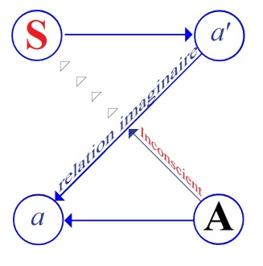

# Leçon 07 | 11 Janvier 1956

<!-- source-url: http://staferla.free.fr/S3/S3 PSYCHOSES.docx -->
<!-- seminar: s3 -->
<!-- lesson: 07 -->

<!-- id: s3-07-0001 -->

Je voudrais aujourd’hui vous rappeler quel est, non pas seulement mon dessein général pour ce qui est du cas SCHREBER, mais le propos fondamental de ces séminaires : l’un ne va pas sans l’autre et il est toujours bon de ne pas laisser se rétrécir son horizon. Bien sûr, comme on poursuit une marche pas à pas, un certain temps, nous aurons des murs devant notre nez, mais enfin, comme je vous emmène dans des endroits difficiles, nous manifestons peut-être un peu plus d’exigences qu’ailleurs, dans cette sorte de promenade. Il paraît aussi nécessaire de vous rappeler à l’intérieur de quel plan cette marche se situe.

<!-- id: s3-07-0002 -->

Je dirais que le propos de ce séminaire, il faudrait l’exprimer de diverses manières qui se recoupent et qui toutes reviennent au même. Je pourrais vous dire que je suis ici pour vous rappeler qu’il convient de prendre au sérieux notre expérience, que le fait d’être psychanalyste ne vous dispense pas d’être intelligents et sensibles. Il ne suffit pas qu’un certain nombre de clés vous aient été données, pour que vous en profitiez pour ne plus penser à rien, et pour dire les choses tout cru, pour vous efforcer, ce qui est le penchant général des êtres humains, à laisser tout en place, précisément à l’aide de ces quelques mots-clefs qui vous ont été donnés.

<!-- id: s3-07-0003 -->

Il est bien certain qu’il y a une certaine façon d’user des catégories telles que « *l’inconscient* », « *pulsion* », ou si vous voulez « *relations pré-œdipienne* », « *défense* », et en quelque sorte de n’en tirer aucune des conséquences authentiques qu’elles comportent. C’est une affaire qui concerne *les autres* en général - c’est toujours facile de prendre les choses sous ce registre - c’est une complication du monde des objets, mais à la vérité ça ne touche pas au fond de vos rapports avec le monde, et pour être psychanalyste, vous n’êtes - sauf à vous secouer quelque peu - nullement obligés de maintenir présent à l’esprit que le monde n’est pas tout à fait comme tout un chacun le conçoit, qu’il est pris dans ces prétendus mécanismes et prétendument connus de vous.

<!-- id: s3-07-0004 -->

D’un autre côté il ne s’agit pas non plus, ne vous y trompez pas, que je fasse ici la métaphysique de la découverte freudienne, que je me propose comme programme d’en tirer - ce qui pourrait assez justement être fait - toutes les conséquences qu’elle comporte par rapport à ce qu’on peut appeler au sens le plus large, *l’être*. Ce n’est pas là mon propos, je ne me le fixe pas comme objet, ça ne serait pas inutile, ça peut être indiqué de le faire, je crois que cela peut être aussi *laissé à d’autres*. Je dirais que ce que nous faisons ici en indiquera, plus facilement que sur d’autres travaux, la voie d’accès.

<!-- id: s3-07-0005 -->

Il ne faut pas croire non plus pourtant qu’il vous soit interdit de faire quelques battements d’ailes dans ce sens. Chacun de vos battements d’ailes intérieurs, cette métaphysique de la condition humaine telle qu’elle nous est révélée par *la découverte freudienne*…

<!-- id: s3-07-0006 -->

> vous ne perdrez jamais rien quand même à vous interroger là-dessus,
>
> mais enfin je dirai qu’après tout ce n’est pas là le point essentiel

<!-- id: s3-07-0007 -->

…cette métaphysique, vous ne l’oublierez pas ? vous la recevez toujours sur la tête.

<!-- id: s3-07-0008 -->

On peut faire confiance aux choses telles qu’elles sont structurées, telles que nous pouvons effectivement les toucher d’une façon un peu plus profonde, par l’intermédiaire de *la découverte, de l’expérience freudienne*, elles sont là, vous êtes dedans, ce n’est pas pour rien que c’est de nos jours que *cette découverte freudienne* a été faite, et que vous vous trouvez par une série de hasards des plus confus, en être personnellement *les dépositaires,* mais cette métaphysique, qui peut tout entière s’inscrire dans le rapport de l’homme au *symbolique*, vous y êtes immergé à un degré qui dépasse de beaucoup votre expérience de techniciens, et dont je vous indique quelquefois que ce n’est pas par hasard que nous en trouvons dans *toutes sortes* de disciplines… de systèmes ou d’interrogations qui sont voisines à la psychanalyse …que nous en trouvons, les traces et la présence.

<!-- id: s3-07-0009 -->

Ici nous nous limitons à quelque chose mais qui est essentiel, vous êtes *techniciens*, mais *techniciens* de choses qui existent à l’intérieur de cette découverte. Cette technique se développe à travers *la parole*.

<!-- id: s3-07-0010 -->

Essayons au moins ici de structurer correctement le monde dans lequel vous avez à vous déplacer dans votre expérience, en tant qu’il est structuré, qu’il est incurvé, pour employer un terme pour lequel je pense *à un certain nombre de commentaires,* dans la perspective de *la parole*, et pour autant que *la parole* y est centrale.

<!-- id: s3-07-0011 -->

> 

<!-- id: s3-07-0012 -->

C’est pour cela, et c’est par rapport à cela que mon petit carré qui va du *sujet* à l’*Autre*, et d’une certaine façon ici du *symbolique vers le réel* : *sujet → moi → corps*. \[S *→* I *→* R\]

<!-- id: s3-07-0013 -->

Ici, dans le sens contraire :

<!-- id: s3-07-0014 -->

- le grand Autre en tant qu’il est l’Autre de l’intersubjectivité, qu’il est l’Autre que vous n’appréhendez qu’en tant qu’il est *sujet* \[S\], c’est-à-dire qu’*il peut mentir*,

<!-- id: s3-07-0015 -->

- de *l’Autre* par contre *qu’on retrouve toujours là à sa place*, que j’ai appelé l’*Autre des astres*, ou si vous voulez le système stable du monde, de l’objet, \[R\]

<!-- id: s3-07-0016 -->

Et entre les deux, de *la parole avec ses trois étapes* :

<!-- id: s3-07-0017 -->

- du *signifiant*, \[S\]

<!-- id: s3-07-0018 -->

- de *la signification,* \[I\]

<!-- id: s3-07-0019 -->

- et du *discours*. \[R\]

<!-- id: s3-07-0020 -->

Ce n’est pas un système du monde, c’est un système de repérage de notre expérience, c’est comme cela qu’elle se structure. C’est à l’intérieur de cela que nous pouvons situer les diverses manifestations phénoménales auxquelles nous avons affaire. Si nous ne prenons pas au sérieux cette structure, nous n’y comprendrons rien.

<!-- id: s3-07-0021 -->

Bien entendu l’histoire du *sérieux* est au cœur même de la question. Les caractéristiques d’un sujet normal, c’est que pour lui un certain nombre de réalités existent, mais justement sa caractéristique aussi est de ne jamais les prendre tout à fait au sérieux. Vous êtes entourés de toutes sortes de réalités dont vous ne doutez pas, dont certaines sont particulièrement menaçantes, vous ne les prenez pas pleinement au sérieux, vous pensez, avec le sous-titre de Paul CLAUDEL, que « *Le pire n’est pas toujours sûr* »[^15], et vous vous maintenez dans un état d’heureuse incertitude qui rend possible pour vous l’existence suffisamment étendue.

<!-- id: s3-07-0022 -->

La *certitude* est non seulement la chose la plus rare pour le sujet normal : mais même la chose sur laquelle il peut s’interroger légitimement, il s’apercevra alors qu’elle est strictement corrélative d’une action, il est engagé dans une action qu’il approche, je ne dis pas qu’il touche.

<!-- id: s3-07-0023 -->

Mais qu’advient-il de cette catégorie de *la certitude *? Je ne m’étendrai pas là-dessus puisque nous ne sommes pas là précisément pour faire la psychologie de la phénoménologie du *plus prochain*, mais conformément à ce qui se passe toujours, à essayer de l’atteindre par un détour, et notre *plus lointain* aujourd’hui, c’est le fou SCHREBER.

<!-- id: s3-07-0024 -->

Il convient de prendre dans son ensemble notre fou SCHREBER, puisqu’il est le plus lointain. Gardons un peu nos distances, et nous allons nous apercevoir à faire cette remarque, qu’il a ceci de commun avec les autres fous…

<!-- id: s3-07-0025 -->

> et cela vous le retrouverez toujours, et c’est pour cela que je vous fais des présentations de malades,
>
> c’est pour que vous en ayez l’appréhension, les données les plus immédiates de ce qu’il nous fournit

<!-- id: s3-07-0026 -->

…le fou, il nous fournit celle-ci…

<!-- id: s3-07-0027 -->

> contrairement aux faux problèmes que se posent les psychologues,
>
> à ne pas le voir avec des yeux directs, à ne pas vraiment le fréquenter

<!-- id: s3-07-0028 -->

…c’est que contrairement au problème qu’on se pose, à savoir pourquoi est-ce qu’il croit à *la réalité de son hallucination*, on voit bien quand même que ça ne colle pas, et alors on se fatigue le tempérament à cette sorte de *genèse de la croyance*.

<!-- id: s3-07-0029 -->

Il faudrait d’abord un tout petit peu la préciser : il n’y croit pas à la réalité de son hallucination. il y a là-dessus mille exemples, et je dirais que je ne veux pas m’y étendre aujourd’hui parce que je reste contre mon texte, c’est-à-dire contre le fou SCHREBER, mais enfin c’est à la portée même de gens qui ne sont pas psychiatres.

<!-- id: s3-07-0030 -->

Et le hasard m’ayant fait ouvrir ces temps-ci la « *Phénoménologie de la perception »* de Maurice MERLEAU-PONTY : à la page 386 sur le thème de « *La chose et le monde naturel »* [^16], vous aurez des remarques excellentes sur ce sujet. C’est à savoir combien il est facile de s’apercevoir que rien n’est plus accessible à obtenir du sujet que ce qu’on lui fait remarquer qu’il est en train d’entendre, et qu’on ne l’a pas entendu. Il dit :

<!-- id: s3-07-0031 -->

> « *Oui, d’accord, c’est que je l’ai entendu tout seul.* »

<!-- id: s3-07-0032 -->

La réalité n’est pas ce qui est en cause : le sujet admet bien qu’il s’agit de choses fondamentalement irréelles, il admet, par tous les détours explicatifs verbalement développés qui sont à sa portée, qu’il s’agit là de choses d’une autre nature que celle de l’ordre réel. Et même l’*irréalité* il l’admet jusqu’à un certain point. Il faut qu’on le pousse pour qu’il aille vers le contrôle, quant à la réalité. À la vérité, il n’y a même pas besoin qu’on le *pousse*, lui aussi il pousse dans ce sens, il sait bien que cette réalité est en cause.

<!-- id: s3-07-0033 -->

Par contre, contrairement au sujet normal pour qui la réalité vient dans son assiette, il y a par contre une certitude quant au fait que ce dont il s’agit, et ceci va de l’hallucination à l’interprétation, jusqu’aux phénomènes les plus fins, les plus subtils, les phénomènes de signification générale - il est sûr que cela le concerne. Ce n’est pas de cette réalité qu’il s’agit chez lui, mais de certitude. Même quand il s’exprime dans le sens de dire que ce qu’il éprouve n’est pas de l’ordre de ce qui concerne la réalité, mais non pas la certitude que cela le concerne, cette certitude est quelque chose de radical.

<!-- id: s3-07-0034 -->

La nature de ce dont il est certain, peut rester d’une ambiguïté parfaite, et va de toute la gamme qui s’étend de la malveillance à la bienveillance, les deux peuvent même rester d’une ambiguïté totale à propos d’un phénomène particulier, il n’en reste pas moins que le fait que cela signifie quelque chose d’inébranlable pour lui, c’est cela qui constitue ce qu’on appelle à tort ou à raison, soit le phénomène élémentaire, soit le phénomèneplus développé de la croyance délirante.

<!-- id: s3-07-0035 -->

Vous pouvez en toucher un exemple, simplement en feuilletant l’admirable condensation que Freud nous a donnée, du livre de SCHREBER. Et enfin il reste qu’à travers FREUD, vous pouvez en avoir le contact, la dimension, FREUD le donne en même temps qu’il l’analyse, ce qui n’empêchera pas de recourir à certaines parties du texte.

<!-- id: s3-07-0036 -->

L’un des phénomènes les plus centraux, les plus « *clé* » du développement de son délire, c’est ce qu’il appelle « *l’assassinat d’âme* », cet *assassinat d’âme* dont nous verrons qu’à lui tout seul, dans sa formulation, il comporte une montagne de problèmes. Il n’en reste pas moins que ce phénomène tout à fait initial pour son délire et pour la conception qu’il a de cette *retransformation du monde* qui constitue son délire, il le présente lui-même comme totalement énigmatique.

<!-- id: s3-07-0037 -->

J’insiste, ce n’est pas seulement le chapitre III du livre des *Mémoires* qui nous donne les raisons de sa névropathie…

<!-- id: s3-07-0038 -->

> *qui est censuré*, on nous avertit que le contenu ne peut pas être publié, et nous savons néanmoins que
>
> ce chapitre comportait des remarques concernant la propre famille de SCHREBER

<!-- id: s3-07-0039 -->

…c’est-à-dire probablement ce qui nous permettrait de voir de beaucoup plus près comment se sont manifestées les relations fondamentales, peut-être inaugurales, du délire de SCHREBER, par rapport à son frère ou à son père, ou à quelqu’un de ses proches, et quelque chose qui assurément nous permettrait d’aller plus sûrement dans notre analyse de ce qu’on peut appeler communément les éléments significatifs, transférentiels qui ont pu jouer à tel moment de ce délire.

<!-- id: s3-07-0040 -->

Mais ceci après tout n’est pas tellement à regretter, car là encore il faut bien voir que quelquefois trop de détails, trop de surcharges, nous empêchent de voir des caractéristiques formelles qui ne sont pas moins fondamentales, et ce qui est essentiel…

<!-- id: s3-07-0041 -->

> ce n’est pas que nous comprenions à travers telle ou telle expérience affective à l’endroit de ses proches : nous devons, nous, comprendre ce que ledit « *assassinat d’âme* » peut-être,

<!-- id: s3-07-0042 -->

…c’est que nous voyons ceci : c’est que lui le sujet ne le comprend pas, et que néanmoins il le formule, qu’il le distingue comme étant un moment décisif de cette expérience nouvelle, à laquelle il a accédé, et qu’il nous communique, par l’énoncé du développement, le compte rendu des différents modes relationnels dont l’étagement, la perspective, lui a été progressivement donnée dans un effort d’élaboration qui a été le sien, il lui en a peu à peu livré le sens.

<!-- id: s3-07-0043 -->

Cet *assassinat d’âme*, il le considère lui-même, si énigmatique qu’il soit, comme étant un ressort, à un moment, absolument certain, et qui comporte tout de même, à un moment, si énigmatique qu’il soit pour lui-même, cette articulation.

<!-- id: s3-07-0044 -->

Il s’agit d’un *assassinat*, il n’y a pas de trace d’*âme*. D’autre part, parler d’une *âme* avec certitude n’est pas non plus très commun : savoir distinguer ce qui est âme et tout ce qui s’attache autour d’elle, la distinguer avec autant de certitude, c’est aussi quelque chose qui n’est pas donné à tout un chacun, et qui semble donné justement à ce délirant avec un caractère de certitude qui donne à son témoignage un relief essentiel.

<!-- id: s3-07-0045 -->

Nous devons nous arrêter à ces choses et n’en pas perdre le caractère distinctif tout à fait *primordial*, si nous voulons comprendre quoi que ce soit à ce qui se passe vraiment, et non pas simplement à l’aide de quelques mots-clés, nous débarrasser du phénomène de la folie comme désormais expliqué par cette opposition entre la réalité et la certitude.

<!-- id: s3-07-0046 -->

En d’autres termes, la question de ce qu’est *la certitude délirante*, c’est quelque chose dont il faut que vous vous rompiez à la retrouver partout où elle est, et à vous apercevoir par exemple à quel point est différent *le phénomène de la jalousie* dans ce qu’il est ou ce qu’il peut être quand il se présente chez un sujet *normal*, et lorsqu’il se présente chez *un délirant*. Il n’y a pas besoin de faire une évocation bien rapide du côté humoristique, voire comique de la jalousie du type normal qui est ce quelque chose dont on peut dire qu’elle se refuse le plus naturellement du monde à la certitude, quelles que soient les réalités qui s’en offrent.

<!-- id: s3-07-0047 -->

C’est que la fameuse histoire du jaloux normal qui poursuit vraiment jusqu’à la porte de sa chambre où est enfermée sa femme avec un autre, est tout de même quelque chose qui contraste assez avec le fait que le délirant, qui lui se dispense de toute référence réelle, enjambe presque immédiatement la certitude autour des thèmes de son délire, pour que vous compreniez la différence qu’il y a entre une jalousie normale et une jalousie délirante. Ceci est tout de même fait pour vous inspirer quelque méfiance dans le recours à des mécanismes - eux, normaux - comme celui qui s’appelle par exemple « *projection* », quand il s’agira de le transférer à la genèse d’une *jalousie délirante*.

<!-- id: s3-07-0048 -->

C’est pourtant communément ce que vous verrez faire, cette extrapolation, alors qu’il suffit de *lire le texte de* FREUD lui-même dans cet exemple du Président SCHREBER, pour voir que justement il exclut - comme une question, je dirais presque qu’il n’a pas le temps d’aborder à ce moment-là, mais dont il montre tous les dangers de faire intervenir à quelque moment que ce soit d’une façon imprudente - le terme de « *projection* », c’est-à-dire *la relation du moi à l’autre* comme tel, ou *du moi à moi* comme tel, dans la genèse d’une étape ou d’un ressort quelconque de la paranoïa. Ceci - écrit noir sur blanc - n’empêchera pas quiconque de se servir à tort et à travers du terme de « *projection* » quand il s’agit de la genèse et de l’explication des délires.

<!-- id: s3-07-0049 -->

Je dirais plus : le délirant, à mesure qu’il monte l’échelle des délires, et en somme c’est cela qui en est *la caractéristique,* est de plus en plus sûr de *choses* posées comme telles, comme *de plus en plus irréelles*, et dans le cas précis de *la paranoïa*, c’est ce qui la distingue de la démence précoce, il les articule avec une abondance, avec une richesse qui est justement une des caractéristiques cliniques les plus essentielles, et qui pour être des plus massives, ne doit tout de même pas être négligée , qui caractérise l’ordre et le registre des paranoïas au cours des productions discursives, qui la plupart du temps d’ailleurs s’épanouissent en productions littéraires, au sens où « *littéraire* » signifie simplement feuilles de papier couvertes avec de l’écriture. C’est une caractéristique de ce développement de la psychose paranoïaque.

<!-- id: s3-07-0050 -->

Jusqu’à quelques extrêmes dans l’ordre du délire fantasmagorique que nous arrivions à en fixer les limites, c’est bien cela qui milite en faveur du maintien d’une certaine unité entre les délires qu’on a peut-être un peu prématurément isolés comme paranoïaques à proprement parler, et les formations dites, dans la nosologie classique, « *paraphréniques* ».

<!-- id: s3-07-0051 -->

Mais il y a aussi quelque chose dont il convient de vous apercevoir, c’est que le fou, tout écrivain qu’il soit, et il l’est dans ce registre, il faut quand même en faire la remarque, même dans un cas comme celui du Président SCHREBER qui apporte une œuvre si saisissante par son développement, par ses caractères complets, fermés, pleins, achevés, et certainement très attachante pour nous qui nous intéressons à ce problème, il y a quelque chose qui frappe : c’est que ce personnage qui en somme est venu, après le développement, à se faire de ce délire la conception de relation essentielle qu’il a à Dieu, et celle de correspondant féminin de Dieu, d’être la femme de Dieu, de savoir, de ce fait, que l’idée qu’il se fait de lui-même est dans l’idée qu’en somme :

<!-- id: s3-07-0052 -->

- tout est compréhensible,

<!-- id: s3-07-0053 -->

- tout est arrangé, et je dirais plus :

<!-- id: s3-07-0054 -->

- tout s’arrangera pour tout le monde, puisqu’il joue là un rôle d’intermédiaire entre une humanité menacée jusqu’au fin fond de son existence, et un pouvoir divin avec lequel il a ses attaches à lui, si particulières,

<!-- id: s3-07-0055 -->

- tout est arrangé dans cette réconciliation.

<!-- id: s3-07-0056 -->

Ceci est pour marquer le tournant de sa maladie qui se situe entre :

<!-- id: s3-07-0057 -->

- le moment du symptôme inexpliqué, de la profonde perturbation de son expérience, qui a été une perturbation extrêmement cruelle et douloureuse, la période du *début* de sa psychose,

<!-- -->

<!-- id: s3-07-0058 -->

- et la période où il commence à l’élever à la compréhension, et du même coup à une certaine maîtrise de sa psychose.

<!-- id: s3-07-0059 -->

C’est la *Versöhnung*, cette *réconciliatio*n qui le situe comme femme de Dieu, et qui donne tous les développements que cela comporte :

<!-- id: s3-07-0060 -->

- un monde extrêmement riche, complexe et articulé, dont nous ne pouvons pas ne pas être frappés du fait que cela ne comporte rien qui nous indique la moindre présence, la moindre effusion,

<!-- id: s3-07-0061 -->

> la moindre communication réelle d’aucune façon,

<!-- id: s3-07-0062 -->

- une assomption qui nous donne l’idée qu’il y a vraiment là, rapport de deux êtres, et sans recourir - ce qui serait discordant à propos d’un texte comme celui-là - à la comparaison avec un texte d’un *grand mystique*.

<!-- id: s3-07-0063 -->

Tout de même si l’épreuve vous amuse, ouvrez n’importe quelle page de Saint JEAN DE LA CROIX, qui dans l’expérience de la montée de l’âme, n’exprime pas dans le fond quelque chose qui soit absolument impossible à évoquer à ce propos : lui aussi se présente dans une attitude d’offrande, de réception, et il va même, jusqu’à la comparaison avec le fait d’« *épousailles de l’âme* » avec la présence divine.

<!-- id: s3-07-0064 -->

Il n’y a absolument rien de commun entre l’accent qui nous est donné d’un côté et de l’autre. Et je dirais même qu’à propos du moindre témoignage d’expérience religieuse authentique, vous verrez toute la différence disons que derrière tout ce long discours par lequel SCHREBER nous témoigne quelque chose qu’il s’est enfin résolu à admettre comme solution de *sa problématique*, nous n’avons nulle part le sentiment de quelque chose qui nous soit communiqué d’une expérience originale, de quelque chose dans lequel le sujet lui–même soit pris et inclus, c’est un témoignage vraiment objectivé.

<!-- id: s3-07-0065 -->

Nous posons là le problème de ce dont il s’agit dans ces sortes de témoignages de ces délirants : ne disons pas que le fou est quelqu’un qui se passe de la reconnaissance de l’autre, puisqu’en fait SCHREBER écrit cet énorme ouvrage pour que nul n’en ignore à propos de ce qu’il a éprouvé, et même pour qu’à l’occasion, les savants viennent sur son corps rechercher le témoignage de la présence de ces *nerfs féminin* dont il a été progressivement pénétré, et qui pourront permettre d’objectiver ce rapport unique qui a été le sien avec la réalité divine. Tout ceci se propose bien comme un effort pour être reconnu, et puisqu’il s’agit d’un discours et d’une chose publiée, nous dirons que là *un point d’interrogation* se soulève de ce que peut vouloir dire - pour ce personnage si isolé par son expérience, qu’est le fou - ce besoin de reconnaissance.

<!-- id: s3-07-0066 -->

Nous voyons bien qu’il y a là une question qui rend plus complexe que ne va l’apparaître au premier abord, ce qui pourrait être jeté comme une distinction : soit que le fou, puisqu’il est fou, est justement le personnage qui n’a pas besoin d’être reconnu. Cette non-reconnaissance, cette suffisance qu’il a de son propre monde, cette auto-compréhension qui le distingue, qui nous semble le distinguer au premier abord, ne va pas sans présenter elle-même quelques contradictions, dont la clé est peut-être tout entière dans ce qu’il dit quand il nous apporte le témoignage de son délire. C’est là quelque chose qui se dérobe à nous, et nous permet de résumer la situation par rapport à son discours quand nous en prenons connaissance.

<!-- id: s3-07-0067 -->

En ceci, comme je l’ai dit tout à l’heure, *s’il est assurément écrivain, il n’est pas poète*, il ne nous introduit pas à de nouvelles dimensions de l’expérience que nous avons chaque fois que dans un écrit nous sommes introduits à un monde qui est à la fois quelque chose auquel nous accédons et qui est autre que le nôtre, mais qui nous donne la notion de présence d’un être, d’un certain rapport fondamental qui devient aussi bien - de par là même - désormais le nôtre, qui fait que dans Saint JEAN DE LA CROIX, nous ne pouvons plus douter de *l’authenticité de l’expérience mystique*… comme aussi bien que quelqu’un d’autre : PROUST, Gérard DE NERVAL, qui assurément est la poésie qui s’appelle *création* par un sujet qui là assume un nouvel ordre de *relation symbolique* au monde.

<!-- id: s3-07-0068 -->

Tout au contraire est notre personnage de SCHREBER. Dans tout son texte, à chaque instant on touche du doigt le phénomène de sa transformation : à s’observer, à nous expliquer *comment il est* violé, manipulé, transformé, siège de toutes sortes de phénomènes, *parlé, « jacassé »* de toutes les manières, terme qui n’est pas absolument choisi, mais c’est bien de cela qu’il s’agit.

<!-- id: s3-07-0069 -->

Car vous verrez au détail de ces choses, une espèce de pépiement de ce qu’il appelle « *les oiseaux du ciel* », c’est bien de cela qu’il s’agit, le siège de toute une volière de phénomènes, il n’est pas tout cela et pourtant c’est tout cela qui est pour lui le plus important, puisque c’est pour tout cela qu’il fait *cette énorme communica­tion* qui est la sienne, dans ce livre de quelques cinq cent pages, dans lequel il com­munique ces phénomènes, qui n’est pas du tout un fruit du hasard, mais le résul­tat d’une longue construction qui a été pour lui la solution de son *aventure in­térieure*.

<!-- id: s3-07-0070 -->

Qu’allons-nous donc dire en fin de compte du délirant ? Est-il seul ? Ce n’est pas non plus le sentiment que nous avons, il est habité par toutes sortes d’existences, improbables certes, « *idéentielles* », mais dont le caractère significatif est certain comme donnée première, et dont le caractère articulé s’élabore de plus en plus à mesure qu’avance son délire : le doute porte au départ, et à tel moment, justement sur ce à quoi elle renvoie, mais elle renvoie sûrement à quelque chose, ceci pour lui ne fait aucun doute.

<!-- id: s3-07-0071 -->

Chez un sujet comme SCHREBER *les choses* vont aussi loin, que le monde entier est pris dans *ce délire de signification*, et l’on peut dire que loin d’être seul, il n’est à peu près rien de ce qui l’entoure qu’il ne soit d’une certaine façon.

<!-- id: s3-07-0072 -->

Mais par contre tout ce qu’il fait *être* dans ses significations, est en quelque sorte *vide* de lui–même, et ceci est expliqué et articulé de mille façons, spécialement par exemple quand il remarque et quand il dit que Dieu, c’est-à-dire son interlocuteur imaginaire, ne comprend rien à tout ce qui est de l’intérieur, à tout ce qui est des êtres vivants, Dieu n’a jamais affaire qu’à *des ombres* ou à *des cadavres*, et aussi bien *tout son monde s’est transformé en une fantasmagorie* de ce qu’on a traduit plus ou moins proprement en français par : « *ombres d’hommes bâclés à la six-quatre-deux* ».

<!-- id: s3-07-0073 -->

Je vous dirai aujourd’hui ce sur quoi va porter notre démonstration : qu’une telle construction, qu’une telle transformation, qu’une telle création, se produise chez un sujet, nous avons à la lumière des perspectives analytiques plusieurs voies qui s’ouvrent à nous pour le comprendre. Les voies toujours faciles sont les voies déjà connues.

<!-- id: s3-07-0074 -->

Nous avons une catégorie qui a été introduite très tôt dans l’analyse, dont vous savez qu’elle est tout à fait au premier plan, présente dans tout ce qui s’en dit actuellement, c’est la notion de *défense *: tout ceci est fait pour quelque chose, et le quelque chose dont il s’agit est quelque chose contre quoi le sujet veut se défendre.

<!-- id: s3-07-0075 -->

- Vous savez que les névroses, sont ainsi expliquées.

<!-- id: s3-07-0076 -->

- Vous savez aussi combien j’insiste sur le caractère incomplet de cette référence, sur son caractère scabreux en ce sens qu’il prête à toutes sortes d’interventions précipitées, et comme telles nocives.

<!-- id: s3-07-0077 -->

- Vous savez d’autre part combien il est difficile de s’en débarrasser, puisque aussi bien cela touche à quelque chose d’objectivable.

<!-- id: s3-07-0078 -->

C’est précisément pour cela que la catégorie et le concept est à la fois si insistant, si tentant, et vous offre un tel penchant, pour diriger selon lui nos interventions : le sujet se défend, aidons-le à comprendre qu’il ne fait que se défendre, c’est-à-dire à lui montrer ce contre quoi il se défend.

<!-- id: s3-07-0079 -->

Plan et point dans lequel, dès que vous entrez, vous vous trouvez devant des dangers multiples. Le premier danger étant celui que vous manquiez très exactement le plan sur lequel doit se faire votre intervention, qui doit toujours seulement distinguer l’ordre où se manifeste cette défense, si cette défense est manifestement dans *l’ordre symbolique*, c’est là qu’est *toute la différence* de ce que je vous enseigne, avec ce que vous pourrez trouver ailleurs. C’est-à-dire qu’il s’agit de quelque chose que vous pouvez élucider dans le sens d’*une parole* au sens plein, c’est-à-dire de quelque chose qui intéresse dans le sujet, *signifiant et signifié*, et dont vous avez dans l’actualité, dans ce que vous présente le sujet, les deux, *signifiant et signifié*.

<!-- id: s3-07-0080 -->

Alors en effet, là, vous pouvez intervenir en lui montrant la conjonction de *ce signifiant* et de *ce signifié*, et pour autant qu’il les a tous les deux présents dans son discours : si vous ne les avez pas tous les deux, si vous avez l’impression que le sujet se défend contre quelque chose que vous voyez vous, et que lui ne voit pas, c’est-à-dire que vous voyez de la façon la plus manifeste et la plus claire, que le sujet *aberre* quant à la réalité, la notion de « *défense* » est pour vous insuffisante pour vous permettre de mettre le sujet en face de la réalité.

<!-- id: s3-07-0081 -->

Rappelez-vous ce que je vous ai dit dans un temps ancien à propos d’une observation très jolie de KRIS : le personnage qui était hanté par la notion qu’il était plagiaire, et par la culpabilité de son plagiat. L’intervention de KRIS, il la considère comme géniale au nom de la *défense*, car depuis quelque temps comme nous n’avons plus que cette notion de *défense*, il est bien clair qu’en effet ce *moi* a à faire la lutte sur trois fronts, c’est-à-dire :

<!-- id: s3-07-0082 -->

- du côté de l’*id*,

<!-- id: s3-07-0083 -->

- du côté du *surmoi*,

<!-- id: s3-07-0084 -->

- et du côté du *monde extérieur*, …alors nous nous croyons autorisés à intervenir sur l’un quelconque de ces trois plans, et de faire remarquer au personnage dont il s’agit - parce que tout d’un coup ça vient à la portée de notre main - que nous nous permettons de lire l’ouvrage auquel le sujet a fait allusion, à savoir l’ouvrage d’un de ses collègues auquel une fois de plus il aurait fait des emprunts, et nous nous apercevons qu’il n’y a rien du tout dans l’ouvrage du collègue qui mérite d’être considéré comme une idée originale que le sujet aurait empruntée. Nous le lui faisons remarquer, considérant que ceci fait partie de l’analyse, heureusement nous sommes à la fois assez honnêtes et assez aveugles.

<!-- id: s3-07-0085 -->

Comme preuve du bien­fondé de notre *interprétation*, le fait que le sujet à la séance suivante nous apporte la jolie petite histoire suivante : en sortant de la séance il a été dans un restaurant quelconque pour y déguster son plat préféré,

<!-- id: s3-07-0086 -->

des cervelles fraîches. On est enchanté : ça a répondu, mais qu’est-ce que ça veut dire ? Ça veut dire d’abord que *le sujet*, lui, n’a absolument rien compris à la chose, et qu’il ne comprend rien non plus à ce qu’il vous apporte, de sorte qu’on ne voit pas très bien où est le progrès réalisé du fait qu’on a appuyé sur le bon bouton.

<!-- id: s3-07-0087 -->

C’est un *acting-out* dans ce sens que j’entérine l’*acting-out* comme étant quelque chose de tout à fait équivalent à un phénomène hallucinatoire du type délirant. Il s’agit de ceci précisément dans ce sens :

<!-- id: s3-07-0088 -->

- où vous avez symbolisé prématurément quelque chose qui est de l’ordre de la réalité,

<!-- id: s3-07-0089 -->

- où vous n’avez pas abordé la question à l’intérieur du registre symbolique.

<!-- id: s3-07-0090 -->

L’aborder à l’intérieur du registre symbolique pour un analyste dans une occasion comme celle du plagiariste, doit être centré sur l’idée :

<!-- id: s3-07-0091 -->

- que d’abord le plagiarisme n’existe pas,

<!-- id: s3-07-0092 -->

- à savoir qu’il n’y a pas de propriété symbolique,

<!-- id: s3-07-0093 -->

- que le symbole est à tous.

<!-- id: s3-07-0094 -->

C’est à partir de là que l’analyste doit se poser la question : pourquoi d’abord est-ce que les choses de l’ordre et du registre du symbole ont pris pour le sujet cet accent, et ce poids de *l’apparence* ou de *la non-apparence*. C’est là qu’est le problème. C’est là que l’analyste doit attendre ce que le sujet va lui fournir pour lui permettre de faire entrer en jeu son interprétation. Vous avez en effet toutes les chances pour que ce plagiarisme soit fantasmatique, parce que c’était un grand névrosé résistant déjà à une tentative certainement pas négligeable d’analyse, puisqu’il avait eu avant de venir à KRIS une analyse certainement efficace.

<!-- id: s3-07-0095 -->

Par contre en portant l’intervention sur le plan de la réalité, c’est-à-dire en fin de compte en retournant, à travers les catégories analytiques, à la psychothérapie la plus primaire, vous avez commencé à lui dire la réalité, et ça ne colle pas, à savoir qu’il n’est pas réellement plagiaire.

<!-- id: s3-07-0096 -->

Que fait le sujet ? Le sujet répond de la façon la plus claire, c’est-à-dire en renouvelant à un niveau plus profond de la réalité, pour bien montrer que c’est là qu’est la question, à savoir que quelque chose surgit de la réalité, qui est obstiné, et que tout ce qu’on pourra lui dire ne changera rien au fond du problème, c’est-à-dire qu’il s’impose à lui quelque chose, puisque vous lui démontrez qu’il n’est pas plagiaire, il va vous montrer de quoi il s’agit en vous faisant manger des cervelles fraîches, c’est-à-dire qu’il renouvelle son symptôme sur un point plus éloigné qui n’a pas plus de fondement ni plus d’existence que le point sur lequel il l’a montré tout d’abord. Montre-t-il même quelque chose ? J’irai plus loin, je dirai :

<!-- id: s3-07-0097 -->

- qu’*il* ne montre rien du tout,

<!-- id: s3-07-0098 -->

- ce quelque chose *se montre*.

<!-- id: s3-07-0099 -->

Et c’est là que nous sommes au cœur de ce que je vais cette année essayer de vous démontrer au niveau du Président SCHREBER, à propos de toute cette observation, qui montre d’une façon en quelque sorte dilatée, façon qui nous permet de voir les choses microscopiques à une dimension énorme, cette observation du Président SCHREBER et le rôle fondamental de ce que j’ai à vous démontrer à propos de cette observation et de la façon même dont FREUD tout en ne la formulant pas jusqu’à l’extrême, parce que le problème n’était pas venu à un état d’acuité, d’urgence, à propos de la pratique analytique dans son temps, comme il l’est dans le nôtre, de ceci qui est formulé par FREUD de la façon la plus claire : c’est *que quelque chose qui a disparu, a été rejeté de l’intérieur, reparaît à l’extérieur*.

<!-- id: s3-07-0100 -->

Phrase que j’ai déjà maintes fois citée, et qui est la phrase absolument essentielle. Je la commente et j’y reviens. Il s’agit de ceci, c’est que préalablement, et il s’agit d’une antériorité qui est logique et qui n’est pas chronologique, préalablement à toute symbolisation, il existe - et les psychoses en sont la démonstration - la possibilité de ceci : *qu’une part de la symbolisation ne se fasse pas*. En d’autres termes, qu’il y a une étape antérieure à tout ce qui est à proprement parler « *dialectique de la névrose* », *en tant que la dialectique de la névrose est tout entière liée à ceci* : *que le refoulement et le retour du refoulé sont une seule et même chose*. Autrement dit *que toute la névrose est une parole qui s’articule*.

<!-- id: s3-07-0101 -->

Mais il y a quelque chose qui existe aussi, c’est à savoir que quelque chose qui est tout à fait primordial dans l’être du sujet, n’entre pas dans la symbolisation, est non pas *refoulé*, mais *rejeté*. Je vous propose ceci, disons de fixer les points qui sont à démontrer. Ça n’est pas une hypothèse non plus, c’est une articulation du problème. Il y a une première étape, qui n’est pas une étape que vous avez à situer quelque part dans la genèse, encore que bien entendu les questions de la situation de cette étape dans la genèse, à savoir de ce qui se passe au niveau des premières articulations symboliques du sujet, l’apparition essentielle du sujet, qui commence à jouer avec un objet qu’il fait disparaître, tout ceci nous posera des questions.

<!-- id: s3-07-0102 -->

Mais ne vous laissez pas fasciner par l’existence de ce moment génétique qui forcément ne vous laisse apparaître qu’un phénomène dans le développement au niveau d’un objet limité qui est ce jeune enfant que vous voyez jouer, et qui est en train, en effet, de commencer à s’exercer à la première appréhension du symbole, mais qui, si vous vous laissez fasciner par lui, vous masque tout simplement ce fait :

<!-- id: s3-07-0103 -->

- que *le symbole est déjà là*, énorme, *l’englobant de toute part*,

<!-- id: s3-07-0104 -->

- que le langage existe déjà,

<!-- id: s3-07-0105 -->

- qu’il remplit les *bibliothèques*, les *dictionnaires*.

<!-- id: s3-07-0106 -->

Mais pas simplement : de là qu’il déborde à travers toutes vos actions, qu’il les encercle, qu’il leur fait faire ce que vous faites, que *vous êtes engagé* \[Cf. Pascal\] et qu’il peut vous requérir à tout instant de vous déplacer, vous mener quelque part. Vous oublierez tout cela devant cet enfant qui est en train d’inventer les éléments, de s’introduire dans la dimension essentielle du symbole.

<!-- id: s3-07-0107 -->

Là où il est, c’est-à-dire partout où nous sommes en tant qu’êtres humains immergés dans le symbole, il y a la possibilité d’une *Verwerfung* primitive, de *quelque chose qui n’est pas symbolisé*. Ce quelque chose qui n’est pas symbolisé, c’est cela qui va se manifester dans le *réel*.

<!-- id: s3-07-0108 -->

C’est pour cela que cette catégorie du *réel* est essentielle à introduire. Elle est partout, elle est impossible à négliger dans les textes freudiens. Je lui donne ce nom en tant qu’il définit par rapport à *l’acte de* *la parole* un champ différent de lui, du *symbolique*, parce qu’à partir de là il est possible d’éclairer l’évolution du phénomène psychotique comme tel.

<!-- id: s3-07-0109 -->

Arrêtons-nous donc un moment à cette première distinction, à ce quelque chose qui se produit au niveau *d’une possibilité de non-possibilité*, *d’une Bejahung* primitive à partir de laquelle une première dichotomie s’établit dans laquelle :

<!-- id: s3-07-0110 -->

- d’un côté tout ce qui aura été soumis à la *Bejahung* pure peut avoir divers destins,

<!-- id: s3-07-0111 -->

- et tout ce qui d’un autre côté est tombé sous le coup de cette *Verwerfung* primitive en aura un autre qui est constitué par ceci : c’est qu’il y a un fossé beaucoup plus profond entre tout ce qui *est*, et tout ce qui a été admis dans la symbolisation primitive.

<!-- id: s3-07-0112 -->

Je vais en avant aujourd’hui, mais sous ce registre, j’éclaire ma lanterne, simplement pour que vous sachiez en tout cas où je vais, ce que je veux vous faire toucher du doigt, ce que je veux prouver devant vous. En d’autres termes, ne prenez pas cela pour une construction, ni arbitraire, ni simplement comme le fruit d’un *commentaire,* plus ou moins littéral, de FREUD, de soumission à son texte, car ce que je dis là, c’est très précisément ce que nous avons lu dans ce texte extraordinaire de la *Verneinung*.

<!-- id: s3-07-0113 -->

C’est Monsieur HYPPOLITE qui, il y a deux ans, a bien voulu le lire pour nous. Il ne s’agit ni de soumission au texte, ni d’une construction qui soit en quelque sorte arbitraire. Il s’agit maintenant de vous dire que *si je pose ceci*, c’est parce que c’est la seule façon d’introduire une rigueur, une cohérence, une rationalité dans ce qui se passe dans la psychose, et très précisément dans celle dont il s’agit ici, c’est-à-dire celle du Président SCHREBER. Donc ce que je dirai par la suite sera à mesure que nous le rencontrerons, toujours orienté du côté de la *démonstration* des difficultés que fait toute autre compréhension du cas, en d’autres termes de ce qui fait qu’il est obligé de le comprendre à partir de cette hypothèse primitive.

<!-- id: s3-07-0114 -->

Il y a donc à l’origine *Bejahung*, c’est-à-dire « *affirmation de ce qui est* », ou *Verwerfung*. L’évolution ultérieure de cette *Bejahung*, c’est occasionnellement - et en somme toujours - tout ce que nous allons voir : il ne suffit pas que le sujet ait choisi dans le texte de ce qu’il y a à dire une partie et une partie seulement, pour qu’au moins avec une partie ça colle. À l’intérieur de cela il y a des choses qui ne collent pas. C’est trop évident si nous ne partons pas de l’idée que, contrairement à ce qui est l’inspiration de toute la psychologie classique et académique, tout doit coller, à savoir que les êtres humains sont des êtres, comme on dit « *adaptés* », puisqu’ils vivent.

<!-- id: s3-07-0115 -->

Vous n’êtes pas psychanalyste si vous admettez cela, car être psychanalyste c’est simplement ouvrir les yeux sur cette évidence qu’il n’y a rien de plus cafouilleux que « *la réalité humaine* », c’est-à-dire que contrairement à ce qu’on dit, dans toute la mesure où vous croyez avoir un *moi*, comme on dit « *bien adapté »*, raisonnable, qui sait naviguer, qui sait reconnaître ce qu’il y a à faire, qui sait ce qu’il y a à ne pas faire et tenir compte des *réalités* que la psychanalyse vous montre, et si vous croyez que la psychanalyse c’est cela, il n’y a plus qu’à vous envoyer loin d’ici.

<!-- id: s3-07-0116 -->

La psychanalyse vous montre - et rejoint là l’expérience - qu’il n’y a rien de plus bête qu’une destinée humaine, à savoir qu’on est toujours blousé, même quand on fait quelque chose qui réussit, ce n’est justement pas ce qu’on voulait, et qu’il n’y a rien toujours de plus déçu qu’un monsieur qui arrive soi-disant au comble de ses vœux, il suffit de parler trois minutes avec lui franchement, comme peut-être il faut uniquement l’artifice du divan psychanalytique pour le savoir, pour qu’on sache qu’en fin de compte *ce truc-là* c’est justement *le truc* dont il se moque, et qu’il est à côté de cela particulièrement ennuyé par je ne sais quoi, par toutes sortes de choses.

<!-- id: s3-07-0117 -->

*L’analyse c’est cela, c’est de s’apercevoir de cela et d’en tenir compte* :

<!-- id: s3-07-0118 -->

- c’est-à-dire que ce n’est pas comme cela par accident, que cela pourrait être autrement,

<!-- id: s3-07-0119 -->

- c’est-à-dire qu’en fin de compte, par une chose bizarre, nous ne traversons la vie qu’en ne rencontrant que des malheureux, mais c’est un destin qui nous est particulier, les gens heureux doivent être quelque part.

<!-- id: s3-07-0120 -->

Si vous ne vous ôtez pas cela de la tête, c’est que vous n’avez rien compris à la psychanalyse, et c’est cela que j’appelle « *prendre les choses au sérieu*x », quand je vous ai dit qu’il fallait « *prendre les choses au sérieux* », c’est pour que vous preniez au sérieux justement ce fait que vous ne les prenez jamais au sérieux.

<!-- id: s3-07-0121 -->

Donc à l’intérieur de cette *Bejahung*, il va arriver toutes sortes d’accidents, d’abord parce que le retranchement primitif, rien ne nous indique qu’il a été fait d’une façon propre, et je dirais qu’il y a de fortes chances que d’ici longtemps nous ne sachions rien de ses motifs, précisément parce que là c’est au-delà de tout mécanisme de symbolisation, de sorte que si quelqu’un en sait un jour quelque chose, il y a peu de chance que ce soit l’analyste. Mais avec ce qui reste, et ce avec quoi il s’agit qu’il se compose un monde, et surtout ce avec quoi il s’agit qu’il se situe dans ce monde, c’est-à-dire qu’il s’arrange pour être à peu près ce qu’il a *admis*, c’est-à-dire pour être un homme quand il se trouve être du sexe masculin, ou une femme inversement.

<!-- id: s3-07-0122 -->

Ceci pose des problèmes, ce n’est pas pour rien que je mets ceci tout à fait au premier plan, puisque justement l’analyse souligne bien que c’est là un des problèmes essentiels : c’est à l’intérieur de cela que vont se produire un certain nombre de phénomènes dans lesquels, puisque c’est là proprement le champ de l’analyse, il est essentiel que vous n’oubliiez jamais que rien de ce qui touche

<!-- id: s3-07-0123 -->

- au comportement de l’*être* humain comme sujet,

<!-- id: s3-07-0124 -->

- à quelque chose dans lequel il se réalise, dans lequel il « *est »* tout simplement, …ne peut échapper de quelque façon à être soumis aux lois de la parole.

<!-- id: s3-07-0125 -->

S’il y a autre chose dans l’expérience, c’est ce que la découverte freudienne nous montre, c’est que les adéquations naturelles, sont chez l’homme profondément déconcertées, ce n’est pas simplement parce qu’il est un mammifère pour qui *la bisexualité* joue chez lui un rôle essentiel, *cette bisexualité fondamentale* est en effet, il n’y a pas grand-chose de surprenant au point de vue biologique, étant donné qu’étant soumis à *des voies d’accès, de normalisation, de régulation,* qui chez sont *plus complexes* et différentes de ce à quoi elles sont soumises chez les mammifères et chez les vertébrés en général. D’une façon *plus complexe* parce que *la symbolisation* y joue, autrement dit *la loi* qui y joue un rôle primordial.

<!-- id: s3-07-0126 -->

C’est également ce que veut dire l’expérience et la découverte freudienne : *le complexe d’Œdipe* est là « *ab origine* » à savoir *<u>que</u>* dans l’existence de cette loi primordiale. C’est cela le sens qu’il faut donner au fait que FREUD a tellement insisté sur l’Œdipe qu’il en a été jusqu’à construire une sociologie de *totems* et de *tabous*.

<!-- id: s3-07-0127 -->

C’est manifestement qu’on la trouvait à l’avance, puisque ce n’est observable que là où la loi existe, par conséquent il n’est pas question de *se poser la question des origines*, puisque justement elle est là depuis le début, et depuis les origines et qu’il n’est pas question d’articuler quelque chose sur la sexualité humaine s’il n’y a pas ceci : qu’elle doit se réaliser par et à travers une certaine loi fondamentale qui est simplement *une loi de symbolisation*, c’est ce que cela veut dire.

<!-- id: s3-07-0128 -->

Donc à l’intérieur de ceci va se produire tout ce que vous pouvez imaginer, sous ces trois registres :

<!-- id: s3-07-0129 -->

- de la *Verdichtung,*

<!-- id: s3-07-0130 -->

- de la *Verdrängung*

<!-- id: s3-07-0131 -->

- et de la *Verneinung*.

<!-- id: s3-07-0132 -->

La *Verdichtung* c’est simplement la loi du malentendu, grâce à laquelle nous survivons, ou encore grâce à laquelle nous faisons plusieurs choses à la fois, ou encore grâce à laquelle nous pouvons par exemple satisfaire, quand nous sommes un homme, nos tendances féminines dans une relation symbolique où nous occupons précisément *la position féminine*, tout en restant parfaitement sur le plan *imaginaire* et sur le plan *réel*, un homme pourvu de sa virilité.

<!-- id: s3-07-0133 -->

Cette fonction qui peut très bien rester - avec plus ou moins d’intensité peut-être - de féminité, est quelque chose qui trouvera à se satisfaire à cette réceptivité essentielle qui est l’un des rôles existants fondamentaux, qui n’est pas métaphorique : nous recevons *quelque chose* quand *nous recevons la parole*.

<!-- id: s3-07-0134 -->

Au même instant de manifestation de quelque chose dans notre comportement, il se peut qu’il y ait une façon de participer à la relation de *la parole* qui ait à la fois plusieurs sens, et que l’une de ces significations intéressées, soit précisément celle de se satisfaire dans cette occasion - je prends cela comme exemple - dans cette *position féminine*, comme essentielle à notre *être*.

<!-- id: s3-07-0135 -->

La *Verdrängung*, ce n’est pas la loi du malentendu, c’est ce qui se passe quand ça ne colle pas, à savoir quand deux chaînes différentes symboliques…

<!-- id: s3-07-0136 -->

> car dans chaque chaîne symbolique nous sommes liés à une cohérence interne à cette chaîne, qui fait que nous sommes forcés à tel moment de rendre ce que nous avons donné à tel autre

<!-- id: s3-07-0137 -->

…il y a des fois où ça ne colle pas, où nous ne pouvons pas rendre à la fois sur tous les plans, en d’autres termes où une loi nous est intolérable, non parce qu’elle est intolérable en soi, mais parce que nous nous sommes mis dans une position telle que pour nous, mettre la note sur ce sujet, est quelque chose qui nous paraît à proprement parler comporter un sacrifice qui ne peut pas être fait sur le plan des significations.

<!-- id: s3-07-0138 -->

Mais la chaîne court toujours, c’est-à-dire que lorsque nous la refoulons de nos actes, de nos discours, de notre comportement, la chaîne continue à courir dans les dessous, c’est-à-dire à exprimer ses exigences, à faire valoir sa créance par l’intermédiaire du symptôme névrotique, et c’est pour cela que le refoulement est ce qui est au ressort de la névrose.

<!-- id: s3-07-0139 -->

Il y a ce quelque chose qui s’appelle la *Verneinung* qui est probablement quelque chose *de l’ordre du discours*, c’est-à-dire tout cela que nous sommes capables de faire venir au jour par une voie articulée, ce quelque chose qui a le plus grand rapport avec l’émergence de ce qui dans l’analyse s’appelle « *principe de réalité* », et qui intervient strictement à ce niveau, c’est-à-dire au niveau où FREUD l’articule de la façon la plus claire, en trois ou quatre endroits qui sont ceux que nous avons parcourus, de son œuvre, dans les différents moments de notre commentaire qui est celui-ci, il s’agit de savoir, non pas ce sur quoi nous faisons une *Bejahung*, mais ce à quoi nous attribuons valeur d’existence, et attribuer à une chose valeur d’existence, dans le vocabulaire de FREUD, je veux dire dans ce qu’il appelle, lui, « *jugement d’existence* », c’est quelque chose dont il a - avec une profondeur mille fois en avance sur ce qu’on disait de son temps - donné la caractéristique suivante : *qu’il s’agit toujours de retrouver un objet*.

<!-- id: s3-07-0140 -->

Qu’est-ce que cela comporte et qu’est-ce que cela veut dire ? Cela veut dire que toute appréhension de la réalité chez l’homme est soumise à une condition primordiale, c’est-à-dire que le monde humain consiste en ceci : que le sujet est à la recherche de *l’objet de son désir*, mais rien ne l’y conduit.

<!-- id: s3-07-0141 -->

La réalité, pour autant qu’elle est soutenue par le désir, est au départ, hallucinée. Dans la théorie de la naissance du monde objectal, la réalité, telle que nous la voyons exprimée à la fin de la *Traumdeutung* par exemple, et telle qu’elle est reprise chaque fois qu’il s’agit d’elle essentiellement, le sujet reste en suspension à l’endroit de ce qui fait son objet fondamental : *l’objet de sa satisfaction*.

<!-- id: s3-07-0142 -->

Et je dirai que c’est *cette partie de l’œuvre de la pensée freudienne* qui est reprise abondamment dans tout le prétendu développement sur l’interrogatoire qui nous est fait pour l’instant, de la relation pré-œdipienne. En fin de compte ceci consiste à dire que le sujet cherche toujours à retrouver la satisfaction de la primitive relation maternelle. Mais en d’autres termes, là où FREUD a introduit la dialectique de deux principes qui ne sont jamais séparables, qui ne peuvent jamais être pensés l’un sans l’autre, *principe du plaisir* et *principe de réalité*, on choisit l’un d’entre eux, *le principe du plaisir* et c’est à lui qu’on donne tout l’accent en montrant qu’il domine et englobe *le principe de réalité*.

<!-- id: s3-07-0143 -->

On le méconnaît dans son essence, et dans son essence il est exactement ceci : le sujet doit, non pas trouver l’objet, c’est-à-dire y être conduit par les canaux, les rails naturels d’une adaptation vitale, plus ou moins préétablie et plus ou moins achoppant d’ailleurs, telle que nous la voyons dans *le règne animal*, il doit au contraire retrouver le surgissement qui est *fondamentalement halluciné* de l’objet de son désir, il doit retrouver cet objet, c’est-à-dire que bien entendu il ne le retrouve jamais.

<!-- id: s3-07-0144 -->

Et c’est précisément là en quoi consiste *le principe de réalité* dans lequel FREUD écrit : le sujet ne retrouve jamais qu’un autre objet qui peut se trouver de façon plus ou moins satisfaisante répondre aux besoins dont il s’agit, mais qu’il ne trouve jamais qu’un objet, puisqu’il doit retrouver par définition : quelque chose qui est répété, et comme objet qui est quelque chose qui est également distinct, et c’est là le point essentiel autour duquel tourne tout le jeu de l’introduction dans la dialectique freudienne du *principe de réalité*.

<!-- id: s3-07-0145 -->

Ce qu’il faut concevoir, parce que ceci nous est donné par l’expérience clinique, c’est *qu’il y a autre chose qui apparaît dans le réel*…

<!-- id: s3-07-0146 -->

> que ce qui est ainsi mis à l’épreuve, recherché par le sujet, ce vers quoi le sujet est conduit par l’appareil
>
> de réflexion ou par l’appareil de maîtrise qu’est son *moi*

<!-- id: s3-07-0147 -->

…*il y a autre chose* qui sort des cadres de cette recherche, qui sort de l’appareil de recherche qu’est le *moi*…

<!-- id: s3-07-0148 -->

> c’est-à-dire avec tout ce que le *moi* comporte d’aliénations fondamentales

<!-- id: s3-07-0149 -->

…*il y a autre chose qui* a tel moment de son existence *peut surgir* :

<!-- id: s3-07-0150 -->

- soit sous la forme sporadique, à savoir le petit type d’hallucination sporadique dont il est fait état à propos de *L’homme aux loups*,

<!-- id: s3-07-0151 -->

- soit d’une façon beaucoup plus menaçante, extensive, élastique, comme ce qui se produit dans le cas du Président SCHREBER, …*il y a autre chose qui peut surgir dans la réalité, à savoir une signification énorme qui n’a l’air de rien*, d’autant plus qu’on ne peut la relier en rien, puisqu’elle n’est jamais entrée dans le système de la symbolisation, mais qui peut dans certaines conditions menacer tout l’édifice, et ceci s’appelle à proprement parler « *le phénomène psychotique* ».

<!-- id: s3-07-0152 -->

En d’autres termes : dans le cas du Président SCHREBER, ce qui est manifestement rejeté, et ce dont le resurgissement à *tel moment* de son existence, et déjà la question du « *tel moment* » va nous poser la question de ce qui détermine l’invasion psychotique, et à la prendre comme cela, vous verrez à quel point ce qui la détermine est différent de ce qui détermine l’invasion névrotique, ce sont des conditions qui sont strictement opposées.

<!-- id: s3-07-0153 -->

Quelque chose fait qu’une signification quelconque qui concerne le sujet, et qui ne se dessine que de la façon la plus estompée dans son horizon, son éthique, reparaît, qui est précisément dans le cas du Président SCHREBER, quelque chose qui a le plus étroit rapport avec cette *bisexualité* primitive dont je vous parlais tout à l’heure : le Président SCHREBER n’a jamais intégré d’aucune façon - et c’est là quelque chose que nous essayerons aussi de voir dans le texte - aucune espèce de forme féminine, et c’est justement quelque chose qui, chez lui, a une extrême importance.

<!-- id: s3-07-0154 -->

On voit difficilement comment ce serait purement et simplement pour *le rejet ou le refoulement des pulsions* plus ou moins vaguement transférentielles, qu’il aurait éprouvé à l’égard du Docteur FLECHSIG, ou même pour réprimer telle ou telle tendance, que le Président SCHREBER aurait construit cet énorme délire : il y a quelque chose qui doit être tout de même une instance un tout petit peu plus proportionnée au résultat dont il s’agit. Il s’agit de cela : la fonction féminine dans sa signification symbolique essentielle dont je vous indique déjà que nous ne pouvons la retrouver qu’au niveau du terme de « *procréation* », vous verrez pourquoi nous serons amenés à la mettre à ce niveau-là, nous ne dirons ni émasculation ni féminisation, ni fantasme de grossesse, ça va jusqu’à la « *procréation* ».

<!-- id: s3-07-0155 -->

C’est quelque chose qui, à un point non pas du tout déficitaire de son existence, mais au contraire à un moment sommet de son existence, se manifeste à lui sous la forme de cette *irruption dans le réel*, de quelque chose qu’il n’a jamais connu, qui surgit avec une étrangeté totale, qui va amener progressivement pour lui, une submersion absolument radicale de toutes ses catégories, et le forcer à un véritable remaniement de son monde. Il s’agit de savoir si oui ou non nous pouvons parler à ce sujet, en quelque sorte, de processus de réconciliation, ou de compensation, ou de guérison, comme certains n’hésiteraient pas à le produire, manifestant qu’au moment de stabilisation de son délire, il y a un état plus calme qu’au moment de l’irruption du délire. Est-ce ou non une guérison ? C’est tout de même une question qui mérite d’être posée, je crois tout de même que ce n’est qu’abusivement qu’on peut l’employer dans ce sens.

<!-- id: s3-07-0156 -->

Que se passe-t-il donc au moment où *ce qui n’est pas symbolisé reparaît dans le réel* ? Il se passe quelque chose bien sûr, et il n’est pas vain d’apporter à ce propos le terme de défense. En d’autres termes, si des coordonnées apparaissent dans le *réel* par rapport à toute symbolisation, il est clair que ceci apparaît sous le registre de la signification, d’une signification qui ne vient de nulle part et qui ne renvoie à rien, mais d’une signification essentielle, et même d’une certitude de cette signification : le sujet est concerné.

<!-- id: s3-07-0157 -->

Qu’est-ce qui se passe ? Il se passe à ce moment certainement la mise en branle de quelque chose qui intervient chaque fois qu’il y a conflit d’ordre chez le sujet, à savoir du *refoulement*. Pourquoi *le refoulement* ne colle-t-il pas ici, à savoir : n’aboutit pas à ce qui se produit quand il y a névrose ?

<!-- id: s3-07-0158 -->

Avant de savoir *pourquoi* il faut d’abord bien étudier le *comment*, et justement mettre l’accent sur ce qui fait la différence de structure entre la névrose et la psychose.

<!-- id: s3-07-0159 -->

C’est que quand une pulsion, disons *féminine* ou *passivante*, apparaît chez un sujet pour qui la dite pulsion a déjà été mise en jeu dans différents points de sa symbolisation préalable, à savoir dans sa névrose infantile par exemple, elle trouve à s’exprimer dans un certain nombre de *symptômes*, c’est-à-dire que ce qui est refoulé s’exprime quand même, c’est-à-dire que, le refoulement et le retour du refoulé étant une seule et même chose, il y a possibilité à l’intérieur du refoulement du désir de s’en tirer avec qui arrive de nouveau, il y a compromis.

<!-- id: s3-07-0160 -->

En d’autres termes, et c’est ce qui caractérise la névrose, le fou montre que c’est à la fois la chose la plus évidente du monde, et en même temps celle qu’on ne veut pas voir, car la *Verneinung* \[dénégation\] n’est pas du même niveau que la *Verwerfung* \[rejet\], et il y aura des réponses du côté du mécanisme de la *Verneinung* qui seront inadéquates à répondre à ce qui reparaît dans le *réel* au niveau du début de la psychose.

<!-- id: s3-07-0161 -->

Et sur cette question de début nous aurons aussi à revenir, à savoir qu’est-ce que le début d’une psychose : est-ce qu’une psychose a comme une névrose une préhistoire, c’est-à-dire une psychose infantile ? Je ne dis pas que nous répondrons à cette question, mais au moins nous la poserons. Tout laisse apparaître au contraire *qu’elle n’en a pas*, à savoir que c’est pour des raisons qui méritent au moins d’être recherchées, que dans des conditions spéciales quelque chose apparaît de ce qui n’a pas été symbolisé primitivement dans le monde extérieur, et que quand ce qui a été *Verwerfung* fait apparition, surgit dans le monde extérieur, le sujet se trouve absolument démuni quant à faire réussir la *Verneinung*, à l’égard de ce qui se passe.

<!-- id: s3-07-0162 -->

La question est alors de comprendre pourquoi tout ce qui va pouvoir se produire à ce moment-là, et qui a le caractère d’être absolument exclu du compromis symbolisant de la névrose, et qui va se traduire dans un autre registre, à savoir dans ce qu’on peut appeler une véritable réaction en chaîne, qui se passe au niveau de l’*imaginaire*, c’est-à-dire dans la contre diagonale de notre petit carré magique :

<!-- id: s3-07-0163 -->

> 

<!-- id: s3-07-0164 -->

C’est à savoir qu’au moment où le sujet va être complètement absorbé dans une sorte de *prolifération de l’imaginaire*, faute d’aucune façon de pouvoir rétablir *le pacte du sujet à l’Autre*, de pouvoir faire une médiation quelconque entre ce qui est nouveau, ce qui apparaît, et lui-même va entrer dans un autre mode de médiation, mais qui est complètement différent du premier, *substituant à la médiation symbolique* ce qu’on peut appeler *une espèce de fourmillement, de prolifération imaginaire*, dans lequel s’introduit de façon déformée, d’une façon profondément *asymbolique*, le point, le signe central d’une médiation possible dans lequel *le signifiant* lui-même comme tel, va subir ces profonds remaniements qui donnent cet accent si particulier aux intuitions les plus signifiantes pour le sujet - celles sur lesquelles j’ai déjà insisté - ce poids que prennent certains mots, et que vous verrez dans ce qu’on appelle « *la langue fondamentale* » du Président SCHREBER.

<!-- id: s3-07-0165 -->

Mais ceci marquant le signe de la subsistance de *l’exigence du signifiant à l’intérieur d’un monde imaginaire*, ou autrement dit d’une complète relativation du rapport du sujet au monde, dans *une relation en miroir*. C’est-à-dire que le monde du sujet, nommément celui du Président SCHREBER, celui qui pour lui à ce moment-là devient le mot significatif, va se composer essentiellement du rapport entre cet être qui pour lui est l’*autre*, c’est-à-dire Dieu lui-même, dans lequel quelque chose est prétendument réalisé, qui s’appelle la relation d’homme à femme, ou quelque chose est prétendument réalisé qui lui permet d’assumer cette position.

<!-- id: s3-07-0166 -->

Vous le verrez quand nous étudierons en détail ce délire, vous verrez que tout au contraire les deux personnages:

<!-- id: s3-07-0167 -->

- c’est-à-dire Dieu, ou autrement dit tout ce qu’il comporte, car avec Dieu il y a l’univers, c’est l’idée de la sphère céleste qui est incluse,

<!-- id: s3-07-0168 -->

- et lui en tant qu’*il est lui-même littéralement décomposé en une multitude d’êtres imaginaires* qui poursuivent à l’intérieur d’eux-mêmes leur va-et-vient, leur montée et leur descente, leurs transfictions diverses, …l’un et l’autre - à savoir que le monde et ce qu’il conçoit dès lors comme lui-même - sont deux structures qui se relaient strictement, et qui portent de façon tout à fait attachante pour nous, de façon développée, ce qui n’est jamais qu’élidé, voilé, domestiqué à proprement parler dans la vie de l’homme normal.

<!-- id: s3-07-0169 -->

À savoir que toute cette dialectique du corps morcelé par rapport à *l’univers imaginaire* qui est sous-jacent dans la structure normale, est une des valeurs de l’examen de ce délire, et nous permet de voir d’une façon développée, prenant toute la place, la dialectique imaginaire comme telle. C’est-à-dire de voir ce en quoi elle se distingue de tout ce que nous pouvons présumer d’une relation instinctuelle si on peut dire, naturelle, en raison d’une structure générique qui est justement celle que nous avons déjà marquée à l’origine, et au ressort du *stade du miroir *: c’est celle-là qui fait d’avance du *monde imaginaire* de l’homme, quelque chose de *décomposé*.

<!-- id: s3-07-0170 -->

Là nous le trouvons à son état développé, c’est un des intérêts de l’analyse du délire comme tel, c’est toujours ce qu’ont souligné les analystes, c’est-à-dire qu’ils nous montrent ce qu’on appelle « *le jeu des fantasmes* » dans *son caractère* absolument développé *de duplicité*, c’est-à-dire que *ces deux « autres »* auxquels se réduit le monde dans le Président SCHREBER, *sont fait l’un par rapport à l’autre, car c’est tout au plus que l’un offre à l’autre son image inversée*.

<!-- id: s3-07-0171 -->

Mais l’important est l’intérêt de voir comment et pourquoi ceci répond à la demande, c’est-à-dire à l’exigence qui n’est certainement faite que de biais et de façon non réussie, à la demande d’intégrer ce qui est surgi dans le *réel*, et ce qui représente pour le sujet ce quelque chose de lui-même qu’il n’a jamais symbolisé. En d’autres termes de comprendre comment une exigence de *l’ordre symbolique*, pour ne pouvoir d’aucune façon être *intégrée* dans ce qui a déjà été mis en jeu dans le passé, mouvement dialectique sur lequel a vécu le sujet, entraîne toute cette espèce de désagrégation en chaîne, de soustraction de la trame dans la tapisserie qui s’appelle un délire.

<!-- id: s3-07-0172 -->

Et c’est un délire par rapport à un discours normal, vous le verrez, il n’est pas forcément absolument sans rapport, et ne serait-ce que pour ceci : c’est que le sujet est fort capable de lui-même de s’en satisfaire, et à l’intérieur d’un monde de communication où tout n’est pas absolument rompu.

<!-- id: s3-07-0173 -->

Telles sont les questions, c’est-à-dire au joint précisément de cette *Verwerfung* avec la *Verneinung* qui va être la première réponse que nous poursuivrons la prochaine fois dans notre examen.

## Notes

[^15]: Cf. Paul Claudel : « *Le soulier de satin* ».

[^16]: Maurice Merleau-Ponty : *Phénoménologie de la perception*, « *La chose et le monde naturel* ». Gallimard 1945.
