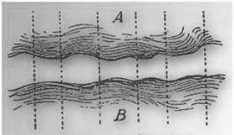

# Leçon 10 | 1er Février 1956

<!-- source-url: http://staferla.free.fr/S3/S3 PSYCHOSES.docx -->
<!-- seminar: s3 -->
<!-- lesson: 10 -->

<!-- id: s3-10-0001 -->

Je rappelle qu’à propos d’une expression employée par SCHREBER, concernant le fait que les voix lui signalent qu’il leur manque quelque chose, je faisais remarquer que des expressions comme celle-là ne vont pas tellement toutes seules, puisque nous pouvons en voir la naissance précisément notée au cours de l’histoire de la langue, et déjà à un niveau de création assez élevé pour que ce soit précisément dans un cercle intéressé par les questions de l’*expression*. *Expressions* qui nous paraissent découler tout naturellement de l’arrangement donné du signifiant, et que ce soit en effet quelque chose d’historiquement vérifié.

<!-- id: s3-10-0002 -->

Je disais que « *Le mot me manque.* », qui nous paraît si naturel, est noté dans SAUMAIZE comme étant sorti des « *ruelles des Précieuses »*, et était considéré à cette époque comme si remarquable que l’auteur même en a noté l’apparition en le restituant à SAINT-AMAND. Et je vous disais en même temps que j’avais relevé également presque une centaine d’expressions - pas tout à fait- comme :

<!-- id: s3-10-0003 -->

- « *C’est la plus naturelle des femmes.* »

<!-- id: s3-10-0004 -->

- « *Il est brouillé avec un tel.* »

<!-- id: s3-10-0005 -->

- « *Il a le sens droit.* »

<!-- id: s3-10-0006 -->

- « *Tour de visage, tour d’esprit.* »

<!-- id: s3-10-0007 -->

- « *Je me connais un peu en gens.* »

<!-- id: s3-10-0008 -->

- « *C’est un coup sûr.* »

<!-- id: s3-10-0009 -->

- « *Jouer à coup sûr.* »

<!-- id: s3-10-0010 -->

- « *Il agit sans façon.* »

<!-- id: s3-10-0011 -->

- « *Il m’a fait mille amitiés.* »

<!-- id: s3-10-0012 -->

- « *Cela est assez de mon goût.* »

<!-- id: s3-10-0013 -->

- « *Il n’entre dans aucun détail.* »

<!-- id: s3-10-0014 -->

- « *Il s’est embarqué en une mauvaise affaire.* »

<!-- id: s3-10-0015 -->

- « *Il pousse les gens à bout.* »

<!-- id: s3-10-0016 -->

- « *Sacrifier ses amis.* »

<!-- id: s3-10-0017 -->

- « *Cela est fort.* »

<!-- id: s3-10-0018 -->

- « *Faire des avances.* »

<!-- id: s3-10-0019 -->

- « *Faire figure dans le monde.* »

<!-- id: s3-10-0020 -->

Tout ceci vous semble des expressions qui vont de soi et des plus naturelles, tout ceci est cependant noté dans SAUMAIZE, et aussi dans la rhétorique de BERRY qui est de 1663, comme des expressions créées dans le cercle des *Précieuses*. C’est vous dire combien il ne faut pas s’illusionner sur le caractère allant de soi, modelé sur une appréhension simple du réel, que pourrait peut-être nous donner l’idée qu’une locution soit devenue tournure usuelle.

<!-- id: s3-10-0021 -->

Bien loin de là :

<!-- id: s3-10-0022 -->

- elles supposent toutes, plus ou moins, une longue élaboration dans laquelle des implications, des possibilités de réduction du réel, sont prises,

<!-- id: s3-10-0023 -->

- elles supposent en quelque sorte ce que nous pourrions appeler un certain progrès métaphysique du fait que les gens en ont agi d’une certaine façon avec l’emploi de certains signifiants, …ce qui suppose toutes sortes de présuppositions, et en effet « *Le mot me manque* » est quelque chose qui suppose à soi tout seul beaucoup, et d’abord que le mot est là.

<!-- id: s3-10-0024 -->

Aujourd’hui nous allons reprendre notre propos, et selon les principes méthodiques que nous avons posés, essayer d’aller un petit peu plus avant dans le délire du Président SCHREBER. Pour essayer d’y aller plus avant nous allons procéder en prenant *le document* - nous n’avons d’ailleurs pas autre chose - et je vous ai fait remarquer que *le document* était rédigé à une certaine date, à une date assez avancée de sa psychose pour qu’il ait pu formuler son délire.

<!-- id: s3-10-0025 -->

À ce propos et légitimement, j’émets des réserves, bien entendu quelque chose que nous pouvons supposer comme plus primitif, antérieur, originaire, va nous échapper : le « *vécu* », le fameux *vécu* ineffable et incommunicable de la psychose dans sa période primaire ou féconde, est quelque chose sur lequel nous sommes évidemment libres de nous hypnotiser, c’est-à-dire de penser que nous perdons le meilleur. Le fait qu’on perd le meilleur de quelque chose est en général une façon de se détourner de ce qu’on a sous la main, et qui vaut peut-être la peine qu’on le considère.

<!-- id: s3-10-0026 -->

Pourquoi après tout un état terminal serait-il moins instructif qu’un état initial, à partir du moment où nous ne sommes pas sûrs que cet état terminal représente forcément une sorte de moins-value ?

<!-- id: s3-10-0027 -->

Pour tout dire, à partir du moment où nous posons le principe qu’en matière d’inconscient le rapport du sujet au *symbolique* est fondamental, c’est-à-dire à partir du moment où nous abandonnons l’idée, implicite en beaucoup de systèmes, qu’après tout, ce que le sujet arrive à mettre dans les mots est une élaboration en quelque sorte impropre et toujours fatalement distordue, d’un *vécu* qui lui-même serait une réalité irréductible, auquel il faudrait que le sujet adapte le discours, de sorte que c’est bien l’hypothèse qui est au fond de « *La conscience morbide »* de BLONDEL, qui est un bon point de référence dont je me sers quelquefois avec vous. BLONDEL nous montre bien cela.

<!-- id: s3-10-0028 -->

C’est quelque chose d’absolument original, d’irréductible dans ce vécu du *psychosé* et du *délirant* et par conséquent il nous donne quelque chose qui ne peut que nous tromper, grâce à quoi nous n’avons plus qu’à renoncer à pénétrer ce *vécu*, impénétrable, puisque - malheureusement d’ailleurs - c’est une supposition psychologique implicite à ce qu’on peut appeler la pensée de notre époque : l’espèce d’emploi à la fois usuel et abusif du mot « *intellectualisation* » ne représente pas autre chose.

<!-- id: s3-10-0029 -->

Il y a toujours au delà de *l’intellectualisation* ceci que, tout spécialement pour une espèce d’intellectuels modernes, il y a quelque chose d’irréductible que l’intelligence par définition est destinée à manquer. BERGSON a tout de même fait beaucoup pour établir cette sorte de position dont nous avons certainement un préjugé, et un préjugé dangereux.

<!-- id: s3-10-0030 -->

En effet, de deux choses l’une :

<!-- id: s3-10-0031 -->

- ou le délire, c’est-à-dire la psychose n’appartient à aucun degré à notre domaine à nous analystes, c’est-à-dire qu’il n’a rien à faire avec ce que nous appelons l’inconscient,

<!-- id: s3-10-0032 -->

- ou bien l’inconscient étant ce que nous avons cru ces dernières années pouvoir élaborer - nous l’avons fait ensemble - l’inconscient est dans son fond *structuré, tramé, chaîné de langage*. c’est-à-dire que *le signifiant*, non seulement y joue un aussi grand rôle que le signifié, mais il *joue le rôle fondamental*. Car ce qui caractérise le langage c’est *le système du signifiant* comme tel, et son jeu complexe qui pose toutes sortes de questions

<!-- id: s3-10-0033 -->

> au bord desquelles nous nous maintenons, parce que nous ne faisons pas ici un cours de linguistique.

<!-- id: s3-10-0034 -->

Mais vous en avez assez entrevu jusqu’ici à travers le discours pour savoir que *ce rapport du signifiant et du signifié est un rapport qui est loin d’être*, comme on dit, dans la théorie des ensembles, *bi-univoque* entre *le signifiant et le signifié* même. Et le signifié, nous l’avons vu, ce ne sont pas les *choses* toutes brutes comme si elles étaient déjà là données dans un ordre ouvert à la signification. La signification c’est le discours humain en tant qu’il renvoie toujours à une autre signification. C’est le discours tel que le représente M. SAUSSURE dans ses cours de linguistique célèbres, et au dessus dans son schéma, il représente aussi comme un flux, un courant lui aussi : c’est *la signification du discours* pour autant qu’elle soutient un discours dans son ensemble d’un bout à l’autre.

<!-- id: s3-10-0035 -->

<!-- id: s3-10-0036 -->

Et cela c’est le discours, ce que nous entendons, c’est-à-dire qu’il nous donne bien le fait qu’il y a déjà une certaine part d’arbitraire dans le découpage d’une phrase entre ses différents éléments : ce n’est pas facile, il y a tout de même ces unités que sont les mots, mais quand on y regarde de près, ils ne sont pas tellement unitaires, peu importe, c’est ainsi qu’il l’a représentée.

<!-- id: s3-10-0037 -->

La seule chose caractéristique est qu’il pense que ce qui permettra le découpage du signifiant, ce sera une certaine corrélation entre les deux, c’est-à-dire le moment où l’on peut découper en même temps le signifiant et le signifié, quelque chose qui fasse intervenir en même temps une pause, une unité. Le *schéma* lui-même est discutable, parce que par rapport à l’ensemble et aux données de *la somme du système du langage*, on voit bien que dans le sens diachronique :

<!-- id: s3-10-0038 -->

- c’est-à-dire avec le temps, il se produit des glissements,

<!-- id: s3-10-0039 -->

- c’est-à-dire qu’à tout instant le système en évolution des significations humaines se déplace et modifie le contenu des signifiants,

<!-- id: s3-10-0040 -->

- c’est-à-dire que le signifiant prend des emplois différents.

<!-- id: s3-10-0041 -->

Ce n’est rien d’autre que viser à vous faire sentir les exemples que je vous donnais tout à l’heure : sous les mêmes signifiants, au cours des âges, il y a ces glissements de signification qui prouvent qu’on ne peut pas établir cette correspondance biunivoque entre les deux systèmes.

<!-- id: s3-10-0042 -->

L’essentiel pour nous donc est ceci, c’est que le système du signifiant, c’est-à-dire le fait qu’il existe une langue avec un certain nombre d’unités individualisables, a certaines *particularités* qui le spécifie dans chaque langue, qui font que :

<!-- id: s3-10-0043 -->

- n’importe quelle syllabe ne peut équivaloir à n’importe quelle syllabe,

<!-- id: s3-10-0044 -->

- ce n’est pas la même chose : certaines syllabes ne sont pas possibles dans telle ou telle langue, *les emplois* des mots sont différents, autrement dit *les locutions* avec lesquelles ils se groupent.

<!-- id: s3-10-0045 -->

Que tout cela existe déjà, c’est quelque chose qui dès l’origine, conditionne jusque dans sa trame la plus originelle, ce qui se passe dans l’inconscient, c’est ce que j’illustre de temps en temps. Si l’inconscient est tel que FREUD nous l’a dépeint, un calembour en lui-même peut être la cheville essentielle qui soutient un *symptôme*, c’est-à-dire aussi bien un calembour qui, dans un autre système de linguistique, dans une langue voisine, n’existe pas : bien entendu ce n’est là qu’un de ces cas particuliers qui mettent bien en valeur quelque chose de fondamental.

<!-- id: s3-10-0046 -->

Ce n’est pas dire que le *symptôme* soit toujours fondé sur l’existence du signifiant comme tel, mais sur le mode de rapport complexe de totalité à totalité, ou plus exactement de système entier à système entier, d’univers du signifiant à univers du signifiant. Qu’il y ait toujours ce rapport fondamental dans le *symptôme*, c’est tellement la doctrine de FREUD qu’il n’y a pas d’autre sens à donner au terme de « *surdétermination* » et la nécessité qu’il a posée : *pour qu’il y ait symptôme il faut au moins qu’il y ait duplicité*.

<!-- id: s3-10-0047 -->

C’est-à-dire qu’au moins il y ait deux conflits en cause : un actuel et un ancien. Cela ne veut rien dire d’autre. En effet *sans la duplicité fondamentale du signifiant et du signifié*…

<!-- id: s3-10-0048 -->

> du matériel conservé dans l’inconscient comme lié au conflit ancien, et qui vit là conservé à titre de signifiant en puissance, de signifiant *virtuel*, pour être pris dans le signifié du conflit actuel et lui servir de langage, c’est-à-dire de *symptôme*

<!-- id: s3-10-0049 -->

…*il n’y a pas de déterminisme proprement psychanalytique concevable*.

<!-- id: s3-10-0050 -->

Dès lors quand nous abordons les délires avec l’idée qu’ils puissent être compris dans le registre psychanalytique…

<!-- id: s3-10-0051 -->

> dans l’ordre de la découverte freudienne et du mode de pensée qu’elle nous permet concernant *ces symptômes*

<!-- id: s3-10-0052 -->

…dès lors vous voyez bien qu’il n’y a aucune raison de rejeter…

<!-- id: s3-10-0053 -->

- comme non valable,

<!-- id: s3-10-0054 -->

- comme le fait d’un compromis purement verbal, comme on dirait encore : comme *une fabrication secondaire* …la façon dont *le délire* va se présenter *à l’état terminal*, dont un SCHREBER va nous expliquer *son système du monde*, après quelques années d’épreuves extrêmement pénibles, où sans aucun doute bien entendu il ne pourra pas toujours nous donner une relation qui soit pour nous au delà de toute critique, de ce qu’il a expérimenté.

<!-- id: s3-10-0055 -->

Alors sans aucun doute nous savons aussi analyser et reconnaître sur le fait que le paranoïaque à mesure qu’il avance, reprojette rétroactivement, repense son passé, et va jusque dans des années très anciennes voir l’origine des persécutions, des complots, dont il est l’objet. Quelquefois il a la plus grande peine à situer un événement et on sent bien sa tendance à le renouveler par une sorte de répétition de jeu de miroir qui le reprojette dans un passé qui devient lui-même assez indéterminé, un passé de retour éternel, comme il l’écrit.

<!-- id: s3-10-0056 -->

Sans doute aussi certaines choses, on le voit bien dans un écrit comme celui de SCHREBER, peuvent être à peu près restituées par le sujet. Mais sans doute aussi et plus encore ce à quoi le sujet vient actuellement dans le déploiement du système délirant, l’organisation signifiante dans laquelle il couche un écrit aussi étendu que celui du Président SCHREBER garde pour nous une valeur entière du seul fait que nous supposons cette solidarité continue et profonde des éléments signifiants du début jusqu’à la fin du délire, quelque chose…

<!-- id: s3-10-0057 -->

> non seulement qu’il n’est pas impensable de penser, mais il est dès lors tout à fait cohérent de le penser

<!-- id: s3-10-0058 -->

…quelque chose dans l’ordonnance finale du délire garde toute sa valeur indicative pour nous des éléments primaires qui étaient en jeu.

<!-- id: s3-10-0059 -->

Nous pouvons en tout cas légitimement tenter la recherche, il nous paraît possible que l’analyse de ce délire comme tel nous livre le rapport fondamental du sujet au registre dans lequel s’organisent et se déploient toutes les manifestations de l’inconscient quand elles se produisent.

<!-- id: s3-10-0060 -->

Et peut-être même pourrons-nous, lorsque nous verrons que l’évolution du sujet parvient à un certain degré, nous rendre compte d’une certaine façon, sinon du mécanisme dernier de la psychose, du moins de ce que comporte l’évolution d’une psychose par rapport à la relation la plus générale du sujet à *cet ordre constitutif de la réalité humaine* qu’est *le symbolique* comme tel.

<!-- id: s3-10-0061 -->

En d’autres termes, peut-être dans l’évolution pourrons nous toucher du doigt comment, par rapport à *l’ordre du symbolique,* le sujet au cours de l’évolution de sa psychose, autrement dit depuis le moment d’origine jusqu’aux différentes étapes et jusqu’à la dernière, pour autant qu’il y ait une étape terminale dans *la psychose,* comment le sujet se situe par rapport à l’ensemble de cet *ordre symbolique*

<!-- id: s3-10-0062 -->

- considéré comme ordre original,

<!-- id: s3-10-0063 -->

- considéré comme milieu distinct du milieu réel,

<!-- id: s3-10-0064 -->

- considéré comme milieu avec lequel l’homme a toujours affaire, comme un ordre essentiellement distinct de l’ordre du *réel* et de *l’imaginaire*.

<!-- id: s3-10-0065 -->

À partir de là nous nous sentons beaucoup plus solides pour travailler avec ce que j’appellerais le plus grand sérieux dans le détail du délire du sujet. C’est-à-dire que nous devons nous demander ce que cela veut dire, et ne pas partir d’avance de l’idée que sous prétexte que le sujet est bien entendu *un délirant *: son système est bien entendu discordant, *inapplicable*, c’est l’un des signes distinctifs, *inapplicable* dans ce qui se communique dans la société de ses semblables, que « *c’est absurde* » comme on dit, et même après tout fort gênant.

<!-- id: s3-10-0066 -->

C’est la première réaction, même du psychiatre, en présence d’un sujet qui commence à lui en raconter de toutes les couleurs : c’est qu’il est fort désagréable d’entendre un monsieur qui vous donne sur ses expériences des affirmations si péremptoires et contraires à ce qu’on est habitué à retenir comme l’ordre normal de causalité. Ce sont trop souvent les interrogatoires du psychiatre lui-même qui devant son malade tient à « *rentrer les petites chevilles dans les petits trous* » comme disait PÉGUY *dans ses derniers écrits* en parlant de l’expérience qu’il assumait et de ces gens qui veulent encore, au moment où la grande catastrophe est déclarée, que les choses conservent le même rapport qu’auparavant : ils veulent toujours que les petites chevilles restent dans les mêmes trous.

<!-- id: s3-10-0067 -->

Il y a une façon de pousser l’interrogatoire du psychopathe, qui est cela : « *Procédez par ordre, Monsieur...* », disent-ils au malade, et les chapitres sont déjà faits. Pour les psychiatres, bien souvent il faudrait partir de la notion d’ensemble, à savoir qu’un délire, comme le reste, est à juger d’abord comme champ de signification ayant organisé un certain signifiant, de sorte que les premières règles d’un bon interrogatoire, d’un bon examen, d’une bonne investigation des psychoses, pourraient être de laisser parler le plus longtemps possible, après on se fait une idée.

<!-- id: s3-10-0068 -->

Il ne semble pas justement que dans *cette belle histoire de la psychose* dont vous voyez les étagements sur ce tableau \- ils sont maintenant effacés - on prenne les choses autrement, *c’est de cette façon-là que les choses ont toujours été prises*. Je ne dis pas que dans l’observation des cliniciens il en soit toujours ainsi, cependant ils ont pris les choses assez bien dans leur ensemble, mais la notion des phénomènes élémentaires, les distinctions de l’hallucination, des troubles de l’attention, de la perception, des divers grands niveaux dans l’ordre des facultés de ces phénomènes, ont certainement contribué à obscurcir notre rapport avec les délirants.

<!-- id: s3-10-0069 -->

Quant à SCHREBER on l’a laissé parler pour une bonne raison : qu’on ne lui disait rien. Il a eu tout le temps d’écrire son grand livre, et c’est ce qui va nous permettre de nous poser des questions de la façon méthodique dont je parlais. Nous avons commencé la dernière fois, et je vous ai lu tel passage où déjà apparaissaient *la conjonction* et *l’opposition* de ce que nous avons appelé *le non-sens* de cette activité des *voix* dans ce que j’appellerai pour aborder les choses, leur courant principal, pour autant qu’elles sont le fait de ces différentes entités qu’il appelle « *les royaumes de Dieu* ».

<!-- id: s3-10-0070 -->

Il y introduit des distinctions, vous verrez de plus en plus avec notre progrès, que cette pluralité d’agents du discours est quelque chose qui pose en soi tout seul un grave problème, car cette pluralité n’est pas conçue par le sujet pour autant, comme une autonomie. Il y a des choses de toute beauté dans ce texte : il y a une certaine \[...\] pour parler des différents acteurs, de ces voix, pour nous faire sentir le rapport avec le fond divin, d’où il ne faudrait pas nous laisser glisser à dire qu’il « émane », parce que c’est nous qui commencerions déjà à faire une construction, il faut suivre le langage du sujet : lui n’a pas parlé d’« émanation ».

<!-- id: s3-10-0071 -->

Dans l’exemplaire que j’ai entre les mains, il y avait la trace dans la marge des notations d’une personne qui devait se croire très lettrée parce qu’elle avait mis telles ou telles explications en face du terme de SCHREBER de « *procession* » : c’était une personne qui sans doute avait entendu parler de loin de M. PLOTIN, mais je crois que la « *procession »* est un terme proprement néo-platonicien pour expliquer les rapports des âmes avec le Dieu de *La Gnose*, ce sont de ces sortes de compréhensions hâtives avec lesquelles il faudrait tout de même être un tout petit peu plus prudent. Je ne crois pas qu’il s’agisse de quelque chose comme d’une *procession*, mais pour me permettre de telles notes, il faudrait d’abord bien comprendre ce qu’est la *procession* plotinienne, ce qui était hors du champ d’information de la personne en question.

<!-- id: s3-10-0072 -->

Cet \[...\] et ses divers supports, le sujet nous a bien précisé qu’il est la caractéristique d’un discours qui est indiscontinu. Dans le passage que je vous ai lu, il y a quelque chose de très insistant dans le sujet, c’est que le bruit que fait le discours est quelque chose de si modéré dans sa sonorisation, que le sujet l’appelle « *un chuchotement »*. C’est quelque chose par contre qui est tout le temps là, que le sujet peut couvrir, et c’est ainsi même qu’il s’exprime, par ses activités et par ses propres discours, mais qui est toujours prêt à prendre ou à reprendre la même sonorité de quelque chose qui est au milieu de ses phrases. C’était de là que nous étions partis la dernière fois.

<!-- id: s3-10-0073 -->

Eh bien, reprenons cela et demandons-nous quel est ce discours. Bien entendu ce n’est pas l’état hypothétique, même comme principe de départ de nos jours, comme on dit, comme hypothèse de travail : posons qu’il n’est pas impossible que ce soit là, pour le sujet, *sonorisé*.

<!-- id: s3-10-0074 -->

C’est déjà beaucoup en dire, c’est peut-être trop en dire, mais laissons-le pour l’instant.

<!-- id: s3-10-0075 -->

Pour le sujet c’est quelque chose qui a un rapport avec ce que nous supposons être *le discours continu*, mémorisant pour tout sujet sa conduite à chaque instant, doublant en quelque sorte la vie du sujet pour autant que nous sommes non seulement obligés d’admettre cette hypothèse en raison de ce que nous avons supposé tout à l’heure être la structure et la trame de l’inconscient, mais ce que nous avons toutes raisons même, et certaines possibilités, de saisir comme étant quelque chose que l’expérience la plus immédiate nous permet de saisir.

<!-- id: s3-10-0076 -->

Il n’y a pas très longtemps, quelqu’un m’a raconté avoir fait l’expérience suivante : une personne surprise par la brusque menace d’une voiture ou d’une moto sur le point de lui passer sur le corps, a eu - tout le laisse à penser - les gestes qu’il fallait pour s’en écarter. Mais la chose qui est intéressante et qui est bien la plus frappante, c’est que le terme a surgi, vocalisé si on peut dire « *mentalement* », et isolé, de « *traumatisme crânien* ».

<!-- id: s3-10-0077 -->

On ne peut pas dire que ce soit là une opération qui fasse à proprement parler partie de la chaîne comme on dit, des bons réflexes, pour éviter une rencontre, un choc qui pourrait entraîner le *traumatisme crânien.* Cette verbalisation est légèrement distante de la situation, outre qu’elle suppose chez la personne toutes sortes de déterminations qui pour elle, font du traumatisme crânien quelque chose de particulièrement redoutable, ou peut-être simplement de particulièrement significatif.

<!-- id: s3-10-0078 -->

Mais on voit bien là surgir la latence si on peut dire de *ce discours toujours prêt à émerger*, et qui en effet intervient sur son plan propre dans une autre portée par rapport à la musique de la conduite totale du sujet, et à ce moment–là se fait entendre. Ce discours donc, avec lequel le sujet a affaire, et qui se présente à lui, à l’étape de la maladie dont il nous parle, dans cet *Unsinn* dominant.

<!-- id: s3-10-0079 -->

Mais cet *Unsinn* qui est bien loin d’être un *Unsinn tout simple*, à savoir quelque chose que nous pouvons concevoir comme purement et simplement subi par le sujet : il est dépeint comme subi par le sujet qui l’écrit, mais ce quelque chose qui parle dans le registre de cet *Unsinn* (Dieu), se manifeste d’une façon tout à fait claire.

<!-- id: s3-10-0080 -->

Et la dernière fois je vous l’ai rappelé, et je vous l’ai montré en vous donnant le texte d’une des choses qui sont dites dans ce discours insensé, ou encore *Unsinn*, c’est que *le sujet qui parle*…

<!-- id: s3-10-0081 -->

> et *celui qui écrit* et qui nous fait sa confidence, en tant que nous savons bien
>
> qu’ils ne sont pas sans rapport, sans cela nous ne le qualifierions pas de fou

<!-- id: s3-10-0082 -->

…*ce sujet qui parle*, dit des choses comme :

<!-- id: s3-10-0083 -->

> « *Tout non-sens se soulève, s’annule, se transpose*… »

<!-- id: s3-10-0084 -->

C’est un terme fort riche et fort complexe comme sens où s’élabore, où se contredit, où se transforme le *Aufheben*, c’est bien le signe d’une implication, d’une recherche, d’un recours propre à cet *Unsinn* et cette affirmation, le sujet nous la donne bien comme étant à l’égard de tout ce qui est dit dans le registre de ce qu’il entend, l’allocution, la chose qui lui est adressée par son interlocuteur comme permanent.

<!-- id: s3-10-0085 -->

Donc nous voyons bien que ce *non-sens* est loin d’être purement et simplement, comme dirait KANT, dans le registre de son analyse des valeurs négatives[^19], une pure et simple absence de sens, une pure et simple *privation*. C’est un *Unsinn* très positif. C’est un *Unsinn* très organisé. Ce sont des contradictions qui s’articulent. Et bien entendu tout le sens, toute la richesse du délire de notre sujet est bien là ce qui rend passionnant le discours, le roman délirant que nous transmet SCHREBER, c’est ce qui s’oppose, ce qui se compose, ce qui se poursuit, ce qui s’articule de ce délire.

<!-- id: s3-10-0086 -->

Et cet *Unsinn* qui est *Unsinn* *par rapport à quelque chose* - nous allons voir par rapport à quoi - est très loin de composer à soi tout seul un discours vide de sens, ça n’est pas une *privation*, bien loin de là. Pour essayer d’aller plus loin et d’aborder l’analyse de ce sens, nous allons essayer de voir par quel bout nous allons prendre l’analyse de ce discours. Nous pouvons commencer de diverses façons : je pourrais par exemple continuer en insistant sur le texte de ce discours, les demandes et les réponses puisque je viens de vous dire que c’est articulé à un certain niveau de réflexion du sujet qui parle dans les voix de façon parfaitement repérable dans le discours lui-même et prise d’ailleurs par le sujet qui nous rapporte ces choses comme signifiantes.

<!-- id: s3-10-0087 -->

Ce serait nous introduire dans une très grande complexité, supposant au reste un système déjà pré­déterminé d’organisation du sens. Ce ne serait pas impossible à faire, mais j’ai déjà commencé d’amorcer cette voie

<!-- id: s3-10-0088 -->

la dernière fois en insistant sur le caractère tout à fait significatif de *la suspension du sens,* du fait que dans leur rythme, les voix laissent attendre, et même n’achèvent pas leurs phrases. Il y a là un procédé particulier d’évocation de la signification qui sans doute nous réserve la possibilité de la concevoir comme une structure.

<!-- id: s3-10-0089 -->

Je n’ai pas besoin de vous rappeler ce que je vous ai dit quand nous avons parlé de l’hallucination de l’une des malades que nous avions vue à une présentation : celle qui au moment même où elle entendait qu’on lui disait : « *Truie !* », murmurait entre ses dents « *Je viens de chez le charcutier.* ».

<!-- id: s3-10-0090 -->

Et vous vous souvenez l’importance que j’avais donnée à cette *voix allusive*, à cette visée indirecte du sujet qui est bien quelque chose que nous retrouvons là, et combien déjà nous avions pu entrevoir quelque chose qui est tout à fait près du schéma que nous donnons des rapports entre :

<!-- id: s3-10-0091 -->

- le sujet qui parle concrètement, qui soutient le discours,

<!-- id: s3-10-0092 -->

- et le sujet inconscient, qui est là littéralement dans ce discours même hallucinatoire, et dans sa structure même que nous voyons comme essentiellement visée, comme, on ne peut pas dire *un au-delà* puisque justement l’autre lui manque dans le délire, mais *un en deçà*, si on peut dire, une espèce d’*au-delà intérieur*.

<!-- id: s3-10-0093 -->

C’est introduire je crois - et trop vite peut-être, si nous voulons procéder en toute rigueur - les hypothèses, les schémas qui doivent bien former peut-être quelque chose qui est considéré par rapport à la donnée, comme préconçu : nous avons déjà dans le contenu du délire assez de données encore plus simples d’accès, pour pouvoir peut-être procéder autrement et en prenant notre temps. Car à la vérité c’est bien de cela qu’il s’agit, le fait de prendre son temps indique déjà une attitude de bonne volonté qui est celle dont je soutiens ici la nécessité pour avancer dans la structure des délires.

<!-- id: s3-10-0094 -->

Je dirais que le fait de le mettre tout de suite d’emblée dans la parenthèse psychiatrique, est bien ce que je visais tout à l’heure comme source de l’incompréhension dans laquelle on s’est tenu jusqu’à présent par rapport au délire : on pose d’emblée qu’il s’agit d’un phénomène anormal, et comme tel on se condamne à ne pas le comprendre. C’est d’ailleurs là une très forte raison, et qui est tout à fait sensible quand on s’avance dans quelque chose d’aussi séduisant que le délire du Président SCHREBER, c’est que tout bonnement comme disent les gens, ils demandent :

<!-- id: s3-10-0095 -->

> « *Est-ce que vous n’avez pas peur de temps en temps de devenir fou ?* »

<!-- id: s3-10-0096 -->

Mais c’est que c’est tout à fait vrai ! C’est que pour tel ou tel des bons maîtres que nous avons connus, Dieu sait que c’est le sentiment qu’ils pouvaient avoir : où cela les mènerait de les écouter « *ces types qui vous débloquent toute la journée* » des choses d’un ordre aussi singulier, si l’on prenait tout cela au sérieux.

<!-- id: s3-10-0097 -->

Nous n’avons pas, nous *psychanalystes*, une idée aussi sûre que celle que chacun a de son bon équilibre, pour ne pas comprendre le dernier ressort de tout cela, à savoir que le sujet normal c’est quelqu’un qui très essentiellement se met dans la position de ne pas prendre au sérieux la plus grande part de son discours intérieur.

<!-- id: s3-10-0098 -->

Observez bien cela chez les sujets normaux, et par conséquent chez vous-mêmes : le nombre de choses essentielles dont c’est vraiment votre occupation fondamentale que *de n’en rien savoir*. Ce n’est peut-être effectivement rien d’autre que ce qui fait la première différence entre vous et l’*aliéné*, c’est que pour beaucoup l’aliéné incarne - sans même qu’ils se le disent - là où ça nous conduirait si nous commencions à prendre les choses - qui pourtant se formulent en nous sous forme de questions - à les prendre au sérieux.

<!-- id: s3-10-0099 -->

Prenons donc sans trop de crainte notre sujet au sérieux, notre Président SCHREBER, et puisqu’il y a là ce singulier « *non-sens »* qui n’est pas privation de sens, mais qui est quelque chose dont nous ne pouvons pas pénétrer ni le but, ni les articulations, ni les *fins*. Tâchons d’aborder par un certain côté ce que nous en voyons, et qui n’est pas tout de même quelque chose dans lequel d’emblée nous soyons sans boussole.

<!-- id: s3-10-0100 -->

Et là nous avons des conditions particulièrement favorables, particulièrement saisissables à saisir ce discours délirant. Et d’abord : y a-t-il un interlocuteur ? Il y a un interlocuteur qui va même - et c’est cela qui va conditionner l’accès que nous allons nous y permettre - qui dans son fond est unique : cette « *Einheit* » qui est, je vous l’avoue, très amusante quand même pour un philosophe à considérer.

<!-- id: s3-10-0101 -->

Si nous pensons que le texte que j’ai traduit et que vous allez voir, sur le λόγος \[logos\], dans la première parution de notre revue *La psychanalyse* [^20], qui identifie le λόγος \[logos\] avec le Εν \[Èn\] héraclitéen, puisque justement la question que nous nous posons c’est de savoir si le délire de SCHREBER n’est pas purement et simplement quelque chose qui peut être précisé d’une façon que je ne précise pas tout de suite, parce qu’il faut d’abord la brosser, mais un mode de rapport très particulier du sujet avec l’ensemble du langage comme tel.

<!-- id: s3-10-0102 -->

II faut voir, d’ores et déjà aux premières pages que l’on ouvre, des formules comme celle-là, c’est-à-dire que ce sujet par rapport au monde du langage, dont il n’est pas en quelque sorte, lui–même qui nous raconte, dont il se sent comme aliéné devant ce discours permanent, dans lequel il nous exprime quelque chose qui déjà nous montre un rapport foncier, fondamental, entre :

<!-- id: s3-10-0103 -->

- *une unité* qu’il ressent comme telle dans celui qui tient ce discours,

<!-- id: s3-10-0104 -->

- et en même temps *une pluralité* dans les modes et dans les agents secondaires auxquels il en attribue les diverses parties.

<!-- id: s3-10-0105 -->

Mais *l’unité* est là, bien fondamentale, elle domine et, je vous l’ai dit, *cette unité il l’appelle Dieu* [^21]. Là on s’y reconnaît, il dit que c’est Dieu. Il a ses raisons, pourquoi lui refuser ce vocable dont nous savons l’importance universelle…

<!-- id: s3-10-0106 -->

> c’est même une des preuves de son existence pour certains, et nous savons par ailleurs combien il est difficile de saisir ce qu’est pour la plupart de nos contemporains le contenu précis

<!-- id: s3-10-0107 -->

…alors pourquoi refuserions nous au délirant plus spécialement de lui faire crédit quand il en parle ? D’autant plus qu’après tout il y a là quelque chose de très saisissant, et dont lui-même souligne l’importance.

<!-- id: s3-10-0108 -->

C’est qu’il nous le dit bien : il est un disciple de l’*Aufklärung*, il est même un des derniers fleurons, il a passé son enfance dans une famille où il n’était pas question de ces choses-là, et il nous donne la liste de ses lectures. Et il nous donne cela aussi comme l’une des preuves - non pas de l’existence de Dieu, il ne va pas si loin - du sérieux de ce qu’il éprouve. C’est-à-dire qu’après tout il n’entre pas dans la discussion s’il s’est trompé ou pas, il dit :

<!-- id: s3-10-0109 -->

> « *C’est un fait qui est comme cela et dont j’ai des preuves des plus directes. Ça ne peut être que Dieu si ce mot de Dieu*
>
> *a un sens, mais je n’avais jamais pris ce mot Dieu au sérieux jusque-là, et à partir du moment où j’ai éprouvé ces choses,*
>
> *j’ai fait l’expérience de Dieu.* »

<!-- id: s3-10-0110 -->

Et ce n’est pas là l’expérience qui est la garantie de Dieu, mais c’est Dieu qui est la garantie de son expérience. Puisqu’il nous parle de Dieu :

<!-- id: s3-10-0111 -->

> « *Il faut bien que je l’aie pris quelque part, et comme je ne l’ai pas pris*
>
> *dans mon bagage de préjugés d’enfance, mon expérience est vierge*. »

<!-- id: s3-10-0112 -->

Et c’est bien là qu’il introduit des distinctions. Et là il est très fin, car non seulement il est en somme un bon témoin, il ne fait pas d’abus théologiques, mais il est en plus quelqu’un de bien informé. Je dirais même qu’il est bon psychiatre classique et je vous en donnerai les preuves, je vous montrerai dans son texte une citation de la sixième édition de KRÆPELIN qu’il a épluchée de sa main, et ça lui permet des distinctions comme celle-ci par exemple, qui est très fine, ça lui permet de rire de certaines expressions kræpeliniennes, par exemple de dire que c’est étonnant de voir un homme comme KRÆPELIN marquer comme une étrangeté que ce qu’éprouve le délirant ait cette haute puissance convaincante qui n’est en rien réductible à ce que peut dire l’entourage.

<!-- id: s3-10-0113 -->

> « *Attention* - dit SCHREBER - *ce n’est pas cela du tout, on voit bien là que je ne suis pas un délirant comme disent les médecins parce que je suis tout à fait capable de réduire les choses, non seulement à ce que dit l’entourage, mais même au bon sens.*
>
> *Ainsi par exemple je distingue fort bien, naturellement qu’il y a des phénomènes d’une nature extrêmement différente*
>
> \- dit SCHREBER - *il arrive que j’entende des choses comme le bruit du bateau à vapeur qui avance à l’aide de chaînes, ce qui fait énormément de bruit : c’est tout à fait valable ce que nous disent ces psychiatres qui prétendent y trouver quelque chose d’explicatif. Bien entendu les choses que je pense viennent en quelque sorte s’inscrire dans les intervalles réguliers du bruit monotone de la chaîne du bateau, ou même du bruit du train. Comme tout le monde je module les pensées qui me tournent*
>
> *dans la tête sur le bruit que nous connaissons bien quand nous sommes dans un wagon de chemin de fer, mais bien entendu*
>
> *cela prend beaucoup d’importance : à un moment les pensées que j’éprouve trouvent là une sorte de support qui leur donne*
>
> *ce faux relief, mais je distingue très bien les choses. Cela je l’ai, mais ce que j’ai et dont je vous parle, ce sont des voix*
>
> *qui elles ne peuvent pas être quelque chose à laquelle vous n’accordiez pas sa portée et son sens, c’est tout à fait différent,*
>
> *ce sont des choses que je distingue comme telles.* »

<!-- id: s3-10-0114 -->

Dans cette analyse du sujet, nous avons l’occasion de critiquer de l’intérieur certaines théories génétiques de l’interprétation ou de l’hallucination. Je vous donne cet exemple - il est presque grossier, mais il est très bien souligné dans le texte de SCHREBER - mais il y en a d’autres et au niveau où nous allons essayer de nous déplacer maintenant, je crois que nous pouvons introduire des distinctions aussi qui n’ont pas une moindre importance. Ce Dieu donc, s’est révélé à lui. Qu’est-il ? Il est d’abord « *présence* », mais je crois que dans l’analyse de cette « *présence* », de ce qui est fonction de cette « *présence* », nous pouvons commencer d’y voir ou d’y reconnaître quelque chose, nous avons cru à son propos tout à l’heure : une confusion que les esprits non cultivés font, des multiples incarnations qu’ils ont dans la matière, ou des divers engagements qu’ils ont dans la matière.

<!-- id: s3-10-0115 -->

Ce sont des choses que nous voyons aussi bien faire dans des domaines aussi différents que *la psychiatrie*, sans pouvoir s’engager dans une voie d’analogie dans ce qui se passe au niveau du pathologique et au niveau du normal, on finit par tout mêler, alors il faut être prudent. D’abord remarquons quand même une chose : je n’aurai pas besoin d’aller chercher très loin mes témoignages pour évoquer qu’une certaine idée de Dieu est quand même quelque chose qui se place sur le plan que nous pourrons apeler « *providentiel* ».

<!-- id: s3-10-0116 -->

Je ne dis pas que ce soit, du point de vue théologique, la meilleure façon d’aborder la chose, mais enfin j’ai ouvert un peu par hasard un livre qui essaie de nous parler des dieux d’ÉPICURE. La personne qui introduit la question commence à partir - est-ce d’un point de vue apologétique ? - de la remarque suivante

<!-- id: s3-10-0117 -->

> « *Depuis que l’on croit aux Dieux, on est persuadé qu’ils règlent les affaires humaines, que ces deux aspects de la foi sont connexes... La foi est née de l’observation mille fois répétée de ce que la plupart de nos actes n’atteignent pas leur but,*
>
> *il reste très nécessairement une marge entre nos desseins les mieux conçus et leur accomplissement,*
>
> *et ainsi nous demeurons dans l’incertitude, mère de l’espérance et de la crainte.* »

<!-- id: s3-10-0118 -->

Cette chose fort bien écrite est du Père FESTUGIÈRE[^22], très bon écrivain et excellent connaisseur de l’Antiquité grecque et dont on comprend que le style de cette introduction sur la constance de la croyance aux dieux, est peut-être plutôt incliné par son sujet, à savoir par le fait que c’est autour de cette question de *la présence des dieux dans les affaires humaines*, que tout l’épicurisme s’est construit, autrement on ne pourrait pas manquer d’être frappé par l’aspect bien partial de cette réduction de l’hypothèse divine à la fonction providentielle, c’est-à-dire au fait que nous devons être récompensés de nos bonnes intentions.

<!-- id: s3-10-0119 -->

Il y a quelque chose de tout à fait frappant, c’est que ce sujet, qui a un rapport constant, permanent, avec le Dieu de son délire, n’a pas la trace d’une absence - l’annotation d’une *absence* est moins importante, moins décisive que l’annotation d’une « *présence* » - mais je veux dire que dans l’analyse du phénomène, le fait qu’il n’y ait pas « *quelque chose* », est toujours *sujet à caution*.

<!-- id: s3-10-0120 -->

En d’autres termes, si nous avions un petit peu plus de précisions sur le délire du Président SCHREBER, nous aurions quelque chose qui viendrait contredire cela, mais d’un autre côté l’annotation d’une absence est aussi extraordinairement importante pour la localisation d’une structure.

<!-- id: s3-10-0121 -->

Disons simplement que nous ne pouvons pas manquer de noter qu’à tout le moins nous avons sous la main le point de départ de la définition que nous pouvons commencer à donner, comme de ce en quoi il est présent devant nous. Nous n’aurons pas à tenir compte de quoi que ce soit de ce registre, étant donné que nous savons combien \- théologiquement valable ou pas - cette notion de « *la Providence* », de cette instance qui rémunère, est essentielle au fonctionnement de l’inconscient et à l’affleurement au conscient.

<!-- id: s3-10-0122 -->

Le sujet ne manque jamais de manifester combien est essentiel pour lui ce registre : quand ils sont bien gentils, il doit leur arriver de bonnes choses. C’est *tout à fait absent* à tous les moments de l’élaboration d’un délire qui se présente essentiellement comme un délire avec un contenu théologique, avec un interlocuteur divin, il n’y a pas trace de cela. Ce n’est pas dire grand-chose, c’est quand même dire beaucoup, c’est quand même faire remarquer que cette érotomanie divine, comme on peut l’appeler dans le cas de SCHREBER, est quelque chose qui - disons pour aller vite - n’est pas certainement tout de suite à prendre dans le registre du *surmoi*.

<!-- id: s3-10-0123 -->

Donc ce Dieu le voici donc. Quels sont *les modes de relation* de SCHREBER avec lui ? Nous savons déjà que c’est celui qui *parle tout le temps*, je dirais même que c’est celui qui n’arrête pas de parler *pour ne rien dire*, c’est tellement vrai que SCHREBER consacre à cela beaucoup de pages où il s’attache, où il considère ce que cela peut vouloir dire que ce *Dieu qui parle* pour ne rien dire, et *qui parle* pourtant *sans arrêt*, et c’est là-dedans en effet que nous allons un tout petit peu plus entrer.

<!-- id: s3-10-0124 -->

Ce Dieu qui parle pour ne rien dire, a pourtant des rapports avec SCHREBER, et qui sont loin de se limiter à cette fonction importune. Il a des rapports extrêmement précis dont la motivation ne peut pas être distinguée un seul instant de ce *mode* de présence qui est le sien, c’est-à-dire du mode parlant, c’est dans la même dimension que Dieu est là présent et jaspinant sans cesse par ces divers représentants, et qu’il se présente à SCHREBER dans un mode de relation ambigu qui est celui-ci.

<!-- id: s3-10-0125 -->

Je crois pouvoir dire que sa relation fondamentale peut être dite comme je vais maintenant vous l’exprimer, parce qu’elle est en quelque sorte présente depuis l’origine du délire, en d’autres termes je vais vous dire en quoi consiste le mode de rapport avec cette présence divine.

<!-- id: s3-10-0126 -->

C’est quelque chose que nous trouvons noté dès le départ au moment où Dieu ne s’est pas encore dévoilé, au moment où le délire a pourtant des supports extrêmement précis, ce sont les personnages du type FLECHSIG, et au début FLECHSIG lui-même, dont j’ai parlé, à savoir son premier thérapeute. Et l’expression allemande que je vais employer, est l’expression qui vaut pour exprimer par le sujet le mode de rapport avec l’interlocuteur fondamental. C’est même grâce à cette expression que nous ferons là, et seulement après FREUD - car FREUD lui-même l’a faite - *une continuité entre les premiers interlocuteurs du délire, et les derniers*. À savoir une continuité que nous reconnaissons

<!-- id: s3-10-0127 -->

- qu’il y a quelque chose de commun entre FLECHSIG puis ce qu’il a appelé ensuite « *les âmes examinées* »,

<!-- id: s3-10-0128 -->

- et ensuite « *les royaumes de Dieu* », avec leurs diverses significations antérieures et postérieures, supérieures et inférieures,

<!-- id: s3-10-0129 -->

- et enfin « *le Dieu dernier* » où tout paraît à la fin se résumer avec une sorte d’installation mégalomaniaque de la position de SCHREBER.

<!-- id: s3-10-0130 -->

Il s’agit de l’expression suivante : la relation du Dieu, du personnage fondamental du délire, avec le sujet est celle-ci :

<!-- id: s3-10-0131 -->

- soit qu’il s’agisse de la présence de Dieu dans un mode de relations voluptueuses avec le sujet auquel les choses aboutissent,

<!-- id: s3-10-0132 -->

- soit qu’il s’agisse au début, dans cette imminence colorée érotiquement, d’*une sorte de viol* ou de menace spécialement à sa virilité, sur laquelle FREUD a mis tout l’accent, qui était à l’origine du délire. C’est que quoi qu’il arrive de cette conjonction, elles sont considérées comme tout à fait *révoltantes* au début et en tous points *comparables à un viol* quand il s’agit de FLECHSIG ou d’une autre *âme* comme il s’exprime,

<!-- id: s3-10-0133 -->

- soit à la fin quand il s’agit d’une sorte d’effusion voluptueuse où Dieu est censé trouver *satisfaction* beaucoup plus encore que notre sujet.

<!-- id: s3-10-0134 -->

Ce qui se passe c’est quelque chose qui au début est la menace, c’est cela qui est considéré comme révoltant dans le viol, à la fin et aussi à la réalisation, c’est-à-dire quelque chose que le sujet ressent comme particulièrement douloureux et pénible, et qui est que Dieu, ou n’importe quel autre, va - ce que les traducteurs français ont traduit, non sans quelque fondement, par « *laisser en plan* » - le *laisser en plan*.

<!-- id: s3-10-0135 -->

La traduction n’est pas mauvaise parce qu’elle implique toutes sortes de sonorités sentimentales féminines. En allemand c’est beaucoup moins accentué et aussi beaucoup plus large que le « *laisser tomber* » qu’implique la traduction française, c’est « *laisser gésir* » qui est vraiment là comme une espèce de thème musical d’une présence vraiment extraordinaire, c’est presque le fil rouge qu’on retrouve dans tel ou tel thème littéraire ou historique.

<!-- id: s3-10-0136 -->

Tout au long du délire schrebérien, la menace de ce « *laisser en plan* » est quelque chose qui revient comme vraiment l’élément essentiel. Tout au début cela fait partie des noires intentions des violateurs persécuteurs, mais c’est à tout prix ce qu’il faut éviter. En d’autres termes on ne peut pas éviter l’impression d’un rapport global du sujet avec l’ensemble des phénomènes étrangers auxquels il est en proie, qui consiste essentiellement dans cette sorte de relation ambivalente, que quel que soit le caractère douloureux, pesant, importunant, insupportable de ces phénomènes, le maintien pour lui de sa relation à eux, ou plus exactement de sa relation à une structure, constituait une espèce de nécessité dont l’abolition, la disparition, la rupture, est conçue par le sujet comme absolument intolérable.

<!-- id: s3-10-0137 -->

Elle l’est parce qu’elle finit par s’incarner, et le sujet nous donne mille détails sur ce qui se produit au moment où se produit l’état initial pour ce « *liegen lassen* », c’est-à-dire chaque fois que le Dieu avec lequel il est en rapport sur ce double plan de l’audition, et un rapport plus mystérieux qui le double, et qui est celui de sa « *présence* », de la « *présence* » de Dieu liée à toutes sortes de phénomènes qui sont ambigus, mais qui assurément sont liés à ce qu’il appelle « *la béatitude des partenaires* », et plus encore celle de son partenaire que la sienne, que lorsque quelque chose se produit qui interrompt cet état de réalisation plus ou moins accentué, et quand se produit le retrait de la présence divine, il éclate toutes sortes de phénomènes internes de déchirement, de douleur, diversement intolérables qu’il nous décrit avec une grande richesse.

<!-- id: s3-10-0138 -->

Ce personnage auquel il a affaire, qui est à la fois un des plus rares et avec lequel il a cette relation si particulière prise dans son ensemble comme étant la caractéristique permanente du mode de relation qui est établi, comment se présente-t-il autrement à lui ?

<!-- id: s3-10-0139 -->

Il y a une chose dont le sujet donne aussi une explication extrêmement riche et développée, c’est ceci : ce personnage avec lequel il est dans cette double relation séparée, distincte et pourtant jamais disjointe, une sorte de dialogue, et un rapport érotique, il est également caractérisé.

<!-- id: s3-10-0140 -->

Et précisément il est caractérisé en ceci, que cela se voit dans ses exigences, et très précisément dans ses exigences de dialogue, il est caractérisé par ceci *qu’il ne comprend rien à rien* de ce qui est proprement humain. C’est là un trait qui ne manque pas d’être souvent fort piquant sous la plume de SCHREBER : que l’idée que pour que Dieu lui pose les questions qu’il lui pose, l’incite surtout au mode de réponses qui sont impliquées dans ces questions, et que SCHREBER ne se laisse jamais aller à donner parce qu’il dit : « *Ce sont des pièges trop bêtes qu’on me tend* ».

<!-- id: s3-10-0141 -->

C’est là vraiment quelque chose de tout à fait caractéristique et fondamental. Ce Dieu nous dit-il…

<!-- id: s3-10-0142 -->

> et je dirai même qu’il fait toutes sortes de développements assez agréablement rationalisés,
>
> pour bien nous en montrer à la fois les dimensions de la certitude, et le mode d’explication

<!-- id: s3-10-0143 -->

…comment peut-on arriver à concevoir que Dieu soit tel qu’*il ne comprend vraiment rien*, dit-il, *aux besoins humains* ?

<!-- id: s3-10-0144 -->

Comment peut-on - dit-il à tout instant - être aussi bête, croire par exemple que si je cesse un instant de penser, que si j’entre dans ce néant dont la présence divine n’attend que l’apparition pour se retirer définitivement, comment peut-on croire parce que je cesse de penser à quelque chose, que je sois devenu complètement idiot, même que je sois retombé dans le néant ? Mais je vais lui faire voir, et d’ailleurs c’est bien ce qui se passe chaque fois que ça risque de se produire, je me remets à une occupation intelligente et à manifester ma présence.

<!-- id: s3-10-0145 -->

Et alors il développe et commente : comment peut-il malgré ses mille expériences croire qu’il suffirait d’un instant où je me relâche, à savoir pour que le but soit obtenu ? Il est absolument inéducable ce Dieu, par aucune espèce de chose qui puisse sortir de l’expérience. Et ce côté d’inéducabilité de Dieu, d’*imperfectibilité radicale* par l’expérience est très amusant à voir, c’est quelque chose sur laquelle il appuie, et sur laquelle il apporte des développements qui sont loin d’être sots : il émet différentes hypothèses, il va jusqu’à émettre des arguments qui ne détonneraient pas dans une discussion proprement théologique. Car à la vérité il part de l’idée :

<!-- id: s3-10-0146 -->

- que Dieu, étant parfait, est imperfectible,

<!-- id: s3-10-0147 -->

- et que quelque chose d’imperfectible ne peut pas être perfectionné,

<!-- id: s3-10-0148 -->

- et que par conséquent même la notion d’un progrès dans les niveaux de l’expérience est tout à fait impensable dans les registres divins.

<!-- id: s3-10-0149 -->

Il trouve néanmoins cela un peu sophistiqué, parce qu’il reste cette chose irréductible que cette perfection que nous supposons, est tout à fait inapte et bouchée aux choses humaines, et que cela malgré tout ça fait un trou. Alors il nous explique de nouveau comment Dieu ne comprend rien, et qu’en particulier il est tout à fait clair que Dieu ne connaît les choses que de surface, nous sommes là exactement à l’opposé du Dieu sondant les reins et les cœurs, il ne sonde ni reins ni cœurs, il ne voit que ce qu’il voit et il ne note que les choses dont on accuse réception, qui sont recueillies par le système de notation. C’est toujours ce qui est exposé, mais pour ce qui est de l’intérieur, il ne comprend rien. Il n’y retrouve quelque chose que parce que tout est inscrit quelque part, c’est par la fonction d’une totalisation que tout se retrouve, c’est-à-dire qu’à la fin…

<!-- id: s3-10-0150 -->

> comme tout ce qui est à l’intérieur sera progressivement passé à l’extérieur,
>
> et que d’autre part c’est noté quelque part sur de petites fiches

<!-- id: s3-10-0151 -->

…à la fin, au bout de la totalisation, il sera quand même parfaitement au fait.

<!-- id: s3-10-0152 -->

De même qu’il explique très bien qu’il est bien évident que Dieu ne peut pas s’intéresser à lui-même, ne peut pas avoir le moindre accès à des choses aussi contingentes, puériles, que l’existence par exemple, sur la terre, des machines à vapeur ou le fonctionnement des locomotives, mais, dit-il, comme les âmes après la mort montent vers les béatitudes et doivent subir un certain temps de purification, elles ont *enregistré* tout ça sous forme de discours, et c’est cela que Dieu recueille, puisqu’il va les intégrer progressivement par l’intermédiaire de ces âmes qui rentrent dans le sein de Dieu.

<!-- id: s3-10-0153 -->

Dieu a quand même quelque idée de ce qui se passe sur la terre en fait de menues inventions, celles qui vont depuis le *diabolo* jusqu’à la bombe atomique. C’est très joli parce que c’est un système à la fois cohérent et on a l’impression qu’il est découvert par une espèce de progrès extraordinairement innocent, par l’intermédiaire de l’établissement du développement des conséquences signifiantes de quelque chose qui est harmonieux et continu à travers les diverses phases du développement.

<!-- id: s3-10-0154 -->

Mais ce qu’il y a de sérieux, ce qui est bien fait pour nous suggérer une direction de recherche, c’est que la question gît essentiellement dans une sorte de rapport dérangé entre le sujet et quelque chose qui intéresse le fonctionnement total du langage, de l’ordre symbolique et du discours comme tel. Les richesses que cela comporte, il y en a beaucoup plus que je ne peux vous en dire.

<!-- id: s3-10-0155 -->

Il y a une discussion des rapports de Dieu avec les jeux de hasard qui est d’un brio extraordinaire :

<!-- id: s3-10-0156 -->

> « *Dieu peut-il prévoir le numéro qui va sortir à la loterie ?* ».

<!-- id: s3-10-0157 -->

Ce n’est pas une question idiote, et il y a des personnes ici qui ont une très forte croyance en Dieu, elles peuvent également se poser la question, à savoir l’ordre d’omniscience que suppose le fait de remuer toutes sortes de petits numéros sur des petits morceaux de papiers, dans une très grande boule très bien faite, cela pose des difficultés insurmontables. Pour expliquer que la prescience divine doit savoir dans toute cette masse qui est si bien équilibrée, pour être strictement équivalente sur le plan du réel, quel est le bon numéro, suppose un rapport de Dieu au *symbolique* dont après tout la question n’a jamais été soulevée pleinement comme telle.

<!-- id: s3-10-0158 -->

Puisque c’est justement pour cela qu’est faite la boule, c’est pour qu’il n’y ait aucune différence du point de vue du réel, entre les différents petits numéros, alors cela suppose que Dieu entre dans le discours, car il ne reste plus dans ces billets de loterie, qu’une différence symbolique entre les uns et les autres. C’est un prolongement de la théorie *du symbolique, de l’imaginaire et du réel*.

<!-- id: s3-10-0159 -->

Mais la question pour nous est plus complexe, car tout cela n’est que découverte de l’expérience pénible et douloureuse, mais il y a une chose que cela comporte, c’est à savoir les intentions de Dieu. Ces intentions ne sont pas claires. Il n’y a rien de plus saisissant que de voir comment une espèce de voix délirante, c’est-à-dire cette chose qui est surgie d’une expérience originale, incontestablement comporte chez ce sujet cette sorte de brûlance de langage qui se manifeste par le respect avec lequel il maintient l’omniscience. Et aussi les bonnes intentions qu’il est bien forcé sur un certain plan de maintenir comme lui étant véritablement trop substantielles.

<!-- id: s3-10-0160 -->

Et le fait qu’il ne peut pas ne pas voir - et ceci particulièrement dans les débuts de son délire où les phénomènes pénibles lui venaient par toutes sortes de personnages nocifs - que Dieu même a permis tout cela. Mais il permet encore toutes sortes d’abus. À la vérité, de ces abus ont surgi des abus tellement plus grands qu’à la fin le remède finit par devenir plus dur que le mal, puisque la « *présence divine* » est tellement engagée dans une sorte de conjugaison avec lui-même, que finalement elle devient dépendante de son objet qui n’est autre que le Président SCHREBER lui-même. En fin de compte il y a là quelque chose qui progressivement introduit une sorte de perturbation fondamentale dans l’ordre universel. Il y a des choses extrêmement belles dans ce propos du rapport avec le monde, il y a une phrase très belle :

<!-- id: s3-10-0161 -->

« *Souvenez-vous que tout ce qui est mondialisant comporte une contradiction en soi.* »

<!-- id: s3-10-0162 -->

Ce sont *les voix* qui disent cela. C’est d’une beauté dont je n’ai pas besoin de vous signaler le relief. Le Dieu dont il s’agit mène incontestablement une politique absolument inadmissible, il y a là une sorte de politique de demi-mesure, c’est aussi une demi-taquinerie, il emploie le mot « *perfidie* », la perfidie divine il la glisse. Mais il met une note pour dire ensuite ce qu’il entend par là : c’est particulièrement ambigu, avec la présence divine, mais c’est quelque chose qui ne manquera pas de soulever des questions.

<!-- id: s3-10-0163 -->

Puisque nous nous sommes limités aujourd’hui à la relation de Dieu en tant que sujet parlant et en tant qu’interlocuteur essentiel, nous nous arrêterons là et vous verrez le pas suivant. À savoir ce que nous pouvons entrevoir à partir du moment où nous analysons la structure même de cette personne divine, autrement dit aussi, la relation de tout l’ensemble de la fantasmagorie avec le réel lui-même, pour autant que le sujet en maintient à tout instant la présence et l’accord - au moins à la fin de son délire - d’une façon qui n’a rien de spécialement perturbée dans ce mode de rapport. En d’autres termes, avec *le registre symbolique* tel qu’il se présente ici, avec *le registre imaginaire*, avec *le registre réel*, nous ferons un nouveau progrès qui nous permettra de découvrir je l’espère, la nature de ce dont il s’agit dans le mécanisme lui-même - dans la structure et la constitution elle-même de ce sujet - de l’interlocution délirante.

## Notes

[^19]: Emmanuel Kant : « *Essai pour introduire en philosophie le concept de grandeur négative* », Paris, Vrin, 1972.

[^20]: [*Logos* : traduction par Lacan d’un texte de Martin Heidegger](http://www.ecole-lacanienne.net/documents/1956-00-00b.doc) parue dans *La psychanalyse* 1956 n° 1, pp. 59-79.

[^21]: Cf. Leibniz : *Théodicée* : « *Il résulte de la perfection suprême de Dieu, qu’en produisant l’univers, il a choisi le meilleur plan possible où il y ait la plus grande variété*

    *avec le plus grand ordre*... ».

[^22]:
    #  André-Jean Festugière : *Épicure et ses dieux*(1948), PUF 1996, coll. Quadrige.
