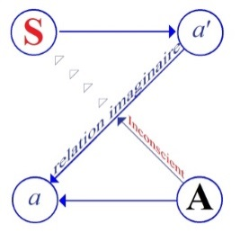
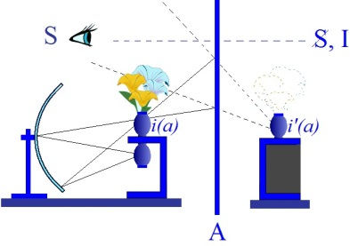

# Leçon 20 | 31 Mai 1956

<!-- source-url: http://staferla.free.fr/S3/S3 PSYCHOSES.docx -->
<!-- seminar: s3 -->
<!-- lesson: 20 -->

<!-- id: s3-20-0001 -->

> « *Le même parallèle est possible en raison de l’omission de diverses relations qui dans les deux cas doivent être supplées*
>
> *par le contexte. Si cette conception de la méthode de représentation dans les rêves n’a pas été jusqu’ici suivie, ceci, comme on doit le comprendre d’emblée, doit être inscrit, rapporté au fait que les psychanalystes sont entièrement ignorants de l’attitude et du mode de connaissance avec lesquels un philologue doit approcher un tel problème que celui qui est présenté dans les rêves.* »

<!-- id: s3-20-0002 -->

Je pense que ce texte est assez clair et que l’apparente contradiction formelle que vous pourrez en recueillir du fait que FREUD dit que *les rêves s’expriment en images* plutôt qu’en autre chose est aussitôt, je pense, restituée et remise en place, car aussitôt, il vous montrera de quelles sortes d’images il s’agit. C’est-à-dire *d’images* en tant qu’elles interviennent *dans une écriture*, c’est-à-dire non pas même pour leur sens propre, car comme il le dit, il y en a certaines qui seront là, même-pas pour être lues, mais simplement pour apporter à ce qui doit être lu une sorte d’exposant qu’il situe, qui resterait autrement énigmatique.

<!-- id: s3-20-0003 -->

C’est la même chose que ce que je vous ai écrit au tableau l’autre jour, quand je vous ai donné l’exemple des caractères chinois. J’aurais pu les prendre parmi les anciens hiéroglyphes, où vous verriez que ce qui sert à dessiner le pronom à la première personne, et qui se dessine par deux petits signes qui ont une valeur phonétique, peut être accompagné par l’image - plus ou moins corsée selon que l’individu est un petit bonhomme - qui est là pour donner aux autres signes leur sens rapporté par leur signification. Mais les autres signes, qui ne sont pas moins autographiques que le petit bonhomme, doivent être lus dans un registre phonétique.

<!-- id: s3-20-0004 -->

Bref, la comparaison avec *les hiéroglyphes* est d’autant plus pressante, patente, dans la formule que nous donne FREUD dans ce paragraphe, qu’elle est diffuse dans *L’interprétation des rêves*, la comparaison donc des *hiéroglyphes* est d’autant plus valable, certaine, que - tous les textes l’affirment - il y revient sans cesse. Vous n’ignorez pas que FREUD n’était pas ignorant de ce qu’est vraiment *l’écriture hiéroglyphique*. Il était amoureux de ce qui touchait à la culture de l’ancienne Égypte. Très souvent, il fait des références, des comparaisons au mode de pensée, au style, à la structure signifiante très exactement des *hiéroglyphes*, quelquefois *contradictoires*, superposés des croyances des anciens Égyptiens.

<!-- id: s3-20-0005 -->

Et il s’y réfère volontiers d’une façon toute naturelle pour nous indiquer, nous donner l’image la plus expressive de tel ou tel mode de coexistence de concepts du système contradictoire chez les névrosés par exemple, cela lui est tout à fait familier. C’est à la fin du même texte que nous trouvons \[...\] à propos de *ce langage qui est celui des symptômes*. Il parle de la spécificité de cette *structure signifiante* dans les différentes formes de *névroses* et de *psychoses*.

<!-- id: s3-20-0006 -->

Il rapproche tout d’un coup dans un raccourci saisissant, les trois grandes neuro­psychoses:

<!-- id: s3-20-0007 -->

> « *C’est ainsi, dit-il, qu’il s’agit bel et bien de signifiant ce qui doit être mis en relation pour être compris dans son ensemble.*
>
> *Par exemple :*

<!-- id: s3-20-0008 -->

- *ce qu’un hystérique exprime en vomissant,*

<!-- id: s3-20-0009 -->

- *un obsessionnel l’exprimera en prenant des mesures très péniblement protectives contre l’infection,*

<!-- id: s3-20-0010 -->

- *tandis qu’un paraphrénique sera conduit à des plaintes et des soupçons*.

<!-- id: s3-20-0011 -->

> *Dans les trois cas, ce seront différentes représentations du souhait du patient de venir à ce qui a été réprimé dans son inconscient et sa réaction défensive contre ce fait.* »

<!-- id: s3-20-0012 -->

Ceci pour nous mettre en train. Rentrons dans notre sujet. Nous n’en sommes pas loin, à propos de ce désir d’être enceint, du *thème de* *la procréation*. Le *thème de* *la procréation*, vous ai-je dit, étant au fond de la symptomatologie du cas SCHREBER, ce n’est pas encore aujourd’hui que nous y atteindrons directement.

<!-- id: s3-20-0013 -->

Je voudrais par un autre biais encore, et à propos de ce que vous avez pu entendre lundi soir de notre ami Serge LECLAIRE, reposer cette *question* de ce que j’appelle *le signifiant dernier* dans la névrose, vous montrer bien entendu, que tout en étant *un signifiant* essentiellement, et que ce soit dans l’ordre et dans le versant du *signifiant* qu’il faille le comprendre, *ce n’est pas*, bien entendu, *un signifiant sans signification*.

<!-- id: s3-20-0014 -->

Ce sur quoi je mets l’accent, c’est qu’*il est source de signification*, et non pas de dépendance de signification. Les thèmes de la mort et les thèmes des deux versants de la sexualité, mâle et femelle, ne sont pas des données, ne sont rien que nous puissions déduire d’une expérience. Or, l’individu pourrait-il se retrouver s’il n’a pas déjà le système de signifiant, en tant qu’instaurant la distance qui lui permet de voir comme un objet énigmatique à une certaine distance de lui ce qui est la chose la moins facile à approcher, à savoir sa propre mort ?

<!-- id: s3-20-0015 -->

Ce qui n’est pas moins facile à approcher…

<!-- id: s3-20-0016 -->

> si vous y pensez, si vous pensez précisément combien tout *un long processus* à proprement parler *dialectique* est nécessaire à un individu pour y revenir, et combien toute notre expérience est faite des excès et des défauts de cette approche

<!-- id: s3-20-0017 -->

…c’est-à-dire ce qui est fondamentalement le pôle mâle et le pôle femelle d’une réalité dont nous pouvons nous poser la question : si elle est saisissable, même en dehors des *signifiants* qui l’isolent, et le précisent, autrement dit la polarité mâle et femelle.

<!-- id: s3-20-0018 -->

La notion que nous avons sans doute d’une référence à la réalité comme étant ce quelque chose autour de quoi tournent les échecs, les achoppements de la névrose, ne doit pas nous détourner de cette remarque que la réalité à laquelle nous avons affaire est profondément soutenue, tramée, par cette tresse de signifiants qui la constitue, et le rapport de l’être humain avec ce signifiant comme tel est quelque chose dont il nous faut détacher la perspective, les plans, la dimension propre pour savoir seulement ce que nous disons quand nous disons, par exemple dans la psychose, que quelque chose vient à manquer dans la relation du sujet à la réalité.

<!-- id: s3-20-0019 -->

Il s’agit d’une réalité structurée par la présence dans cette réalité d’*un certain signifiant :*

<!-- id: s3-20-0020 -->

- qui est *hérité*,

<!-- id: s3-20-0021 -->

- qui est *traditionnel*,

<!-- id: s3-20-0022 -->

- qui est *transmis* par quoi ?

<!-- id: s3-20-0023 -->

Bien entendu, par uniquement le fait qu’on parle autour de lui. Ce que nous a démontré l’expérience comme la théorie qui a conduit FREUD, c’est qu’il y a une certaine façon de s’introduire dans ce relief qui est *le signifiant fondamental*, que le *complexe d’Œdipe* est justement là pour ça, pour quelque chose que le fait que nous admettions maintenant comme un fait d’expérience courante que de n’avoir pas traversé l’épreuve de l’Œdipe…

<!-- id: s3-20-0024 -->

> c’est-à-dire de n’avoir pas vu s’ouvrir devant soi les conflits et les impasses, et de ne pas l’avoir résolu d’une certaine façon par une certaine intégration, qui n’est pas simplement intégration de ses éléments à l’intérieur
>
> du sujet, mais aussi prise du sujet dans ses éléments qui sont donnés à l’extérieur

<!-- id: s3-20-0025 -->

…si nous admettons si facilement que le fait de n’avoir pas réalisé cette épreuve, laisse le sujet précisément dans un certain défaut, une certaine impuissance de la réalisation des distances justes qui s’appellent la réalité humaine, c’est que nous tenons justement que le terme de réalité implique cette intégration à un certain jeu de signifiants. Je ne fais là que simplement formuler ce qui est admis par tous d’une façon en quelque sorte implicite dans l’expérience analytique.

<!-- id: s3-20-0026 -->

Nous l’avons vu, nous avons indiqué au passage ce que nous pouvons caractériser comme étant *la position hystérique*. C’est une question - et une question qui se rapporte précisément à cette référence aux deux pôles signifiants du mâle et de la femelle - que pose par tout son être *l’hystérique* : « *comment peut-on être mâle ou être femelle ?* ». Ce qui implique bien qu’il en a quand même *la référence*. C’est ainsi que se pose la question.

<!-- id: s3-20-0027 -->

*L’obsessionnel* répond, on peut dire, d’une certaine façon, ou plus exactement par son mode de réponse… La question est ce dans quoi s’introduit et se suspend, et se conserve, toute la structure de *l’hystérique*, avec son identification fondamentale à l’individu du sexe opposé au sien, par où en quelque sorte il interroge son propre sexe. À cette façon de répondre « *ou*..., *ou*... » de *l’hystérique*, s’oppose celle de *l’obsessionnel* qui répond par *la dénégation * : à ce « *ou*..., *ou*... », il répond par un « *ni*..., *ni*... », ni mâle, ni femelle.

<!-- id: s3-20-0028 -->

La dénégation se fait sur le fond de l’expérience mortelle, l’absence, le dérobement de son être à la question qui est une façon d’y rester suspendu. Ce qu’est *l’obsessionnel* est très précisément ceci, c’est que si vous ne trouvez *ni l’un ni l’autre*, c’est que l’on peut dire aussi qu’ils sont *l’un et l’autre* à la fois. Je passe, car tout ceci n’est fait que pour situer ce qui se passe chez le psychotique, en tant que cela s’oppose à cette position de chacun des sujets des deux grandes névroses, par rapport à la question.

<!-- id: s3-20-0029 -->

Si nous en sommes - à force d’y revenir - arrivés à bien concevoir que l’histoire des névroses, telle que la théorie et l’expérience freudienne les présentent…

<!-- id: s3-20-0030 -->

> ce que j’ai appelé, dans mon discours sur FREUD il y a quinze jours, « *du langage habité* », du langage en tant qu’il est habité, c’est-à-dire nécessaire pour le sujet qui y prend littéralement - mais plus ou moins - *la parole*, *et par tout son être*, c’est-à-dire en partie à son insu

<!-- id: s3-20-0031 -->

…comment pouvons-nous ne pas voir, rien que dans la phénoménologie de la psychose, rien que dans le fait que toute psychose, dans ce que nous voyons du début jusqu’à la fin, est faite d’un certain rapport du sujet à ce langage tout d’un coup promu au premier plan de la scène, qui tout d’un coup parle tout seul, vient à voix haute, dans son bruit, comme aussi dans sa fureur, comme aussi dans sa tête, comme aussi dans sa neutralité, et assurément vient, contrairement à la formule, combien, si le névrosé habite le langage - et c’est ainsi qu’il faut les concevoir - là vraiment, *le psychotique est habité et possédé par le langage*.

<!-- id: s3-20-0032 -->

*Quelque chose vient au premier plan*…

<!-- id: s3-20-0033 -->

> qui montre un certain affrontement, une certaine distinction, une certaine épreuve auxquels le sujet
>
> est soumis et qui est essentiellement problème de quelque faute qui concerne ce discours permanent
>
> que nous devons concevoir comme soutenant le quotidien, le tout venant de l’expérience humaine

<!-- id: s3-20-0034 -->

…tout d’un coup de l’action, de la situation, de l’attitude, du comportement, de l’affection.

<!-- id: s3-20-0035 -->

Cette étape corrélative, textuelle, de ce que nous pourrions appeler « *le monologue permanent* » *ce quelque chose apparaît*, *ce quelque chose se détache*, dans une sorte de musique à plusieurs voix, dont la structure vaut quand même que nous nous y arrêtions, nous nous demandions pourquoi elle est faite ainsi. Puisque c’est justement quelque chose qui est une des choses dans l’ordre des phénomènes qui nous apparaît le plus immédiatement comme structuré, puisque la notion même de structure est empruntée au langage, le méconnaître, le réduire comme on fait…

<!-- id: s3-20-0036 -->

> sous prétexte que ce sont justement les faits de structure qui apparaissent

<!-- id: s3-20-0037 -->

…à quelque chose qui peut n’être qu’un mécanisme, est à la fois aussi démonstratif qu’ironique.

<!-- id: s3-20-0038 -->

Car enfin, bien sûr tous les traits du mécanisme se lisent au niveau de ce que CLÉRAMBAULT a détaché sous le nom de « *phénomènes élémentaires de la psychose* »…

<!-- id: s3-20-0039 -->

- cette pensée répétée,

<!-- id: s3-20-0040 -->

- cette pensée contredite,

<!-- id: s3-20-0041 -->

- cette pensée commandée …qu’est-ce d’autre que ce discours redoublé, repris en antithèse ?

<!-- id: s3-20-0042 -->

Mais, parce que nous avons en effet *cette apparence de structuration toute formelle* - et CLÉRAMBAULT a mille fois raison d’y insister - comment ne voit-on pas qu’en déduire, qu’en impliquer que nous nous trouvons là devant de simples phénomènes mécaniques de retard, de quelque chose de tout à fait insuffisant auprès du fait que le commentaire d’autre chose n’est qu’un écho, que l’antithèse, la contradiction, le dialogue même s’établit. C’est quelque chose qu’il nous faut bien plutôt concevoir en termes de structure interne au langage. c’est là ce qu’il y a de plus fécond.

<!-- id: s3-20-0043 -->

Mais qu’inversement le fait d’en avoir montré le caractère avant tout structural, prévalent dans le structural, c’est-à-dire ce que CLÉRAMBAULT dans son langage appelle « *idéiquement neutre* ». Ce qu’il voulait simplement dire par là, c’est que c’était *en pleine discordance avec les affections du sujet* qu’aucun mécanisme affectif ne suffit à expliquer. C’est là un point de relief de l’investigation, que CLÉRAMBAULT met en valeur.

<!-- id: s3-20-0044 -->

Cela se trouve être en effet ce qu’il y avait de fécond dans son investigation clinique. Peu nous importe le caractère plus ou moins faible de la déduction *étiologique* ou *pathogénique* auprès du prix de ce qu’il met en valeur. À savoir :

<!-- id: s3-20-0045 -->

- que c’est à *un rapport du sujet au signifiant* comme tel, sous son aspect le plus formel, sous son aspect de signifiant pur, qu’il faut rattacher le noyau de la psychose, et que tout ce qui se construit est là autour,

<!-- id: s3-20-0046 -->

- que les réactions affectives elles-mêmes sont des réactions d’affect à un phénomène qui est un phénomène premier de *rapport au signifiant*.

<!-- id: s3-20-0047 -->

Je dirai que *si le psychotique est ainsi habité par le langage*, il nous faut concevoir que cette *relation d’extériorité* si saisissante est celle sur laquelle tous les cliniciens, de quelque façon, ont mis l’accent. Le syndrome de l’influence laisse encore certaines choses dans le vague, *le syndrome d’action extérieure*, tout naïf qu’il paraisse, met bien l’accent sur la dimension essentielle du phénomène. Ce rapport d’*extériorité* qu’il y a, si l’on peut dire, dans le psychotique avec l’ensemble de l’appareil du langage est quelque chose qui introduit la question : y est-il en fin de compte - dans ce langage, dans ce langage qui habite le psychotique - y est-il jamais entré ?

<!-- id: s3-20-0048 -->

La notion que nous pouvons avoir de ce qu’on appelle « *les antécédents du psychotique* » c’est bien quelque chose sur quoi beaucoup de cliniciens se sont penchés, qu’une certaine expérience permet d’apprécier, qu’un certain style de personnalité, grâce à l’investigation analytique, nous permet de comprendre.

<!-- id: s3-20-0049 -->

Nous avons la notion - mise en valeur par Hélène DEUTSCH, sur laquelle j’ai fait un jour quelques remarques - d’un certain « *comme si* » qui semble marquer les premières étapes du développement de ceux qui, à un moment quelconque, choiront plus ou moins dans la psychose, d’un certain rapport qui n’est jamais d’entrer dans le jeu des signifiants, une sorte d’imitation extérieure, de non intégration du sujet à ce registre du signifiant.

<!-- id: s3-20-0050 -->

C’est quelque chose qui nous donne la direction dans laquelle la question se pose du préalable de la psychose. Assurément, elle n’est justement soluble que par l’investigation analytique. Il arrive que nous prenions des pré-psychotiques en analyse, et nous savons ce que cela donne : cela donne des psychotiques.

<!-- id: s3-20-0051 -->

Il n’y aurait pas de question de la contre-indication de l’analyse, si tout de même nous n’avions pas pour notre expérience, de nous apercevoir…

<!-- id: s3-20-0052 -->

> si nous n’avions pas tous dans notre mémoire tel ou tel cas de notre pratique ou de la pratique
>
> de nos collègues, où une belle et bonne psychose, j’entends une belle et bonne *psychose hallucinatoire*, je ne veux pas dire une schizophrénie précipitée

<!-- id: s3-20-0053 -->

…est déclenchée lors d’une ou deux premières séances d’analyse un peu chaudes, où le bel analyste devient rapidement *un émetteur* : le sujet analyse, entend, toute la journée ce qu’il faut qu’il fasse, ce qu’il faut qu’il ne fasse pas. Est-ce que nous ne touchons pas là, justement dans notre expérience, et sans avoir à chercher plus loin, ce qui peut être mis au cœur de motifs d’entrée dans la psychose ?

<!-- id: s3-20-0054 -->

Après tout, les choses telles qu’elles se présentent là, mises en jeu pour un homme de son *« être dans le monde »*,

<!-- id: s3-20-0055 -->

- ne sont pas si présentes,

<!-- id: s3-20-0056 -->

- ne sont pas si urgentes,

<!-- id: s3-20-0057 -->

- ne sont pas si précoces qu’il ait tellement tort à s’affronter à cette tâche, peut-être à la plus ardue qui puisse être proposée à *un être humain*, c’est ce qu’on appelle « *prendre la parole* », j’entends la sienne, pas de dire « *oui, oui, oui* », à celle du voisin.

<!-- id: s3-20-0058 -->

Naturellement cela ne veut pas toujours dire que cela doive s’exprimer en mots. Ce que nous voyons dans la clinique, c’est que justement *ce moment-là*, quand on sait le regarder de près, quand on sait le chercher à des niveaux extrêmement différents, quelquefois c’est une très petite tâche de « *prise de la parole* » pour un sujet qui a vécu jusque-là dans son cocon, comme une mite, ça arrive. C’est la forme que décrit très bien CLÉRAMBAULT : « *l’automatisme mental »* des vieilles filles, par exemple - je pense que c’est lui qui a décrit cela, la fréquence de l’automatisme mental chez les vieilles filles, délire de persécution, etc. - cette merveilleuse richesse qui caractérise son style, comment CLÉRAMBAULT lui-même n’a-t-il pu s’arrêter aux faits ?

<!-- id: s3-20-0059 -->

Il n’y avait vraiment pas de raison de frapper tout particulièrement ces malheureux êtres, dont il décrit si bien l’existence, oubliée de tous : à la moindre provocation on voit surgir ce phénomène de l’automatisme mental, de ce discours, chez elles toujours resté latent, inexprimé.

<!-- id: s3-20-0060 -->

Je crois qu’il faut que nous fassions ici la conjonction de ce qu’implique cette défaillance du sujet au moment d’aborder la véritable parole, si c’est là vraiment quelque chose où nous puissions situer l’entrée, le glissement dans le phénomène critique, dans la phrase inaugurale de la psychose. Notre point de mire, si je puis dire, vous devez déjà, d’après la phénoménologie, l’entrevoir. La notion de *Verwerfung*, que j’ai introduite comme fondamentale est là pour vous indiquer qu’il doit y avoir justement quelque chose de préalable, qui manque dans la relation au signifiant comme tel.

<!-- id: s3-20-0061 -->

Il y a une première entrée, une première introduction aux *signifiants fondamentaux* qui doit manquer dans la suite. C’est là bien évidemment le *quelque chose* qui ne peut que faire défaut dans toute la recherche expérimentale. Il n’y a nul moyen de saisir, au moment où cela *manque*, *quelque chose qui manque*, quelque chose qui est - disons dans le cas par exemple du président SCHREBER - qui serait justement *l’absence de ce premier noyau, de cette première amorce*, qui s’appellerait *le signifiant* comme tel, ce *quelque chose* auquel le président SCHREBER a pu sembler pendant des années, pouvoir s’égaler, je veux dire tenir son rôle d’homme : avoir l’air d’être quelqu’un comme tout le monde.

<!-- id: s3-20-0062 -->

C’est vrai que la virilité signifie quelque chose pour lui, puisque aussi bien c’est l’objet toujours de ses très vives protestations initiales devant l’invention des phénomènes du délire, qu’il se présente tout de suite comme *une question* sur son sexe, comme un appel qui lui vient du dehors, comme dans ce fantasme : « *Il serait beau d’être une femme subissant l’accouplement* ». Il semble donc que nous voyons là deux plans, quelque chose que tout le développement du délire exprime, à savoir qu’il n’y a pas pour lui aucun autre moyen de se réaliser, de s’affirmer comme sexuel, sinon en s’admettant en se reconnaissant comme une femme, et donc comme transformé en femme. Car c’est là le fil permanent, l’axe pivot, la ligne bipolaire du délire.

<!-- id: s3-20-0063 -->

Il y a donc *quelque chose* qui distingue ceci,

<!-- id: s3-20-0064 -->

- cette progressive révélation d’un certain manque,

<!-- id: s3-20-0065 -->

- et la nécessité de reconstruire tout le monde j’entends tout le cosmos, l’organisation entière du monde, autour de ceci : qu’il y a *un homme* qui ne peut être que *la femme d’une sorte de dieu universel*.

<!-- id: s3-20-0066 -->

C’est bien de cela qu’il s’agit. Il y a une distance entre cela et le fait que cet homme apparu dans son discours commun jusqu’à une certaine époque, qui est une époque critique dans son existence, à savoir comme tout le monde que c’était un homme, et aussi ce qu’il appelle quelque part son honneur d’homme qui pousse les hauts cris quand il vient tout d’un coup à être chatouillé un peu fort par l’entrée en jeu de cette énigme, de cet Autre absolu, qui se présente dans les premiers coups de cloche du délire.

<!-- id: s3-20-0067 -->

Bref, nous sommes portés par notre démarche, par la forme même que doit prendre notre interrogation, nous sommes portés sur cette distinction qui sert de critère, de trame, à tout ce que nous avons jusqu’à présent déduit comme nécessaire, de la structuration même de la situation analytique, à savoir la différence qu’il y a, en face du sujet, entre : ce que j’ai appelé le *petit autre*…

<!-- id: s3-20-0068 -->

- l’*autre* avec un *petit a*,

<!-- id: s3-20-0069 -->

- l’*autre* *imaginaire*,

<!-- id: s3-20-0070 -->

- l’*altérité en miroir* qui nous fait dépendre de la forme de *notre semblable*, …et cet autre qui est *l’Autre absolu  *:

<!-- id: s3-20-0071 -->

- celui auquel nous nous adressons *au-delà de ce semblable*,

<!-- id: s3-20-0072 -->

- celui dont nous sommes forcés d’admettre le point, le centre et le terme au-delà de la relation du mirage,

<!-- id: s3-20-0073 -->

- celui qui *accepte* ou qui *se refuse* en face de nous,

<!-- id: s3-20-0074 -->

- celui qui, à l’occasion, nous trompe, dont nous ne pouvons jamais savoir s’il ne nous trompe pas,

<!-- id: s3-20-0075 -->

- *celui auquel* en fait *nous nous adressons toujours*, et celui dont justement l’existence est telle que le fait de s’adresser à lui, c’est-à-dire *d’avoir* avec lui comme *un langage*, est plus important que tout ce qui en fait peut servir d’enjeu entre lui et nous.

<!-- id: s3-20-0076 -->

Observez bien que cette distinction des deux *autres* est - à être méconnue dans l’analyse où elle est pourtant partout présente - l’origine de tous *les faux problèmes* que particulièrement, puisque nous avons mis l’éclairage et l’accent sur le primat énorme, sur *la relation primordiale d’objet* avec ce que vous savez qui s’établit de discordance patente entre :

<!-- id: s3-20-0077 -->

- la position freudienne du fait de l’attribut d’un objet, humain, autrement dit nouveau-né, à son entrée dans le monde, une relation dite *auto-érotique*, c’est-à-dire *une relation dans laquelle l’objet n’existe pas*,

<!-- id: s3-20-0078 -->

- et la remarque qu’il oppose à la clinique : que cette opposition est tout à fait impensable, qu’assurément dès le début de la vie nous avons tout à fait les signes que toutes sortes d’objets existent pour le nouveau-né.

<!-- id: s3-20-0079 -->

Ceci ne peut trouver sa solution qu’à distinguer :

<!-- id: s3-20-0080 -->

- *cet autre imaginaire* en tant qu’il peut être en effet, et qu’il l’est structurellement, l’origine,

<!-- id: s3-20-0081 -->

> la forme, le champ dans lequel se structure pour le nouveau–né humain une multiplicité d’objets,

<!-- id: s3-20-0082 -->

- et l’existence ou non de *cet Autre absolu*, cet *Autre* avec un grand A, qui est assurément ce que vise FREUD, et ce que les analystes ont négligé par la suite, quand il parle de la non-existence à l’origine d’aucun *Autre*. Il y a pour cela une bonne raison, c’est que vraiment cet *Autre* : « *Il est vraiment tout en soi* - dit FREUD - *mais il est du même coup tout entier hors de soi.* »

<!-- id: s3-20-0083 -->

Et c’est cette possibilité d’une relation *extatique* à l’*Autre* qui est une question qui ne date pas d’hier, mais qui, pour avoir été laissée dans l’ombre pendant quelques siècles, mérite de nous, analystes, que nous ayons tout le temps à faire - et que nous la reprenions - la différence entre ce que, au Moyen-Âge, on appelait :

<!-- id: s3-20-0084 -->

- *la théorie* dite « *physique » de l’amour,*

<!-- id: s3-20-0085 -->

- et *la théorie* dite « *extatique » de l’amour*. Cela pose la question de ce qu’est la relation du sujet à cet *Autre absolu*, à l’endroit duquel peut se situer dans *la théorie dite « extatique »,* le véritable amour, la véritable existence de *l’Autre*. Disons que pour comprendre les psychoses nous devons faire se recouvrir :

<!-- id: s3-20-0086 -->

- par dessus notre petit schéma de cet *a*’, et de petit a et du grand A, de cet Autre qui place ici *l’amour dans sa valeur de relation à un Autre en tant que radicalement Autre,*

<!-- id: s3-20-0087 -->

<!-- id: s3-20-0088 -->

- avec ici \[*a’*→ *a*\] la situation possible en *miroir*, en *reflet* de tout ce qui est de l’ordre de *l’imaginaire*,

<!-- id: s3-20-0089 -->

> de l’*animus* et de l’*anima*, qui se situeront suivant les sexes à une place ou à l’autre.

<!-- id: s3-20-0090 -->

<!-- id: s3-20-0091 -->

C’est dans cette relation à un *Autre*, dans *la possibilité* de la relation amoureuse,

<!-- id: s3-20-0092 -->

- en tant qu’elle est abolition du sujet,

<!-- id: s3-20-0093 -->

- en tant qu’elle admet une hétérogénéité radicale de l’Autre,

<!-- id: s3-20-0094 -->

- en tant que cet amour est aussi mort, …que gît le problème, la distinction, la différence entre quelqu’un qui est psychotique, et quelqu’un qui ne l’est pas.

<!-- id: s3-20-0095 -->

Je vais, pour vous faire sentir ce que je veux dire…

<!-- id: s3-20-0096 -->

> car il peut vous sembler que ce soit un curieux et singulier détour que de recourir à une théorie médiévale de l’amour, pour introduire la question de la psychose

<!-- id: s3-20-0097 -->

…je vais vous faire remarquer une chose, c’est tellement vrai qu’il est impossible de concevoir sans introduire cette dimension de la nature de la folie que si vous y réfléchissez, sociologiquement, aux formes constatées, relevées, attestées dans la culture de l’énamoration, dans le fait de tomber amoureux, je pense que vous ne trouverez pas que je reste trop strictement sur mes positions en vous faisant remarquer que le fait de poser la question ainsi ne fait justement que recouvrir ce qui est à l’ordre du jour dans la position la plus commune de la psychologie des *patterns*.

<!-- id: s3-20-0098 -->

> \[une page manque dans la sténotypie\][^30]

<!-- id: s3-20-0099 -->

…tombée en dérisoire, et que le caractère précisément aliéné et aliénant de tout le processus avec lequel nous jouons, sans doute mais de façon de plus en plus extérieure, de plus en plus distante qui soutient tout un mirage, d’ailleurs de plus en plus diffus. La chose, si elle ne se passe plus avec *une belle* ou avec *une Dame* \[cf. *Amour courtois*\], se passe dans la relation du spectateur dans la salle obscure avec *une image* qui est sur l’écran et avec laquelle tout le monde communique et participe.

<!-- id: s3-20-0100 -->

Mais c’est de l’ordre de ce que je veux mettre *en relief* : c’est cette dimension qui va nettement dans le sens de la folie à proprement parler, de *pur mirage*, qui est celle qui se produit dans la mesure où est perdue *la relation*, l’accent original de *cette relation amoureuse*, pour autant qu’elle était - ce qui nous paraît à nous *comique* - *ce sacrifice total d’un être à l’autre*, poursuivi systématiquement par les gens, bien entendu, qui avaient le temps de ne faire que ça, mais qui assurément a le caractère d’*une technique spirituelle*, d’une technique qui avait, comme vous le savez, *ses modes* et *ses registres*, que nous entrevoyons à peine, vu la distance où nous sommes de ces choses, mais avec elles on peut tout de même retrouver un certain nombre de pratiques très précises - très singulières d’ailleurs - qui pourraient nous intéresser nous autres analystes, y compris cette sorte d’ambigu de sensualité et de chasteté, techniquement soutenues au cours d’une sorte, semble-t-il, de concubinage singulier, sans relations, ou tout au moins à relations atermoyées, qui constituaient ce qui sans doute fondait dans ses détails la pratique de l’amour à laquelle je fais allusion.

<!-- id: s3-20-0101 -->

L’important, c’est de vous montrer que le caractère de dégradation aliénante, de folie, qui connote *les déchets*, si l’on peut dire, *les restes de ce quelque chose* en tant qu’il est perdu sur le plan sociologique, nous donne l’analogie de ce qui se passe chez le sujet dans sa psychose, et donne son sens à cette phrase de FREUD que je vous ai rapportée l’autre jour que « *Le psychotique aime son délire comme lui-même* ».

<!-- id: s3-20-0102 -->

C’est cette *ombre de l’Autre*, en tant qu’il ne peut *la saisir* que dans la relation au signifiant comme tel, dans quelque chose qui ne s’attache qu’à une coque, qu’à une enveloppe, qu’à la forme de *la parole*. *Là où la parole est absente, là se situe l’éros du psychosé*, c’est là que le psychosé trouve *son suprême amour*. Prises dans *ce registre*, beaucoup de choses s’éclairent.

<!-- id: s3-20-0103 -->

Et par exemple la curieuse entrée de SCHREBER dans son délire, sa psychose, avec cette curieuse formule...

<!-- id: s3-20-0104 -->

> dans laquelle tout de même les analystes peuvent se retourner en trouvant le sens assez accessible, la formule qu’il emploie de *l’assassinat d’âme*, comme étant le quelque chose d’initial, d’introductif à sa psychose

<!-- id: s3-20-0105 -->

...avouez-le, est tout de même dans ce registre un écho bien singulier au *langage* - on peut dire - *de l’amour*, au sens technique que je viens de mettre en relief devant vous, à la façon dont on parle de *l’entrée dans l’amour*, au temps de « *la Carte du Tendre* ».

<!-- id: s3-20-0106 -->

Cet « *assassinat d’âme* » avec ce qu’il comporte de sacrificiel et de mystérieux, de symbolique, est quelque chose dont nous ne pouvons pas ne pas sentir un écho de tout *un langage*, plus spécialement d’ailleurs au moment où ce langage est déjà - ce n’est pas pour rien que je fais allusion à la *Carte du Tendre*, voire aux « *Précieuses* », car ce terme d’« *assassinat d’âme* » se forme selon le langage précieux - à *l’entrée de la psychose*.

<!-- id: s3-20-0107 -->

En somme s’il y a quelque chose que nous entrevoyons comme représentant cette entrée dans la psychose : c’est que c’est à la mesure d’un certain *appel* \[A\] auquel le sujet ne peut pas répondre que *quelque chose* se produit *au niveau du petit autre*, *quelque chose* que nous appellerons

<!-- id: s3-20-0108 -->

- une sorte de foisonnement de modes d’être, de relations au *petit autre*, foisonnement *imaginaire*,

<!-- id: s3-20-0109 -->

- foisonnement qui supporte un certain mode du langage et de la parole \[« *délire* »\], …qui est à analyser et à prendre comme tel, et dans lesquels je vous ai déjà indiqué un certain nombre de points de repère que nous allons essayer de reprendre aujourd’hui, d’introduire sous la forme de quelques têtes de chapitres, qui seront ceux que nous essaierons de remplir par la suite. Dès l’origine dans le délire de SCHREBER, je vous ai signalé, marqué, souligné, l’opposition entre l’entrée, l’intrusion de ce qu’il appelle « *la langue fondamentale* » qui est bel et bien affirmée comme étant une sorte de *signifiants particulièrement pleins*.

<!-- id: s3-20-0110 -->

Les termes de SCHREBER sont presque les termes mêmes dont je me sers. Ce vieil Allemand est plein de résonances par la noblesse et la simplicité de ce langage. D’où les accents que SCHREBER peut mettre pour donner tout son caractère d’objet, de langage, dans son caractère le plus précieux, le plus résonnant, comme correspondant au *phénomène fondamental*. Cette entrée de « *la langue fondamentale* » est quelque chose de tout à fait singulier. Je vous lirai des passages où les choses vont beaucoup plus loin, où SCHREBER parle du « *malentendu avec Dieu* », comme de quelque chose qui repose sur ceci, c’est que Dieu ne sait pas faire la distinction entre cette *langue fondamentale* en tant qu’elle est celle même, dit-il, *qui s’accorde aux nerfs humains*. Nous avons déjà vu que sa conception des *nerfs humains* ou des *nerfs des âmes,* recouvre à peu près strictement ce que nous pouvons appeler *le discours*. Il dit : « *Dieu n’est pas capable de faire la distinction entre ce qui exprime les vrais sentiments des petites âmes.* »

<!-- id: s3-20-0111 -->

Et aussi bien donc du sujet, ou *le réel discours* qui est celui dans lequel il s’exprime communément au cours de ses occupations, de ses relations avec les autres.

<!-- id: s3-20-0112 -->

Que dans le texte même de SCHREBER la distinction soit littéralement tracée :

<!-- id: s3-20-0113 -->

- entre *le discours inconscient* et *le discours commun*,

<!-- id: s3-20-0114 -->

- entre *ce que le sujet exprime par tout son être* et ce que j’appelle *« du langage »*.

<!-- id: s3-20-0115 -->

Et si nous pouvons un instant en douter, cette chose complètement superflue en apparence, par rapport aux autres éléments que nous donne SCHREBER, apparaît nous faire bien comprendre que Dieu n’a rien pigé. Ce dont il s’agit est, comme FREUD le dit quelque part, c’est qu’il y a plus de vérité psychologique dans *le délire* de SCHREBER \- c’est là-dessus que FREUD fait le pari - que dans tout ce que les psychologues peuvent dire à son propos, c’est-à-dire, il suffit de le lire pour s’en apercevoir :

<!-- id: s3-20-0116 -->

- qu’il admet que l’expérience du psychotique est contre une réalité qu’il révèle et donne,

<!-- id: s3-20-0117 -->

- que ce SCHREBER dit : qu’il en sait beaucoup plus sur les mécanismes et les sentiments humains que les psychologues, FREUD y souscrit.

<!-- id: s3-20-0118 -->

Je dis : comme s’il fallait quelque chose de plus pour nous le confirmer à l’intérieur de cette *langue fondamentale*, où Dieu reconnaît immédiatement ce qu’il prend pour « *le tout de l’homme* », car il ne comprend pas autre chose, il ne s’arrête pas à tous ses besoins quotidiens, il ne comprend rien à l’homme parce qu’il comprend trop bien. La preuve, c’est qu’il introduit dans cette *langue fondamentale* aussi bien ce qui se passe pendant que l’homme dort, c’est-à-dire ses rêves : bel et bien, il le pointe exactement comme s’il avait lu FREUD et comme s’il était introduit à la perspective analytique.

<!-- id: s3-20-0119 -->

À ceci, et dès le début, s’oppose un côté du signifiant qui nous est donné pour ses qualités propres, sa densité propre, non par sa signification, mais sa signifiance, nous avons *le signifiant vide*, nous avons *le signifiant* également retenu, pour ses *qualités purement formelles* en tant qu’elles servent à en faire des séries, des similarités, par exemple : le *Jesum Christum.* Bref, *le langage des vestibules du ciel*, ou autrement dit : *des oiseaux du ciel*, de celles que nous avons reconnues comme *des jeunes filles*, auxquelles SCHREBER accordait le privilège du *discours sans signification*.

<!-- id: s3-20-0120 -->

C’est *entre ces deux pôles* que se situe, si l’on peut dire, le registre dans lequel va se jouer, dans tout son développement, l’entrée dans la psychose : l’univers du *mot révélateur*, je veux dire du mot en tant qu’il ouvre une dimension nouvelle, qui donne ce sentiment de compréhension ineffable, qui d’ailleurs ne recouvre rien qui soit jusque là expérimenté. C’est quelque chose de nouveau qui est offert, et qui dans l’autre se présente comme *l’univers de la rengaine et du refrain.*

<!-- id: s3-20-0121 -->

Cette bipartition et ce quelque chose à l’intérieur de quoi va se faire à mesure que le sujet progresse dans la reconstruction de ce monde qui a tout entier sombré dans la confusion avec ce que j’appelle « *le coup de cloche* » d’entrée dans la psychose, à mesure qu’il reconstruit son monde, nous le suivons pas à pas, il le reconstruit dans une attitude de consentement progressif, ambigu, réticent, « *reluctant* », comme on dit en anglais.

<!-- id: s3-20-0122 -->

Il admet peu à peu qu’il est concevable après tout, qu’on peut admettre que ce soit la seule façon d’en sortir, qu’il faille bien qu’il conçoive que d’une certaine façon il est femme, et que si c’est là le seul mode dans lequel il puisse sauver une certaine stabilité dans ses rapports extraordinairement d’intrusion, envahissants, désirants, qui sont ceux qu’il éprouve avec toutes les entités multiples qui sont pour lui les supports de ce langage déchaîné, de vacarme intérieur, qu’après tout il admet : « *Ne vaut-il pas mieux être une femme d’esprit qu’un homme crétinisé ?* »

<!-- id: s3-20-0123 -->

Et il admet qu’il peut accepter d’être transformé en femme et sentir son corps progressivement envahi par ces images auxquelles il donne lui-même - il le dit et l’écrit - auxquelles il ouvre la porte par ce *dessein imaginaire qu’il donne désormais lui-même à son propre corps*, il explique fort bien comment il fait, il laisse entrer les images d’identification féminine, il les laisse prendre, s’en laisse posséder, et il tient comme un premier remodelage. Il y a quelque part, dans une note, la notion de laisser entrer en lui les images.

<!-- id: s3-20-0124 -->

Et c’est à partir de ce moment-là - les dates sont là car il y a des crises - qu’il peut, certainement d’une façon énigmatique, qu’il doit reconnaître, admettre d’autre part que dans le monde il ne semble pas qu’il y ait à l’extérieur quelque chose au moins apparemment de tellement changé, depuis des mois que dure la crise, qu’est ouverte la question, en d’autres termes un certain sentiment sans aucun doute problématique, énigmatique, de la réalité.

<!-- id: s3-20-0125 -->

Je vous signale ce point sur lequel je reviendrai, pour vous indiquer que ce qui est important à notre point de vue, je veux dire dans ce champ particulier que nous essayons ici d’éclairer pour autant qu’il n’a pas été éclairé jusqu’ici, que se produit ce que j’appelle « *la migration du sens* », à savoir que ce n’est pas dans les \[...\]

<!-- id: s3-20-0126 -->

D’abord se produisent les manifestations « *pleines* » de *la parole*, récompensant, comblant, satisfaisantes pour lui qu’elles restent, à mesure que son monde se reconstruit dans *le plan imaginaire*. Sur *le plan réel*, le sens symbolique de parole, qui est le support, se dérobe, se recule à d’autres places. D’abord cela se produisit - il le dit - dans ce qu’il appelle « *les royaumes de Dieu antérieur* », ce qui est la même chose que les royaumes de Dieu qui sont en avant, devant.

<!-- id: s3-20-0127 -->

Puis avec l’idée de recul, distance, *Entfernung*, *éloignement*, ce qui correspond aux premières grandes intuitions signifiantes, se dérobe toujours plus, car à mesure qu’il reconstruit son monde, ce qui est près de lui…

<!-- id: s3-20-0128 -->

> ce par quoi il est compris, ce à quoi il a affaire, c’est à dire le Dieu antérieur avec lequel il a cette singulière relation, en effet, sorte d’image de la copulation : le premier *rêve d’invasion* de la psychose

<!-- id: s3-20-0129 -->

…ce qui est tout près rentre dans l’univers du *serinage* et de *la rengaine* et du *sens du vide* et de l’objectivation et de ce qu’il appelle *la conception des âmes*.

<!-- id: s3-20-0130 -->

Dans une espèce même de perpétuelle mise en vibration de l’introspection, mais d’une introspection construite, élaborée, qui lui fait à tout instant répondre à ses propres pensées en les connotant avec cette espèce de curieux et constant accompagnement de ce qu’il appelle « *la prise des notes* », qui à chaque instant connote et situe tous ses mécanismes psychologiques en les individualisant, en les authentifiant, en les entérinant, en les enregistrant.

<!-- id: s3-20-0131 -->

C’est ce phénomène de déplacement, si on peut dire, de la relation du sujet à la parole qui est le point sur lequel je voudrais la prochaine fois, attirer votre attention pour mettre en valeur, en relief, par des exemples précis la distinction qui existe dans le phénomène lui-même parlé et hallucinatoire entre tel type de relation à *l’autre* et tel autre, et montrer que la relation au *grand Autre* est là toujours présente, et toujours voilée dans ce qui reste vivant des phénomènes parlés hallucinatoires chez lui.

<!-- id: s3-20-0132 -->

Je veux dire dans ceux qui ont pour lui un sens qui reste toujours dans le registre de l’interpellation, de l’ironie, du défi, de l’allusion, bref ce qui fait toujours allusion à *l’Autre* avec un grand A, comme à quelque chose qui est à la fois là, mais jamais vu, jamais nommé, si ce n’est d’une façon indirecte. C’est là le phénomène qui paraît absolument essentiel à mettre en valeur. Vous verrez qu’il nous mènera à *des remarques linguistiques*, que je crois qu’on ne peut le saisir, le comprendre, que par une analyse philologique de ce phénomène, à savoir par quelque chose qui est toujours à la portée de votre main, et pourtant que vous ne saisissez jamais.

<!-- id: s3-20-0133 -->

Je ne fais allusion, par exemple, qu’à ceci : aux deux modes différents et tout à fait distincts de l’usage des pronoms personnels, celui qui est tout à fait différent. Il y a des pronoms personnels qui se déclinent : « *je, me, tu, te, il ou l’* », car tout ce registre du pronom personnel est susceptible d’être élidé.

<!-- id: s3-20-0134 -->

Il y a certaine façon de l’employer qui est le « *moi* », le « *toi* », le « *lui* », qui ne se déclinent pas. Vous voyez la différence : « *je le veux* », ou « *je veux lui* » ou « *je veux elle* », ce n’est pas la même chose.

<!-- id: s3-20-0135 -->

Nous en resterons là pour aujourd’hui.

## Notes

[^30]: Cf. l’éditon de Jacques-Alain Miller : *Les Psychoses*, Paris, Seuil 1981, p. 288, qui restitue le passage manquant.
