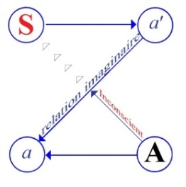

# Leçon 01 | 16 Novembre 1955

<!-- source-url: http://staferla.free.fr/S3/S3 PSYCHOSES.docx -->
<!-- seminar: s3 -->
<!-- lesson: 01 -->

<!-- id: s3-01-0001 -->

Comme vous l’avez appris, cette année commence la question des psychoses. Loin qu’on puisse parler d’emblée du traitement des psychoses, et encore moins du traitement de la psychose chez FREUD, ce qui littéralement se réduit à néant, car jamais FREUD n’en a parlé, sauf de façon tout à fait allusive.

<!-- id: s3-01-0002 -->

Nous allons d’abord essayer de partir de la doctrine freudienne pour voir en cette matière ce qu’il apporte, puis nous ne pourrons pas manquer, à l’intérieur même de ces commentaires, d’y introduire - dans les notions que nous avons déjà élaborées au cours des années précédentes - *tous les problèmes actuels que posent pour nous les psychoses* :

<!-- id: s3-01-0003 -->

- problèmes de natures *clinique* et *nosographique* d’abord, dans lesquels il m’a semblé que peut-être tout le bénéfice que peut apporter l’analyse, n’avait pas été complètement dégagé,

<!-- id: s3-01-0004 -->

- problème de traitement aussi : assurément, c’est là que devra déboucher notre travail cette année.

<!-- id: s3-01-0005 -->

Puisque aussi bien ce point de mire…

<!-- id: s3-01-0006 -->

> et assurément ce n’est pas un hasard, mettons que ce soit un lapsus : c’est un lapsus significatif

<!-- id: s3-01-0007 -->

…ce point de mire déjà nous pose une question qui est une sorte d’évidence première, comme toujours le moins remarqué est dans ce qui a été fait, dans ce qui se fait, dans ce qui est en train de se faire. Quant au traitement des psychoses, il est frappant de voir qu’il semble qu’on aborde beaucoup plus volontiers, qu’on s’intéresse d’une façon beaucoup plus vive, qu’on attende beaucoup de résultats, de l’abord *des schizophrénies*, beaucoup plus que de l’abord *des paranoïas.*

<!-- id: s3-01-0008 -->

Je vous propose en manière de point d’interrogation cette remarque dès maintenant. Nous resterons peut-être un long moment à y apporter la réponse, mais assurément elle restera sous-jacente à une bonne part de notre démarche, et ceci dès le départ. En d’autres termes la situation un peu privilégiée, un peu *nodale* - au sens où il s’agit d’un *nœud*, mais aussi d’un noyau résistant - la situation des *paranoïas* est quelque chose, et ce n’est certainement pas sans raison que nous en avons fait le choix pour aborder, pour commencer d’aborder, le problème des psychoses dans ses relations avec la doctrine freudienne.

<!-- id: s3-01-0009 -->

En effet ce qui est frappant d’un autre côté, c’est que FREUD s’est intéressé d’abord à la *paranoïa*…

<!-- id: s3-01-0010 -->

> il n’ignorait pas bien entendu la *schizophrénie* ni ce mouvement,
>
> lui qui était contemporain de l’élaboration de la *schizophrénie*

<!-- id: s3-01-0011 -->

…il est très frappant et très singulier que - s’il a certainement reconnu, admiré, voire encouragé les travaux autour de l’école de Zurich, et mis en relation les concepts et la théorie analytique avec ce qui s’élaborait autour de BLEULER - FREUD en soit resté assez loin.

<!-- id: s3-01-0012 -->

Et pour vous indiquer tout de suite un point de texte auquel vous pourrez vous reporter, nous y reviendrons d’ailleurs mais il n’est pas inutile que vous en preniez connaissance dès maintenant, je vous rappelle qu’à la fin de l’observation du cas SCHREBER, qui est le texte fondamental de tout ce que FREUD a apporté concernant les psychoses, texte majeur, vous y verrez de la part de FREUD la notion d’une « *ligne de partage des eaux* », si je puis m’exprimer ainsi, entre *paranoïa* d’un côté, et d’un autre tout ce qu’il aimerait, dit-il, qu’on appelât « *paraphrénie* »…

<!-- id: s3-01-0013 -->

> et qui correspond très exactement au terme qu’il voudrait bien, lui FREUD, qu’on donne au champ
>
> à proprement parler des *schizophrénies*, ou encore ce qu’il propose qu’on appelle *champ des schizophrénies*
>
> dans la nosologie analytique

<!-- id: s3-01-0014 -->

…*paraphrénie* qui recouvre exactement toute la démence. Je vous indique les points de repère qui sont nécessaires à l’intelligence de ce que nous dirons dans la suite.

<!-- id: s3-01-0015 -->

Donc pour FREUD, le champ des psychoses se divise en deux : psychoses à proprement parler...

<!-- id: s3-01-0016 -->

> pour savoir ce que cela recouvre à peu près dans l’ensemble du domaine psychiatrique, *psychose* cela n’est pas *démence*. Les psychoses, si vous voulez - il n’y a pas de raison de se refuser le luxe d’employer ce terme -
>
> ça correspond à ce que l’on a appelé toujours, et qui continue d’être appelé légitimement « les folies »

<!-- id: s3-01-0017 -->

…dans le domaine de la folie FREUD fait deux parts très nettes, il ne s’est pas tant mêlé de nosologie - en matière de *psychoses -* que cela, mais là il est très net, et nous ne pouvons pas tenir cette distinction, étant donné la qualité de son auteur, pour tout à fait négligeable.

<!-- id: s3-01-0018 -->

Je vous fais remarquer au passage qu’en ceci, comme il arrive, nous ne pouvons que remarquer qu’il n’est pas absolument en accord avec son temps, et que c’est là l’ambiguïté :

<!-- id: s3-01-0019 -->

- soit parce qu’il est très en retard,

<!-- id: s3-01-0020 -->

- soit au contraire parce qu’il est très en avance.

<!-- id: s3-01-0021 -->

Mais à un premier aspect il est très en retard. En d’autres termes, l’expansion qu’il donne au terme de *paranoïa*, il est tout à fait clair qu’on va beaucoup plus loin qu’à son époque on ne donnait à ce terme.

<!-- id: s3-01-0022 -->

Je donne quelques points de repère pour ceux qui ne sont peut-être pas familiers avec ces choses. Je ne veux pas vous faire ce qu’on appelle l’historique de la paranoïa depuis qu’elle a fait son apparition avec un psychiatre disciple de KANT au début du XIXème siècle. C’est tout à fait une incidence épisodique.

<!-- id: s3-01-0023 -->

Le maximum d’extension de la paranoïa, c’est justement le moment où la paranoïa se confond à peu près avec ce qu’on appelle « *les folies* », qui est le moment qui correspond à peu près à l’exemple des *soixante dix pour cent* des malades qui étaient dans les asiles et qui portaient *l’étiquette* « *paranoïa* ». Ça voulait dire que tout ce que nous appelons psychoses ou folies étaient paranoïas.

<!-- id: s3-01-0024 -->

Mais nous avons d’autres tendances en France à voir le mot paranoïa pris, à peu près identifié avec le moment où il a fait son apparition dans la nosologie française…

<!-- id: s3-01-0025 -->

> moment extrêmement tardif : ça joue sur une cinquantaine d’années

<!-- id: s3-01-0026 -->

…et où il fut identifié à quelque chose de fondamentalement différent comme conception, de tout ce qu’il a représenté dans la psychiatrie allemande.

<!-- id: s3-01-0027 -->

En France ce que nous appelons un paranoïaque…

<!-- id: s3-01-0028 -->

> ou tout au moins ce qu’on appelait un paranoïaque avant que la thèse d’un certain Jacques LACAN
>
> sur « *Les psychoses paranoïaques dans leurs rapports avec la personnalité »*, ait tenté de jeter un grand trouble dans
>
> les esprits, qui s’est limité à un petit cercle, au petit cercle qui convient : on ne parle plus des paranoïaques comme on en parlait auparavant

<!-- id: s3-01-0029 -->

…à ce moment-là c’était « *la constitution paranoïaque* », c’est-à-dire que c’était des méchants, des intolérants, des gens de mauvaise humeur : orgueil, méfiance, susceptibilité, surestimation de soi-même, telle était la caractéristique qui faisait pour tout un chacun le fondement de la paranoïa.

<!-- id: s3-01-0030 -->

À partir de quoion était plus simple, tout s’expliquait : quand il était par trop paranoïaque, il arrivait à délirer.

<!-- id: s3-01-0031 -->

Voilà à peu près - je ne force en rien - où nous en étions en France, je ne dis pas à la suite des conceptions de SÉRIEUX et CAPGRAS[^1]…

<!-- id: s3-01-0032 -->

> parce que si vous lisez, vous verrez qu’au contraire il s’agit là d’une clinique très fine qui permet précisément de reconstituer les bases et les fondements
>
> de *la psychose paranoïaque* telle qu’elle est effectivement structurée

<!-- id: s3-01-0033 -->

…mais plutôt à la suite de la diffusion de l’ouvrage dans lequel, sous le titre « *La Constitution paranoïaque »* [^2], Monsieur GENIL-PERRIN avait fait prévaloir cette notion caractérologique de l’anomalie de la personnalité constituée essentiellement dans une structure qu’on peut bien qualifier - aussi bien le livre porte la marque et le style de cette inspiration - de « *structure perverse du caractère* » et comme toute *perversion*, il arrivait qu’il sorte des limites et qu’il tombe dans cette affreuse folie qui consistait simplement dans l’exagération démesurée de tous les traits de ce fâcheux caractère.

<!-- id: s3-01-0034 -->

Cette conception, vous le remarquerez, peut bien s’appeler une conception *psychologique*, ou *psychologisante*, ou même psychogénétique de la chose. Toutes les références formelles à une base organique de la chose, au tempérament par exemple, ne changent en rien ce que nous pouvons appeler « *genèse psychologique* » : c’est précisément cela, c’est quelque chose qui s’apprécie, se définit sur un certain plan, et ensuite les relations, les liens de développement se conçoivent d’une façon parfaitement continue, dans une cohérence qui est autonome, propre, qui se suffit dans son propre champ, et c’est bien en somme de science psychologique qu’il s’agit, quelle que puisse être d’un autre côté la répudiation d’un certain point de vue que l’on trouvait sous la plume de son auteur, ça n’y changerait rien.

<!-- id: s3-01-0035 -->

J’ai donc essayé dans ma thèse, d’y introduire une autre vue. À ce moment-là j’étais encore assurément un jeune psychiatre, et j’y fus introduit pour beaucoup par les travaux, l’enseignement direct et, j’oserai même dire la familiarité de quelqu’un qui a joué un rôle très important dans la psychiatrie française à cette époque, et qui est Monsieur DE CLÉRAMBAULT.

<!-- id: s3-01-0036 -->

Monsieur DE CLÉRAMBAULT…

<!-- id: s3-01-0037 -->

> j’évoque sa personne, son action, son influence et son nom dans une causerie introductive
>
> de notre champ pour ceux d’entre vous qui n’ont de son œuvre qu’une connaissance moyenne
>
> ou approximative, ou par ouïe-dire, et je pense qu’il doit y en avoir un certain nombre

<!-- id: s3-01-0038 -->

…passe pour avoir été le farouche défenseur d’une conception organiciste extrême, et assurément c’était là en effet le dessein explicite de beaucoup de ses exposés théoriques.

<!-- id: s3-01-0039 -->

Néanmoins, je crois que c’est là que peut tenir la perspective sur l’influence qu’a pu avoir effectivement, non seulement sa personne et son enseignement, mais aussi la véritable portée de cette découverte, puisque aussi bien c’est une œuvre qui, indépendamment de ses visées théoriques, a une valeur clinique concrète d’une nature considérable : le nombre de syndromes - pour donner à ce terme le sens le plus vague - cliniques descriptifs qui ont été repérés par CLÉRAMBAULT, et d’une façon complètement originale et nouvelle, qui sont dès lors intégrés au patrimoine psychiatrique de l’expérience psychiatrique, est considérable.

<!-- id: s3-01-0040 -->

Et dans l’ordre des psychoses, CLÉRAMBAULT reste absolument indispensable, il a apporté des choses extrêmement précieuses qui n’avaient jamais été vues avant lui, qui n’ont même pas été reprises depuis. Je parle des psychoses toxiques, déterminées par des toxiques : éthéromanie, etc.

<!-- id: s3-01-0041 -->

La notion de l’*automatisme mental* est apparemment polarisée dans l’œuvre de CLÉRAMBAULT, dans son enseignement, par le souci de démontrer le caractère fondamentalement anidéïque comme il s’exprimait, c’est-à-dire non conforme à une suite d’idées - ça n’a pas beaucoup plus de sens dans le discours de ce maître - de la suite des phénomènes dans le développement ou l’évolution de la psychose.

<!-- id: s3-01-0042 -->

On peut déjà remarquer que rien que ce repérage du phénomène en fonction d’une espèce de compréhensibilité supposée :

<!-- id: s3-01-0043 -->

- c’est à savoir qu’il pourrait y avoir une continuité qu’on appellerait l’idée,

<!-- id: s3-01-0044 -->

- c’est à savoir que la suite des phénomènes, de la façon dont je vous ai indiqué le paranoïaque avec son développement délirant, ce serait quelque chose qui irait de soi, …de sorte qu’il y a déjà une espèce de référence à la compréhensibilité, et presque pour déterminer ce qui justement se manifeste pour faire une rupture dans la chaîne, et se présentait justement comme un cas béant, comme quelque chose d’incompréhensible et quelque chose qui ne joint pas maintenant avec ce qui se passe après.

<!-- id: s3-01-0045 -->

C’est là une assomption dont il serait exagéré de dire qu’elle est assez naïve, puisqu’il n’y a pas de doute, il n’y en a pas de plus commune. Et tout de même pour beaucoup de gens…

<!-- id: s3-01-0046 -->

> et je le crains, encore pour vous, tout au moins pour beaucoup d’entre vous

<!-- id: s3-01-0047 -->

…la notion qui a constitué le progrès majeur de la psychiatrie, depuis qu’a été introduit ce mouvement d’investigation qui s’appelle *l’analyse*, consisterait en la restitution du sens à l’intérieur de la chaîne des phénomènes.

<!-- id: s3-01-0048 -->

Ceci n’est pas faux en soi, mais ce qui est fauxc’est de s’imaginer…

<!-- id: s3-01-0049 -->

> comme il reste d’une façon ambiante dans l’esprit disons des salles de garde,
>
> de la moyenne de l’opinion commune, du « *sensus commune* » des psychiatres

<!-- id: s3-01-0050 -->

…que le sens dont il s’agit c’est ce qui se comprend, qu’en d’autres termes, ce que nous avons appris, ce qu’il y a de nouveau, c’est à comprendre les malades.

<!-- id: s3-01-0051 -->

C’est là un pur mirage ! Cette notion de *compréhensibilité* a un sens très net, et qui est un ressort tout à fait essentiel de notre recherche : quelque chose peut être compris et strictement indistingué de ce qu’on appelle par exemple « *relation de compréhension* », et dont JASPERS a fait le pivot de toute sa *psychopathologie* dite *générale*.

<!-- id: s3-01-0052 -->

C’est qu’il y a des choses qui se comprennent, qui vont de soi, par exemple quand quelqu’un est triste, c’est qu’il n’a pas ce que son cœur désire : rien n’est plus faux ! Il y a des gens qui ont tout ce que leur cœur désire et qui sont tristes quand même, la tristesse est une passion qui est complètement d’une autre nature.

<!-- id: s3-01-0053 -->

Je voudrais quand même un tout petit peu insister : quand vous donnez une gifle à un enfant, eh bien *ça se comprend*, il pleure sans que personne réfléchisse que ce n’est pas du tout obligé qu’il pleure, et je me souviens du petit garçon qui, quand il recevait une gifle demandait « *c’est une caresse ou une claque ?* ». Si on lui disait « *c’est une claque !* », il pleurait, ça faisait partie des conventions, de la règle du moment : s’il avait reçu une claque il fallait pleurer, et si c’était une caresse il était enchanté. Il faut dire que le mode de relations qu’il avait avec ses parents un peu vifs, donnait cette sorte de communication active du contexte, assez courant dans cette notion de *relation de compréhension* telle que l’explicite M. JASPERS.

<!-- id: s3-01-0054 -->

Vous pouvez d’ici la prochaine fois, vous reporter au chapitre très précis intitulé « *La notion de relation de compréhension »* dans M. JASPERS [^3], vous y verrez d’ailleurs - parce que c’est bien là l’utilité d’un discours soutenu - que les incohérences y apparaissent vite, et vous y verrez très rapidement à quel point la notion est insoutenable, c’est-à-dire qu’en fin de compte JASPERS n’évoque la *relation de compréhension* que comme quelque chose qui est toujours à la limite, mais dès qu’on s’en approche à proprement parler est insaisissable, et dont les exemples qu’il tient pour les plus manifestes, ceux qui sont ses points de repère, les centres de référence avec lesquels il confond très vite et forcément de façon obligée, la notion de *relation de compréhension*, ce sont des références en quelque sorte idéales.

<!-- id: s3-01-0055 -->

Mais ce qui est très saisissant c’est qu’il ne peut pas éviter, même dans son propre texte et même avec l’art qu’il peut mettre à soutenir ce mirage, d’en donner d’autres exemples que ceux qui ont toujours été précisément réfutés par les faits, par exemple que le suicide étant un penchant certainement vers le déclin, vers la mort, il semblerait que tout un chacun en effet pourrait dire - mais uniquement si on va le chercher pour le faire dire - que le suicide devrait se produire plus facilement au déclin de la nature, c’est-à-dire en automne. Mais chacun sait depuis longtemps que d’après les statistiques on se suicide beaucoup plus au printemps.

<!-- id: s3-01-0056 -->

Ça n’est ni plus ni moins compréhensible, il suffit des articulations nécessaires, et d’expliciter ce qu’on voudra sur ce sujet, admettre qu’il y a quelque chose de surprenant au fait que les suicides soient plus nombreux au printemps qu’en automne, et quelque chose qui ne peut reposer que sur cette sorte de mirage toujours inconsistant qui s’appelle la *relation de compréhension*, comme s’il y avait quoi que ce soit qui, dans cet ordre, pût être jamais saisi.

<!-- id: s3-01-0057 -->

En ce sens, si nous arrivions même à concevoir...

<!-- id: s3-01-0058 -->

> c’est très difficile de le concevoir parce que c’est littéralement inconcevable, mais comme toutes les choses qui ne sont pas approchées, serrées de près, prises dans un véritable concept, cela reste la supposition latente à tout ce que l’on considère comme une espèce de changement de couleur de la psychiatrie depuis une trentaine d’années.

<!-- id: s3-01-0059 -->

…si on arrivait à identifier la notion de *psychogénèse* avec celle de la réintroduction - dans le rapport à notre objet psychiatrique : le malade - la réintroduction de ces fameuses *relations de compréhension*, si la *psychogenèse* c’est cela, je dis…

<!-- id: s3-01-0060 -->

> parce que je pense que la plupart d’entre vous sont capables dès maintenant de comprendre parfaitement ce que je veux dire après deux ans d’enseignement sur le *symbolique*, l’*imaginaire* et le *réel*,

<!-- id: s3-01-0061 -->

…pour ceux qui n’y seraient pas encore je le leur dis : *le grand secret de la psychanalyse c’est qu’il n’y a pas de psychogenèse*.

<!-- id: s3-01-0062 -->

Si *la psychogenèse* c’est cela, c’est justement ce dont *la psychanalyse* :

<!-- id: s3-01-0063 -->

- par tout son mouvement,

<!-- id: s3-01-0064 -->

- par toute son inspiration,

<!-- id: s3-01-0065 -->

- par tout son ressort,

<!-- id: s3-01-0066 -->

- par tout ce qu’elle a apporté,

<!-- id: s3-01-0067 -->

- par tout ce en quoi elle nous conduit,

<!-- id: s3-01-0068 -->

- par tout ce en quoi elle doit nous maintenir, …est en cela la plus éloignée.

<!-- id: s3-01-0069 -->

Une autre manière d’exprimer les choses et qui va beaucoup plus loin encore, c’est que dans l’ordre de ce qui est à proprement parler *psychologique*, si nous essayons de le serrer de plus près, à savoir si nous nous mettons dans une perspective psychologisante, le psychologique c’est l’éthologie, c’est l’ensemble des comportements, des relations de l’individu, biologiquement parlant, avec ce qui fait partie de son entourage naturel. C’est la définition tout à fait légitime de ce qui peut être considéré à proprement parler comme la psychologie : c’est là un ordre de relations de fait, chose objectivable disons, champ très suffisamment limité pour constituer un objet de science.

<!-- id: s3-01-0070 -->

Il faut aller un tout petit peu plus loin, et il faut même dire qu’aussi bien constituée que soit une psychologie dans son champ naturel, la psychologie humaine comme telle est exactement…

<!-- id: s3-01-0071 -->

> comme disait VOLTAIRE de l’histoire naturelle : « *elle n’est pas aussi naturelle que cela* »

<!-- id: s3-01-0072 -->

…pour tout dire, tout ce qu’il y a de plus antinaturel.

<!-- id: s3-01-0073 -->

Tout ce qui est de l’ordre proprement psychologique dans le comportement humain est soumis à des anomalies profondes, présente à tous instants des paradoxes suffisants pour, à soi seul, poser le problème de savoir quel ordre il faut introduire pour que, simplement, on s’y retrouve, pour que la chatte y retrouve ses petits.

<!-- id: s3-01-0074 -->

Si on oublie ce qui est vraiment le relief, le ressort essentiel de la psychanalyse, on revient…

<!-- id: s3-01-0075 -->

> ce qui d’ailleurs est naturellement le penchant constant, quotidiennement constaté de la psychanalyse

<!-- id: s3-01-0076 -->

…on revient à toutes sortes de *mythes* qui ont été constitués depuis un temps qui reste à définir : à peu près de la fin du XVIIème siècle jusqu’à la psychanalyse.

<!-- id: s3-01-0077 -->

Ces sortes de mythes, on peut bien les définir ainsi, si on constituait l’ensemble de ce qu’on appelle la psychologie traditionnelle et de la psychiatrie :

<!-- id: s3-01-0078 -->

- mythes d’unité de la personnalité,

<!-- id: s3-01-0079 -->

- mythes de la synthèse,

<!-- id: s3-01-0080 -->

- mythes des fonctions supérieures et inférieures,

<!-- id: s3-01-0081 -->

- confusion à propos des termes de l’automatisme, …tout type d’organisation du champ objectif qui montre à tout instant le craquement, l’écartèlement, la déchirure, la négation des faits, la méconnaissance même de l’expérience la plus immédiate.

<!-- id: s3-01-0082 -->

Ceci dit, qu’on ne s’y trompe pas, je ne suis pas ici non plus en train de donner la moindre indication dans le sens d’*un mythe* au premier plan de cette *« expérience immédiate »* qui est le fond de ce qu’on appelle la psychologie, voire la psychanalyse existentielle, cette « *expérience immédiate* » n’a pas plus de privilège pour nous arrêter, nous captiver, que dans n’importe quelle autre science, c’est-à-dire qu’elle n’est nullement la mesure de ce à quoi nous devons arriver en fin de compte, comme élaboration satisfaisante de ce dont il s’agit.

<!-- id: s3-01-0083 -->

À ce titre, ce que donne la doctrine freudienne, l’enseignement freudien est - vous le savez - tout à fait conforme à ce qui s’est produit dans tout le reste du scientifique, si différent que nous puissions le concevoir de ce mythe qui est le nôtre propre, c’est-à-dire que comme les autres sciences, il fait intervenir des ressorts qui sont au-delà de cette expérience immédiate, qui ne sont nullement possibles à être saisis d’une façon sensible. Là comme en physique ce n’est pas en fin de compte la couleur que nous retenons dans son caractère *senti*, différencié par l’expérience directe, c’est quelque chose qui est derrière et qui la conditionne.

<!-- id: s3-01-0084 -->

Nous ne pouvons pas méconnaître non plus cette dimension tout à fait essentielle du progrès freudien, c’est quelque chose qui n’est pas non plus - ce qui est différent de la *relation de compréhension* dont je parlais tout à l’heure - qui n’est pas non plus quelque chose qui simplement s’arrêterait à cette *expérience immédiate*, cette expérience n’est pas quelque chose qui, à aucun moment soit pris nulle part, dans quoi que ce soit de pré-conceptuel, de pré-essentiel, une sorte d’expérience pure.

<!-- id: s3-01-0085 -->

C’est une expérience bel et bien déjà structurée par quelque chose d’artificiel qui est très précisément la relation analytique, la relation analytique telle qu’elle est constituée par l’aveu par le sujet de quelque chose qu’il vient dire au médecin et ce que le médecin en fait, et c’est à partir de là que tout s’élabore, et c’est ce qui fait de son instrument d’entrée, son mode opératoire premier.

<!-- id: s3-01-0086 -->

À travers tout ce que je viens de vous rappeler, vous devez me semble-t-il, avoir déjà reconnu les trois ordres du champ dont je vous enseigne, rabâche, depuis un certain temps, combien ils sont nécessaires à mettre dans notre perspective pour comprendre quoi que ce soit à cette expérience, c’est à savoir :

<!-- id: s3-01-0087 -->

- du *symbolique*,

<!-- id: s3-01-0088 -->

- de *l’imaginaire*,

<!-- id: s3-01-0089 -->

- et du *réel*.

<!-- id: s3-01-0090 -->

*Le symbolique*, vous venez de le voir apparaître tout à l’heure très précisément, au moment où j’ai fait allusion de façon très nette, et par deux abords différents, à ce qui est manifestement au-delà de toute compréhension, et à l’intérieur de quoi toute compréhension s’insère et qui exerce cette influence si manifestement perturbante sur tout ce qui est des rapports humains et très spécialement interhumains.

<!-- id: s3-01-0091 -->

*L’imaginaire*, vous l’avez vu aussi pointer dans mon discours précédent, par cette seule référence que je vous ai faite à l’éthologie animale, c’est-à-dire à ces formes captivantes ou captatrices qui donnent en quelque sorte les rails et les suites, à l’intérieur desquelles suites, le comportement animal se dirige, se conduit vers ses buts naturels.

<!-- id: s3-01-0092 -->

M. PIÉRON qui n’est pas pour nous en odeur de sainteté, a intitulé un de ses livres : « *La sensation, guide de vie »*. C’est un très beau titre, je ne sais pas s’il s’applique autant à la sensation qu’il le dit, en tout cas, ce n’est certainement pas le contenu du livre qui le confirme, mais bien entendu il y a un fond exact dans cette perspective. Ce titre vient là un peu en raccroc à son livre, il semble que ce soit là un dessein auquel le livre lui-même fasse défaut.

<!-- id: s3-01-0093 -->

Mais *l’imaginaire* est assurément « *guide de vie »* pour tout le champ animal, et le rôle que *l’image* joue dans ce champ profondément structuré par *le symbolique*, qui est le nôtre, est bien entendu capital. Ce rôle est tout entier repris, repétri, réanimé par cet *ordre symbolique*, *les images* - en tant que nous puissions saisir quoi que ce soit qui permette de le saisir à l’état pur - sont toujours plus ou moins *intégrées à cet* *ordre symbolique* qui, je vous le rappelle, se définit chez l’homme par son caractère essentiellement de *structure organisée*.

<!-- id: s3-01-0094 -->

Par opposition, quelle différence y a-t-il entre quelque chose qui est de l’ordre *symbolique* et quelque chose qui est de l’ordre *imaginaire* ou *réel* ? C’est que dans *l’ordre imaginaire* ou *réel* nous avons toujours un plus ou un moins autour de quoi que ce soit qui soit un seuil, nous avons une marge, nous avons un plus ou moins, nous avons *une continuité*. Dans *l’ordre symbolique*, tout élément vaut en tant qu’opposé à un autre.

<!-- id: s3-01-0095 -->

Pour entrer par exemple dans le champ de l’expérience où nous allons commencer de nous introduire, celle de notre *psychotique,* prenons quelque chose de tout à fait élémentaire. L’un de nos psychotiques nous raconte dans quel monde étrange il est entré depuis quelques temps : tout pour lui est devenu *signe*, non seulement comme il le raconte il est épié, observé, surveillé : « *on parle, on dit, on indique, on le regarde, on cligne de l’œil »*, mais cela peut aller beaucoup plus loin, cela peut envahir - vous allez voir tout de suite l’ambiguïté s’établir *-* nous dirons le champ des objets réels inanimés, non-humains.

<!-- id: s3-01-0096 -->

Regardons-y de plus près avant de voir de quoi il s’agit s’il rencontre dans la rue une auto colorée par exemple, elle aura pour lui une valeur - une auto n’est pas absolument ce que nous appellerons un objet naturel - cette auto est rouge, elle aura pour lui tel sens, ce n’est pas pour rien qu’une auto rouge est passée à ce moment-là.

<!-- id: s3-01-0097 -->

Posons-nous des questions à propos d’un phénomène aussi simple, le phénomène de l’intuition délirante de ce sujet à propos de la valeur de cette *auto rouge*. Il est très souvent d’ailleurs tout à fait incapable, sans qu’elle ait pour lui une signification maxima*,* de préciser cette signification qui reste ambiguë : est-elle favorable, est-elle menaçante *?* Il est quelquefois incapable de trancher sur le plan de cette caractéristique, *mais assurément l’auto est là pour quelque chose.*

<!-- id: s3-01-0098 -->

À propos donc du phénomène le plus difficile à saisir, je dirais le plus indifférencié qui soit, nous pourrons reconnaître que par exemple nous aurons trois conceptions complètement différentes de la rencontre d’un sujet…

<!-- id: s3-01-0099 -->

> dont je n’ai pas dit dans quelle classe de la psychose il se place

<!-- id: s3-01-0100 -->

…de cette déclaration d’un sujet à propos d’une auto rouge,

<!-- id: s3-01-0101 -->

- selon que nous envisagerons la chose sous l’angle d’une aberration perceptive, c’est-à-dire : ne croyez pas que nous en sommes aussi loin, il n’y a pas très longtemps que c’était au niveau des phénomènes

<!-- id: s3-01-0102 -->

> de la perception, qu’était posée la question de savoir ce qu’éprouvait de façon élémentaire le sujet aliéné,
>
> si c’est un *daltonien* qui voit le rouge vert, ou inversement, personne n’y a été voir, il n’en distingue pas simplement la couleur

<!-- id: s3-01-0103 -->

- selon que nous envisagerons la rencontre avec cette auto rouge dans le même registre que ce qui se passe quand le rouge-gorge rencontrant son congénère, lui exhibe le plastron bien connu qui lui donne son nom, et c’est du seul fait de cette rencontre qu’il est là, car on a démontré par une série d’expériences, que cet habillement des oiseaux correspondait avec la garde des limites du territoire. À soi tout seul, cela détermine

<!-- id: s3-01-0104 -->

> un certain comportement individu-adversaire pour le moment de leur rencontre, fonction imaginaire de ce rouge, fonction si vous voulez qui dans l’ordre précisément des *relations de compréhension* se traduit par le fait que ce rouge pour le sujet, aura hâté quelque chose qui l’aura fait *voir rouge*, qui lui aura semblé porter
>
> en lui-même le caractère expressif et immédiat de l’hostilité ou de la colère.

<!-- id: s3-01-0105 -->

- Ou au contraire de comprendre cette auto rouge, troisième façon de la comprendre, dans l’ordre symbolique, à savoir comme on comprend la couleur rouge dans un jeu de cartes, c’est-à-dire en tant qu’opposé au noir, c’est-à-dire faisant partie d’un langage déjà organisé.

<!-- id: s3-01-0106 -->

Voilà exactement les trois registres distingués, et distingués aussi les trois plans dans lesquels peut s’engager notre « *compréhension* », dans la façon même dont nous nous interrogeons sur le phénomène élémentaire et sur sa valeur actuelle à un moment déterminé de l’évolution pour le sujet.

<!-- id: s3-01-0107 -->

Il est tout à fait clair, *massivement*, que ce que FREUD introduit quand il aborde ce champ de la paranoïa…

<!-- id: s3-01-0108 -->

> et ceci est encore plus éclatant ici que partout ailleurs, peut–être parce que c’est plus localisé,
>
> parce que cela tranche plus avec les discours contemporains

<!-- id: s3-01-0109 -->

…quand il s’agit de psychose, nous voyons d’emblée que FREUD avec une audace qui a le caractère d’une espèce de commencement absolu…

<!-- id: s3-01-0110 -->

> nous finissons par ne plus nous rendre compte de la trame technique, c’est une espèce de création,
>
> on a beau dire qu’il y a des sciences qui se sont déjà intéressées au sens du rêve, ça n’a *absolument* rien à faire avec la méthode appliquée dans la *Traumdeutung,* avec ce travail de pionnier qui est déjà fait devant nos yeux, et qui aboutit à la formule : « *le rêve vous dit quelque chose* » et la seule chose qui nous intéresse, c’est cette élaboration à travers laquelle il dit quelque chose, *il dit quelque chose comme on parle*. Ceci n’avait jamais été dit.
>
> On a dit qu’il y avait un sens, que nous pouvions y lire quelque chose, mais *le rêve dit quelque chose*,
>
> il parle admettons encore qu’il pouvait y avoir de cela justement par l’intermédiaire de toutes les pratiques innocentes, quelque chose de cela

<!-- id: s3-01-0111 -->

…mais que FREUD prenne le livre d’un paranoïaque - [ce livre de SCHREBER](http://userpage.fu-berlin.de/~quirrrrl/Denkwuerdigkeiten_eines_Nervenkranken.htm) dont il recommande bien platoniquement la lecture au moment où il écrit son œuvre, car il dit « *ne manquez pas de le lire avant de me lire* » - FREUD prend donc ce livre des *Mémoires d’un malade nerveux* et il donne un déchiffrage champolionesque, un déchiffrage à la façon dont on déchiffre *des hiéroglyphes* : il retrouve, derrière tout ce que nous raconte cet extraordinaire personnage...

<!-- id: s3-01-0112 -->

> car parmi toutes les productions littéraires du type du plaidoyer, de la communication, du message fait par quelqu’un qui, passé au-delà des limites, nous parle du domaine de cette expérience profondément extérieure, étrange, qui est celle du psychosé, c’est certainement un des livres les plus remarquables,
>
> c’en est un d’un caractère tout à fait privilégié, il y a là une rencontre exceptionnelle entre le génie
>
> de FREUD et quelque chose de tout à fait rare

<!-- id: s3-01-0113 -->

...dans son développement, FREUD prend le texte et il ne fait pas une vaine promesse : nous verrons ensemble qu’à un certain moment, il y a de la part de FREUD un véritable coup de génie qui ne peut rien devoir à ce qu’on peut appeler « *pénétration intuitive* », c’est le coup de génie littéralement du linguiste \[Champollion\] qui dans le texte voit apparaître plusieurs fois le même signe, et présuppose, part de l’idée que ceci doit vouloir dire quelque chose, par exemple la voyelle la plus fréquente « e » dans la langue dont il s’agit, vu ce que nous savons vaguement, et qui *à partir de ce trait de génie* arrive à remettre debout à peu près l’usage de tous les signes en question dans cette langue.

<!-- id: s3-01-0114 -->

Pour FREUD par exemple, cette identification prodigieuse qu’il fait des « *oiseaux du ciel* » dans SCHREBER, avec les « *jeunes filles* », a quelque chose qui participe tout à fait de ce phénomène, d’une hypothèse sensationnelle qui permet, à partir de là, d’arriver à reconstituer toute la chaîne du texte, bien plus : de comprendre non seulement le matériel signifiant dont il s’agit, mais aussi de reconstituer *la langue*, cette fameuse « *langue fondamentale* » dont nous parle SCHREBER lui-même, *la langue* dans laquelle tout le texte est écrit.

<!-- id: s3-01-0115 -->

Le caractère donc absolument dominant de l’interprétation *symbolique* comme telle, au sens plein, pleinement structuré qui est celui dans lequel j’insiste, il faut que nous situions toujours la découverte analytique dans son plan original, et par là plus évident que partout ailleurs. Est-ce que c’est assez dire ?

<!-- id: s3-01-0116 -->

Sûrement pas puisque, aussi bien, rien dans ce cas n’irait au delà de cette traduction, en effet, sensationnelle, mais du même coup laisserait exactement le champ dans lequel FREUD opère, sur le même plan que celui des névroses, c’est-à-dire que l’application de la méthode analytique ne montrerait ici rien de plus que ceci : qu’elle est capable en effet dans *l’ordre symbolique* de faire une lecture égale, mais tout à fait incapable de rendre compte de leur distinction et de leur originalité.

<!-- id: s3-01-0117 -->

Il est bien clair que c’est donc tout à fait au-delà de cela - ce qui sans doute sera une fois de plus démontré par la lecture de FREUD - que c’est bien au-delà de cela que se posent les problèmes qui vont faire l’objet de notre recherche de cette année, et qui vont aussi justifier que nous les ayons mis à notre programme : dans cette découverte du sens du discours.

<!-- id: s3-01-0118 -->

À proprement parler c’est un discours - et un discours imprimé, il s’agit bien de cela - de l’aliéné. Que nous soyons dans *l’ordre symbolique* et que ce soit *l’ordre symbolique* qui puisse en répondre, ceci est *manifeste*. Maintenant qu’est-ce que nous montre le matériel même de ce discours de l’aliéné ?

<!-- id: s3-01-0119 -->

Il parle, mais ce n’est pas au niveau de ses vocables que se déroule ce sens traduit par FREUD, c’est au niveau de *ce qui est nommé : les éléments de nomination de ce discours sont empruntés* à quelque chose dont - vous le verrez - le rapport est tout à fait étroit avec le corps propre. C’est par la porte d’entrée du *symbolique* que nous arrivons à entrevoir, à pénétrer cette relation de l’homme *à son propre corps* qui caractérise le champ en fin de compte réduit, vous le voyez, mais vraiment irréductible chez l’homme, de ce qu’on appelle *l’imaginaire*.

<!-- id: s3-01-0120 -->

Car si quelque chose chez l’homme correspond à cette fonction *imaginaire* du comportement animal, c’est tout ce qui le fait lier d’une façon élective, toujours aussi peu saisissable que possible, c’est-à-dire à la limite de quelque participation symbolique, mais tout de même irréductible, et que toute l’expérience analytique seule a permis de saisir dans ses derniers ressorts : l’homme a un certain nombre de ressorts formels qui sont la forme générale du corps, où tel ou tel point est dit zone érogène de ce corps. Voilà ce que nous démontre l’analyse symbolique du cas de SCHREBER.

<!-- id: s3-01-0121 -->

À partir de là, les questions qui se posent font exactement le tour des catégories effectivement actives, efficaces, dans notre champ opératoire. Il est classique de dire que dans la psychose, l’inconscient est là en surface, c’est même pour cela que c’est bien comme il l’est déjà, qu’il ne semble pas que ça ait de meilleur, ni de plus grand effet. Nous ne savons pas trop comment nous en tiendrons compte, il est bien certain qu’en effet, dans cette perspective assez instructive en elle-même, nous pouvons en effet faire cette remarque d’emblée et tout de suite, que probablement ce n’est pas purement et simplement, comme FREUD l’a toujours souligné, de ce trait négatif, d’être un *Unbewusst*, un *non conscient* que l’inconscient tient son efficace.

<!-- id: s3-01-0122 -->

Nous traduisons FREUD et nous disons : cet inconscient c’est un langage. Il est bien certain que ça paraît beaucoup plus clair dans notre perspective : que le fait qu’il soit articulé par exemple, n’implique pas après tout pour autant qu’il soit reconnu, la preuve c’est que *tout se passe comme si* FREUD *traduisait une langue étrangère*, et même la reconstituait dans un découpage absolument fondamental.

<!-- id: s3-01-0123 -->

Le sujet est peut-être tout simplement dans le même rapport que FREUD avec *son langage*, il l’est même certainement, à savoir que le phénomène de la *Spaltung* peut être là légitimement évoqué, et - si tant est que nous admettions l’existence de quelqu’un qui peut parler dans une langue qu’il ignore totalement - c’est la métaphore que nous choisissons pour dire ce qu’il ignore dans la psychose. En serons-nous satisfaits ?

<!-- id: s3-01-0124 -->

Certainement pas parce qu’aussi bien la question n’est pas de savoir pourquoi cet inconscient qui est là, articulé à fleur de terre, reste aussi bien pour le sujet exclu si l’on peut dire, non assumé, la question est de savoir pourquoi cet inconscient apparaît dans le *réel*, car enfin c’est là ce qui est la question essentielle.

<!-- id: s3-01-0125 -->

J’espère qu’il y en a assez parmi vous qui se souviennent du commentaire que M. Jean HIPPOLYTE nous avait fait ici de la « *Verneinung »* de FREUD, et je regrette son absence ce matin pour pouvoir répéter devant lui \- et m’assurer par sa présence que je ne les déforme point - les termes qu’il a dégagés de cette *Verneinung*.

<!-- id: s3-01-0126 -->

Ce qui ressortait bien de l’analyse de ce texte fulgurant, c’est que dans ce qui est inconscient, tout n’est pas seulement refoulé, c’est-à-dire méconnu par le sujet après avoir été verbalisé, mais que derrière tout le processus de *verbalisation*, il faut admettre une *Bejahung* \[affirmation\] *primordiale*, *une admission dans le sens du symbolique*, qui elle-même peut *faire défaut*.

<!-- id: s3-01-0127 -->

Point qui est recoupé par d’autres textes - je ne fais allusion qu’à ceux sur lesquels nous nous sommes arrêtés ici - et spécialement par un passage très significatif, aussi explicite qu’il est possible : il admet que *ce phénomène d’exclusion* pour lequel le terme de *Verwerfung* pour certaines raisons peut paraître tout à fait valable, pour distinguer de la *Verneinung* à une étape très ultérieure.

<!-- id: s3-01-0128 -->

Au début de la *symbolisation*, c’est-à-dire pouvant se produire à une étape déjà avancée du développement du sujet, il peut se produire ceci, que *le sujet refuse l’accession à son monde symbolique*, de quelque chose que pourtant il a expérimenté, et qui n’est rien d’autre dans cette occasion que la menace de castration. Et on peut savoir par toute la suite du développement du sujet qu’il n’en veut rien savoir et FREUD le dit textuellement, au sens du *refoulé*.

<!-- id: s3-01-0129 -->

Telle est la formule qu’il emploie et qui veut bien dire ceci : c’est qu’il y a une distinction entre

<!-- id: s3-01-0130 -->

- *ce qui est refoulé,*

<!-- id: s3-01-0131 -->

- *et ce qui,* du fait même qu’il est refoulé*, fait retour*.

<!-- id: s3-01-0132 -->

Car ce ne sont que *l’endroit et l’envers d’une seule et même chose*, le refoulé est toujours là, mais il s’exprime d’une façon parfaitement articulée dans les *symptômes* et dans une foule d’autres *phénomènes*, ce qui est tout à fait différent, et c’est pour cela que ma comparaison de l’année dernière de certains phénomènes de *l’ordre symbolique* avec ce qui se passe dans les machines, n’est pas si inutile à rappeler.

<!-- id: s3-01-0133 -->

Je vous le rappelle brièvement, vous savez que tout ce qui s’introduit dans le circuit des machines, au sens où nous l’entendons : nos petites machines au sens moderne du terme, des machines qui ne parlent pas tout à fait encore, mais qui vont parler d’une minute à l’autre, ces machines où on introduit ce dont on peut les nourrir, comme on dit, c’est-à-dire la suite des petits chiffres à la suite desquels nous attendrons les transformations majeures qui permettraient à la machine de nous rapporter les choses que nous aurions peut-être mis cent mille ans à calculer, ces machines nous ne pouvons y introduire des choses qu’en respectant leur rythme propre, c’est-à-dire une espèce de rythme fondamental dont il faut que nous respections l’existence, sinon tout le reste tombe dans les dessous et ne s’introduit pas, faute d’avoir pu entrer. On peut reprendre une image qui le représente, seulement il y a un phénomène, c’est que : « *tout ce qui est refusé dans l’ordre symbolique, reparaît dans le réel »*.

<!-- id: s3-01-0134 -->

Là-dessus, le texte de FREUD est sans ambiguïté * *: *si l’Homme aux loups n’est pas sans tendance ni propriété psychotique*…

<!-- id: s3-01-0135 -->

> comme la suite de l’observation l’a montré, il n’est pas du tout sans receler quelques ressources du côté de la psychose, comme il le démontre dans cette courte paranoïa qu’il ferait entre la fin du traitement de FREUD et le moment où il est repris au niveau de l’observation que nous donne FREUD

<!-- id: s3-01-0136 -->

…*si l’Homme aux loups a refusé toujours son accession* - pourtant apparente dans sa conduite - *de la castration au registre* \[*symbolique*\], l’a rejetée de la fonction symbolique à proprement parler, de l’assomption non seulement actuelle, mais même possible par un « *je* », il y a le lien le plus étroit entre ceci et le fait - qu’il retrouve dans l’enfance - d’avoir eu cette courte hallucination qu’il rapporte avec des détails extrêmement précis : il lui a fait voir qu’en jouant avec son couteau il s’était coupé le doigt, et que son doigt ne tenait plus que par un tout petit bout de peau.

<!-- id: s3-01-0137 -->

Le sujet raconte cela avec une précision et un style qui en quelque sorte, est calqué sur le vécu. Le fait que la scène est appréhendée pendant un court instant, il semble même que toute espèce de repérage temporel ait disparu : il s’est assis sur un banc à côté de sa nourrice qui est justement la confidente de ses premières expériences, il n’ose pas lui en parler, chose combien significative de cette suspension de toute possibilité de parler à la personne à qui il parlait de tout et tout spécialement de cela. Il y a là une espèce d’abîme, de plongée vraiment temporelle, de *coupure* d’expérience psychologique pendant un court moment, à la suite de quoi il en ressort qu’il n’a rien du tout, « *tout est fini n’en parlons plus* ».

<!-- id: s3-01-0138 -->

La relation que FREUD établit entre ce phénomène *et ce très spécial* « *ne rien savoir de la chose même* » au sens du refoulé, exprimé dans le texte de FREUD, est traduit par ceci : *ce qui est refusé dans l’ordre symbolique ressurgit dans le réel*. Vous savez que c’est exactement le fond, le sens, la pointe, de tout ce texte de la *Verneinung* :

<!-- id: s3-01-0139 -->

- qu’est-ce que veut dire un certain mode d’apparition de ce qui est en cause dans le discours du sujet, sous cette forme très particulière qui est *la dénégation* ?

<!-- id: s3-01-0140 -->

- Et pourquoi ce qui est là présent est aussi inefficace ?

<!-- id: s3-01-0141 -->

La relation étroite qu’il y a entre les deux registres :

<!-- id: s3-01-0142 -->

- celui de la dénégation et celui de la réapparition dans l’ordre purement intellectuel non intégré par le sujet,

<!-- id: s3-01-0143 -->

- et celui de l’hallucination, c’est-à-dire de la réapparition dans le réel de ce qui est refusé par le sujet, montre une gamme, un éventail de relations, un lien qui est absolument de premier plan.

<!-- id: s3-01-0144 -->

La question est donc de savoir : de quoi s’agit-il quand il s’agit d’un phénomène à proprement parler hallucinatoire ? Un phénomène hallucinatoire a sa source dans ce que nous pouvons appeler provisoirement - je ne sais pas si cette conjonction de termes, je la maintiendrai toujours - « *l’histoire du sujet dans le symbolique* ». C’est difficile à soutenir parce que *toute l’histoire* est par définition *symbolique*, mais prenons cette formule.

<!-- id: s3-01-0145 -->

La distinction est essentielle à établir : si le refoulé névrotique a la même origine, se situe à ce même niveau « *d’histoire dans le symbolique* » que le refoulé dont il s’agit dans la psychose. Bien entendu il s’établit le rapport le plus étroit avec les contenus dont il s’agit, mais ce qui est tout à fait frappant, c’est de voir qu’assurément :

<!-- id: s3-01-0146 -->

- ces distinctions permettent tout de suite, en quelque sorte, de se reconnaître dans ces contenus,

<!-- id: s3-01-0147 -->

- et en vérité apportent en elles-mêmes déjà toutes seules, une clé qui nous permet de nous poser des problèmes tout de même d’une façon beaucoup plus simple qu’on ne les avait posés jusqu’ici.

<!-- id: s3-01-0148 -->

Il est tout à fait certain, par exemple, que le phénomène d’hallucination verbale tel qu’il se présente sous la forme de *cette espèce de doublure* du comportement et de l’activité du sujet, qui est entendu comme si un tiers parlait et dise : « *Elle fait ceci,* ou *il fait ceci, il m’a parlé mais il ne va pas répondre, il s’habille* ou *il se déshabille,* ou *il se regarde dans la glace*… ». Ceci dont il s’agit est quelque chose qui dans la perspective qui est celle de *notre schéma de l’année dernière* :

<!-- id: s3-01-0149 -->

<!-- id: s3-01-0150 -->

du *sujet* et de cet *Autre* avec lequel la communication directe de la parole pleine de *l’ordre symbolique* *achevé* est interrompue par ce détour et ce passage par le *a* et le *a’* des deux *moi,* et de leurs *relations imaginaires*.

<!-- id: s3-01-0151 -->

Il est tout à fait clair que la triplicité essentielle au moins de premier plan que ceci implique chez le sujet, est quelque chose qui recouvre de la façon la plus directe, le fait que quelque chose qui est bien sans aucun doute bien entendu le *moi* du sujet, parle et peut parler du sujet normalement à un autre en troisième personne, et parler de lui, parler du S du sujet.

<!-- id: s3-01-0152 -->

Ceci - dans la perspective de structuration du sujet fondamental et de sa parole - n’a rien d’absolument explicite, sinon compréhensible. Comme toute une partie des phénomènes des psychoses se comprennent en ceci : que d’une façon extrêmement paradoxale, et exemplaire en même temps, le sujet - à la façon dont ARISTOTE faisait remarquer - « *Il ne faut pas dire l’âme pense, mais l’homme pense avec son âme.* »

<!-- id: s3-01-0153 -->

Formule dont on est déjà loin puisque aussi bien je crois que nous sommes beaucoup plus près de ce qui se passe en disant qu’ici *le sujet psychotique*, au moment où apparaît dans *le réel*, où apparaît avec ce *« sentiment de réalité »* qui est la caractéristique fondamentale du phénomène élémentaire, sa forme la plus caractéristique de *l’hallucination*, *le sujet, littéralement, parle avec son moi*.

<!-- id: s3-01-0154 -->

C’est quelque chose que nous ne rencontrerons jamais d’une façon pleine. L’ambiguïté de notre rapport au *moi* est absolument fondamentale et suffisamment marquée. Il y a toujours quelque chose de profondément révocable dans toute assomption de notre *moi*. Ce que nous montrent certains phénomènes élémentaires de la psychose, c’est littéralement le *moi* totalement assumé instrumentalement si on peut dire, le sujet identifié avec son *moi* avec lequel il parle, c’est lui qui parle de lui, le sujet, ou de lui de S, dans les deux sens équivoques du terme :

<!-- id: s3-01-0155 -->

- la lettre \[S\],

<!-- id: s3-01-0156 -->

- et le *Es* allemand.

<!-- id: s3-01-0157 -->

Ceci je ne vous le donne aujourd’hui et ici sous cette forme, que pour vous indiquer où vont nous porter cette année notre tentative de situation exacte, par rapport à ces trois registres *du symbolique, de l’imaginaire, et du réel,* des diverses formes de *la psychose*.

<!-- id: s3-01-0158 -->

Elles vont nous mener et nous maintenir dans ce qui est déjà et paraissait l’objet de notre recherche, précisément à permettre de préciser dans ses ressorts derniers, la fonction qu’il nous faut donner dans le traitement, dans la cure, à un registre, à un ressort comme celui du *moi* par exemple, avec tout ce que ceci comporte.

<!-- id: s3-01-0159 -->

Parce qu’enfin, ce qui s’entrevoit à la limite d’une telle analyse, c’est toute la question de *la relation d’objet*, si la relation analytique est fondée sur une méconnaissance de l’autonomie de cet *ordre symbolique* qui entraîne automatiquement une confusion du plan *imaginaire* et du plan *réel*, pour autant bien entendu que la relation *symbolique* n’est pas pour autant éliminée puisque on continue de parler, et même qu’on ne fait que cela, il en résulte que *ce qui dans le sujet demande à se faire reconnaître sur le plan propre de l’échange symbolique authentique*…

<!-- id: s3-01-0160 -->

> celui qui n’est pas si facile à atteindre puisqu’il est perpétuellement interféré par l’*autre*

<!-- id: s3-01-0161 -->

…*ce qui demande à se faire reconnaître dans son authenticité symbolique*, est non seulement littéralement méconnu, mais est remplacé par cette sorte particulière de reconnaissance : de *l’imaginaire*, du *fantasme* qui est à proprement parler ce qu’on appelle l’antichambre de la folie, une certaine façon d’authentifier tout ce qui dans le sujet est de l’ordre de *l’imaginaire* et quelque chose dont nous n’avons tout simplement qu’à admirer que ça ne mène pas à une aliénation plus profonde.

<!-- id: s3-01-0162 -->

Sans doute c’est là ce qui nous indique suffisamment qu’il lui faut quelque prédisposition, et nous ne doutons pas pour autant en effet qu’il n’y ait pas conditions. Comme on me posait encore la question à Vienne, un garçon charmant auquel j’essayais d’expliquer quelques petites choses, me demandait si je croyais que *les psychoses* étaient organiques ou pas. Je lui dis que cette question était complètement périmée, dépassée, et qu’il y avait très longtemps que nous ne faisions pas de différence entre la psychologie et la physiologie, et assurément ne devient pas fou qui veut, comme nous l’avions affiché au mur de notre salle de garde dans ce temps ancien, un peu archaïque.

<!-- id: s3-01-0163 -->

Il n’en reste pas moins que c’est à une certaine façon de manier la relation analytique…

<!-- id: s3-01-0164 -->

> et qui est proprement d’authentification de la relation imaginaire dont on parlait,
>
> cette substitution à *la reconnaissance sur le plan symbolique* de *la reconnaissance sur le plan imaginaire*

<!-- id: s3-01-0165 -->

…qu’il faut attribuer justement les cas qui sont bien connus également de déclenchement assez rapide de délires plus ou moins persistants, et quelquefois définitifs, par un maniement imprudent à l’entrée dans l’analyse, de « *la relation d’objet* » tout simplement.

<!-- id: s3-01-0166 -->

Les faits sont reconnus, classés, donc il est bien connu que ça peut arriver, mais jamais personne n’a expliqué pourquoi ça se produit, pourquoi une analyse dans ses premiers moments peut déclencher une *psychose*. C’est évidemment à la fois fonction des dispositions du sujet, comme on le fait toujours remarquer, mais aussi d’une certaine façon de manier l’analyse.

<!-- id: s3-01-0167 -->

Je crois aujourd’hui n’avoir pu faire autre chose que de vous apporter l’introduction à l’intérêt de ce que nous allons faire, l’imagination au fait qu’il est pour nous un point de vue de l’élaboration notionnelle, de la purification des notions, de leur mise en exercice, et du même coup de notre formation à une analyse. Il est utile de nous occuper de ce champ, quelque ingrat et aride que puisse être la paranoïa. Je crois avoir également du même coup rempli *mon programme*, c’est-à-dire mon titre d’aujourd’hui, et vous avoir indiqué aussi quelques incidences tout à fait précises.

<!-- id: s3-01-0168 -->

Cette élaboration notionnelle avec ce qu’elle comporte pour nous de « *formation »*, au sens de *rectification des perspectives*, est quelque chose qui peut avoir des incidences les plus directes dans la façon dont nous penserons, ou tout au moins dont nous nous garderons de penser, ce qu’est et ce que doit être dans sa visée, l’expérience de chaque jour.
## Notes

[^1]: Paul Sérieux et Joseph Capgras : [*Les folies raisonnantes : le délire d’interprétation*](http://web2.bium.univ-paris5.fr/livanc/?cote=61092&do=pages), Alcan, 1909.

[^2]: Genil-Perrin : *les paranoïaques*, Paris, Maloine, 1926. Cf. Marcel Montassut «  *La constitution paranoïaque *», thèse, Paris.

[^3]: Karl Jaspers : *Psychopathologie générale*, Bibliothèque des introuvables, 2000.
