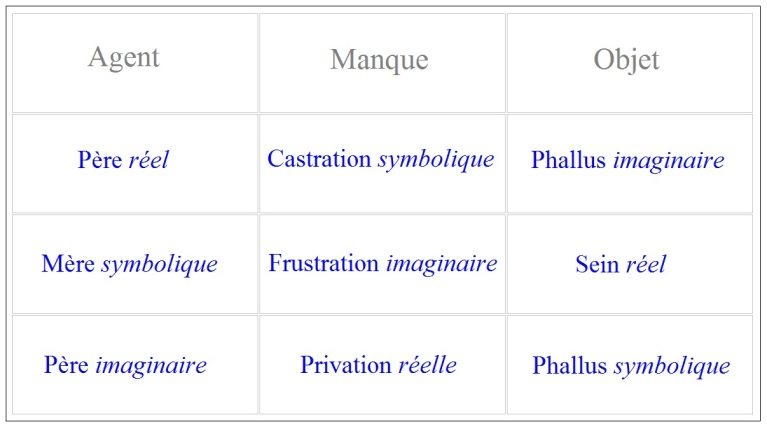

# Leçon 04 | 12 Décembre 1956

<!-- source-url: http://staferla.free.fr/S4/S4 LA RELATION.docx -->
<!-- seminar: s4 -->
<!-- lesson: 04 -->

<!-- id: s4-04-0001 -->

Voici le tableau auquel nous étions arrivés afin d’articuler *le problème de l’objet* tel qu’il se pose *dans l’analyse*.

<!-- id: s4-04-0002 -->

<!-- id: s4-04-0003 -->

Je vais tâcher aujourd’hui de vous faire sentir par quelle sorte de confusion, de manque de rigueur dans cette matière,
on aboutit à ce glissement curieux qui fait qu’en somme l’analyse fait partie d’une sorte de notion que j’appellerai scandaleuse,
des relations affectives de l’homme.

<!-- id: s4-04-0004 -->

À la vérité, je crois l’avoir déjà plusieurs fois souligné, ce qui a provoqué au départ tellement de scandale dans l’analyse,
qui a mis en valeur *le rôle de la sexualité* - pas toujours quand même, l’analyse a joué un rôle dans le fait que ce soit *un lieu commun*, et personne ne songe à s’en offenser - c’est bien précisément qu’elle introduisait en même temps que cette notion, et bien plus encore qu’elle, la notion de paradoxe, de difficulté essentielle interne si on peut dire, à l’approche de *l’objet sexuel*. Il est en effet singulier qu’à partir de là nous ayons glissé à cette notion *harmonique* de l’objet dont, pour mesurer la distance avec ce que FREUD lui­-même articulait avec la plus grande rigueur, je vous ai choisi une phrase dans les *Trois essais sur la théorie de la sexualité*.

<!-- id: s4-04-0005 -->

Les gens les plus mal renseignés, concernant *la relation d’objet,* remarquent qu’on peut très bien voir que dans FREUD
il s’agit de beaucoup de choses concernant l’objet, le choix de l’objet par exemple, mais que la notion par elle-même

<!-- id: s4-04-0006 -->

de relation d’objet n’y est nul­lement mise en valeur ni cultivée, ni même mise au premier plan de la question.
Voilà la phrase de FREUD qui se trouve dans l’article des *pulsions et de leur destin* [^8] :

<!-- id: s4-04-0007 -->

> « *L’objet de la pulsion est celui à travers lequel l’instinct peut atteindre son but. Il est ce qu’il y a de plus variable dans l’instinct, rien qui lui soit originairement accroché, mais quelque chose qui lui est subordonné, seulement par suite de son appropriation*
>
> *à la possibilité de son apaisement, sa satisfaction.* »
>
> \[« *Das Objekt des Triebes ist dasjenige, an welchem oder durch welches der Trieb sein Ziel erreichen kann. Es ist das variabelste am Triebe, nicht ursprünglich mit ihm verknüpft, sondern ihm nur infolge seiner Eignung zur Ermöglichung der Befriedigung zugeordnet.* »\]

<!-- id: s4-04-0008 -->

La notion donc est articulée : qu’il n’y a pas d’*harmonie* préétablie entre l’objet et la tendance, que l’objet n’y est littéralement lié que par les conditions qui sont avec l’objet. On s’en tire comme on peut, ce n’est pas une *doctrine*, c’est une citation,
mais c’est une citation parmi d’autres et une des plus significatives.

<!-- id: s4-04-0009 -->

Ce qu’il s’agit de voir c’est quelle est cette conception de l’objet, par quel détour elle nous mène pour que nous arrivions
à concevoir son instance efficace ? Et nous sommes arrivés à mettre ce premier plan en relief grâce à plusieurs points,
eux autrement articulés dans FREUD, à savoir : la notion que l’objet n’est jamais qu’un objet retrouvé à partir d’une *Findung* primitive, et donc en somme une *Wiederfindung* qui n’est *jamais satisfaisante*, l’accent est mis là-dessus avec la notion
de *retrouvailles*, que d’autre part nous avons vu à d’autres carac­téristiques, que cet objet est d’une part inadéquat,

<!-- id: s4-04-0010 -->

d’autre part même se dérobe partiellement à la saisie conceptuelle.

<!-- id: s4-04-0011 -->

Et ceci nous mène à essayer de serrer de plus près les notions fondamentales, en particulier à dissocier la notion mise au centre de la théorie analytique actuelle, cette notion de *frustration*, une fois entrée dans notre dialectique - encore que je vous ai souligné maintes fois combien elle est marginale par rapport à la pensée de FREUD lui-même - à essayer de la serrer de plus près,
de la revoir, et de voir dans quelle mesure elle a été nécessitée, dans quelle mesure aussi il convient de la rectifier, de la critiquer, pour la rendre utilisable, et pour tout dire cohérente avec ce qui fait le fond de *la doctrine analytique*, c’est-à-dire ce qui reste encore fondamentalement l’enseignement et la pensée de FREUD. Je vous ai rappelé ce qui se présentait d’emblée

<!-- id: s4-04-0012 -->

dans la donnée : *la cas­tration, la frustration* et *la privation*, comme trois termes dont il est fécond de marquer les différences.

<!-- id: s4-04-0013 -->

Que *la castration* soit essentiellement liée à *un ordre symbolique* en tant qu’institué, en tant que comportant toute une *longue cohé­rence* de laquelle en aucun cas le sujet ne saurait être donné, ceci est suffi­samment mis en évidence, autant par toutes *nos réflexions antérieures* que par la simple remarque que *la castration* a été dès l’abord liée à la position centrale donnée au *complexe d’Œdipe* comme étant l’élément d’articulation essentiel de toute l’évolution de la sexualité, le *complexe d’Œdipe* comme comportant
d’ores et déjà en lui-même et fondamentalement *la notion de la loi qui est absolument inéliminable*.

<!-- id: s4-04-0014 -->

Je pense que le fait que *la castration* soit au niveau de *la dette symbolique* nous paraîtra suffisamment affirmé et suffisamment même démontré par cette remarque appréciée et supportée par toutes nos réflexions antérieures. Je vous ai indiqué la dernière fois qu’assurément ce qui est en cause, ce qui est mis en jeu dans cette *dette symbolique* instituée par *la castration*, c’est *un objet imaginaire*, c’est *le phallus* comme tel. Du moins est-ce là ce que FREUD affirme, et c’est là le point d’où je vais partir et d’où nous allons essayer aujourd’hui de pousser un peu plus loin la dialectique de *la frustration*.

<!-- id: s4-04-0015 -->

La *frustration,* elle - même, bien entendu, prise comme position centrale sur ce tableau - est quelque chose qui n’a rien non plus qui soit même pour jeter de par soi un désaxement ni un désordre : si la notion de désir a été mise par FREUD au centre
de la conflictualité analytique, c’est bien entendu quelque chose qui nous fait assez saisir qu’en mettant l’accent sur la notion
de *frustration*, nous ne dérogeons pas beaucoup à cette notion centrale dans la dialectique freudienne. L’important est de saisir
ce que cette *frustration* veut dire, comment elle a été introduite, et ce à quoi elle se rapporte.

<!-- id: s4-04-0016 -->

Il est clair que *la notion de frustration* pour autant qu’elle est mise au premier plan de la théorie analytique, est liée à l’investigation des traumas, des fixations, des impressions d’expériences en elles-mêmes pré-œdipiennes, ce qui n’implique pas qu’elles soient extérieures à l’*œdip*e mais qu’elles en donnent en quelque sorte le terrain préparatoire, la base et le fondement, qu’elles modè­lent d’une façon telle que déjà certaines inflexions sont préparées en lui et don­neront le versant dans lequel le conflit de l’*œdipe*

<!-- id: s4-04-0017 -->

sera amené à s’infléchir d’une façon plus ou moins poussée, dans un certain sens plus ou moins atypique ou hétérotypique.

<!-- id: s4-04-0018 -->

Cette notion de *frustration* est donc liée au 1er âge de la vie et à un mode de relation qui par lui-même introduit manifestement
la question du *Réel* dans le progrès de l’expérience analytique. Nous voyons - mises au premier plan dans le conditionnement,
le développement du sujet - nous voyons introduites avec la notion de *frustration*, ces notions qu’on appelle - traduites dans
un langage plus ou moins de métaphore quantitative - des satisfactions, des gratifications d’une certaine somme de bienfaits adaptés, adéquats aux étapes du dévelop­pement du jeune sujet, et dont en quelque sorte la plus ou moins *saturation*
\- ou au contraire *carence -* est considérée comme un élément essentiel.

<!-- id: s4-04-0019 -->

Je crois qu’il suffit de faire cette remarque pour que ceci nous éveille à des preuves, à se reporter aux textes, à voir quel pas

<!-- id: s4-04-0020 -->

a été franchi dans l’*in­vestigation*, guidé par l’analyse du fait du simple déplacement d’intérêt dans la littérature analytique.
Ça se voit déjà assez facilement, tout au moins pour ceux qui sont assez familiarisés avec ces trois notions pour les reconnaître aisé­ment. Vous verrez que dans un morceau de littérature analytique où se reconnaît facilement cet élément d’articulation conceptuel de la chose, le sens sera mis sur certaines conditions réelles que nous repérons, que nous sommes supposés repérer
à l’expérience dans les antécédents d’un sujet. Cette mise au premier plan de cet élément d’intérêt est quelque chose qui, dès
les premières observations analytiques, nous apparaîtra dans l’ensemble absente en ce sens qu’elle est articulée différemment.

<!-- id: s4-04-0021 -->

Nous voilà remis au niveau de la *frustration* considérée comme une sorte d’élément d’impressions réelles, vécues dans une période du sujet où sa relation à cet *objet réel* quelqu’il soit est centrée d’habitude sur l’image dite primordiale du sein maternel.
Et que c’est essentiellement par rapport à cet objet primordial que vont se former chez le sujet ce que j’ai appelé tout à l’heure ses premiers versants et ses premières fixations qui sont celles devant lesquelles ont été décrits les types des *différents stades* instinctuels, et dont la caractéristique est de nous donner *l’anatomie imaginaire du développement* du sujet.

<!-- id: s4-04-0022 -->

C’est là que sont arrivées à s’articuler ces relations du *stade oral* et du *stade anal* avec leurs subdivisions diversement *phallique*, *sadique* etc. Et toutes marquées par cet élément d’ambivalence par quoi le sujet participe dans sa position même de la position
de l’autre, où il est deux, où il participe toujours à une situation essentiellement duelle sans laquelle aucune assomption générale
de la position n’est possible. Voyons donc où tout ceci nous mène, simplement à nous en limiter là.

<!-- id: s4-04-0023 -->

Nous voilà donc en présence d’un *objet* que nous prenons dans cette position, qui est position de *désir*.
Prenons-le comme on nous le donne, pour être sein, en tant qu’*objet réel*. Nous voilà portés au cœur de la question de :

<!-- id: s4-04-0024 -->

« *Qu’est-ce que ce rapport le plus primitif du sujet avec l’objet réel ?* »

<!-- id: s4-04-0025 -->

Vous savez combien là-dessus les théoriciens analystes se sont trouvés dans une sorte de discussion qui pour le moins
semble manifester toutes sortes de malentendus. FREUD nous a parlé du stade vécu d’*auto-érotisme*, cet *auto-éro­tisme* a été maintenu comme étant rapport primitif entre l’enfant et cet *objet maternel primordial*. Il a été maintenu au moins par certains.
D’autres ont remarqué qu’il était difficile de se rapporter à une notion qui semble être fondée sur le fait que le sujet
qu’il implique ne connaît que lui-même, quelque chose dont bien des traits d’observation directe, de ce que nous concevons comme nécessaire à expliquer le développement des relations de l’enfant et de la mère, bien des traits semblent contredire
qu’en cette occasion il n’y a pas de relations efficaces avec un objet : et quoi est plus manifestement extérieur au sujet
que ce quelque chose dont il a en effet le besoin le plus pressant, est ce qui est par excellence la première nourriture ?

<!-- id: s4-04-0026 -->

À la vérité, il semble qu’il y ait là un *malentendu* né essentiellement d’une sorte de *confusion*, et à travers laquelle cette discussion s’avère tellement pié­tinante, aboutit à des formulations diverses, assez diverses d’ailleurs pour que ça doive nous mener
assez loin, de les énumérer, et c’est pourquoi je ne peux pas le faire tout de suite puisqu’il nous faut faire un certain progrès
dans la conceptualisation de ce dont il s’agit ici. Mais remarquez simplement que quelque chose dont nous avons déjà parlé
qui est la théorie d’Alice BALINT, qui cherche à concilier la notion d’*auto-érotisme,* telle qu’elle est donnée dans FREUD,
avec *ce qui semble s’imposer à la réalité de l’objet* avec lequel l’enfant est confronté au stade tout à fait primitif de son développement, aboutit à cette conception tout à fait articulée et frappante qui est celle qu’elle appelle le « *primary love »*.

<!-- id: s4-04-0027 -->

La seule forme - disent M. et Mme BALINT - d’amour dans laquelle l’égoïsme et le don sont parfaitement conciliables,
à savoir d’admettre comme fondamentale une parfaite réciprocité

<!-- id: s4-04-0028 -->

- dans la position de ce que l’enfant exige de la mère,

<!-- id: s4-04-0029 -->

- et d’autre part de ce que la mère exige de l’enfant,
  une parfaite complémentarité des deux sortes, des deux pôles du besoin, qui est quelque chose de tellement contraire
  à toute expérience clinique, justement dans la mesure où nous avons affaire perpé­tuellement à l’évocation dans le sujet

<!-- id: s4-04-0030 -->

de la marque de tout ce qui a pu survenir de *discordances* et de *discordances* vraiment *fondamentales* que je vais avoir tout à l’heure
à rappeler en vous disant que c’est un élément excessivement simple, dans le couple qui n’est pas un couple,

<!-- id: s4-04-0031 -->

quelque chose de tellement dis­cordant de la signature donnée dans l’énoncé même de la théorie de ce soi­ disant *primitif amour* parfait et complémentaire, simplement par la remarque que ceci, nous dit Alice BALINT [^9], que ces choses - là où les rapports sont naturels, c’est-à-dire chez les sauvages - ça s’est fait depuis toujours : là où l’enfant est bien maintenu au contact de la mère.

<!-- id: s4-04-0032 -->

C’est-à-dire toujours ailleurs, au pays des rêves, là où comme chacun le sait, la mère a toujours l’enfant sur son dos.
C’est évidemment là une sorte d’évasion peu compatible avec une théo­risation tout à fait correcte qu’en fin de compte

<!-- id: s4-04-0033 -->

doit se formuler l’aveu que donc c’est dans une position tout à fait idéale, sinon idéaliste, que peut s’articuler la notion
d’un amour aussi strictement complémentaire en quelque sorte destiné par lui-même à trouver sa réciprocité.
Je ne prends cet exemple à la vérité que parce qu’il introduit à ce que nous allons tout de suite faire remarquer, et qui va être l’élément moteur de la critique que nous sommes en train de faire à propos de la notion de *frustration*. Il est clair que ça n’est pas tout à fait l’image de représentation fondamentale que nous donne une théorie par exemple comme la théorie kleinienne.
Il est amusant là aussi de voir par quel biais est attaquée cette reconstruction théorique qui est celle de la théorie kleinienne,
et en particulier puisqu’il s’agit de relation d’objet, il s’est trouvé qu’est tombé sous ma main un certain bulletin d’activité
qui est celui de *l’Association des Psychanalystes de Belgique*.

<!-- id: s4-04-0034 -->

Ce sont des auteurs que nous retrouverons dans le volume sur lequel j’ai reporté mes notes de ma première conférence,
et dont je vous ai dit que ce volume est proprement centré sur une vue optimiste, sans vergogne et tout à fait contestable
de la relation d’objet, qui lui donne son sens. Ici dans un bulletin un peu plus confidentiel il me semble que les choses
sont attaquées avec plus de nuance, comme si à la vérité c’est du manque d’assurance qu’on se faisait un peu honte
pour aller l’émettre dans des endroits où assurément il apparaît quand on en prend connais­sance, qu’il est plus *méritoire*.

<!-- id: s4-04-0035 -->

Nous pouvons voir qu’un article de Messieurs PASCHE et RENARD fait la reproduction d’une critique qu’ils ont apportée
au congrès de Genève concernant les positions kleiniennes. Il est extrêmement frappant de voir dans cet article reprocher
à Mélanie KLEIN d’avoir une théorie du développement qui en quelque sorte - au dire des critiques et des auteurs -
mettrait *<u>tout</u>* à l’intérieur du sujet, mettrait en somme d’une façon préformée *tous les types de développement pos­sibles*

<!-- id: s4-04-0036 -->

inclus déjà dans le donné instinctuel, et qui serait en somme la sortie, d’après les auteurs, des différents éléments,
et déjà en quelque sorte potentiellement articulés à la façon dont les auteurs demandent d’en faire la compa­raison,

<!-- id: s4-04-0037 -->

et donc pour certains dans la théorie du développement biologique : *le chêne tout entier* serait déjà contenu *dans le gland*.

<!-- id: s4-04-0038 -->

Que rien ne viendrait à un tel sujet en quelque sorte de l’extérieur, et que ce serait par ses primitives pulsions agressives nommément au départ - et en effet la prévalence de l’agres­sivité est manifeste quand on la comprend dans cette perspective chez Mélanie KLEIN - et puis par l’intermédiaire de chocs en retour de ces *pulsions agressives* ressenties par le sujet de l’extérieur, à savoir du champ maternel, *la progressive construction* - quelque chose qui, nous dit-on, ne peut être reçu que comme une sorte
de chêne préformé - *de la notion de la totalité de la mère* à partir de laquelle s’instaure cette soi-disant « *position dépressive* »
qui peut se présenter dans toute expérience.

<!-- id: s4-04-0039 -->

Toutes ces critiques, il faut les prendre les unes après les autres pour pouvoir les apprécier à leur juste valeur,

<!-- id: s4-04-0040 -->

et je voudrais sim­plement ici vous souligner à quoi paradoxalement l’ensemble de ces critiques aboutissent.
Elles aboutissent à une formulation qui est celle-ci et qui fait le cœur et le centre de l’article, c’est qu’assurément les auteurs paraissent ici fascinés par la question de savoir en effet comment ce fait d’expérience, ce qui dans le déve­loppement est apporté de l’extérieur, ce qu’ils croient voir dans Mélanie KLEIN, ceci nous est déjà donné dans une constellation interne au départ,
et qu’il ne serait pas étonnant de voir par la suite mise au premier plan, et d’une façon si prévalente la notion de l’objet interne.

<!-- id: s4-04-0041 -->

Et les auteurs arrivent à la conclusion qu’ils pensent pouvoir sortir l’apport kleinien en mettant au premier plan la notion
de *« schème préformé »* - dont ils disent qu’il est très difficile de se le représenter - préformé héréditairement.

<!-- id: s4-04-0042 -->

> « *Donc* - disent-ils - *l’enfant naît avec des instincts hérités, en face d’un monde qu’il ne perçoit pas,*
> *mais dont il se souvient et qu’il aura ensuite non pas à faire partir de lui-même ni de rien d’autre,*
> *non pas à découvrir par une suite de trouvailles insolites, mais à reconnaître. »*

<!-- id: s4-04-0043 -->

Je pense que la plupart d’entre vous reconnaissent le caractère *platonicien* de cette formulation qui ne peut pas échapper.
Ce monde dont on n’a qu’à se *souvenir*, ce monde donc qui *s’instaurera* en fonction d’une certaine *pré­paration imaginaire*,

<!-- id: s4-04-0044 -->

auquel le sujet se trouve d’ores et déjà adéquat, est quelque chose qui assurément représente une critique d’opposition,
mais dont nous aurons à voir si à l’épreuve elle ne va pas non seulement à l’encontre de tout ce qu’a écrit FREUD,
mais si nous ne pouvons pas entrevoir d’ores et déjà que les auteurs sont eux-mêmes bien plus près qu’ils ne le croient
de la position qu’ils reprochent à Mélanie KLEIN, à savoir que c’est eux qui indiquent d’ores et déjà chez le sujet
l’existence à l’état de « s*chème préformé »* et prêt à apparaître à point nommé, tous les éléments qui permettront au sujet
de se compter à une série d’étapes qui ne peuvent être dites idéales que pour autant que c’est pré­cisément les souvenirs,

<!-- id: s4-04-0045 -->

et très précisément *les souvenirs phylogénétiques* du sujet qui en donneront le type et la norme.

<!-- id: s4-04-0046 -->

Est-ce cela qu’a voulu dire Mme Mélanie Klein ? Il est strictement impensable même de le soutenir, car s’il y a justement
quelque chose dont Mme Mélanie KLEIN donne idée, et c’est d’ailleurs le sens de la critique des auteurs, c’est assurément que

<!-- id: s4-04-0047 -->

*la situation première est* beaucoup plus *chao­tique*, véritablement *anarchique* au départ, *que le bruit et la fureur des pulsions est caractéristique*
à l’origine. Ce qu’il s’agit justement de savoir, c’est comment *quelque chose comme un ordre* peut s’établir à partir de là.

<!-- id: s4-04-0048 -->

Qu’il y ait dans la conception kleinienne quelque chose de mythique, ce n’est absolument pas douteux.
Il est bien certain que la contradiction - si elle apporte *un mythe* qu’ils ne retrouvent pas, bien qu’il ressemble au *fantasme kleinien* - est tout à fait parfaite. Ces *fantasmes* n’ont en effet bien entendu qu’un caractère rétroactif, c’est dans la construction du sujet
que nous verrons se reprojeter sur le passé à partir de points qui peuvent être très précoces qu’il s’agit de définir,
et pourquoi ces points peuvent être si précoces, pourquoi dès deux ans et demi nous voyons déjà Mme Mélanie KLEIN *lire*...
en quelque sorte comme la personne qui lit n’importe quel *miroir mantique*, *miroir divi­natoire*

<!-- id: s4-04-0049 -->

*...elle lit rétroactivement* dans le passé d’un sujet extrêmement avancé, elle trouve un moyen de lire rétroactivement quelque chose qui n’est rien d’autre que la structure œdipienne. Il y a à cela quelque raison, car bien entendu il y a quelque manière de mirage.

<!-- id: s4-04-0050 -->

Il est bien entendu qu’il ne s’agit pas de la suivre quand elle nous dit que l’œdipe était en quelque sorte déjà là sous les formes mêmes morcelées du pénis se déplaçant au milieu de différentes sortes, des frères, des soeurs à l’intérieur de l’ensemble
de cette sorte de champ défini de l’intérieur de corps maternel, mais que cette articulation soit décelable, articulable dans
un certain rapport à l’enfant, et ceci très précocement, voilà quelque chose qui assurément nous pose une question féconde :
que toute articulation théorique qui est en quelque sorte purement *hypothétique*, nous permet de donner au départ quelque chose qui peut mieux satisfaire notre idée des *harmonies naturelles*, mais n’est pas conforme avec ce que nous montre l’expérience.

<!-- id: s4-04-0051 -->

Et en effet je crois que ceci commence à vous indiquer le biais par où nous pouvons introduire quelque chose de nouveau
dans cette confusion qui reste au niveau du rapport primordial mère-enfant. Je crois que ceci tient au fait que ne partant pas d’une notion centrale, à savoir de *la frustration* qui est le vrai centre, ce n’est pas de *la frustration* qu’on part,
ce n’est pas de ce qu’elle ne devrait pas être, il s’agit de savoir comment se posent, se situent les relations primitives de l’enfant.

<!-- id: s4-04-0052 -->

Beaucoup peut être éclairé si nous abordons les choses de la façon suivante, qui est que dans cette « *frustration* »
il y a dès l’origine deux versants dont nous retrouvons d’ailleurs jusqu’au bout l’accolade.

<!-- id: s4-04-0053 -->

Il y a *l’objet réel* - et comme on nous dit, il est bien certain qu’un *objet* peut commencer à exercer son influence dans les relations du sujet, bien avant d’avoir été perçu comme objet - *l’objet réel*, la relation directe. Et c’est uniquement en fonction de cette périodicité - où peu­vent apparaître des trous, des carences - que va s’établir un certain *mode de relation* du sujet dans lequel
nous pouvons introduire quelque chose qui pour l’instant ne nécessiterait absolument pas pour nous d’admettre même,
que pour le sujet il y ait distinction d’un *moi* et d’un *non-moi*, par exemple la position *auto-érotique* au sens où ceci est entendu
dans FREUD à savoir qu’il n’y a pas à proprement parler constitution de l’autre et d’abord de la relation tout à fait concevable.

<!-- id: s4-04-0054 -->

La notion, dans ce rapport fondamental - qui est rapport de *manque -* à quelque chose qui est en effet *l’objet*, mais *l’objet*
en tant qu’il n’a d’instance que par rapport au *manque,* la notion de l’*agent* est quelque chose qui doit nous permettre d’introduire une formulation tout à fait essentielle dès le départ de la façon dont se situe la position générale.
L’*agent* dans l’occasion est la mère. Et qu’avons-nous vu dans notre expérience de ces dernières années, et nommément
de ce que FREUD a articulé concernant la position tout à fait prin­cipielle de l’enfant vis-à-vis des *jeux de répétition* ?

<!-- id: s4-04-0055 -->

La mère est autre chose que cet objet primitif et qui d’ailleurs, conformément à l’observation, n’apparaît pas en tant que tel
dès le départ, dont FREUD nous a bien souligné qu’elle apparaît à partir de ce premier jeu qui est celui saisi et attaqué d’une façon si fulgurante dans le comportement de l’enfant, à savoir ce jeu de prise d’un objet en lui­-même parfaitement indifférent,

<!-- id: s4-04-0056 -->

d’un objet sans aucune espèce de valeur bio­logique, qui est la balle dans l’occasion, mais qui peut être aussi bien n’importe quoi par lequel un petit enfant de six mois le fait passer par dessus le bord de son lit pour le rattraper ensuite.

<!-- id: s4-04-0057 -->

Ce couplage « *présence-absence* » articulé extrêmement précocement par l’en­fant, est le quelque chose qui caractérise, qui connote

<!-- id: s4-04-0058 -->

la première constitution de l’agent de *la frustration*, à l’origine la mère, en tant qu’agent de cette frus­tration, de la mère

<!-- id: s4-04-0059 -->

en tant qu’on nous en parle comme introduisant cet élément nouveau de totalité à une certaine étape du développement,
qui est celui de la « *position dépressive* » et qui est en effet *caractérisé* moins par l’opposition d’une totalité par rapport à une sorte
de chaos d’objets morcelés qui serait l’étage précédent, mais dans cette caractéristique de la « *présence-absence* », non seulement objectivement déposée comme telle, mais articulée par le sujet comme telle, centrée par le sujet autour de quelque chose
qui est - nous l’avons déjà articulé dans nos études de l’année précédente - ce quelque chose qui fait que « *présence-absence* »
est quelque chose qui pour le sujet est articulé :

<!-- id: s4-04-0060 -->

- que l’objet maternel est ici *appelé quand il est absent*,

<!-- id: s4-04-0061 -->

- *rejeté* selon un même registre qu’est l’appel, à savoir par une vocalise, *quand il est présent*.

<!-- id: s4-04-0062 -->

Cette scansion essentielle de l’appel est quelque chose qui ne nous donne pas bien entendu, loin de là, dès l’abord tout *l’ordre symbolique*, mais qui nous montre l’amorce et qui nous montre, qui nous permet de dégager comme un élément distinct
de *la relation d’objet réel*, quelque chose d’autre qui est très précisément ce qui va offrir pour la suite la possibilité du rapport,
de ce rapport de l’enfant à un objet réel avec sa scansion, les marques, les traces qui en restent, qui nous offrent la possibilité
du rapport de cette relation réelle avec *une relation symbolique* comme telle.

<!-- id: s4-04-0063 -->

Avant de le montrer d’une façon plus manifeste, je veux simplement mettre en évidence ce que comporte le seul fait que
dans les rapports de l’enfant soit introduit par cette relation à la personne constituant le couple d’opposition « *présence-absence* », ce qui est par là introduit dans l’expérience de l’enfant et ce qui au moment de *la frustration* tend naturellement à s’endormir.
Nous avons donc l’enfant entre la notion d’un agent qui déjà participe de *l’ordre de la symbolicité*, nous l’avons vu, nous l’avons articulé la dernière année, c’est le couple d’opposition « *présence-absence* », la connotation +/-, qui nous donne le premier élément.

<!-- id: s4-04-0064 -->

Il ne suffit pas à lui tout seul à constituer un *ordre symbolique* puisqu’il faut une séquence ensuite, et une séquence groupée comme telle, mais déjà dans l’opposition « *plus* et *moins* », « *présence* et *absence* » il y a vir­tuellement l’origine, la naissance la possibilité,

<!-- id: s4-04-0065 -->

la condition fondamentale, d’un *ordre symbolique*.

<!-- id: s4-04-0066 -->

Comment devons-nous concevoir *le moment de virage où cette relation primordiale à l’objet réel* peut s’ouvrir à quelque chose d’autre ?
Qu’est-ce à la vérité que *le véritable virage*, le moment tournant où la dialectique mère­-enfant s’ouvre à une relation plus complexe,
s’ouvre à d’autres éléments qui vont y introduire à proprement parler ce que nous avons appelé dialectique ?
Je crois que nous pouvons le formuler de façon schématique en posant la ques­tion, si ce qui constitue l’*agent symbolique*

<!-- id: s4-04-0067 -->

\- la mère comme telle - essentiel de la relation de l’enfant à cet *objet réel * : qu’est-ce qui se produit si *elle ne répond plus* ?
Si à cet appel *elle ne répond plus* ?

<!-- id: s4-04-0068 -->

Introduisons la réponse nous-même : qu’est-ce qui se produit si *elle ne répond plus*, si elle déchoit ? Cette *structuration symbolique*
qui la fait « *objet présent-absent* » en fonction de l’appel, elle devient *réelle* à partir de ce moment-­là, elle devient *réelle* pourquoi ?

<!-- id: s4-04-0069 -->

Qu’est-ce que veut dire cette notion que, sortie de cette structuration qui est celle même dans laquelle jusque là elle existe comme agent, nous l’avons dégagée de l’objet réel qui est l’objet de la satisfaction de l’enfant, elle devient réelle,
c’est-à-dire qu’*elle ne répond plus, elle ne répond plus* en quelque sorte qu’à son gré, elle devient quelque chose où entre aussi
l’amorce de la structuration de toute la réalité, pour la suite elle devient une puissance.

<!-- id: s4-04-0070 -->

Par un renversement de la position, cet objet, le sein, prenons le comme exemple, on peut le faire aussi enveloppant qu’il soit, peu importe puis­qu’il s’agit là d’une relation réelle, mais par contre à partir du moment où la mère devient puissance et comme telle réelle, c’est d’elle que pour l’enfant va dépendre, et de la façon la plus manifestée, l’accès à ces objets qui étaient jusque là,
purement et simplement *objets de satisfaction*, ils vont devenir, de la part de cette puissance, *objets de don*, et comme tels de la même façon - mais pas plus que n’était la mère jusqu’à présent - susceptibles d’entrer dans une conno­tation « *présence-absence* »,

<!-- id: s4-04-0071 -->

mais comme dépendante de cet objet réel, de cette puissance qui est la puissance maternelle, bref, les objets en tant qu’objets
au sens où nous l’entendons, non pas métaphoriquement, mais les objets *en tant que saisissables, en tant que possédables*.

<!-- id: s4-04-0072 -->

La notion de « *not me* », de *non moi*, c’est une question d’observation de savoir si elle entre d’abord par l’image de l’autre
ou par *ce qui est possédable*, *ce que l’enfant veut retenir auprès de lui d’objets* qui eux-mêmes à partir de ce moment là n’ont plus tellement besoin d’être objets de satisfaction que d’être objets qui sont la marque de la valeur de cette puissance qui peut ne pas répondre
et qui est la puissance de la mère. En d’autres termes, *la position se renverse* : la mère est devenue *réelle* et l’objet devient *symbolique*, l’objet devient avant tout témoignage du don venant de la puissance maternelle. L’objet à partir de ce moment là a deux ordres de propriétés satisfaisantes, il est deux fois pos­siblement objet de satisfaction :

<!-- id: s4-04-0073 -->

- pour autant qu’il satisfait à un besoin, assurément comme précédemment,

<!-- id: s4-04-0074 -->

- mais pour autant qu’il symbolise une puissance favorable, non moins assurément.

<!-- id: s4-04-0075 -->

Ceci est très important parce qu’une des notions les plus encombrantes de toute la théorie analytique telle qu’elle se formule depuis qu’elle est devenue, selon une formule, une « *psychanalyse génétique* », c’est la notion d’*omnipotence* soi-disant de la pensée,
de *toute-puissance* qu’on impute à tout ce qui est le plus éloigné de nous. Comme *il est concevable que l’enfant ait la notion de la toute-puissance*, il en a en effet peut-être l’essentiel, *mais il est tout à fait absurde*, et il aboutit à des impasses, *de concevoir que la toute-puissance dont il s’agit c’est la sienne*. La *toute-puissance* dont il s’agit c’est le moment que je suis en train de vous décrire de réalisation
de la mère, c’est la mère qui est *toute-puissante*, ça n’est pas l’enfant, le moment décisif, le passage de la mère à la réalité à partir d’une symbolisation tout à fait archaïque, c’est celui-là, c’est le moment où la mère peut *donner n’importe quoi*.

<!-- id: s4-04-0076 -->

Mais il est tout à fait erroné et complètement impensable de penser que l’enfant a la notion de sa *toute-puissance*,
rien non seulement n’indique dans son développement qu’il l’ait, mais à peu près tout ce qui nous intéresse et tous les accidents sont pour nous montrer que cette *toute-puissance* et ses échecs ne sont rien dans la ques­tion, mais comme vous allez le voir,

<!-- id: s4-04-0077 -->

*les carences*, *les déceptions* touchant à la *toute-puissance maternelle*.

<!-- id: s4-04-0078 -->

Cette investigation peut vous paraître un peu théorique, mais elle a tout au moins l’avantage d’introduire des distinctions essentielles, les ouvertures qui ne sont pas celles qui sont effectivement mises en usage. Vous allez voir main­tenant à quoi

<!-- id: s4-04-0079 -->

cela nous conduit, et ce que nous pouvons d’ores et déjà en indi­quer. Voilà donc l’enfant qui est en présence de quelque chose qu’il a réalisé comme puissance, comme quelque chose qui tout d’un coup est passé d’un plan de la première connotation « *présence-absence* » à quelque chose qui peut se refuser et qui détient tout ce dont le sujet peut avoir besoin, et aussi bien même
s’il n’en a pas besoin, et qui devient *symbolique* à partir du moment où cela dépend de cette puissance.

<!-- id: s4-04-0080 -->

Posons la question maintenant tout à fait à un autre départ. FREUD nous dit : il y a quelque chose qui dans *ce monde des objets*
qui a une fonction tout à fait décisive, paradoxalement décisive, c’est *le phallus, cet objet* qui lui-même est défini comme *imaginaire*, qu’il n’est en aucun cas possible de confondre avec le pénis dans sa réalité, qui en est à proprement parler *la forme, l’image érigée*.
Ce *phallus* a cette importance si décisive que *sa nostalgie, sa présence, son instance* dans *l’imaginaire* se trouve plus importante
semble-t-il encore pour les membres de l’humanité auxquels il manque - à savoir la femme - que pour celui qui peut s’assurer d’en avoir réalité, et dont toute la vie sexuelle est pourtant subordonnée au fait qu’imaginairement bel et bien il assume
et il assume en fin de compte comme licite, comme permis l’usage, c’est-à-dire l’homme. C’est là une donnée.

<!-- id: s4-04-0081 -->

Voyons maintenant *notre mère* et *notre enfant* en question, confrontons-les comme d’abord je confronte à ce que Michael
et Alice BALINT, selon eux, de même que dans les époux MORTIMER à l’époque de Jean COCTEAU n’ont qu’un seul cœur,
la mère et l’enfant - pour Michel et Alice BALINT - n’ont qu’une seule totalité de besoins. Néanmoins, je les conserve comme *deux cercles extérieurs*.

<!-- id: s4-04-0082 -->

Ce que FREUD nous dit, c’est que la femme a, *dans ses manques d’objets essentiels*, le *phallus*, que non seulement cela a le rapport
le plus étroit avec sa relation à l’enfant pour une simple raison, c’est que si la femme trouve dans l’enfant une satisfaction,
c’est très précisément pour autant qu’elle sature à son niveau, qu’elle trouve en lui ce quelque chose qui la calme plus ou moins bien, ce pénis, ce besoin de *phallus*. Si nous ne faisons pas entrer ceci, nous méconnaissons, non seulement l’enseignement
de FREUD, mais quelque chose qui se manifeste par l’expérience à tout instant. Voilà donc la mère et l’enfant qui ont entre eux un certain rapport : l’enfant attend quelque chose de la mère, il en reçoit aussi quelque chose dans cette dialectique dans laquelle nous ne pouvons pas ne pas introduire ce que j’in­troduis maintenant : l’enfant, en quelque sorte, peut - disons d’une façon approxi­mative à la façon dont M. et Mme BALINT le formulent - se croire aimé pour lui-même.

<!-- id: s4-04-0083 -->

La question est celle-ci :

<!-- id: s4-04-0084 -->

- dans toute la mesure où cette image du *phallus* pour la mère n’est pas complètement ramenée à l’image de l’enfant,

<!-- id: s4-04-0085 -->

- dans toute la mesure où cette diplopie, cette division de *l’objet primordial*, désiré soi-disant, qui serait celui de la mère en présence de l’enfant est en réalité doublée par, d’une part le besoin d’une certaine satu­ration imaginaire, et d’autre part par ce qu’il peut avoir en effet de relations réelles efficientes, instinctuelles, à un niveau primordial qui reste toujours mythique avec l’enfant,

<!-- id: s4-04-0086 -->

- dans toute la mesure où pour la mère il y a *quelque chose* qui reste *irréductible* dans ce dont il s’agit, en fin de compte si nous suivons FREUD,

<!-- id: s4-04-0087 -->

...c’est dire que *l’enfant, en tant que réel, symbolise l’image*.

<!-- id: s4-04-0088 -->

S’il est important que l’enfant, en tant que *réel,* pour la mère, prenne pour elle la fonction *symbolique* de son besoin *imaginaire*,
*les trois termes y sont*, et toutes sortes de variétés vont là pouvoir s’introduire. L’enfant mis en présence de la mère, toutes sortes
de situations déjà structurées existent entre lui et la mère, à savoir à partir du moment où la mère s’est introduite dans le *réel*
à l’état de *puissance*, quelque chose pour l’enfant ouvre la possibilité d’un *inter­médiaire* comme tel, comme *objet de don*.

<!-- id: s4-04-0089 -->

La question est de savoir à quel moment et comment, par quel mode d’accès l’enfant peut être introduit directement à la structure *Symbolique-Imaginaire-Réel* , telle qu’elle se produit pour la mère ? Autrement dit à quel moment l’enfant peut entrer, assumer d’une façon nous verrons plus ou moins *symbolisée*, la situation *imaginaire*, *réelle* de ce qu’est le *phallus* pour la mère,
à quel moment l’enfant peut jusque dans une certaine mesure, se sentir dépossédé lui-même de quelque chose qu’il exige
de la mère en s’apercevant que *ce n’est pas lui qui est aimé, mais* quelque chose d’autre qui est *une certaine image*.

<!-- id: s4-04-0090 -->

Il y a quelque chose qui va plus loin, c’est que cette *image phallique*, l’enfant la réalise sur lui-même, c’est là qu’intervient
à proprement parler la relation narcissique.

<!-- id: s4-04-0091 -->

- Dans quelle mesure, au moment où l’enfant appréhende par exemple la différence des sexes, cette expérience vient-elle s’articuler avec ce qui lui est offert dans la présence même et l’action de la mère, à la reconnaissance de ce tiers terme *imaginaire* qu’est le *phallus* pour la mère ?

<!-- id: s4-04-0092 -->

- Bien plus, dans quelle mesure la notion que *la mère manque de ce phallus*, que la mère est elle-même *désirante*, non pas seulement d’autre chose que de lui-même, mais désirante tout court, c’est-à-dire atteinte dans sa puissance, est-il quelque chose qui, pour le sujet peut être, va être, plus décisif que tout ?

<!-- id: s4-04-0093 -->

Je vous ai annoncé la dernière fois l’observation d’une phobie. Je vous indique tout de suite quel va être son intérêt :
c’est une petite fille, et nous avons - grâce au fait que c’est la guerre et que c’est une élève d’Anna FREUD - toutes sortes
de bonnes conditions : l’enfant sera observée de bout en bout, et comme c’est une élève de Madame Anna FREUD,
dans toute cette mesure elle sera *une bonne observatrice* parce qu’elle ne comprend rien, elle ne comprend rien parce que la théorie de Madame Anna FREUD est fausse et que par consé­quent cela la mettra devant les faits dans un état d’étonnement
qui fera toute la fécondité de l’observation. Et alors on note tout, au jour le jour.

<!-- id: s4-04-0094 -->

La petite fille s’aperçoit que les garçons ont un « *fait-pipi »* comme on s’ex­prime dans *l’observation du petit Hans*.

<!-- id: s4-04-0095 -->

Pendant tout un moment elle se met à fonctionner en position de rivalité - elle a deux ans et cinq mois - c’est-à-dire qu’elle fait tout pour faire comme les petits garçons.

<!-- id: s4-04-0096 -->

Cette enfant est séparée de sa mère, pas seulement à cause de la guerre, mais parce que sa mère a perdu au début de la guerre son mari. Elle vient la voir, les relations sont excellentes, la « *présence-absence* » est régulière, et les jeux d’amour, de contact,
avec l’enfant sont des jeux d’approche, elle s’amène sur la pointe des pieds, et elle distille son arrivée,
on voit *sa fonction de mère symbolique*. Tout va très bien, elle a les objets réels qu’elle veut quand la mère n’est pas là,
quand la mère est là elle joue son rôle de *mère symbolique*.

<!-- id: s4-04-0097 -->

Cette petite fait donc la découverte que les garçons ont un « *fait-pipi »*, il en résulte assurément quelque chose,
à savoir qu’elle veut les imiter et qu’elle veut manipuler leur « *fait-pipi »*, il y a un drame, mais qui n’entraine absolument rien comme conséquences.

<!-- id: s4-04-0098 -->

Or *cette observation* nous est donnée pour être celle *d’une phobie*, et en effet une belle nuit elle va se réveiller *saisie d’une frayeur folle*,
et ce sera à cause de la présence d’un chien qui est là, qui veut la mordre, qui fait qu’elle veut sortir de son lit et qu’il faut la mettre dans un autre. Cette observation de *phobie* évolue un certain temps. Cette *phobie* suit-elle la découverte de *l’absence de pénis* ? Pourquoi posons-nous la question ? Nous posons la question parce que ce chien - nous le saurons dans toute la mesure
où nous analyserons l’enfant, c’est-à-dire où nous suivrons et comprendrons ce qu’elle raconte - ce chien est manifestement
un chien qui mord, et qui mord le sexe.

<!-- id: s4-04-0099 -->

La première phrase - car c’est une enfant qui a un certain retard - vraiment longue et articulée qu’elle prononce dans son évolution, est pour dire que les chiens mordent les jambes des méchants garçons, et c’est en plein à l’origine de sa phobie.
Vous voyez aussi *le rapport* qu’il y a entre *la symbolisation* et *l’objet de la phobie*. Pourquoi *le chien*, nous en parlerons plus tard.
Mais ce que je veux maintenant vous faire remarquer, c’est que ce chien est là comme *agent qui retire* ce qui d’abord a été
plus ou moins admis comme *absent*.

<!-- id: s4-04-0100 -->

Allons-­nous court-circuiter les choses et dire qu’il s’agit simplement dans la phobie d’un passage au niveau de la loi,
c’est-à-dire que quelque chose - comme je vous le disais tout à l’heure - pourvu de puissance, est là pour intervenir
et pour justifier ce qui est *absent*, « *d’être absent parce que » *: pour avoir été enlevé, mordu ? C’est dans ce sens que je vous indiquais que j’ai essayé d’articuler aujourd’hui comme *schéma* ce qui nous permet de faire le franchissement, de voir cette chose qui parait très sommaire.

<!-- id: s4-04-0101 -->

On le fait à chaque instant, Monsieur JONES nous dit très nettement : pour l’enfant après tout *le surmoi n’est peut-être qu’un alibi*,
les angoisses sont primordiales, primitives, imaginaires, et en quelque sorte là il retourne à une sorte d’artifice :
c’est la contre-partie ou la contravention morale, en d’autres termes c’est toute la culture et toutes ses interdictions,
c’est quelque chose de caduc à l’abri de quoi ce qu’il y a de fondamental, à savoir *les angoisses* dans leur état incontenu,
vient prendre en quelque sorte son repos.

<!-- id: s4-04-0102 -->

Il y a là-dedans quelque chose de juste, c’est *le mécanisme de la phobie*, mais *le mécanisme de la phobie* est *le mécanisme de la phobie*
et l’étendre, comme le fait Monsieur PASCHE à la fin de cet article dont je vous ai parlé, au point de dire que *ce mécanisme*
*de la phobie* c’est ce quelque chose qui explique au fond l’instinct de mort par exemple, ou encore que les images du rêve
c’est une certaine façon que le sujet a d’habiller ses angoisses, de les personnaliser comme on peut dire,
c’est-à-dire de revenir toujours à la même idée, qu’il n’y a pas là méconnaissance de l’ordre symbolique,
mais l’idée que c’est là une espèce d’habillement et de prétexte de quelque chose de plus fondamental.
Est-ce cela que je veux vous dire en amenant cette observation de phobie ? Non !

<!-- id: s4-04-0103 -->

L’intérêt de ceci c’est de s’apercevoir que *la phobie* ait mis bien plus d’un mois pour éclater, elle a mis bien plus de temps,
mais un temps marqué entre la découverte de son aphallice ou *aphallicisme* pour cette enfant et l’éclosion de *la phobie*, *il a fallu*
*qu’il se passe dans l’intervalle quelque chose qui est que d’abord la mère a cessé de venir parce qu’elle était tombée malade et qu’il a fallu l’opérer.*
La mère n’est plus *la mère symbolique*, la mère a manqué. Elle revient, elle rejoue avec l’enfant, il ne se passe encore rien.
Elle revient appuyée sur une canne, elle revient faible, elle n’a plus ni la même présence ni la même gaieté, ni les mêmes relations d’approche, d’éloignement, qui fon­daient tout l’accrochage avec l’enfant, suffisant, qui se passaient tous les huit jours.

<!-- id: s4-04-0104 -->

Et c’est à ce moment donc, dans un troisième temps très éloigné, que naît la découverte que grâce aux observateurs
nous pouvons savoir, que l’œdipe vient non pas de l’*aphallicisme*, de la deuxième rupture dans le rythme de l’alternance
de « *venue-être venue* » de la mère comme telle, *il a fallu* encore que la mère apparaisse comme quelqu’un qui pouvait manquer.
Et son manque s’inscrit dans la réaction, dans le comportement de l’enfant, c’est-à-dire que l’enfant est très triste, *il a fallu* l’encourager. Il n’y avait pas de phobie. C’est quand elle revoit sa mère sous une forme débile, appuyée sur un bâton, malade, fatiguée, qu’éclate le lendemain *le rêve du chien* et le développement de la phobie.

<!-- id: s4-04-0105 -->

Il n’y a qu’une seule chose dans l’observation plus significative et plus paradoxale que cela - nous reparlerons de cette phobie,

<!-- id: s4-04-0106 -->

de la façon dont les thé­rapeutes l’ont attaquée, ce qu’ils ont cru comprendre - je veux simplement vous marquer dans les antécédents de la phobie, c’est qu’au moins cela pose la ques­tion de savoir à partir de quel moment c’est en tant que la mère, elle, manque de *phallus* que le quelque chose qui se détermine et qui s’équilibre dans la phobie a rendu la phobie nécessaire.
Pourquoi elle est suffisante, c’est une autre question que nous aborderons la prochaine fois.

<!-- id: s4-04-0107 -->

Il y a un autre point non moins frappant, c’est qu’après la phobie, la guerre cesse, la mère reprend son enfant, elle se remarie.
Elle se trouve avec un nouveau père, et avec un nouveau frère, le fils du monsieur avec lequel la mère se remarie,
et à ce moment-là le frère qu’elle a acquis d’un seul coup et qui est nettement plus âgé qu’elle, environ cinq ans de plus qu’elle,
se met avec elle à se livrer à toutes sortes de jeux à la fois adoratoires et violents, parmi lesquels la requête de se montrer nus,
et manifestement le frère fait précisément sur elle quelque chose qui est entièrement lié à l’intérêt qu’il porte à cette petite fille
en tant qu’elle est « *a-pénienne* », et là la psychothérapeute de s’étonner : ç’aurait dû être une belle occasion de rechute de *sa phobie* puisque dans la théorie de l’« *environmental »* qui est celle sur laquelle se fonde toute la thérapeutique d’Anna FREUD,
c’est à savoir que c’est dans la mesure où le *moi* est plus ou moins bien informé de la réalité que les discordances s’établissent.

<!-- id: s4-04-0108 -->

Est-ce à ce moment là, de nouveau représentifié avec son manque, avec la présence d’homme-frère, de personnage
non seulement phallique, mais porteur du pénis, est-ce qu’il n’y aurait pas là *une occasion de rechute* ? Bien loin de là,
elle ne s’est jamais portée si bien, il n’y a pas trace à ce moment de trouble mental, elle se développe parfaitement bien.

<!-- id: s4-04-0109 -->

On nous dit d’ailleurs exactement pourquoi. C’est qu’elle est manifestement préférée par sa mère à ce garçon, mais néanmoins
le père est quelqu’un d’assez présent pour introduire précisément un nouvel élément, l’élément dont nous n’avons pas encore parlé jusqu’à présent, mais qui tout de même est essentiellement lié à la fonction de la phobie, un *élément symbolique*
au delà de la relation de *puissance* ou d’*impuissance* avec la mère, le père à proprement parler, lui-même comme dégageant
de ses relations avec la mère la notion de puissance, bref ce qui au contraire nous parait avoir été saturé par la phobie,
à savoir ce qu’elle redoute en l’animal castrateur comme tel qui s’est avéré de toute nécessité avoir été l’élément d’articulation essentiel qui a permis à cette enfant de traverser la crise grave où elle était entrée devant l’impuissance maternelle.

<!-- id: s4-04-0110 -->

Elle retrouve là son besoin saturé par la présence maternelle et par surcroît par le fait que *quelque chose*...
dont justement c’est la question de savoir si la thérapeute voit si clair que cela
...à savoir qu’il y a peut-être toutes sortes de possibilités pathologiques dans cette relation où elle est déjà fille du père,
car nous pouvons nous apercevoir sous une autre face à ce moment là, qu’elle est devenue, elle toute entière,
*quelque chose* qui vaut plus que le frère. En tout cas elle va devenir assurément la sœur *phallus* dont on parle tellement
et dont il s’agit de savoir dans quelle mesure pour la suite elle ne sera pas impliquée dans cette fonction imaginaire.

<!-- id: s4-04-0111 -->

Mais pour l’immédiat nul besoin essentiel n’est à combler par l’articulation du phantasme phallique, le père est là, il y suffit,
il suffit à maintenir entre les trois termes de la relation *mère-enfant-phallus,* l’écart suffisant pour que le sujet n’ait à donner de soi,
à y mettre du sien d’aucune façon pour maintenir cet écart.

<!-- id: s4-04-0112 -->

Comment cet écart est-il maintenu, par quelle voie, par quelle identification, par quel artifice ? C’est ce que nous commencerons la prochaine fois d’essayer d’attaquer en reprenant un peu cette observation, c’est-à-dire en vous intro­duisant par là même

<!-- id: s4-04-0113 -->

à ce qu’il y a de plus caractéristique dans la relation d’objet pré-œdipienne, à savoir la naissance de l’objet fétiche.

## Notes

[^8]: Sigmund Freud : « *Pulsions et destins des pulsions* », in *Métapsychologie*, Gallimard, coll. Idées, p. 19 : « *L'objet de la pulsion est ce en quoi ou par quoi la pulsion*

    *peut atteindre son but. Il est ce qu'il y a de plus variable dans la pulsion, il ne lui est pas originairement lié : mais ce n'est qu'en raison de son aptitude particulière à rendre possible*

    *la satisfaction qu'il est adjoint.* »

[^9]: Alice Balint : « *Love for the Mother and Mother’s Love* », *International Journal of Psycho-Analysis*, 1949, n°30 : pp. 251-259.
