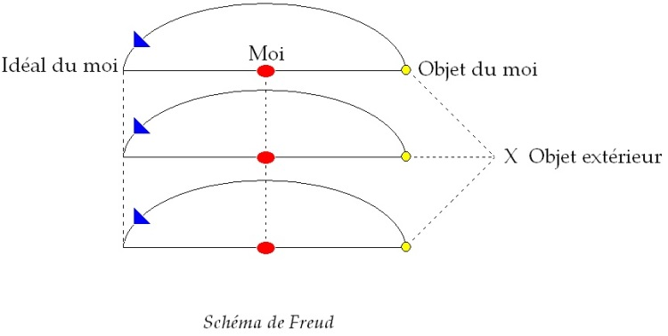

# Leçon 10 | 06 Février 1957

<!-- source-url: http://staferla.free.fr/S4/S4 LA RELATION.docx -->
<!-- seminar: s4 -->
<!-- lesson: 10 -->

<!-- id: s4-10-0001 -->

J’ai de temps en temps *des échos* de la façon dont vous recevez ce petit nouveau que j’apporte à chaque fois, du moins je l’espère.
La dernière fois j’ai fait un pas dans le sens de l’élucidation du *fétichisme* comme exemple particulièrement fondamental de
*la dynamique du désir*, et spécialement de *ce désir* qui est celui qui nous intéresse au plus haut chef, pour la double raison que *ce désir* est celui auquel nous avons affaire dans notre pratique, à savoir pas *un désir* construit, mais *un désir* avec tous ses paradoxes.

<!-- id: s4-10-0002 -->

De même nous avons affaire à un objet avec tous ses *paradoxes*, d’autre part, il est clair que la pensée freudienne est partie
de ces *paradoxes*, et en particulier pour le cas du désir elle est partie du *désir pervers*. II serait vraiment dommage de l’oublier
dans cette tentative d’unification ou de réduction en face des théories les plus naïvement intuitives auxquelles peut se rapporter « *La psychanalyse d’aujourd’hui »*.

<!-- id: s4-10-0003 -->

Pour reprendre les choses au niveau où nous les avons laissées la dernière fois, je dirais d’abord que ce petit pas que j’ai fait
a surpris certains qui déjà se satisfaisaient assez de l’idée de la théorie de l’amour telle que je vous la présente,
comme fondée sur le fait que ce à quoi le sujet s’adresse, c’est à *ce manque qui est dans l’objet*.

<!-- id: s4-10-0004 -->

Ceci avait fourni à certains déjà l’occasion de la perception, de la méditation qui en semblait suffisamment éclairante,
quoiqu’ils aient quelque trouble à s’apercevoir qu’à ce rapport sujet-objet il y a *un au-delà* et *un manque*.

<!-- id: s4-10-0005 -->

J’apportais la fois dernière une complication supplémentaire, à savoir encore un terme situé avant l’objet : *le voile*, *le rideau*, l’endroit de la projection imaginaire où apparaît quelque chose qui devient figuration de ce manque, et comme tel peut être
le point offert, le support qui s’ouvre à *quelque chose* qui là justement prend son nom : le désir, mais le désir en tant que pervers.
C’est sur le voile que le fétiche vient figurer précisément *ce qui manque au-delà de l’objet*.

<!-- id: s4-10-0006 -->

Cette schématisation est destinée à instaurer ces plans successifs qui doivent vous permettre dans certains cas
de vous y retrouver un peu mieux dans cette sorte de perpétuelle ambivalence et confusion, équivalence du oui avec le non,
du *dirigé dans un sens* avec le *dirigé exactement dans le sens contraire*, avec tout ce dont malheureusement, l’analyse et l’analyste usent habituellement pour se tirer d’embarras, sous le nom d’ambivalence.

<!-- id: s4-10-0007 -->

Tout à fait à la fin de ce que je vous ai dit la dernière fois à propos du *fétichisme*, je vous ai montré l’apparition comme d’une position complémentaire...
et qui aussi bien apparaît dans les phases de la culture fétichiste, voire dans les tentatives du fétichiste pour rejoindre cet objet dont il est séparé par ce quelque chose, dont bien entendu lui-même ne comprend pas la fonction ni le mécanisme
…de quelque chose qui peut s’appeler le symétrique, le répondant, le correspondant, le pôle opposé du fétichiste, à savoir
*la fonction du transvestisme*, c’est-à-dire ce en quoi le sujet s’identifie à *ce qui est derrière le voile*, et à *cet objet auquel il manque quelque chose*.

<!-- id: s4-10-0008 -->

*Le transvestiste* - les auteurs l’ont bien vu à l’analyse - est quelqu’un qui, comme ils le disent dans leur langage, *s’identifie à la mère phallique* en tant que d’autre part elle voile ce manque de *phallus*. Ce transvestisme nous fait aller très loin dans la question,
car aussi bien n’avons-nous pas attendu FREUD pour aborder la psychologie des vêtements.

<!-- id: s4-10-0009 -->

Dans tout usage du vêtement il y a quelque chose qui participe de la fonction du transvestisme, et si l’appréhension immédiate, courante, commune de la fonction du vêtement est de cacher les *pudenda* aux yeux de l’analyste, la question doit se *compliquer*
un tant soit peu, spécialement s’il y a quelqu’un qui doit s’apercevoir du sens de ce qu’il dit quand il parle de la mère phallique.

<!-- id: s4-10-0010 -->

Les vêtements ne sont pas seulement faits pour cacher ce qu’on en a, au sens d’« *en avoir ou pas* », mais aussi précisément
ce qu’on n’en a pas. L’une et l’autre fonction sont essentielles.

<!-- id: s4-10-0011 -->

Il ne s’agit pas essentiellement et toujours de cacher l’objet mais aussi bien *de cacher le manque d’objet*, simple application dans
ce cas de la dialectique *imaginaire* de ce qui est trop souvent oublié, à savoir de cette fonction et de cette *présence du manque d’objet*.

<!-- id: s4-10-0012 -->

Inversement, ce qui dans une sorte d’usage massif de la relation scoptophilique, est toujours impliqué comme allant de soi,
que le fait de se montrer est quelque chose qui est tout simple, qui est corrélatif de l’activité du « *voir* », du *voyeurisme*,
c’est aussi une dimension volontiers oubliée, qui est celle qui fait qu’on peut dire que le sujet ne se fait pas toujours
et en toute occasion simplement « *voir* », pour autant qu’il s’agit là de la relation corrélative et correspondante de cette activité
de « *voir* », de l’implication du sujet dans un souffle de capture visuelle.

<!-- id: s4-10-0013 -->

Il y a aussi dans la scoptophilie cette dimension supplémentaire de l’implication qui est exprimée dans l’usage de la langue
par la présence qui n’est qu’un signe du réfléchi, qui est celle aussi qui est impliquée dans la voie moyenne, dans d’autres formes du verbe, dans d’autres langues où elle existe, qui est de « *se donner à voir* ». Et si vous combinez l’une à l’autre ces dimensions :
*ce que le sujet donne à voir* dans tout un type d’activités qui sont là confondues avec la relation de *voyeurisme-exhibitionnisme,*
*ce que l’autre donne à voir en se montrant, c’est aussi autre chose que ce qu’il montre,* et qui est noyé dans ce qu’on appelle massivement
la relation scoptophilique.

<!-- id: s4-10-0014 -->

Les auteurs qui sont, sous leur apparente clarté, de très mauvais théoriciens, comme FENICHEL, mais qui ne sont pas
pour autant sans expérience analytique, s’en sont très bien aperçus. Si vous lisez les articles dont l’effort de théorisation aboutit
à un échec désespérant - comme tel ou tel des articles de FENICHEL - vous y trouvez quelquefois de fort jolies *perles cliniques*, et même une espèce de sentiment ou de pressentiment de tout un ordre de faits qu’il s’agit de grouper, et qui se groupent
par une espèce de flair que l’analyste prend heureusement dans son expérience, autour d’un thème ou d’un rameau choisi
de l’articulation analytique *des relations imaginaires fondamentales*.

<!-- id: s4-10-0015 -->

Vous voyez en effet, autour de la scoptophilie du transvestisme, tout ce dans quoi l’auteur sent, d’une façon plus ou moins obscure, une parenté, une communauté de tiges groupées, de faits qui se distinguent extrêmement bien les uns des autres.
Et en particulier c’est ainsi qu’en m’informant de toute cette *vaste et fade littérature*, nécessaire pour me rendre compte jusqu’à quel point *les analystes* ont pénétré dans une réelle articulation de ces faits, je me suis intéressé récemment à *un article* de FENICHEL paru dans le *Psychoanalytical journal* sur ce qu’il appelle *l’équation* « *girl* = *phallus* »[^20]. Lui-même nous a autorisé à le faire à propos
des équivalences dans la série des équations bien connues « *fèces* = *enfant* = *pénis* », c’est en effet une équation intéressante
qui n’est pas sans rapport avec l’équation que FENICHEL essaie de nous proposer, l’équation « *girl* = *phallus* ».

<!-- id: s4-10-0016 -->

On voit bien à ce propos se manifester un manque d’orientation qui nous laisse à tout instant pour donnée une logique exempte du manque d’orientation de certaines analyses théoriques. Nous voyons là *une série de faits* groupés autour de ces rencontres analytiques qui font que dès l’abord, l’enfant peut être tenu pour équivalent, pour égaler dans l’inconscient du sujet
\- spécialement féminin - le *phallus*. C’est-à-dire qu’en somme là est le *phylum* [^21] de tout ce qui se rattache au fait que l’enfant
soit donné à la mère comme une sorte de substitut, d’équivalent même du *phallus*.

<!-- id: s4-10-0017 -->

Mais à côté de cela il y a bien d’autres faits. Et le fait qu’ils soient rassemblés dans la même *parenthèse* avec *cet ordre de faits*
est assez surprenant. Quand j’ai parlé de l’enfant, il ne s’agissait pas spécialement de l’enfant féminin, mais ici l’article vise
très spécifiquement la fille, et assurément, il faut qu’il parte d’un certain nombre de traits bien connus dans la spécificité fétichiste ou quasi fétichiste de certaines perversions interprétées comme *l’équivalent du phallus* du sujet.

<!-- id: s4-10-0018 -->

C’est là quelque chose qui est de l’ordre des données analytiques, que la fille elle même, et d’une façon générale l’enfant, puisse se concevoir elle même, manifester par son comportement qu’elle se pose comme *l’équivalent du phallus*, à savoir qu’elle vit
la relation sexuelle comme étant cette relation qui fait qu’elle-même apporte au partenaire masculin son *phallus*,
qu’elle se situe quelquefois jusque dans les détails de sa position amoureuse privilégiée, comme quelque chose qui vient s’accoler, se pelotonner en un certain coin du corps de son partenaire. Voilà encore un autre genre de fait qui ne peut pas manquer de nous retenir et de nous frapper.

<!-- id: s4-10-0019 -->

Dans certains cas, aussi bien, le sujet masculin se donne à la femme lui-même comme étant *ce quelque chose qui lui manque*,
et lui apportant comme tel le *phallus* à titre de *ce qui lui manque* imaginairement parlant. C’est vers tout cela que semble pointer *l’ensemble des faits ici mis en relief*. Mais on peut voir aussi dans la façon de les rapprocher, de les mettre tous dans *une même équation*,
que l’on rassemble là des faits d’ordres extrêmement différents, puisque dans ces quatre ordres de relations
que je viens de dessiner, le sujet n’est absolument pas dans le même rapport avec l’objet soit qu’il apporte, soit qu’il donne,
soit qu’il désire, soit auquel même il se substitue.

<!-- id: s4-10-0020 -->

Une fois que nous avons l’attention attirée vers ces registres, nous ne pouvons pas ne pas voir que c’est bien au-delà
d’une simple exigence théorique qu’un auteur regroupe l’équivalence ainsi instituée, que la petite fille puisse être l’objet
d’un attachement prévalent pour tout un type de sujets, qu’une fonction mythique, si l’on peut dire, ne puisse se dégager à la fois de ces mirages pervers et de toute une série de constructions littéraires que nous pouvons grouper selon les auteurs,
sous des chefs plus ou moins illustres.

<!-- id: s4-10-0021 -->

Certains ont voulu volontiers parler d’« *un type* MIGNON ». Vous connaissez tous cette création de MIGNON,
cette bohémienne à la position bi–sexuée, comme très nettement GOETHE le souligne lui-même, et qui vit avec une sorte
de protecteur du type à la fois énorme et brutal, et manifestement super-paternel qui s’appelle HAFNER.
Il lui sert en somme de serviteur supérieur, mais en même temps elle est pour lui d’un grand besoin.

<!-- id: s4-10-0022 -->

GOETHE dit quelque part en parlant de ce couple : « *Hafner dont elle a le plus grand besoin, et Mignon sans laquelle il ne peut rien faire.* »
Nous retrouvons là une sorte de couple, entre ce qu’on peut dire la puissance à l’état massif, brutal, incarné, et d’autre part
ce *quelque chose* sans quoi la puissance est dépourvue d’efficacité, *ce qui manque à la puissance* elle-même, et ce qui est *en fin de compte* le secret de sa véritable puissance, c’est-à-dire ce *quelque chose* qui n’est rien qu’*un manque*, qui est le dernier point où vient
se situer la fameuse *magie*, toujours aussi attribuée d’une façon si confuse dans la théorie analytique à l’idée de la toute puissance.

<!-- id: s4-10-0023 -->

S’il y a quelque chose déjà qui n’est pas - contrairement à ce qu’on croit - dans le sujet : la structure de l’omnipotence, mais qui, comme je vous l’ai dit, est dans la mère, c’est-à-dire dans l’Autre primitif, c’est l’Autre qui est *tout-puissant*, mais en plus derrière ce *tout-puissant* il y a en effet ce dernier manque auquel est suspendue sa puissance, je veux dire que dès que le sujet aperçoit
dans l’objet dont il attend la *toute-puissance,* ce manque qui le fait lui-même un puissant, c’est encore *au-delà* qu’est reporté
le dernier ressort de la *toute-puissance*. À savoir là où quelque chose n’existe pas, au maximum : qui en lui n’est rien que
le symbolisme du manque, que fragilité, que petitesse, c’est là que le sujet a à situer le secret, le vrai ressort de *la toute-puissance*,
et c’est pour cela que ce type que nous appelons aujourd’hui « *le type Mignon* », mais qui est reproduit dans la littérature
à un très grand nombre d’exemplaires, est pour nous intéressant.

<!-- id: s4-10-0024 -->

Il y a trois ans, j’étais sur le point d’annoncer une conférence sur [*Le diable amoureux*](http://www.ebooksgratuits.com/ebookslib/cazotte3360.pdf) de CAZOTTE.
Il y a peu de choses aussi *exemplaires* de la plus profonde divination de la dynamique imaginaire que j’essaye de développer devant vous, et spécialement aujourd’hui. Je m’en suis souvenu comme d’une illustration majeure qui vient l’accentuer,
pour donner le sens de cet être magique *au-delà de l’objet* auquel peut s’attacher toute une série de fantasmes idéalisants.
Il s’agit d’un conte qui commence à Naples, dans une caverne où l’auteur se livre à l’évocation du diable, qui ne manque pas,
après les formalités d’usage, d’apparaître sous la forme d’une formidable tête de chameau pourvue tout spécialement
de grandes oreilles, et il lui dit avec la voix la plus caverneuse qui soit : « *Que veux-tu ?* », « *Che vuoi ?* »

<!-- id: s4-10-0025 -->

Je crois que cette interrogation fondamentale est bien ce qui nous donne de la façon la plus saisissante la fonction du *surmoi*.
Mais l’intérêt n’est pas que cette image du *surmoi* trouve ici une illustration saisissante, c’est de voir que c’est le même être
qui est supposé se transformer immédiatement une fois *le pacte conclu*, en un petit chien qui, par une transition qui ne surprend personne, devient un ravissant jeune homme, puis une ravissante jeune fille, les deux d’ailleurs ne cessant pas jusqu’à la fin
de s’entremêler dans une ambiguïté parfaite et de devenir pour un temps, pour celui qui est le narrateur de la nouvelle,
la source surprenante de toutes les félicités, de l’accomplissement de tous les désirs, de la satisfaction à proprement parler *magique* de tout ce qu’il peut souhaiter. Le tout cependant dans une atmosphère de fantasme, d’irréalité dangereuse,
de menace permanente qui ne manque pas de donner son accent à son entourage, et se résolvant à la fin à la façon
d’un immense mirage dans une rupture catastrophique de cette course de plus en plus accélérée et folle, qui représente
la relation avec le personnage aimé qui a un nom significatif, mais dont je ne me souviens pas. Tout ceci se termine par
une sorte de dissipation catastrophique du mirage au moment où le sujet retourne au château de sa mère, comme il convient.

<!-- id: s4-10-0026 -->

Un autre roman, de LATOUCHE, [*Fragoletta*](http://books.google.fr/books?id=pHctAAAAMAAJ&dq=latouche+fragoletta&printsec=frontcover&source=bn&hl=fr&ei=-NWdTIruOsfKjAfcw4igDQ&sa=X&oi=book_result&ct=result&resnum=4&ved=0CCEQ6AEwAw#v=onepage&q&f=false), présente un curieux personnage nettement transvestiste, puisque jusqu’au bout
et sans que rien ne soit finalement mis à jour, si ce n’est pour le lecteur, il s’agit d’une fille qui est un garçon et qui joue un rôle fonctionnellement analogue à celui que je viens de décrire pour être ce « *type Mignon* », avec des détails et des raffinements
qui aboutissent à un duel au cours duquel le héros du roman lui-même tue le personnage de *Fragoletta*, qui à ce moment là
se présente à lui comme garçon, sans qu’il la reconnaisse et montrant bien là l’équivalence d’un certain objet féminin avec l’*autre* en tant que rival, le même *autre* qui est celui dont il s’agit quand HAMLET tue le personnage du frère d’OPHÉLIE.

<!-- id: s4-10-0027 -->

Nous voici en présence d’un personnage *fétiche*, ou *fée* - c’est le même mot fondamentalement, les deux se rattachant à *feitiço*
en portugais, puisque c’est là qu’historiquement le mot « *fétiche* » est né, ce n’est rien d’autre que le mot « *factice* » -
d’un être féminin ambigu qui représente lui-même, et qui incarne en quelque sorte au-delà de la mère, *le phallus* qui lui manque,
et l’incarne d’autant mieux qu’il ne le possède lui-même pas, mais plutôt qu’il est tout entier engagé dans sa représentation.

<!-- id: s4-10-0028 -->

Nous voilà en présence d’une fonction de plus de la relation énamourante des voies perverses du désir, qui peuvent être là exemplaires à nous éclairer sur les positions qu’il s’agit de distinguer quand nous l’analysons. Nous voici donc conduits à poser enfin la question de ce qui est sous-jacent, perpétuellement mis en cause par cette critique même, à savoir la notion d’*identification* qui est latente, présente, émergente à tout instant, puis redisparaissant, dans l’œuvre de FREUD depuis l’origine, puisqu’il y a déjà des implications des *identifications* dans « *La science des rêves »*, et qui atteint son point d’explication majeur au moment
où FREUD écrit *Psychologie des masses et analyse du moi* dans lequel il y a *un chapitre* expressément consacré à *l’identification*.

<!-- id: s4-10-0029 -->

Ce chapitre a pour propriété de nous montrer - comme il arrive très souvent et comme c’est la valeur de l’œuvre de FREUD
de nous le montrer - la plus grande perplexité chez l’auteur. Il y a un article où FREUD nous avoue son embarras
voire son impuissance à sortir du dilemme posé par l’ambiguïté perpétuelle qui se pose à lui entre deux termes qu’il précise,
à savoir « *identification »* et « *choix de l’objet »*. Les deux apparaissant dans tellement de cas comme se substituant l’un à l’autre avec le plus déconcertant pouvoir de *métamorphose*, de façon telle que la transition même n’en est pas saisie, avec la nécessité pourtant évidente de maintenir la distinction des deux, car comme il le dit : c’est autre chose d’être *du côté de l’objet* ou *du côté du sujet*.
*Si un objet devient « objet de choix »,* il est bien clair que *ce n’est pas la même chose que s’il devient « support de l’identification du sujet ».*

<!-- id: s4-10-0030 -->

C’est là quelque chose de formidablement instructif en soi, et qui d’ailleurs aussitôt porte comme instruction la déconcertante facilité avec laquelle chacun semble s’en accommoder, et use de façon strictement équivalente de l’un et de l’autre au côté observation et théorisation, sans en demander plus. Quand on en demande plus, on produit un article comme celui de

<!-- id: s4-10-0031 -->

Gustav Hans GRABER[^22] : *Les deux espèces de mécanismes d’identification*, dans [*Imago* 1937](https://archive.org/details/Imago-ZeitschriftFuumlrPsychoanalytischePsychologieIhreGrenzgebiete_782), qui est bien la chose la plus étourdissante
qu’on puisse imaginer, car tout est résolu pour lui, semble-t-il, avec la distinction de *l’identification active* et de *l’identification passive*.

<!-- id: s4-10-0032 -->

Quand on y regarde de près il est impossible de ne pas voir - d’ailleurs lui-même s’en aperçoit - les deux pôles actif et passif
dans chaque espèce d’identification, de sorte qu’il nous faut bien revenir à FREUD, et en quelque sorte reprendre *point par point* la façon dont lui-même articule la question. Le chapitre VIII de cet ouvrage : « *[Psychologie collective et analyse du moi](http://classiques.uqac.ca/classiques/freud_sigmund/essais_de_psychanalyse/Essai_2_psy_collective/Freud_Psycho_collective.pdf) »*
succède immédiatement au chapitre qui est à proprement parler celui « *L’identification »*, et il commence par une phrase
qui remet tout de suite dans l’atmosphère de quelque chose d’autrement pur que ce que nous lisons d’habitude :

<!-- id: s4-10-0033 -->

« *L’usage linguistique reste, même dans ses caprices, toujours fidèle à une réalité quelconque.* »
\[*Der Sprachgebrauch bleibt selbst in seinen Launen irgendeiner Wirklichkeit treu*.\]

<!-- id: s4-10-0034 -->

Je voudrais relever au passage comment dans le chapitre précédent, FREUD a parlé de *l’identification*. Il commence en parlant
de *l’identification* au père comme d’un exemple, celui par où nous entrons de la façon la plus naturelle dans ce phénomène.
Nous arrivons au deuxième paragraphe, et voici un exemple des mauvaises traductions françaises des textes de FREUD.
Nous lisons dans le texte allemand :

<!-- id: s4-10-0035 -->

\[*Gleichzeitig mit dieser Identifizierung mit dem Vater, vielleicht sogar vorher, hat der Knabe begonnen, eine richtige Objektbesetzung der Mutter*
*nach dem Anlehnungstypus vorzunehmen.*\]

<!-- id: s4-10-0036 -->

« *En même temps que cette identification avec le père, peut-être aussi bien un peu plus tôt*...

<!-- id: s4-10-0037 -->

ce qui est traduit par : « *un peu plus tard* »* !*

<!-- id: s4-10-0038 -->

...*à ce moment le petit garçon commence à diriger vers sa mère ses désirs libidinaux.*

<!-- id: s4-10-0039 -->

et on peut se demander avec cette traduction si l’identification au père ne serait pas préalable.* *

<!-- id: s4-10-0040 -->

Nous en retrouvons un autre exemple dans le passage auquel je veux en venir ce matin et que je vous ai choisi comme
le plus condensé et le plus propre à vous montrer ce que j’ai appelé « *les perplexités de* FREUD ». Il s’agit de l’état amoureux
dans ses rapports avec *l’identification*, *l’identification*, fonction plus primitive - pour suivre le texte de FREUD - plus fondamentale en tant qu’elle comporte *un choix de l’objet*, mais *un choix de l’objet* qui ne manque pas de devoir être articulé d’une façon
qui est elle-même *très problématique*.

<!-- id: s4-10-0041 -->

Ce *choix de l’objet*, si profondément lié par toute l’analyse freudienne au *narcissisme,* cet *objet* qui est *une sorte d’autre moi dans le sujet*, pour aller au plus loin que l’on peut aller dans le sens que FREUD articule parfaitement, c’est donc de ça qu’il s’agit :
comment articuler cette différence de *l’identification* avec la *Verliebtheit* dans ses formations les plus élevées - au sens semble-t-il les plus pleines, que l’on appelle fascination, appartenance amoureuse - dans ses manifestations les plus élevées connues
sous le nom d’inféodation, ou d’appartenance amoureuse qu’il est facile de décrire.

<!-- id: s4-10-0042 -->

> \[*Im ersteren Falle hat sich das Ich um die Eigenschaften des Objekts bereichert, sich dasselbe nach Ferenczi’s Ausdruck « introjiziert »,*
> *im zweiten Fall ist es verarmt, hat sich dem Objekt hingegeben, dasselbe an die Stelle seines wichtigsten Bestandteils gesetzt.*\]

<!-- id: s4-10-0043 -->

Nous lisons dans la traduction française :

<!-- id: s4-10-0044 -->

« *Dans le premier cas, le moi s’enrichit des qualités de l’objet, s’assimile celui-ci*... »

<!-- id: s4-10-0045 -->

À la vérité, il faut lire simplement ce que FERENCZI traduit, à savoir : « *s’introjecte* » et c’est là la question de l’introjection
dans ses rapports avec l’identification.

<!-- id: s4-10-0046 -->

« ...*dans le second cas, il s’appauvrit, s’étant donné tout entier à l’objet, s’étant effacé devant lui*… »

<!-- id: s4-10-0047 -->

…traduit l’auteur français. Ce n’est pas tout à fait ce que dit FREUD :

<!-- id: s4-10-0048 -->

« ...*cet objet qu’il a posé à la place de son élément constituant.* »

<!-- id: s4-10-0049 -->

Ceci est tout à fait effacé dans cette phrase dont on ne voit pas qu’elle traduise une chose si articulée par « *s’étant effacé devant lui* ».

<!-- id: s4-10-0050 -->

Ici, FREUD s’arrête sur cette opposition entre :

<!-- id: s4-10-0051 -->

- ce que le sujet introjecte et dont il s’enrichit,

<!-- id: s4-10-0052 -->

- et d’autre part ce quelque chose qui lui prend quelque chose de lui-même et qui l’appauvrit, car un instant il s’est arrêté longuement auparavant sur ce qui se passe dans *l’état amoureux* comme étant ce quelque chose *où le sujet de plus en plus*
  *se dépossède -* au bénéfice de l’objet aimé - de tout ce qui est de lui-même, qui devient littéralement pris d’humilité,
  *d’une complète sujétion par rapport à l’objet de son investissement*.

<!-- id: s4-10-0053 -->

FREUD ici articule que cet objet au bénéfice duquel il s’appauvrit, est celui-là même qu’il place à la place de son élément constituant le plus important. C’est l’approche que FREUD fait du problème, il la poursuit en revenant en arrière,
car FREUD ne nous ménage pas ses mouvements, il s’avance et s’aperçoit que ce n’est pas complet, il va revenir et dire :
cette description fait apparaître des <u>*oppositions*</u> qui en réalité n’existent pas au point de vue économique.

<!-- id: s4-10-0054 -->

\[*Es handelt sich ökonomisch nicht um Verarmung oder Bereicherung, man kann auch die extreme Verliebtheit so beschreiben,*
*daß das Ich sich das Objekt introjiziert habe.*\]

<!-- id: s4-10-0055 -->

> « *Au point de vue économique, il ne s’agit ni d’enrichissement, ni d’appauvrissement, car même l’état amoureux extrême*
> *peut être conçu comme une introjection de l’objet dans le moi.* »

<!-- id: s4-10-0056 -->

La distinction suivante porterait peut-être sur des points essentiels :

<!-- id: s4-10-0057 -->

> \[*Im Falle der Identifizierung ist das Objekt verloren gegangen oder aufgegeben worden; es wird dann im Ich wieder aufgerichtet, das Ich verändert sich partiell nach dem Vorbild des verlorenen Objekts. Im anderen Falle ist das Objekt erhalten geblieben und wird als solches von seiten und auf Kosten des Ichs überbesetzt.*\]
>
> « *Dans le cas d’identification, l’objet se volatilise et disparaît pour reparaître dans le moi, lequel subit une transformation partielle d’après le modèle de l’objet disparu.Dans l’autre cas l’objet constitué se trouve doté de toutes les qualités par le moi et à ses dépens.* »

<!-- id: s4-10-0058 -->

C’est ce que nous dit le texte français. Pourquoi l’objet *se volatiliserait-il* et *disparaîtrait-il* pour *reparaître dans le moi*
après avoir subi une transformation partielle d’après le modèle de l’objet disparu ? Il vaut mieux se reporter au texte allemand.

<!-- id: s4-10-0059 -->

\[*Vielleicht trifft eine andere Unterscheidung eher das Wesentliche. Im Falle der Identifizierung ist das Objekt verloren gegangen.*\]

<!-- id: s4-10-0060 -->

« *Peut-être qu’une distinction autre serait l’essentiel. Dans le cas de l’identification, l’objet a été perdu.* »

<!-- id: s4-10-0061 -->

C’est la référence à cette notion fondamentale que l’on retrouve tout le temps depuis le début de la notion de la formation
de l’objet telle que FREUD nous l’explique, la notion comme fondamentale de *l’identification à l’objet perdu ou abandonné*.
Il ne s’agit donc pas d’objet qui « *se volatilise* » ni qui « *disparaît* », car justement il ne disparaît pas.

<!-- id: s4-10-0062 -->

> \[*Im Falle der Identifizierung ist das Objekt verlorengegangen oder aufgegeben worden; es wird dann im Ich wieder aufgerichtet, das Ich verändert sich partiell nach dem Vorbild des verlorenen Objekts. Im anderen Falle ist das Objekt erhalten geblieben und wird als solches von sehen*
>
> *und auf Kosten des Ichs überbesetzt. Aber auch hiegegen erhebt sich ein Bedenken. Steht es denn fest, daß die Identifizierung das Aufgeben*
>
> *der Objektbesetzung voraussetzt, kann es nicht Identifizierung bei erhaltenem Objekt geben ? Und ehe wir uns in die Diskussion dieser heikeln Frage einlassen, kann uns bereits die Einsicht aufdämmern, daß eine andere Alternative das Wesen dieses Sachverhaltes in sich faßt,*
>
> *nämlich ob das Objekt an die Stelle des Ichs oder des Ichideals gesetzt wird.*\]
>
> « *Il est alors de nouveau reérigé dans le moi, et le moi partiel se transforme partiellement d’après le modèle de l’objet perdu.*
>
> *Dans l’autre cas l’objet est demeuré conservé et comme tel est surinvesti de la part et aux dépens du moi.*
>
> *Mais cette distinction à son tour soulève une nouvelle réflexion : est-il bien sûr que l’identification suppose l’abandon*
>
> *de l’investissement de l’objet, ne peut-on aussi avoir une identification avec l’objet conservé ? Et avant que nous entrions dans*
>
> *cette discussion particulièrement épineuse, nous devons aussi un instant nous arrêter à cette considération que nous présentons*
>
> *qu’il y a une autre alternative dans laquelle peut se concevoir l’essence de cet état de choses, et qui est nommément que l’objet*
>
> *soit placé à la place du moi ou de l’idéal du moi.* »

<!-- id: s4-10-0063 -->

C’est un texte dont la démarche nous laisse fort embarrassés, il ne résulte semble-t-il, rien de bien net dans ces mouvements
en avant et en arrière où manifestement FREUD rend patent le fait que l’*ambiguïté* sur la place même que nous pouvons donner à *l’objet* dans ces différents moments d’allers et de retours, autour desquels il se constitue comme *un objet d’identification*
ou comme *objet de la capture amoureuse*, reste presque entier à l’état d’interrogation.

<!-- id: s4-10-0064 -->

Encore l’interrogation reste-t-elle posée, et c’est cela seulement que j’ai voulu vous mettre en relief, car nous nous trouvons là devant un des textes dont on ne peut pas dire que ce soit le texte *testamentaire* de FREUD, mais c’est l’un de ceux
où il est parvenu au sommet de son élaboration théorique.

<!-- id: s4-10-0065 -->

Essayons donc de reprendre le problème à partir des repères que nous nous sommes donnés dans l’élaboration
que nous tentons de faire ici *des rapports de la frustration avec la constitution de l’objet*. Il s’agit d’abord de concevoir le lien
que nous établissons communément dans notre pratique, dans notre façon de parler, entre *l’identification* et *l’introjection*.

<!-- id: s4-10-0066 -->

Vous l’avez vu apparaître dès le début du morceau de FREUD que je viens de vous lire.
Je vous propose ceci : la métaphore sous-jacente à l’introjection est une métaphore orale.

<!-- id: s4-10-0067 -->

Aussi bien qu’il s’agisse d’*introjection* ou d’*incorporation*…
ce dans quoi on se laisse glisser le plus communément dans toutes les articulations qui sont données
dans l’époque kleinienne par exemple, de la fameuse constitution des objets primordiaux qui se divisent
comme il convient en *bons* et *mauvais objets*, dans cette alternance de l’introjection des objets, tenue pour être quelque chose de simple, donné dans ce quelque chose qui serait ce fameux monde primitif sans limites
où le sujet ferait un tout de son propre englobement dans le corps maternel
…l’*introjection* est tenue là pour une fonction strictement équivalente et symétrique de celle de la *projection*.

<!-- id: s4-10-0068 -->

Aussi bien voit-on, dans l’usage qui en est fait, que l’objet est perpétuellement dans cette espèce de mouvement, de passage
du dehors vers le dedans, pour après être du dedans repoussé au dehors, quand il est devenu à l’intérieur trop intolérable,
qui laisse dans *une symétrie parfaite « introjection » et « projection »*.

<!-- id: s4-10-0069 -->

C’est très précisément contre cet abus qui est très loin d’être un abus freudien que va s’élever, entre autres choses, ce que je vais essayer d’articuler devant vous. Je crois *qu’il est strictement impossible de concevoir* - je ne dis pas simplement *dans la conceptualisation,* quelque chose d’ordonné dans les pensées, mais *dans la pratique, la clinique* - de concevoir les liens qu’il y a entre les phénomènes tels que des impulsions orales manifestes…
par exemple corrélatives de moments tournants de cette réduction symbolique de l’objet auxquels nous
nous attachons de temps en temps avec plus ou moins de succès chez des patients, ce *quelque chose* qui fait apparaître des impulsions boulimiques à tel tournant de la cure d’un fétichisme
…il est strictement impossible de concevoir cette évocation de la pulsion orale d’un certain moment, si nous nous tenons
à *la vague notion* qui sera toujours dans ces cas à notre disposition : à ce moment là, le sujet régresse nous dira-t-on, parce que, bien entendu il est là pour cela. Pourquoi ?

<!-- id: s4-10-0070 -->

Parce qu’au moment où il est en train de progresser dans l’analyse, c’est-à-dire d’essayer de prendre la perspective de son fétiche, il régresse. On peut toujours le dire, personne ne viendra vous contredire. Il est bien certain que l’évocation de *la pulsion*
\- comme chaque fois que *la pulsion* apparaît dans l’analyse ou ailleurs - doit être conçue :

<!-- id: s4-10-0071 -->

- par rapport à un certain registre,

<!-- id: s4-10-0072 -->

- par rapport à sa fonction économique,

<!-- id: s4-10-0073 -->

- par rapport au déroulement d’une certaine relation symboliquement définie.

<!-- id: s4-10-0074 -->

Et n’y a-t-il pas quelque chose qui nous permette de l’aborder, de l’éclairer dans le schéma primitif que je vous ai donné
de l’enfant, entre :

<!-- id: s4-10-0075 -->

- la mère comme support de la première relation amoureuse, en tant que l’amour est quelque chose de symboliquement structuré, en tant qu’elle est *l’objet d’appel*, et donc objet autant absent que présent, la mère dont les dons sont signe d’amour, et comme tels ne sont que tels et annulés de ce fait en tant qu’ils sont tout autre chose que signes d’amour,

<!-- id: s4-10-0076 -->

- et d’autre part *objet de besoin*, qu’elle lui présente sous la forme de son sein ?

<!-- id: s4-10-0077 -->

Ne voyez vous pas qu’entre les deux, c’est d’un équilibre et d’une compensation qu’il s’agit ?
Chaque fois qu’il y a *frustration* d’amour, la *frustration* se compense par la satisfaction du besoin.

<!-- id: s4-10-0078 -->

C’est pour autant que la mère manque à son enfant qui l’appelle, qui s’accroche, qui s’accroche à son sein et qui en fait quelque chose de plus significatif que tout ce quelque chose dont - tant qu’il l’a dans la bouche, et tant qu’il s’en satisfait - il ne peut pas être séparé, ce quelque chose aussi qui le laisse nourri, reposé, satisfait. Ici, la satisfaction du besoin est à la fois la compensation, et je dirais presque, commence à devenir l’alibi de la frustration d’amour.

<!-- id: s4-10-0079 -->

Dès lors, *la valeur prévalente que prend l’objet* - le sein dans l’occasion ou la tétine - est précisément fondée sur ceci : qu’un *objet réel*

<!-- id: s4-10-0080 -->

- prend sa fonction en tant que *partie de l’objet d’amour*,

<!-- id: s4-10-0081 -->

- il prend sa signification en tant que *symbolique*,

<!-- id: s4-10-0082 -->

- *il devient* comme *objet réel* *une partie de l’objet symbolique*, *la pulsion s’adresse à l’objet réel en tant que partie de l’objet symbolique*.

<!-- id: s4-10-0083 -->

C’est à partir de là que s’ouvre toute compréhension possible de *l’absorption orale*, *du mécanisme soi-disant régressif d’absorption orale*
en tant qu’il peut intervenir dans toute relation amoureuse.

<!-- id: s4-10-0084 -->

Car bien entendu, *cet objet* qui satisfait un besoin réel, à cette époque de cet objet, à partir du moment où un objet réel
a pu devenir élément de *l’objet symbolique *:

<!-- id: s4-10-0085 -->

- tout autre qui peut satisfaire un besoin réel peut venir se mettre à sa place,

<!-- id: s4-10-0086 -->

- et au premier rang ce qui est déjà symbolisé, mais qui comme parfaitement matérialisé est aussi un objet, et peut venir prendre cette place, à savoir *la parole*.

<!-- id: s4-10-0087 -->

C’est dans la mesure où la réaction orale à l’objet primitif de dévoration vient en compensation de la *frustration d’amour*,
dans la mesure où ceci est une réaction d’incorporation, que le modèle, le moule est donné à cette sorte d’incorporation
qui est *l’incorporation de certaines paroles* entre autres, et qui est à l’origine de la formation précoce de ce qu’on appelle le *surmoi*.
Ce que sous le nom de *surmoi*, le sujet incorpore, c’est ce quelque chose analogue à l’objet de besoin non pas en tant qu’il est
lui–même le don, mais en tant qu’il est le substitut à défaut du don, ce qui n’est pas du tout pareil.

<!-- id: s4-10-0088 -->

C’est à partir de là qu’aussi bien le fait de posséder ou de ne pas posséder un pénis peut prendre un double sens, entrer par deux voies d’abord très différentes dans *l’économie imaginaire* du sujet, car le pénis peut situer un objet à un moment donné quelque part dans la lignée et à la place de cet objet qu’est le sein et la tétine, ceci est une chose.

<!-- id: s4-10-0089 -->

Et il est une forme orale d’incorporation du pénis qui joue son rôle dans le déterminisme de certains symptômes et de certaines fonctions. Mais il est une autre façon dont le *pénis* entre dans cette économie, c’est non pas en tant qu’il peut être *objet*, si je puis dire, *compensatoire* de la frustration d’amour, mais en tant qu’il est justement au-delà de l’objet d’amour, qu’il manque à celui-ci.

<!-- id: s4-10-0090 -->

- L’un, appelons-le ce *pénis*, avec tout ce qu’il comporte, c’est tout de même *une fonction imaginaire* pour autant que c’est imaginairement qu’il est incorporé.
  <!-- -->

<!-- id: s4-10-0091 -->

- L’autre, c’est ce *phallus* en tant qu’il manque à la mère et qu’il est au-delà d’elle, au-delà de sa puissance d’amour, ce quelque chose qui lui manque et à propos duquel je vous pose la question depuis que j’ai commencé cette année ce séminaire : à quel moment le sujet découvre-t-il ce manque de façon telle qu’il puisse lui-même se trouver engagé à venir s’y substituer, c’est-à-dire à choisir une autre voie dans la retrouvaille de l’objet d’amour qui se dérobe, à savoir lui apporter lui-même son propre manque ?

<!-- id: s4-10-0092 -->

Cette distinction est capitale, elle va nous permettre aujourd’hui de poser un premier dessin de ce qui est au moins exigible
pour que ce temps se produise. Nous avons déjà *structuration symbolique*, *introjection* possible, et comme telle la forme
la plus caractérisée de l’identification freudienne primitive posée. C’est dans ce second temps que peut se produire la *Verliebtheit*. La *Verliebtheit* n’est absolument pas *concevable*, et elle n’est nulle part articulée - sinon dans le registre de la relation narcissique - autrement que la relation spéculaire telle que celui qui vous parle l’a définie et articulée.

<!-- id: s4-10-0093 -->

C’est en tant que, à une date qui est datable, qui n’est nécessairement pas avant le sixième mois, se produit cette relation
à *l’image de l’autre*, en tant qu’elle donne au sujet cette matrice autour de laquelle peut s’organiser pour lui ce que j’appellerais
« *son incomplétude vécue* », à savoir le fait qu’il est en défaut, qu’il peut, à lui, lui manquer quelque chose par rapport à cette image qui se présente comme totale, comme non seulement comblante pour lui, mais comme source de jubilation pour lui,
en tant qu’il y a une relation spécifique de l’homme à sa propre image.

<!-- id: s4-10-0094 -->

C’est en tant que l’*imaginaire* rentre en jeu, que sur la fondation de ces deux premières relations symboliques entre l’objet
et la mère de l’enfant peut apparaître ceci : qu’à la mère comme à lui, il peut *manquer imaginairement* quelque chose,
que quelque chose au-delà peut exister qui est un manque, dans la mesure où lui-même a l’appréhension et l’expérience,
dans la relation spéculaire, d’un manque possible.

<!-- id: s4-10-0095 -->

Ce n’est donc pas *au-delà* de la réalisation narcissique, et pour autant que commence à s’organiser cette *allée et venue* tensionnelle profondément agressive à l’autre autour duquel vont se *noyauter*, se *cristalliser* les couches successives de ce qui constituera le *moi*, que peut à ce moment s’introduire ce qui fait apparaître au sujet au-delà de ce qu’il constitue lui-même comme objet
pour sa mère, que peut apparaître cette forme que de toute façon *l’objet d’amour* est lui-même pris, captivé, retenu dans quelque chose que lui-même, en tant qu’objet, n’arrive pas à étreindre, à savoir cette nostalgie, à savoir ce quelque chose qui se rapporte à son propre manque.

<!-- id: s4-10-0096 -->

En fait tout ceci, au point où nous en sommes, repose sur le fait de transmission qui fait que nous supposons…
parce que c’est l’expérience qui nous l’impose, et parce que c’est une expérience où FREUD
est resté complètement adhérent jusqu’au dernier moment de ses formulations
…qu’aucune satisfaction par un objet réel quelconque qui vient s’y substituer, ne parvient jamais à *combler* ce manque qui fait
que dans la mère, à côté, la relation à l’enfant reste comme un point d’attache de son insertion *imaginaire* à ce manque du *phallus*.

<!-- id: s4-10-0097 -->

Et c’est dans la mesure où l’enfant, *le sujet*, accède, *après le second temps de l’identification imaginaire spéculaire,* à « *l’image du corps* » comme telle et en tant qu’elle est à l’origine et qu’elle donne la matrice de son *moi*, c’est en tant qu’à partir de là, déjà il a pu réaliser ce qui manque à la mère. Mais c’est une condition, une exigence préalable de cette expérience spéculaire de l’autre comme formant une totalité, par rapport à quoi il peut lui manquer quelque chose que le sujet apporte : au-delà de l’objet d’amour *ce manque* auquel il peut être amené *lui­même à s’y substituer*, auquel il peut se proposer *comme étant l’objet qui le comble*.

<!-- id: s4-10-0098 -->

Je pense que vous vous gardez dans l’esprit ceci, c’est que je vous ai amenés jusqu’à l’achèvement, à la proposition d’une « *forme* » que vous devez simplement *garder dans l’esprit* pour que nous puissions exactement reprendre les choses et vous montrer, cette « *forme* », à quoi elle répond d’ores et déjà. Ce que vous voyez se dessiner là, c’est une nouvelle dimension, une nouvelle propriété de ce qui vous est proposé dans l’actuel, dans le sujet achevé - quand les fonctions sont différenciées : *surmoi*, *idéal du moi*, *moi* - dans cette fonction de *l’idéal du moi*.

<!-- id: s4-10-0099 -->

Il s’agit de savoir comme FREUD l’a très bien vu et le dit à la fin de son article : ce que c’est que cet objet qui, dans la *Verlibtheit*,
vient se placer *à la place du moi ou de l’idéal du moi*. Jusqu’à présent, parce que j’ai dû, dans ce que je vous ai expliqué du *narcissisme*, mettre l’accent sur la formation idéale du *moi*…
je dis : la formation du *moi* en tant que c’est une formation idéale, que c’est à partir de l’*idéal du moi* que le *moi* se détache
…je ne vous ai pas assez articulé la différence qu’il y a.

<!-- id: s4-10-0100 -->

Mais si vous ouvrez simplement FREUD avec ses obscurités fécondes et ses schémas qui passent de mains en mains sans que personne n’ait songé un seul instant à les reproduire, que trouvez-vous dans ce qu’il nous donne à la fin de ce chapitre ?
Voilà où il place les *moi* des différents sujets. Il s’agit de savoir pourquoi les sujets communient dans le même idéal.

<!-- id: s4-10-0101 -->

<!-- id: s4-10-0102 -->

Il nous explique *qu’il y a identification de l’idéal du moi avec des objets* qui sont là dans le texte, tous ces objets sont *supposés être le même*, simplement si on regarde le schéma, on s’aperçoit qu’il a pris soin de relier ces trois objets qu’on pourrait *supposer être le même*, avec *un objet extérieur* qui est là *derrière tous les objets*.

<!-- id: s4-10-0103 -->

Ne trouvez vous pas là une frappante indication d’une direction, *une ressemblance* avec ce que je suis en train de vous expliquer,
à savoir que, à propos du *Ich-ideal*, ce n’est pas simplement d’un objet qu’il s’agit, mais de *quelque chose qui est au-delà de l’objet*
et *qui vient se refléter* dans ce cas - comme FREUD le dit - *non pas* purement et simplement *dans le moi*, qui sans doute en ressent quelque chose, peut s’en appauvrir, *mais dans* quelque chose qui est dans ses soubassements mêmes, dans ses premières formes, dans ses premières exigences, et pour tout dire le premier voile qui se projette sous la forme de *l’Idéal du moi*.

<!-- id: s4-10-0104 -->

Je reprendrai donc la prochaine fois les choses au point où je les laisse : rapport de l’*Idéal du moi*, du *fétiche*, de *l’objet*
en tant qu’il est *l’objet qui* *manque*, c’est-à-dire *le phallus*.

## Notes

[^20]: O. Fenichel : [Die Symbolische Gleichung : Maedchen = Phallus](http://www.archive.org/details/InternationaleZeitschriftFuumlrPsychoanalyseXxii1936Heft3). Internationale Zeitschrift fuer Psychoanalyse (1936), 22 : 299-314 ;

    The Symbolic Equation : Girl = Phallus. Psychoanal Quarterly, 1949, Vol. XVIII (3), pp. 303-324.

[^21]: Phylum : lignée d'espèces issues toutes d'une même souche. Latinisation moderne du grec ϕυ̃λον « classe, espèce ». (TLF)

[^22]: Gustav Hans Graber : « [*Die zweierlei Mechanismen der Identifizierung*](http://archive.org/details/Imago-ZeitschriftFuumlrPsychoanalytischePsychologieIhreGrenzgebiete_782) », *Imago. Zeitschrift für psychoanalytische Psychologie ihre Grenzgebiete und Anwendungen,*

    XXIII 1937, Heft 1, p. 24.
