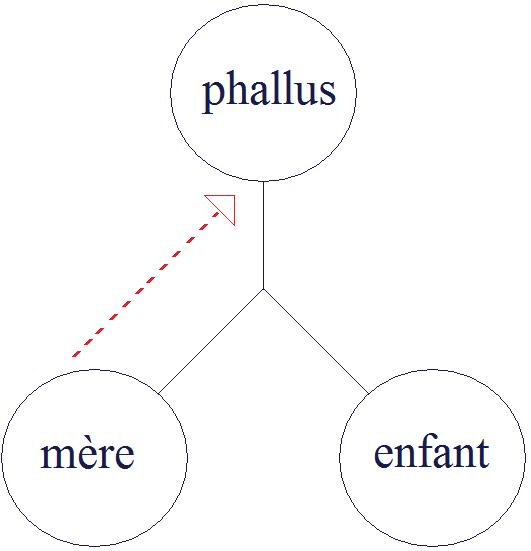

# Leçon 13 | 13 Mars 1957 (datée 06 Mars sur la sténotypie)

<!-- source-url: http://staferla.free.fr/S4/S4 LA RELATION.docx -->
<!-- seminar: s4 -->
<!-- lesson: 13 -->

<!-- id: s4-13-0001 -->

Nous avons tenté la dernière fois de réarticuler la notion de castration, en tous cas l’*usage* du concept dans notre pratique.
Je vous ai - dans la deuxième partie de cette leçon - situé le lieu où se produit l’interférence de *l’imaginaire* dans cette relation
de frustration infiniment plus complexe dans son usage que l’habitude qui unit l’enfant à la mère. Je vous ai dit que ce n’était
que de façon purement apparente, et de par l’ordre de l’exposé, que nous nous trouvions ainsi progresser d’avant en arrière, figurant - si je puis dire, et il ne convient pas d’y revenir - *des sortes d’étapes* qui se succéderaient dans une ligne de développement.

<!-- id: s4-13-0002 -->

Bien au contraire, il s’agit toujours de saisir ce qui, intervenant du dehors à chaque étape, remanie rétroactivement ce qui a été amorcé dans l’étape précédente pour la simple raison que l’enfant n’est pas seul. Non seulement il n’est pas seul, il y a l’entourage biologique, mais il y a encore un entourage beaucoup plus important que l’entourage biologique, il y a le milieu légal,
il y a *l’ordre symbolique* qui l’entoure.

<!-- id: s4-13-0003 -->

Ce sont les particularités de *l’ordre sym­bolique* - et je l’ai souligné au passage - qui donnent par exemple son accent, sa prévalence,
à cet élément de *l’imaginaire* qui s’appelle le *phallus*. Voilà donc où nous en étions arrivés, et pour amorcer la troisième partie
de mon exposé, je vous avais mis sur la voie de l’angoisse du petit Hans, puisque dès le départ nous avons pris ces deux *objets* exemplaires : l’objet fétiche et l’objet réel.

<!-- id: s4-13-0004 -->

C’est au niveau du petit Hans que nous essaierons d’*articuler* ce qui va être notre propos d’aujourd’hui. Tentative, non pas
de réarticuler la notion de *castration,* parce que Dieu sait si elle l’est puissamment et de façon insistante et répétée dans FREUD,
mais simplement d’en reparler, puisque depuis le temps qu’on évite d’en parler, il devient de plus en plus rare l’usage de ce « *complexe* » dans les observations, dans la référence qu’on peut en prendre.

<!-- id: s4-13-0005 -->

Abordons donc aujourd’hui cette notion de *castration* puisque nous enchaî­nons dans la ligne de notre discours de la fois précédente. De quoi s’agit-il à la fin de cette *phase pré-œdipienne* et à l’orée de l’*œdipe* ?

<!-- id: s4-13-0006 -->

- *Il s’agit que l’enfant assume ce phallus en tant que signifiant, et d’une façon qui le fasse instrument de l’ordre symbolique des échanges*
  qui préside à la constitution des lignées.

<!-- id: s4-13-0007 -->

- Il s’agit en somme qu’il soit confronté à cet *ordre* qui va faire dans l’*œdipe*, de la fonction du père le pivot du drame.

<!-- id: s4-13-0008 -->

Ça n’est pas si simple. Tout au moins vous en ai-je dit jusqu’à présent assez sur ce sujet pour qu’en vous disant
« *ça n’est pas si simple* », quelque chose réponde en vous « *en effet le père n’est pas si simple* ». La fonction de *l’existence sur le plan symbolique* dans *le signifiant* « *père* », avec tout ce que ce terme comporte de profondément problématique, pose la question
de la façon dont cette fonction est venue au centre de *l’organisation symbolique*.

<!-- id: s4-13-0009 -->

Ceci nous laisse à penser que nous aurons quelques questions à nous poser quant à ces 3 aspects de la fonction paternelle \[S.I.R.\].
Nous avons déjà appris…
et ceci dès la 1ère année de nos séminaires, celle où la deuxième partie a été consacrée à l’étude de *L’Homme aux loups*
…à distinguer l’incidence paternelle dans le conflit sous le triple chef : du *père Symbolique*, du *père Imaginaire*, du *père Réel*,
et nous avons vu qu’il était impossible de s’orienter dans l’observation - en particulier dans le cas de *L’Homme aux loups -*
sans faire cette distinction essentielle.

<!-- id: s4-13-0010 -->

Essayons d’aborder, au point où nous en sommes parvenus, cette introduction dans l’œdipe qui est ce qui se propose
dans l’ordre chronologique à l’enfant. En somme nous pourrions dire que nous voyons l’enfant là où nous l’avons laissé,
dans cette position de leurre où il s’essaie auprès de sa mère, mais non pas - vous ai-je dit - de leurre où il serait complètement impliqué, de leurre simple, au sens où dans le jeu de *la parade sexuelle* nous pouvons - nous qui sommes au dehors -
nous apercevoir que *les éléments imaginaires qui captivent l’un des partenaires grâce aux apparences de l’autre*, *ce quelque chose*
dont nous ne savons pas jusqu’à quel point les sujets en agissent eux-mêmes comme d’un leurre, encore que nous sachions
que nous, nous pourrions le faire à l’occasion, c’est-à-dire présenter une simple armoirie au désir du simple adversaire.

<!-- id: s4-13-0011 -->

Ici ce leurre dont il s’agit est très nettement manifeste dans les actions, activités mêmes que nous observons chez le petit garçon, par exemple les activités séductrices à l’endroit de sa mère. Quand il s’exhibe, ce n’est pas pure et simple monstration,
c’est monstration *de lui-même par lui-même* à la mère qui existe comme un tiers, et avec surgissement derrière la mère
de quelque chose qui est la bonne foi, ce à quoi la mère peut être prise si l’on peut dire. C’est déjà toute une trinité,
voire quaternité intersubjective qui s’ébauche. Mais de quoi s’agit-il en fin de compte ?

<!-- id: s4-13-0012 -->

Si nous prenons ici les choses au point où nous les avons laissées, c’est qu’en somme dans l’œdipe, il s’agit que le sujet
soit lui-même pris à ce leurre de façon telle qu’il se trouve engagé dans un ordre existant qui lui, est différent du leurre *psychologique* par où il y est entré et où nous l’avons laissé.

<!-- id: s4-13-0013 -->

Car en fin de compte, si l’œdipe a *la fonction normativante* de la théorie analytique, rappelons-nous aussi que notre expérience
nous apprend que *cette fonction normativante* ne se suffit pas d’aboutir au fait que le sujet ait un choix objectal,
mais qu’il ait *un choix d’objet* hétérosexuel et nous savons bien qu’il ne suffit pas d’être hétérosexuel pour l’être suivant les règles.

<!-- id: s4-13-0014 -->

Nous savons qu’il y a toutes sortes de formes d’hétérosexualité apparente, et qu’à l’occasion la relation franchement hétérosexuelle peut receler une atypie positionnelle qui nous la fera bien voir à l’investigation analytique comme dérivée
d’une position franchement homosexualisée par exemple. Il faut donc que non seulement le sujet, après l’œdipe,

<!-- id: s4-13-0015 -->

aboutisse à l’hé­térosexualité, mais il faut qu’il y aboutisse d’une façon telle qu’il se situe cor­rectement par rapport à la fonction du père, quel qu’il soit, garçon ou fille, et ceci est le centre de toute la problématique de l’œdipe.

<!-- id: s4-13-0016 -->

Disons-le tout de suite et parce que nous l’avons déjà indiqué par notre façon d’aborder cette année la relation d’objet…
et FREUD l’articule expressément dans son article sur la sexualité féminine
…en fin de compte, pris sous cet angle et si l’on peut dire sous l’angle de vue pré-œdipien, la problématique de *la femme*
est beaucoup plus simple. Si elle apparaît beaucoup plus compliquée dans FREUD, c’est à dire dans l’ordre où il l’a découverte,
c’est précisément parce qu’il a découvert d’abord, et non sans raison, l’œdipe, et que d’ailleurs il est tout à fait normal
de prendre les choses ainsi.

<!-- id: s4-13-0017 -->

Parce que s’il y a quelque chose qui est *pré-œdipien*, c’est parce que d’abord nous avons posé l’œdipe et nous ne pouvons parler
de cette plus grande simplicité de la position féminine au niveau du développement que nous pouvons arrêter comme
*pré-œdipien* que parce que d’abord nous savons que nous devons aboutir à la structure complexe de l’œdipe. Ceci dit, en effet pour la femme nous pourrions dire qu’il ne s’agit que du glissement de ce *phallus* qu’elle a plus ou moins situé, approché dans l’*ima­ginaire* où il se trouve, dans l’au-delà de la mère, dans la découverte progressive de *l’insatisfaction foncière* qu’éprouve la mère dans la relation mère-enfant elle-même.

<!-- id: s4-13-0018 -->

Il s’agit *du glissement de ce phallus de l’imaginaire au réel*, et c’est bien ce que FREUD nous explique :
quand il nous dit que dans cette nostalgie du *phallus* originaire, à ce niveau *imaginaire* où il commence à se produire
chez la petite fille dans la référence spéculaire à son semblable, autre petite fille ou petit garçon, quand il nous dit que l’*enfant*
va être le substitut du *phallus*, en réalité c’est une forme un peu abrégée de saisir ce qui se passe dans le phénomène observé.

<!-- id: s4-13-0019 -->

<!-- id: s4-13-0020 -->

Et si vous voyez *la position* telle que je l’ai dessinée : ici l’*imaginaire*, c’est-à-dire *le désir du phallus chez la mère*, et l’enfant qui est
notre centre, qui a à faire la découverte de cet *au-delà*, de ce *manque* dans l’objet maternel, c’est bien évidemment pour autant
qu’à un moment, la situation dans une des issues possibles, pivote autour de l’enfant, à savoir à partir du moment où le sujet, l’enfant, trouve à saturer la situation, à en sortir en la concevant elle-même comme possible.

<!-- id: s4-13-0021 -->

Mais ce qui est effectivement ce que nous trouvons dans le fantasme de la petite fille et aussi du petit garçon, c’est que
pour autant que la situation pivote autour de l’enfant, la petite fille trouve alors le pénis réel là où il est, au-delà de l’enfant,
dans celui qui peut lui donner l’enfant, dans le père nous dit FREUD. Et c’est bien en tant qu’*elle ne l’a pas* comme appartenance, et même nettement que sur ce plan elle y renonce, qu’elle pourra l’avoir comme don du père.

<!-- id: s4-13-0022 -->

Et c’est bien pourquoi *c’est par cette relation au phallus que la petite fille*, nous dit FREUD, *entre dans l’œdipe*, et comme vous le voyez d’une façon simple, il n’aura plus par la suite qu’à se glisser par une sorte d’*équivalence*, c’est *le terme même* que FREUD emploie.
La petite fille sera suffisamment introduite à l’œdipe pour réaliser ce qui est suffisant, je ne dis pas qu’il ne puisse pas y en avoir beaucoup plus et par là toutes les anomalies dans le développement de la sexualité féminine, mais d’ores et déjà ait des rapports avec cette fixation au père comme porteur du pénis réel, celui qui peut donner réellement l’enfant.

<!-- id: s4-13-0023 -->

C’est déjà suffisamment consistant pour elle pour qu’en fin de compte on puisse dire que si l’œdipe par lui-même apporte
toutes sortes de complications voire d’impasses dans *le développement de la sexualité féminine*, inversement cet œdipe
en tant que chemin d’intégration dans la position hétérosexuelle typique est beaucoup plus simple pour la femme.

<!-- id: s4-13-0024 -->

Ce dont nous n’avons évidemment pas à nous étonner pour autant que l’œdipe est essentiellement *androcentrique* ou *patrocentrique*, dissymétrie dont il faut toutes sortes de considérations particulières quasi his­toriques pour nous faire apercevoir la prévalence sur le plan *sociologique*, *eth­nographique*, de l’expérience individuelle qui permet d’analyser la découverte freudienne.

<!-- id: s4-13-0025 -->

Inversement, là il est bien clair que nous voyons que la femme est en position, si l’on peut dire…
puisque j’ai parlé d’ordonnance, *d’ordre symbolique* ou d’ordination subordonnée
…qu’ici, ce qui est pour elle objet de son amour, je dis *son amour*, c’est-à-dire *objet de sentiment* qui s’adresse à proprement parler
à l’élément de *manque dans l’objet*, en tant que c’est par la voie de ce *manque* qu’elle a été conduite à cet objet qui est le père,
celui-ci devient « *celui qui donne »* l’objet de satisfaction, l’objet de la relation naturelle de l’enfantement.

<!-- id: s4-13-0026 -->

Il ne s’en faut à partir de là, pour elle, que d’un peu de patience pour qu’au père se substitue celui qui remplira exactement
le même rôle, le rôle de père. Ceci comporte quelque chose sur lequel nous reviendrons et qui donne son style particulier
au développement du *surmoi féminin*, c’est qu’il y a une espèce de balance entre ce qu’on a appelé très justement l’importance,
la prévalence de *la relation narcissique* dans le développement de la femme.

<!-- id: s4-13-0027 -->

Mais que si en effet ce renoncement une fois fait, le *phallus* est abjuré comme appartenance, il devient - pour autant qu’il est
de l’appartenance de celui auquel dès lors elle attache son amour, le père dont elle attend effectivement cet enfant -
il met la femme dans une dépendance de ce qui dès lors n’est plus pour elle que ce qui doit lui être donné dans cette dépendance très *particulière* qui, paradoxalement - comme l’ont remarqué les auteurs - fait naître dans le développement à un moment donné les fixations proprement narcissiques chez l’être le plus intolérant à une certaine frustration. Nous y reviendrons peut-être
plus tard quand nous reparlerons de l’idéal monogamique chez la femme.

<!-- id: s4-13-0028 -->

C’est aussi bien d’ailleurs autour de cette simple réduction de la situation *qui identifie l’objet de l’amour et l’objet qui donne la satisfaction* que se situe dans un développement qu’on peut qualifier de *normal*, ce côté spécialement fixé, voire arrêté - précocement arrêté -
du développement chez la femme, dont FREUD dans certains passages et à certains tournants de ses écrits prend un ton
si singulièrement misogyne pour se plaindre amèrement de la grande difficulté qu’il y a, au moins pour certains sujets féminins,
à les faire bouger, à les mobiliser d’une espèce de morale dit-il « *du potage et des boulettes* », de ce *quelque chose* de si impérieusement exigeant quant aux satisfactions à tirer de l’analyse elle-même par exemple. Je ne fais là qu’indiquer un certain nombre d’*amorces*, et en somme pour vous dire que nous aurons à revenir sur le développement apporté par FREUD sur la sexualité féminine.

<!-- id: s4-13-0029 -->

C’est au garçon que nous voulons nous attacher aujourd’hui, pour la raison que si pour lui l’œdipe nous paraît beaucoup plus clairement destiné à lui per­mettre l’identification à son propre sexe - il se produit en somme dans la relation idéale,
dans la relation imaginaire au père - inversement le but vrai de l’œdipe, qui est sa juste situation par rapport à *la fonction du père*,
c’est-à-dire qu’il accède lui-même un jour à cette position complètement paradoxale et problé­matique qui est *d’être un père,*

<!-- id: s4-13-0030 -->

ceci présente une montagne de difficultés. Or précisément, ce n’est pas parce qu’on n’a pas vu cette montagne qu’on s’in­téresse de moins en moins à l’œdipe, c’est parce que justement on l’a vue, et parce qu’on l’a vue on préfère lui tourner le dos.

<!-- id: s4-13-0031 -->

N’oublions pas qu’en somme *toute l’interrogation freudienne*…
non seulement dans la doctrine, mais dans l’expérience de FREUD lui–même, que nous pouvons trouver retracée à travers les confidences qu’il nous fait, ses rêves, le progrès de sa pensée, tout ce que nous savons maintenant de sa vie, de ses habitudes, même de ses attitudes à l’intérieur de sa famille, que Monsieur JONES nous rapporte d’une façon plus ou moins complète mais certaine
… *toute l’interrogation freudienne* se résume à ceci :

<!-- id: s4-13-0032 -->

« *Qu’est-ce que c’est qu’être un père ? ».*

<!-- id: s4-13-0033 -->

Ce fut pour lui *le problème central*, le point fécond à partir duquel toute sa recherche est véritablement orientée.
Observez également que si ceci est problème pour chaque *névrosé*, c’est aussi un problème pour chaque *non névrosé* dans le cours de son expérience infantile. *Qu’est-ce qu’un père ?* Ceci est une façon d’aborder le problème du *signifiant* du père.
Mais n’oublions pas qu’il s’agit aussi que les sujets au bout du compte le deviennent, et poser la question « *Qu’est-ce qu’un père ?* » c’est encore autre chose que être soi-même un père, accéder à la position paternelle.

<!-- id: s4-13-0034 -->

Regardons-y de près : si tant est que pour chaque homme l’accession à cette position paternelle est une *foi*, une *quête* - on peut
se poser la question - il n’est pas impensable de se dire que finalement jamais personne ne l’a vraiment complètement été,
car dans cette dialectique nous supposons - et il faut partir de cette supposition - qu’il y a quelque part quelqu’un

<!-- id: s4-13-0035 -->

qui peut assumer plei­nement *la position du père* et, lui, peut répondre : je le suis, père. C’est une supposition qui est essentielle
à tout le progrès de la dialectique œdipienne mais ça ne tranche en rien la question de savoir quelle est la position particulière, intersubjective, de celui qui, pour les autres, et spécialement pour l’enfant, remplit ce rôle.

<!-- id: s4-13-0036 -->

Repartons donc du petit Hans. C’est un monde cette observation ! C’est celle que j’ai laissée en dernier, et ce n’est pas pour rien,

<!-- id: s4-13-0037 -->

des *Cinq Psy­chanalyses*.

<!-- id: s4-13-0038 -->

Que nous donnent les premières pages qui sont très précisément au niveau où je vous avais laissés la dernières fois ?
Ce n’est pas sans raison que FREUD nous présente les choses *dans cet ordre*, la question est celle de ce *Wiwimacher* que l’on traduit en français par *fait-pipi*. Il ne s’agit - je ne parle que de la façon dont les choses sont présentées littéralement par FREUD - que *des questions* que se pose le petit Hans concernant non pas simplement *son fait-pipi*, mais *les fait-pipi* des êtres vivants, dit FREUD, et spécialement des êtres vivants plus grands que lui.

<!-- id: s4-13-0039 -->

Vous avez vu les remarques pertinentes concernant l’ordre de l’enfant, mais dans l’ordre, *c’est à d’abord sa mère qu’il pose la question* : « *As-tu aussi un fait-pipi ?* » . Ce que lui répond sa mère, nous en reparlerons, et Hans laisse échapper à ce moment-là :
« *Oui, j’avais seulement pensé...* », c’est-à-dire qu’il est justement en train de mijoter pas mal de choses.

<!-- id: s4-13-0040 -->

Il repose la question ensuite à son père, il se réjouit ensuite d’avoir vu le *fait-pipi* du lion ce qui n’est pas tout à fait par hasard,
et dès ce moment là, c’est-à-dire avant l’apparition de la phobie, il marque nettement que si sa mère doit avoir ce *fait-pipi*
comme elle le lui affirme - non à mon avis sans quelque impudence - ça devrait se voir.

<!-- id: s4-13-0041 -->

Car un soir, qui n’est pas très loin du temps de cette interrogation, il la guette littéralement en train de se déshabiller lui faisant remarquer que si elle en avait un, il devrait être aussi grand que celui d’un *cheval*. La notion de *Vergleichung* qu’on traduit
en français par *comparaison* ou *comparé*, nous dirons presque que c’est le mot *péréquation* qui nous sem­blerait être là le meilleur,

<!-- id: s4-13-0042 -->

tout au moins en économie sinon en stricte tradition, cette sorte d’effort de *péréquation* entre ce que nous pouvons appeler
dans sa perspective phallicique imaginaire, celle où nous l’avons laissée la dernière fois, il s’agit d’une péréquation
entre une sorte d’*objet absolu*, le *phallus*, et sa mise à l’épreuve du *réel*.

<!-- id: s4-13-0043 -->

II ne s’agit pas d’un « *tout ou rien* » avec lequel le sujet joue jusque là. Avec le jeu de *bonneteau*, le jeu de *cache-cache,*
il n’est jamais là où on le cherche, jamais là où on le trouve, il s’agit maintenant de savoir où il est vraiment.

<!-- id: s4-13-0044 -->

Il y a là toute la distance à franchir qui sépare celui qui fait semblant ou qui joue à faire semblant, et ce n’est pas pour rien que, un peu plus loin dans l’observation, quand le petit Hans fera un rêve - le premier rêve nous disent FREUD et ses parents -

<!-- id: s4-13-0045 -->

où intervient un élément de déformation, un dépla­cement, ce sera justement par l’intermédiaire d’un *jeu de gage*.

<!-- id: s4-13-0046 -->

Si vous suivez d’ailleurs toute cette *dialectique imaginaire*, si vous vous en souvenez telle que je l’ai abordée lors de ces dernières leçons, vous serez frappés de voir qu’elle est là, jouant à la surface, à cette étape *pré-phobique* du développement du petit Hans.
Tout y est jusqu’à y compris *les enfants fantasmatiques* : tout d’un coup, après avoir eu sa petite sœur, il adopte un tas de *petites filles imaginaires* auxquelles il fait tout ce qu’on peut faire aux enfants.

<!-- id: s4-13-0047 -->

Le jeu, à proprement parler *imaginaire*, est véritablement rassemblé au grand complet, presque sans intention. Il s’agit de toute
la distance à franchir qui sépare celui qui fait semblant de celui qui sait qu’il a la puissance. Qu’est-ce que nous donne un premier abord de la relation œdipienne ? C’est ceci : qu’il y a à ce moment là ce que nous voyons jouer sur le plan de cet acte comparé, c’est que nous pouvons concevoir que *le jeu se continue sur le plan du leurre, sur le plan imaginaire*, que simplement l’enfant adjoint à ses dimensions le modèle maternel, l’image plus grande mais essentiellement homogène.

<!-- id: s4-13-0048 -->

Il reste que si c’est ainsi que *s’engage la dialectique de l’œdipe*, il n’aura jamais affaire en fin de compte qu’à un double de lui-même, un double agrandi de cette introduction parfaitement concevable de l’image maternelle sous la forme idéale du moi,

<!-- id: s4-13-0049 -->

nous restons dans la dialectique imaginaire, dans la dia­lectique spéculaire du rapport du sujet au petit autre dont la sanction
ne nous sort pas de cet « *ou bien...* - *ou bien*... », « *ou lui ou moi* », qui reste lié à *la première dialectique symbolique*, celle *de la présence*
*ou de l’absence*. Nous ne sortons pas du jeu de *pair ou impair*. Nous ne sortons pas du plan du *leurre.*

<!-- id: s4-13-0050 -->

Et en fin de compte nous savons - et nous le savons par la face tant théorique qu’exem­plaire - nous voyons uniquement sortir de cela *le symptôme*, la manifestation de l’angoisse nous dit FREUD. Et FREUD souligne au début de l’observation
du petit Hans, qu’il convient de bien séparer *l’angoisse,* de *la phobie*. Il y a là deux choses qui se succèdent et sans aucun doute, non sans raison, l’un vient au secours de l’autre, l’objet phobique vient remplir une fonction sur le fond de l’angoisse.

<!-- id: s4-13-0051 -->

Mais sur le plan *imaginaire*, rien ne nous permet de concevoir le saut qui fasse sortir l’enfant de ce jeu de leurre devant la mère, quelqu’un qui est *tout* ou *rien*, *celui qui suffit* ou *celui qui ne suffit pas*. Assurément du seul fait que la question est posée, elle reste
sur le plan de la foncière insuffisance. C’est là le schéma premier de la notion de l’entrée dans *le complexe d’Œdipe*, la rivalité
quasi fraternelle avec le père, sur le plan que nous sommes amenés à nuancer beaucoup plus qu’il n’est communément articulé.

<!-- id: s4-13-0052 -->

*Cette agressivité dont il s’agit* est une agressivité du type de celles qui entrent en jeu *dans la relation spé*culaire, dans cet *ou moi ou l’autre* qui est toujours défini comme en étant le ressort fondamental, et d’autre part la fixation reste complètement, à celle qui est devenue l’objet réel après les premières frustrations, c’est-à-dire la mère. C’est parce qu’existe cette étape, plus exactement
ce vécu central essentiel de l’œdipe sur le plan *imaginaire*, que l’œdipe se répand dans toutes ses consé­quences névrosantes, retrouvées dans mille aspects de la réalité analytique.

<!-- id: s4-13-0053 -->

C’est par là en particulier que nous voyons entrer un des premiers termes de l’ex­périence freudienne, cette sorte de dégradation de la vie amoureuse à laquelle FREUD a consacré une étude spéciale qui est liée à ceci : qu’en raison de l’at­tachement permanent à cet *objet réel*, à ce *primitif objet réel de la mère* en tant que frustrante, aucun objet féminin à partir de là ne sera plus
lui aussi, que quelque chose - *par rapport à la mère* - de dévalorisé, un substitut, un mode brisé, réfracté, toujours partiel
par rapport à l’objet maternel premier. Et nous reverrons un peu plus tard ce qu’il convient d’en penser.

<!-- id: s4-13-0054 -->

N’oublions pas pourtant que si *le complexe d’Œdipe* peut avoir ses consé­quences perdurables quant au ressort *imaginaire*

<!-- id: s4-13-0055 -->

qu’il fait intervenir, ce n’est pas là tout. N’oublions pas que normalement - et ceci dès le départ de la doctrine freudienne -
c’est dans la nature du *complexe d’Œdipe* de se résoudre, et quand FREUD nous en parle, il nous dit qu’assurément ce que
nous pouvons concevoir de la mise *à l’arrière plan* de l’hostilité au père, c’est quelque chose que nous pouvons légitimement
lier à un refoulement.

<!-- id: s4-13-0056 -->

Mais dans la même phrase, il tient à souligner que c’est là une occasion de plus pour nous de toucher du doigt que la notion
de refoulement s’applique toujours à une articulation *particulière* de l’histoire, et non pas à une relation permanente.
Il dit : je veux bien que par exception on applique ici le terme de refoulement, mais entendez bien, nous dit-il, qu’il s’agit normalement à cet âge - entre cinq ans et cinq ans et demi où se produit le déclin du *complexe d’Œdipe -* de l’annulation
et de la destruction du complexe œdipien.

<!-- id: s4-13-0057 -->

Il y a quelque chose d’autre que ce que nous avons décrit jusqu’à présent, qui serait en quelque sorte l’effacement, l’atténuation *imaginaire* d’une relation foncièrement en elle-même perdurable :

<!-- id: s4-13-0058 -->

- il y a vraiment crise,

<!-- id: s4-13-0059 -->

- il y a vraiment révolution,

<!-- id: s4-13-0060 -->

- il y a vraiment quelque chose qui est ce qui laisse derrière lui ce résultat, et ce résultat c’est la formation de quelque chose de particulier, de très précisément daté dans l’inconscient, à savoir la formation du surmoi.

<!-- id: s4-13-0061 -->

Et c’est ici que nous sommes confrontés avec la nécessité de faire surgir quelque chose de nouveau, d’original et de neuf,
et qui ait sa solution propre dans la relation œdipienne. Pour le voir il n’est besoin que d’user de ce qui est *notre schéma habituel*,
à savoir que, au point où nous en étions parvenus la dernière fois : *l’enfant offre ici à la mère l’objet imaginaire du phallus*
pour lui donner sa satisfaction complète, et ceci *sous forme de leurre*.

<!-- id: s4-13-0062 -->

C’est-à-dire en faisant intervenir auprès de la mère cet Autre qui est en quelque sorte le témoin, celui qui voit l’ensemble
de la situation, ce terme sans lequel aucune exhibition du petit garçon devant la mère n’a son sens, simplement qui est impliqué par le seul fait que ce que nous décrivons de la présentation, voire de l’offrande que fait le petit garçon à sa mère,
c’est bien évidemment là, au niveau de cet Autre qu’il doit se produire pour que l’œdipe existe, qu’il doit produire la présence
de quelque chose qui, jusque là, n’était pas dans le jeu, c’est-à-dire quelqu’un qui toujours, et en toute circonstance,
est en posture de jouer et de gagner.

<!-- id: s4-13-0063 -->

Le schéma du jeu de gage est là pour nous dire entre mille autres traits…
qu’on peut lire dans les observations, qu’on peut voir jouer dans l’activité même de l’enfant à cette étape
…est là pour nous montrer qu’il s’agit bien en effet d’un moment où le jeu, qu’on trouve sous mille formes dans le cas
du petit Hans, que l’on retrouve dans sa façon tout d’un coup d’aller s’isoler dans le noir dans un petit *closet* qui est celui-là même qui devient le sien propre, alors que jusqu’à ce moment-là il était dans celui de tout le monde, il y a mille traits, il y a un moment où tout oscille autour du passage du jeu.

<!-- id: s4-13-0064 -->

Il y a la notion de quelque chose qui ajoute à la dimension qu’on attendait sur le plan de *la relation symbolique*, à savoir que ce qui n’était jusque là dans l’apport de *la relation symbolique* que cet appel et rappel dont je vous ai parlé la dernière fois qui caractérise
la mère symbolique, devient *la notion qu’au niveau du grand Autre il y a quelqu’un qui peut répondre en tout état de cause, et qui répond qu’en tout cas le phallus, le vrai, le pénis réel, c’est lui qu’il l’a*. C’est lui qui a l’atout maître et qui le sait. C’est *cette introduction de cet élément réel dans l’ordre symbolique* - inverse de la première position de la mère - qui se *symbolise* dans le *réel* par *sa présence* et *son absence*.

<!-- id: s4-13-0065 -->

Voilà ce qui à ce moment-là fait que *cet objet* qui était à la fois là et pas là…
parce que c’était de là qu’il était parti par rapport à tout objet, à savoir qu’un objet est à la fois *présent* et *absent*,
et qu’on peut toujours jouer à la présence ou à l’absence d’un objet
…*cet objet*, à partir de ce moment-là, *devient un objet* qui n’est plus *l’objet imaginaire* avec lequel il peut se *leurrer*,
mais *l’objet dont il est toujours au pouvoir d’un autre de montrer qu’il ne l’a pas, ou qu’il l’a insuffisamment*.

<!-- id: s4-13-0066 -->

Et qui à partir de ce moment là fait que pour toute la suite de son développement, si la castration joue ce rôle absolument essentiel, c’est parce qu’étant essentiellement pour devoir être assumé comme *le phallus maternel*, comme devant être essentiellement *un objet symbolique*, ce n’est qu’à partir du fait que dans l’expérience œdipienne essentielle, c’est par celui qui l’a,
qui sait qu’il l’a en toute occasion, et qui en a été un moment privé, que l’enfant peut concevoir que *ce même objet symbolique*
*lui sera un jour donné*. En d’autres termes, l’assomption du signe même de la position virile de l’hétérosexualité masculine
implique la castration à son départ.

<!-- id: s4-13-0067 -->

Pour ce qui est cet appendice naturel de l’être naturellement masculin qu’est le mâle, chez l’homme, ce que nous enseigne
la notion de l’œdipe dans FREUD, c’est qu’il faut que ce qu’il possède déjà parfaitement, ce qu’il a lui comme appartenance,
tout au contraire de la position féminine, *justement parce qu’il l’a comme appar­tenance, il faut qu’il le tienne de quelqu’un d’autre.*

<!-- id: s4-13-0068 -->

C’est dans cette relation à quelque chose qui est *le réel dans le symbolique*, celui qui est vraiment le père et dont personne ne peut dire finalement ce que c’est vraiment que d’être le père, si ce n’est que c’est justement quelque chose qui se trouve déjà là
dans le jeu, c’est par rapport à ce jeu joué avec le père, *ce jeu de qui perd gagne*, si je puis dire, que l’enfant peut conquérir la foi
qui dépose en lui cette première inscription de la loi.

<!-- id: s4-13-0069 -->

Que devient ce drame où il est - comme on nous le décrit dans la dialectique freudienne - un petit criminel.
C’est par la voie de *ce crime imaginaire* qu’il entre dans *l’ordre de la loi*. Mais il ne peut entrer dans cet *ordre de la loi* que si,
au moins un instant, il a eu en face de lui *un partenaire réel*, quelqu’un :
qui effectivement a apporté à ce niveau de l’Autre, quelque chose qui n’est pas simplement appel et rappel,
qui n’est pas simplement couple *de la présence* et *de l’absence*, élément foncièrement néantisant *du symbolique*,
…mais *quelqu’un qui lui répond*.

<!-- id: s4-13-0070 -->

Or si les choses peuvent ainsi s’exprimer sur le plan du drame imaginaire, c’est au niveau du jeu imaginaire que cette expérience doit être faite. Ce n’est pas sans raison que de cette exigence de cette dimension de l’altérité absolue de celui qui a simplement
*la puissance* et qui en réponde, ne naît aucun dialogue particulier. Elle est incarnée dans des personnages réels, mais *ces personnages réels* eux-mêmes sont toujours dépendants de quelque chose qui, par rapport à eux, se présente en fin de compte
comme un éternel alibi.

<!-- id: s4-13-0071 -->

Le seul qui puisse répondre absolument à *cette position du père* en tant qu’il est *le père symbolique*, c’est celui qui pourrait dire, comme *le Dieu du monothéisme l’a dit* : « *Je suis celui qui suis* ». Mais c’est une chose qui - mis à part le texte sacré où nous le rencontrons -
ne peut être littéralement prononcée par personne.

<!-- id: s4-13-0072 -->

Vous me direz alors : « *Vous nous avez appris que le message que nous rece­vons, c’est le notre propre sous une forme inversée, autrement dit,*
*que tout va se résoudre par le « Tu es celui qui es »* ». N’en croyez rien, parce que pour dire cela à qui que ce soit d’autre, qui suis-je ?

<!-- id: s4-13-0073 -->

En d’autres termes, ce que je veux vous indiquer là , c’est que *le Père symbolique est* à proprement parler *impensable *:
il n’est nulle part, il n’intervient nulle part, et la preuve en est, c’est qu’en même temps cela nous démontre qu’il a fallu un esprit aussi lié aux exigences de la pensée scientifique et positive qu’était FREUD, pour faire cette construction, à laquelle JONES nous confie qu’il tenait plus qu’à toute son œuvre. Il ne la mettait pas au premier plan, car son oeuvre majeure et la seule,
il l’a écrit, affirmé et ne l’a jamais démenti, c’est *La Sciences des rêves,* mais celle qui lui était la plus chère, comme d’une réussite
qui lui paraissait une performance, c’est *Totem et tabou*, qui n’est rien d’autre qu’un mythe moderne, un mythe construit
pour nous expliquer ce qui restait béant dans sa doctrine, à savoir : où est le père ?

<!-- id: s4-13-0074 -->

Il suffit de lire *« Totem et Tabou »* avec simplement l’œil ouvert pour s’aper­cevoir que si ce n’est pas ce que je vous dis,

<!-- id: s4-13-0075 -->

c’est-à-dire *un mythe,* c’est abso­lument absurde. Mais par contre, si « *Totem et tabou »* est fait pour nous dire que pour qu’il subsiste des pères, il faut que le vrai père, le seul père, le père unique soit avant l’entrée dans l’histoire, et que ce soit le père mort,
bien plus : que ce soit le père tué, vraiment pourquoi ceci serait-il même pensé en dehors de cette valeur à proprement parler mythique ? Car - que je sache - le père dont il s’agit n’est pas conçu par FREUD, ni par personne, comme un être immortel.
Pourquoi faut-il que le fils ait en quelque sorte avancé sa mort ? Et tout ceci pourquoi ? Pour en fin de compte s’interdire
à lui-même, le sujet, ce qu’il s’agissait de lui ravir, c’est-à-dire justement qu’il ne l’a tué que pour montrer qu’il est intuable.

<!-- id: s4-13-0076 -->

C’est cette notion que FREUD introduit autour d’un drame majeur dont l’essence repose sur une notion qui est strictement mythique, en tant qu’elle est la catégorisation même d’une forme de l’impossible, voire de l’impensable, cette éternisation
d’un seul père à l’origine, dont les caractéristiques seront qu’il aura été tué. Pourquoi ? Pour être conservé !
Et je vous fais remarquer en passant qu’en français, et dans quelques autres langues, en allemand en particulier :
tuer vient du latin *tutare* qui veut dire conserver.

<!-- id: s4-13-0077 -->

Ce père mythique qui nous montre à quelle sorte de difficultés FREUD avait affaire, nous montre du même coup ce qu’il visait bel et bien dans la notion du père : c’est ce quelque chose qui dans aucun moment de la dialectique n’in­tervient,

<!-- id: s4-13-0078 -->

sinon par le truchement du *père réel* qui vient à un moment quelconque en remplir le rôle et la fonction, qui permet de vivifier,
de donner sa nouvelle dimension à *la relation imaginaire*, à faire entrer, non pas ce pur jeu spéculaire de *moi ou l’autre*,
mais de donner son incarnation à cette phrase imprononçable : « *Tu es celui que tu es* » dont nous avons dit tout à l’heure
qu’elle n’était pas prononçable par quelqu’un qui *n’est pas*, lui-même.

<!-- id: s4-13-0079 -->

Mais si vous me permettez le jeu de mots, et l’ambiguïté que j’ai déjà utilisés au moment où nous avons fait l’étude
de *la structure paranoïaque* du président SCHREBER non pas donc « *Tu es celui que tu es* » mais « *Tu es celui qui tue* ».

<!-- id: s4-13-0080 -->

C’est essentiellement pour autant que quelque chose à la fin du *complexe d’Œdipe* marque, situe le refoulé dans l’inconscient,
mais permanent sous la forme de l’instauration de quelque chose qui est réglé,*qu’il y a quelque chose qui répond dans le symbolique*.

<!-- id: s4-13-0081 -->

La *loi* n’est plus simplement ce quelque chose dont nous nous demandons pourquoi après tout, *toute la communauté des hommes* y est impliquée et introduite, mais elle est passée dans *le réel* sous la forme de ce *noyau* laissé par *le complexe d’Œdipe*,
sous la forme de ce quelque chose que l’analyse a une fois montré, et une fois pour toutes, pour être la forme réelle
sous laquelle s’inscrit, s’attache ce que les philosophes jusque là nous ont montré avec plus ou moins d’ambiguïté, comme étant cette densité, ce noyau permanent de la conscience morale, ce quelque chose dont nous savons que chez chaque individu,
c’est très précisément incarné par quelque chose qui peut prendre les formes les plus multiples, les formes les plus diverses,

<!-- id: s4-13-0082 -->

les plus bis­cornues, les plus grimaçantes, et qui s’appelle le *surmoi*.

<!-- id: s4-13-0083 -->

Cela prend cette forme parce que toujours c’est introduit, et cela participe dans son introduction - ici au niveau du *Es -*
cela participe toujours de quelque accident de cette situation profondément accidentelle qui fait qu’on ne sait pas obligatoirement à quel moment du *jeu imaginaire* le passage s’est fait, de celui qui a été un moment là pour répondre, et qui introduit ici dans le *Es* comme un élément homogène avec les autres éléments libidinaux, ce *surmoi* tyrannique, foncièrement
en lui-même paradoxal et contingent, mais qui à lui tout seul représente, même chez les non névrosés, ce quelque chose
qui a cette fonction d’être le signifiant qui marque, imprime, laisse le sceau chez l’homme, de sa relation au signifié.

<!-- id: s4-13-0084 -->

Qu’il y ait un signifiant chez l’homme qui marque sa relation au signifié, il y en a un, ça s’appelle le *surmoi*, il y en a même beaucoup plus d’un, ça s’appelle les *symptômes*. Je souligne qu’avec cette clé - et seulement avec cette clé - vous pouvez comprendre ce dont il s’agit quand le petit Hans fomente sa phobie.

<!-- id: s4-13-0085 -->

Ce qui est caractéristique, et je pense pouvoir vous le démontrer dans cette observation, c’est justement que malgré tout son amour, toute sa gentillesse, toute son intelligence, grâce à laquelle nous avons l’observation, il n’y a pas de *Père réel*.
Toute la suite du jeu se poursuit dans ce *leurre*, à la fin *insupportable, angoissant, intolérable*, de la relation du petit Hans à sa mère,
en tant qu’il est : *lui* ou *elle*, *l’un* ou *l’autre*, jamais sans qu’on sache lequel, *le phallophore* ou *la phallophore*, *la grande* ou *la petite girafe*.

<!-- id: s4-13-0086 -->

Et malgré les ambiguïtés d’ap­préciation qu’en font les divers auteurs qui prennent l’observation, il est tout à fait clair
que *la petite girafe* est justement cette appartenance maternelle autour de quoi se joue le fait de savoir qui l’a, et qui l’aura.
C’est une espèce de rêve éveillé que fait le petit Hans, et qui pour un moment le fait - aux grands cris poussés par sa mère
et malgré ces grands cris - le possesseur de l’enjeu, et qui est là pour nous souligner de la façon la plus imagée *le mécanisme même*.

<!-- id: s4-13-0087 -->

Je voudrais ajouter à ceci un certain nombre de considérations qui nous permettent, sinon d’affirmer…
pour vous habituer au maniement strict de cette catégorie de « *la castration* »
telle que je suis en train d’essayer de l’articuler devant vous
…mais d’essayer maintenant de voir ce que dans cette perspective qui situe chacun dans leur plan, *dans leurs relations réciproques* :

<!-- id: s4-13-0088 -->

- le jeu imaginaire de l’*idéal du moi* d’une part,

<!-- id: s4-13-0089 -->

- par rapport à cette *intervention sanctionnante de la castration*, grâce à quoi ces éléments *imaginaires* prennent leur stabilité, leur constellation fixe dans *le symbolique*.

<!-- id: s4-13-0090 -->

Essayons de voir s’il est nécessaire que dans cette perspective et cette dis­tinction, nous osions articuler ce quelque chose qui ressort directement à la notion d’*une relation d’objet conçue comme par avance, harmonieuse, uniforme*, comme si par quelque concours
de *la nature* et de *la loi*, c’était idéalement et d’une façon constante que chacun devait trouver sa chacune pour la plus grande satisfaction du couple, non sans que vous puissiez vous arrêter, un instant au moins, à la question de savoir
ce que l’ensemble de la communauté peut avoir à en penser.

<!-- id: s4-13-0091 -->

Je crois que nous devons penser, si nous savons distinguer *l’ordre*, de *la loi des harmonies imaginaires*, voire de la position même

<!-- id: s4-13-0092 -->

de la relation amou­reuse, nous commencerons à poser que *s’il est vrai que la castration soit la crise essentielle par où tout sujet s’introduit, s’habilite à être si l’on peut dire, œdipianisé de plein droit*, vous en conclurez après tout qu’il est tout à fait naturel de formuler,
même au niveau des structures complexes - voire tout à fait libres - de la parenté comme celles où nous vivons,
même à ce niveau, et pas seulement dans les structures élémentaires, qu’on peut à la limite poser la formule
que *toute femme qui n’est pas permise, est interdite par la loi*.

<!-- id: s4-13-0093 -->

Ceci nous per­mettra de concevoir l’écho très net que tout mariage porte en lui, et non pas simplement chez les névrosés,
*la castration* elle-même, que si une civilisation particulière qui est celle où nous vivons, a produit le mariage symboliquement comme le fruit d’un consentement mutuel, ceci nous expliquera qu’a pu fleurir comme idéal, la confusion également idéale
de l’amour et du *conjugo*. Il est tout de même tout à fait clair que c’est pour autant que cette civi­lisation a mis justement au premier plan ce fait du *consentement mutuel*, c’est-à-dire a poussé aussi loin que possible *la liberté des unions*. Elle l’a poussée si loin qu’elle est toujours confinante à l’inceste et d’ailleurs il suffit que vous vous appesantissiez un peu sur ce qui est la fonction même des lois primitives de l’alliance et de la parenté pour vous apercevoir que toute conjonction, quelle qu’elle soit, même instantanée, du choix individuel à l’intérieur de la loi, *toute conjonction de l’amour et de la loi*, même si elle est souhaitable,
même si elle est une espèce de point de croisement nécessaire d’union entre les êtres, *est quelque chose qui participe de l’inceste*.

<!-- id: s4-13-0094 -->

De sorte qu’en fin de compte, si dans les échecs, voire les dégradations de la vie amoureuse, la doctrine freudienne attribue
à la fixation durable à la mère, comme d’une constante permanence de je ne sais quoi qui frappe d’une tare originelle l’idéal
qui serait souhaité de l’union monogamique, il ne faut pas croire qu’il y ait là en quelque sorte autre chose, une nouvelle forme d’un « *ou bien - ou bien* », qui nous montre que si l’inceste ne se produit pas là où nous le souhaitons, c’est-à-dire dans l’actuel
ou dans *les ménages parfaits*, comme on dirait, c’est justement parce qu’il s’est produit autre part, mais que dans l’un et l’autre cas, c’est bien de l’inceste qu’il s’agit.

<!-- id: s4-13-0095 -->

En d’autres termes, quelque chose qui porte en soi sa limite, qui porte en soi une duplicité foncière, une ambiguïté toujours prête à renaître, et qui nous permette d’affirmer que, conformément à l’expérience mais avec ce seul avantage de ne pas nous en étonner, si l’idéal de la conjonction conjugale est monogamique chez la femme pour les raisons que nous avons dites au départ, il n’y a absolument pas à s’en étonner.

<!-- id: s4-13-0096 -->

Il n’est que de se reporter au schéma de départ de la relation de l’enfant à la mère pour réaliser que tend toujours à se reproduire du côté de l’homme - et pour autant que l’union typique, normative, légale est toujours marquée de la castration -
tend à se reproduire chez lui cette division ou ce *split* qui le fait fondamentalement *bigame*, je ne dis pas *polygame*, contrairement
à ce qu’on croit, encore que bien entendu à partir du moment où le deux est introduit, il n’y a plus de raison de limiter le jeu dans le palais des mirages.

<!-- id: s4-13-0097 -->

Mais c’est foncièrement dans toute la mesure où au-delà de ce à quoi le père réel autorise si on peut dire, celui qui est entré
dans la dialectique œdipienne à fixer son choix, au-delà de ce choix il y a toujours dans l’amour ce qui est visé,
c’est-à-dire non pas *objet* légal, ni *objet* de satisfaction, mais *être*, c’est-à-dire objet saisi dans précisément ce qui lui manque.

<!-- id: s4-13-0098 -->

C’est très précisément pour cela que, d’une façon institutionnalisée ou anar­chique, nous voyons ne jamais se confondre l’amour et l’union consacrée. Ou bien je vous le répète, ceci se produit d’une façon institutionnalisée, comme maintes civilisations évoluées n’ont absolument pas hésité à le doctriner, à l’af­firmer et à le mettre en pratique.

<!-- id: s4-13-0099 -->

Quand on est dans une civilisation comme la nôtre, ou on ne sait rien articuler, si ce n’est que tout se produit en quelque sorte par accident, à savoir parce qu’on est plus ou moins un *moi* plus ou moins faible, plus ou moins fort, et qu’on est plus ou moins lié à telle ou telle fixation archaïque, voire ancestrale, on s’aperçoit que c’est dans la structure même, qui distingue la relation ima­ginaire primitive, celle par où l’enfant est d’ores et déjà introduit à cet au­-delà de sa mère, qui est ce que déjà par sa mère
il voit, il touche, il expérimente, de ce quelque chose par où l’être humain est un être privé et un être délaissé, c’est la distinction de cette expérience imaginaire et de l’expérience symbolique qui la normative.

<!-- id: s4-13-0100 -->

C’est uniquement par *le truchement* et par *l’intermédiaire* de la loi que beaucoup de choses se conservent qui ne nous permettent
en aucun cas d’en parler comme étant simplement de *la relation d’objet*, fût-ce de la plus idéale, de la plus motivée par le choix
et par les affinités les plus profondes et qui laissent ouverte foncièrement une problématique dans toute vie amou­reuse.

<!-- id: s4-13-0101 -->

C’est très précisément ce que FREUD, son expérience et notre expérience quotidienne, est là pour nous faire toucher,
et du même coup affirmer.
