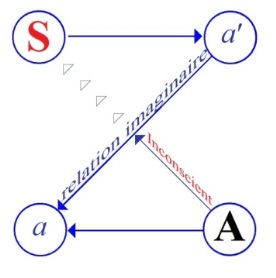

# Leçon 01 | 21 Novembre 1956

<!-- source-url: http://staferla.free.fr/S4/S4 LA RELATION.docx -->
<!-- seminar: s4 -->
<!-- lesson: 01 -->

<!-- id: s4-01-0001 -->

Nous parlerons cette année d’un sujet qui n’est pas, dans ce qu’on appelle *l’évolution historique de la psychanalyse,* sans prendre
\- d’une façon articulée ou non - une position tout à fait centrale dans *la théorie et la pratique*. Ce sujet, c’est *La relation d’objet*.

<!-- id: s4-01-0002 -->

Pourquoi ne l’ai-je pas choisi, ce sujet déjà actuel, déjà premier, déjà central, déjà critique, quand nous avons commencé
ces séminaires ? Précisément pour la raison qui motive la deuxième partie de mon titre, c’est-à-dire parce qu’il ne peut être traité qu’à partir d’une certaine idée, d’un certain recul pris sur la question de ce que FREUD nous a montré comme constituant
les structures dans lesquelles l’analyse se déplace, dans lesquelles elle opère, et tout spécialement la structure complexe
de la relation entre les deux sujets en présence dans l’analyse : l’analysé et l’analyste.

<!-- id: s4-01-0003 -->

C’est ce à quoi par ces trois années de commentaires des textes de FREUD, de critiques, portant :

<!-- id: s4-01-0004 -->

- la 1ère année sur ce qu’on peut appeler les éléments mêmes de la conduite technique,
  c’est-à-dire de *la notion de transfert* et *la notion de résistance*,

<!-- id: s4-01-0005 -->

- la 2ème année sur ce qu’il faut bien dire être le fond de l’expérience et de la découverte freudienne, à savoir ce qu’est à proprement parler *la notion de l’inconscient*, dont je crois vous avoir assez montré dans cette deuxième année que cette notion *de l’inconscient* est cela même qui a nécessité pour FREUD l’introduction des *principes littéralement paradoxaux sur le plan purement dialectique* que FREUD était amené à introduire dans l’*Au-delà du principe de plaisir*

<!-- id: s4-01-0006 -->

- Enfin au cours de la 3ème année, je vous ai donné un exemple manifeste de l’absolue nécessité d’isoler cette articulation essentielle du *symbolique* qui s’appelle *le signifiant*, pour comprendre - *analytiquement* parlant - quelque chose à ce qui n’est autre que *le champ* proprement *paranoïaque des psychoses*.

<!-- id: s4-01-0007 -->

Nous voici donc armés d’un certain nombre de termes qui ont abouti à certains schémas, dont la spatialité n’est absolument pas à prendre au sens intuitif du terme de schéma, qui ne comportent pas de *localisation* mais qui comportent d’une façon tout à fait légitime une spatialisation, au sens où *spatialisation* implique rapport de lieu, rapport *topologique*, interposition par exemple,
ou succession, séquence.

<!-- id: s4-01-0008 -->

<!-- id: s4-01-0009 -->

Un de ces schémas où culmine tout ce à quoi nous avons abouti après ces années de critique, c’est le schéma
que nous pourrons appeler par définition, par opposition à celui qui inscrit le rapport du sujet à l’Autre en tant qu’il est
au départ dans le rapport « naturel » tel qu’il est constitué *au départ de l’analyse  *: rapport *virtuel*, rapport de *paroles virtuelles*,
par quoi *c’est de l’Autre* \[A\] *que le sujet* \[S\] *reçoit* - sous la forme d’une parole inconsciente *- son propre message*.

<!-- id: s4-01-0010 -->

Ce « *propre message* » qui lui est interdit, est pour lui déformé, arrêté, capté, profondément méconnu par cette interposition de
*la relation imaginaire* entre *a* et *a’*, c’est-à-dire de *ce rapport* qui existe précisément *entre ce moi et cet autre* qu’est *l’objet* typique *du moi*, c’est-à-dire en tant que *la relation imaginaire* \[*a↔a’*\] interrompt, ralentit, inhibe, inverse le plus souvent, et profondément *méconnaît*
*- par une relation* essentiellement *aliénée - le rapport de parole entre le Sujet et l’Autre*, *le grand Autre* en tant qu’il est un autre sujet,
en tant que par excellence il est sujet capable de tromper.

<!-- id: s4-01-0011 -->

Voici donc à quel schéma nous sommes arrivés, et vous voyez bien que ce n’est pas quelque chose qui n’est pas \[...\] au moment où nous l’avons reposé à l’intérieur analytique, tel que, de plus en plus, un plus grand nombre d’analystes la formulent,
alors que nous allons remettre en cause cette prévalence dans la théorie analytique, de *la relation d’objet*, si l’on peut dire
non commentée, de *la relation d’objet* primaire, de *la relation d’objet*,

<!-- id: s4-01-0012 -->

- comme venant prendre, dans la théorie analytique, la place centrale,

<!-- id: s4-01-0013 -->

- comme venant recentrer toute la dialectique du *principe de plaisir*, du *principe de réalité*,

<!-- id: s4-01-0014 -->

- comme venant fonder tout le progrès analytique autour de ce que l’on peut appeler *une réification du rapport du sujet à l’objet*, considéré comme une relation duelle, *une relation* - nous dit-on encore quand on parle de la situation analytique - *excessivement simple*, *cette relation du sujet à l’objet* qui tend de plus en plus à occuper le centre de la théorie analytique.

<!-- id: s4-01-0015 -->

C’est cela même que nous allons mettre à l’épreuve. Nous allons voir si on peut, à partir de quelque chose qui dans notre *schéma* se rapporte précisément à *la ligne* *a→ a’,* construire d’une façon satisfaisante *l’ensemble des phénomènes* offerts à notre observation,
à notre expérience analytique, si cet instrument à lui tout seul peut permettre de répondre des faits, si en d’autres termes
le schéma plus complexe que nous avons proposé doit être négligé, voire écarté.

<!-- id: s4-01-0016 -->

Que *la relation d’objet* soit devenue - au moins en apparence - l’élément théorique premier dans l’explication de l’analyse,
je crois que je vous en donnerai un témoignage suivi. Non pas précisément en vous indiquant de vous pénétrer de ce qu’on peut appeler une sorte d’ouvrage collectif récemment paru[^1], pour lequel en effet le terme « *collectif* » s’applique particulièrement bien.
Vous y verrez d’un bout à l’autre la mise en valeur, d’une façon peut-être pas toujours particulièrement satisfaisante dans le sens de l’articulé, mais assurément dont la monotonie, l’uniformité est tout à fait frappante, vous y verrez promue cette *relation d’objet* donnée expressément dans un des articles qui s’appelle « *Évolution de la psychanalyse »*, et comme dernier terme de cette évolution vous y verrez dans l’article « *Clinique psychanalytique »* une façon de présenter la clinique elle-même, toute entière centrée
sur cette *relation d’objet*.

<!-- id: s4-01-0017 -->

Peut-être même en donnerai-je quelques idées auxquelles peut parvenir une telle présentation. Assurément, l’ensemble
est tout à fait frappant, c’est autour de la *relation d’objet* que ceux qui pratiquent l’analyse essayent d’ordonner leurs esprits,
la compréhension qu’ils peuvent avoir de leur propre expérience. Aussi ne nous semble-t-elle pas devoir leur donner
une satisfaction pleine et entière.

<!-- id: s4-01-0018 -->

Mais d’un autre côté, ceci n’oriente, ne pénètre très profondément leur pratique, que de concevoir que leur propre expérience dans ce registre ne soit quelque chose qui n’ait vraiment des conséquences dans les modes mêmes de leur intervention,
dans l’orientation donnée à l’analyse, et du même coup dans *ses résultats*. C’est ce que l’on peut méconnaître à simplement lire, commenter, alors qu’on a toujours dit que la théorie analytique et la pratique ne peuvent se séparer, se dissocier l’une de l’autre.

<!-- id: s4-01-0019 -->

Dès lors *qu’on la conçoit dans un certain sens*, il est inévitable *qu’on la mène également dans un certain sens*, si le sens théorique
et les résultats pratiques ne peuvent être de même qu’aperçus. Pour introduire la question de la *relation d’objet*, de la légitimité,
du non fondé de sa situation comme centrale dans la théorie analytique, il faut que je vous rappelle, brièvement tout au moins,
ce que cette notion doit ou ne doit pas à FREUD lui-même.

<!-- id: s4-01-0020 -->

Je le ferai non seulement parce que c’est là en effet une sorte de guide, presque de limitation technique que nous nous sommes imposés ici de partir du commentaire freudien, et de même ai-je senti cette année quelques interrogations, sinon inquiétudes,
de *savoir si j’allais ou non partir des textes freudiens*, mais il est très difficile de partir à propos de *la relation d’objet* des textes de FREUD
eux-mêmes, parce qu’elle n’y est pas - je parle bien entendu de quelque chose qui est très formellement affirmé ici ,
comme une déviation de la théorie analytique - il faut donc bien que je parte de textes récents, et que du même coup je parte d’une certaine critique de ces positions.

<!-- id: s4-01-0021 -->

Mais que nous devions nous référer en fin de compte aux *positions freudiennes*, par contre ceci n’est pas douteux et du même coup nous ne pouvons pas ne pas évoquer, ne serait-ce que très rapidement, ce qui dans *les thèmes* proprement *freudiens fondamentaux*,
tourne autour de la notion même d’*objet*. À notre départ nous ne pourrons pas le faire d’une façon développée, je vais essayer
de le faire aussi rapidement que possible. Bien entendu, ceci implique que c’est précisément ce que nous devrons *de plus en plus*,
à la fin, reprendre, développer, retrouver et articuler. Je veux donc simplement vous rappeler d’une façon brève, et qui ne serait même pas concevable s’il n’y avait pas derrière nous ces trois années de collaboration d’analyse de textes, si vous n’aviez pas déjà avec moi rencontré sous des formes diverses ce thème de l’*objet*.

<!-- id: s4-01-0022 -->

Dans FREUD

<!-- id: s4-01-0023 -->

- on parle bien entendu d’objet, la division des *Trois essais sur la sexualité* s’appelle précisément *la recherche*, ou plus exactement *la trouvaille* de *l’objet*,

<!-- id: s4-01-0024 -->

- on parle de l’objet d’une façon implicite chaque fois qu’entre en jeu la notion de réalité,

<!-- id: s4-01-0025 -->

- on en parle encore d’une 3ème façon chaque fois qu’est impliquée l’ambivalence de certaines relations fondamentale, à savoir le fait que le sujet se fait *objet* pour l’autre, qu’il y a un certain type de *relation* dans lequel la réciprocité pour le sujet d’un *objet* est patente et même constituante.

<!-- id: s4-01-0026 -->

Je voudrais mettre l’accent d’une façon plus appuyée sur *les trois modes* sous lesquels nous apparaissent *ces notions relatives à l’objet.*

<!-- id: s4-01-0027 -->

C’est pourquoi je fais allusion à l’un des points où dans FREUD nous pouvons nous référer pour prouver, articuler, la notion d’objet. Si vous vous reportez à ce chapitre des « *Trois essais sur la sexualité »*, vous y verrez quelque chose qui est déjà là
depuis l’époque où ceci n’a été publié que par une sorte d’accident historique - FREUD non seulement ne tenait pas
à ce qu’on le publie, mais qui a été en somme publié contre sa volonté - néanmoins nous trouvons la même formule
à propos de l’objet dès cette première *Esquisse* de sa psychologie \[cf. « *Esquisse d’une psycholgie scientifique »*, in *Lettres à W. Fliess*\].

<!-- id: s4-01-0028 -->

FREUD insiste sur ceci : que toute façon pour l’homme de trouver l’objet est - et n’est jamais que - la suite d’une tendance
où il s’agit d’*un objet perdu*, d’un objet qu’il s’agit de retrouver. L’objet n’est pas considéré, comme dans la théorie moderne, comme étant pleinement satisfaisant :

<!-- id: s4-01-0029 -->

- l’objet typique,

<!-- id: s4-01-0030 -->

- l’objet par excellence,

<!-- id: s4-01-0031 -->

- l’objet harmonieux,

<!-- id: s4-01-0032 -->

- l’objet qui fonde l’homme dans une réalité adéquate, dans la réalité qui prouve la maturité, le fameux *objet génital*.

<!-- id: s4-01-0033 -->

II est tout à fait frappant de voir qu’au moment où FREUD fait la théorie de l’évolution instinctuelle telle qu’elle se dégage
des premières expériences analytiques, il nous l’indique comme étant saisie par la voie d’une recherche de *l’objet perdu*.
Cet objet correspond à un certain stade avancé de la maturation des instincts, *c’est l’objet retrouvé du premier sevrage*,
l’objet précisément qui a été d’abord le point attache des premières satisfactions de l’enfant, c’est un objet retrouvé.

<!-- id: s4-01-0034 -->

Il est bien clair que :

<!-- id: s4-01-0035 -->

- *la discordance instaurée par* le seul fait, que ce terme de *la répétition* : ce terme d’une nostalgie qui lie le sujet à l’objet perdu et à travers laquelle s’exerce tout l’effort de la recherche et qui marque la retrouvaille du signe d’*une répétition impossible*, puisque précisément ce n’est pas le même objet, ça ne saurait l’être

<!-- id: s4-01-0036 -->

- *la primauté de cette dialectique* qui met au centre de la relation sujet-objet une tension foncière qui fait *que ce qui est recherché n’est pas recherché au même titre que ce qui sera trouvé*, que c’est à travers la recherche d’une satisfaction passée et dépassée que le nouvel objet est recherché et trouvé et saisi ailleurs qu’au point où il est cherché,

<!-- id: s4-01-0037 -->

- *la foncière distance* qui est introduite par l’élément essentiellement conflictuel qu’il y a dans toute recherche de l’objet, c’est la première forme sous laquelle dans FREUD apparaît cette notion de la relation d’objet.

<!-- id: s4-01-0038 -->

Je dirais que c’est à mal l’articuler dans les termes qui seraient philosophiquement élaborés, qu’il faudrait ici nous résoudre,
pour donner son plein accent à ce qu’ici je souligne…
je ne le fais pas intentionnellement, je le réserve pour notre retour sur ce terme, pour ceux pour qui ces termes ont déjà un sens de par certaines connaissances philosophiques
…toute « *la distance* » de la relation du sujet à l’objet dans FREUD, par rapport à ce qui le précède dans une certaine conception de l’objet comme étant *l’objet adéquat*, comme étant *l’objet attendu* d’avance, coapté à la maturation du sujet, toute cette distance
est déjà impliquée dans ce qui oppose une perspective platonicienne…
celle qui fonde toute appréhension, toute reconnaissance sur la réminiscence d’*un type* en quelque sorte *préformé*
…à une notion profondément différente, de toute la distance qu’il y a entre l’expérience moderne et l’expérience antique,

<!-- id: s4-01-0039 -->

celle qui est donnée dans KIERKEGAARD [^2] sous le registre de « *La répétition »*, cette *répétition* toujours cherchée,
essentiellement jamais satisfaite en tant qu’elle est de par sa nature non point *jamais réminiscence*, *mais toujours répétition comme telle*,
donc impossible à assouvir. C’est dans ce registre que se situe la notion de retrouver *l’objet perdu* dans FREUD.

<!-- id: s4-01-0040 -->

Nous retiendrons ce texte, il est essentiel qu’il suffise dans le premier rapport que FREUD fait de la notion d’objet.
Bien entendu, c’est essentiellement sur une notion d’un rapport profondément conflictuel du sujet avec son monde,
que les choses se posent et se précisent. Comment en serait-il autrement puisque déjà à cette époque c’est essentiellement
de l’opposition entre *principe de réalité* et *principe de plaisir* qu’il s’agit ?

<!-- id: s4-01-0041 -->

Que si *principe de réalité* et *principe de plaisir* ne sont pas détachables l’un de l’autre, je dirais plus : s’impliquent et s’incluent
l’un à l’autre dans un rapport dialectique, si bien que comme FREUD l’a toujours institué, le *principe de réalité* n’est constitué
que par ce qui est imposé pour sa satisfaction au *principe de plaisir*, il n’en est en quelque sorte que le prolongement.

<!-- id: s4-01-0042 -->

Si inversement le *principe de réalité* implique dans sa dynamique et dans sa recherche fondamentale la tension fondamentale
du *principe de plaisir*, il n’en reste pas moins *qu’entre les deux* - et c’est l’essentiel de ce qu’apporte la théorie freudienne -
*il y a une béance* qu’il n’y aurait pas lieu de distinguer s’ils étaient l’un simplement à la suite de l’autre :

<!-- id: s4-01-0043 -->

- que le *principe de plaisir* tend à se réaliser en formation profondément irréaliste,

<!-- id: s4-01-0044 -->

- que le *principe de réalité* implique l’existence d’une organisation, d’une structuration autonome différente et qui comporte que *ce qu’elle saisit peut être* justement *quelque chose de* fondamentalement *différent de ce qui est désiré*.

<!-- id: s4-01-0045 -->

C’est dans ce rapport, qui lui-même introduit dans sa dialectique même du sujet et de l’objet, un autre terme, un terme qui est
ici posé comme irréductible :

<!-- id: s4-01-0046 -->

- de même que l’objet, tout à l’heure, était quelque chose qui était fondé dans ses exigences primordiales comme quelque chose qui est toujours voué à un retour, et par là même voué à un retour impossible,

<!-- id: s4-01-0047 -->

- de même *dans l’opposition* *principe de réalité* et *principe du plaisir*, nous avons la notion d’une opposition foncière entre *la réalité* et ce qui est recherché par *la tendance*.

<!-- id: s4-01-0048 -->

En d’autres termes la notion que *la satisfaction du principe de plaisir*, en tant qu’elle est toujours *latente*, sous-jacente à tout exercice de la création du monde, est quelque chose qui toujours plus ou moins *tend à se réaliser dans une forme plus ou moins hallucinée*.
Que la possibilité *fondamentale* de cette organisation - qui est celle sous-jacente au *moi*, celle de la tendance du sujet comme tel -
est de se satisfaire dans une réalisation irréelle, dans une réalisation *hallucinatoire*, voilà l’autre terme sur lequel FREUD
met puissamment l’accent, et ceci dès la *Science des rêves*, dès la *Traumdeutung,* dès la première formulation pleine et articulée
de l’opposition du *principe de réalité* et du *principe du plaisir*.

<!-- id: s4-01-0049 -->

Ces deux positions ne sont pas comme telles *articulées* l’une avec l’autre. C’est précisément du fait qu’elles se présentent
dans FREUD comme distinctes, que ceci est bien marqué, que ce n’est pas autour de la relation du sujet à l’objet
que se centre le développement. Chacun de ces deux termes trouve sa place en des points différents de la dialectique freudienne pour la simple raison qu’en aucun cas la relation sujet-objet n’est centrale, elle n’apparaît que d’une façon qui peut apparaître comme se soutenant d’une façon directe et sans béance.

<!-- id: s4-01-0050 -->

C’est dans cette relation d’ambivalence, ou dans celle d’un type de relations qui sont appelées depuis « *prégénitales* »,
qui sont les relations « *voir-être vu* », « *attaquer-être attaqué* », « *passif-actif* », que le sujet vit ces relations qui toujours, plus ou moins implicitement, d’une façon plus ou moins manifeste, implique son identification au partenaire de cette relation, c’est à savoir
que ces relations sont vécues dans une réciprocité - le terme est valable ici - d’*ambivalence* de la position du sujet et du partenaire.

<!-- id: s4-01-0051 -->

Ici s’introduit *cette relation entre le sujet et l’objet* qui elle, est non seulement directe, sans béance, mais qui est littéralement *équivalence* de l’un à l’autre et c’est celle-là qui a pu donner le prétexte à la mise au premier plan de la relation d’objet comme telle.
Mais qu’allons-nous voir ? Cette relation qui en elle-même déjà annonce, précise, mérite le terme de « *relation en miroir* »
qui est celle de *la réciprocité* entre le sujet et l’objet, ce quelque chose qui pose en lui-même déjà tellement de questions
que c’est pour essayer de les résoudre que moi-même j’ai introduit dans la théorie analytique cette notion de « *stade du miroir* »...
qui est bien loin d’être purement et simplement cette connotation d’un phénomène dans le développement
de l’enfant, c’est-à-dire du moment où l’enfant reconnaît sa propre image, à savoir : c’est que tout ce qu’il apprend dans cette captivation par sa propre image et tout précisément de la distance qu’il y a de ses tensions internes à celles-là même qui sont évoquées dans ce rapport à la réalisation, à l’identification à cette image
...c’est là pourtant quelque chose qui a servi de thème, de point central à la mise au premier plan de cette relation sujet-objet comme étant, si on peut dire, l’échelle phénoménale à laquelle pouvait être rapporté d’une façon satisfaisante et valable
ce qui jusque là s’était présenté dans des termes, non seulement pluralistes, mais à proprement parler conflictuels,
comme introduisant un *rapport* essentiellement *dialectique* entre les différents termes.

<!-- id: s4-01-0052 -->

À ceci qu’on a cru pouvoir...
et un des premiers à y avoir mis l’accent - mais non pas si tôt qu’on le croit *-* est ABRAHAM
...essayer de recentrer tout ce qui est introduit jusque là dans l’évolution du sujet, d’une façon qui est toujours vue
par *reconstruction*, d’une façon rétroactive, à partir d’une expérience centrale qui est celle de *la tension conflictuelle entre conscient*
*et inconscient*, de la tension conflictuelle créée par ce fait fondamental que ce qui est cherché par *la tendance* est obscur,
que ce que la conscience en reconnaît est d’abord et avant tout méconnaissance, que *ce n’est pas dans la voie de la conscience que*
*le sujet se reconnaît*. Il y a autre chose et *un au-delà*, et *cet au-delà* pose du même coup et par là même la question de sa structure,
de son principe et de son sens, étant fondamentalement *méconnu* par le sujet, *hors de portée* de sa connaissance.

<!-- id: s4-01-0053 -->

Ceci est abandonné par l’initiative même d’un certain nombre : d’abord de personnalités, puis de courants significatifs
à l’intérieur de l’analyse, en fonction d’un objet dont le point terminal n’est pas le point dont nous partons :
nous partons en arrière pour comprendre comment est atteint ce point terminal, qui d’ailleurs n’est jamais observé,
*cet objet idéal* qui est littéralement *impensable*.

<!-- id: s4-01-0054 -->

Il est au contraire conçu comme une sorte de *point de mire*, de *point d’aboutissement* auquel vont concourir toute une série d’expériences, d’éléments, de notions partielles de l’objet à partir d’une certaine époque, et tout spécialement à partir du moment où ABRAHAM[^3] en 1924 le formule dans sa *théorie du développement de la libido*, et qui fonde pour beaucoup la loi même de l’analyse, de tout ce qui s’y passe.

<!-- id: s4-01-0055 -->

Le système de coordonnées à l’intérieur desquelles se situe toute l’expérience analytique, est celui du point d’achèvement
de ce fameux *objet idéal*, terminal, parfait, adéquat, de celui qui est proposé dans l’analyse comme étant celui qui marque
par lui-même le but atteint, la normalisation si l’on peut dire, terme qui déjà à lui tout seul introduit un monde de catégories
bien étranger à ce point de départ de l’analyse, la normalisation du sujet.

<!-- id: s4-01-0056 -->

Pour vous illustrer ceci, je crois ne pas pouvoir mieux faire que vous indiquer que de la formulation même, et du même coup
de l’aveu de ceux qui sont engagés dans cette voie - c’est assurément là quelque chose qui se formule dans les termes très précis -
ce qui est considéré comme *le progrès de l’expérience analytique* c’est d’avoir mis au premier plan *les rapports du sujet à son environnement*.
Cet accent mis sur « *l’environnement* », cette réduction que donne toute expérience analytique à quelque chose qui est une sorte
de retour à la position bel et bien objectivante qui pose au premier plan l’existence d’un certain individu et d’une relation
plus ou moins adéquate, plus ou moins adaptée à son environnement, c’est quelque chose qui, de la page 761 à la page 773
de l’ouvrage collectif \[la P.D.A.\] dont nous parlions, est articulé dans ces termes.

<!-- id: s4-01-0057 -->

Après avoir bien marqué que c’est l’accent mis sur les rapports du sujet à son environnement dont il s’agit dans le progrès
de l’analyse, nous apprenons incidemment que ceci est « *particulièrement significatif »* dans l’observation du petit Hans :
dans l’observation du petit Hans, les parents apparaissent - nous dit-on - sans personnalité propre.

<!-- id: s4-01-0058 -->

Nous ne sommes pas forcés de souscrire à cette opinion, mais l’important est ce qui va suivre, ceci tient à ce que nous étions :

<!-- id: s4-01-0059 -->

> « ...*avant la guerre de 1914, à l’époque où la société occidentale, sûre d’elle-même, ne se posait pas de questions sur sa propre pérennité. Au contraire depuis 1926 l’accent est mis sur l’angoisse et l’interaction de l’organisme et de l’environnement,*
> *c’est aussi que les assises de la société ont été ébranlées, l’angoisse d’un monde changeant est vécue chaque jour,*
> *les individus se reconnaissent différents. C’est l’époque même où la physique se cherche, où relativisme, incertitudes, probabilisme, semblent ôter à la pensée objective, sa confiance en elle-même.* »

<!-- id: s4-01-0060 -->

Cette référence à *la physique moderne* comme le fondement d’un nouveau rationalisme me paraît devoir se passer de commentaire. Ce qui est important c’est simplement qu’il y a là quelque chose qui est curieusement avoué d’une façon indirecte :
c’est que la psychanalyse est envisagée comme une sorte de remède social, puisque c’est cela qu’on met au premier plan
comme caractéristique de l’élément moteur de son progrès.

<!-- id: s4-01-0061 -->

Il n’y a pas besoin de savoir si ceci est ou non *fondé*, ce sont des choses qui nous paraissent de peu de poids, c’est simplement
le contexte des choses qui sont admises là avec une très grande légèreté qui en lui-même peut nous être d’une certaine utilité.

<!-- id: s4-01-0062 -->

Ceci n’est pas unique, car le propre de cet ouvrage collectif communiquant à l’intérieur de lui-même d’une façon bien plus
\- semble-t-il - faite d’une sorte de curieuse homogénéisation que d’une articulation à proprement parler, c’est celui aussi
qui dans le premier article auquel j’ai fait allusion tout à l’heure, marque d’une façon délibérée, par la notion vraiment formulée, qu’en fin de compte ce qui nous donnera la conception générale nécessaire à la compréhension actuelle de la structure d’une personnalité, c’est l’angle de vision que l’on dit être le plus pratique et le plus prosaïque qui soit : celui des *<u>relations sociales du malade</u>* (*souligné par l’auteur*) \[P.D.A. pp. 761-773\].

<!-- id: s4-01-0063 -->

Je passe sur d’autres termes qui, à propos de la nature de *l’aveu*, nous disent que l’on conçoit, que l’on puisse voir comme m*ouvante, artificielle*, une telle conception de l’analyse. Mais ceci ne dépend-il pas du fait que *l’objet* même d’une telle discipline
ait - ce que personne ne songe à contester - marqué des variations dans le temps ?

<!-- id: s4-01-0064 -->

C’est en effet une explication pour le caractère tant soit peu *foudroyant* des différents modes d’approche donnés dans cette ligne, mais ce n’est peut-être pas une explication qui doit entièrement nous satisfaire, je ne vois pas quels sont les objets
d’aucune discipline qui ne soient pas également sujets à des variations dans le temps.

<!-- id: s4-01-0065 -->

Sur *la relation du sujet au monde* nous verrons affirmé et accentué une sorte de parallélisme entre l’état de maturation plus ou moins assuré des activités instinctuelles, et la structure du *moi* chez un sujet à un moment donné. Pour tout dire, à partir d’un certain moment cette structure du *moi* est considérée comme la doublure, et très exactement en fin de compte comme le représentant de l’état de maturation des activités instinctuelles. Il n’y a plus aucune différence, ni sur le plan dynamique, ni sur le plan *génétique* entre les différentes étapes du progrès du *moi* et les différentes étapes de *la progression instinctuelle*.

<!-- id: s4-01-0066 -->

Ce sont des termes qui peuvent à certains d’entre vous ne pas paraître en eux-mêmes très essentiellement critiquables,
peu importe, la question n’est pas là, nous verrons dans quelle mesure nous pourrons ou non les retenir. La conséquence
en est leur instauration au centre de l’analyse d’une façon tout à fait précise qui se présente comme une topologie :
il y a les « *prégénitaux* » et les « *génitaux* ».

<!-- id: s4-01-0067 -->

Les « *prégénitaux* » sont des individus faibles, et la cohérence de leur *moi* « *dépend étroitement de la persistance de certaines relations objectales avec un objet significatif* ». Ceci est écrit et articulé.

<!-- id: s4-01-0068 -->

Ici nous pouvons commencer à poser des questions. Nous verrons peut-être tout à l’heure au passage, à lire les mêmes textes, où peut aller la notion de ce « *significatif* » non expliqué. C’est à savoir le manque absolu de différenciation, de discernement
dans ce « *significatif* ». La notion technique que ceci implique est la mise en jeu, et du même coup la mise en valeur à l’intérieur
de la relation analytique, des relations prégénitales, celles qui caractérisent le rapport de ce « *prégénital* » avec son monde
dont on nous dit que ces relations à leur objet sont caractérisées par quelque déficit :

<!-- id: s4-01-0069 -->

> « …*la perte de ces relations, ou de leur objet, ce qui est synonyme puisque ici l’objet n’existe qu’en fonction de ses rapports avec le sujet, certains entraînant de graves désordres de l’activité du moi, tels que phénomènes de dépersonnalisation, troubles psychotiques.* »

<!-- id: s4-01-0070 -->

Ici nous trouvons le point dans lequel est recherché le test du témoignage de *cette fragilité profonde des relations du moi à son objet* :

<!-- id: s4-01-0071 -->

> « …*le sujet s’efforce de maintenir ses relations d’objet à tout prix, en utilisant toutes sortes d’aménagements dans ce but – changement d’objet avec utilisation du déplacement ou de la symbolisation qui, par le choix d’un objet symbolique arbitrairement chargé de la même valeur affective que l’objet initial, lui permettra de ne pas se trouver privé de relation objectale.* ».

<!-- id: s4-01-0072 -->

Pour cet objet sur lequel est déplacé la valeur affective de l’objet initial, le terme de « *moi auxiliaire »* est pleinement justifié,
et ceci explique que :

<!-- id: s4-01-0073 -->

> « …*Les génitaux au contraire possèdent un Moi qui ne voit pas sa force et l’exercice de ses fonctions dépendre de la possession d’un objet significatif. Alors que pour les premiers la perte d’une personne importante subjectivement parlant pour prendre l’exemple le plus simple, met en jeu leur individualité, pour eux cette perte, pour si douloureuse qu’elle soit, ne trouble en rien la solidité de leur personnalité. Ils ne sont pas dépendants d’une relation objectale. Cela ne veut pas dire qu’ils peuvent se passer aisément de toute relation objectale, ce qui d’ailleurs est pratiquement irréalisable, tant les relations d’objet sont multiples et variées, mais que simplement leur unité n’est pas à la merci de la perte d’un contact avec un objet significatif. C’est là ce qui du point de vue du rapport entre le Moi et la relation d’objet les différencie radicalement des précédents. »*
> « *Si comme dans toute névrose une évolution normale semble avoir été stoppée par l’impossibilité où s’est trouvé le sujet de résoudre le dernier des conflits structurants de l’enfance, celui dont la liquidation parfaite, si l’on peut s’exprimer ainsi, aboutit à cette adaptation si heureuse au monde que l’on nomme la relation d’objet génitale et qui donne à tout observateur le sentiment d’une personnalité harmonieuse et à l’analyse la perception immédiate d’une sorte de limpidité cristalline de l’esprit, ce qui est, je le répète, plus une limite qu’une réalité, cette difficulté de résolution de l’Œdipe bien souvent n’a pas tenu au seul problème qu’il posait.* »

<!-- id: s4-01-0074 -->

Limpidité cristalline... Nous voyons également où cet auteur avec la perfection de la relation objectale, peut nous porter,
c’est encore à ceci :

<!-- id: s4-01-0075 -->

> « *Les pulsions dont il s’agit nous feront aboutir à cette notion, alors que les formes prégénitales marquent ce besoin de possession incoercible, illimité, inconditionnel, comportant un aspect destructif, (dans les formes génitales), elles sont véritablement aimantes,*
> *et si le sujet ne s’y montre pas pour autant oblatif c’est-à-dire désintéressé, et si ses objets sont aussi foncièrement des objets narcissiques que dans le cas précédent, il est ici capable de compréhension, d’adaptation à la situation de l’autre. D’ailleurs*
> *la structure intime de ses relations objectales montre que la participation de l’objet à son propre plaisir à lui, est indispensable*
> *au bonheur du sujet. Les convenances, les désirs, les besoins de l’objet sont pris en considération au plus haut point.* »

<!-- id: s4-01-0076 -->

Ceci suffit à nous montrer, à ouvrir un problème fort grave qui est celui de savoir ce qu’il importe de distinguer dans la maturation qui n’est ni une voie, ni une perspective, ni un plan sur lequel nous ne puissions pas en effet poser la question :

<!-- id: s4-01-0077 -->

« *Qu’est-ce que signifie l’issue d’une enfance et d’une adolescence et d’une maturité normales ?* »

<!-- id: s4-01-0078 -->

Mais la distinction essentielle entre l’établissement de la réalité avec tout ce qu’elle pose de problèmes d’adaptation :

<!-- id: s4-01-0079 -->

- à quelque chose qui résiste,

<!-- id: s4-01-0080 -->

- à quelque chose qui se refuse,

<!-- id: s4-01-0081 -->

- à quelque chose qui est complexe,

<!-- id: s4-01-0082 -->

- à quelque chose qui implique en tout cas que la notion d’objectivité, comme l’expérience la plus élémentaire nous montre : que c’est une chose *distincte* de ce qui est visé dans ces textes mêmes sous la notion plus ou moins implicite et couverte par le terme différent d’objectalité, de plénitude de l’objet.

<!-- id: s4-01-0083 -->

Cette confusion qu’il y a, est d’ailleurs articulée parce que le terme d’objectivité se trouve dans le texte comme étant caractéristique de cette forme de relation achevée. Il y a une distance assurément entre :

<!-- id: s4-01-0084 -->

- ce qui est impliqué par une certaine construction du monde considérée comme plus ou moins satisfaisante à telle époque, en effet déterminée certainement hors de toute relativité historique,

<!-- id: s4-01-0085 -->

- et d’autre part cette relation même à l’autre comme étant ici son registre affectif, voire sentimental, comme de la prise en considération des besoins, du bonheur, du plaisir de l’autre.

<!-- id: s4-01-0086 -->

Assurément ceci nous porte beaucoup plus loin puisqu’il s’agit de la constitution de l’autre en tant que tel, c’est-à-dire en tant qu’il parle, c’est-à-dire en tant qu’il est un sujet. Nous aurons à revenir sur cela. C’est là quelque chose qu’il ne suffit pas de citer, même en formulant les remarques humoristiques qu’ils suggèrent suffisamment par eux-mêmes, sans pour autant avoir fait
le progrès qui s’impose.

<!-- id: s4-01-0087 -->

Cette conception extraordinairement primaire de la notion d’*évolution instinctuelle* dans l’analyse est quelque chose qui est loin d’être reçu universellement. Il est certain que la notion des textes comme ceux de GLOVER par exemple, vous fera retourner
à une notion bien différente de l’exploration des « relations d’objet », même nommées et bien définies comme telles.

<!-- id: s4-01-0088 -->

Vous verrez à aborder les textes de GLOVER, qu’essentiellement ce qui me parait caractériser les stades, les étapes de l’objet aux différentes époques du développement individuel, c’est l’objet conçu comme ayant une toute autre fonction. L’analyse insiste à introduire de l’objet une notion fonctionnelle d’une nature bien différente de celle d’un pur et simple correspondant, d’une pure et simple coaptation de l’objet avec une certaine demande du sujet.

<!-- id: s4-01-0089 -->

L’objet a là un tout autre rôle, il est si l’on peu dire placé sur fond d’angoisse. C’est pour autant que l’objet est instrument
à masquer, à parer, sur le fond fondamental d’angoisse qui caractérise aux différentes étapes du développement du sujet,
le rapport du sujet au monde, qu’à chaque étape le sujet doit être caractérisé.

<!-- id: s4-01-0090 -->

Ici je ne peux pas, à la fin de cet entretien d’aujourd’hui, ne pas ponctuer, illustrer d’un exemple quelconque qui donne son relief à ce que je vous apporte à propos de cette conception, vous faire remarquer que *la conception classique* fondamentale freudienne
de la phobie n’est exactement pas autre chose que ceci.

<!-- id: s4-01-0091 -->

FREUD et tous ceux qui ont étudié la phobie avec lui et après lui, ne peuvent manquer de montrer qu’il n’y a aucun rapport direct de la prétendue *peur* qui colorerait de sa marque fondamentale cet *objet* en le constituant comme tel comme un *objet primitif*.
Il y a au contraire une distance considérable de la peur dont il s’agit et qui peut bien être dans certains cas, et qui peut bien aussi dans d’autres cas ne pas être une peur tout à fait primitive, et *l’objet* qui, par rapport à elle, *est très essentiellement constitué pour la maintenir à distance, pour enfermer le sujet dans un certain cercle, dans un certain rempart,* à l’intérieur duquel il se met à l’abri de ces peurs.

<!-- id: s4-01-0092 -->

*L’objet est essentiellement lié à l’issue d’un signal d’alarme, l’objet est avant tout un poste avancé contre une peur instituée* qui lui donne son rôle, sa fonction à un moment, à un point déterminé d’une certaine *crise du sujet* qui n’est pas pour autant fondamentalement
*ni une crise typique, ni une crise évolutive*.

<!-- id: s4-01-0093 -->

Cette notion moderne si l’on peut dire, de la phobie, est quelque chose qui peut être plus ou moins légitimement affirmé.
Nous aurons également à la critiquer, à l’origine de la notion d’objet telle qu’elle est promue dans les travaux et dans le mode
de conduire l’analyse qui est caractéristique de la pensée et de la technique d’un GLOVER. Qu’il s’agisse d’une angoisse
qui est l’angoisse de castration nous dit-on, c’est quelque chose qui a été jusqu’à une époque récente peu contesté.

<!-- id: s4-01-0094 -->

Il est néanmoins remarquable que les choses en sont venues au point que le désir de reconstruction dans le sens génétique
ait été jusqu’à cette tentative de nous faire déduire la construction même de l’objet paternel de quelque chose qui viendrait comme la suite, l’aboutissement, le fleurissement des constructions phobiques objectales primitives. Il y a un certain *Rapport* paru sur la phobie et qui va exactement dans ce sens par une sorte de curieux renversement du chemin qui dans l’analyse
nous avait en effet permis de remonter de la phobie à la notion d’un certain rapport avec l’angoisse,
d’une fonction de protection que joue l’objet de la phobie par rapport à cette angoisse.

<!-- id: s4-01-0095 -->

Il n’est pas moins remarquable dans un autre registre, de voir ce que devient également *la notion de fétiche* et *la notion de fétichisme*.
Je l’introduis également aujourd’hui pour vous montrer que *le fétiche* se trouve - si nous prenons la chose dans la perspective
de « *la relation d’objet* » - remplir une fonction qui est bel et bien dans la théorie analytique articulée comme étant lui aussi
une certaine protection contre l’angoisse et contre - *chose curieuse* - la même angoisse, c’est-à-dire *l’angoisse de castration*.

<!-- id: s4-01-0096 -->

Il ne semble pas que ce soit par le même biais que le fétiche serait plus particulièrement relié à *l’angoisse de castration* pour autant qu’elle est *liée à la perception de l’absence d’organe phallique chez le sujet féminin*, et à la négation de cette absence. Qu’importe !
Vous ne pouvez pas ne pas voir qu’ici aussi l’objet a une certaine fonction de *complémentation* par rapport à quelque chose qui
ici se présente comme un trou, voire comme un abîme dans la réalité, et que la question de savoir s’il y a rapport entre les deux, s’il y a quelque chose de commun entre cet *objet phobique* et ce *fétiche* se pose.

<!-- id: s4-01-0097 -->

Mais à poser les questions dans ces termes, peut-être faut-il, sans nous refuser à aborder les problèmes à partir de la relation d’objet, trouver dans les phénomènes mêmes l’occasion, le départ d’une critique qui, même si nous soumettons à l’interrogation qui nous est posée concernant l’objet typique, l’objet idéal, l’objet fonctionnel, toutes les formes d’objet que vous pourrez supposer chez l’homme, nous amène à aborder en effet la question sous ce jour.

<!-- id: s4-01-0098 -->

Mais alors, à ne pas nous contenter d’explications uniformes pour des phénomènes différents, et à *centrer* par exemple notre question au départ sur ce qui fait la fonction essentiellement différente d’une phobie et d’un fétiche, pour autant qu’elles sont centrées l’une et l’autre sur le même fond d’angoisse fondamental, sur lequel l’une et l’autre seraient appelées comme une mesure de protection, comme une mesure de garantie de la part du sujet. C’est bien là en effet que j’ai pris la résolution de prendre
mon point de départ pour vous montrer de quel point nous partions dans notre expérience pour aboutir aux mêmes problèmes.

<!-- id: s4-01-0099 -->

Car il y a effectivement à poser - non plus d’une façon mythique, ni d’une façon abstraite, mais d’une façon directe,
telle que les objets nous sont proposés - à nous apercevoir qu’il ne suffit pas de parler de l’objet en général, ni d’un objet qui aurait, par je ne sais quelle vertu de communication magique, la fonction de régulariser les relations avec tous les autres objets.
Comme si le fait d’être arrivé à être un « *génital »* suffisait à nous poser et à résoudre toutes les questions, à savoir par exemple
si ce que peut être pour un « *génital »* un objet qui ne me parait pas ne pas devoir être moins énigmatique du point de vue essentiellement biologique qui est ici mis au premier plan, qu’un des objets de l’expérience humaine courante,
à savoir une pièce de monnaie, ne pose pas par elle-même la question de sa valeur objectale.

<!-- id: s4-01-0100 -->

Le fait que dans un certain registre nous la perdions en tant que moyen d’échange, ou toute autre espèce de prise en considération pour l’échange de n’importe quel élément de la vie humaine transposé dans sa valeur de marchandise, ne nous introduit-il pas de mille façons la question de ce qui effectivement a été résolu par un terme très voisin, mais non pas synonyme de celui que nous venons d’introduire dans la notion de « *fétiche* », dans la théorie marxiste \[cf. Marx : *fétichisme de la marchandise*, Le C*apital* \].
Bref…*la notion d’objet*, *la notion* aussi si vous le voulez, *d’objet écran*, et du même coup la fonction de cette constitution de la réalité si singulière sur laquelle dès le début FREUD a apporté cette lumière véritablement saisissante et à laquelle nous nous demandons pourquoi on ne continue pas à accorder sa valeur : *la notion de « souvenir-écran »* comme étant tout spécialement constituante du passé de chaque sujet comme tel ?

<!-- id: s4-01-0101 -->

Toutes ces questions méritent d’être prises en effet par elles-mêmes et pour elles-mêmes, analysées dans *leurs rapports réciproques*, puisque c’est de ces rapports que peuvent ressurgir les distinctions de plan nécessaires qui nous permettront de définir
d’une façon articulée pourquoi « *une phobie* » et « *un fétiche* » sont deux choses différentes, et s’il y a en effet quelque rapport
avec l’usage général du mot « *fétiche* » dans l’usage particulier qu’on peut en faire à propos de la forme précise,
et l’emploi précis, qu’a ce terme pour désigner une perversion sexuelle.

<!-- id: s4-01-0102 -->

C’est donc ainsi que nous introduirons le sujet de notre prochain entretien, il sera sur *la phobie* et « *le fétiche* »,
et je crois que ce retour à ce qui est effectivement l’expérience, est la voie par laquelle nous pourrons restituer
et redonner sa valeur véritable au terme de relation d’objet.

## Notes

[^1]: Cf. « *La psychanalyse d’aujourd’hui* », PUF 1956, (la P.D.A.)

[^2]: Søren Kierkegaard : *La répétition*, in Œuvres complètes, t.5, trad. Tisseau ; éd. de L’Orante, 1972.

    *La reprise*, trad. Viallaneix, Coll. GF, Flammarion, 1990.

    *La reprise*, in « Søren Kierkegaard », trad. Tisseau, Coll. Bouquins, éd. Robert Laffont, 1993.

[^3]: Karl Abraham : « *Esquisse d'une histoire du développement de la libido*... », in *Œuvres complètes*, T. II , Payot 2000, p.170.

    « [*Versuch einer Entwicklungsgeschichte der Libido*](http://archive.org/details/VersuchEinerEntwicklungsgeschichteDerLibidoAufGrundDerPsychoanalyse) », Internationaler Psychoanalytischer Verlag, 1924.
