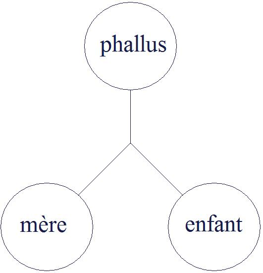

# Leçon 02 | 28 Novembre 1956

<!-- source-url: http://staferla.free.fr/S4/S4 LA RELATION.docx -->
<!-- seminar: s4 -->
<!-- lesson: 02 -->

<!-- id: s4-02-0001 -->

J’ai fait cette semaine à votre intention, des lectures de ce qu’ont écrit les psychanalystes sur ce sujet qui sera le nôtre cette année,
à savoir *l’objet*, et plus spécialement cet objet dont nous avons parlé la dernière fois, qui est *l’objet génital*.
L’*objet génital*, pour l’appeler par son nom, c’est *la femme*, alors pourquoi ne pas l’appeler par son nom ?
De sorte que c’est en somme un certain nombre de lectures sur *la sexualité féminine* dont je me suis gratifié.

<!-- id: s4-02-0002 -->

Il serait plus important que ce soit vous qui les fassiez que moi, cela vous rendrait plus aisé à comprendre ce que je vais être amené à vous dire à ce sujet, et ensuite ces lectures sont fort instructives à d’autres points de vue encore, et principalement
en celui-ci que, si l’on pense à la phrase bien connue de RENAN : « *La bêtise humaine donne une idée de l’infini* ». Je dois ajouter
que s’il avait vécu de nos jours il aurait ajouté : « ...*et les divagations théoriques des psychanalystes* - non pas du tout que je sois en train de les assimiler à la bêtise - *sont un ordre de ce qui peut donner une idée de l’infini*. ».

<!-- id: s4-02-0003 -->

Car en effet il est extrêmement frappant de voir à quelles difficultés extraordinaires les esprits des différents analystes
sont soumis, après les énoncés eux-mêmes si abrupts, si étonnants de FREUD. Mais FREUD, *toujours tout seul* \[*sic*\]*,* a apporté
sur ce sujet - car c’est probablement à cela que se limitera la portée de ce que je vous dirai aujourd’hui : c’est qu’assurément
s’il y a *quelque chose* qui doit au maximum contredire l’idée de cet objet…
que nous avons désigné tout à l’heure comme un objet harmonique,
un objet achevant de par sa nature la relation du sujet à l’objet
…s’il y a *quelque chose* qui doit le contredire, c’est je ne dirais pas même l’expérience analytique, car après tout l’expérience commune, les rapports de l’homme et de la femme, n’est pas une chose non problématique : si ce n’était pas une chose problématique il n’y aurait pas d’analyse du tout mais les formulations précises de FREUD sont ce qui apporte le plus
la notion d’un pas, d’une béance, de quelque chose qui ne va pas.

<!-- id: s4-02-0004 -->

Cela ne veut pas dire que ça suffise à le définir, mais l’affirmation positive que ça ne va pas est dans FREUD :

<!-- id: s4-02-0005 -->

- elle est dans le *Malaise dans la civilisation*,

<!-- id: s4-02-0006 -->

- elle est dans la leçon des *Nouvelles conférences sur la psychanalyse*.

<!-- id: s4-02-0007 -->

Ceci nous ramène donc à nous questionner sur *l’objet*. Je vous rappelle que l’oubli qui est fait communément de la notion d’*objet* n’est point si accentué dans le relief dont l’expérience et l’énoncé de la doctrine freudienne situent et définissent cet *objet* :

<!-- id: s4-02-0008 -->

- objet qui d’abord se présente toujours dans une quête de *l’objet perdu*,

<!-- id: s4-02-0009 -->

- et de l’objet comme étant toujours *l’objet retrouvé*.

<!-- id: s4-02-0010 -->

Les deux s’*opposent* de la façon la plus catégorique à la notion de *l’objet* en tant qu’*achevant*, pour opposer la situation dans laquelle le sujet par rapport à l’objet est très précisément l’objet pris lui-même dans une quête, alors que c’est à la notion d’un sujet autonome qu’aboutit l’idée de *l’objet achevant*. J’ai déjà également souligné la dernière fois cette notion de *l’objet halluciné*,
de *l’objet halluciné* sur un fond de réalité angoissante, qui est une notion de l’objet tel qu’il surgit de l’exercice de ce que FREUD appelle le système primaire du désir.

<!-- id: s4-02-0011 -->

Et tout opposée à cela *dans la pratique analytique*, la notion d’*objet* en fin de compte qui se réduit au *réel*. Il s’agit de retrouver le *réel*.
L’*objet* se détache, non plus sur fond d’*angoisse*, mais sur fond de réalité commune si on peut dire, *le terme* de la recherche analytique étant de s’apercevoir qu’il n’y a pas de raison d’en avoir peur, autre terme qui n’est pas le même que celui d’*angoisse*.

<!-- id: s4-02-0012 -->

Et enfin le troisième terme dans lequel il nous apparaît à le voir et à le suivre dans FREUD, c’est ce terme de *la réciprocité imaginaire*, à savoir que dans toute relation avec l’objet la place de termes en rapport est occupée simultanément par le sujet,
que *l’identification à l’objet est au fond de toute relation à l’objet*.

<!-- id: s4-02-0013 -->

À la vérité, ce dernier point n’est pas oublié, mais c’est évidemment celui auquel la pratique de la relation d’objet dans la technique analytique moderne s’attache le plus avec comme résultat ce que j’appellerai « *cet impérialisme de la signification* ».
Puisque tu peux t’identifier à moi, puisque je peux m’identifier à toi, c’est assurément de nous deux le moi qui a la meilleure adaptation à la réalité qui est le meilleur modèle.

<!-- id: s4-02-0014 -->

En fin de compte c’est à *l’identification au moi de l’analyste* que se ramènera dans une épure idéale *le progrès de l’analyse*.
À la vérité, je voudrais illustrer ceci pour y montrer l’extrême déviation qu’une telle partialité dans le maniement de la relation d’objet peut conditionner, en vous rappelant ceci par exemple, parce que ça a été plus particulièrement illustré
par la pratique de *la névrose obsessionnelle*.

<!-- id: s4-02-0015 -->

Si *la névrose obsessionnelle* est - comme le pensent la plupart de ceux qui sont ici - cette notion structurante quant à *l’obsessionnel*
qui peut s’exprimer à peu près ainsi « *Qu’est-ce qu’un obsessionnel ?* » : *c’est en somme un acteur qui joue son rôle, assure un certain nombre d’actes comme s’il était mort, c’est une façon de se mettre à l’abri de la mort*. Ce jeu auquel il se livre en quelque sorte est *un jeu vivant* qui consiste à montrer qu’il est invulnérable. Pour ceci il s’exerça une sorte de domptage qui conditionne toutes *ses approches à autrui*. On le voit dans une sorte d’*exhibition* pour montrer jusqu’où il peut aller dans l’exercice.

<!-- id: s4-02-0016 -->

Il y a *tous les caractères d’un jeu*, y compris les caractères illusoires : jusqu’où peut aller ce *petit autre* qui n’est que son *alter-ego*,
le double de lui-même, et ceci devant un *Autre* qui assiste au spectacle dans lequel il est lui-même spectateur,
car tout son plaisir du jeu et sa possibilité, résident là.

<!-- id: s4-02-0017 -->

Mais par contre il ne sait pas *quelle place* il occupe, et c’est ce qu’il y a d’*inconscient* chez lui. Ce qu’il fait, il le fait à des fins d’alibi,
cela il peut l’entrevoir, il se rend bien compte que *le jeu ne se joue pas là où il est*, et c’est pour cela que presque *rien de ce qui se passe n’a pour lui de véritable importance*, mais pas qu’il sache d’où il voit tout cela, et en fin de compte qui est-ce qui mène le jeu.
Assurément nous savons que c’est lui-même, mais nous pouvons faire aussi mille erreurs si nous ne savons pas où il est mené, ce jeu, d’où la notion d’objet, et d’objet significatif pour ce sujet.

<!-- id: s4-02-0018 -->

Il serait tout à fait erroné de croire que c’est en termes quelconques de *relation duelle* que cet objet peut être désigné,
bien sûr avec la notion de la relation d’objet telle qu’elle est élaborée chez l’auteur. Vous allez voir où cela mène…

<!-- id: s4-02-0019 -->

Mais sans doute il est bien clair que dans cette situation très complexe, la notion de l’objet n’est pas donnée immédiatement puisque ce n’est très précisément qu’en tant qu’il participe à un jeu illusoire que ce qui est à proprement parler l’objet, à savoir le jeu de rétorsion agressif, ce jeu de riche, ce jeu d’aller aussi près que possible de la mort, et en même temps d’être hors de la portée de tous les coups *en tuant* en quelque sorte à l’avance chez lui–même, et *en mortifier* si l’on peut dire *le désir*.
La notion d’objet là est infiniment complexe et mérite d’être accentuée à chaque instant pour que nous sachions au moins
de quel objet nous parlons.

<!-- id: s4-02-0020 -->

Nous tâcherons de donner à cette notion d’objet un emploi uniforme qui permette pour nous, dans notre vocabulaire,
de nous y retrouver. C’est une notion, non pas qui se dérobe, mais qui se propose comme absolument difficile à cerner.
Pour renforcer notre comparaison, il s’agit de démontrer une certaine chose qu’il a articulée pour cet autre spectateur qu’il est sans le savoir, et à la place duquel il nous met à mesure que le transfert avance.

<!-- id: s4-02-0021 -->

Qu’est-ce que va faire l’analyste par cette notion de la relation d’objet ? Je vous prie de reprendre l’analyse de la lecture
des observations comme représentant le progrès de l’analyse d’un obsédé dans le cas dont je parle, chez l’auteur dont je parle[^4].

<!-- id: s4-02-0022 -->

Vous y verrez que la façon de manier *la relation d’objet* dans ce cas, consiste très exactement à faire quelque chose qui serait analogue de ce qui se passerait si, assistant à une scène de cirque où l’un et l’autre s’administrent une série de *paires de claques alternées*, ceci consisterait à descendre dans l’arène et à s’efforcer d’avoir peur de recevoir des gifles. Au contraire c’est en vertu
de son agressivité qu’il en donne et que la relation de l’entretien avec lui est une relation agressive.
Là-dessus, « Monsieur Loyal » arrive et dit :

<!-- id: s4-02-0023 -->

> « *Voyons tout ceci n’est pas raisonnable, lâchez, avalez donc votre bâton mutuellement,*
> *comme cela vous l’aurez à la bonne place, vous l’aurez intériorisé.* »

<!-- id: s4-02-0024 -->

Ceci est en effet une façon de résoudre la situation et de lui donner son issue. On peut l’accompagner d’une petite chanson,
celle vraiment impérissable d’un nommé \[...\] qui était une sorte de génie. On ne comprendra absolument jamais rien,
ni à ce que j’appelle dans cette occasion le caractère en quelque sorte *sacré* en quelque sorte *d’exhibition*, d’*office* à laquelle
on assisterait dans cette occasion, si noire apparut-elle, mais on ne comprendra pas non plus peut-être ce que veut dire
à proprement parler « *la relation d’objet* ».

<!-- id: s4-02-0025 -->

Apparaît en filigrane le caractère et l’arrière-fond profondément oral de la relation d’objet imaginaire qui en quelque sorte
nous permet de voir aussi ce que peut avoir d’étroitement, de rigoureusement *imaginaire* une pratique qui ne peut pas échapper bien entendu aux lois de l’*imaginaire*, de cette relation duelle qu’il prend pour réelle, car en fin de compte ce qui est l’aboutissement de cette relation d’objet c’est le fantasme d’*incorporation phallique*. *Phallique* pourquoi ?

<!-- id: s4-02-0026 -->

L’expérience ne suit pas la notion idéale que nous pouvons avoir de son accomplissement, elle se présente forcément en mettant d’autant plus en relief *ses paradoxes*, et vous le verrez, c’est aujourd’hui ce que j’introduis par le pas que j’essaye de vous faire faire, tout l’accomplissement que la relation duelle comme telle fait - à mesure qu’on s’en approche - surgir au premier plan
comme un objet privilégié *quelque chose* qui est cet *objet imaginaire* qui s’appelle *le phallus*.

<!-- id: s4-02-0027 -->

Toute la notion d’*objet* est *impossible* à mener, *impossible* à comprendre, *impossible* même à exercer, si l’on n’y met pas comme
un élément, je ne dis pas médiateur car ce serait faire un pas que nous n’avons pas fait encore ensemble, un tiers élément
qui est un élément... *le phallus* pour tout dire. Ce que je rappelle aujourd’hui au premier plan dans ce schéma qu’à la fin de l’année précédente je vous avais donné comme à la fois une conclusion à l’élément de l’analyse du *signifiant* à laquelle avait mené l’exploration de la psychose, mais qui était aussi une introduction, en quelque sorte le schéma inaugural de ce que cette année
je vais vous proposer concernant *la relation d’objet*.

<!-- id: s4-02-0028 -->

<!-- id: s4-02-0029 -->

*La relation imaginaire,* quelle qu’elle soit, est modulée sur un certain rapport qui lui est effectivement fondamental,
qui est le rapport « *mère-enfant* », bien entendu avec tout ce qu’il a en lui de problématique et assurément bien fait
pour donner l’idée qu’il s’agit là d’une relation réelle. En effet c’est là le point vers lequel se dirige actuellement
toute l’analyse de *la situation analytique* qui essaye de se réduire dans les derniers termes à quelque chose qui peut être conçu comme *le développement* des relations « *mère-enfant* » avec ce qui s’en inscrit et ce qui dans la suite, dans la genèse,
porte les traces et les reflets de cette position initiale.

<!-- id: s4-02-0030 -->

Il est impossible par l’examen d’un certain nombre de points de *l’expérience analytique* d’exercer, de donner son développement,
même chez les auteurs qui en ont fait le fondement de toute la genèse analytique à proprement parler, de faire intervenir
cet élément *imaginaire*, sans qu’au centre de la notion de la relation d’objet quelque chose que nous pouvons appeler
« *le phallicisme de l’expérience analytique* » ne se montre comme un point clé.

<!-- id: s4-02-0031 -->

Ceci est démontré par l’expérience, par l’évolution de la théorie analytique et en particulier par ce que j’essaierai de vous montrer
au cours de cette conférence, à savoir les impasses qui résultent de toute tentative de réduction de ce *phallicisme imaginaire*
à quelque donnée réelle que ce soit, par l’absence de la trinité des termes : *symbolique*, *imaginaire* et *réel*.

<!-- id: s4-02-0032 -->

On ne peut, en fin de compte, que chercher - pour retrouver l’origine de tout ce qui se passe, de toute la dialectique analytique -
on ne peut que chercher à se référer au *réel*. Pour donner un dernier trait et une dernière touche à ce but, cette façon dont
est conduite la relation duelle dans une certaine *orientation*, *une théorisation de l’expérience analytique*, je ferai encore tout un rappel,
car cela vaut la peine d’être noté, sur un point qui est précisément l’en-tête de *l’ouvrage collectif* dont je vous ai parlé \[La P.D.A.\].

<!-- id: s4-02-0033 -->

Quand l’analyste, entrant dans le jeu *imaginaire* de *l’obsessionnel*, insiste pour lui faire reconnaître son agressivité, c’est-à-dire
lui faire situer l’analyste dans *la relation duelle*, dans *la relation imaginaire*, celle que j’appelais tout à l’heure *celle des réciproques*,
nous avons dans le texte quelque chose qui donne comme *un témoignage du refus, de la méconnaissance* que le sujet a de la situation,
le fait que par exemple le sujet ne veut jamais exprimer son agressivité et ne l’exprime que comme un léger agacement provoqué par la rigidité technique.

<!-- id: s4-02-0034 -->

L’auteur avoue ainsi qu’il insiste et qu’il ramène le sujet perpétuellement à ce thème, comme si c’était là le thème central, significatif, et l’auteur ajoute d’une façon significative : « *Car enfin tout le monde sait bien que l’agacement et l’ironie sont de la classe des manifestations agressives* », comme si c’était évident que *l’agacement* fût typique et caractéristique de la relation agressive comme telle, on sait que l’agression peut être provoquée par tout autre sentiment, et que par exemple un sentiment d’amour n’est pas du tout exclu comme étant au principe d’une réaction d’agression. Quant à qualifier comme étant, de par sa nature, agressive,
une réaction comme celle de *l’ironie*, cela ne me paraît pas compatible avec ce que tout le monde sait, à savoir que *l’ironie n’est pas une réaction agressive*, *l’ironie* est avant tout une façon de questionner, un mode de question, s’il y a un élément agressif,
c’est secondairement à la structure de l’élément de question qu’il y a dans l’ironie.

<!-- id: s4-02-0035 -->

Ceci vous montre à quelle réduction de plan aboutit une *relation d’objet* dont, après tout, je prends la résolution sous cette forme de ne plus jamais, à partir de maintenant ni autrement, vous parler. Par contre nous voilà amenés à la question :
quels sont les rapports entre quiconque ? Et c’est la question à la fois *première* et *fondamentale* dont il nous faut bien partir
parce qu’il nous faudra y revenir, c’est celle à laquelle nous aboutirons. Toute l’ambiguïté de la question soulevée autour de *l’objet* se résume à ceci : « *l’objet est-il ou non le réel* ? ». La notion de l’objet, son maniement à l’intérieur de l’analyse doit-il ou non…
mais nous y arrivons à la fois par la voie de notre vocabulaire élaboré dont nous nous servons ici, *symbolique*, *imaginaire* et *réel*, et aussi bien par l’intuition la plus immédiate de ce que cela peut en fin de compte représenter pour vous spontanément, à la lecture de ce que d’emblée la chose représente pour vous quand on vous en parle
… *l’objet* est-il oui ou non *le réel*. Quand on parle de *la relation d’objet*, parle-t-on purement et simplement de l’accès au *réel*,
cet accès qui doit être la terminaison de l’analyse ? Ce qui est trouvé dans le *réel*, est-ce *l’objet* ?

<!-- id: s4-02-0036 -->

Ceci vaut la peine qu’on se le demande, car après tout sans même aller au cœur de la problématique du phallicisme,
de celle que j’introduis aujourd’hui, c’est-à-dire sans nous apercevoir d’un point vraiment saillant de l’expérience analytique
par lequel un objet majeur autour duquel tourne la dialectique du développement individuel, comme aussi bien
toute la dialectique d’une analyse, c’est-à-dire un objet qui est pris comme tel, car nous verrons plus en détail
qu’il ne faut pas confondre *phallus* et *pénis*.

<!-- id: s4-02-0037 -->

S’il a fallu faire la distinction, si autour des années 1920-1930 la notion du *phallicisme* et de la *période phallique* s’est ordonnée
autour d’un immense interloque qui a occupé toute la communauté analytique, c’est pour distinguer

<!-- id: s4-02-0038 -->

- *le pénis en tant qu’organe réel* avec des fonctions que nous pouvons définir par certaines coordonnées réelles,

<!-- id: s4-02-0039 -->

- et *le phallus dans sa fonction imaginaire*.
  N’y aurait-il que cela, cela vaut la peine que nous nous demandions ce que la notion d’*objet* veut dire.

<!-- id: s4-02-0040 -->

Car on ne peut pas dire que cet *objet* ne soit pas, dans la dialectique analytique, un objet prévalent et un objet dont l’individu
a l’idée comme telle, dont l’isolement…
pour n’avoir jamais été formulé comme étant, à proprement parler, *uniquement concevable sur le plan de l’imaginaire*
…n’en représente pas moins, depuis ce que FREUD en a apporté à une certaine date et ce qu’a répondu tel ou tel,
et en particulier JONES, comment la notion de phallicisme implique de dégagement de cette catégorie de *l’imaginaire*.
C’est ce que vous verrez surgir à toutes les lignes.

<!-- id: s4-02-0041 -->

Mais avant même d’y entrer, posons-nous la question de ce que veut dire la relation, la position réciproque de l’objet et du *réel*.
Il y a plus d’une façon d’aborder cette question, car dès que nous l’abordons nous nous apercevons bien que *le réel a plus d’un sens.*
Je pense que certains d’entre vous ne peuvent pas manquer de pousser un petit soupir d’aise :

<!-- id: s4-02-0042 -->

« *Enfin il va nous parler du fameux réel qui était jusqu’à présent resté dans l’ombre* ».

<!-- id: s4-02-0043 -->

En effet nous n’avons pas à nous étonner que le *réel* soit quelque chose qui soit à la limite de notre expérience. C’est bien
que ces conditions si artificielles, contrairement à ce qu’on nous dit - que c’est une *situation* si simple - c’est une position par rapport au *réel* qui est bien suffisamment expliquée par notre expérience, néanmoins nous ne pouvons faire que nous y référer quand nous théorisons. Il convient alors d’appréhender ce que nous voulons dire quand en théorisant nous invoquons le *réel*.

<!-- id: s4-02-0044 -->

Il est peu probable qu’au départ nous ayons tous de ceci la même notion, mais il est vraisemblable que nous pouvons
tous accéder à certaine distinction, à certaine dissociation essentielle à apporter quant au maniement de ce terme de réel
ou de réalité, si nous regardons de près quel usage en est fait. Quand on parle du « *réel* » on peut viser *plusieurs choses*.
D’abord l’ensemble de ce qui se passe effectivement, c’est la notion de « *réalité* » qui est impliquée dans le terme allemand
qui a là l’avantage de discerner dans la réalité une fonction que la langue française permet mal d’isoler, la *Wirklichkeit*.
C’est ce qu’implique en soi toute possibilité d’effets, de *Wirkung*, de l’ensemble du mécanisme.

<!-- id: s4-02-0045 -->

Ici je ne ferai que quelques réflexions en passant pour montrer à quel point les psychanalystes restent prisonniers de cette catégorie extrêmement étrangère à tout ce à quoi leur pratique pourtant devrait pouvoir semble-t-il les introduire, je dirais d’aise, à l’endroit de cette notion même de la « *réalité* ».

<!-- id: s4-02-0046 -->

S’il est concevable qu’un esprit de la tradition mécano-dynamiste…
de la tradition qui remonte à la tentative du XVIIIème siècle de l’élaboration de « [*L’homme-machine*](http://fr.wikisource.org/wiki/L%E2%80%99Homme_Machine) » dans la science
…s’il est concevable que d’une certaine perspective tout ce qui se passe au niveau de la vie mentale exige que nous le référions à quelque chose qui se propose comme « *matériel* », en quoi ceci peut-il avoir le moindre intérêt pour un analyste en tant que
le principe même de l’exercice de sa technique, de sa fonction, joue dans une succession d’effets dont il est admis par hypothèse, s’il est analyste, qu’ils ont leur ordre propre et que c’est très exactement la perspective qu’il doit en prendre s’il suit FREUD,
s’il conçoit ce qui dirige tout l’esprit du système, c’est-à-dire *une perspective énergétique* ?

<!-- id: s4-02-0047 -->

Laissez–moi illustrer ceci par une comparaison, pour vous faire bien comprendre la fascination de ce qu’on peut trouver
dans la matière, le *Stoff* primitif de ce qui est mis en jeu par quelque chose de tellement fascinant pour l’esprit médical,
qu’on croit dire quelque chose quand on l’affirme d’une façon gratuite que nous autres, comme tous les autres médecins,
nous mettons à la base, au principe, de tout ce qui s’exerce dans l’analyse, une réalité organique, quelque chose qui,
en fin de compte, doit se trouver dans la réalité.

<!-- id: s4-02-0048 -->

FREUD l’a dit aussi simplement, il faut se reporter là où il l’a dit et voir quelle fonction ça a. Mais ceci reste au fond une espèce de besoin de réassurance qu’on voit les analystes, au cours de leurs textes, reprendre sans cesse comme *on touche du bois*.
En fin de compte il est bien clair que nous ne mettons pas là en jeu autre chose que des mécanismes qui sont superficiels
et que tout doit se référer au dernier terme, à quelque chose que nous saurons peut–être un jour, qui est la matière principale
qui est à l’origine de tout ce qui se passe.

<!-- id: s4-02-0049 -->

Laissez-moi faire une simple comparaison pour vous montrer l’espèce d’absurdité, ceci pour un analyste, si tant est qu’il admette l’ordre dans lequel il se déplace, l’ordre d’effectivité, c’est cela la première notion de réalité : c’est à peu près comme si quelqu’un qui a à s’occuper d’une usine hydroélectrique qui est en plein milieu du courant d’un grand fleuve, le Rhin par exemple,
prouvait que pour comprendre, pour parler de ce qui se passe dans cette machine…
dans la machine s’accumule ce qui est au principe de l’accumulation d’une énergie quelconque,
en l’occasion cette force électrique qui peut ensuite être distribuée et mise à la disposition des consommateurs
…c’est très précisément quelque chose qui a le plus étroit rapport avec la machine avant tout, et que non seulement on ne dira rien de plus, mais qu’on ne dira littéralement rien du tout en rêvant au moment où le paysage était encore vierge, où les flots
du Rhin coulaient d’abondance. Mais dire qu’il y a quelque chose en quoi que ce soit qui nous avance de dire que « *l’énergie était*
*en quelque sorte déjà là à l’état virtuel dans le courant du fleuve »*, c’est dire quelque chose qui ne veut à proprement parler rien dire.

<!-- id: s4-02-0050 -->

Car l’énergie ne commence à nous intéresser dans cette occasion qu’à partir du moment où elle est accumulée,
et elle n’est accumulée qu’à partir du moment où les machines se sont mises à s’exercer d’une certaine façon,
sans doute animées par une chose qui est une sorte de propulsion définitive qui vient du courant du fleuve.

<!-- id: s4-02-0051 -->

Mais la référence au courant du fleuve comme étant l’ordre primitif de cette énergie ne peut venir précisément qu’à l’idée
de quelqu’un qui serait entièrement fou, et à une notion à proprement parler de l’ordre du *mana* concernant cette chose
d’un ordre bien différent qu’est l’*énergie*, et même qu’est la *force*, et qui voudrait à toute force retrouver la permanence
de ce qui est à la fin accumulé comme l’élément de *Wirkung*, de *Wirklichkeit* possible avec quelque chose qui serait là
en quelque sorte *de toute éternité*. En d’autres termes cette sorte de besoin que nous avons de penser, de confondre le *Stoff*
ou *la matière primitive ou l’impulsion ou le flux ou la tendance* avec ce qui est réellement en jeu dans l’exercice de *la réalité analytique*,
est quelque chose qui ne représente rien d’autre qu’une méconnaissance de la *Wirklichkeit symbolique*.

<!-- id: s4-02-0052 -->

C’est à savoir que c’est justement dans *le conflit, dans la dialectique, dans l’organisation et la structuration d’éléments* qui se composent,
qui s’édifient, que cette composition et cette édification donnent à ce dont il s’agit une toute autre portée énergétique.
C’est méconnaître la réalité propre dans laquelle nous nous déplaçons que de conserver ce besoin de parler de la réalité dernière comme si elle était ailleurs que dans cet exercice même.

<!-- id: s4-02-0053 -->

Il y a un autre usage de la notion de réalité qui est fait dans l’analyse, celui-la beaucoup plus important n’a rien à faire avec
cette référence que je peux vraiment qualifier dans cette occasion de *superstitieuse*, qui est une sorte de *séquelle*, de postulat dit « *organiciste »* qui ne peut littéralement dans la perspective analytique avoir aucun sens. Je vous montrerai qu’il n’a plus aucun sens dans cet ordre là où FREUD apparemment en fait état, l’autre question, dans la relation d’objet, de la réalité, est celle qui est mise en jeu dans le double principe : *principe de plaisir,* et *principe de réalité*. Il s’agit là de quelque chose de tout à fait différent
car il est bien clair que le *principe de plaisir* n’est pas quelque chose qui s’exerce d’une façon moins réelle,
je pense même que l’analyse est faite pour démontrer le contraire. Ici l’usage du terme de *réalité* est tout autre.

<!-- id: s4-02-0054 -->

Il y a quelque chose d’assez frappant, c’est que cet usage qui s’est révélé au départ si fécond, qui a permis les termes
de *système primaire* et de *système secondaire* dans l’ordre du psychisme,à mesure qu’avançait le progrès de l’analyse s’est révélé
plus problématique, mais d’une façon en quelque sorte très fuyante. Pour s’apercevoir de la distance parcourue entre le premier usage qui a été fait de l’opposition de ces deux principes et le point où nous en arrivons maintenant avec un certain glissement,
il faut presque se référer à ce qui arrive de temps en temps : l’enfant qui dit que « *le roi est tout nu* » est-il un benêt, est­il un génie, est-il un luron, est-il un féroce ?

<!-- id: s4-02-0055 -->

Personne n’en saura jamais rien. C’est assurément quelqu’un d’assez libérateur de toute façon, et il arrive des choses comme cela, des analystes reviennent à une espèce d’*intuition primitive* que tout ce qu’on était en train de dire jusque là n’expliquait rien.

<!-- id: s4-02-0056 -->

C’est ce qui est arrivé à D.W. WINNICOTT[^5], il a fait un petit article pour parler de ce qu’il appelle le « *transitional object* ». Pensons transition d’objet ou phénomène transitionnel. Il fait simplement remarquer qu’à mesure que nous nous intéressons plus à la fonction de la mère comme étant absolument primordiale, décisive dans l’appréhension de la réalité par l’enfant,
c’est-à-dire à mesure que nous avons substitué à l’opposition dialectique et impersonnelle des deux principes, *le principe de réalité*
et *le principe de plaisir*, quelque chose à quoi nous avons donné des acteurs, des sujets, sans doute sont-ce des sujets bien idéaux, sans doute sont-ce des acteurs qui ressemblent beaucoup plus à une sorte de figuration ou de *guignol imaginaire*,
mais c’est là que nous en sommes venus :

<!-- id: s4-02-0057 -->

- ce *principe de plaisir* nous l’avons identifié avec une certaine relation d’objet, à savoir le sein maternel,

<!-- id: s4-02-0058 -->

- ce *principe de réalité* nous l’avons identifié avec le fait que l’enfant doit apprendre à s’en passer.

<!-- id: s4-02-0059 -->

Très justement Monsieur WINNICOTT fait remarquer qu’en fin de compte si tout se passe bien…
car il est important que tout se passe bien, nous en sommes à faire dériver tout ce qui va mal dans une anomalie primordiale, dans *la frustration*, le terme de *frustration* devenant dans notre dialectique le terme clé
…WINNICOTT fait remarquer qu’en somme tout va se passer comme si au départ, pour que les choses se passent bien,
à savoir pour que l’enfant ne soit pas traumatisé, il fallait que la mère opère en étant toujours là au moment qu’il faut,
c’est-à-dire précisément en venant placer à l’endroit - au moment de *l’hallucination délirante* - l’objet réel qui le comble.

<!-- id: s4-02-0060 -->

II n’y a donc au départ aucune espèce de distinction dans *la relation « mère-enfant » idéale* entre :

<!-- id: s4-02-0061 -->

- *l’hallucination* surgie par principe de la notion que nous avons du système primaire, *l’hallucination* surgie du sein maternel,

<!-- id: s4-02-0062 -->

- et l’accomplissement réel, la rencontre de l’objet réel dont il s’agit.
  Il n’y a donc au départ, si tout se passe bien, aucun moyen pour l’enfant de distinguer :

<!-- id: s4-02-0063 -->

- ce qui est de l’ordre de la satisfaction fondée sur *l’hallucination,* qui est celle qui est liée à l’exercice et au fonctionnement du *système primaire*,

<!-- id: s4-02-0064 -->

- et l’appréhension du *réel* qui le comble et le satisfait effectivement.

<!-- id: s4-02-0065 -->

Tout ce dont il va s’agir, c’est que progressivement la mère apprenne à l’enfant à subir ces *frustrations*, du même coup à percevoir, sous la forme d’une certaine tension inaugurale, la différence qu’il y a entre *la réalité* et *l’illusion*. Et la différence ne peut s’exercer que par la voie d’un désillusionnement, c’est-à-dire que de temps en temps *la réalité ne coïncide pas avec l’hallucination surgie du désir*.

<!-- id: s4-02-0066 -->

WINNICOTT fait simplement remarquer que le fait premier c’est qu’il est \[le désir\] strictement inconcevable
à l’intérieur d’une telle dialectique ceci : comment quoi que ce soit pourrait s’élaborer qui aille plus loin que la notion d’un objet strictement correspondant au désir primaire, et que l’extrême diversité des objets, tant instrumentaux que fantasmatiques,
qui interviennent dans le développement du champ du désir humain sont strictement impensables dans une telle dialectique
à partir du moment où on l’incarne en deux acteurs réels, la mère et l’enfant.

<!-- id: s4-02-0067 -->

La deuxième chose est un fait strictement d’expérience* *: c’est que même chez le plus petit enfant, nous voyons apparaître
ces objets qu’il appelle « *transitionnels* » dont nous ne pouvons dire de quel côté ils se situent dans cette dialectique, cette dialectique réduite, cette dialectique incarnée de *l’hallucination* et de *l’objet réel*, c’est à savoir ce qu’il appelle *les objets transitionnels*.
Nommément pour les illustrer : tous ces objets du jeu de l’enfant, les jouets à proprement parler - l’enfant n’a pas besoin
qu’on lui en donne pour qu’il en fasse avec tout ce qui lui tombe sous la main - ce sont *les objets transitionnels* à propos desquels
il n’y a pas de question à poser s’ils sont plus subjectifs ou plus objectifs, ils sont d’une autre nature dont WINNICOTT
ne franchit pas la limite.

<!-- id: s4-02-0068 -->

Pour les nommer, nous les appellerons tout simplement *imaginaires*. Nous serons tout de suite tellement bien dans *l’imaginaire*
que nous voyons à travers les travaux certainement très hésitants, très plein de détours, très plein de confusion aussi des auteurs,
nous voyons que c’est quand même toujours à ces objets que sont ramenés les auteurs qui par exemple cherchent à s’expliquer l’origine d’un fait comme l’existence du *fétiche*, du *fétiche sexuel*, comment ils sont amenés à faire autant qu’ils le peuvent,
à voir quels sont les points communs qu’il y a avec le fétiche, qui vient occuper le premier plan des exigences objectales
pour la satisfaction majeure qu’il peut y avoir pour un sujet, à savoir *la* *satisfaction sexuelle*.

<!-- id: s4-02-0069 -->

Ils sont amenés à chercher, à épier chez l’enfant le maniement un tant soit peu privilégié d’un menu objet, d’un mouchoir dérobé à sa mère, d’un coin de drap de lit, de quelque part accidentelle de la réalité mise à la portée de la prise de l’enfant
et qui apparaît dans cette période qui, pour être appelée ici « *transitionnelle* », ne constitue pas une période intermédiaire
mais une période *permanente* du développement de l’enfant, ils sont amenés là à presque les confondre sans se demander
la distance qu’il peut y avoir entre l’érotisation de cet objet et la première apparition de cet objet en tant qu’*imaginaire*.

<!-- id: s4-02-0070 -->

Ici ce que nous voyons, c’est ce qui est oublié dans une telle dialectique, oubli qui bien entendu oblige à ces formes
de supplémentation sur lesquelles je mets l’accent à propos de l’article de WINNICOTT, ce qui est oublié, c’est qu’un ressort des plus essentiel de toute l’expérience analytique - et ceci depuis le début - c’est la notion du *manque de l’objet*, ce qui n’est pas tout à fait la même chose. Et je vous rappelle que les choses sont allées dans un certain sens, que jamais dans notre exercice concret de la théorie analytique nous ne pouvons nous passer d’une *notion* de *manque de l’objet* comme centrale,
non pas comme d’un négatif, mais comme du *ressort même de la relation du sujet au monde*.

<!-- id: s4-02-0071 -->

L’analyse commence dès son départ - l’analyse de la névrose - commence par la notion - *si paradoxale* qu’on peut dire qu’elle n’est pas encore complètement élaborée - *de la castration*. Nous croyons que nous en parlons toujours, comme on en parlait au temps de FREUD, c’est tout à fait une erreur, nous en parlons de moins en moins, nous avons tort d’ailleurs parce que ce dont
nous parlons beaucoup plus c’est de la notion de *frustration*. Il y a encore un tiers terme dont on commence à parler, ou plus exactement dont nous verrons comment nécessairement la notion a été introduite, et dans quelle voie et par quelle exigence, c’est la notion de *privation*. Ce ne sont pas du tout trois choses équivalentes. Pour les distinguer je voudrais vous faire quelques remarques qui sont simplement pour essayer d’abord de vous faire comprendre ce que c’est.

<!-- id: s4-02-0072 -->

Bien entendu il faut commencer par ce qui nous est le plus familier de par l’usage, c’est-à-dire la notion de *frustration*.
Quelle *différence* y a-t-il entre *une frustration* et *une privation* ? Il faut bien partir de là puisqu’on en est à *introduire* la notion de *privation* et à dire que dans le psychisme ces deux notions sont éprouvées de la même façon.

<!-- id: s4-02-0073 -->

C’est quelque chose de très hardi, mais il est clair que la *privation*, nous aurons à nous y référer pour autant que si le phallicisme,
à savoir *l’exigence du phallus,* est comme le dit FREUD, le point majeur de tout *le jeu imaginaire* dans le progrès conflictuel qui est celui que décrit l’analyse du sujet, on ne peut parler, à propos de tout autre chose que de l’*imaginaire*, à savoir le *réel,* on ne peut parler dans son cas que de privation. Ce n’est pas par là que *l’exigence phallique* s’exerce. Car une des choses qui apparaît des plus problématiques, c’est *comment un être présenté comme une totalité peut se sentir privé de quelque chose que par définition il n’a pas* ?
Nous dirons que la *privation* c’est essentiellement quelque chose qui, dans sa nature de *manque*, est *un manque réel*, c’est *un trou*.

<!-- id: s4-02-0074 -->

*La notion* que nous avons *de la frustration* simplement en nous référant à l’usage qui est fait effectivement de ces notions quand nous en parlons, c’est *la notion* *d’un dam*. C’est une lésion, un dommage. Ce dommage tel que nous avons l’habitude de le voir s’exercer, la façon dont nous le faisons entrer en jeu dans notre dialectique, il ne s’agit jamais que d’*un dam imaginaire*.
La *frustration* est par essence le domaine de la *revendication*, la dimension de quelque chose qui est désiré et qui n’est pas tenu,
mais qui est désiré sans aucune référence à aucune possibilité, ni de satisfaction, ni d’acquisition.

<!-- id: s4-02-0075 -->

La *frustration* est par elle-même le domaine des exigences effrénées, le domaine des exigences sans loi. Le centre de la notion
de *frustration*, en tant qu’elle est une des catégories du manque, est *un dam* *imaginaire*. C’est sur *le plan imaginaire* que se situe
*la frustration*.

<!-- id: s4-02-0076 -->

Il nous est peut-être plus facile à partir de ces deux remarques de nous apercevoir que *la castration*, dont je vous répète la nature, à savoir la nature essentielle de drame, *la castration* a été beaucoup plus abandonnée, délaissée, qu’elle n’a été approfondie.
Il suffit pour l’introduire pour nous - et de la façon la plus vive - de dire que c’est d’une façon absolument coordonnée
à la notion de la *loi primordiale*, de ce qu’il y a de *loi fondamentale* dans *l’interdiction de l’inceste* et dans la structure de l’œdipe,
que *la castration* a été introduite par FREUD, sans doute par quelque chose qui représente en fin de compte, si nous y pensons maintenant, le sens de ce qui a été d’abord énoncé par FREUD.

<!-- id: s4-02-0077 -->

Ceci a été fait par une espèce de saut mortel dans l’expérience. Qu’il ait mis quelque chose d’aussi paradoxal que *la castration*
au centre de la crise décisive, de la crise formatrice, de la crise majeure qu’est l’œdipe, c’est quelque chose dont nous ne pouvons
que nous émerveiller après coup, car c’est certainement merveilleux que nous ne songions qu’à ne pas en parler.

<!-- id: s4-02-0078 -->

*La castration* est quelque chose qui ne peut que se classer dans la catégorie de *la dette symbolique*. La distance qu’il y a entre :

<!-- id: s4-02-0079 -->

- *dette symbolique*,

<!-- id: s4-02-0080 -->

- *dette imaginaire*,

<!-- id: s4-02-0081 -->

- *et trou, absence réelle*,
  est quelque chose qui nous permet de situer ces trois éléments, ces trois éléments que nous appellerons *les trois termes de référence du manque de l’objet*. Ceci sans doute peut peut-être paraître à certains ne pas aller sans quelque réserve. Ils auront raison parce qu’en réalité il faut se tenir fortement à la notion centrale qu’il s’agit de catégories de *manque de l’objet*, pour que ceci soit valable.
  Je dis de *manque de l’objet* mais non pas « *d’objet* », car si nous nous plaçons au niveau de l’objet nous allons pouvoir nous poser
  la question de : qu’est-ce que l’objet qui manque dans ces trois cas ?

<!-- id: s4-02-0082 -->

C’est au niveau de la castration que c’est tout de suite le plus clair : ce qui manque au niveau de *la castration* en tant qu’elle est constituée par *la dette symbolique*, le quelque chose qui sanctionne la loi, le quelque chose qui lui donne son support
et son inverse, ce qui est la punition, il est tout à fait clair que dans notre expérience analytique ce n’est pas un objet réel.
Il n’y a que dans [*la loi de Manou*](http://www.cosmovisions.com/textManou.htm) qu’on dit que celui qui aura couché avec sa mère se coupe les génitoires et - les tenant
dans sa main - s’en aille tout droit vers l’ouest jusqu’à ce que mort s’ensuive. Nous n’avons jusqu’à nouvel ordre observé
ces choses que dans des cas excessivement rares qui n’ont rien à faire avec notre expérience, et qui nous paraissent mériter
des explications qui restent d’ailleurs d’un bien autre ordre que celui des mécanismes structurants et normalisants ordinairement mis en jeu dans notre expérience. L’objet est *imaginaire*, la castration dont il s’agit est toujours un objet *imaginaire*.

<!-- id: s4-02-0083 -->

Ce qui nous a facilités à croire que *la frustration* était quelque chose qui devait nous permettre d’aller bien plus aisément au cœur
des problèmes, c’est cette communauté qu’il y a entre le caractère *imaginaire* de *l’objet de la castration* et le fait que *la frustration*
*est un manque* *imaginaire* *de l’objet*. Or il n’est pas du tout obligé que *le manque* et *l’objet* et même un troisième terme que nous allons appeler *l’agent*, soient du même niveau dans ces catégories. En fait *l’objet de la castration* est un *objet imaginaire,* c’est ce qui doit
nous faire poser *la question de ce qu’est* *le phallus* que l’on a mis tant de temps à *identifier* en tant que tel.

<!-- id: s4-02-0084 -->

Par contre *l’objet de la frustration* est bel et bien - toute *imaginaire* que soit *la frustration* - dans sa nature un *objet réel*,
c’est toujours de quelque chose de *réel* que pour l’enfant, par exemple que pour le sujet élu de notre dialectique de *la frustration*, c’est bel et bien un *objet réel* qui est en mal.

<!-- id: s4-02-0085 -->

Ceci nous aidera parfaitement à nous apercevoir ce qui est une évidence, pour laquelle il faut un peu plus de maniement métaphysique des termes, que l’on a l’habitude de le faire quand on se réfère précisément à ces critères de réalité
dont nous parlions tout à l’heure, c’est qu’il est bien clair que *l’objet de la privation*, lui, n’est jamais qu’un *objet symbolique*.
Ceci est tout à fait clair.

<!-- id: s4-02-0086 -->

Ce qui est de l’ordre de *la privation*, ce qui n’est pas à sa place ou justement, ce qui ne l’est pas du point de vue du *réel*,
ça ne veut absolument rien dire. Tout ce qui est *réel* est toujours et obligatoirement *à sa place*, même quand on le dérange.
Le *réel* a pour propriété d’abord de porter *sa place* à la semelle de ses souliers, vous pouvez bouleverser tant que vous voudrez
le *réel*, il n’en reste pas moins que nos corps seront après leur explosion encore à leur place, à leur place de morceaux.

<!-- id: s4-02-0087 -->

L’absence de quelque chose dans le *réel* est une chose purement *symbolique,* c’est-à-dire pour autant que nous définissions
par la loi que ça devrait être là, c’est qu’*un objet manque à sa place*. Pensez comme référence qu’il n’y en a pas de meilleure
que celle de penser à ce qui se passe quand vous demandez un livre dans une bibliothèque, on vous dit qu’il manque à sa place, il peut être juste à côté, il n’en reste pas moins qu’en principe il manque à sa place, il est par principe invisible,
cela ne veut pas dire que le bibliothécaire vit dans un monde entièrement symbolique. Quand nous parlons de *privation*,
il s’agit d’objets *symboliques* et de rien d’autre.

<!-- id: s4-02-0088 -->

Ceci peut paraître un peu abstrait, mais vous verrez combien cela nous servira dans la suite pour détecter ces sortes de *tours de passe-passe* grâce à quoi on donne des solutions qui n’en sont pas à des problèmes qui sont de faux problèmes. Autrement dit, grâce à quoi dans la suite, dans la dialectique de ce qui se discute pour arriver à rompre avec ce qui paraît intolérable, qui est l’évolution complètement différente de ce qu’on appelle la sexualité dans les termes analytiques chez l’homme et chez la femme, les efforts désespérés pour ramener les deux termes à un seul principe alors que peut-être dès le départ il y a quelque chose
qui permet d’expliquer et de concevoir d’une façon très simple et très claire pourquoi leurs évolutions seront très différentes.

<!-- id: s4-02-0089 -->

Je veux simplement y ajouter quelque chose qui va trouver également sa portée, c’est *la notion d’un agent*. Je sais qu’ici je fais
un saut qui nécessiterait que j’en revienne à la triade imaginaire de la mère, de l’enfant et du *phallus*, mais je n’ai pas le temps
de le faire, je veux simplement compléter le tableau. L’*agent* lui aussi va jouer son rôle dans ce *manque de l’objet*,
car pour la frustration nous avons la notion prééminente que c’est la mère qui joue le rôle.

<!-- id: s4-02-0090 -->

Qu’est-ce que *l’agent de la frustration* ? Est-il *symbolique, imaginaire* ou *réel* ? Qu’est-ce que *l’agent de la privation* ?
C’est-à-dire en fin de compte *est-ce quelque chose qui n’a aucune espèce d’existence réelle* comme je l’ai fait remarquer tout à l’heure ? Voilà des questions qui méritent tout au moins qu’on les pose.

<!-- id: s4-02-0091 -->

Je vais laisser - à la fin de cette séance - ouverte cette question, car s’il est bien clair que la réponse pourrait peut-être ici s’amorcer, voire se déduire d’une façon tout à fait formelle, elle ne saurait en aucun cas, au point où nous en sommes,
être satisfaisante parce que précisément la notion de l’agent est quelque chose qui sort tout à fait du cadre de ce à quoi
nous nous sommes limités aujourd’hui, à savoir d’une première question comportant les rapports de l’objet et du réel.

<!-- id: s4-02-0092 -->

L’agent est manifestement ici quelque chose qui est d’un autre ordre. Néanmoins vous voyez que la question de *la qualification*
*de l’agent* à ces trois niveaux est une question qui manifestement est suggérée par le commencement de la construction du *phallus*.

## Notes

[^4]: Cf. Maurice Bouvet, in « *La psychanalyse d’aujourd’hui* », PUF, 1956, ou « *La relation d'objet* », PUF 2006.

[^5]: Donald Woods Winnicott : « *Transitional objects and transitional phenomena »*, 1953, ou « *Les objets transitionnels* », Payot 2010.
