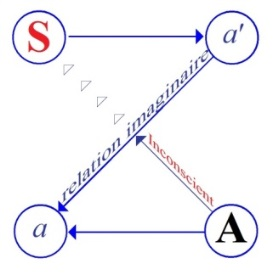

# Leçon 06 | 09 Janvier 1957

<!-- source-url: http://staferla.free.fr/S4/S4 LA RELATION.docx -->
<!-- seminar: s4 -->
<!-- lesson: 06 -->

<!-- id: s4-06-0001 -->

Nous allons aujourd’hui faire un saut dans un problème que, si nous avions procédé pas à pas, nous aurions dû normalement rencontrer beaucoup plus avant dans notre discours, c’est celui de *la perversion* la plus problématique qui soit dans la perspective de l’analyse, à savoir *l’homosexualité féminine*. Pourquoi procèderai-je ainsi ? Je dirais qu’il y a là-dedans une part de *contingence.*

<!-- id: s4-06-0002 -->

Il est certain que nous ne pourrions pas procéder cette année à un examen de la relation d’objet sans rencontrer l’objet féminin, et vous savez que le problème n’est pas tellement de savoir comment nous rencontrons l’objet féminin dans l’analyse…
là dessus l’analyse nous en donne assez pour nous édifier quand le sujet de cette rencontre n’est pas naturel,

je vous l’ai assez montré dans la première partie de ces séminaires du trimestre dernier, en vous rappelant

que le sujet féminin est toujours appelé dans sa rencontre à une sorte de retrouvaille qui le place d’emblée

par rapport à l’homme, dans cette ambiguïté des rapports naturels et des rapports symboliques

qui est bien ce dans quoi j’essaye de vous démontrer toute la dimension analytique
…le problème est assurément de *savoir ce que l’objet féminin en pense -* et *ce que l’objet féminin en pense* c’est encore moins naturel
que la façon dont le sujet masculin l’aborde - *ce que l’objet féminin en pense*, à savoir quel est son chemin depuis ses premières approches de l’objet naturel et primordial du désir, à savoir le sein maternel. Comment *l’objet féminin* entre dans cette dia­lectique ?

<!-- id: s4-06-0003 -->

Ce n’est pas pour rien que je l’appelle aujourd’hui *objet*, il est clair qu’il doit entrer à quelque moment en fonction, cet *objet*, seulement il prend cette position fort peu naturelle d’*objet*, puisque c’est une position au second degré qui n’a d’intérêt
à se qualifier comme telle que parce que c’est une position qui est prise par un sujet.

<!-- id: s4-06-0004 -->

L’homosexualité féminine a pris dans toute l’analyse une valeur parti­culièrement exemplaire dans ce qu’elle a pu révéler des étapes, du cheminement et des arrêts dans ce cheminement qui peuvent marquer le destin de la femme dans ce rapport naturel, biologique au départ, mais qui ne cesse de porter sur *le plan symbolique*, sur *le plan de l’assomption à ce sujet* en tant qu’il est pris
lui-même dans la chaîne symbolique.

<!-- id: s4-06-0005 -->

C’est bien là qu’il s’agit de la femme, et c’est bien dans toute la mesure où *elle a à faire un choix* - qui doit, par quelque côté
que ce soit, être, comme l’expérience analytique nous l’apprend, un compro­mis entre ce qui est à atteindre et ce qui n’a pas pu être atteint - que l’*ho­mosexualité féminine* se rencontre chaque fois que la discussion s’établit sur le sujet des étapes que la femme
a à remplir dans son achèvement *symbolique*.

<!-- id: s4-06-0006 -->

Ceci doit mener, pendant cet intervalle, à épuiser un certain nombre de textes, nommément ceux qui s’étagent,
pour ce qui est de FREUD, entre 1923 que vous pouvez noter comme la date de son article sur *L’organisation génitale infantile* [^12] où il pose comme un principe le primat de l’assomption phallique comme étant à la fin de la phase infantile de la sexualité,
d’une phase typique pour le garçon comme pour la fille.

<!-- id: s4-06-0007 -->

L’organisation génitale est atteinte pour l’un comme pour l’autre, mais sur un type qui fait de la possession, ou de la non possession, du *phallus* l’élément différentiel primordial dans lequel à ce niveau l’organisation génitale des sexes s’oppose.
Il n’ y a pas à ce moment, nous dit FREUD, de réalisation du *mâle* et de la *femelle*, mais

<!-- id: s4-06-0008 -->

- de ce qui est *pourvu* de l’attribut phallique,

<!-- id: s4-06-0009 -->

- et ce qui en est *dépourvu* est considéré comme équivalent à châtré.

<!-- id: s4-06-0010 -->

Et j’ajoute pour bien préciser sa pensée, que cette orga­nisation est la formule d’une étape essentielle et terminale de la première phase de la sexualité infantile, celle qui s’achève à l’entrée de la période de latence. Je précise la pensée : c’est que ceci est fondé,
pour l’un comme pour l’autre sexe, sur *une maldonne*, et cette *maldonne* est fondée sur *l’ignorance*, il ne s’agit pas de *méconnaissance* mais d’*ignorance* du rôle fécondant de la semence masculine, et de l’autre côté de l’existence comme telle de l’organe féminin.
Ce sont des affirmations absolument énormes, et qui demandent pour être comprises une exégèse, car nous ne pouvons pas nous trouver là en présence de quelque chose qui puisse être pris au niveau de l’expérience réelle.

<!-- id: s4-06-0011 -->

Je veux dire que - comme l’ont soulevé, d’ailleurs dans la plus grande confusion, les auteurs qui à partir de là sont entrés
en action à la suite de cette affirmation de FREUD - un très grand nombre de faits montre que, sur un certain nombre
de plans vécus, toutes sortes de choses admettent que se révèle la présence, sinon du rôle mâle dans l’acte de la procréation,
assurément de l’existence de l’organe féminin, au moins dans la femme elle-même.

<!-- id: s4-06-0012 -->

Qu’il y ait dans l’expérience précoce de la petite fille quelque chose qui corresponde à la localisation vaginale,
qu’il y ait des émotions, voire même une masturbation vaginale précoce, je crois que c’est ce qui ne peut guère être contesté,
au moins comme étant réalisé dans un certain nombre de cas. Et on part de savoir si effectivement c’est à l’existence du clitoris que doit être attribué cette prédominance de la phase phallique, si c’est du fait que comme on le dit, la libido
\- faisons de ce terme le synonyme de toute expérience érogène - est primitivement et exclusivement à l’origine concentrée sur
le clitoris, et si ce n’est peut-être qu’à la suite d’un déplacement qui doit être long et pénible, et qui nécessite tout un long détour.

<!-- id: s4-06-0013 -->

Je crois qu’assurément ce ne peut pas être dans ces termes que peut être comprise l’affirmation de FREUD.
Trop de faits d’ailleurs confus, permettent là­-dessus d’élever toutes sortes d’objections.
Je ne fais allusion qu’à l’une d’entre elles en vous rappelant que nous devons admettre, si nous voulons concevoir d’une façon qui paraît exiger par un certain nombre de prémisses qui sont justement ces prémisses réalistes qui considèrent que toute espèce

<!-- id: s4-06-0014 -->

de mécon­naissance suppose dans l’inconscient une certaine connaissance de la coaptation des sexes, qu’il ne saurait y avoir
chez la fille cette prévalence précisément de l’organe qui ne lui appartient pas comme tel et en propre, que sur le fond
d’une certaine dénégation de l’existence du vagin, et qu’il s’agit d’en rendre compte.

<!-- id: s4-06-0015 -->

C’est à partir de ces hypothèses admises comme *a priori* que la fille s’efforce de retracer une genèse de ce terme *phallique*.
Chez la fille nous entrerons dans le détail et nous verrons cette sorte de nécessité empruntée à un certain nombre de prémisses, en partie exprimées d’ailleurs par l’auteur FREUD lui-même, et il montre bien que par l’incertitude même du fait dernier
auquel elle se rapporte - car les faits sur lesquels elle s’appuie, cette « *primordiale expérience de l’organe vaginal »*, sont très prudents, même réservés - il ne s’agit bien chez elle que d’une sorte de reconstruction exigée par des prémisses qui sont des prémisses théoriques qui relèvent précisément d’une fausse voie dans la façon dont il convient de comprendre l’affirmation de FREUD, fondée sur son expérience, avancée par lui d’ailleurs avec prudence, voire cette part d’incertitude qui est si caracté­ristique de

<!-- id: s4-06-0016 -->

sa présentation de cette découverte, mais qui n’en est pas moins affirmée comme *primordiale*, et même comme devant être prise comme point fixe, comme pivot autour duquel l’interprétation théorique elle-même doit se développer.

<!-- id: s4-06-0017 -->

C’est ce que nous allons essayer de faire à partir de cette affirmation para­doxale sur le terme du *phallicisme*, entre ces affirmations de FREUD au point de son œuvre où elles se produisent, et les prolongements qu’il lui donne quand huit ans plus tard, en 1931,

<!-- id: s4-06-0018 -->

il écrit sur la sexualité féminine[^13] une chose encore plus énorme.

<!-- id: s4-06-0019 -->

Dans l’intervalle une discussion extrêmement active s’élève, une moisson de spéculations, d’autant que le fait est rapporté par \[...\] et par JONES aussi. Et il y a là tout un véritable progrès d’approximations qui est bien celui auquel j’ai dû me dévouer
pendant ces vacances, et dont je dirais qu’il m’a paru extrêmement difficile, sans le fausser, d’en rendre compte,
parce que ce qui le caractérise est assurément son caractère immaitrisé.

<!-- id: s4-06-0020 -->

Nous allons avoir à épuiser ce caractère profondément immaitrisé des catégories mises en jeu, et pour en rendre compte
et se faire entendre il n’y a pas moyen de procéder autrement qu’en le maîtrisant, et le maîtriser c’est déjà le changer complètement d’axe et de nature, et c’est quelque chose qui même jusqu’à un certain point, ne peut pas donner véritablement une juste perspective de ce dont il s’agit, car ce caractère est vraiment essentiel à tout ce problème, il est vraiment cor­rélatif

<!-- id: s4-06-0021 -->

de ce qui est ici le second but de notre examen théorique de cette année nous montrer comment parallèlement et inflexiblement la pratique analytique elle-même s’engage dans une déviation immaîtrisable.

<!-- id: s4-06-0022 -->

Et je dirais qu’une fois de plus, pour revenir à cette incidence précise qui fait l’objet de ce que je vous expose au milieu
de tout cet amas de faits, il m’apparaissait ce matin qu’il pouvait être retenu comme une sorte d’image exemplaire ce petit fait simplement recueilli au cours d’un de ces articles - il s’agit de quelque chose admis par tous - c’est que pour la petite fille
au détour de cette évolution et au moment où elle entre dans l’œdipe, c’est bien comme substitut de ce *phallus* manquant
qu’elle se met à désirer un enfant du père. Et l’un de ces auteurs citait comme exemple une analyse d’enfant.

<!-- id: s4-06-0023 -->

Et pour montrer combien il y a là quelque chose qui peut entrer en jeu avec une incidence présente dans la précipitation
du mouvement de l’œdipe…
à savoir que la déception de ne pas recevoir un enfant du père est quelque chose qui va jouer un rôle essentiel pour faire revenir la petite fille de ce dans quoi elle est entrée dans l’œdipe, à savoir par ce chemin paradoxal d’abord de l’identification au père, pour qu’elle reprenne la position féminine, tous les auteurs en principe l’admettent, par la voie de cette privation de l’enfant désiré du père

<!-- id: s4-06-0024 -->

…et exem­plifiant ce mouvement qui nous est donné comme étant toujours essentiellement inconscient par un cas où en somme une analyse avait permis à une enfant de mettre au jour cette image de la petite fille qui, d’avoir été en cours d’analyse et se trouvant avoir de ce fait plus de lumière qu’une autre à la suite de quelque éclair­cissement sur *ce qui se passait dans son inconscient*,

<!-- id: s4-06-0025 -->

se levait tous les matins, en demandant si le petit enfant du père était arrivé, et si c’était pour aujourd’hui ou pour demain.

<!-- id: s4-06-0026 -->

Et c’est avec colère et pleurs qu’elle le demandait chaque matin.

<!-- id: s4-06-0027 -->

Cet exemple me paraît une fois de plus exemplaire de ce dont il s’agit dans cette *déviation de la pratique analytique* qui est celle

<!-- id: s4-06-0028 -->

qui est toujours l’ac­compagnement de notre exploration théorique cette année, concernant la relation d’objet, car à la vérité
nous touchons là du doigt la façon dont un certain mode de comprendre, d’attaquer les frustrations est quelque chose
qui dans la réalité, mène l’analyse à un mode d’*intervention* dont les effets, non seulement peuvent apparaître douteux,
mais manifestement à l’opposé de ce qui est en jeu dans ce qu’on peut appeler le procès de l’interprétation analytique.

<!-- id: s4-06-0029 -->

Il est tout à fait clair que la notion que nous pouvons avoir qu’à un moment donné dans l’évo­lution, l’enfant apparaisse

<!-- id: s4-06-0030 -->

comme un *objet imaginaire*, comme substitut de ce *phallus* manquant qui joue dans l’évolution de la petite fille un rôle essentiel,
est quelque chose qui n’a littéralement d’intérêt, qui ne peut être mis en jeu légitimement pour autant qu’ultérieurement,

<!-- id: s4-06-0031 -->

ou même à une étape contem­poraine, l’enfant, le sujet a affaire à lui, entre dans le jeu d’une série de réso­nances symboliques qui vont intéresser dans le passé, qui vont mettre en jeu ce que l’enfant a expérimenté à l’état phallique, à savoir tout ce qui peut être lié pour lui de réactions possessives ou destructives au moment de la crise phal­lique, avec ce qu’elle comporte de véritablement problématique dans l’étape de l’enfance à laquelle elle correspond.

<!-- id: s4-06-0032 -->

C’est en somme « *après coup* » que tout ce qui se rapporte à cette prévalence ou prédominance du *phallus* à une étape
de l’évolution de l’enfant, prendra ces incidences, et pour autant qu’il entre dans la nécessité à tel ou tel moment de symboliser quelque évènement qui arrivera, soit la venue tardive d’un enfant pour quelqu’un qui est en relation immédiate avec l’enfant,
ou bien que pour le sujet effectivement la question de possession de l’enfant, la question de sa propre maternité se posera.
Mais que faire intervenir, si ce n’est à ce moment ou au moment où cela se produit, non pas quelque chose qui intervient
dans *la structuration symbolique du sujet*, mais dans un certain *rapport de subs­titution imaginaire* précipité à ce moment là par la parole dans le plan sym­bolique, ce qui à ce moment là est vécu d’une façon tout à fait différente par l’enfant, c’est lui donner
en quelque sorte déjà la sanction d’une organisation, l’introduction dans une sorte de légitimité qui littéralement consacre

<!-- id: s4-06-0033 -->

*la frus­tration* comme telle, l’instaure au centre de l’expérience, alors qu’elle n’est légi­timement introduite comme *frustration*

<!-- id: s4-06-0034 -->

que si elle s’est passée effectivement au niveau de l’inconscient, comme la théorie juste nous le dit.

<!-- id: s4-06-0035 -->

Cette *frustration* n’est qu’un moment évanouissant et aussi un moment qui n’a d’importance et de fonction que - pour nous *analystes* - sur le plan pure­ment théorique d’articulation de ce qui s’est passé. Sa réalisation par le sujet est par définition *exclue*, parce qu’elle est extraordinairement instable. Elle n’a d’importance et d’intérêt que pour autant qu’elle débouche
dans quelque chose d’autre qui est l’un ou l’autre de ces deux plans que je vous ai distingués, de *la privation* et de *la castration*,
celui de *la castration* n’étant rien d’autre que :

<!-- id: s4-06-0036 -->

- ce qui instaure justement dans son ordre vrai la nécessité de cette *frustration*,

<!-- id: s4-06-0037 -->

- ce qui *la transcende* et l’instaure dans quelque chose qui est une loi qui lui donne une autre valeur,

<!-- id: s4-06-0038 -->

- et ce qui de là, d’ailleurs consacre l’existence de *la privation,* parce que sur le plan du *réel* aucune espèce d’idée de *privation* n’est concevable que pour un être qui articule quelque chose dans le plan *symbolique*, et c’est uniquement à partir de là qu’une *privation* peut être conçue effecti­vement.

<!-- id: s4-06-0039 -->

Nous le saisissons dans les interventions qui sont en quelque sorte *des interventions de soutien, des interventions de psychothérapie* comme celle par exemple que je vous évoquais rapidement à propos de la petite fille qui était aux mains d’une élève d’Anna FREUD,
et qui avait cette ébauche de phobie à propos de l’expérience qu’elle avait d’être effectivement privée de quelque chose,
dans des conditions différentes de celle à laquelle l’enfant se trouvait contrainte, et dont je vous ai montré que ce n’est pas
du tout dans cette expérience que gît vraiment le ressort du déplacement nécessaire de la phobie, mais bien dans le fait,
non pas qu’elle n’ait pas ce *phallus*, mais *que sa mère ne pouvait pas le lui donner*, et bien plus encore *qu’elle ne pouvait pas le lui donner parce qu’elle ne l’avait pas elle-même*.

<!-- id: s4-06-0040 -->

L’intervention que fait la psychothérapeute qui consiste à lui dire - et elle a bien raison - que toutes les femmes sont comme ça, peut laisser penser qu’il s’agit d’*une réduction au réel*. Ce n’est pas *une réduction au réel* parce que l’enfant sait très bien qu’elle n’a pas
de *phallus*, elle lui apprend que la règle, c’est en tant qu’elle le fait passer sur *le plan symbolique de la loi* qu’elle intervient d’une façon qui en effet se discute du point de vue de l’efficacité, car à la vérité elle ne fait que s’interroger sur le fait que son intervention
a pu être efficace, ou pas, dans une certaine réduction de la phobie. À ce moment là il est clair qu’elle n’est efficace
que d’une façon extrêmement momentanée, et que la phobie repart de plus belle.

<!-- id: s4-06-0041 -->

Elle ne se réduira que lorsque l’enfant aura été réintégrée dans une famille complète, c’est à dire au moment où en principe
sa frustration devrait lui apparaître encore plus grande que précédemment, puisque la voici confrontée avec un beau-père,
c’est à dire avec un mâle qui entre dans le jeu de la famille - sa mère étant jusque là veuve - et avec un grand frère,
seulement à ce moment là la phobie se trouve réduite parce que littéralement elle n’en a plus besoin pour suppléer
à cette absence dans le circuit symbolique, de tout élément proprement phallophore, c’est à dire des mâles.

<!-- id: s4-06-0042 -->

Le point essentiel de ces remarques critiques sur l’usage que nous faisons du terme de « *frustration »*...
qui bien entendu est d’une certaine façon légitimé par le fait que ce qui est essentiel dans cette dialectique,
c’est plus *le manque d’objet,* que l’objet lui-même, d’une certaine façon la *frustration* répond fort bien en apparence à cette notion conceptuelle
...porte sur l’instabilité de la dialectique même de la *frustration*.

<!-- id: s4-06-0043 -->

*Frustration* n’est pas privation. Pourquoi ? La *frustration* est quelque chose dont vous êtes privés par quelqu’un d’autre, dont vous pouviez justement attendre ce que vous lui demandiez. Ce qui est en jeu dans la *frustration*, c’est ce quelque chose qui est moins *l’objet* que *l’amour* de qui peut vous faire ce don, si cela vous est donné. L’objet de la *frustration* c’est moins *l’objet* que *le don*.
Nous nous trouvons là à l’origine d’une dialectique qui est l’écart sym­bolique, elle-même d’ailleurs à chaque instant évanouissante puisque ce don est un don qui n’est pas encore apporté que comme dans une certaine gratuité.

<!-- id: s4-06-0044 -->

*Le don* vient de l’Autre. Ce qu’il y a derrière l’Autre, à savoir toute la chaîne en raison de quoi vous vient ce *don,*
est encore inaperçu, et ce sera à partir du moment où c’est aperçu, que le sujet s’apercevra que le *don* est bien plus complet
que cela n’apparaît d’abord, à savoir que ça intéresse toute la chaîne humaine.

<!-- id: s4-06-0045 -->

Mais au départ de la dialectique de *la frustration,* il n’y a que cela, cette confrontation avec l’Autre, ce *don* qui surgit,
mais qui, s’il est apporté comme un *don*, fait s’évanouir l’objet lui-même en tant qu’objet.

<!-- id: s4-06-0046 -->

- Si en d’autres termes, la demande était exaucée, *l’objet* passerait au second plan.

<!-- id: s4-06-0047 -->

- Par contre si la demande n’est pas exaucée, *l’objet* aussi dans ce cas là *s’évanouit* et change de signification.

<!-- id: s4-06-0048 -->

Si vous voulez soutenir le mot « *frustration »* - car il y a *frustration* si le sujet entre dans la revendication que ce terme implique -
c’est en faisant intervenir l’objet comme quelque chose qui était exigible en droit, qui était déjà de ses appartenances.
L’objet à ce moment rentre dans ce qu’on pourrait appeler l’ère narcissique des appartenances du sujet.

<!-- id: s4-06-0049 -->

Dans les deux cas, quoi qu’il arrive, le moment de la *frustration* est un moment évanouissant qui débouche sur quelque chose
qui nous projette dans un autre plan que le plan du pur et simple désir.

<!-- id: s4-06-0050 -->

La demande en quelque sorte a quelque chose que l’expérience humaine connaît bien, c’est qu’elle a en elle-même quelque chose qui fait qu’elle ne peut jamais comme telle, véritablement être exaucée. Exaucée ou non, elle *s’annihile, s’anéantit* à l’étape suivante, et elle se projette tout de suite sur autre chose :

<!-- id: s4-06-0051 -->

- ou sur l’articulation de la chaîne des dons,

<!-- id: s4-06-0052 -->

- ou sur ce quelque chose de fermé et d’absolument inextinguible qui s’appelle *le narcissisme*, et grâce à quoi *l’objet* pour le sujet est à la fois quelque chose *qui est lui* et *qui n’est pas lui*, dont il ne peut jamais se satisfaire, précisément en ce sens que *c’est lui* et que *ce n’est pas lui* à la fois.

<!-- id: s4-06-0053 -->

C’est uniquement pour autant que la frustration entre dans une dialectique qui en la légalisant, lui donne aussi cette dimension de la gratuité, la situe quelque part, que peut s’établir aussi cet *ordre symbolisé du Réel* où le sujet peut instaurer,
par exemple comme existantes et admises, certaines *privations* permanentes.

<!-- id: s4-06-0054 -->

Ceci est quelque chose qui, d’être méconnu, introduit toutes espèces de façons de reconstruire tout ce qui nous est donné
dans l’expérience, comme effet lié au fondamental *manque d’objet*, qui introduit toute une série d’impasses toujours liées à l’idée
de vouloir détruire - à partir du désir considéré comme un élément pur de l’individu, du désir avec ce qu’il entraine comme contre­coup dans sa satisfaction comme dans sa déception - de vouloir tenir, de recons­truire toute la chaîne de l’expérience

<!-- id: s4-06-0055 -->

qui ne peut littéralement s’élaborer, se concevoir que si nous posons d’abord en principe que rien ne s’articule, que rien ne peut s’échafauder dans l’expérience, si nous ne posons pas comme *antérieur* le fait que rien ne s’instaure, ne se constitue comme conflit proprement analysable, si ce n’est à partir du moment où le sujet entre :

<!-- id: s4-06-0056 -->

- dans *l’ordre légal*,

<!-- id: s4-06-0057 -->

- dans *l’ordre symbolique*,

<!-- id: s4-06-0058 -->

- entre dans un ordre qui est *ordre de symbole, chaîne symbolique, ordre de la dette symbolique*.

<!-- id: s4-06-0059 -->

C’est uniquement à partir de cette entrée dans quelque chose qui est préexistant à tout ce qui arrive au sujet, à toute espèce d’événement ou de déception, c’est à partir de ce moment-là que tout ce par quoi il l’aborde - à savoir son vécu, son expérience, cette chose confuse qui est là avant qu’elle s’ordonne - s’articule, prend son sens et seulement comme telle peut être analysée.

<!-- id: s4-06-0060 -->

Nous ne pouvons *nulle part mieux* entrer naïvement dans ces références, on ne peut *nulle part mieux* vous faire voir le bien-fondé de ce rappel, qui ne devrait être qu’un rappel, qu’à partir de quelques textes de FREUD lui-même.

<!-- id: s4-06-0061 -->

Hier soir quelques uns ont parlé d’un certain côté *incertain*, quelquefois para­doxalement *sauvage* de quelques textes,

<!-- id: s4-06-0062 -->

ils ont même parlé d’éléments *d’aven­ture*, ou encore on a même dit *de diplomatie* - on ne voit d’ailleurs pas pourquoi -
c’est pourquoi je vous en ai choisi *un des plus brillants*, je dirais même presque *des plus troublants*, mais il est concevable

<!-- id: s4-06-0063 -->

qu’il puisse apparaître comme vrai­ment archaïque, voir démodé. Il s’agit d’une *psychogénèse d’un cas d’homosexualité féminine* [^14].

<!-- id: s4-06-0064 -->

Je vou­drais simplement vous en rappeler les articulations essentielles. Il s’agit d’une fille d’une bonne famille de Vienne,
et pour une bonne famille c’était franchir un assez grand pas que d’envoyer quelqu’un chez FREUD, cela se passe en 1920.

<!-- id: s4-06-0065 -->

C’est que quelque chose de très singulier était arrivé, c’est-à-dire que la fille de la maison, 18 ans, belle, intelligente, classe sociale très élevée, est un objet de souci pour ses parents parce qu’elle court après une personne qu’on appelle « *dame du monde* »,
de 10 ans son aînée, et dont il est précisé par toutes sortes de détails qui nous sont donnés par la famille, que cette *dame du monde* est peut-être d’un monde qu’on pourrait qualifier de « *demi-monde* » dans le clas­sement régnant à ce moment là à Vienne

<!-- id: s4-06-0066 -->

et considéré comme respectable.

<!-- id: s4-06-0067 -->

La sorte d’attachement - dont tout révèle, à mesure que les évènements s’avancent, qu’il est véritablement passionnel -
qui l’attache à cette dame est quelque chose qui la met dans des rapports assez pénibles avec sa famille.
Nous apprenons par la suite que ces rapports assez pénibles ne sont pas étrangers à l’instauration de toute la situation,
pour tout dire, le fait que ça rende le père absolument enragé est certainement un motif, semble-t-il, pour lequel la jeune fille d’une certaine façon, non pas soutient cette passion, mais la mène. Je veux dire l’espèce de *défi tranquille* avec lequel elle poursuit ses assiduités auprès de la dame en question, ses attentes dans la rue, la façon dont elle affiche partiellement son affaire
sans en faire étalage, tout cela suffit pour que ses parents n’en ignorent rien, et tout spécialement son père.
On nous indique aussi que la mère n’est pas quelqu’un de tout repos, elle a été névrosée et elle ne prend pas cela tellement mal, en tout cas pas tellement au sérieux.

<!-- id: s4-06-0068 -->

On vient demander à FREUD d’arranger cela, et il remarque fort perti­nemment les difficultés de l’instauration d’un traitement quand il s’agit de satis­faire aux exigences de l’entourage. FREUD fait très justement remarquer que l’on ne fait pas une analyse sur commande. À la vérité ceci ne fait qu’introduire quelque chose d’encore plus extraordinaire, et qui va dans un sens qui est bien celui qui nous fera apparaître des considérations de FREUD vis-à-vis de l’analyse elle-même, qui à certains paraîtront
bien dépassées. À savoir ce que FREUD nous a dit, pour expliquer que son analyse n’a pas été à son terme, qu’elle lui a permis de voir très très loin - et c’est pour cela qu’il nous en fait part - mais qu’assurément elle ne lui a pas permis de changer
grand chose au destin de cette jeune fille.

<!-- id: s4-06-0069 -->

Et pour l’expliquer il introduit cette *idée,* qui n’est pas sans fondement, bien qu’elle puisse paraître désuète,
c’est une idée schématique qui doit plutôt nous inciter à revenir sur certaines données premières, qu’à nous trouver *plus maniable*, à savoir qu’il y a deux éléments dans une analyse :

<!-- id: s4-06-0070 -->

- le premier étant en quelque sorte le ramassage de tout ce qu’on peut savoir.

<!-- id: s4-06-0071 -->

- ensuite on va faire fléchir les résistances qui tiennent encore parfaitement, où le sujet sait déjà beaucoup de choses.

<!-- id: s4-06-0072 -->

Et la comparaison qu’il introduit là n’est pas une des moins stupéfiantes : il compare cela au *rassemblement des bagages*
avant un voyage qui est toujours une chose assez compliquée, puis il s’agit de s’embarquer et de parcourir le chemin.
Cette référence chez quelqu’un qui a une phobie des chemins de fer et des voyages, est tout de même assez piquante !
Mais ce qui est bien plus énorme encore, c’est que pendant tout ce temps là, il a le sentiment qu’effectivement rien ne se passe.
Par contre il voit très bien ce qui s’est passé et il met en relief un certain nombre d’étapes.

<!-- id: s4-06-0073 -->

Il voit bien que dans l’enfance il y a eu *quelque chose* qui semble ne s’être pas passé tout seul au moment où de ses deux frères
elle a pu appréhender, à propos de l’aîné précisément, la différence qui la faisait, elle, consister en quelqu’un *qui n’avait pas* d’objet essentiellement désirable, *l’objet phallique*, et ça ne s’est pas passé tout seul. L’un de ces deux frères, lui, est plus jeune.
Néanmoins, jusque-là - nous dit-il - la jeune fille n’a jamais été névrosée, aucun *symptôme hystérique* n’a été apporté à l’analyse,
rien dans l’histoire infantile n’est notable du point de vue des conséquences pathologiques.

<!-- id: s4-06-0074 -->

Et c’est bien pour cela qu’il est frappant dans ce cas - au moins cliniquement - de voir éclore aussi tardivement le déclenchement d’une attitude qui paraît à tous franchement anormale, et qui est celle de cette position singulière qu’elle occupe vis-à-vis
de cette femme un tant soit peu décriée, et à laquelle elle marque cet attachement passionné qui la fait aboutir à cet éclat
qui l’a amenée à la consultation de FREUD. Car s’il a fallu en venir à s’en remettre à FREUD, c’est qu’il s’était produit quelque chose de marquant, à savoir qu’avec ce *doux flirt* que la jeune fille faisait avec le danger, c’est à dire qu’elle allait quand même
se promener avec la dame presque sous les fenêtres de sa propre maison, un jour le père sort, voit cela et - se trouvant en face d’autres personnes - leur jette un regard flambant et s’en va. Par contre la dame demande à la jeune fille :

<!-- id: s4-06-0075 -->

- « *Qui est cette personne ?* »

<!-- id: s4-06-0076 -->

- « *C’est papa.* »

<!-- id: s4-06-0077 -->

- « *Il n’a pas l’air content !* »

<!-- id: s4-06-0078 -->

La dame prend alors la chose fort mal. Il nous est indiqué que jusque là, elle a eu avec la jeune fille une attitude très réservée, voire plus que froide, et qu’assurément elle n’a pas du tout encouragé ces assiduités, qu’elle n’avait pas spécialement de désir d’avoir des complications, et elle lui dit : « *Dans ces conditions là on ne se revoit plus !* ». Il y a dans Vienne des espèces de *petits chemins de fer de ceinture*, on n’est pas très loin d’un de ces petits ponts, et voilà la fille qui se jette en bas de l’un de ces petits ponts,
elle choit, *niederkommt*. Elle se rompt un peu les os, mais s’en tire.

<!-- id: s4-06-0079 -->

Donc nous dit FREUD, jusqu’au moment où est apparu cet attachement, la jeune fille avait eu un développement
non seulement normal, mais dont tout faisait penser qu’il s’orientait très bien : n’avait-elle pas à 13 ou 14 ans,
quelque chose qui faisait espérer le développement le plus sympathique de la vocation féminine, celle de la maternité ?

<!-- id: s4-06-0080 -->

Elle pouponnait un petit garçon des amis des parents et tout d’un coup cette sorte d’amour maternel, qui semblait en faire d’avance le modèle des mères, s’arrête subitement, et c’est à ce moment là, nous dit FREUD, qu’elle commence à fréquenter - car l’aventure dont il s’agit n’est pas la première - des femmes qu’il qualifie de « *déjà mûres* », c’est-à-dire des sortes de substituts maternels d’abord, semble-t-il . Tout de même ce schéma ne vaut pas tellement pour la dernière personne, celle qui vraiment
a incarné l’aventure dramatique au cours de laquelle va tourner le déclenchement de l’analyse, et également la problématique d’une homosexualité déclarée, car le sujet déclare à FREUD qu’il n’est pas question pour elle d’abandonner quoi que ce soit
de ses prétentions, ni de son choix objectal.

<!-- id: s4-06-0081 -->

Elle fera tout ce qu’il faudra pour tromper sa famille, mais elle continuera à assurer ses liens avec la personne pour laquelle
elle est loin d’avoir perdu le goût, et qui s’est trouvée assez émue par cette extraordinaire marque de dévotion pour être devenue beaucoup plus traitable pour elle depuis. Cette relation donc *déclarée*, maintenue par le sujet, est quelque chose à propos de quoi FREUD nous apporte de très frappantes remarques. Il y en a auxquelles il donne valeur de sanction :

<!-- id: s4-06-0082 -->

- soit explicative de ce qui s’est passé avant le traitement, par exemple la tentative de suicide,

<!-- id: s4-06-0083 -->

- soit explicative de son échec à lui.

<!-- id: s4-06-0084 -->

Les premières paraissent très pertinentes, les secondes aussi, peut-­être pas tout à fait comme il l’entend lui-même,

<!-- id: s4-06-0085 -->

mais c’est le propre des obser­vations de FREUD de nous laisser toujours beaucoup de clarté extraordinaire,
même sur les choses qui l’ont en quelque sorte lui-même dépassé.

<!-- id: s4-06-0086 -->

Je fais allusion à l’observation de Dora où FREUD y a vu clair ultérieurement, il était intervenu auprès de Dora
alors qu’il méconnaissait l’orientation de sa question vers son propre sexe, à savoir l’homosexualité de Dora.
Ici on constate une *méconnaissance* d’un ordre analogue, mais beaucoup plus instructif parce que beaucoup plus profond.

<!-- id: s4-06-0087 -->

Puis, il y a aussi des choses qu’il nous dit, et dont il ne tire qu’un parti incomplet, et qui ne sont certainement pas les moins intéressantes sur le sujet de ce dont il s’agit dans cette tentative de suicide, qui en quelque sorte se couronne dans *un acte significatif*, une crise dont on ne peut certainement pas dire que le sujet n’est pas intimement lié à la montée de la tension,
jusqu’au moment où le conflit éclate et arrive à une catastrophe.

<!-- id: s4-06-0088 -->

Il nous explique ceci de la manière suivante : c’est dans le registre d’une *orientation* en quelque sorte normale, vers un désir d’avoir un enfant du père, qu’il faut concevoir la crise originaire qui a fait s’engager ce sujet dans quelque chose qui va strictement
à l’opposé, puisqu’il nous est indiqué qu’il y a eu un véritable renversement de la position, et FREUD essaye de l’articuler.
Il s’agit d’un de ces cas où la déception par l’objet du désir se résume par un ren­versement complet de la position, qui est identification à cet objet, et qui de ce fait - FREUD l’articule exactement dans une note - équivaut à *une régression au narcissisme*.

<!-- id: s4-06-0089 -->

Quand je fais de la dialectique du narcissisme essentiellement ce rapport « *moi ↔ petit autre* », je ne fais absolument rien d’autre que de mettre en évidence ce qui est implicite dans toutes les façons dont FREUD s’exprime. Quelle est donc cette déception, ce moment vers la quinzième année où le sujet...
engagé dans la voie d’une prise de possession de cet *objet imaginaire*, de cet *enfant imaginaire*,
elle s’en occupe assez pour que ça fasse une date dans les antécédents du patient
...opère ce renversement ?

<!-- id: s4-06-0090 -->

À ce moment-là sa mère a *réellement* un enfant du père, autrement dit la patiente fait l’acquisition d’un 3ème frère. Voici donc
*le point clé*, le caractère également en apparence *exceptionnel* de cette observation à la suite de quelque chose qui s’est passé.
Il s’agit maintenant de voir où cela s’interprétera le mieux, parce qu’enfin ce n’est pas banal non plus qu’il résulte
de l’intervention d’un petit, tard venu comme celui-là, un retournement profond de l’orientation sexuelle d’un sujet.

<!-- id: s4-06-0091 -->

C’est donc à ce moment–là que la fille change de position, et il s’agit de savoir ce qui arrive. FREUD nous le dit : c’est quelque chose qu’il faut considérer comme assu­rément *réactionnel* - le terme d’ailleurs n’est pas dans le texte, mais il est impliqué puisqu’il continue de supposer que le ressentiment à l’endroit du père continue de jouer - c’est là *le rôle majeur*, *une cheville* dans la situation, celle qui explique toute la façon dont l’aventure est menée.

<!-- id: s4-06-0092 -->

Elle est nettement agres­sive à l’endroit du père, et il ne s’agirait dans la tentative de suicide, à la suite de la déception produite par le fait que l’objet de son attachement homologue en quelque sorte la contrecarre, que de la contre-agressivité du père,

<!-- id: s4-06-0093 -->

d’un retour­nement de cette agression sur le sujet lui-même, combiné avec quelque chose, nous dit FREUD,
qui satisfait symboliquement ce dont il s’agit. À savoir que par une sorte de *précipitation*, de *réduction* au niveau des objets véritablement en jeu, une sorte d’effondrement de toute la situation sur des données primitives, quand la fille *niederkommt*,
*choit* au bas de ce pont, elle fait *un acte symbolique* qui n’est autre chose que le *nierderkommen* d’un enfant dans l’*accouchement*,
c’est le terme employé en allemand pour dire qu’on est « *mis bas* ».

<!-- id: s4-06-0094 -->

Il y a là quelque chose qui nous ramène au sens dernier et originaire d’*une structure* de la situation.

<!-- id: s4-06-0095 -->

Dans *le deuxième ordre des remarques* que nous fait FREUD, il s’agit d’ex­pliquer en quoi la situation a été sans issue

<!-- id: s4-06-0096 -->

à l’intérieur du traitement, et il nous le dit. C’est pour autant *que la résistance n’a pas été vaincue*, que tout ce qu’on a pu lui dire
n’a jamais fait que l’intéresser énormément, sans qu’elle abandonne ses positions dernières, à savoir qu’elle a maintenu tout cela, comme on dirait aujourd’hui, sur le plan d’un intérêt intellectuel. Il compare la personne dans ses réactions, à peu près à la dame à qui on montre des objets divers, et qui à travers son face-à-main dit « *comme c’est joli !* »*.*

<!-- id: s4-06-0097 -->

C’est une métaphore. Il dit que néanmoins on ne peut pas dire qu’il y ait eu absence de tout *transfert*, et il dénote cette présence du *transfert* avec une très grande perspicacité dans quelque chose qui est les rêves de la patiente, rêves qui en eux-mêmes...
et parallèlement aux déclarations, même non ambiguës, que la patiente lui fait de sa détermination

de ne rien changer à ses compor­tements à l’endroit de la dame

<!-- id: s4-06-0098 -->

...annoncent tout un *refleurissement* étonnant de l’orientation la plus sympathique, à savoir de la venue de quelque beau
et satisfaisant époux, non moins que l’attente de l’évènement d’un objet, fruit de cet amour.

<!-- id: s4-06-0099 -->

Bref quelque chose de tellement presque forcé dans le caractère idyllique de cet époux annoncé par le rêve \[en réponse\]
aux efforts entrepris en commun, que quiconque ne serait pas FREUD s’y serait trompé, en aurait pris les plus grands espoirs.
FREUD ne s’y trompe pas, il y voit *un transfert* dans le sens où c’est la doublure de cette espèce de jeu de *contre-leurre*
qu’elle a mené en réponse à la déception, car assurément avec le père elle n’a pas été uniquement agressive et provocante,
elle a fait aussi des concessions : il s’agissait seulement de *montrer au père qu’elle le trompait*.

<!-- id: s4-06-0100 -->

Et FREUD reconnaît qu’il s’agit de quelque chose d’analogue et que c’est là la signification transférentielle de ces rêves :
il s’agit de reproduire avec lui, FREUD, la position fondamentale de jeu cruel qu’elle a mené avec le père.
Ici nous ne pouvons pas ne pas rentrer dans cette espèce de relativité fon­cière qui est l’essentiel de *la formation symbolique*,

<!-- id: s4-06-0101 -->

je veux dire pour autant que c’est la ligne fondamentale de ce qui constitue pour nous *le champ de l’inconscient*.
C’est ce que FREUD exprime d’une façon très juste, et qui n’a que le tort d’être un peu trop accentuée. II nous dit :

<!-- id: s4-06-0102 -->

> « *Je crois que l’intention de m’induire en erreur était un des éléments formateur de ce rêve. C’était aussi une tentative*
>
> *de gagner mon intérêt et ma bonne disposition, pro­bablement pour plus tard me désillusionner d’autant plus profondément.* »

<!-- id: s4-06-0103 -->

Ici la pointe apparaît de cette intention imputée au sujet de venir dans cette position de le captiver, de le prendre lui,
dit FREUD, pour *le faire tomber de plus haut*, *pour le faire choir* d’autant plus haut qu’il est jusque là quelque chose
où en quelque sorte lui-même, peut-on dire, est pris dans la situation, car il n’apparaît absolument pas douteux à entendre l’accent de cette phrase, qu’il y a ce que nous appelons une action contre-transférentielle.

<!-- id: s4-06-0104 -->

Il est juste que le rêve soit trompeur, et il ne va retenir que cela. Tout de suite après il va entrer dans la discussion
à proprement parler de ce qu’il est passionnant de trouver sous sa plume, à savoir que la manifestation typique de l’inconscient peut être une manifestation trompeuse, car il est certainement vrai qu’il entend d’avance les objections qu’on va lui faire :
« *Si l’inconscient aussi nous ment, alors à quoi nous fier ?* ». Que vont lui dire ses disciples ? Il va leur faire une longue explication, d’ailleurs un tant soit peu tendancieuse, pour leur expliquer que ça ne contredit en fin de compte en rien, pour leur montrer comment ça peut arriver.

<!-- id: s4-06-0105 -->

Il n’en reste pas moins que ce qui est le fond, ce qui nous est mis là au premier plan par FREUD en 1920, c’est exactement l’essentiel de ce qui est dans l’inconscient, c’est ce rapport du *sujet* à *l’Autre* comme tel, qui implique très précisément à sa base
la possibilité de la tromperie, à ce niveau. Nous sommes dans l’ordre du mensonge et de la vérité.

<!-- id: s4-06-0106 -->

Mais si ceci est très bien vu par FREUD, il semble qu’il lui échappe que c’est un vrai transfert, à savoir que c’est dans l’interprétation du *désir de tromper* que la voie est ouverte, au lieu de prendre cela pour quelque chose qui est - disons les choses d’une façon un peu grosse - dirigé contre lui.

<!-- id: s4-06-0107 -->

Car il a suffi qu’il ait fait cette phrase de plus : « *C’est aussi une tentative de m’embobiner, de me captiver, de faire que je la trouve très jolie.* »
\- et elle doit être ravissante cette jeune fille - pour que, comme pour Dora*,* il ne soit pas complètement libre dans cette affaire, et ce qu’il veut éviter c’est justement qu’il affirme qu’il lui est promis le pire, c’est-à-dire quelque chose où il se sentira lui-même dés­illusionné, c’est-à-dire qu’il est tout prêt à se faire des illusions. À se mettre en garde contre ces illusions, déjà il est entré
dans le jeu, il réalise *le jeu imaginaire* \[*a ↔ a’* \].

<!-- id: s4-06-0108 -->

<!-- id: s4-06-0109 -->

À partir de ce moment-là il le fait devenir *réel* puisqu’il est dedans, et d’ailleurs ça ne rate pas car dans la façon dont il interprète la chose, il dit à la jeune fille que son intention à elle est bien de le tromper comme elle a coutume de tromper son père.
C’est-à-dire qu’il coupe court tout de suite à ce qu’il a réalisé comme *le rapport imaginaire*, et d’une certaine façon *son contre-transfert* là aurait pu servir, *à condition que ce ne fût pas un contre-transfert*, à condition que lui-même n’y croie pas, c’est-à-dire qu’il n’y soit pas.

<!-- id: s4-06-0110 -->

Dans la mesure où il y est et où il interprète trop précocement, *il fait rentrer dans le réel ce désir de la fille*, qui n’est qu’un désir,
qui n’est pas une intention de le tromper, *il lui donne corps,* il opère avec elle exactement comme la personne intervenue
avec la petite fille, comme une statue \[*?*\] et comme *la chose symbolique* qui est au cœur de ce que je vous explique
quand je vous parle de ce glissement dans l’*imaginaire* qui devient beaucoup plus qu’un piège, une plaie, à partir du moment
où il s’est instauré en quelque sorte en doctrine. Là nous en voyons un exemple limite, transparent, nous ne pouvons pas

<!-- id: s4-06-0111 -->

le mécon­naître, il est dans le texte : c’est pour autant qu’avec son interprétation, à ce moment là FREUD fait éclater le conflit, lui donne corps, alors que justement comme il le sent lui-même, c’est de cela qu’il s’agissait, de révéler ce discours menteur
qui est là dans l’inconscient, en effet il ne s’agit pas d’autre chose. Au lieu de cela, FREUD sépare en voulant réunir :
il lui dit que tout cela est fait contre lui, et en effet le traitement ne va pas beaucoup plus loin, c’est à dire qu’il est interrompu.

<!-- id: s4-06-0112 -->

Mais il y a *quelque chose* de beaucoup plus intéressant qui est accentué par FREUD, mais qui n’est pas interprété par lui,
c’est ceci qui est absolument énorme et qui ne lui a pas échappé : c’est la nature de la passion de la jeune fille pour la personne dont il s’agit, ce n’est pas une relation homosexuelle comme les autres. Le propre des relations homosexuelles est de présenter exactement toute la variété, et peut-être même quelques autres, des variations hétérosexuelles.

<!-- id: s4-06-0113 -->

Or, ce que FREUD souligne d’une façon absolument admirable, c’est ce qu’il appelle « *ce choix objectal du type proprement masculin »* et qu’il explique ce qu’il veut nous dire par là, *il l’articule d’une façon qui a un relief extraordinaire* : *littéralement c’est l’amour platonique* dans ce qu’il a de plus exalté, c’est quelque chose qui ne demande aucune autre satisfaction que *le service de La dame*,
c’est vraiment *l’amour sacré* si on peut dire, ou *l’amour courtois* dans ce qu’il a de plus dévotieux.

<!-- id: s4-06-0114 -->

Il y ajoute quelques mots comme « *exalt »*, qui a un sens très particulier dans l’histoire culturelle de l’Allemagne \[cf. Minnesänger\],
c’est cette exaltation qui est au fond de la relation à proprement parler. Bref, il nous dresse quelque chose qui situe ce rapport amoureux au haut degré de la relation amoureuse symbolisée, posée comme service, comme institution, comme référence,
et pas simplement comme quelque chose de subi, comme quelque chose qui est une attirance ou un besoin.

<!-- id: s4-06-0115 -->

C’est quelque chose qui en soi, non seulement se passe de satisfaction, mais vise très précisément cette non satisfaction.

<!-- id: s4-06-0116 -->

*C’est l’ins­titution du manque dans la relation à l’objet comme étant l’ordre même dans lequel un amour idéal peut s’épanouir.*
Ne voyez-vous pas alors qu’il y a là quelque chose qui conjoint en une sorte de nœud les trois étages de ce que j’essaie
de vous faire sentir dans ce qui est au nœud de tout ce procès qui va s’y trouver, disons de *la frustration* au *symptôme*,
si vous voulez bien prendre le mot *symptôme* pour l’équivalent - puisque nous sommes en train de l’interroger - de l’*énigme*.

<!-- id: s4-06-0117 -->

Voilà comment va venir s’articuler le problème de cette situation exceptionnelle, mais qui n’a d’intérêt que d’être prise
dans un registre qui est le sien, à savoir qu’elle est exceptionnelle parce qu’elle est particulière. Nous avons la référence vécue d’une façon innocente à *l’objet imaginaire*, cet enfant, que l’interprétation nous permet de concevoir comme *un enfant reçu du père*.

<!-- id: s4-06-0118 -->

On nous l’a déjà dit, les homosexuelles contrairement à ce qu’on pourrait croire, sont celles qui ont fait à un moment
une très forte fixation paternelle. Que se passe-t-il ? Pourquoi y a-t-il vraiment crise ? C’est parce qu’intervient à ce moment là *l’objet réel*, *un enfant donné par le père*, c’est vrai, mais justement à quelqu’un d’autre, et à la personne qui lui est la plus proche.
À ce moment se produit un véritable renversement : on nous en explique le mécanisme.
Je crois qu’il est de haute importance de voir que dans ce cas, ce quelque chose était déjà institué *sur le plan symbolique*,
car c’est *sur le plan symbolique* qu’elle se satisfait de cet enfant comme d’un enfant qui lui était donné par le père pour qu’elle soit,
par la présence de cet objet réel, ramenée pour un instant au plan de la frustration.

<!-- id: s4-06-0119 -->

Il ne s’agit plus de quelque chose dont elle se satisfaisait dans *l’imaginaire*, c’est-à-dire de quelque chose qui la soutenait déjà
dans le rapport entre femmes, avec toute l’institution de la présence paternelle comme telle, comme étant

<!-- id: s4-06-0120 -->

- *le père* par excellence,

<!-- id: s4-06-0121 -->

- *le père* fondamental,

<!-- id: s4-06-0122 -->

- *le père* qui sera toujours pour elle toute espèce d’homme qui lui donnera un enfant,
  …voici quelque chose qui pour l’instant la ramène au plan de la frustration parce que l’objet est là pour un instant réel,
  et qu’il est matérialisé par le fait que c’est sa mère qui l’a à côté d’elle.

<!-- id: s4-06-0123 -->

Qu’y a-t-il de plus important à ce moment là, est-ce uniquement cette sorte de retournement qui fait qu’à ce moment-là

<!-- id: s4-06-0124 -->

elle s’identifie au père ? Il est enten­du que ça a joué son rôle. Est-ce qu’elle devient elle-même cette sorte d’enfant latent
qui va en effet pouvoir *nierderkommen* quand la crise sera arrivée à son terme ?

<!-- id: s4-06-0125 -->

Et je pense que l’on pourrait peut-être savoir au bout de combien de mois cela est arrivé si on avait les dates comme pour Dora.

<!-- id: s4-06-0126 -->

Ce qui est plus important encore, c’est que *ce qui est désiré est quelque chose qui est au-delà de cette femme*, cet amour qu’elle lui voue c’est quelqu’un qui est autre qu’elle, cet amour qui vit purement et simplement dans l’ordre de ce dévouement, qui porte
au suprême degré l’attachement, l’anéantissement du sujet dans la relation, c’est quelque chose que - et ce n’est pas pour rien -
FREUD semble réserver au registre de l’expérience masculine.

<!-- id: s4-06-0127 -->

Car en effet c’est à une sorte d’épanouis­sement institutionnalisé d’une *relation culturelle* très élaborée où ces choses sont observées, sont soutenues \[cf. *amour courtois*\]. Le passage, la réflexion à ce niveau de la déception fondamentale, l’issue que le sujet trouve,
pose la question de savoir : *qu’est­-ce qui est* *dans le registre amoureux,* *dans la femme, aimé au-delà d’elle-même ?* Cela met en cause exactement tout ce qu’il y a de vraiment fondamental dans les questions qui se rapportent à l’amour dans son achèvement.

<!-- id: s4-06-0128 -->

Ce qui est à proprement parler désiré chez \[par\] elle, c’est justement ce qui lui manque, et ce qui lui manque dans cette occasion c’est le retour à *l’objet primordial* dont le sujet allait trouver *l’équivalent, le substitut imaginaire, dans l’enfant*. C’est précisément *le phallus*.
Ce qui - à l’extrême, dans l’amour le plus idéalisé - est cherché dans la femme, c’est ce qui lui manque, ce qui est cherché au-delà d’elle c’est *le phallus* comme objet central de toute l’économie libidinale.

## Notes

[^12]:
    ##  S. Freud : « *[Die infantile Genitalorganisation](http://www.textlog.de/freud-psychoanalyse-infantile-genitalorganisation.html) »*, 1923. « *L'organisation génitale infantile »* in *La vie sexuelle* p. 113.

[^13]: S. Freud : « [*Über die weibliche Sexualität*](http://www.textlog.de/freud-psychoanalyse-weibliche-sexualitaet.html) », 1931 ; « *Sur la sexualité féminine* », in *La vie sexuelle* p.139.

[^14]: S. Freud : « *[Über die Psychogenese eines Falles von weiblicher Homosexualität ](https://archive.org/details/InternationaleZeitschriftFuumlrPsychoanalyseVi1920Heft1)»* (1920), « *Sur la psychogénèse d'un cas d'homosexualité féminine* »,

    in *Névrose psychose et perversion* PUF 1973 p. 245.
