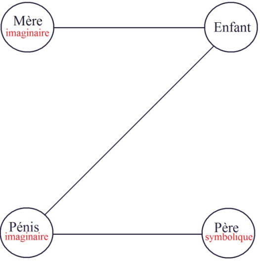
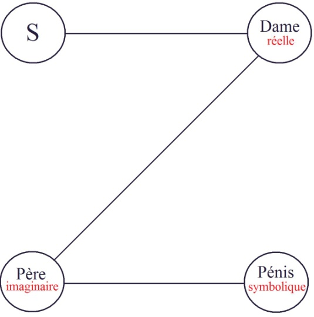
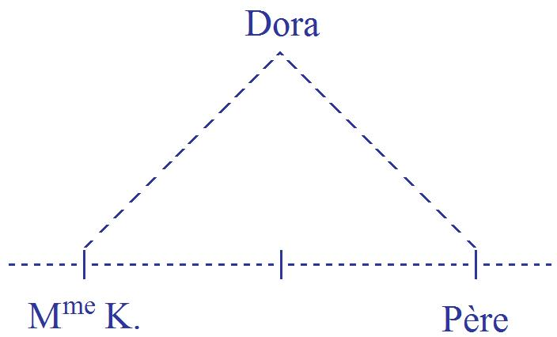
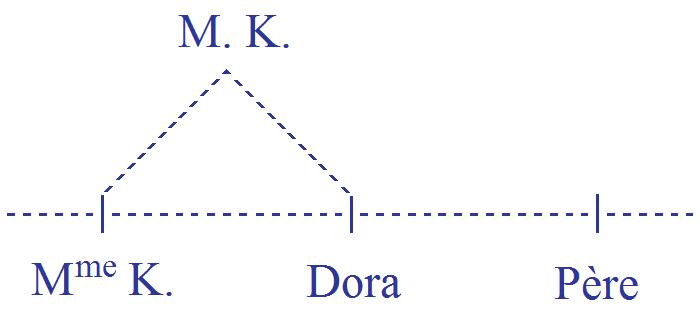
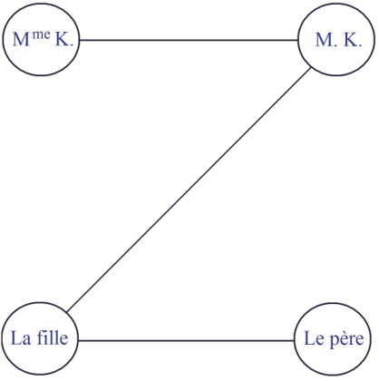

# Leçon 08 | 23 Janvier 1957

<!-- source-url: http://staferla.free.fr/S4/S4 LA RELATION.docx -->
<!-- seminar: s4 -->
<!-- lesson: 08 -->

<!-- id: s4-08-0001 -->

Certains textes de ce fascicule[^16] vous permettront de retrouver une nouvelle tentative de *la logique*, de la retrouver là où elle est, d’une façon particulièrement vivante, c’est-à-dire dans notre pratique.

<!-- id: s4-08-0002 -->

Et pour reprendre exac­tement ce à quoi *je fais allusion*, à savoir notre fameux *jeu de pair et impair*, vous pouvez très facilement
y retrouver *ces trois temps de la subjectivité*, en tant qu’elle est en rapport à *la frustration* et à condition de prendre *la frustration*
au sens du *manque d’objet,* vous pouvez *les retrouver* facilement si vous réflé­chissez à ce qu’est la position zéro du problème :

<!-- id: s4-08-0003 -->

c’est *l’opposition de l’institution du* *symbole pur* : (*+*) ou (***–***), *présence* ou *absence*, dans lequel il n’y a rien qu’une sorte de position objectivable du donné du jeu.

<!-- id: s4-08-0004 -->

Vous y verrez facilement *le second temps* dans le fait que dans cette sorte de demande qu’est la déclaration dans le jeu, vous vous mettez en posture d’être ou non gratifié, mais par quelqu’un qui ayant dès lors entre les mains les dés, en est effectivement
tout à fait incapable, il ne dépend plus de lui que ce qu’il a en main réponde à votre demande.

<!-- id: s4-08-0005 -->

Vous y avez donc le stade second du rapport duel en tant qu’il institue cet appel et sa réponse sur laquelle s’établit le niveau
de la frustration et vous en voyez en même temps le caractère abso­lument évanouissant et littéralement impossible à satisfaire.

<!-- id: s4-08-0006 -->

Si le jeu a quelque chose qui vous intéresse et qui lui donne son sens, c’est bien évidemment parce que la *troisième dimension*,

<!-- id: s4-08-0007 -->

celle de *la loi*, vous l’in­troduisez sous cette forme *toujours latente à l’exercice du jeu*, c’est à savoir que du point de vue du demandeur,
de quoi s’agit-il ?

<!-- id: s4-08-0008 -->

L’Autre évidemment, est censé à tout instant lui suggérer *une régularité*, autrement dit *une loi*, qu’en même temps il s’efforce
de lui dérober. C’est dans cette dimension de l’institution d’*une loi*, d’*une régularité*, conçue comme possible et qui à chaque instant et par celui qui propose la partie cachée du jeu, lui est dérobée, et dont il lui suggère un instant la naissance, c’est à ce moment que s’établit ce qui est fon­damental dans le jeu, et qui lui donne son sens intersubjectif, ce qui l’établit dans une dimension
non plus duelle mais ternaire telle qu’elle est essentielle.

<!-- id: s4-08-0009 -->

C’est là dessus que tient la valeur de *mon introduction*, à savoir qu’*il est nécessaire d’introduire trois termes pour que puisse commencer*
*à s’articuler quelque chose qui ressemble à une loi, ces trois temps intersubjectifs* qui sont ceux dans lesquels nous essayons de voir comment s’introduit cet *objet* qui, du seul fait qu’il vient à notre portée, sous notre juridiction, dans la pratique analytique,
est *un objet* dont *il faut qu’il entre dans la chaîne symbolique*.

<!-- id: s4-08-0010 -->

C’est là que nous en étions arrivés la dernière fois au moment où nous prenions l’histoire de notre *cas d’homosexualité féminine*.
Nous étions arrivés à ce que j’appelais « *le* 3ème *temps* » c’est à dire le temps qui s’est constitué de la façon suivante :
dans la 1ère situation que nous prenons arbitrairement comme *situa­tion de départ*, mais il y a déjà eu une sorte de concession
à un point de vue progressif, *allant du passé vers le futur dans cette ordonnance chronologique* des termes, c’est pour faciliter les choses
en les rapprochant de ce qui est fait dans *la dialectique de* *la frustration* qui, d’être conçue d’une façon sommaire, c’est-à-dire sans distinguer les plans *réel, imaginaire* et *symbolique,* aboutit à des impasses que plus nous avançons, plus j’espère vous faire sentir. Pour l’instant nous essayons d’établir les principes de ces relations entre *l’objet et la constitution de la chaîne symbolique*.

<!-- id: s4-08-0011 -->

Nous avons donc la position de la jeune fille quand elle est encore au temps de la puberté, et la première structuration *symbolique* et *imaginaire* de sa posi­tion se fait de façon classique, comme il est ordonné par la théorie, dans cette équivalence :
*pénis imaginaire - enfant*, qui l’instaure dans une certaine relation de mère imaginaire par rapport à cet au-delà qu’est son père,
qui intervient à ce moment en tant que *fonction symbolique*, c’est-à-dire en tant que celui qui peut donner *le phallus*,
et pour autant que *cette puissance du père est à ce moment-là inconsciente*, que celui qui peut donner l’enfant, est *inconscient*.

<!-- id: s4-08-0012 -->

<!-- id: s4-08-0013 -->

C’est à ce stade que se produit le moment fatal, si on peut dire, où le père intervient dans le *réel* pour donner un enfant à la mère, c’est-à-dire en faisant de cet enfant, vis-à-vis de qui elle est en *relation imaginaire,* quelque chose de réalisé, et qui par conséquent n’est plus soutenable par elle dans *la position imaginaire* où elle l’instituait.

<!-- id: s4-08-0014 -->

Nous nous trouvons maintenant au 2nd *temps*, où l’intervention du *père réel* au niveau de l’enfant dont elle était alors frustrée, produit la transformation de toute l’équation qui se pose dès lors ainsi : *le Père imaginaire*, *La Dame*, *le Pénis symbolique*.

<!-- id: s4-08-0015 -->

<!-- id: s4-08-0016 -->

C’est à dire par une sorte d’inversion, le passage de la relation - ce qui est ici dans *l’ordre symbolique* qui est celui de sa relation
avec son père - le passage de cette relation dans le sens de *la relation imaginaire*, ou si vous voulez, d’une certaine façon
la projection de la relation de la formule inconsciente, qui est à ce moment-là celle de son premier équilibre, dans une *relation perverse*, une *relation imaginaire* qui est celle de son rapport avec *La Dame*. C’est ainsi qu’après une première application
de nos formules, se pose d’une façon sans aucun doute énigmatique - voire même sur laquelle nous pouvons un instant
nous arrêter - la position de ces termes. Néanmoins il convient de remarquer que ces termes, quels qu’ils soient, s’imposent,
je veux dire : *imposent une structure*, c’est-à-dire que si nous changions la position de l’un d’entre eux, nous devrions situer ailleurs,
et jamais n’importe où, tous les autres.

<!-- id: s4-08-0017 -->

Tâchons maintenant de voir ce que ceci veut dire. La signification nous en est donnée par l’analyse.
Et que nous dit FREUD au moment crucial de cette observation, à ce point où par une certaine conception qu’il a prise
de la position dont il s’agit, par une intervention qu’il fait dans ce sens, il cristallise d’une certaine façon, la position entre lui
et la patiente, et d’une façon pas satisfaisante puisque FREUD dénonce et affirme que c’est à ce moment là que se rompt
la relation analytique ? De toute façon, quoique FREUD en pense, il est loin d’être porté à en mettre toute la charge
sur une impasse de la position de la malade, de toute façon son intervention à lui, ou sa conception, ses préjugés sur la position, doivent bien être pour quelque chose dans le fait que la situation se rompt.

<!-- id: s4-08-0018 -->

Rappelons ce qu’est cette position, et comment FREUD nous la formule : il nous dit que les résistances de la malade ont été insurmontables. Ces résistances comment les matérialise-t-il ? Quels exemples en donne-t-il ? Quel sens leur donne-t-il ?
Il les voit particulièrement *exprimées dans des rêves* qui, para­doxalement, auraient pu donner bien des espoirs, à savoir les espoirs

<!-- id: s4-08-0019 -->

de nor­malisation de la situation : ce sont en effet *les rêves* où il ne s’agit que *de réunion*, que *de conjugo*, que *de mariage fécond*.

<!-- id: s4-08-0020 -->

La patiente y est soumise à un conjoint idéal, et en a des enfants, bref le rêve manifeste quelque chose qui va dans le sens
de ce que - sinon là FREUD, la société représentée ici par la famille - peut souhaiter de mieux comme issue du traitement.
FREUD, fort de tout ce que la patiente lui dit de sa position et de ses inten­tions, loin de prendre le texte du rêve

<!-- id: s4-08-0021 -->

au pied de la lettre, n’y voit - comme il le dit - qu’une ruse de la patiente, et quelque chose destiné expressément à le décevoir, plus exactement à la manière que j’évoquais tout à l’heure dans cet usage du jeu intersubjectif du devinement,

<!-- id: s4-08-0022 -->

pour l’illusionner et le désil­lusionner à la fois. Il est remarquable que ceci suppose - comme FREUD le remarque -
qu’on puisse lui objecter à ce moment : « *Mais alors l’inconscient peut donc mentir !* », point sur lequel FREUD s’arrête longuement, qu’il discute et sur lequel il prend soin de répondre d’une façon fort articulée.

<!-- id: s4-08-0023 -->

Car reprenant la distinction qu’il y a dans la *Science des rêves*, entre *le préconscient* et *l’inconscient*, il manifeste ce que de même
il rappelle dans une autre observation…
à laquelle nous viendrons, et à propos de laquelle j’ai donné, à la suite du rapport de LAGACHE sur le transfert,
une petite intervention résumative des positions dans lesquelles je pense que l’on doit concevoir le cas Dora
…ce que dans le cas Dora il s’agit de détacher, un passage de la *Traum­deutung* qui est la comparaison à propos des rapports

<!-- id: s4-08-0024 -->

du *désir inconscient* et du *désir préconscient*, la comparaison entre *capitaliste* et *entrepreneur*.

<!-- id: s4-08-0025 -->

*C’est le désir préconscient qui,* si l’on peut dire, *est l’entrepreneur du rêve*, mais *le rêve* n’aurait rien de suffisant pour s’instituer
comme représentant de ce quelque chose qui s’appelle l’inconscient, s’il n’y avait pas *un autre désir* qui donne le fond du rêve
et qui est *le désir inconscient*.

<!-- id: s4-08-0026 -->

II distingue donc fort bien cela, à ceci près qu’il n’en tire pas *les extrêmes conséquences*. Ce qu’il y a en somme de distinct entre :

<!-- id: s4-08-0027 -->

- ce que le sujet amène dans son rêve qui est du niveau de l’inconscient,

<!-- id: s4-08-0028 -->

- et le facteur de la relation duelle, de la relation à celui à qui on s’adresse quand on raconte ce rêve, quand on l’aborde dans l’analyse.

<!-- id: s4-08-0029 -->

Et c’est dans ce sens que je vous dis qu’un rêve qui se produit au cours d’une analyse a toujours *une certaine direction vers l’analyste*, et cette direction n’est pas toujours obligatoirement la direction inconsciente. Toute *la question* est de savoir s’il faut *mettre l’accent* :

<!-- id: s4-08-0030 -->

- sur ce qui est de l’intention, et qui reste toujours les intentions que FREUD nous dit être d’une façon avouée celles de la malade, à savoir celles de jouer avec son père où la malade arrive à formuler le jeu de la tromperie, c’est-à-dire de feindre de se faire traiter et de maintenir ses positions et sa fidélité à *La Dame*,

<!-- id: s4-08-0031 -->

- ou est-ce que ce quelque chose qui s’exprime dans le rêve doit purement et simplement être conçu dans cette perspective de la tromperie, en d’autres termes, dans son inten­tionnalisation préconsciente ?

<!-- id: s4-08-0032 -->

II ne semble pas. Car si nous y regardons de près, que voyons-nous qui se formule ?

<!-- id: s4-08-0033 -->

Sans doute là une dialectique de tromperie, mais ce qui se formule ramené au signifiant, c’est précisément ce qui est détourné
à l’origine dans la première position et qui s’appelle - *dans l’inconscient* à cette étape, et aussi bien donc *dans l’inconscient* à la troisième étape - qui est ceci qui se formule de la façon suivante : venant du père…
à la façon dont *le sujet reçoit son message sous une forme inversée* de son propre message, sous la forme :
« *Tu es ma femme* », « *Tu es mon maître* », « *Tu auras un enfant de moi* »
…c’est à l’entrée de l’œdipe ou tant que l’œdipe n’est pas résolu, la promesse sur laquelle se fonde l’entrée de la fille
dans le *complexe d’Œdipe*, c’est de là qu’est partie la position.

<!-- id: s4-08-0034 -->

Et en fait si nous trouvons dans le rêve quelque chose qui s’articule comme une situation qui satisfait à cette promesse,
c’est toujours le même contenu de l’inconscient qui s’avère, et si FREUD hésite devant lui, c’est très précisément
faute d’arriver à une formulation tout à fait épurée de ce qu’est *le transfert*.

<!-- id: s4-08-0035 -->

*Il y a dans le transfert un élément imaginaire et un élément symbolique, et par conséquent un choix à faire*. Si *le transfert* a un sens…
si ce que FREUD nous a apporté ultérieurement avec la notion de *wiederholungszwang* telle que j’ai pris soin
de passer une année autour pour vous faire voir ce qu’elle pouvait vouloir dire
…c’est avant tout et uniquement pour autant qu’il y a insistance propre à *la chaîne symbolique* comme telle.
Cette insistance propre à *la chaîne symbolique* n’est pas, par définition, assumée par le sujet.

<!-- id: s4-08-0036 -->

Néanmoins le seul fait qu’elle se reproduise et qu’elle vienne à l’étape trois comme subsistante, comme se formulant dans
un rêve, même si ce rêve au niveau *imaginaire*, c’est-à-dire dans la relation directe avec le thérapeute, paraît un rêve trompeur,
il n’en est pas moins à proprement parler, et lui seul, le représentant du *transfert* au sens propre.

<!-- id: s4-08-0037 -->

Et c’est là que FREUD avec une audace qui serait fondée sur une position moins oscillante de sa notion du transfert,
pouvait mettre à coup sûr sa confiance, et aurait pu intervenir à cette condition de concevoir bien précisément :

<!-- id: s4-08-0038 -->

- que le transfert se passe au niveau de l’articulation symbolique essentiellement,

<!-- id: s4-08-0039 -->

- que quand nous parlons de transfert, quand quelque chose prend son sens du fait que *l’analyste devient le lieu du transfert*,
  c’est très précisément en tant qu’il s’agit de l’articulation symbolique comme telle,
  …ceci avant bien entendu que le sujet l’ait assumé, car c’est très précisément un rêve de transfert.

<!-- id: s4-08-0040 -->

FREUD note qu’à ce moment-là il s’est quand même produit quelque chose qui est *de l’ordre du transfert*, simplement il n’en tire ni la conséquence stricte, ni non plus la méthode correcte d’intervention. Je le signale parce qu’à la vérité ceci n’est pas simplement à remarquer sur un cas particulier qui serait ce cas, nous avons également un autre cas dans lequel le problème s’ouvre au même niveau de la même façon, à ceci près que FREUD fait l’erreur exactement contraire, et qui est très précisément le cas de Dora.

<!-- id: s4-08-0041 -->

Ces deux cas, si l’on peut dire, *s’équilibrent admirablement*, ils s’entre­croisent strictement l’un l’autre, mais pas seulement

<!-- id: s4-08-0042 -->

pour autant que s’y produit :

<!-- id: s4-08-0043 -->

- dans un sens dans un des cas cette confusion de *la position symbolique* avec *la position imaginaire*,

<!-- id: s4-08-0044 -->

- et dans l’autre cas la confusion *dans le sens contraire*.
  On peut dire que dans leur constellation totale, ces deux cas *se correspondent* strictement l’un l’autre, à ceci près que l’un s’organise par rapport à l’autre dans la forme du positif au négatif : je pourrais dire qu’il n’y a pas meilleure illustration de la formule
  de FREUD que « *la perversion est le négatif de la névrose* ». Encore faut-il le développer.

<!-- id: s4-08-0045 -->

Rappelons rapidement les termes du cas Dora, par la communauté qu’ils ont avec les termes de la constellation présente.
Nous avons dans le cas Dora, exactement au premier plan les mêmes personnages : *un père*, *une fille*, et aussi *une Dame *: Mme K.
Et c’est quelque chose d’autant plus frappant pour nous, que c’est aussi autour de *la Dame* que tourne tout le problème,
encore que la chose soit dissimulée à FREUD dans la présentation de la fille qui est une petite *hystérique*, et qu’on lui amène
pour quelques *symptômes* qu’elle a eus, sans doute mineurs, mais quand même caractérisés.

<!-- id: s4-08-0046 -->

Et surtout la situation est deve­nue intolérable à la suite de quelque chose qui est une sorte de démonstration ou d’intention
de suicide qui a fini par alarmer sa famille. Quand on l’amène à FREUD, le père la présente comme une malade,
et sans aucun doute ce passage au niveau de la consultation est un élément qui dénote à lui tout seul une crise
dans l’ensemble social où jusque là, la situation s’était maintenue avec un certain équilibre.

<!-- id: s4-08-0047 -->

Néanmoins cet équilibre singulier s’était rompu déjà depuis deux ans, et était constitué par une position d’abord dissimulée
à FREUD, à savoir que le père avait Mme K. pour maîtresse, que cette femme était mariée avec un monsieur appelé M. K.,
et qui vivaient dans *une sorte de relation de quatuor* avec le couple formé par le père et la fille, la mère étant absente de la situation.

<!-- id: s4-08-0048 -->

Nous voyons déjà à mesure que nous avançons toujours plus avant, le contraste avec la situation de *La jeune homosexuelle* :
ici la mère est présente puisque c’est elle qui ravit à la fille l’attention du père, et introduit cet élément de *frustration* réel qui aura été le déterminant dans la formation de la constellation perverse.

<!-- id: s4-08-0049 -->

Alors que dans le cas de Dora c’est le père qui introduit la dame et qui paraît l’y maintenir, ici c’est la fille qui l’introduit.
Ce qui est frappant dans cette *position*, c’est que Dora tout de suite marque à FREUD *sa revendication* extrê­mement vive concernant l’affection de son père dont elle lui dit qu’il lui a été ravi par cette liaison, dont elle démontre tout de suite à FREUD qu’elle a toujours suivi l’existence et la permanence et la prévalence, et qu’elle en est venue à ne plus pouvoir tolérer,
et vis-à-vis de laquelle tout son comportement manifeste sa revendication. FREUD - par un pas qui est le plus décisif
de la qualité à proprement parler dialectique de premier pas de l’expérience freudienne - la ramène à la question :

<!-- id: s4-08-0050 -->

« *Ce contre quoi vous vous insurgez là comme contre un désordre, n’est-ce pas quelque chose à quoi vous avez-vous-même participé ?* »

<!-- id: s4-08-0051 -->

Et en effet il met très vite en évidence que jusqu’à un moment critique, *cette position a été soutenue de la façon la plus efficiente par Dora elle-même*, qui s’est trouvée beaucoup plus que complaisante à cette position singulière, mais qui en était vraiment la cheville :

<!-- id: s4-08-0052 -->

- protégeant en quelque sorte les apartés du couple du père et de la dame,

<!-- id: s4-08-0053 -->

- se substituant d’ailleurs dans un des cas à la dame dans ses fonctions, c’est-à-dire s’occupant des enfants par exemple,

<!-- id: s4-08-0054 -->

- et d’autre part à mesure qu’on va plus avant dans la notion et la structure du cas, marquant même *un lien tout à fait spécial avec la Dame* dont elle se trouvait être *la confidente*, et semble­-t-il être allée avec elle fort loin dans les confidences.

<!-- id: s4-08-0055 -->

Ce cas est d’une richesse telle qu’on peut encore y faire des découvertes, et ce rappel rapide ne peut en aucune façon remplacer
la lecture attentive du cas. Signalons entre autre, cet intervalle de *neuf mois* entre deux *symptômes*, et que FREUD croit découvrir parce que la malade le lui donne d’une façon *symbolique*. Mais si on y regarde de près, on s’apercevra que dans l’observation
il s’agit en réalité de *quinze mois*. Et ces *quinze mois* ont un sens parce que c’est un *quinze* qui se trouve partout dans l’observation, et il est utile pour la compréhension en tant qu’il se fonde sur des nombres et sur une valeur purement *symbolique*.

<!-- id: s4-08-0056 -->

Je ne peux que vous rappeler aujourd’hui en quels termes se pose tout le problème *au long de l’observation *:

<!-- id: s4-08-0057 -->

- ce n’est pas seulement que FREUD après coup s’aperçoive que s’il échoue c’est en raison d’une résistance de la patiente à admettre quelle est, comme FREUD le lui suggère de tout le poids de son insistance et de son autorité, la relation amoureuse qui la lie à M. K ,

<!-- id: s4-08-0058 -->

- ce n’est pas simplement cela que vous pouvez lire tout au long de l’observation,

<!-- id: s4-08-0059 -->

- ce n’est pas simplement en note et *après coup* que FREUD indique qu’il y a eu sans doute une erreur, à savoir qu’il aurait dû comprendre que l’attachement homosexuel à Mme K. était la véritable *signification * : et de l’institution de sa position pri­mitive, et de sa crise sur laquelle nous arrivons,

<!-- id: s4-08-0060 -->

- ce n’est pas seulement que FREUD le reconnaisse après coup, tout au long de l’observation FREUD est dans la plus grande *ambiguïté* concernant *l’objet réel du désir de Dora*.

<!-- id: s4-08-0061 -->

Là encore nous nous trouvons dans une position du problème qui est celle d’une formulation possible de cette ambiguïté
en quelque sorte non résolue. Il est clair que M. K. dans sa personne a *une importance* tout à fait prévalente pour Dora,
et que quelque chose comme un lien libidinal est avec lui établi. Il est clair aussi que *quelque chose qui est d’un autre ordre*
et qui pourtant est aussi d’un très grand poids, à tout instant joue son rôle dans *le lien libidinal avec Mme K*.

<!-- id: s4-08-0062 -->

Comment les concevoir l’un et l’autre d’une façon qui justifierait le progrès de l’aventure, sa crise, le point de rupture

<!-- id: s4-08-0063 -->

de l’équilibre, qui per­mettrait également de concevoir et le progrès de l’aventure, et le moment où elle s’arrête ?
Déjà dans une première critique ou abord du problème et de l’observation que j’ai faite il y a cinq ans, conformément

<!-- id: s4-08-0064 -->

à la structure des *hystériques*, j’in­diquais ceci :

<!-- id: s4-08-0065 -->

- *l’hystérique est quelqu’un qui aime par procuration* : vous retrou­vez ceci dans une foule d’observations d’*hystériques,*

<!-- id: s4-08-0066 -->

- *l’hystérique est quelqu’un dont l’objet est homosexuel et qui aborde cet objet homosexuel par identification avec quelqu’un de l’autre sexe*.

<!-- id: s4-08-0067 -->

C’est un premier abord en quelque sorte clinique de la patiente. J’avais été plus loin, et partant de la notion de la relation narcissique en tant :

<!-- id: s4-08-0068 -->

- qu’elle est fondatrice du *moi*,

<!-- id: s4-08-0069 -->

- qu’elle est la matrice de cette constitution de *cette fonction imaginaire qui s’appelle le moi*,
  …je disais qu’en fin de compte nous en avions des traces pour l’observation : c’est en tant que le *moi* - seulement le *moi –*
  de Dora a fait *une identification* à un personnage viril - je parle dans la situation complète dans *le quadrille -* c’est en tant qu’elle est *Monsieur* K., que les hommes sont pour elle autant de cristallisations possibles de son *moi*, que la situation se comprend.
  En d’autres termes c’est par l’intermédiaire de M. K, c’est en tant qu’elle est M. K., et c’est au point imaginaire que constitue
  la personnalité de M. K, qu’elle est attachée au personnage de Mme K.

<!-- id: s4-08-0070 -->

J’étais allé encore plus loin, et j’avais dit : Mme K. est quelqu’un d’important, pourquoi ? Elle n’est pas importante simplement parce qu’elle est un choix entre d’autres objets, elle n’est pas simplement quelqu’un dont on puisse dire qu’elle est investie
de cette *fonction narcissique* qui est au fond de toute énamoration. Mme K. comme les rêves l’indiquent - car c’est autour des rêves que porte le poids essentiel de l’observation - Mme K. c’est *la question* de Dora.

<!-- id: s4-08-0071 -->

Tâchons maintenant de transcrire cela dans notre formulation présente, et d’essayer de situer ce qui dans ce *quatuor*, vient s’ordonner dans *notre schéma fondamental*. Dora est une *hystérique*, c’est-à-dire quelqu’un qui est venu au niveau de *la crise œdipienne*, et qui dans cette *crise œdipienne* a pu à la fois, et n’a pas pu, la franchir. Il y a pour cela une raison : c’est que son père à elle, contrairement au père de l’homosexuelle, est *impuissant*. Toute l’observation repose sur *cette notion centrale de l’impuissance du père*.

<!-- id: s4-08-0072 -->

Voici donc l’occasion de mettre en valeur d’une façon particulièrement exemplaire quelle peut être *la fonction du père en tant que telle*, *par rapport au manque d’objet *: par quoi la fille entre dans l’œdipe ? Quelle peut être *la fonction du père* en tant que donateur ?

<!-- id: s4-08-0073 -->

En d’autres termes, cette situation repose sur la dis­tinction que j’ai faite à propos de la frustration primitive, de celle qui peut s’établir dans le rapport d’enfant à mère, à savoir cette distinction entre l’objet en tant :

<!-- id: s4-08-0074 -->

- qu’après la frustration son désir subsiste,

<!-- id: s4-08-0075 -->

- que l’objet est appartenance du sujet,

<!-- id: s4-08-0076 -->

- que la frustration n’a de sens qu’autant que cet objet subsiste après la frustration,
  …la distinction de ce dans quoi ici la mère intervient, c’est-à-dire dans un autre registre :

<!-- id: s4-08-0077 -->

- en tant qu’elle donne ou ne donne pas,

<!-- id: s4-08-0078 -->

- en tant que ce don est ou non signe d’amour.

<!-- id: s4-08-0079 -->

Voici ici *le père* qui est fait pour être *celui qui symboliquement donne cet objet manquant*. Ici il ne le donne pas parce qu’il ne l’a pas.
La carence phallique du père est ce qui traverse toute l’observation comme une note abso­lument fondamentale, constitutive,

<!-- id: s4-08-0080 -->

de la position. Est-ce que là encore nous nous trouvons en quelque sorte sur un seul plan, à savoir que c’est purement
et simplement par rapport à ce manque que toute la crise va s’établir ? Observons de quoi il s’agit.

<!-- id: s4-08-0081 -->

Qu’est-ce que *donner* ? Autre­ment dit, quelle dimension est introduite dans *la relation d’objet* au niveau où elle est portée
au *degré symbolique* par le fait que *l’objet* peut ou non être donné ? En d’autres termes, est-ce jamais *l’objet* qui est *donné* ?

<!-- id: s4-08-0082 -->

C’est là la question dont nous voyons dans l’observation de Dora une des issues tout à fait exemplaire, car ce père
dont elle ne reçoit pas *le don viril symboliquement*, elle lui reste très attachée, elle lui reste si attachée que son histoire commence exactement avec - à cet âge d’issue de l’œdipe - toute une série d’accidents hystériques qui sont très nettement liés
à des manifestations d’amour pour ce père qui, à ce moment-là, apparaît plus que jamais et décisivement comme
*un père blessé et malade*, comme *un père frappé* dans ses puissances vitales elle­-mêmes.

<!-- id: s4-08-0083 -->

L’amour qu’elle a pour ce père est très précisément à ce moment-là, lié strictement corrélativement, coextensivement
à *la diminution* de ce père. Nous avons donc là une distinction très nette : ce qui intervient dans la relation d’amour,
ce qui est demandé comme signe d’amour, n’est jamais que quelque chose *qui ne vaut que comme signe*,
ou pour aller encore plus loin : *il n’y a pas de plus grand don possible, de plus grand signe d’amour que le don de ce qu’on n’a pas*.

<!-- id: s4-08-0084 -->

Mais remarquons bien ceci : la dimension du don n’existe qu’avec l’in­troduction de la loi, avec le fait que le don,
comme nous l’affirme et nous le pose toute la méditation sociologique[^17], est quelque chose qui circule.

<!-- id: s4-08-0085 -->

Le don que vous faites, c’est toujours le don que vous avez reçu. Mais entre deux sujets, ce cycle de dons vient encore d’ailleurs,
car ce qui établit la relation d’amour, c’est que ce don est donné si l’on peut dire *pour rien*.

<!-- id: s4-08-0086 -->

Le « *rien pour rien* » qui est le principe de l’échange est une formule - comme toute formule où intervient le *rien* - ambigue*.*

<!-- id: s4-08-0087 -->

Ce « *rien pour rien* » qui paraît la formule même de l’*intérêt*, est aussi la formule de la pure *gratuité*.
Il n’y a en effet dans le don d’amour que *quelque chose* de donné « *pour rien* », et qui ne peut être que « *rien* ».
Autrement dit, c’est pour autant qu’un sujet donne quelque chose d’une façon gratuite, que pour autant que derrière
ce qu’il donne il y a tout ce qui lui manque, que le don primitif - d’ailleurs tel qu’il s’exerce effectivement à l’origine des échanges humains sous la forme du « *potlatch* » - *ce qui fait le don, c’est que le sujet sacrifie au-delà ce qu’il a*.

<!-- id: s4-08-0088 -->

Je vous prie de remarquer que si nous supposons un sujet, qui ait en lui la charge de tous les biens possibles,
de toutes les richesses, qui ait en quelque sorte le comble possible de tout ce qu’on peut avoir, un don venant d’un tel sujet n’aurait littéralement aucunement *la valeur d’un signe d’amour*.

<!-- id: s4-08-0089 -->

Et s’il est possible que les croyants s’imaginent pouvoir aimer Dieu parce que Dieu est censé avoir en lui effectivement
cette totale plénitude et ce comble, il est bien certain que si la chose est même pensable de cette reconnaissance,
pour quoi que ce soit, par rapport à celui qui aurait posé que très précisément au fond de toute croyance il y a tout de même
ce quelque chose qui reste là tant que cet *être* qui est censé être pensé comme un *être* qui est *un tout*, il lui manque sans aucun doute le principal dans *l’être*, c’est-à-dire l’existence.

<!-- id: s4-08-0090 -->

C’’est-à-dire qu’au fond de toute croyance au Dieu comme parfaitement et tota­lement munificent il y a ce je ne sais quoi qui lui manque toujours et qui fait qu’il est tout de même toujours supposable qu’il n’existe pas. Il n’y a aucune raison d’aimer Dieu,
si ce n’est que peut-être il n’existe pas. Ce qui est certain, c’est que c’est bien là que Dora en est au moment où elle aime
son père : elle l’aime précisément pour ce qu’il ne lui donne pas.

<!-- id: s4-08-0091 -->

Toute la situation est impensable en dehors de cette position primitive qui se maintient jusqu’à la fin, mais dont il y a à concevoir comment elle a pu être supportée, tolérée, étant donné que le père s’engage devant Dora dans quelque chose d’autre, et que Dora semble même avoir induit. Toute l’observation repose sur ceci que nous avons : le Père, Dora, Mme K. :

<!-- id: s4-08-0092 -->

<!-- id: s4-08-0093 -->

Toute la situation s’instaure comme si Dora avait à se poser la question : « *Qu’est-ce que mon père aime dans Mme K. ?* »
Mme K. se présente comme *quelque chose que son père peut aimer au-delà d’elle-même*, et ce à quoi Dora s’attache, c’est à ce *quelque chose* qui est aimé par son père dans une autre, dans cette autre en tant qu’elle ne sait pas ce que c’est, ceci très conformément
à ce qui est supposé par toute la théorie de *l’objet phallique*, c’est-à-dire que pour que le sujet féminin entre dans la dialectique
de *l’ordre symbolique*, il faut qu’il y entre par quelque chose qui est *ce don du phallus*. Il ne peut pas y entrer autrement.

<!-- id: s4-08-0094 -->

Ceci donc suppose que *le besoin réel* - qui n’est pas nié par FREUD, qui ressortit à *l’organe féminin* comme tel, à *la physiologie*
*de la femme -* est quelque chose qui n’est jamais donné d’entrée dans l’établissement de la position du désir. *Le désir vise le phallus*
en tant qu’il doit être *reçu comme don*. Pour ceci il faut qu’il soit porté au niveau du *don absent* ou *présent*.
D’ailleurs, c’est en tant qu’il est porté à la dignité d’*objet de don* qu’il fait entrer le sujet dans la dialectique de l’échange : celui qui normalisera toutes ces positions, jusqu’à y compris les interdictions essentielles qui fondent ce mouvement général de l’échange.
C’est à l’intérieur de cela que *le besoin réel,* que FREUD n’a jamais songé à nier comme existant, lié à l’organe féminin comme tel,
se trouvera avoir sa place et se satisfera, si l’on peut dire, laté­ralement.

<!-- id: s4-08-0095 -->

Mais il n’est jamais repéré symboliquement pour quelque chose qui ait un sens, il est toujours essentiellement à lui-même problématique, placé en avant d’un certain franchissement *symbolique*, et c’est bien en effet ce dont il s’agit pendant
tout le déploiement de ces symptômes et le déploiement de cette observation. Dora s’interroge : « *Qu’est-ce qu’une femme ?* ».
Et c’est pour autant que Mme K. incarne cette fonction féminine comme telle, qu’elle est pour Dora la repré­sentation

<!-- id: s4-08-0096 -->

de ce dans quoi elle se projette comme étant la question. C’est en tant qu’elle est, elle, sur le chemin du rapport duel avec Mme K, qu’en d’autres termes Mme K. est ce qui est aimé *au-delà* de Dora, c’est en somme ce pourquoi elle se sent elle-même - Dora - intéressée à cette position : c’est que Mme K. est en quelque sorte *aimée au delà d’elle-même*.

<!-- id: s4-08-0097 -->

C’est parce que Mme K. réalise ce qu’elle, Dora, ne peut pas ni savoir ni connaître de cette situation où Dora ne trouve pas
à se loger :

<!-- id: s4-08-0098 -->

- pour autant que l’amour est quelque chose qui, dans un être, est aimé *au-delà* de ce qu’il est, c’est quelque chose qui
  en fin de compte, dans un être est *ce qui lui manque*, et aimer pour Dora se situe quelque part entre son père et Mme K,

<!-- id: s4-08-0099 -->

- pour autant que parce que son père aime Mme K., elle Dora, se sent satisfaite, mais à condition bien entendu que cette position soit maintenue.

<!-- id: s4-08-0100 -->

Cette position qui par ailleurs est symbolisée de mille manières, à savoir que ce père impuissant supplée par tous les moyens
du don symbolique - y compris les dons matériels - à ce qu’il ne réalise pas comme présence virile, et il en fait effectivement bénéficier Dora au passage, par toutes sortes de muni­ficences qui se répartissent également sur la maîtresse et sur la fille.

<!-- id: s4-08-0101 -->

Il la fait ainsi participer à cette *position symbolique*. Néanmoins ceci ne suffit pas encore, et Dora essaye de rétablir, de restituer l’accès à une position manifestée dans le sens inverse. Je veux dire que c’est, non plus *vis-à-vis du père*, mais *vis-à­-vis de la femme qu’elle a en face d’elle *: Mme K., qu’elle essaie de rétablir une situation *triangulaire*, et c’est ici qu’intervient M. K.,

<!-- id: s4-08-0102 -->

c’est-à-dire qu’effecti­vement par lui peut se fermer le triangle, mais dans une position inversée.

<!-- id: s4-08-0103 -->

<!-- id: s4-08-0104 -->

Par intérêt pour sa question elle va considérer M. K. comme quelqu’un qui participe à ce qui symbolise dans l’observation le côté *question* de la présence de Mme K., à savoir cette adoration encore exprimée par une association sym­bolique très manifeste, donnée dans l’observation, à savoir la Madone Sixtine.

<!-- id: s4-08-0105 -->

Mme K. est l’objet de l’adoration de tous ceux qui l’entourent, et c’est en tant que participante à cette adoration que Dora
en fin de compte se situe par rapport à elle. M. K. est la façon dont elle normative cette position en essayant de réin­tégrer quelque chose qui fasse entrer l’élément masculin dans le circuit, et effec­tivement c’est au moment où M. K. lui dit...

<!-- id: s4-08-0106 -->

non pas qu’il la courtise ou qu’il l’aime, non pas même s’approche d’elle d’une façon *intolérable* pour une hys­térique

<!-- id: s4-08-0107 -->

...c’est au moment où il lui dit : « *Ich habe nichts an meiner Frau.* » qu’elle le gifle.

<!-- id: s4-08-0108 -->

L’élément important c’est que M. K. déclare à un moment quelque chose qui a un sens particulièrement vivant, si nous donnons ce terme de « *rien* » toute sa portée et tout son sens, la formule même allemande est particulièrement expressive.
Il lui dit en somme quelque chose par où il se retire lui–même du circuit ainsi constitué, et qui dans son ordre s’établit ainsi :

<!-- id: s4-08-0109 -->

<!-- id: s4-08-0110 -->

Dora peut bien admettre que son père aime en elle et par elle, ce qui est au-delà : Mme K. Mais alors pour que M. K.
soit tolérable dans cette position, il faut qu’il occupe la fonction exactement inverse et équilibrante, à savoir que Dora, elle,
soit aimée par lui au-delà de sa femme, mais en tant que sa femme est pour lui quelque chose.
Ce *quelque chose* c’est la même chose que ce *rien* qu’il doit y avoir au-delà, c’est à dire Dora dans l’occasion.

<!-- id: s4-08-0111 -->

S’il lui dit qu’il n’y a *rien* du côté de sa femme, ce « *an* » en allemand marque bien dans ce rapport très particulier *qu’il ne dit pas*
*que sa femme n’est rien pour lui :* il n’y a rien. « *An* » est quelque chose que nous retrouvons sous mille locutions allemandes,
la formule allemande qui lui est particulière montre que *an* est une adjonction dans *l’au-delà de ce qui manque*.
C’est précisément ce que nous retrouvons ici, il veut dire qu’il n’y a rien après sa femme : *ma femme n’est pas dans le circuit*.

<!-- id: s4-08-0112 -->

Qu’en résulte-t-il ? Dora ne peut pas tolérer cela : c’est à dire qu’il s’intéresse à elle, Dora, qu’en tant qu’il ne s’intéresse qu’à elle.
Toute la situation du même coup est rompue. Si M. K. ne s’intéresse qu’à elle, c’est que son père ne s’in­téresse qu’à Mme K.,

<!-- id: s4-08-0113 -->

et à ce moment-là, elle ne peut plus le tolérer. Pourquoi ?

<!-- id: s4-08-0114 -->

Elle rentre pourtant bien aux yeux de FREUD, dans une situation typique comme Monsieur Claude LÉVI-STRAUSS l’explique dans les *Structures élémen­taires de la parenté*, l’échange des liens de l’alliance consiste exactement en ceci : « *J’ai reçu une femme*
*et je dois une fille.* ». Seulement ceci qui est le principe même de l’institution de l’échange et de la loi, fait de *la femme*
purement et simplement un objet d’échange, elle n’est intégrée là-dedans par rien.

<!-- id: s4-08-0115 -->

Si en d’autres termes, elle n’a pas elle–même renoncé à quelque chose, c’est-à-dire précisément au *phallus* *paternel* conçu
comme *objet de don*, elle ne peut rien concevoir subjectivement parlant qu’elle ne reçoive d’autres, c’est à dire d’un homme.

<!-- id: s4-08-0116 -->

Dans toute la mesure où elle est exclue de cette première institution du don et de la loi dans le rapport direct du don d’amour, elle ne peut vivre cette situation qu’en se sentant réduite purement et simplement à l’état d’objet.

<!-- id: s4-08-0117 -->

Et c’est bien ce qui se passe à ce moment-là. Dora se révolte absolument et commence à dire : mon père me vend à quelqu’un d’autre, ce qui est en effet le résumé clair et parfait de la situation, pour autant qu’elle est maintenue dans ce demi-jour.
En fait c’est bien une façon de payer si on peut dire la complaisance du mari, c’est-à-dire de M. K., que de lui laisser mener
dans une sorte de tolérance voilée cette courtisannerie à laquelle au long des années il s’est livré auprès de Dora. C’est donc en tant que M. K. s’est avoué comme étant quelqu’un qui ne fait pas partie d’un circuit où Dora puisse, soit l’identifier à elle-même, soit penser que elle, Dora, est l’objet de M. K. au-delà de la femme par où elle se rattache à lui. C’est en tant que rupture
de ces liens subtils et ambigus sans doute, mais qui ont dans chaque cas un sens et une orientation parfaite,
qu’est entendue cette rupture de ces liens et que *Dora ne trouve plus sa place* dans le circuit que d’une façon extrêmement instable.

<!-- id: s4-08-0118 -->

Mais elle la trouve d’une cer­taine façon, et à chaque instant c’est en tant que rupture de ces liens que la situation se déséquilibre et que Dora se voit *chue au rôle de pur et simple objet*, et commence alors à entrer en revendication de ce quelque chose qu’elle était très disposée à considérer, qu’elle recevait jusqu’à présent, même par l’in­termédiaire d’une autre, qui est l’amour de son père.

<!-- id: s4-08-0119 -->

À partir de ce moment là elle le revendique *exclusivement*, puisqu’il lui est refusé totalement. *Quelle différence* apparaît *entre ces deux registres et ces deux situations* dans lesquelles respectivement sont impliquées l’une et l’autre, à savoir *Dora et notre « homosexuelle »* ?

<!-- id: s4-08-0120 -->

Pour aller vite et terminer sur quelque chose qui fasse image, je vais vous dire ceci que nous confirmerons :
s’il est vrai que ce qui est *maintenu dans l’inconscient* de notre homosexuelle c’est la promesse du père : « *tu auras un enfant de moi* »,
et si ce qu’elle montre dans cet amour exalté pour *La Dame* c’est jus­tement, comme nous le dit FREUD, le modèle de l’amour absolument désintéressé, de l’amour pour rien, ne voyez-vous pas que dans ce premier cas tout se passe comme si la fille voulait montrer à son père ce qu’est un véritable amour, cet amour que son père lui a refusé.

<!-- id: s4-08-0121 -->

Sans doute il s’y est impliqué dans l’inconscient du sujet, sans doute parce qu’il trouve auprès de la mère plus d’avantages, et en effet cette relation est fondamentale dans toute entrée de l’enfant dans l’œdipe, c’est à savoir *la supé­riorité écrasante du rival adulte*.

<!-- id: s4-08-0122 -->

Ce qu’elle lui démontre, c’est comment on peut aimer quelqu’un, non pas seulement pour ce qu’il a, mais littéralement
pour ce qu’il n’a pas : pour ce pénis symbolique qu’elle sait bien elle, qu’elle ne trouvera pas dans *La Dame*,
parce qu’elle sait très bien elle, où il se trouve, c’est à dire chez son père qui n’est pas, lui, impuissant.

<!-- id: s4-08-0123 -->

En d’autres termes, ce que *la perversion* exprime dans ce cas, c’est qu’elle s’exprime entre les lignes, par contrastes, par allusions, elle est cette façon qu’on a de parler de tout autre chose, mais qui nécessairement, par une suite rigoureuse des termes qui sont mis en jeu, implique sa contrepartie qui est ce qu’on veut faire entendre à l’autre. En d’autres termes vous retrouvez là ce que j’ai appelé autrefois devant vous, au sens le plus large, *la métonymie*, c’est-à-dire *faire entendre quelque chose en parlant de quelque chose*
*de tout à fait autre*. Si vous n’appréhendez pas dans toute sa généralité cette notion fondamentale de *la métonymie*, il est tout à fait inconcevable que vous arriviez à une notion quelconque de ce que peut vouloir dire *la perversion* dans *l’imaginaire*.

<!-- id: s4-08-0124 -->

Cette *métonymie* est le principe de tout ce qu’on peut appeler dans l’ordre de la fabulation et de l’art, le réalisme. Car le réalisme n’a littéralement aucune espèce de sens. Un roman qui est fait d’un tas de petits traits qui ne veulent rien dire, n’a aucune valeur, si très précisément il ne fait pas vibrer harmo­niquement quelque chose qui a un sens au-delà. Si les grands romanciers sont supportables, c’est pour autant que tout ce qu’ils s’appliquent à nous montrer trouve son sens, non pas du tout symboliquement, non pas allégoriquement, mais par ce qu’ils font retentir à distance. Et il en est de même pour le cinéma.
De même la fonction de la perversion du sujet est une fonction métonymique.

<!-- id: s4-08-0125 -->

Mais est-ce *la même chose* pour Dora qui est *une névrotique* ? C’est tout autre chose. À voir le schéma on constate
que dans la perversion nous avons affaire à une conduite signifiante qui indique un signifiant qui est plus loin
dans la chaîne signifiante, en tant qu’il lui est lié par un signifiant nécessaire. Dans le cas de Dora c’est en tant que Dora,
prise comme sujet, se met à tous les pas sous un certain nombre de signifiants dans la chaîne, c’est en tant que lit­téralement

<!-- id: s4-08-0126 -->

Mme K. est sa *métaphore*. Parce que Dora ne peut rien dire de ce qu’elle est, ni à quoi elle sert, ni à quoi sert l’amour.
Simplement elle sait que l’amour existe, et elle en trouve une historisation dans laquelle elle trouve sa place sous la forme d’une question qui est centrée sur le contenu et l’ar­ticulation de tous ses rêves qui ne signifient rien d’autre : *la boîte à bijoux*, etc.

<!-- id: s4-08-0127 -->

C’est en tant que Dora s’interroge sur ce que c’est qu’être une femme qu’elle *s’exprime* comme elle *s’exprime* : par des *symptômes*.
*Ces symptômes sont des éléments signifiants*, mais pour autant que sous eux court un *signifié* perpétuellement mouvant qui est la façon dont Dora s’y implique et s’y intéresse. C’est en tant que *métaphorique* que *la névrose* de Dora prend son sens, et peut être dénouée.
Et c’est justement d’avoir, lui FREUD, introduit dans cette *métaphore*, et d’avoir voulu forcer l’élément réel qui dans toute cette *métaphore* tend à s’y réintroduire, en disant : ce que vous aimez c’est ceci précisément, que bien entendu quelque chose tend
à se normaliser dans la situation par l’entrée en jeu de M. K. Mais ce quelque chose reste *à l’état métaphorique*, et la preuve
en est que si FREUD peut bien en effet penser - avec cette espèce de prodigieux sens intuitif qu’il a, des significations -
qu’il y a quelque chose qui ressemble à une sorte d’engrossement de Dora, de quelque chose après la crise de rupture
avec M. K., c’est en effet une sorte d’étrange fausse-couche significative qui se produit.

<!-- id: s4-08-0128 -->

FREUD croit « *neuf mois* » parce que Dora dit elle-même « *neuf mois* », et elle avoue elle-même par là qu’il y a là comme une sorte de grossesse. Mais c’est en effet au delà de cela, après ce qu’il est normal d’appeler pour Dora, le délai d’accouchement,
qu’il est significatif que Dora voie le dernier retentissement de ce quelque chose en quoi elle reste nouée à M. K. Et en effet
nous trouvons là sous une certaine forme, l’équivalence d’une sorte de copulation qui se traduit dans *l’ordre symbolique*,
et purement *d’une façon métaphorique*. Une fois de plus, le *symptôme* n’est là qu’une *méta­phore*, qu’une tentative de rejoindre

<!-- id: s4-08-0129 -->

ce qui est la loi des échanges symboliques avec l’homme auquel on s’unit ou on se désunit.

<!-- id: s4-08-0130 -->

Par contre l’accouchement qui se trouve aussi de l’autre côté, à la fin de l’observation de l’homosexuelle avant qu’elle vienne entre les mains de FREUD, se manifeste de la façon suivante : brusquement elle se jette d’un petit pont de chemin de fer
au moment où intervient une fois de plus le père réel pour lui manifester son irritation et son courroux, et que la femme
qui est avec elle *sanctionne* en lui disant qu’elle ne veut plus la voir.

<!-- id: s4-08-0131 -->

La jeune fille à ce moment là se trouve absolument dépourvue de ses derniers ressorts, car jusque là elle a été assez frustrée
de ce qui devait lui être donné, à savoir *le phallus paternel*, mais elle avait trouvé le moyen par la voie de cette relation imaginaire, de maintenir le désir. À ce moment-là avec le rejet de la dame elle ne peut plus rien du tout soutenir, à savoir que l’objet
est définitivement perdu à savoir que ce rien dans lequel elle s’est instituée pour démontrer à son père comment on peut aimer, n’a même plus de raison d’être, et à ce moment là elle se suicide.

<!-- id: s4-08-0132 -->

Mais FREUD nous le souligne, ceci a également un autre sens : ça a le sens d’une perte définitive de l’objet, à savoir que
ce *phallus* qui lui est décidément refusé, *tombe*, *niederkommt*. Ça a là une valeur de privation définitive, et en même temps
de mimique aussi d’une sorte d’accouchement symbolique.

<!-- id: s4-08-0133 -->

Et ce côté *métonymique* dont je vous parlais, vous le retrouverez là, car si cet acte de se précipiter d’un pont de chemin de fer
au moment critique et terminal de ses relations avec la dame et le père, FREUD peut l’interpréter comme une sorte de façon démonstrative de se faire elle-même cet enfant qu’elle n’a pas eu, et en même temps de se détruire dans un dernier acte significatif de l’objet, c’est uniquement fondé sur l’existence du mot *niederkommt* qui indique *méto­nymiquement* le terme dernier,

<!-- id: s4-08-0134 -->

le thème du suicide où s’exprime chez l’ho­mosexuelle dont il s’agit, ce qui est le seul et unique ressort de toute sa perversion…
et ceci conformément à tout ce que FREUD a maintes fois affirmé

concernant la pathogenèse d’un certain type d’homosexualité féminine
…à savoir un amour stable et particulièrement renforcé pour le père.

## Notes

[^16]: Cf. « *Le séminaire sur « La lettre volée »* » in *La Psychanalyse* n°2, PUF, 1957, pp.1-44.

[^17]: Cf. Marcel Mauss : « [*Essai sur le don*](http://classiques.uqac.ca/classiques/mauss_marcel/socio_et_anthropo/2_essai_sur_le_don/essai_sur_le_don.pdf) » in *Sociologie et anthropologie*, Puf 2004, ainsi que l’« [*Introduction à l’œuvre de Marcel Mauss*](http://classiques.uqac.ca/classiques/mauss_marcel/socio_et_anthropo/0_introduction/intro_socio_et_anthropo.pdf) » de Claude Lévi-Strauss

    dans le même ouvrage.
