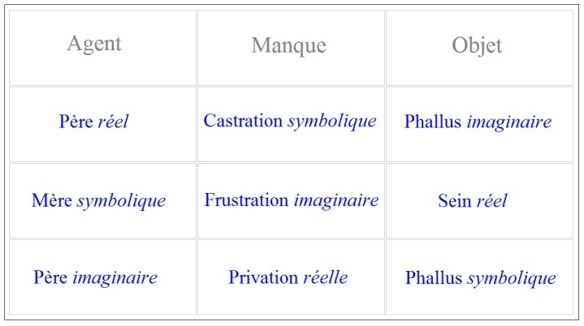

# Leçon 11 | 27 Février 1957

<!-- source-url: http://staferla.free.fr/S4/S4 LA RELATION.docx -->
<!-- seminar: s4 -->
<!-- lesson: 11 -->

<!-- id: s4-11-0001 -->

J’ai l’intention de reprendre aujourd’hui les termes dans lesquels j’essaie pour vous de formuler cette refonte nécessaire
de la notion de *frustration*, sans laquelle il est possible de voir toujours s’augmenter l’écart entre les théories dominantes actuelles dans la psychanalyse, et la doctrine freudienne qui, comme vous le savez, à mes yeux ne constitue rien moins que *la seule formulation conceptuelle correcte de l’expérience que cette doctrine même a fondée*. Je vais essayer d’articuler quelque chose aujourd’hui
qui sera peut-être un petit peu plus algébrique que d’habitude, mais c’est préparé par tout ce que nous avons fait précédemment.
Avant de repartir, ponctuons ce qui doit se dégager de certains des termes que nous avons été amenés jusqu’ici à articuler.

<!-- id: s4-11-0002 -->

<!-- id: s4-11-0003 -->

La *frustration*…
telle que j’ai essayé de vous la situer dans le petit tableau triple, à savoir entre la *castration* dont on est parti dans l’expression analytique de la doctrine freudienne, et puis la *privation* où certains se réfèrent, ou disons qu’on la réfère diversement
…*la frustration* dans son expérience fondamentale…
et pour autant que « *La psychanalyse d’aujourd’hui* » la met au cœur de toutes les fautes qui se marqueraient
dans leurs conséquences analysables, dans les symptômes à proprement parler qui sont de notre champ
…*la frustration* dis­-je, il est nécessaire pour nous que nous la comprenions, pour que nous puissions en faire un usage valable.

<!-- id: s4-11-0004 -->

Bien entendu, si le problème de *l’expérience analytique* l’a amenée au premier plan des termes en usage, ça ne peut pas être absolument là sans raison. Si d’autre part sa prévalence modifie profondément l’économie de toute notre pensée en présence
des phénomènes névrotiques, elle l’amène par certains côtés à des impasses. C’est bien ce que je m’efforce de vous démontrer, avec succès j’espère, sur bien des exemples. C’est ce que vous verrez encore plus démontré à mesure que vous vous mettrez
à pratiquer plus la littérature analytique avec un oeil ouvert.

<!-- id: s4-11-0005 -->

*La frustration*, posons d’abord qu’elle n’est pas le refus d’un objet de satis­faction au sens pur et simple. Satisfaction veut dire satisfaction d’un besoin : je n’ai pas besoin d’insister sur ceci. On ne pose rien d’habitude, quand on parle de *frustration*.
Nous avons des expériences frustrantes, nous pensons qu’elles laissent des traces, nous usons de cela sans y regarder plus loin, nous oublions simplement que pour que les choses soient si simples, il conviendrait d’expliquer alors pourquoi le désir qui aurait été ainsi frustré répondrait à cette caractéristique, cette propriété, que FREUD, dès le début de son oeuvre, accentue
d’une façon si forte, et dont je vous indique que tout le développement de son oeuvre est justement fait toujours pour interroger cette énigme, à savoir que le désir dans l’inconscient, refoulé, est indestructible.

<!-- id: s4-11-0006 -->

Ceci est à proprement parler inexplicable dans la seule perspective du besoin, car il est certain que toute l’expérience
que nous pouvons avoir de ce qui se passe dans une économie animale, ce qui est la frustration d’un besoin doit entraîner

<!-- id: s4-11-0007 -->

des modifications diverses plus ou moins supportables pour l’or­ganisme, mais qu’assurément s’il y a une chose qui est bien évidente, et confirmée par l’expérience, qu’elle ne doit pas engendrer, c’est en quelque sorte le maintien du désir comme tel :
ou l’individu succombe, ou le désir se modifie, ou il décline.

<!-- id: s4-11-0008 -->

Il n’y a en tous cas aucune cohérence qui s’impose entre la frus­tration et le maintien de la permanence, voire l’insistance,

<!-- id: s4-11-0009 -->

pour employer le terme que j’ai été amené à mettre au premier plan quand nous avons parlé de l’automatisme de répétition,
l’insistance du désir. Aussi bien FREUD ne parle jamais de la frustration comme d’une *Versagung*, ce qui s’inscrit beaucoup plus adéquatement dans la notion de *dénonciation*, au sens où on dit dénoncer un traité, un retrait d’engagement. Et ceci est si vrai,
que même à l’occasion on peut mettre la *Versagung* sur le versant opposé, la *Versagung* peut même vouloir dire « *promesse* »
et « *rupture de promesse* », qui ici se tiennent comme très souvent dans ces mots précédés de ce préfixe « *ver* » qui est en allemand
si essentiel, qu’il tient dans le choix des mots de la théorie analytique une place éminente.

<!-- id: s4-11-0010 -->

Disons-le tout de suite, la triade *frustration*-*agression*-*régression* est stric­tement, si elle est donnée comme cela, est bien loin d’avoir
le caractère séduisant de signification plus ou moins immédiatement compréhensible. Il suffit de s’en approcher un instant

<!-- id: s4-11-0011 -->

pour s’apercevoir qu’elle n’est pas en elle-même compré­hensible, qu’elle pose la question d’être compréhensible.

<!-- id: s4-11-0012 -->

Il n’y a aucune raison de ne pas donner n’importe quelle autre suite, c’est tout à fait au hasard que je vous dirais :
*dépression*-*contrition*, je pourrais en inventer bien d’autres.

<!-- id: s4-11-0013 -->

Il s’agit de poser la question des rapports de la *frustration* et de la *régression*. Ceci n’a jamais été fait d’une façon satisfaisante.

<!-- id: s4-11-0014 -->

Je dis que ça n’est point satis­faisant parce que la notion de *régression* elle-même dans cette occasion n’est pas élaborée.

<!-- id: s4-11-0015 -->

La *frustration* donc, n’est pas un refus d’un objet de satisfaction et ce n’est pas à cela qu’elle tient. Elle est…
et ici je me contente de remettre à la suite une série de formules qui ont déjà été travaillées ici, je suis donc relativement dispensé, sauf par allusions, de faire la preuve, je veux dérouler devant vous un enchaînement tel que vous puissiez en retenir les articulations principales, aux fins de vous en servir et de voir si elles servent
…elle est originairement…
puisque nous nous soumettons à cette voie de prendre les choses au départ, je ne dis pas dans *le développement*

car ceci n’a plus le caractère d’un déve­loppement, mais dans la relation primitive de l’enfant avec sa mère
…la frustration en elle-même n’est pensable…
non pas comme n’importe quelle frustration, mais comme une frustration utilisable dans notre dialectique
…que comme le refus de don en tant qu’il est lui-même symbole de quelque chose qui s’appelle l’amour.

<!-- id: s4-11-0016 -->

En disant ceci, je ne dis rien qui ne soit en toutes lettres dans FREUD lui­–même.

<!-- id: s4-11-0017 -->

Le caractère fondamental de *la relation d’amour*, avec tout ce qu’elle implique par elle-même d’élaboré, non pas au second degré, mais au troisième degré, *n’implique pas* seulement *en face de soi un objet, mais un être*. Ceci est dans FREUD - dans maints passages - pensé comme étant la relation qui est au départ. Qu’est-ce que cela veut dire ?

<!-- id: s4-11-0018 -->

Cela ne veut pas dire que l’enfant a fait *la philosophie de l’amour*, qu’il a fait la distinction de *l’amour* ou du *désir*, cela veut dire
qu’il est déjà dans un bain qui implique l’existence de cet *ordre symbolique*, et que nous pouvons déjà en trouver dans sa conduite des preuves, c’est à savoir que certaines choses passent, qui ne sont concevables que si cet *ordre symbolique* est présent.

<!-- id: s4-11-0019 -->

Ici nous avons toujours affaire à cette ambiguïté, qui naît de ceci, que nous avons une science qui est une science de l’individu, une science du sujet, et nous succombons au besoin de prendre à partir du départ : dans le sujet. *Nous oublions que le sujet*
*en tant que sujet, n’est pas identifiable à l’individu*, que même si le sujet était détaché, en tant qu’*individu,* de tout *l’ordre* qui le concerne
en tant que sujet, cet ordre existe. Autrement dit, que la loi des relations intersubjectives, du fait qu’elle gouverne profondément ce dont l’individu dépend, l’implique - qu’il en soit conscient ou pas - en tant qu’individu, dans cet ordre.

<!-- id: s4-11-0020 -->

En d’autres termes, loin de pouvoir même tenter de réussir cette tentative désespérée, pourtant tout le temps faite et refaite.
Je fais allusion à ces articles sur les phobies d’un nommé MALLET [^23] qui veut nous faire comprendre comment à propos

<!-- id: s4-11-0021 -->

des phobies, et des phobies primitives, les premières relations de l’enfant avec le noir s’expliquent et en particulier
comment du surgissement de ces angoisses, va sortir l’image du père.

<!-- id: s4-11-0022 -->

C’est une tentative que je peux bien en effet qualifier de désespérée, et qui ne peut se faire que grâce à des ficelles grosses comme le bras. L’ordre de la paternité existe, que l’individu vive ou ne vive pas. Les terreurs infantiles viennent prendre leur sens, articulé dans la relation intersubjective père-enfant, qui est profondément organisée sym­boliquement, et là elles forment,

<!-- id: s4-11-0023 -->

si on peut dire, le contexte subjectif dans lequel l’enfant va avoir sans aucun doute à développer son expérience, cette expérience qui à chaque instant est profondément prise, remaniée par cette relation inter­subjective, rétroactivement remaniée,

<!-- id: s4-11-0024 -->

et dans laquelle il s’engage par une série d’amorces, qui ne sont amorces que pour autant que justement elles vont s’en­gager.

<!-- id: s4-11-0025 -->

Le don lui-même implique tout le cycle de l’échange, il n’y a don que parce qu’il y a une immense circulation de dons

<!-- id: s4-11-0026 -->

qui prennent tout l’ensemble inter­subjectif du point de vue du sujet qui y entre et qui s’y introduit aussi pri­mitivement

<!-- id: s4-11-0027 -->

que vous pouvez le supposer. Le don alors surgit d’un *au-delà* de la relation objectale, puisque justement il suppose derrière lui tout cet ordre de l’échange pour l’enfant qui va y entrer, et il ne va surgir de cet *au-delà* que dans son caractère qui est ce qui le constitue proprement *symbolique*, et qui fait que rien n’est don qui ne soit constitué par cet acte qui l’a préalablement annulé, révoqué. C’est sur un fond de révocation que le don surgit et est donné.

<!-- id: s4-11-0028 -->

C’est donc sur ce fond, et en tant que signe de l’amour annulé d’abord, pour reparaître comme pure présence, que le don
se donne ou non à l’appel. Et je dirai même plus : j’ai dit « *appel* » qui est le premier plan, mais rappelez­ vous ce que j’ai dit
au moment où nous faisions la psychose \[séminaire 1955-56\] et où nous parlions de l’appel essentiel à la parole. J’aurais tort de
m’en tenir là par rapport à la structure de *la parole* qui implique dans l’Autre que *le sujet reçoit son propre message sous une forme inversée*.

<!-- id: s4-11-0029 -->

Nous n’en sommes pas là, il s’agit de l’*appel*. Mais l’*appel*, si nous le maintenons isolé, le premier temps de *la parole* ne peut pas être soutenu isolément. C’est ce que l’image freudienne du petit enfant avec son *fort-da* nous montre. Si nous restons au niveau de l’*appel*, il faut qu’il y ait en face de lui son contraire, appelez-le le repère, c’est pour autant que ce qui est appelé peut être repoussé, que l’*appel* est déjà fondamental et fondateur dans *l’ordre symbolique*, en tous cas est déjà une introduction totalement enga­gée dans *l’ordre symbolique*.

<!-- id: s4-11-0030 -->

C’est précisément ceci en tant que ce don se manifeste à *l’appel* de ce qui est quand il n’est pas là, et quand il est là se manifeste essentiellement comme seulement signe du don, c’est-à-dire en somme comme rien, en tant qu’objet de satisfaction.
Et quand il est là il est justement là pour pouvoir être repoussé en tant qu’il est ce rien. Le caractère donc fondamentalement décevant de *ce jeu symbolique*, c’est cela qui est l’articulation essentielle autour de laquelle et à partir de laquelle la satisfaction
elle-même se situe et prend son sens.

<!-- id: s4-11-0031 -->

Je ne veux pas dire naturellement qu’il n’y ait pas chez l’enfant, à l’occasion, cette *satisfaction* accordée où il y aurait *pur rythme vital*, mais je dis *que toute satisfaction mise en cause dans la frustration* *y vient sur ce fond de caractère fondamentalement décevant de l’ordre symbolique*,
et qu’ici la satisfaction n’est que *substitut, compensation* : et ce sur quoi l’enfant, si je puis dire, *écrase* ce qu’a de décevant
en lui-même *ce jeu symbolique* dans la saisie orale de *l’objet de satisfaction* - le sein en l’occasion - de l’objet réel.

<!-- id: s4-11-0032 -->

Et en effet ce qui l’endort dans cette satisfaction, c’est justement *sa déception, sa frustration*, le refus qu’à l’occasion il a éprouvé, cette douloureuse dialectique de l’objet à la fois là et jamais là, à laquelle il s’exerce dans cette chose qui nous est symbolisée
dans cet exercice généralement saisi par FREUD comme étant l’aboutissement comme étant le jeu pur de ce qui est le fond
de la relation du sujet au couple « *présence-­absence* ». Bien entendu là, FREUD le saisit à son état pur, à sa forme détachée,
mais il reconnaît ce jeu de relation à *la présence sur fond d’absence*, à *l’absence* en tant que c’est elle *qui constitue la présence*.

<!-- id: s4-11-0033 -->

L’enfant donc, dans la satis­faction, écrase l’inassouvissement fondamental de cette relation, dans la saisie orale avec laquelle
il endort le jeu. Il étouffe ce qui ressort de cette relation fondamentalement *symbolique*, et rien dès lors pour nous étonner
que ce soit justement dans le sommeil qu’à ce moment-là se manifeste la persistance de son désir sur le plan *symbolique*.

<!-- id: s4-11-0034 -->

Car je vous le souligne à cette occasion, même le désir de l’enfant dans ce rêve prétendu archi-simple qu’est le rêve infantile,
le rêve de la petite Anna FREUD, ce n’est pas ce désir lié à la pure et simple satisfaction naturelle. La petite Anna FREUD
dit « *framboise, flan* ». Qu’est–ce que cela veut dire ? Tous ces objets là sont des objets transcendants, voire d’ores et déjà
tellement entrés dans *l’ordre symbolique* que ce sont justement tous les objets interdits en tant qu’interdits. Rien ne nous force
du tout à penser que la petite Anna FREUD fut *inassouvie* ce soir là, bien au contraire. Ce qui se maintient dans le rêve
comme un désir sans doute exprimé sans certes, mais avec toute la transposition de *l’ordre symbolique*, c’est le *désir de l’impossible*.
Et bien entendu si vous pouviez encore douter de *la parole* qui joue un rôle essentiel, je vous ferais remarquer que
si la petite Anna FREUD n’avait pas *articulé cela en paroles*, nous n’en aurions jamais rien su.

<!-- id: s4-11-0035 -->

Mais alors que se passe-t-il au moment où la satisfaction en tant que satis­faction du besoin, entre ici pour se substituer

<!-- id: s4-11-0036 -->

à la satisfaction symbolique ? Puisqu’elle est là justement pour s’y substituer, de ce fait même, elle subit *une transformation*.
Si cet objet réel devient lui-même signe dans l’exigence d’amour, c’est-à-dire dans la requête symbolique, il entraîne immédiatement *une trans­formation*.

<!-- id: s4-11-0037 -->

Je dis que l’objet *réel* prend ici valeur de *symbole*. Ce serait un pur et simple tour de passe-passe que de vous dire que de ce fait
il est devenu symbole ou presque, mais ce qui prend accent et *valeur symbolique*, c’est l’ac­tivité qui met l’enfant en possession de cet objet, c’est son mode d’appréhension, et c’est ainsi que *l’oralité* devient non seulement ce qu’elle est, à savoir mode instinctuel de la faim porteuse d’une *libido* conservatrice du corps propre, de ce sur quoi FREUD s’interroge.

<!-- id: s4-11-0038 -->

Quelle est cette libido : la *libido* de la conser­vation, ou la *libido* sexuelle ? Bien sûr elle est cela en elle-même, c’est même cela
qui implique la *destrudo* mais c’est précisément parce qu’elle est entrée dans cette dialectique de substitution de la satisfaction
à l’exigence d’amour, qu’elle est bien une activité érotisée : *libido* au sens propre, et *libido* sexuelle. Tout ceci n’est pas simplement vaine articulation *rhétorique*, car il est tout à fait impossible de passer autrement qu’en les éludant, sur des objections que des gens pas très fins ont pu faire à certaines remarques analytiques, *sur le sujet de l’érotisation du sein*, par exemple M. Charles BLONDEL.
Dans le dernier numéro des *Études philosophiques* fait à propos du commentaire de FREUD, Mme FAVEZ-BOUTONNIER
nous rappelle dans un de ses articles, que M. Charles BLONDEL disait :

<!-- id: s4-11-0039 -->

« *Je veux bien tout entendre, mais que font-ils du cas où l’enfant n’est pas du tout nourri au sein de sa mère, mais au biberon ?* »

<!-- id: s4-11-0040 -->

C’est justement à ceci que les choses que je viens de vous structurer, répondent. L’objet réel, dès qu’il entre dans la dialectique
de la frustration, n’est pas en lui-même indifférent, mais il n’a nul besoin d’être spécifique, d’être le sein de la mère, il ne perdra rien de la valeur de sa place dans la dialectique sexuelle, d’où il ressort l’éro­tisation de la zone orale, car ce n’est justement pas l’objet qui là-dedans joue le rôle essentiel, mais le fait que l’activité a pris cette fonction érotisée sur le plan du désir
qui s’ordonne dans l’ordre symbolique.

<!-- id: s4-11-0041 -->

Je vous fais également remarquer au passage que cela va si loin, qu’il y a possibilité pour jouer le même rôle qu’il n’y ait pas d’objet réel du tout, puisqu’il s’agit en cette occasion de ce qui donne lieu à cette satisfaction subs­titutive de la satisfaction symbolique. C’est ceci qui peut - et qui peut seul - expli­quer la véritable fonction de *symptômes* tels que ceux de *l’anorexie mentale*.

<!-- id: s4-11-0042 -->

Je vous ai parlé de la relation primitive à la mère, qui devient au même moment un être réel, précisément en ceci que pouvant refuser indéfiniment, elle peut littéralement tout, et comme je vous l’ai dit, c’est à son niveau…
et non pas au niveau de je ne sais quelle espèce d’hypothèse d’une sorte de mégalomanie
qui projetterait sur l’enfant ce qui n’est que l’esprit de l’analyste
…qu’apparaît pour la première fois la dimension de la *toute-puissance*, la *Wirklichkeit* qui en allemand signifie efficacité et réalité, l’efficace essentielle qui se présente d’abord à ce niveau comme la *toute-puissance* de l’être réel, dont dépend absolument
et sans recours, le don ou le non don.

<!-- id: s4-11-0043 -->

Je suis en train de vous dire que la mère est primordialement *toute-puissante*, et que dans cette dialectique nous ne pouvons pas l’éliminer pour comprendre quoi que ce soit qui vaille. C’est une des conditions essentielles. Je ne suis pas en train de vous dire avec Madame Mélanie KLEIN, qu’elle contient tout. C’est une autre affaire à laquelle je ne fais allusion qu’en passant, et dont
je vous ai fait remarquer que l’immense contenant du corps maternel dans lequel se trouvent *tous les objets fantasmatiques primitifs* réunis, nous pouvons main­tenant entrevoir comment c’est possible. Car *que ce soit possible*, c’est ce que Madame Mélanie KLEIN nous a généralement montré, mais elle a toujours été fort embarrassée pour expliquer *comment c’était possible*, et bien entendu
c’est ce dont ne sont pas privés ses adversaires d’arguer, pour dire que là sans doute Madame Mélanie KLEIN rêvait.

<!-- id: s4-11-0044 -->

Bien entendu elle rêvait, elle avait raison de rêver car le fait n’est possible que par une projection rétroactive dans le sens
du corps maternel, de toute la lyre des *objets imaginaires*. Mais ils y sont bien en effet puisque c’est du champ virtuel,
néantisation symbolique que la mère constitue, que tous les objets à venir tireront, chacun à leur tour, leur valeur symbolique.
À prendre simplement à un niveau un peu plus avancé, un enfant vers l’âge de deux ans, il n’est pas du tout étonnant
qu’elle les y trouve projetés rétroactivement, et on peut dire en un certain sens que comme tout le reste :
puisqu’ils étaient prêts à y venir un jour, ils y étaient déjà.

<!-- id: s4-11-0045 -->

Nous nous trouvons donc devant un point où l’enfant se trouve en présence de *la toute-puissance maternelle*. Puisque nous sommes au niveau de Mme Mélanie KLEIN, vous observerez que si je viens de faire une allusion rapide à ce qu’on peut appeler
*la position paranoïde*, comme elle l’appelle elle-même, nous sommes déjà au niveau de la *toute-puissance* maternelle dans ce quelque chose qui nous suggère ce qu’était *la position dépressive*, car devant la *toute-puissance* nous pouvons soupçonner qu’il y a là quelque chose qui ne doit pas être sans rapport avec la relation à la *toute-puissance*, *cette espèce d’anéan­tissement*, de *micromanie*, qui bien au contraire de la *mégalomanie*, s’ébauche aux dires de Madame Mélanie KLEIN, à cet état. Il est clair qu’il ne faut pas aller trop vite, parce que ceci n’est pas en soi donné par le seul fait que la venue au jour de la mère en tant que *toute-puissante*, est réelle. Pour que ceci engendre *un effet dépressif*, il faut que le sujet puisse réfléchir sur lui-même et sur le contraste de son impuissance.

<!-- id: s4-11-0046 -->

Ceci nous permet de préciser *aux environs de ce point*, ce qui correspond à l’ex­périence clinique, puisque les environs de ce point nous mettent autour de ce sixième mois que FREUD a relevé, et où d’ores et déjà se produit le phénomène du *stade du miroir*.
Vous me direz : « *vous nous avez enseigné qu’au moment où le sujet peut saisir son corps propre dans sa totalité, dans sa réflexion spéculaire, c’est plutôt un sentiment de triomphe qu’il éprouve, cet autre total où il s’achève en quelque sorte, et se présente à lui-même* ».
En effet ceci est quelque chose que *nous reconstruisons*, et que d’ailleurs non sans confirmation de l’expérience, *le caractère jubilatoire* de cette rencontre n’était pas douteux. Mais n’oublions pas qu’autre chose est *l’expérience de la maîtrise* - qui donnera un élément de *splitting* tout à fait essentiel de la distinction avec lui-même, et jusqu’au bout à la relation de l’enfant à son propre *moi -*
...autre chose bien entendu est l’expérience de la maîtrise et de *la rencontre du maître*.

<!-- id: s4-11-0047 -->

C’est bien parce qu’en effet la forme de la maîtrise lui est donnée sous la forme d’une totalité à lui-même aliénée mais de quelque façon étroitement liée à lui et dépendante, mais que cette forme une fois donnée, c’est justement devant cette forme
dans *la réalité du maître*, c’est à savoir si le moment de son triomphe est aussi le truchement de sa défaite, et si c’est à ce moment que cette totalité en présence de laquelle il est, cette fois sous la forme du corps maternel, ne lui obéit pas. C’est très précisément donc en tant que la structure spéculaire réfléchie du stade du miroir entre en jeu, que nous pouvons concevoir que
*la toute-puissance maternelle* n’est alors réfléchie qu’en position *nettement dépressive*, c’est à savoir le sentiment d’*impuissance* de l’enfant.
C’est là que peut s’insérer ce quelque chose à quoi je faisais allusion tout à l’heure, quand je vous ai parlé de l’anorexie mentale.

<!-- id: s4-11-0048 -->

On pourrait là aussi aller un peu vite, et dire que le seul pouvoir que le sujet a contre la *toute-puissance*, c’est de dire *non* au niveau de l’action, et faire introduire là *la dimen­sion du négativisme*, qui bien entendu n’est pas sans rapport avec le moment que je vise.
Néanmoins je ferais remarquer que l’expérience nous montre, et non sans doute sans raison, que ce n’est pas au niveau de l’action et sous la forme du négativisme, que la résistance à la *toute-puissance* dans la relation de dépendance, s’élabore, c’est au niveau de l’objet en tant qu’il nous est apparu sous le signe du *rien*, de l’objet annulé en tant que *symbolique*, c’est au niveau de l’objet que l’enfant met en échec sa dépendance, et justement en se nourrissant de rien, c’est même là qu’il renverse sa relation de dépendance en se faisant par ce moyen maître de la *toute-puissance* avide de le faire vivre, lui qui dépend d’elle, et dont dès lors c’est elle qui dépend par son désir, qui est à la merci par une manifestation de son caprice, à savoir de sa *toute-puissance* à lui.

<!-- id: s4-11-0049 -->

Nous avons donc bien besoin de soutenir devant notre esprit, que très précocement, si l’on peut dire comme *lit* nécessaire
à l’entrée en jeu même de la première relation imaginaire, sur lequel peut se faire tout le jeu de la projection de son contraire, nous avons besoin de partir de ceci d’essentiel : que l’inten­tionnalité de l’amour - pour l’illustrer maintenant en termes psychologiques mais qui ne représentent qu’une dégradation par rapport au premier exposé que je viens de vous en faire -
cette intentionnalité constitue très précocement avant tout au-delà de l’objet, cette structuration fondamentalement *symbolique* impos­sible à concevoir, sinon en posant *l’ordre symbolique* comme déjà institué, et comme tel déjà présent.

<!-- id: s4-11-0050 -->

Ceci nous est montré par l’expérience. Très vite Mme Suzan ISAACS depuis très longtemps nous a fait remarquer qu’à un âge déjà très précoce, un enfant distingue d’un sévice de hasard, *une punition*. Avant la parole un enfant ne réagit pas de la même façon à un heurt et à une gifle. Je vous laisse méditer ce que ceci implique. Vous me direz : c’est curieux, l’animal aussi,
au moins l’animal domestique. Vous ferez peut-être une objection que je crois facile à renverser, mais qui pourrait être mise
en usage comme un argument contraire.

<!-- id: s4-11-0051 -->

Cela prouve justement en effet que l’animal peut arriver à cette sorte d’ébauche qui le met par rapport à celui qui est son maître, dans des rapports d’identification très particuliers, à une ébauche d’au-delà, mais que c’est précisément parce que l’animal
n’est pas inséré comme l’homme par tout son être dans *un ordre de langage*, encore qu’il arrive à quelque chose d’aussi élaboré
que de distinguer le fait qu’au lieu de le taper sur le dos, on lui donne une correction, mais cela ne donne rien de plus chez lui.

<!-- id: s4-11-0052 -->

Rappelons bien ceci encore, puisqu’il s’agit pour l’instant d’éclairer les contours. Vous avez peut–être vu sortir une espèce
de cahier paru en 1939, comme quatrième numéro de l’année de l’*International journal of Psycho*-*Analysis *. Il semble qu’on se soit dit « *Il y a quand même quelque chose dans ce langage* », et il semble que quelques personnes aient été appelées à répondre à la commande. Je me base sur l’article de M. LOEWENSTEIN marqué d’une prudente distance non sans habileté, qui consiste à rappeler
que M. De SAUSSURE a enseigné qu’il y a un *signifiant* et un *signifié*, bref à montrer qu’on est un peu au courant,
ceci absolument inarticulé à notre expérience, si ce n’est qu’il faut songer à ce qu’on dit, de sorte que restant à ce niveau d’élaboration, je lui pardonne de ne pas citer mon enseignement, parce que nous en sommes beaucoup plus loin.

<!-- id: s4-11-0053 -->

Mais il y a un Monsieur RYCROFT qui, au titre des londoniens, essaie d’en mettre un peu plus, c’est-à-dire de nous dire
ce qu’en somme nous faisons : la théorie analytique à propos des instances intrapsychiques et de leur arti­culation entre-elles. Mais peut-être faudra-t-il se souvenir que *la théorie de la communication* doit exister, et qu’il faudrait s’en souvenir à propos *des champs dans le champ analytique*, et qui doivent communiquer. Et on nous rappelle que *quand un enfant crie*, ceci peut être considéré comme une situation totale : la mère, le cri, l’enfant et que par conséquent nous sommes là en pleine *théorie de la communication*. *L’enfant crie, la mère reçoit son cri comme un signal*. Si on partait de là, peut-être pourrait-on arriver à réorganiser notre expérience, nous dit-il. Voilà donc le cri qui intervient ici comme signal du besoin, d’ailleurs ceci est pleinement articulé dans l’article.

<!-- id: s4-11-0054 -->

La distinction qu’il y a entre ceci et ce que je suis en train de vous enseigner, c’est qu’il ne s’agit absolument pas de cela,
*le cri* dont il s’agit est *un cri* qui d’ores et déjà - comme le montre ce que FREUD met en valeur dans la mani­festation de l’enfant -

<!-- id: s4-11-0055 -->

est un cri qui n’est pas pris en tant que signal, c’est déjà le cri en tant qu’il appelle sa réponse, qu’il appelle si je puis dire,
sur *fond de réponse*, qu’il appelle dans un état de choses dans lequel le langage, non seulement est déjà institué, mais l’enfant baigne déjà dans un milieu de langage où déjà c’est à titre de couple d’alternance qu’il peut en saisir et articuler les premières bribes.

<!-- id: s4-11-0056 -->

Le fait est ici absolument essentiel, c’est un cri, mais le cri dont il s’agit, celui dont nous tenons compte dans la frustration,
c’est un cri en tant qu’il s’insère dans un monde synchronique de cris organisés en système symbolique. Il y a d’ores et déjà ici
et virtuellement, de ces cris organisés en un système symbolique. Le sujet humain n’est pas seulement averti comme de quelque chose qui, à chaque fois signale un objet. Il est absolument vicieux, fallacieux, erroné, de poser la question du signe quand
il s’agit du *système symbolique*, par son rapport avec l’objet du signal, avec l’objet de l’ensemble des autres cris. Le cri d’ores et déjà, dès l’origine est un cri fait pour qu’on en prenne note, voire pour qu’on ait à en rendre compte à un Autre au-delà.
D’ailleurs il n’y a qu’à voir l’intérêt que prend l’enfant et le besoin essentiel qu’a l’enfant de recevoir ces cris modulés
qui s’appellent langage, ces cris articulées qui s’appellent paroles, et l’intérêt qu’il prend à ce système pour lui-même.

<!-- id: s4-11-0057 -->

Et si le ton type c’est justement le ton de *la parole*, c’est parce qu’en effet ici le ton, si je puis dire, est égal en son principe,
et que dès l’origine l’enfant se nourrit de paroles autant que de pain, car *il périt de mots*, et que comme le dit l’Évangile :
« *l’homme ne périt pas seulement par ce qui entre dans sa bouche, mais aussi par ce qui en sort* ».

<!-- id: s4-11-0058 -->

Il s’agit alors de faire l’étape suivante. Vous vous êtes bien aperçus de ceci, ou plus exactement vous ne vous en êtes pas aperçus mais je tiens à vous souligner, que le terme de « *régression* » peut prendre ici pour vous une application, vous apparaître
sous une incidence sous laquelle il ne vous apparaît pas d’or­dinaire à tous les titres. Le terme de « *régression* » est applicable à ce qui se passe quand l’objet réel, et du même coup l’activité qui est faite pour le saisir, vient se substituer à l’exigence symbolique.

<!-- id: s4-11-0059 -->

Quand je vous ai dit : l’enfant écrase sa déception dans sa saturation et son assouvissement au contact du sein ou de tout autre objet, il s’agit à proprement parler là de ce qui va lui permettre d’entrer dans la nécessité du mécanisme, qui fait qu’à une frustration symbolique peut toujours succéder, s’ouvrir la porte de la régression.

<!-- id: s4-11-0060 -->

Il nous faut maintenant faire un *jump***,** car bien entendu nous ferions quelque chose de tout à fait artificiel si nous nous contentions de faire remarquer qu’à partir de maintenant tout va tout seul, à savoir que dans cette ouverture donnée au *signifiant* par l’entrée *imaginaire*, à savoir toutes les relations qui vont maintenant s’établir au *corps propre* par l’intermédiaire de la relation spéculaire, vous voyez très bien comment peut entrer en jeu l’avènement dans le signifiant de toutes appartenances du corps.

<!-- id: s4-11-0061 -->

Que les excréments deviennent *l’objet électif du don* pendant un certain temps, ceci n’est certainement pas pour nous surprendre puisque c’est bien évidemment dans le matériel qui s’offre à lui en relation à son propre corps, que l’enfant peut trouver
à l’occasion ce *réel* fait pour nourrir le *symbolique*. Que ce soit là aussi à l’occasion que la rétention puisse devenir refus,
tout cela n’a absolument rien pour vous surprendre, et quels que soient les raffinements et la richesse des phénomènes
que l’expérience analytique a découverte au niveau du *symbolisme anal*, ce n’est pas cela qui est fait pour nous arrêter longtemps.

<!-- id: s4-11-0062 -->

Je vous ai parlé de *jump***,** c’est parce qu’il s’agit maintenant de voir comment s’introduit dans cette dialectique de *la frustration*,
*le phallus*. Là encore défendez-vous des exigences vaines d’une genèse naturelle, et si vous voulez déduire d’une quelconque constitution des organes génitaux, le fait que *le phallus* joue un rôle absolument prévalant dans tout le symbolique génital.
Simplement vous n’y arriverez jamais : vous vous livrerez aux contorsions que j’espère vous montrer dans leur détail,
celles de M. JONES pour essayer de donner un commen­taire satisfaisant à la phase phallique telle que FREUD l’a affirmé comme cela tout brutalement, et d’essayer de nous montrer comment il se fait que *le phallus* qu’elle n’a pas,
peut avoir une telle importance pour la femme.

<!-- id: s4-11-0063 -->

C’est vraiment quelque chose de bien drôle à voir, car à la vérité la question n’est absolument pas là. La question est d’abord
et avant tout une question de *fait*, c’est *un fait* : si nous ne découvrions pas dans les phénomènes cette exigence, cette prévalence, cette *prééminence du phallus* dans toute la *dialectique imaginaire* qui préside aux aventures, aux avatars et aussi aux échecs,

<!-- id: s4-11-0064 -->

aux défaillances du dévelop­pement génital, en effet il n’y aurait pas de problème.

<!-- id: s4-11-0065 -->

Et il n’est pas douteux qu’il n’y a aucun besoin de s’exténuer comme le font certains, pour faire remar­quer que l’enfant \[fille\]

<!-- id: s4-11-0066 -->

doit elle aussi avoir ses petites sensations propres dans son ventre, ce qui est une expérience qui sans aucun doute,
et peut-être dès l’origine, est distincte de celle du garçon. La question n’est absolument pas là comme le fait remarquer FREUD. D’ail­leurs il est tout à fait clair que ceci va de soi.

<!-- id: s4-11-0067 -->

Si la femme en effet a beaucoup plus de mal que le garçon, à son dire, à faire entrer cette réalité de ce qui se passe du côté
de l’utérus ou du vagin, dans une dialectique du désir qui la satisfasse, c’est en effet parce qu’il lui faut passer par quelque chose
vis-à-vis de quoi elle a un rapport tout différent de celui de l’homme, c’est à savoir très précisément ce dont elle manque,
c’est-à-dire du *phallus*. Mais la raison de savoir pourquoi il en est ainsi, n’est certainement pas, en aucun cas, à déduire
de quoi que ce soit qui prenne son origine dans une disposition physiologique quelconque de l’un des deux sexes.

<!-- id: s4-11-0068 -->

Il faut partir de ceci, *que l’existence d’un phallus imaginaire est le pivot de toute une série de faits* qui exigent son postulat, c’est à savoir
qu’il faut étudier ce labyrinthe où le sujet habituellement se perd, et même viendrait à être dévoré, et dont le fil justement
est donné par le fait que ce qui est à découvrir, est ceci : que *la mère manque de phallus*, que c’est *parce qu’elle en manque qu’elle le désire*,
et que c’est seulement en tant que quelque chose le lui donne, qu’elle peut être satisfaite.
Ceci peut paraître littéralement stupéfiant. Il faut partir du stupéfiant.

<!-- id: s4-11-0069 -->

La première vertu de la connaissance, c’est d’être capable de s’affronter à ce qui ne va pas de soi, que ce soit le manque
qui soit ici le désir majeur, nous sommes tout de même peut-être un peu préparés à l’admettre. Si nous admettons que c’est aussi la caractéristique de *l’ordre symbolique*, en d’autres termes que c’est en tant que *le phallus imaginaire* joue un rôle *signifiant majeur* que la situation se présente ainsi, et elle se présente ainsi parce que le signifiant, ce n’est pas chaque sujet qui l’invente
au gré de son sexe ou de ses dispositions, ou de sa folâtrerie à la naissance : le signifiant existe.
Que *le phallus comme signifiant* ait un rôle sous-jacent, cela ne fait pas de doute puisqu’il a fallu l’analyse pour le découvrir,

<!-- id: s4-11-0070 -->

mais c’est absolument essentiel. C’est quelque chose dont sim­plement au passage je vous souligne la question qu’il pose,
pour nous en aller un instant ailleurs que sur le terrain de l’analyse.

<!-- id: s4-11-0071 -->

J’ai posé la question suivante à M. LÉVI-STRAUSS, autour des « *Structures élémentaires de la parenté »*, je lui ai dit :

<!-- id: s4-11-0072 -->

« *Vous nous faites la dialectique de l’échange des femmes à travers les lignées, que vous posez par une sorte de postulat et de choix :*
*on échange les femmes entre générations, j’ai pris à une autre lignée une femme, je dois à la génération suivante ou à une autre lignée, une autre femme, et il y a un moment où ça doit se fermer. Si nous faisons ceci par la loi de l’échange et des mariages préférentiels avec les cousins croisés, les choses circuleront très régulièrement dans un cercle qui n’aura aucune raison de se refermer, ni de se briser, mais si vous le faites*
*avec ce qu’on appelle les cousins parallèles, il peut se produire des choses assez ennuyeuses parce que les choses tendent à converger*
*au bout d’un certain temps, et à faire des brisures et des morceaux dans l’échange à l’intérieur des lignées.* »

<!-- id: s4-11-0073 -->

Je pose donc la question à M. LÉVI-STRAUSS :

<!-- id: s4-11-0074 -->

> « *En fin de compte si vous faisiez ce cercle des échanges en renversant les choses, et en disant que selon les géné­rations*
>
> *ce sont les lignées féminines qui produisent les hommes et qui les échan­gent*…

<!-- id: s4-11-0075 -->

car enfin *ce manque* dont nous parlons chez la femme, nous sommes tout de suite déjà avertis qu’il ne s’agit pas d’un manque *réel*, car *le phallus*, chacun sait qu’elle peut en avoir, elles les ont les *phallus*, et en plus elles le produisent, elles font des garçons, des phallophores

<!-- id: s4-11-0076 -->

> …*et par conséquent on peut décrire l’échange à travers les générations de la façon la plus simple, on peut décrire les choses dans l’ordre inverse, on peut décrire du point de vue de la formalisation, exactement les choses de la même façon symétriquement, en pre­nant un axe de référence, un système de coordonnées fondé sur les femmes.* »

<!-- id: s4-11-0077 -->

Seulement, si on le fait ainsi, il y a un tas de choses qui seront inexplicables et qui ne sont expliquées que par ceci :
c’est que dans tous les cas où le pouvoir politique, même dans les sociétés matriarcales, est androcentrique, il est repré­senté

<!-- id: s4-11-0078 -->

par des hommes et par des lignées masculines, et que telle ou telle *anomalie très bizarre* dans ces échanges, telle ou telle *modification, exception, paradoxe* qui apparaissent dans les lois de l’échange au niveau des *structures élémentaires de la parenté*, ne sont strictement explicables que *par rapport* et *en référence* à quelque chose qui est hors du jeu de la parenté, et qui est le contexte politique,
c’est-à-dire *l’ordre du pouvoir*, et très précisément *l’ordre du signifiant*, l’ordre où *sceptre* et *phallus* se confondent.

<!-- id: s4-11-0079 -->

C’est précisément pour des raisons inscrites dans *l’ordre symbolique*, c’est-à-dire dans *ce quelque chose qui transcende le développement individuel*, c’est en tant qu’*imaginaire symbolisé* que le fait qu’on a ou qu’on n’a pas de *phallus* prend l’importance économique
qu’il a au niveau de l’*œdipe*, et qui motive à la fois l’importance du *complexe de castration* et la prééminence d’instance éminente
de ce fameux *fantasme de la mère phallique*, qui depuis qu’il est sorti sur l’horizon analytique, fait le problème que vous savez.

<!-- id: s4-11-0080 -->

Avant de vous mener à *la façon dont s’articule au niveau de l’œdipe*, et en tant que s’achevant et se résolvant, *cette dialectique du phallus*,
je veux vous montrer que moi aussi je peux rester un certain temps dans les étages préœdipiens, et à cette seule condition d’être guidé par ce fil conducteur du rôle fondamental de *la relation symbolique* et vous faire quelques remarques qui sont les suivantes : c’est qu’au niveau de *sa fonction imaginaire*, au niveau de la prétendue exigence de la mère phallique, quel rôle joue ce *phallus* ?

<!-- id: s4-11-0081 -->

Je veux ici vous montrer une fois de plus comment cette notion du manque de l’objet est absolument essentielle, pour simplement lire les bons auteurs ana­lytiques, et parmi lesquels je place Karl ABRAHAM[^24] qui a fait un article purement admirable sur « *Le complexe de castration chez les femmes »* en 1920. Au hasard de ces lignes, il nous donne comme exemple l’histoire d’une petite fille de deux ans qui s’en va dans l’armoire à cigares après le déjeuner, elle donne le premier à papa,
le second à maman qui ne fume pas, et elle met le troisième entre ses jambes. Maman ramasse toute la panoplie et remet tout dans la boîte à cigares. Ce n’est pas au hasard que la petite fille retourne et recommence : cela vient bien à sa place.

<!-- id: s4-11-0082 -->

Je regrette que ce ne soit pas commenté d’une façon plus arti­culée, car si l’on admet que le troisième geste...

<!-- id: s4-11-0083 -->

comme M. ABRAHAM l’admet implicitement puisqu’il le cite comme exemple
...indique que cet *objet symbolique* manque à la petite fille, elle manifeste par là ce manque, et c’est sans doute à ce titre
qu’elle l’a d’abord donné à celui à qui il ne manque pas, pour montrer ce que celle à qui il manque - la mère - a à en faire,
et pour bien marquer ce *en quoi elle peut le désirer* - précisément comme l’expérience le prouve - *pour satisfaire celle à qui il manque*,
car si vous lisez *l’article de* FREUD *sur la sexualité féminine* [^25], vous apprendrez que ce n’est pas simplement de manquer du *phallus* qu’il s’agit quant à la petite fille**,** mais il s’agit bel et bien de le donner ou de donner son équivalent - tout comme si elle était un petit garçon - à sa mère.

<!-- id: s4-11-0084 -->

Ceci n’est qu’une histoire introductive à ce fait, qu’il faut que vous sachiez vous représenter que rien n’est concevable

<!-- id: s4-11-0085 -->

dans *la phénoménologie des per­versions*, je veux dire d’une façon directe, si vous ne partez pas de cette idée beaucoup plus simple
que ce qu’on vous donne d’habitude...
dans cette espèce de ténèbre d’*identification*, *réentification*, *projection*, et de toutes les mailles - on se perd dans ce labyrinthe -
...qu’il s’agit du *phallus*. Il s’agit de savoir comment l’enfant plus ou moins consciemment réalise que sa mère est *toute-puissante* fondamentalement *de* quelque chose, et c’est toujours la question de savoir par quelle voie il va lui donner cet objet
dont elle manque, et dont il manque lui-même toujours.

<!-- id: s4-11-0086 -->

Car ne l’oublions pas, après tout le phallus du petit garçon n’est pas beaucoup plus vaillant que celui de la petite fille, et ceci natu­rellement a été vu par de bons auteurs, et M. JONES s’est tout de même aperçu que Mme Karen HORNEY
était plutôt pour celui avec qui il était en conflit, avec FREUD en l’occasion.

<!-- id: s4-11-0087 -->

Et ce caractère fondamentalement déficient du *phallus* du petit garçon, voire de la honte qu’il peut en éprouver dans cette occasion, de l’insuffisance profonde où il peut se sentir, est une chose qu’elle a fort bien su mettre en valeur, non pour tâcher
de combler ce pont qu’il y a dans la différence entre petit garçon et petite fille, mais pour éclairer l’un par l’autre.

<!-- id: s4-11-0088 -->

N’oublions pas à cette lumière, la valeur de *la découverte* du petit garçon sur lui-même, pour comprendre la valeur exacte

<!-- id: s4-11-0089 -->

qu’ont les tentatives de séduc­tion vis-à-vis de la mère dont on parle toujours. Ces tentatives de séductions sont profondément marquées du conflit narcissique, c’est toujours l’occasion des premières lésions narcissiques qui ne sont là que les préludes,
et voire même les présupposés, de certains effets ultérieurs de la castration, mais auxquelles il convient de s’arrêter.

<!-- id: s4-11-0090 -->

En fin de compte, il s’agit bien, plutôt que de la simple pulsion ou agression sexuelle, du fait que le garçon veut se faire croire
un mâle ou un porteur de *phallus*, alors qu’il ne l’est qu’à moitié. En d’autres termes, ce dont il s’agit dans toute la période
pré-œdipienne où les perversions prennent origine, c’est d’un jeu qui se poursuit, *un jeu de furet*, ou encore *de bonneteau*,
voire *notre jeu de pair et d’impair*.

<!-- id: s4-11-0091 -->

Ce *phallus*, qui est fondamental en tant que signifiant dans cet imaginaire de la mère qu’il s’agit de rejoindre pour des raisons absolument fondamentales, puisque c’est sur cette *toute–puissance* de la mère que le *moi* de l’enfant repose, il s’agit de voir
où il est et où il n’est pas. Il n’est jamais vraiment là où il est, il n’est jamais tout à fait absent là où il n’est pas.

<!-- id: s4-11-0092 -->

Et toute la classification des perversions doit se comprendre en ceci, c’est que quelle que soit la valeur de ce qu’on a pu apporter comme identification à la mère, identification à l’objet, etc. ce qui est essentiel c’est que…
prenons par exemple le *transvestisme*, l’article d’Otto FENICHEL de l’introduction de *l’International journal*
…le sujet met en cause son *phallus* dans le *transvestisme*. On oublie que le transvestisme n’est pas simplement une affaire d’homosexualité plus ou moins transposée, que ce n’est pas simplement une affaire de fétichisme particularisée au fait qu’il faut que le fétiche soit porté par le sujet, montre FENICHEL qui met très bien l’accent sur le fait que ce qui est sous les habits féminins, c’est une femme. Le sujet s’identifie à une femme qui a un *phallus*, seulement elle en a un, en tant que caché.
Nous voyons par ce fait que le *phallus* doit toujours participer de ce quelque chose qui le voile, et nous voyons là l’importance essentielle de ce que j’ai appelé « *le voile* », l’existence des habits qui fait que c’est par eux que se matérialise l’objet.

<!-- id: s4-11-0093 -->

Même quand l’objet réel est là, il faut que l’on puisse penser qu’il peut n’y pas être, et qu’il soit toujours possible qu’on pense
qu’il est là précisément où il n’est pas. De même dans l’homosexualité masculine - pour nous limiter à elle aujour­d’hui - c’est encore de son *phallus* qu’il s’agit chez le sujet, mais chose curieuse, c’est encore du sien en tant qu’il va le chercher chez un autre.
Pour tout dire, toutes *les perversions* peuvent se placer dans cette mesure où toujours par quelque côté, elles jouent avec cet *objet* signifiant en tant qu’il est de sa nature et par lui–même un vrai signifiant, c’est–à–dire quelque chose qui en aucun cas ne peut être pris à sa valeur spatiale.

<!-- id: s4-11-0094 -->

Et quand même on met *la main dessus*, quand on le trouve pour s’y fixer définitivement *dans la perversion des perversions*, celle qui s’appelle *le fétichisme* - car c’est celle vraiment qui montre, non seulement où il est vraiment, mais ce qu’il est - quand on le trouve, il est exactement rien, ce sont de vieux habits usés, une défroque, une partie du fétichisme c’est ce qu’on voit dans *le transvestisme*, et en fin de compte c’est un petit soulier usé. Quand il apparaît, quand il se dévoile réellement, c’est le fétiche. Qu’est-ce à dire ?

<!-- id: s4-11-0095 -->

C’est qu’à cette étape et juste avant l’œdipe, entre cette relation première que je vous ai fondée aujourd’hui, et d’où je suis parti, de la frustration primitive et de l’œdipe, nous avons comme constituant de la dialectique intersubjective l’étape où l’enfant s’engage dans la dialectique du leurre, où très essentiellement pour satisfaire ce qui ne peut pas être satisfait, à savoir un désir
de la mère qui dans son fondement, est inassouvissable, l’enfant par quelque voie qu’il le fasse, s’engage dans cette voie
de se faire lui-même objet trompeur.

<!-- id: s4-11-0096 -->

Je veux dire que ce *désir* qui ne peut pas être assouvi, il s’agit de le tromper, et c’est très précisément en tant qu’il montre
qu’il n’est pas à sa mère que se construit tout ce cheminement autour duquel le *moi* prend sa stabilité. Ces étapes les plus caractéristiques sont d’ores et déjà marquées - comme FREUD l’a montré dans son dernier article sur le *Splitting* - de la foncière ambiguïté du sujet et de l’objet.

<!-- id: s4-11-0097 -->

À savoir que c’est en tant que l’enfant se fait *objet* pour tromper, qu’il se trouve engagé vis-à-vis de l’autre dans cette position
où la relation intersubjective est toute entière constituée, c’est en tant non pas sim­plement qu’une sorte de leurre immédiat,

<!-- id: s4-11-0098 -->

comme il se produit dans le règne animal où il s’agit en somme pour celui qui est paré des couleurs de la parade, d’ériger toute
la situation en se produisant, mais au contraire en tant que le sujet suppose dans l’autre le désir, qu’il s’agit d’un désir au second degré qu’il faut satisfaire, et comme c’est un désir qui ne peut être satisfait, on ne peut que *le tromper*.

<!-- id: s4-11-0099 -->

C’est dans cette relation que s’institue ce qui est si caractéristique et qu’on oublie toujours : l’exhibitionnisme humain n’est pas l’exhibitionnisme des autres, comme celui du rouge-gorge, c’est quelque chose qui ouvre à un moment donné un pantalon,
et qui le referme, et s’il n’y a pas de pantalon il manque une dimension de l’exhibitionnisme. Alors que se passe-t-il ?

<!-- id: s4-11-0100 -->

Nous retrouvons aussi possiblement la régression, car en fin de compte cette mère inassouvie, insatisfaite, autour de laquelle
se construit toute la montée de l’enfant dans le chemin du *narcissisme*, c’est quel­qu’un de réel, elle est là et comme tous *les êtres inassouvis*, elle est là cherchant ce qu’elle va dévorer. Ce que l’enfant a trouvé lui-même autrefois pour écraser son assouvissement symbolique, il le retrouve devant lui possiblement comme la gueule ouverte : *l’image projetée de la situation orale*, nous la retrouvons aussi au niveau de la satisfaction sexuelle imaginaire. Le trou béant de la tête de MÉDUSE est une figure dévorante
que l’enfant rencontre comme issue possible dans cette recherche de la satisfaction de la mère.

<!-- id: s4-11-0101 -->

C’est un grand danger qui est précisément celui que nous révèlent nos fantasmes. Dans le fantasme de *dévorer* nous le trouvons
à l’origine, et nous le retrouvons à ce détour où il nous donne la forme essentielle sous laquelle se présente la phobie.
Nous pouvons retrouver ceci à regarder les craintes propres du petit Hans. Le petit Hans se présente maintenant peut-être
dans des conditions un petit peu plus clarifiées.

<!-- id: s4-11-0102 -->

À ce détour, si vous avez le support de ce que je viens de vous apporter aujourd’hui :

<!-- id: s4-11-0103 -->

- vous verrez mieux *les relations de la phobie et de la perversion*,

<!-- id: s4-11-0104 -->

- vous verrez mieux aussi ce que je vous ai indiqué la dernière fois : *comment va se profiler la fonction de l’idéal du moi*,

<!-- id: s4-11-0105 -->

- vous interpréterez mieux - je crois - que FREUD n’a pu le faire, car il y a un flottement à ce sujet dans son observation sur la façon dont il faut identifier ce que le petit Hans appelle « *la grande girafe »* et « *la petite girafe »*.

<!-- id: s4-11-0106 -->

Comme Monsieur PRÉVERT l’a dit :

<!-- id: s4-11-0107 -->

« *Les grandes girafes sont muettes, les petites girafes sont rares.* »

<!-- id: s4-11-0108 -->

Dans le petit Hans c’est fort mal interprété, on approche tout de même de ce dont il s’agit, et ceci est assez clair,
du seul fait que le petit Hans s’assoit dessus, malgré les cris de la grande girafe qui est incon­testablement sa mère.

## Notes

[^23]: Jean Mallet : *Contribution à l'étude des phobies*, PUF 1955.

[^24]: Karl Abraham : « *Manifestation of the female castration complex* », in *Selected papers*, Hogarth press 1922, p. 338.

[^25]: S. Freud : « *Sur la sexualité féminine* », in *La Vie Sexuelle*, p. 139-155, PUF 1973.
