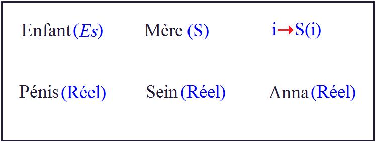

# Leçon 21 | 05 Juin 1957

<!-- source-url: http://staferla.free.fr/S4/S4 LA RELATION.docx -->
<!-- seminar: s4 -->
<!-- lesson: 21 -->

<!-- id: s4-21-0001 -->

- 09 Avril : *les deux culottes.*

<!-- id: s4-21-0002 -->

- 11 Avril : *la baignoire et le perçoir.*

<!-- id: s4-21-0003 -->

- 13 Avril : *chute d’Anna.*

<!-- id: s4-21-0004 -->

- 14 Avril : *la grande boite.*

<!-- id: s4-21-0005 -->

- 15 Avril : *la cigogne.*

<!-- id: s4-21-0006 -->

- 16 Avril : *le cheval fouetté.*

<!-- id: s4-21-0007 -->

- 21 Avril : *l’embarquement imaginaire avec le père, le grand dialogue.*

<!-- id: s4-21-0008 -->

- 22 Avril : *le sacre sur le wagonnet, le canif dans la poupée.*

<!-- id: s4-21-0009 -->

- 24 Avril : *l’agneau.*

<!-- id: s4-21-0010 -->

- 26 Avril : *Lodi.*

<!-- id: s4-21-0011 -->

- 30 Avril : *Ich bin der Vati.*

<!-- id: s4-21-0012 -->

- 02 Mai  : *l’installateur.*

<!-- id: s4-21-0013 -->

Reprenons aujourd’hui *quelques propos* sur le petit Hans, qui est l’objet depuis quelque temps de notre *attention*.

<!-- id: s4-21-0014 -->

Je rappelle dans quel esprit se poursuit *ce commentaire*. Qu’est-ce en somme que « *Le petit Hans* » ?
Ce sont les bavardages d’un enfant de cinq ans, entre le 1er Janvier et le 2 Mai 1908. Voilà ce que se présente être « *Le petit Hans* » pour tous les lecteurs non prévenus. S’il est prévenu - il n’a pas de peine à l’être - il sait que ces bavardages ont de l’intérêt.

<!-- id: s4-21-0015 -->

Pourquoi ont-ils de l’intérêt ? Ils ont de l’intérêt parce qu’il est posé, au moins en principe, qu’il y a un certain rapport
entre ces bavardages et quelque chose qui est tout à fait consistant : c’est une phobie

<!-- id: s4-21-0016 -->

- avec *tous les ennuis* qu’elle apporte à la vie du jeune sujet,

<!-- id: s4-21-0017 -->

- *toutes les inquiétudes* qu’elle apporte à son entourage,

<!-- id: s4-21-0018 -->

- *tout l’intérêt* qu’elle provoque chez le *Professeur* FREUD.

<!-- id: s4-21-0019 -->

Il y a un rapport, en d’autres termes, entre ces bavardages et cette phobie. Je considère qu’il est de toute première importance d’élucider ce rapport, de ne pas chercher ce rapport dans *un au-delà* du bavardage qui ne nous est nullement présenté dans l’observation. Elle se présente à nous dans notre esprit après coup, avec tout le caractère impérieux du préjugé. Exemple :
le point sur lequel je vous ai laissés la dernière fois, à savoir l’histoire de la poupée que le petit Hans transperce avec un canif.

<!-- id: s4-21-0020 -->

J’ai refait aujourd’hui une chronologie. Je pense que depuis le temps vous avez tous, non seulement lu, mais relu l’observation
du petit Hans, et que ces indications doivent être assez vivantes par elles-mêmes. La dernière fois quand je me suis arrêté
aux réactions du petit Hans à l’endroit des deux culottes de la mère, avec tout ce que ceci comporte :

<!-- id: s4-21-0021 -->

- de pro­blèmatique d’échanges à ce moment,

<!-- id: s4-21-0022 -->

- d’interrogations entre le père et l’enfant,

<!-- id: s4-21-0023 -->

- et une sorte de profond malentendu sur lequel se poursuit ce dialogue.

<!-- id: s4-21-0024 -->

J’ai mis - avec FREUD d’ailleurs - l’accent sur ce qui lui paraissait en tout cas *le résidu* le plus essentiel de ce dialogue
à propos des deux culottes de la mère. C’est à savoir ce qui alors est bel et bien affirmé par Hans, et qui ne lui est nullement induit ni suggéré par l’interrogatoire, c’est à savoir que les deux culottes n’ont absolument pas le même sens selon :

<!-- id: s4-21-0025 -->

- qu’elles sont là et que le petit Hans crache et se roule par terre, fait toute une vie, manifeste un dégoût dont lui-même ne donne pas la clef, mais manifeste le désir qu’on le communique au Professeur,

<!-- id: s4-21-0026 -->

- ou qu’elles sont sur la mère, auquel cas le petit Hans dit qu’elles ont pour lui littéralement un tout autre sens.

<!-- id: s4-21-0027 -->

Quand je mets l’accent là-dessus, je puis entendre de la part de certains, je ne sais quel étonnement : que j’élude à ce propos
la connexion des dites «** ***Hosen »*, des culottes de la mère, avec le *Lumpf*. Dans le vocabulaire du petit Hans, le *Lumpf* ce sont
les excréments. Ils sont appelés de cette façon atypique, comme il est excessivement fréquent chez les enfants
qu’un nom de rencontre, sinon de hasard, soit donné à cette fonction à partir d’une première dénomination
liée à une certaine connexion de l’exercice de cette fonction.

<!-- id: s4-21-0028 -->

Nous verrons ce qu’il en est au sujet du *Lumpf*. Comme si en somme à ce moment là je faisais, par je ne sais quel *esprit de système*, l’élision de ce *stade anal* qui surgit à point nommé dans notre esprit, exactement comme quand on appuie sur un bouton « *on* » provoque telle réaction conditionnée du *chien de Pavlov*. Du moment que vous entendez parler d’excréments :
*stade anal ! stade anal ! stade anal !* et parlons de *stade anal*, parce qu’il faut que les choses se passent *normalement*.

<!-- id: s4-21-0029 -->

Je voudrais que vous preniez un peu de recul sur cette observation, et que vous vous aperceviez que s’il y a
en tout cas une chose qui n’est vraiment nullement indiquée dans le procès de cette cure…
est-ce une cure ? Assurément je n’ai pas dit que c’était une cure, j’ai dit que c’était quelque chose qui a une fonction fondamentale dans notre expérience de l’analyse, comme chacune des grandes observations de FREUD
…rapide, c’est bien un certain *rythme* ou un certain *mécanisme* qui puisse s’inscrire dans *le registre* « *frustration* ».

<!-- id: s4-21-0030 -->

Il est précisément pendant tout le temps de la cure, non seulement soumis à *aucune frustration*, mais *comblé*. Régression ou agression ? Agression sans aucun doute, mais assurément pas liée ni à aucune *frustration*, ni à aucun moment de *régression*.
S’il y a *régression*, ce n’est pas au sens instinctuel, au sens même d’une résurgence de quelque chose qui soit antérieur,
s’il y a en effet un phénomène de régression, il est d’un registre qui est de l’ordre de celui qu’à plusieurs reprises je vous ai indiqué comme possible. C’est en effet ce qui se passe quand, de par la nécessité de l’élucidation par le sujet de son problème,
il arrive, il exige, il poursuit la réduction de tel ou tel élément de son « *être au monde »*, de ses relations, la réduction par exemple
du *symbolique* à *l’imaginaire*, voire quelquefois comme il est manifeste dans cette observation, du *réel* à *l’ima­ginaire*.

<!-- id: s4-21-0031 -->

En d’autres termes, le changement de l’abord des signifiants de l’un des termes en présence, c’est bien en effet ce que vous allez voir se faire quand au cours de cette observation, vous voyez le petit Hans poursuivre, avec ce je ne sais quoi de rigoureux,
voire d’impérieux, qui est bien le caractère du processus signifiant de l’inconscient en tant que FREUD l’a défini comme

<!-- id: s4-21-0032 -->

incons­cient, c’est-à-dire que sans que le sujet puisse aucunement s’en rendre compte, sans littéralement qu’il sache
ce qu’il est en train de faire, il suffit qu’il soit simplement aidé, incité au développement de *l’incidence signifiante* qu’il a lui-­même introduite comme nécessaire à sa sustentation psychologique. Arrivant à la développer, il en tire une certaine solution
qui n’est pas forcément d’ailleurs une solution normative, ni la solution la meilleure, mais assurément une solution
qui dans le cas du petit Hans, a pour effet de la façon la plus évidente de résoudre *le symptôme*.

<!-- id: s4-21-0033 -->

Revenons à ce *Lumpf*. FREUD le dit à un moment à propos en effet de ces signes de dégoût manifestés à propos *des culottes*
*de la mère*, et un peu avant, le père a posé quelques questions dans ce sens, que le petit Hans sûrement a montré que la question des *excréments* n’était pas pour lui sans signification ni sans intérêt. FREUD parle à propos des *culottes*, d’un rapport avec le *Lumpf*, mais bien entendu ceci se renverse : inversement nous pouvons dire que le *Lumpf* nous apparaît amené à propos des *culottes*.

<!-- id: s4-21-0034 -->

Et qu’est-ce cela veut dire ? Ce n’est pas simplement - ce qui est un fait - que c’est autour d’une manifestation nette
d’une réaction de dégoût que manifeste le petit Hans autour des culottes de la mère, qu’il est amené à parler des fonctions excrémentielles dont il s’agit. FREUD lui-même le souligne au moment où il parle du *Lumpf* : en quoi - en d’autres termes -
les excréments, et ce qui est de l’anal dans l’occasion, inter­viennent-ils dans l’observation du petit Hans ?

<!-- id: s4-21-0035 -->

En quoi ? En ceci qui nous est immédiatement dit, que le petit Hans a pris au *Lumpf* un intérêt qui peut-­être bien,
n’est pas sans rapport avec ces arrières plans, sans connexion avec la propre fonction excrémentielle.
Mais assurément de quoi s’agit-il à ce moment là ? C’est de la participation pleinement admise par la mère, aux fonctions excrémentielles de la mère, pour autant que le petit Hans est pendu après la mère à chaque fois qu’elle se culotte et se déculotte.
Il la tanne, et la mère s’en excuse : « *Je ne peux pas faire autrement que de l’emmener avec moi au cabinet* ». Car le père à ce moment là,
qui d’ailleurs n’en ignore pas grand-chose, refait sa petite enquête.

<!-- id: s4-21-0036 -->

C’est donc bien autour de ce jeu entre le petit Hans et sa mère : « *voir et ne pas voir* », et non seulement « *voir et ne pas voir* »,
mais « *voir ce qui ne peut pas être vu, parce que cela n’existe pas* » et que le petit Hans le sait très bien, et que pour voir
« *ce qui ne peut pas être vu* », il faut *le voir derrière un voile*, c’est-à-dire maintenir un voile devant l’inexistence de ce qui est à voir.

<!-- id: s4-21-0037 -->

C’est tout autour précisément du thème du voile, du thème de la culotte, du thème du vêtement pour autant que derrière
ce vêtement se dissimule le fantasme essentiel aux relations entre la mère et l’enfant, qu’est *le fantasme de la mère phallique*,
c’est autour de ce thème que le *Lumpf* est introduit, et par consé­quent si je le laisse à son plan, c’est-à-dire à *son second plan *:
ce n’est pas par esprit systématique, c’est parce que dans l’observation il ne nous est amené que dans cette connexion.

<!-- id: s4-21-0038 -->

Autrement dit, il ne suffit pas dans une analyse de trouver un air connu, pour se trouver du même coup enchanté d’être en pays de connaissance, et se contenter de dire nous sommes là en train de retrouver la ritournelle, à savoir « *le complexe anal »*.

<!-- id: s4-21-0039 -->

Il s’agit de savoir à tel moment de l’analyse quelle est la fonction précise de ce thème qui est toujours pour nous important,
non pas simplement à cause de cette *signification* d’ailleurs purement implicite, en elle-­même vague et uniquement liée à des idées de *génétisme* qui peuvent être à tout instant remises en cause dans ce cas concret au niveau de chaque moment d’une observation,
mais pour connaître sa connexion par rapport au *système complet du signifiant* en tant qu’il est en évolution,
autant pendant le *symptôme* dans l’évolution de la maladie, que dans le processus de la cure.

<!-- id: s4-21-0040 -->

Si le *Lumpf* à l’intérieur de ce système est quelque chose qui a un sens supplémentaire, c’est aussi bien assurément par ce par quoi il est strictement *homologue* de la fonction des culottes dans l’occasion, c’est-à-dire de voile.

<!-- id: s4-21-0041 -->

Le *Lumpf,* comme les culottes, est quelque chose qui peut tomber : le voile tombe, et c’est bien dans la mesure où le voile est tombé, que pour le petit Hans il y a un problème. Et si je puis dire, ce voile, il en relève le pan, puisque je vous ai dit que c’est justement dans la mesure de cette expérience du [9 Avril](#April_9), de *la longue explication sur les culottes* que nous verrons apparaître ensuite : le fantasme de la baignoire, c’est-à-dire l’introduction de quelque chose qui a le plus étroit rapport avec cette chute,
à savoir l’introduction par la combinaison de cette chute, de ce chu, avec l’autre terme en présence duquel il est affronté
dans la phobie, à savoir *la morsure* et que nous allons avoir l’introduction du thème de l’*amovibilité*, du dévissage,

<!-- id: s4-21-0042 -->

qui va se poursuivre comme un élé­ment de réduction essentiel de la situation dans la succession des fantasmes.

<!-- id: s4-21-0043 -->

Il faut donc bel et bien voir et concevoir *cette succession des fantasmes* du petit Hans, comme étant ce que je vous ai dit, à savoir

<!-- id: s4-21-0044 -->

*un mythe en déve­loppement*, quelque chose qui est *un discours*. D’ailleurs ce n’est absolument pas autre chose dans l’observation.

<!-- id: s4-21-0045 -->

Il ne s’agit pas d’autre chose dans l’ob­servation que d’une série de réinventions de ce mythe à l’aide d’éléments ima­ginaires.

<!-- id: s4-21-0046 -->

Et il s’agit de comprendre en quoi ce progrès tournant, ces successives transformations du mythe ont une fonction,
sont quelque chose qui, à un niveau profond qui est justement celui que nous pouvons comprendre, représente pour Hans
la solution du problème, qui est le problème littéralement de sa propre position dans l’existence, pour autant qu’elle doit
se situer par rapport à une certaine vérité, par rapport à un certain nombre de repères de vérité,
dans laquelle il a à prendre sa propre place.

<!-- id: s4-21-0047 -->

S’il fallait quelques preuves supplémentaires de ce que je vous dis, et j’insiste un peu dans toute la mesure où on m’a fait
cette *objection*, puisque je la rencontre, je veux la poursuivre jusque dans son dernier terme, et vous prier de vous reporter
au texte pour savoir ce qu’est en fin de compte le *Lumpf. J*’ajouterais que le petit Hans à un moment *déterminé*,
quand *on revient de chez la grand-mère* le dimanche soir, marque son dégoût dans le wagon, pour les coussins noirs du compartiment parce que c’est du *Lumpf***.**

<!-- id: s4-21-0048 -->

Et dans l’ex­plication qui suit avec le père, je crois deux jours après, qu’est-ce qui vient en comparaison du noir du *Lumpf* ?
Ce sont *une chemise*, *une chemisette noire* et des *bas noirs*. Le rapport étroit du thème du *Lumpf* avec les vêtements de la mère,
c’est-à-dire toujours avec le thème du voile, est accusé dans l’observation même par le petit Hans lui-même.
D’ailleurs *qu’est-ce donc que* le *Lumpf***,** et d’où sort-il ? Pourquoi le petit Hans a-t-il appelé les excréments un *Lumpf* ?
*On nous le dit* également dans l’observation : c’est par comparaison avec des bas noirs.

<!-- id: s4-21-0049 -->

Dans toute la mesure du segment d’observation dont nous poursuivons l’examen dans la psychanalyse de FREUD,
il est bien clair que le *Lumpf*, c’est-à-dire l’excrément, intervient là dans un certain rapport, dans une certaine fonction

<!-- id: s4-21-0050 -->

de l’articulation signi­fiante. Ce qu’il est beaucoup plus essentiel, beaucoup plus important, ce qui est à vrai dire la seule chose importante à nous de voir, c’est sa relation

<!-- id: s4-21-0051 -->

- avec ce thème du vêtement,

<!-- id: s4-21-0052 -->

- avec ce thème du voile,

<!-- id: s4-21-0053 -->

- avec ce thème de *ce derrière quoi* est cachée l’absence de pénis niée de la mère,
  …que c’est cela qui en est *la signification essentielle*, et que nous ne modifions aucunement la direction de l’observation elle-même par aucune espèce d’esprit de parti pris, quand nous prenons cet axe, ce centre pour comprendre quel est le progrès

<!-- id: s4-21-0054 -->

de ces trans­formations mythiques à travers lesquelles s’accomplit la réduction de la phobie dans l’analyse.

<!-- id: s4-21-0055 -->

Nous en étions arrivés au [11 Avril](#April_11), avec *le fantasme de la baignoire* dont je vous ai dit que la baignoire représentait quelque chose qui commence à être la mobilisation de la situation. En d’autres termes, ce à quoi Hans, pour des raisons X, se sent lié,
avec pour lui production *maxima* d’*angoisse*, à savoir cette réalité étouffante, unique de la mère qui à partir du moment où
il se sent absolument à la fois *livré à elle*, et *annulé par elle*, et *menacé par elle*, est quelque chose qui représente la situation de danger, de danger d’ailleurs abso­lument innommable en soi, d’angoisse à proprement parler, pour le petit Hans.
II s’agit de voir comment l’enfant va pouvoir sortir de cette situation. Je vous rappelle quel est le schéma fondamental
de la situation de l’enfant vis-à-vis de la mère, de l’enfant en passe de perdre l’amour de la mère. Il se situe comme ceci :

<!-- id: s4-21-0056 -->

<!-- id: s4-21-0057 -->

Mère symbolique, mère en tant qu’elle est le premier élément de la réalité qui est symbolisée par l’enfant, en tant qu’elle peut être essentiellement *absente* ou *présente*. Et tout le rapport de l’enfant avec la mère est lié à ceci que dans le refus d’amour,
la compensation est trouvée dans l’écrasement de la satisfaction *réelle* ce qui ne veut pas dire qu’à ce moment là il ne se produise pas une *inversion*, c’est-à-dire que justement dans la mesure où le sein devient une compensation, c’est lui qui devient le *don symbolique* et qu’à ce moment là la mère devient un élément *réel*, c’est-à-dire un élément tout-puissant qui refuse son amour.

<!-- id: s4-21-0058 -->

Le progrès de la situation avec la mère est dans ceci, c’est que l’enfant a à découvrir ce qui au-delà de la mère,
est aimé par la mère. Ce n’est pas lui l’enfant, mais le *i*, l’élément *imaginaire*, c’est-à-dire *le désir du phallus de la mère*.
En fin de compte, ce que l’enfant a à faire à ce niveau là - ce qui ne veut pas dire qu’il le fasse - c’est précisément d’arriver
à formuler ceci : *i* → S(*i*). Ce qui nous est montré dans *le jeu*, dans l’alternative du comportement de l’enfant encore *infans*,

<!-- id: s4-21-0059 -->

qui accompagne son jeu d’occultation de la part *sym­bolique*.

<!-- id: s4-21-0060 -->

Ceci est venu se compliquer pour le petit Hans, à un moment donné de l’introduction de *deux éléments* qui sont *deux éléments réels*, à savoir Anna, c’est-à-dire un *enfant réel* qui vient compliquer la situation de ses rapports avec l’au-delà de la mère,
et puis ici quelque chose qui lui appartient bien, et dont il ne sait littéralement plus quoi faire, un *pénis réel* qui commence
à remuer, qui a reçu un mauvais accueil de la personne sur qui il fonctionne. Le petit Hans vient de dire :
« *Tu ne trouves pas qu’il est mignon ?* ». La tante l’a dit l’autre jour : « *On n’en fait pas de plus beau.* »

<!-- id: s4-21-0061 -->

Ceci a été fort mal accueilli par la mère, et la question devient très compliquée à partir de ce moment là, parce que pour sonder
cette complication, vous n’avez qu’à prendre les deux pôles de la phobie, à savoir les deux éléments par lesquels le cheval
est redoutable, je vous l’ai expliqué : *le cheval mord*, et *le cheval tombe*.

<!-- id: s4-21-0062 -->

- *Le cheval mord*, c’est-à-dire puisque je ne peux plus satisfaire en rien la mère, elle va se satisfaire comme moi je me satisfais quand elle ne me satisfait en rien, c’est-à-dire me mordre comme moi je la mord, puisque c’est mon dernier recours quand je ne suis pas sûr de l’amour de la mère.

<!-- id: s4-21-0063 -->

- *Le cheval tombe* très exactement également comme moi, petit Hans, pour l’instant je suis laissé tomber,
  pour autant qu’on n’en a plus que pour Anna.

<!-- id: s4-21-0064 -->

Mais d’autre part il est tout à fait clair que d’une certaine façon il faut que le petit Hans soit mangé et mordu.
Il le faut parce que c’est cela en fin de compte qui correspond à une revalorisation de ce pénis qui a été tenu pour rien,
rejeté par la mère dans toute la mesure où il faut qu’il devienne quelque chose, et c’est précisément ce à quoi le petit Hans aspire.
Sa *morsure*, sa prise par la mère est quelque chose qui est autant désiré que craint. De même pour ce qui est du *tomber*,
c’est aussi ce quelque chose qui peut être désiré par le petit Hans, que le cheval tombe.

<!-- id: s4-21-0065 -->

Il y a plus d’un élément de la situation que le petit Hans désire voir tomber, et le premier est celui qui, dès que nous aurons introduit dans l’observation la catégorie du « *chu* », se pré­sentera, c’est à savoir la petite Anna quand il souhaite qu’elle tombe, qu’elle tombe par la fenêtre, qu’elle tombe s’il est possible, à travers les barreaux un peu trop large du balcon sécessionniste,
car nous sommes chez des gens à l’avant-garde du progrès, et auquel il a fallu ajouter un hideux grillage pour éviter que le
petit Hans ne pousse un peu trop vite la jeune Anna à travers l’espace. Donc, *la fonction de la morsure* comme *la fonction de la chute*, sont données dans *les structures mêmes, apparentes, de la phobie*. Elles sont un élément essen­tiel, elles sont comme vous le voyez

<!-- id: s4-21-0066 -->

un élément signifiant à deux faces.

<!-- id: s4-21-0067 -->

C’est cela le véritable sens du terme ambivalence, c’est-à-dire que cette chute n’est pas simplement crainte et redoutée,
pas plus que la morsure, par le petit Hans. Elles sont un élément qui peut intervenir dans un sens également opposé :
là, *la morsure aussi par un certain côté est désirée*, puisqu’elle va jouer un rôle essentiel dans la solution de la situation, *de même que la chute est également désirée*, et si la fille même ne doit pas tomber, il y a une chose certaine, c’est que *la mère tout au long de l’observation*, va aussi décrire une courbe de chute à partir d’un certain moment, qui est juste celui conditionné par l’apparition
de cette fonction curieuse, de cette fonction instrumentale du *dévissage* qui apparaît pour la première fois,
d’abord d’une façon énigmatique dans *le fantasme de la baignoire*.

<!-- id: s4-21-0068 -->

À savoir qu’en somme puisque comme je vous l’ai dit la dernière fois, ce qui est en cause c’est l’*angoisse* concernant,
non pas simplement la mère en réalité, mais vraiment tout l’ensemble : tout le milieu, tout ce qui a constitué jusque là la réalité du petit Hans, les repères fixes de sa réalité, ce que j’ai appelé la dernière fois « *la baraque* », avec le 1er *fantasme de l’arrivée*
*du plombier et du dévissage de la baignoire*, on commence à démonter en détail « *la baraque* ». Là nous avons également des connexions qui font que ceci n’a pas du tout une connexion abstraite, mais quelque chose de parfaitement contenu dans l’expérience.

<!-- id: s4-21-0069 -->

N’oublions pas que dans l’observation, nous avons ceci de dévoilé que des baignoires, on en a déjà dévissé devant le petit Hans, puisque quand on allait à *Gmunden* en vacances, on emportait une baignoire dans une caisse, que d’autre part nous avons la notion dont nous regrettons dans l’observation de ne pas trouver une date précise, de déménagements antérieurs qui doivent se situer à peu près dans l’espace de temps qui équivaut à ce qu’on appelle l’anamnèse de l’observation, c’est-à-dire les deux années avant la maladie sur lesquelles nous avons un certain nombre de notes parentales.

<!-- id: s4-21-0070 -->

Le déménagement comme le transport de la baignoire à *Gmunden*, c’est quelque chose qui pour le petit Hans, a déjà donné
le matériel signifiant de ce que cela signifie démonter toute la baraque. Déjà il sait que cela peut arriver mais sans aucun doute cela a déjà été pour lui une expérience plus ou moins intégrée dans sa manipulation proprement signifiante.

<!-- id: s4-21-0071 -->

Nous nous trouvons là dans le fantasme qui l’amène de la baignoire dévissée comme un premier pas dans la perception
de ce qui se présente d’abord avec ce caractère opaque, purement et simplement signalétique d’*inhibition*, d’*arrêt*, de *frontière*,
de *limite* au-delà de laquelle on ne peut pas passer, qu’est la phobie. Cela ne peut être mobilisé que dans la phobie elle-même
où il y a des éléments qui peuvent être combinés autrement.

<!-- id: s4-21-0072 -->

Autrement dit, cette morsure du cheval avec ses dents de devant, cette pince…
dont je vous ai expliqué la dernière fois la signification plurale, à savoir que c’est précisément dans beaucoup
de langues : dans *la langue allemande* comme dans *la langue* *française*, et comme *dans bien d’autres*, notamment
dans *la langue grecque,* l’appareil à mordre du cheval, et aussi quelque chose qui veut dire pince ou tenailles

<!-- id: s4-21-0073 -->

…nous fait apparaître pour la première fois le per­sonnage qui, avec des pinces et des tenailles, commence à entrer en jeu
et à introduire un élément d’évolution, je vous le répète, *d’évolution purement signi­fiante*.

<!-- id: s4-21-0074 -->

Vous n’allez pas me dire qu’il y a des traces déjà instinctuelles dans l’enfant, pour nous expliquer que la baignoire ait été dévissée, que c’est à la fois *la même chose* et que c’est même par certains côtés *l’opposé*. En d’autres termes, *que c’est autre chose, ailleurs que dans le signifiant lui-même* - c’est-à-dire que dans *le monde humain du symbole* qui comprend bien entendu l’outil et l’instrument -
*que va se situer le développement de l’évolution mythique* dans lequel le petit Hans s’engage par *cette espèce de collaboration obscure et tâtonnante* qui s’éta­blit entre lui et les deux personnages qui se sont penchés sur son cas pour le psychanalyser.

<!-- id: s4-21-0075 -->

Je m’arrête un instant sur ceci, c’est qu’il n’y a pas simplement dans *le fantasme de la baignoire* que la baignoire ni que le dévissage,
il y a aussi à ce moment là le *Bohrer*, le *perçoir*. Là, comme toujours il y a une perception très vive, liée à la fraîcheur
de la découverte, qui fait que les témoins qui en sont à la barrière explorative de l’analyse, ne font aucun doute sur ce qu’est
ce perçoir : c’est *le pénis maternel*, disent-ils, et ce pénis - là aussi apparaît un certain flottement dans le texte :

<!-- id: s4-21-0076 -->

- vise-t-il le petit Hans,

<!-- id: s4-21-0077 -->

- vise-t-il la mère ?

<!-- id: s4-21-0078 -->

Je dirais que cette *ambiguïté* est tout à fait valable, et qu’elle est d’autant plus valable que nous comprenons mieux de quoi il s’agit.
Une fois de plus, voyez-y la preuve de ce que je vous dis, qu’il ne suffit pas d’avoir dans la tête *le fichier* plus ou moins complet des situations classiques dans l’analyse, à savoir qu’il y a un *complexe d’œdipe inversé*, que dans une perception du coït des parents,
un enfant peut s’identifier à la partie féminine.

<!-- id: s4-21-0079 -->

Que nous trouvions là donc dans une identification du petit Hans à sa mère, c’est vrai, pourquoi pas ?
Mais à une seule condition, c’est que nous comprenions en quoi c’est vrai. Car dire simplement cela, non seulement
n’a à proprement parler aucun intérêt, mais ne colle à aucun degré avec quoique ce soit qui représente *les tenants et les aboutissants* qui s’accordent avec cette apparition dans le fantasme de ceci : l’enfant se concevant, s’imaginant et articulant lui­-même
que quelque chose est venu lui faire un grand trou dans le ventre.

<!-- id: s4-21-0080 -->

Cela ne peut littéralement prendre son sens que dans le contexte, dans l’évolution signifiante de ce dont il s’agit.
Disons qu’à ce moment là, le petit Hans explique à son père : « *Fous-lui çà une bonne fois là où il faut* ».
Et c’est bien tout ce qui est en question dans la relation du petit Hans avec son père.

<!-- id: s4-21-0081 -->

Tout au long nous avons la notion, et de cette carence et de l’effort que fait le petit Hans pour restituer, je ne dirais pas
une situation normale, car il ne saurait en être question à partir du moment où le père est en train de jouer le rôle qu’il joue
avec lui, c’est-à-dire à le supplier de bien croire que lui, papa, n’est pas méchant, mais une situation structurée.

<!-- id: s4-21-0082 -->

Et dans cette situation struc­turée, il y a de fortes raisons pour qu’en même temps que le petit Hans aborde le déboulonnage
de la mère, il provoque corrélativement et d’une façon impé­rieuse, l’entrée en fonction de ce père à l’endroit de la mère.
Je vous le répète : il y a mille façons, mille angles sous lesquels peuvent intervenir au cours d’une analyse ces fantasmes
de passivité du petit garçon, pour prendre le petit garçon dans *une relation fantasmatique* avec le père, où il s’identifie avec la mère.

<!-- id: s4-21-0083 -->

Pour ne pas aller plus loin que ma propre expérience analytique, il n’y a pas tellement longtemps un homme, qui n’était pas
plus homosexuel que le petit Hans à mon avis n’a jamais pu le devenir, a quand même à un moment donné de son analyse, articulé ceci : que sans aucun doute il s’était fantasmé dans son enfance dans la position maternelle, précisément pour,
si je puis dire, s’offrir comme victime à sa place. Toute la situation d’enfance ayant été vécue par lui comme une sorte d’importunité de l’insistance sexuelle du père, per­sonnage fort exubérant, voire exigeant dans ses besoins à l’endroit d’une mère qui les repoussait de toutes ses forces, et dont l’enfant avait la perception que dans cette occasion - justifiée ou non -
elle vivait la situation comme une victime.

<!-- id: s4-21-0084 -->

Dans la mesure où ceci s’est intégré au développement de la sympto­matologie du sujet, car ce sujet est un névrosé,

<!-- id: s4-21-0085 -->

nous ne pouvons aucunement nous arrêter à la position simplement féminisée, voire homosexuelle, que repré­sente

<!-- id: s4-21-0086 -->

ce que fonctionnellement à un moment donné de l’analyse, représente l’issue de ce *fantasme*, sans son contexte qui lui donne là un sens tout à fait différent et tout à fait opposé de ce qui se passe dans l’observation du petit Hans.

<!-- id: s4-21-0087 -->

Le petit Hans dit à son père : « *Baise là un peu plus* », et l’autre lui dit « *Baise là un peu moins* ». Ce n’est pas pareil,
évidemment pour les deux il faut se servir du terme « *Baise là* » et même : « *Baise moi à sa place s’il le faut* ». C’est dans la mesure
de la connexion signifiante du terme, que nous pouvons apprécier ce dont il s’agit. En effet dans la situation qui est ainsi créée et qui en apparence est sans issue, puisque aussi bien n’y intervient pas le père, vous me direz pourtant : le père existe,
le père est là. Quelle est la fonction du père dans *le complexe d’Œdipe* ?

<!-- id: s4-21-0088 -->

C’est bien évidemment à un point quelconque ou sous la forme quelconque où doit se présenter l’impasse de la situation
de l’enfant avec la mère, qu’il faut introduire un autre élément. Je vous souligne que nous allons - parce qu’il faut répéter
les choses, et que si on ne les répète pas on les perd - une fois de plus les réarticuler, et bien entendu ce ne sera pas une réarticulation, parce que par définition si le complexe d’œdipe est fondamental, il doit être expliqué de mille façons dif­férentes.

<!-- id: s4-21-0089 -->

Néanmoins il y a quand même des éléments structuraux que nous pouvons toujours retrouver et qui sont les mêmes,

<!-- id: s4-21-0090 -->

au moins quant à leur dis­position et quant à leur nombre.

<!-- id: s4-21-0091 -->

Le fait que le père arrive sur un certain plan en tiers - si nous le prenons sur un autre plan : en quart, parce qu’il y a déjà trois éléments à cause de ce *phallus* inexistant - dans la situation entre l’enfant et la mère, voilà quelque chose qui…
si vous me pardonnez cette expression que je n’aime pas beaucoup, mais je suis forcé de la prendre pour aller vite
…qui est l’« *en soi »* de la situation. Je veux dire que pour l’instant, je considère le père en tant qu’il doit être là, dans la situation avec les autres, indépendamment de ce qui va se passer pour un « *pour soi* » du sujet. Et je n’aime pas beaucoup cette expression parce que vous pouvez prendre ce « *pour soi* » pour quelque chose qui est donné dans la conscience du sujet, or ce « *pour soi »*

<!-- id: s4-21-0092 -->

est pour la plus grande part dans l’in­conscient du sujet, à savoir les effets du *complexe d’Œdipe*.

<!-- id: s4-21-0093 -->

Mais c’est pour marquer la différence que je note dans le fait que le père doit être là, et en soi quel doit être son rôle.
Je ne peux tout de même pas refaire à cette occasion toute la théorie du *complexe d’Œdipe*, néanmoins le père est celui qui possède la mère, qui la pos­sède en père, avec son vrai pénis qui est un pénis suffisant, à la différence de l’enfant qui, lui,
est en proie à ce problème d’un instrument à la fois mal assimilé et insuffisant, sinon repoussé et dédaigné.

<!-- id: s4-21-0094 -->

Ce que nous apprend la théorie analytique sur le *complexe d’Œdipe*, ce qui rend le *complexe d’Œdipe* en quelque sorte nécessaire,

<!-- id: s4-21-0095 -->

entendez par néces­saire, quelque chose qui n’est pas d’une nécessité biologique ni d’une nécessité interne, mais d’une nécessité en tout cas empirique, parce que c’est dans l’expérience qu’on l’a découvert, *et si ça veut dire quelque chose que le complexe d’Œdipe existe*, c’est que la montée naturelle de l’apparition de la puissance sexuelle chez le jeune garçon, ne se fait pas toute seule,
ni en un temps, ni en *deux temps*. Car après tout elle pourrait aussi se faire en deux temps, comme elle se fait effectivement,
si nous considérons purement et simplement le plan *physiologique*. Mais la seule considération de cette montée naturelle
ne suffit à aucun degré à rendre compte de ce qui se passe.

<!-- id: s4-21-0096 -->

Il est un fait, c’est que pour que la situation se développe dans les conditions normales, je veux dire dans celles qui permettent au sujet humain de conserver d’une façon suffisante sa présence, non seulement dans le *monde* *réel*, mais dans le *monde symbolique*, c’est-à-dire qu’il se tolère dans le *monde réel* tel qu’il est organisé avec sa *trame de symbolique,* il faut qu’il y ait non pas simplement cette sorte de perception de ce que je vous ai appelé la dernière fois le mouvement, avec son accélération, avec ce quelque chose qui emporte le sujet et le transporte, il faut qu’il y ait *autre chose*, quelque chose qui est arrêt d’une part, fixation de deux termes :

<!-- id: s4-21-0097 -->

- le vrai pénis, le pénis réel, le pénis valable, le *pénis du père*, le pénis qui fonctionne,

<!-- id: s4-21-0098 -->

- et le *pénis de l’enfant* qui se situe compa­rativement dans une *Vergleichung* \[comparaison\] avec ce pénis du père, et qui va en quelque sorte en rejoindre *la fonction*, la réalité, la dignité, l’intégration en tant que pénis, pour autant qu’il y aura passage par cette annulation qui s’appelle *le complexe de castration*.

<!-- id: s4-21-0099 -->

En d’autres termes, c’est pour autant que son propre pénis est momen­tanément dans un moment qui est un moment dialectique, annihilé, que l’enfant est promis plus tard à accéder à une fonction paternelle pleine, c’est-à-dire à être quelqu’un
qui se sente *légitimement* en possession de sa virilité. Et il appa­raît que ce « *légitimement* » est essentiel au fonctionnement heureux chez le sujet humain de la fonction sexuelle. Sans cela, tout ce que nous disons de déter­minisme, d’éjaculation précoce et

<!-- id: s4-21-0100 -->

des différents troubles de la fonction sexuelle, n’a littéralement aucune espèce de sens, si ça n’a pas son sens dans ces *registres* là.

<!-- id: s4-21-0101 -->

Il importe de concevoir ceci - ceci n’est que la re-situation générale du problème - que l’expérience nous dit, et ce qui n’était pas prévisible d’ailleurs. Déjà ce que je viens de vous donner précédemment, le schéma de la situation, n’est pas obligatoirement prévisible en soi-même, la preuve c’est que l’expérience *analytique* qui l’a découvert *ce complexe d’Œdipe*, en tant qu’il est intégration à la fonction virile, nous permet de pousser plus loin les choses et de dire que si le *Père symbolique*…
à savoir le *Nom du Père* est essentiel à la structuration du *monde symbolique*, à cette sortie de sevrage plus essentiel que le sevrage primitif par quoi l’enfant sort du pur et simple couplage avec la toute puissance maternelle
…si le *Père symbolique* est l’élément médiateur essentiel du monde symbolique, si le *Père symbolique* est si essentiel à toute articulation de langage humain, c’est ce qui est à proprement parler la raison pour laquelle *L’Ecclésiaste* dit :

<!-- id: s4-21-0102 -->

« *L’insensé a dit dans son cœur : il n’y a pas de Dieu.* »

<!-- id: s4-21-0103 -->

C’est précisément parce qu’il le « *dit dans son cœur* », et que d’autre part il est à proprement parler insensé de dire dans son cœur qu’« *il n’y a pas de Dieu* », tout simplement parce qu’il est insensé de dire une chose qui est contra­dictoire avec l’articulation même du langage. Et vous savez très bien que ce n’est pas *une profession de déisme* que je suis là en train de faire. Il y a le *Père symbolique*.

<!-- id: s4-21-0104 -->

L’expérience nous apprend que pour ce qui se rapporte à l’incidence propre de l’entrée du père dans cette assomption
de la fonction sexuelle virile, c’est le *Père réel* qui joue là un rôle de présence essentiel. À savoir que c’est dans la mesure
où le *Père réel* joue vraiment le jeu, sa fonction de père castrateur, sa fonction de père si je puis dire, sous sa forme concrète, empirique, et disons même jusqu’à un certain point, j’allais presque dire dégé­nérée…

<!-- id: s4-21-0105 -->

> le personnage du père primordial sous sa forme tyrannique
>
> et plus ou moins horrifiante sous laquelle le mythe freudien nous l’a présenté
> …dans la mesure en d’autres termes, où le père tel qu’il existe remplit sa fonction *ima­ginaire* dans ce qu’elle a, elle, d’empiriquement intolérable, si vous voulez de révoltant, dans le fait - d’une façon quelconque - qu’il fait sentir son incidence
> comme castratrice et uniquement sous cet angle, que *le complexe de castration* est vécu.

<!-- id: s4-21-0106 -->

Ce que nous avons là est d’ailleurs merveilleusement illustré dans le cas du petit Hans : il y a un *Père symbolique*, et le petit Hans, qui n’est pas un insensé, y croit tout de suite à ce *Père symbolique* : FREUD est le *Bon Dieu*. Imaginez bien que c’est l’un
des éléments plus essentiels de l’instauration de l’équilibre pour le petit Hans. Naturellement, c’est le *Bon Dieu*.

<!-- id: s4-21-0107 -->

Il y croit tout de suite, et il y croit comme nous y croyons tous au *Bon Dieu* : il y croit sans y croire, il y croit parce que
c’est un élément essentiel de toute espèce d’articulation de la vérité que cette référence à une sorte de témoin suprême
qui est en fin de compte cela. Il y a quelqu’un qui sait tout, il l’a trouvé : c’est le professeur FREUD. Quelle chance !
Il a le bon Dieu sur la terre. Nous n’en avons pas tous autant. En tout cas cela lui rend bien service, mais ne supplée aucunement à *la carence du Père imaginaire*, du père vraiment castrateur. Et tout le problème est là : il s’agit que le petit Hans
trouve une suppléance à ce père qui s’obstine à ne pas vouloir le castrer.

<!-- id: s4-21-0108 -->

C’est là la clef de l’observation. Il s’agit de savoir comment le petit Hans va pouvoir supporter son *pénis réel*, justement
dans la mesure où il n’est pas menacé. C’est là le fondement de l’angoisse. Ce qu’il y a d’intolérable dans sa situation, c’est cela, c’est cette *carence* du côté du castrateur. Et en fait à travers toute l’observation, vous ne voyez nulle part apparaître quoique
ce soit qui représente la structuration, la réalisation, le vécu, même fantasmatique de quelque chose qui s’appelle une castration.
Il y a une blessure impérieusement appelée par le petit Hans, et à propos de cela tout lui est bon.

<!-- id: s4-21-0109 -->

Bien contrairement à ce que dit là FREUD, il n’y a rien dans cette expérience du petit Hans *se blessant au pied* contre une pierre, qui ait en soi appelé la connexion, et le vœu que le père subisse cette blessure, cette espèce de cir­concision mythique,

<!-- id: s4-21-0110 -->

comme elle apparaîtra ensuite au niveau du grand dialogue le [21 Avril](#April_21), quand il dira à son père :

<!-- id: s4-21-0111 -->

« *Il faut que tu arrives là comme un nu.* » \[*Ja, du sollst als Nackter*\]

<!-- id: s4-21-0112 -->

Et tout le monde est tellement stupéfait qu’on se demande ce que cet enfant peut vouloir dire, car on se dit que cet enfant commence à parler « biblique », même dans l’observation on met une parenthèse : cela veut dire qu’il vient avec les pieds nus.
Et pourtant le petit Hans, c’est lui qui est dans le vrai. Il s’agit de savoir si le père va en effet faire ses preuves, c’est-à-dire
va s’affronter en homme avec sa redoutable mère, et si lui-même, le père, oui ou non a passé par l’initiation essentielle,
par la blessure, par le heurt contre la pierre. C’est vous dire à quel point le thème sous sa forme la plus fondamentale,
la plus mythique, est quelque chose à quoi le petit Hans aspire littéralement de tout son être.

<!-- id: s4-21-0113 -->

Malheureusement il n’en est rien. Il ne suffit pas que le petit Hans ait dit cela dans le dialogue avec son père.
Le petit Hans a montré à ce moment là qu’il brûlait par rapport à ce qui est par lui impérieusement désiré, à savoir la jalousie
du Dieu jaloux, car c’est le terme employé dans la Bible, à savoir un père qui lui en veut, mais qui le châtre. Mais il ne l’a pas,
et c’est tout autrement que la situation tourne. Je vous dirai tout à l’heure comment nous pouvons le concevoir.

<!-- id: s4-21-0114 -->

Remarquez que s’il n’y a pas de castrateur, puisque nous sommes du côté du père, nous avons par contre un certain nombre
de personnages qui sont venus à la place du castrateur : nous avons le plombier qui a commencé à dévisser la baignoire,
et puis le perceur. Nous en verrons d’ailleurs tout à l’heure un autre qui n’est pas à proprement parler impliqué dans la fonction désirée du père.

<!-- id: s4-21-0115 -->

Il y a en tout cas bel et bien ce que le petit Hans lui–même appelle l’installateur du dernier fantasme, du fantasme du [2 Mai](#Mai_2)
qui vient clore la situation. L’installateur, c’est dire que le Dieu ne fait pas très bien toutes ses fonctions,
alors on fait sortir le *deus ex machina*. C’est cela par rapport au complexe de castration, à ce castrateur exigé par la situation.

<!-- id: s4-21-0116 -->

L’installateur c’est vraiment le *deus ex machina*, à savoir que le petit Hans lui fait remplir ce qu’il peut lui faire remplir,
une partie des fonctions qu’il est là pour remplir.

<!-- id: s4-21-0117 -->

Je vous fais remarquer que tout se réduit à ceci. Il faut savoir lire le texte, ça ne peut pas être plus frappant que cela ne l’est
dans ce *dernier fantasme*, *le fantasme* qui littéralement *clôture* *la cure* et *l’observation*, à savoir que ce que vient changer l’installateur,
c’est quelque chose qui est *le derrière du* petit Hans, l’assiette du petit Hans.

<!-- id: s4-21-0118 -->

On a commencé à démonter toute la baraque, ça ne suffit pas, il faut changer quelque chose dans le petit Hans, et sans aucun doute nous retrouvons là *le schéma de symbolisation fondamental du complexe de castration.* Mais on voit dans l’observation même
à quel point FREUD lui-même se laisse emporter par *le schéma* : il n’y a pas trace dans *le fantasme* du petit Hans,
d’un remplacement de ce qu’il a devant.

<!-- id: s4-21-0119 -->

Si le schéma du *complexe de castration* est celui que je vous ai donné, et c’est très précisément FREUD qui le dit et qui l’admet, FREUD fantasme, il dit :
*« Évidemment on t’a donné aussi un autre pénis »*

<!-- id: s4-21-0120 -->

Malheureusement il n’y a rien de pareil dans le fantasme du petit Hans. On lui a dévissé le derrière et on lui en a donné un autre, et on lui a dit : « *retourne-toi de l’autre côté »*, puis ça s’arrête là. Il faut prendre le texte tel qu’il est, et il est clair que c’est en ceci que réside la spécificité de l’observation du petit Hans, et aussi *le quelque chose* qui doit nous permettre de comprendre *tout l’ensemble*.
Si en effet, après être allé si près, ça n’a pas été plus loin, c’est que ça ne pouvait pas aller plus loin.

<!-- id: s4-21-0121 -->

Parce que si ça avait été plus loin il n’y aurait pas eu de phobie, mais un *complexe d’Œdipe* et *de castration* normal,
et il n’y aurait pas eu besoin de toute cette complication* *: ni de la phobie, ni du symptôme, ni de l’analyse,
pour arriver à un point qui n’est pas forcément le point stipulé, le point typique.

<!-- id: s4-21-0122 -->

*Reprenons alors les choses* au point où nous avons laissé notre petit Hans, parce que ceci est à peu près pour nous situer la fonction du père dans l’occasion, ou plus exactement ce en quoi il est : à la fois incontestablement là, agissant, utile, dans l’analyse,
mais en même temps, du fait qu’il est là dans l’analyse, dans des fonctions manifestement incompatibles,
prédéterminées par la situation d’ensemble, à jouer sa fonction efficace de père castrateur.

<!-- id: s4-21-0123 -->

Vous observerez qu’en somme s’il y a castration, dans la mesure où le *complexe d’Œdipe* est castration, que la castration,
ça n’est pas pour rien qu’on s’est aperçu - d’une façon ténébreuse - mais qu’on s’est aperçu qu’elle avait tout autant de rapport avec la mère qu’avec le père. La *castration maternelle*, nous le voyons dans la description de la situation primitive
en tant qu’elle implique pour l’enfant la possibilité de la dévoration et de la morsure.

<!-- id: s4-21-0124 -->

Par rapport à cette antériorité de la *castration maternelle*, la *castration paternelle* en est un substitut qui n’est pas moins terrible
peut­-être, mais qui est certainement plus favorable parce que lui est susceptible de développement, au lieu que dans l’autre cas pour ce qui est de l’engloutissement et de la dévoration par la mère, c’est sans issue de développement.

<!-- id: s4-21-0125 -->

C’est très précisément, entre ces deux termes, un terme où il y a un déve­loppement dialectique possible, à savoir une rivalité avec le père, un meurtre du père possible, une éviration du père possible, que *le complexe de castration* est fécond dans l’œdipe,
au lieu qu’il ne l’est pas du côté de la mère, pour une simple raison : c’est qu’il est tout à fait impossible d’évider la mère
parce qu’elle n’a rien que l’on puisse lui évider.

<!-- id: s4-21-0126 -->

Voilà donc Hans au carrefour, et nous voyons déjà se dessiner le mode de suppléance par où *quelque chose* va pouvoir être dépassé de la situation primitive de pure menace de dévoration totale par la mère. Déjà *quelque chose* s’en dessine dans *le fantasme* que j’appelle celui *de la baignoire* et *du perçoir*. Comme tous les *fantasmes* du petit Hans, c’est un commencement d’articulation
de la situation : il y a « *retour*, si on peut dire, *à l’envoyeur* », à l’endroit de la mère, de la menace.

<!-- id: s4-21-0127 -->

C’est la mère qui est déboulonnée, c’est *le père* qui est appelé à jouer son rôle de *perceur*. Là aussi je vous fais remarquer
que je ne fais rien d’autre que de prendre littéralement ce que FREUD nous apporte. Il est tellement saisi par ce rôle de *perceur* qu’il nous fait la remarque sans la résoudre lui-même, et pour une bonne raison, c’est qu’il faudrait voir quand même

<!-- id: s4-21-0128 -->

avec la philologie, l’eth­nographie, les mythes, etc., quel rapport il peut y avoir entre *Bohrer* et *geboren .*

<!-- id: s4-21-0129 -->

*Geboren* veut dire en allemand *naître* ou *être né*, et *Bohrer* veut dire *perçoir*. Il n’y a pas de rapport entre ces deux racines. Résumons.
C’est toute la différence du *ferio* en latin, et du *fero*, de frapper ou de porter. Ce n’est pas la même racine, et quand on poursuit dans les dif­férentes langues ces deux racines, elles restent parfaitement distinctes. Enfin il y a le *ferare*, percer, qui n’est évidemment pas la même chose que le *fero*, *porter*, et c’est toujours à ce terme « *porter* » que se rapporte le *geboren***.**

<!-- id: s4-21-0130 -->

On le retrouve aussi loin qu’on poursuive la distinction essentielle des deux racines. Mais l’important c’est précisément
que FREUD s’y arrête, et s’arrête là à quelque chose qui est littéralement une rencontre de signifiant avec la problématique purement signifiante que cela propose, car en fin de compte le perceur évoque à ce propos PROMÉTHÉE qui est un perceur.
Le perceur est le *geboren*, c’est-à-dire le terme du portage fondamental de la mise au jour de l’enfant. Il reste deux éléments distincts, voire opposés. Ceci est une parenthèse incidente pour vous montrer l’importance que lui­-même, FREUD,
apporte au terme signifiant.

<!-- id: s4-21-0131 -->

Quelle va être *la ligne* dans laquelle va se développer la suite de la solution de *la suppléance* apportée par le petit Hans,
au point où il est en quelque sorte impuissant à faire « mûrir ». Permettez-moi cette expression, il ne s’agit pas là de maturation instinctuelle à pousser dans une direction qui ne soit pas d’impasse, le développement dialectique de la situation.
Il faut bien croire qu’il y a quelque chose, puisque qu’il y a un développement. Du moins il s’agit de le comprendre,
et de le comprendre dans son ensemble. Je ne pourrai donc aujourd’hui que vous l’indiquer.

<!-- id: s4-21-0132 -->

Le biais, c’est celui par lequel passe tout le développement à partir du *point* où nous sommes arrivés, aux environs de la [mi-Avril](#April_13), c’est-à-dire de l’in­troduction d’Anna comme un élément dont *la chute* est possible et désirée, de même que *la morsure maternelle*,
est prise comme élément instrumental, comme substitut de l’intervention castratrice, qui d’ailleurs est dérivée dans sa direction, qui ne porte pas sur le pénis, qui porte sur autre chose, ce quelque chose qui dans le dernier fantasme, aboutit à un changement.

<!-- id: s4-21-0133 -->

Il faut croire que ce changement a déjà un certain degré de suffisance en lui-même, en tout cas de suffisance pour la réduction de la phobie. Hans à la fin est changé, c’est ce qui est obtenu, et nous en verrons la prochaine fois toutes les conséquences
qui sont absolument capitales pour le développement de Hans et qui sont fascinantes. Anna entre, c’est-à-dire l’autre terme inassimilable de la situation. Tout le procès des *fantasmes* de Hans va consister par étapes, étapes que nous nous efforcerons
de décrire une par une, pour restituer cet élément intolérable du réel, au registre *imaginaire* dans lequel il peut être réintégré.

<!-- id: s4-21-0134 -->

Lisez ou relisez avec cette clef l’observation, voyez comment Anna est réin­troduite sous une forme complètement *fantasmatique*, l’Anna d’avant la nais­sance, quand le petit Hans nous dit : il y a deux ans Anna était déjà venue avec nous à *Gmunden*,
à ce moment là elle était dans le ventre de sa mère, mais le petit Hans nous raconte qu’on l’avait emmené dans un petit coffre­ arrière de la voiture, et que là elle menait une vie bien rigolote, ou bien encore que toutes les années précédentes
on l’avait ainsi emmenée, car la petite Anna est là depuis toujours.

<!-- id: s4-21-0135 -->

Ce qui est intolérable dans la situation, c’est que le petit Hans ne peut envisager qu’il y ait une autre Anna dans les vacances
de *Gmunden*. Il le compense dans la *réminiscence* - je veux dire que dans ce terme très précisément que j’emploie *avec l’accent platonicien*, comme étant opposé à *la fonction de la répétition -* à savoir de *l’objet retrouvé*, il fait de l’objet un objet dont l’idée est là depuis toujours. Il fallait que PLATON ait quelque chose qui expliquât notre accès au monde supérieur,
puisque nous pourrions y entrer encore que n’en faisant partie.

<!-- id: s4-21-0136 -->

C’est la même chose que fait le petit Hans, il réduit Anna à quelque chose dont on se souvient depuis toujours. Première étape de cette *imaginification* de ce *réel*, *réminiscence* si vous voulez, et cela a un autre sens que les histoires de régression instinctuelle.
Et puis après cela, à partir du moment où elle est une *idée* au sens platonicien du terme, voire un *idéal*, elle est en effet un idéal,
et à ce moment là que lui fait-il faire ?

<!-- id: s4-21-0137 -->

Cela aussi est dans son *fantasme*, il la fait monter *à dada* sur le cheval, et c’est à la fois humoristique, brillant, mythique, épique,
et cela a en même temps tous les caractères de ces textes épiques dans lesquels nous nous exténuons à décrire deux états

<!-- id: s4-21-0138 -->

de la conden­sation, deux étapes de l’épopée, et à supposer toutes sortes d’interpellateurs, de commentateurs, de mystificateurs pour expliquer quelque chose qui, dans l’épopée comme dans le mythe, tient à ceci : il s’agit d’expliquer

<!-- id: s4-21-0139 -->

- ce qui se passe dans *le monde imaginaire,*

<!-- id: s4-21-0140 -->

- et ce qui se passe dans *le monde réel*.

<!-- id: s4-21-0141 -->

Ici le petit Hans ne peut pas éliminer le cocher, et d’autre part il faut que la petite Anna soit sur le cheval, et qu’elle aussi tienne les rênes. Alors dans la même phrase il dit que les rênes étaient dans les mains de l’une, mais aussi dans les mains de l’autre.
Et là vous avez à l’état vivant cette espèce de *contradiction interne* qui souvent dans les mythes nous fait supposer deux registres qui sont de la confusion, de l’incohérence de deux histoires, alors qu’en réalité c’est parce que l’auteur est en proie - qu’il s’agisse de l’*Odyssée* ou du Petit Hans - à *une contradiction* qui est simplement ceci : *la contradiction de deux registres* essentiellement différents. Et là vous le voyez vivre dans le cas Hans.

<!-- id: s4-21-0142 -->

C’est en somme par l’intermédiaire de cette sœur qui devient son *moi supérieur* à partir du moment où elle est *une image*,
et avec cette clef vous pouvez voir la signification de toutes les appréciations maintenues à partir d’un certain moment
sur le sujet de la petite Anna, y compris les appréciations admi­ratives. Elles ne sont pas simplement ironiques,

<!-- id: s4-21-0143 -->

elles sont essentielles de ce *petit autre* qui est là en face de lui. Il fait ce par quoi il va pouvoir commencer à *dominer la situation*,
à partir du moment où la petite Anna, aura chevauché suffisamment longtemps *le cheval redoutable*.
Et je vous ai dit qu’à partir de ce moment là, le petit Hans pourra lui aussi fantasmer qu’*il le dompte* ce cheval,
et c’est tout de suite après qu’il y a « *le cheval fouetté* », à savoir que le petit Hans commence à expérimenter la vérité, l’avertissement donné par NIETZSCHE : « *Si tu vas chez les femmes, n’oublie pas le fouet.* »[^35]

<!-- id: s4-21-0144 -->

C’est une simple façon pour scander ma leçon d’aujourd’hui, c’est un simple arrêt. N’y voyez pas l’essentiel de la leçon
que je veux vous apporter aujourd’hui, voyez-y simplement une coupure nécessitée par l’heure avancée à laquelle ce discours nous a menés.

## Notes

[^35]: Cf. Nietzsche : *Ainsi parlait Zarathoustra*, dernière phrase de « [*La vieille et la jeune femme*](http://fr.wikisource.org/wiki/Ainsi_parlait_Zarathoustra/Premi%C3%A8re_partie/La_vieille_et_la_jeune_femme) ».
