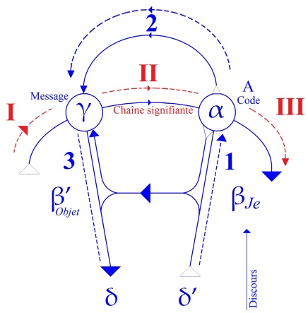
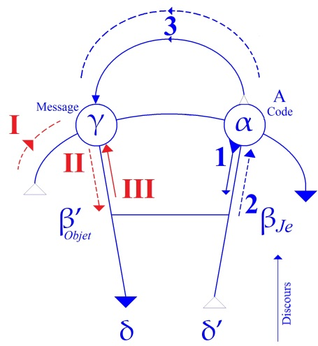

# Leçon 05 | 04 Décembre 1957

<!-- source-url: http://staferla.free.fr/S5/S5 FORMATIONS .docx -->
<!-- seminar: s5 -->
<!-- lesson: 05 -->

<!-- id: s5-05-0001 -->

Arrivé à la partie synthétique de son ouvrage sur *le mot d’esprit* - la 2ème partie - FREUD se pose la question
de l’origine du plaisir, du plaisir que provoque *le mot d’esprit*.

<!-- id: s5-05-0002 -->

Bien entendu, il est de plus en plus nécessaire, je le rappelle à ceux d’entre vous qui s’en croiraient dispensés,
que vous ayez au moins fait une lecture du texte du « *Mot d’esprit »*. C’est la seule façon que vous ayez de connaître
cet ouvrage, en dehors du cas, qui ne serait pas de votre gré je crois, que je vous lise ce texte moi-même.

<!-- id: s5-05-0003 -->

Ici je vais en extraire des morceaux, mais cela fait sensiblement baisser le niveau de l’attention.
C’est le seul moyen de vous rendre compte que les formules que je vous apporte, que je vais *essayer* de vous apporter,
suivent fréquemment la ligne, je veux dire au plus près, des questions que se pose FREUD.

<!-- id: s5-05-0004 -->

Les questions que se pose FREUD, il se les pose par une démarche souvent sinueuse, il se réfère à des thèmes diversement reçus, psychologiques et autres. Ceux auxquels il se réfère implicitement par la façon dont il se sert
des thèmes reçus, sont *aussi* importants, plus importants encore, que *ceux qui lui servent de référence*.

<!-- id: s5-05-0005 -->

Ceux qui lui servent de référence sont ceux qu’il a en commun avec ses lecteurs. La façon dont il s’en sert
fait apparaître - il faut vraiment n’avoir pas ouvert le texte pour ne pas s’en rendre compte -
*une dimension qui n’a jamais été,* jusqu’à lui-même, *suggérée*.

<!-- id: s5-05-0006 -->

*Cette dimension est précisément celle du rôle du signifiant*. Je voudrais aller droit au sujet de ce qui nous occupe aujourd’hui,
à savoir quelle est, se demande FREUD, la source du plaisir. « *Quel est la source du plaisir ?* » nous dit-il.
Elle est essentiellement ce que, dans un langage trop répandu de nos jours et dont se serviraient certains
quand ils la décriraient, la source du plaisir est à chercher essentiellement dans son côté *formel*.

<!-- id: s5-05-0007 -->

Ce n’est heureusement pas comme cela que FREUD *s’exprime*, *il s’exprime* d’une façon encore plus précise :

<!-- id: s5-05-0008 -->

> « *La source du plaisir dans le mot d’esprit* - va-t-il jusqu’à dire - *c’est simplement la plaisanterie.* »

<!-- id: s5-05-0009 -->

C’est cela la véritable source du plaisir. Néanmoins bien entendu, le plaisir que nous prenons au cours de l’exercice du *mot d’esprit* est centré ailleurs. Ne nous apercevons-nous pas de la direction de cette source, et tout au long
de son analyse, de cette sorte d’ambiguïté qui est inhérente à l’exercice même du *mot d’esprit* qui fait que nous ne
nous apercevons pas d’où nous vient le plaisir et qu’il faut tout l’effort de son analyse pour nous l’avoir montré ?
C’est un élément, *une démarche* absolument essentielle.

<!-- id: s5-05-0010 -->

Conformément à un système de référence qui va apparaître de plus en plus marqué jusqu’à la fin de l’ouvrage,
cette source du plaisir, il l’a rapportée à une période ludique de l’activité infantile, à savoir que c’est quelque chose
qui se rapporte à *ces premiers jeux avec les mots* qui en somme nous reporte directement à l’acquisition du langage
en tant que pur *signifiant*, car c’est à proprement parler au jeu *verbal*, à l’exercice que nous dirions presque purement,
pour ne pas dire émetteur, purement émetteur de la forme verbale qui va apporter - primitif et essentiel - le plaisir.

<!-- id: s5-05-0011 -->

Est-ce donc purement et simplement d’une sorte de retour à un exercice du signifiant comme tel, à une période d’avant le contrôle, que la critique, que la raison va obliger, progressivement par le fait de l’éducation de tous les apprentissages de la réalité, …va forcer le sujet à apporter ce contrôle et cette critique à cet usage du signifiant ?
Est-ce donc dans cette différence que va consister le principal ressort de l’exercice du plaisir dans le mot d’esprit ?

<!-- id: s5-05-0012 -->

Assurément la chose parait très simple, si c’est à tout ceci que se résumait ce que nous apporte FREUD.
Bien entendu ceci est loin d’être ce à quoi *il se limite*. Il nous dit que *là est la source du plaisir*, mais il nous montre aussi *dans quelle voie* ce plaisir est utilisé : ce plaisir sert en quelque sorte à *une opération de libération de ces voies anciennes*...
en tant qu’elles sont encore là *en puissance virtuelle*, existant, *soutenant* en quelque sorte encore *quelque chose*
...et par le fait de passer par ces voies, leur donnait un privilège par rapport à celles qui ont été amenées au premier plan du contrôle de la pensée du sujet par son progrès vers l’état adulte.

<!-- id: s5-05-0013 -->

Faire retrouver ce privilège à ces voies, c’est quelque chose qui nous fait rentrer d’emblée...
et c’est en ceci qu’intervient toute l’analyse antérieure qu’il a faite du ressort et du mécanisme du mot d’esprit *...dans des voies structurantes* qui sont celles même *de l’inconscient*.

<!-- id: s5-05-0014 -->

En d’autres termes, *les deux faces du mot d’esprit* - c’est lui-même qui s’exprime ainsi - sont d’une part :

<!-- id: s5-05-0015 -->

- cette face d’exercice du signifiant avec cette liberté qui porte au maximum toute sa possibilité d’ambiguïté fondamentale et même pour tout dire, son caractère primitif par rapport au sens, l’essentielle polyvalence qu’il a par rapport au sens, la fonction créatrice qu’il a par rapport au sens, l’accent d’arbitraire qu’il apporte dans le sens. C’est l’une de ses faces.

<!-- id: s5-05-0016 -->

- L’autre, c’est le fait que cet exercice par lui-même nous introduit, nous dirige, évoque tout ce qui est de l’ordre de l’inconscient.

<!-- id: s5-05-0017 -->

Et ceci est suffisamment indiqué au regard de FREUD par le fait que *les structures que révèle le mot d’esprit*, la façon dont fonctionne sa constitution, sa cristallisation, ne sont autres que *les mêmes qu’il a découvertes* lui-même,
dans ses premières appréhensions de l’inconscient, à savoir :

<!-- id: s5-05-0018 -->

- *au niveau du rêve*,

<!-- id: s5-05-0019 -->

- *au niveau des actes manqués*, *ou réussis, comme vous voudrez l’entendre,*

<!-- id: s5-05-0020 -->

- *au niveau des symptômes* mêmes.

<!-- id: s5-05-0021 -->

C’est à ceci que nous avons essayé de donner *une formule* plus serrée, plus précise, du moment que sous *la forme*,
sous la rubrique *de métaphore et de métonymie*, nous retrouvons dans *leurs formes* les plus générales…
dans *les formes* qui sont équivalentes pour tout exercice du langage,
et aussi pour ce que nous en retrouverons de structurant dans l’inconscient
…ces formes sont *les formes* les plus générales dans lesquelles donc *la condensation, le déplacement, les autres mécanismes*
que FREUD met en valeur dans *les structures de l’inconscient*, ne sont en quelque sorte que ses applications.

<!-- id: s5-05-0022 -->

*Cette commune mesure de l’inconscient* avec ce que nous lui conférons...
non pas simplement par les voies des habitudes mentales,
mais par ce qu’il y a effectivement de dynamique dans le rapport avec le désir
…*cette commune mesure de l’inconscient et de la structure de la parole* en tant qu’elle est commandée par les lois du signifiant, c’est ceci que nous essayons d’approcher de plus en plus près, *d’exemplarifier*, de rendre exemplaire par notre recours
à l’ouvrage de FREUD sur *le mot d’esprit*. C’est ce que nous allons essayer de regarder de plus près aujourd’hui.

<!-- id: s5-05-0023 -->

Si nous mettons l’accent sur ce qu’on pourrait appeler « *l’autonomie des lois du signifiant* », si nous disons - *par rapport au mécanisme de la création du sens* - qu’*elles sont premières*, ceci ne nous dispense pas, bien entendu, de nous poser la question de comment nous devons concevoir, non seulement *l’apparition du sens*, mais pour parodier une formule qui a été assez maladroitement produite dans l’école *logico-positiviste*, *nous dirions « le sens du sens », non pas que ceci ait un sens*.

<!-- id: s5-05-0024 -->

Mais que voulons-nous dire quand il s’agit de sens ? Et aussi bien FREUD, dans ce chapitre sur *le mécanisme du plaisir*, l’évoque, s’y réfère sans cesse, et n’est pas sans faire état de cette formule si souvent répandue à propos de l’exercice du *mot d’esprit* : « *sens dans le non-sens* », comme l’ont dit depuis longtemps les auteurs par une sorte de formule
qui fait en quelque sorte état des deux faces apparentes du plaisir, la façon dont il frappe d’abord par le *non-sens*,
dont d’autre part il nous attache et *nous récompense* par l’apparition de je ne sais quel *sens secret* - d’ailleurs toujours tellement difficile à définir si nous partons de cette perspective - *dans ce non-sens* même, ou bien dans le passage frayé par un *non-sens* qui a cet instant nous étourdit, nous sidère.

<!-- id: s5-05-0025 -->

Ceci est plus près peut-être du mécanisme, et FREUD assurément est aussi beaucoup plus près de lui concéder
plus de propriétés, c’est à savoir *que le non-sens a le rôle, là un instant, de nous leurrer assez longtemps pour qu’un sens*...
inaperçu jusque là, ou d’ailleurs très vite aussi passé, fugitif, un sens en éclair,
de la même nature que la sidération qui nous a un instant retenu sur le *non-sens*
...nous frappe à travers cette saisie du *mot d’esprit*.

<!-- id: s5-05-0026 -->

En fait si on regarde les choses de plus près, on voit que FREUD va jusqu’à répudier ce terme de *non-sens*.
Et c’est là aussi que je voudrais que nous nous arrêtions aujourd’hui, car aussi bien c’est bien
le propre de ces approximations, qui permettent précisément d’éviter le dernier terme, le dernier ressort du mécanisme en jeu, que de s’arrêter à des formules qui sans aucun doute ont leur apparence, leur séduction psychologique, mais qui ne sont pas à proprement parler, celles qui conviennent.

<!-- id: s5-05-0027 -->

Je vais vous proposer de partir de quelque chose qui ne sera pas un recours à *l’enfant* dont sans aucun doute
nous savons en effet qu’il peut prendre quelque *plaisir* à ces jeux verbaux, et qu’on peut se référer en effet
à quelque chose de cet ordre pour donner sens et poids à une sorte de psychogenèse du *mécanisme de l’esprit*,
mais dont après tout si vous y pensez autrement que par une espèce de satisfaction d’une *routine* qui est *établie*
par le fait que se référer à *quelque chose* comme cette activité ludique primitive, lointaine, à laquelle après tout
on peut accorder toutes les grâces, il n’est peut–être pas non plus quelque chose qui doive tellement nous satisfaire puisqu’aussi bien il n’est pas sûr que le plaisir de l’esprit auquel l’enfant ne participe que de très loin,
soit quelque chose qui doive être exhaustivement expliqué par un recours à la fantaisie.

<!-- id: s5-05-0028 -->

Mais je voudrais arriver à quelque chose qui fasse le *nœud* entre cet usage du signifiant et ce que nous pouvons appeler une satisfaction ou un plaisir. C’est moi ici, qui reviendrai à cette référence qui semble élémentaire,
que si nous recourons à l’enfant il faut tout de même que nous n’oublions pas que le signifiant au début
est fait pour servir à quelque chose, il est fait pour exprimer *une demande*. Arrêtons-nous donc un instant
au *ressort de la demande*. C’est ce quelque chose d’un besoin qui passe au moyen d’un signifiant qui est adressé à l’Autre.
Déjà la dernière fois je vous ai fait remarquer que cette référence méritait que nous essayions d’en sonder les temps. Les temps en sont si peu sondés que j’y ai fait allusion quelque part dans l’un de mes articles.

<!-- id: s5-05-0029 -->

Un personnage éminemment \[Rudolph Lœwenstein ? \] représentatif de la hiérarchie psychanalytique a fait tout un article d’une douzaine de pages environ, pour s’émerveiller des vertus de ce qu’il appelle le « *wording* », mot qui en anglais correspond à ce que, plus maladroitement en français, nous appelons *passage au verbal* ou *verbalisation*.
*Il est évidemment plus élégant en anglais qu’il ne l’est en français.*

<!-- id: s5-05-0030 -->

Il s’émerveille qu’une patiente *singulièrement* braquée par une intervention qu’il avait faite en lui disant quelque chose qui voulait dire à peu près « *Vous avez de singulières, ou même de fortes demandes.* »…
ce qui en anglais a en plus un accent plus insistant encore qu’en français
…en ait été littéralement bouleversée comme d’une *accusation*, comme d’une *dénonciation*, alors que quand il avait repris *le même terme* quelques moments plus tard en se servant de *needs*, c’est-à-dire *besoins*, il avait trouvé quelqu’un
de tout *docile* à accepter son interprétation. Le caractère de montage qui est donné par l’auteur en question
à cette découverte, nous montre bien à quel point *l’art du wording* est encore à l’intérieur de *l’analyse*
ou du moins d’*un certain cercle de l’analyse*, à l’état primitif.

<!-- id: s5-05-0031 -->

Car à la vérité tout est là : *la demande* est quelque chose qui par soi-même est si relative à l’Autre, que le fait que ce soit l’Autre qui l’accuse, il se trouve tout de suite en posture d’*accuser* le sujet lui-même, de le repousser,
alors qu’en évoquant le besoin il authentifie ce besoin, il l’assume, il l’homologue, il l’amène à lui,
il commence déjà à *le reconnaître*, ce qui est une satisfaction essentielle.

<!-- id: s5-05-0032 -->

Le mécanisme de la demande naturellement…
et le fait que l’Autre par nature s’y oppose, ou encore on pourrait dire,
que *la demande* par nature exige qu’on s’y oppose *pour être soutenue comme demande*
…est lié justement à l’introduction dans la communication du *langage*, et illustré à chaque instant par *le mode sous lequel l’Autre accède à la demande*.

<!-- id: s5-05-0033 -->

Réfléchissons bien. C’est dans la mesure où la dimension du langage vient là pour être remodelée, mais aussi pour verser dans le complexe signifiant - à l’infini - *le système des besoins*, que la demande est essentiellement quelque chose de sa nature qui se pose comme pouvant être exorbitante. Ce n’est pas pour rien que les enfants « *demandent la lune* ». Ils « *demandent la lune* » parce qu’il est de la nature d’un besoin qui s’exprime par l’intermédiaire du système signifiant, de « *demander la lune* ».

<!-- id: s5-05-0034 -->

Aussi bien d’ailleurs nous n’hésitons pas *à la leur promettre.* Aussi bien d’ailleurs sommes-nous tout près *de l’avoir !*
En fin de compte nous ne l’avons pas encore, la lune, et ce qui est essentiel c’est tout de même de s’apercevoir
de ceci, de le mettre en relief : après tout *dans cette demande* de satisfaction d’un besoin, qu’est-ce qui se passe purement et simplement ? Nous répondons à la demande. Nous donnons à notre prochain ce qu’il nous demande.
Par quel trou de souris faut-il qu’il passe ? Par quelle réduction de ses prétentions faut-il qu’il se réduise lui-même pour que *la demande* soit entérinée ?

<!-- id: s5-05-0035 -->

C’est ce que met suffisamment en valeur le phénomène du besoin quand il apparaît nu. Je dirai même que
pour y accéder en tant que besoin, il faut que nous nous référions au–delà du sujet à je ne sais quel Autre :

<!-- id: s5-05-0036 -->

- qui s’appelle le CHRIST, qui s’identifie au pauvre pour ceux qui pratiquent la charité chrétienne,

<!-- id: s5-05-0037 -->

- mais même pour les autres, pour l’homme du désir, pour le Don JUAN de MOLIÈRE : *il donne*
  *bien entendu au mendiant ce qu’il lui demande, et ce n’est pas pour rien qu’il ajoute «* *pour l’amour de l’humanité* ».

<!-- id: s5-05-0038 -->

C’est à un Autre - *au-delà de celui qui est en face de vous -* en fin de compte, que la réponse à la demande,
l’accord de la demande, est déféré. Et l’histoire - qui est une des histoires sur lesquelles FREUD fait pivoter son analyse du *mot d’esprit* - l’histoire dite « *du saumon mayonnaise* », est la plus belle histoire qui en donne ici l’illustration.

<!-- id: s5-05-0039 -->

Un personnage s’indigne, après avoir à un quémandeur donné quelque argent dont il a besoin pour faire face
à je ne sais quelles dettes, à ses échéances, de le voir donner à l’objet de la générosité, un emploi autre
que celui qui répond en quelque sorte déjà à quelque autre esprit limité.

<!-- id: s5-05-0040 -->

C’est une véritable *histoire drôle*, quand le retrouvant le lendemain dans un restaurant en train de s’offrir
ce qui est considéré comme le signe de la dépense somptuaire : du « *saumon à la mayonnaise* »,
avec ce petit accent viennois que peut donner le ton de l’histoire, il lui dit :

<!-- id: s5-05-0041 -->

> « *Comment ! Est-ce pour cela que je t’ai donné de l’argent ? Pour t’offrir du saumon mayonnaise !* »

<!-- id: s5-05-0042 -->

À quoi l’autre entre dans le *mot d’esprit* et répond :

<!-- id: s5-05-0043 -->

> « *Mais alors je ne comprends pas !*
> *Quand je n’ai pas d’argent je ne peux pas avoir de saumon mayonnaise.*
> *Quand j’en ai je ne peux pas non plus en prendre !*
> *Quand donc mangerai-je du saumon mayonnaise ?* »

<!-- id: s5-05-0044 -->

Toute espèce d’exemple du *mot d’esprit* est encore plus significatif par le domaine même où il se déplace,
est encore plus significatif par sa particularité qui semble être le quelque chose de spécial dans l’histoire
qui ne peut être généralisé. C’est par cette particularité que nous arrivons au plus vif ressort du domaine auquel
nous nous plaçons, et la pertinence de cette histoire n’est pas moindre que celle de n’importe quelle autre histoire
qui toujours nous met au cœur même du problème, au rapport entre le signifiant et le désir, et au fait que le désir
est profondément changé d’accent, subverti, rendu ambigu lui-même par son passage par les voies du signifiant.

<!-- id: s5-05-0045 -->

Entendons bien tout ce que cela veut dire. C’est toujours au nom d’un certain registre - qui fait intervenir l’Autre
de l’au-delà de celui qui demande - que toute satisfaction est accordée, et ceci précisément pervertit profondément
le système de la demande et de la réponse à la demande.

<!-- id: s5-05-0046 -->

- « *Vêtir ceux qui sont nus.* »

<!-- id: s5-05-0047 -->

- « *Nourrir ceux qui ont faim.* »

<!-- id: s5-05-0048 -->

- « *Visiter les malades.* »
  …je n’ai pas besoin de vous rappeler des sept, huit ou neuf œuvres de miséricorde, il est assez frappant dans leurs termes même que « *Vêtir ceux qui sont nus* », on pourrait dire, si la demande était quelque chose qui devait être soutenu dans sa pointe directe, pourquoi pas « habiller » - je veux dire chez Christian DIOR - ceux ou celles qui sont nus ?
  Cela arrive de temps en temps, mais en général c’est qu’on a commencé par les déshabiller soi-même.

<!-- id: s5-05-0049 -->

De même « *Nourrir ceux qui ont faim* » : pourquoi pas « leur soûler la gueule » ?
Ça ne se fait pas, ça leur ferait mal, ils ont l’habitude de *la sobriété*, il ne faut pas les déranger.

<!-- id: s5-05-0050 -->

Quant à « *Visiter les malades* », je rappellerai le *mot* de Sacha GUITRY :

<!-- id: s5-05-0051 -->

> « *Faire une visite fait toujours plaisir. Si ce n’est pas quand on arrive, c’est au moins quand on s’en va !* »

<!-- id: s5-05-0052 -->

Le rapport de thématique de *la demande* est au cœur de ce qui fait aujourd’hui notre propos.
Essayons donc de schématiser ce qui se passe dans ce temps d’arrêt qui en quelque sorte décale, par une sorte de voie singulière, « *en baïonnette* », si on peut s’exprimer ainsi, la communication de la demande à son accès.

<!-- id: s5-05-0053 -->

Ce n’est donc pas à quelque chose d’autre que *mythique*, mais quelque chose de profondément vrai, que je vous prie de vous reporter pour faire usage de ce petit schéma, et de la façon suivante : supposons la chose tout de même qui doit bien exister quelque part, ne serait-ce que dans notre *schéma*, *une demande qui passe*, car en fin de compte tout est là.

<!-- id: s5-05-0054 -->

Si FREUD a introduit une nouvelle dimension dans notre considération de l’Homme, c’est que, je ne dirai pas
que quelque chose passe quand même, mais que ce quelque chose qui est destiné à passer, le désir qui devrait passer, laisse quelque part, non seulement des *traces*, mais un circuit insistant.

<!-- id: s5-05-0055 -->

Partons donc sur le *schéma* de quelque chose qui représenterait *la demande qui passe*.
Mettons, puisqu’*enfance* il y a : nous pouvons très bien y faire se réfugier *la demande qui passe*.
Cet enfant, qui articule quelque chose dont il n’est encore pour lui qu’articulation incertaine, mais articulation à laquelle il prend plaisir, à laquelle se réfère FREUD.

<!-- id: s5-05-0056 -->

Il dirige sa demande : disons qu’elle part - heureusement elle n’est pas encore entrée en jeu - quelque chose se dessine qui part de ce point que nous appellerons Δ ou grand D : *demande*. Et ceci, qu’est-ce que cela nous décrit ?
Cela nous décrit *la fonction du besoin* : *quelque chose s’exprime* qui part du *sujet* et qui termine *la ligne de son besoin* .

<!-- id: s5-05-0057 -->

<!-- id: s5-05-0058 -->

C’est précisément ce qui détermine la courbe de ce que nous avons isolé ici comme « *le discours* » et ceci est fait à l’aide de la mobilisation de quelque chose qui est préexistant. Je n’ai pas inventé la ligne du « *discours* », *la mise en jeu du stock*,
très réduit à ce moment, *du stock du signifiant*, pour autant que corrélativement il *articule quelque chose*.

<!-- id: s5-05-0059 -->

Voyez les choses : si vous voulez monter ensemble sur les deux plans :

<!-- id: s5-05-0060 -->

- de *l’intention* \[1→ 2 → 3\], si confuse que vous la supposiez, du jeune sujet en tant qu’il dirige l’appel,

<!-- id: s5-05-0061 -->

- *le signifiant* \[I→ II→ III\], si désordonné aussi que vous puissiez en supposer l’usage, pour autant qu’il est mobilisé dans cet effort, dans cet appel, progresse en même temps, et ce quelque chose a un sens d’accroissement que je vous ai déjà marqué : l’utilité pour comprendre l’*effet rétroactif* de la phrase qui se boucle juste à la fin du *deuxième temps*.

<!-- id: s5-05-0062 -->

Remarquez que *ces deux lignes ne sont pas encore entrecroisées*, en d’autres termes que celui qui dit quelque chose, dit à la fois *plus* et *moins* que ce qu’il croit dire. La référence ici *au caractère tâtonnant du premier usage de la langue de l’enfant* trouve son plein emploi. Si en d’autres termes progresse parallèlement sur les deux lignes l’achèvement de ce quelque chose qui là s’appellera *la demande*, c’est quand même à la fin du *second temps* que le signifiant se bouclera sur quelque chose qui ici achève, d’une façon aussi *approximative* que vous le voudrez, *le sens de la demande*, ce qui constitue
*le message*, le quelque chose que l’Autre, disons « *la mère* » pour de temps en temps admettre l’existence de *bonnes mères*, évoque à proprement parler, qui coexiste avec l’achèvement du message. *L’un et l’autre se déterminent en même temps :*

<!-- id: s5-05-0063 -->

- *l’un comme message,*

<!-- id: s5-05-0064 -->

- *l’autre comme Autre.*

<!-- id: s5-05-0065 -->

Et dans un *troisième temps* de cette double courbe, nous verrons quelque chose qui ici s’achève, et aussi ici quelque chose dont nous allons au moins à titre hypothétique indiquer comment nous pouvons les nommer, les situer
dans cette structuration de la demande qui est celle que nous essayons de mettre tout à fait à la base,
au fondement de l’exercice premier du signifiant dans l’expression du *désir*.

<!-- id: s5-05-0066 -->

Je vous demanderai, au moins provisoirement, d’admettre comme la référence la plus utile pour ce que nous allons essayer de développer ultérieurement, d’admettre dans *le troisième temps* ce cas idéal où *la demande* en quelque sorte rencontre exactement ce qui la *prolonge*, à savoir *l’Autre* qui la reprend à propos de son *message*.

<!-- id: s5-05-0067 -->

Je crois que ce que nous devons ici considérer c’est quelque chose qui ne peut pas exactement se confondre ici
avec *la satisfaction*, car il y a dans l’intervention, dans l’exercice même de tout signifiant à propos de la manifestation du besoin, ce quelque chose qui le transforme et qui déjà lui apporte, de par l’appoint du signifiant, ce minimum de transformations, de *métaphores* pour tout dire, qui fait que ce qui est signifié est quelque chose *d’au-delà* du besoin brut, de remodelé par l’usage du signifiant. C’est ici pour tout dire que commence à s’exercer, à intervenir, à entrer dans
la création du signifié, quelque chose qui n’est pas pure et simple traduction du besoin, mais reprise, ré-assomption, remodelage du besoin, de création d’un désir qui est autre que le besoin, qui est un besoin plus un signifiant.

<!-- id: s5-05-0068 -->

Comme le disait LÉNINE :

<!-- id: s5-05-0069 -->

« *Le socialisme est quelque chose qui probablement est très sympathique, mais la communauté parfaite a en plus l’électrisation.* »

<!-- id: s5-05-0070 -->

Ici il y a « *en plus »* le *signifiant* dans l’expression du besoin. Et de l’autre côté ici, dans le troisième temps,
il y a assurément quelque chose qui correspond à cette apparition miraculeuse. Nous l’avons supposée miraculeuse, pleinement satisfaisante, de la satisfaction par l’Autre de quelque chose, ce quelque chose qui est là créé.

<!-- id: s5-05-0071 -->

C’est ce quelque chose qui ici normalement aboutit à ce que FREUD nous présente comme *le plaisir de l’exercice*
*du signifiant*, pour tout dire de l’exercice de la chaîne signifiante comme telle, dans ce cas idéal de réussite,
dans le cas où l’Autre vient ici dans le prolongement même de l’exercice du signifiant.

<!-- id: s5-05-0072 -->

Ce qui prolonge l’effort du signifiant comme tel, c’est cette résolution ici en un plaisir propre, authentique,
le plaisir de cet usage du signifiant. Vous le voyez sur ces quelques lignes limites. Je vous prie un instant d’admettre
à titre d’hypothèse à proprement parler, l’hypothèse qui restera sous-jacente à tout ce que nous allons essayer
de concevoir comme ce qui se produit dans les cas communs, dans les cas d’*exercice réel du signifiant*.

<!-- id: s5-05-0073 -->

Pour l’usage de la demande c’est quelque chose qui sera sous-tendu par cette référence primitive à ce que nous pourrions appeler le plein succès, ou le premier succès, ou le succès mythique, ou la forme archaïque primordiale
de l’exercice du signifiant. Ce *passage plein*, ce *passage avec succès* de *la demande* comme telle dans *le réel*,
pour autant qu’il crée en même temps *le message* et *l’Autre*, aboutit à :

<!-- id: s5-05-0074 -->

- ce remaniement du signifié d’une part, qui est introduit par l’usage du signifiant comme tel,

<!-- id: s5-05-0075 -->

- et d’autre part *prolonge directement l’exercice du signifiant dans un plaisir authentique*.

<!-- id: s5-05-0076 -->

L’un et l’autre se balancent :

<!-- id: s5-05-0077 -->

- il y a d’une part cet exercice que nous retrouvons en effet, avec FREUD, tout à fait à l’origine du jeu verbal comme tel, qui est un plaisir toujours prêt à surgir.

<!-- id: s5-05-0078 -->

- Et bien entendu, combien toujours - par tout ce que nous allons voir maintenant de ce qui se passe pour s’y opposer - combien masquée est d’autre part cette nouveauté qui apparait, non pas simplement dans *la réponse à la demande* mais dans *la demande verbale* elle-même, apparaît ce quelque chose qui complexifie, qui transforme le besoin, qui le met sur le plan de ce que nous appellerons à partir de là, *le désir*.

<!-- id: s5-05-0079 -->

*Le désir* étant ce *quelque chose* qui est défini par un décalage essentiel par rapport à tout ce qui est purement et simplement de *la direction imaginaire du besoin*, qui est ce *quelque chose* qui l’introduit par soi-même dans un ordre autre, *l’ordre symbolique*, avec tout ce qu’il peut apporter ici de perturbation.

<!-- id: s5-05-0080 -->

Pour tout dire nous voyons ici surgir à propos de ce mythe premier auquel je vous prie de vous référer,
parce qu’il faut que nous y appuyions là-dessus dans toute la suite, faute de rendre incompréhensible,
tout ce qui nous sera par FREUD articulé à propos du mécanisme propre du plaisir du *mot d’esprit*.

<!-- id: s5-05-0081 -->

Je souligne que cette nouveauté qui apparaît dans le signifié par l’introduction du signifiant c’est ce *quelque chose*
que nous retrouvons partout, comme une dimension essentielle accentuée par FREUD à tous les détours,
dans ce qui est manifestation de l’inconscient.

<!-- id: s5-05-0082 -->

FREUD nous dit parfois que *quelque chose* nous apparaît au niveau des *formations de l’inconscient* qui s’appelle *surprise*.
C’est quelque chose qu’il convient de prendre, non pas comme un accident de cette découverte mais comme une dimension essentielle de son essence. Il y a quelque chose d’originaire dans le phénomène de la *surprise* :

<!-- id: s5-05-0083 -->

- qu’il se produise à l’intérieur d’une formation de l’inconscient pour autant qu’en elle-même elle choque le sujet par son caractère surprenant,

<!-- id: s5-05-0084 -->

- mais aussi bien si au moment où pour le sujet vous en faites le dévoilement, vous provoquez chez lui ce sentiment de la surprise.

<!-- id: s5-05-0085 -->

FREUD l’indique dans toutes sortes de points :

<!-- id: s5-05-0086 -->

- soit dans « *La science des rêves »*,

<!-- id: s5-05-0087 -->

- soit dans la « *Psychopathologie de la vie quotidienne »*,

<!-- id: s5-05-0088 -->

- soit encore et à tout instant dans le texte du *« Mot d’esprit... »*.
  Cette dimension de la surprise est elle-même consubstantielle à ce qu’il en est du désir pour autant qu’il est passé
  au niveau de l’inconscient. Cette dimension, c’est ce que *le désir* emporte avec lui d’une condition d’émergence
  qui lui est propre en tant que *désir*, c’est proprement celle par laquelle il est même susceptible d’entrer
  dans l’inconscient, car tout *désir* n’est pas susceptible d’entrer dans l’inconscient.

<!-- id: s5-05-0089 -->

Seuls entrent dans l’inconscient ces désirs qui, pour avoir été symbolisés, peuvent, en entrant dans l’inconscient, conserver sous *leur forme symbolique*, sous *la forme de cette trace indestructible* dont FREUD reprend encore l’exemple dans le *Witz,* des désirs qui ne s’usent pas, qui n’ont pas le caractère d’*impermanence* propre à toute insatisfaction, mais qui, au contraire, sont supportés par *cette structure symbolique* qui les maintient à *un certain niveau de circulation du signifiant*, celui que je vous ai désigné comme devant être, dans ce schéma, situé dans ce circuit entre *le message* et *l’Autre* :

<!-- id: s5-05-0090 -->

<!-- id: s5-05-0091 -->

C’est-à-dire occupant *une fonction, une place* qui, selon les cas, selon les incidences où il se produit, fait que ce sont
par les mêmes voies que nous devons concevoir *le circuit tournant de l’inconscient* en tant qu’il est là toujours prêt
à reparaître. C’est dans l’action de *la métaphore* :

<!-- id: s5-05-0092 -->

- en tant que c’est pour autant qu’à certains circuits originaux *quelque chose* vient frapper dans *le circuit courant*, banal, reçu, de *la métonymie*, que se produit le surgissement du sens nouveau,

<!-- id: s5-05-0093 -->

- en tant enfin que dans le *trait d’esprit* c’est à *ciel ouvert* que se produit cette balle renvoyée *entre message et Autre,* qui va produire l’effet original du *trait d’esprit*.

<!-- id: s5-05-0094 -->

Rentrons maintenant dans plus de détails pour essayer de le saisir et de le concevoir.

<!-- id: s5-05-0095 -->

Si nous ne sommes plus à *ce niveau primordial*, à *ce* *niveau mythique* de première instauration dans sa forme propre
de *la demande*, comment les choses se font-elles ? Reportons-nous à *ce thème absolument fondamental*, tout au long
des histoires de trait d’esprit on ne voit que cela, on ne voit que *des quémandeurs à qui on accorde des choses* :

<!-- id: s5-05-0096 -->

- soit qu’*on leur accorde* ce qu’ils ne demandent pas,

<!-- id: s5-05-0097 -->

- soit que, leur ayant accordé ce qu’ils demandent, ils en fassent un autre usage,

<!-- id: s5-05-0098 -->

- soit qu’ils se comportent vis-à-vis de celui qui le leur a accordé avec une toute spéciale insolence, reproduisant, si l’on peut dire, *dans le rapport du demandeur au sollicité*, cette dimension bénie de *l’ingratitude*.

<!-- id: s5-05-0099 -->

Sinon il serait vraiment insupportable d’accéder à aucune demande, car observez, comme nous l’a fait remarquer avec beaucoup de pertinence notre ami MANNONI dans un excellent ouvrage, que le mécanisme normal de la demande à laquelle on accède est de provoquer des demandes toujours renouvelées, car en fin de compte qu’est-ce que c’est que cette demande, pour autant qu’elle rencontre son auditeur, l’oreille à laquelle elle est destinée ?

<!-- id: s5-05-0100 -->

Ici faisons un petit peu d’étymologie. Quoique ce ne soit pas dans l’usage du signifiant que réside forcément
la dimension essentielle à laquelle on doive se référer, un peu d’étymologie est pourtant bien là pour nous éclairer.
Cette *demande* si marquée des thèmes de l’exigence dans la pratique concrète, dans l’usage, dans l’emploi du terme…
et plus encore en anglo-saxon qu’en d’autres langues, mais aussi bien dans d’autres langues
…originairement c’est *demandare*, c’est *se confier*, c’est - sur le plan d’*une communauté de registre et de langage -*
*d’une remise de tout soi, de tous ses besoins à un autre*.

<!-- id: s5-05-0101 -->

Le matériel signifiant de la demande est emprunté sans doute pour prendre un autre accent qui lui est tout spécialement imposé par l’exercice effectif de la demande.

<!-- id: s5-05-0102 -->

Mais ici le fait de l’origine des matériaux employés métaphoriquement, vous le voyez par le progrès de la langue,
est bien pour nous instruire de ce dont il s’agit dans ce fameux complexe de dépendance que j’évoquai tout à l’heure avec, selon les termes de MANNONI, un effet que *celui qui demande* peut penser qu’effectivement l’autre a vraiment accédé à une de ses demandes, il n’y a en effet plus de limite : *il peut, il doit, il est normal qu’il lui confie tous ses besoins*.

<!-- id: s5-05-0103 -->

Tout ce que j’évoquais à l’instant des *bienfaits de l’ingratitude* met un terme aux choses, met un terme à ce qui ne saurait s’arrêter. Mais aussi bien *le quémandeur* n’a pas l’habitude de par l’expérience de présenter ainsi *sa demande* toute nue.
La demande n’a rien de confiant, il sait trop bien à quoi il a affaire dans l’esprit de l’autre, et c’est en cela qu’il déguise sa demande. C’est-à-dire qu’il demande quelque chose dont il a besoin au nom *d’autre chose* dont il a quelquefois besoin aussi, mais qui sera plus facilement admis comme prétexte à la demande.

<!-- id: s5-05-0104 -->

Au besoin cette autre chose, s’il ne l’a pas, il l’inventera purement et simplement, et surtout il tiendra compte,
dans la formulation de sa demande, de ce qui est le système de l’Autre, celui auquel je faisais allusion tout à l’heure :

<!-- id: s5-05-0105 -->

- il s’adressera d’une certaine façon à *la dame d’œuvre*,

<!-- id: s5-05-0106 -->

- d’une autre façon au *banquier*, tous personnages qui se profilent d’une façon si amusante,

<!-- id: s5-05-0107 -->

- d’une autre façon au *marieur*,

<!-- id: s5-05-0108 -->

- d’une autre façon à ceux-ci ou à ceux-là.

<!-- id: s5-05-0109 -->

C’est-à-dire que non seulement son désir sera pris et remanié dans *le système du signifiant*, mais dans *le système du signifiant* tel qu’il est instauré, institué dans l’Autre, c’est-à-dire selon le code de l’Autre, et simplement

<!-- id: s5-05-0110 -->

- *sa demande commencera à se formuler à partir de l’Autre* \[1\]

<!-- id: s5-05-0111 -->

- *pour d’abord se réfléchir* \[2\] sur ce quelque chose qui depuis longtemps est passé à l’état actif dans son discours : sur le *« Je »* qui ici et là profère *la demande*,

<!-- id: s5-05-0112 -->

- pour la réfléchir sur *l’Autre* et aller par ce circuit s’achever en *message* \[3\].

<!-- id: s5-05-0113 -->

Qu’est-ce à dire ?

<!-- id: s5-05-0114 -->

Ceci *c’est l’appel, l’intention*, c’est le circuit du besoin secondaire dont vous voyez qu’il n’y a pas tellement besoin encore de lui donner trop l’accent de la raison, sinon celui du contrôle, contrôle par le système de l’Autre qui bien entendu implique déjà toutes sortes de facteurs que nous sommes uniquement pour l’occasion fondés à qualifier de *rationnels*.

<!-- id: s5-05-0115 -->

Disons que s’il est *rationnel* d’en tenir compte, il n’est pas pour autant impliqué dans leur structure qu’ils soient effectivement *rationnels*. Que se passe-t-il sur la chaîne du signifiant selon *ces trois temps* que nous voyons ici se décrire ?

<!-- id: s5-05-0116 -->

<!-- id: s5-05-0117 -->

C’est quelque chose qui de nouveau *mobilise tout l’appareil, toute la disposition, tout le matériel* pour arriver ici d’abord
à quelque chose, mais à quelque chose qui ne passe pas d’emblée vers *l’Autre*, qui vient ici se *réfléchir* \[γ → β’ → γ\]
à ce *quelque chose* qui, au *deuxième temps*, a correspondu à l’appel à *l’Autre*, c’est-à-dire à cet *objet* pour autant :

<!-- id: s5-05-0118 -->

- qu’il est *l’objet* admissible par *l’Autre*,

<!-- id: s5-05-0119 -->

- qu’il est *l’objet* de ce que veut bien désirer *l’Autre*,

<!-- id: s5-05-0120 -->

- qu’il est *l’objet métonymique*.

<!-- id: s5-05-0121 -->

Et c’est de se réfléchir sur cet objet, venir au 3*ème temps* converger vers le *message*, que nous nous trouvons donc ici...
non pas dans cet heureux état de satisfaction que nous avions obtenu au bout des trois temps
de la première mythique représentation de la demande et de son succès avec sa nouveauté surprenante,
et son plaisir par lui-même satisfaisant
...nous nous trouvons arrêtés sur un *message* qui porte en lui-même ce caractère d’ambiguïté d’être la rencontre
d’une formulation aliénée dès son départ...
en tant *qu’elle part de l’Autre,* et de ce côté *va aboutir à quelque chose qui est* en quelque sorte *désir de l’Autre*, en tant que c’est de *l’Autre* lui-même qu’a été évoqué l’appel, et d’autre part *dans son appareil signifiant même*
...d’introduire toutes sortes d’éléments « *conventionnels* », qui sont à proprement parler ce que nous appellerons
le caractère de « *communauté* », ou de déplacement à proprement parler des objets, pour autant que les objets sont profondément remaniés par le monde de *l’Autre*.

<!-- id: s5-05-0122 -->

Et nous avons vu que *le discord entre ces deux points d’aboutissement de la flèche au troisième temps* est quelque chose
de si frappant que *c’est cela même qui peut aboutir à ce que nous appelons lapsus,* *trébuchement de paroles*, par les deux voies.
Il n’est pas certain que ce soit une signification *univoque* qui soit formée, elle est tellement peu *univoque* que le caractère fondamental *de maldonne* et *de méconnaissance* du langage en est une dimension essentielle. *C’est sur l’ambiguïté de cette formation de message que va travailler le mot d’esprit*, *c’est à partir de ce point*, à des titres divers, *que peut être formé le mot d’esprit*.

<!-- id: s5-05-0123 -->

Je ne tracerai pas aujourd’hui encore la diversité des formes sous lesquelles ce message peut être repris tel qu’il est constitué sous sa forme ambiguë essentielle, sous sa forme ambiguë quant à la structure pour suivre un traitement qui a, selon ce que nous a dit FREUD, le but de restaurer finalement le cheminement idéal qui doit aboutir à la surprise d’une nouveauté d’une part, et au plaisir du jeu du signifiant d’autre part. C’est l’objet du *mot d’esprit*.

<!-- id: s5-05-0124 -->

L’objet du *mot d’esprit* est de nous réévoquer cette dimension par laquelle le désir, sinon rattrape ce qui s’est passé,
du moins indique tout ce qu’il a perdu en cours de route dans ce chemin, à savoir :

<!-- id: s5-05-0125 -->

- ce qu’il a laissé au niveau de *la chaîne métonymique* d’une part, *de déchets*,

<!-- id: s5-05-0126 -->

- et d’autre part *ce qu’il ne réalise pas pleinement au niveau de la métaphore*, si nous appelons *métaphore naturelle* ce qui s’est passé tout à l’heure dans cette pure et simple, idéale, transition du *désir* en tant qu’il se forme dans le sujet vers *l’Autre* qui le reprend et qui y accède.

<!-- id: s5-05-0127 -->

Nous nous trouvons ici à un stade plus évolué, au stade où déjà sont intervenues dans la psychologie du sujet
ces deux choses qui s’appellent :

<!-- id: s5-05-0128 -->

- le « *Je* » d’une part,

<!-- id: s5-05-0129 -->

- et d’autre part l’objet profondément transformé qu’est *l’objet métonymique*.
  Nous nous trouvons devant *la métaphore*, non pas « *naturelle* », mais l’exercice courant de *la métaphore*,
  qu’elle réussisse ou bien qu’elle échoue, dans cette ambiguïté du message dont il s’agit ou non maintenant
  de faire un sort dans les conditions qui restent à l’état naturel.

<!-- id: s5-05-0130 -->

Nous avons toute une partie de ce *désir* qui va continuer de circuler sous la forme de *déchets du signifiant*
dans l’inconscient. Dans le cas du *trait d’esprit*, par *une sorte de forçage*...

<!-- id: s5-05-0131 -->

- d’*ombre heureuse*,

<!-- id: s5-05-0132 -->

- de succès étonnant et *purement véhiculé par le signifiant*,

<!-- id: s5-05-0133 -->

- de reflets de la satisfaction ancienne,
  ...quelque chose va passer qui a très exactement pour effet de reproduire ce plaisir premier de la demande satisfaite, en même temps qu’elle accède à une nouveauté originale.

<!-- id: s5-05-0134 -->

C’est ce quelque chose que *le trait d’esprit* de par *son essence*, réalise, et réalise comment ? Qu’avons nous vu jusqu’ici ? Nous avons dit en somme que ce dont il s’agit pour cela, c’est que ce *schéma* peut nous servir à apercevoir ce quelque chose qui est l’achèvement de la courbe première de cette *chaîne signifiante* et qui est aussi quelque chose qui prolonge ce qui passe du besoin intentionnel dans le discours. Comment cela ? Par *le trait d’esprit*.

<!-- id: s5-05-0135 -->

Mais comment *le trait d’esprit* va-t-il venir au jour ? Ici nous retrouvons les dimensions du *sens* et du *non-sens*,
mais je crois devons les serrer de plus près. Si quelque chose a été visé de ce que je vous ai la dernière fois donné comme indication de *la fonction métonymique*, c’est à proprement parler ce qui dans le déroulement de *la chaîne signifiante* se produit : d’égalisation, de nivellement, d’équivalence, donc d’autant d’effacements qu’une réduction du sens.

<!-- id: s5-05-0136 -->

Ce n’est pas dire que ce soit le *non-sens*, c’est quelque chose qui *du seul fait que j’avais pris la référence marxiste*...
que nous mettons en fonction *deux objets de besoin*, de façon telle *que l’un devienne la mesure de la valeur de l’autre*, efface de lui ce qui est précisément l’ordre du besoin, et de ce fait l’introduit dans l’ordre de la valeur
...du point de vue du sens et par une espèce de néologisme qui présente aussi bien une ambiguïté,
peut être appelé « *le dé-sens* ». Appelons-le aujourd’hui simplement le « *peu de sens* ». Aussi bien verrez-vous,
une fois que vous aurez cette clef, la signification de *la chaine métonymique*, de ce « *peu de sens* ».
C’est là très précisément ce sur quoi la plupart des *mots d’esprit* jouent.

<!-- id: s5-05-0137 -->

Il convient que le *mot d’esprit* mette en valeur, fasse sortir, non pas le caractère de *non-sens*, nous ne sommes pas dans le *mot d’esprit*, de ces âmes nobles qui - tout de suite après leur grand désert desquelles - nous auront révélés
les grands mystères de l’absurdité générale : le discours de « *la belle âme* », s’il n’a pas réussi à anoblir nos sentiments,

<!-- id: s5-05-0138 -->

a récemment *anobli* sa dignité d’écrivain[^13], mais pour autant ce discours sur le *non-sens* n’en est pas moins le discours
le plus vain que nous ayons jamais pu entendre.

<!-- id: s5-05-0139 -->

Il n’y a absolument pas *jeu du non-sens*, mais chaque fois que l’équivoque est introduite,

<!-- id: s5-05-0140 -->

- qu’il s’agisse de l’histoire du veau, *de ce veau sur lequel moi-même je m’amusais la dernière fois à en faire presque la réponse d’Henri* HEINE, disons que ce veau après tout ne vaut guère, à la date à laquelle on en parle,

<!-- id: s5-05-0141 -->

- et aussi bien tout ce que vous pourrez trouver dans *les jeux de mots*, plus spécialement ceux qu’on appelle *les jeux de mots de la pensée*,
  ...consiste à *jouer sur cette minceur des mots à soutenir un sens plein*.

<!-- id: s5-05-0142 -->

C’est ce *peu de sens* qui comme tel est repris, et par où quelque chose passe qui réduit à sa portée ce message
en tant qu’il est à la fois, réussite, échec, mais force nécessaire de toute formulation de la demande,
et qui vient interroger l’Autre à propos de ce *peu de sens* ici, et la dimension de l’Autre, essentielle.

<!-- id: s5-05-0143 -->

C’est pourquoi FREUD s’arrête, comme à quelque chose de tout à fait primordial, à la nature même du *mot d’esprit*, du trait d’esprit : c’est qu’il n’y a pas de *trait d’esprit solitaire*, *le trait d’esprit* est *solidaire* de quelque chose,
quoique nous l’ayons nous-mêmes forgé, inventé - si tant est que nous inventions *le trait d’esprit* et que ce ne soit pas lui qui nous invente - nous éprouvons le besoin de le proposer à l’Autre, c’est l’Autre qui est chargé de l’authentifier.

<!-- id: s5-05-0144 -->

Quel est cet Autre ? Pourquoi cet Autre ? Quel est ce besoin de l’Autre ?

<!-- id: s5-05-0145 -->

Je ne sais pas si aujourd’hui nous aurons assez de temps pour le définir, pour lui donner sa structure et ses limites, mais nous dirons simplement ceci, au point où nous en sommes : que ce qui est communiqué dans *le trait d’esprit*
à l’Autre c’est ce qui joue essentiellement d’une façon déjà singulièrement rusée et dont il convient de soutenir
devant nos yeux le caractère dont il s’agit.

<!-- id: s5-05-0146 -->

Ce dont il s’agit toujours, ce n’est pas de provoquer *cette invocation pathétique* de je ne sais quelle « *absurdité fondamentale* » à laquelle je faisais allusion tout à l’heure en me référant à l’œuvre de l’une des grandes « *têtes molles* » de cette époque,
c’est ceci qu’il s’agit de suggérer, c’est cette dimension de « *peu de sens* » :

<!-- id: s5-05-0147 -->

- *en interrogeant* en quelque sorte *la valeur* comme telle,

<!-- id: s5-05-0148 -->

- *en la sommant* si l’on peut dire *de réaliser sa dimension de valeur*,

<!-- id: s5-05-0149 -->

- *en la sommant de se dévoiler comme vraie valeur*, ce qui est, remarquez-le bien, une *ruse du langage*, car plus elle se dévoilera comme vraie valeur, plus elle se dévoilera comme étant supportée par ce que j’appelle le « *peu de sens* ».

<!-- id: s5-05-0150 -->

Elle ne peut répondre que dans le sens de « *peu de sens* », et c’est là qu’est la nature du message propre du *trait d’esprit*, c’est-à-dire ce en quoi ici, au niveau du *message*, je reprends avec *l’Autre* ce chemin interrompu de *la métonymie*,
et je lui porte cette interrogation : « *Qu’est-ce que tout cela veut dire ?* »

<!-- id: s5-05-0151 -->

*Le trait d’esprit* ne s’achève qu’au-delà de ceci, c’est-à-dire *pour autant que l’Autre* accuse le coup, *répond au trait d’esprit*, l’authentifie comme *trait d’esprit*, c’est-à-dire perçoit ce que dans ce véhicule comme tel de la question
sur le « *peu de sens* », ce qu’il y a là de *demande de sens*, c’est-à-dire d’évocation d’un sens au-delà de *ce quelque chose* qui est inachevé, qui dans tout cela *est resté en route*, marqué par le signe de l’Autre marquant surtout de sa profonde ambiguïté toute formulation du désir, le liant comme tel et à proprement parler, aux nécessités et aux ambiguïtés du signifiant comme tel, à *l’homonymie* à proprement parler, entendez à *l’homophonie*.

<!-- id: s5-05-0152 -->

Pour autant que l’Autre répond à cela, c’est-à-dire sur le circuit supérieur, celui qui va de A au *message*,
il authentifie quoi ? Ce qu’il y a là-dedans dirons-nous de *non-sens*. Là aussi j’insiste. Je ne crois pas qu’il faille maintenir ce terme de *non-sens* qui n’a de sens que dans la perspective de la raison, de la critique,
c’est-à-dire que ceci précisément, dans ce circuit, est évité.

<!-- id: s5-05-0153 -->

Je vous propose la formule du « *pas de sens* », du « *pas de sens* » comme on dit le « *pas de vis* », le « *pas de quatre* »,
le « *pas de Suze* », le « *Pas de Calais *». Ce « *pas de sens* » est à proprement parler ce qui est réalisé dans *la métaphore*,
car dans *la métaphore* c’est l’intention du sujet, c’est le besoin du sujet qui...

<!-- id: s5-05-0154 -->

- au-delà de l’usage *métonymique*,

<!-- id: s5-05-0155 -->

- au-delà de ce qui trouve - dans *la commune mesure*, dans les *valeurs reçues -* à se satisfaire,
  ...introduit justement ce « *pas de sens* », ce quelque chose qui, reprenant un élément à la place où il est,
  en lui substituant un autre, je dirai presque *n’importe lequel*, introduit toujours cet *au-delà du besoin*,
  par rapport à tout *désir* formulé, qui est à l’origine de *la métaphore*.

<!-- id: s5-05-0156 -->

Qu’est-ce que fait là *le trait d’esprit* ? Il n’indique rien de plus que la dimension même :

<!-- id: s5-05-0157 -->

- le « *pas* » comme tel à proprement parler,

<!-- id: s5-05-0158 -->

- le « *pas* » si je puis dire dans sa force,

<!-- id: s5-05-0159 -->

- le « *pas* » vidé de toute espèce de besoin
  …qui ici exprimerait tout de même ce qui dans *le trait d’esprit*, peut manifester ce qui en moi est latent de mon *désir*,
  et bien entendu quelque chose qui puisse trouver écho dans l’Autre, mais pas forcément. L’important est que cette dimension du « *pas de sens* » soit reprise, authentifiée. C’est à cela que correspond un déplacement.

<!-- id: s5-05-0160 -->

Ce n’est pas au-delà de l’*objet* que se produit la nouveauté en même temps que le « *pas de sens* »,
en même temps que pour les deux sujets :

<!-- id: s5-05-0161 -->

- celui qui parle,

<!-- id: s5-05-0162 -->

- et celui qui parle à l’Autre, qui le lui communique comme trait d’esprit.

<!-- id: s5-05-0163 -->

Il a parcouru ce segment de la dimension métonymique, il a fait recevoir le peu de sens comme tel.
L’Autre a authentifié le « *pas de sens* », et le plaisir s’achève pour le sujet.

<!-- id: s5-05-0164 -->

C’est pour autant qu’il est arrivé à surprendre l’Autre avec son *trait d’esprit*, que *lui* récolte le plaisir qui est bien
le même plaisir primitif que le sujet mythique, archaïque, infantile, primordial, que je vous évoquais tout à l’heure,
avait recueilli du premier usage du signifiant. Je vous laisserai sur cette démarche. J’espère qu’elle ne vous a pas paru trop *artificielle*, ni trop pédante. Je m’excuse auprès de ceux à qui cette sorte de petit exercice de trapèze
donne mal à la tête : je crois quand même qu’il est nécessaire.

<!-- id: s5-05-0165 -->

Non pas que je ne vous crois pas en esprit capables de saisir ces choses, mais je ne pense pas que ce que j’appelle
*votre bon sens* soit quelque chose de tellement adultéré par les études *médicales*, *psychologiques*, *analytiques* et autres, auxquelles vous vous êtes livrés, que vous ne puissiez me suivre dans ces chemins *par de simples allusions*.

<!-- id: s5-05-0166 -->

Néanmoins les lois de mon enseignement ne rendent pas non plus hors de saison que nous disjoignons
d’une façon quelconque ces étapes, ces temps essentiels du progrès de la subjectivité, dans le trait d’esprit.

<!-- id: s5-05-0167 -->

*Subjectivité*, c’est là le mot auquel je viens maintenant, car jusqu’à présent, et aujourd’hui encore,
en maniant avec vous les cheminements du signifiant, *quelque chose* au milieu de tout cela *manque* - manque non pas sans raison, vous le verrez - ce n’est pas pour rien qu’au milieu de tout cela nous ne voyons aujourd’hui apparaître que des *sujets* quasiment absents, des sortes de supports pour renvoyer la balle du signifiant.

<!-- id: s5-05-0168 -->

Et pourtant quoi de plus essentiel à la dimension du *trait d’esprit*, que la subjectivité ? Quand je dis subjectivité,
je dis que nulle part n’est saisissable *l’objet du trait d’esprit*, puisque même ce qu’il désigne au-delà de ce qu’il formule,
son caractère *d’allusion essentielle*, *d’allusion interne,* est quelque chose qui ici ne fait allusion à rien,
si ce n’est à la nécessité du « *pas de sens* ».

<!-- id: s5-05-0169 -->

Et pourtant dans cette absence totale d’objet, en fin de compte quelque chose soutient *le trait d’esprit* qui est *le plus vécu du vécu*, *le plus assumé de l’assumé*, ce *quelque chose* qui en fait à proprement parler une chose tellement subjective,
comme le dit quelque part FREUD, *cette conditionnalité subjective essentielle*, *le mot souverain est là* qui surgit entre les lignes.

<!-- id: s5-05-0170 -->

> « *N’est trait d’esprit*...

<!-- id: s5-05-0171 -->

Dit-il avec ce *caractère acéré des formules* qu’on ne trouve presque dans aucun auteur littéraire, je n’ai jamais vu cela sous la plume de personne

<!-- id: s5-05-0172 -->

> « *N’est trait d’esprit que ce que je reconnais moi-même comme trait d’esprit.* »

<!-- id: s5-05-0173 -->

Et pourtant j’ai besoin de l’Autre, car tout son chapitre qui suit...
celui dont je viens de vous parler aujourd’hui, à savoir du *mécanisme du plaisir*, et qu’il appelle
« *les motifs de l’esprit, les tendances sociales mises en valeur par l’esprit* ». On l’a traduit en français par « *les mobiles* »,
je n’ai jamais compris pourquoi on traduisait « *motif* » par « *mobile* » en français
...a pour référence essentielle cet Autre.

<!-- id: s5-05-0174 -->

Il n’y a pas de plaisir du *trait d’esprit* sans cet Autre, cet Autre aussi en tant que sujet, sans ces rapports des deux sujets, de celui qu’il appelle la première personne du *trait d’esprit*, celui qui l’a fait, et celui auquel dit-il, il est absolument nécessaire qu’on le communique, l’ordre de l’Autre que ceci suggère, et pour tout dire dès maintenant,
le fait que cet Autre est à proprement parler...
et ceci avec des traits caractéristiques qui ne sont saisissables *nulle part ailleurs* avec un tel relief
...que, à ce niveau-là, cet Autre est ici ce que j’appelle l’Autre avec un grand A.

<!-- id: s5-05-0175 -->

C’est ce que j’espère vous montrer la prochaine fois.

## Notes

[^13]: Référence à Albert Camus qui vient de recevoir en 1957 le Prix Nobel, et à son roman « *L’étranger* ».
