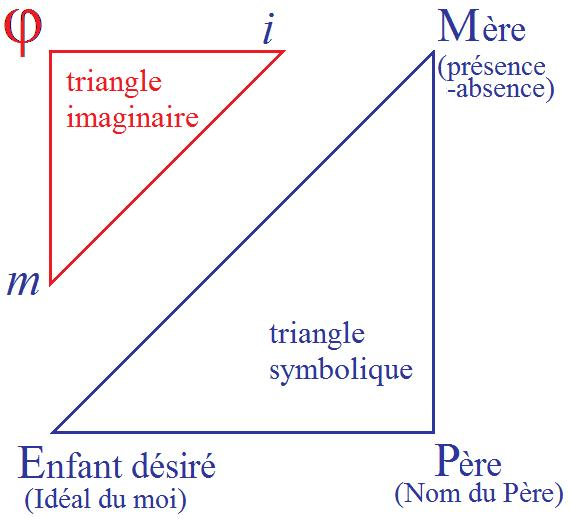

# Leçon 14 | 05 Mars 1958

<!-- source-url: http://staferla.free.fr/S5/S5 FORMATIONS .docx -->
<!-- seminar: s5 -->
<!-- lesson: 14 -->

<!-- id: s5-14-0001 -->

Chers amis, pour reprendre notre discours interrompu depuis trois semaines, je partirai de ce que nous rappelions hier soir avec justesse : que notre discours doit être un discours *scientifique*. Ceci dit, il apparaît que pour aboutir
à cette fin, les voies ne sont pas si faciles quand il s’agit de notre objet. J’ai simplement hier soir pointé l’originalité
du moment que constitue dans l’examen des phénomènes de l’homme la mise au pre­mier plan, l’arrêt constitué

<!-- id: s5-14-0002 -->

par toute la discipline freudienne sur cet élément privi­légié qui s’appelle le *désir*. Je vous ai fait remarquer que
jusqu’à FREUD, cet élément en lui-même a toujours été réduit, et par quelque côté, élidé précocement.

<!-- id: s5-14-0003 -->

Et c’est ce qui permet de dire que jusqu’à FREUD, toute étude de l’économie humaine est plus ou moins partie
d’un souci de morale, d’*éthique*, au sens où il s’agit moins d’étudier le *désir* que d’ores et déjà le réduire et le discipliner.
Or c’est aux *effets du désir* au sens très large - le désir n’est pas l’un des effets à côté - aux *effets du désir* que nous avons affaire dans la psychanalyse. Ceci, c’est le sens de tout ce qu’ici je m’efforce de vous rappeler, de ce qui se mani­feste dans ces phénomènes du *désir* humain, à savoir sa foncière *[subduction](https://fr.wikipedia.org/wiki/Subduction),* pour ne pas dire « *subversion »*
par un certain rapport qui est *le rapport du désir au signifiant*.

<!-- id: s5-14-0004 -->

Aujourd’hui ce n’est pas tellement cela que je vous rappellerai une fois de plus, encore que nous devions y revenir pour en repartir, mais je vous montrerai ce que signifie dans une perspective rigoureuse, celle qui maintient l’*originalité* de *la condi­tion du désir de l’homme*, ce que représente pour lui ce *quelque chose*, qui toujours pour vous est plus ou moins impliqué dans le maniement que vous faites de cette notion du *désir* et qui mérite d’en être distingué. Je dirai plus :

<!-- id: s5-14-0005 -->

qui ne peut com­mencer d’être articulé qu’à partir du moment où ici nous sommes suffisamment inculqués

<!-- id: s5-14-0006 -->

- de *la notion de complexité dans laquelle se constituent ce désir,*

<!-- id: s5-14-0007 -->

- *et cette notion dont je parle* - qui va être l’autre pôle du discours d’aujourd’hui - *elle s’appelle la jouissance.*

<!-- id: s5-14-0008 -->

Reprenons brièvement ce qui constitue comme telle *cette déviation-aliénation du désir dans le signifiant*.
Nous essayerons d’aboutir à ce qui peut constituer dans cette perspective, ce terme en quoi consiste le fait que
le sujet humain, dans son monde, s’empare des conditions mêmes qui lui sont imposées,
comme si ces conditions étaient faites pour lui, et qu’il s’en satisfasse.

<!-- id: s5-14-0009 -->

Ceci, je vous l’indique déjà, nous fera déboucher - j’espère y arriver aujourd’hui - sur ce que je vous ai déjà indiqué
au début de l’année en prenant les choses dans la perspective du *trait d’esprit*, sur la nature de *la comédie*.

<!-- id: s5-14-0010 -->

Rappelons brièvement ceci :

<!-- id: s5-14-0011 -->

- que *le désir* est installé essentiellement dans un rap­port à *la chaîne signifiante*,

<!-- id: s5-14-0012 -->

- que *le désir se pose* et se propose d’abord dans l’évolution du sujet humain *comme demande,*

<!-- id: s5-14-0013 -->

- que *la frustration* dans FREUD *est Versagung,* c’est-à-dire *refus*, plus exactement encore *dédit*.

<!-- id: s5-14-0014 -->

Si haut que nous remontions avec les kleiniens, dans la genèse, observez que cette exploration - qui assurément
était un progrès, celle qui nous mène de la plupart des problèmes d’évolution du sujet névrotique à la satisfaction

<!-- id: s5-14-0015 -->

dite « sadique-orale » - obser­vez simplement que cette satisfaction s’opère en *fantasme*, et d’ores et déjà et d’em­blée

<!-- id: s5-14-0016 -->

en rétorsion de la satisfaction fantasmée.

<!-- id: s5-14-0017 -->

On nous dit : tout part du besoin de morsure, quelquefois agressif, du petit enfant par rapport au corps de la mère. N’oublions tout de même pas que *tout ceci ne consiste jamais en morsure réelle*, que ce sont là *fantasmes* et que rien de cette déduction ne peut même nous faire faire un pas, si ce n’est pour nous montrer que *la crainte de la morsure en retour*
est là le nerf essentiel de ce dont il s’agit, de ce qu’il s’agit de démontrer.

<!-- id: s5-14-0018 -->

Aussi bien, m’entretenant hier soir avec l’un d’entre vous qui essaye de reprendre, après Susan ISAACS [^38], *quelques définitions valables des termes de fantasme,* à très juste titre il me disait son embarras total à en faire une quelconque déduction qui soit fon­dée purement et simplement sur *la relation imaginaire* entre les sujets.

<!-- id: s5-14-0019 -->

Il est absolu­ment impossible de distinguer d’une façon valable *les* *fantasmes inconscients* de cette création formelle qu’est le jeu de l’imagination si nous ne voyons pas que d’ores et déjà *le fantasme inconscient* est dominé, *structuré par* les conditions *du signifiant*.

<!-- id: s5-14-0020 -->

Les *objets primordiaux*, bons et mauvais, les objets primitifs à partir desquels se refait toute la déduction analytique, constituent une sorte de *batterie* dans laquelle se dessinent plusieurs séries *de substitutifs* d’ores et déjà promis
à l’équivalence : *le lait*, *le sein*, deviennent ultérieurement, qui, *le sperme*, qui, *le pénis*. *D’ores et déjà les objets sont, si je puis m’exprimer ainsi, signifiantisés.* Ce qui se produit de la relation avec *l’objet le plus primordial*, l’objet maternel, s’opère d’emblée et d’ores et déjà sur des *signes*, sur ce que nous pourrions appeler, pour imager ce que nous voulons dire
« *la monnaie du désir de l’Autre* ». \[[Cf. *les dé**bris de l’objet métonymique,* séance du 20-11-1957](#débris_objet)\]

<!-- id: s5-14-0021 -->

Et ce que je vous ai indiqué la dernière fois, en regardant d’aussi près qu’il est nécessaire pour le bien voir, *cette œuvre* que FREUD considère comme décisive \[« *On bat un enfant* »\], je vous ai souligné qu’elle a marqué le pas inaugural

<!-- id: s5-14-0022 -->

dans la compréhension par les analystes, compré­hension véritable, authentique, du problème de la perversion.

<!-- id: s5-14-0023 -->

Ce que nous avons fait donc la dernière fois était de nature à vous faire apercevoir que dans ces *signes* mêmes,
une division peut s’opérer. Tous ces *signes* sont plus compliqués, plus exactement l’ensemble des *signes* n’est pas réductible à ce que nous pourrions appeler ce que je vous ai déjà indiqué comme étant *des titres*, *des sortes de valeurs fiduciaires* : avoir ceci ou cela.

<!-- id: s5-14-0024 -->

Ils ne sont pas purement et simple­ment *valeurs représentatives*, « *monnaie d’échange* » comme nous venons de le dire
à l’instant, et en quelque sorte *signes* en tant que constitués comme tels. Il y en a parmi ces *signes* qui sont
des *signes constituants*, je veux dire par où *la création de la valeur* est assurée, je veux dire par où ce *quelque chose de réel*,
qui est engagé à chaque instant dans cette économie*, est frappé de cette barre qui en fait un signe*.

<!-- id: s5-14-0025 -->

Cette *barre* \[Cf. *trait unaire*, *einziger Zug*\], constituée la dernière fois par ce *signe-bâton* de la cravache ou du n’importe quoi
qui frappe, est ce quelque chose par où, même un effet désagréable devient distinction et instauration de la relation même, par où *la demande* peut être reconnue comme telle. Ce par quoi ce qui a été d’abord moyen d’annuler la réalité rivale du frère devient secondairement ce quelque chose par quoi le sujet lui-même se trouve distingué,
par où lui-même est reconnu comme quelque chose qui peut être ou reconnu ou jeté au néant. Ce quelque chose qui d’ores et déjà se présente donc comme la surface sur laquelle peut s’inscrire tout ce qui peut être donné par la suite : une sorte de *chèque*, si je puis dire, tiré *en blanc*, sur lequel tous les dons sont pos­sibles.

<!-- id: s5-14-0026 -->

Et vous voyez bien que puisque tous les dons sont possibles, c’est qu’aussi bien il ne s’agit même pas de ce qui peut ou non être donné, parce que là il s’agit bien de cette relation de l’amour dont je vous dis qu’elle est constituée
par ce que le sujet lui, donne essentiellement : c’est-à-dire *ce qu’il n’a pas*. Tout le possible de cette intro­duction

<!-- id: s5-14-0027 -->

à l’ordre de l’amour suppose ce signe fondamental par le sujet, qui peut être, ou annulé, ou reconnu comme tel.

<!-- id: s5-14-0028 -->

Je vous ai demandé pendant cet intervalle de faire quelques lectures. J’espère que vous les avez faites, je veux dire que vous vous êtes un petit peu au moins occu­pés de « *La phase phallique »* d’Ernest JONES, et du « *Développement précoce*

<!-- id: s5-14-0029 -->

*de la sexua­lité féminine* ». Je ne veux - puisque je dois avancer aujourd’hui - que vous ponctuer à propos d’un exemple qui est un exemple tout à fait localisé : je l’ai retrouvé en voyant ce qui avait été dit pour un certain anniversaire commémorant le cinquantième de JONES, et qui coïncidait avec l’époque où cette *Phase phallique* venait au premier plan de l’in­térêt des psychanalystes anglais.

<!-- id: s5-14-0030 -->

Et dans ce numéro j’ai relu une fois de plus avec beaucoup d’intérêt cet article de Joan RIVIERE, dans *International Journal of Psychoanalysis, vol X,* intitulé « [*La fém**inité comme mascarade*](#Joan_Riviere) »[^39]. Poursuivant l’analyse d’un cas spécifié

<!-- id: s5-14-0031 -->

qui n’est pas le cas général de *l’assomption de la féminité*, Joan RIVIERE montre comment, dans un cas qu’elle situe
par rapport à diverses branches et cheminements possibles dans l’accession à la féminité, comment un de ces cas démontrait pour elle, se présentait comme ayant une féminité d’autant plus remarquable dans son assomption apparemment absolument complète que c’était précisément chez un de ces sujets dont toute la vie par ailleurs
peut sembler être - à l’époque beaucoup plus encore qu’à la nôtre - l’assomption de toutes les fonctions masculines.

<!-- id: s5-14-0032 -->

Autrement dit, il s’agit de quelqu’un qui avait une vie professionnelle parfaite­ment indépendante, élaborée, libre,

<!-- id: s5-14-0033 -->

et qui néanmoins - ce qui, je le répète, tranchait plus à cette époque qu’à la nôtre - se manifestait par une sorte d’assomption corré­lative, et au maximum, à tous les degrés, de ce qu’on pouvait appeler ses* « fonctions féminines »*.
Ceci, non seulement sous la forme apparente, *publique*, des fonctions de maîtresse de maison, dans ses rapports

<!-- id: s5-14-0034 -->

avec son époux, en tant que montrant par­tout la supériorité des qualités qui sont, dans notre état social, censées être de façon univoque *les caractéristiques sociales* de ce qui est la charge de la femme, mais par­ticulièrement dans un autre registre, *tout spécialement sur le plan sexuel*, quelque chose d’entièrement satisfaisant dans ses relations à l’homme, autrement dit dans la jouissance de la relation.

<!-- id: s5-14-0035 -->

Or cette analyse met en valeur, sous cette apparente et entière satisfaction de la position féminine, quelque chose
de très caché qui n’en constitue pas moins la base, quelque chose qui sans aucun doute est ce qu’on trouve
après qu’on y ait été incité tout de même par quelque menue - mais infiniment menue - discordance apparaissant
à la surface de cet état en principe complètement satisfaisant. Ce quelque chose de caché, il est intéressant de
le montrer parce que vous savez l’importance, *l’accent* que notre expérience a pu mettre sur le *Penisneid,*

<!-- id: s5-14-0036 -->

revendica­tion du pénis, dans beaucoup de troubles du développement de la sexualité féminine.

<!-- id: s5-14-0037 -->

Ici ce qui est caché, c’est bien tout le contraire : c’est à savoir ce *phallus,* comme on l’appelle. Je ne peux pas vous refaire l’histoire de cette femme, ce n’est pas notre objet aujourd’hui, mais la source de la satisfaction fondamentale
qui supporte ce qui apparemment fleurit dans cette libido heureuse, c’est la satisfaction cachée de sa suprématie
sur les personnages parentaux. C’est le terme même dont se sert Mme Joan RIVIERE, et ceci est par elle considéré comme étant à la source même de ce qui se présente avec un caractère qui n’est pas tellement assuré dans l’évolution de la sexualité féminine pour ne pas être remarqué dans ce cas.

<!-- id: s5-14-0038 -->

La source du caractère satis­faisant de l’orgasme lui-même, est la preuve que précisément à partir de la détection
de ce ressort caché de la personnalité chez le sujet - même si c’est seulement d’une façon transitoire - obtient cet effet de perturber profondément ce qui avait été acquis ou présenté chez le sujet comme *relation achevée, mûre et heureuse*, ayant entraîné même, pour un temps, la disparition de cette *heureuse issue* de l’acte sexuel.

<!-- id: s5-14-0039 -->

Ce devant quoi nous nous trouvons en présence, souligne Madame Joan RIVIERE, est ceci :
c’est que c’est en fonction du besoin chez le sujet d’éviter de la part des hommes la rétorsion de cette subreptice soustraction à l’autre de la source et du symbole même de leur puissance qui, à mesure qu’apparaît l’analyse, qu’avance l’analyse, apparaît de plus en plus évi­demment guidé et dominé, est donné le sens de la relation du sujet avec les per­sonnes de l’un et l’autre sexe.

<!-- id: s5-14-0040 -->

C’est dans la mesure où ceci doit être pour en éviter le châtiment, *la rétorsion* de la part des hommes qui sont ici visés, que le sujet, dans une scansion très fine qui apparaît d’autant mieux que l’analyse avance mais qui était déjà perceptible pourtant dans ces petits traits anomaliques de l’analyse, à chaque fois en somme que le sujet a fait preuve de sa puissance phalliquement constituée, se précipite dans une série de démarches, soit de séduction, soit même
de procédures sacrificielles : tout faire pour les autres, et justement, *en apparence*, adoptant là les formes les plus élevées du dévouement féminin comme quelque chose qui consiste à dire : « *Mais voyez, je ne l’ai pas ce phallus, je suis femme, et pure femme*... » et à se masquer, spécialement dans les démarches qui suivent immédiatement auprès des hommes, dans ces démarches professionnelles par exemple, dans lesquelles elle se montre éminemment qualifiée,
adoptant soudain par une sorte de dérobade l’attitude de quelqu’un d’excessive­ment modeste, voire anxieux sur la qualité de ce qu’il a fait, et en réalité jouant « *tout un jeu de coquetterie* » - comme s’exprime Mme Joan RIVIERE –
qui à ce moment-là, lui sert non pas tant à rassurer qu’à tromper dans son esprit ceux qui pourraient souvent s’offenser de ce *quelque chose* qui, chez elle, se présente essen­tiellement et fondamentalement :

<!-- id: s5-14-0041 -->

- comme *agression*,

<!-- id: s5-14-0042 -->

- comme besoin et *jouissance de la suprématie* comme telle,

<!-- id: s5-14-0043 -->

- comme profondément structuré sur toute une histoire qui est celle de la rivalité avec la mère d’abord, avec le père ensuite.

<!-- id: s5-14-0044 -->

Bref, à propos d’un exemple comme celui-là, aussi *paradoxal* qu’il paraisse, nous voyons donc bien que ce dont il s’agit dans une analyse, dans *la compréhension d’une structure subjective* : c’est toujours de quelque chose qui nous montre le sujet engagé dans un procès de *reconnaissance* comme tel.

<!-- id: s5-14-0045 -->

Mais de reconnaissance de quoi ? Comprenons-le bien : puisque de ce *besoin de reconnaissance* le sujet est inconscient, c’est bien pourquoi il nous faut quelque part situer cet *Autre*, nécessité par tout rapport de reconnaissance,
le situer dans *une altérité* d’une qualité que nous n’avons pas connue jusqu’à présent, ni jusqu’à FREUD :

<!-- id: s5-14-0046 -->

- celle qui en fait la pure et simple *place de signifiant* par quoi *l’être se divise* d’avec sa propre existence,

<!-- id: s5-14-0047 -->

- qui fait du sort du sujet humain quelque chose d’essentiellement lié à son rapport avec ce *signe* : d’*être ce qui est fait de ce signe*, d’être l’objet de toutes sortes de passions qui présentifient dans ce procès même *la mort* en ce que c’est dans son lien à ce signe que le sujet est assez détaché de lui–même pour pouvoir avoir ce rapport, semble-t-il unique dans la création, à sa propre existence et qui est la der­nière forme de ce que *dans l’analyse* nous appelons *le masochisme,* à savoir ce quelque chose par quoi le sujet appréhende *la douleur d’exister*, *cette division où le sujet se trouve constitué* dès l’abord en tant qu’existence.

<!-- id: s5-14-0048 -->

Pourquoi ? *Parce qu’ailleurs, son être a à se faire représenter dans le signe*, et le signe lui-même est dans un tiers endroit.

<!-- id: s5-14-0049 -->

C’est là ce qui, dès le niveau de l’inconscient, structure *le sujet* dans cette décomposition de lui-même sans laquelle
il nous est impossible de fonder d’aucune façon valable ce qui s’appelle l’*inconscient*.

<!-- id: s5-14-0050 -->

Prenez le moindre rêve qui soit, vous verrez - à condition que vous l’analysiez cor­rectement, à vous reporter

<!-- id: s5-14-0051 -->

à la *Traumdeutung -* que ce n’est pas dans ce qui se pré­sente dans le rêve comme signifiant articulé, même le premier déchiffrage étant fait, que s’incarne l’inconscient. À tous les propos FREUD y revient et le souligne :
« *il y a des rêves* - dit-il - *hypocrites* ». Ils n’en sont pas moins la représentation d’un désir, ne serait-ce que le désir
de tromper l’analyste. Rappelez-vous ce que je vous ai souligné de ce passage pleinement articulé
dans l’*Analyse d’un cas d’homosexualité féminine*. \[cf. « *Psychogénèse d’un cas d’homosexualité féminine »*, in *Névroses, psychoses et perversions*\]

<!-- id: s5-14-0052 -->

Mais ce discours inconscient lui-même - mais qui n’est pas *le dernier mot* de l’inconscient - est supporté par ce qui est vraiment le dernier ressort de l’incons­cient : il ne peut pas être articulé autrement que comme *désir de reconnaissance*
du sujet, fut-ce à travers *un mensonge* d’ores et déjà articulé au niveau des méca­nismes qui échappent à la conscience,

<!-- id: s5-14-0053 -->

*désir de reconnaissance* qui soutient en cette occasion le mensonge lui même, qui peut se présenter, dans une fausse

<!-- id: s5-14-0054 -->

pers­pective, comme mensonge de l’inconscient.

<!-- id: s5-14-0055 -->

Ceci vous donne le sens et la clef de la nécessité où nous nous trouvons de poser, à l’origine de toute analyse
du phénomène subjectif complet tel qu’il nous est livré par l’expérience analytique, ce *schéma* autour duquel j’essaye
de faire progresser le cheminement authentique de l’expérience des formations de l’inconscient. Et il est celui que j’ai promu devant vous récemment sous cette forme que je peux aujour­d’hui vous présenter en somme d’une façon

<!-- id: s5-14-0056 -->

plus simple. C’est bien entendu toujours les formes les plus simples qui doivent être amenées en dernier.

<!-- id: s5-14-0057 -->

Ici, qu’avons-nous dans ce « *triangle à trois pôle*s » qui constitue *la position du sujet* ? Le sujet en tant que dans son rapport avec une triade de termes qui sont les fondations signifiantes de tout son progrès ?

<!-- id: s5-14-0058 -->

Nommément la mère en tant qu’elle est le premier objet symbolisé, que son *absence* ou sa *présence*
vont devenir pour le sujet le signe du désir auquel va s’ac­crocher son propre désir, autrement dit ce qui va faire ou non de lui, non pas sim­plement un enfant satisfait ou non, mais un enfant désiré ou non. Ceci ne constitue pas une construction arbitraire. Reconnaissez que je mets là en place quelque chose que notre expérience *pas à pas* nous a appris à découvrir. Nous avons su par l’expé­rience ce que comporte de *conséquences* en cascade, de déstructuration presque infinie, le fait pour un sujet, avant sa naissance, *d’avoir été* d’ores et déjà *un enfant non désiré.*

<!-- id: s5-14-0059 -->

*Ce terme est essentiel*. Il est plus essentiel que d’avoir été à tel ou tel moment un enfant plus ou moins satisfait.

<!-- id: s5-14-0060 -->

<!-- id: s5-14-0061 -->

Le terme *enfant désiré* est celui qui *répond* à la consti­tution de la mère en tant que siège du désir.

<!-- id: s5-14-0062 -->

À ceci répond toute cette dialectique du rapport de l’enfant au *désir de la mère* que j’ai essayé de vous montrer et qui se résume, qui se concentre en ceci, dans le fait primordial du *symbole de l’enfant désiré*, et ici le terme du père \[Nom du père\], pour autant qu’il est dans le signifiant, *ce signifiant* par quoi le signifiant lui-même est posé comme tel.

<!-- id: s5-14-0063 -->

Et c’est pour cela que *le père est essentiellement créateur,* je dirai même *créateur absolu, celui qui crée avec rien,* c’est *pour autant que le signifiant*, dans sa dimension originale, *en lui-même, peut contenir le signifiant*, qu’il se définit comme *le surgissement de*
*ce signifiant*. C’est par rapport à cela que quelque chose d’essentiellement confus, indéterminé, non détaché de son existence et pourtant fait pour se détacher d’elle : le sujet en tant qu’il *doit être signifié,* a à se repérer.

<!-- id: s5-14-0064 -->

Si des identifications sont possibles, c’est dans la mesure toujours où quelque chose pour le sujet se structure
dans ce rapport *triadique* constitué au niveau du signifiant. Et s’il peut arriver à l’intérieur de son vécu à donner
tel ou tel sens à ce quelque chose qui lui est donné par sa physiologie humaine particulière, c’est dans ce rapport
que ceci se constitue.

<!-- id: s5-14-0065 -->

Or je n’ai pas à revenir sur le fait de l’homologie des termes, de ce qui constitue au niveau du *signifié*, du côté où est
le sujet par rapport à ces trois termes symboliques. Cette homologie - en partie je l’ai démontrée, je ne fais que cela en fin de compte ici - je vous demande, jusqu’à toujours plus ample informé, plus ample démonstration,
de me suivre là-dessus. C’est dans le rapport à *sa propre image* que le sujet retrouve la duplicité du désir maternel
par rapport à lui comme enfant désiré, qui n’est que symbolique. Il l’éprouve, il l’expérimente *dans ce rapport à l’image de lui-même* à laquelle peuvent venir se superposer tant de choses, ce quelque chose qui par un exemple s’illustre.
Je vais le faire tout de suite.

<!-- id: s5-14-0066 -->

Hier soir j’ai fait allusion au fait d’avoir regardé d’assez près l’histoire de l’enfance de GIDE telle que Jean DELAY[^40] nous l’expose d’une *façon* véritablement *exhaustive* dans la *pathographie* qu’il nous a livrée de ce cas. Il est tout à fait clair que GIDE, « *l’enfant disgracié » -* comme l’a dit quelque part l’auteur à la vue photographique devant laquelle
le personnage s’est senti frémir - que GIDE, *l’enfant disgracié*, l’enfant livré dans son érotisme, auto-érotisme primitif, aux images les plus inconstituées puisque, nous dit-il, il trouvait son orgasme dans son identification à des situations en quelque sorte catastrophiques, il trouvait très précisément sa jouissance dans la lecture de quelques termes,
à la lecture de Madame de SÉGUR par exemple…

<!-- id: s5-14-0067 -->

> dont véri­tablement les livres sont fondamentaux de toute l’ambiguïté du sadisme primordial,
>
> mais où le sadisme n’est peut-être pas le plus élaboré
> …où il a pris la forme de l’enfant battu, d’une servante qui laisse tomber quelque chose dans un grand « *patatras* »

<!-- id: s5-14-0068 -->

de des­truction de ce qu’elle tient entre les mains.

<!-- id: s5-14-0069 -->

D’où l’identification à ce personnage de GRIBOUILLE dans un conte d’ANDERSEN[^41], qui s’en va au fil de l’eau

<!-- id: s5-14-0070 -->

et finit par arriver à un lointain rivage, transformé en un rat mort, c’est-à-dire dans les formes les moins humainement constituées de cette *douleur de l’existence*.

<!-- id: s5-14-0071 -->

Assurément, nous ne pouvons rien, là, appréhender d’autre, sinon ce quelque chose d’abyssal qui est constitué dans ce rapport premier avec une mère dont nous savons à la fois qu’elle avait de très hautes et très remarquables qualités, et ce *je ne sais quoi* de totalement élidé dans sa sexualité, dans sa vie féminine, qui met assurément en sa pré­sence l’enfant, dans ses années de départ, dans une position totalement *insituée*.

<!-- id: s5-14-0072 -->

Le point tournant, le point où la vie du jeune GIDE reprend, si l’on peut dire, sens et constitution humaine,
est dans ce moment d’*identification* crucial…
qui nous est donné aussi clairement qu’il est possible de l’être dans son souvenir et qui laisse
d’une façon non douteuse sa marque sur toute son existence, puisque aussi bien il en a conservé
le point pivot et l’objet à travers toute son existence
…dans cette *identification* à sa jeune cousine dont il ne suffit pas de donner le terme sous cette forme vague.

<!-- id: s5-14-0073 -->

*Identification*, c’est certain, il nous le dit. Quand ? Dans ce moment, dont on ne s’arrête pas assez à son caractère singulier, où il retrouve sa cousine en pleurs au deuxième étage de cette maison où il s’est précipité,
non pas tant attiré par elle que par son flair, par son amour du clandestin qui sévit dans cette maison.

<!-- id: s5-14-0074 -->

Après avoir traversé le premier étage où la mère de cette cousine - sa tante - il la voit, ou plus exactement l’entrevoit plus ou moins au bras d’un amant, il trouve sa cousine en pleurs. Et là, somme d’ivresse, d’enthousiasme, d’amour,
de détresse et de dévotion, il se consacre à « *protéger cette enfant* », nous dit-il plus tard. N’oublions pas qu’elle était
son aînée : à cette époque GIDE \[22-11-1869\] avait 13 ans, et Madeleine \[Madeleine Rondeaux : 07-12-1867\] en avait 16.

<!-- id: s5-14-0075 -->

Il se produit à ce moment ce quelque chose dont nous ne pouvons absolument pas comprendre le sens :

<!-- id: s5-14-0076 -->

- si nous ne le posons pas dans cette relation tierce où le jeune André se trouve, non pas seulement avec sa cousine, mais avec celle qui, à l’étage au-dessous, est en train d’évaporer les chaleurs de fièvre,

<!-- id: s5-14-0077 -->

- et si nous ne nous souvenons pas de cet *antécédent* qu’André GIDE nous livre dans *La porte étroite,* à savoir d’une tentative de séduction opérée par la dite mère de sa cousine.

<!-- id: s5-14-0078 -->

Ce qui se produit alors, c’est quelque chose qui est quoi ? Il est devenu « *l’enfant désiré »*, André GIDE, au moment
de cette séduction, dont il s’est d’ailleurs enfui avec horreur parce qu’en effet rien ne vient y apporter cet élément
de médiation, cet élément d’approche qui fait de cela autre chose qu’un trauma, il s’est trouvé pour la première fois pourtant en position d’*enfant désiré*. Ce moment produit l’issue de cette situation nouvelle qui, d’un certain côté,
va être pour lui salvatrice mais qui va néanmoins le fixer dans une position profondé­ment divisée,

<!-- id: s5-14-0079 -->

eu égard au mode d’activité tardive, et je le répète sans médiation, dans lequel se produit cette rencontre.

<!-- id: s5-14-0080 -->

Que va-t-il garder dans la constitution de *ce terme symbolique* qui jusqu’alors lui manquait ? Il ne gardera rien d’autre que *la place de l’enfant désiré* qu’il va pouvoir enfin occuper par l’intermédiaire de sa cousine. À *cette place où il y avait un trou*, il y a maintenant une place, mais rien de plus, car à cette place, bien sûr il se refuse : il ne peut accepter le désir
dont il est l’objet. Mais par contre son *moi* *incontestablement* ne cesse pas :

<!-- id: s5-14-0081 -->

- *de s’identifier*, et ceci *à jamais*, sans le savoir, *au sujet du désir* duquel il est maintenant dépendant, c’est-à-dire lui,

<!-- id: s5-14-0082 -->

- *de devenir amoureux à jamais*, et jusqu’à la fin de son existence, de devenir amoureux *de ce petit garçon qu’il a été*
  *un instant* entre les bras de sa tante, de cette tante qui lui a caressé le cou, les épaules et la poitrine.

<!-- id: s5-14-0083 -->

Et nous verrons que toute sa vie est dans ce dont nous pouvons faire état, à savoir de ce qu’il nous a avoué,
à savoir que dès son voyage de noces - chacun s’en époustoufle et s’en scandalise - et presque devant sa femme,

<!-- id: s5-14-0084 -->

il pense au « *sup­pliciant délice »,* comme il s’exprime, du *caressage des bras et des épaules* des jeunes garçons qu’il rencontre dans le train.

<!-- id: s5-14-0085 -->

C’est là une page désormais célèbre qui fait par­tie de la littérature, dans laquelle GIDE montre ce qui, pour lui, reste le point privi­légié de toute *fixation de son désir*. En d’autres termes, ce qui - au niveau de ce qui devient pour lui son *idéal du moi -* a été soustrait ici, à savoir le désir dont il est l’objet et qu’il ne peut supporter, il l’as­sume pour lui-même, il devient à jamais et éternellement amoureux de ce même petit garçon caressé qu’il n’a pas voulu, lui, être.

<!-- id: s5-14-0086 -->

En d’autres termes, nous saisissons là ceci : que ce terme de *l’enfant désiré *où il faut que s’élabore quelque chose,
où *il faut qu’il rejoigne ce signifiant* qui primordialement constitue le sujet dans son être, *il faut que ce moi*, ce point *x*
où il est, *le rejoigne* d’une façon quelconque, que se constitue ici cet *idéal du moi* qui marque tout développement psychologique d’un sujet. Cet *idéal du moi* est marqué :

<!-- id: s5-14-0087 -->

1)  du signe du signifiant,

<!-- id: s5-14-0088 -->

2)  de savoir d’où il peut partir, à savoir - par progression à partir du *moi* - ou au contraire, sans que le *moi* puisse faire autre chose que de *subir* par *une série d’acci­dents*, *livré aux aventures* à partir du signifiant lui-même.

<!-- id: s5-14-0089 -->

Autrement dit, de recon­naître que ce qui se produit à l’insu du sujet par la seule succession d’*accidents*,
que ce qui lui permet de subsister dans sa position signifiante d’enfant plus ou moins désiré, ce quelque chose est là qui nous montre que *c’est à la même place* - selon que cela se produit par la voie consciente ou par la voie inconsciente -
*c’est à la même place que se produit ce que nous appelons dans un cas, idéal du moi, et dans l’autre cas, perversion.*

<!-- id: s5-14-0090 -->

La perversion d’André GIDE ne tient pas tellement dans le fait qu’il ne peut dési­rer que des petits garçons,

<!-- id: s5-14-0091 -->

que le petit garçon qu’il avait été, la perversion d’André GIDE consiste en ceci : c’est que là, il ne peut se constituer
qu’à perpétuellement se dire, se soumettre - *dans cette Correspondance qui pour lui est le cœur de son œuvre* - qu’à être celui qui se fait valoir à la place occupée par sa cou­sine, celui dont toutes les pensées sont tournées vers elle, *celui qui lui donne* littéra­lement à chaque instant *tout ce qu’il n’a pas*, mais rien que cela, *qui se constitue comme personnalité dans elle, par elle,*
*et par rapport à elle*. Ce qui le met par rap­port à elle dans cette sorte de dépendance mortelle qui le fait s’écrier
quelque part :

<!-- id: s5-14-0092 -->

« *Vous ne pouvez savoir ce que c’est que l’amour d’un uraniste ! C’est quelque chose comme un amour embaumé.* »

<!-- id: s5-14-0093 -->

Cette entière projection de ce qui est sa propre essence dans ce qui est la base, et en effet le cœur et la racine, chez lui de son existence d’homme littéraire, d’homme tout entier dans le signifiant et dans ses rapports et dans ce qu’il communique, c’est par là qu’il est *saisifié* dans sa relation inter-humaine et que pour lui cette femme non désirée peut être en effet l’objet du *suprême amour*, qui lui est essentiellement lié, et quand cet objet avec lequel il a rempli ce trou
de *l’amour sans désir*, quand cet objet vient à disparaître, il pousse ce misérable cri dont j’ai indiqué hier soir dans ce que je vous disais, la parenté avec le cri *comique* par excellence : « *Ma cassette ! ma chère cassette ! »,* la cassette de *L’Avare*.

<!-- id: s5-14-0094 -->

Toutes les passions, en tant qu’elles sont aliénation du désir dans un objet, sont sur le même pied.
Bien sûr *la cassette de L’Avare* nous fait plus facilement rire - au moins si nous avons en nous quelque accent d’humanité, ce qui n’est pas le cas universel - que la disparition de la correspondance de GIDE avec sa femme. Évidemment, ce devrait être pour nous tous une chose ayant son prix pour toujours.

<!-- id: s5-14-0095 -->

Il n’en reste pas moins que fondamentalement, c’est la même chose, et que le cri de GIDE lors de la disparition
de cette correspondance est le même cri que celui de *la comédie*, que celui de l’*avare* HARPAGON.
Cette comédie dont il s’agit, qu’est-ce que c’est ?
La comédie est quelque chose qui nous atteint par mille propos dispersés.

<!-- id: s5-14-0096 -->

La comédie n’est pas *le comique*. Tout comique doit pouvoir, si nous donnons de *la comédie* une théorie correcte,
si nous croyons qu’au moins pendant un temps la comédie a été la production devant *la communauté* - *la communauté*
en tant qu’elle *représente* un groupe d’hommes, c’est-à-dire comme consti­tuant *au-dessus d’elle* l’existence d’un Homme comme tel - si la comédie a été ce qu’elle semble avoir été à un moment où la représentation du rapport de l’homme à la femme était l’objet de quelque chose qui avait une valeur cérémonielle, de quelque chose qui fait que je ne suis pas le premier à comparer le théâtre à la messe : tous ceux qui se sont approchés de la question du théâtre

<!-- id: s5-14-0097 -->

ont mar­qué qu’assurément, seul à notre époque, le drame de la messe représente essentielle­ment ce qui, à un moment de l’histoire, a représenté le développement complet des fonctions du théâtre.

<!-- id: s5-14-0098 -->

Si d’une part donc, au temps de la grande époque du théâtre grec *la tragédie* représente ce rapport de l’homme
à *la parole* en tant qu’il le prend dans sa fatalité et dans une fatalité conflictuelle, alors, pour autant que
*la chaîne symbolique est le lien de l’homme à la loi signifiante*, elle n’est pas la même au niveau de la famille
et au niveau de la communauté : ceci est *l’essence de la tragédie*.

<!-- id: s5-14-0099 -->

*La comédie* représente ceci, et c’est non sans lien avec *la tragédie*, puisque vous le savez, *une comédie* complétait toujours la trilogie tragique. Nous ne pouvons pas la considérer indépendamment, et cette *comédie*, je vous montrerai que
nous en trouvons la trace et l’ombre jusque dans le commentaire marginal du drame chrétien lui-même. Bien sûr,
pas à notre époque du christianisme constipé, où on n’oserait pas accompagner les cérémonies de *ces robustes farces*
qui sont constituées par ce qu’on appelait le « *Risus pascalis »*, mais laissons ceci de côté.

<!-- id: s5-14-0100 -->

La comédie se présente comme le moment où le sujet et l’homme tentent de prendre ce rapport à *la parole* comme étant, non plus son engagement, son déguisement dans ces nécessités contraires, mais comme étant après tout
non seulement son affaire, mais ce quelque chose dans lequel il a à s’articuler lui-même comme *celui qui en profite, qui en jouit, qui le consomme*, et *qui* - pour tout dire - est celui qui, *de cette communion, est destiné à absorber la substance et la matière.*

<!-- id: s5-14-0101 -->

*La comédie*, peut-on dire, *est quelque chose comme la représentation de la fin du repas communionnaire* à partir duquel la tragédie elle-même a été évoquée. C’est l’homme en fin de compte, qui consomme tout ce qui a été là présentifié

<!-- id: s5-14-0102 -->

de *sa sub­stance* et de *sa chair commune*, et il s’agit de savoir ce que cela va donner.

<!-- id: s5-14-0103 -->

Ce que cela va donner, pour le comprendre je crois qu’il n’y a absolument pas d’autre moyen que de vous reporter
à l’ancienne comédie, dont toutes les comédies qui ont suivi ne sont qu’une sorte de dégradation où les traits sont toujours reconnaissables, aux comédies d’ARISTOPHANE, à ces comédies comme « *L’Assemblée des femmes »,*
comme « *Lysistrata »,* comme les « *Thesmophories ».*

<!-- id: s5-14-0104 -->

Il faut vous y reporter pour voir où cela nous mène, et bien sûr c’est à celles-là que je me reportais quand

<!-- id: s5-14-0105 -->

je com­mençais de vous indiquer dans quel sens la comédie manifeste, par une sorte de nécessité interne,
ce rapport du sujet à partir du moment où c’est son propre *signi­fié* - à savoir *le fruit du résultat de ce rapport de signifiant -* qui doit venir effectivement sur *la scène de la comédie*, pleinement développé.

<!-- id: s5-14-0106 -->

C’est ce terme qui désigne lui-même, nécessairement en tant qu’il est signifié, c’est-à-dire en tant qu’il recueille,
qu’il assume, qu’il jouit de la relation à un fait qui, lui, est fondamentalement dans un certain rapport avec l’ordre signifiant, l’apparition de *ce signifié qui s’appelle le phallus.*

<!-- id: s5-14-0107 -->

Il se trouve que depuis que je vous ai apporté ce terme, je n’ai eu qu’à ouvrir ce quelque chose, dans les jours qui ont suivi l’esquisse rapide que je vous avais donnée de *L’école des femmes* de MOLIÈRE, comme représentant ce rapport comique essentiel, quelque chose que je crois pouvoir considérer comme une très singulière résurgence d’un
chef-d’œuvre véritablement extraordinaire de la comédie, si ce que je crois lire dans la comédie d’ARISTOPHANE est juste, et qui n’est rien d’autre que « *Le balcon »* de Jean GENÊT. Qu’est-ce que *Le balcon* de Jean GENÊT ?

<!-- id: s5-14-0108 -->

Vous savez que *d’assez vives oppositions* ont été formées à ce qu’il nous soit pré­senté. Nous n’avons bien entendu pas

<!-- id: s5-14-0109 -->

à nous étonner d’une pareille chose dans un état du théâtre où on peut dire que sa substance et son intérêt consistent principale­ment en ce que sur la scène les acteurs se fassent valoir à des titres divers, ce qui bien entendu *comble d’aise* et de chatouillement ceux qui sont là pour s’identifier à cette sorte d’*exhibition,* il faut bien l’appeler par son nom.

<!-- id: s5-14-0110 -->

Si le théâtre est autre chose assurément, je crois qu’une pièce comme celle qui nous est arti­culée par Jean GENÊT est bien faite pour nous le faire sentir, mais il n’est pas certain non plus que le public soit en état de l’entendre.
Il me paraît néanmoins difficile de ne pas en voir *l’intérêt dramatique*, ce que je vais essayer de vous exposer.

<!-- id: s5-14-0111 -->

Voyez-vous, GENÊT parle de quelque chose qui veut dire à peu près ceci, je ne dis pas qu’*il sait ce qu’il fait*,
cela n’a aucune espèce d’importance qu’il le sache ou qu’il ne le sache pas, CORNEILLE ne savait probablement pas non plus ce qu’il écrivait en tant que CORNEILLE, n’empêche qu’il l’a fait avec une grande rigueur...

<!-- id: s5-14-0112 -->

- si les fonctions humaines en tant qu’elles se rapportent au *symbolique*, à savoir le pouvoir de celui qui, comme on dit, *lie* et *délie* - à savoir ce qui a été conféré par le Christ à *la postérité de Saint-Pierre et à tous les épiscopes* \[*religere,* en latin\] - *lie* et *délie* l’ordre du péché, de la faute,

<!-- id: s5-14-0113 -->

- si le pouvoir de celui qui condamne, qui juge et qui châtie, à savoir celui du juge,

<!-- id: s5-14-0114 -->

- si le pouvoir de celui qui assume le commandement dans ce grand phénomène qui dépasse infiniment celui de la guerre, et qui donc, est le chef de guerre, plus com­munément le général,

<!-- id: s5-14-0115 -->

- si tous ces personnages représentent donc des fonctions par rapport auxquelles le sujet se trouve en quelque sorte comme aliéné par rapport à cette parole dont il se trouve le support en une fonction qui dépasse de beaucoup sa particularité,

<!-- id: s5-14-0116 -->

- si ces personnages vont être tout d’un coup soumis à la loi de la comédie,

<!-- id: s5-14-0117 -->

...c’est-à-dire si nous nous mettons à nous représenter ce que c’est que de jouir de ces posi­tions, positions d’irrespect sans doute que de poser la question ainsi, mais *l’irrespect de la comédie* n’est pas quelque chose auquel il faille s’arrêter sans essayer de savoir ce qui en résulte un peu plus loin.

<!-- id: s5-14-0118 -->

Bien sûr, c’est toujours dans quelque période de *crise*, c’est au suprême moment de la détresse d’Athènes - de par précisément l’aberration d’une série de mauvais choix et d’une soumission à la loi de la cité qui paraît littéralement l’entraîner à sa perte - qu’ARISTOPHANE essaye ce réveil qui consiste à dire qu’après tout, on s’épuise dans cette guerre sans issue, qu’il n’y a rien de tel que de rester chez soi bien au chaud et de retrouver sa femme.

<!-- id: s5-14-0119 -->

Ce n’est pas là quelque chose qui est à proprement parler posé comme une morale, c’est une reprise du rapport essentiel de l’homme à son état qui est suggérée, sans que nous ayons à savoir d’ailleurs si les conséquences en sont plus ou moins salubres.

<!-- id: s5-14-0120 -->

Ici nous voyons donc « *l’Évêque* », « *le Juge* » et « *le Général* », devant nous promus à par­tir de cette question :

<!-- id: s5-14-0121 -->

qu’est-ce que cela peut bien être que de jouir de son état d’« *Évêque* », de « *Juge* » ou de « *Général* » ?
Et alors ceci vous explique *l’artifice* par lequel ce *Balcon* n’est autre que ce qu’on appelle « *une maison d’illusion* ».

<!-- id: s5-14-0122 -->

C’est à savoir que si effectivement ce qui se produit au niveau des différentes formes de l’*idéal du moi* que j’ai situé ici, est quelque part quelque chose qui effectivement n’est pas comme on le croit, l’effet d’une supplication au sens où ce serait la neutralisation progressive de fonctions enracinées dans l’intérieur, mais bien au contraire quelque chose qui est toujours plus ou moins accompagné d’*une érotisation du rapport symbolique*.

<!-- id: s5-14-0123 -->

L’as­similation peut être faite de celui qui, dans sa position et *dans sa fonction* d’« *Évêque* », de « *Juge* » ou de « *Général* », jouit de son état avec ce quelque chose que tous les tenanciers de maisons d’illusion connaissent, à savoir le petit vieux qui vient se satisfaire d’une position strictement calculée qui le mettra pour un instant dans la plus étrange diversité de position assumée par rapport à une partenaire complice qui voudra bien assurer le rôle d’être
en l’occasion sa répondante.

<!-- id: s5-14-0124 -->

C’est ainsi que nous voyons quelqu’un qui est employé dans quelque établisse­ment de crédit, qui vient là se revêtir des ornements sacerdotaux pour obtenir d’une prostituée complaisante une confession dont bien entendu, elle n’est qu’un *simulacre*, et dont il lui faut bien que par quelque degré la vérité s’approche, autrement dit que quelque chose dans l’intention de sa complice lui permette d’y voir cette relation à une jouissance coupable à laquelle il lui faut au moins *croire* qu’elle participe…
et ce n’est pas la moindre singularité de l’art, du lyrisme avec lequel le poète Jean GENÊT sait devant nous poursuivre ce dialogue du personnage assurément *grotesque au-delà de toute expression*, *grotesque à des dimensions grandies encore* : il le fait monter sur des patins pour que sa position caricaturale en soit encore exhaussée
…et dans laquelle nous voyons le sujet pervers assurément se complaire à chercher sa satisfac­tion dans

<!-- id: s5-14-0125 -->

ce quelque chose à quoi il se met en rapport, avec une image, avec une image pourtant en tant qu’elle est le reflet

<!-- id: s5-14-0126 -->

de quelque chose d’essentiellement signi­fiant.

<!-- id: s5-14-0127 -->

Autrement dit, en trois grandes scènes GENÊT nous présentifie, nous incarne sur le plan de la perversion ce qui,
à partir de ce moment-là prend son nom, à savoir ce que dans un langage dru nous pouvons aux jours de grand désordre appeler : « *tout le bordel dans lequel nous vivons* », en tant que c’est - comme toute société - toujours *plus ou moins*
en état de dégradation.

<!-- id: s5-14-0128 -->

Car la société ne saurait se définir autrement que par un état plus ou moins avancé de dégradation de la culture :
tout le bordel - à savoir toute cette confusion qui s’établit dans les rapports pourtant sacrés et fondamentaux
de l’homme et de la parole - tout le bordel est là représenté à sa place, et nous savons de quoi il retourne.

<!-- id: s5-14-0129 -->

De quoi donc s’agit-il ?

<!-- id: s5-14-0130 -->

Il s’agit bien de quelque chose qui nous incarne le rapport du sujet aux fonctions de la loi dans leurs formes diverses et dans leurs formes les plus sacrées comme étant elles-mêmes quelque chose qui se poursuit par une série
de dégradations où le saut est pour un instant fait, à savoir que ce n’est pas autre chose que l’« *Évêque* » lui-même,
le « *Juge* » et le « *Général* » que nous voyons ici *en posture de spé­cialistes*, comme on s’exprime en termes de *perversion*,

<!-- id: s5-14-0131 -->

et qui mettent en cause le rap­port du sujet avec la fonction de *la parole*.

<!-- id: s5-14-0132 -->

Que se passe-t-il ? Il se passe ceci, que ce rapport, si c’est un rapport adultéré, si c’est un rapport où chacun a échoué et où personne ne se retrouve, il n’en reste pas moins que *ce rapport continue de se soutenir*. Si dégradé qu’il soit là,
à être présenté devant nous, il n’en *reste* pas moins, ce rapport, à savoir *subsister* purement et simplement, si ce n’est comme dépendance et reconnaissance légitime de ce rapport, tout au moins comme quelque chose qui est lié à ceci, qu’il existe ce qu’on appelle « *son ordre* ». Or, ce rapport au *maintien de l’ordre*, à quoi se réduit-il si une société est venue à son plus extrême *désordre *? Il se réduit à quelque chose qui s’appelle *la police*.

<!-- id: s5-14-0133 -->

Cette sorte de recours dernier, de dernier droit, de dernier argument de l’ordre qui s’appelle le *maintien de l’ordre*,
qui se crée à l’aide de l’instauration, comme étant *le centre* en fin de compte *de la communauté,* de ce qui se présente également à son origine, à savoir les « *trois piques croisées* » et *au centre du campus,* cette réduction de tout ce qui est *l’ordre*, à son maintien, ceci est incarnée dans le personnage pivot, central, du drame de GENÊT, à savoir *le Préfet de police*.

<!-- id: s5-14-0134 -->

L’hypothèse est celle-ci, et elle est vraiment très jolie : c’est que *le Préfet de police*, à savoir celui qui sait essentiellement que sur lui repose ce maintien de l’ordre et qu’il est en quelque sorte le terme dernier, le résidu de tout pouvoir,
*le Préfet de police,* son image ne s’est pas encore élevée à une suffisante noblesse pour qu’aucun des petits vieux
qui viennent dans le bordel, demandent à avoir les ornements, les attributs, le rôle et la fonction du *Préfet de police*.

<!-- id: s5-14-0135 -->

Il y en a qui savent jouer au « *Juge* », et qui, devant une petite prosti­tuée, pour qu’elle s’avoue voleuse rentrent d’ailleurs en lui pour obtenir cet aveu, car « *Comment serais-je juge si tu n’étais pas voleuse ?* », dit le « *Juge* ».
Mais je vous passe ce que dit « *le Général* » à sa jument. Par contre personne n’a demandé à être *le Préfet de police*.
Ceci, bien entendu, est pure hypothèse : nous n’avons pas assez d’expérience des bordels pour savoir si effectivement depuis longtemps *le Préfet de police* s’est élevé à la dignité des personnages dans la peau desquels on peut jouir.

<!-- id: s5-14-0136 -->

Mais *le Préfet de police* - car là *le Préfet de police* est le bon ami de la tenancière de tout le bordel : je ne cherche pas du tout ici à faire de la théorie, pas plus que je n’ai dit qu’il s’agissait de choses concrètes - *le Préfet de police* vient
et interroge anxieusement : « *Y en a-t-il un qui a demandé à être le Préfet de police ?* ». Et ceci n’arrive jamais.

<!-- id: s5-14-0137 -->

De même *qu’il n’y a pas d’uniforme de Préfet de police*. Nous avons vu s’étaler *l’habit, la toque du « Juge », le képi du « Général »*
sans compter le pantalon de ce dernier, mais il n’y a personne qui soit entré dans la peau du *Préfet de police* pour faire l’amour. C’est ceci qui est le pivot du drame.

<!-- id: s5-14-0138 -->

Or sachez que tout ce qui se passe à l’inté­rieur du bordel se passe pendant qu’autour *la révolution* fait rage.
Tout ce qui se passe - et je vous en passe : vous aurez beaucoup de plaisir de découverte à lire cette comé­die -

<!-- id: s5-14-0139 -->

tout ce qui se passe à l’intérieur - et c’est loin d’être aussi schématique que ce que je vous dis, il y a des cris,
il y a des coups, enfin on s’amuse - est accompagné du *crépitement des mitraillettes à l’extérieur*.

<!-- id: s5-14-0140 -->

La ville est en révolution, et bien entendu toutes ces dames s’attendent à périr en beauté, massacrées par les brunes

<!-- id: s5-14-0141 -->

et ver­tueuses ouvrières qui sont ici censées représenter l’homme entier, l’homme réel, celui qui ne doute pas
que son désir peut arriver à l’avènement, à savoir à se faire valoir comme tel et d’une façon harmonieuse.
La conscience prolétarienne a toujours cru au succès de la morale, elle a tort ou elle a raison, qu’importe...

<!-- id: s5-14-0142 -->

Ce qui importe c’est que Jean GENÊT nous montre l’issue de l’aventure - je suis forcé d’aller un peu vite - en ceci que *le Préfet de police*, lui, ne doute pas, parce que c’est sa fonction. Comme c’est sa fonction - c’est à cause de cela que la pièce se déroule comme elle se déroule - *le Préfet de police* ne doute pas, qu’*« après comme avant » la révolution*,
ce sera toujours le bordel.

<!-- id: s5-14-0143 -->

Il sait que la révolution en ce sens est un jeu, et en effet, en un tour de main que je vous passe…
car il y a encore là une fort belle scène où le diplomate de race vient éclairer l’aimable groupe qui se trouve ici au centre de la maison d’illusion sur ce qui se passe au palais royal, à savoir là, dans son état de plus grande *légitimité *: la reine brode, et ne brode pas - la reine ronfle, elle ronfle et ne ronfle pas - la reine brode un petit mouchoir : il s’agit de savoir ce qu’il y aura au milieu, à savoir *un cygne*, un cygne dont on ne sait pas encore s’il ira *sur la mer, sur un étang ou sur une tasse de thé*
…je vous passe donc ce qui concerne l’évanouissement dernier du symbole.

<!-- id: s5-14-0144 -->

Mais ce qui se produit est que celle qui se fait *la voix, la parole de la révolution*, à savoir une des prostituées qui a été enlevée par un vertueux plombier et qui se trouve à remplir le rôle de la femme en *bonnet phrygien* sur les barricades avec ceci de plus qu’elle est une sorte de Jeanne d’Arc, à savoir qu’elle saura - elle la connaît dans les coins,

<!-- id: s5-14-0145 -->

la dia­lectique masculine parce qu’elle a été là où on l’entend se développer dans toutes ses phases - elle saura
leur parler et leur répondre, la dite Chantal, puisqu’on l’appelle ainsi dans cette pièce.

<!-- id: s5-14-0146 -->

Et elle est escamotée en un tour de main, c’est-à-dire qu’elle reçoit une balle dans la peau et qu’immédiatement après le pouvoir apparaît incarné par la maîtresse de la maison en question, Irma, la tenancière du bordel, qui assume,
et avec quelle supériorité, les fonctions de la reine. N’est-elle pas, elle aussi, quelqu’un qui est passé au pur état
de *symbole*, puisque, comme il l’exprime quelque part : « *chez elle rien n’est vrai sinon ses bijoux* » ?

<!-- id: s5-14-0147 -->

Et à partir de ce moment, nous arrivons à ce quelque chose qui est l’*enrégimentement* des personnages, des pervers
que nous avons vu s’exhiber pendant tout le premier acte, au rôle bel et bien authentique, intégral,

<!-- id: s5-14-0148 -->

à *l’assomption des fonc­tions réciproques* qu’ils incarnaient dans leurs petits ébats diversement amoureux.

<!-- id: s5-14-0149 -->

À ce moment là un dialogue d’une assez grande verdeur politique s’établit entre le personnage du *Préfet de police*
qui a besoin d’eux naturellement pour représenter ce qui doit se substituer à *l’ordre* *précédemment bousculé*,
et pour leur faire assumer des fonctions, ce qu’ils ne font pas d’ailleurs sans répugnance, car ils comprennent fort bien qu’autre chose est de jouir bien au chaud et à l’abri des murailles d’une de ces maisons dont on ne réfléchit pas assez que c’est l’endroit même où l’ordre est le plus minutieusement préservé, à savoir pour les mettre à la merci
des *coups de vent*, voire des responsabilités que ces fonctions réellement assumées comportent.

<!-- id: s5-14-0150 -->

Ici nous sommes évidemment dans la franche farce, mais c’est le thème, c’est la conclusion de cette farce de haut goût sur laquelle je voudrais à la fin mettre l’accent. C’est à savoir qu’au milieu de tout ce dialogue, *le Préfet de police* continue à gar­der son souci :

<!-- id: s5-14-0151 -->

- « *Y en a-t-il eu un qui est venu pour demander à être le préfet de police ?* »

<!-- id: s5-14-0152 -->

- « *Y en a-t-il eu un qui a reconnu assez ma grandeur ?* »

<!-- id: s5-14-0153 -->

Il faut reconnaître que là peut-être, un instant au moins, sa place imaginaire dans cette rencontre a une satis­faction difficile à obtenir. Que se passe-t-il ? Il se passe d’abord ceci : c’est que découragé d’attendre indéfi­niment l’événement qui doit être pour lui la sanction de son accession à l’ordre des fonctions *respectées*, puisque *profanées,*
*le Préfet de police* d’abord consulte…
ce qu’il est maintenant parvenu à démontrer : que lui seul est l’ordre et le pivot de tout, à savoir qu’en fin de compte ceci veut dire qu’il n’y a rien d’autre en dernier terme que la poigne, et ici nous trouvons quelque chose qui ne manque pas de signification pour autant que la découverte de l’*idéal du moi* a été à peu près chez FREUD coïnci­dante avec l’inauguration de ce type de personnage qui offre à la communauté poli­tique une identification unique et facile, à savoir : *le dictateur*
…*le Préfet de police* consulte ceux qui l’entourent sur le sujet de l’opportunité d’une sorte d’uniforme et aussi bien
de symbole qui serait celui de sa fonction, et non sans timidité, pour le cas.

<!-- id: s5-14-0154 -->

À la vérité, il a un peu choqué les oreilles de ses auditeurs : il propose un *phallus*. Est-ce que l’Église n’y verrait pas quelque *objection* ? Et il s’incline vers l’« *Évêque* » qui en effet un instant *hoche du bonnet* et marque quelque hésitation, mais suggère qu’après tout, si on faisait la colombe du Saint-Esprit la chose serait plus acceptable. De même
le « *Général* » propose que ledit chiffre soit peint aux couleurs nationales, et quelques autres suggestions de cette espèce laissent à penser que bien entendu on va arriver assez vite à ce qu’on appelle dans l’occasion un *Concordat.*

<!-- id: s5-14-0155 -->

C’est à ce moment là que le coup de théâtre éclate. Une des filles, dont je vous ai passé le rôle dans cette pièce vraiment fourmillante de significations, apparaît sur la scène et la parole encore coupée par l’émotion de ce qui vient de lui arriver, et qui n’est rien de moins que ceci : le personnage qui était l’ami - et cela se trouve bien signifi­catif -

<!-- id: s5-14-0156 -->

du sauveur de la prostituée parvenue à l’état de *symbole révolutionnaire*, le personnage donc du plombier - on le connaît dans la maison - est venu la trouver et lui a demandé tout ce qu’il fallait *pour ressembler au personnage du préfet de police*.

<!-- id: s5-14-0157 -->

Émotion générale. Striction de la gorge. Nous sommes au bout de nos peines. Tout y a été, jusques et y compris
la perruque du *préfet de police* qui sursaute : « *Comment saviez-vous ?* ». On lui dit : « *Il n’y a que vous à croire que tout le monde ignorait que vous portiez perruque.* »

<!-- id: s5-14-0158 -->

Et le personnage, une fois revêtu de tous les attributs de celui dont la figure est véritablement la figure héroïque du drame, fait ce geste - que la prostituée fait - de lui jeter à la figure, après l’avoir tranché, ce avec quoi, dit-elle pudiquement, il ne dépucellera jamais personne. À ce moment *le Préfet de police*, qui était tout près d’arriver au sommet de son contentement, a tout de même ce geste rapide de contrôler qu’il le lui reste encore. Il le lui reste en effet,
et son passage à l’état de *symbole*, sous la forme de l’uniforme phallique proposé, est désormais devenu inutile.

<!-- id: s5-14-0159 -->

En effet, à partir de ce moment il est tout à fait clair que celui qui représente le désir simple…
le désir pur et simple, ce besoin qu’a l’homme de rejoindre, d’une façon qui puisse être authentiquement et directement assumée, sa propre existence, sa propre pensée, une valeur qui ne soit pas purement distincte de sa chair
…il est clair que c’est pour autant que ce sujet qui est là représentant l’homme…
celui qui a combattu pour que quelque chose que nous avons appelé jusqu’à présent *« le bordel »* retrouve

son assiette, sa norme et sa réduction à quelque chose qui puisse être accepté comme pleinement humain
…que celui-là ne s’y réintègre, que celui-là ne s’y offre une fois l’épreuve passée, qu’à la condition pré­cisément de se castrer, c’est-à-dire de faire *que le phallus soit quelque chose qui soit de nouveau réduit à l’état de signifiant*, à ce quelque chose que peut ou non donner ou retirer, conférer ou ne pas conférer, celui qui à ce moment-là se confond - et de la façon la plus explicite, c’est-à-dire que c’est là-dessus que se termine la comédie - se confond et rejoint l’image
du *Créateur du signifiant*, du « *Notre Père* », du « *Notre Père qui êtes aux cieux*... ».

<!-- id: s5-14-0160 -->

C’est là-dessus que, d’une façon dont assurément nous pouvons à notre gré por­ter l’accent comme blasphématoire

<!-- id: s5-14-0161 -->

ou comme à proprement parler comique, la comédie se termine. Je reprendrai et je me référerai à ces termes.
Vous verrez comment pour nous il pourra nous servir pour la suite de repère dans cette question essentielle du *désir* et de la *jouissance* dont aujourd’hui j’ai voulu vous donner le premier *gramme*.

<!-- id: s5-14-0162 -->

[Joan RIVIERE : *Womanliness as a masquerade*](#Table) (1929) \[[Retour texte 05-03](#Retour_Texte_03_05)\]

<!-- id: s5-14-0163 -->

Every direction in which psycho–analytic research has pointed seems in its turn to have attracted the interest of Ernest Jones, and now that of recent years investigation has slowly spread to the development of the sexual life of women, we find as a matter of course one by him among the most important contributions to the subject. As always, he throws great light on his material, with his peculiar gift both clarifying the knowledge we had already and also adding to it fresh observations of his own.

<!-- id: s5-14-0164 -->

In his paper on The Early Development of Female Sexuality1 he sketches out a rough scheme of types of female development, which he first divides into heterosexual and homosexual, subsequently sub­dividing the latter homosexual group into two types. He acknowledges the roughly schematic nature of his classification and postulates a number of intermediate types. It is with one of these intermediate types that I am to–day concerned. In daily life types of men and women are constantly met with who, while mainly heterosexual in their development, plainly. display strong features of. the other sex. This has been judged to be an expression of the bisexuality inherent ia us all; and analysis has shown that what appears as homosexual or heterosexual character–traits, or sexual manifestations, is the end–result of the interplay of conflicts and hot necessarily evidence of a radical or fundamental tendency. The difference between homosexual and heterosexual development results from differences in the degree of anxiety, with the corresponding effect this has on development. Ferenczi pointed out a similar reaction in behaviour,2 namely, that homosexual men exaggerate their heterosexuality as a ‘ defence’ against their homosexuality. I shall attempt to show that women who wish for masculinity may put on a mask of womanliness to avert anxiety and the retribution feared from men.
It is with a particular type of intellectual woman that I have to deal. Not long ago intellectual pursuits for women were associated almost exclusively with an overtly masculine type of woman, who in
1 This Journal, Vol. VIII, 1927.
2 The Nosology of Male Homosexuality, *Contributions to Psycho–Analysis* (1916).

<!-- id: s5-14-0165 -->

pronounced cases made no secret of her wish or claim to be a man. This has now changed. Of all the women engaged in professional work to–day, it would be hard to say whether the greater number are more feminine than masculine in their mode of life and character. In University life, in scientific professions and in business, one constantly meets women who seem to fulfil every criterion of complete feminine development. They are excellent wives and mothers, capable house­wives ; they maintain social life and assist culture; they have no lack of feminine interests, e.g. in their personal appearance, and when called upon they can still find time to play the part of devoted and disinterested mother–substitutes among a wide circle of relatives and friends. At the same time they fulfil the duties of their profession at least as well as the average man. It is really a puzzle to know how to classify this type psychologically.
Some time ago, in the course of an analysis of a woman of this kind, I came upon some interesting discoveries. She conformed in almost every particular to the description just given ; her excellent relations with her husband included a very intimate affectionate attachment between them and full and frequent sexual enjoyment; she prided herself on her proficiency as a housewife. She had followed her pro­fession with marked success all her life. She had a high degree of adaptation to reality, and managed to sustain good and appropriate relations with almost everyone .with whom she came in contact.
Certain reactions in her life showed, however,’that her stability was not as flawless as it appeared; one of these will illustrate my theme. She was an American woman engaged in work of a propagandist nature, which consisted principally in speaking and writing. All her life a certain degree of anxiety, sometimes very severe, was experienced after every public performance, such as speaking to an audience. In spite of her unquestionable success and ability, both intellectual and practical, and her capacity for managing an audience and dealing with discussions, etc., she would be excited and apprehensive all night after, with misgivings whether she had done anything inappropriate, and obsessed by a need for reassurance. This need for reassurance led her compulsively on any such occasion to seek some attention or compli­mentary notice from a man or men at the close of the proceedings in which she had taken part or been the principal figure; and it soon became evident that the men chosen for the purpose were always immistakeable father–figures, although often not persons whose judge­ment on her performance would in reality carry much weight. There
were clearly two types of reassurance sought from these father–figures : first, direct reassurance of the nature of compliments about her per­formance ; secondly, and more important, indirect reassurance of the nature of sexual attentions from these men. To speak broadly, analysis of her behaviour after her performance showed that she was attempting to obtain sexual advances from the particular type of men by means of flirting and coquetting with them in a more or less veiled manner. The extraordinary incongruity of this attitude with her highly impersonal and objective attitude during her intellectual performance, which it succeeded so rapidly in time, was a problem.
Analysis showed that the CEdipus situation of rivalry with the mother was extremely acute and had never been satisfactorily solved. 1 shall come back to this later. But beside the conflict in regard to the mother, the rivalry with the father was also very great. Her intel­lectual work, which took the form of speaking and writing, was based on an evident identification with her father, who had first been a literary man and later had taken to political life ; her adolescence had been characterized by conscious "revolt against him, with rivalry and contempt of him. Dreams and phantasies of this nature, castrating the husband, were frequently uncovered by analysis. She had quite conscious feelings of rivalry and claims to superiority over many of the ‘ father–figures ‘ whose favour she would then woo after her own performances ! She bitterly resented any assumption that she was not equal to them, and (in private) would reject the idea of being subject to their judgement or criticism. In this she corresponded clearly to one type Ernest Jones has sketched: his first group of homosexual women who, while taking no interest in other women, wish for ‘ recog­nition ‘ of their masculinity from men and claim to be the equals of men, or in other words, to be men themselves. Her resentment, how­ever, was not openly expressed; publicly she acknowledged her con­dition of womanhood.

<!-- id: s5-14-0166 -->

Analysis, then revealed that the explanation of her compulsive ogling and coquetting—which actually she was herself hardly aware of till analysis made it manifest—was as follows : it was an unconscious attempt to ward off the anxiety which would ensue on account of the reprisals she anticipated from the father–figures after her intel­lectual performance. The exhibition in public of her intellectual proficiency, which was in itself carried through successfully, signified an exhibition of.herself in possession of the father’s penis, having castrated him. The display once over, she was seized by horrible dread of the retribution the father would then exact. Obviously it was a step towards propitiating the avenger to endeavour to offer herself to him sexually. This phantasy, it then appeared, had been very common in her childhood and youth, which had been spent in the Southern States of America; if a negro came to attack her, she planned to defend herself by making him kiss her and make love to her (ultimately so that she could then deliver him over to justice). But there was a further determinant of the obsessive behaviour. In a dream which had a rather similar content to this childhood phantasy, she was in terror alone in the house ; then a negro came in and found her washing clothes, with her sleeves rolled up and arms exposed. She resisted him, with the secret intention of attracting him sexually, and he began to admire her arms and to caress them and her breasts. The meaning was that she had killed father and mother and obtained everything for herself (alone in the house), became terrified of their retribution {expected shots through the window), and defended herself by taking on a menial r61e (washing clothes) and by *washing off* dirt, and sweat, guilt and blood, everything she had obtained by the deed, and ‘ dis­guising herself’ as merely a castrated woman. In that guise the man found no stolen property on her which he need attack her to recover and, further, found her attractive as an object of love. Thus the aim of the compulsion was not merely to secure reassurance by evoking friendly feelings towards her in the man ; it was chiefly to make sure of safety by masquerading as guiltless and innocent. It was a com­pulsive reversal of her intellectual performance; and the two together formed the \* double–action \* of an obsessive act, just as her life as a whole consisted alternately of masculine and feminine activities.
Before this dream she had had dreams of people putting masks on their faces in order to avert disaster. One of these dreams was of a high tower on a hill being pushed over and falling down on the inhabitants of a village below, but the people put on masks and escaped injury !
Womanliness therefore could be assumed and worn as a mask, both, to hide the possession of masculinity and to avert the reprisals expected if she was found to possess it - much as a thief will turn out his pockets and ask to be searched to prove that he has not the stolen goods. The reader may now ask how I define womanliness or where I draw the line between genuine womanliness and the ‘ masquerade ‘. My suggestion is not, however, that there is any such difference ; whether radical or superficial, they are the same thing. The capacity for womanliness was there in this woman - and one might even say it exists in the most
completely homosexual woman - but owing to her conflicts it did not represent her main development, and was used far more as a device for avoiding anxiety than as a primary mode of sexual enjoyment.
I will give some brief particulars to illustrate this. She had married late’, at twenty–nine; she had had great anxiety about defloration, and had had the hymen stretched or slit before the wedding by a woman doctor. Her attitude to sexual intercourse before marriage was a set deteixoination to obtain and experience the enjoyment and pleasure which she knew some women have in it, and the orgasm. She was afraid of impotence in exactly the same way as a man. This was partly a determination to surpass certain mother–figures who were frigid, but on deeper levels it was a determination not to be beaten by the man.3 In effect, sexual enjoyment was full and frequent, with complete orgasm ; but the fact emerged that the gratification it brought was of the nature of a reassurance and restitution of something lost, and not ultimately pure enjoyment. The man’s love gave.her back her self–esteem. During analysis, while the hostile castrating impulses towards the husband were in process of coming to light, the desire for intercourse very much abated, and she became for periods relatively frigid.. The mask of womanliness was being peeled away, and she was revealed either as castrated, (lifeless, incapable of pleasure), or as wishing to castrate (therefore afraid to receive the penis or welcome it by gratification). Once, while for a period her husband had had a love–affair with another woman, she had detected a very intense identification with him in regard "to the rival woman. It is striking that she had had no homosexual experiences (since before puberty with a younger sister); but it appeared during analysis that this lack was compensated for by frequent homosexual dreams with intense orgasm.
In every–day life one may observe the mask of femininity talcing curious forms. One capable housewife of my acquaintance is a woman. of great ability, and can herself attend to typically masculine matters. But when, e.g. any builder or upholsterer, is called in, she has a com­pulsion to hide all her technical knowledge from him and. show deference to the workman, making her suggestions in an innocent and artless manner, as if they were ‘ lucky guesses ‘. She has confessed to me that even with the butcher and baker, whom, she rules in reality with a
3 I have found this attitude in several women analysands and the self–ordained defloration in nearly all of them (five cases). In the light of Freud’s ‘ Taboo of Virginity ‘, this latter symptomatic act is instructive.

<!-- id: s5-14-0167 -->

rod of iron, she cannot openly take up a firm straightforward stand; she feels herself as it were ‘ acting a part’, she puts on the semblance of a rather uneducated, foolish and bewildered woman, yet in the end always mating her point. In all other relations in life this woman is a gracious, cultured lady, competent and well–informed, and can manage her affairs by sensible rational behaviour without any subter­fuges. This woman is now aged fifty, but she tells me that as a young woman she had great anxiety in dealings with men such as porters, waiters, cabmen, tradesmen, or any other potentially hostile father–figures, such as doctors, builders and lawyers; moreover, she often quarrelled with such men and had altercations with them, accusing them of defrauding her and so forth.
Another case from every–day observation is that of a clever woman, wife and mother, a University lecturer in an abstruse subject which seldom attracts women. When lecturing, not to students but to colleagues, she chooses particularly feminine clothes; Her behaviour on these occasions is also marked by an inappropriate feature : she becomes flippant’ and joking, so much so that it has caused comment and rebuke. She has to treat the situation of displaying her mascu­linity to men as a ‘ game ‘, as something *not real,* as a ‘ joke ‘. She cannot treat herself and her subject seriously, cannot seriously con­template herself as on equal terms with men ; moreover, the flippant attitude enables some of her sadism to escape, hence the offence it causes.
Many other instances could be quoted, and I have met with a similar mechanism in the analysis of manifest homosexual men. In one such man with severe inhibition and anxiety, homosexual activities really took second place, the source of greatest sexual gratification being actually masturbation under special conditions, namely, while looking at himself in a mirror dressed in a particular way. The excita­tion was produced by the sight of himself with hair parted in the centre, wearing a bow tie. These extraordinary ‘ fetishes’ turned out to represent a *disguise of himself* as his sister; the hair and bow were taken from her. His conscious attitude was a desire to *he* a woman, but his manifest relations with men had never been stable. Unconsciously the homosexual relation proved to be entirely sadistic and based on masculine rivalry. Phantasies of sadism and ‘ *possession of a penis*’ could be indulged only while’ reassurance against anxiety was being obtained from the mirror that he was safely ‘ disguised as a woman’.
To return to the case I first described. Underneath her apparently satisfactory heterosexuality it is clear that this woman displayed well–known manifestations of .the castration complex. Horney was the first among others to point out the sources of that complex in the CEdipus situation ; my belief is that the fact that womanliness may be assumed as a mask may contribute further in this direction to the analysis of female development. With that in view I will now sketch the early libido–development in this case.
But before this I must give some account of her relations with women. She was conscious of rivalry of almost any woman who had either good looks or intellectual pretensions. She was conscious of l flashes of hatred against almost any woman with, whom she had much to do, but where permanent or close relations with women were con­cerned she was none the less able to establish a very satisfactory footing. Unconsciously she did this almost entirely by means of feeling herself superior in some way to them {her relations with her inferiors were uniformly excellent}. Her proficiency as a housewife largely had its root in this. By it she surpassed her mother, won her approval and proved her superiority among rival ‘ feminine’ women. Her intellectual attainments undoubtedly had in part the same object. They too proved her superiority to her mother; it seemed probable that since she reached womanhood her rivalry with women had been more acute in regard to intellectual things than in regard to beauty, since she could usually take refuge in her superior brains where beauty was concerned.
The analysis showed that the origin of all these reactions, both to men and to women, lay in the reaction to the parents during the oral–biting sadistic, phase. These reactions took the form of the phantasies sketched by Melanie Klein 4 in her Congress paper, 1927. In con­sequence of disappointment or frustration during sucking or weaning, coupled with experiences during the primal scene which is interpreted in oral terms, extremely intense sadism develops towards both parents.5 The desire to bite off the nipple shifts, and desires to destroy, penetrate and disembowel the mother and devour her and the contents of her body succeed it. These contents include the father’s penis, her faeces and her children—all her possessions and love–objects, imagined as
4 Early Stages of the CEdipus Conflict’, this Journal, Vol. IX, 1928.
5 Ernest Jones, op cit., p. 469, regards an intensification of the oral sadistic stage as the central feature of homosexual development in women.

<!-- id: s5-14-0168 -->

within her body.6 The desire to bite off the nipple is also shifted, as’ we know, on to the desire to castrate the .father by biting off his penis. Both parents are. rivals in this stage, both possess desired objects; the sadism is directed against both and the revenge of both is feared. 1 But, as always with girls, the mother is the more hated, and conse­quently the more feared. She will execute the punishment that fits the crime–destroy the girl’s body, her beauty, her children, her capacity for having children, mutilate her, devour her, torture her and kill her. In this appalling predicament the girl’s only safety lies in placating the mother and atoning for her crime. She must retire’from . rivalry, with the mother, and if she can, endeavour to restore to her what she has stolen. As we know, she identifies herself with the father; and then she uses the masculinity she thus obtains by *putting it at the service of the mother.* She becomes the father, and takes his place ; so she can ‘ restore’ him to the mother. This position was very clear in many typical situations in my patient’s life. She delighted in using her great practical ability to aid or assist weaker and more helpless women, and could maintain this attitude successfully so long as rivalry did not emerge too strongly. But this restitution could be made on one condition only; it must procure her a lavish return in the form . of gratitude and ‘ recognition ‘. The recognition desired was supposed by her to be owing for her self–sacrifices; more unconsciously what she claimed was–recognition of her *supremacy* in *having* the penis to give back. If her supremacy were not acknowledged, then rivalry became at once acute; if gratitude and recognition were withheld, her sadism broke out in full force and she would be subject (in private) to paroxysms of oral–sadistic fury, exactly like a raging infant..
In regard to’ the father, resentment against him arose in two ways: .(1) during the primal scene he took from the mother the milk, etc., which the child missed; (2) at the same time he gave to the mother the penis or children instead of to her. Therefore all that he had or. took should be taken from him by her; he was castrated and reduced to nothingness, like the mother. Fear of him, though never so acute as of the motherj remained’; partly, too, because his vengeance for the death and–destruction of the mother was expected. So he too must be placated and appeased. This was done by masquerading in a feminine guise for him, thus showing him her’ love ‘ and guiltlessness
As it was not essential to my argument, I have omitted all reference to the further development of the relation to children.
towards him. It is significant that this woman’s mask, though trans­parent to other women, was successful with men, and served its purpose very well. Many men were attracted in this way, and gave her reassurance by showing her favour. Closer examination showed that these men were of the type who themselves fear the ultra–womanly woman. They prefer a woman who herself, has male attributes, for to them her claims on them are less.
At the primal scene the talisman which both parents possess and which she lacks is the father’s penis; hence her rage, also her dread and helplessness.7 By depriving the father of it and possessing it herself she obtains the talisman—the invincible sword, the ‘ organ of sadism.’; he becomes powerless and helpless (her gentle husband), but she still guards herself from attack by wearing towards him the mask of womanly subservience, and under that screen, performing many of his masculine functions herself—’ for him’—(her practical ability and management). Likewise with the mother: having robbed her of the penis, destroyed her and reduced her to pitiful inferiority, she triumphs overher,.but again secretly.; outwardly she acknowledges and admires the virtues of.’ feminine’ women. But the task of guarding herself against the woman’s retribution is harder than with the man; her efforts to placate and make reparation by restoring and using the penis in the mother’s service were never enough; this device was worked to death, and sometimes it almost worked her to death.
It appeared, therefore, that this woman had saved herself from the intolerable anxiety resulting from her sadistic fury against both parents by creating in phantasy a situation in which she became supreme and no harm could be done to her. The essence of the phantasy was her *supremacy* over the parent–objects; by it her sadism was gratified, she triumphed over them. By this same supremacy she also succeeded in averting their revenges ; the means she adopted for this were reaction–formations and concealment of her hostility. Thus she could gratify her id–impulses, her narcissistic ego and her super–ego at one and the same time. The phantasy was the.main–spring of her whole life and character, and she came within a narrow margin of carrying it through to complete perfection. But its weak point was the megalomanic character, under all the disguises, of the necessity for supremacy. When this supremacy was seriously disturbed during

<!-- id: s5-14-0169 -->

7 Cf. M. N. Searl, ‘ Danger Situations of the Immature Ego’, Oxford Congress, 1929.

<!-- id: s5-14-0170 -->

analysis, she fell into an abyss of anxiety, rage and abject depression ; before the analysis, into illness.
I should like to say a word about Ernest Jones’ type of homosexual woman whose aim. is to obtain ‘ recognition ‘ of her masculinity from men. The question arises whether the need for recognition in this type is connected with the mechanism of the same need, operating differently (recognition for services performed), in the case I have described. In my case direct recognition of the possession of the penis was not claimed openly; it was claimed for the reaction–formations, though only the possession of the penis made them possible. Indirectly, therefore, recognition was none the less claimed for the penis. This indirectness was due to apprehension lest her possession of a penis *should he ‘* recognized ‘, in other words ‘ found out’. One can see that with less anxiety my patient too would have openly claimed recog­nition from men for her possession of a penis, and in private she did in fact, like Ernest Jones’ cases, bitterly resent any lack of this direct recognition. It is clear that in his cases the primary sadism obtains more gratification; the father has been castrated, and shall even acknowledge his defeat. But how then is the anxiety averted by these women ? In regard to the mother, this is done of course by denying her existence. To judge from indications in analyses I have carried but, I conclude that, first, as Jones implies, this claim is simply a displace­ment of the original sadistic claim that the desired object, nipple, milk, penis, should be instantly surrendered; secondarily, the need for recognition is largely a need for absolution. Now the mother has been relegated to limbo ; no relations with her are possible. Her existence appears to be denied, though in truth it is only too much feared. So the guilt of having triumphed over both can only be absolved by the father; if he sanctions her possession of the penis by acknowledging it, she is safe. By *giving* her recognition, .he *gives* her the penis and to her instead of to the mother; then she has it, and she may have it, and all is well. ‘ Recognition ‘ is always in part reassurance, sanction, love; further, it renders her supreme again. Little as he may know it, to her the man has admitted his defeat. Thus in its content such a woman’s phantasy–relation to the father is similar to the normal CEdipus one ; the difference, is that it "rests on a basis of sadism. The mother she has indeed killed, but she is thereby excluded from enjoying much that the mother had, and what she dœs obtain from the father \* she has still in great measure to extort and extract.
These conclusions compel one once more to face the question;
what is the essential nature of fully–developed femininity ? What is *das ewig Weibliche?* The conception of womanliness as a mask, behind which man suspects some hidden danger, throws a little light on the enigma. Fully–developed heterosexual womanhood is founded, as Helene Deutsch and Ernest Jones have stated, on the oral–sucking stage. The sole gratification of a primary order in it is that of receiving the (nipple, milk) penis, semen, child from the father. For the rest it depends upon reaction–formations. The acceptance of ‘ castration ‘, ‘ the humility, the admiration of men, come partly from the over–estimation of the object on the oral–sucking plane ; but chiefly from the renunciation {lesser intensity) of sadistic castration–wishes deriving from the later oral–biting level. ‘ I must not take, I must not even ask; it must be *given* me ‘. The capacity for self–sacrifice, devotion, self–abnegation expresses efforts to restore and make good, whether to mother or to father figures, what has been taken from them. It is also what Radd has called a ‘ narcissistic insurance \* of the highest value.
It becomes clear how the attainment of full heterosexuality coin­cides with that of genitality. And once more we see, as Abraham first stated, that genitality implies attainment of a *post–ambivalent* state. Both the ‘ normal’ woman and the homosexual desire the father’s penis and rebel against frustration {or castration); but one of the differences between them lies in the difference in the degree of sadism and of the power of dealing both with it and with the anxiety it gives rise to in the two types of women.

<!-- id: s5-14-0171 -->

[Ernest Jones : The phallic phase](#Table)1

<!-- id: s5-14-0172 -->

If one studies closely the many important contributions made in the past ten years, particularly by women analysts, to the admittedly obscure problems relating to the early development of female sexuality one perceives an unmistakable disharmony among the various writers, and this is beginning to show also in the field of male sexuality. Most of these writers have been laudably concerned to lay stress on the points of agreement with their colleagues, so that the tendency to divergence of opinion has not always come to full expression. It is my purpose here to investigate it unreservedly in the hope of crystallising it. If there is confusion it is desirable to clear it up; if there is a divergence of opinion we should, by defining it, be able to set ourselves interesting questions for further research. For this purpose I will select the theme of the phallic phase. It is fairly circumscribed, but we shall see that it ramifies into most of the deeper and unsolved problems. In a paper read before the Innsbruck Congress in 1927,2 I put forward the suggestion that the phallic phase in the development of female sexuality represented a secondary solution of psychical conflict, of a defensive nature, rather than a simple and direct developmental process; last year Professor Freud3 declared this suggestion to be quite untenable. Already at that time I had in mind similar doubts about the phallic phase in the male also, but did not discuss them since my paper was concerned purely with female sexuality; recently Dr. Horney4 has voiced scepticism about the validity of the concept of the male phallic phase, and I will take this opportunity to comment on the arguments she has advanced.
1 Read in brief before the Twelfth International Psycho–Analytical Congress, Wiesbaden, September 4, 1932, and in full before the British Psycho–Analytical Society, October 19 and November *2,* 1932. Published in the *International Journal of Psycho–Analysis,* vol. xiv., 1933.
2 Chapter xxv.
3 Freud,’ Female Sexuality,’ *International Journal of Psycho–Analysis,* 1932, vol. xiii., p. 297.
4 Karen Horney, ‘ The Dread of Women,’ *International Journal of Psycho–Analysis,* 1932, vol. xiii., p. 353.

<!-- id: s5-14-0173 -->

I will first remind you that in Freud’s1 description of the phallic phase the essential feature common to both sexes was the belief that only one kind of genital organ exists in the world—a male one. According to Freud, the reason for this belief is simply that the female organ has at this age not yet been discovered by either sex: human beings are thus divided, not into those possessing a male organ and those possessing a female organ, but into those who possess a penis and those who do not: there is the penis–possessing class and the castrated class. A boy begins by believing that everyone belongs to the former class, and only as his fears get aroused dœs he begin to suspect the existence of the latter class. A girl takes the same view, save that here one should use the corresponding phrase, ‘ clitoris–possessing class ‘; and only after comparing her own with the male genital dœs she form a conception of a mutilated class, to which she belongs. Both sexes strive against accepting the belief in the second class, and both for the same reason—namely, from a wish to disbelieve in the supposed reality of castration. This picture as sketched by Freud is familiar to you all, and the readily available facts of observation from which it is drawn have been confirmed over and over again. The interpretation of the facts, however, is of course another matter and is not so easy.
I would now call your attention to a consideration which is implied in Freud’s account, but which needs further emphasis for the sake of clarity. It is that there would appear to be two distinct stages in the phallic phase. Freud would, I know, apply the same term, ‘ phallic phase,’ to both, and so has not explicitly subdivided them. The first of the two—let us call it the *proto–phallic* phase—would be marked by innocence or ignorance—at least in consciousness— where there is no conflict over the matter in question, it being con­fidently assumed by the child that the rest of the world is built like itself and has a satisfactory male organ—penis or clitoris, as the case may be. In the second or *deutero–phallic* phase there is a dawning suspicion that the world is divided into two classes: not male and female in the proper sense, but penis–possessing and castrated (though actually the two classifications overlap pretty closely). The deutero–phallic phase would appear to be more neurotic than the proto–phallic—at least in this particular context. For it is associated with anxiety, conflict, striving against accepting what is felt to be

<!-- id: s5-14-0174 -->

1 Freud, ‘ The Infantile Genital Organisation of the Libido,’ ‘ Collected Papers’ (International Psycho–Analytical Library, 1924), vol. II., p.245

<!-- id: s5-14-0175 -->

reality—*i.e.,* castration—and over–compensatory emphasis on the narcissistic value of the penis on the boy’s side with a mingled hope and despair on the girl’s.
It is plain that the difference between the two phases is marked by the idea of castration, which according to Freud is bound up in both sexes with actual observation of the anatomical sex differences. As is well known, he is of opinion1 that the fear or thought of being castrated has a weakening effect on the masculine impulses with both sexes. He considers that with the boy it drives him away from the mother and strengthens the phallic and homosexual attitude—*i.e.,* that the boy surrenders some of his incestuous heterosexuality to save his penis; whereas with the girl it has the more fortunate opposite effect of impelling her into a feminine, heterosexual attitude. According to this view, therefore, the castration complex weakens the boy’s CEdipus relationship and strengthens the girl’s; it drives the boy *into* the deutero–phallic phase, while—after a temporary protest on that level—it drives the girl *out of* the deutero–phallic phase.
As the development of the boy is supposed to be better under­stood, and is perhaps the simpler of the two, I will begin with it. We are all familiar with the narcissistic quality of the phallic phase here, which Freud says reaches its maximum about the age of four, though it is certainly manifest long before this;2 I am speaking particularly of the deutero–phallic phase. There are two outstanding differences between it and the earlier stages: (i) It is less sadistic, the main relic of this being a tendency to omnipotence phantasies; and (2) it is more self–centred, the chief allo–erotic attribute still remaining being its exhibitionistic aspect. It is thus less aggressive and less related to other people, notably to women. How has this change been brought about ? It would seem to be change in the direction of phantasy and away from the real world of contact with other human beings. If so, this would in itself justify a suspicion that there is a flight element present, and that we have not to do simply with a natural evolution towards greater reality and a more developed adjustment.
1 Freud,’ Some Psychological Consequences of the Anatomical Distinction between the Sexes,’ *International Journal of Psycho–Analysis,* 1927, vol. viii., pp. 133, 141.

<!-- id: s5-14-0176 -->

When this paper was read before the British Psycho–Analytical Society three child analysts (Melanie Klein, Melitta Schmideberg and Nina Searl) gave it as their experience that traces of the *deutero–phallic* phase can be detected before the end of the first year.
This suspicion is very evidently borne out in one set of circum­stances—namely, when the phallic phase persists into adult life. In applying the psycho–analytic microscope to investigate a difficult problem we may make use of the familiar magnification afforded by neurosis and perversion. Elucidation of the operative factors there gives us pointers to direct our attention in examining the so–called normal; as will be remembered, this was the path Freud followed *to* reach in general the infantile sexuality of the normal. Now with these adult cases it is quite easy to ascertain the presence of secondary factors in the sexual life, factors particularly of fear and guilt. The type I have specially in mind is that of the man, frequently hypo­chondriacal, who is concerned with the size and quality of his penis (or its symbolic substitutes) and who shows only feeble impulses towards women, with in particular a notably weak, or even non­existent, impulse towards penetration; narcissism, exhibitionism (or undue modesty), masturbation and a varying degree of homosexu­ality are common accompanying features. In analysis it is easily seen that all these inhibitions are repressions or defences motivated by deep anxiety; the nature of the anxiety I shall discuss presently.

<!-- id: s5-14-0177 -->

Having our eyes sharpened by such experiences to the secondary nature of narcissistic phallicism, we may now turn to similar attitudes in boyhood—I am again referring to the deutero–phallic phase and in pronounced examples—and I maintain that we find there ample evidence to come to a similar conclusion. To begin with, the picture is essentially the same. There is the narcissistic concentration on the penis, with doubts or uncertainties about its size and quality. Under the heading of ‘ Secondary Reinforcement of Penis–Pride,’ Melanie Klein1 has in her recent book discussed at length the value of the penis to the boy in mastering deep anxieties from various sources, and she maintains that the narcissistic exaggeration of phallicism— *i.e.*, the phallic phase, although she dœs not use that term in this connection—is due to the need of coping with specially large amounts of anxiety.
It is noteworthy how much of the boy’s sexual curiosity of this period, to which Freud2 called special attention in his original paper on the subject, is taken up, not with interest in females, but with co mparisons between himself and other males. This is in accord with
1 Melanie Klein,’ The Psycho–Analysis of Children ‘ (International Psycho–Analytical Library, 1932), p. 341.
2 Freud,’ The Infantile,’ etc., *op. cit.,* p. 246.

<!-- id: s5-14-0178 -->

the striking absence of the impulse towards penetration, an impulse which would logically lead to curiosity and search for its comple­ment. Karen Horney1 has rightly called special attention to this feature of inhibited penetration, and as the impulse to penetrate is without doubt the main characteristic of penis functioning it is surely remarkable that just where the idea of the penis dominates the picture its own most salient characteristic should be absent. I do not for a moment believe that this is because the characteristic in question has not yet been developed, a retardation due perhaps to simple ignorance of a vaginal counterpart. On the contrary, in earlier stages—as child analysts in particular have shown—there is ample evidence of sadistic penetrating tendencies in the phantasies, games and other activities of the male infant. And I quite agree with Karen Horney2 in her conclusion that ‘ the undiscovered vagina is a denied vagina.’ I cannot resist comparing this supposed ignorance of the vagina with the current ethnological myth that savages are ignorant of the connection between coitus and fertilisation. In both cases they know, but do not know that they know. In other words, there is knowledge, but it is *unconscious knowledge*—revealed in countless symbolic ways. The conscious ignorance is like the ‘ innocence ‘ of young women—which still persists even in these enlightened days; it is merely unsanctioned or dreaded knowledge, and it therefore remains unconscious.
Actual analysis in adult life of the memories of the phallic stage yields results that coincide with the state of affairs where the phallic stage has persisted into adult life, as mentioned above, and also with the results obtained from child analysis3 during the phallic stage itself. They are, as Freud first pointed out, that the narcissistic concentration on the penis gœs hand in hand with dread of the female genital. It is also generally agreed that the former is secondary to the latter, or at all events to the fear of castration. It is not hard to see, further, that these two fears—of the female genital and of castration—stand in a specially close relationship to each other, and that no solution of the present group of problems can be satisfactory which dœs not throw light on both.
Freud himself dœs not use the word ‘ anxiety ‘ in regard to the female genital, but speaks of ‘ horror ‘ *(Abscheu)* of it.
1 Karen Horney, ‘ The Dread,’ etc., *op. cit.,* pp. 353, 354.
2 *Ibid.,* p. 358.
3 See in particular Melanie Klein, ‘ The Psycho–Analysis of Children.’

<!-- id: s5-14-0179 -->

The word ‘ horror ‘ is descriptive, but it implies an earlier dread of castration, and therefore demands an explanation of this in its turn. Some passages of Freud’s read as if the horror of the female were a simple phobia protecting the boy from the thought of castrated beings, as it would from the sight of a one–legged man, but I feel sure he would admit a more specific relationship than this between the idea of castration and the particular castrated organ of the female; the two ideas must be innately connected. I think he implies that this horror is an associative reminder of what awful things—*i.e.,* castration— happen to people (like women) who have feminine wishes or get treated as women. It is certainly plain, as we have long known, that the boy here equates copulation with castration of one partner; and he evidently fears lest he might be that unfortunate partner. In this connection we may remember that to the neurotic phallic boy the idea of the female being castrated involves not merely a cutting off, but an opening being made into a hole, the well–known ‘ wound theory ‘ of the vulva. Now in our everyday practice we should find it hard to understand such a fear except in terms of a repressed wish to play the feminine part in copulation, evidently with the father. Otherwise castration and copulation would not be equated. A fear of this wish being put into effect would certainly explain the fear of being castrated, for by definition it is identical with this, and also the ‘ horror ‘ of the female genital—*i.e.,* a place where such wishes had been gratified. But that the boy equates copulation with castration seems to imply a previous knowledge of penetration. And it is not easy on this hypothesis to give adequate weight to the well–known connection between the castration fear and rivalry with the father over possession of the mother— *i.e*., to the Œdipus complex. But we can at least see that the feminine wish must be a nodal point in the whole problem.
There would seem to be two views on the significance of the phallic phase, and I shall now attempt to ascertain in what respect they are opposed to each other and how far they may be brought into harmony. We may call them the simple and the complex view respectively. On the one hand, the boy, in a state of sex ignorance, may be supposed to have always assumed that the mother has a natural penis of her own until actual experience of the female genital, together with ideas of his own concerning castration (particularly his equating of copulation with castration), makes him reluctandy suspect that she has been castrated. This would accord with his known wish to believe that the mother has a penis. This simple viewi rather skims over the evidently prior questions of where the boy gets his ideas of copulation and castration from, but it dœs not follow that these could not be answered on this basis; that is a matter to be held in suspension for the moment. On the other hand, the boy may be supposed to have had from very early times an uncon– scious knowledge that the mother has an opening—and not only the mouth and anus—into which he could penetrate. The thought of doing so, however, for reasons we shall discuss in a moment, brings the fear of castration, and it is as a defence against this that he obliterates his impulse to penetrate, together with all idea of a vagina, replacing these respectively by phallic narcissism and ) insistence on his mother’s similar possession of a penis. The second of these views implies a less simple—and avowedly a more remote— explanation of the boy’s insistence on the mother’s having a penis. It is, in effect, that he dreads her having a female organ more than he dœs her having a male one, the reason being that the former brings the thought and danger of penetrating into it. If there were only male organs in the world there would be no jealous conflict and no fear of castration; the idea of the vulva must precede that of castration. If there were no dangerous cavity to penetrate into there would be no fear of castration. This is, of course, on the assumption that the conflict and danger arise from his having the same wishes as his father, to penetrate into the same cavity; and this I believe— in conjunction with Melanie Klein and other child analysts—to be true of the earliest period, and not simply of that after the conscious discovery of the cavity in question.
We come now to the vexed question of the source of castration fears. Various authors hold different views on this question. Some of them are perhaps differences in accent only; others point to opposing conceptions. Karen Horney,1 who has recently discussed the matter in relation to the boy’s dread of the female genital, has very definite views on the matter. Speaking of the dread of the vulva she says:’ Freud’s account fails to explain this anxiety.
A boy’s castration–anxiety in relation to hisfather is not an adequate reasonfor his dread of a being whom this punishment has already overtaken. Besides the dread of the father there must be a further dread, the object of which is the woman or female genital.’ She even maintains the exceptional opinion that this dread of the vulva is not only
1 Karen Horney, ‘ The Dread of Women,’ *op. cit.,* p. 351.

<!-- id: s5-14-0180 -->

earlier than that of the father’s penis—whether external or concealed in the vagina—but deeper and more important than it; in fact much of the dread of the father’s penis is artificially put forward to hide the intense dread of the vulva.1 This is certainly a very debatable conclusion, although we must admit the technical difficulty of quantitatively estimating the amount of anxiety derived from various sources. We listen with curiosity to her explanation of this intense anxiety in regard to the mother. She mentions Melanie Klein’s view of the boy’s talion dread born in relation to his sadistic impulses toward’s the mother’s body, but the most important source of his dread of the vulva she would derive from the boy’s fear of his self–esteem being wounded by knowing that his penis is not large enough to satisfy the mother, the mother’s denial of his wishes being interpreted in this sense; the talion dread of castration by the mother is later and less important that the fear of ridicule.2 One often gets, it is true, a vivid clinical picture of how strong this motive can be, but I doubt whether Dr. Horney has carried the analysis of it far enough. In my experience the deep shame in question, which can certainly express itself as impotence, is not simply due to the fear of ridicule as an ultimate fact; both the shame and the fear of ridicule proceed from a deeper complex—the adoption of a feminine attitude towards the father’s penis that is incorporated in the mother’s body. Karen Horney also calls attention to this feminine attitude, and even ascribes to it the main source of castration fear, but for her it is a secondary consequence of the dread of ridicule. We are here again brought back to the question of femininity and perceive that to answer it satisfactorily is probably to resolve the whole problem.
I will now try to reconstruct and comment on Karen Horney’s argument about the connection between the dread of the vulva and the fear of castration. At the start the boy’s masculinity and femininity are relatively free. Karen Horney quotes Freud’s well–known views on primal bisexuality in support of her belief that the feminine wishes are primary. There perhaps are such primary feminine wishes, but I am convinced that conflict arises only when they are developed or exploited as a means of dealing with a dreaded father’s penis. However, Karen Horney thinks that before this happens the boy has reacted to his mother’s denial of his wishes and, as described above, feels shame and a deep sense of inadequacy in consequence.

<!-- id: s5-14-0181 -->

1 *Ibid.,* pp. 3J2, 356.
2 *Ibid.,* p. 357.

<!-- id: s5-14-0182 -->

As a result of this he can, according to her, no longer express his feminine wishes freely. There is a gap in the argument here. In the first place we are to assume that the boy at once equates his phallic inadequacy with femaleness, but it is not explained how the equation is brought about. At all events, he is now ashamed of his earlier feminine wishes, and dreads these being gratified because it would signify castration at the hands of the father—in fact, this is the essential cause of these castration fears. Surely there is another big gap in the argument here. How dœs the father suddenly appear on the scene ? The essential point in the argument, and one on which I would join issue with Dr. Horney, would appear to be that the boy’s sense of failure due to his mother’s refusal leads him to fall back from his masculine wishes to feminine ones, which he then applies to the father but dreads to have gratified because of the admission they imply of his masculine inferiority (as well as the equivalence of castration). This is rather reminiscent of Adler’s early views on the masculine protest. My experience leads me, on the contrary, to see the crucial turning–point in the CEdipus complex itself, in the dreaded rivalry with the father. It is to cope with this situation that the boy falls back on a feminine attitude with its risk of castration. Whereas Dr. Horney regards the feminine attitude as a primary one which the boy comes to repress because of the fear of ridicule of his masculine inferiority, this fear being the active dynamic agent, I should consider that the sense of inferiority itself, and the accompanying shame, are both secondary to the feminine attitude *and to the motive for this.* This whole group of ideas is strongest in men with a ‘ small penis ‘ complex, often accompanied by impotence, and it is with them that one gets the clearest insight into the genesis. What such a man is really ashamed of is not that his penis is ‘ small,’ but the reason *why* it is ‘ small.’
On the other hand I fully agree with Karen Horney and other workers, notably Melanie Klein,1 in the view that the boy’s reaction to the crucial situation of the CEdipus complex is greatly influenced by his earlier relationship with his mother. But this is a much more complicated matter than wounded vanity; far grimmer factors are at work. Melanie Klein lays stress on the fear of the mother’s retalia­tion for the boy’s sadistic impulses against her body; and this independendy of any thought of the father or his penis, though she
1 Melanie Klein, ‘ Early Stages of the Œdipus Conflict,’ *International Journal of Psycho–Analysis,* vol. ix., 1928, p. 167.

<!-- id: s5-14-0183 -->

would agree that the latter heightens the boy’s sadism and thus complicates the picture. As she has pointed out in detail,1 however, these sadistic impulses have themselves an elaborate history. We have to begin with the alimentary level to appreciate the nature of the forces at work. Privations on this level—especially perhaps oral privations—are undoubtedly of the greatest importance in rendering harder the task of coping with the parents on the genital level, but we want to know exactly why this should be so. I could relate cases of a number of male patients whose failure to achieve manhood—in relation to either men or women—was stricdy to be correlated with their attitude of needing first to acquire something from women, something which of course they never actually could acquire. Why should imperfect access to the nipple give a boy the sense of im­perfect possession of his own penis ? I am quite convinced that the two things are intimately related, although the logical connection between them is certainly not obvious.
I do not know to what extent a boy in the first year of life feels sure his mother has a genital organ like his own, on grounds of natural identification, but my impression is that any such idea has no serious interest for him until it gets involved in other associations. The first of these would appear to be the symbolic equivalency of nipple and penis. Here the mother’s penis is mainly a more satisfying and nourishing nipple, its size alone being an evident advantage in this respect. Now how precisely dœs a bilateral organ, the breast, get changed into a medial one, the penis ? When this happens dœs it mean that the boy, perhaps from his experiences or phantasies of the primal scene, has already come across the idea of the father’s penis, or is it possible that even before this his early masturbatory experiences—so often associated with oral ones— together with the commonly expressed oral attitude towards his own penis, alone suffice for the identification ? I am inclined to the latter opinion, but it is hard to get unequivocal data on the matter. Whichever of these alternatives is true, however, the attitude towards the mythical maternal penis must from the very first be ambivalent. On the one side there is the conception of a visible, and therefore accessible, friendly and nourishing organ which can be received and sucked. But on the other side the sadism stimulated by oral frustra­tion—the very factor that first created the conception—must by projection create the idea of a sinister, hostile and dangerous organ
1 Numerous publications in the *International Journal of Psycho–Analysis.*

<!-- id: s5-14-0184 -->

which has to be destroyed by swallowing before the boy can feel safe. This ambivalence, beginning in regard to the mother’s nipple (and nipple–penis), is greatly intensified when the father’s penis becomes involved in the association. And it dœs so, I feel convinced, very early in life—certainly by the second year. This may be quite irrespective of actual experiences, even of the father’s very existence, and is generated mainly by the boy’s own libidinal sensations in his penis with their inevitable accompaniment of penetrative impulses. The ambivalent attitude is intensified on both sides. On the one hand the tendency to imitate the father gets related to the idea of acquiring strength from him, first of all orally, and on the other hand we get the well–known Œdipus rivalry and hostility, which also is first dealt with in terms of oral annihilation.
These considerations relating to the oral level begin to throw light on the riddle I propounded earlier—namely, why so many men feel unable to put something into a woman unless they have first got something out of her; why they cannot penetrate; or—put more broadly—why they need to pass through a satisfactory ‘ feminine ‘ stage before they can feel at home in a masculine one. I pointed out earlier on that in the feminine wishes of the boy must lie the secret of the whole problem. The first clue is that this feminine stage is an alimentary one, primarily oral. Satisfaction of wishes in this stage has to precede masculine development; failure in this respect results in fixation on the woman at an oral or anal level, a fxation which, although originating in anxiety, may become intensely eroticised in perverse forms.

<!-- id: s5-14-0185 -->

I shall now try to proceed further in the answering of our riddle, and for the sake of simplicity shall consider separately the boy’s difficulties with the mother and father respectively. But I must preface this by laying stress on its artificiality. When we consider the parents as two distinct beings, to be viewed separately one from the other,
we are doing something that the infant is not yet capable of and something that dœs not greatly concern the infant in his (or her) most secret phantasies. We are artificially dissecting the elements of a concept (the ‘ combined parent concept,’ as Melanie Klein well terms it) which to the infant are still closely interwoven.
The findings of child analysis lead us to ascribe ever–increasing importance to the phantasies and emotions attaching to this concept, and I am very inclined to think that the expression ‘ pre– Œdipal phase ‘ used recently by Freud and other writers must correspond extensively with the phase of life dominated by the ‘ combined parent’ concept.
At all events, let us consider first the relation to the mother alone. Leaving the father’s penis quite out of account, we are concerned with the riddle of how the boy’s acquiring something from the mother is related to his secure possession of the use of his own penis. I believe this connection between the oral and the phallic lies in the sadism common to both. The oral frustration evokes sadism, and the penetrating penis is used in phantasy as a sadistic weapon to reach the oral aims desired, to open a way to the milk, faxes, nipple, babies and so on, all of which the infant wants to swallow. The patients I alluded to earlier as having a perverse oral fixation on women were all highly sadistic. The equation tooth=penis is familiar enough, and it must begin in this sadistic pregenital stage of development. The sadistic penis has also important anal connec­tions—*e.g.,* the common phantasy of fetching a baby out of the bowel by the penis. The penis itself thus comes to be associated with the acquiring attitude, and thwarting of the latter to be identified with thwarting of the former—*i.e.,* not being able to get milk, etc., is equivalent to not being able to use the penis. The thwarting leads further to retaliation fears of the mother damaging the weapons themselves. This I have even found on occasion equated with the earliest frustration. The mother’s withholding of the nipple gave her the character of a nipple or penis hoarder, who would surely keep permanently any penis brought near her, and the boy’s sadism can in such cases manifest itself—as a sort of double bluff—by a sadistic policy of withholding from the woman whatever she may desire—*e.g.,* by being impotent.
Though this conflict with the mother no doubt lays the basis for later difficulties, my experience seems to teach me that greater importance is to be attached in the genesis of castration fear to the conflict with the father. But I have at once to add a very important proviso. In the boy’s imagination the mother’s genital is for so long inseparable from the idea of the father’s penis dwelling there that one would get a very false perspective if one confined one’s attention to his relationship to his actual’ external’ father; this is perhaps the real difference between Freud’s pre–CEdipal stage and the Œdipus complex proper. It is the hidden indwelling penis that accounts for a very great part of the trouble, the penis that has entered the mother’s body or been swallowed by her—the dragon or dragons that haunt cloacal regions. Some boys attempt to deal with it on directly phallic lines, to use their penis in their phantasy for pene­trating the vagina and crushing the father’s penis there, or even—as I have many times found—by pursuing this phantasy to the length of penetrating into the father’s body itself–*i.e.,* sodomy. One sees again, by the way, how this illustrates the close interchangeability of the father and mother *imagines;* the boy can suck either or penetrate into either. What we are more concerned with here, however, is the important tendency to deal with the father’s penis on feminine lines. It would be better to say ‘ on apparently feminine lines,’ for true feminine lines would be far more positive. Essentially I mean ‘ on oral– and anal–sadistic lines,’ and I believe it is the annihilation attitude derived from this level that affords the clue to the various apparently feminine attitudes: the annihilation is performed by the mouth and anus, by teeth, fasces and—on the phallic level—urine. Over and again I have found this hostile and destructive tendency to lie behind not merely the obviously ambivalent attitude on all femininity in men, but behind the affectionate desire to please. After all, apparently complacent yielding is the best imaginable mask for hostile intentions. The ultimate aim of most of this femininity is to get possession of, and destroy, the dreaded object. Until this is done the boy is not safe; he cannot really attend to women, let alone penetrate into them. He also projects his oral and anal destructive attitude, which relates to his father’s penis, on to the cavity that is supposed to contain it. This projection is facilitated by association with the earlier sadistic impulses, oral and phallic, against the mother’s body, with their talion consequences. Destruction of the father’s penis further means robbing the penis–loving mother of her possession. To penetrate into this cavity would therefore be as destructive to his own penis as he knows penetration of his father’s penis into his mouth would be to it. We thus obtain a simple formula for the Œdipus complex: my (so–called feminine—*i.e.,* oral destructive) wishes against my father’s penis are so strong that if I penetrate into the mother’s vagina with them still in my heart the same fate will happen to me—*i.e.,* if I have intercourse with my mother my father will castrate me. Penetration is equated with destruction, or—to recur to the more familiar phrase used earlier— copulation is equated with castration. But—and this is the vital point—what is at stake is not castration of the mother, but of the boy or else his father.

<!-- id: s5-14-0186 -->

After having considered the various sources of castration anxiety, and the problem of femininity in the male, I now return to the original question of why the boy in the phallic phase needs to imagine that his mother really has a penis, and I will couple with it the further question—not often raised—of whose penis it really is. The answer is given in the preceding considerations, and to avoid repetition I will simply express it as a statement. *The presence of a visible penis in the mother would signify at once a reassurance in respect of the early oral needs, with a denial of any need for dangerous sadism to deal with privation, and above all a reassurance that no castration has taken place, that neither his father nor himself is in danger of it.* This conclusion also answers the question of whose penis it is the mother must have.1 It is her own only in very small part, the part derived from the boy’s earliest oral needs. To a much greater extent it is the father’s penis; though it may also in a sense be said to be the boy’s own, inasmuch as his fate is bound up with it through the mutual castration danger to both his father and himself.
The reason why actual sight of the female genital organ signalises the passage from the proto– to the deutero–phallic phase has also to be given. Like the experiences of puberty, it makes manifest what had previously belonged solely to the life of phantasy. It gives an actuality to the fear of castration. It dœs this, however, not by conveying the idea that the father has castrated the mother—this is only a mask of rationalisation in consciousness—but by arousing the possibility that a dangerous repressed wish may be gratified in reality—namely, the wish to have intercourse with the mother and to destroy the father’s penis. In spite of various suggestions to the contrary, the CEdipus complex provides the key to the problem of the phallic phase, as it has done to so many others.
We have travelled far from the conception that the boy, pre­viously ignorant of the sex difference, is horrified to find that a man has violently created one by castrating his mate and turning her into a woman, a castrated creature. Even apart from actual analysis of the early childhood years, the proposition that the boy has no intuition of the sex difference is on logical grounds alone hard to hold. We have seen that the (deutero–) phallic phase depends on the fear of castration, and that this in its turn implies the danger of

<!-- id: s5-14-0187 -->

1 Melanie Klein, ‘ The Psycho–Analysis of Children ‘ *(pp. cit.,* p. 333), answers this question categorically: ‘ " The woman with a penis " always means, I should say, the woman with the father’s penis,’

<!-- id: s5-14-0188 -->

penetration; it would appear to follow from this alone that intuition of a penetrable cavity is an early underlying assumption in the whole complex reaction. When Freud says that the boy renounces his incest wishes towards his mother in order to save his penis, this implies that the penis was the offending carrier of those wishes (in the proto–phallic phase). Now what could these penis wishes that endanger its existence have been if not to perform the natural function of the penis—penetration ? And this inference is amply substantiated by actual research.

<!-- id: s5-14-0189 -->

I may now summarise the conclusions reached. The main one is that *the typical phallic stage in the boy is a neurotic compromise rather than a natural evolution in sexual development.* It varies, of course, in intensity, probably with the intensity of the castration fears, but it can be called inevitable only in so far as castration fears—*i.e.,* infantile neuroses— are inevitable; and how far these are inevitable we shall know only when we have further experience of child analysis. At all events the mere need to renounce incest wishes dœs not make it inevitable; it is not the external situation that engenders the phallic phase, but —perhaps avoidable—complications in the boy’s inner development. To avoid the imagined and self–created dangers of the CEdipus situation the boy in the phallic phase abandons the masculine attitude of penetration, with all interest in the inside of the mother’s body, and comes to insist on the assured existence of his own and his ‘mother’s’ external penis. This is tantamount to Freud’s ‘ passing of the CEdipus complex,’ the renunciation of the mother to save the penis, but it is not a direct stage in evolution; on the contrary, the boy has later to retrace his steps in order to evolve, he has to claim again what he had renounced—his masculine impulses to reach the vagina; he has to revert from the temporary neurotic deutero–phallic phase to the original and normal proto–phallic phase. Thus the typical phallic phase—*i.e*, the deutero–phallic phase—in my opinion, represents a neurotic obstacle to development rather than a natural stage in the course of it.1
1 It may be of interest to note the respects in which the conclusions here put forward agree with or differ from those of the two authors, Freud and Karen Horney, with whose views there has been most occasion to debate. In agreement with Freud is the fundamental view that the passage from the proto– to the deutero–phallic phase is due to fear of castration at the hands of the father, and that this essentially arises in the CEdipus situation. Freud would, I think, also hold that the feminine wishes behind so much of the castration fear are generated as a means of dealing with the loved and dreaded father: he would possibly lay more stress on the idea of libidinally placating him, whereas I have directed more attention to the hostile and destructive impulses behind the feminine attitude. On the other hand I cannot subscribe to the view of sex ignorance on which Freud repeatedly insists—though in one passage on primal scenes and primal phantasies *(Ges. Sch.,* Bd. xi., S. n) he appears to keep the question open— and I regard the idea of the castrated mother as essentially a mother whose man has been castrated. Nor do I consider the deutero–phallic phase as a natural stage in develop­ment. With Karen Horney there is agreement in her scepticism about sex ignorance, in her doubts about the normality of the (deutero–) phallic phase, and in her opinion that the boy’s reaction to the CEdipus situation is greatly influenced by his previous relation to his mother. But I think she is mistaken in her account of the connection between these two last matters, and consider that the boy’s fear of his feminine wishes—which we all appear to hold lie behind the castration fear—arise not in shame at his literal masculine inferiority in his relation to his mother, but in the dangers of his alimentary sadism when this operates in the Œdipus situation.

<!-- id: s5-14-0190 -->

Turning now to the corresponding problem in girls, we may begin by noting that the distinction mentioned earlier between the proto– and the deutero–phallic phase is if anything more prominent with girls than with boys. So much so that when I made the sug­gestion that the phallic phase in girls represents a secondary solution of conflict I was under the impression that by the phallic phase was meant what I now see to be only the second half of it, a misapprehen­sion Professor Freud corrected in recent correspondence; incident­ally, his condemnation of my suggestion1 was partly based on the same misunderstanding, since on his part he naturally thought I was referring to the whole phase. In extenuation I may remark that in his original paper Freud gave no account of the phallic phase in girls, on the score of its extreme obscurity, and that his definition— a phase in which it is believed that the sex difference is between penis–possessing and castrated beings—strictly applies only to the deutero–phallic phase, the penis being supposed to be unknown in the first one.
The difference between the two halves of the phase in Freud’s conception is similar to that pointed out earlier with boys. Accord­ing to him, a clitoris supremacy sets in at a certain age when the girl is ignorant of the difference between the clitoris and the penis and so is in a state of contented bliss in the matter; this I am calling for the moment the proto–phallic phase of girls, which corresponds with that of boys when they are similarly supposed to be ignorant of the sex difference. In the deutero–phallic phase, the one I had suggested was a secondary defensive reaction, the girl is aware of the difference and, like the boy, either admits it reluctantly—and in this case resent–

<!-- id: s5-14-0191 -->

1 Freud,’ Female Sexuality,’ *op. cit.,* p. 297.

<!-- id: s5-14-0192 -->

fully—or tries to deny it. In the denial, however, unlike the state of affairs alleged to exist with boys, there is implied some real know­ledge of the difference, for the girl dœs not maintain the previous belief—that both sexes have a satisfactory clitoris—but wishes that she now had a different organ from before—viz., a real penis. With homosexual women, who reveal implicitly in their behaviour and explicitly in their dreams the belief that they really have a penis, this wish gœs on to imaginary fulfilment, but even with the more normal girl during her deutero–phallic phase the same belief that she has a penis alternates with the wish to have one.
As with boys, the two halves of the phase are divided by the castration idea, by the idea that women are nothing but castrated beings—there being no such thing as a true female organ. The boy’s wish in the deutero–phallic stage is to restore the security of the proto–phallic one which has been disturbed by the supposed discovery of castration: to revert to the original identity of the sexes. The girl’s wish in the deutero–phallic stage is similarly to restore the undisturbed proto–phallic one, and even to intensify its phallic character; thus to revert to the original identity of the sexes. This I take to be a more explicit statement of Freud’s conception.
Two distinct views appear to be held in respect of female sexual development, and to bring out the contrast between them I will exaggerate them in the following over–simple statement. According to one, the girl’s sexuality is essentially male to start with (at least as soon as she is weaned), and she is driven into femaleness by failure of the male attitude (disappointment in the clitoris). According to the other, it is essentially female to start with, and she is—more or less temporarily—driven into a phallic maleness by failure of the female attitude.
This is avowedly an imperfect statement, which dœs not do justice to either view, but it may serve to point a discussion. I will call the two A and B respectively and add a few obvious modifica­tions which will make them more exact and also diminish the grossness of the difference between them. The supporters of A would, of course, admit an early bisexuality, though they maintain that the male (clitoris) attitude predominates; they would also agree to the so–called regressive (anxiety) factors in the deutero–phallic phase, though they hold these to be less important than the libidinal impulse to maintain the original maleness. On the other side the supporters of B would also admit an early bisexuality, an early clitoris maleness in addition to the more pronounced femaleness: or—to put it more cautiously without begging any question—the co–existence of active and passive aims which tend to get associated with par­ticular genital areas. They would also admit that there is often litde apparent love for the father, who is regarded mainly as a rival, in the early stage of mother fixation; and in die deutero–phallic phase they would agree that direct auto–erotic, and therefore libidinal, penis envy plays an important part together with the anxiety factors in driving the girl from femaleness into the phallic maleness. Again, there is general agreement that the experience of seeing a penis powerfully influences the transition from the proto– to the deutero–phallic phase, though not about the reasons why it dœs so. Further, both views agree that in the deutero–phallic phase the girl desires a penis,1 and blames the mother for her lack of it, though whose penis she desires and why she desires it are questions not so readily answered.

<!-- id: s5-14-0193 -->

Nevertheless, in spite of these modifications, there remain differences of opinion in regard to both halves of the phase, and by no means in respect of accent only. In investigating the correspond­ing obscurity of male sexual development it proved useful to lay stress on the correlation between the problems of castration fear and dread of the vulva. Here I would similarly bring into prominence a correlation between the problem of the girl’s desire to own a penis and her hate of her mother, since I feel sure that to explain either of these is to explain the other. And I will anticipate my conclusions to the extent of remarking that it may prove possible to combine in a single formula the male equation of problems with the female one.

<!-- id: s5-14-0194 -->

In attempting to elucidate the contrasting views described above I will avail myself of two clues, both provided by Freud. The first of them is contained in his remark2 that the girl’s earliest attachment to her mother’ has in analysis seemed to me so elusive, lost in a past so dim and shadowy, so hard to resuscitate that it seemed as if it had undergone some specially inexorable repression.’ We must all agree
1 Incidentally, I may comment here on the unfortunate ambiguity of such phrases as ‘ to desire a penis,’ ‘ the wish for a penis.’ In fact three meanings of such phrases are to be discerned in connection with infantile female sexuality: (i) The wish to acquire a penis, usually by swallowing, and to retain it within the body, often con­verting it there into a baby; (2) the wish to possess a penis in the clitoritic region: for this purpose it may be acquired in more than one way; (3) the adult wish to enjoy a penis in coitus. I shall try to make it clear in each case which meaning is intended.
2 Freud,’ Female Sexuality,’ *op. cit.,* p. 282.

<!-- id: s5-14-0195 -->

when he points out that the ultimate solution of all these problems lies in a finer analysis of the girl’s very earliest period of attachment to the mother, and it is highly probable that the differences of opinion in respect of the later stage of development are mainly, and perhaps altogether, due to different assumptions concerning the earlier stage.
To give an example of this: Freud,1 in criticising Karen Horney, describes her view as being that the girl, from fear of advancing to femininity, *regresses* in the deutero–phallic stage. So sure is he that the earlier (clitoris) stage can only be a phallic one. But this is just one of the questions at issue; to anyone taking the opposite view the process just mentioned would not be a regression, but a neurotic new–formation. And it is a question to be discussed. We should not take it too much for granted that the use of the clitoris is alto­gether the same thing psychologically as the use of the penis simply because they are physio–genetically homologous. Sheer accessibility may also play its part. The clitoris is after all a part of the female genitals. Clinically the correspondence between clitoris masturba­tion and a male attitude is very far indeed from being invariable. I have known, on the one hand, a case where the clitoris could not function because of a congenital malformation, but where the vulval masturbation was distinctly male in type (prone posture, etc.). On the other hand, cases where clitoris masturbation in the adult accompanies the most pronouncedly feminine heterosexual phanta­sies are an everyday experience, and Melanie Klein2 states that this combination is characteristic of the earliest infancy. In my Innsbruck paper I expressed the opinion that vaginal excitation played a more important part in the earliest childhood than was recognised—in contra–distinction from Freud’s3 opinion that it begins only at puberty—a view that had been previously expressed by several women analysts, Melanie Klein4 (1924), Josine Miiller5 (1925), and Karen Horney6 (1926). This opinion I had reached first from the
1 Freud,’ Female Sexuality,’ *op. cit.,* p. 296.
1 Melanie Klein, ‘ The Psycho–Analysis of Children,’ *op. cit.,* p. 288.
3 Freud, ‘ Female Sexuality,’ *op. cit.,* p. 283.
4 Melanie Klein, ‘ From the Analysis of an Obsessional Neurosis in a Six–year–old Child,’ First German Psycho–Analytical Assembly, Wiirzburg, October 11, 1924.
5 Josine Miiller, ‘ A Contribution to the Problem of Libidinal Development of the Genital Phase in Girls,’ *International Journal of Psycho–Analysis,* 1932, vol. xiii., p. 361.

<!-- id: s5-14-0196 -->

6 Karen Horney, ‘ The Flight from Womanhood,’ *International Journal of Psycho–Analysis,* 1926, vol. vii., p. 334. She has comprehensively sustained this opinion in a paper published in the *International Journal of Psycho–Analysis,* vol. xiv., p. 57.

<!-- id: s5-14-0197 -->

same class of material as Josine Miiller quotes—namely, women who show strong masculine propensities in conjunction with vaginal anaesthesia. What is important about this early vaginal functioning, so deeply repressed, is the extraordinary amount of anxiety that gœs with it (far more than with clitoritic functioning), a matter to which we shall have to recur. Actual vaginal masturba­tion is often considered by physicians to be commoner than clitoris masturbation in the first four or five years of life, whereas it certainly is not so during the latency period—a fact in itself suggesting a change from feminine to more masculine attitudes. Apart, however, from actual vaginal functioning there is extensive evidence of feminine phantasies and wishes in early childhood to be obtained from both adult and early analyses: phantasies relating to the mouth, vulva, womb, anus and the receptive attitude of the body in general. For all these reasons I feel that the question of the alleged clitoritic and therefore masculine primacy of the female infant may well be kept in suspense until we know more about the sexuality of this very early stage.
A cognate example of misunderstanding due to differing primary assumptions arises in connection with the problem of the intensity and of the direction (aim) characteristic of the deutero–phallic phase. Freud, who holds that both intensity and direction are to be ex­plained in terms of the proto–phallic masculine phase, and that the trauma of seeing the penis only reinforces this, criticises Karen Horney for believing that the direction alone is given by the proto–phallic phase, the intensity being derived from later (anxiety) factors.1 In so far, however, as Karen Horney is a supporter of view B—and I cannot of course say just how far this is so—she would maintain the exact converse of the view Freud ascribes to her; she would agree with him that the intensity of the deutero–phallic phase is derived from the earlier one (though with displacement) and differ from him only in holding that its direction is not so derived, being in the main determined by secondary factors. All this again depends on whether the earlier phase is regarded as predominantly masculine and auto–erotic or pedominantly feminine and allo–erotic.
Freud2 would appear to hold that the question is settled by the very fact that many young girls have a long and exclusive mother attachment. He calls this a pre–Œdipal stage of development, one where the father plays very little part and that a negative one (rivalry).

<!-- id: s5-14-0198 -->

1 Freud, \* Female Sexuality,’ *op. cit.,* p. 296.
2 *Ibid.*

<!-- id: s5-14-0199 -->

These facts of observation are not to be doubted—I can myself quote an extreme case where the exclusive mother attachment was prolonged till near puberty, at which age an equally exclusive transference to the father took place. But they do not in themselves exclude a positive (Edipus complex in the girl’s unconscious imagination: they prove only that, if this dœs exist, it has not yet learned to express itself in relation to the actual father. In my experience of typical cases of this kind, however, and in that of child analysts, particularly of Melanie Klein, Melitta Schmideberg and Nina Searl, analysis shows that the girls had from very early times definite impulses towards an imaginary penis, one incorporated into the mother but derived from the father, together with elaborate phantasies on the subject of parental coitus. I would again remind you at this point of the stress laid in the earlier part of the paper on the ‘ combined parent concept,’ the picture of parents fused in coitus.
We are here led to consider the second of the clues to which I referred just now. It concerns the young girl’s theories of coitus, which play a highly important part in her sexual development. They should be helpful in the present connection, since—as Freud has long ago shown—the sexual theories of a child are a mirror of its partic­ular sexual constitution. A few years ago Professor Freud wrote to me that of the two points of which he felt most sure in the obscurity of female sexual development one was that the young girl’s first idea of coitus was an oral one—*i.e.,* of fellatio.1 Here, as usual, he put his finger on a central point. But it is probable that the matter is more complex: at all events, this central consideration has several corollaries that are worth pursuing. In the first place, it is hardly likely that a purely oral conception would develop if the first thought of coitus occurred years after the infant’s own oral experiences; and detailed analysis of this early period, especially by child analysts, confirms what one might expect—namely, that the experiences and the conception are closely related not only genetically, but also chronologically. Melanie Klein2 attributes great importance to the stimulus given to the child’s desires by the inevitable imperfections and dissatisfactions of the suckling period, and would connect the

<!-- id: s5-14-0200 -->

1 I may also quote the other point, since any pronouncement from such a source must command interest.

<!-- id: s5-14-0201 -->

It was that the girl gives up masturbation because of her dissatisfaction with the clitoris (in comparison with the penis).
a Melanie Klein, ‘ The Psycho–Analysis of Children,’ *op. cit.,* p. 326.

<!-- id: s5-14-0202 -->

weaning time both with the deepest sources of hostility to the mother and with a dawning idea of a penis–like object as a more satisfying kind of nipple. That nipple wishes are transferred to the idea of the penis, and that the two objects are extensively identified in the imagination, is fairly familiar ground, but it is hard to say when this transference begins to be applied to the father in person. It is, I think, certain that for a relatively long time they apply more to the mother than to the father—*i.e.,* that the girl seeks for a penis in her mother. By the second year of life this vague aspiration is getting more definite and is getting connected with the idea of the mother’s penis having been derived from the father in the supposed act of fellatio between the parents.
In the next place, the fellatic idea can hardly be confined to the notion of purposeless sucking. The child well knows that one sucks for a purpose—to get something. Milk (or semen) and (nipple–) penis are thus things to swallow, and by the familar symbolic equations, as well partly from the child’s own alimentary experiences, we reach also the ideas of excrement and baby—equally obtained from this primordial sucking act. According to Freud,1 the child’s love and sexuality are essentially devoid of aim *(ziellos),* and for this very reason are doomed to disappointment. The contrary view is that in the unconscious there are very definite aims, and the dis­appointment is due to their not being reached.

<!-- id: s5-14-0203 -->

I wish to make clear at this point that the wishes here referred to are in my opinion essentially allo–erotic. The girl infant has not yet had the occasion to develop auto–erotic envy at the sight of a boy’s penis; the desire to possess one herself, for the reasons so clearly stated by Karen Horney,2 comes later. At the early stage the wish to take the penis into the body, through the mouth, and make a (fascal) baby out of it is, though still on an alimentary level, nevertheless akin to the allo–erotism of the adult woman. Freud3 holds that when the girl’s wish to own a penis is disappointed it is replaced by a substitute—the wish to have a child. I would, however, agree rather with Melanie Klein’s4 view that the penis–child equation is more innate, and that the girl’s wish to have a child—like the normal woman’s wish—is a direct continuance of
1 Freud, ‘ Female Sexuality,’ *op. cit.,* p. 286.
2 Karen Homey, ‘ On the Genesis of the Castration Complex in Women,’ *Inter­national Journal of Psycbo–Analysis,* 1924, vol. v., pp. 52–54.
3 Freud, ‘ Some Psychological Consequences,’ etc., *op. cit.,* p. 140.
4 Melanie Klein, ‘ The Psycho–Analysis of Children,’ *op. cit.,* p. 309.

<!-- id: s5-14-0204 -->

her allo–erotic desire for a penis; she wants to enjoy taking the penis into the body and to make a child from it, rather than to have a child because she cannot have a penis of her own.
The purely libidinal nature of the wishes manifests itself in many ways, of which I will mention only one. The insertion of the nipple into the mouth is followed by the anal–erotic pleasure at the passage of faeces, and the cleansing process associated with this is often felt by the girl to be a sexual experience with the mother (or nurse). The point of this observation is that the mother’s hand or finger is equated to a penis and is often the seduction that leads to masturbation.

<!-- id: s5-14-0205 -->

---

<!-- id: s5-14-0206 -->

Now if the mother gets all this—just what the girl longs for— from the father, then a situation of normal Œdipus rivalry must surely exist, and in exact proportion to the girl’s own dissatisfaction. The accompanying hostility is in direct line with that felt previously towards the mother in the suckling period, being of the same order; and it reinforces it. The mother has got something the girl wants and will not give it to her. In this something the idea of the father’s penis soon comes to crystallise more and more definitely, and the mother has obtained it from the father in successful competition with the girl, as well as the baby she can make from it. This is in disagreement with Freud’s1 formidable statement that the concept of the CEdipus complex is strictly applicable only to male children and ‘ it is only in male children that there occurs the fateful con­junction of love for the one parent and hatred of the other as rival.’ We seem compelled here to be *plus royaliste que le roi.*
Freud’s fellatio account of coitus, however, from which we started, yields no explanation for the important observation on which he insists,2 that the girl infant feels rivalry for her father. The fellatio conception of coitus, in fact, would seem to be only one half of the story. One finds also the complementary idea that the father not only gives to the mother, but receives from her; that in short she suckles him. And it is here that the direct rivalry with the father is so strong, for the mother is giving him just what the girl wants (nipple and milk); other sources of rivalry, hate and resentment in respect of the father, I shall mention presently. When this ‘ mammalingus ‘ conception, as it may be called, gets sadistically
1 Freud,’ Female Sexuality,’ *op. at.,* p. 284.
2 *Tbid,* p. 282

<!-- id: s5-14-0207 -->

cathected, then we have the familiar feminist idea of the man who ‘ uses ‘ the woman, exhausts her, drains her, exploits her, and so on.
The girl infant doubtless identifies herself with both sides in these conceptions, but in the nature of the case her wanting, receiving desires must be more prominent than the giving ones; there is at that age so much that she wants and so little that she has to give.
What then of the phallic activity against the mother recorded by Helene Deutsch, Jeanne Lampl–de Groot, Melanie Klein, and other women analysts ? We must not forget how early the child apprehends the penis not simply as an instrument of love, but also as a weapon of destruction. In the girl’s sadistic furor against the mother’s body, due largely to her inability to suffer thwarting, she clutches at all weapons, mouth, hands, feet; and in this connection the sadistic value of the penis, and the power it gives of directing destructive urine, is perhaps not the least of its uses which she envies the boy. We know that thwarting stimulates sadism, and, to judge from their phantasies as well as actual conduct, it would seem very difficult to overestimate the quantity of sadism present in infants. On talion grounds this leads to corresponding fear, and again it seems difficult to overestimate the depth and intensity of fear in infants. We must regard the sexual development of both boys and girls as influenced at all points by the need to cope with fear, and I must agree with Melanie Klein’s1 scepticism about the success of Freud’s2 avowed endeavour to depict sexual development without reference to the super–ego—*i.e.,* to the factors of guilt and fear.
At this point I am constrained to express the doubt whether Freud dœs not attach too much significance to the girl’s concern about her external organs (clitoris–penis) at, the expense of her terrible **fears** about the inside of her body. I feel sure that to her the inside is a much stronger source of anxiety and that she often parades concern about the outside as a defensive attitude, a conclusion the truth of which Melanie Klein3 has demonstrated in great detail in her penetrating investigations of the earliest years of female develop­ment. Josine Miiller4 has happily remarked that the anatomical fact of the girl’s having two genital organs—the internal vagina (and womb) and the external clitoris—enables her to displace eroto–
1 Melanie Klein, \* The Psycho–Analysis of Children,’ *op. tit.,* p. 323.
2 Freud, ‘ Female Sexuality,’ *op. tit.,* p. 294.
3 Melanie Klein, ‘ The Psycho–Analysis of Children,’ *op. tit.,* pp. 269 *et seq.*
4 Josine Muller, *op. cit.,* p. 363.

<!-- id: s5-14-0208 -->

genicity from the internal to the external one when the former is threatened. After all, the central dread of the guilty girl—even in consciousness—is that she will never be able to bear children—*i.e.,* that her internal organs have been damaged. We are reminded of Helene Deutsch’s1 triad of equivalent female fears: castration, defloration and parturition—though the first of these needs careful definition—and of the characteristic adult fears of’ internal diseases,’ particularly of cancer of the womb.
The early dread of the mother, just as the hate of her, is trans­ferred to the father, and both dread and hate are often curiously concentrated on the idea of the penis itself. Just as the boy projects his sadism on to the female organs, and then exploits these dangerous organs as a means of destroying his father homosexually, so dœs the girl project her sadism on to the male organ, and very largely with a similar outcome. It is one of the oddest experiences to find a woman who has devoted herself to a penis–acquiring career (homosexually) having at the same time fear, disgust and hatred of any real penis. In such cases one gets a vista of the dread and horror that gets developed in regard to the penis, the most destructive of all lethal weapons, and how terrifying can be the idea of its penetrating into the inside of the body.2 This particular projection is so important that one must ask how much of the girl’s fear is the result of her sadistic wishes to bite away (and swallow) the penis, tearing it from the mother, or later the father, with the consequent dread lest the dangerous—because sadistically conceived—penis penetrates her; it is hard to say, but this may possibly be the very centre of the matter.
As the girl grows she often transfers her resentment from the mother to the father when she more clearly understands that he it is who really owns (and withholds) the penis. Freud3 quotes this curious transference of hostility, resentment and dissatisfaction from the mother to the father as a proof that it cannot arise from rivalry with the mother, but we have just seen that another explanation is at least possible. It is fully intelligible that there should be resent­ment at the thwarting of the allo–erotic penis desire, which the father’s presence stimulates, and that this applies first to the mother and then to the father. An additional tributary flows into the
1 Helene Deutsch,’ The Significance of Masochism in the Mental Life of Women,’ *International Journal of Psycho–Analysis,* 1930,
vol. xi., p. 48.
2 Hence, amongst other things, the frequency of beating phantasies where penetration is obviated.
3 Freud,’ Female Sexuality,’ *op. (it.,* pp. 281, 286.

<!-- id: s5-14-0209 -->

resentment against the father for his thwarting the libidinal desire —namely, that this thwarting has also the effect of exposing the girl to her dread of the mother. For where there is a dread of punish­ment for a wish, then gratification of this wish may be the strongest safeguard against the anxiety, or at least is commonly believed by the unconscious to be so; and anyone, therefore, who denies this gratification commits a double crime—he refuses at the same time both libidinal pleasure and security.
We have to bear in mind all this background, which is doubtless only an extract of the true complexity, when we attempt to recon­struct the development of the deutero–phallic phase. At this point the girl becomes *consciously* aware of a real penis attached to male beings, and she characteristically reacts to it by wishing to possess one herself. Why exactly dœs she have this wish ? What dœs she want the penis for? That is a crucial question, and the answer to it must also provide the answer to the equally crucial question of the source of the girl’s hostility to her mother. Here we get a fairly clear–cut issue between views A and B, one which should prove stimulating to further research.
The answer to both questions given by view A undoubtedly has the merit of being simpler than that given by view B. According to it the girl wishes to possess the penis she sees because that is the sort of thing she has always prized, because she sees it in her wildest dreams of an efficient clitoris being realised in the «th degree.
There is no serious internal conflict in the matter, only resentment, par­ticularly against her mother, whom she holds responsible for the disappointment that inevitably ensues. Envy of the penis is the principal reason for turning from the mother. The actual value of the clitoris–penis would appear to be essentially auto–erotic, the best exposition of which was given years ago by Karen Horney.1 The wish is almost entirely libidinal, and is in the same direction as the girl’s earlier tendencies. When this wish is disappointed, the girl falls back on a feminine incestuous allo–erotic attitude, but as a second best. Any so–called defence there may be against femininity, or rather objection to it, is dictated not so much by any deep fear of it in itself, but by the desire to retain the masculine clitoris–penis position, which it imperils; in other words, by the same objection boys would have were they offered the alternative—namely, because it is tantamount to castration.
1 Karen Horney, ‘ On the Genesis,’ etc., *loc. cit.*

<!-- id: s5-14-0210 -->

This view, which in a word explains both the hate of the mother and the strength of the deutero–phallic phase by one main factor—the auto–erotic desire to possess a clitoris–penis—is both simple and consistent. The question is, however, whether it is also comprehensive—*i.e.,* whether its underlying assumptions in the pro to–phallic phase take into due account all the ascertainable factors.
The answer given by view B is that the girl originally desired the penis allo–erotically, but is driven into an auto–erotic position (in the deutero–phallic phase) in the same way that boys are—from fear of the supposed dangers attaching to the allo–erotic desires. I may here cite a few authors who illustrate sharply the contrasting views. On the one hand Helene Deutsch,1 in accord with Freud, writes: My view is that the CEdipus complex in girls is inaugurated by the castration–complex.’ On the other hand Karen Horney2 speaks of these typical motives for flight into the male role—motives whose origin is the CEdipus complex,’ and Melanie Klein3 asserts ‘ in my view the girl’s defence against her feminine attitude springs less from her masculine tendencies than from her fear of her mother.’
The masculine form of auto–erotism is thus here the second best; it is adopted because femininity—the real thing desired—brings danger and intolerable anxiety. The deepest source of resentment against the mother is the imperfect oral satisfaction, which leads the girl to seek a more potent nipple—a penis—in an allo–erotic and later in a hetero–erotic direction; the libidinal attitude towards the nipple here expresses itself as feminine phantasies associated with vulval—either vaginal or clitoric—masturbation, alone or with the nurse in cleansing operations. She is homosexually attached to the mother at this stage, but it is only from her that she can hope to obtain the desired penis satisfaction, by guile or force. This is all the easier because after all the mother is still at this early age the main source of (allo–erotic) libidinal gratification. And she is dependent on her mother not only for affection and gratification, but also for the satisfying of all her vital needs. Life would be impossible without the mother and the mother’s love. There are therefore the strongest possible motives for the girl’s intense attachment to her mother.
Nevertheless in the unconscious there is another side to the
1 Helene Deutsch, ‘ The Significance,’ etc., *op. cit.,* p. 53.
2 Karen Horney, ‘ The Flight,’ etc., *op. cit.,* p. 337.
3 Melanie Klein,’ *Tht* Psycho–Analysis of Children,’ *op. cit.,* p. 324

<!-- id: s5-14-0211 -->

picture, and a much grimmer one. The sadistic impulse to assault and rob the mother leads to intense dread of retaliation, which often develops—as was explained earlier—into dread of the pene­trating penis; and this is revived when she comes across a real penis attached, not to the mother, but to the father or brother. Here she is actually no worse off than before—she still has a clitoris, and the mother has taken nothing away from her. She blames her, however, for not having given her more—a penis—but behind this reproach that the mother has insufficiently attended to her auto–erotic desires lies die deeper and stronger one that she has thwarted the true, feminine needs of her receptive and acquisitive nature and has threatened to destroy her body if she persists in them. View B would therefore appear to give more adequate reasons for hostility to the mother than dœs view A. Both agree about the pregenital thwarting at the mother’s hands, but they differ in their estimate of the thwarting on the genital level. There, according to the one view, A, the mother deprives the girl of nothing, but there is resentment at not being given more;’ according to the other view, B, the mother both thwarts the feminine aims (towards the penis) and also threatens to mutilate the body—*i.e.,* to destroy the real feminine penis–receiving and child–bearing organs—unless the girl renounces those aims. Small wonder that she dœs renounce them, always to some extent, and often altogether.
The deutero–phallic phase is her reaction to this situation, her defence against the danger of the CEdipus complex.1 Her desire in it to possess a penis of ser own saves her threatened libido by deflecting it into the saferhauto–erotic direction, just as it is saved when deflected into perversio.n This shifting on to the auto–erotic (and therefore more ego–syntonic) plane, with its consequent neurotic intensification, meets in its turn with disappointment. There are very few girls who do not deceive themselves—to some extent throughout life—about the source of their inferiority feelings. The real source, as always with inferiority feelings, is internal forbiddenness because of guilt and fear, and this applies to the allo–erotic wishes far more than to the auto–erotic ones.
1 This view, maintained in my Innsbruck Congress paper, was, I think, first put forward by Karen Horney (‘ On the Genesis,’ etc., *op. cit.,* p. 50), and has been elaborately developed by Melanie Klein, ‘ The Psycho–Analysis of Children,’ *op. cit.,* pp. 171, etc.

<!-- id: s5-14-0212 -->

But there are additional advantages in this phallic position, hence its great strength. It is a complete refutation of the feared mother’s attack on her femininity, because it denies its very existence and therefore all reason for any such attack. And there are also still more irrational unconscious phantasies. The ambivalence towards the mother can be dealt with. On the one hand the girl is now armed with the most powerful weapon of attack, and therefore of protec­tion; Joan Riviere1 has called special attention to this motive. On the other hand, by the important mechanism of restitution, one to which Melanie Klein has devoted important studies in this connec­tion, she can compensate for her dangerous wishes to rob the mother of a penis: she now has a penis to restore to the deprived mother, a process which plays an extensive part in female homosexuality. Further, she no longer runs any risk of being sadistically assaulted by the man’s dangerous penis. Freud2 asks whence, if there were any flight from femininity, could it derive its source except from masculine strivings. We have seen that there may be much deeper sources of emotional energy in the girl than masculine strivings, though these can often prove a well–disguised outlet for them.
There will, I think, be general agreement on one point at least— namely, that the girl’s desire for a penis is bound up with her hate of the mother. The two problems are inherently related, but it is over the nature of this relationship that there is the sharpest division of opinion. Whereas Freud holds that the hate is a resentment at the girl’s not being granted a penis of her own, the view presented here, one which has been well sustained by Melanie Klein,3 is that the hate is essentially a rivalry over the father’s penis. In the one view the deutero–phallic phase is a natural reaction to an unfortunate anatomical fact, and when it leads to disappointment the girl falls back on hetero–erotic incest. In the other view the girl develops at a very early age hetero–erotic incest, with CEdipus hate of the mother, and the deutero–phallic phase is an escape from the intoler­able dangers of that situation; it thus has exactly the same signifi­cance as the corresponding phenomenon with the boy.

<!-- id: s5-14-0213 -->

I should like now in summing up to institute a general com­parison between these problems in boys and girls respectively.

<!-- id: s5-14-0214 -->

1 Joan Riviere, ‘ Womanliness as a Masquerade,’ *International Journal of Psycho~ Analysis,* 1929, vol. x., p. 305.
2 Freud, ‘ Female Sexuality,’ *op. cit.,* p. 297.
3 Melanie Klein, ‘ The Psycho–Analysis of Children,’ *op. cit.,* p. 270.

<!-- id: s5-14-0215 -->

With both the idea of functioning in the hetero–erotic direction appro­priate to their nature (penetrating with boys, being penetrated with girls) is absent—? renounced—in the deutero–phallic phase. And with both there is an equally strong denial—? repudiation—of the vagina: every effort is made towards the fiction that both sexes have a penis. There must surely be a common explanation for this central feature of the deutero–phallic phase in both sexes, and both the views here discussed provide one. According to the first, it is the discovery of the sex difference—with its unwelcome implication; according to the second it is a deep dread of the vagina, derived from anxiety about the ideas of parental coitus associated with it, a dread which is often re–activated by seeing the genital organ of the opposite sex.
Probably the central difference between the two views, the one from which other differences emanate and where therefore our re­search must be specially directed, is over the varying importance attached by different analysts to the early unconscious phantasy of the father’s penis incorporated in the mother. That the phantasy in question occurs has been well known to analysts for more than twenty years, but—as a result especially of Melanie Klein’s notable researches—we may have to recognise it as a never–failing feature of infantile life and to learn that the sadism and anxiety surrounding it play a domi nating part in the sexual development of both boys and girls. This generalisation could profitably be extended to all the phantasies described by Melanie Klein and other child analysts in connection with what she has called the ‘ combined parent’ concept, one which I suggested earlier is closely associated with Freud’s. pre–Œdipal stage of development.
Not only is the main characteristic of the deutero–phallic phase— the suppression of hetero–erotic functioning—essentially the same with boys and girls, but so also is the motive for it. The renunciation is effected in both cases for the sake of bodily integrity, to save the sexual organs (external with the boy, internal with the girl). The girl will not risk having her vagina or womb damaged any more than the boy will his penis. Both sexes have the strongest motives for denying all ideas of coitus—*i.e.,* of penetration—and they there­fore keep their minds set on the outside of the body.1
1 I am not suggesting that this is the only motive force at work. As Joan Riviere pointed out in the discussion when this paper was read before the British Society, it falls into line with the general tendency towards exteriorisation in the growing child’s search to establish contact with the outer world.

<!-- id: s5-14-0216 -->

In the two sections of this paper I used as a starting–point a pair of related problems: with boys the fear of castration and the dread of the vulva, with girls the desire to own a penis and the hate of the mother. It is now possible to show that the essential nature of these two apparently unlike pairs is common to both sexes. The common features are the avoidance of penetration and fear of injury from the parent of the same sex. The boy fears castration at the hands of his father if he penetrates into the vagina; the girl fears mutilation at the hands of the mother if she allows herself to have a penetrable vagina. That the danger is often associated, by projection, with the parent of the opposite sex, in the manner I have described above, is a secondary manifestation; its real source is hostility towards the rival parent of the same sex. We have in fact the typical Œdipus formula: incestuous coitus brings with it fear of mutilation by the rival parent. And this is as true of the girl as of the boy, in spite of the more extensive homosexual disguise she is compelled to adopt.
To return to the concept of the phallic phase. If the view here advanced is valid, then the term proto–phallic I suggested earlier applies to the boy only. It is unnecessary, since it really means simply genital; it can even be misleading, since it predisposes one to think of the boy’s early genital functions in a purely phallic—*i.e.,* auto–erotic—sense to the exclusion of the allo–erotism that exists from the earliest times—in the first year of life itself. For the girls the term will be still more misleading in the eyes of those whcrhpld that the earliest stage of their development is essentially feminine. As to the sex ignorance said to characterise the proto–phallic phase, this isno doubt true of consciousness, but there is extensive evidence to show that it is not true of the unconscious; and the unconscious is an important part of the personality.
I now come to what I call the deutero–phallic phase, the one generally meant when one uses simply the term ‘phallic phase.’ View A we have discussed above tends to regard the deutero–phallic phase as a natural development, in both sexes, out of a proto–phallic phase, its direction being much the same in the two. View B lays more stress on the extent to which the deutero–phallic phase is a deflection from the earlier one, comprising in important respects even a reversal of the direction of the latter. This may perhaps be most sharply expressed by saying that *the previous heterosexual allo–erotism of the early phase is in the deutero–phallic one*—*in both sexes*— *largely transmuted into a substitutive homosexual auto–erotism. This latter phase would thus*—*in both sexes*—*be not so much a pure libidinal develop­ment as a neurotic compromise between libido and anxiety,* between the natural libidinal impulses and the wish to avoid mutilation. Strictly speaking, it is not a neurosis proper, inasmuch as the libidinal gratification still open is a conscious one, not unconscious as it is in neurosis. It is rather a sexual aberration and might well be given the name of’the*phallicperversion.* It is closely akin to sexual inversion, manifestly so with girls. This connection is so close that—although it is not strictly germane to the purpose of my paper—I will venture to apply to the problem of inversion some considerations that arise from the present theme. It would seem as if inversion is in essence hostility to the rival parent that has been libidinised by the special technique of appropriating the dangerous organs of the opposite sex, organs that have been made dangerous by sadistic projection. We saw earlier to what an extent the genital sadism was derived from the earlier oral sadism, so it may well be that the oral sadism I suggested on an earlier occasion1 was the specific root of female homosexuality is that of male homosexuality also.2
To avoid any possible misunderstanding I would remind you that the phallic phase, or phallic perversion, is not to be regarded as a definitely fixed entity. We should think of it, as of all similar processes, in dynamic and economic terms. It shows, in other words, every possible variation. It varies in different individuals from slight indications to the most pronounced perversion. And in the same individual it varies in intensity from one period to another according to the current changes in stimulation of the underlying agencies.
Nor do I commit myself to the view that the phallic phase is necessarily pathological, though it obviously may become so through exaggeration or fixation. It is a deviation from the direct path of development, and it is a response to anxiety, but nevertheless, for all we know, research may show that the earliest infantile anxiety is inevitable and that the phallic defence is the only one possible at that age. Nothing but further experience in analysis at early ages can answer such questions. Further, the conclusions here come to do not deny the biological, psychological and social value of the homosexual constituent in human nature; there we come back to our one and only gauge—the degree of free and harmonious functioning in the mental economy.
1 *op. cit.*
2 Melanie Klein *(pp. cit.,* p. 326) traces this to an ‘ oral–sucking fixation.’

<!-- id: s5-14-0217 -->

I will allow myself now to single out the *conclusions* which seem to me to be the most significant.
The first is that the typical (deutero–) phallic phase is a perversion subserving, as do all perversions, the function of salvaging some possibility of libidinal gratification until the time comes—if it ever comes—when fear of mutilation can be dealt with and the tempo­rarily renounced hetero–erotic development be once more resumed. The inversion that acts as a defence against the fear depends on the sadism that gave rise to the fear.
Then we would seem to have warrant for recognising more than ever the value of what perhaps has been Freud’s greatest discovery —the Œdipus complex. I can find no reason to doubt that for girls, no less than for boys, the Œdipus situation, in its reality and phan­tasy, is the most fateful psychical event in life.

<!-- id: s5-14-0218 -->

Lastly I think we should do well to remind ourselves of a piece of wisdom whose source is more ancient than Plato: ‘ In the begin­ning . . . male and female created He them.’

## Notes

[^38]: Susan Isaacs : [« *On the nature and function of phantasy* »](http://philo.at/wiki/images/Isaacs_Phantasy_TEXT.pdf), *International Journal of Psychoanalysis* 29, republié in Melanie Klein, Paula Heimann,

    Susan Isaacs and Joan Riviere : *Developments in Psycho-Analysis,* London, Hogarth Press, 1952.

[^39]: Joan Rivière : « *Womanliness as a masquerade* », *International Journal of Psychoanalysis,* 10, 1929 ; ou « *La féminité en tant que mascarade* »,

    *La Psychanalyse*, n° 7, p. 257-270, ou « *La féminité en tant que mascarade* » in *Féminité Mascarade*, Seuil, Champ Freudien, 1994.

[^40]: Jean Delay : « *La jeunesse d’André Gide* », Gallimard, NRF, 1957.

[^41]: Lapsus de Lacan, Gribouille est un personnage d’un roman de George Sand : « *Histoire du véritable Gribouille* » (1851), puis d’un roman

    de la comtesse De Ségur : « *La sœur de gribouille* » (1862).
