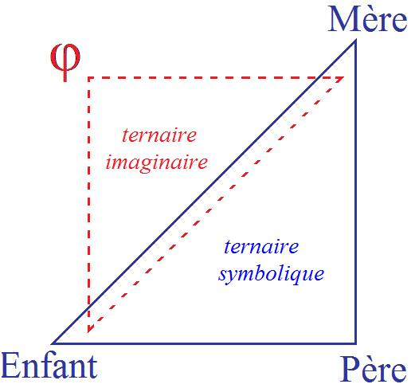
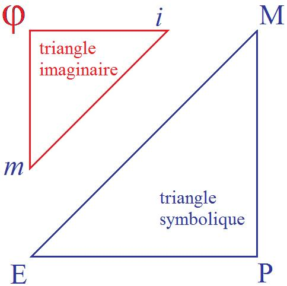
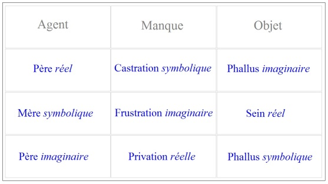
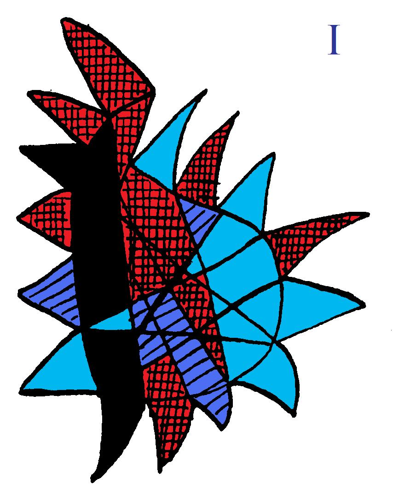
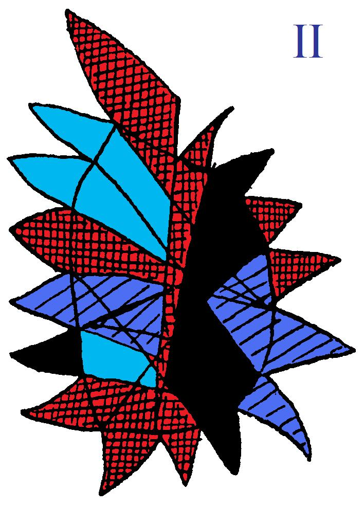

# Leçon 15 | 12 Mars 1958

<!-- source-url: http://staferla.free.fr/S5/S5 FORMATIONS .docx -->
<!-- seminar: s5 -->
<!-- lesson: 15 -->

<!-- id: s5-15-0001 -->

Vous savez ce que nous essayons de faire ici : c’est à savoir, dans *ces difficultés* et dans *ces impasses*, dans *ces contradictions* qui sont le tissu de votre pratique - c’est le moindre présupposé de notre travail que vous vous en aperceviez - d’essayer de vous ramener toujours au point où *ces impasses* et *ces difficultés* puissent à la fois vous apparaître
dans leur véritable portée, et où de fait, vous les éludez en vous repor­tant à ces *théories partielles*, voire ces *escamotages*, ces *glissements de sens* dans les termes mêmes que vous employez, qui sont aussi le lieu de tous les alibis.

<!-- id: s5-15-0002 -->

Nous avons la dernière fois parlé *du désir* et *de la jouissance*, je voudrais vous montrer aujourd’hui, dans un progrès
dans le texte même de ce que sur un point apporte FREUD par son observation, les difficultés que cela pose
à ceux qui suivent, et la façon dont, en essayant de serrer de plus près les choses, à partir d’ailleurs de *certaines exigences préconçues*, quelque chose se dégage qui va plus loin dans le sens de la difficulté, et comment peut-être nous pouvons faire un troisième pas. Il s’agit nommément de FREUD, à propos de *la position phallique* chez la femme,
ou plus exactement de ce qu’il appelle *la phase phallique*.

<!-- id: s5-15-0003 -->

Je rappelle ce sur quoi nous sommes arrivés, ce sur quoi nous avons mis l’accent, ce que veut dire ce que
dans nos trois ou quatre dernières séances nous avons com­mencé d’articuler*, ce désir* qui comme tel et nommément est mis au cœur de la médiation de l’expérience analytique, nous l’avons ici formulé comme de *ramasser*, de *concentrer,* ce que nous avons dit comme une « *demande signifiée*  ».

<!-- id: s5-15-0004 -->

Voici deux termes qui n’en font qu’un, également :

<!-- id: s5-15-0005 -->

- « *je demande* »

<!-- id: s5-15-0006 -->

- et «* je vous signifie ma demande* », comme on dit : « *je vous signifie un ordre* », « *je vous signifie un arrêt* ».
  Cette « *demande* » donc implique :

<!-- id: s5-15-0007 -->

- l’*autre*, celui de qui il est exigé,

<!-- id: s5-15-0008 -->

- mais aussi celui pour qui cette *demande* a un sens, un *Autre* qui - entre autres dimensions - a celle d’être *le lieu* où ce signifiant a sa portée.

<!-- id: s5-15-0009 -->

Ceci nous le savons déjà. Le deuxième terme de « *demande signifiée*  », au sens où je vous signifie quelque chose,
je vous signifie ma volonté, c’est là qu’est le point important auquel nous avons songé spécialement.
Maintenant ce « *signifié*  » implique dans le sujet *l’action structurante de signifiants* constitués, par rapport au besoin,

<!-- id: s5-15-0010 -->

par rapport à ce désir, dans une altération essen­tielle : par rapport au besoin, cette altération est constituée

<!-- id: s5-15-0011 -->

par l’entrée du *désir* dans *la demande*.

<!-- id: s5-15-0012 -->

Je m’arrête un instant pour faire une parenthèse. Nous avons jusqu’à présent, et pour une raison de temps
et d’économie, laissé de côté cette année - où pourtant nous parlons des *formations de l’inconscient - le rêve*.
Vous savez l’essentiel de l’affirmation de FREUD concernant le rêve, c’est que : *le rêve exprime un désir.*
Mais en fin de compte, nous n’avons même pas commencé à nous demander ce que c’est que ce désir du rêve,
si ce désir dont nous parlons, et il y en a plus d’un dans le rêve, ce sont *les désirs du jour* qui en donnent l’occasion,
le matériel, et chacun sait que ce qui nous importe, c’est le désir inconscient.

<!-- id: s5-15-0013 -->

Ce désir inconscient, pourquoi en somme FREUD l’a-t-il reconnu dans le rêve ? Au nom de quoi ?
En quoi est-il reconnu ? Il n’y a *apparemment* manifestement rien dans le rêve, qui corresponde à ce par quoi un désir se manifeste grammaticalement. Il n’y a aucun *texte de rêve*, si ce n’est *apparemment*, c’est-à-dire devant être *traduit*
*dans une articulation plus profonde*. Mais au niveau de cette articulation qui est masquée, qui est latente, qu’est-ce qui

<!-- id: s5-15-0014 -->

dis­tingue, qu’est-ce qui met l’accent *sur ce qu’articule* le rêve ? Bien sûr, rien, *apparem­ment*.

<!-- id: s5-15-0015 -->

Observez qu’en fin de compte, dans le rêve, ce que FREUD reconnaît comme désir :

<!-- id: s5-15-0016 -->

- c’est bien par ce que je vous dis, à savoir par l’altération du besoin que ceci se signale,

<!-- id: s5-15-0017 -->

- c’est en tant que ce qui au fond est masqué, articulé dans quelque chose qui le transforme.
  Qui le transforme en quoi ? En ceci : que *cela passe par un certain nombre de modes, d’images qui sont là en tant que signifiants*.

<!-- id: s5-15-0018 -->

Cela nécessite donc l’entrée en jeu de toute une structure qui sans doute est *la structure du sujet*, pour autant que doivent y opérer un certain nombre d’instances. Mais cette *structure du sujet*, nous ne la reconnaissons qu’à travers
ce fait que ce qui passe dans le rêve est soumis aux modes et *aux transformations du signifiant*, *aux structures de la métaphore et de la métonymie, de la condensation et du déplace­ment.*

<!-- id: s5-15-0019 -->

Ici, ce qui donne la loi de l’expression du désir dans le rêve, c’est bien *la loi du signifiant* : c’est à travers une exégèse de ce qui est particulièrement articulé dans un rêve que nous décelons ce quelque chose qui est quoi, en fin de compte ?
Quelque chose que nous supposons vouloir faire reconnaître, quelque chose qui participe à une *aventure primordiale*, qui est là inscrit et qui s’articule si nous le reportons tou­jours à quelque chose d’originel qui s’est passé dans l’enfance et qui a été refoulé. C’est à cela que nous donnons en fin de compte *la primauté de sens* dans ce qui s’articule
dans le rêve : c’est que quelque chose là, se présente qui est tout à fait der­nier quant à *la structuration du désir du sujet*.

<!-- id: s5-15-0020 -->

Nous pouvons dès maintenant l’arti­culer : c’est le désir, l’aventure primordiale de ce qui s’est passé autour d’un désir qui est *le désir infantile*, son désir essentiel qui est *le désir du désir de l’Autre*, ou *le désir d’être désiré*. C’est ce qui s’est *marqué*, *inscrit* dans le sujet autour de cette aventure, qui reste là, permanent, sous-jacent, et qui donne le dernier mot
de ce qui dans le rêve nous intéresse en tant qu’un désir inconscient, qui s’exprime à travers quoi ?
À travers le masque de ce qui occasionnellement aura donné au rêve son matériel, avec quelque chose qui ici nous est signifié à travers les conditions particulières qu’impose toujours au *désir* *la loi du signifiant*.

<!-- id: s5-15-0021 -->

Ce que j’essaye ici de vous enseigner, c’est à substituer à tout ce qui dans la théo­rie est plus ou moins confus parce que toujours partiel, à savoir à la mécanique, à l’économie des gratifications, des soins, des fixations, des agressions,
cette notion fondamentale de la dépendance primordiale du sujet par rapport au désir de l’Autre, de ce qui s’est structuré toujours *par l’intermédiaire* de ce mécanisme qui fait que le désir du sujet est déjà en tant que tel, modelé

<!-- id: s5-15-0022 -->

par les conditions de la demande, ins­crit au fur et à mesure de l’histoire du sujet dans sa structure : les péripéties,

<!-- id: s5-15-0023 -->

les ava­tars de la constitution de ce désir, en tant qu’il est soumis à *la loi du désir de l’Autre*, fait si l’on peut dire,
du plus profond désir du sujet, de celui qui reste suspendu dans l’inconscient, la somme, l’intégrale,
dirions-nous, de ce grand D, de ce désir de l’Autre.

<!-- id: s5-15-0024 -->

C’est seulement cela qui peut donner un sens à l’évolution que vous connaissez de l’analyse, ce qui a fini par mettre tellement d’accent sur ce rapport primordial à la mère au point de paraître éluder toute la dialectique ultérieure,
voire la dialectique œdipienne. Il y a quelque chose qui va à la fois dans un sens juste et qui le formule à côté :
ce n’est pas seulement la frustration en tant que telle, à savoir un plus ou moins de réel qui est donné ou qui n’a pas été donné au sujet, qui est le point important, c’est ce en quoi le sujet a visé, a repéré ce désir de l’Autre qui est

<!-- id: s5-15-0025 -->

le désir de la mère. Et par rap­port à ce désir, c’est lui faire reconnaître ou passer, s’être offert à devenir, par rapport à quelque chose qui est un *x* de désir chez la mère, à devenir, ou non, celui qui répond, à deve­nir, ou non, l’être désiré.

<!-- id: s5-15-0026 -->

Ceci est essentiel car à le négliger tout en l’approchant, à pénétrer aussi près que possible par des voies d’abord aussi proches que possible d’accès de ce qui se passe chez l’enfant - vous le savez, Mélanie KLEIN a découvert beaucoup de choses - mais à le formuler simplement si l’on peut dire dans l’affrontement, la confrontation du sujet, de l’enfant, au personnage maternel, elle aboutit à cette sorte de relation vrai­ment spéculaire, en miroir, qui fait que le corps,

<!-- id: s5-15-0027 -->

si l’on peut dire - car c’est déjà très frappant, c’est au premier plan - le corps maternel devient en quelque sorte

<!-- id: s5-15-0028 -->

l’*en­ceinte* et l’*habitacle* de ce qui peut s’y localiser, s’y projeter *des pulsions* de l’enfant, *ces pulsions* étant elles-mêmes motivées par l’agression d’une déception fondamen­tale.

<!-- id: s5-15-0029 -->

Et en fin de compte, dans cette dialectique rien ne peut nous sortir d’un méca­nisme de projection illusoire,

<!-- id: s5-15-0030 -->

d’une construction du monde à partir d’une sorte d’autogenèse de fantasmes primordiaux. La genèse de l’extérieur
en tant que lieu du « *mauvais* » reste purement artificielle et soumet en quelque sorte toute l’accession ultérieure
à la réalité à une pure dialectique de fantaisie.

<!-- id: s5-15-0031 -->

Il faut introduire, pour compléter cette dialectique kleinienne, cette notion que *l’extérieur* pour le sujet *est donné d’abord* :

<!-- id: s5-15-0032 -->

- non pas comme quelque chose qui se pro­jette de l’intérieur du sujet, de ses pulsions,

<!-- id: s5-15-0033 -->

- mais *comme la place, le lieu où se situe le désir de l’Autre*, et où le sujet a à aller le rencontrer.

<!-- id: s5-15-0034 -->

Ceci est essentiel, et c’est la seule voie par où nous pouvons trouver la solution aux *apories* qu’engendre cette voie kleinienne qui s’est montrée si féconde par beau­coup d’endroits, mais qui aboutit à faire s’évanouir, à éluder complètement, ou à reconstruire, d’une façon en quelque sorte implicite quand elle-même ne s’en aper­çoit pas,

<!-- id: s5-15-0035 -->

mais d’une façon également illicite parce que non motivée, que la dialec­tique primordiale du désir telle que FREUD l’a découverte, dialectique freudienne, est dans *un rapport tiers*, fait intervenir un *au-delà de la mère*, voire, à travers elle,

<!-- id: s5-15-0036 -->

la pré­sence du personnage désiré ou rival, mais du *personnage tiers* qu’est le père.

<!-- id: s5-15-0037 -->

En fin de compte, c’est ici que se justifie le schéma que j’essayais de vous donner en vous disant qu’il faut poser
la *triade symbolique fondamentale*, à savoir *la mère, l’enfant et le père*, en tant que *l’absence ou la présence de la mère offre à l’enfant* - ici posé comme terme *symbolique*, ce n’est pas le sujet simplement de par l’introduc­tion de *la dimension signifiante -*

<!-- id: s5-15-0038 -->

offre à l’enfant, par la seule introduction du signi­fiant, du *terme symbolique*, *le fait que l’enfant sera ou non un enfant demandé*.

<!-- id: s5-15-0039 -->

> 

<!-- id: s5-15-0040 -->

Et ce troisième terme, essentiel, qui est en quelque sorte :

<!-- id: s5-15-0041 -->

- ce qui permet tout cela ou l’interdit,

<!-- id: s5-15-0042 -->

- ce qui se pose au-delà de cette *absence* ou *présence* de la mère en tant que *sens*, *présence signifiante*,

<!-- id: s5-15-0043 -->

- ce qui lui permet ou non de se manifester,
  …c’est par rapport à cela que dès que *l’ordre signifiant* entre en jeu, le sujet a à se situer.

<!-- id: s5-15-0044 -->

Le sujet, lui, il tend sa vie concrète et réelle, bien sûr dans quelque chose qui d’ores et déjà comporte des désirs
au sens *imaginaire*…

<!-- id: s5-15-0045 -->

- au sens de la capture,

<!-- id: s5-15-0046 -->

- au sens où des images le fascinent,

<!-- id: s5-15-0047 -->

- au sens où par rapport à ces images il a à se sentir *comme moi, comme centre, comme maître* ou comme dominé
  …ce *rapport imaginaire* où, vous le savez, chez l’homme joue avec un accent primordial *l’image de soi*, *l’image du corps*
  qui vient en quelque sorte tout dominer.

<!-- id: s5-15-0048 -->

Bien sûr cette électivité de l’image chez l’homme est quelque chose de profon­dément lié au fait qu’il est ouvert à cette *dialectique du signifiant* dont nous parlions. Là, la réduction, si l’on peut dire, de l’image captivante à cette image centrale fon­damentale de *l’image du corps* n’est pas sans lien avec ce rapport fondamental du sujet à *la triade signifiante*.
Mais ce rapport à *la triade signifiante* introduit *ce troi­sième terme* pour le sujet, ce *troisième terme* par quoi le sujet,
au-delà de ce rapport duel, de ce rapport de captivation à l’image, *le sujet*, si je puis dire, *demande à être signifié*.

<!-- id: s5-15-0049 -->

C’est pour cela qu’il y a aussi sur le plan de *l’imaginaire* trois pôles - comme dans la constitution minimale
du *champ symbolique* - au-delà de *moi* et de *mon image*. De par le fait que j’ai à entrer dans les conditions du signifiant,
il y a un point, quelque chose qui doit marquer que mon désir doit être *signifié* pour autant qu’il passe nécessairement par une *demande* que je signifie sur *le plan symbolique*.

<!-- id: s5-15-0050 -->

Il y a, en d’autres termes, l’exigence d’un *symbole général* de cette marge qui me sépare tou­jours de mon désir,

<!-- id: s5-15-0051 -->

qui fait mon désir être toujours marqué de cette altération par l’entrée dans le signifiant. Il y a un *symbole général*
de cette marge, de ce manque fondamental nécessaire à introduire mon désir dans le signifiant, à en faire le désir auquel j’ai affaire dans la dialectique analytique. Ce *symbole* est ce par quoi le *signi­fié* est désigné en tant qu’il est toujours, *signifié altéré*, voire *signifié à côté*. C’est cela que nous constatons dans le schéma que je vous donne :

<!-- id: s5-15-0052 -->

<!-- id: s5-15-0053 -->

Ceci est dans le sujet au niveau de l’*imaginaire* :

<!-- id: s5-15-0054 -->

- ici son *image* \[*i*\],

<!-- id: s5-15-0055 -->

- ici le point \[*m*\] où se constitue le *moi*,

<!-- id: s5-15-0056 -->

- ici je vous situe la lettre ϕ, en tant qu’elle est le *phallus*.

<!-- id: s5-15-0057 -->

Il est impossible de déduire la fonction constituante du *phallus*, en tant que signifiant dans toute la dialectique
de l’introduction du sujet à son existence pure et simple et à sa position sexuelle, si nous n’en faisons pas ceci :
qu’il est *le signifiant fondamental par quoi le désir du sujet a à se faire reconnaître* comme tel, qu’il s’agisse de l’homme
ou qu’il s’agisse de la femme.

<!-- id: s5-15-0058 -->

Cela se traduit en ce que, quel que soit le désir, il faut qu’il ait dans le sujet cette référence que c’est le désir du sujet sans doute, mais en tant

<!-- id: s5-15-0059 -->

- que le sujet lui-même a reçu sa signification,

<!-- id: s5-15-0060 -->

- que le sujet, dans son pouvoir de sujet, doit tenir ce pouvoir d’un signe, et que ce signe, il ne l’obtient qu’à se mutiler de quelque chose par le manque duquel tout sera à valoir.

<!-- id: s5-15-0061 -->

Ce n’est pas une chose déduite, c’est donné par *l’expérience analytique*, ceci est l’essentiel de la découverte de FREUD.

<!-- id: s5-15-0062 -->

Ceci est ce qui fait que FREUD[^42], écrivant en 1931 [*Über die weibliche Sex**ualität*](#Freud_weibliche_Sexualität12_03), nous affirme ce quelque chose…

<!-- id: s5-15-0063 -->

- qui sans doute au premier abord *est problé­matique*,

<!-- id: s5-15-0064 -->

- qui sans doute *est insuffisant*,

<!-- id: s5-15-0065 -->

- qui sans doute *demande une élaboration*
  …qui appelle les réponses de toutes les *psychanalystes *: d’abord féminines : Hélène DEUTSCH, Karen HORNEY
  et bien d’autres, et Mélanie KLEIN, et Josine MÜLLER, et là-dessus, résumant tout cela et l’articulant d’une façon qui semble plus ou moins compatible avec l’articulation de FREUD, JONES répond.

<!-- id: s5-15-0066 -->

C’est ce que nous allons examiner aujourd’hui. Prenons *la question* au point où elle est le plus *paradoxale*.
Le paradoxe se présente d’abord, si l’on peut dire, sur le plan d’une sorte d’observation naturelle.
C’est en naturaliste que FREUD nous dit :

<!-- id: s5-15-0067 -->

« *Ce que me montre mon expérience, c’est que chez la femme aussi, et pas seulement chez l’homme,*
*ce phallus est au centre du développement libidinal.* »

<!-- id: s5-15-0068 -->

S’agissant de l’homme il nous a montré, conformément à *la formule générale* que j’essayais de vous donner à l’instant :

<!-- id: s5-15-0069 -->

- que l’introduction dans la dialectique va lui permettre de *prendre place, de prendre rang* dans cette transmission des types humains qui lui permettra de devenir à son tour le père,

<!-- id: s5-15-0070 -->

- que rien ne se réalisera sans ce que j’ai appelé à l’instant cette « *mutilation fondamentale* » grâce à quoi *le phallus* va devenir *le signifiant du pouvoir*, *le signifiant*, *le sceptre*, mais aussi ce quelque chose grâce à quoi cette virilité pourra être assumée.

<!-- id: s5-15-0071 -->

Bien sûr, jusque-là nous avons compris FREUD. Mais il va plus loin et il nous montre comment au centre
de *la dialectique féminine* le même *phallus* se produit. Ici quelque chose paraît s’ouvrir béant, pour autant que
jusqu’à présent c’est en termes de *lutte*, de *rivalité biologique* que nous avons pu, à la rigueur, comprendre l’introduction de l’homme par *le complexe de castration* dans son accession à la qualité d’homme.

<!-- id: s5-15-0072 -->

Chez la femme, cela assurément présente un paradoxe, et FREUD d’abord nous le dit purement et simplement comme un fait d’observation : ce qui paraît coïncider là aussi avec quelque chose qui se présenterait donc comme tout ce qui est observé, comme faisant partie de la nature, comme naturel. C’est bien ainsi en effet qu’il paraît
nous présenter les choses quand il nous dit que la fille, comme le garçon, d’abord désire la mère.

<!-- id: s5-15-0073 -->

Disons les choses comme elles sont écrites : il n’y a qu’une seule façon de désirer, la fille se croit d’abord pourvue d’un *phallus*, comme elle croit aussi sa mère pourvue d’un *phallus*. Et c’est ce que cela veut dire que l’évolution *naturelle* des pul­sions :

<!-- id: s5-15-0074 -->

- fait que, de transfert en transfert à travers les phases instinctuelles, c’est à quelque chose qui a la forme du sein par l’intermédiaire d’un certain nombre d’autres formes

<!-- id: s5-15-0075 -->

- aboutit à ce fantasme phallique par où, en fin de compte, c’est en position masculine que la fille se présente par rapport à la mère et que quelque chose de complexe, de plus complexe pour elle que pour le garçon, doit intervenir pour qu’elle reconnaisse sa position féminine.

<!-- id: s5-15-0076 -->

Elle est supposée, mais par rien qui soit dans le principe, elle est supposée, dans l’articulation de FREUD,
*manquer* au départ cette reconnaissance de *la position féminine*. Ce n’est pas là un mince paradoxe que de nous proposer quelque chose qui va autant à l’envers de la nature, qui après tout nous suggérerait une sorte de symétrie par rapport à la position du garçon, et quelqu’un a parlé du vagin comme bouche vaginale.

<!-- id: s5-15-0077 -->

Nous avons des observations qui nous permettent d’affirmer même - et je dirai *à l’encontre* des données freudiennes -
qu’il y a des expériences vécues primitives dont nous pouvons retrouver la trace primordiale chez le jeune sujet,
et qui montrent, contrairement à l’affirmation de cette méconnaissance primitive, que quelque chose peut être mu
par contrecoup chez le sujet - au moins semble-t-il - au moment de l’opération du nourrissage.

<!-- id: s5-15-0078 -->

Je veux dire chez la petite fille encore à la mamelle qui montre quelque émotion, sans doute vague,
mais dont il n’est pas absolument immotivé de la rapporter à une émotion corporelle profonde qu’il nous est
sans doute à travers les souvenirs difficile de localiser mais qui permettrait en somme l’équation,
par une série de transmissions, de la bouche du nourrissage à la bouche vaginale, comme par ailleurs, à l’état achevé, développé de la féminité, cette fonction d’organe absorbant ou même suceur est quelque chose de repérable
dans l’expérience, qui fournirait en quelque sorte la continuité par où, s’il ne s’agissait que d’une migration, si l’on peut dire, de la pulsion érogène, nous verrions tracée la voie royale de l’évolution de la féminité au niveau biologique.

<!-- id: s5-15-0079 -->

Et c’est bien là ce quelque chose en effet dont JONES se fait l’avocat et le théoricien quand il pense qu’il est impossible pour toutes sortes de raisons de principe d’admettre que l’évolution de la sexualité chez la femme
serait quelque chose de voué à ce détour et à cet artificialisme dont FREUD fait l’hypothèse.
Il nous propose donc une théorie qui s’oppose en quelque sorte point par point à ce que FREUD, lui,

<!-- id: s5-15-0080 -->

nous articule comme une donnée de l’observation, nous propo­sant la phase phallique de la petite fille comme reposant sur *une pulsion* dont il nous explique et dont il nous démontre les appuis naturels dans deux éléments :

<!-- id: s5-15-0081 -->

- le premier étant celui - admis - de *bisexualité biologique primordiale*, mais il faut bien le dire, *purement théorique*, lointaine, et dont on peut très bien dire avec JONES qu’après tout elle est assez loin de notre accès.

<!-- id: s5-15-0082 -->

- Mais il y a autre chose : la présence d’une amorce de l’organe phallique, l’organe clitoridien des premiers plaisirs, liés chez la petite fille à la masturbation clitoridienne et qui peut donner en quelque sorte l’amorce du fan­tasme phallique qui joue le rôle décisif que nous dit FREUD.

<!-- id: s5-15-0083 -->

Et c’est bien ce que FREUD fait : la phase phallique est une *phase phallique clitoridienne*, le *pénis fantas­matique*

<!-- id: s5-15-0084 -->

est une exagération du petit pénis que donne effectivement l’anatomie féminine. C’est dans la déception, et telle qu’elle est - la sortie engendrée par cette déception - pourtant, pour FREUD - fondée dans un mécanisme naturel,

<!-- id: s5-15-0085 -->

qu’il nous donne le res­sort de l’entrée de la petite fille dans sa position féminine.

<!-- id: s5-15-0086 -->

Et c’est à ce moment, nous dit-il, que le *complexe d’Œdipe* joue le rôle *normatif* qu’il doit jouer essentiellement,
mais il le joue chez la petite fille à l’inverse de chez le garçon : le *complexe d’Œdipe* lui donne l’accès à ce pénis
qui lui manque par l’intermédiaire de l’appréhension du pénis du mâle :

<!-- id: s5-15-0087 -->

- soit qu’elle le découvre chez quelque compagnon,

<!-- id: s5-15-0088 -->

- soit qu’elle le situe ou qu’elle le découvre également chez le père.

<!-- id: s5-15-0089 -->

C’est par l’intermédiaire du désappointement, de la désillusion de quelque chose chez elle, par rapport à cette étape fantasmatique de la phase phallique, que la petite fille est introduite dans le *complexe d’Œdipe*, comme l’a théorisé
une des premières analystes à suivre FREUD sur ce terrain, Mme LAMPL DE GROOT.

<!-- id: s5-15-0090 -->

Elle l’a très jus­tement remarqué, la petite fille entre dans le complexe par la phase inversée du *complexe d’Œdipe* :
elle se présente d’abord dans le *complexe d’Œdipe* dans une relation à la mère, et c’est dans l’échec de cette relation

<!-- id: s5-15-0091 -->

à la mère qu’elle trouve la rela­tion au père, avec ce qui par la suite se trouvera ainsi normativé par l’équivalence
de ce pénis qu’elle ne possédera jamais, avec l’enfant qu’elle pourra en effet avoir, qu’elle pourra donner à sa place.

<!-- id: s5-15-0092 -->

Observons ici un certain nombre de repères par rapport à ce que je vous ai ensei­gné à distinguer : ce *penisneid*

<!-- id: s5-15-0093 -->

qui se trouve être ici l’articulation essentielle de *l’en­trée de la femme dans la dialectique œdipienne*, ce *penisneid* comme tel
et donc comme *la castration chez l’homme*, se trouve au cœur de cette *dialectique* qui, sans doute, à travers les critiques que je vais vous formuler par la suite - celles qu’a appor­tées JONES - va être remis en question. Et bien entendu,
il paraît du dehors, quand on commence à aborder la théorie analytique, qu’elle se présente comme quelque chose d’artificiel. Arrêtons-nous un instant d’abord pour souligner, ce qu’il convient de faire : quelle ambiguïté du terme
tel qu’il est employé à travers les divers temps de cette *évo­lution œdipienne* chez la fille !

<!-- id: s5-15-0094 -->

La discussion de JONES le pointe d’ailleurs : le *Penisneid,* qu’est-ce que c’est ? Il est trois modes au travers de
cette entrée et de cette sortie du *complexe d’Œdipe* qui nous sont montrés par FREUD autour de la phase phallique :

<!-- id: s5-15-0095 -->

- Il y a *penisneid* au sens du *fantasme*, à savoir ce vœu, ce souhait longtemps conservé, quelquefois conservé toute la vie - et FREUD insiste assez sur le caractère irré­ductible de ce fantasme quand c’est lui qui se maintient au premier plan - ce fantasme que le clitoris soit un pénis. C’est un premier sens du *penisneid.*

  <!-- -->

<!-- id: s5-15-0096 -->

- Il y a un autre sens : celui du *penisneid* tel qu’il intervient quand ce qui est désiré c’est le pénis du père, c’est-à-dire ce moment où le sujet voit dans la réalité du pénis - *là où il est, le point où aller en chercher la possession -* non seulement que l’*œdipe* est la situation interdite, mais \[aussi\] impossibilité physiologique dont *la situation, le développement de la situation* l’a frustrée. Puis il y a la fonction de cette évolution en tant qu’elle fait surgir chez la petite fille le *fantasme* d’avoir un enfant du père, c’est-à-dire d’avoir ce pénis sous une forme symbolique.

<!-- id: s5-15-0097 -->

Rappelez-vous maintenant qu’à propos du *complexe de castration* je vous ai appris à distinguer entre *castration, frustration et privation.* De *ces trois formes*, les­quelles correspondent respectivement à chacun de ces trois termes ? Je vous l’ai dit :

<!-- id: s5-15-0098 -->

- *Une frustration est quelque chose d’imaginaire portant sur un objet bien réel*. C’est bien en cela que *le fait que la petite fille ne reçoive pas le pénis du père est une frus­tration*.

<!-- id: s5-15-0099 -->

- *Une privation est quelque chose de tout à fait réel, et qui ne porte que sur un objet symbolique*, à savoir que quand la petite fille n’a pas d’enfant du père, en fin de compte il n’a jamais été question qu’elle en ait. Elle est bien incapable d’en avoir. L’enfant d’ailleurs n’est là que comme *symbole*, et *symbole* précisément de ce dont elle est réellement frustrée, et c’est bien en effet à titre de *privation* que *ce désir de l’enfant du père* intervient à un moment de l’évolution.

<!-- id: s5-15-0100 -->

- Reste donc ce qui correspond à *la castration, à savoir ce qui symboliquement ampute le sujet de quelque chose d’imaginaire* et, dans l’occasion, *un fantasme* correspond bien.

<!-- id: s5-15-0101 -->

<!-- id: s5-15-0102 -->

Et FREUD est dans la juste ligne ici quand il nous dit que la posi­tion de la petite fille par rapport à son clitoris,
c’est qu’à un moment donné elle doit renoncer à ce clitoris qu’elle conservait à titre d’espoir, à savoir que tôt ou tard il deviendrait quelque chose d’aussi important qu’un pénis.

<!-- id: s5-15-0103 -->

C’est bien *à ce niveau que structurellement se trouve le correspondant de la castration*, si vous vous rappelez ce que j’ai crû devoir articuler quand je vous ai parlé de *la castration*, au point électif où elle se manifeste, c’est-à-dire chez le garçon.
On peut discuter qu’effectivement tout chez la fille tourne autour de *la pulsion clitoridienne*, on peut sonder *les détours*
de l’aventure œdipienne, comme vous allez le voir maintenant à travers la critique de JONES, mais nous ne pouvons pas au départ ne pas remarquer la rigueur, au point de vue structurel, du *point* que FREUD nous désigne en tant que *correspondant de la castration*, c’est bien quelque chose qui doit se trouver au niveau de ce qui se passe, de ce qui peut
se passer comme relation à un *fantasme* et en tant que cette relation à un *fantasme* prend valeur signifiante.
C’est à ce point là que doit se trouver *le point symétrique*.

<!-- id: s5-15-0104 -->

Il s’agit maintenant de comprendre *comment cela se produit*. Ce n’est pas, bien entendu, parce que ce point-là est utilisé, que c’est ce point-là qui nous donne toute *la clé de l’affaire*. La critique de JONES nous *la* donne apparemment dans FREUD, pour autant que FREUD a l’air de nous montrer là une histoire d’anomalie pulsionnelle, et c’est bien
ce qui va révolter, faire s’insurger un certain nombre de sujets, précisément au titre de préconceptions biologiques.

<!-- id: s5-15-0105 -->

Mais vous allez voir ce que, dans l’articulation même de leurs objections, ils arri­veront à dire. Ils sont forcés

<!-- id: s5-15-0106 -->

par la nature des choses d’articuler un certain nombre de points, de traits qui sont justement ceux qui vont
nous permettre de faire le pas en avant : de bien comprendre ce dont il s’agit, d’aller au-delà de *la théorie de la pulsion naturelle*, de voir effectivement que le *phallus* intervient bel et bien dans ce que je vous ai dit d’abord ici, dans ce que je peux appeler les prémisses de la leçon d’au­jourd’hui et qui n’est rien d’autre que le rappel de ce que nous venons par d’autres voies de cerner, à savoir que *le phallus* intervient ici en tant que *signifiant*.

<!-- id: s5-15-0107 -->

Mais venons-en maintenant à la réponse, à l’articulation de JONES. Il y a 3 *article*s importants de JONES là-dessus :

<!-- id: s5-15-0108 -->

- *l’un qui s’appelle* *[Early female sexuality](#Jones_Early_female_sexuality)* [^43]*, écrit en* 1935*, et dont nous allons parler aujourd’hui*,

<!-- id: s5-15-0109 -->

- *qui avait été précédé de l’article sur* [*The phallic phase*](#Jones_the_phallic_phase) [^44], *lu devant le XIIème Congrès International de Wiesbaden en* 1932,

<!-- id: s5-15-0110 -->

- *et enfin* [*Early dev**elopment of female sexuality*](#Jones_Early_female_sexuality) [^45], *lu devant le Xème Congrès en septembre* 1927.

<!-- id: s5-15-0111 -->

C’est à celui-là que FREUD dans son article de 1931 fait allusion quand il réfute en quelques lignes - et je dois dire très dédaigneusement - les positions prises par JONES. Ce dernier, dans « *The Phallic Phase »*, essaye de répondre
et d’articuler sa position, en somme contre FREUD, tout en s’efforçant de rester le plus près possible de sa lettre.

<!-- id: s5-15-0112 -->

L’article, sur lequel je vais m’appuyer aujourd’hui, « *Early female sexuality »*, est extrê­mement significatif de ce que

<!-- id: s5-15-0113 -->

nous voulons démontrer. Il est aussi le point le plus avancé de l’articulation de JONES. Il se situe en 1935,
quatre ans après l’article de FREUD sur la sexualité féminine. Il a été prononcé à la demande de FEDERN,
qui était à ce moment là vice-président ou président de la Société viennoise, et c’est à Vienne qu’il a été apporté pour proposer au cercle viennois ce que JONES a formulé tout uni­ment comme étant le point de vue des Londoniens, c’est-à-dire ce qui d’ores et déjà se trouve centré autour de l’expérience kleinienne.

<!-- id: s5-15-0114 -->

JONES nous dit qu’il convient d’aborder par l’*expérience* qui est la seule à s’opposer, celle des Londoniens.

<!-- id: s5-15-0115 -->

Et il fait ses oppo­sitions d’une façon tellement plus tranchée que l’exposition y gagne en pureté, en clarté, en support à la discussion. Il fait un certain nombre de remarques, et *il y a tout inté­rêt à s’y arrêter* en se reportant le plus possible
au texte. Il fait remarquer d’abord que l’expérience nous montre qu’il est difficile, quand on s’approche de l’enfant,
de saisir cette prétendue position masculine qui serait celle de la petite fille à la phase phallique par rapport à sa mère.

<!-- id: s5-15-0116 -->

Plus on remonte vers l’ori­gine, plus nous nous trouvons confrontés à quelque chose qui, là, est critique.

<!-- id: s5-15-0117 -->

Je m’excuse si, en suivant ce texte, nous allons nous trouver devant un certain nombre d’objets qui, par rapport
à la ligne que j’essaye ici de vous dessiner, paraissent dans des positions quelquefois un peu latérales mais qui valent d’être relevées pour ce qu’elles révèlent.

<!-- id: s5-15-0118 -->

Les suppositions de JONES, je vous le dis tout de suite, sont essentiellement diri­gées vers quelque chose qu’il articule en clair à la fin de l’article : une femme est-elle un être « *born » -* c’est-à-dire « *né »* comme telle, *comme femme*, ou est-elle un être « *made », « fabriqué »* *comme femme* ? Et c’est là qu’il situe son interrogation, c’est là qu’il s’in­surge contre la position freudienne. Il y a deux termes qui vont être en quelque sorte le point vers lequel s’avance son cheminement :

<!-- id: s5-15-0119 -->

- quelque chose qui est issu d’une sorte de résumé des faits qui, dans l’expérience concrète auprès de l’enfant, permet soit d’objecter, soit quelquefois aussi de confirmer, mais dans tous les cas de corri­ger la conception freudienne.

<!-- id: s5-15-0120 -->

- Mais ce qui anime toute sa démonstration c’est ceci qu’il pose à la fin comme une *question*, une espèce de « *oui ou non* » qui pour lui exclurait de façon absolument rédhibitoire même un choix possible : il ne peut pas y avoir dans sa perspective une position telle que la moitié de l’humanité soit faite d’êtres qui en quelque sorte seraient *made,* c’est-à-dire fabriqués dans le défilé œdi­pien.

<!-- id: s5-15-0121 -->

Il ne semble pas remarquer que *le défilé œdipien*, en fin de compte, *ne fabrique pas moins* - s’il s’agit de cela - *des hommes*.
Néanmoins, le fait justement que *les femmes* y entrent, là, avec un bagage en somme qui n’est pas le leur, lui paraît constituer une différence suffisante avec le garçon, pour qu’il revendique quelque chose qui, dans sa substance,

<!-- id: s5-15-0122 -->

va consister à dire : c’est vrai que nous obser­vons chez la femme, chez la petite fille à un certain moment
de son évolution, quelque chose qui représente cette mise au premier plan, cette exigence, ce désir qui se manifeste
sous la forme ambiguë du *penisneid* et qui pour nous est si probléma­tique.

<!-- id: s5-15-0123 -->

Mais qu’est-ce que c’est ? C’est en cela que va consister tout ce qu’il va nous dire :

<!-- id: s5-15-0124 -->

- c’est une formation de défense,

<!-- id: s5-15-0125 -->

- c’est un détour,

<!-- id: s5-15-0126 -->

- c’est quelque chose, explique-t-il, de comparable à une phobie.

<!-- id: s5-15-0127 -->

Et la sortie de *la phase phallique*, c’est essentiellement quelque chose qui doit se concevoir comme guérison d’une phobie qui serait en somme une phobie très généralement répandue, une phobie normale, mais essen­tiellement du *même ordre* et du *même mécanisme*.

<!-- id: s5-15-0128 -->

Il y a là quelque chose…
vous le voyez, puisqu’en somme je prends le parti de sau­ter au cœur de sa démonstration

<!-- id: s5-15-0129 -->

…il y a là quelque chose qui pour nous est tout de même extraordinairement propice à notre réflexion, pour autant que vous vous souvenez peut-être encore de la façon dont j’ai essayé de vous articuler la fonction de la phobie.

<!-- id: s5-15-0130 -->

Si effectivement c’est bien ainsi que la relation de la petite fille au *phallus* doit être conçue, assurément nous nous rapprochons bien de la conception que j’essaye de vous donner, à savoir que c’est au titre d’un élément signifiant privilégié qu’intervient la relation dans l’*œdipe* de la petite fille au *phallus*.

<!-- id: s5-15-0131 -->

Est-ce à dire que nous allons nous rallier là-dessus à la position de JONES ? Sûre­ment pas !

<!-- id: s5-15-0132 -->

Si vous vous souvenez de la différence que j’ai faite entre phobie et fétiche, nous dirons qu’ici le *phallus*
joue plutôt le rôle de *fétiche* que le rôle d’*objet pho­bique*, mais ceci, nous y reviendrons ultérieurement.

<!-- id: s5-15-0133 -->

Reprenons l’entrée de JONES dans sa critique, son articulation, et disons d’où il part, d’où cette phobie va se constituer. Cette phobie pour lui, est une construction de défense contre quelque chose, contre un danger engendré par les pulsions primitives de l’enfant. De l’enfant, qu’il suit là au niveau de la petite fille, mais qui se trouve
à ce niveau dans la même position et qui a le même sort que le petit garçon. Mais il s’agit ici de la petite fille,
et il remarque donc qu’originellement le rapport de l’enfant - et c’est là-dessus que je me suis arrêté tout à l’heure
en vous disant que nous rencontrerions des choses tout à fait singulières - à la mère est une position masculine primitive. Il dit :

<!-- id: s5-15-0134 -->

« *Her mother she regards not as a man regards a woman, as a creature whose wishes to receive something it is a pleasure to fulfil.* »

<!-- id: s5-15-0135 -->

Elle est loin d’être comme un homme l’est à l’égard d’une femme, « *comme un homme considère une femme* »,
c’est-à-dire comme une créature dont accepter ou recevoir les désirs, comme un être dont accéder à ses désirs
et dont c’est un plaisir que de les combler[^46].

<!-- id: s5-15-0136 -->

Il faut reconnaître qu’amener à ce niveau une position aussi élaborée des rapports de l’homme et de la femme
est pour le moins paradoxal. Il est bien certain que quand FREUD parle de la position masculine de la petite fille,
il ne fait d’aucune façon état de cet effet le plus achevé - si tant est qu’il soit vraiment atteint - de la civi­lisation,

<!-- id: s5-15-0137 -->

où l’homme est là pour combler tous les désirs de la femme.

<!-- id: s5-15-0138 -->

Mais sous la plume de quelqu’un qui s’avance dans ce domaine avec des prétentions aussi natu­ralistes au départ,

<!-- id: s5-15-0139 -->

nous ne pouvons pas manquer de relever ceci comme témoignant d’une des difficultés du terrain, pour qu’il arrive
à achopper à ce point dans sa démonstration, et ceci est tout au début de sa démonstration, à savoir pour y opposer bien plutôt la position de l’enfant et non sans aucun doute *à juste titre*, non pas donc comme un homme ici,
mais il s’agit de *la mère* telle que la considère *l’enfant* :

<!-- id: s5-15-0140 -->

« *A person who has been successful in filling herself with just the things the child wants so badly*… »

<!-- id: s5-15-0141 -->

Vous avez reconnu là le pot de lait de la mère, comme \[la voit\] l’en­fant tel que le décrit Mélanie KLEIN, à savoir

<!-- id: s5-15-0142 -->

\- je traduis JONES :

<!-- id: s5-15-0143 -->

- « *comme une per­sonne qui a réussi*… », \[a person who has been successful\].

<!-- id: s5-15-0144 -->

Ce *successful* a toute sa portée parce qu’il implique dans le sujet maternel ce quelque chose…

<!-- id: s5-15-0145 -->

et JONES ne s’en aper­çoit pas

<!-- id: s5-15-0146 -->

…il implique qu’à calquer les choses sur le texte de ce qu’on trouve dans l’en­fant, c’est bien un être désirant dont il s’agit : la mère, puisqu’elle a été assez heureuse pour :

<!-- id: s5-15-0147 -->

- « *réussir à se remplir elle-même, avec juste les choses que l’enfant désire si vachement* [^47]... »

<!-- id: s5-15-0148 -->

> \[successful in filling herself with just the things the child wants so badly… \]

<!-- id: s5-15-0149 -->

À savoir ce matériel réjouissant des deux espèces de choses, solides et liquides.

<!-- id: s5-15-0150 -->

On ne peut méconnaître ce que Mélanie KLEIN nous montre à propos de ce qu’elle appelle dans ses *Contributions* [^48]

<!-- id: s5-15-0151 -->

« *l’œdipe ultra précoce de l’enfant* », rien que de nous représenter *l’expérience primitive* de l’enfant. Cette expérience primi­tive, sans doute y accède-t-on *à la lorgnette*, mais elle, elle le fait en s’approchant le plus près possible de la place
et en analysant les enfants de trois ou quatre ans. Et nous découvrons déjà chez eux un rapport à l’objet
qui est structuré sous cette forme que j’ai appelée « *l’empire du corps maternel* ».

<!-- id: s5-15-0152 -->

Ce champ de « *l’empire maternel* », avec ce qu’il comporte à l’intérieur…
que j’ai appelé par référence à l’histoire chinoise, *les royaumes combattants*
*…*l’enfant en donne des dessins qu’elle nous montre.

<!-- id: s5-15-0153 -->

 

<!-- id: s5-15-0154 -->

Car il est alors capable de dessiner en faisant figurer à l’intérieur tout ce qu’elle repère comme signifiants :

<!-- id: s5-15-0155 -->

les frères, les sœurs, les excré­ments, tout ce qui cohabite dans ce corps maternel, mais avec en plus
ce qu’elle nous permet de distinguer et ce qu’effectivement la dialectique du traitement per­met d’articuler

<!-- id: s5-15-0156 -->

comme étant *le phallus paternel,* à savoir *ce quelque chose qui d’ores et déjà serait introduit là* comme un élément

<!-- id: s5-15-0157 -->

à la fois particulièrement nocif et par­ticulièrement rival par rapport aux exigences de possession de cet enfant
à l’égard du contenu de ce corps.

<!-- id: s5-15-0158 -->

Il nous paraît également très difficile de voir là autre chose que des données qui accusent, qui approfondissent pour nous le caractère problématique de ces relations soi-disant naturelles : est-ce qu’au contraire nous ne les voyons pas
d’ores et déjà structurées par ce que j’ai appelé la dernière fois toute *une batterie signi­fiante*, montrant un rapport déjà établi avec elles et articulée d’une façon qu’aucune relation biologique naturelle ne puisse vraiment motiver ?

<!-- id: s5-15-0159 -->

Ainsi Melanie KLEIN introduit-elle dans la dialectique de l’enfant…
à savoir dans ce qui fait l’entrée en scène du *phallus* au niveau de cette expérience primitive
…cette référence qui est vraiment donnée par elle comme en quelque sorte lue dans ce que l’enfant *offre*.
Le propos n’en reste pas moins *assez stupéfiant*, l’introduction *du pénis comme étant un sein* plus accessible,
plus commode et en quelque sorte plus parfait, voilà ce qu’il faudrait admettre *comme un donné de l’expérience*.

<!-- id: s5-15-0160 -->

Bien sûr, si cela est donné, cela est valable. Mais il n’en reste pas moins que ce n’est nullement quelque chose, si l’on peut dire, qui aille de soi, que c’est quelque chose qui précisément en soi nous permet de poser la question de savoir ce qui peut rendre ce pénis effectivement, plus accessible, plus commode, plus jouissant que le sein primordial.
C’est bien là la question de *ce que signifie ce pénis*, à savoir de l’im­plication d’ores et déjà - par l’intermédiaire de quoi, c’est cela bien entendu qui va être mis en question - de l’introduction déjà de l’enfant dans *une dialectique signi­fiante*.

<!-- id: s5-15-0161 -->

Aussi bien d’ailleurs toute la suite de *la démonstration* de JONES ne fera-t-elle que poser d’une façon toujours plus pressante cette question, pour autant qu’il nous explique que la petite fille, après donc l’avoir eu, possiblement…
il ne tranche pas, mais c’est exigé par les données mêmes de son départ, et il tranche tout de même là-dedans pour simplement nous dire que *le phallus ne peut intervenir que comme moyen et alibi d’une sorte de défense*

<!-- id: s5-15-0162 -->

…il suppose donc qu’à l’origine, c’est par rap­port à une certaine appréhension primitive de son organe propre,
de son organe féminin, que la petite fille se trouve libidinalement intéressée.

<!-- id: s5-15-0163 -->

Mais il va tâcher de nous expliquer pourquoi il faut que cette appréhension de son vagin, elle la refoule.
Il nous dit bien sûr que c’est de nature à évoquer, dans le rapport de l’enfant féminin à son propre sexe, une anxiété plus grande que n’évoque chez le petit garçon le rapport avec son sexe, parce que l’organe est plus intérieur, plus diffus, plus profondément la source propre de ses premiers mouvements. Le clitoris ne jouera donc, articule-t-il…
Je suis sûr qu’il l’articule pour vous montrer les néces­sités impliquées dans ce qu’il formule d’une façon relativement naïve, à savoir que le clitoris, pour autant qu’il est extérieur, ne sert qu’à ce qu’on projette sur lui les angoisses.
Il est d’ailleurs plus facilement objet à réassurance de la part du sujet, qui pourra en éprouver, par ses propres manipulations, voire à la rigueur par la vue, le fait qu’il est toujours là. C’est ce que veut dire JONES.

<!-- id: s5-15-0164 -->

Et il manifestera que dans la suite ce sera toujours vers des objets plus extérieurs, à savoir vers son apparence,
vers son habillement, que la femme par la suite de son évolution portera ce qu’il appelle le besoin de réassu­rance. Autrement dit quelque chose dans l’angoisse est déplacé, ce qui permet de la tempérer en faisant porter son objet
sur quelque chose qui n’est pas le point, tout spé­cialement pour cela même méconnu, de son origine.

<!-- id: s5-15-0165 -->

Vous le voyez bien, ce dont il s’agit c’est que nous trouvons là une fois de plus la nécessité impliquée que ce soit bien à titre, dit JONES, de quelque chose d’extériorisable, de représentable, que vienne au premier plan le *phallus*
à titre d’élément, de terme limite, de point où s’arrête l’anxiété, et bien entendu, c’est là sa dialectique.

<!-- id: s5-15-0166 -->

Nous allons voir si elle est suffisante. C’est par cette dialectique qu’il admet que la phase phallique doit être présentée comme une position phobique, comme quelque chose qui, à l’enfant, permette en quelque sorte d’éloigner,
en la centrant sur quelque chose d’accessible, les craintes et les angoisses de rétorsion que ses propres désirs oraux
ou sadiques auront portées sur l’intérieur du corps de la mère et qui lui appa­raîtront aussitôt comme un danger capable de la menacer elle-même à l’intérieur de son propre corps.

<!-- id: s5-15-0167 -->

Telle est la genèse que donne JONES de ce qu’il appelle « *la position phallique en tant que phobie* ».

<!-- id: s5-15-0168 -->

C’est en tant assurément qu’organe fantasmé, mais accessible, extério­risé :

<!-- id: s5-15-0169 -->

- que le *phallus* entre en jeu,

<!-- id: s5-15-0170 -->

- que par la suite d’ailleurs, il est capable de redispa­raître de la scène parce que les craintes liées à l’hostilité pourront être tempérées, reportées également ailleurs, sur d’autres objets que la mère par exemple,

<!-- id: s5-15-0171 -->

- que l’érogénéité et l’anxiété, en tant qu’elles sont liées aux organes profonds, pourront, par le procès même d’un certain nombre d’exercices masturbatoires, également se dépla­cer et qu’en fin de compte, dit-il, la relation à l’objet féminin deviendra moins par­tielle, qu’elle pourra se déplacer sur d’autres objets,

<!-- id: s5-15-0172 -->

- que dans la suite l’angoisse en somme innommable, l’angoisse originelle liée à l’organe féminin - ce qui est, chez l’enfant, en fin de compte chez l’enfant fille, le correspondant des angoisses de cas­tration chez le garçon - pourra par la suite virer à la peur d’être abandonnée qui, aux dires de JONES, deviendra plus caractéristique de la psychologie féminine.

<!-- id: s5-15-0173 -->

Ce donc devant quoi nous nous trouvons est ceci. Pour le résoudre, voyez la position de FREUD, position d’observateur qui se pré­sente donc comme observation naturelle : la liaison à la phase phallique est de nature pulsionnelle, l’entrée dans la féminité se produit à partir d’une libido qui de sa nature - disons pour mettre les choses à leur point exact et non point dans la critique un peu caricaturale qu’en fait JONES - est active et qui aboutira
à la position féminine dans la mesure où cette position déçue arrivera par une série de transformations et d’équivalences à faire que le sujet demande et accepte de bien d’autres que du per­sonnage paternel, ce quelque chose qui viendra combler son désir.

<!-- id: s5-15-0174 -->

En fin de compte, le présupposé - d’ailleurs pleinement articulé par FREUD - est que l’exigence enfantine primordiale est, comme il dit, « *sans but ».* Ce qu’elle exige, c’est *tout,* et c’est par le développement de cette exigence, par ailleurs impossible à satisfaire, que l’enfant entre peu à peu dans une position plus normative. Il y a là assurément quelque chose qui, pour problématique qu’il soit, comporte cette ouverture qui va nous permettre d’articuler le problème dans les termes de *désir* et de *demande* qui sont ceux sur lesquels j’essaye ici, moi, de vous mettre l’accent.

<!-- id: s5-15-0175 -->

À cela, JONES répond : voilà une histoire naturelle, une observation de naturaliste qui n’est pas si naturelle que cela
et moi je vais vous la rendre plus naturelle. Il le dit formellement. L’histoire de la phobie phallique n’est qu’un détour dans le passage d’une position d’ores et déjà primordialement déterminée. La femme est *born,* elle est *née* comme telle, dans une position qui d’ores et déjà est celle de la posi­tion de *bouche*, d’une *bouche absorbante*, d’une *bouche suceuse*

<!-- id: s5-15-0176 -->

qu’elle va retrou­ver après la réduction de sa phobie, qui n’est qu’un simple détour par rapport à sa position primitive.

<!-- id: s5-15-0177 -->

Ce que vous appelez *pulsion phallique* est purement et simple­ment artificialisme d’une phobie décrite, évoquée chez l’enfant par son hostilité et son agression à l’endroit de la mère. Il n’y a là, dans un cycle essentiellement instinctuel,
qu’un pur détour et la femme rentrera ensuite de son plein droit dans sa position, qui est *une position vaginale*.

<!-- id: s5-15-0178 -->

Pour répondre à cela, j’essaye de vous articuler que le *phallus* est absolument inconcevable dans la dynamique,
la mécanique kleinienne, sinon impliqué d’ores et déjà comme étant *le signifiant du manque*, *le signifiant* de cette distance de la demande du sujet à son désir qui fait que pour que ce désir soit rejoint, une certaine déduction doit être faite
de cette entrée nécessaire dans le cycle signifiant.

<!-- id: s5-15-0179 -->

Et si la femme doit passer par ce signifiant, si paradoxal soit-il, c’est pour autant que ce dont il s’agit pour elle
n’est pas purement et simplement de réaliser une sorte de donnée primitive, une position purement et simplement formelle, mais d’entrer dans une dialectique - écartée chez l’homme par le fait de l’existence de signifiants,
par tous les interdits qui constituent la relation de l’*œdipe -* qui va la faire entrer dans le cycle des échanges de l’alliance et de la parenté, c’est-à-dire la faire devenir elle-même cet objet d’échange.

<!-- id: s5-15-0180 -->

Le fait que ce qui nous est démontré effectivement par toute analyse correcte de ce qui structure à la base cette relation œdipienne, c’est que la femme doit se pro­poser, ou plus exactement s’accepter elle-même comme un élément de ce cycle des *échanges*. Ce fait est quelque chose qui a en soi quelque chose d’infiniment plus énorme du point
de vue naturel que tout ce que nous avons pu remarquer jusqu’à présent d’anomalies dans son évolution instinctive
et qui, à ce titre, justifie bien en effet que nous devions en trouver *au niveau imaginaire*, au niveau du désir,
une sorte de représentant dans les voies détournées par où elle-même doit y entrer.

<!-- id: s5-15-0181 -->

Ce qui ponctue chez elle ce fait de devoir - comme l’homme d’ailleurs - s’inscrire dans le monde du signifiant,
c’est ce besoin envers un désir, envers quelque chose qui, en tant que signifié, devra rester toujours à une certaine distance, à une certaine marge de quoi que ce soit qui puisse se rapporter à un besoin naturel, pour autant que, précisément, pour être introduit dans cette dialectique, quelque chose de cette relation naturelle doit être amputé, doit être sacrifié. Et à quelle fin ? Pour que pré­cisément cela devienne l’élément *signifiant* même de cette introduction dans la *demande*.

<!-- id: s5-15-0182 -->

Mais quelque chose est assez - je ne dirai pas *surprenant*, mais va nous montrer le retour de cette nécessité
que je viens de vous dire, observée avec toute la brutalité de cette remarque *sociologique* fondée sur tout ce que nous savons et plus récemment articulée : *la nécessité pour une partie - une moitié effectivement - de l’humanité de devenir le signifiant de l’échange*. C’est bien ainsi que LÉVI-STRAUSS l’articule dans *Les structures élémentaires de la parenté* et par quoi *les femmes* entrent dans cette combinatoire : par les lois diversement agencées dans *les structures élémentaires* - assuré­ment beaucoup plus simplement mais avec des effets bien plus complexes - dans *les structures complexes de la parenté* \[...\]

<!-- id: s5-15-0183 -->

Ce que nous observons dans la dialectique de l’entrée de l’enfant dans ce système du signifiant, c’est en quelque sorte *l’envers* de ce passage de la femme comme objet signifiant dans ce que nous pouvons appeler, avec des guillemets,
« *la dialectique sociale* ». Car, bien entendu, le terme *social* doit être ici mis avec tout l’accent qui le montre dépendant justement de la structure signifiante et combinatoire. Ce que nous voyons à *l’envers* est ce résultat :
pour que l’enfant entre dans cette dialectique signifiante, qu’est-ce que nous observons ?

<!-- id: s5-15-0184 -->

Très précisément ceci : qu’il n’y a aucun autre désir dont il dépende plus étroitement et plus directement que du désir *de quoi* ? De *la femme*. Du *désir de la femme* en tant qu’il est précisément signifié par ce qui lui manque, et par le *phallus*.
Ce que je vous ai montré, c’est que tout ce que nous rencontrons comme achop­pement, comme accident,

<!-- id: s5-15-0185 -->

dans l’évolution de l’enfant - et ce, jusqu’au plus radical de ces achoppements et de ces accidents - est lié à ceci :
que l’enfant ne se trouve pas *seul* en face de la mère, mais en face de la mère et de quelque chose qui est justement
*le signifiant de ce désir*, à savoir le *phallus*.

<!-- id: s5-15-0186 -->

Nous nous trouvons ici devant quelque chose qui sera l’objet de ma leçon de la prochaine fois.
C’est que, de deux choses l’une :

<!-- id: s5-15-0187 -->

- ou bien l’enfant entre dans la dialectique, c’est-à-dire qu’*il se fait lui-même objet* dans ce courant des échanges, c’est-à-dire à un moment donné *renonce* à son père et à sa mère, c’est-à-dire *aux objets primitifs de son désir*,

<!-- id: s5-15-0188 -->

- ou alors, c’est dans toute la mesure où il garde ces objets, c’est-à-dire où il maintient ce quelque chose qui est pour lui beaucoup plus que leur valeur, car la valeur justement est ce qui peut s’échanger et ce qui existe à partir du moment où il les réduit à de purs signifiants, dans toute la mesure où il tient à ces objets en tant qu’objets de son désir.

<!-- id: s5-15-0189 -->

C’est ici, toujours, en tant que l’attachement œdipien est conservé, c’est-à-dire où *le complexe d’Œdipe*, où la relation infantile aux objets parentaux ne passe pas, c’est dans cette mesure où il ne passe pas, et stric­tement dans cette mesure, que nous voyons se produire quoi ? Sous une forme très générale, disons ces inversions ou ces perversions du désir qui montrent *qu’à l’in­térieur de la relation imaginaire aux objets œdipiens* il n’y a pas de normativation possible.

<!-- id: s5-15-0190 -->

Il n’y a pas de normativation possible très précisément en ceci, qu’il y a toujours - en tiers, par rapport même
à la relation la plus primitive, à la relation de l’enfant à la mère - ce *phallus* en tant qu’*objet du désir de la mère*,
c’est-à-dire ce qui met l’enfant devant cette sorte de barrière infranchissable à la satisfaction de son propre désir
qui est, lui, d’être le désir exclusif de la mère. C’est ce qui le pousse donc à une série de solutions qui seront toujours de réduc­tion ou d’identification de cette triade. Du fait qu’il faut que la mère soit phallique :

<!-- id: s5-15-0191 -->

- ou que le *phallus* soit mis à la place de la mère elle-même, *et c’est le fétichisme*,

<!-- id: s5-15-0192 -->

- ou que lui-même réunisse en lui, en quelque sorte d’une façon intime, cette jonction du *phallus* et de la mère sans laquelle rien pour lui ne peut être satisfait, *et c’est le transvestisme*.

<!-- id: s5-15-0193 -->

Bref, c’est précisément dans la mesure où l’enfant, c’est-à-dire l’être pour autant qu’il entre avec des besoins naturels dans cette dialectique, ne renonce pas à son objet, que son désir ne trouve pas à se satisfaire. Et ce désir, il ne trouve
à se satisfaire qu’en renonçant en partie. Ce qui est essentiellement ce que j’ai articulé d’abord en vous disant
qu’il doit devenir *demande*, c’est-à-dire *signifié*, signifié par l’interven­tion et l’existence du signifiant,

<!-- id: s5-15-0194 -->

c’est-à-dire en partie désir aliéné.

<!-- id: s5-15-0195 -->

[Sigmund Freud : Über die weibliche Sexualität (1931)](#Table) [\[Retour texte 12-03\]](#Retour_Freud_weibliche_Sexualität12_03)

<!-- id: s5-15-0196 -->

\[Erstveröffentlichung: *Internationale Zeitschrift für Psychoanalyse*, Bd. 17 (3), 1931, S. 317-32. - *Gesammelte Werke*, Bd. 14, S. 517–37. \]

<!-- id: s5-15-0197 -->

I

<!-- id: s5-15-0198 -->

In der Phase des normalen Ödipuskomplexes finden wir das Kind an den gegengeschlechtlichen Elternteil zärtlich gebunden, während im Verhältnis zum gleichgeschlechtlichen die Feindseligkeit vorwiegt. Es macht uns keine Schwierigkeiten, dieses Ergebnis für den Knaben abzuleiten. Die Mutter war sein erstes Liebesobjekt; sie bleibt es, mit der Verstärkung seiner verliebten Strebungen und der tieferen Einsicht in die Beziehung zwischen Vater und Mutter muß der Vater zum Rivalen werden. Anders für das kleine Mädchen. Ihr erstes Objekt war doch auch die Mutter; wie findet sie den Weg zum Vater? Wie, wann und warum macht sie sich von der Mutter los? Wir haben längst verstanden, die Entwicklung der weiblichen Sexualität werde durch die Aufgabe kompliziert, die ursprünglich leitende genitale Zone, die Klitoris, gegen eine neue, die Vagina, aufzugeben. Nun erscheint uns eine zweite solche Wandlung, der Umtausch des ursprünglichen Mutterobjekts gegen den Vater, nicht weniger charakteristisch und bedeutungsvoll für die Entwicklung des Weibes. In welcher Art die beiden Aufgaben miteinander verknüpft sind, können wir noch nicht erkennen.
Frauen mit starker Vaterbindung sind bekanntlich sehr häufig; sie brauchen auch keineswegs neurotisch zu sein. An solchen Frauen habe ich die Beobachtungen gemacht, über die ich hier berichte und die mich zu einer gewissen Auffassung der weiblichen Sexualität veranlaßt haben. Zwei Tat­sachen sind mir da vor allem aufgefallen. Die erste war: wo eine besonders intensive Vaterbindung bestand, da hatte es nach dem Zeugnis der Analyse vorher eine Phase von ausschließlicher Mutterbindung gegeben von gleicher Intensität und Leidenschaftlichkeit. Die zweite Phase hatte bis auf den Wechsel des Objekts dem Liebesleben kaum einen neuen Zug hinzugefügt. Die primäre Mutterbeziehung war sehr reich und vielseitig ausgebaut gewesen.
Die zweite Tatsache lehrte, daß man auch die Zeitdauer dieser Mutter­bindung stark unterschätzt hatte. Sie reichte in mehreren Fällen bis weit ins vierte, in einem bis ins fünfte Jahr, nahm also den bei weitem längeren Anteil der sexuellen Frühblüte ein. Ja, man mußte die Möglichkeit gelten lassen, daß eine Anzahl von weiblichen Wesen in der ursprünglichen Mutterbindung steckenbleibt und es niemals zu einer richtigen Wendung zum Manne bringt.
Die präödipale Phase des Weibes rückt hiemit zu einer Bedeutung auf, die wir ihr bisher nicht zugeschrieben haben.
Da sie für alle Fixierungen und Verdrängungen Raum hat, auf die wir die Entstehung der Neurosen zurückführen, scheint es erforderlich, die Allgemeinheit des Satzes, der Ödipuskomplex sei der Kern der Neurose, zurückzunehmen. Aber wer ein Sträuben gegen diese Korrektur verspürt, ist nicht genötigt, sie zu machen. Einerseits kann man dem Ödipuskomplex den weiteren Inhalt geben, daß er alle Beziehungen des Kindes zu beiden Eltern umfaßt, anderseits kann man den neuen Erfahrungen auch Rechnung tragen, indem man sagt, das Weib gelange zur normalen positiven Ödipussituation erst, nachdem es eine vom negativen Komplex beherrschte Vorzeit überwunden. Wirklich ist während dieser Phase der Vater für das Mädchen nicht viel anderes als ein lästiger Rivale, wenngleich die Feindseligkeit gegen ihn nie die für den Knaben charakteristische Höhe erreicht. Alle Erwartungen eines glatten Parallelismus zwischen männlicher und weiblicher Sexual­entwicklung haben wir ja längst aufgegeben.

<!-- id: s5-15-0199 -->

Die Einsicht in die präödipale Vorzeit des Mädchens wirkt als Überraschung, ähnlich wie auf anderem Gebiet die Aufdeckung der minoisch–mykenischen Kultur hinter der griechischen.
Alles auf dem Gebiet dieser ersten Mutterbindung erschien mir so schwer analytisch zu erfassen, so altersgrau, schattenhaft, kaum wiederbelebbar, als ob es einer besonders unerbittlichen Verdrängung erlegen wäre. Vielleicht kam dieser Eindruck aber davon, daß die Frauen in der Analyse bei mir an der nämlichen Vaterbindung festhalten konnten, zu der sie sich aus der in Rede stehenden Vorzeit geflüchtet hatten. Es scheint wirklich, daß weibliche Analytiker, wie Jeanne Lampl de Groot und Helene Deutsch, diese Tatbestände leichter und deutlicher wahrnehmen konnten, weil ihnen bei ihren Gewährspersonen die Übertragung auf einen geeigneten Mutterersatz zu Hilfe kam. Ich habe es auch nicht dahin gebracht, einen Fall vollkommen zu durchschauen, beschränke mich daher auf die Mitteilung der allgemeinsten Ergebnisse und führe nur wenige Proben aus meinen neuen Einsichten an. Dahin gehört, daß diese Phase der Mutterbindung eine besonders intime Beziehung zur Ätiologie der Hysterie vermuten läßt, was nicht überraschen kann, wenn man erwägt, daß beide, die Phase wie die Neurose, zu den besonderen Charakteren der Weiblichkeit gehören, ferner auch, daß man in dieser Mutterabhängigkeit den Keim der späteren Paranoia des Weibes findet.1) Denn dies scheint die überraschende, aber regelmäßig angetroffene Angst, von der Mutter umgebracht (aufgefressen?) zu werden, wohl zu sein. Es liegt nahe anzunehmen, daß diese Angst einer Feindseligkeit entspricht, die sich im Kind gegen die Mutter infolge der vielfachen Einschränkungen der Erziehung und Körperpflege entwickelt, und daß der Mechanismus der Projektion durch die Frühzeit der psychischen Organisation begünstigt wird.

<!-- id: s5-15-0200 -->

II

<!-- id: s5-15-0201 -->

Ich habe die beiden Tatsachen vorangestellt, die mir als neu aufgefallen sind, daß die starke Vaterabhängigkeit des Weibes nur das Erbe einer ebenso starken Mutterbindung antritt und daß diese frühere Phase durch eine unerwartet lange Zeitdauer angehalten hat. Nun will ich zurückgreifen, um diese Ergebnisse in das uns bekanntgewordene Bild der weiblichen Sexualentwicklung einzureihen, wobei Wiederholungen nicht zu vermeiden sein werden. Die fortlaufende Vergleichung mit den Verhältnissen beim Manne kann unserer Darstellung nur förderlich sein.
Zunächst ist unverkennbar, daß die für die menschliche Anlage behaup­tete Bisexualität beim Weib viel deutlicher hervortritt als beim Mann. Der Mann hat doch nur eine leitende Geschlechtszone, ein Geschlechtsorgan, während das Weib deren zwei besitzt: die eigentlich weibliche Vagina und die dem männlichen Glied analoge Klitoris. Wir halten uns für berechtigt anzunehmen, daß die Vagina durch lange Jahre so gut wie nicht vorhanden ist, vielleicht erst zur Zeit der Pubertät Empfindungen liefert. In letzter Zeit mehren sich allerdings die Stimmen der Beobachter, die vaginale Regungen auch in diese frühen Jahre verlegen. Das Wesentliche, was also an Genitalität in der Kindheit vorgeht, muß sich beim Weibe an der Klitoris abspielen. Das Geschlechtsleben des Weibes zerfällt regelmäßig in zwei Phasen, von denen die erste männlichen Charakter hat; erst die zweite ist die spezifisch weibliche. In der weiblichen Entwicklung gibt es so einen Prozeß der Überführung der einen Phase in die andere, dem beim Manne nichts analog ist. Eine weitere Komplikation entsteht daraus, daß sich die Funktion der virilen Klitoris in das spätere weibliche Geschlechtsleben fort­setzt in einer sehr wechselnden und gewiß nicht befriedigend verstandenen Weise. Natürlich wissen wir nicht, wie sich diese Besonderheiten des Weibes biologisch begründen; noch weniger können wir ihnen teleologische Absicht unterlegen.
Parallel dieser ersten großen Differenz läuft die andere auf dem Gebiet der Objektfindung. Beim Manne wird die Mutter zum ersten Liebesobjekt infolge des Einflusses von Nahrungszufuhr und Körperpflege, und sie bleibt es, bis sie durch ein ihr wesensähnliches oder von ihr abgeleitetes ersetzt wird. Auch beim Weib muß die Mutter das erste Objekt sein. Die Urbedingungen der Objektwahl sind ja für alle Kinder gleich. Aber am Ende der Entwicklung soll der Mann–Vater das neue Liebesobjekt geworden sein, d. h. dem Geschlechtswechsel des Weibes muß ein Wechsel im Geschlecht des Objekts entsprechen. Als neue Aufgaben der Forschung entstehen hier die Fragen, auf welchen Wegen diese Wandlung vor sich geht, wie gründlich oder unvollkommen sie vollzogen wird, welche verschiedenen Möglichkeiten sich bei dieser Entwicklung ergeben.

<!-- id: s5-15-0202 -->

Wir haben auch bereits erkannt, daß eine weitere Differenz der Geschle­chter sich auf das Verhältnis zum Ödipuskomplex bezieht. Unser Eindruck ist hier, daß unsere Aussagen über den Ödipuskomplex in voller Strenge nur für das männliche Kind passen und daß wir recht daran haben, den Namen Elektrakomplex abzulehnen, der die Analogie im Verhalten beider Geschlechter betonen will. Die schicksalhafte Beziehung von gleichzeitiger Liebe zu dem einen und Rivalitätshaß gegen den anderen Elternteil stellt sich nur für das männliche Kind her. Bei diesem ist es dann die Entdeckung der Kastrationsmöglichkeit, wie sie durch den Anblick des weiblichen Genitales erwiesen wird, die die Umbildung des Ödipuskomplexes erzwingt, die Schaffung des Über–Ichs herbeiführt und so all die Vorgänge einleitet, die auf die Einreihung des Einzelwesens in die Kulturgemeinschaft abzielen. Nach der Verinnerlichung der Vaterinstanz zum Über–Ich ist die weitere Aufgabe zu lösen, dies letztere von den Personen abzulösen, die es ursprünglich seelisch vertreten hat. Auf diesem merkwürdigen Entwicklungsweg ist gerade das narzißtische Genitalinteresse, das an der Erhaltung des Penis, zur Einschränkung der infantilen Sexualität gewendet worden.
Beim Manne erübrigt vom Einfluß des Kastrationskomplexes auch ein Maß von Geringschätzung für das als kastriert erkannte Weib. Aus dieser ent­wickelt sich im Extrem eine Hemmung der Objektwahl und bei Unterstützung durch organische Faktoren ausschließliche Homosexualität. Ganz andere sind die Wirkungen des Kastrationskomplexes beim Weib. Das Weib anerkennt die Tatsache seiner Kastration und damit auch die Überlegenheit des Mannes und seine eigene Minderwertigkeit, aber es sträubt sich auch gegen diesen unliebsamen Sachverhalt. Aus dieser zwiespältigen Einstellung leiten sich drei Entwicklungsrichtungen ab. Die erste führt zur allgemeinen Abwendung von der Sexualität. Das kleine Weib, durch den Vergleich mit dem Knaben geschreckt, wird mit seiner Klitoris unzufrieden, verzichtet auf seine phallische Betätigung und damit auf die Sexualität überhaupt wie auf ein gutes Stück seiner Männlichkeit auf anderen Gebieten. Die zweite Richtung hält in trotziger Selbstbehauptung an der bedrohten Männlichkeit fest; die Hoffnung, noch einmal einen Penis zu bekommen, bleibt bis in unglaublich späte Zeiten aufrecht, wird zum Lebenszweck erhoben, und die Phantasie, trotz alledem ein Mann zu sein, bleibt oft gestaltend für lange Lebens­perioden. Auch dieser »Männlichkeitskomplex« des Weibes kann in manifest homosexuelle Objektwahl ausgehen. Erst eine dritte, recht umwegige Ent­wicklung mündet in die normal weibliche Endgestaltung aus, die den Vater als Objekt nimmt und so die weibliche Form des Ödipuskomplexes findet. Der Ödipuskomplex ist also beim Weib das Endergebnis einer längeren Entwicklung, er wird durch den Einfluß der Kastration nicht zerstört, sondern durch ihn geschaffen, er entgeht den starken feindlichen Einflüssen, die beim Mann zerstörend auf ihn einwirken, ja er wird allzuhäufig vom Weib überhaupt nicht überwunden. Darum sind auch die kulturellen Ergebnisse seines Zerfalls geringfügiger und weniger belangreich. Man geht wahrscheinlich nicht fehl, wenn man aussagt, daß dieser Unterschied in der gegenseitigen Beziehung von Ödipus– und Kastrationskomplex den Charakter des Weibes als soziales Wesen prägt.2)
Die Phase der ausschließlichen Mutterbindung, die *präödipal* genannt werden kann, beansprucht also beim Weib eine weitaus größere Bedeutung, als ihr beim Mann zukommen kann. Viele Erscheinungen des weiblichen Sexuallebens, die früher dem Verständnis nicht recht zugänglich waren, finden in der Zurückführung auf sie ihre volle Aufklärung. Wir haben z. B. längst bemerkt, daß viele Frauen, die ihren Mann nach dem Vatervorbild gewählt oder ihn an die Vaterstelle gesetzt haben, doch in der Ehe an ihm ihr schlechtes Verhältnis zur Mutter wiederholen. Er sollte die Vaterbeziehung erben, und in Wirklichkeit erbt er die Mutterbeziehung. Das versteht man leicht als einen naheliegenden Fall von Regression. Die Mutterbeziehung war die ursprüngliche, auf sie war die Vaterbindung aufgebaut, und nun kommt in der Ehe das Ursprüngliche aus der Verdrängung zum Vorschein. Die Überschrei–bung affektiver Bindungen vom Mutter– auf das Vaterobjekt bildete ja den Hauptinhalt der zum Weibtum führenden Entwicklung. Wenn wir bei so vielen Frauen den Eindruck bekommen, daß ihre Reifezeit vom Kampf mit dem Ehemann ausgefüllt wird, wie ihre Jugend im Kampf mit der Mutter verbracht wurde, so werden wir im Licht der vorstehenden Bemerkungen den Schluß ziehen, daß deren feindselige Einstellung zur Mutter nicht eine Folge der Rivalität des Ödipuskomplexes ist, sondern aus der Phase vorher stammt und in der Ödipussituation nur Verstärkung und Verwendung erfahren hat. So wird es auch durch direkte analytische Untersuchung bestätigt. Unser Interesse muß sich den Mechanismen zuwenden, die bei der Abwendung von dem so intensiv und ausschließlich geliebten Mutterobjekt wirksam geworden sind. Wir sind darauf vorbereitet, nicht ein einziges solches Moment, sondern eine ganze Reihe von solchen Momenten zu finden, die zum gleichen Endziel zusammenwirken.
Unter ihnen treten einige hervor, die durch die Verhältnisse der infantilen Sexualität überhaupt bedingt sind, also in gleicher Weise für das Liebesleben des Knaben gelten. In erster Linie ist hier die Eifersucht auf andere Personen zu nennen, auf Geschwister, Rivalen, neben denen auch der Vater Platz findet. Die kindliche Liebe ist maßlos, verlangt Ausschließlichkeit, gibt sich nicht mit Anteilen zufrieden. Ein zweiter Charakter ist aber, daß diese Liebe auch eigentlich ziellos, einer vollen Befriedigung unfähig ist, und wesentlich darum ist sie dazu verurteilt, in Enttäuschung auszugehen und einer feindlichen Einstellung Platz zu machen. In späteren Lebenszeiten kann das Ausbleiben einer Endbefriedigung einen anderen Ausgang begünstigen. Dies Moment mag wie bei den zielgehemmten Liebesbeziehungen die ungestörte Fortdauer der Libidobesetzung versichern, aber im Drang der Entwicklungsvorgänge ereignet es sich regelmäßig, daß die Libido die unbefriedigende Position verläßt, um eine neue aufzusuchen.
Ein anderes weit mehr spezifisches Motiv zur Abwendung von der Mutter ergibt sich aus der Wirkung des Kastrationskomplexes auf das penislose Geschöpf. Irgendeinmal macht das kleine Mädchen die Entdeckung seiner organischen Minderwertigkeit, natürlich früher und leichter, wenn es Brüder hat oder andere Knaben in der Nähe sind. Wir haben schon gehört, welche drei Richtungen sich dann voneinander scheiden: *a)* die zur Einstellung des ganzen Sexuallebens; *b)* die zur trotzigen Überbetonung der Männlichkeit; *c)* die Ansätze zur endgültigen Weiblichkeit. Genauere Zeitangaben zu machen und typische Verlaufsweisen festzulegen ist hier nicht leicht. Schon der Zeitpunkt der Entdeckung der Kastration ist wechselnd, manche andere Momente scheinen inkonstant und vom Zufall abhängig. Der Zustand der eigenen phallischen Betätigung kommt in Betracht, ebenso ob diese entdeckt wird oder nicht und welches Maß von Verhinderung nach der Entdeckung erlebt wird.
Die eigene phallische Betätigung, Masturbation an der Klitoris, wird vom kleinen Mädchen meist spontan gefunden, ist gewiß zunächst phantasielos. Dem Einfluß der Körperpflege an ihrer Erweckung wird durch die so häufige Phantasie Rechnung getragen, die Mutter, Amme oder Kinderfrau zur Verführerin macht. Ob die Onanie der Mädchen seltener und von Anfang an weniger energisch ist als die der Knaben, bleibt dahingestellt; es wäre wohl möglich. Auch wirkliche Verführung ist häufig genug, sie geht entweder von anderen Kindern oder von Pflegepersonen aus, die das Kind beschwichtigen, einschläfern oder von sich abhängig machen wollen. Wo Verführung einwirkt, stört sie regelmäßig den natürlichen Ablauf der Entwicklungsvorgänge; oft hinterläßt sie weitgehende und andauernde Konsequenzen.
Das Verbot der Masturbation wird, wie wir gehört haben, zum Anlaß, sie aufzugeben, aber auch zum Motiv der Auflehnung gegen die verbietende Person, also die Mutter oder den Mutterersatz, der später regelmäßig mit ihr verschmilzt. Die trotzige Behauptung der Masturbation scheint den Weg zur Männlichkeit zu eröffnen. Auch wo es dem Kind nicht gelungen ist, die Masturbation zu unterdrückten, zeigt sich die Wirkung des anscheinend machtlosen Verbots in seinem späteren Bestreben, sich mit allen Opfern von der ihm verleideten Befriedigung frei zu machen. Noch die Objektwahl des reifen Mädchens kann von dieser festgehaltenen Absicht beeinflußt werden. Der Groll wegen der Behinderung in der freien sexuellen Betätigung spielt eine große Rolle in der Ablösung von der Mutter. Dasselbe Motiv wird auch nach der Pubertät wieder zur Wirkung kommen, wenn die Mutter ihre Pflicht erkennt, die Keuschheit der Tochter zu behüten. Wir werden natürlich nicht daran vergessen, daß die Mutter der Masturbation des Knaben in gleicher Weise entgegentritt und somit auch ihm ein starkes Motiv zur Auflehnung schafft.
Wenn das kleine Mädchen durch den Anblick eines männlichen Genitales seinen eigenen Defekt erfährt, nimmt sie die unerwünschte Belehrung nicht ohne Zögern und ohne Sträuben an. Wie wir gehört haben, wird die Erwartung, auch einmal ein solches Genitale zu bekommen, hartnäckig festgehalten, und der Wunsch danach überlebt die Hoffnung noch um lange Zeit. In allen Fällen hält das Kind die Kastration zunächst nur für ein individuelles Mißgeschick, erst später dehnt es dieselbe auch auf einzelne Kinder, endlich auf einzelne Erwachsene aus. Mit der Einsicht in die Allgemeinheit dieses negativen Charakters stellt sich eine große Entwertung der Weiblichkeit, also auch der Mutter, her.
Es ist sehr wohl möglich, daß die vorstehende Schilderung, wie sich das kleine Mädchen gegen den Eindruck der Kastration und das Verbot der Onanie verhält, dem Leser einen verworrenen und widerspruchsvollen Eindruck macht. Das ist nicht ganz die Schuld des Autors. In Wirklichkeit ist eine allgemein zutreffende Darstellung kaum möglich. Bei verschiedenen Individuen findet man die verschiedensten Reaktionen, bei demselben Individuum bestehen die entgegengesetzten Einstellungen nebeneinander. Mit dem ersten Eingreifen des Verbots ist der Konflikt da, der von nun an die Entwicklung der Sexualfunktion begleiten wird. Es bedeutet auch eine besondere Erschwerung der Einsicht, daß man so große Mühe hat, die seelischen Vorgänge dieser ersten Phase von späteren zu unterscheiden, durch die sie überdeckt und für die Erinnerung entstellt werden. So wird z. B. später einmal die Tatsache der Kastration als Strafe für die onanistische Betätigung aufgefaßt, deren Ausführung aber dem Vater zugeschoben, was beides gewiß nicht ursprünglich sein kann. Auch der Knabe befürchtet die Kastration regelmäßig von Seiten des Vaters, obwohl auch bei ihm die Drohung zumeist von der Mutter ausgeht.
Wie dem auch sein mag, am Ende dieser ersten Phase der Mutterbindung taucht als das stärkste Motiv zur Abwendung von der Mutter der Vorwurf auf, daß sie dem Kind kein richtiges Genitale mitgegeben, d. h. es als Weib geboren hat. Nicht ohne Überraschung vernimmt man einen anderen Vorwurf, der etwas weniger weit zurückgreift: die Mutter hat dem Kind zu wenig Milch gegeben, es nicht lange genug genährt. Das mag in unseren kulturellen Verhältnissen recht oft zutreffen, aber gewiß nicht so oft, als es in der Analyse behauptet wird. Es scheint vielmehr, als sei diese Anklage ein Ausdruck der allgemeinen Unzufriedenheit der Kinder, die unter den kulturellen Bedingungen der Monogamie nach sechs bis neun Monaten der Mutterbrust entwöhnt werden, während die primitive Mutter sich zwei bis drei Jahre lang ausschließlich ihrem Kinde widmet, als wären unsere Kinder für immer ungesättigt geblieben, als hätten sie nie lang genug an der Mutterbrust gesogen. Ich bin aber nicht sicher, ob man nicht bei der Analyse von Kindern, die so lange gesäugt worden sind wie die Kinder der Primitiven, auf dieselbe Klage stoßen würde. So groß ist die Gier der kindlichen Libido! Überblickt man die ganze Reihe der Motivierungen, welche die Analyse für die Abwendung von der Mutter aufdeckt, daß sie es unterlassen hat, das Mädchen mit dem einzig richtigen Genitale auszustatten, daß sie es ungenügend ernährt hat, es gezwungen hat, die Mutterliebe mit anderen zu teilen, daß sie nie alle Liebeserwartungen erfüllt, und endlich, daß sie die eigene Sexualbetätigung zuerst angeregt und dann verboten hat, so scheinen sie alle zur Rechtfertigung der endlichen Feindseligkeit unzu­reichend. Die einen von ihnen sind unvermeidliche Abfolgen aus der Natur der infantilen Sexualität, die anderen nehmen sich aus wie später zurecht­gemachte Rationalisierungen der unverstandenen Gefühlswandlung. Vielleicht geht es eher so zu, daß die Mutterbindung zugrunde gehen muß, gerade darum, weil sie die erste und so intensiv ist, ähnlich wie man es so oft an den ersten, in stärkster Verliebtheit geschlossenen Ehen der jungen Frauen beobachten kann. Hier wie dort würde die Liebeseinstellung an den unausweichlichen Enttäuschungen und an der Anhäufung der Anlässe zur Aggression scheitern. Zweite Ehen gehen in der Regel weit besser aus. Wir können nicht so weit gehen zu behaupten, daß die Ambivalenz der Gefühlsbesetzungen ein allgemeingültiges psychologisches Gesetz ist, daß es überhaupt unmöglich ist, große Liebe für eine Person zu empfinden, ohne daß sich ein vielleicht ebenso großer Haß hinzugesellt oder umgekehrt. Dem Normalen und Erwachsenen gelingt es ohne Zweifel, beide Einstellungen voneinander zu sondern, sein Liebesobjekt nicht zu hassen und seinen Feind nicht auch lieben zu müssen. Aber das scheint das Ergebnis späterer Entwicklungen. In den ersten Phasen des Liebeslebens ist offenbar die Ambivalenz das Regelrechte. Bei vielen Menschen bleibt dieser archaische Zug über das ganze Leben erhalten, für die Zwangsneurotiker ist es charakteristisch, daß in ihren Objektbeziehungen Liebe und Haß einander die Waage halten. Auch für die Primitiven dürfen wir das Vorwiegen der Ambivalenz behaupten. Die intensive Bindung des kleinen Mädchens an seine Mutter müßte also eine stark ambivalente sein und unter der Mithilfe der anderen Momente gerade durch diese Ambivalenz zur Abwendung von ihr gedrängt werden, also wiederum infolge eines allgemeinen Charakters der infantilen Sexualität.
Gegen diesen Erklärungsversuch erhebt sich sofort die Frage: Wie wird es aber den Knaben möglich, ihre gewiß nicht weniger intensive Mutterbindung unangefochten festzuhalten? Ebenso rasch ist die Antwort bereit: Weil es ihnen ermöglicht ist, ihre Ambivalenz gegen die Mutter zu erledigen, indem sie all ihre feindseligen Gefühle beim Vater unterbringen. Aber erstens soll man diese Antwort nicht geben, ehe man die präödipale Phase der Knaben eingehend studiert hat, und zweitens ist es wahrscheinlich überhaupt vorsichtiger, sich einzugestehen, daß man diese Vorgänge, die man eben kennengelernt hat, noch gar nicht gut durchschaut.

<!-- id: s5-15-0203 -->

III

<!-- id: s5-15-0204 -->

Eine weitere Frage lautet: Was verlangt das kleine Mädchen von der Mutter? Welcher Art sind seine Sexualziele in jener Zeit der ausschließlichen Mutterbindung? Die Antwort, die man aus dem analytischen Material entnimmt, stimmt ganz mit unseren Erwartungen überein. Die Sexualziele des Mädchens bei der Mutter sind aktiver wie passiver Natur, und sie werden durch die Libidophasen bestimmt, die das Kind durchläuft. Das Verhältnis der Aktivität zur Passivität verdient hier unser besonderes Interesse. Es ist leicht zu beobachten, daß auf jedem Gebiet des seelischen Erlebens, nicht nur auf dem der Sexualität, ein passiv empfangener Eindruck beim Kind die Tendenz zu einer aktiven Reaktion hervorruft. Es versucht, das selbst zu machen, was vorhin an oder mit ihm gemacht worden ist. Es ist das ein Stück der Bewältigungsarbeit an der Außenwelt, die ihm auferlegt ist, und kann selbst dazu führen, daß es sich um die Wiederholung solcher Eindrücke bemüht, die es wegen ihres peinlichen Inhalts zu vermeiden Anlaß hätte. Auch das Kinderspiel wird in den Dienst dieser Absicht gestellt, ein passives Erlebnis durch eine aktive Handlung zu ergänzen und es gleichsam auf diese Art aufzuheben. Wenn der Doktor dem sich sträubenden Kind den Mund geöffnet hat, um ihm in den Hals zu schauen, so wird nach seinem Fortgehen das Kind den Doktor spielen und die gewalttätige Prozedur an einem kleinen Geschwisterchen wiederholen, das ebenso hilflos gegen es ist, wie es selbst gegen den Doktor war. Eine Auflehnung gegen die Passivität und eine Bevorzugung der aktiven Rolle ist dabei unverkennbar. Nicht bei allen Kindern wird diese Schwenkung von der Passivität zur Aktivität gleich regelmäßig und energisch ausfallen, bei manchen mag sie ausbleiben. Aus diesem Verhalten des Kindes mag man einen Schluß auf die relative Stärke der Männlichkeit und Weiblichkeit ziehen, die das Kind in seiner Sexualität an den Tag legen wird.
Die ersten sexuellen und sexuell mitbetonten Erlebnisse des Kindes bei der Mutter sind natürlich passiver Natur. Es wird von ihr gesäugt, gefüttert, gereinigt, gekleidet und zu allen Verrichtungen angewiesen. Ein Teil der Libido des Kindes bleibt an diesen Erfahrungen haften und genießt die mit ihnen verbundenen Befriedigungen, ein anderer Teil versudit sich an ihrer Umwendung zur Aktivität. An der Mutterbrust wird zuerst das Gesäugtwerden durch das aktive Saugen abgelöst. In den anderen Beziehungen begnügt sich das Kind entweder mit der Selbständigkeit, d. h. mit dem Erfolg, daß es selbst ausführt, was bisher mit ihm geschehen ist, oder mit aktiver Wiederholung seiner passiven Erlebnisse im Spiel, oder es macht wirklich die Mutter zum Objekt, gegen das es als tätiges Subjekt auftritt. Das letztere, was auf dem Gebiet der eigentlichen Betätigung vor sich geht, erschien mir lange Zeit hindurch unglaublich, bis die Erfahrung jeden Zweifel daran widerlegte.
Man hört selten davon, daß das kleine Mädchen die Mutter waschen, ankleiden oder zur Verrichtung ihrer exkrementeilen Bedürfnisse mahnen will. Es sagt zwar gelegentlich: jetzt wollen wir spielen, daß ich die Mutter bin und du das Kind — aber zumeist erfüllt es sich diese aktiven Wünsche in indirekter Weise im Spiel mit der Puppe, in dem es selbst die Mutter darstellt wie die Puppe das Kind. Die Bevorzugung des Spiels mit der Puppe beim Mädchen im Gegensatz zum Knaben wird gewöhnlich als Zeichen der früh erwachten Weiblichkeit aufgefaßt. Nicht mit Unrecht, allein man soll nicht übersehen, daß es die *Aktivität* der Weiblichkeit ist, die sich hier äußert, und daß diese Vorliebe des Mädchens wahrscheinlich die Ausschließlichkeit der Bindung an die Mutter bei voller Vernachlässigung des Vaterobjekts bezeugt.
Die so überraschende sexuelle Aktivität des Mädchens gegen die Mutter äußert sich der Zeitfolge nach in oralen, sadistischen und endlich selbst phallischen, auf die Mutter gerichteten Strebungen. Die Einzelheiten sind hier schwer zu berichten, denn es handelt sich häufig um dunkle Triebregungen, die das Kind nicht psychisch erfassen konnte zur Zeit, da sie vorfielen, die darum erst eine nachträgliche Interpretation erfahren haben und dann in der Analyse in Ausdrucksweisen auftreten, die ihnen ursprünglich gewiß nicht zukamen. Mitunter begegnen sie uns als Übertragungen auf das spätere Vaterobjekt, wo sie nicht hingehören und das Verständnis empfindlich stören. Die aggressiven oralen und sadistischen Wünsche findet man in der Form, in welche sie durch frühzeitige Verdrängung genötigt werden, als Angst, von der Mutter umgebracht zu werden, die ihrerseits den Todeswunsch gegen die Mutter, wenn er bewußt wird, rechtfertigt. Wie oft diese Angst vor der Mutter sich an eine unbewußte Feindseligkeit der Mutter anlehnt, die das Kind errät, läßt sich nicht angeben. (Die Angst, gefressen zu werden, habe ich bisher nur bei Männern gefunden, sie wird auf den Vater bezogen, ist aber wahrscheinlich das Verwandlungsprodukt der auf die Mutter gerichteten oralen Aggression. Man will die Mutter auffressen, von der man sich genährt hat; beim Vater fehlt für diesen Wunsch der nächste Anlaß.)

<!-- id: s5-15-0205 -->

Die weiblichen Personen mit starker Mutterbindung, an denen ich die präödipale Phase studieren konnte, haben übereinstimmend berichtet, daß sie den Klystieren und Darmeingießungen, die die Mutter bei ihnen vornahm, größten Widerstand entgegenzusetzen und mit Angst und Wutgeschrei darauf zu reagieren pflegten. Dies kann wohl ein sehr häufiges oder selbst regelmäßiges Verhalten der Kinder sein. Die Einsicht in die Begründung dieses besonders heftigen Sträubens gewann ich erst durch eine Bemerkung von Ruth Mack Brunswick, die sich gleichzeitig mit den nämlichen Problemen beschäftigte, sie möchte den Wutausbruch nach dem Klysma dem Orgasmus nach genitaler Reizung vergleichen. Die Angst dabei wäre als Umsetzung der regegemachten Aggressionslust zu verstehen. Ich meine, daß es wirklich so ist und daß auf der sadistisch–analen Stufe die intensive passive Reizung der Darmzone durch einen Ausbruch von Aggressionslust beantwortet wird, die sich direkt als Wut oder infolge ihrer Unterdrücktung als Angst kundgibt. Diese Reaktion scheint in späteren Jahren zu versiegen.
Unter den passiven Regungen der phallischen Phase hebt sich hervor, daß das Mädchen regelmäßig die Mutter als Verführerin beschuldigt, weil sie die ersten oder doch die stärksten genitalen Empfindungen bei den Vornahmen der Reinigung und Körperpflege durch die Mutter (oder die sie vertretende Pflegeperson) verspüren mußte. Daß das Kind diese Empfindungen gerne mag und die Mutter auffordert, sie durch wiederholte Berührung und Reibung zu verstärken, ist mir oft von Müttern als Beobachtung an ihren zwei– bis dreijährigen Töchterchen mitgeteilt worden. Ich mache die Tatsache, daß die Mutter dem Kind so unvermeidlich die phallische Phase eröffnet, dafür verantwortlich, daß in den Phantasien späterer Jahre so regelmäßig der Vater als der sexuelle Verführer erscheint. Mit der Abwendung von der Mutter ist auch die Einführung ins Geschlechtsleben auf den Vater überschrieben worden.
In der phallischen Phase kommen endlich auch intensive *aktive* Wunsch­regungen gegen die Mutter zustande. Die Sexualbetätigung dieser Zeit gipfelt in der Masturbation an der Klitoris, dabei wird wahrscheinlich die Mutter vorgestellt, aber ob es das Kind zur Vorstellung eines Sexualziels bringt und welches dies Ziel ist, ist aus meiner Erfahrung nicht zu erraten. Erst wenn alle Interessen des Kindes durch die Ankunft eines Geschwister­chens einen neuen Antrieb erhalten haben, läßt sich ein solches Ziel klar erkennen. Das kleine Mädchen will der Mutter dies neue Kind gemacht haben, ganz so wie der Knabe, und auch seine Reaktion auf dies Ereignis und sein Benehmen gegen das Kind ist dasselbe. Das klingt ja absurd genug, aber vielleicht nur darum, weil es uns so ungewohnt klingt.
Die Abwendung von der Mutter ist ein höchst bedeutsamer Schritt auf dem Entwicklungsweg des Mädchens, sie ist mehr als ein bloßer Objekt­wechsel. Wir haben ihren Hergang und die Häufung ihrer vorgeblichen Motivierungen bereits beschrieben, nun fügen wir hinzu, daß Hand in Hand mit ihr ein starkes Absinken der aktiven und ein Anstieg der passiven Sexualregungen zu beobachten ist. Gewiß sind die aktiven Strebungen stärker von der Versagung betroffen worden, sie haben sich als durchaus unausführbar erwiesen und werden darum auch leichter von der Libido verlassen, aber auch auf Seite der passiven Strebungen hat es an Enttäuschungen nicht gefehlt. Häufig wird mit der Abwendung von der Mutter auch die klitoridische Masturbation eingestellt, oft genug wird mit der Verdrängung der bisherigen Männlichkeit des kleinen Mädchens ein gutes Stück ihres Sexualstrebens überhaupt dauernd geschädigt. Der Übergang zum Vaterobjekt wird mit Hilfe der passiven Strebungen vollzogen, soweit diese dem Umsturz entgangen sind. Der Weg zur Entwicklung der Weiblichkeit ist nun dem Mädchen freigegeben, insoferne er nicht durch die Reste der überwundenen präödipalen Mutterbindung eingeengt ist.

<!-- id: s5-15-0206 -->

Überblickt man nun das hier beschriebene Stück der weiblichen Sexualentwicklung, so kann man ein bestimmtes Urteil über das Ganze der Weiblichkeit nicht zurückdrängen. Man hat die nämlichen libidinösen Kräfte wirksam gefunden wie beim männlichen Kind, konnte sich überzeugen, daß sie eine Zeitlang hier wie dort dieselben Wege einschlagen und zu den gleichen Ergebnissen kommen.
Es sind dann biologische Faktoren, die sie von ihren anfänglichen Zielen ablenken und selbst aktive, in jedem Sinne männliche Strebungen in die Bahnen der Weiblichkeit leiten. Da wir die Zurückführung der Sexualerregung auf die Wirkung bestimmter chemischer Stoffe nicht abweisen können, liegt zuerst die Erwartung nahe, daß uns die Biochemie eines Tages einen Stoff darstellen wird, dessen Gegenwart die männliche, und einen, der die weibliche Sexualerregung hervorruft. Aber diese Hoffnung scheint nicht weniger naiv als die andere, heute glücklich überwundene, unter dem Mikroskop die Erreger von Hysterie, Zwangsneurose, Melancholie usw. gesondert aufzufinden.
Es muß auch in der Sexualchemie etwas komplizierter zugehen. Für die Psychologie ist es aber gleichgültig, ob es einen einzigen sexuell erregenden Stoff im Körper gibt oder deren zwei oder eine Unzahl davon. Die Psychoanalyse lehrt uns, mit einer einzigen Libido auszukommen, die allerdings aktive und passive Ziele, also Befriedigungsarten, kennt. In diesem Gegensatz, vor allem in der Existenz von Libidostrebungen mit passiven Zielen, ist der Rest des Problems enthalten.

<!-- id: s5-15-0207 -->

IV

<!-- id: s5-15-0208 -->

Wenn man die analytische Literatur unseres Gegenstandes einsieht, überzeugt man sich, daß alles, was ich hier ausgeführt habe, dort bereits gegeben ist. Es wäre unnötig gewesen, diese Arbeit zu veröffentlichen, wenn nicht auf einem so schwer zugänglichen Gebiet jeder Bericht über eigene Erfahrungen und persönliche Auffassungen wertvoll sein könnte. Auch habe ich manches schärfer gefaßt und sorgfältiger isoliert. In einigen der anderen Abhandlungen wird die Darstellung unübersichtlich infolge der gleichzeitigen Erörterung der Probleme des Über–Ichs und des Schuldgefühls. Dem bin ich ausgewichen, ich habe bei der Beschreibung der verschiedenen Ausgänge dieser Entwicklungsphase auch nicht die Komplikationen behandelt, die sich ergeben, wenn das Kind infolge der Enttäuschung am Vater zur aufgelassenen Mutterbindung zurückkehrt oder nun im Laufe des Lebens wiederholt von einer Einstellung zur anderen herüberwechselt. Aber gerade weil meine Arbeit nur ein Beitrag ist unter anderen, darf ich mir eine eingehende Würdigung der Literatur ersparen und kann mich darauf beschränken, bedeutsamere Übereinstimmungen mit einigen und wichtigere Abweichungen von anderen dieser Arbeiten hervorzuheben.
In die eigentlich noch unübertroffene Schilderung Abrahams der ›Äußerungsformen des weiblichen Kastrationskomplexes‹ (1921) möchte man gerne das Moment der anfänglich ausschließlichen Mutterbindung eingefügt wissen. Der wichtigen Arbeit von Jeanne3) Lampl–de Groot (1927) muß ich in den wesentlichen Punkten zustimmen. Hier wird die volle Identität der präödipalen Phase bei Knaben und Mädchen erkannt, die sexuelle (phallische) Aktivität des Mädchens gegen die Mutter behauptet und durch Beobachtungen erwiesen. Die Abwendung von der Mutter wird auf den Einfluß der zur Kenntnis genommenen Kastration zurückgeführt, die das Kind dazu nötigt, das Sexualobjekt und damit auch oft die Onanie aufzugeben, für die ganze Entwicklung die Formel geprägt, daß das Mädchen eine Phase des »negativen« Ödipuskomplexes durchmacht, ehe sie in den positiven eintreten kann. Eine Unzulänglichkeit dieser Arbeit finde ich darin, daß sie die Abwendung von der Mutter als bloßen Objektwechsel darstellt und nicht darauf eingeht, daß sie sich unter den deutlichsten Zeichen von Feindseligkeit vollzieht. Diese Feindseligkeit findet volle Würdigung in der letzten Arbeit von Helene Deutsch (1930), woselbst auch die phallische Aktivität des Mädchens und die Intensität seiner Mutterbindung anerkannt werden. H. Deutsch gibt auch an, daß die Wendung zum Vater auf dem Weg der (bereits bei der Mutter rege gewordenen) passiven Strebungen geschieht. In ihrem früher (1925) veröffentlichten Buch *Psychoanalyse der weiblichen Sexualfunktionen* hatte die Autorin sich von der Anwendung des Ödipusschemas auch auf die präödipale Phase noch nicht frei gemacht und darum die phallische Aktivität des Mädchens als Identifizierung mit dem Vater gedeutet.
Fenichel (1930) betont mit Recht die Schwierigkeit zu erkennen, was von dem in der Analyse erhobenen Material unveränderter Inhalt der präödipalen Phase und was daran regressiv (oder anders) entstellt ist. Er anerkennt die phallische Aktivität des Mädchens nach Jeanne Lampl–de Groot nicht, verwahrt sich auch gegen die von Melanie Klein (1928) vorgenommene »Vor­verlegung« des Ödipuskomplexes, dessen Beginn sie schon in den Anfang des zweiten Lebensjahres versetzt. Diese Zeitbestimmung, die notwendi­gerweise auch die Auffassung aller anderen Verhältnisse der Entwicklung verändert, deckt sich in der Tat nicht mit den Ergebnissen der Analyse an Erwachsenen und ist besonders unvereinbar mit meinen Befunden von der langen Andauer der präödipalen Mutterbindung der Mädchen. Einen Weg zur Milderung dieses Widerspruches weist die Bemerkung, daß wir auf diesem Gebiet noch nicht zu unterscheiden vermögen, was durch biologische Gesetze starr festgelegt und was unter dem Einfluß akzidentellen Erlebens beweglich und veränderlich ist. Wie es von der Wirkung der Verführung längst bekannt ist, können auch andere Momente, der Zeitpunkt der Geburt von Geschwistern, der Zeitpunkt der Entdeckung des Geschlechts­unterschieds, die direkte Beobachtung des Geschlechtsverkehrs, das werbende oder abweisende Benehmen der Eltern u. a., eine Beschleunigung und Reifung der kindlichen Sexualentwicklung herbeiführen.
Bei manchen Autoren zeigt sich die Neigung, die Bedeutung der ersten ursprünglichsten Libidoregungen des Kindes zugunsten späterer Ent­wicklungsvorgänge herabzudrücken, so daß jenen — extrem ausgedrückt — die Rolle verbliebe, nur gewisse Richtungen anzugeben, während die Intensitäten, welche diese Wege einschlagen, von späteren Regressionen und Reaktionsbildungen bestritten werden. So z. B. wenn K. Horney (1926) meint, daß der primäre Penisneid des Mädchens von uns weit überschätzt wird, während die Intensität des später entfalteten Männlichkeitsstrebens einem sekundären Penisneid zuzuschreiben ist, der zur Abwehr der weiblichen Regungen, speziell der weiblichen Bindung an den Vater, gebraucht wird. Das entspricht nicht meinen Eindrücken. So sicher die Tatsache späterer Verstärkungen durch Regression und Reaktionsbildung ist, so schwierig es auch sein mag, die relative Abschätzung der zusammen­strömenden Libidokomponenten vorzunehmen, so meine ich doch, wir sollen nicht übersehen, daß jenen ersten Libidoregungen eine Intensität eigen ist, die allen späteren überlegen bleibt, eigentlich inkommensurabel genannt werden darf. Es ist gewiß richtig, daß zwischen der Vaterbindung und dem Männlichkeitskomplex eine Gegensätzlichkeit besteht — es ist der allgemeine Gegensatz zwischen Aktivität und Passivität, Männlichkeit und Weiblichkeit —, aber es gibt uns kein Recht anzunehmen, nur das eine sei primär, das andere verdanke seine Stärke nur der Abwehr. Und wenn die Abwehr gegen die Weiblichkeit so energisch ausfällt, woher kann sie sonst ihre Kraft beziehen als aus dem Männlichkeitsstreben, das seinen ersten Ausdruck im Penisneid des Kindes gefunden hat und darum nach ihm benannt zu werden verdient?
Ein ähnlicher Einwand ergibt sich gegen die Auffassung von JONES (1928), nach der das phallische Stadium bei Mädchen eher eine sekundäre Schutzreaktion sein soll als ein wirkliches Entwicklungsstadium. Das entspricht weder den dynamischen noch den zeitlichen Verhältnissen.

<!-- id: s5-15-0209 -->

\_\_\_\_\_\_\_\_\_\_\_\_\_\_\_\_\_\_\_\_\_\_

<!-- id: s5-15-0210 -->

1) In dem bekannten Fall von Ruth Mack Brunswick (›Die Analyse eines Eifersuchtswahnes‹, 1928) geht die Affektion direkt aus der präödipalen (Schwester–) Fixierung hervor.

<!-- id: s5-15-0211 -->

2) Man kann vorhersehen, daß die Feministen unter den Männern, aber auch unsere weiblichen Analytiker mit diesen Ausführungen nicht einverstanden sein werden. Sie dürften kaum die Einwendung zurückhalten, solche Lehren stammen aus dem »Männlichkeitskomplex« des Mannes und sollen dazu dienen, seiner ange­borenen Neigung zur Herabsetzung und Unterdrücktung des Weibes eine theoretische Rechtfertigung zu schaffen. Allein eine solche psychoanalytische Argumentation mahnt in diesem Falle, wie so häufig, an den berühmten »Stock mit zwei Enden« Dostojewskis. Die Gegner werden es ihrerseits begreiflich finden, daß das Geschlecht der Frauen nicht annehmen will, was der heiß begehrten Gleichstellung mit dem Manne zu widersprechen scheint. Die agonale Verwendung der Analyse führt offenbar nicht zur Entscheidung. —
3) Nach dem Wunsch der Autorin korrigiere ich so ihren Namen, der in der *Zeitschrift* als A. L. de Gr. angeführt ist.

<!-- id: s5-15-0212 -->

[Ernest Jones : Early female sexuality](#Table)1 \[[Retour texte 12-03](#Retour_Texte_12_03)\]

<!-- id: s5-15-0213 -->

This lecture is intended to be the first of a series of exchange lectures between Vienna and London which your Vice–President, Dr. Federn, has proposed for a special purpose. For some years now it has been apparent that many analysts in London do not see eye to eye with their colleagues in Vienna on a number of important topics: among these I might instance the early development of sexuality, especially in the female, the genesis of the super–ego and its relation to the (Edipus complex, the technique of child analysis and the conception of a death instinct. I use the phrase ‘ many analysts’ without attempting *to* enumerate these, but it is evident that there is some danger of local views becoming unified to such an extent as to enable people to speak of a Vienna school or London school as if they represented different tendencies of a possibly divergent order. This, I am convinced, is in no wise true. The differences are of just that kind that go with imperfect contact, which in the present case are strongly contributed to by geographical and linguistic factors. The political and economic disturbances of the past few years have not brought London and Vienna nearer to each other. Many English analysts do not read the *Zeitschrift,* and still fewer Vienna analysts read the *Journal.* And I have not as yet succeeded in making the interchange of translations between the two as free as I could wish. It is true that German work has much freer access to the *Journal* than English work has to the *Zeitschrift,* but this one–way avenue, far from perfect as it is, is not at all a satisfactory solution. The fact is that new work and ideas in London have not yet, in our opinion, been adequately considered in Vienna. Dr. Federn has had the happy thought of remedying the present difficuty by arranging a direct personal contact and discussion. In my opinion also this is the most promising way to proceed. In the first place, I have the impression that nowadays far more psycho­analysis is learnt through the spoken than through the written word. The habit of reading has certainly declined among analysts in the
1 Read before the Vienna Psycho–Analytical Society, April 24, 1935. Published in the *Internationale Zeitschrift fur Psychoanalyse,* Bd. xxi., and in the *International Journal of Psycho–Analysis,* vol. xvi.

<!-- id: s5-15-0214 -->

past twenty years and correspondingly the habit of writing has taken on a more narcissistic bent. In the second place, this method enables speakers to be chosen who have prominently identified themselves with one or another point of view or method of investigation.
That I should have selected the present theme to discuss with you is natural. Already at the Innsbruck Congress eight years ago11 sup­ported a view of female sexual development that did not altogether coincide with the one generally accepted, and at the Wiesbaden Congress three years ago2 I amplified my conclusions and also extended them to the problems of male development. Put collo­quially, my essential point was that there was more femininity in the young girl than analysts generally admit, and that the masculine phase through which she may pass is more complex in its motivation than is commonly thought; this phase seemed to me a reaction to her dread of femininity as well as something primary. Many women analysts have supported this view. It was Karen Homey who first, in her vigorous fashion, protested that the development of the young girl had been observed too exclusively through male eyes and, although her later views seem to me to be more than questionable, I would pay a tribute to the fresh stimulus she gave to the investiga­tion of these problems. Since then child analysts, particularly Melanie Klein, have been able to get to closer quarters with them and to report direct observations of inestimable value.
Let me now review the themes of chief interest and note separ­ately the points of agreement and of difference. To begin at the beginning. The assumption of inborn bisexuality seems to me a very probable one, in favour of which many biological facts can be quoted. But it is an assumption that is very hard to prove, so I do not think we should take it absolutely for granted and fall back on it whenever we encounter clinical difficulties.
Coming to the beginnings of individual life, we shall agree that at least in the first year, and probably later, the mother plays a much greater part in the girl’s life than dœs the father. Of this phase Freud says,’ Everything connected with this first mother–attachment has in analysis seemed to me so elusive, lost in a past so dim and shadowy, so hard to resuscitate that it seemed as if it had undergone some specially inexorable repression.’ What we evidently need, therefore, is a finer analysis of the girl’s earliest period of attachment to the mother, and that, in my opinion, is what the ‘ early analyses ‘
1 See Chapter XXV. 2 See Chapter XXVI.

<!-- id: s5-15-0215 -->

of young children are giving us. It is highly probable that the differences of opinion in respect of the later stage of development are mainly, and perhaps altogether, due to different assumptions concerning the earlier stage.
We begin, therefore, with the most difficult point, the crux of all the problems. Is this first stage a concentration on a single object, the mother ? And is it a masculine attitude, as clitoritic masturbation would seem to indicate ? Roughly speaking, this would appear to be Freud’s view. In that case the girl has in her development to change both her sexual attitude and the sex of her love–object, and the well–known difficulties she experiences in her development would be explained by the complexity of these tasks.
In London, on the contrary, as the result partly of the experience of Melanie Klein’s early analyses, but also of our findings in adults, we hold quite a different view of this early stage. We consider that the girl’s attitude is already more feminine than masculine, being typically receptive and acquisitive. She is concerned more with the inside of her body than the outside. Her mother she regards not as a man regards a woman, as a creature whose wishes to receive some­thing it is a pleasure to fulfil. She regards her rather as a person who has been successful in filling herself with just the things the child wants so badly, pleasant material of both a solid and liquid kind. Her endeavour is to get this out of the mother, and the various obstacles interposed by the delays and numerous other imperfections of feeding stimulate the aggressive components of her desires. The dissatisfaction with the nipple and the wish for a more adequate penis–like object to suck arises early and is repeated at a later period in the familiar clitoris dissatisfaction and penis–envy. The first wish for a kind of penis is thus induced by oral frustration. At this suckling stage we are still concerned with interest in a part–object, much less with father–love. The part–object is still felt to belong to the mother’s body. But the father comes into account as the source whence she obtained it by the oral form of coitus which Freud has shown to be the child’s initial conception of this act; indeed, in so far as the girl holds as well the converse of this theory, a mamma–lingus as well as a fellatio theory of coitus, the father is regarded as a rival for the mother’s milk. In the second half of the first year, and regularly by the end of it, the personality of the father plays an increasingly important part. True feminine love for him, together with the desire for access to his sexual organ, begins to conflict with his evident relationship to the mother. In the second year we can definitely speak of an Œdipus complex. It differs from the later more familiar form in being more deeply repressed and unconscious; also the ‘ combined parent imago ‘ plays a greater part in it.

<!-- id: s5-15-0216 -->

The girl’s sadistic attitude towards the contents of the mother’s body is recorded in innumerable phantasies of cutting, robbing and burning that body. The oral sadism soon extends to urethral and anal sadism, and it would seem that the destructive conception of excre­ment is even more pronounced with girls than with boys. There are two definite reasons why the girl’s task of coping with this sadism, and the anxiety it gives rise to, is a good deal harder than the boys. In the first place her anxiety essentially relates to the inside of the body and has no external organ on which to concentrate as the boy’s has. There is only the clitoris, which is inferior as a source of re­assurance in the respects first emphasised by Karen Horney when she contrasted the boy’s freedom in seeing, touching and urinating with his external organ. In later years the girl displaces much of her anxiety to the whole exterior of the body, including her clothes, and obtains reassurance from its integrity and general satisfactoriness, but this plays a much smaller part with the young child. In the second place, the boy has another personal lightning–conductor for his sadism and hate—namely, his sexual rival, the father. The girl, on the contrary, has as her sexual rival and the object of her sadism the same person, the mother, on whom the infant is completely dependent for both libidinal and all other needs of life. To destroy this object would be fatal, so the sadism, with its accompanying anxiety, is pent up and turned inwards far more than with the boy. In a word, the girl has for two reasons less opportunity to exteriorise her sadism. This explains the remarkable attachment to the mother and dependence on her, to which Freud has called special attention in a recent paper. We think that these considerations also yield an explanation of what he termed the obscurity and ‘inexorable repression ‘ so characteristic of this stage of development.
What I have just been relating of the earliest stage, say the first year of life, seems to be very differently conceived of in Vienna and London, and I am convinced that practically all the differences of opinion in respect of the later stages of development go back to these fundamental ones. Let me next try to show how this is so.

<!-- id: s5-15-0217 -->

Fortunately we all agree about the importance of the oral stage, and that the oral stage is the prototype of the later fernininity is also a widely accepted tenet, though perhaps less so. Helene Deutsch in this connection has pointed to the sucking nature of the vaginal function. The question of early vaginal sensibility is admittedly obscure, but several women analysts, the latest being Dr. Payne and Dr. Brierley, have produced, if not absolutely conclusive, at least highly significant evidence of its occurrence together with breast feeding. It is, however, hard to discriminate between it and vulval sensations on the one hand, and on the other hand the general retentive sensations and phantasies relating to the anus, womb and the inside of the body generally. One can at all events hardly sustain any longer the view that the vaginal attitude dœs not develop before puberty. The impressive facts of adult vaginal anaesthesia or even dyspareunia, with the suggestion of what they are the negative of, seem to me definitely to refute the idea of the vagina being an indifferent or merely undeveloped organ. They prove rather the erotic cathexis of the vagina and the deep fear of this. The obscurity of the organ in childhood I should attribute to three causes: (i) Phantasies relating to it, those concerning the wish for a penis and baby, are the ones most directly in conflict with the rival mother, and for obvious reasons the girl cannot display her hostility against her mother as much as the boy can against his father. (2) The vagina is the seat of the deepest anxieties, so an extensive displacement outwards takes place, both of its erotogenicity and the accompanying anxieties. It is felt, like the mouth, to be an evil and dangerous organ which must therefore be kept hidden. (3) It has no physical function before menstruation and is relatively inaccessible, facts which prevent it being used as a reality and libidinal reassurance in the way that a penis or even a clitoris can be.
We now come to the penis–clitoris question, and here the sharpest differences of opinion obtain. This is shown most clearly by con­sidering the connection between the question and the relation to the parents. If for brevity you will allow me purposely to exaggerate the differences of opinion, one might say that according to one view the girl hates her mother because she has disappointed her wish that her clitoris were a penis, whereas according to the other view the reason that the girl wishes that her clitoris were a penis is that she feels hatred for her mother which she cannot express. Similarly according to one view the girl comes to love her father because she is disappointed in her clitoris, whereas according to the other view she wishes to change her clitoris for a penis because of the obstacles in the way of loving her father. You will agree that we have here very decided differences of opinion, even allowing for my over–sharp way of presenting them.

<!-- id: s5-15-0218 -->

I have elsewhere pointed to the confusion arising from the three senses in which the phrase ‘ penis–wish ‘ is used in this connection, and will try to avoid it by defining the sense I mean. At the moment we are talking of the wish that the clitoris were a penis, and I trust that this is unambiguous. We are all familiar with the dissatisfaction and resentment connected with this wish and the part it plays in the girl’s psychology. But the fact that so many girls envy boys need not blind us to the feminine attributes, her coquetry, etc., and the important fact of the existence of dolls.
Now the problem here is the motivation of this wish. We agree that a part of it arises from the simple auto–erotic envy most fully described by Karen Horney: the freedom the boy enjoys in seeing and touching and his use of the organ in micturition. According to one view, however, this is the main motive for the wish, whereas for other authors it accounts for only the smaller part. Far more important, in my opinion, are what may be called the secondary motives for the penis–wish. These, in a word, are concerned with the girl child’s various endeavours to cope with her sadism directed against the parents, especially the mother. At the risk of repetition I would again mention and lay stress on what we regard as the fundamental expression of this sadism, the wish to tear a way into the mother’s body and devour the father’s penis she believes to be incorporated there. What Melanie Klein happily terms the ‘ com­bined parent concept’ here corresponds approximately to what in Vienna is often called the pre–Œdipal stage, but we would extend the term Œdipus complex to include this stage also. The sadism so characteristic of this stage gives rise to the girl’s corresponding •anxiety lest the inside of her own body be similarly robbed and destroyed.
Let me now enumerate the ways in which the phantasy of possess­ing a penis attempts to allay this terrible sadism and its accompanying anxiety. I should start by saying that the value the idea of the penis has for the girl is essentially bound up with its capacity to excrete and direct the flow of urine. Helene Deutsch and Karen Horney have called special attention to this association between penis–envy and urethral sadism, while Melanie Klein and, lately, Marjorie
Brierley have dealt extensively with the intimate connection between oral sadism and urethral sadism. According to the ‘isopathic principle ‘ which I expounded before the Oxford Congress, the most successful way of dealing with this repressed urethral sadism would be by finding a way in which it can be expressed in reality and thus provide the reassurance of its not being deadly. This is what the boy can do with his urinary games, thanks to the reassurance afforded by the visibly intact penis.

<!-- id: s5-15-0219 -->

The girl’s idea of the penis is, of course, an ambivalent one. On the one hand, it is good, friendly, nourishing, and the fluid emanating from it is equated to milk. On the other hand, it is evil and destruc­tive, its fluid having a corroding power. The use to which the girl puts her imaginary penis in her phantasies is therefore a double one. In so far as it is evil, sadistic and destructive it is a weapon that can be used to attack the mother in the way she fancies her father dœs, and thus obtain what she wants from the mother’s body. In so far as it is good and beneficent it can be used to restore to the mother the penis the girl thinks she has robbed her of; this is especially so when the girl thinks her father whom she has castrated is impotent to satisfy the mother, an attitude very common in homosexuality. It can also be used to neutralise and thus make good again the bad internalised penis, the one the girl has swallowed and by her sadism turned into a harmful and self–destructive organ inside her own body; a visible and intact penis would be the best reassurance against the inaccessible internal anxieties. Thirdly, it can be used to effect restitution to the castrated father by first identifying herself with him and then developing an intact penis by way of compensation.
Behind the girl’s wish that her clitoris were a penis, therefore, is the most complex network of phantasies. The aim of them is partly libidinal, but for the most part defensive—consisting of various disparate attempts to get her sadism under control and to allay the desperate anxiety it has engendered. Freud asks in connection with this phallic phase why there should be any flight from femininity unless it were due to primary natural masculine strivings. In answer I should agree with Melanie Klein’s conclusion that the girl’s repression of femininity springs more from her hatred and fear of her mother than from her own masculine attitude. It gœs hand in hand with an excessive fixation on the mother, one which often seriously hampers the girl’s development. There is, in our opinion, such a thing as a primary natural wish for a penis on the girl’s patt, but this we regard not as a masculine striving in clitoris terms, but the normal feminine desire to incorporate a man’s penis inside her body—first of all by an oral route, later by a vaginal one.
This wish seems to us to lead on directly to the wish for a baby, the normal wish to take in a penis and convert it into a child. This again is in contradiction to Freud’s view that the girl’s wish for the child is mainly compensatory for her disappointment in not having a penis of her own. I could agree with Freud’s description if it referred not to what we may call the clitoris–penis of the phallic phase, but to the original orally incorporated penis. I think there is no doubt that the disappointment at not being able to receive this penis (not the clitoris one) is largely compensated for by con­centration on babies, usually in the form of dolls. We are familiar with the same phenomenon in the excessive maternalism of some women who, for either internal or external reasons, are deprived of sexual enjoyment. But this is not what Freud means.

<!-- id: s5-15-0220 -->

I should like to say a word about the girl’s attitude towards the father. She transfers to him the guilt and fear she developed towards the mother when sadistically robbing her of the penis. After all it is the father’s penis as well as the mother’s that she devoured, so he also is injured. There is much more envy and jealousy of the mother than of the father, and much of the latter that we observe clinically is really displaced from the former. But once there is great anxiety about the evil internalised penis, harmful because of the sadistic way by which it was obtained, the homœopathic principle again comes into play. Then the girl, as we so commonly find with homosexuals, is impelled to bite the man’s penis off so as to obtain reassurance for the anxiety of the original phantasies. If, on the other hand, the relation to the mother is predominantly a good and affectionate one, that to the father will develop on less sadistic lines and will become satisfactory.
We come now to the passing of the phallic phase and the develop­ment of a manifest femininity. Here also we must expect divided opinions, since it is easy to see that the view taken of this stage in development must be profoundly influenced by that of the earlier ones. In the first place, just as I am more sceptical about the existence of the phallic phase as a stage in development, so am I more sceptical than the Viennese seem to be about the idea of its passing.
It would seem to be more accurate to use the expression ‘ phallic position’ to describe the phenomena in question. We are concerned with an emotional attitude2 rather than a stage in libidinal development. This attitude is maintained by certain forces or needs, diminishes whenever these are weaker, but persists just so long as they persist —often throughout life. The ‘ phallic position’ is not seldom quite as pronounced at the age of six, ten or thirty as at the age of two or three. What Viennese analysts describe as the passing of the phallic phase is rather the period in which they recognise the femininity of the girl which many London analysts think they can recognise earlier in its more repressed state. There remains, it is true, the question why the femininity is often less repressed, and therefore more visible, as the girl grows, and this question I propose to deal with next.

<!-- id: s5-15-0221 -->

You may remember the distinction I drew in my Wiesbaden paper between the proto–phallic and the deutero–phallic phases, the separation between them being marked by the conscious discovery of the sex difference. This discovery often results in envy and imitation, which are the main characteristics of the deutero–phallic phase. One very important observation about which there is general agreement is that the passing of this phase—or rather the plainer evidence of femininity—is apt to be accompanied by unmistakable hostility and resentment against the mother. Freud in his explanation has coupled these two events together not only chronologically but intrinsically. The reasons he gives for the girl’s emerging from the phallic phase can be summarised in one word—disappointment. The girl comes to realise that her wish to have a penis of her own is doomed to disappointment, and so she wisely resigns herself to seeking other sources of pleasure that will console her. In doing so she exchanges both her own sex, from male to female, and that of her love–object, from mother to father. The passing of the deutero–phallic phase, therefore, ushers in the CEdipus complex with its rivalry with the mother. This accords with the undoubted observa­tion that the normal CEdipus situation is more visible after the phallic phase has weakened. As Jeanne Lampl–de Groot concisely puts it, the girl has to traverse an inverted CEdipus situation before arriving at the normal one.
1 Cp. ‘ libido position/ and the psychotic ‘ positions’ in Melanie Klein’s Lucerne paper.
2 Not so much one of definite ideas.

<!-- id: s5-15-0222 -->

In London, on the other hand, we regard the deutero–phallic phase as essentially a defence against the *already existing* Œdipus complex. To us, therefore, the problem of why the defensive phallic phase comes to an end puts itself quite diflFerently, being not altogether unlike the problem of why an infantile phobia ever disappears.
The answer I should give resembles Freud’s in so far as both could be given in terms of ‘ adaptation to reality.’ But the way in which the impressions of reality work dœs not seem to me at all the same as they do to Freud. Fundamentally they strengthen ego development at the expense of phantasy. The phantasy of the penis as a defence is given up because (1) it is recognised as a phantasy and therefore not an adequate protection, (2) there is less anxiety and therefore less need for defence, and (3) other defences are available.
Let me now consider these reasons in order. We know that there are definite limits to the power of hallucinatory wish–fulfilments, at least in the normal person, a fact which Freud has often illustrated by the case of hunger. This is true whether the wish is for the satisfaction of a body need—*e.g.,* a libidinal one—or for a protection against anxiety. In this case the phantasied protection is found not to work well just because it dœs not give the reassurance of external reality, which is what the girl needs and is what she is beginning to find elsewhere.
In the second place, her anxiety has diminished as her ego has got stronger. She is better able to see her mother as a real and usually affectionate person rather than as the imaginary ogre of her phantasy. She is also no longer so dependent on her mother as she was in the first two or three years of life. She can therefore afford to display more sadism against her and other persons of the environment instead of locking it up and developing internal anxiety. This is the well–recognised stage when the environment finds the growing girl ‘ difficult’ and hard to manage.
Thirdly, the girl is now learning to exteriorize both her libido and her anxiety. She has passed the stage of part–object love and is more interested in her father or brother as a whole.
This replaces the early part–object incorporated in the mother. Her anxiety is much less internal and is taking the form of the characteristic dread of desertion, one that often lasts through life.
The young girl is now much bolder in her claims, and dares for the first time to be the open rival of her mother. The resentment she displays against her has not only the meaning Freud attaches to it, of reproach that her clitoris is not a penis, but is also the bursting through of the older animosity long pent up. It is not merely the reproach that her mother gave her only a clitoris, it is the reproach that her mother had always kept the breast and the father’s penis in her possession and not allowed the girl to incorporate them into her body to her heart’s desire. The sight of a boy’s penis is not the sole traumatic event that changes her life; it is only the last link in a long chain. Nor do I think that if a girl never experienced this trauma she would be masculine, which would seem to follow from the view that this is what drives her into femininity.

<!-- id: s5-15-0223 -->

I may now sum up my contentions in a few sentences. The main facts to be explained are the young girl’s desire for a penis and her resentment against her mother. The central difference between the two points of view, which for present purposes I have exaggeratedly called the London and Vienna ones, seems to me to turn on the question of the early CEdipus complex, ushered in by oral dissatisfac­tion. Being unable to cope with the anxiety this engenders, she more or less temporarily takes flight in the ‘ phallic phase ‘ and then later resumes her normal development. This view seems to me more in accord with the ascertainable facts, and also intrinsically more probable, than one which would regard her femininity to be the result of an external experience (viewing a penis). To my mind, on the contrary, her femininity develops progressively from the promptings of an instinctual constitution. In short, I do not see a woman—in the way feminists do—as *un homme manque,* as a perma­nently disappointed creature struggling to console herself with secondary substitutes alien to her true nature. The ultimate question is whether a woman is born or made.

<!-- id: s5-15-0224 -->

Put more generally, I think the Viennese would reproach us with estimating the early phantasy life too highly at the expense of external reality. And we should answer that there is no serious danger of any analysts neglecting external reality, whereas it is always possible for them to underestimate Freud’s doctrine of the importance of psychical reality.

## Notes

[^42]: Sigmund Freud : [*Über die weibliche Sexualität*](http://www.textlog.de/freud-psychoanalyse-weibliche-sexualitaet.html) (1931) « *Sur la sexualité féminine* », in *La vie sexuelle,* PUF 1969, p. 139.

[^43]: Ernest Jones : « *Sexualité féminine primitive* » in *Théorie et pratique de la psychanalyse*, Payot, 1969, pp. 442-452.

[^44]: Ernest Jones : « *Le stade phallique* » in *Théorie et pratique de la psychanalyse*, Payot, 1969, pp. 412-441.

[^45]: Ernest Jones : « *Le développement précoce de la sexualité féminine* » in *Théorie et pratique de la psychanalyse*, Payot, 1969,pp. 399-411.

    Ernest Jones : « *Papers on Psycho-analysis* », Baillière Tindall and Cox, 1950 :

    «  *Early development of female sexuality* », pp. 438-451.

    «  *The phallic phase* », pp. 452-484.

    «  *Early female sexuality* », pp. 485-495.

[^46]: La traduction Payot, 1969 donnait : « *Elle ne considère pas sa mère de la même façon qu'un homme considère une femme, c'est-à-dire comme un être*

    *dont on a plaisir à satisfaire les désirs de recevoir* ».

[^47]: La traduction Payot 1969 donnait : « *elle la considère plutôt comme la personne qui a réussi à la remplir avec justement les choses qu'elle désire tant :*

    *une nourri­ture à la fois solide et liquide*. »

[^48]: Melanie Klein : « *Le complexe d’Œdipe éclairé par les angoisses précoces* » in *Essais de psychanalyse,* Paris, Payot, 1968.
