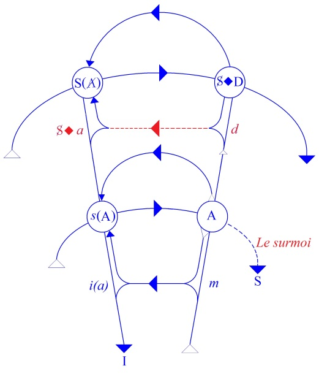
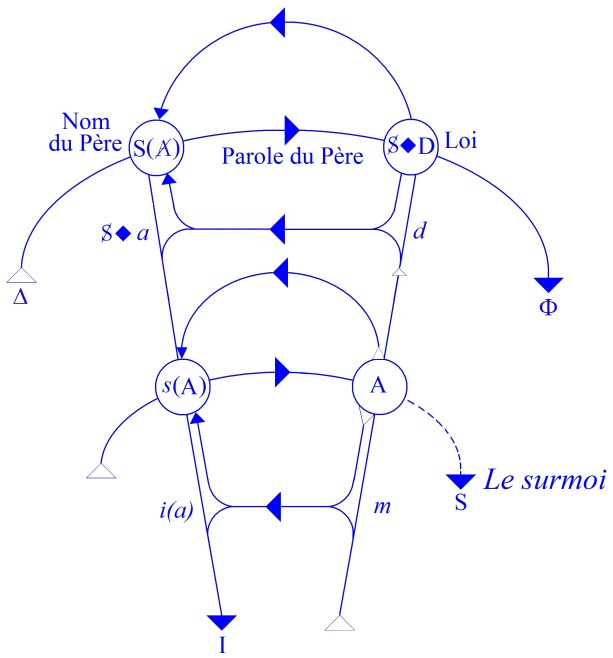
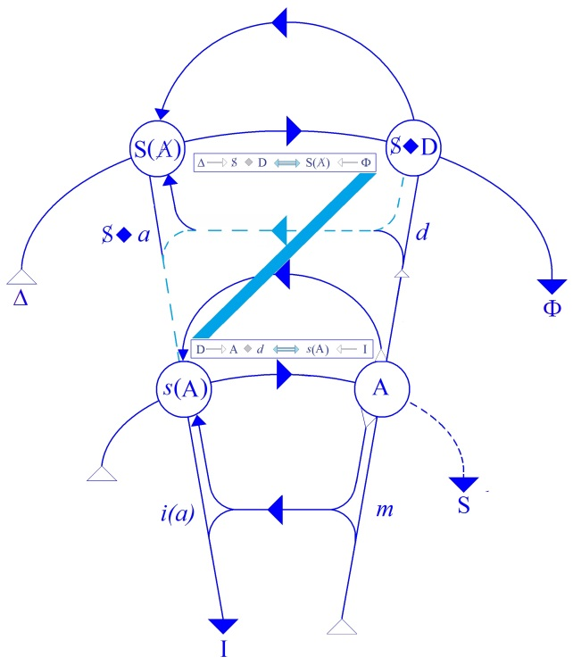
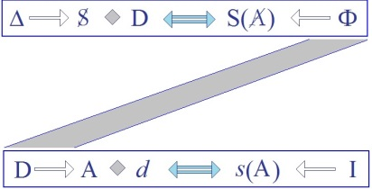

# Leçon 20 | 30 Avril 1958

<!-- source-url: http://staferla.free.fr/S5/S5 FORMATIONS .docx -->
<!-- seminar: s5 -->
<!-- lesson: 20 -->

<!-- id: s5-20-0001 -->

Si « *les choses de l’homme* », dont nous nous occupons en principe, sont marquées de *son rapport au signifiant*, on ne peut pas user du *signifiant* pour parler de ces « *choses* » comme pour parler des choses que le *signifiant* l’aide à poser.
En d’autres termes, il doit y avoir une différence dans la façon dont nous parlons des « *choses de l’homme* »
et dans la façon dont nous parlons des autres choses.

<!-- id: s5-20-0002 -->

Nous savons bien que les choses ne sont pas *insensibles* à l’approche du *signifiant*, que leur rapport à l’ordre du λόγος doit être étudié et que nous sommes *en mesure*, plus que nos prédécesseurs, de nous apercevoir que la façon dont
en fin de compte le langage pénètre les choses, les sillonne, les soulève, les bouleverse un tant soit peu,
pose bien des questions.

<!-- id: s5-20-0003 -->

Mais enfin nous en sommes maintenant au point où nous savons - où nous supposons tout au moins - sauf erreur,
que les choses, elles, ne sont pas développées dans le langage. C’est tout au moins de là que l’on est parti
pour le travail de la science telle qu’elle est actuellement constituée pour nous, de la science de la ϕύσις \[phusis\].

<!-- id: s5-20-0004 -->

Penser d’abord à châtier le langage, c’est-à-dire à le réduire au minimum néces­saire pour que *cette prise sur les choses* puisse se faire, c’est ce qu’on appelle *l’analy­tique transcendantale*. Enfin, on s’est arrangé à réduire le langage,
pour les choses, à *sa fonction d’interrogation*. En somme on l’a autant que possible - et naturelle­ment pas totalement - dégagé des choses où il était profondément engagé jusqu’à une certaine époque qui correspond à peu près au début de la science moderne. Maintenant, bien entendu, tout se complique. Ne constatons-nous pas à la fois :

<!-- id: s5-20-0005 -->

- *de singulières convulsions* dans les choses, qui ne sont certainement pas sans rapport avec la façon dont nous les interrogeons,

<!-- id: s5-20-0006 -->

- et d’autre part, *de curieuses impasses* dans le langage, qui, au moment où nous parlons des choses, nous devient strictement incompréhensible ?

<!-- id: s5-20-0007 -->

Mais cela ne nous regarde pas. Nous, nous en sommes à l’Homme. Et là, tout ce que je vous fais remarquer,
c’est que *le langage* n’est pas, jusqu’à présent, dégagé. Le langage avec lequel l’interroger n’est pas dégageable comme nous le croyons dégagé quand nous tenons sur « *les choses de l’homme* » le discours de l’académie ou de la psy­chologie psychiatrique. Jusqu’à nouvel ordre, c’est le même. Nous pouvons très suffisamment nous-mêmes nous apercevoir
de la pauvreté des constructions auxquelles nous nous livrons, et d’ailleurs de leur immutabilité car, à la vérité,
depuis un siècle que l’on parle de l’hallucination en psychiatrie, *on n’a* à peu près *pas fait un pas*, on ne sait tou­jours pas, on ne peut toujours pas définir d’une autre façon que dérisoire ce qu’est *l’hallucination* en psychiatrie.

<!-- id: s5-20-0008 -->

Tout le langage, d’ailleurs, de la psychologie psychiatrique porte ce même han­dicap de nous faire sentir en somme son profond piétinement et de nous faire sen­tir ceci, que nous exprimons ainsi : nous disons qu’on *réifie* telle ou telle fonction, et nous sentons l’arbitraire de ces *réifications* quand on parle, même dans un langage bleulérien,
de la discordance dans la schizophrénie. Nous avons l’impression que nous sommes là dans quelque chose
quand nous disons *réifier.* Qu’est-ce que cela veut dire ? Ce n’est pas du tout que nous reprochions à cette psychologie de faire de l’homme « *une chose* » - plût au ciel qu’il en fît « *une chose* » - c’est bien le but d’une science de l’homme.
Mais justement, il en fait une chose qui n’est rien d’autre que du langage qui gèle prématurément, qui substitue hâtivement sa propre forme de langage à quelque chose qui est déjà tissé dans le langage.

<!-- id: s5-20-0009 -->

Ce que nous appelons en somme *formations de l’inconscient,* ce que FREUD nous a présenté comme *formations de l’inconscient*, ce n’est pas autre chose que cette « *prise* » d’un certain *primaire* - d’ailleurs c’est bien pour cela
qu’il l’a appelé *le processus primaire -* cette « *prise* » d’un certain *primaire* dans le langage. Le langage *marque* ce *primaire*,
et c’est pourquoi la découverte de FREUD, la découverte de l’*inconscient*, peut être dite « *préparée* » par l’interrogation de ce *primaire*, pour autant que d’abord est détectée sa structure de langage. Quand je dis « *préparée* », elle pourrait permettre de préparer l’interrogation de ce *primaire*, d’introduire à une juste interrogation des tendances primaires.

<!-- id: s5-20-0010 -->

Mais nous n’en sommes pas là tant que nous n’avons pas fait le point de ce qu’il s’agit d’abord de reconnaître, à savoir que ce *primaire* est d’abord et avant tout *tissé comme du lan­gage*. *C’est pour cela* que je vous y ramène, et *c’est pour cela* aussi que ceux qui jusqu’à présent vous promettent, vous font miroiter « *la synthèse de la psychanalyse et de la biologie* »
vous montrent manifestement - par le fait qu’il n’y a absolument rien d’amorcé dans ce sens - vous démontrent que c’est *un leurre*. Et même, nous irons plus loin *en affirmant que* jusqu’à nouvel ordre, de le promettre c’est *une escro­querie*.

<!-- id: s5-20-0011 -->

Nous en sommes donc à essayer de situer, de projeter, de *manifester* devant vous ce que j’appelle *la texture du langage.* Cela ne veut pas dire que nous excluions *ce pri­maire*. C’est bien à sa recherche, pour autant que *lui,* *est autre chose*
*que le langage*, que nous y avançons. Dans les précédentes leçons nous en étions à toucher ce que je vous ai appelé
« *la dialectique du désir et de la demande* ». Je vous ai dit que dans la demande *l’identi­fication se fait à l’objet* - *disons à peu près* - *du sentiment*. Pourquoi en fin de compte en est-il ainsi ?

<!-- id: s5-20-0012 -->

Justement dans la mesure où pour que quoi que ce soit s’établisse d’intersubjectif, il faut que l’Autre, *avec un grand A*, parle. Ou autrement encore : parce qu’il est de la nature de la parole d’être la parole de l’Autre. Ou encore, parce :

<!-- id: s5-20-0013 -->

- qu’il faut que tout ce qui est de la *manifestation* du désir primaire à quelque moment s’installe sur ce que FREUD après FECHNER appelle « *l’Autre scène »,*

<!-- id: s5-20-0014 -->

- que ceci est nécessaire à la satis­faction de l’homme, pour autant précisément qu’étant un être parlant, une part tout à fait majoritaire ses satisfactions doivent passer par l’intermédiaire de la parole.

<!-- id: s5-20-0015 -->

Il est tout de suite à remarquer que de ce seul fait, une ambiguïté tout à fait ini­tiale s’introduit : *si le désir est obligé*

<!-- id: s5-20-0016 -->

*à ce truchement de la parole* et si - comme il est tout à fait manifeste - cette *parole* a son statut, s’installe, ne se développe de sa nature que dans l’Autre comme *lieu de la parole*, alors il est tout à fait clair que de ceci, il n’y a aucune raison
pour que le sujet s’aperçoive.

<!-- id: s5-20-0017 -->

Je veux dire que la distinction entre l’Autre et lui-même est une des choses qui, à l’origine, est la plus difficile des distinctions à faire. Aussi bien, je n’ai pas besoin de souligner ce que FREUD par exemple a bien sou­ligné, à savoir

<!-- id: s5-20-0018 -->

la valeur symptomatique de ce moment de l’enfance où l’enfant croit que les parents connaissent toutes ses pensées.
FREUD explique très bien, à ce moment-même, le lien de ce phénomène avec la parole, avec le fait que ses pensées, en fin de compte, se sont formées dans la parole de l’Autre. Et il est tout naturel qu’à l’origine ses pensées appartiennent à cette parole.

<!-- id: s5-20-0019 -->

Entre lui et cet Autre, au départ, il n’y a qu’une faible lisière, marquée précisément par ce qui se passe
dans *la relation narcissique,* mais une lisière *ambiguë*, en ce sens qu’elle se franchit. Je veux dire que *la relation narcissique* est parfaitement ouverte à une sorte de transitivisme permanent.

<!-- id: s5-20-0020 -->

C’est ce que l’expérience de l’enfant montre également, mais les deux modes d’ambiguïté…

<!-- id: s5-20-0021 -->

> celle qui se passe ici sur *le plan imagi­naire*, et celle qui appartient à *l’ordre symbolique*, c’est-à-dire la première
>
> que je viens de rappeler, celle par quoi le désir fonde dans la parole de l’Autre
> …les deux limites, les deux modes de franchissement qui font que le sujet s’aliène, ne se confondent pas.
> Et c’est dans leur discordance que s’établit une première possibilité - comme l’expé­rience le montre -

<!-- id: s5-20-0022 -->

que le sujet se distingue, bien entendu, le plus particulièrement sur *le plan imagi­naire* : il s’établit avec son semblable

<!-- id: s5-20-0023 -->

dans une position de rivalité par rapport à un tiers objet.

<!-- id: s5-20-0024 -->

Mais il reste toujours *la question de ce qui se passe quand ils sont deux*, à savoir quand il s’agit *qu’il se soutienne lui-même*
en présence de l’Autre. Cette *dialectique*, qui en somme confine à celle qu’on appelle *de la reconnaissance,*
vous en reconnaissez - au moins, vous en entrevoyez un petit peu grâce à ce que, au moins pour certains d’entre vous, grâce à ce qu’ici nous en avons communiqué - vous savez que cette *dialectique de la reconnaissance*,
un nommé HEGEL l’a cherchée dans le conflit de la jouissance et dans la voie de la lutte dite « *lutte à mort* »

<!-- id: s5-20-0025 -->

où il fait sen­tir toute sa « *dialectique du maître et de l’esclave* ». Tout ceci est fort important à connaître,
mais il est bien entendu que cela ne recouvre pas le champ de notre expérience, et pour les meilleures raisons.

<!-- id: s5-20-0026 -->

C’est qu’il y a autre chose que la dialectique de la lutte du maître et de l’esclave :

<!-- id: s5-20-0027 -->

- il y a le rapport de l’enfant aux parents,

<!-- id: s5-20-0028 -->

- il y a précisément ce qui se passe au niveau de *la reconnais­sance*, pour autant que ce qui est en jeu, ce n’est pas la lutte ni le conflit, mais juste­ment *la demande*.

<!-- id: s5-20-0029 -->

Il s’agit en somme de voir que si le désir du sujet est aliéné dans la *demande*, est profondément transformé par le fait de devoir passer par la *demande*, *comment le désir* à quelque moment peut… comment il *doit se réintroduire* ?
Ces choses sont simples : primitivement l’enfant, dans son impuissance, se trouve entièrement dépendre
de la *demande*, c’est-à-dire de *la parole de l’Autre* qui modifie, *restructure*, *aliène* profondément la nature de son désir.

<!-- id: s5-20-0030 -->

Ce à quoi, là, nous faisons allusion, correspond à peu près à cette *dialectique de la demande* qu’on appelle,
à tort ou à raison, « *pré-œdipienne* », et assurément à raison « *prégénitale* », et où ici, en raison de cette ambiguïté
des limites du sujet avec l’Autre, nous voyons s’introduire dans la *demande* :

<!-- id: s5-20-0031 -->

- cet *objet oral* qui, dans la mesure où il est demandé sur le plan oral, est incorporé,

<!-- id: s5-20-0032 -->

- cet *objet anal* qui devient le support de cette *dialectique du don anal primitif*, lié essentiellement chez le sujet au fait qu’il satisfasse ou non *la demande éducative*, c’est-à-dire en fin de compte, qu’il accepte ou non de lâcher un certain *objet symbolique*.

<!-- id: s5-20-0033 -->

Bref, ce remaniement profond des premiers désirs par la *demande*, c’est ce que nous touchons perpétuellement
à propos de ce que nous appelons cette *dialectique de l’objet oral et anal* particulièrement. Nous voyons ce qui en résulte : c’est à savoir que cet Autre comme tel, auquel le sujet a affaire dans la relation de la demande, est lui-même soumis
à une *dialectique* d’assimilation ou d’incorporation, ou de rejet. Il y a quelque chose de différent qui peut et doit s’introduire, ce par quoi *l’originalité, l’irréductibilité, l’authenticité* du désir du sujet est rétablie.

<!-- id: s5-20-0034 -->

Je ne crois pas que ce soit autre chose que veuille dire le pré­tendu progrès de l’étape génitale, qui consiste en ceci :

<!-- id: s5-20-0035 -->

c’est qu’installé dans la dia­lectique première, pré-génitale de la demande, le sujet à un moment a affaire à l’autre désir, un désir qui n’a été jusque là ni intégré, qui n’est pas intégrable sans des rema­niements beaucoup plus critiques

<!-- id: s5-20-0036 -->

et plus profonds encore que pour les premiers désirs, et que *ce désir*, la voie ordinaire par où il s’introduit pour lui, c’est en tant que *désir de l’Autre* :

<!-- id: s5-20-0037 -->

- il reconnaît un désir au-delà de la demande, un désir en tant que non adultéré par la demande,

<!-- id: s5-20-0038 -->

- il le rencontre, il le situe dans l’au-delà du premier Autre duquel il adressait sa demande, pour fixer les idées, disons : la mère.

<!-- id: s5-20-0039 -->

Ce que je dis là n’est qu’une façon d’articuler, d’exprimer ce qui est enseigné depuis toujours : c’est que c’est à travers l’œdipe que le désir génital est assumé, vient prendre sa place dans l’économie subjective. Mais ce sur quoi j’entends attirer votre attention, c’est sur la fonction de ce désir de l’Autre pour, une fois pour toutes, per­mettre la véritable distinction du sujet et de l’Autre.

<!-- id: s5-20-0040 -->

En d’autres termes, c’est la situation de réciprocité qui fait que si le désir du sujet dépend entièrement de la demande à l’Autre, c’est-à-dire de l’Autre, il y a situation de réci­procité : ce qui s’exprime dans les rapports de l’enfant à la mère par le fait que l’en­fant aussi sait très bien qu’il tient quelque chose, qu’il peut refuser la demande de la mère,
par exemple en accédant ou non aux requêtes de la discipline anale ou excré­mentielle.

<!-- id: s5-20-0041 -->

Il y a donc dans ce rapport entre les deux sujets autour de la *demande*, quelque chose, un rapport original pour qu’une dimension nouvelle qui complète cette pre­mière, soit introduite, qui fait que le sujet est autre chose qu’un sujet dans la rela­tion de dépendance, relation de dépendance qui fait l’être essentiel.

<!-- id: s5-20-0042 -->

Ce qui doit être introduit, ce qui est là bien entendu depuis le début, ce qui depuis l’origine est *latent*, c’est ceci :

<!-- id: s5-20-0043 -->

- c’est qu’au-delà de ce que le sujet demande,

<!-- id: s5-20-0044 -->

- au-delà de ce que l’Autre demande au sujet,
  …il doit y avoir la présence et la dimension de ce que l’Autre désire.

<!-- id: s5-20-0045 -->

Ceci, qui d’abord est *profondément voilé au sujet* mais qui néanmoins est là, immanent à la situation et qui va peu à peu
se développer dans *l’expérience de l’œdipe*, ceci est essentiel *dans la structure, plus originellement, plus fondamentalement* :

<!-- id: s5-20-0046 -->

- que la perception des rapports du père et de la mère sur lesquels je me suis étendu dans ce que j’ai appelé la *métaphore paternelle,*

<!-- id: s5-20-0047 -->

- que la perception même, de quelque point que ce soit, de ce qui aboutit au *complexe de castration*, c’est-à-dire ce qui sera un développement de cet *au-delà* de la demande.

<!-- id: s5-20-0048 -->

À soi tout seul, le fait que *le désir du sujet est d’abord trouvé, d’abord repéré dans l’existence comme telle du désir de l’Autre*,
en tant que désir distinct de *la demande,* c’est cela que je veux aujourd’hui par un exemple vous illustrer,
et par le premier exemple exigible, à savoir que si ceci est introductif en quelque sorte à tout ce qui est
de cette *structuration de l’inconscient du sujet par son rapport au signifiant*, nous devons le trouver tout de suite.

<!-- id: s5-20-0049 -->

Et d’abord je vous ai déjà fait allusion à ce que nous pouvons pointer dans les premières observations que FREUD
a faites de *l’hystérie*. Passons au temps où FREUD pour la première fois nous parle du *désir*. Il nous en parle à propos des *rêves*. Je vous ai commenté ce que FREUD tire à propos du rêve inau­gural d’Irma, le rêve de l’injection.

<!-- id: s5-20-0050 -->

Je n’y reviens pas. Prenons le deuxième rêve - car FREUD dans la *Traumdeutung* analyse aussi certains de ses rêves -
c’est « *le rêve de l’oncle Joseph* ». Je l’analyserai un autre jour car il est tout à fait démonstratif, en particulier pour illustrer le schéma des deux boucles entre­croisées, parce qu’il n’y a rien qui vraiment montre plus les deux étages sur lesquels se développe un rêve : *l’étage* proprement *signifiant* qui est la parole, et *l’étage ima­ginaire où* - en quelque sorte - *s’incarne l’objet métonymique*. Ne nous égarons pas là-dessus.

<!-- id: s5-20-0051 -->

Je prends le troisième rêve que FREUD a analysé dans le *troisième chapitre* : « *La transposition du rêve* ».

<!-- id: s5-20-0052 -->

C’est celui que nous appellerons « *Le rêve de la belle bouchère* ». Voici le rêve :

<!-- id: s5-20-0053 -->

> « *Je veux donner un dîner, mais je n’ai pour toutes provisions qu’un peu de saumon fumé.*
>
> *Je voudrais aller faire des achats, mais je me rappelle que c’est dimanche après-midi et que toutes les boutiques sont fermées.*
>
> *Je veux téléphoner à quelques four­nisseurs, mais le téléphone est détraqué. Je dois donc renoncer au désir de donner un dîner.* »
>
> \[« *Ich will ein Souper geben, habe aber nichts vor­rätig als etwas geräucherten Lachs. Ich denke daran, einkaufen zu gehen, erinnere mich aber, daß es Sonn­tag Nachmittag ist, wo alle Läden gesperrt sind. Ich will nun einigen Lieferanten telephonieren, aber das Telephon ist gestört. So muß ich auf den Wunsch, ein Souper zu geben, verzichten.* »\]

<!-- id: s5-20-0054 -->

Voilà le texte du rêve. FREUD note scrupuleusement la façon dont s’articule, dont se verbalise le texte d’un rêve,
et *c’est à partir de cette verbalisation d’une espèce de rébus du rêve, que toujours et uniquement lui paraît concevable l’analyse d’un rêve.*

<!-- id: s5-20-0055 -->

« *Je réponds naturellement* - dit FREUD - *que seule l’analyse peut décider du sens de ce rêve*... »
\[*Ich antworte natürlich, daß über den Sinn dieses Traumes nur die Analyse entscheiden kann*...\]

<!-- id: s5-20-0056 -->

En effet, la malade le lui a proposé en lui disant :

<!-- id: s5-20-0057 -->

« *Vous remarquerez que vous m’avez dit qu’un rêve est toujours quelque chose où un désir se réalise.*
*Là, j’ai les plus grandes difficultés à réaliser.* »
\[*Sie sagen immer, der Traum ist ein erfüllter Wunsch, beginnt eine witzige Patientin. « Nun will ich Ihnen einen Traum erzählen, dessen Inhalt ganz im Gegenteil dahin geht, daß mir ein Wunsch nicht erfüllt wird. Wie vereinen Sie das mit Ihrer Theorie ? »*\]

<!-- id: s5-20-0058 -->

« *j’accorde toutefois* - poursuit FREUD - *qu’il semble à pre­mière vue raisonnable et cohérent et paraît tout le contraire*
*de l’accomplissement d’un désir.* » \[*wenngleich ich zugebe, daß er für den ersten Anblick vernünftig und zusammenhängend erscheint und*
*dem Gegenteil einer Wunscherfüllung ähnlich sieht*.\]
*« Quels sont les éléments de ce rêve ? Vous savez que les motifs d’un rêve se trouvent toujours dans les faits des jours pré­cédents » -* dit-il à sa

<!-- id: s5-20-0059 -->

patiente. \[*Aus welchem Material ist aber dieser Traum hervorgegangen? Sie wissen, daß die Anregung zu einem Traume jedesmal in den*
*Erlebnissen des letzten Tages liegt.*\]
« *Le mari de ma malade est boucher en gros. C’est un brave homme, très actif. Il lui a dit quelques jours auparavant qu’il engraissait trop. Il vou­drait faire une cure d’amaigrissement : il se lèvera de bonne heure, il n’acceptera plus d’invitation à dîner. Elle raconte en riant que son mari allait habituellement au res­taurant et qu’il avait fait la connaissance d’un peintre qui voulait faire son portrait, parce qu’il n’avait pas encore trouvé de tête aussi expressive. Mais son mari avait répondu avec*

*sa rudesse ordinaire qu’il le remerciait très vivement mais qu’il était per­suadé que le peintre préférerait à toute sa figure à lui, un morceau de derrière de la belle jeune fille. Ma malade est actuellement très éprise de son mari et le taquine sans cesse.*

*Elle lui a également demandé de ne pas lui donner de caviar. Qu’est-ce que cela veut dire ? En réalité elle souhaite*

*depuis longtemps avoir chaque matin un sandwich au caviar, mais elle se refuse à cette dépense -* traduit M. MEYERSON, mais ce n’est pas tout à fait cela : « *elle ne s’accorde pas cette licence* », la dépense n’est pas présentifiée là-dedans -
*Naturellement, elle aurait aussitôt son caviar si elle en parlait à son mari, mais elle l’a prié au contraire*
*de ne pas le lui donner, de manière à pouvoir le taqui­ner plus longtemps avec cela.* »

<!-- id: s5-20-0060 -->

> \[*Analyse : Der Mann der Patientin, ein biederer und tüchtiger Großfleischhauer, hat ihr Tags vorher erklärt, er werde zu dick und wolle darum eine Entfettungskur beginnen. Er werde früh aufstehen, Bewegung machen, strenge Diät halten und vor allem keine Ein­ladungen*
>
> *zu Soupers mehr annehmen. Von dem Manne erzählt sie lachend weiter, er habe am Stammtisch die Bekanntschaft eines Malers gemacht, der ihn durchaus abkonterfeien wolle, weil er einen so ausdrucksvollen Kopf noch nicht gefunden habe. Ihr Mann habe aber in seiner derben Manier erwidert, er bedanke sich schön und er sei ganz überzeugt, ein Stück vom Hintern eines schönen jungen Mädchens sei dem Maler lieber als sein ganzes Gesicht. Sie sei jetzt sehr verliebt in ihren Mann und necke sich mit ihm herum. Sie hat ihn auch gebeten, ihr keinen Kaviar zu schenken. - Was soll das heißen? Sie wünscht es sich nämlich schon lange, jeden Vormittag eine Kaviarsemmel essen zu können, gönnt sich aber die Ausgabe nicht. Natürlich bekäme sie den Kaviar sofort von ihrem Manne, wenn sie ihn darum bitten würde.*
>
> *Aber sie hat ihn im Gegenteil gebeten, ihr keinen Kaviar zu schenken, damit sie ihn länger damit necken kann.*\]

<!-- id: s5-20-0061 -->

Ici une parenthèse de FREUD :

<!-- id: s5-20-0062 -->

> (« *Cela me paraît tiré par les cheveux, ces sortes de renseignements insuffisants qui cachent pour l’ordinaire des motifs que l’on n’exprime pas. Songeons à la manière dont les hypnotisés de Bernheim accomplissant une mission post-hypnotique l’ex­pliquent, quand on leur en demande la raison, par un motif visiblement insuffisant au lieu de répondre : « Je ne sais pas pourquoi*
>
> *j’ai fait cela. » Le caviar sera un motif de ce genre. Je remarque qu’elle est obligée de se créer un désir insatisfait.*
>
> *Son rêve lui montre « cette dilation », cet ajournement de son désir, cet écartement de son désir comme réellement accompli.*
>
> *Mais pourquoi lui fallait-il un désir insatisfait ?* »)
>
> \[(*Diese Begründung scheint mir fadenscheinig. Hinter solchen unbefriedigenden Auskünften pflegen sich uneingestandene Motive zu verbergen. Man denke an die Hypnotisierten Bernheims, die einen posthypnotischen Auftrag ausführen, und nach ihren Motiven be-Iragti nicht etwa antworten: Ich weiß nicht, warum ich das getan habe, sondern eine offenbar unzureichende Begründung erfinden müssen.*
>
> *So ähnlich wird es wohl mit dem Kaviar meiner Patientin sein. Ich merke, sie ist genötigt, sich im Leben einen unerfüllten Wunsch zu schaffen. Ihr Traum zeigt ihr auch die Wunsch Verweigerung als eingetroffen. Wozu braucht sie aber einen unerfüllten Wunsch ?*)\]

<!-- id: s5-20-0063 -->

La remarque est de FREUD et entre parenthèses.

<!-- id: s5-20-0064 -->

> « *Ce qui lui est venu à l’esprit jusqu’à présent n’a pu servir à interpréter le rêve. J’insiste. Au bout d’un moment, comme il convient lorsqu’on doit surmonter une résistance, elle me dit qu’elle a rendu visite hier à une de ses amies; elle en est fort jalouse parce que son mari en dit toujours beaucoup de bien. Fort heureusement, l’amie est mince et maigre, et son mari aime les formes pleines. De quoi parlait donc cette personne maigre ? Naturellement de son désir d’engraisser. Elle lui a aussi demandé :*
>
> *« Quand nous inviterez-vous à nouveau ? On mange toujours si bien chez vous ». Le sens du rêve est clair maintenant. Je peux dire*
>
> *à ma malade : « c’est exactement comme si vous lui aviez répondu mentalement : oui da ! je vais t’inviter pour que tu manges bien, que tu engraisses et que tu plaises plus encore à mon mari ! J’aimerais mieux ne plus donner de dîner de ma vie ! » Le rêve vous dit que vous ne pourrez pas donner de dîner, il accomplit ainsi votre vœu de ne point contribuer à rendre plus belle votre amie. La résolution prise de ne plus prendre d’invitation à dîner parce qu’on vous a dit que les dîners dans le monde font engraisser. Il ne manquera plus qu’une concor­dance qui confirmera la solution. On ne sait encore à quoi le saumon fumé répond dans le rêve. D’où vient que vous évoquez dans le rêve le saumon fumé ? C’est -* répond-elle *- le plat de prédilection de mon amie. Par hasard, je connais aussi cette dame et je sais qu’elle a vis-à-vis du saumon fumé la même conduite que ma malade à l’égard du caviar. *»
>
> \[*Die bisherigen Einfälle haben zur Deutung des Traumes nicht ausgereicht. Ich dringe nach weiteren. Nach einer kurzen Pause, wie ßie eben der Überwindung des Widerstandes entspricht, berichtet sie ferner, daß sie gestern einen Besuch bei einer Freundin gemacht, auf die sie eigentlich eifersüchtig ist, weil ihr Mann diese Frau immer so lobt. Zum Glück ist diese Freundin sehr dürr und mager, und ihr Mann ist ein Liebhaber voller Korperformen. Wovon sprach nun diese magere Freundin? Natürlich von ihrem Wunsche, etwas stärker zu werden. Sie fragte sie auch :* « *Wann laden Sie uns wie­der einmal ein? Man ißt immer so gut bei Ihnen.* » *Nun ist der Sinn des Traumes klar. Ich kann der Patientin sagen:* « *Es ist gerade so, als ob Sie sich bei der Aufforderung gedadiÜ hätten: Dich werde ich natürlich einladen, damit du dich bei mir anessen, dick werden und meinem Manne noch besser gefallen kannst. Lieber geb’ ich kein Souper mehr. Der Traum sagt Ihnen dann, daß Sie kein Souper geben können, erfüllt also Ihren Wunsch, zur Ab-rundung der Körperformen Ihrer Freundin nichts beizutragen. Daß man von den Dingen, die man in Gcsellschaften vorgesetzt bekommt, dick wird, lehrt Sie ja der Vorsatz Ihres Mannes, im Interesse seiner Entfettung Soupereinladungen nicht mehr anzunehmen.* » *Es fehlt jetzt nur noch irgend ein Zusammentreffen, welches die Lö­sung bestätigt. Es ist auch der geräucherte Lachs im Trauminhalt noch nicht abgeleitet. „Wie kommen Sip zu dem im Traume erwähn­ten Lachs?" „Geräucherter Lachs ist die Lieblingsspeise dieser Freun­din," antwortet sie. Zufällig kenne ich die Dame auch und kann be­stätigen, daß sie sich den Lachs ebensowenig vergönnt wie meine Patientin den Kaviar.*\]

<!-- id: s5-20-0065 -->

C’est là-dessus que FREUD introduit ce rêve qui comporte une autre interprétation plus délicate et qui entre
dans la dialectique de l’*identification*. C’est à ce propos qu’il fait *les remarques* suivantes :

<!-- id: s5-20-0066 -->

> « *Elle s’est identifiée à son amie. C’est en signe de cette identification, c’est-à-dire pour autant qu’elle s’identifie à l’autre, qu’elle s’est donnée dans la vie réelle un souhait non réalisé.* »\[*Der Traum erhält eine neue Deutung, wenn sie im Traume nicht sich, sondern die Freundin meint, wenn sie sich an Stelle der Freundin gesetzt oder, wie wir sagen können, sich mit ihr identifiziert hat.*
>
> *Ich meine, dies hat sie wirklich getan, und als Anzeichen dieser Identifizierung hat sie sich den versagten Wunsch im Realen ge­schaffen.*\]

<!-- id: s5-20-0067 -->

Je pense que déjà vous devez sentir se dessiner ce linéament dans ce simple texte que j’aurais pu ouvrir à n’importe quelle autre page de la *Traumdeutung.* Nous aurions trouvé la même dialectique. Je crois qu’en prenant le premier rêve qui tombe sous notre main, celui qui va nous montrer d’une façon particulièrement simple - parce que cette *dialectique* est particulièrement simple chez l’hystérique - la dialec­tique du *désir* et de la *demande*.

<!-- id: s5-20-0068 -->

Mais continuons, de façon à avoir poursuivi jusqu’à son terme ce que ce texte très important nous *articule*, puisqu’en somme il est une des premières articulations très nettes par FREUD de ce que signifie l’*identification hys­térique*.

<!-- id: s5-20-0069 -->

Il précise quel est son sens. Je vous passe quelques lignes pour ne pas être trop long. Il s’agit de discuter
de ce qu’on appelle à ce propos l’imitation, la sympathie, et il critique avec beaucoup d’énergie la simple réduction
de *la contagion hystérique* à ce qui serait une pure et simple *imitation*.

<!-- id: s5-20-0070 -->

« *Ce processus, dit-il, est un peu plus compliqué que l’imitation hystérique telle qu’on l’a représentée. Ainsi qu’un exemple va le prouver, il répond à des déductions incons­cientes. Si un médecin a mis avec d’autres malades, dans une chambre d’hôpital, un sujet qui présente une espèce de tremblement, il ne sera pas étonné d’apprendre que cet accident a été imité.* \[...\] *Mais cette contagion se produit à peu près de la manière suivante : les malades savent en général* - il faudrait voir le poids que comporte une pareille remarque, je ne dis pas simple­ment à l’époque où elle a été faite, mais pour nous - *les malades savent en général plus de choses sur le compte des uns et des autres que le médecin n’en peut savoir sur chacun d’eux, et ils se préoccupent encore les uns des autres après la visite du médecin. Remarque essentielle.*
*En d’autres termes, l’objet humain continue de vivre sa petite relation particulière au signifiant, même après que l’observateur, béhavioriste ou pas, s’intéresse à sa photographie. L’une d’entre elles a-t-elle eu sa crise aujourd’hui, les autres sauront bientôt qu’une lettre de chez elle, un rappel de son chagrin d’amour, ou autres choses semblables, en ont été cause. Leur compassion s’émeut et elles font inconsciemment l’examen sui­vant : si ces sortes de motifs entraînent ces sortes de crises, je peux aussi avoir cette sorte de crise* - Articulation du *symptôme* en tant qu’élémentaire, à une *identification* de discours, à une situation articulée dans le discours - *car j’ai les mêmes motifs. Si c’était là*

<!-- id: s5-20-0071 -->

*des conclusions conscientes, elles abouti­raient à l’angoisse de voir survenir cette même crise. Mais les choses se passent sur un autre plan psychique et aboutissent à la réalisation du symptôme redouté. L’iden­tification n’est donc pas une simple imitation, mais appropriation*

<!-- id: s5-20-0072 -->

*à cause d’une étiologie identique; elle exprime un « tout comme si » et a trait à une communauté qui persiste dans l’inconscient,*
\- Le terme « *appropriation* » n’est pas tout à fait bien traduit. C’est plutôt « *pris comme propre* » - *l’hystérique s’identifie de préférence avec des personnes avec lesquelles elle a été en relations sexuelles ou qui ont des relations sexuelles avec les mêmes personnes qu’elle. La langue est d’ailleurs responsable de cette conception, elle rend compte que deux amants sont un.* » dit FREUD.

<!-- id: s5-20-0073 -->

\[*Letzterer ist um ein ge­ringes komplizierter, als man sich die Imitation der Hysterischen vorzustellen liebt; er entspricht einem unbewußten Schlußprozeß, wie ein Beispiel klarstellen wird. Der Arzt, welcher eine Kranke mit einer bestimmten Art von Zuckungen unter anderen Kranken auf demselben Zimmer im Krankenhause hat, zeigt sich nicht erstaunt, wenn er eines Morgens erfährt, daß dieser besondere hysterische An­fall Nachahmung gefunden hat.* \[...\] *Ja, aber die psychische Infektion geht etwa auf folgende Weise zu. Die Kranken wissen in der Regel mehr voneinander als der Arzt über jede von ihnen, und sie kümmern sich umeinander, wenn die ärztliche Visite vorüber ist. Die eine bekomme heute ihren Anfall; es wird alsbald den anderen bekannt, daß ein Brief vom Hause, Auffrischung des Liebeskummers und dergleichen davon die Ursache ist. Ihr Mitgefühl wird rege, es vollzieht sich in ihnen folgender, nicht zum Bewußtsein gelangender Schluß: Wenn man von solcher Ursache solche Anfälle haben kann, so kann ich auch solche Anfälle bekommen, denn ich habe dieselben Anlässe. Wäre dies ein des Be­wußtseins fähiger Schluß, so würde er violleicht in die Angst aus­münden, den gleichen Anfall zu bekommen; er vollzieht sich aber auf einem anderen psychischen Terrain, endet daher in der Realisierung des gefürchteten Symptoms. Die Identifizierung ist also nicht simple Imitation, sondern Aneignung auf Grund des gleichen ätiologischen Anspruches; sie drückt ein „gleichwie" aus und bezieht sich auf ein im Unbewußten verbleibendes Gemeinsames.*
*Die Identifizierung wird in der Hysterie am häufigsten benützt zum Ausdruck einer sexuellen Gemeinsamkeit. Die Hysterica identi­fiziert sich in ihren Symptomen am ehesten - wenn auch nicht aus­schließlich - mit solchen Personen, mit denen sie im sexuellen Ver­kehre gestanden hat, oder welche mit den nämlichen Personen wie sie selbst sexuell verkehren. Die Sprache trägt einer solchen Auf­fassung gleichfalls Bechnung. Zwei Liebende sind „Eines".*\]

<!-- id: s5-20-0074 -->

Bien entendu le rapport d’*identification* à l’amie jalouse est ici le problème que soulève FREUD.
Je veux attirer votre attention sur ceci : FREUD dans ce texte souligne comme problème premier que le *désir* que nous rencontrons d’abord, dès le premier pas de l’analyse, celui à partir duquel va se dérouler la solution de l’énigme, c’est que la malade était préoccupée au moment de ce rêve, de *se créer un désir insatisfait*.

<!-- id: s5-20-0075 -->

Quelle est la fonction de ce *désir insatisfait* ? Car si nous lisons dans le rêve la satisfaction d’un souhait, ce que nous décou­vrons à propos de la satisfaction de ce souhait, c’est la sousjacence d’une situation qui est très proprement
la situation fondamentale de l’homme *entre la demande et le désir*, celle à laquelle j’essaye de vous introduire,
et celle à laquelle je vous introduis effectivement par l’intermédiaire de l’hystérique parce que, disons les choses
à peu près comme ceci : on peut dire que l’hystérique est suspendue à cette première étape, à ce clivage nécessaire dont j’ai essayé de vous montrer tout à l’heure la nécessité *entre la demande et le désir*. Ici rien n’est plus clair :

<!-- id: s5-20-0076 -->

- *Que demande-t-elle ?* Je parle avant son rêve, dans la vie. *Cette malade*, très éprise de son mari, *que demande-t-elle* ? C’est l’amour. Et les hystériques *comme tout le monde* - à ceci près que chez elles c’est plus encombrant - demandent l’amour.
  <!-- -->

<!-- id: s5-20-0077 -->

- *Que désire-t-elle ?* Elle désire du caviar. Il faut simplement lire.

<!-- id: s5-20-0078 -->

- *Et que veut-elle ?* Elle veut qu’on ne lui donne pas de caviar.

<!-- id: s5-20-0079 -->

La question est justement de savoir pourquoi il est nécessaire, pour qu’une hys­térique entretienne un commerce d’amour qui la satisfasse :

<!-- id: s5-20-0080 -->

- premièrement, qu’elle désire *autre chose* : le caviar n’a pas ici d’autre rôle que d’être *autre chose*.

<!-- id: s5-20-0081 -->

- Et en second lieu, que pour que cette « *autre chose* » remplisse bien la fonction qu’il a mis­sion de remplir : justement qu’on ne le lui donne pas !

<!-- id: s5-20-0082 -->

Car son mari ne demanderait pas mieux que de lui donner du caviar. Mais probablement qu’il serait plus tran­quille, s’imagine-t-il. Mais ce que nous dit formellement FREUD c’est qu’elle veut qu’il ne lui donne pas de caviar
pour qu’on puisse continuer à s’aimer à la folie, c’est-à-dire *à se taquiner*, *se faire des misères* à perte de vue.

<!-- id: s5-20-0083 -->

Ces éléments structuraux qui n’ont rien - mis à part le fait que nous nous y arrê­tions - de tellement original,

<!-- id: s5-20-0084 -->

c’est quand même quelque chose qui commence de prendre son sens ici. Vous voyez que ce qui s’exprime là,
*c’est une structure* qui, bien au-delà de son côté *comique,* doit représenter *une nécessité* : si *l’hystérique* est préci­sément, comme nous le savons, le sujet pour lequel *la constitution de l’autre en tant que grand Autre, en tant que porteur du signe parlé*, est ce avec quoi il est difficile d’établir la relation qui lui permet à lui, *sujet hystérique* - et c’est bien là la définition même que l’on peut en donner - de garder sa place de sujet.

<!-- id: s5-20-0085 -->

Et l’hystérique, pour tout dire, est si ouvert, ou ouverte à *la suggestion* de la parole, qu’il doit y avoir là quelque chose.
Quelque part FREUD - dans « *Psychologie collective et analyse du moi » -* se pose la ques­tion de la manière selon laquelle cette *hypnose* vient au jour. Sa relation au sommeil est loin d’être transparente, et l’électivité énigmatique
qui se l’approprie - je veux dire l’assouvit, ou qui au contraire, pour d’autres personnes s’y oppose, s’en éloigne radicalement - montre qu’il y a un certain moment inconnu qui doit se réaliser dans l’hypnose et qui peut-être
rend possible par lui-même chez le sujet, originellement, la pureté des « *situations libidinales* ».

<!-- id: s5-20-0086 -->

Je dirai plutôt « *attitudes libidinales* », car il s’agit précisément des places, des postes que nous sommes en train d’essayer d’éclaircir, et cet *élément inconnu* dont parle FREUD tourne autour de cette articulation de la *demande* et du *désir*.
C’est ce que nous allons essayer de montrer plus loin. Donc, cette préoccupation, cette nécessité pour le sujet

<!-- id: s5-20-0087 -->

de se créer un *désir insa­tisfait* en relation avec ce qu’il faut pour que se constitue pour le sujet un Autre *réel*,
c’est-à-dire un autre qui ne soit pas entièrement immanent à la satisfaction réci­proque de la demande,

<!-- id: s5-20-0088 -->

c’est-à-dire à la capture entière du désir du sujet, par la parole de l’Autre.

<!-- id: s5-20-0089 -->

Que ce *désir* dont il s’agit, soit de sa nature le *désir de l’Autre*, c’est très pré­cisément ce à quoi *la dialectique du rêve* nous introduit, puisque ce *désir de caviar*, la malade ne veut pas qu’il soit satisfait dans la réalité : où est-il représenté dans

<!-- id: s5-20-0090 -->

ce rêve, qui en effet tend incontes­tablement à satisfaire la malade quant à la solution du problème qu’elle poursuit ?

<!-- id: s5-20-0091 -->

Ce *désir* *de caviar,* par *quoi* va-t-il être *représenté* dans ce rêve ? Par le fait que la personne en jeu dans le rêve, celle à laquelle FREUD pointe, désigne qu’elle s’identifie, elle est là aussi, elle est hystérique ou elle ne l’est pas, qu’importe ! Tout est *puro pur* et tout est *hystérico-hystérique* pour la malade. Hystérique, bien sûr l’Autre l’est aussi, et ceci d’autant plus facilement que, comme je viens de vous le dire, le sujet hystérique se constitue presque tout entier à partir
du désir de l’Autre. *Le désir* dont le sujet fait ici état, c’est aussi *le désir préféré de l’Autre*, et même il ne lui reste que cela au moment où elle ne va pas pouvoir donner un dîner.

<!-- id: s5-20-0092 -->

Il ne lui reste que du saumon fumé, c’est-à-dire ce qui indique à la fois le désir de l’Autre et ce qui l’indique comme pouvant être satisfait, mais seulement pour l’Autre : *d’ailleurs ne craignez rien, il y a du sau­mon fumé* ! Le rêve ne dit

<!-- id: s5-20-0093 -->

pour autant pas que les choses vont jusqu’à ce qu’elle le donne à son amie, mais l’intention y est. L’intention y est…

<!-- id: s5-20-0094 -->

Par contre, bien entendu la demande de son amie, qui est l’élément génétique du rêve, à savoir qu’elle lui a demandé de venir dîner chez elle, *où on mange si bien* et où au reste on peut rencontrer le beau boucher : l’aimable mari *qui parle toujours si bien de* *cette amie*, lui aussi doit avoir son petit désir der­rière la tête : le derrière de la jeune fille évoqué
si promptement à propos de l’aimable proposition du peintre qui lui propose de le *croquer*, de dessiner sa si expressive et *si intéressante figure* est certainement là pour le démontrer.

<!-- id: s5-20-0095 -->

Chacun, pour tout dire, a son petit désir au-delà, simplement plus ou moins intensifié. Ce qui est important dans
le cas de *l’hystérique*, c’est qu’elle nous montre que pour elle ce désir en tant qu’au-delà de toute demande, c’est-à-dire en tant que devant occuper une fonction à titre de désir refusé, joue pour elle un rôle de tout pre­mier plan.

<!-- id: s5-20-0096 -->

Et ces choses-là sont tout à fait utilisables. Vous ne comprendrez jamais rien à *une hystérique* ou à *un hystérique* si vous ne partez pas de cette reconnais­sance de ce premier élément structural. Comme d’autre part, *l’hystérie* dans le rapport de l’homme au signifiant *est une structure* tout à fait *primordiale* : si vous ne savez pas en quel point de la struc­ture,

<!-- id: s5-20-0097 -->

pour peu que vous ayez poussé assez loin la dialectique de la demande, vous devez toujours à un moment donné rencontrer cette *Spaltung de la demande et du désir*, c’est au risque de faire de grandes erreurs, c’est-à-dire de rendre

<!-- id: s5-20-0098 -->

la malade hys­térique, car bien entendu tout ce que nous analysons là, c’est inconscient pour le sujet.

<!-- id: s5-20-0099 -->

Autrement dit, l’hystérique, lui, ne sait pas qu’il ne peut pas être satisfait dans la demande, mais il est par contre
très essentiel que vous, vous le sachiez. Ceci, au point où nous en sommes va donc nous permettre de commencer
de pointer ce que veut dire le petit diagramme que je vous ai fait la dernière fois et dont je n’ai même pas pu
\- bien entendu, parce qu’il était un peu prématuré de le faire - apporter pour vous le pointage et l’interprétation,
mais nous allons maintenant y venir. Voici.

<!-- id: s5-20-0100 -->

<!-- id: s5-20-0101 -->

Nous vous l’avons dit, c’est autour de quelque chose comme ceci, c’est-à-dire autour d’un rapport de ce qui
se manifeste comme *un besoin qui doit passer par la demande*, c’est-à-dire *s’adresser à l’Autre*, que nous voyons ici…
par l’intermédiaire d’une rencontre, qui a lieu ou qui n’a pas lieu, mais qui occupe à peu près

ce que nous pouvons appeler la place du *message*, c’est-à-dire *s*(A) : *ce qui est signifié de l’Autre*
…que se produit ce reliquat de la *demande* qui consiste dans l’altération de ce qui se manifeste à l’état
encore non informé du *désir* du sujet et qui, *en principe*, se mani­feste sous la forme de l’*identification* du sujet.

<!-- id: s5-20-0102 -->

Je reprendrai ceci encore si vous le voulez, la prochaine fois, texte en main. La pre­mière fois que FREUD parle

<!-- id: s5-20-0103 -->

d’une façon complètement articulée de l’*identification*, vous pouvez d’ores et déjà vous y reporter si le cœur vous en dit, avant que je vous en parle la prochaine fois, vous verrez comment FREUD l’articule et vous verrez que
*l’identification primitive* n’est pas articulée autrement que je vous le marque là.

<!-- id: s5-20-0104 -->

Vous savez d’autre part dans quelle mesure, *ici, sur le chemin où se situe la rela­tion ou le court-circuit* *narcissique* \[A→ *m*→ *i(a)*→ I\],
est introduit déjà, une possibilité, une ouverture, une sorte d’ébauche de *tiers* dans cette relation du sujet à l’autre.
L’essentiel de ce que je vous ai apporté en vous décrivant la fonction du *phallus* en tant qu’il est *ce* *certain signifiant*
qui marque ce que l’Autre désire en tant que marqué par le *signifiant*.

<!-- id: s5-20-0105 -->

*Le phallus, c’est ce certain signifiant qui marque ce que l’Autre désire* en tant que, comme Autre *réel*, comme Autre *humain*,
il est dans son économie. C’est cette formule que nous sommes précisément en train d’étudier,
à savoir qu’*il* \[l’Autre\] *est marqué par le signifiant*.

<!-- id: s5-20-0106 -->

*C’est précisément dans la mesure où l’Autre est marqué par le signifiant que le sujet doit*, ne peut que - par là - *reconnaître*,
par l’intermédiaire de cet Autre, *que lui aussi en somme est marqué par le signifiant*. C’est-à-dire *qu’il y a quelque chose toujours qui <u>reste au-delà</u>* de ce qui peut se satis­faire par l’intermédiaire de *ce signifiant*, c’est-à-direpar *la demande*, et que ce clivage fait autour de l’action du *signifiant*, *ce <u>résidu irréductible</u> lié au signifiant,* a aussi son signe propre, mais son signe qui, lui, ici, va s’identifier avec cette marque dans *le signifié* et que c’est là que lui doit rencontrer son désir.

<!-- id: s5-20-0107 -->

En d’autres termes, c’est pour autant que le *désir* de l’Autre est *barré* qu’il va reconnaître *son désir barré*,
son *<u>désir insatisfait</u>* à lui, et c’est au niveau de ce *désir barré*, par l’intermédiaire de l’Autre, que se fait sa rencontre
avec son désir le plus authentique, à savoir le désir génital. C’est pour cela que le désir génital est marqué de *castration*, autrement dit d’un cer­tain rapport avec le *signifiant phallus*. Ce sont là deux causes équivalentes.

<!-- id: s5-20-0108 -->

C’est d’une certaine relation de ce qui répond à la demande à une première étape, à savoir à la parole de la mère,
c’est au-delà de cela, c’est-à-dire au delà d’une relation de cette parole à une *Loi* qui est au-delà,

<!-- id: s5-20-0109 -->

et que je vous ai montrée être incar­née par le père, c’est ceci qui constitue *la métaphore paternelle*.

<!-- id: s5-20-0110 -->

<!-- id: s5-20-0111 -->

Mais vous avez à juste titre le droit - et je pense que c’est bien *cette espèce de manque qui a dû vous laisser à désirer* à vous aussi au moment où je vous l’ai expliqué - de penser que tout ne se réduit pas à cette sorte d’étagement de *la parole*.
Au-delà de *la parole*, de *la surparole* - de quelque façon qu’on la dénomme, à savoir de *la Loi du père -* en fin de compte
il y a bien autre chose d’exigible.

<!-- id: s5-20-0112 -->

Et bien entendu, naturellement au même niveau où se situe cette *Loi*, s’introduit précisément ce *signifiant électif*,
à savoir le *phallus*, qui fait que dans les conditions normales, ce qui ici se produit, se rencontre à un deuxième degré de la rencontre avec l’Autre. C’est ce que, dans mes petites for­mules, je vous ai appelé S(A), le signifiant de A,
c’est-à-dire très précisément ce que je viens de définir comme étant la fonction du *signifiant phallus*,
à savoir ceci qui marque ce que l’Autre désire en tant que *marqué par le signifiant*, c’est-à-dire barré.

<!-- id: s5-20-0113 -->

De même que ce qui ici se produisait à partir du moment où le sujet est à pro­prement parler constitué, et non pas ambigu, et non pas perpétuellement impliqué dans la parole de l’Autre, le sujet achevé, le sujet qui reste en deçà
de la relation au temps spéculaire, à celle, duelle, au petit autre de la relation de parole, le sujet - ce qui est ici
dans *la formule en Z -* le sujet achevé, c’est le sujet en tant que s’est introduite la barre, à savoir en tant que lui-même aussi est quelque part *marqué* de *la relation au signifiant*. Et c’est pour cela que c’est ici que se produit la relation
du *sujet* à la *demande* comme telle : S ◊ D.

<!-- id: s5-20-0114 -->

<!-- id: s5-20-0115 -->

Ceci est l’étape nécessaire par où se *réalise* normalement l’intégration du *com­plexe d’Œdipe* et du *complexe de castration*,

<!-- id: s5-20-0116 -->

à savoir la structuration par leur inter­médiaire du désir du sujet. Comment cela se produit-il ?
Ceci est développé sur ce diagramme : la façon dont s’est introduite la nécessité, par l’intermédiaire du *signifiant phallus*, de cet au-delà du rapport à la parole de l’Autre, mais bien entendu, dès que ceci est constitué ça ne reste pas
à cette place, je veux dire que ça s’intègre à la parole de l’Autre, une fois que le *phallus* y est en tant que *désir de l’Autre*.
C’est pourquoi *le signifiant phallus*, avec tout ce qu’il comporte, toute sa suite, *vient ici prendre la place primitive du rap­port*

<!-- id: s5-20-0117 -->

*de parole à la mère*. C’est ici qu’il vient jouer sa fonction.

<!-- id: s5-20-0118 -->

En d’autres termes, ce qui se passe, si nous le développons, si nous l’expliquons, ce qui se passe pour nous qui tâchons de délimiter les étapes de cette intégration d’une parole qui permette au *désir* de trouver sa place pour le sujet, cela reste, si je puis dire, inconscient. Je veux dire que c’est désormais ici que va se dérouler pour lui la *dialectique*
*de la demande*, qu’il ne saura pas que cette *dialectique de la demande* n’est possible que pour autant que ce qui est son *désir*, son véritable *désir*, trouve sa place dans un rapport - qui pour lui reste inconscient - au *désir de l’Autre*.

<!-- id: s5-20-0119 -->

<!-- id: s5-20-0120 -->

En d’autres termes, ces deux lignes s’interchangent normalement, et du seul fait qu’elles doivent s’interchanger,
il arrive dans l’intervalle toutes sortes d’*accidents*. Ces *accidents*, nous les rencontrerons sous *diverses formes*.
Ce que je veux simplement pour aujourd’hui, c’est vous indiquer que chez l’*hystérique* ce qui simplement se manifeste, ce qui vient remplir la fonction de ceci, c’est en raison de certains éléments de carence qui sont toujours présents.

<!-- id: s5-20-0121 -->

Nous essayerons toutefois de le pointer plus tard mais il est facile déjà d’évoquer aujourd’hui que ce qui se produit, c’est quelque chose d’à peu près comme ceci : cet au-delà du désir de l’autre, il se produit avant tout et d’abord
à l’état pur chez Dora. Et nous touchons tout de suite du doigt pourquoi *une partie de la batterie des élé­ments manque*.

<!-- id: s5-20-0122 -->

On ne parle absolument pas de la mère. Vous avez peut-être remar­qué dans Dora qu’elle est complètement absente :

<!-- id: s5-20-0123 -->

Dora est confrontée à son père. Il est tout à fait clair que c’est de son père qu’elle veut l’amour.
Elle veut l’amour de son père, et il faut bien le dire, avant l’analyse, c’est très bien équilibré, la vie de Dora.

<!-- id: s5-20-0124 -->

Je veux dire que jusqu’au moment où, comme vous le savez, le drame éclate, elle a trouvé une très heureuse solution de ses problèmes : c’est à son père que s’adresse la *demande*, et les choses vont très bien parce que son père a un *désir*.
Et le désir va même d’autant mieux dans cette affaire que ce désir est un désir insatisfait. Dora - comme FREUD
ne nous le dissimule pas - sait très bien que son père est impuissant et que le désir pour Mme K. est un désir barré.
Mais ce que nous savons aussi - nous le savons avec un peu de retardement, FREUD ne l’a su qu’un peu trop tard -
c’est que c’est Mme K. qui est *l’objet du désir de* Dora. C’est *l’objet du désir de* Dora précisément en fonction de ceci :
que c’est *le désir* du père, et *le désir barré* du père.

<!-- id: s5-20-0125 -->

Il n’y a pour le maintien de cet équilibre qu’une chose qui soit nécessaire, c’est que Dora soit quelque part, c’est que Dora réalise quelque part cette assiette, cet équi­libre, cette identification de soi qui lui permette de savoir où elle est.
Et ceci en fonction de cette *demande* qui n’est pas satisfaite : la *demande* faite de l’amour de son père, mais qui tiendrait bien comme cela tant qu’il y a *un désir*, et *un désir* qui comme tel, ne peut être satisfait, ni pour Dora, ni pour son père.
Tout ceci dépend de où va se produire l’*identification* dite *idéal du moi.* Vous le voyez ici, à l’origine elle passe toujours après un double franchissement de la ligne de l’Autre ici.

<!-- id: s5-20-0126 -->

C’est pareil, à ceci près que le désir du père représente la seconde ligne, et c’est après ce double franchissement
des deux lignes que va se réaliser ici l’ *identification* de l’hystérique, c’est-à-dire non plus l’*identification* au père comme quand le père est purement et simplement celui à qui s’adresse *la demande*. Ne l’oubliez pas, il y a maintenant au-delà
\- et ceci arrange fort bien *l’hystérique* pour sa satisfaction et son équilibre - le désir du père.

<!-- id: s5-20-0127 -->

C’est un autre qui est en posture de satisfaire au désir : Monsieur K., le mari de Mme K., de Mme K. si séduisante,

<!-- id: s5-20-0128 -->

si char­mante, si éclatante, l’objet véritable du désir de Dora. Il est ici parce que c’est une *hystérique*, parce que dans
le cas d’un *hystérique*, le processus ne peut pas aller plus loin. Pourquoi ? Parce que le *désir*, c’est l’élément qui
à lui tout seul est chargé de prendre la place de cet au-delà qui est ici repéré par la position propre du *sujet*
par rapport à la *demande*. Mais parce que c’est une *hysté­rique*, *elle ne sait pas ce qu’elle demande*.

<!-- id: s5-20-0129 -->

Simplement elle a besoin qu’il y ait là, quelque part, ce *désir* au-delà. Mais pour que ce *désir*, elle puisse s’y appuyer,
s’y achever, trouver elle-même son *identification*, son *idéal*, il faut que, au moins là, il y ait au niveau de cet au-delà
de la *demande*, une rencontre qui lui permette de se reposer, de se repérer sur cette ligne.

<!-- id: s5-20-0130 -->

Et c’est là où est Monsieur K. qu’elle trouve - comme c’est absolument évident par toute l’observation - son *autre*
au sens de *petit a,* celui où elle se reconnaît. Et c’est bien pour cela qu’à la fois elle s’intéresse extrê­mement à lui, et qu’elle trompe au premier abord son monde, à savoir FREUD dans l’occasion, qui croit qu’elle aime ce Monsieur K.

<!-- id: s5-20-0131 -->

Elle ne l’aime pas, mais il lui est indispensable. Et il lui est encore bien plus indispensable que Monsieur K.
soit celui qui désire Mme K. Et comme je vous l’ai déjà marqué cent fois, ceci est archi-démontré par le fait
que la circulation est court-circuitée tout entière, à savoir que vis-à-vis de l’*autre*, du *petit a,* elle retombe à la situation de déchaînement agressif qui se manifeste dans l’occasion par *une for­midable gifle*, à savoir la fureur contre l’autre :

<!-- id: s5-20-0132 -->

en tant qu’il est votre semblable, il vous ravit tout simplement votre existence.

<!-- id: s5-20-0133 -->

À partir du moment où Monsieur K. lui dit la parole fatale, sans savoir ce qu’il dit, le pauvre malheureux, à savoir qu’il n’est pas du tout là pour supporter son *identification* à elle, Dora, pour une simple rai­son : c’est que sa femme n’est rien pour lui. C’est précisément ce que Dora ne peut pas tolérer. Elle ne peut pas le tolérer, pourquoi ?
C’est bien vrai que si, comme on nous le dit, Dora est aussi structurée, comme on s’exprime incomplètement,
aussi manifestement d’une façon homosexuelle que l’est *l’hystérique*, elle devrait normalement en être bien contente.

<!-- id: s5-20-0134 -->

Pas du tout ! C’est cela précisément qui déchaîne sa fureur, précisément parce qu’à ce moment-là *sa belle construction hystérique* d’*identification* au *masque*, aux *insignes* de l’Autre - très nommément dans l’occasion aux insignes masculins comblés que lui offre Monsieur K., et pas son père - malheureusement s’effondre, à savoir qu’elle revient
à ce moment-là à la *demande* pure et simple, à la revendication pure et simple de l’amour de son père, et à l’état quasi paranoïaque où elle entre quand elle se conçoit pour ce qu’elle est en effet, beaucoup plus objectivement de la part
de son père : *un objet d’échange*, à savoir quelqu’un qui amuse Monsieur K., qui l’occupe pendant que lui, son père,
peut *s’occuper* - si vainement que ce soit, cela lui suffit, puisque justement dans cette occasion vous sentez la fonction même et la nature du désir - pendant que lui s’occupe de Mme K.

<!-- id: s5-20-0135 -->

Mais à ce moment-là notre *hystérique* retombe de haut et revient au caractère tout à fait primitif de la *demande*,
c’est-à-dire qu’à ce moment-là elle exige purement et simplement que son père ne s’occupe que d’elle,
autrement dit qu’il lui donne de l’amour, autrement dit qu’il lui donne, selon *notre* définition, *tout ce qu’il n’a pas*.
Voilà pourquoi aujourd’hui c’est un petit premier exercice à la barre que je viens de vous faire, pour tâcher de vous montrer quel est le sens - et précisément à propos de *l’hystérique -* de ce rapport du *désir* et de *la demande*.

<!-- id: s5-20-0136 -->

Ceci, à mesure que vous vous y habituerez, nous permettra d’aller beaucoup plus sûrement et beaucoup plus loin.
