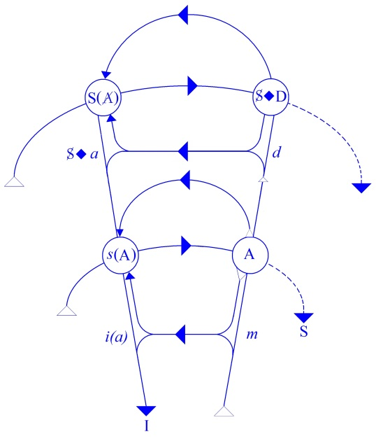
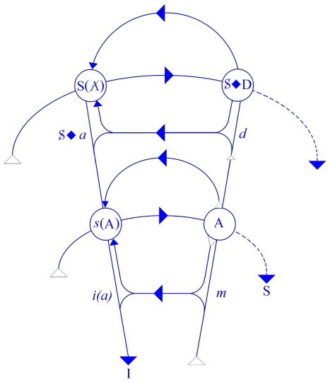

# Leçon 23 | 21 Mai 1958

<!-- source-url: http://staferla.free.fr/S5/S5 FORMATIONS .docx -->
<!-- seminar: s5 -->
<!-- lesson: 23 -->

<!-- id: s5-23-0001 -->

À travers l’exploration que nous poursuivons des structures névrotiques en tant qu’elles sont conditionnées par
ce que nous appelons *les formations de l’inconscient*, nous en sommes arrivés la dernière fois à parler de *l’obsessionnel*.
Nous avons terminé notre discours sur *l’obsessionnel* en disant en somme qu’il a à se constituer quelque part
en face de son désir évanescent.

<!-- id: s5-23-0002 -->

Nous avons commencé d’indiquer, dans la formule du désir comme étant *le désir de l’Autre,* pourquoi chez *l’obsessionnel* ce *désir* est évanescent : ce *désir* est évanescent en raison d’une diffi­culté fondamentale de son rapport avec *l’Autre*, avec *le grand Autre* comme tel, ce grand Autre en tant qu’il est *le lieu où le signifiant ordonne le désir*. C’est cette dimension que nous cherchons ici à articuler parce que nous croyons que c’est faute d’en avoir la dimension que s’introduisent :
et les difficultés dans la théorie, et aussi les déviations dans la pratique. Nous voulons au passage, tissé en quelque sorte à l’intérieur de ce discours, vous faire sentir - c’est le sens de l’ensemble de l’œuvre de FREUD si vous le regardez après un suffisant parcours - que cette décou­verte est celle du *signifiant qui ordonne le désir*. Mais bien sûr,
à l’intérieur de ce phénomène, le sujet cherche à exprimer, à mani­fester dans un *effet de signifiant* en tant que tel
ce qui se passe dans son propre abord avec le *signifié*.

<!-- id: s5-23-0003 -->

Jusqu’à un certain point, l’œuvre de FREUD s’insère elle-même dans cet effort. On a beaucoup parlé à propos
de l’œuvre de FREUD d’un naturalisme : effort de réduction de la réalité humaine à *la nature*. Il n’en est rien.
L’œuvre de FREUD est une tentative de pacte entre cet *être de l’homme* et la nature, et un pacte qui, assurément,

<!-- id: s5-23-0004 -->

est cher­ché ailleurs que dans une relation d’innéïté. C’est à partir du fait que l’homme s’est constitué, se constitue
en tant que sujet de la parole, en tant que « *Je* » de l’acte de la parole, que l’homme est toujours expéri­menté

<!-- id: s5-23-0005 -->

dans l’œuvre de FREUD. Et comment le nier, puisque justement dans l’analyse il n’est pas expérimenté autrement ?

<!-- id: s5-23-0006 -->

Il se trouve donc essentiellement - *en face de la nature* - dans une autre posture que comme « *porteur immanent de la vie* ».
C’est donc à l’intérieur de cette expérience qui fait le sujet de la parole, que le lien - son rapport avec la nature -
a à trouver à s’articuler, à se formuler. Ce rapport à la vie, c’est lui qui se trouve *symbolisé* dans cette sorte de *leurre*
qu’il arrache aux formes de la vie sous *le signifiant du phallus*. Et c’est là que se trouve le point central, le point le plus sensible, le plus significatif de tous ces *carrefours signi­fiants* que nous explorons au cours de l’analyse du sujet. Le *phallus* en est en quelque sorte le sommet, le point d’équilibre, *le signifiant* par excellence *de ce rapport de l’homme au signifié*.

<!-- id: s5-23-0007 -->

Et bien sûr, de ce même fait, il est dans une position, nous dirons, dont l’in­sertion de l’homme dans la dialectique

<!-- id: s5-23-0008 -->

du désir sexuel est vouée à une problématique absolument spéciale. La première est qu’elle a à trouver place
dans quelque chose qui l’a précédée : la *dialectique de la demande,* en tant que la *demande* demande toujours *quelque chose* qui est *plus* et *au-delà* de la satisfaction à laquelle elle fait appel. D’où, si on peut dire, *le caractère ambigu de la place*
*où doit se situer le désir*, cette place qui est toujours problématique :

<!-- id: s5-23-0009 -->

- Elle est *au-delà de cette demande*, au delà, bien sûr, pour autant que la *demande* vise *la satisfaction du besoin*.

<!-- id: s5-23-0010 -->

- Et elle est *en deçà* de la demande - Oui : *en deçà ! -* pour autant que la demande, du fait d’être articulée
  en termes *symboliques*, est une demande qui va au-delà de toutes les satisfactions auxquelles elle fait appel en tant qu’elle est *demande d’amour*, en tant qu’elle est *demande visant à l’être de l’autre*, à obtenir de l’autre cette présentification essentielle qui fait que l’autre donne ce quelque chose qui est *au-delà de toute satis­faction possible*, *qui est son être même*, qui est justement ce qui est visé dans l’*amour*.

<!-- id: s5-23-0011 -->

C’est dans cet espace virtuel, entre

<!-- id: s5-23-0012 -->

- *l’appel de la satisfaction*,

<!-- id: s5-23-0013 -->

- et *la demande d’amour*,
  …que le *désir* a à s’organiser, a à prendre sa place. Et c’est en cela que nous nous trouvons, pour situer le désir, dans cette position toujours double qui est en fait, *par rapport à la demande*, quelque chose qui est à la fois *au-delà* et *en deçà,* selon la face ou l’aspect sous lequel nous envisageons la demande, à savoir :

<!-- id: s5-23-0014 -->

- en tant que *demande par rapport à un besoin,*

<!-- id: s5-23-0015 -->

- ou *demande en tant que structurée en termes de signifiant* et qui, comme telle, dépasse toujours toute espèce de réponse qui soit au niveau de la satisfaction et appelle en elle-même une sorte de réponse absolue qui dès lors va projeter son caractère essentiel de condition absolue sur tout ce qui va s’or­ganiser dans cet intervalle, cet intervalle intérieur en somme aux deux plans de la demande : au plan « *signifié* » et au plan « *signifiant* » où le *désir* à s’articuler, à prendre sa place.

<!-- id: s5-23-0016 -->

C’est justement parce qu’il a à s’articuler et à prendre sa place à cette place que, de l’abord du sujet à ce désir,
*l’Autre devient le relais*. L’*Autre* en tant que *lieu de la parole* et précisément en tant que c’est à lui que s’adresse la demande, va être le lieu aussi où doit être découvert le *désir*, où doit être découverte la *formulation* possible du *désir*.

<!-- id: s5-23-0017 -->

C’est là que s’exerce à tout instant la *contradiction*, car à l’intérieur de *cet Autre*, en tant que lui *est possédé par un désir*,
par un désir qui en somme, inauguralement et fondamentalement, est *étranger au sujet,* les difficultés de la formula­tion de ce désir vont être celles dans lesquelles le sujet va achopper d’autant plus significativement que nous le voyons développer les structures qui sont celles que la découverte analytique a permis de dessiner.

<!-- id: s5-23-0018 -->

Nous l’avons dit, *elles sont différentes ces structures * :

<!-- id: s5-23-0019 -->

- selon que l’accent est mis sur *le caractère d’insatisfaction essentielle de ce désir* : c’est le mode par lequel *l’hys­térique* en aborde le champ et la nécessité,

<!-- id: s5-23-0020 -->

- ou selon que l’accent est mis sur *le carac­tère essentiellement dépendant de l’Autre de l’accès à ce désir* : et c’est le mode sous lequel cet abord se propose à *l’obsessionnel*.

<!-- id: s5-23-0021 -->

Nous l’avons dit en terminant la dernière fois, ici quelque chose se passe qui est différent de cette *identification hystérique*. *Cette identification hystérique* qui tient essentiellement à ce que *l’hystérique*, pour envisager ce désir
qui pour elle est un point énigmatique, quelque chose à quoi nous apportons toujours, si je puis dire, une sorte d’interprétation forcée qui est celle qui caractérise tous les premiers abords que FREUD a fait de l’analyse de *l’hystérie*.

<!-- id: s5-23-0022 -->

FREUD n’a pas dit que le *désir* est situé pour *l’hystérique* dans une position telle que de lui dire « *Voilà celui ou celle*
*que vous désirez* » est toujours *une interprétation forcée*, toujours *une interprétation inexacte*, toujours *une interprétation à côté*.
Il n’y a pas d’exemple où, à propos d’une *hystérique*…

<!-- id: s5-23-0023 -->

- soit dans *les premières observations* que FREUD a données,

<!-- id: s5-23-0024 -->

- soit plus tard, soit dans le cas de Dora,

<!-- id: s5-23-0025 -->

- soit même *si nous étendons le sens d’hystérique au cas de l’homosexuelle* que nous avons lon­guement commenté ici

<!-- id: s5-23-0026 -->

…FREUD n’ait en quelque sorte pas fait erreur, n’ait pas en tous les cas abouti, sans aucune espèce d’exception,
au refus de la patiente d’accéder *au sens du désir, de ses symptômes et de ses actes*, chaque fois que c’est ainsi qu’il a procédé.

<!-- id: s5-23-0027 -->

En effet le désir de *l’hystérique* est essentiellement, et comme tel, non pas *désir d’un objet*, mais *désir d’un désir,* effort pour se maintenir en face de ce point où elle appelle son désir. Et *pour se maintenir en face de ce point où elle appelle son désir*,
le point où est le désir de l’Autre, *elle s’identifie*, au contraire, *à un objet* :

<!-- id: s5-23-0028 -->

- Dora s’identifie à Monsieur K.,

<!-- id: s5-23-0029 -->

- la femme dont je vous ai parlé, Elisabeth von R., s’identifie également à différents personnages de sa famille ou de son entourage.

<!-- id: s5-23-0030 -->

C’est du point où *elle s’identifie à quelqu’un* - pour qui les termes de *moi* ou d’*idéal du moi* sont également impropres quand il s’agit de *l’hystérique - à quelqu’un qui devient pour elle son autre moi* : précisément cet *objet dont le choix de l’identifica­tion* a toujours été expressément articulé par FREUD d’une façon conforme à ce que je suis en train de vous dire.
C’est à savoir que *c’est pour autant qu’elle* - *ou il* - *reconnaît chez un autre,* *ou chez une autre,* *les indices*, si l’on peut dire,
*de son désir*, à savoir qu’elle, ou il, est devant le même problème de désir qu’elle ou que lui, *que se produit l’identification*
et *toutes les formes de contagion, de crises, d’épidémies, de manifestations symptomatiques*, qui sont si caractéristiques de *l’hystérie*.

<!-- id: s5-23-0031 -->

*L’obsessionnel* a d’autres solutions, pour la raison que le problème du désir de l’Autre se présente à lui d’une façon toute différente. Pour l’articuler nous allons essayer d’y accéder par les étapes que nous permet l’expérience concernant *l’obsessionnel*. Je dirai que d’une certaine façon, peu importe par quel bout nous devons prendre
*le vécu de l’obsessionnel* : ce dont il s’agit c’est de ne pas en oublier la diver­sité.

<!-- id: s5-23-0032 -->

Les voies tracées par l’analyse, le chemin par où notre expérience - *tâtonnante*, il faut le dire - nous a incités à résoudre, à trouver la solution du problème de *l’obsessionnel*, ces voies sont partielles ou partiales. Elles livrent bien entendu
par elles-mêmes un *matériel*. La façon dont ce matériel est utilisé, nous pouvons l’expliquer de différentes manières :

<!-- id: s5-23-0033 -->

- par rapport aux résultats obtenus, d’abord,

<!-- id: s5-23-0034 -->

- nous pouvons aussi les critiquer en elles-mêmes. Cette *critique* doit être en quelque sorte *convergente*.

<!-- id: s5-23-0035 -->

L’impression que nous avons, à épeler cette expérience telle qu’elle s’est orientée dans la pratique, c’est incontestablement que la théorie, comme la pratique, tend à se centrer sur l’utilisation de *fantasmes* du sujet.
Ce rôle des *fantasmes* dans le cas de la névrose obsessionnelle a quelque chose d’énigmatique, pour autant que le terme de « *fantasmes »* n’est jamais défini. Nous avons ici beaucoup et longtemps parlé *de rap­ports imaginaires, de la fonction de l’image* *comme guide*, si l’on peut dire, *de l’ins­tinct, comme canal, comme indication* sur le chemin des réalisations instinctuelles.

<!-- id: s5-23-0036 -->

Nous savons d’autre part à quel point est réduit, est mince, est appauvri chez l’homme cet usage - pour autant
qu’on peut le détecter avec certitude - de *la fonction de l’image*, puisqu’elle semble se réduire à l’image narcissique,
à l’image spéculaire, réduite, je dirai, à une fonction extrêmement polyvalente, je ne dis pas *neutralisée*,
puisque également fonctionnant sur le plan de *la relation agressive* et de *la relation érotique*.
Comment, au point où nous en sommes parvenus, pouvons-nous articuler *les fonctions imaginaires*, incontestablement essentielles, prévalentes, dont tout le monde parle, qui sont au cœur de l’expérience analytique, celles du *fantasme* ?

<!-- id: s5-23-0037 -->

<!-- id: s5-23-0038 -->

Je crois qu’à cet endroit \[S ◊ *a*\] nous devons voir que le schéma ici présenté nous ouvre la possibilité d’articuler,
de situer la fonction du fantasme. C’est sans doute par une sorte de biais intuitif de cette topologie, que je vous demande de commencer d’abord par vous le représenter.

<!-- id: s5-23-0039 -->

Bien entendu il ne s’agit pas d’un espace réel, mais il s’agit de quelque chose où peuvent se *dessiner* ces homologies :

<!-- id: s5-23-0040 -->

- si la relation à l’*image de l’autre* \[*i(a)*\] se fait en effet quelque part au niveau d’une expérience qui est intégrée au circuit de la demande, au primitif circuit de la demande, ce en quoi le sujet s’adresse d’abord à l’Autre pour la satisfaction de ses besoins,

<!-- id: s5-23-0041 -->

- et si c’est quelque part sur ce circuit que se fait cette sorte d’accommodation transitiviste, d’effet de prestance qui met le sujet dans un certain rapport à son *sem­blable* en tant que tel,

<!-- id: s5-23-0042 -->

- si donc le rapport de l’image se trouve là, au niveau des expériences et du temps même d’entrée dans le jeu de la parole, à la limite du passage de l’état *infans* à l’état parlant,
  …nous dirons ceci : c’est que dans ce champ où nous cherchons les voies de la réalisation du désir du sujet
  par l’accès au désir de l’Autre, c’est en un point homologue que se trouve la fonction et la situation du fantasme.

<!-- id: s5-23-0043 -->

Le *fantasme*, nous le définirons, si vous voulez, *comme l’imaginaire qui est pris dans un certain usage de signifiant*.
Aussi bien, ceci est important et se manifeste et s’observe de façon caractéristique, ne serait-ce qu’en ceci :

<!-- id: s5-23-0044 -->

quand nous parlons de fan­tasmes, *les fantasmes sadiques* par exemple, qui jouent un rôle si important dans l’économie de l’*obsessionnel,* il ne nous suffit pas de qualifier ces *manifestations* de *fantasmatiques* par le fait qu’elles représentent
quelque chose qui est une tendance qualifiée de *sadique*…
en rapport avec une certaine œuvre littéraire qui, elle-même, ne se présente pas comme une investigation des instincts, mais comme un jeu que le terme d’*imaginaire* serait bien loin de suffire à qualifier,

puisque c’est une œuvre lit­téraire, que ce sont des scènes, pour tout dire, que ce sont des *scénarios*
…que c’est de quelque chose de profondément articulé dans le signifiant qu’il s’agit.

<!-- id: s5-23-0045 -->

En fin de compte, je crois que chaque fois que nous parlons de *fantasmes*, *il faut que nous ne méconnaissions pas le côté « scénario »*, *le côté « histoire »*, qui en forme une dimension essentielle :

<!-- id: s5-23-0046 -->

- ce n’est pas, si l’on peut dire, une sorte d’image aveugle de l’instinct de destruction,

<!-- id: s5-23-0047 -->

- ce n’est pas de quelque chose où le sujet, si l’on peut dire - j’ai beau faire image moi-même pour vous expliquer ce que je veux dire - *voit rouge* tout d’un coup *devant sa proie*, qu’il s’agit,

<!-- id: s5-23-0048 -->

- c’est quelque chose, non seule­ment que le sujet articule en un « *scénario* », mais où le sujet se met lui-même en jeu dans ce « *scénario* ».

<!-- id: s5-23-0049 -->

La formule S ◊ *a*, S *avec la petite barre*, c’est-à-dire *le sujet* au point le plus arti­culé de sa présentification par rapport à *a,*

<!-- id: s5-23-0050 -->

est bien là quelque chose de valable dans toute espèce de déploiement proprement fantasmatique de ce que nous appel­lerons à cette occasion *la tendance sadique*, pour autant qu’elle peut être impliquée dans l’économie de *l’obsessionnel*.

<!-- id: s5-23-0051 -->

Vous remarquerez qu’il y a toujours une scène dans laquelle le sujet est présenté comme tel, sous des formes différemment masquées, dans le « *scénario* » sous la forme d’implications dans des images diversifiées de l’Autre,
dans lequel *un autre* en tant que *semblable*, en tant aussi que *reflet du sujet*, est là présentifié. Je dirai plus : on n’insiste pas assez sur le caractère de présence d’un certain type d’*instrument*. J’ai déjà fait allusion, après FREUD, à l’importance par exemple du *fantasme de flagella­tion*, ce fantasme que FREUD a spécialement articulé en tant qu’il semblerait jouer un rôle très particulier. C’était une des faces de son article, de la communication précise qu’il a faite sur ce sujet,
sur son rôle dans le psychisme féminin. Il l’a fait parce qu’il l’a abordé sous cet angle et sous un certain angle de ses expériences. Bien entendu, *ce fantasme* est loin d’être limité au champ et aux cas dont FREUD a parlé à cette occasion.

<!-- id: s5-23-0052 -->

Mais si on y regarde de près, c’est son champ...
tout à fait légitimement limité pour autant que ce fantasme joue un rôle particulier à un cer­tain tournant

du développement et à un point particulier du développement de la sexualité féminine et très précisément en tant que l’intervention de la fonction du *signifiant du phallus*
...qui joue son rôle particulier à l’intérieur de *la névrose obses­sionnelle* et de tous les cas où nous voyons sortir
les fantasmes dits « *sadiques* ».

<!-- id: s5-23-0053 -->

La pré­sence, la prédominance de cet élément, en fin de compte *énigmatique*, qui donne sa prévalence à cet instrument dont on ne peut pas dire que d’aucune façon *la fonction biologique* l’explique bien. On pourrait l’imaginer ou y trouver

<!-- id: s5-23-0054 -->

je ne sais quel rap­port avec les excitations superficielles, les stimulations de la peau. Vous sentez à quel point ceci aurait un caractère incomplet, un caractère presque artificiel et qu’à la fonction, si souvent apparue à l’intérieur
des fantasmes, de cet élément, à cette fonction s’attache une *plurivalence signifiante* qui met tout le poids de la balance bien plus du côté du *signifié* que quoi que ce soit qui puisse se rattacher à une déduction

<!-- id: s5-23-0055 -->

- de l’ordre biologique,

<!-- id: s5-23-0056 -->

- de l’ordre des besoins,

<!-- id: s5-23-0057 -->

- de l’ordre quel qu’il soit.

<!-- id: s5-23-0058 -->

Donc cette notion du *fantasme* comme quelque chose qui sans aucun doute, participe à l’ordre *imaginaire*
mais qui ne prend sa fonction de *fantasme* dans l’éco­nomie, et à quelque point qu’il s’articule, que de par sa fonction signifiante, est quelque chose qui nous paraît - ça n’a pas été formulé jusqu’à présent comme cela - qui nous paraît essentiel pour parler du fantasme.

<!-- id: s5-23-0059 -->

Je dirai plus : je ne crois pas qu’il y ait d’autre moyen de faire concevoir ce qu’on appelle les *fantasmes inconscients.*
Qu’est-ce que les *fantasmes inconscients*, si ce n’est la latence de quelque chose qui, nous le savons par tout ce que

<!-- id: s5-23-0060 -->

nous avons appris de l’organisation de *la struc­ture de l’inconscient,* est tout à fait possible en tant que *chaîne signifiante* ?
Qu’il y ait dans l’inconscient *des chaînes signifiantes qui subsistent* comme telles et qui, de là, *structurent, agissent sur l’organisme*, influencent ce qui apparaît au dehors *comme symptôme*, ceci c’est tout le fond de l’expérience analytique.
Il est beaucoup plus difficile de concevoir l’*instance* et *l’incidence inconsciente* de quoi que ce soit d’*imaginaire*
que de mettre le *fantasme* lui-même au niveau de ce qui, de commune mesure, est ce qui se présente
pour nous au niveau de l’inconscient, à savoir au niveau du *signifiant*.

<!-- id: s5-23-0061 -->

*Le fantasme est essentiellement un imaginaire pris dans une certaine fonction de signifiant.* Je ne peux pas articuler pour l’instant plus loin cette approche. C’est une certaine façon simplement de vous proposer ce qui plus tard sera articulé
d’une façon plus précise, à savoir la situation :

<!-- id: s5-23-0062 -->

- du point S par rapport à *a,*

<!-- id: s5-23-0063 -->

- du *fait fantasmatique* : S ◊ *a*.

<!-- id: s5-23-0064 -->

*Le fait fantasmatique*, pour tout dire, étant lui-même une relation articulée et toujours complexe, *un « scénario ».*
C’en est la caractéristique, c’est quelque chose qui peut se passer par conséquent et rester latent pendant longtemps en un certain point de *l’inconscient*, qui néanmoins est d’ores et déjà *organisé comme un rêve* par exemple, qui ne se conçoit que si *la fonction du signifiant est seule à lui donner sa structure et sa consistance*, et du même coup son insistance.

<!-- id: s5-23-0065 -->

Ces « fantasmes sadiques » par exemple, dont c’est un fait d’expérience commune et de premier abord,
de l’investigation analytique des obsessionnels que de s’être aperçu de la place que cela tient chez *l’obsessionnel*,
mais que cela ne tient pas forcément d’une façon patente et avérée, mais comme ce que dans le métabolisme

<!-- id: s5-23-0066 -->

de trans­formation obsessionnelle, les tentatives que le sujet comme tel fait vers *une rééquilibration* de ce qui est l’objet de sa recherche équilibrante, à savoir de quelque chose qui est de se reconnaître par rapport à son désir.

<!-- id: s5-23-0067 -->

Bien sûr, quand nous voyons un *obsessionnel* brut, à *l’état de nature*, tel qu’il nous arrive ou qu’il est *censé* nous arriver
à travers les observations publiées, ce que nous trouvons, c’est quelqu’un qui nous parle avant tout de toutes sortes *d’empê­chements, d’inhibitions, de barrages, de craintes, de doutes, d’interdictions*.

<!-- id: s5-23-0068 -->

Nous savons aussi que d’ores et déjà ce n’est pas à ce moment qu’il nous parlera de cette vie *fantasmatique*. Nous savons aussi que c’est chez *les obsessionnels*, chez lesquels soit les interventions thérapeutiques, soit les tentatives autonomes de solution, d’issue, d’élaboration de sa propre difficulté proprement *obsessionnelle*, que nous verrons apparaître d’une façon plus ou moins prédo­minante l’envahissement de sa vie antérieure, de sa vie psychique,
par ces *fantasmes*, que nous qualifions dans l’occasion d’une simple étiquette de « *sadiques* », à savoir de *ces fantasmes*
qui nous proposent déjà, si l’on peut dire, *leur énigme* en tant que nous ne pouvons pas nous contenter de *les articuler* comme manifestations d’une tendance mais *comme organisation elle-même signifiante des rapports du sujet à l’Autre comme tel*. Vous savez d’autre part combien ces fantasmes peuvent prendre chez certains sujets une forme vraiment *envahissante, absorbante, captivante*, qui peut engloutir, si l’on peut dire, des morceaux, des pans entiers de leur vie psychique,
de leur vécu, de leurs occupations mentales.

<!-- id: s5-23-0069 -->

C’est bien du rôle économique de ces fantasmes en tant qu’ici articulés et subsistants qu’il s’agit à cette occasion d’essayer de nous don­ner *une formule*. Ces fantasmes, qui ont pour caractère d’être des fantasmes qui, chez les sujets, res­tent à l’état de fantasmes, qui ne sont réalisés que de façon tout à fait exceptionnelle et d’ailleurs, pour le sujet,
de façon toujours décevante pour autant précisément que nous observons à cette occasion la mécanique
de ce rapport du sujet au désir, à savoir dans la mesure où il peut essayer, dans les voies qui lui sont proposées,
de s’en approcher, c’est précisément dans cette mesure que vient à extinction, à amortissement et à disparition l’approche de ses désirs. *L’obsessionnel* est un TANTALE, dirais-je, si TANTALE n’était pas une image
qui nous est présentée par l’iconographie infernale antique comme une image avant tout orale.

<!-- id: s5-23-0070 -->

Mais ce n’est pourtant pas pour rien que je vous le présente comme tel, parce que nous verrons que
cette sous-jacence orale à ce qui constitue le point d’équilibre, le niveau, la situation du fantasme obsessionnel comme tel, il faut bien tout de même qu’elle existe, puisque en fin de compte c’est ce plan qui, sur *le plan fantas­matique*, est rejoint par le thérapeute, par l’analyste lui-même, pour autant que, comme vous l’avez vu, comme j’y ai fait allusion à propos de la ligne thérapeutique qui est tracée dans la série des trois articles : c’est dans une sorte d’absorption fan­tasmatique que certains thérapeutes et une grande partie de la pratique analytique se sont engagés pour trouver la voie dans laquelle un nouveau mode d’équilibration, un certain « *tempérament* », si l’on peut dire,
est donné à l’accès de *l’obsessionnel* dans cette voie de *la réalisation de son désir*.

<!-- id: s5-23-0071 -->

Observons pourtant qu’à prendre les choses par ce bout, nous ne voyons qu’une face du problème. De l’autre face,

<!-- id: s5-23-0072 -->

il faut bien que nous déployons cet éventail suc­cessivement. Et bien entendu, nous ne méconnaissons pas :

<!-- id: s5-23-0073 -->

- ce qui se présente de la façon la plus apparente dans *les symptômes de l’obsessionnel*,

<!-- id: s5-23-0074 -->

- ce qui d’habitude est présenté sous la forme de ce qu’on appelle les exigences du *super-ego.*

<!-- id: s5-23-0075 -->

C’est de la façon dont nous devons concevoir chez *l’obsessionnel* ces exigences, c’est de la racine de ces exigences
chez *l’obsessionnel*, qu’il va s’agir maintenant. Ce qui se passe chez l’ob­sessionnel, je crois que nous pouvons l’indiquer et le lire au niveau de ce schéma d’une façon qui, je crois, se révélera par la suite n’être pas moins féconde.

<!-- id: s5-23-0076 -->

<!-- id: s5-23-0077 -->

On pourrait dire que l’obsessionnel est toujours en train de *demander une per­mission*.

<!-- id: s5-23-0078 -->

Je crois que ceci, vous le retrouverez au niveau du concret, au niveau de ce que vous dit *l’obsessionnel* dans ses *symptômes*. Même, ceci est inscrit et très souvent articulé : il est toujours en train de demander une permission, et nous verrons quel est le pas suivant, mais *de fait*, si nous nous fions à ce schéma, ce qui se passe à ce niveau est important.

<!-- id: s5-23-0079 -->

*Demander une permission*, c’est justement avoir, comme sujet, un certain rapport avec sa *demande*. Une permission,
pour *l’obsessionnel*, c’est en fin de compte restituer cet Autre avec un grand A, qui est justement ce que nous avons dit, pour entrer dans cette dialectique qui était pour lui mise en cause, mise en question, voire mise en danger : se mettre dans la plus extrême dépendance par rap­port à l’Autre avec un grand A, c’est-à-dire à *l’Autre en tant qu’il parle*.

<!-- id: s5-23-0080 -->

C’est déjà quelque chose qui nous indique à quel point *cette place est essentielle à maintenir pour l’obsessionnel*.
Je dirai même que c’est bien là que nous voyons la pertinence chez FREUD de *ce qu’il appelle toujours* *Versagung, refus*.
*Refus -* et *permission*, d’ailleurs, impliquée dans le fond : le pacte de quelque chose qui est refusé, si l’on peut dire,
sur un fond de promesse - au lieu de parler de « *frustration* ». Ce n’est pas au niveau de la *demande* pure et simple que se pose le problème des relations à l’Autre en tant qu’il s’agit d’un sujet au complet. Cela se pose ainsi quand nous faisons un essai de recours au *développement*, quand nous nous imaginons *un petit enfant* plus ou moins impuissant *devant sa mère*, c’est-à-dire quand nous fai­sons nous-mêmes un objet de quelqu’un qui est à la merci de quelqu’un d’autre.

<!-- id: s5-23-0081 -->

Mais dès lors que le sujet est dans ce rapport que nous avons défini avec l’Autre par la parole, il y a au-delà de toute réponse de l’Autre, et très précisément en tant que *la parole crée cet au-delà de sa réponse*, il y a un point quelque part, virtuel. Sans doute, non seulement il est virtuel, mais à la vérité s’il n’y avait pas l’analyse, nous ne pourrions répondre que personne n’y accède, sauf à cette sorte d’analyse maî­tresse et spontanée que nous supposons toujours possible chez quelqu’un qui réali­serait parfaitement le « *Connais-toi toi-même* ». Mais il est certain pour nous que nous avons toutes raisons de penser que ce point n’a jamais été dessiné jusqu’à pré­sent, d’une façon stricte, que *dans l’analyse*.

<!-- id: s5-23-0082 -->

Ce que dessine *la notion de Versagung* est à proprement parler en elle-même *cette situation du sujet par rapport à la demande*.
Et ici, ce que je veux accentuer, c’est ceci - et je dirai, c’est un petit pas que je vous demande de faire sur le même front d’avance que celui que je vous ai demandé à propos du fantasme - ce dont nous par­lons quand nous parlons

<!-- id: s5-23-0083 -->

de *stade*, de *relation fondamentale à l’objet*, ce que nous qualifions *d’oral, d’anal,* voire *de génital,* qu’est-ce que c’est ?
Il y a ici *une espèce de mirage* qui s’établit par le fait que, reprojetant tout ceci dans *le développement*, nous prenons *la notion,*
mais qui n’est jamais qu’une notion reconstruite après coup, qu’un certain type de relation structurant l’*Umwelt*
du sujet autour d’une fonction centrale est quelque chose qui définit dans le développement son rapport
avec le monde en donnant à tout ce qui lui arrive de son environnement une signification spéciale.

<!-- id: s5-23-0084 -->

Ceci n’est même pas d’habitude articulé d’une façon aussi élaborée. Précisément le fait que toutes ces actions,
par exemple, de l’environnement subiraient, si l’on peut dire, la réfraction à travers l’objet typique *oral, anal, et génital* : ceci est très souvent éludé. On parle purement et simplement d’objet, puis on parle à côté, d’environnement.
On ne songe pas un seul instant à voir la différence qu’il y a entre *l’objet typique* d’une certaine relation définie par

<!-- id: s5-23-0085 -->

un cer­tain stade de rejet chez le sujet, et l’environnement concret, avec ses incidences mul­tiples, à savoir la pluralité de cet objet auquel le sujet, quel qu’il soit, est toujours sou­mis, et ceci quoi qu’on en dise, dès sa plus petite enfance.

<!-- id: s5-23-0086 -->

La prétendue absence des objets, la prétendue \[...\] du nourrisson, est quelque chose sur quoi jusqu’à nouvel ordre nous devons ici porter le plus grand doute. Je dois vous dire que pour moi, d’ores et déjà, si vous voulez m’en croire, vous tiendrez cette notion pour purement illusoire, puisque il s’agit, grâce au recours à l’observation directe
chez les tout *petits enfants*, de savoir qu’il n’en est rien, que les sujets du monde sont pour lui aussi multiples qu’intéressants et stimulants.

<!-- id: s5-23-0087 -->

De quoi s’agit-il donc ? Les découvertes que nous avons faites, nous pouvons *les définir et les articuler* comme étant
en effet *un certain style de la demande du sujet*. Nous les avons découvertes où, ces manifestations qui nous ont fait parler de rap­ports successivement *oraux, anaux,* voire *génitaux,* au monde ? Nous les avons découvertes dans des analyses, dans des analyses qui étaient faites chez des gens qui avaient depuis longtemps dépassé les stades en question,
en tant qu’ils sont des *stades de développement infantile*, et nous disons que le sujet régresse à ces stades.
Que voulons-nous dire quand nous disons qu’il régresse à ces stades ?

<!-- id: s5-23-0088 -->

Je crois que de dire qu’il y a quoi que ce soit qui ressemble à un retour à ces mêmes étapes *imaginaires*, si tant est même qu’elles soient concevables, mais supposons-les recevables, qui sont celles de l’enfance, est quelque chose qui nous leurre et qui ne nous livre pas la véritable nature du phénomène. Quand nous parlons de fixation, par exemple
à un certain stade chez le sujet névrotique, qu’est-ce que nous pourrions essayer d’articuler qui serait plus satisfaisant que ce qui nous est donné d’habitude, si effectivement ce dont il s’agit - ce qui est notre but, ce qui est *dans tous les cas notre chemin* \[*sic*\], c’est en somme ce que nous voyons *dans l’analyse*, à savoir que le sujet arti­cule au cours de la régression,

<!-- id: s5-23-0089 -->

et nous verrons mieux par la suite ce que veut dire alors ce terme de *régression,* le sujet articule sa demande actuelle dans l’analyse dans des termes qui nous permettent de reconnaître *un certain rapport* respectivement *oral, anal, génital, avec un certain objet*.

<!-- id: s5-23-0090 -->

Est-ce que vous ne voyez pas que ceci veut dire qu’à une certaine étape : c’est en tant qu’ils sont passés à *la fonction*
*de signifiant* que les rapports du sujet ont pu exer­cer sur toute la suite de son *développement* une influence décisive ?

<!-- id: s5-23-0091 -->

*C’est en tant qu’à un certain niveau*, le niveau de l’inconscient, *le sujet articule sa demande en termes oraux*, que le sujet S
est dans un certain rapport ici au niveau d’une articulation signifiante virtuelle qui est celle de l’inconscient.

<!-- id: s5-23-0092 -->

*C’est en tant que* c’est en termes d’*absorption* que *le sujet* articule son désir, que nous pouvons parler à la fois

<!-- id: s5-23-0093 -->

- de quelque chose qui se présentera à un moment de l’ex­ploration avec une valeur particulière, dite « *fixation à un certain stade* »,

<!-- id: s5-23-0094 -->

- et que, d’autre part, il y aura intérêt à faire *régresser* le sujet à ce stade pour que quelque chose d’es­sentiel puisse *être élucidé* du mode sous lequel se présente son *organisation sub­jective*.

<!-- id: s5-23-0095 -->

*Mais c’est à cela* *en tant* uniquement que ce qui nous intéresse, ce n’est pas de donner à ce qui a été, à plus ou moins juste titre, à un moment donné, l’insatisfac­tion du sujet sur le plan d’une demande *orale, anale* ou autre, la satisfaction où s’ar­rêterait le sujet, que nous avons *à donner compensation, gravitation, retour, même symbolique.*

<!-- id: s5-23-0096 -->

*C’est en tant* que c’est à ce moment de sa demande que se sont posés pour lui, d’une certaine façon, *les problèmes*
*de ses rapports à l’Autre*, en tant qu’ils vont être, pour la suite, tout à fait déterminants pour la mise en position,
la mise en place de son désir, c’est uniquement en cela que ceci nous intéresse. En d’autres termes, tout ce qui est
de la demande dans ce qui a été effectivement vécu par le sujet, ceci est une fois pour toutes et désormais révolu.
*Les satisfactions* ou les compensations que nous pouvons lui donner ne seront jamais en fin de compte que *symboliques*, et les donner peut même être considéré comme une erreur. C’est une erreur pour autant, bien sûr, que cela n’est pas tout à fait impossible. Nous verrons pourquoi *ce n’est pas tout à fait impossible*, précisément grâce à l’in­tervention des fantasmes, de ce quelque chose de plus ou moins substantiel, si l’on peut dire, qui est supporté par le fantasme.

<!-- id: s5-23-0097 -->

Mais je crois que c’est une erreur d’orien­tation de l’analyse, car cela laisse, en fin de compte,
à la fin de l’analyse la question des rapports à l’Autre non apurée.

<!-- id: s5-23-0098 -->

L’*obsessionnel* disons-nous, *de même que l’hystérique, a besoin d’un désir insa­tisfait, c’est-à-dire d’un désir au-delà d’une demande.*

<!-- id: s5-23-0099 -->

*L’obsessionnel* résout la ques­tion de *l’évanescence de son désir* en en faisant un désir interdit. Il le fait supporter par l’Autre, et précisément par *l’interdiction* de l’Autre. Néanmoins cette façon de faire supporter, soutenir son désir par l’Autre, est ambiguë. Elle est ambiguë parce qu’un désir interdit ne veut pas dire pour autant un désir étouffé.
L’interdiction est là pour soutenir le désir, mais pour qu’il se soutienne, il faut qu’il se présente.

<!-- id: s5-23-0100 -->

Aussi bien, *c’est ce que fait l’obsessionnel* et il s’agit de savoir comment. La façon dont il le fait est comme vous le savez, très complexe. *Il le montre à la fois et il ne le montre pas : il se camoufle pour tout dire*, et il est facile de com­prendre pourquoi.

<!-- id: s5-23-0101 -->

Ses intentions, si l’on peut dire, ne sont pas pures. Ceci, on s’en était déjà aperçu, c’est ce qu’on a désigné précisément par *l’agressivité de l’obses­sionnel* : fondamentalement toute émergence de son désir serait pour lui l’occasion
de cette projection ou de cette crainte de rétorsion qui inhiberait précisément toutes les manifestations de son désir.

<!-- id: s5-23-0102 -->

Je crois que c’est là un *premier abord* de la question, mais que ce n’est pas tout, et que c’est méconnaître ce dont il s’agit tout à fait dans le fond que de dire simple­ment que l’obsessionnel se balance sur une sorte d’escarpolette qui va

<!-- id: s5-23-0103 -->

de la mani­festation d’un désir qui, à aller trop loin, devient un désir agressif et qui de là, redes­cend ou rebascule

<!-- id: s5-23-0104 -->

dans une disparition, si l’on peut dire, qui sera liée à la crainte de la rétorsion effective de la part de l’Autre,
de cette agressivité : à savoir de subir de sa part une destruction équivalente à celle du désir qu’il manifeste.

<!-- id: s5-23-0105 -->

Je crois qu’il y a lieu de prendre dans une appréhension globale ce dont il s’agit en l’occasion, et pour le faire,
il faut presque passer par les illusions que ce rapport à l’Autre développe à l’intérieur de nous-mêmes, je dirais
de nous autres analystes, de la théorie analytique elle-même. En fin de compte, cette notion du rapport à l’Autre
est toujours sollicitée par un glissement qui tend à réduire le désir au problème de la demande.

<!-- id: s5-23-0106 -->

Si *le désir* est effec­tivement ce que j’ai articulé ici, c’est-à-dire ce quelque chose qui se produit dans la béance
que la parole ouvre dans la demande, et donc comme tel au-delà de toute demande concrète, il est clair que toute tentative de réduire le désir à quelque chose dont on demande la satisfaction se heurte à une contradiction interne.

<!-- id: s5-23-0107 -->

Je dirai jus­qu’à un certain point que le terme d’*oblativité…*

<!-- id: s5-23-0108 -->

> à savoir de la reconnaissance du désir de l’Autre comme tel, de ce en quoi les analystes presque dans leur commu­nauté présentement, mettent le sommet et le *summum* d’une réalisation heureuse du sujet : de ce qu’ils appellent la *maturité génitale,* et dont je vous lisais un exemple l’autre fois dans un passage de l’auteur que j’ai *mis en cause*, à savoir de cette prise pro­fonde de satisfaction dans la satisfaction donnée à la demande de l’Autre, pour tout dire de ce qui s’appelle communément « *altruisme* »
> *…*est justement ce quelque chose qui laisse échapper ce qu’il y a effectivement à résoudre dans le problème du *désir*.

<!-- id: s5-23-0109 -->

Pour tout dire, *je crois que le terme d’*«* oblativité *», tel qu’il nous est présenté dans cette perspective moralisante
\- on peut le dire sans forcer les termes *- est un fantasme obsessionnel*. Il est tout à fait certain que dans l’analyse,

<!-- id: s5-23-0110 -->

telles que les choses se pré­sentent, les tempéraments - je parle de ceux que la pratique théorise pour des raisons
qui sont très faciles à comprendre les tempéraments *hystériques* sont beaucoup plus rares que les natures *obsessionnelles*.

<!-- id: s5-23-0111 -->

Une partie de « *l’endoctrination* » de l’ana­lyse est faite selon la ligne, selon les cheminements des *vœux obsessionnels* :
l’illusion, le fantasme même qui est à la portée de *l’obsessionnel*, c’est en fin de compte que l’Autre comme tel
soit consentant à son désir. Ceci comporte en soi des difficultés extrêmes, puisqu’il faut qu’il soit *consentant*,
mais d’une façon toute différente d’une réponse à une satisfaction quelconque, d’une réponse à la demande.
Mais c’est tout à fait éludé : le problème est de nous donner la solution en court-circuit. Cela est plus souhaitable
que de penser qu’en fin de compte il suffit de se mettre d’accord et que, « *pour trouver le bonheur dans la vie,*
*il suffit de ne pas infliger aux autres les frustrations dont on a été l’objet soi-même* ».

<!-- id: s5-23-0112 -->

Une part des issues malheureuses et parfaitement confusionnelles de l’analyse dérive du fait de traiter la demande…
à partir d’un certain moment où le sujet est exalté par la perspective des bonnes intentions qui s’établissent rapidement dans un certain nombre de présupposés à l’heureuse terminaison du traitement analytique
…en se livrant à quelque chose qui est un des penchants les plus communs de *l’obsessionnel*, à savoir ce quelque chose qui s’exprime à peu près : « *Ne fais pas aux autres ce que tu ne voudrais pas que l’on te fît à toi-même.* » *Cet impératif, assurément caté­gorique*, est tout à fait essentiel et structurant dans *la morale*, mais n’est pas toujours d’un emploi pratique dans l’existence. Il est assurément complètement à côté quand il s’agit d’une réalisation comme la conjonction sexuelle.

<!-- id: s5-23-0113 -->

L’ordre de rapport à l’Autre qui consiste à se mettre à sa place est quelque chose qui assurément est un glissement tentant, d’autant plus tentant que l’*analyste*, étant justement vis-à-vis de cet autre qui est le petit autre, son semblable, dans un rapport agressif, est tout naturellement tenté d’être dans cette position de l’épargner, si l’on peut dire.
Épargner l’autre, c’est bien ce qui est au fond de toute une série de céré­monials, de précautions, de détours,

<!-- id: s5-23-0114 -->

bref de toutes les manigances de *l’obsessionnel*.

<!-- id: s5-23-0115 -->

Si c’est pour en arriver à « *doctriner* », à faire une espèce de généralisation de ce qui se manifestait sans doute non sans raison d’une façon beaucoup plus compliquée dans ses *symptômes*, d’en faire une espèce d’extrapolation moralisante,
et de lui proposer comme fin et issue de ses problèmes ce qu’on appelle « *l’issue oblative* », c’est-à-dire la soumission aux demandes de l’Autre, je crois que ce n’était vraiment pas la peine de faire ce détour.

<!-- id: s5-23-0116 -->

Pour tout dire, ce n’est vraiment que substituer, comme l’ex­périence le montre, *un symptôme*, et *un symptôme très grave* car il ne manque pas, bien entendu, d’engendrer ce qui va se produire, à savoir le resurgissement, *sous d’autres formes* plus ou moins problématiques, du désir qui n’a jamais été, et qui ne saurait être par ces voies d’aucune façon résolu.
Il est tout à fait clair que dans cette perspective on peut dire que les voies que trouve de lui-même *l’obsessionnel* et dans lesquelles il cherche la solution du pro­blème de son désir, sont autrement adéquates, si elles ne sont pas adaptées, parce que le problème s’y lit au moins d’une façon claire.

<!-- id: s5-23-0117 -->

Par exemple, il y a plusieurs modes de solution : il y a des modes de solution précisément au niveau d’un rapport effectif avec l’autre. La façon dont *l’obsessionnel* se comporte avec son semblable quand il en est encore capable,
quand il n’est pas submergé par ses *symptômes* - et il est rare qu’il le soit complètement - est quelque chose qui

<!-- id: s5-23-0118 -->

en soi-même est suffi­samment indicatif et donnant sans doute dans une voie en impasse mais donnant tout de même une indication qui n’est pas si mauvaise pour la direction. Par exemple je vous ai parlé des manifestations d’*exploit des obsessionnels*. Qu’est-ce que c’est que cet *exploit* ? Pour qu’il y ait exploit, il faut que l’on soit au moins trois :

<!-- id: s5-23-0119 -->

- parce qu’on ne fait pas son exploit tout seul, il faut être deux au moins pour qu’il y ait quelque chose qui y ressemble, pour qu’il y ait performance gagnée, *sprint...*

<!-- id: s5-23-0120 -->

- Puis il faut qu’il y ait aussi quelqu’un qui enregistre et qui soit le témoin.

<!-- id: s5-23-0121 -->

Il est bien clair que ce que dans *l’ex­ploit l’obsessionnel* cherche à obtenir, c’est très précisément ceci : il cherche à obte­nir ce que nous appelions tout à l’heure « *la permission de l’Autre* », au nom de quelque chose qui est très *polyvalent*,
on peut dire au nom de ceci : qu’il a bien mérité ce qu’il cherche à obtenir. Or la satisfaction n’est pas quelque chose qui se classe du tout sur le terrain où il l’a bien méritée. Observez la structure de nos *obsessionnels*.

<!-- id: s5-23-0122 -->

Ce qu’on appelle « *effet de super-ego* » veut dire quoi ? Cela veut dire qu’ils s’infligent toutes sortes de tâches particulièrement dures, particulièrement éprouvantes, qu’ils les réussissent d’ailleurs, qu’ils les réussissent d’autant plus facilement que c’est justement qu’ils dési­rent le faire, mais là ils réussissent très très brillamment,
et au nom de cela ils auraient bien droit à de petites vacances pendant lesquelles on ferait ce qu’on voudrait :
d’où *la dialectique* bien connue *du travail et des vacances*.

<!-- id: s5-23-0123 -->

Chez *l’obsessionnel*, le travail est puissant, étant fait pour libérer le temps de *la grand’voile* qui sera celui des vacances,

<!-- id: s5-23-0124 -->

et le passage des vacances se révélant habi­tuellement un temps à peu près perdu. Pourquoi ? Parce que, bien entendu, ce dont il s’agit c’était d’obtenir la permission de l’Autre. Et comme l’autre - je parle de l’autre en fait, de l’autre qui existe - n’a absolument rien à faire avec toute cette dia­lectique pour la simple raison que l’autre réel est bien trop occupé avec son propre Autre, il n’a aucune raison de remplir cette mission de donner à l’exploit de l’obses­sionnel

<!-- id: s5-23-0125 -->

sa petite couronne, à savoir ce quelque chose qui serait justement la réalisa­tion de son désir en tant que ce désir

<!-- id: s5-23-0126 -->

n’a rien à faire avec le terrain sur lequel il a démontré toutes ses capacités.

<!-- id: s5-23-0127 -->

Ceci est une phase certainement très sensible, et qui vaut bien la peine d’être exposée sous son aspect humoristique. Mais elle ne se limite pas là. C’est justement l’intérêt de ces concepts comme le grand Autre et le petit autre :

<!-- id: s5-23-0128 -->

c’est d’être appli­cables, de structurer des rapports vécus dans beaucoup plus d’une direction.

<!-- id: s5-23-0129 -->

On peut dire aussi, d’un certain côté, que *dans l’exploit le sujet domine* - et cela a été dit par d’autres que moi - *apprivoise, voire domestique* ce qu’on appelle *une angoisse fon­damentale*, et là encore je crois que l’on méconnaît une dimension
du phénomène, à savoir que l’essentiel n’est pas dans cette expertise, dans ce risque couru qui est tou­jours

<!-- id: s5-23-0130 -->

chez *l’obsessionnel* un risque couru dans des limites très strictes, je veux dire dans le fait qu’une savante économie distingue strictement tout ce que *l’obsessionnel* risque dans son exploit, de quoi que ce soit qui ressemble
à ce qu’on appelle « *le risque de la mort* » dans la dialectique hégélienne.

<!-- id: s5-23-0131 -->

Il y a quelque chose dans *l’exploit de l’obsessionnel* qui reste toujours irrémé­diablement *fictif*, pour la raison que la mort,

<!-- id: s5-23-0132 -->

je veux dire là où est *le véritable danger*, est tout à fait ailleurs que dans l’adversaire qu’il a l’air de défier effectivement.
Il est justement au côté de ce témoin invisible, de cet Autre qui est là comme le spectateur, celui qui compte les coups et qui va dire de l’autre : « *Décidément* - comme on s’exprime quelque part dans le délire de SCHREBER - *c’est un rude lapin !* »
Mais on retrouverait cette sorte d’exclamation, de façon d’accuser le coup comme implicite, comme latente,
comme souhaitée dans toute cette dialectique de l’exploit.

<!-- id: s5-23-0133 -->

*L’obsessionnel* ici met dans un certain rapport *l’existence de l’autre comme étant son sem­blable*, comme étant celui à la place duquel il peut se mettre. Et c’est justement parce qu’il peut *se mettre à sa place* qu’il n’y a en réalité aucune espèce

<!-- id: s5-23-0134 -->

de *risque* essen­tiel dans ce qu’il démontre dans ses effets de prestance de jeu sportif, de risque plus ou moins pris.

<!-- id: s5-23-0135 -->

Cet autre avec lequel il joue, ce n’est jamais, en fin de compte, qu’un autre qui est lui-même, qu’un autre qui d’ores
et déjà *lui laisse* de toute façon, et de quelque côté qu’il prenne les choses, la palme. Mais *l’Autre* devant qui tout cela se passe, c’est celui-là qui est important, c’est celui-là aussi qu’il faut à tout prix préser­ver :

<!-- id: s5-23-0136 -->

- c’est le point, *le lieu où s’enregistre*, si on peut dire, *l’exploit*,

<!-- id: s5-23-0137 -->

- c’est *là où s’inscrit*, si on peut dire, *son histoire*,
  ...*ce point qui doit être à tout prix maintenu* et qui le fait si adhérent à tout ce qui est de l’ordre verbal, à tout ce qui est
  de l’ordre du *comput*, *de la récapitulation, de l’inscription*, de la falsification aussi, et qui fait que *ce que l’obsessionnel veut*
  *avant tout maintenir* sans en avoir l’air, en ayant l’air de viser autre chose, *c’est cet Autre*, avec un grand A,
  dans lequel les choses s’articulent en termes de signifiant.

<!-- id: s5-23-0138 -->

Voici donc un premier abord sous lequel nous pouvons commencer d’aborder ce vœu puisque,
au-delà de toute *demande* et de ce qu’il *désire*, il s’agit de voir à quoi vise dans son ensemble *la conduite de l’obsessionnel*.
Il est certain que ce maintien de l’Autre est pour lui la visée essentielle, parce qu’elle est la visée première, la visée préliminaire à l’intérieur de laquelle seulement peut être faite *cette validation* si dif­ficile *de son désir*.

<!-- id: s5-23-0139 -->

Qu’est-ce que peut être et qu’est-ce que sera *cette validation* ? C’est ce que nous aurons à articuler par la suite.
Mais d’abord il faut *que les quatre coins,* *si l’on peut dire,* *de sa conduite soient fixés* de façon telle que les arbres, *si l’on peut dire*, ne nous cachent pas la forêt et que, pour surprendre tel ou tel de ces petits méca­nismes, nous ne soyons pas

<!-- id: s5-23-0140 -->

en quelque sorte arrêtés, fascinés par ce mécanisme lui donnant une espèce, parce qu’il a un certain style,
trouvant là cette *satisfaction*.

<!-- id: s5-23-0141 -->

Il est évident que l’on a toujours à s’arrêter à un détail quelconque d’un orga­nisme, c’est *une satisfaction* qui n’est pas complètement illégitime, puisqu’un détail reflète bien toujours, au moins dans le domaine des phénomènes naturels, quelque chose de la totalité. Mais dans une matière qui est d’une organisation aussi peu naturelle que celle des rapports du sujet au signifiant, nous ne pouvons pas entière­ment nous fier à la reconstitution de toute l’organisation obsessionnelle à partir de tel *mécanisme de défense*, car bien entendu, tout cela vous pouvez vous mettre à l’ex­primer dans le catalogue des *mécanismes de défense*.

<!-- id: s5-23-0142 -->

J’essaye de faire autre chose : j’essaye de vous faire trouver *les quatre coins cardi­naux* autour desquels s’oriente

<!-- id: s5-23-0143 -->

et se polarise chacune des défenses du sujet. En voici déjà deux pour aujourd’hui, à savoir ce coin que nous avons d’abord abordé : *le rôle du fantasme*. Nous voyons maintenant à propos de l’exploit que *cette présence de l’Autre* comme tel
est quelque chose qui est tout à fait fondamental.

<!-- id: s5-23-0144 -->

Il y a un autre point sur lequel je voudrais au moins vous introduire le chapitre : en entendant parler de l’exploit,
vous avez pensé sans doute à toutes sortes de com­portements de vos obsessionnels, mais il y a un exploit
qui ne mérite peut-être pas tout à fait d’être épinglé sous le même titre, c’est ce qu’on appelle dans l’analyse *l’acting out.*
Là je me suis livré - *vous vous livrerez aussi j’espère*, à mon exemple, ne serait-ce que pour confirmer ce que j’avance -

<!-- id: s5-23-0145 -->

à quelques investigations dans la lit­térature. C’est très surprenant. À tel point qu’on n’en sort pas.

<!-- id: s5-23-0146 -->

Une personne a fait le meilleur article sur ce sujet, à savoir Phyllis GREENACRE, sous le titre « *General problems*

<!-- id: s5-23-0147 -->

*of acting out »* [^58]. C’est un article tout à fait remarquable en ceci qu’il montre que jusqu’à pré­sent rien n’a été articulé

<!-- id: s5-23-0148 -->

de valable là-dessus. Je crois qu’il faut limiter ces problèmes. Je crois qu’il est tout à fait impossible de les limiter,
si on s’en tient par exemple à la notion générale : que l’*acting out* est un symptôme, que c’est un compromis,
qu’il a un sens double, que c’est un acte de répé­tition, …car c’est le noyer dans toutes les compulsions de la répétition dans leurs formes les plus générales.

<!-- id: s5-23-0149 -->

Je crois que si cela a un sens, c’est toujours quelque chose qui surgit au cours d’une tentative de solution
de ce problème de la *demande* et du *désir*, et c’est pourquoi ces sortes d’actes qu’on appelle *acting out se* produisent
d’une façon plus élective durant l’analyse, parce que tout de même, quoi qu’on en *fasse* effectivement dans l’analyse,
ce sont bien des tentatives de solution de ce problème de la relation du *désir* et de la *demande*.

<!-- id: s5-23-0150 -->

L’*acting out* se produit certainement *sur le chemin*, sur le champ de cette réalisa­tion dans l’analyse du *désir inconscient*.

<!-- id: s5-23-0151 -->

Il est extrêmement instructif, parce que si nous cherchons de près ce qui caractérise les faits d’*acting out,*
nous y trouvons toutes sortes de composants absolument nécessaires qui feront par exemple que c’est
ce qui les distingue absolument de ce qu’on appelle *un acte manqué,* à savoir de ce que j’ap­pelle ici de façon

<!-- id: s5-23-0152 -->

plus propre, *un acte réussi*, je veux dire un *symptôme* pour autant qu’il laisse clairement apparaître une \[...\].
L’*acting out* est quelque chose qui par exemple comporte toujours un élément hautement signifiant, et justement
en ceci qu’il est énigmatique. Nous n’appellerons jamais *acting out* qu’un acte qui se présente avec ce caractère
tout spécialement *immotivé*. Cela ne veut pas dire du tout qu’il n’ait pas de *cause*, mais qu’il est juste­ment très *immotivable psychologiquement*, car c’est un acte toujours signifié.

<!-- id: s5-23-0153 -->

Le rôle, d’autre part, d’un objet dans l’*acting out,* d’un objet au sens matériel du terme, c’est-à-dire ce sur quoi je serai amené à revenir la prochaine fois pour vous montrer justement quelle fonction limitée il s’agit d’accorder dans toute cette dia­lectique, au rôle de l’objet, il existe toujours dans l’*acting out.*

<!-- id: s5-23-0154 -->

D’autre part, la fonc­tion et la relation, presque l’équivalence qu’il y a entre le fantasme et l’*acting out.* Je veux dire
que l’*acting out* est structuré en général d’une façon qui se rapproche beau­coup de celle d’un « *scénario* », c’est à sa façon quelque chose qui est du même niveau que le *fantasme*. Il y a une chose qui le distingue du *fantasme*, et qui le distingue aussi de *l’exploit*, c’est que si l’exploit est un excercice, un tour de force, un *tour de passe-passe* destiné en fin de compte à faire plaisir à l’Autre, au grand Autre qui, je vous l’ai dit, s’en *contrefiche*, l’*acting out* est autre chose. Et c’est en cela qu’il est intéressant pour nous à considérer : *l’acting out est toujours un message* et c’est en cela qu’il nous inté­resse.

<!-- id: s5-23-0155 -->

Quand il se produit dans une analyse, il est toujours adressé à l’analyste, et à l’analyste en tant qu’en somme *il n’est pas trop mal placé, mais qu’il n’est pas non plus tout à fait à sa place*. C’est en général un *hint* que nous fait le sujet, *qui va quelque fois très loin, et qui est quelque fois très grave*, mais c’est un *hint* si l’*acting out* se produit en dehors des limites du traitement.
Il est évident que c’est un *hint* dont l’analyste ne saurait guère profiter, mais c’est justement ce qu’il y a de sérieux
et de grave : c’est que chaque fois que nous serons amenés à désigner d’une façon précise quelque chose qui ait
le caractère de cet acte paradoxal - que nous essayons de cerner et qui s’appelle l’*acting out -* en dehors des limites

<!-- id: s5-23-0156 -->

du traitement, assuré­ment ce qu’il s’agira en fin de compte d’atteindre, c’est quelque chose d’articulé sur cette ligne,
à savoir une mise au clair des rapports du sujet à la demande, pour autant qu’elle révèle que tout rapport à cette demande est fondamentalement inadéquat pour autant qu’il s’agit que le sujet accède, en fin de compte, à la réalité effective de cet effet du signifiant sur le sujet, à savoir à se mettre au niveau du *complexe de cas­tration* comme tel,

<!-- id: s5-23-0157 -->

et strictement, c’est à savoir que ceci aura été manqué.

<!-- id: s5-23-0158 -->

Ceci peut être manqué - et c’est ce que j’essayerai de vous montrer la prochaine fois - précisé­ment dans la mesure

<!-- id: s5-23-0159 -->

où cet *espace intervallaire* où se produisent tous ces exercices troubles qui vont de *l’exploit* au *fantasme*, et du *fantasme*

<!-- id: s5-23-0160 -->

à un *amour* tout à fait *pas­sionné et partiel -* c’est bien le cas de le dire - *de l’objet*, car jamais ABRAHAM n’a parlé d’*objet partiel,* mais « *d’amour partiel de l’objet* », c’est en tant que se déplaçant dans *cet espace intermédiairede l’objet* qu’on a obtenu des solutions illusoires. Solution illu­soire, très précisément celle qui se manifeste dans ce qu’on appelle

<!-- id: s5-23-0161 -->

« *le transfert homo­sexuel* » à l’intérieur de la névrose obsessionnelle. C’est cela que j’appelle la solution illusoire,
et j’espère la prochaine fois vous montrer dans le détail pourquoi c’est une solution illusoire.

## Notes

[^58]: Phyllis Greenacre : « *General problems of acting out* », *The Psychoanalytic Quarterly*, Vol. XIX, N° 4, 1950, pp. 455-467.
