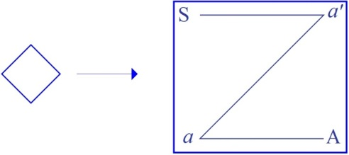
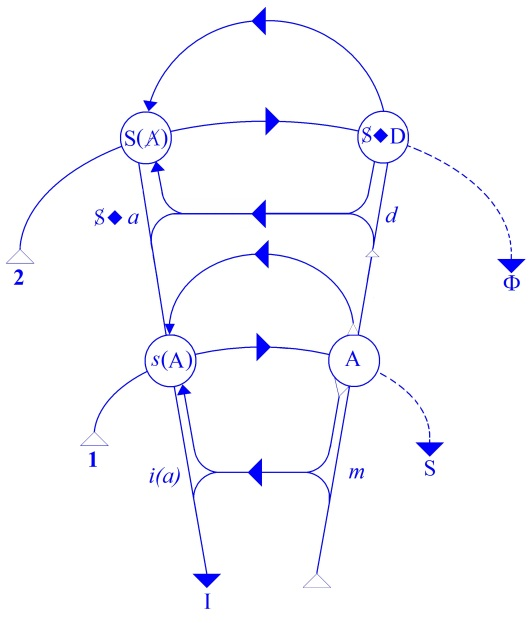
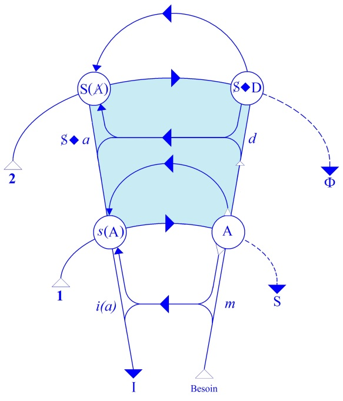
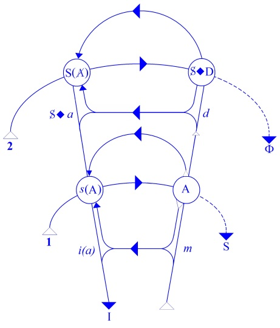

# Leçon 25 | 11 Juin 1958

<!-- source-url: http://staferla.free.fr/S5/S5 FORMATIONS .docx -->
<!-- seminar: s5 -->
<!-- lesson: 25 -->

<!-- id: s5-25-0001 -->

Nous allons reprendre notre propos, toujours à l’aide de notre petit schéma.
Certains d’entre vous se posent des questions sur le petit signe en losange tel qu’il est employé,
par exemple quand j’écris S en face du *petit a,* du petit autre \[S ◊ *a*\]. Cela ne me paraît pas *extrêmement compliqué*.

<!-- id: s5-25-0002 -->

Mais enfin, puisque certains s’en posent la question, je rappelle que *le losange* dont il s’agit, c’est la même chose
que *le carré* d’un schéma beaucoup plus ancien et fondamental dans lequel s’inscrit *le rapport du sujet à l’Autre*
*en tant qu’objet de la parole* et en tant que *message de l’Autre*, dans cette première approximation que nous avons faite
de ce qui vient de l’Autre, et qui rencontre la barrière du rapport *a’→ a* qui est *la relation imaginaire*.

<!-- id: s5-25-0003 -->

<!-- id: s5-25-0004 -->

Qu’est-ce que cela veut dire ? Cela veut dire que cela exprime le rapport du *sujet barré* - ou pas barré selon le cas -
c’est-à-dire en tant que *marqué par l’effet du signifiant*, ou simplement en tant que nous le considérons comme sujet
tout simplement encore indéterminé, encore non refendu par la *Spaltung* qui résulte de l’action du signifiant,
le rapport donc de ce sujet à quelque chose qui est déterminé par ce rap­port quadratique et qui, quand je l’inscris comme cela : S ◊ *a*, n’est pas autrement déterminé quant aux sommets du quadrant dont il s’agit dans ce châssis,
par exemple *du petit autre*, c’est-à-dire *du semblable*, *de l’autre imaginaire*. Si j’écris S par rapport à la *demande* ou S ◊ D
c’est la même chose. Ça ne préjuge pas du coin de ce petit carré sur lequel intervient la *demande* en tant que telle,
c’est-à-dire l’articulation, sous la forme du signifiant, d’un besoin.

<!-- id: s5-25-0005 -->

<!-- id: s5-25-0006 -->

- Ici \[2\] nous avons donc une ligne qui est une ligne signifiante, et assuré­ment comme telle,

<!-- id: s5-25-0007 -->

> articulée puisque elle se produit à l’horizon de toute articulation signifiante : elle est l’arrière-plan fondamental de toute articulation d’une demande.

<!-- id: s5-25-0008 -->

- Ici \[1\] c’est articulé en général. Si mal que ce soit, nous avons une arti­culation précise, une succession de signifiants, des phonèmes.

<!-- id: s5-25-0009 -->

*Derrière* \[2\], *c’est-à-dire dans l’au-delà de toute articulation signifiante*, ceci représente ou correspond à *l’ef­fet de la ligne signifiante*, de l’articulation signifiante, en tant que prise dans son ensemble, du fait que par sa seule présence elle fait apparaître du *symbolique* dans le *réel*.

<!-- id: s5-25-0010 -->

C’est dans sa totalité et en tant qu’elle s’articule, qu’elle fait apparaître cet *hori­zon* ou ce possible de la *demande*,

<!-- id: s5-25-0011 -->

cette puissance de la *demande* qui est qu’elle soit essentiellement et de sa nature *demande d’amour*, *demande de présence*,
ceci avec toute *l’ambiguïté*, naturellement. C’est pour fixer quelque chose que je dis « *d’amour* » *- la haine dans cette occasion a la même place* - c’est uniquement dans cet horizon que l’ambivalence de *la haine* et de *l’amour*, peut se concevoir.
C’est aussi dans cet horizon que nous pouvons voir - *au même point* - venir ce tiers terme, franchement homologue
de *l’amour* et de *la haine* par rapport au sujet, et que justement j’ai trouvé dans un texte et ailleurs : *l’ignorance.*

<!-- id: s5-25-0012 -->

C’est donc ici que se trouve *le signifiant de* A en tant que marqué de l’action du signifiant, c’est-à-dire de A barré \[A\], c’est-à-dire que dans ce point précis qui est *l’ho­mologue du point* où sur la ligne de la demande \[1\] apparaît dans le schéma fonda­mental de toute demande ce retour du passage de la demande par l’Autre qui s’ap­pelle le *message* \[*s*(A)\].

<!-- id: s5-25-0013 -->

Si vous voulez, d’une façon homologue, ce qui a à se produire au *point de message* dans la seconde ligne \[2\],
c’est justement ce *message d’un signifiant *\[S(A)\], signifiant que *l’Autre est marqué par le signifiant* \[*message sur le message*\].

<!-- id: s5-25-0014 -->

Cela ne veut pas dire que ce mes­sage se produit, il est là en un point homologue comme « *possibilité de se produire* ».

<!-- id: s5-25-0015 -->

Et d’autre part, en un point homologue de ce point où la demande arrive à l’Autre, c’est-à-dire où elle est soumise
à l’existence du code dans l’Autre, au lieu de l’Autre, au lieu de la parole, vous avez à cet horizon,
également « *ce qui peut se produire* » qui s’appelle cette référence, ce qu’on appelle cette « *prise de conscience* »

<!-- id: s5-25-0016 -->

\- mais ce n’est pas simple­ment « *prise de conscience* » - cette articulation par *le sujet* en tant que parlant,
de quelque chose qui est sa *demande* comme telle, et par rapport à laquelle il se situe \[S ◊ D\] .

<!-- id: s5-25-0017 -->

Que ceci doive pouvoir se produire, c’est la présupposition fondamentale de l’analyse elle-même,
c’est ce qui se produit au premier plan *dans* l’analyse. Ça n’est, non pas essentiellement et comme premier pas,
le renouvellement par le sujet de ses demandes. Bien sûr d’une certaine façon c’est un renouvellement,
mais c’est un renouvellement articulé : *c’est dans son discours que le sujet*, d’une certaine façon, *fait apparaître sa demande*, soit directement, soit en filigrane de son discours, ce qui assurément est toujours beaucoup plus important pour nous quand c’est *en filigrane* que quand c’est renouvelé directement par la forme et la nature de sa demande,
c’est-à-dire par les signifiants sous lesquels cette demande se formule, et c’est en tant que cette demande se formule dans des signifiants archaïques que nous parlons de *régression anale*, *orale*, par exemple.

<!-- id: s5-25-0018 -->

Je vous rappelle que la dernière fois, ce que j’ai articulé, que j’ai voulu introduire, c’est que tout ce qui se produit
qui est de la nature à proprement parler du transfert, est suspendu à l’existence de cette arrière-ligne \[Φ→ Δ\],
de cette ligne qui part d’un point dont nous pouvons donner le départ par le Φ et qui finit par un Δ,

<!-- id: s5-25-0019 -->

dont nous pré­ciserons ultérieurement le sens par rapport à cette ligne Φ→ Δ dont elle est l’origine, le fondement,
le fondement de cet *effet du signifiant* comme tel dans l’économie *subjective *: c’est en tant que quelque chose se situe
par rapport à cette ligne \[Φ → Δ\] que l’on peut parler de *transfert*, c’est-à-dire que tout ce qui est de l’ordre du *transfert*,
selon l’action de l’analyste ou sa non-action, selon son abstention ou sa non-abstention, tend toujours à jouer
dans cette zone intermédiaire et peut toujours d’une certaine façon venir se ramener à l’articulation de la demande.

<!-- id: s5-25-0020 -->

D’une certaine façon, bien sûr à tout instant, il est, je dirai normal, il est *dans la nature de l’articulation verbale dans l’analyse* que *quelque chose* vienne s’articu­ler sur le plan de la demande. Mais si précisément la loi analytique est qu’« *il ne sera satisfait à aucune demande du sujet* », ce n’est justement pas pour autre chose que parce que nous spéculons sur le fait
que dans l’analyse quelque chose se produira qui tendra à faire jouer cette *ligne de la demande* \[1\], non pas sur le plan d’une demande précise, formulée, satisfaite ou non satisfaite. Tout le monde est d’accord : ce n’est pas parce que nous frustrons le sujet de ce qu’il peut nous demander à l’occasion - que ce soit - à l’extrême - de nous embrasser
les mains ou que ce soit simplement de lui répondre - ce n’est pas cela qui joue, c’est une frustration plus profonde, de la nature, de l’essence même de la parole en tant qu’elle même fait surgir cet « *horizon de la demande* » \[2\].

<!-- id: s5-25-0021 -->

Et c’est toujours en somme, au niveau de cet « *horizon* », que j’ai appelé tout simplement, pour fixer les idées
« *de demande d’amour *» et qui, vous le voyez, peut être aussi demande d’autre chose, peut être une certaine demande concernant *la reconnaissance de son être*, avec tout ce que cela fait surgir de conflits pour autant que l’analyste
par sa présence en tant que semblable, le nie. La négation hégélienne du rapport des consciences, se profile là aussi
à l’occasion : *demande de savoir.* Il y a cela naturellement *à l’horizon de la relation analytique*.

<!-- id: s5-25-0022 -->

Ce pourquoi ceci nous intéresse, ce pourquoi ceci est intéressé dans les *symp­tômes*, ce pourquoi ceci sert à la résolution des *névroses*, c’est que *c’est dans ce rap­port topologique avec ces deux lignes*...

<!-- id: s5-25-0023 -->

en tant qu’elles sont formées par toute articu­lation de la parole dans l’analyse

<!-- id: s5-25-0024 -->

*...que se situent les quatre sommets* de cet autre lieu de référence du sujet à l’Autre, qui est *le lieu de référence imaginaire*,
pour autant qu’ici ce n’est qu’un *faux sommet*. Ils sont réalisés par *le rapport narcissique* ou *spéculaire* du *moi* à *l’image de l’autre* \[*i(a)*\] en tant que lui est déjà en deçà, antérieur, tout entier impliqué dans la première relation de la demande.

<!-- id: s5-25-0025 -->

Et au-delà, c’est *dans la zone intermédiaire entre la demande articulée* \[1\] *et son horizon essentiel* \[2\], *articulé* aussi bien sûr puisque c’est la zone de toutes *les articulations* dont il s’agit, articulé aussi comme tel puisqu’il est supporté par ce qui est *articulé*, *mais ce qui ne veut pas dire articulable,* bien entendu, car ici *ce qui est à l’horizon* et à proprement parler *ce dernier terme* \[Φ\]
en tant que rien ne suffit à le formuler d’une façon complètement satis­faisante, sinon par la continuation indéfinie

<!-- id: s5-25-0026 -->

du développement de la parole.

<!-- id: s5-25-0027 -->

C’est *dans cette zone intermédiaire* que se situe ce quelque chose qui s’appelle *le désir* : le désir en tant qu’il nous intéresse, *le désir* en tant que c’est *le désir* qui est proprement mis en cause dans toute l’économie du sujet, et qu’il peut être intéressé dans ce qui se révèle dans l’analyse, à savoir dans tout ce qui *dans la parole* se met à *se mouvoir* dans ce jeu d’oscillation entre les signifiants si je puis dire « *terre à terre* » du besoin, et tout ce qui résulte au-delà de l’articulation de *ce signifiant* de la présence constante du signifiant en tant que présent dans l’inconscient du sujet,
c’est-à-dire en tant qu’il a déjà *pétri, formé, structuré* le sujet.

<!-- id: s5-25-0028 -->

<!-- id: s5-25-0029 -->

C’est ici, dans cette *zone intermédiaire* - et je vous ai dit pourquoi - que se situe le désir, *le désir de l’homme en tant qu’il est*
*le désir de l’Autre*, c’est-à-dire qu’il est au-delà du passage de l’articulation du besoin de l’homme dans cette nécessité
de la faire valoir pour l’Autre. Ce désir, sous sa forme de condition absolue, de quelque chose qui est *au-delà*
de toute satisfaction du besoin, et qui se produit dans la marge qui existe *entre la demande de satisfaction du besoin* \[1\]
*et la demande d’amour* \[2\], se situe là.

<!-- id: s5-25-0030 -->

C’est la pro­blématique de ce désir :

<!-- id: s5-25-0031 -->

- en tant que le *désir* de l’homme est toujours pour lui à recher­cher au *lieu de l’Autre*, et ce qui fait que le désir est un désir structuré dans ce *lieu de l’Autre* comme tel,

<!-- id: s5-25-0032 -->

- et en tant que le *lieu de l’Autre est le lieu de la parole*, c’est ce qui fait toute la problématique du *désir*, du désir humain, et qui le fait sujet aux *forma­tions de l’inconscient*, à la *dialectique de l’inconscient*, qui fait que nous avons affaire à lui, que nous pouvons influer sur lui par ce fait qu’il est ou non articulé dans la parole dans l’analyse. Il n’y aurait pas d’analyse s’il n’y avait pas cette situation fon­damentale.

<!-- id: s5-25-0033 -->

Ceci dit, nous avons ce qui est - si l’on peut dire - son *répondant*, son support \[S ◊ *a*\], le point où il se fixe sur son objet qui, bien loin d’être un objet en quelque sorte natu­rel, est un objet toujours constitué par une certaine position prise du sujet par rap­port à l’Autre. C’est à l’aide de cette relation fantasmatique dans son essence, dans sa nature,
que l’homme se retrouve et situe son désir, d’où l’importance de ses fan­tasmes, d’où le fait que dans FREUD

<!-- id: s5-25-0034 -->

vous verrez avec quelle rareté le terme d’« *instinct* » est employé.

<!-- id: s5-25-0035 -->

Il s’agit toujours de *pulsions*, autrement dit de quelque chose qui est un terme technique donné à ce désir,
en tant que *la parole* l’isole, le fragmente et le met dans ce rapport problématique et désarticulé avec son propre but,
c’est-à-dire ce qu’on appelle la direction de *la tendance,* avec son objet. D’autre part vous savez qu’il est essentiellement fait de substitution, de déplacement, voire de toutes les formes de transformations et d’équivalences essentiellement sujettes à parole.

<!-- id: s5-25-0036 -->

Nous étions arrivés la dernière fois à essayer de centrer de plus près les problèmes autour de *quelque chose*
qui doit bien avoir rapport avec ce qui est là dit, puisqu’en fin de compte certains des éléments en transparaissent dans les études, spécialement de la nature de *la névrose obsessionnelle* dont je vous ai mis plusieurs fois en mesure de prendre connaissance par vous-mêmes, et il est certain que certains éléments, termes : «* distance à l’objet* », « *l’objet phallique* », «* relation à l’objet* », qui y sont intéressés ne peu­vent pas - dans la relation, du moins *postérieure* de ces études - manquer de nous provoquer à voir comment nous pouvons les juger, les estimer à la lumière de ce que ceci apporte.

<!-- id: s5-25-0037 -->

J’avais donc pris la dernière fois dans leur relation deux cures, deux cas de *névrose obsessionnelle*, dans l’article
« *Importance de l’aspect homosexuel du transfert*... ». Je vous ai fait remarquer combien, d’une certaine façon, se présente comme pro­blématique le résultat de telle ou telle *suggestion*, disons *direction*, ou même disons à proprement parler :
*interprétation*, qui sont données de ce fantasme. Je vous ai fait remarquer, à propos d’*un rêve* par exemple,
combien par certains *présupposés* on se trouve à simplifier dans le système, on arrive à éluder certains éléments
de relief et donc *le rêve* lui-même.

<!-- id: s5-25-0038 -->

On a parlé de rêve de transfert homosexuel, comme si même ceci pouvait avoir un sens là où le rêve lui-même
donne l’image de ce dont il s’agit, à savoir d’une relation qui est loin d’être duelle, pour autant que je vous montrais, dans la présence ici tout à fait piquante sous la forme d’un objet, d’un objet qui est à l’occasion, là, le fameux bidet dont on parle dans ce rêve. Le sujet donc, qui était dans le rêve transporté dans le lit de l’analyste, le sujet qui est là,

<!-- id: s5-25-0039 -->

à la fois à l’aise - atti­tude que l’on peut en effet qualifier, d’après le contenu manifeste du rêve, d’attente –
mais avec la présence tout à fait articulée et essentielle de ce lit.

<!-- id: s5-25-0040 -->

On peut être d’autant plus étonné que l’analyste ne s’y arrête pas, qu’un autre texte du même analyste montre

<!-- id: s5-25-0041 -->

qu’il est loin d’ignorer la signification proprement *phal­lique* de ce que certains analystes ont appelé « *le pénis en creux* »,
ou « *la coupe* », pour autant que c’est une des formes sous lesquelles peut se présenter au niveau de l’assomption
de *l’image phallique* par le sujet féminin, précisément *le signifiant phal­lus*.

<!-- id: s5-25-0042 -->

En somme, cette sorte de *Graal* qui nous est ici présenté dans le rêve est bien quelque chose qui est tout au moins
de nature à retenir l’attention, voire à susciter, chez celui qui interprète en termes de relation à deux ce rêve,
quelque prudence. Je dirai plus, cette « *observation n°2* »  je l’ai relue une fois de plus. J’ai lu aussi celle qui la précède.
Il me semble vraiment que ce n’est pas la plus intéressante sur laquelle on puisse faire porter la critique,

<!-- id: s5-25-0043 -->

car vraiment portée à ce niveau véritablement évi­dent. Je vous prie simplement de relire cette observation.

<!-- id: s5-25-0044 -->

Prenons tout de même au hasard par exemple *cette phrase* :

<!-- id: s5-25-0045 -->

> « *Nous fîmes donc allusion à un temps déjà second de l’analyse, alors qu’une inter­vention de cette nature avait précédé antérieurement, mais on y revient parce qu’en quelque sorte déjà le sujet qui a été vraiment attiré sur le fait d’approfondir le trans­fert* \[...\] *La situation de transfert devint de plus en plus précise* \[...\] *Il fallut insister beaucoup pour vaincre certains silences* \[...\] *Le transfert devenait donc franchement homosexuel* \[p.424\] \[...\] *Nous fîmes donc allusion au fait que s’il existe* - puisqu’il s’agit de faciliter - *entre hommes des relations affectueuses que l’on désigne par le nom d’amitié et dont personne ne se sent humilié, ces relations prennent toujours un certain caractère de passi­vité pour l’un des partenaires, lorsque celui qui se trouve dans la nécessité de rece­voir de l’autre* \[...\] *des directives* \[...\] *Nous eûmes à ce moment difficile l’idée d’user d’une ana­logie qui pouvait être sentie « de plano » par cet ancien officier. » Pourquoi les hommes au combat se font-ils tuer pour un chef*
>
> *qu’ils aiment, si ce n’est justement parce qu’ils acceptent avec une absence absolue de résistance* \[...\]*ses consignes et ses ordres ?*
>
> *Ainsi, ils épousent si bien les sentiments et les pensées du chef, qu’ils s’identifient avec lui et font le sacrifice de leur vie*
>
> *comme il le ferait lui-même s’il se trouvait en leur lieu et place.* » \[R.F.P. 1948, pp.424-425 \]

<!-- id: s5-25-0046 -->

Vous voyez qu’une intervention de cette espèce doit demander un secteur assez sérieux de silence.

<!-- id: s5-25-0047 -->

> « *Ils ne peuvent agir ainsi que parce qu’ils aiment passivement leur chef. Cette remarque ne fit pas disparaître immédiatement toute retenue chez J. mais elle lui per­mit de continuer à se montrer objectif, alors qu’il allait revivre avec nous*
>
> *d’autres situations homosexuelles, plus précises, celles-là !* » \[R.F.P.1948, pp.425-426\]

<!-- id: s5-25-0048 -->

En effet, ceci ne manque pas. À la vérité il est tout à fait clair que le fait d’orien­ter, de faciliter, d’ouvrir la pente

<!-- id: s5-25-0049 -->

de toute une élaboration *imaginaire* dans ce qu’on appelle « *la relation à deux* » entre analysé et analyste d’une façon dont c’est l’observa­tion elle–même qui témoigne à quel point elle n’est pas simplement systématique, elle est véritablement insistante, et sur les deux termes, dans les deux plans, elle choisit tout ce qui, dans le matériel, va dans le sens simplificateur d’élaborer la relation à deux en tant qu’elle est pourvue d’une signification par l’analyste.

<!-- id: s5-25-0050 -->

Ici il ne s’agit même pas de cet élément sur lequel je viendrai à insister par la suite, qui est la part de la marque que donne à *l’interprétation* l’introduction d’un signi­fiant. Ici l’interprétation, c’est-à-dire ce qui nécessite que l’interprétation soit quelque chose d’une nature brève, c’est précisément ceci : c’est qu’elle est essentiellement et qu’elle doit être essentiellement centrée sur le maniement du signifiant. Ici qu’avons-nous ?

<!-- id: s5-25-0051 -->

Nous avons manifestement une intervention dans le paragraphe même dont il s’agit : il montre le caractère significatif, compréhensionnel, persuasif, qui consiste à induire le sujet à vivre précisément cette relation qui, comme telle, est articulée et considérée à ce niveau de l’œuvre de l’auteur comme *une relation à deux*, et à articuler exactement chez lui cette notion de *la situation analy­tique comme une relation si simple* comme il s’exprime ailleurs, *une relation à deux*.

<!-- id: s5-25-0052 -->

Ici nous nous trouvons de la façon la plus manifeste, chacun peut le toucher du doigt, il n’y a même pas besoin d’être analyste pour s’en apercevoir, devant quelque chose qui s’apparente de sa nature à la suggestion, qui en tout cas,
par le seul fait qu’elle \[l’interprétation\] choisit une signification sur laquelle elle revient à trois reprises rien que dans
cette observation qui a environ six pages, nous montre les étapes essentielles de ce rapport de l’analysé à l’analyste,
et se présente sous la forme d’une facilitation de la compréhension de *la situation à deux* en des termes de *rapports homosexuels* en tant qu’ils nous sont présentés classiquement dans la doctrine freudienne comme étant ce quelque chose de *libidinal* qui est sous-jacent à tous les rapports considérés sous l’angle social.

<!-- id: s5-25-0053 -->

C’est-à-dire sous cette forme éminemment ambiguë qui ne permet pas de distinguer ce qui est à proprement parler « *la pulsion homosexuelle* » en tant qu’elle se distingue dans le choix d’un *objet érotique*, celui du sexe opposé à celui que
la norme peut souhaiter. Il y a quelque chose qui est d’une autre nature que l’emploi du terme « *homosexuel* »
à propos de cette sous-jacence libidinale. Ceci pose assurément toutes sortes de pro­blèmes, mais leur emploi

<!-- id: s5-25-0054 -->

sous forme d’endoctrination à l’intérieur de la thérapeu­tique, je ne dis pas qu’il soit en lui-même illégitime,
je dis qu’assurément, le fait qu’il soit systématique pose *le problème de toute l’orientation, de toute la direction de la cure*.

<!-- id: s5-25-0055 -->

Car nous voyons bien en effet dans quelle mesure ceci peut être porteur d’ef­fet, mais ne voyez-vous pas

<!-- id: s5-25-0056 -->

du même coup aussi qu’il y a là un choix dans le mode d’intervention à propos de la névrose obsessionnelle,
et que tout ce que vous savez par ailleurs de la névrose obsessionnelle rappelle bien que ce rapport du sujet
à lui-même, à son « *existence au monde* », qui s’appelle une *névrose obsessionnelle,* est quelque chose d’infiniment
plus complexe, de toutes façons, qu’un rapport d’*attachement libidinal* du sujet à son propre sexe, à quelque niveau

<!-- id: s5-25-0057 -->

qu’il arrive à s’arti­culer ? Chacun sait, depuis *les premières observations* de FREUD, le rôle qu’a joué *la pul­sion de destruction* portée contre le semblable et retournée de ce fait contre le sujet lui-même. Tout le monde sait bien :

<!-- id: s5-25-0058 -->

- que d’autres éléments y sont intéressés, ces élé­ments de *régression*, de *fixation* dans l’évolution libidinale, qui sont loin d’ailleurs d’être si simples, et je dirai même embarrassants,

<!-- id: s5-25-0059 -->

- que la fameuse liaison du « *sadique* » et de « *l’anal* » n’est pas quelque chose qui, de soi, puisse être tenue pour simple, voire même pour simplement élucidée à un moment quelconque.

<!-- id: s5-25-0060 -->

Bref, tout laisse apparaître que si une telle orientation ou direction du traitement suivi est pourvue d’effet,
c’est justement quelque chose d’une perspective beaucoup plus ample de ce dont il s’agit, quelque chose
qui vient à s’articuler. Je ne dis pas que ce soit entièrement suffisant, mais déjà cela nous permet de mieux ordonner les dif­férents plans et registres dans lesquels les choses peuvent effectivement s’ordonner.

<!-- id: s5-25-0061 -->

Au niveau de ce plan, nous pouvons voir, nous pouvons en effet situer ce quelque chose qui est un détail en somme de l’économie de *l’obsessionnel*, à savoir le rôle que joue, en un point de cette économie, *l’identification à un autre*,
qui est un *petit a*, un *autre imaginaire*, et que c’est un des modes grâce auquel il équilibre à peu près tant bien que mal son économie d’*obsessionnel*.

<!-- id: s5-25-0062 -->

Abonder dans ce sens, lui donner cette sorte de satisfaction qui est l’entérinement de ce rapport…
puisque apparaît dans l’histoire du sujet la fréquence, la constance dans l’histoire de *l’obsessionnel*, d’un autre en tant qu’il est celui auquel il se réfère, dont il demande l’approbation et les critiques, auquel il s’identifie comme à quelqu’un - l’auteur en question l’articule - comme quelqu’un de plus fort que lui et sur lequel littéralement il prend appui, une sorte de rêve, voilà quelque chose qui est bien connu
…le fait de *sanctionner*, si l’on peut dire,*ce mécanisme*, qui est assurément un mécanisme de défense à proprement parler dans l’occasion, la façon dont le sujet équilibre la problématique de son rapport au désir de l’autre, est quelque chose qui peut avoir quelque *effet thérapeutique*, mais loin d’en avoir à lui tout seul…
et aussi bien d’ailleurs, la suite du développement des travaux de l’auteur ne montrera-t-elle que les choses poussées dans un sens qui donne de plus en plus l’ac­cent à ce qu’il appelle à cette occasion « *la distance à l’objet* », ceci s’incarnant dans quelque chose qui se produit, centré tout spécialement autour du fantasme de fella­tion, la *fellation d’un phallus*, non pas n’importe quel phallus, mais très précisément *le phallus* qui est une partie du corps imaginé *de l’analyste*
…ceci aboutit à l’élaboration en quelque sorte d’un *fantasme* dans lequel cette sorte d’appui *imaginaire*
pris dans le semblable et dans l’autre homosexuel s’incarne, se matérialise dans cette expérience *imaginaire*
qui nous est donnée comme telle, comme comparable à la communion catholique, à l’absorption d’une hostie.

<!-- id: s5-25-0063 -->

Nous voyons ici que…
toujours dans la même ligne, dans une certaine *ligne d’éla­boration du fantasme*, cette fois-ci encore plus poussée

<!-- id: s5-25-0064 -->

…se produit quelque chose que nous voyons alors assurément, que nous pouvons matérialiser sur *le schéma* :
il s’agit de la production de ce qui se passe au niveau des productions fantasmatiques origi­nelles.

<!-- id: s5-25-0065 -->

<!-- id: s5-25-0066 -->

Je vais vous montrer que c’est exactement du sujet lui-même, du passage de ceci…
à savoir du rapport S ◊ *a* en tant qu’il est au niveau du fantasme, c’est-à-dire de la production fantasmatique qui a permis au sujet de se situer, de s’arranger avec son désir
…du passage de ceci au niveau du *message* à proprement parler, du *message* qui est celui de la réponse à la demande, du *message* en tant qu’il se situe ici…
ce n’est pas pour rien que dans l’observation, vous allez le voir, c’est articulé de telle façon
que nous voyons à ce moment-là apparaître l’image de la bonne mère, de la mère bienveillante
et qu’on nous parle de l’assouplissement du *surmoi* féminin infantile
…au niveau de la signification du signifié et de l’Autre avec un grand A.

<!-- id: s5-25-0067 -->

Entériner cette production fantasmatique du sujet, c’est ce que nous ne pouvons bien littéralement exprimer

<!-- id: s5-25-0068 -->

que comme une réduction de la complexité des forma­tions chez le sujet - qui est désir - comme une réduction
de ceci au rapport de la *demande*, de la *demande* articulée dans le rapport direct du sujet à l’analyste. Mais - direz-vous - mais si ceci réussit ? En effet, pourquoi pas ? N’est-ce même pas là *une certaine idée que l’on puisse se faire de l’analyse* ?

<!-- id: s5-25-0069 -->

Je réponds :

<!-- id: s5-25-0070 -->

- *non seulement ceci ne suffit pas*, mais nous avons dans ces observa­tions, de la façon d’ailleurs la plus perceptible dans ce qui nous est donné, nous avons aussi par ailleurs des documents qui nous permettent par l’expérience de voir là-des­sus quel est le résultat : assurément ceci n’est pas sans comporter certains effets.

<!-- id: s5-25-0071 -->

- Mais d’autre part, ce qui se produit est quelque chose qui de très loin, représente le fait de guérison que nous pourrions attendre ou la prétendue maturation génitale qui serait réalisée. Comment ne pas voir *le paradoxe* que représente le fait de parler de matu­ration génitale quand, en somme, on articule franchement ici que la maturation génitale est dans cette occasion représentée par le fait que le sujet se laisse aimer par son analyste ?

<!-- id: s5-25-0072 -->

Il y a tout de même ici quelque chose d’extraordinaire : loin que la maturation génitale soit réalisée comme dans
un procès, nous y voyons très évidemment au contraire le fait d’une *réduction subjective des symptômes* par l’intermédiaire *d’un processus* qui, de sa nature, a quelque chose de *régressif*. Non pas de régressif au sens seulement temporel,
mais régressif du point de vue topique, pour autant qu’il y a réduction, au plan de la demande,
de tout ce qui est de l’ordre de *la production*, de *l’organisation*, du *maintien du désir*.

<!-- id: s5-25-0073 -->

Et effectivement, ce qui se produit dans ces étapes…
bien loin d’être interprétable comme il l’est quelquefois dans le sens d’une *amélioration*,
dans le sens d’une *normalisation* des rapports avec l’autre
…se présente comme de brusques explosions :

<!-- id: s5-25-0074 -->

- soit d’*acting-out :* je vous en ai montré un l’année dernière à propos d’une observation qui était l’observation des rapports avec un sujet fort marqué de tendances perverses, et dont les choses ont eu cette issue d’un véritable *acting-out * du sujet allant observer à travers une porte des lavabos des femmes en train d’uriner, c’est-à-dire littéralement allant retrouver la femme précisément en tant que *phallus*, c’est-à-dire par une sorte de brusque explosion de quelque chose qui, sous l’influence de la demande, est exclu et qui ici fait sa rentrée sous la forme de quelque chose qui à proprement par­ler, dans cet acte tout à fait isolé dans la vie du sujet, a toutes les formes compulsives de l’*acting-out * et la présentifîcation d’un signifiant comme tel,

<!-- id: s5-25-0075 -->

- soit - et bien d’autres témoignages encore nous montrent sous d’autres formes, quelquefois par exemple sous la forme d’une énamoration qui a cet aspect paradoxal chez des sujets qu’il n’y a aucun lieu de considérer en eux-mêmes comme étant des *homosexuels dissidents *: ce qu’ils ont d’homosexuel, ils l’ont, et ils n’en ont exac­tement pas plus que ce qu’on peut en voir - d’une brusque énamoration à un semblable,

<!-- id: s5-25-0076 -->

> d’une énamoration problématique, je dirai d’un véritable produit artifi­ciel de ces sortes d’interventions, d’une énamoration qui prend en effet l’aspect d’une énamoration homosexuelle, et qui n’est en somme que la production forcée, si l’on peut dire, de ce *rapport* S par rapport à *a* \[S ◊ *a*\] qui, dans une telle façon d’orienter, de diriger l’analyse, est à proprement parler ce qui a été forcé par la réduction à la demande.

<!-- id: s5-25-0077 -->

Je dirai donc qu’au niveau de cette pratique qui, vraiment, à ce moment-là manque de toute critique, de toute finesse, il y a quelque chose qui décourage les commentaires.

<!-- id: s5-25-0078 -->

Et c’est aussi bien pourquoi je voudrais prendre quelque chose qui est antérieur encore et qui - comme je vous l’ai dit une fois - dans l’œuvre de l’auteur dont il s’agit, m’a paru toujours beaucoup plus intéressant et propre à montrer quel déve­loppement eût pu prendre, à condition d’être orientée autrement, son élaboration de ces sujets qui oncerne
« *Les incidences thérapeutiques de la prise de conscience* - c’est le titre même - *de l’envie du pénis dans la névrose obsessionnelle féminine* [^61].

<!-- id: s5-25-0079 -->

Cette observation a beaucoup d’intérêt parce que nous n’avons pas tellement d’analyses de *la névrose obsessionnelle* chez la femme, et également pour ceux qui pourraient brosser le problème de la spécificité sexuelle de la névrose, à savoir de pen­ser que c’est pour des raisons qui tiennent à leur sexe que les sujets choisissent telle ou telle pente de *la névrose*.

<!-- id: s5-25-0080 -->

Nous verrons quand même, à l’occasion de *la névrose obsessionnelle féminine,* combien tout ce qui est de l’ordre
de *la structure dans la névrose* est quelque chose qui laisse fort peu de place à ce que la position du sexe, au sens du sexe naturel, du sexe biologique, peut avoir de déterminant. Ici en effet, cette fameuse prévalence de l’objet phallique comme tel, que nous avons vu jouer dans les observations concernant les névroses obsessionnelles masculines,
se retrouve et d’une façon tout à fait intéressante.

<!-- id: s5-25-0081 -->

Voici comment l’auteur dans cette occasion, conçoit, découvre, développe le progrès de l’analyse.
Il l’articule lui-même de la façon suivante :

<!-- id: s5-25-0082 -->

> « …*comme l’obsédé masculin, la femme a besoin de s’identifier sur un mode régressif, à l’homme, pour pouvoir se libérer des angoisses de la petite enfance, mais alors que le premier s’appuiera sur cette identification pour transformer l’objet d’amour infan­tile en objet d’amour génital*… »

<!-- id: s5-25-0083 -->

Ceci correspond strictement à ce que je vous ai fait remarquer tout à l’heure du paradoxe de *l’identification*
du sujet masculin à l’analyste dans l’occasion, puisqu’à soi tout seul il constitue ce passage de l’objet d’amour infantile à l’objet d’amour génital.

<!-- id: s5-25-0084 -->

Il y a sûrement là quelque chose qui tout au moins pose un problème :

<!-- id: s5-25-0085 -->

> « …*elle, la femme, se fondant d’abord sur cette même identification, tend à aban­donner ce premier objet, et à s’orienter vers une fixation hétérosexuelle, comme si elle pouvait procéder à une nouvelle identification féminine, cette fois sur la personne de l’analyste.* » \[R.F.P.1950, pp. 215-216\]

<!-- id: s5-25-0086 -->

Il est donc dit, avec une ambiguïté assurément frappante mais nécessaire, que c’est l’identification à l’analyste
qui est ici articulée et précisée comme telle. On fait état qu’il est de sexe masculin, et que c’est cette identification,
qui dans le premier cas est supposée se réaliser d’elle-même tout simplement et comme allant de soi, qui assure l’accès à la génitalité.

<!-- id: s5-25-0087 -->

D’où il résulte, si on a ce présupposé, cette *hypothèse*, que dans le cas de la femme, si nous obtenons ce qui est donné pour être le cas, *non sans prudence d’ailleurs, car dans cette observation on ne fait pas état d’une amé­lioration extraordinaire*,

<!-- id: s5-25-0088 -->

on constate qu’à mesure même de cette *identification à l’analyste*, on constate, non sans un certain embarras,
non sans une certaine surprise même, que *cette identification* se fera successivement en somme sous deux modes :

<!-- id: s5-25-0089 -->

- sous un premier mode qui sera d’abord conflictuel, c’est-à-dire de revendications à l’endroit de l’homme, d’hostilité même à l’endroit de l’homme,

<!-- id: s5-25-0090 -->

- puis, dans la mesure même où ce rapport, va-t-on nous dire, s’assouplit, *une singulière problématique*. C’est toujours par la nécessité de concevoir d’une certaine façon ce progrès d’une identification féminine que l’on admet possible, en raison, nous dit-on, de l’ambiguïté fonda­mentale de la personne de l’analyste.

<!-- id: s5-25-0091 -->

Assurément nous ne sommes pas pour autant satisfaits de cette explication.

<!-- id: s5-25-0092 -->

> « *Une nouvelle identification, cette fois féminine, cette fois sur la personne de l’analyste.Il va sans dire que l’interprétation*
>
> *des phénomènes de transfert est ici particulièrement délicate. Si la personnalité de l’analyste masculin est d’abord appré­hendée comme celle d’un homme, avec toutes les interdictions, les peurs et l’agres­sivité que cela comporte, peu après que le désir*
>
> *de possession phallique* - C’est cela dont nous allons avoir à parler et que nous allons avoir à estimer - *et corrélative­ment de castration de l’analyste est mis à jour, et que de ce fait, les effets de détente précités ont été obtenus, cette personnalité de l’analyste masculin est assimilée à celle d’une mère bienveillante.* » \[R.F.P.1950, pp.215-216\]

<!-- id: s5-25-0093 -->

Et il ajoute encore :

<!-- id: s5-25-0094 -->

> « *Cette assimilation ne démontre-t-elle pas que la source essentielle de l’agressivité anti­-masculine*
> *se trouve dans la pulsion destructive initiale dont la mère était l’objet ?* »

<!-- id: s5-25-0095 -->

Ici un horizon kleinien peut toujours donner quelque appui.

<!-- id: s5-25-0096 -->

> « *La prise de conscience de l’une entraîne le droit au libre exercice de l’autre, et le pou­voir libératoire de cette prise de conscience du désir de possession phallique devient alors « de plano » compréhensible, ainsi que le passage d’une identification à l’autre*
>
> *en fonction d’une ambiguïté fondamentale de la personne de l’analyste dont l’aspect masculin est d’abord seul perceptible*
>
> *à la malade.* » \[R.F.P.1950, pp.215-216\]

<!-- id: s5-25-0097 -->

Ici nous retrouvons la phrase dite tout à l’heure. Tout est en effet là. Vous allez le voir, ceci repose d’abord
sur l’interprétation de ce dont il s’agit, et d’une exigence ou d’un désir de possession phallique, et corrélativement
de castration de l’analyste. À regarder les choses de plus près, ceci est loin de représenter ce qui effectivement
se présente dans l’observation. Je prendrai l’observation dans l’ordre où elle nous est présentée :
c’est une femme de cinquante ans, bien portante, mère de deux enfants, exerçant une profession *paramédicale*.

<!-- id: s5-25-0098 -->

Elle vient pour une série de phénomènes obsessionnels qui sont tout à fait d’ordre commun :

<!-- id: s5-25-0099 -->

- obsession d’avoir contracté la syphilis. Ceci est important, pour autant qu’elle y voit je ne sais quel interdit porté sur le mariage de ses enfants, auquel d’ailleurs elle n’a pas pu, quant à son aîné, s’opposer,

<!-- id: s5-25-0100 -->

- obsession d’infanticide, d’empoisonnement, bref toute une série d’obsessions tout à fait, je dirai, banales, très spécialement dans le type des manifestations d’obsessions chez la femme.

<!-- id: s5-25-0101 -->

Avant même de nous en donner la liste, c’est l’auteur lui-même qui nous parle d’une façon prévalante des obsessions à thème religieux. Il y a là bien entendu, comme dans toutes les obsessions à thème religieux, toutes sortes de phrases inju­rieuses, scatologiques qui s’imposent au sujet, en contradiction formelle avec ses convictions.

<!-- id: s5-25-0102 -->

Commençons de regarder ce qui se présente comme un des éléments que sou­ligne tout de suite l’auteur lui-même dans les rapports du sujet à la réalité religieuse, spécialement à la réalité qu’est pour elle, puisqu’elle est catholique,
la présence du corps du CHRIST dans l’hostie. Elle se représentait en outre, imaginativement, des organes génitaux masculins - sans qu’il s’agisse de phénomènes hallucinatoires, nous précise-t-on - à la place de l’hostie.

<!-- id: s5-25-0103 -->

On nous fait remarquer quelques lignes plus loin un détail important concernant cette thématisation religieuse principale de cette obsessionnelle : c’est que sa mère fut seule responsable de son éducation catholique, et son conflit avec elle pouvait se reporter sur le plan spirituel, nous dit-on, qui n’eut d’ailleurs jamais qu’un caractère d’obligation
et de contrainte. Nous n’en discutons pas. C’est ici un fait qui a toute sa portée.

<!-- id: s5-25-0104 -->

Je voudrais, avant que nous nous arrêtions sur le mode des interprétations qui seront données par la suite,
vous arrêter vous-mêmes un instant à *ce symptôme*. *Ce symptôme* en lui-même est hautement de nature à nous inciter
à quelques remarques.

<!-- id: s5-25-0105 -->

Les organes génitaux, nous dit-on, se présentent devant et à la place de l’hostie. Qu’est-ce que, pour nous,
cela peut vouloir dire ? Pour nous, j’entends : pour nous analystes.

<!-- id: s5-25-0106 -->

Voilà bien tout de même un cas où cette place, cette superposition, si nous sommes analystes, nous devons lui donner sa valeur : qu’est-ce que nous appelons « *refoulement* », et surtout « *retour du refoulé* », si ce n’est quelque chose qui appa­raît comme *quelque chose* qui déteint par en dessous, qui vient surgir *à la surface* - comme l’écriture le qualifie -
ou comme une tache qui monte ou qui remonte avec le temps à la surface ?

<!-- id: s5-25-0107 -->

Voilà un cas où, si nous voulons bien accorder aux choses leur importance tex­tuelle comme c’est notre position d’analyste de le faire, nous devons essayer d’arti­culer de quoi il retourne. Le CHRIST, nous savons que
selon cette femme qui a reçu une éducation religieuse, cela doit au moins avoir un sens religieux.

<!-- id: s5-25-0108 -->

Comme pour tous ceux qui sont dans la religion chrétienne, et ce n’est pas indifférent, le CHRIST, c’est le *Verbe*,
le λόγος \[logos\], et ceci nous est seriné dans l’éducation catholique, et qu’il soit *le Verbe incarné*, c’est ce qui ne fait pas le moindre doute, c’est la forme la plus abrégée de ce qu’on appelle le *Credo.* Nous voyons en somme,
si nous nous référons à ce λόγος \[logos\], ce qu’il est, c’est-à-dire si on nous dit que c’est le *Verbe*, c’est le *Verbe*.

<!-- id: s5-25-0109 -->

Est-ce à dire la totalité du *Verbe* ? Nous voyons apparaître à travers lui, se substituant à lui, à sa place, quelque chose qui est ce que, dans ce que d’une façon convergente par rapport à toute notre exploration, nous essayons de formuler de l’expérience analy­tique, nous avons été amenés à appeler ce signifiant privilégié unique en tant qu’il est défini
par le fait qu’il désigne *l’effet, la marque, l’empreinte du signifiant* comme tel sur *le signifié*.

<!-- id: s5-25-0110 -->

Ce qui se produit donc dans ce *symptôme*, c’est la substitution à un rapport, qui nous est donné comme celui
du rapport du sujet au *Verbe*, au *Verbe* dans son essence, au *Verbe* total, au *Verbe* incarné même, la substitution
à la totalité de ce *Verbe* d’un *signifiant* privilégié qui est à proprement parler celui qui sert à désigner *l’effet, la marque, l’empreinte, la blessure* de l’ensemble du signifiant qui porte sur ce sujet humain en tant que, *de par l’instance du signifiant*,
il y a chez lui des choses qui viennent signifier.

<!-- id: s5-25-0111 -->

Nous avançons dans l’observation. Qu’allons-nous trouver plus loin ? Nous allons trouver ceci : que le sujet va
dans l’occasion se trouver dire qu’elle a rêvé qu’elle écrasait la tête du CHRIST à coups de pied, et cette tête
\- ajoute-t-elle - ressemblait à la vôtre : elle parle de l’analyste. Et en association, l’observation suivante :

<!-- id: s5-25-0112 -->

> « *Je passe chaque matin, pour me rendre à mon travail, devant un magasin des pompes funèbres où sont exposés* 4 *« Christ ». En les regardant, j’ai la sensation de marcher sur leur verge. J’éprouve une sorte de plaisir aigu et de l’angoisse.* »

<!-- id: s5-25-0113 -->

Ici, une fois encore, que trouvons-nous ? Nous trouvons manifestement l’iden­tification de ce quelque chose qui est l’Autre, le grand Autre assurément, dans l’oc­casion l’Autre en tant que lieu de la parole. Dans l’occasion, ce qui nous est donné, c’est que le sujet écrase de son talon la figure du CHRIST. N’oublions pas qu’ici le CHRIST est matérialisé par un objet, à savoir un crucifix. Que cet objet lui-même à cette occasion ne soit, dans sa totalité si l’on peut dire, le *phallus*, voilà encore quelque chose qui ne peut pas manquer de nous frapper.

<!-- id: s5-25-0114 -->

Surtout si nous conti­nuons à poursuivre les détails que nous donne l’observation, à savoir ceci :
c’est que va intervenir dans les rapports de l’analysée avec l’analyste quelque chose de très par­ticulier :

<!-- id: s5-25-0115 -->

les reproches qu’elle va faire à l’analyste de l’embarras qu’il apporte par ses soins, dans son existence,
vont se matérialiser en ceci qu’elle ne peut pas s’acheter de souliers.

<!-- id: s5-25-0116 -->

L’analyste bien sûr ne peut pas ne pas être assez peu averti pour ne pas reconnaître ici *la valeur phallique du soulier*, autrement dit que le soulier, et tout spécialement *le talon* dont il est fait grand usage, très précisément à cette occasion pour écraser la tête du Christ, est quelque chose qui ici a toute sa portée. Remarquons à ce propos :

<!-- id: s5-25-0117 -->

- que ceci vient à l’intérieur d’une analyse,

<!-- id: s5-25-0118 -->

- que le fétichisme, spécialement le féti­chisme du soulier chez la femme, n’est pratiquement pas observé,

<!-- id: s5-25-0119 -->

- que l’apparition de quelque chose qui se rapporte au soulier avec cette signification phallique, par contre, au cours d’une élaboration de l’observation telle qu’elle se fait dans l’analyse, est quelque chose qui prend ici toute sa valeur.

<!-- id: s5-25-0120 -->

Tâchons de le comprendre. Pour le comprendre il n’est pas nécessaire d’aller bien loin. Alors que l’analyste fait,
à ce moment là, tout pour suggérer au sujet qu’il s’agit là d’un besoin, d’un désir de possession du *phallus*, ce qui n’est peut-être, ma foi, en soi-même pas le pire qu’il puisse dire, si ce n’était que pour lui cela représente *- et il le dit aussi -*
le désir chez le sujet *d’être un homme*, à quoi le sujet ne cesse pas de s’opposer, de protester avec la plus grande énergie jusqu’à la fin : elle n’a jamais eu le désir d’être un homme.

<!-- id: s5-25-0121 -->

Et la vérité en effet, ce n’est peut-être pas la même chose de désirer posséder le *phallus* et de désirer être un homme, puisque la théorie analytique elle-même suppose que les choses peuvent se résoudre d’une façon fort naturelle.
Qui ne s’en aviserait ?

<!-- id: s5-25-0122 -->

Mais voyons ce que l’analysée *réplique* à cette occasion. Elle réplique : quand je suis bien habillée, les hommes me désirent et je me dis avec une joie très réelle : « *en voilà encore qui en seront pour leurs frais* ». Je suis contente d’*imaginer* qu’ils puissent en souffrir. Bref, elle ramène l’analyste en terrain solide, économique, à savoir : si rapport au *phallus*
il y a, dans ses rapports avec l’homme, quel est-il ?

<!-- id: s5-25-0123 -->

Tâchons maintenant de l’articuler nous-mêmes. Voici à peu près comment je vous propose de l’articuler précisément.
Il y a ici plusieurs éléments :

<!-- id: s5-25-0124 -->

- il y a le rapport à la mère, bien entendu ! Rapport à la mère dont il nous est dit qu’il est profondément essentiel, rapport de véritable cohérence entre le sujet réel et cette mère dont on nous montre les rapports problématiques avec le père. Et nous reviendrons dans la suite sur ces rapports avec le père, et sur les rapports de la malade avec le père.

<!-- id: s5-25-0125 -->

- il y a que cette mère en tout cas s’est manifestée de plusieurs façons, et en par­ticulier de celle-ci : que le père n’avait pu triompher de l’attachement de sa femme à un premier amour, d’ailleurs platonique. Pour qu’une chose comme celle-là soit signalée dans l’observation, il faut qu’elle ait tenu *une certaine place*.

<!-- id: s5-25-0126 -->

Nous voyons donné d’autre part que les rapports du sujet à la mère sont ceux-ci :

<!-- id: s5-25-0127 -->

- elle la juge de toutes les façons favorables plus intelligente que son père, etc.,

<!-- id: s5-25-0128 -->

- elle est fascinée par son énergie, etc. Les rares moments où sa mère se détendait la remplissaient d’une joie indi­cible. Elle a toujours considéré que sa sœur plus jeune lui était préférée.

<!-- id: s5-25-0129 -->

Aussi bien d’ailleurs toute personne s’immisçant dans cette union avec sa mère était l’ob­jet de souhaits de mort,

<!-- id: s5-25-0130 -->

ainsi que le démontrera un matériel important, soit onirique, soit infantile, relatif au désir de la mort de la sœur.

<!-- id: s5-25-0131 -->

N’en voilà-t-il pas assez pour démontrer que d’abord et avant tout ce dont il s’agit, dans cette occasion,
dans *les rapports du sujet avec sa mère*, c’est justement ce que je vous ai souligné être *le rap­port du sujet au désir de la mère*.

<!-- id: s5-25-0132 -->

La façon dont le problème du désir s’introduit dans la vie du sujet est précoce et particulièrement manifeste, précisément dans l’histoire de l’obsédée.

<!-- id: s5-25-0133 -->

Ce désir, qui aboutit à ceci que le sujet voit pour lui se profiler pour fin, la fin non pas d’avoir ceci ou cela,
mais d’abord d’être *l’objet du désir de la mère*, avec ce que ceci comporte, c’est-à-dire de *détruire ce qui est* - mais inconnu - *l’objet du désir de la mère,* c’est précisément ce à quoi est suspendu tout ce qui va désormais pour le sujet lier l’approche de son propre désir à un effet de destruction et ce qui en même temps subordonne, définit si l’on peut dire, l’approche de ce désir comme tel au signifiant qui est précisément par lui-même le signifiant de l’effet de désir
dans la vie d’un sujet, à savoir le *phallus*.

<!-- id: s5-25-0134 -->

J’articule de nouveau les choses : le problème n’est pas pour le sujet en question de savoir si la mère - comme chez
le phobique par exemple - a ou n’a pas le *phallus,* il est de savoir ce qu’est cet effet dans l’Autre de ce quelque chose qui est *le désir*. Et en d’autres termes, ce qui vient au premier plan pour le sujet, c’est de savoir ce qu’il sera, lui,
s’il est ou n’est pas ce que ce désir de l’Autre est. Ce que nous voyons venir au premier plan…
et très précisément à ce propos, c’est bien joli de le voir à cette occasion du λόγος \[logos\] incarné,
à savoir de l’Autre, de l’Autre en tant que le verbe précisément le marque
…c’est la substitution en ce point et à ce niveau du *signifiant phallus* comme tel.

<!-- id: s5-25-0135 -->

En d’autres termes, j’articulerai encore plus loin ma pensée : FREUD a vu et a désigné les frontières de l’analyse comme s’arrêtant, si je puis dire, en ce point qui, dans certains cas, dit-il, s’avère irréductible, laissant chez le sujet
une sorte de blessure qui est pour l’homme *le complexe de castration* et qui garde toute sa manifestation prévalante,
qui en somme se résume en ceci : *qu’il ne peut avoir le phallus que sur le fond de ceci, qu’il ne l’a pas*.

<!-- id: s5-25-0136 -->

Ce qui est exactement la même chose que ce qui se présente chez la femme, à savoir : *qu’elle n’a pas le phal­lus que sur*

<!-- id: s5-25-0137 -->

*le fond de ceci : c’est quelle l’est !* Car autrement, comment pourrait-elle être rendue enragée par ce *penisneid* irréductible.

<!-- id: s5-25-0138 -->

N’oubliez pas que *Neid* en alle­mand ne veut pas simplement dire un *souhait*, *Neid* veut dire que ça me rend

<!-- id: s5-25-0139 -->

litté­ralement enragé. Toutes les sous-jacences de l’agression et de la colère sont bien dans ce *Neid* originel, aussi bien en allemand moderne que bien plus encore dans les formes anciennes de l’allemand et même de l’anglo-saxon.

<!-- id: s5-25-0140 -->

Si FREUD d’une certaine façon a marqué là ce qu’il appelle en une certaine occa­sion *le caractère infini, projeté à l’infini*

<!-- id: s5-25-0141 -->

\- ce que l’on a mal traduit par « *interminable » -* de ce qui peut arriver à l’analyse, c’est qu’il ne voit pas…
parce qu’après il y a des choses qu’il n’a pas eu l’occasion de faire, encore que beaucoup de choses l’indiquent, et spécialement dans ce dernier article sur *la Spaltung du moi* sur lequel je revien­drai

<!-- id: s5-25-0142 -->

…que la solution du problème de la castration, aussi bien chez l’homme que chez la femme, n’est pas autour
de ce dilemme de « *l’avoir ou de ne pas l’avoir* », car c’est uniquement à partir du moment où le sujet s’aperçoit
qu’il y a une chose qui en tout cas est à reconnaître et à poser : c’est qu’il ne l’a pas, c’est à partir de cette réalisation dans l’analyse que le sujet n’a pas *le phallus* qu’il peut normaliser cette position, je dirai « naturelle », que :
ou bien *il l’est*, ou bien *il ne l’a pas*.

<!-- id: s5-25-0143 -->

Ceci est donc effectivement le terme dernier, le rapport signifiant autour de quoi peut se résoudre *l’impasse imaginaire* engendrée par *la fonction que l’image du phallus vient à prendre au niveau du plan signifiant*. Et c’est bien ce qui se passe
chez notre sujet quand, sous l’effet des premières manifestations de la prise dans le méca­nisme du transfert,

<!-- id: s5-25-0144 -->

c’est-à-dire d’une articulation plus élaborée des effets *symptomatiques*, se produit chez elle ce qui se produit d’une façon entièrement reconnaissable dans ce que je viens de vous citer aujourd’hui, c’est-à-dire ceci : le fantasme, pour autant que présentifié dans l’analyse, est lié à la possession ou à la non possession des souliers, des souliers féminins,
des *souliers phalliques*, des souliers que nous appellerons en cette occasion « *fétichistes* ».

<!-- id: s5-25-0145 -->

Quelle fonction prend-il pour un sujet masculin pour autant que dans sa per­version, ce qu’il refuse c’est que

<!-- id: s5-25-0146 -->

la femme soit châtrée ? C’est ceci que veut dire la per­version fétichiste pour le sujet masculin : c’est d’affirmer

<!-- id: s5-25-0147 -->

que la femme l’a sur le fond de ce qu’elle ne l’a pas. Sans cela il n’y aurait pas besoin d’un objet pour le représenter,
un objet, par dessus le marché, indépendant manifestement du corps de la femme.

<!-- id: s5-25-0148 -->

Si la femme se met à fomenter au cours de l’élaboration transférentielle ceci, qui est la même chose apparemment :
à savoir qu’elle l’a, puisque ce qu’elle souligne c’est qu’elle peut l’avoir sous forme de vêtements, sous forme
de ces vêtements qui vont exciter le désir des hommes et grâce auxquels elle pourra les décevoir dans leur désir,
c’est elle qui l’articule ainsi. Elle pose assurément en apparence la même chose. Mais c’est tout à fait autre chose quand c’est posé par le sujet lui-même, à savoir par la femme au lieu que par l’homme qui est en face d’elle.

<!-- id: s5-25-0149 -->

Aussi bien pour elle, dans cette occasion, ce qu’elle démontre, c’est qu’à vouloir se présenter comme avoir,
ce qu’elle sait, elle, parfaitement qu’elle n’a pas, il s’agit là de quelque chose qui a pour elle une toute autre valeur.
À savoir ce que j’ai appelé *la valeur de mascarade*, et ce par quoi elle fait pour autant de sa féminité justement *un masque*.
Ce dont il s’agit, c’est *que ce phallus* qui est pour elle *le signifiant du désir*, elle en présente l’apparence, qu’*elle paraisse l’être*.

<!-- id: s5-25-0150 -->

Ce dont il s’agit, c’est *qu’elle soit l’objet d’un désir*, et d’un désir qu’elle sait fort bien elle-même *qu’elle ne peut que décevoir*.
Elle l’exprime formellement au moment où l’analyste lui interprète ce dont il s’agit comme un désir de possession
du *phallus*. Il s’agit là de quelque chose qui, une fois encore, nous montre la divergence qui s’établit et qui est essentielle, entre *être* ce quelque chose qui est l’objet du désir de l’Autre, et le fait d’en *avoir* ou de *ne pas en avoir* l’organe qui en porte la marque. Nous arrivons donc à la formule suivante : le désir originel c’est :

<!-- id: s5-25-0151 -->

«* Je veux être ce qu’elle -* la mère *- désire. Pour l’être, il faut que je détruise ce qui est pour l’instant l’objet de son désir.* »

<!-- id: s5-25-0152 -->

*Le sujet veut être l’objet de ce désir*. Ce qu’il faut l’amener à voir dans le traitement, c’est que ce n’est pas en lui-même que l’homme l’est, l’objet de ce désir, c’est de lui montrer justement que l’homme n’est pas le *phallus* plus que la femme.
Ce qui fait son agressivité - je vous le montrerai encore mieux la prochaine fois - à l’égard de *son mari en tant qu’homme*, c’est pour autant qu’elle considère qu’il est - je ne dis pas qu’il a - qu’il est le *phallus*, et c’est à ce titre qu’il est son rival, c’est à ce titre que ses relations avec lui sont marquées du signe de *la destruction obsessionnelle*.

<!-- id: s5-25-0153 -->

Si ce *désir de destruction* se retourne contre elle selon la forme essentielle de *l’éco­nomie obsessionnelle*, le but en effet du traitement, c’est bien de lui faire remarquer que :

<!-- id: s5-25-0154 -->

> « *Tu es toi-même ceci que tu veux détruire, pour autant que toi aussi tu veux être le phallus. *»

<!-- id: s5-25-0155 -->

Et que fait-on dans cette façon de poursuivre le traitement ? Observez la différence : « *Tu es ceci que tu veux détruire* »
on le remplace par : « *Tu veux détruire ceci* », le *phallus* de l’analyste, qui dans l’occasion est pris dans des *fan­tasmes*

<!-- id: s5-25-0156 -->

tout à fait improbables et fugaces. Et le détail de l’observation vous montrera cette destruction du *phallus de l’analyste*.

<!-- id: s5-25-0157 -->

« *Tu veux détruire ceci -* dit l’analyste - *et moi je te le donne.* »

<!-- id: s5-25-0158 -->

Autrement dit, la cure est tout entière conçue comme le fait que l’ana­lyste donne fantasmatiquement, consent,

<!-- id: s5-25-0159 -->

si l’on peut dire, à un désir de possession phallique.

<!-- id: s5-25-0160 -->

Or, ce n’est pas cela dont il s’agit. Et l’une des preuves entre autres que l’on peut donner que ce n’est pas cela,
c’est que, au point quasi terminal où semble avoir été poursuivie alors l’analyse, où l’on nous dit que la malade *conserve toutes ses obsessions*, à part ceci qu’il n’y en a plus qu’une, elles ont toutes été entérinées, et en bloc, par l’analyse,
bien entendu, mais le fait qu’elles existent toujours a quand même quelque importance, que fait la patiente ?

<!-- id: s5-25-0161 -->

Ceci est dit dans l’*observation* avec une entière *ignorance* : elle intervient de toute sa force auprès de son fils aîné,
dont elle a toujours eu une peur bleue parce qu’à vrai dire c’est le seul dont elle n’a jamais pu arriver à bien maîtriser les réactions mas­culines, en lui disant qu’il faut de toute urgence qu’il aille se faire analyser à son tour.

<!-- id: s5-25-0162 -->

C’est-à-dire *que ce phallus* que l’analyste croit être la solution de la situation, pour autant que prenant - il le dit
lui-même - la position de la mère bienveillante, il le lui donne, à la malade, *elle le lui rend*. À savoir qu’au seul point
où elle a effectivement *le phallus*, elle le lui retourne. Un prêté vaut un rendu.

<!-- id: s5-25-0163 -->

L’analyste a tout entier orienté l’analyse vers le terme que l’analysée veut être un homme. L’analysée n’est jusqu’au bout pas bien, ni entièrement, convaincue. Assu­rément pourtant, quelque chose qui est intéressé, à savoir

<!-- id: s5-25-0164 -->

la possession ou non de ce *phallus,* a trouvé là son apaisement, mais le fond, l’essentiel, la signification du *phallus*
en tant qu’il est le signifiant du désir, reste non résolu.

## Notes

[^61]: Maurice Bouvet : « [*Incidences thérapeutiques de la prise de conscience de l’envie du pénis dans la névrose obsessionnelle féminine*](http://gallica.bnf.fr/ark:/12148/bpt6k5444467v.image.langEN) », *Revue française de psychanalyse*,

    1950, Avril-Juin n° 2, p. 215-243 ; ou Œuvres , t.1, p. 49-73, Paris, Payot, 1967.
