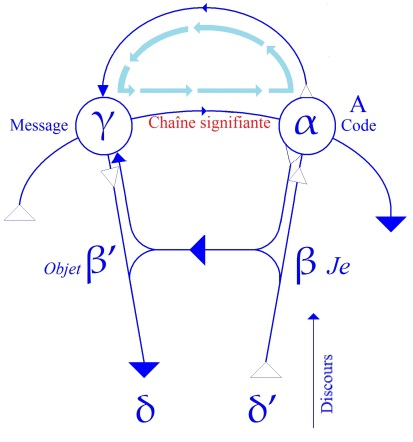
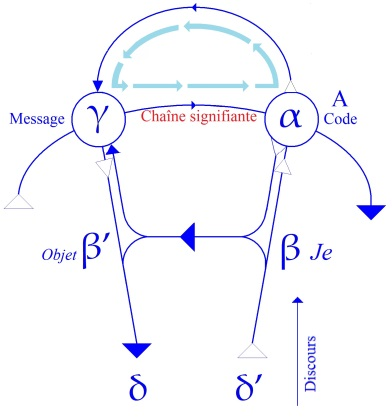

# Leçon 02 | 13 No vembre 1957

<!-- source-url: http://staferla.free.fr/S5/S5 FORMATIONS .docx -->
<!-- seminar: s5 -->
<!-- lesson: 02 -->

<!-- id: s5-02-0001 -->

Reprenons notre exposé au point où nous l’avions laissé la dernière fois, c’est-à-dire au moment
où Hirsch HYACINTHE parlant à l’auteur de *Reisebilder* qu’il a rencontré aux bains de Lucques, lui dit :

<!-- id: s5-02-0002 -->

> « *Aussi vrai que Dieu doit me donner tout ce qu’il y a de bien,*
> *j’étais assis tout à fait comme un égal, tout à fait famillionnairement.* »

<!-- id: s5-02-0003 -->

Voilà donc d’où nous partons, du mot « *famillionnaire* » qui en somme a eu sa fortune.
Il est connu par le point de départ que FREUD y prend. C’est donc là que nous reprenons, et c’est là que je vais déjà essayer de vous montrer la façon dont FREUD aborde *le trait d’esprit*. L’analyse est importante pour notre propos.

<!-- id: s5-02-0004 -->

En effet, l’importance de ce point exemplaire est de nous manifester - puisque hélas il en est besoin - de façon
non douteuse, *l’importance du signifiant dans* ce que nous pouvons appeler avec lui *les mécanismes de l’inconscient*.
Il est évidemment tout à fait surprenant de voir déjà que l’ensemble de ceux que leur discipline n’y prépare pas spécialement - je veux dire *les neurologistes* - à mesure qu’ils se collettent avec ce sujet délicat de l’aphasie, c’est-à-dire du déficit de la parole, font de jour en jour des progrès remarquables quant à ce qu’il s’agit, ce qu’on peut appeler
*leur formation linguistique*, mais que *les psychanalystes*, dont tout l’art et toute la technique reposent sur *l’usage de la parole*, n’en ont jusqu’ici pas tenu le moindre compte, alors que ce que FREUD nous montre, ce n’est pas simplement
une espèce de *référence* *humaniste -* manifestant sa culture ou ses lectures - à ce qui est du domaine de la philologie,
mais une référence absolument interne, organique.

<!-- id: s5-02-0005 -->

Puisque - j’espère ! - vous avez depuis la dernière fois, pour au moins la plupart d’entre vous, entrouvert
*Le mot d’esprit et ses rapports avec l’inconscient*, vous pouvez vous apercevoir que sa référence à *la technique du mot d’esprit*
en tant que technique de langage, est très précisément ce autour de quoi *pivote* toujours son argumentation,
et que si ce qui surgit de sens, de signification dans le mot d’esprit, est quelque chose qui lui paraît mériter
d’être rapproché de l’inconscient, ce n’est - je martèlerai que tout ce que j’ai à dire sur le trait d’esprit s’y rapproche -
fondé que sur sa fonction même de plaisir qui pivote et tourne toujours et uniquement en raison des analogies
de structure, qui ne se conçoivent que sur le plan linguistique, des analogies de structure entre ce qui se passe
dans le mot d’esprit, je veux dire le côté technique du mot d’esprit, disons le côté verbal du mot d’esprit,
et ce qui se passe sous des noms divers, que FREUD a découverts, ce qui est le mécanisme propre de l’inconscient,
à savoir les mécanismes tels que *condensation*, *déplacement*. Je me limite à ces deux là pour aujourd’hui.

<!-- id: s5-02-0006 -->

Voilà donc où nous en sommes : Hirsch HYACINTHE parlant à Henri HEINE, où Hirsch HYACINTHE - fiction d’Henri HEINE - raconte ce qui lui est arrivé. *Quelque chose* s’est produit au départ - pour vous en tenir à ce segment que je viens d’isoler - *quelque chose* de fort net, exhaussant en quelque sorte pour le mettre sur un plateau, l’exalter,
ce qui va venir, *cette invocation au témoin universel* et aux relations personnelles du sujet à ce témoin, c’est-à-dire Dieu :

<!-- id: s5-02-0007 -->

> « *Aussi vrai que Dieu me doit tous les biens*... »

<!-- id: s5-02-0008 -->

Ce qui est quelque chose d’incontestablement à la fois significatif par son sens, et ironique par ce que la réalité
peut y montrer de défaillant, mais à partir de là l’énonciation se fait :

<!-- id: s5-02-0009 -->

> « ...*j’étais assis à côté de Salomon ROTHSCHILD, tout à fait comme un égal*... »

<!-- id: s5-02-0010 -->

Voici le surgissement de *l’objet* : ce « *tout à fait* », *la totalité*, c’est que nous ne sommes pas tout à fait sûrs que
cette *totalité* soit véritablement fermée, et en effet ceci se retrouve *à bien des niveaux*, et je dirais même *à tous les niveaux* de l’usage de cette notion de *totalité*. Ici en effet il reprend sur ce « *tout à fait* », et il dit : « *tout à fait*...
et ici se produit le phénomène, la chose inattendue, le « *scandale de l’énonciation* », à savoir ce message inédit, ce quelque chose dont nous ne savons pas même encore ce que c’est, que nous ne pouvons pas encore nommer, et qui est
...*famillionnaire*. »

<!-- id: s5-02-0011 -->

Quelque chose dont nous ne savons pas si c’est *un acte manqué ou un acte réussi*, *un dérapage ou une création poétique*.
Nous allons le voir. Ce peut être tout à la fois, mais il convient précisément de s’arrêter à la formation,
sur le strict plan signifiant, du phénomène de ce qui va ensuite être repris - je vais vous le dire, et je l’ai déjà annoncé la dernière fois - dans une fonction signifiante qui lui est propre en tant que « *signifiant échappant au code* »,
c’est-à-dire à tout ce qui jusque là a été accumulé de *formations du signifiant* dans ses fonctions de création de *signifié*.

<!-- id: s5-02-0012 -->

Il y a là quelque chose de nouveau qui apparaît, qui peut être noué au ressort même de ce qu’on peut appeler
le progrès de la langue, son changement. Il convient d’abord de nous arrêter à ce quelque chose
dans sa formation même, je veux dire au point où cela se situe par rapport au mécanisme formateur du signifiant.
Il convient de nous y arrêter pour pouvoir même valablement continuer sur ce qui va se montrer être *les sites*
du phénomène, voire ses accompagnements, voire même à l’occasion *ses sources*, ses points d’appel.

<!-- id: s5-02-0013 -->

Mais le phénomène essentiel, c’est ce nœud, ce point où apparaît ce signifiant nouveau, paradoxal, ce « *famillionnaire* »

<!-- id: s5-02-0014 -->

- duquel FREUD part,

<!-- id: s5-02-0015 -->

- et auquel il revient sans cesse,

<!-- id: s5-02-0016 -->

- sur lequel il nous prie de nous arrêter,

<!-- id: s5-02-0017 -->

- sur lequel - vous le verrez - jusqu’à la fin de sa spéculation sur *le trait d’esprit,* il ne manque pas de revenir comme désignant le phénomène essentiel, le phénomène technique qui spécifie *le mot d’esprit*,
  et qui nous permet de discerner :

<!-- id: s5-02-0018 -->

- ce qui est le phénomène central,

<!-- id: s5-02-0019 -->

- ce par quoi il nous enseigne sur le plan qui est notre plan propre, à savoir des rapports avec l’inconscient,

<!-- id: s5-02-0020 -->

- et ce qui nous permet aussi du même coup d’éclairer d’une nouvelle perspective tout ce qui l’entoure, tout ce qui l’amène dans ce qu’on peut appeler les *tenden*z - puisque c’est le terme *tenden*z qui est employé dans cet ouvrage - de ce phénomène de rayonnement divers, *au comique, au rire*, phénomènes qui peuvent rayonner de lui.

<!-- id: s5-02-0021 -->

Arrêtons-nous donc sur ce « *famillionnaire* ». Il y a plusieurs façons de l’aborder. C’est là le but, non seulement
de ce schéma, mais de ce schéma pour autant qu’il vous est donné pour vous permettre d’inscrire les plans différents de l’élaboration signifiante, le mot élaboration étant choisi ici spécialement, puisque étant choisi expressément, puisque FREUD le rapporte spécialement. Arrêtons-nous sur ceci et, pour ne pas trop vous surprendre, commençons de nous apercevoir dans quel sens ceci se dirige. Que se passe-t-il quand « *famillionnaire* » apparaît ?

<!-- id: s5-02-0022 -->

On peut dire que :

<!-- id: s5-02-0023 -->

- *quelque chose* s’y indique que nous sentons comme une visée qui va vers le sens,

<!-- id: s5-02-0024 -->

- *quelque chose* tend à surgir de là qui est quelque chose d’ironique, voire de satirique,

<!-- id: s5-02-0025 -->

- *quelque chose* aussi qui apparaît moins, mais qui se développe si on peut dire, dans les contre-coups du phénomène, dans ce qui va se propager dans le monde à la suite de là.

<!-- id: s5-02-0026 -->

C’est une espèce de *surgissement d’un objet*, lui, qui va plutôt vers *le comique*, vers *l’absurde*, vers *le* *non-sens*.
C’est le *famillionnaire* en tant qu’il est *la dérision du millionnaire*, en tendant à prendre forme de figure,
et il n’y aurait pas beaucoup à faire pour vous indiquer dans quelle direction en effet il tend à s’incarner.

<!-- id: s5-02-0027 -->

D’ailleurs FREUD nous signale au passage que quelque part aussi, Henri HEINE redoublant son mot d’esprit, appellera le millionnaire le « *millionnarr* », ce qui en allemand veut dire le « *fou-fou millionnaire* », ou...
comme nous pourrions le traduire d’ailleurs en français
dans la suite et la ligne de substantivation du « *famillionnaire* » dont je vous parlais tout à l’heure
...le « *fat-millionnaire* » avec un trait d’union.

<!-- id: s5-02-0028 -->

Ceci pour vous dire que voilà l’approche qui fait que nous ne restons pas inhumains. Ne nous y avançons pas beaucoup plus loin, parce qu’à vrai dire ce n’est pas le moment, c’est justement le genre de pas qu’il s’agit
de ne pas précipiter, à savoir de ne pas trop vite comprendre parce que, en comprenant *trop vite*,
on ne comprend absolument rien du tout.

<!-- id: s5-02-0029 -->

Ceci n’explique toujours pas le phénomène qui vient de se passer devant lui, à savoir en quoi il se rattache à ce que nous pouvons appeler « *l’économie générale de la fonction de signifiant* ». Là-dessus il faut quand même que *j’insiste* pour que vous tous vous preniez connaissance de ce que j’ai écrit dans ce que j’ai appelé *L’instance de la lettre dans l’inconscient*,
à savoir les exemples que j’ai donnés dans ce texte des deux fonctions que j’appelle « *les fonctions essentielles du signifiant »*
en tant qu’elles sont celles par où, si l’on peut dire*,* *le soc du signifiant creuse dans le réel ce qu’on appelle le signifié*, littéralement l’évoque, le fait surgir, le manie, l’engendre*,* à savoir *les fonctions de <u>la métaphore</u> et de <u>la métonymie</u>*.

<!-- id: s5-02-0030 -->

Il paraît qu’à certains, c’est *mon style,* disons, qui barre l’entrée de cet article. Je le regrette. D’abord je n’y peux rien, mon style est ce qu’il est. Je leur demande à cet endroit de faire un effort, mais je voudrais simplement ajouter que quelles que soient les déficiences qui puissent y intervenir de mon fait personnel, *il y a aussi, quand même,*
*dans les difficultés de ce style* - peut-être peuvent-ils l’entrevoir - *quelque chose qui doit répondre à l’objet même dont il s’agit*.

<!-- id: s5-02-0031 -->

S’il s’agit en effet, à propos *des fonctions créatrices qu’exerce le signifiant sur le signifié*, d’en parler d’une façon valable,
à savoir non pas simplement de parler de la parole, mais de parler *dans le fil de la parole* si l’on peut dire,
pour évoquer ses fonctions mêmes, peut-être la suite de mon exposé de cette année vous montrera qu’il y a
des nécessités internes de style, la concision par exemple, l’allusion, voire la *pointe,* qui sont peut-être des éléments essentiels, tout à fait décisifs pour entrer dans un champ dont elles commandent non seulement les avenues,
mais toute la texture. Nous y reviendrons donc dans la suite à propos justement d’un certain style
que nous n’hésiterons pas même d’appeler par son nom - si ambigu qu’il puisse apparaître - à savoir *le maniérisme*,
et dont j’essayerai de vous *montrer* qu’il a derrière lui, non seulement *une grande tradition*, mais *une fonction irremplaçable*.

<!-- id: s5-02-0032 -->

Ceci n’est qu’une *parenthèse* pour revenir à mon texte. Dans ce texte dont vous y verrez que ce que *j’appelle*
\- après d’autres : c’est Roman JAKOBSON qui l’a inventée - « *la fonction métaphorique et métonymique du langage* »
est liée à quelque chose qui s’exprime très simplement dans le registre du signifiant, *les caractéristiques du signifiant*
*étant celles* - comme je l’ai déjà plusieurs fois énoncé au cours des années précédentes - *de l’existence d’une chaîne articulée*, et ajoutai-je dans cet article, *tendant à former des groupements fermés, c’est-à-dire formés d’une série d’anneaux se prenant*
*les uns dans les autres pour former les chaînes, lesquelles elles-mêmes se prennent dans d’autres chaînes à la façon d’anneaux*,
ce qui est un peu évoqué aussi par la forme générale de ce schéma, mais qui n’est pas directement présenté.

<!-- id: s5-02-0033 -->

L’existence de ces chaînes dans leur double dimension implique ceci que les articulations ou liaisons du signifiant comportent deux dimensions :

<!-- id: s5-02-0034 -->

- celle qu’on peut appeler de *la combinaison*, de la continuité, de la concaténation de la chaîne,

<!-- id: s5-02-0035 -->

- et celle des possibilités de *substitution* toujours impliquées dans chaque élément de la chaîne.

<!-- id: s5-02-0036 -->

Ce deuxième élément absolument essentiel est cet élément qui, dans la définition linéaire que FREUD donnait
du rapport du signifiant et du signifié, est ce qui est omis. En d’autres termes, dans tout acte de langage
*la dimension diachronique* est essentielle, *mais il y a une synchronie* impliquée, évoquée par la possibilité permanente
de substitution inhérente à chacun des termes du signifiant.

<!-- id: s5-02-0037 -->

En d’autres termes, ce sont les deux rapports que je vais vous indiquer :

<!-- id: s5-02-0038 -->

- f(S...S1) S2 = S (**-**) *s* : *diachronie - métonymie*

<!-- id: s5-02-0039 -->

- f(S/S1) S2 = S (+) *s* : *synchronie - métaphore*
  <!-- -->

<!-- id: s5-02-0040 -->

- L’une donnant le lien de la *combinaison* du lien du *signifiant*,

<!-- id: s5-02-0041 -->

- et l’autre l’image du rapport de *substitution* toujours implicite dans toute articulation signifiante.

<!-- id: s5-02-0042 -->

Il n’est pas besoin d’avoir d’extraordinaires possibilités d’intuition pour s’apercevoir qu’il doit au moins y avoir quelque rapport entre ce que nous venons de voir se produire, et ce que FREUD nous schématise
de la formation du « *famillionnaire* ». C’est à savoir sur deux lignes différentes :

<!-- id: s5-02-0043 -->

> « ...*j’étais assis*... *d’une façon tout à fait familière*... »
> et en dessous :
> « *millionnaire* ».

<!-- id: s5-02-0044 -->

FREUD complète : qu’est-ce que ça peut vouloir dire ? Cela peut vouloir dire *qu’il y a quelque chose qui est tombé*, qui est éludé, cela veut dire pour autant qu’on peut le permettre, ou que l’on peut le réaliser ou le réussir, un millionnaire, quelque chose est tombé dans l’articulation du sens, quelque chose est resté, le millionnaire. Quelque chose s’est produit qui a comprimé, embouti l’un dans l’autre, le « *familière* » et le « *millionnaire* » pour *produire le* « *famillionnaire* ».
Il y a donc là quelque chose qui est une sorte de cas particulier de la fonction de *substitution*, cas particulier dont
il reste en quelque sorte des traces. La *condensation*, si vous voulez est une forme particulière de ce qui peut se produire au niveau de la fonction de *substitution*.

<!-- id: s5-02-0045 -->

Il serait bon que dès maintenant vous ayez à la pensée le long développement que j’ai fait autour d’une métaphore, celle autour de *la gerbe de Booz* : « *Sa gerbe n’était pas avare ni haineuse*... » montrant comme quoi :

<!-- id: s5-02-0046 -->

- c’est le fait que « *sa gerbe* » remplace le terme « *Booz* » qui constitue là *la métaphore*, et que grâce à cette métaphore quelque chose autour de la figure de BOOZ surgit qui est un sens, le sens de *l’avènement à sa paternité*, avec même tout ce qui autour peut rayonner et en rejaillir du fait qu’il y vient, mais - vous vous en souvenez bien - d’une façon invraisemblable, tardive, imprévue, providentielle, divine,
  <!-- -->

<!-- id: s5-02-0047 -->

- que c’est précisément cette métaphore qui est là pour montrer cet avènement d’un nouveau sens autour du personnage de BOOZ qui en paraissait exclus, forclos,

<!-- id: s5-02-0048 -->

- et que c’est aussi dans un rapport de *substitution* essentiellement que nous devons voir *le ressort créateur,* *la force créatrice, la force d’engendrement* - c’est le cas de le dire - de la métaphore.

<!-- id: s5-02-0049 -->

Ceci est une *fonction* tout à fait *générale*, je dirais même :

<!-- id: s5-02-0050 -->

- que c’est par là, que c’est par cette *possibilité* de substitution que se conçoit l’*engendrement* même, si on peut dire, *du monde du sens*,
  <!-- -->

<!-- id: s5-02-0051 -->

- que toute l’histoire de la langue, à savoir les changements de fonction grâce auxquels une langue
  se constitue, que c’est là et pas ailleurs que nous avons à le saisir,

<!-- id: s5-02-0052 -->

- que si jamais il y avait la possibilité pour nous de donner une espèce de modèle ou d’exemple de ce qui est *la genèse* de l’apparition d’une langue, dans ce monde inconstitué que le monde pourrait être avant qu’on parle, il nous faut supposer quelque chose d’irréductible et d’originel qui est assurément *le minimum de chaînes signifiantes*, mais un certain minimum sur lequel je n’insisterai pas aujourd’hui, *encore qu’il conviendrait d’en parler*.

<!-- id: s5-02-0053 -->

Mais je vous ai déjà donné suffisamment d’indications là-dessus, sur ce certain minimum \[α, β, γ, δ\], étant donné que c’est par la voie de *la métaphore*, à savoir du jeu de *la substitution d’un signifiant à un autre*, à une certaine place, que se crée non seulement la possibilité de développement du signifiant, mais *la possibilité de surgissement de sens toujours nouveaux*, allant toujours à ratifier, à compliquer et à approfondir, à donner son sens de profondeur, à ce qui dans le *réel*
n’est que pure opacité. Je voulais chercher un exemple de ceci pour vous l’illustrer, ce qu’on peut appeler ce qui se passe dans l’évolution du sens, et combien toujours plus ou moins nous y retrouvons ce mécanisme de *la substitution*.

<!-- id: s5-02-0054 -->

Comme d’habitude dans ces cas là j’attends *mes exemples* du hasard. Il n’a pas manqué bien entendu de m’être fourni dans mon entourage proche, par quelqu’un qui, en proie à une traduction, avait eu à chercher dans le dictionnaire
le sens du mot « *atterré* », et qui était demeuré surpris à la pensée qu’il n’avait jamais bien compris le sens du mot « *atterré* », en s’apercevant que contrairement à ce que cette personne croyait, « *atterré* » n’a pas originairement
et dans beaucoup de ses emplois, le sens de *frappé de terreur*, mais de *mis à terre*.

<!-- id: s5-02-0055 -->

Dans BOSSUET, « *atterré* » veut littéralement dire « *mettre à terre* », et dans d’autres textes un tout petit peu postérieurs, nous voyons se préciser cet espèce de poids de terreur. Quant à nous, nous dirons incontestablement que les puristes *contaminent*, *dévient*, le sens du mot « *atterré* ».

<!-- id: s5-02-0056 -->

Il n’en reste pas moins qu’ici les puristes ont tout à fait tort, il n’y a aucune espèce de contamination, et même si tout d’un coup après vous avoir rappelé ce sens du mot étymologique, du mot « *atterré* », certains d’entre vous peuvent avoir l’illusion qu’« *atterrer* » ce n’est évidemment pas autre chose que *tourner vers la terre*, que *faire toucher terre*,
ou que *mettre* *aussi bas que terre*, *consterner* en d’autres termes, il n’en reste pas moins que l’usage courant du mot
implique cet arrière plan de terreur.

<!-- id: s5-02-0057 -->

Qu’est-ce que cela veut dire ? Cela veut dire que si nous partons de quelque chose qui a *un certain rapport avec le sens originaire par pure convention* - parce qu’*il n’y a pas d’origine nulle part du mot* « *atterré* » - mais que ce soit le mot « *abattu* », pour autant qu’il évoque en effet ce que le mot « *atterré* » - dans ce sens prétendu pur - pourrait nous évoquer.

<!-- id: s5-02-0058 -->

Le mot « *atterré* » qui lui est substitué d’abord comme *une métaphore* qui n’a pas l’air d’en être une, parce que nous partons de cette hypothèse qu’originairement ils veulent dire la même chose : *jeter à terre* ou *contre terre*, c’est bien là
ce que je vous prie de remarquer, c’est que ce n’est pas pour autant qu’« *atterré* » change en quoi que ce soit le sens d’« *abattu* », qu’il va être fécond, générateur d’un nouveau sens, à savoir ce que veut dire quelqu’un d’« *atterré* ».

<!-- id: s5-02-0059 -->

En effet, c’est un nouveau sens, c’est une nuance, ce n’est pas la même chose qu’« *abattu* » et, si impliquant de terreur que ce soit, ce n’est pas non plus « *terrorisé* », c’est quelque chose de nouveau, de cette nuance nouvelle de *terreur*
que cela introduit dans *le sens psychologique* et déjà *métaphorique* qu’à le mot « *abattu* », parce que *psychologiquement* nous
ne sommes ni « *atterrés* » ni « *abattus* », il y a quelque chose que nous ne pouvons pas dire tant qu’il n’y a pas de mots, et ces mots procèdent d’une *métaphore*, à savoir ce qui se passe quand un arbre est abattu, ou quand un lutteur
est mis à terre, « *atterré* », deuxième métaphore.

<!-- id: s5-02-0060 -->

Mais remarquez que ce n’est pas du tout parce qu’originairement - c’est cela qui est l’intérêt de la chose - que le « *ter* » qui est dans *atterré* veut dire *terreur*, que la *terreur* est introduite, qu’en d’autres termes *la métaphore n’est pas une injection*
*de sens* comme si c’était possible, comme si les sens étaient quelque part, où que ce soit, dans un réservoir.

<!-- id: s5-02-0061 -->

Le mot « *atterré* » n’apporte pas le sens en tant qu’il a une signification, mais en tant que *signifiant*, c’est-à-dire qu’ayant le phonème « *ter* », il a le même phonème qui est dans « *terreur* », *c’est par la voie signifiante, c’est par la voie de l’équivoque, c’est par la voie de l’homonymie*, c’est-à-dire de la chose la plus *non-sens* qui soit, qu’il vient engendrer cette nuance de sens, qu’il va introduire, qu’il va injecter dans le sens déjà métaphorique de « *abattu* », cette nuance de *terreur*.

<!-- id: s5-02-0062 -->

En d’autres termes, c’est dans le rapport S/S’, c’est-à-dire d’un signifiant à un signifiant, que va s’engendrer
un certain rapport S/*s*, c’est à dire signifiant sur signifié.

<!-- id: s5-02-0063 -->

Mais la distinction des deux est essentielle : c’est dans le rapport de signifiant à signifiant, dans quelque chose qui lie le signifiant d’ici au signifiant qui est là, c’est-à-dire dans quelque chose qui est le rapport purement signifiant,
c’est-à-dire *homonymique* de « *terre* » et de « *terreur* », ..que va pouvoir s’exercer l’action qui est l’engendrement de signification, à savoir nuancement par la terreur de ce qui déjà existait comme sens sur une base déjà métaphorique.

<!-- id: s5-02-0064 -->

Ceci donc nous exemplifie ce qui se passe au niveau de *la métaphore*. Je voudrais simplement vous indiquer quelque chose qui va vous montrer comment ceci rejoint par une amorce de sentier, quelque chose qui va tout à fait nous intéresser du point de vue de ce que nous voyons se passer dans l’inconscient, pour autant que, au niveau des phénomènes de *création de sens* normal, par la voie substitutive, par la voie métaphorique qui préside à l’évolution et à la création de la langue, mais en même temps à la création et à l’évolution du sens comme tel, je veux dire du sens
en tant qu’il est non seulement perçu, mais que le sujet s’y inclut, c’est-à-dire en tant que le sujet enrichit notre vie.

<!-- id: s5-02-0065 -->

Je veux simplement vous faire remarquer ceci : je vous ai déjà indiqué que la fonction essentielle de signifiant du crochet « *ter* », c’est-à-dire de quelque chose qu’il nous faut considérer comme purement signifiant, de la réserve homonymique avec laquelle travaille - que nous le voyons ou que nous ne le voyons pas - *la métaphore*.
Que se passe t-il aussi ? Je ne sais pas si vous allez tout de suite bien le saisir, mais vous le saisirez mieux
quand vous verrez le développement.

<!-- id: s5-02-0066 -->

Ce n’est qu’une amorce d’une voie essentielle. C’est que dans toute la mesure où s’affirme, où se constitue la nuance de signification « *atterré* », cette nuance, remarquez–le, implique une certaine domination et un certain apprivoisement de *la terreur*. Cette *terreur* là est non seulement *nommée*, mais elle est tout de même *atténuée*, et c’est ce qui *permet de conserver* d’ailleurs, pour que vous continuiez à la maintenir dans votre esprit, l’ambiguïté du mot « *atterré* ».

<!-- id: s5-02-0067 -->

Après tout, vous vous dites qu’« *atterré* » a en effet bien rapport avec la terre, que la terreur n’y est pas complète,
que l’abattement au sens où il est pour vous sans ambiguïté, garde sa valeur prévalente, que ce n’est qu’une nuance, que pour tout dire la terreur est dans une demi-ombre à cette occasion. En d’autres termes, *c’est dans toute la mesure où la terreur n’est pas remarquée en face, est prise par le biais intermédiaire de la dépression*, que ce qui se passe est complètement oublié jusqu’au moment où, je vous l’ai rappelé, le modèle est tout à fait, lui, en tant que tel, *hors du circuit*.
Autrement dit, dans tout la mesure où la nuance « *atterré* » s’est établie dans l’usage où elle est devenue sens
et usage de sens, le signifiant lui est présentifié, disons le mot : *le signifiant est refoulé* à proprement parler.

<!-- id: s5-02-0068 -->

Dans tous les cas, dès que s’est établi, dans sa nuance actuelle, l’usage du mot « *atterré* », le modèle - sauf recours
au dictionnaire, au discours savant - n’est plus à votre disposition. À propos du mot « *atterré* » il est comme « *terre* », « *terra* », refoulé. Je vais là un tout petit peu trop en avant, parce que c’est un mode de pensée auquel vous n’êtes pas encore très habitués, mais je crois que cela nous évitera un retour. Vous allez voir à quel point ce que je vous appelle là l’amorce des choses, est confirmé par l’analyse des phénomènes.

<!-- id: s5-02-0069 -->

Revenons à notre « *famillionnaire* », *au point* donc *de jonction* ou *de condensation métaphorique* où nous l’avons vu se former.
À ce niveau là, séparer la chose de son contexte, à savoir du fait que c’est Hirsch HYACINTHE, c’est-à-dire l’esprit de Henri HEINE qui l’a *engendré*, nous irons le chercher ultérieurement beaucoup plus loin dans sa genèse,
dans les antécédents d’Henri HEINE avec la famille ROTHSCHILD. Il faudrait même relire toute l’histoire
de la famille ROTHSCHILD pour être bien sûr de ne pas faire d’erreur, mais ce n’est pas là que nous en sommes.

<!-- id: s5-02-0070 -->

Nous en sommes pour l’instant à « *famillionnaire* ». Isolons-le un instant. Rétrécissons tant que nous le pouvons
le champ de vision de la caméra autour de ce « *famillionnaire* ». Après tout il pourrait être né ailleurs
que dans l’imagination d’Henri HEINE :

<!-- id: s5-02-0071 -->

- peut-être qu’Henri HEINE l’a fabriqué à un autre moment qu’au moment où il était devant son papier blanc et la plume en main,

<!-- id: s5-02-0072 -->

- peut-être que c’est un soir d’une de ses déambulations parisiennes que nous évoquerons, que cela lui est venu comme ça.

<!-- id: s5-02-0073 -->

- Il y a même toutes les chances pour que ce soit à un moment de fatigue, de crépuscule.

<!-- id: s5-02-0074 -->

- Pour tout dire, ce famillionnaire pourrait être aussi un *lapsus*, c’est même tout à fait *concevable*.

<!-- id: s5-02-0075 -->

J’ai déjà fait état d’un *lapsus* que j’avais recueilli fleurissant sur la bouche d’un de mes patients…
j’en ai d’autres, mais je reviens à celui-là parce qu’il faut toujours revenir sur les mêmes choses
jusqu’à ce que ce soit bien usé, et après on passe à autre chose
…c’est le patient qui, au cours du racontage de son histoire sur mon divan, ou de ses associations, évoquait le temps où avec sa femme, qu’il avait fini par épouser par devant « *Monsieur le Maire* », il ne faisait que vivre « *maritablement* ».

<!-- id: s5-02-0076 -->

Vous avez tous déjà vu que cela peut s’écrire *maritalement,* ce qui veut dire qu’on n’est pas marié, et en dessous quelque chose dans lequel se conjoint parfaitement la situation des *mariés* et des *non-mariés* : *misérablement* ».
Cela fait « *maritablement* ». Ce n’est pas dit, c’est beaucoup mieux que dit. Vous voyez là à quel point le message dépasse, non pas celui que j’appellerais le messager, car c’est vraiment le messager des dieux qui parle par la bouche de cet innocent, mais dépasse le support de la parole.

<!-- id: s5-02-0077 -->

Le contexte - comme dirait FREUD - exclut tout à fait que mon patient ait fait *un mot d’esprit*, et en effet,
vous ne le connaîtriez pas si je n’en avais pas été à cette occasion l’Autre avec un grand A c’est-à-dire *l’auditeur*,
et *l’auditeur* non seulement *attentif* mais *l’auditeur entendant*, au sens vrai du terme. Il n’en reste pas moins
que mis à sa place, justement dans l’Autre, c’est un mot d’esprit particulièrement sensationnel et brillant.

<!-- id: s5-02-0078 -->

Ce rapprochement entre *le trait d’esprit* et *le lapsus*, FREUD nous en donne dans la *Psychopathologie de la vie quotidienne* [^5] d’innombrables exemples, et à l’occasion il le souligne lui-même, et justement montre qu’il s’agit de quelque chose qui est tellement voisin du *mot d’esprit*, qu’il est *forcé* lui-même de dire - et nous sommes *forcés* de l’en croire sur parole - que le contexte exclut que le ou que la patiente ait fait cette création au titre de *mot d’esprit*.

<!-- id: s5-02-0079 -->

Quelque part dans la *Psychopathologie de la vie quotidienne*, FREUD donne l’exemple de cette femme qui,
parlant de *la situation réciproque des hommes et des femmes*, dit :

<!-- id: s5-02-0080 -->

> « *Pour qu’une femme intéresse les hommes, il faut qu’elle soit jolie*…

<!-- id: s5-02-0081 -->

Ce qui n’est pas donné à tout le monde, implique-t-elle dans sa phrase.

<!-- id: s5-02-0082 -->

> …*mais pour un homme, il suffit qu’il ait ses cinq membres droits.* » \[ch.5, *Lapsus*\]

<!-- id: s5-02-0083 -->

Ce n’est pas toujours pleinement traduisible de telles expressions, je suis souvent obligé de faire une transposition complète, c’est-à-dire de recréer le mot en français. Là il faudrait presque employer le terme « *tout raide* ».
Le mot « *droit* » n’est pas d’un usage courant, tellement peu courant qu’il ne l’est pas non plus en allemand.

<!-- id: s5-02-0084 -->

Il faut que FREUD fasse une glose entre les 4 membres et les 5 membres, tout juste pour expliquer la genèse
de la chose qui vous donne pourtant la tendance un tant soit peu grivoise qui n’est pas douteuse. Ce que FREUD
en tout cas nous montre, c’est que le mot ne va pas tellement directement au but, pas plus en allemand qu’en français où on le traduit par cinq membres droits, et que d’autre part il donne ceci pour textuel que le contexte exclut
que la femme apparaisse aussi crue. C’est bel et bien un *lapsus*, mais vous voyez comme ça ressemble à un *mot d’esprit*.

<!-- id: s5-02-0085 -->

Donc nous le voyons :

<!-- id: s5-02-0086 -->

- cela peut être *un mot d’esprit*,

<!-- id: s5-02-0087 -->

- cela peut être *un lapsus*, je dirais même plus,

<!-- id: s5-02-0088 -->

- cela peut être purement et simplement *une sottise*, une naïveté linguistique.

<!-- id: s5-02-0089 -->

Après tout quand je qualifie cela chez mon patient qui était un homme particulièrement sympathique, ce n’était même pas chez lui véritablement un *lapsus*, le mot « *maritablement* » faisait bel et bien partie pour lui de son lexique,
il ne croyait pas du tout dire quelque chose d’extraordinaire.

<!-- id: s5-02-0090 -->

Il y a des gens comme cela qui se promènent dans l’existence, qui ont des situations quelquefois très élevées,
et qui sortent des mots dans ce genre. Un producteur de cinéma célèbre en produisait comme cela, paraît-il,
au kilomètre toute la journée. Il disait par exemple en concluant quelques unes de ses phrases impérieuses :

<!-- id: s5-02-0091 -->

> « *Et puis c’est comme ça, c’est signé qua non.* »

<!-- id: s5-02-0092 -->

Ce n’était pas un *lapsus*, c’était simplement un fait d’ignorance et de sottise. Je veux simplement vous montrer
qu’il convient de nous arrêter un peu au niveau de cette formation, et puisque nous avons en somme parlé de *lapsus*,
qui de tout cela est ce qui nous touche au plus près, voyons un peu ce qui se passe au niveau des *lapsus*.

<!-- id: s5-02-0093 -->

De même que nous avons parlé de « *maritablement* », revenons sur le *lapsus* par lequel nous sommes passés
à plusieurs reprises pour souligner justement cette fonction essentielle du *signifiant*, *le lapsus* - si je puis dire - *originel*,
à la base de la théorie freudienne, celui qui inaugure la *Psychopathologie de la vie quotidienne*, après avoir été d’ailleurs
la première chose publiée en tirage premier, qui est *l’oubli du nom*.

<!-- id: s5-02-0094 -->

Au premier abord, ce n’est pas la même chose un *oubli* et les choses dont je viens de vous parler, mais si ce que je suis en train de vous expliquer a sa portée, à savoir si c’est bel et bien le mécanisme, le métabolisme du signifiant
qui est au principe et au ressort des *formations de l’inconscient*, nous devons les y retrouver toutes, et ce qui se distingue
à l’extérieur doit retrouver son unité à l’intérieur. Alors maintenant au lieu d’avoir « *famillionnaire* »,
nous avons le contraire : nous avons *quelque chose qui nous manque*.

<!-- id: s5-02-0095 -->

Qu’est-ce que nous montre l’analyse que fait FREUD de *l’oubli du nom*, du nom propre, étranger ?
Ceci ce sont des amorces de choses sur lesquelles je reviendrai, et auxquelles je donnerai leur développement plus tard, mais je dois vous signaler au passage la particularité de ce cas tel que FREUD nous le présente.

<!-- id: s5-02-0096 -->

Le nom propre est un nom étranger. Nous lisons la *Psychopathologie de la vie quotidienne* *comme nous lisons le journal*,
et nous en savons tellement que nous pensons que cela ne mérite pas que nous nous arrêtions à des choses
qui ont pourtant été les pas de FREUD, or chacun de ces pas mérite d’être retenu, parce que chacun de ces pas
est *porteur d’enseignements* et riche de conséquences.

<!-- id: s5-02-0097 -->

Je vous signale donc à ce propos - parce que nous aurons à y revenir - qu’à propos d’un nom, et d’un nom propre, nous sommes au niveau du message. C’est quelque chose dont nous aurons à retrouver la portée par la suite.
Je ne peux pas tout vous dire à la fois, comme « *les psychanalystes d’aujourd’hui* »[^6] qui sont si savants qu’ils disent

<!-- id: s5-02-0098 -->

tout à la fois, qui parlent du « *je* » et du *moi* comme de choses qui n’ont aucune complexité, et qui mélangent tout.

<!-- id: s5-02-0099 -->

Ce qui est important, c’est que nous nous arrêtions à ce qui se passe. Que ce soit aussi *un nom étranger*,
*ceci est autre chose* que le fait que ce soit *un nom propre*. C’est un nom étranger pour autant que ses éléments
sont étrangers à la langue de FREUD, à savoir que « *Signor* » n’est pas un mot de la langue allemande.

<!-- id: s5-02-0100 -->

Mais si FREUD le signale, c’est bien justement que nous sommes là dans une autre dimension que celle du *nom propre* comme tel, qui, si l’on peut dire, ne serait absolument pas propre et particulier, n’aurait pas de patrie. Ils sont tous plus ou moins rattachés à des signes cabalistiques, et FREUD nous souligne que ce n’est pas sans importance.
Il ne nous dit pas pourquoi, mais le fait qu’il l’a isolé dans un chapitre *initial*, prouve qu’il pense que c’est un point particulièrement sensible de la réalité qu’il aborde.

<!-- id: s5-02-0101 -->

Il y a une autre chose que FREUD met aussi en valeur, et tout de suite, sur laquelle nous sommes habitués
à ne pas nous arrêter, c’est ce qui lui a paru remarquable dans l’oubli des noms tels qu’il commence par les évoquer pour aborder la *Psychopathologie de la vie quotidienne *:

<!-- id: s5-02-0102 -->

- c’est que cet oubli n’est pas un oubli absolu, un trou, une béance,

<!-- id: s5-02-0103 -->

- c’est qu’il se présente autre chose à la place, d’autres noms.

<!-- id: s5-02-0104 -->

C’est là que débute ce qui est le commencement de toute science, c’est-à-dire l’étonnement. On ne saurait vraiment s’étonner que de ce que l’on a déjà commencé un tant soit peu de recevoir, sinon on ne s’y arrête pas du tout parce qu’on ne voit rien. Mais FREUD précisément prévenu par son expérience des névrosés, voit là quelque chose,
voit que dans le fait qu’il se produit des substitutions, quelque chose mérite qu’on s’y arrête.

<!-- id: s5-02-0105 -->

Là il faut que je précipite un peu mon pas, et que je vous fasse remarquer toute l’économie de l’analyse
qui va être faite de cet *oubli du nom*, de ce *lapsus* au sens où nous donnerions au mot [*lapsus*](http://www.cnrtl.fr/definition/lapsus) que le nom est tombé.

<!-- id: s5-02-0106 -->

Tout va se centrer autour de ce qu’on peut appeler une approximation métonymique. Pourquoi ?
Parce que ce qui va d’abord ressurgir, ce sont des noms de remplacement : BOTTICELLI, BOLTRAFFIO.
Comment FREUD nous montre-t-il qu’il les comprend d’une façon métonymique ?

<!-- id: s5-02-0107 -->

Nous allons le saisir en ceci, et c’est pour cela que je fais ce détour par l’analyse d’un oubli, c’est que la présence
de ces noms, leur surgissement à la place du SIGNORELLI oublié, se situe au niveau d’une formation,
elle non plus de substitution, mais de *combinaison*.

<!-- id: s5-02-0108 -->

Il n’y a aucun rapport perceptible dans l’analyse que FREUD ferait du cas entre SIGNORELLI, BOLTRAFFIO
et BOTTICELLI, que des rapports indirects liés uniquement à ces phénomènes de signifiant.

<!-- id: s5-02-0109 -->

BOTTICELLI nous dit-il, et je me tiens d’abord à ce qu’il nous dit. Je dois dire que c’est une des démonstrations
les plus claires que FREUD ait jamais donnée de mécanismes d’analyse d’un phénomène de *formation* et de *déformation* lié à l’inconscient. Cela ne laisse absolument rien à désirer comme *clarté*. Je suis forcé pour la clarté de mon exposé
de vous le présenter de façon indirecte en disant : c’est ce que FREUD dit.

<!-- id: s5-02-0110 -->

Ce que FREUD dit s’impose dans sa rigueur, en tout cas ce qu’il dit est de cet ordre, c’est à savoir :

<!-- id: s5-02-0111 -->

- que BOTTICELLI est là parce que c’est le reste, dans sa dernière moitié, de « ELLI » de SIGNORELLI décomplété par le fait que le « SIGNOR » est oublié.

<!-- id: s5-02-0112 -->

- « Bo » est *le reste*, le décomplété de Bosnie Herzégovine, pour autant que le « HERR » est refoulé.

<!-- id: s5-02-0113 -->

- De même pour Boltraffio, c’est le même refoulement du « Herr » qui explique que Boltraffio associe le « Bo » de Herzégovine à Travoï qui est une localité immédiatement antécédente des aventures de ce voyage, celle où il a appris le suicide de l’un de ses *patients* pour raison d’impuissance sexuelle.

<!-- id: s5-02-0114 -->

C’est-à-dire le même terme que celui qui a été évoqué dans la conversation qui précédait immédiatement
avec la personne qui est dans le train entre Raguse et Herzégovine, et qui lui évoque ces Turcs,
ces musulmans qui sont des gens si sympathiques qui, lorsque le médecin n’a pas réussi à les guérir, leur disent :

<!-- id: s5-02-0115 -->

« *Herr ! (Monsieur) Nous savons que vous avez fait tout ce que vous avez pu, néanmoins*... »

<!-- id: s5-02-0116 -->

Le « Herr », le poids propre, l’accent significatif, à savoir ce quelque chose qui est *à la limite du dicible, ce « Herr » absolu qui est la mort*, cette mort comme dit LA ROCHEFOUCAULD : « ...*qu’on ne saurait plus, comme le soleil, regarder en face.* »
et qu’effectivement FREUD, pas plus que d’autres, ne peut plus regarder en face. Alors, qu’elle lui soit présentifiée

<!-- id: s5-02-0117 -->

- par sa fonction de médecin d’une part,

<!-- id: s5-02-0118 -->

- par une certaine liaison aussi manifestement présente, elle, d’autre part,
  ...a un *accent tout personnel*.

<!-- id: s5-02-0119 -->

Cette liaison à ce moment là d’une façon indubitable dans le texte, justement entre *la mort* et quelque chose
qui a un rapport très étroit avec *la puissance sexuelle*, n’est très probablement pas uniquement dans *l’objet*, c’est-à-dire dans ce qui lui présentifie le suicide de son patient. Cela va certainement plus loin. Qu’est-ce que cela veut dire ?

<!-- id: s5-02-0120 -->

Cela signifie que tout ce que nous trouvons, ce sont *les ruines métonymiques*...
à propos d’une pure et simple combinaison de signifiants : Bosnie Herzégovine
...ce sont *les ruines métonymiques de l’objet* dont il s’agit qui est derrière les différents éléments particuliers
qui sont venus jouer là, et dans un passé immédiat qui est derrière cela : le « *Herr* » *absolu*, *la mort*. C’est pour autant que le *« Herr » absolu* passe ailleurs, s’efface, recule, est repoussé, est à très proprement parler *unterdrückt*,
qu’il y a deux mots avec lesquels FREUD joue d’une façon ambiguë.

<!-- id: s5-02-0121 -->

Cet « *unterdrückt* » je vous l’ai déjà traduit comme « *tombé dans les dessous* » pour autant que le « Herr » ici,
au niveau de l’objet métonymique, a filé par là, et pour une très bonne raison, c’est qu’il risquait d’être un peu *trop présent* à la suite de ces conversations, que comme « ersatz », *nous retrouvons les débris, les ruines de l’objet métonymique*,
à savoir ce « Bo » *qui vient là se composer avec l’autre ruine du nom* qui est à ce moment là refoulé - à savoir « ELLI » -
pour ne pas apparaître dans *l’autre nom de substitution* qui est donné.

<!-- id: s5-02-0122 -->

Ceci c’est la trace, c’est l’indice que nous avons du niveau métonymique qui nous permet de retrouver la chaîne du phénomène dans le discours, dans ce qui peut être encore présentifié dans ce point où, dans l’analyse, est situé ce que nous appelons *l’association libre*, pour autant que cette *association libre* nous permet de pister le phénomène inconscient.

<!-- id: s5-02-0123 -->

Mais ce n’est pas tout, il n’en reste pas moins que ni le SIGNORELLI, ni le « SIGNOR », n’ont jamais été - là où nous trouvons les traces - *les fragments de l’objet métonymique brisé*. Puisqu’il est *métonymique* il est déjà brisé.
Tout ce qui se passe dans l’ordre du langage est *toujours déjà accompli*. Si *l’objet métonymique* se brise déjà si bien,
c’est parce que déjà en tant qu’*objet métonymique* il n’est qu’un fragment de la réalité qu’il représente.

<!-- id: s5-02-0124 -->

*Si le* « SIGNOR », lui, *n’est pas évocable*, *si c’est lui qui fait que* FREUD *ne peut pas retrouver le nom de* SIGNORELLI,
*c’est qu’il est dans le coup*. *Il est dans le coup* bien évidemment d’une façon indirecte parce que pour FREUD le « Herr » ...
qui a été effectivement *prononcé* dans un moment particulièrement significatif de la fonction qu’il peut prendre comme « *Herr absolu* », comme *représentant* de cette mort qui est à cette occasion *unterdrücktt*
...c’est que le « Herr » peut simplement se traduire par « SIGNOR ».

<!-- id: s5-02-0125 -->

C’est ici que nous retrouvons *le niveau substitutif*, car *la substitution est l’articulation, le moyen signifiant où s’instaure l’acte*
*de la métaphore*. *Mais cela ne veut pas dire que la substitution soit la métaphore*. Si je vous apprends ici à procéder dans *tous ces chemins* d’une façon articulée ce n’est pas précisément pour que vous vous livriez tout le temps à des *abus de langage*.
Je vous dis que la *métaphore* se produit dans le niveau de *la substitution*, cela veut dire que *la substitution* est *une possibilité* d’articulation du signifiant, et que la *métaphore* s’y exerce avec sa fonction de création de signifié à cette place
où *la substitution* peut se produire.

<!-- id: s5-02-0126 -->

Ce sont deux choses différentes. De même *la métonymie* et *la combinaison* sont deux choses différentes.
Je vous le précise au passage parce que c’est *dans ces non-distinctions* que *s’introduit* ce qu’on appelle *un abus de langage*
qui est typiquement caractérisé par ceci que, dans ce qu’on peut définir en termes logico-mathématiques
comme un *ensemble* ou un *sous-ensemble*, quand il n’y a qu’*un seul élément*, il ne faut pas confondre *l’ensemble* en question, ou *le sous-ensemble*, avec *cet élément particulier*. Ceci peut servir aux personnes qui ont fait *la critique*
de mes histoires de α, β, γ, δ, l’année dernière.

<!-- id: s5-02-0127 -->

Revenons donc à ce qui se passe au niveau de « SIGNOR » et de « Herr » : simplement quelque chose d’aussi simple que cela, c’est évidemment ce qui se passe dans toute *traduction* : la liaison substitutive dont il s’agit
est une substitution qu’on appelle « *hétéronymie* ». La traduction d’un terme dans une langue étrangère sur le plan
de l’acte *substitutif*, dans la comparaison nécessitée par l’existence au niveau du phénomène de langage de plusieurs systèmes linguistiques, s’appelle « *substitution hétéronyme* ». Vous allez me dire que cette *substitution hétéronyme* n’est pas une métaphore. Je suis d’accord, je n’ai besoin que d’une chose, c’est qu’elle soit *une substitution*.

<!-- id: s5-02-0128 -->

Je ne fais que suivre ce que vous êtes forcé d’admettre en lisant le texte. En d’autres termes, je veux vous faire tirer
de votre savoir précisément ceci : que vous le sachiez. Bien plus, je n’innove pas, tout ceci vous devez l’admettre
si vous admettez le texte de FREUD.

<!-- id: s5-02-0129 -->

<!-- id: s5-02-0130 -->

Je n’ai pas besoin de plus pour vous dire que

<!-- id: s5-02-0131 -->

- si le « HERR » a filé par là \[γ→β’\],

<!-- id: s5-02-0132 -->

- le « SIGNOR », comme la direction des flèches l’indique*,* a filé par là \[γ→α\] .

<!-- id: s5-02-0133 -->

Non seulement *il a filé par là*, mais nous pouvons admettre - jusqu’à ce que j’y sois revenu - que c’est là qu’il se met
à tourner, c’est-à-dire qu’il est renvoyé comme une balle entre *le code* et *le message*, qu’il tourne en rond
*dans ce qu’on peut appeler*...
rappelez-vous ce que je vous ai laissé entrevoir autrefois comme possibilité
du mécanisme de l’oubli, et du même coup de *la remémoration analytique*
...comme étant quelque chose que nous devons concevoir comme extrêmement apparenté aux *mémoires d’une machine*,
de ce qui est dans *la mémoire d’une machine*, c’est-à-dire de « *ce qui tourne en rond jusqu’à ce que ça reparaisse* »,
jusqu’à ce qu’on en ait besoin, et qui est forcé de tourner en rond pour constituer une mémoire.

<!-- id: s5-02-0134 -->

On ne peut pas réaliser autrement *la mémoire d’une machine*, c’est quelque chose dont nous trouvons très curieusement *l’application* dans ce fait que si « SIGNOR » nous pouvons le concevoir comme *tournant indéfiniment* jusqu’à ce qu’il soit retrouvé *entre le code et le message*, vous voyez là du même coup *la nuance* que nous pouvons établir entre :

<!-- id: s5-02-0135 -->

- l’*unterdrückt* d’une part,

<!-- id: s5-02-0136 -->

- et le *Verdrängt* de l’autre.
  Car si l’*unterdrückt* ici n’a besoin de se faire qu’une fois pour toutes, et dans des conditions auxquelles l’être ne peut pas descendre, c’est-à-dire au niveau de sa condition mortelle, d’un autre côté il est clair que c’est d’autre chose
  qu’il s’agit, c’est-à-dire que si ceci est maintenu dans le circuit sans pouvoir y rentrer pendant un certain temps, il faut bien que nous admettions ce que FREUD admet : l’existence d’une force spéciale qui l’y contient et qui l’y maintient, c’est-à-dire à proprement parler d’une *Verdrängung*.

<!-- id: s5-02-0137 -->

Néanmoins, après avoir indiqué là où je veux en venir sur ce point précis et particulier, je vous indique que *bien*
*qu’en effet il n’y ait là que substitution*, *il y a aussi métaphore *: *Chaque fois qu’il y a substitution, il y a effet ou induction métaphorique*.

<!-- id: s5-02-0138 -->

Ce n’est pas tout à fait la même chose pour quelqu’un qui est de langue allemande, de dire « SIGNOR » ou de dire « HERR », je dirai même plus : c’est tout à fait différent que nos patients qui sont bilingues ou qui simplement
savent *une langue étrangère*, et ayant à un moment donné quelque chose à dire, nous le disent dans une autre langue.

<!-- id: s5-02-0139 -->

Ça leur est toujours, soyez-en certains, beaucoup plus commode. Ce n’est jamais sans raison qu’un patient passe
d’un registre dans un autre. S’il est vraiment polyglotte, ça a un sens. S’il connaît imparfaitement la langue à laquelle
il se réfère, ça n’a naturellement pas le même sens. S’il est bilingue de naissance, ça n’a pas non plus le même sens.
Mais *dans tous les cas* ça en a un, et en tout cas ici, provisoirement, dans la substitution de « SIGNOR » à « HERR »
il n’y avait pas métaphore mais simplement substitution hétéronyme.

<!-- id: s5-02-0140 -->

Je reviens là-dessus pour vous dire que dans cette occasion, « SIGNOR »...
au contraire pour tout le reste du *contexte* auquel il s’attache, à savoir SIGNORELLI, c’est-à-dire précisément la fresque d’Orvieto, c’est-à-dire, comme FREUD le dit lui-même, l’évocation des choses dernières historiquement
...représente précisément la plus belle des élaborations qui soit de cette réalité impossible à affronter qu’est la mort.

<!-- id: s5-02-0141 -->

C’est très précisément en nous racontant mille *fictions* - en prenant *fiction* ici dans le sens le plus véridique -
sur le sujet des fins dernières que nous *métaphorisons*, que nous apprivoisons, que nous faisons rentrer dans ce langage, cette confrontation à la mort. Il est donc bien clair que le « SIGNOR » ici, en tant qu’il est attaché au contexte
de SIGNORELLI, est ce quelque chose qui représente bien *une métaphore*.Voici donc ce à quoi nous arrivons.
Nous arrivons à ceci que nous approchons de quelque chose qui nous permet de réappliquer point par point,
puisque nous leur trouvons une topique commune, le phénomène du *Witz*, la production positive du « *famillionnaire* » au point où il s’est produit, et un phénomène de *lapsus*, de *trou*.

<!-- id: s5-02-0142 -->

Je pourrais en prendre un autre et vous refaire *la démonstration*, je pourrais vous donner comme devoir de vous référer à l’exemple suivant donné par FREUD à propos de la phrase latine évoquée par un de ses interlocuteurs :

<!-- id: s5-02-0143 -->

> «   *Exoriare ex nostris ossibus ultor !* ». [^7]

<!-- id: s5-02-0144 -->

En rangeant un peu les mots parce que le « *ex »* est entre *nostris* et *ossibus*, et laissant tomber le second mot indispensable à la scansion, *aliquis*, c’est pourquoi il ne peut pas faire surgir *aliquis*. Vous ne pourriez vraiment
le comprendre qu’à le reporter à cette même grille, à cette même ossature, avec ses deux niveaux :

<!-- id: s5-02-0145 -->

- son niveau combinatoire avec ce point élu où se produit *l’objet métonymique* comme tel,

<!-- id: s5-02-0146 -->

- et son niveau substitutif avec ce point élu où il se produit à la rencontre des *deux chaînes*, *du discours* d’une part, et d’autre part *de la chaîne signifiante* à l’état pur, au niveau élémentaire, et qui constitue le message.

<!-- id: s5-02-0147 -->

Nous l’avons vu, le « SIGNOR » est refoulé ici dans le circuit message-code \[γ→ α\], le « HERR » est *unterdrückt*
au niveau du *discours*, car c’est le discours qui a précédé, qui a capté ce « Herr », et ce que vous retrouvez,
ce qui vous permet de vous remettre sur les traces du signifiant perdu, ce sont *les ruines métonymiques de l’objet*.

<!-- id: s5-02-0148 -->

<!-- id: s5-02-0149 -->

Voilà ce que nous livre l’analyse de l’exemple de *l’oubli du nom* dans FREUD. Dès lors va nous apparaître plus clairement ce que nous pouvons penser du « *famillionnaire* ». Le « *famillionnaire* » est quelque chose qui, *nous l’avons vu,* en lui-même a quelque chose d’*ambigu* et tout à fait du même ordre que celui de la production d’un *symptôme*.

<!-- id: s5-02-0150 -->

S’il est reportable, *superposable*, à ce qui se passe dans l’économie signifiante de la production d’*un symptôme de langage *: l’oubli d’un nom, nous devons trouver à son niveau ce qui complète, ce que je vous ai fait entendre tout à l’heure
de sa double fonction :

<!-- id: s5-02-0151 -->

- *sa fonction de visée du côté du sens*,

<!-- id: s5-02-0152 -->

- *sa fonction néologique bouleversante, troublante du côté de quelque chose* que l’on peut appeler « *une dissolution de l’objet* », à savoir : non plus « *Il m’a admis à ses côtés comme un égal, d’une façon tout à fait famillionnaire* » mais ce quelque chose d’où surgit ce que nous pouvons appeler « *le famillionnaire* » pour autant que, personnage fantastique et dérisoire, il s’apparente à une de ces *créations* comme une certaine poésie fantastique qui nous permet d’imaginer quelque chose d’intermédiaire entre le « *fourmilionnaire* » et le « *mille-pattes* », qui serait quand même aussi une sorte de type humain tel qu’il s’en imagine, qui passent, vivent et croissent dans les interstices des choses, un [*Myrmeleon*](http://fr.wikipedia.org/wiki/Myrmeleontidae) ou quelque chose d’analogue.

<!-- id: s5-02-0153 -->

Mais sans même aller aussi loin, quelque chose qui peut passer dans la langue à la façon dont, depuis quelque temps, une « *respectueuse* » veut dire une putain. Ces sortes de créations sont quelque chose qui a sa valeur propre
en nous introduisant dans quelque chose jusqu’alors d’inexploré. Elles font surgir ce *quelque chose* que nous pourrions appeler « *un être verbal* », *mais « un être verbal » c’est aussi bien un être tout court*, et qui tend de plus en plus à s’incarner.

<!-- id: s5-02-0154 -->

Aussi bien le « *famillionnaire* » est quelque chose qui joue, me semble-t-il, ou qui a joué assez de rôles,
non pas simplement dans l’imagination des poètes, mais dans l’histoire. Je n’ai pas besoin de vous évoquer
que bien des choses iraient encore plus près que ce « *famillionnaire* ».

<!-- id: s5-02-0155 -->

GIDE, dans *Prométhée mal enchaîné* [^8], fait tourner toute son histoire autour de ce qui n’en est pas véritablement le dieu, mais la machine, le banquier, ZEUS qu’il appelle le « *Miglionnaire* »…
dont je vous montrerai dans FREUD quelle est la fonction essentielle dans la création du mot d’esprit
…sans qu’on sache s’il faut prononcer le « *Miglionnaire* » de GIDE à l’italienne ou à la française, je crois pour ma part qu’il doit être prononcé à l’italienne. Bref, si nous nous penchons sur « *famillionnaire* », nous voyons alors,
*dans la direction que je vous indique*, qui n’est pas atteinte au niveau du texte de HEINE à ce moment-là, que HEINE
ne lui donne pas du tout sa liberté, son indépendance à l’état de substantif : si même tout à l’heure je l’ai traduit
par « *tout à fait famillionnairement* » c’est bien pour vous indiquer que nous restons là au niveau de l’adverbe.

<!-- id: s5-02-0156 -->

Puisque - même - on peut jouer sur les mots, solliciter la langue à propos de « *la manière d’être* », et en coupant
les choses entre les deux vous voyez la différence qu’il y a entre « *la manière d’être* » et ce que j’étais en train
de vous indiquer comme direction, à savoir « *une sorte d’être* ». Nous ne sommes pas allés jusque là, mais vous voyez que les deux sont continus. HEINE reste au niveau de « *la manière d’être* », et lui-même a pris soin, en traduisant
son propre terme, de le traduire justement, non pas d’une façon tout à fait « *famillionnaire* », mais comme je l’ai fait
tout à l’heure : « *tout à fait famillionnairement* ».

<!-- id: s5-02-0157 -->

Qu’est-ce que ce « *tout à fait famillionnairement* » supporte ? Quelque chose qui est - sans que nous aboutissions d’aucune façon à cet être de poésie *-* quelque chose d’extraordinairement riche, *fourmillant*, pullulant à la façon
dont justement les choses se passent au niveau de la décomposition métonymique.

<!-- id: s5-02-0158 -->

Ici la création d’Henri HEINE mérite d’être remise dans son texte, dans le texte des *Bains de Lucques,* dans le texte de cette familiarité effective dans laquelle vit ce Hirsch HYACINTHE avec le baron Christophoro DI GUMPELINO, devenu un homme fort à la mode qui se répand en toutes sortes de courtoisies et d’assiduités auprès des belles dames, et à laquelle s’ajoute la familiarité fabuleuse, étonnante, de Hirsch HYACINTHE accroché *à ses trousses*.

<!-- id: s5-02-0159 -->

La fonction de parasite, de serviteur, de domestique, de commissionnaire de ce personnage, nous évoque tout d’un coup une autre décomposition possible du mot « *famillionnaire* », sans compter que derrière ce mot je ne veux pas faire allusion à la fonction désolante et déchirante des femmes dans la vie de ce banquier caricatural que nous sort à cette occasion HEINE mais assurément le côté *affamant* du succès, *la faim* qui n’est plus le *auri sacra fames* [^9], mais *la faim*

<!-- id: s5-02-0160 -->

de satisfaire quelque chose qui, jusqu’à ce moment d’accession aux plus hautes sphères de sa vie, lui a été refusé.

<!-- id: s5-02-0161 -->

Cela nous permettrait de tracer encore d’une autre façon la décomposition possible, la signification possible
de ce mot « *fat-millionnaire* ». Le « *fat-millionnaire* » c’est à la fois Hirsch HYACINTHE et le marquis
de Cristoforo DI GUMPELINO et c’est bien autre chose, parce que derrière cela il y a toutes les relations
de la vie de Henri HEINE, et aussi ses relations avec les ROTHSCHILD, singulièrement « *famillionnaires* ».

<!-- id: s5-02-0162 -->

L’important c’est que vous voyez dans ce mot d’esprit lui-même ces deux versants de *la création métaphorique* :

<!-- id: s5-02-0163 -->

- dans un sens, dans le sens du *sens*, *dans le sens où ce mot porte, émeut*, est riche de signification psychologique, et sur le moment fait mouche et nous retient par son talent à la limite de la création poétique,

<!-- id: s5-02-0164 -->

- et comme - d’autre part - dans une sorte d’envers qui n’est pas, lui, forcément tout de suite aperçu, le mot, par la vertu de combinaisons que nous pourrions étendre ici indéfiniment, fourmille de tout ce qui autour d’un objet pullule de besoins dans cette occasion.

<!-- id: s5-02-0165 -->

J’ai fait allusion à *fames*, il y aurait aussi *fama*, à savoir le besoin d’éclat et de renommée qui talonne le personnage du maître de Hirsch HYACINTHE. Il y aurait aussi l’*infamie* foncière de cette *familiarité* servile qui aboutit,
dans la scène de ces *Bains de Lucques*, au fait que Hirsch HYACINTHE donne précisément à son maître
une de ces purges dont il a le secret, et qui le plonge dans les affres de la colique au moment précis
où enfin il reçoit le billet de la dame aimée qui lui permettrait dans une autre circonstance,
de parvenir au comble de ses vœux.

<!-- id: s5-02-0166 -->

Cette énorme scène *bouffonne* donne, si l’on peut dire, « *les dessous* » de cette familiarité infâme, et est quelque chose
qui donne vraiment son poids, son sens, ses attaches, son endroit et son envers, son côté *métaphorique* et son côté *métonymique*, à cette formation du mot d’esprit, et qui n’en est pourtant pas l’essence, car maintenant que
nous en avons vu les deux faces, *les tenants et les aboutissants*, la création de sens de « *famillionnaire* » implique aussi
*un déchet* *<u>et</u>* *quelque chose qui est refoulé*.

<!-- id: s5-02-0167 -->

C’est forcément quelque chose qui est du côté de Henri HEINE, quelque chose qui va se mettre - comme
le « SIGNOR » de tout à l’heure - à tourner entre *le code* et *le message*.

<!-- id: s5-02-0168 -->

<!-- id: s5-02-0169 -->

Quand d’autre part, nous avons aussi du côté de *la chose métonymique* \[β’\] toutes *ces chutes de sens* qui sont
*toutes les étincelles, toutes les éclaboussures* qui se produisent *autour de la création du mot* *famillionnaire*, et qui constituent
son rayonnement, son poids, ce qui en fait pour nous la valeur littéraire. Il n’en reste pas moins que la seule chose
qui importe est *le centre du phénomène*, à savoir ce qui s’est produit au niveau de *la création signifiante*,
que ce qui fait que cela est un *trait d’esprit,* justement cela, et non pas tout ce qui est là qui se produit autour.

<!-- id: s5-02-0170 -->

Ce qui nous met sur la voie de sa fonction en tant que centre de gravité de tout ce phénomène,
ce qui fait son accent et son poids, doit être recherché au centre même du phénomène, c’est-à-dire :

<!-- id: s5-02-0171 -->

- au niveau *de la conjonction des signifiants* d’une part,

<!-- id: s5-02-0172 -->

- au niveau d’autre part, je vous l’ai déjà indiqué, *de la sanction qui est donnée par l’Autre* à cette création
  elle-même : par ceci que c’est l’Autre qui donne à cette création signifiante *valeur de signifiant*
  en elle-même, *valeur de signifiant* par rapport au phénomène de la création signifiante.

<!-- id: s5-02-0173 -->

C’est en cela qu’est la distinction du *trait d’esprit* par rapport à ce qui est pur et simple phénomène,
relation de *symptôme* par exemple. C’est dans le passage à la fonction seconde que gît *le trait d’esprit* lui-même.

<!-- id: s5-02-0174 -->

Mais d’autre part s’il n’y avait pas tout cela que je viens de vous dire aujourd’hui...
c’est-à-dire ce qui se passe au niveau de la conjonction signifiante qui est son phénomène essentiel, et de ce qu’elle développe comme tel, pour autant qu’elle participe des dimensions essentielles du *signifiant*,
à savoir *la métaphore et la métonymie*
...il n’y aurait aucune sanction possible, *aucune autre distinction possible* du trait d’esprit.

<!-- id: s5-02-0175 -->

Par exemple :

<!-- id: s5-02-0176 -->

- par rapport *au comique* il n’y en aurait aucune de possible,

<!-- id: s5-02-0177 -->

- ou par rapport à *la plaisanterie*,

<!-- id: s5-02-0178 -->

- ou par rapport à un phénomène brut de *rire*.

<!-- id: s5-02-0179 -->

Pour comprendre ce dont il s’agit dans *le trait d’esprit* en tant que phénomène de signifiant, il faut que nous ayons isolé ses faces, ses particularités, ses attaches, ses tenants et ses aboutissants, au niveau du signifiant.

<!-- id: s5-02-0180 -->

Et le fait que le S, quelque chose qui est au niveau si élevé de l’élaboration signifiante, FREUD l’ait arrêté
pour y voir un exemple particulier des formations de l’inconscient, c’est aussi cela qui nous retient, c’est aussi cela dont vous devez commencer d’entrevoir l’importance, quand je vous ai montré à ce propos comment il nous permet d’avancer d’une façon rigoureuse dans un phénomène lui-même psychopathologique comme tel, à savoir le *lapsus*.

## Notes

[^5]: Sigmund Freud : [*Psychopathologie de la vie quotidienne*](http://classiques.uqac.ca/classiques/freud_sigmund/psychopathologie_vie_quotid/Psychopahtologie.pdf), Payot, 2004.

[^6]: Cf. S. Nacht, J. de Ajuriaguerra, J. G. Badaracco, M. Bouvet, R. Diatkine... : « *La psychanalyse d’aujourd’hui* », PUF, 1956.

[^7]: « *Exoriare aliquis nostris ex ossibus ultor* » ([Virgile : *Énéide*, IV 625](http://bcs.fltr.ucl.ac.be/Virg/V04-554-705.html)) cité dans *Psychopathologie de la vie quotidienne*, Ch.2.

[^8]: André Gide : *Le Prométhée mal enchaîné*, Gallimard, Coll. Blanche, 1925.

[^9]: « *auri sacra fames* »* *: [Virgile : *Énéide*, III, 57](http://bcs.fltr.ucl.ac.be/Virg/V03-001-191.html), « Soif sacrée de l'or ».
