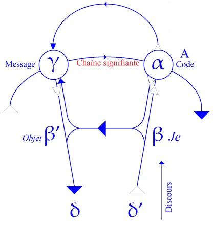
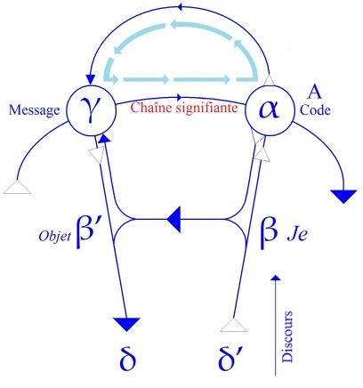
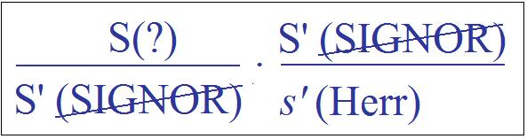
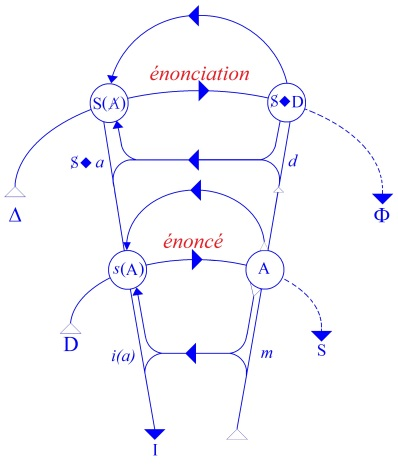
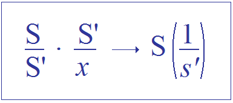

# Leçon 03 | 20 Novembre 1957

<!-- source-url: http://staferla.free.fr/S5/S5 FORMATIONS .docx -->
<!-- seminar: s5 -->
<!-- lesson: 03 -->

<!-- id: s5-03-0001 -->

|----|

<!-- id: s5-03-0002 -->

Nous voici donc entrés par la porte du trait d’esprit dont nous avons la dernière fois commencé d’analyser l’exemple *princeps*, celui qu’a emboîté FREUD sous la forme du mot d’esprit « *famillionnaire* » imputé en même temps
à Hirsch HYACINTHE, c’est-à-dire à cette création poétique pleine de signification.

<!-- id: s5-03-0003 -->

Aussi bien n’est-ce pas par hasard que c’est sur ce fond de création poétique que FREUD se trouve avoir choisi
son exemple *princeps* et que nous avons-nous-mêmes trouvé - comme il arrive d’ailleurs à l’accoutumée - que cet exemple *princeps* se trouvait être particulièrement apte à représenter, à démontrer, ce que nous voulons ici démontrer.

<!-- id: s5-03-0004 -->

Sans doute, vous l’avez vu, ceci nous entraîne dans l’analyse du phénomène psychologique dont il est question
à propos du trait d’esprit, au niveau d’une articulation signifiante qui - sans aucun doute si cela vous intéresse,
du moins je l’espère pour une grande part d’entre vous - n’est pas moins l’objet, vous l’imaginez facilement,
de quelque chose qui peut paraître déroutant.

<!-- id: s5-03-0005 -->

Je veux dire que sans aucun doute ce quelque chose qui surprend, déroute l’esprit, est aussi bien *le nerf*
de cette reprise, que je veux faire ici avec vous, de l’expérience analytique, et concerne la place, et je dirai presque, jusqu’à un certain point, *l’existence* du sujet, comme quelqu’un m’en posait la question et qui était certes loin d’être quelqu’un de peu averti - ni de peu averti de la question, ni de peu averti non plus de ce que je tente d’y apporter -
quelqu’un m’a posé la question :

<!-- id: s5-03-0006 -->

> « *Mais alors que devient ce sujet, où est-il ?* »

<!-- id: s5-03-0007 -->

La réponse est facile quand il s’agit de philosophes, puisque c’était un philosophe qui me posait cette question
à la *Société de Philosophie* où je parlais. J’étais tenté de répondre, mais sur ce point je pourrais volontiers vous retourner cette question, et vous dire que précisément je laisse la parole aux philosophes. Il ne s’agit pas après tout
que tout le travail me soit réservé.

<!-- id: s5-03-0008 -->

Cette question de l’élaboration de la notion de sujet demande assurément à être révisée à partir de l’expérience freudienne. Si quelque chose doit y être modifié, ce n’est pas non plus quelque chose qui doive nous surprendre.
En d’autres termes, si FREUD a apporté quelque chose d’essentiel, est-ce bien ce à quoi nous pouvions
nous attendre, que de voir les esprits, et particulièrement ceux des psychanalystes, adhérer, je dirais d’autant plus fortement à une notion du sujet, celle qui s’incarne dans telle façon de penser simplement le *moi*, qui n’est qu’un retour à ce que nous pourrions appeler « *les confusions grammaticales* » sur la question du sujet, l’identification du *moi* avec un pouvoir de synthèse qu’assurément aucune donnée dans l’expérience ne permet de soutenir.

<!-- id: s5-03-0009 -->

On peut même dire qu’il n’y a pas eu besoin d’arriver à l’expérience freudienne, il n’y a pas besoin d’y recourir*,*
pour qu’une simple inspection sincère de ce qu’est notre vie à chacun, nous permette d’entrevoir
que cette « *puissance de synthèse* » *-* *soi-disant -* est plus que tenue en échec, et qu’à vrai dire - sauf *fiction -* il n’y a vraiment rien qui soit d’expérience plus commune que ce que nous pourrons appeler non seulement *l’incohérence de nos motifs*,
mais je dirais même plus : le sentiment de leur profonde immotivation, de leur *aliénation* fondamentale.

<!-- id: s5-03-0010 -->

Que si FREUD nous apporte une notion d’un sujet qui fonctionne au-delà, *ce sujet* en nous *si difficile à saisir*,
s’il nous en montre les ressorts et l’action, c’est là quelque chose qui assurément depuis toujours aurait dû retenir l’attention, que ce sujet…
en tant qu’il introduit *une unité cachée, une unité secrète* dans ce qui nous apparaît au niveau de l’expérience
la plus commune : notre profonde division, notre profond morcellement, notre profonde aliénation
par rapport à nos propres motifs
…que ce sujet soit autre.

<!-- id: s5-03-0011 -->

Est-il simplement une espèce de double, de sujet « *mauvais moi* » comme l’ont dit certains, d’autant qu’il recèle en effet bien des surprenantes tendances, ou simplement « *autre moi* », ou, comme on pourrait croire encore que je dis :
« *plus vrai moi* » ? Est-ce bien de cela dont il s’agit ?

<!-- id: s5-03-0012 -->

Est-ce simplement *une doublure*, purement et simplement un autre que nous pouvons concevoir structuré
comme *le moi de l’expérience* ?

<!-- id: s5-03-0013 -->

Voilà *la question*, voilà aussi pourquoi nous l’abordons cette année *au niveau et sous le titre des Formations de l’inconscient*.
Assurément la question - déjà présente - offre une réponse : il n’est pas structuré *de la même façon*.
Dans *ce moi de l’expérience* quelque chose en lui se présente qui a ses lois propres.
Il y a, pour tout dire, *une organisation de ces formations* qui non seulement a un *style*, mais une structure particulière.

<!-- id: s5-03-0014 -->

Cette structure, FREUD l’aborde et la démonteau niveau des névroses :

<!-- id: s5-03-0015 -->

- au niveau des *symptômes*,

<!-- id: s5-03-0016 -->

- au niveau des *rêves*,

<!-- id: s5-03-0017 -->

- au niveau des *actes manqués*,

<!-- id: s5-03-0018 -->

- au niveau du *trait d’esprit*.
  Il la reconnaît unique et homogène. Tout le nerf de ce qu’il nous expose au niveau du *trait d’esprit*
  \- et c’est bien pour cela que je l’ai choisi comme porte d’entrée - repose sur ceci, c’est son argument fondamental :
  faire du *trait d’esprit* une manifestation de l’inconscient.

<!-- id: s5-03-0019 -->

C’est vous dire qu’il est *structuré*, qu’il est *organisé* selon les mêmes lois que celles que nous avons trouvées dans le rêve.
Ces lois *il les rappelle*, *il les énumère*, *il les articule*, *il les reconnaît* dans la structure du *trait d’esprit * :

<!-- id: s5-03-0020 -->

- ce sont les lois de la *condensation*,

<!-- id: s5-03-0021 -->

- ce sont les lois du *déplacement*.

<!-- id: s5-03-0022 -->

Essentiellement et avant tout quelque chose d’autre y adhère : il y reconnaît aussi ce que j’ai appelé dans la fin
de mon article, pour traduire : « *Égards aux nécessités de la mise en scène* ». Il l’amène aussi comme un tiers-élément.  
Mais peu importe d’ailleurs de les nommer, *le nerf* de ce qu’il apporte, *la clef* de son analyse est cette reconnaissance de lois structurales communes : à ceci se reconnaît qu’un processus - comme il s’exprime - a été attiré dans l’inconscient.
C’est ce qui est *structuré selon les lois*, structuré selon ces types. C’est de cela qu’il s’agit quand il s’agit de l’inconscient.

<!-- id: s5-03-0023 -->

Que se passe-t-il ? Il se passe au niveau de ce que je vous enseigne, que nous sommes en état *maintenant*, c’est-à-dire après FREUD, de reconnaître cet événement d’autant plus démonstratif qu’il a vraiment tout pour surprendre.
Que ces lois - cette structure de l’inconscient, ce à quoi se reconnaît un phénomène comme appartenant aux *formations de l’inconscient -* soient strictement identifiables, recouvrent, et je dirai même plus : recouvrent d’une façon exhaustive, ce que l’analyse linguistique nous permet de repérer comme étant les modes de formation essentiels
du sens en tant que ce sens est engendré par les combinaisons du signifiant.

<!-- id: s5-03-0024 -->

Le terme de *signifiant* prend un sens plein à partir d’un certain moment de l’évolution de *la linguistique*, celui où est isolée la notion d’élément signifiant très liée dans l’histoire concrète au dégagement de la notion de « *phonème* ».
Bien entendu uniquement localisée à cette notion, la notion de *signifiant*, pour autant qu’elle nous permet de prendre le langage au niveau d’un certain *registre élémentaire,* nous pouvons la définir doublement :

<!-- id: s5-03-0025 -->

- comme *chaîne* d’une part, *diachronique*,

<!-- id: s5-03-0026 -->

- et comme *possibilité* à l’intérieur de cette *chaîne*, *possibilité permanente de substitution* dans le sens *synchronique*.

<!-- id: s5-03-0027 -->

Cette prise à un niveau fondamental, élémentaire des fonctions du signifiant, est la reconnaissance,
au niveau de cette fonction, d’une puissance originale qui est précisément celle où nous pouvons localiser :

<!-- id: s5-03-0028 -->

- un certain engendrement de quelque chose qui s’appelle le sens,

<!-- id: s5-03-0029 -->

- et quelque chose qui en soi est très riche d’implications psychologiques,
  ...et qui reçoit une sorte de complémentation…
  sans même avoir besoin de pousser plus loin soi-même sa voie, sa recherche, de creuser plus loin son sillon
  …dans ce que FREUD lui-même nous a déjà préparé à *ce point de jonction du champ de la linguistique avec le champ propre*
  *de l’analyse*.

<!-- id: s5-03-0030 -->

Il s’agit de nous montrer que ces « *effets psychologiques* », que ces « *effets d’engendrement du sens* » ne sont rien d’autre,
ne se recouvrent exactement qu’avec ce que FREUD nous a montré comme étant *les formations de l’inconscient*.
Autrement dit, nous pouvons saisir *ce quelque chose* qui reste jusque là élidé dans ce qu’on peut appeler
« *la place de l’homme* », c’est très précisément ceci : le rapport étroit qu’il y a entre le fait que *pour lui existent des objets*
*d’une hétérogénéité, d’une diversité, d’une variabilité vraiment surprenantes, par rapport aux objets biologiques*.

<!-- id: s5-03-0031 -->

Car ce que nous pouvons attendre comme étant le correspondant de son existence de l’organisme vivant,
ce *quelque chose de singulier* que présente un certain *style*, une certaine diversité surabondante, luxuriante, et en même temps une insaisissabilité *-* comme telle, comme objet biologique *-* du monde des objets humains,
c’est quelque chose qui se trouve, dans cette conjoncture, devoir être étroitement et indissolublement relaté
à la soumission, à la subduction de l’être humain par le phénomène du langage.

<!-- id: s5-03-0032 -->

Bien sûr ceci n’avait pas manqué d’apparaître, mais jusqu’à un certain point et d’une certaine façon masqué,
masqué pour autant que ce qui est saisissable au niveau du discours, et du discours concret, se présente toujours
par rapport à cet *engendrement du sens* dans une position d’ambiguïté, ce langage en effet étant tourné déjà vers *les objets* qui incluent *en eux-mêmes* quelque chose de la création qu’ils ont reçue du langage même, et quelque chose qui déjà
a pu faire l’objet précisément de toute une tradition, voire d’une rhétorique philosophique, celle qui pose la question dans le sens le plus général de *la critique du jugement* : qu’est-ce que vaut ce *langage* ? *Qu’est-ce que représentent ces connexions par rapport aux connexions auxquelles elles paraissent aboutir - qu’elles se posent même refléter - qui sont les connexions du réel* ?

<!-- id: s5-03-0033 -->

C’est bien là tout ce à quoi aboutit en effet *une tradition de critique, une tradition philosophique* dont nous pouvons définir la pointe et le sommet par KANT. Et déjà d’une certaine façon, qu’on puisse *interpréter*, *penser* la critique de KANT comme la plus profonde *mise en cause de toute espèce de réel*, pour autant qu’il est soumis aux « *catégories a priori »*
non seulement *de l’esthétique* mais aussi *de la logique,* c’est bien quelque chose qui représente un point pivot au niveau duquel la méditation humaine repart pour retrouver *ce quelque chose* qui n’était point aperçu dans cette façon :

<!-- id: s5-03-0034 -->

- de poser la question au niveau du discours, au niveau du discours logique, au niveau de la correspondance entre une certaine syntaxe du cercle intentionnel en tant qu’il se ferme dans toute phrase,

<!-- id: s5-03-0035 -->

- de le reprendre en dessous et en travers de ce livre de la critique du discours logique,

<!-- id: s5-03-0036 -->

- de reprendre l’action de la parole dans cette chaîne créatrice où elle est toujours susceptible d’*engendrer de nouveaux sens : par la voie de la métaphore de la façon la plus évidente,* *par la voie de la métonymie d’une façon qui, elle, est restée* - je vous expliquerai pourquoi quand il en sera temps - jusqu’à une époque toute récente toujours *profondément masquée*.

<!-- id: s5-03-0037 -->

Cette introduction est déjà assez difficile pour que je revienne à mon exemple « *famillionnaire* »,
et que nous nous efforcions ici de la compléter. Nous en sommes arrivés à la notion qu’au cours d’un discours précisément intentionnel où le sujet se présente comme *voulant dire quelque chose*, quelque chose se produit qui dépasse son vouloir : quelque chose qui se présente comme un accident, comme un paradoxe, comme un scandale.

<!-- id: s5-03-0038 -->

Cette *néoformation* se présente avec des traits non pas du tout négatifs d’une sorte d’*achoppement*, d’*acte manqué*,
comme elle pourrait l’être…
après tout, je vous en ai montré des équivalents, des choses qui y ressemblent singulièrement,
dans l’ordre du pur et simple *lapsus*
…mais au contraire se trouve, dans les conditions où cet accident se produit, être enregistrée, être valorisée au rang de phénomène significatif, précisément *d’engendrement d’un sens* au niveau de la *néoformation signifiante*, d’une sorte
de *[collapsus](http://www.cnrtl.fr/definition/collapsus) de signifiants* qui se trouvent là - comme dit FREUD - *comprimés l’un avec l’autre, emboutis l’un dans l’autre*,
et que cette *signification* crée, et je vous en ai montré les nuances et l’énigme - entre quoi et quoi ? –
entre cette évocation de « *manière d’être* » proprement *métaphorique* :

<!-- id: s5-03-0039 -->

« *Il me traitait d’une façon tout à fait famillionnaire* »

<!-- id: s5-03-0040 -->

…cette évocation de « *manière d’être* », cet « *être verbal* » tout près de prendre cette animation singulière dont j’ai essayé déjà d’agiter devant vous le fantôme avec le « *famillionnaire* » :

<!-- id: s5-03-0041 -->

- le « *famillionnaire* » en tant qu’il fait son entrée dans le monde, comme représentatif de quelque chose qui pour nous est très susceptible de prendre une réalité et un poids infiniment plus constants que ceux plus effacés du millionnaire,

<!-- id: s5-03-0042 -->

- mais dont je vous ai montré aussi combien il a quelque chose dans l’existence d’assez animateur pour représenter vraiment un personnage caractéristique d’une époque historique et je vous ai indiqué qu’il n’y avait pas que HEINE à l’avoir inventé, je vous ai parlé du *Prométhée mal enchaîné* de GIDE et de son *miglionnaire*.

<!-- id: s5-03-0043 -->

Il serait plein d’intérêt de nous arrêter un instant à la création gidienne du *Prométhée mal enchaîné*. Le millionnaire
du *Prométhée mal enchaîné* c’est *Zeus le banquier*, et rien n’est plus surprenant que l’élaboration de ce personnage.
Je ne sais pas pourquoi, dans le souvenir que nous laisse l’œuvre de GIDE - éclipsée peut-être par l’éclat inouï de *Paludes* dont il fait pourtant une sorte de correspondance et de double - *c’est le même personnage dont il s’agit dans les deux*.

<!-- id: s5-03-0044 -->

Il y a beaucoup de *traits* qui sont là pour le recouper : le millionnaire dans tous les cas est quelqu’un qui se trouve avoir des comportements singuliers avec ses semblables, puisque c’est de là que nous voyons sortir l’idée de l’acte gratuit.

<!-- id: s5-03-0045 -->

ZEUS le banquier, dans l’incapacité où il est d’avoir avec n’importe quel autre, un véritable authentique échange…
pour autant qu’il est ici identifié, si l’on peut dire à la puissance absolue, à ce côté « *pur signifiant* » qu’il y a dans l’argent, mettant en cause, si l’on peut dire, l’existence de toute espèce d’échange significatif possible
…ne trouve rien d’autre pour sortir de sa solitude que de procéder de la façon suivante, comme s’exprime GIDE :

<!-- id: s5-03-0046 -->

- de sortir dans la rue avec d’une main une enveloppe portant *-* ce qui à l’époque avait sa valeur *-* un billet de cinq cents francs, et dans l’autre main une gifle, si l’on peut s’exprimer ainsi,

<!-- id: s5-03-0047 -->

- de laisser tomber l’enveloppe, et au sujet qui la lui ramasse obligeamment, de lui proposer d’écrire un nom sur l’enveloppe, moyennant quoi il lui donne une gifle, et ce n’est pas pour rien qu’il est ZEUS, une gifle formidable qui le laisse étourdi et blessé, puis de s’esquiver et d’envoyer le contenu de l’enveloppe à la personne dont le nom a été ainsi écrit par celui qu’il vient de si rudement traiter.

<!-- id: s5-03-0048 -->

Ainsi se trouve-t-il dans une posture de n’avoir lui-même rien choisi, d’avoir compensé, si l’on peut dire, un maléfice gratuit par un don qui ne lui doit à lui-même absolument rien, tant son choix est de restaurer, si l’on peut dire,
par son action, le circuit de l’échange, lequel ne peut s’introduire lui-même d’aucune façon et sous aucun biais,
d’y participer de cette façon par effraction si l’on peut dire, d’engendrer une sorte de dette à laquelle il ne participe
en rien et dont toute la suite d’ailleurs va se développer dans la suite du roman par le fait que les deux personnages n’arriveront plus jamais eux-mêmes à conjoindre, si l’on peut dire, ce qu’ils se doivent l’un à l’autre : l’un en deviendra presque borgne et l’autre en mourra. C’est toute l’histoire du roman, et il semble qu’à un certain degré
c’est une histoire profondément instructive et morale, utilisable au niveau de ce que nous essayons de montrer.

<!-- id: s5-03-0049 -->

<!-- id: s5-03-0050 -->

Voici donc notre Henri HEINE qui se trouve en posture d’avoir créé ce personnage comme fond,
mais dans ce personnage, *d’avoir fait surgir*, avec ce signifiant du « *famillionnaire* » *la double dimension de* :

<!-- id: s5-03-0051 -->

- *la création métaphorique*,

<!-- id: s5-03-0052 -->

- et d’autre part *une sorte d’objet métonymique* nouveau, le « *famillionnaire* » dont nous pouvons en somme situer la position *ici* \[*la création métaphorique en* γ\] et *ici* \[*une sorte d’objet métonymique en* β’\].

<!-- id: s5-03-0053 -->

Je vous ai montré la dernière fois que pour concevoir l’existence de *la création signifiante* qui s’appelle le « *famillionnaire* », nous pouvions ici \[en β’\] retrouver - encore qu’ici bien entendu l’attention ne soit pas attirée de ce côté - tous *les débris*, tous *les déchets* ordinaires, à *la réflexion d’une création métaphorique sur un objet*. C’est à savoir tous les dessous signifiants, toutes les parcelles signifiantes dans lesquelles nous pouvons briser le terme « *famillionnaire* » : *femme*, *fames*, *fama*, *l’infamie*, enfin tout ce que vous voudrez, *le famulus*, tout ce que Hirsch HYACINTHE est effectivement
pour son patron caricatural, Cristoforo DI GUMPELINO.

<!-- id: s5-03-0054 -->

Et ici à cette *place* \[en β’\] nous devons systématiquement chercher, chaque fois que nous avons affaire
à une *formation de l’inconscient* comme telle, ce que j’ai appelé « [*les dé**bris de l’objet métonymique*](#Reour_débris_objet) » *qui* assurément,
pour des raisons qui sont tout à fait claires à l’expérience, *se révèlent* naturellement *particulièrement importants*
*quand la création métaphorique* *-* si l’on peut dire *-* *n’est pas réussie*. Je veux dire quand elle n’a abouti à rien,
comme dans le cas que je vous ai montré de *l’oubli d’un nom* : quand le nom SIGNORELLI est oublié,
pour retrouver la trace de ce creux, de ce trou que nous trouvons au niveau de la métaphore,
les *débris métonymiques* prennent là toute leur importance.

<!-- id: s5-03-0055 -->

Le fait qu’au niveau de *la disparition du terme* « Herr », c’est quelque chose qui fait partie de tout le contexte *métonymique* dans lequel ce « Herr » s’est isolé, à savoir le contexte « Bosnie <u>Her</u>zégovine », qui nous permet de le restituer,

<!-- id: s5-03-0056 -->

prend ici toute son *importance*.

<!-- id: s5-03-0057 -->

Mais revenons à notre « *famillionnaire* ». Notre « *famillionnaire* » s’est donc produit *au niveau du message*.

<!-- id: s5-03-0058 -->

Je vous ai fait remarquer que là nous devons nous trouver au niveau du « *famillionnaire* » avec les correspondances métonymiques de *la formation paradoxale* qui s’est produite au niveau de *l’oubli du nom*, dans le cas SIGNORELLI.
Nous devons aussi trouver quelque chose qui réponde à l’escamotage ou à la disparition du « SIGNOR »,
dans le cas de *l’oubli du nom,* nous devons le trouver aussi au niveau du *trait d’esprit*.

<!-- id: s5-03-0059 -->

C’est là que nous en sommes restés. Comment pouvons-nous concevoir, réfléchir sur ce qui se passe au niveau
du « *famillionnaire* » pour autant que *la métaphore*, ici spirituelle, est réussie ? II doit y avoir jusqu’à un certain point *quelque chose qui corresponde*, qui marque en quelque sorte « *le résidu* », disons « *le déchet de* *la création* *métaphorique* ».

<!-- id: s5-03-0060 -->

Un enfant le dirait tout de suite. Si nous ne sommes pas fascinés par le côté *entificateur* qui toujours nous fait manier
le phénomène du langage comme s’il s’agissait d’un objet, nous apprendrons tout simplement à dire des choses évidentes, à la façon dont les mathématiciens procèdent quand ils manient leurs petits symboles en *x*, *a* et *b*,
c’est-à-dire sans penser à rien, sans penser à ce qu’ils signifient, puisque c’est justement ce que nous cherchons,
c’est ce qui se passe au niveau du signifiant. Pour savoir ce que cela signifie, ne cherchons pas ce que cela signifie.

<!-- id: s5-03-0061 -->

Il est tout à fait clair que :

<!-- id: s5-03-0062 -->

- ce qui est *rejeté*,

<!-- id: s5-03-0063 -->

- ce qui manque au niveau de la métaphore, *le reste,*

<!-- id: s5-03-0064 -->

- ce qui *sort*,

<!-- id: s5-03-0065 -->

- ce qui reste comme *résidu de la création métaphorique*,
  …c’est le mot « *familier* ».

<!-- id: s5-03-0066 -->

Si le mot « *familier* » n’est pas venu, et si « *famillionnaire* » est venu à sa place, le mot « *familier* » nous devons
le considérer comme étant passé quelque part, comme ayant le même sort que celui que je vous désignais
la dernière fois comme étant réservé au « SIGNOR » de SIGNORELLI, c’est-à-dire allant poursuivre
son *petit circuit circulaire* quelque part dans la mémoire inconsciente.

<!-- id: s5-03-0067 -->

<!-- id: s5-03-0068 -->

C’est le mot « *familier* ». Nous ne serons pas du tout étonnés qu’il en soit ainsi, pour la simple raison que ce mot « *familier* » est justement ce qui, dans l’occasion, correspond bien effectivement au mécanisme du *refoulement*
au sens le plus habituel, au sens de celui dont nous avons l’expérience au niveau de quelque chose qui correspond :

<!-- id: s5-03-0069 -->

- à une expérience passée,

<!-- id: s5-03-0070 -->

- à une expérience disons personnelle,

<!-- id: s5-03-0071 -->

- à une expérience historique antérieure, et remontant fort loin où, bien entendu, ce ne serait plus *l’être* à ce moment de Hirsch Hyacinthe lui-même, mais celui de son créateur, à savoir Henri HEINE.

<!-- id: s5-03-0072 -->

Si dans la création poétique d’Henri HEINE le mot « *famillionnaire* » a fleuri d’une façon aussi heureuse, peu nous importe de savoir dans quelles circonstances il l’a trouvé. Il l’a peut-être trouvé au cours d’une de ses promenades dans une nuit parisienne qu’il devait achever solitaire, après les rencontres qu’il avait, dans les années de 1830 environ, avec le baron James ROTHSCHILD qui le traitait comme un égal, et d’une façon tout à fait « *famillionnaire* ».
C’est peut-être à ce moment-là qu’il l’a inventé, plutôt que de le faire tomber de sa plume quand il était à sa table. Mais peu importe : il a fait cette réussite aussi heureuse, c’est bien.

<!-- id: s5-03-0073 -->

Ici je ne vais pas plus loin que FREUD. Passé le tiers du livre environ, après l’analyse de « *famillionnaire* »,
vous voyez FREUD reprendre l’exemple au niveau de ce qu’il appelle « *les tendances de l’esprit* », et identifier
dans cette création, dans la formation de ce *trait d’esprit*, qualifier d’« *ingénieuse invention* » cette création de HEINE.
C’est quelque chose qui a son répondant dans son passé, dans ses relations personnelles de famille.
Il lui est bien familier, « *famillionnaire* », parce que ce n’est rien d’autre, derrière Salomon de ROTHSCHILD
qui est celui qu’il a mis en cause dans sa fiction, qu’un autre « *famillionnaire* » qui est de sa famille,
le nommé Salomon HEINE, son oncle.

<!-- id: s5-03-0074 -->

Lequel a joué dans sa vie le rôle le plus opprimant, ceci tout au long de son existence, le traitant extrêmement mal,
ne lui refusant pas simplement ce qu’il pouvait attendre de lui sur quelque plan *concret* que ce soit, mais bien plus :
se trouvant être en posture d’être « *l’homme qui a refusé* », qui a fait *obstacle* dans la vie de HEINE à la réalisation
de *son amour majeur*, de l’amour qu’il avait pour sa cousine qu’il n’a très précisément pas pu épouser pour cette raison essentiellement *famillionnaire* que l’oncle était un *millionnaire* et *que lui ne l’était pas*.

<!-- id: s5-03-0075 -->

Donc en somme HEINE a toujours considéré comme une trahison ce qui n’a été que la conséquence
de cette impasse familiale si profondément marquée de *millionnarité*. Disons que ce familier qui se trouve être là
ce qui a la fonction signifiante majeure dans le refoulement corrélatif de la création spirituelle, c’est *le signifiant*
qui dans le cas de HEINE poète, artiste du langage, nous montre d’une façon évidente la sous-jacence
d’une signification personnelle par rapport à la création ici spirituelle ou poétique. Cette sous-jacence est liée au *mot*, et non pas à tout ce que peut avoir de confusément accumulé *la signification* permanente dans la vie de HEINE,
d’une insatisfaction et d’une position très singulièrement mise *en porte à faux* vis-à-vis des femmes en général.

<!-- id: s5-03-0076 -->

Si ce quelque chose intervient ici, c’est par le signifiant « *familier* » comme tel. Il n’y a aucun autre moyen,
dans l’exemple indiqué de rejoindre l’action, l’incidence de l’inconscient, si ce n’est en montrant ici la signification étroitement liée à la présence du terme signifiant « *familier* » comme tel. Bien entendu de telles remarques
sont faites pour nous montrer que lorsque nous sommes entrés dans cette voie de lier à la combinaison signifiante toute l’économie de ce qui est enregistré *dans l’inconscient*, ceci bien entendu nous mène loin,
et dans une régression que nous pouvons considérer, non pas comme *ad infinitum*, mais jusqu’à l’origine du langage.

<!-- id: s5-03-0077 -->

Il faut que nous considérions *toutes les significations* humaines comme ayant été à quelque moment *métaphoriquement engendrées par des conjonctions signifiantes*. Et je dois dire que des considérations comme celle-là ne sont certainement pas dépourvues d’intérêt. Nous avons toujours beaucoup à apprendre de l’examen de cette histoire du signifiant.

<!-- id: s5-03-0078 -->

Cette remarque que je vous fais incidemment est faite simplement pour vous en donner ici une illustration pendant que j’y pense, à propos de cette *identification* du terme « *famille* » comme étant ce qui est au niveau de la formation métaphorique refoulé, car après tout...
sauf à avoir lu FREUD ou à avoir simplement un tout petit peu d’homogénéité entre la façon
dont vous pensez pendant que vous êtes en analyse et la façon dont vous lisez un texte
...vous ne pensez pas à « *famille* » dans le terme de « *famillionnaire* » comme tel.

<!-- id: s5-03-0079 -->

Dans le terme de « *atterré* » dont je vous faisais l’analyse la dernière fois :

<!-- id: s5-03-0080 -->

- plus la réalisation du terme « *atterré* » est faite,

<!-- id: s5-03-0081 -->

- plus elle va dans le sens de *terreur*,

<!-- id: s5-03-0082 -->

- et plus la *terre* est évitée, qui pourtant est l’élément actif dans l’introduction signifiante du terme métaphorique « *atterré* ».

<!-- id: s5-03-0083 -->

De même ici plus vous allez loin dans le sens de « *famillionnaire* », plus vous pensez au « *famillionnaire* »,
c’est-à-dire au millionnaire devenu, devenu *transcendant* si l’on peut dire, devenu quelque chose qui existe dans l’être,
et non plus purement et simplement cette sorte de signe, et plus la « *famille* » elle-même tend à être refoulée
comme terme agissant dans la création du mot « *famillionnaire* », éludée.

<!-- id: s5-03-0084 -->

Mais si un instant vous vous remettez à vous *intéresser* à ce terme de « *famille* » - comme je l’ai fait - au niveau
du signifiant, c’est-à-dire en ouvrant le dictionnaire LITTRÉ dont Monsieur CHASSÉ[^10] nous dit que c’était là

<!-- id: s5-03-0085 -->

que MALLARMÉ prenait toutes ses idées. Le plus fort c’est qu’il a raison, mais d’avoir raison dans un certain contexte, je dirai même qu’il y est pris aussi, non moins que ses interlocuteurs. Il a le sentiment qu’il enfonce là
une porte. Bien sûr, il enfonce cette porte parce qu’elle n’est pas ouverte.

<!-- id: s5-03-0086 -->

Si en effet chacun pensait à ce qu’est la poésie, il n’y aurait véritablement rien de surprenant à s’apercevoir
que MALLARMÉ devait s’intéresser vivement au signifiant. Simplement comme personne n’a jamais véritablement même abordé *ce qu’est véritablement* *la poésie*, c’est-à-dire qu’on balance entre je ne sais quelle théorie vague et vaseuse sur la comparaison, ou au contraire la référence à je ne sais quels termes musicaux, c’est là que l’on veut expliquer l’absence prétendue de sens dans MALLARMÉ, sans s’apercevoir du tout :

<!-- id: s5-03-0087 -->

- qu’il doit y avoir une façon de définir *la poésie* en fonction des rapports au signifiant,

<!-- id: s5-03-0088 -->

- qu’il y a *une formule* peut-être un peu plus *rigoureuse*, et qu’à partir du moment où *l’on donne cette formule*, il est beaucoup moins surprenant que dans ses sonnets les plus obscurs, MALLARMÉ soit mis en cause.
  Ceci dit, je pense que personne ne fera un jour la découverte que je prenais aussi toutes mes idées
  dans le dictionnaire LITTRÉ !

<!-- id: s5-03-0089 -->

Ce n’est pas parce que je l’ouvre que *c’est là la question*. Je l’ouvre donc et je peux vous informer de ceci,
que je suppose que certains d’entre vous peuvent connaître, mais qui a tout de même son intérêt,
c’est que le terme « *familial* » en 1881 est un *néologisme*.

<!-- id: s5-03-0090 -->

Une consultation attentive de quelques bons auteurs, qui se sont penchés sur ce problème depuis, m’a permis
de dater en 1865 *l’apparition du mot* « *familial* ». Cela veut dire qu’on n’avait pas l’adjectif « *familial* » avant cette année-là. Pourquoi ne l’avait-on pas ? Voilà une chose fort intéressante. En fin de compte la définition qu’en donne LITTRÉ est quelque chose qui se rapporte à la famille, au niveau dit-il, de la science politique. Pour tout dire le mot « *familial* » est beaucoup plus lié à un contexte comme celui par exemple d’« allocations familiales » qu’à n’importe quoi.

<!-- id: s5-03-0091 -->

C’est pour autant que la famille a été, à un moment donné, prise, qu’on a pu l’aborder comme objet au niveau d’une réalité politique intéressante, c’est-à-dire pour autant précisément qu’elle n’était plus tout à fait dans *le même rapport*, dans la même fonction structurante avec le sujet…
elle avait été toujours jusqu’à une certaine époque, c’est-à-dire en quelque sorte incluse, prise dans les bases et les fondements mêmes du discours du sujet, sans même qu’on songe à l’isoler pour autant
…qu’elle a été tirée du niveau d’objet résistant, d’objet devenu propos d’un maniement technique particulier,
qu’une chose aussi simple que l’adjectif corrélatif au terme famille, vient au jour.

<!-- id: s5-03-0092 -->

Ce en quoi vous ne pouvez pas manquer de vous apercevoir que ce n’est peut-être pas non plus quelque chose d’indifférent au niveau de l’usage même du signifiant « *famille* ». Quoi qu’il en soit, une telle remarque est faite
aussi pour nous faire considérer que nous ne devons pas considérer ce que je viens de vous dire de la mise dans
le circuit du *refoulé* et du terme « *famille* » au niveau du temps d’Henri HEINE, comme ayant absolument une valeur identique à celle qu’il peut avoir dans notre temps, puisque le seul fait que le terme « *familial* » non seulement
*n’est pas utilisable dans le même contexte*, mais même n’existe pas au temps de HEINE, suffit à changer, si l’on peut dire, l’axe de *la fonction signifiante* lié au terme « *famille* ».

<!-- id: s5-03-0093 -->

C’est une nuance que l’on peut considérer à cette occasion comme non négligeable. C’est grâce d’ailleurs à une série de négligences de cette espèce que nous pouvons nous imaginer que nous comprenons les textes antiques
comme les comprenaient les contemporains. Néanmoins tout nous annonce qu’il y a toutes les chances pour
qu’une lecture naïve d’HOMÈRE ne corresponde absolument en rien au sens véritable d’HOMÈRE, et que ce n’est certainement pas pour rien que des gens se consacrent à une exhaustion attentive du vocabulaire homérique comme tel, dans l’espoir de remettre approximativement en place la dimension de signification dont il s’agit dans ces poèmes.

<!-- id: s5-03-0094 -->

Mais le fait qu’ils conservent leur sens, malgré que selon toute probabilité une bonne partie de ce qu’on appelle improprement « *le monde mental* », le monde des significations des héros homériques, nous échappe complètement,
et très probablement doive nous échapper d’une façon plus ou moins définitive, c’est tout de même, sur ce plan,
la distance du signifiant au signifié qui nous permet de comprendre qu’une concaténation particulièrement bien faite, c’est cela qui caractérise précisément la poésie : des signifiants auxquels nous puissions encore et probablement *indéfiniment* jusqu’à la fin des siècles donner des sens plausibles. \[Cf. Sém. 1975-76, la remarque de Joyce sur son œuvre\]

<!-- id: s5-03-0095 -->

Nous voici donc à notre « *famillionnaire* », et je crois avoir fait à peu près le tour de ce qu’on peut dire du phénomène de la création du *trait d’esprit* dans son registre et dans son ordre propre. Ceci, peut-être va nous permettre de serrer de plus près la formule que nous pouvons donner de *l’oubli du nom* dont je vous ai parlé la semaine dernière.

<!-- id: s5-03-0096 -->

Qu’est-ce que *l’oubli du nom* ? Dans cette occasion c’est que le sujet a posé devant l’Autre, et à l’Autre lui-même
en tant qu’Autre, la question *« Qui a peint la fresque d’Orvieto ? ».* Et il ne trouve rien.

<!-- id: s5-03-0097 -->

Je veux vous faire remarquer à cette occasion l’importance qu’a le souci que j’ai de vous donner une formulation correcte, sous prétexte que l’analyse découvre que s’il n’évoque pas le nom du peintre d’Orvieto, c’est parce que « SIGNOR » manque que vous pouvez penser que c’est « SIGNOR » qui est oublié. Ce n’est pas vrai.
D’abord parce que ce n’est pas « SIGNOR » qu’il *cherche*, c’est SIGNORELLI qui est oublié, et « SIGNOR »
est le déchet signifiant refoulé de quelque chose qui se passe à la place où l’on ne retrouve pas SIGNORELLI.

<!-- id: s5-03-0098 -->

Entendez bien le caractère tout à fait rigoureux de ce que je vous dis. Ce n’est absolument pas la même chose de
se rappeler SIGNORELLI ou « SIGNOR ». Quant vous avez fait avec SIGNORELLI l’unité que cela comporte,
c’est-à-dire que vous en avez fait le nom propre d’un auteur, la désignation d’un nom particulier,
vous n’y pensez plus au « SIGNOR ».

<!-- id: s5-03-0099 -->

Si le « SIGNOR » a été dégagé du SIGNORELLI, isolé dans le SIGNORELLI, c’est par rapport à l’action
de décomposition propre à *la métaphore*, et pour autant que SIGNORELLI a été pris dans le jeu métaphorique
qui a abouti à *l’oubli du nom*, celui que nous permet de reconstituer l’analyse.

<!-- id: s5-03-0100 -->

Ce que nous permet de reconstituer l’analyse, c’est la correspondance de « SIGNOR » avec « Herr »
dans une création métaphorique qui vise le sens qu’il y a au-delà de « HERR », le sens qu’a pris « HERR »
dans la conversation avec le personnage qui accompagne à ce moment-là FREUD dans son petit voyage
vers les bouches de Cattaro, et qui fait que « HERR » est devenu *le symbole* de ce devant quoi échoue sa maîtrise
de médecin, *du maître absolu*, c’est-à-dire *le mal* qu’il ne guérit pas, le personnage qui se suicide malgré ses soins,
et pour tout dire *la mort et l’impuissance* qui le menacent lui personnellement, FREUD.

<!-- id: s5-03-0101 -->

C’est dans la création métaphorique que s’est produit ce *brisement* de SIGNORELLI, qui a permis au « SIGNOR », qu’on retrouve en effet comme élément, de passer quelque part. Il ne faut pas dire que c’est « SIGNOR »
qui est *oublié*, c’est SIGNORELLI qui est *oublié*, et « SIGNOR » est quelque chose que nous trouvons au niveau
du *déchet métaphorique* en tant que *le refoulé est ce déchet signifiant*. « SIGNOR » est *refoulé* mais il n’est pas oublié,
il n’a pas à être oublié puisqu’il n’existait pas avant.

<!-- id: s5-03-0102 -->

S’il a pu si facilement se fragmenter d’ailleurs, et se détacher de SIGNORELLI, c’est *parce que* SIGNORELLI
est justement un mot d’un langage étranger à FREUD, et qu’il est tout à fait frappant, remarquable…
et d’expérience que vous pouvez facilement faire pour peu que vous ayez l’expérience d’*une langue étrangère*
…que vous discernez beaucoup plus facilement les éléments composants du signifiant dans *une langue étrangère*
que dans la vôtre propre.

<!-- id: s5-03-0103 -->

Si vous commencez à apprendre une langue, vous vous apercevez, entre les mots, d’éléments de composition,
de relations de composition que vous omettez tout à fait dans votre langue. Dans votre langue vous ne pensez pas
les mots en les décomposant en radical et suffixe, alors que vous le faites de la façon la plus spontanée quand vous apprenez une langue étrangère. C’est pour cela qu’un mot étranger est plus facilement *fragmentable* et *usable* \[utilisable ?\]
dans ses éléments et ses décompositions signifiantes que ne l’est n’importe quel mot de votre propre langue.

<!-- id: s5-03-0104 -->

Ce n’est là qu’un élément adjuvant du processus qui peut aussi se produire avec les mots de votre propre langue, mais si FREUD a commencé par cet examen de l’oubli d’un nom étranger, c’est parce qu’il est particulièrement accessible et démonstratif.Alors qu’y a-t-il au niveau de la place où vous ne trouvez pas le nom de SIGNORELLI ?
Cela veut dire précisément qu’il y a eu tentative à cette place d’une création métaphorique.
*L’oubli du nom*, ce qui se présente comme *oubli du nom*, c’est ce qui s’apprécie à la place de « *famillionnaire* ».
Il n’y aurait rien eu du tout si Henri HEINE avait dit : il m’a reçu tout à fait comme un égal, tout à fait ...*ts* ...*ts* ...*ts*...

<!-- id: s5-03-0105 -->

C’est exactement ce qui se passe au niveau où FREUD cherche son nom de SIGNORELLI. C’est quelque chose
qui ne sort pas, qui n’est pas créé, c’est là qu’il cherche SIGNORELLI, il le cherche là indûment. Pourquoi ?
Parce qu’au niveau où il doit chercher SIGNORELLI, du fait de la conversation antécédente, *est attendue et appelée*
*une métaphore* qui concerne *ce quelque chose* qui est destiné à faire *médiation* entre ce dont il s’agit dans le cours
de la conversation que FREUD a à ce moment-là et ce qu’il en refuse, à savoir *la mort*.

<!-- id: s5-03-0106 -->

C’est justement ce dont il s’agit quand il tourne sa pensée vers la fresque d’Orvieto, à savoir ce que lui-même appelle « *les choses dernières* », l’élaboration si l’on peut dire *eschatologique* qui est la seule façon dont il peut aborder *cette sorte de terme abhorrique, de terme impensable* si l’on peut dire, *de ses pensées, ce quelque chose en quoi il doit tout de même bien s’arrêter*.
*La mort* existe qui limite son être d’homme, qui limite aussi son action de médecin, et qui donne aussi une borne absolument irréfutable à toutes ses pensées.

<!-- id: s5-03-0107 -->

C’est pour autant qu’*aucune métaphore ne lui vient* dans la voie de l’élaboration de ces choses comme étant
« *les choses dernières* », que FREUD se refuse à toute eschatologie, si ce n’est sous la forme d’une admiration
pour la fresque peinte d’Orvieto, *que rien ne vient* et qu’à la place où il en cherche l’*auteur* - car en fin de compte
c’est de l’*auteur* qu’il s’agit, de nommer l’*auteur - il ne se produit rien parce qu’aucune métaphore ne réussit*,
aucun équivalent n’est donnable à ce moment-là au SIGNORELLI, parce que le SIGNORELLI a pris une nécessité, est appelé à ce moment-là dans une bien autre forme signifiante que celle de son simple nom qui à ce moment-là
est tout de même sollicité d’entrer en jeu à la façon dont dans « *atterré* », joue sa fonction de radical « *ter* »,
c’est-à-dire qu’il se brise et qu’il s’élide.

<!-- id: s5-03-0108 -->

L’existence quelque part du terme « SIGNOR » est la conséquence de la *métaphore non réussie* que FREUD appelle,
à ce moment-là, à son aide. C’est pour cela que vous voyez les mêmes effets que je vous ai marqués comme devant exister au niveau de *l’objet métonymique*, à savoir à ce moment- là de *l’objet* dont il s’agit, de *l’objet* *représenté,*
*peint* sur « *les choses dernières* ». FREUD le dit :

<!-- id: s5-03-0109 -->

> « *Non seulement je ne retrouvais pas le nom de SIGNORELLI, mais je ne me suis jamais si bien souvenu, je n’ai jamais*
> *à ce moment-là si bien visualisé la fresque d’Orvieto, moi -* dit-il *- qui ne suis pas* - et on le sait par toutes sortes d’autres traits, par la forme de ses rêves en particulier - *moi qui ne suis pas tellement imaginatif.* »

<!-- id: s5-03-0110 -->

Si FREUD a pu faire toutes ces trouvailles, c’est très probablement dans le sens où il était beaucoup plus ouvert, beaucoup plus perméable au jeu *symbolique* qu’au jeu *imaginaire*. Et il note lui-même cette intensification de l’image
au niveau du souvenir, cette réminiscence plus *intense* de l’objet dont il s’agit, à savoir de la peinture,
et jusqu’au visage de SIGNORELLI lui-même qui est là dans la posture où apparaissent dans les tableaux
de cette époque, les donateurs, quelquefois l’auteur.

<!-- id: s5-03-0111 -->

Il y a SIGNORELLI dans le tableau, et FREUD le *visualise*. Il n’y a donc pas une sorte *d’oubli pur et simple*, massif
si l’on peut dire, *de l’objet*. Au contraire il y a une relation entre la *reviviscence*, l’*intensification* de certains de ces éléments,
et la perte d’autres éléments, d’éléments signifiants au niveau *symbolique*, et nous trouvons à ce moment-là le signe
de ce qui se passe au niveau de *l’objet métonymique*, en même temps que nous pouvons donc formuler ce qui se passe dans cette formule de l’oubli du nom, à peu près comme ceci :

<!-- id: s5-03-0112 -->

<!-- id: s5-03-0113 -->

Nous retrouvons là la formule de la métaphore en tant qu’elle s’exerce par un mécanisme de substitution
d’un signifiant S à un autre signifiant S’ :

<!-- id: s5-03-0114 -->

<!-- id: s5-03-0115 -->

Que se passe-t-il comme conséquence de cette *substitution* du signifiant S à un autre signifiant S’ ?
Il se produit ceci qu’au niveau de S’ il se produit un changement de sens, à savoir que le sens de S’, disons : *s’*
devient le nouveau sens que nous appellerons s *petit s* : *ss*, pour autant qu’il corresponde à ce *grand* S.

<!-- id: s5-03-0116 -->

Mais à la vérité, pour ne pas laisser subsister d’ambiguïté dans votre esprit, à savoir vous pouvez croire qu’il s’agit là de cette topologie, que petit *s* est le sens de grand S et qu’il faut que le S soit entré en relation avec S’
pour que le petit *s* puisse produire à ce titre seulement, ce que j’appelle *s"*. C’est la création de ce sens qui est la fin,
le fonctionnement de *la métaphore*. *La métaphore* est toujours réussie pour autant :

<!-- id: s5-03-0117 -->

- que ceci étant exécuté,

<!-- id: s5-03-0118 -->

- que *le sens* étant réalisé,

<!-- id: s5-03-0119 -->

- que *le sens* étant entré en fonction dans le sujet,
  …S et S’, exactement comme dans une formule de multiplication de fraction, se simplifient et s’annulent.

<!-- id: s5-03-0120 -->

C’est pour autant que « *atterré* » *finit par signifier* ce qu’il est vraiment pour nous dans la pratique, à savoir plus ou moins touché de terreur, que le « *ter* » qui a servi d’intermédiaire entre « *atterré* » et « *abattu* » d’une part - ce qui à proprement parler est la distinction la plus absolue, il n’y a aucune raison pour qu’« *atterré* » remplace « *abattu* » - mais que le « *ter* » qui est ici pour avoir servi à titre homonymique a apporté cette terreur, que le « *ter* » dans les deux cas
peut se simplifier. C’est un phénomène du même ordre qui se produit au niveau de *l’oubli du nom*.

<!-- id: s5-03-0121 -->

Si vous voulez bien comprendre que ce dont il s’agit, *ce n’est pas d’une perte du nom de* SIGNORELLI, c’est d’un *x*,
que je vous introduis ici parce que nous allons apprendre à le reconnaître et à nous en servir, cet *x* c’est cet appel
de la création significative dont nous retrouverons la place dans l’économie d’autres formations inconscientes.
Pour vous le dire tout de suite, c’est ce qui se passe au niveau de ce qu’on appelle « *le désir du rêve* ».
Je vous montrerai comment nous le retrouvons, mais là nous le voyons d’une façon simple
à la place où FREUD devrait retrouver SIGNORELLI.

<!-- id: s5-03-0122 -->

Il ne trouve rien, non pas simplement parce que » SIGNORELLI est disparu, mais parce qu’à ce niveau-là il faut
qu’il crée quelque chose qui satisfasse à ce qui est la question pour lui, à savoir « *les choses dernières* » et pour autant
que cet *x* est présent, quelque chose qui est la formation métaphorique tend à se produire, et nous pouvons le voir
à ceci que *le terme* « SIGNOR » apparaît au niveau de *deux termes signifiants opposés*, de deux fois la valeur S’,
et que c’est à ce titre qu’il subit le refoulement en tant que « SIGNOR », qu’au niveau du *x* *rien ne s’est produit*,
et c’est pour cela qu’il ne trouve pas le nom, et que le « HERR » joue le rôle de la place qu’il tient :

<!-- id: s5-03-0123 -->

- comme *objet métonymique*,

<!-- id: s5-03-0124 -->

- comme objet *qui ne peut pas être nommé*,

<!-- id: s5-03-0125 -->

- comme objet qui n’est nommé que par quelque chose qui est dans ses connexions.

<!-- id: s5-03-0126 -->

*La mort c’est le* « HERR » *absolu*. Mais quand on parle du « HERR » *on ne parle pas de la mort parce qu’on ne peut pas parler*
*de la mort*, parce que *la mort* est très précisément à la fois la limite, et probablement aussi l’origine *d’où part toute parole*.

<!-- id: s5-03-0127 -->

Voilà donc à quoi nous mène la comparaison, la mise en relation terme à terme de la formation du *trait d’esprit* avec *cette formation inconsciente* dont vous voyez maintenant mieux apparaître la forme en tant qu’elle *est apparemment négative*.
Elle n’est pas négative. Oublier un nom, ce n’est pas simplement une négation, c’est un manque, mais un manque
\- nous avons toujours tendance à aller trop vite - de ce nom.

<!-- id: s5-03-0128 -->

Ce n’est pas parce que ce nom n’est pas attrapé que c’est le manque : *c’est le manque de ce nom* qui fait que cherchant
*le nom*, ce *manque à la place* où ce nom devrait exercer cette fonction, où il ne peut plus l’exercer car un nouveau sens est requis, *qui exige une nouvelle création métaphorique*. C’est pour cela que le SIGNORELLI n’est pas retrouvé,
mais que par contre *les fragments* sont trouvés quelque part là où ils doivent être retrouvés dans l’analyse,
là où ils jouent la fonction du *deuxième terme de la métaphore*, à savoir du terme élidé dans la métaphore.

<!-- id: s5-03-0129 -->

Ceci peut vous paraître *chinois*, mais qu’importe si simplement vous vous laissez conduire comme il apparaît.
Que tout *chinois* - dans un cas particulier - que cela puisse vous sembler, ceci est tout à fait riche de conséquences
en ceci : c’est que, si vous vous en souvenez quand il faudra vous en souvenir, cela vous permettra d’éclairer
ce qui se passe dans l’analyse de telle ou telle formation inconsciente, de vous en rendre compte d’une façon satisfaisante, et par contre de vous apercevoir *qu’en élidant*, qu’en n’en tenant pas compte, vous êtes amenés
à ce qu’on appelle les *entifications* ou des *identifications* tout à fait grossières, sommaires, sinon génératrices d’erreurs,
du moins venant confluer et tendant à soutenir les erreurs d’identifications verbales qui jouent un rôle si important dans la construction d’une certaine « *psychologie de la mollesse »* précisément.

<!-- id: s5-03-0130 -->

Revenons encore à notre *trait d’esprit*, et à ce qu’il faut en penser. Je voudrais vous introduire à une autre sorte
de distinction qui revient en quelque sorte sur ce par quoi j’ai commencé, à savoir sur *la question du sujet*.
*La question du sujet*, qu’est-ce que cela veut dire ? Si ce que je vous ai dit tout à l’heure est vrai, si c’est pour autant que toujours la pensée se ramène à faire du *sujet* celui qui se désigne comme tel dans le discours, je vous ferais remarquer
que ce qui le distingue, que ce qui l’isole, que ce qui l’oppose, c’est quelque chose que nous pourrons définir
comme l’opposition de :

<!-- id: s5-03-0131 -->

- ce que j’appellerais « *le dire du présent* » \[énoncé\],

<!-- id: s5-03-0132 -->

- avec « *le présent du dire* » \[énonciation\].

<!-- id: s5-03-0133 -->

Ceci a l’air d’un jeu de mots, *ce n’est pas du tout un jeu de mots* \[ceci correspondra aux deux « étages » (à venir) :\].

<!-- id: s5-03-0134 -->

<!-- id: s5-03-0135 -->

« *Dire du présent* », cela veut dire que *ce qui se dit « Je »* dans le discours…
d’ailleurs en commun avec une série d’autres particules, avec « HERR » nous pourrions mettre « *ici* », « *maintenant* », et d’autres mots « *tabou* » dans notre vocabulaire psychanalytique
…est *ce quelque chose qui sert à repérer dans le discours la présence du parleur*, mais qui le repère dans son actualité de parleur.

<!-- id: s5-03-0136 -->

Il suffit d’avoir la moindre épreuve ou expérience du langage, pour voir que bien entendu *le présent du langage*,
à savoir ce qu’il y a présentement dans *le discours,* est une chose complètement différente de ce repérage \[par le « *Je* »\]
du *présent dans le discours * : ce qui se passe au niveau du *message* c’est cela *le présent du discours*.

<!-- id: s5-03-0137 -->

Cela peut être lu dans toutes sortes de modes, dans toutes sortes de registres, cela n’a aucune relation de principe avec le présent en tant qu’il est désigné dans le discours comme *présent* de celui qui le supporte, à savoir
quelque chose de tout à fait variable et pour lequel d’ailleurs les mots n’ont vraiment qu’une valeur de particule.

<!-- id: s5-03-0138 -->

*« Je » n’a pas plus de valeur ici que dans « ici ou maintenant »*. La preuve en est que *lorsque vous me parlez* d’« *ici ou maintenant* », et que c’est vous mon interlocuteur qui en parlez, vous ne parlez pas du même « *ici ou maintenant* », vous parlez
de l’« *ici ou maintenant* » dont je parle, moi. En tout cas votre « *Je* » n’est certainement pas le même que le mien.

<!-- id: s5-03-0139 -->

Ce sont des mots très simples destinés à fixer quelque part le « *Je* » dans le discours. Mais « *le présent du discours* »
lui-même, c’est quelque chose de tout à fait autre, et je vais tout de suite vous en donner une illustration au niveau
du *trait d’esprit* le plus court que je connaisse, qui va d’ailleurs nous introduire en même temps à une autre dimension que la dimension métaphorique. Il y en a une autre.

<!-- id: s5-03-0140 -->

Si *la dimension métaphorique* est celle qui *correspond à la condensation*, je vous ai parlé tout à l’heure du *déplacement *:
il doit bien être quelque part, il est dans *la dimension métonymique*. Si je ne l’ai pas encore abordée, c’est parce qu’elle est beaucoup plus *difficile à saisir*, mais justement *ce trait d’esprit* nous sera particulièrement favorable à nous la faire sentir, et je vais l’introduire aujourd’hui.

<!-- id: s5-03-0141 -->

*La dimension métonymique*, pour autant qu’elle peut entrer dans *le trait d’esprit*, est celle qui est de contexte et d’emploi
de combinaisons dans la chaîne, de combinaisons horizontales. C’est donc quelque chose qui va s’exercer
en associant les éléments déjà conservés dans *le trésor*, si l’on peut dire, *des métonymies*. C’est pour autant qu’un mot peut être lié de façon différente dans deux contextes différents, ce qui lui donnera *deux sens* complètement différents , qu’en étant repris d’une certaine façon, nous nous exerçons à proprement parler dans le sens *métonymique*.

<!-- id: s5-03-0142 -->

Je vous en donnerai l’exemple, *princeps* lui aussi, la prochaine fois sous la forme de ce *trait d’esprit* que je peux vous annoncer pour que vous y méditiez avant que j’en parle. C’est celui qui se passe quand Henri HEINE est avec le poète Frédéric SOULIÉ dans un salon, et quand celui-ci lui dit, encore à propos d’un personnage *cousu d’or* qui tenait beaucoup de place à l’époque, comme vous le voyez, et dont il dit *parce qu’il est très entouré* - c’est SOULIÉ qui parle - :

<!-- id: s5-03-0143 -->

- « *Vous voyez mon cher ami, le culte du « Veau d’or » n’est pas terminé.* »

<!-- id: s5-03-0144 -->

- « *Oh*… - répond Henri HEINE après avoir regardé le personnage - *pour un veau il me paraît avoir passé l’âge.* »

<!-- id: s5-03-0145 -->

Voilà l’exemple du *mot d’esprit métonymique*. J’y insisterai, je le *décortiquerai* la prochaine fois.

<!-- id: s5-03-0146 -->

C’est pour autant que le mot « *veau* » est pris dans deux contextes métonymiques différents, et uniquement à ce titre,
que c’est un *trait d’esprit*, car cela *n’ajoute* véritablement *rien* à la signification du *trait d’esprit* que de lui donner son sens, à savoir ce personnage est un bétail.C’est drôle de dire cela, mais c’est un *trait d’esprit* pour autant que d’une réplique
à l’autre, « *veau* » a été pris dans *deux contextes différents* et exercés comme tels.

<!-- id: s5-03-0147 -->

Si vous n’en êtes pas convaincus, nous y reviendrons la prochaine fois, ceci pour revenir au *trait d’esprit* par lequel
je veux une fois encore vous faire sentir ce dont il s’agit quand je dis que le *trait d’esprit* s’exerce au niveau
du jeu du signifiant, et qu’on peut le démontrer dans *une forme ultra courte*.

<!-- id: s5-03-0148 -->

Une jeune fille en puissance, à laquelle nous pourrons donner toutes les qualités de *la véritable éducation*,
celle qui consiste à ne pas employer *les gros mots* mais à les connaître, à sa *première « surprise-party »* est invitée
par un godelureau qui lui dit au bout d’un moment *d’ennui* et *de silence*, dans une danse au reste imparfaite :

<!-- id: s5-03-0149 -->

- « *Vous avez vu mademoiselle que je suis comte.* »

<!-- id: s5-03-0150 -->

- « [*Ah ! Te*...](#RetourAh_te) » répond-elle simplement.

<!-- id: s5-03-0151 -->

Ceci n’est pas une histoire, je pense que vous l’avez lue dans les petits *recueils spéciaux* et que vous avez pu la recueillir de la bouche de son auteur qui était assez content je dois dire, mais elle n’en présente pas moins des caractères particulièrement *exemplaires*, car ce que vous voyez là c’est justement l’incarnation par essence de ce que j’ai appelé
« *le présent du discours* ».

<!-- id: s5-03-0152 -->

Il n’y a pas de « *Je* », le « *Je* » ne se nomme pas. Il n’y a rien de plus exemplaire du « *présent du dire* » - en tant qu’opposé au « *dire du présent* » - que l’exclamation pure et simple. L’exclamation c’est le type même de « *la présence du discours* » tant que celui qui le tient, *efface* tout à fait *son présent* : son présent est, si je puis dire, tout entier rappelé dans
« *le présent du discours* ».

<!-- id: s5-03-0153 -->

Néanmoins, à ce niveau de création, le sujet fait preuve de cette *présence d’esprit*, car une chose comme celle-là n’est pas *préméditée*, ça vient comme ça, et c’est à cela que l’on reconnaît qu’une personne a *de l’esprit*. Elle ajoute cette simple modification au code qui consiste à y ajouter ce petit « *te* » qui prend toute sa valeur du *contexte*, si j’ose m’exprimer ainsi, à savoir que le *comte* ne la *contente* pas, à ceci près que le *comte*, s’il est comme je vous le dis,
aussi peu *contentant*, peut ne s’apercevoir de rien.

<!-- id: s5-03-0154 -->

Le *mot d’esprit* est complètement gratuit. Néanmoins vous voyez là le mécanisme élémentaire du *trait d’esprit*,
à savoir que la légère transgression du code est prise par elle-même en tant que nouvelle valeur permettant d’engendrer instantanément le *sens* dont on a besoin. Ce *sens* quel est-il ? II peut vous paraître qu’il n’est pas douteux, mais après tout la jeune fille bien élevée n’a pas dit à son *comte* qu’il était ce qu’il était moins un « *te* »,
elle ne lui a rien dit de pareil.

<!-- id: s5-03-0155 -->

Le *sens* qui est à créer est justement ceci qui se situe quelque part en suspens entre le *moi* et *l’Autre*.
C’est une indication qu’il y a quelque chose, qui au moins pour l’instant, laisse à désirer. D’autre part vous voyez bien
que ce texte n’est nullement transposable : si le personnage avait dit qu’il était *marquis*, la création n’était pas possible.

<!-- id: s5-03-0156 -->

Il est bien évident que selon *la bonne vieille* formule qui faisait la joie de nos pères au siècle dernier :
« *Comment vas-tu ?* » demandait-on, et on répondait : « *Et toile à matelas ?* ». Il valait mieux ne pas répondre
« *Et toile à édredon ?* ». Vous me direz que c’était un temps où l’on avait des plaisirs simples.

<!-- id: s5-03-0157 -->

Ce « *Ah! te*... » vous le saisissez là sous la forme la plus courte, sous une forme incontestablement phonématique, puisque c’est la plus courte composition que l’on puisse donner à un *phonème*. Il faut qu’il y ait deux traits distinctifs,
la plus courte formule du phonème était celle-ci : « T, E »,*une consonne appuyée sur une voyelle*, ou une voyelle appuyée
sur une consonne, mais *une consonne appuyée sur une voyelle* étant la formule classique.

<!-- id: s5-03-0158 -->

Ici c’est *une consonne appuyée sur une voyelle*, et ceci suffit amplement à constituer son message ayant valeur de message, pour autant que référence paradoxale à l’actuel emploi des mots et dirigeant comme tel la pensée de l’Autre
vers quelque chose qui est essentiellement saisie instantané du sens, c’est cela qui s’appelle être spirituel,
c’est cela aussi qui, pour vous, amorce l’élément proprement *combinatoire* sur lequel s’appuie toute *métonymie*.

<!-- id: s5-03-0159 -->

Car si je vous ai aussi aujourd’hui beaucoup parlé de la *métaphore*, c’est sur le plan, une fois de plus, du repérage
du mécanisme substitutif qui est un mécanisme à quatre termes…
les quatre termes qui sont dans la formule que je vous ai donnée dans *L’instance de la lettre :*

<!-- id: s5-03-0160 -->

<!-- id: s5-03-0161 -->

…et dont vous voyez quelquefois si singulièrement ce qui est l’opération - au moins dans la forme -
l’opération essentielle de l’intelligence, c’est-à-dire formuler *le corrélatif* de l’établissement, avec un X, *d’une proportion*.
Quand vous faites des tests d’intelligence, ce n’est pas autre chose que cela. Seulement ça ne suffit quand même pas
à dire que l’homme se distingue des animaux par son intelligence d’une façon toute brute. Il se distingue *peut-être*
de l’animal par *son intelligence*, mais peut-être dans ce fait - qu’il se distingue par son intelligence - l’introduction
de formulations signifiantes y est-elle essentielle, primordiale. En d’autres termes d’ailleurs, pour mieux encore formuler les choses, pour mettre à sa place la question de la prétendue intelligence des hommes comme étant
la source de sa « *réalité plus X* », il faudrait commencer à se demander : « intelligence de quoi ? ».
Qu’y a-t-il à comprendre ? Est-ce que - avec le *réel* - c’est tellement de *comprendre* qu’il s’agit ?

<!-- id: s5-03-0162 -->

Si c’est purement et simplement d’un rapport au *réel* qu’il s’agit, notre discours doit arriver sûrement à le restituer
dans son existence de *réel*, c’est-à-dire ne doit aboutir à proprement parler à rien. C’est ce que fait d’ailleurs en général le discours. Si nous aboutissons à autre chose, si on peut même parler d’une *Histoire ayant une fin dans un certain savoir*, c’est pour autant que le discours y a apporté une transformation essentielle \[Cf. Hegel et « *le savoir absolu* »\].

<!-- id: s5-03-0163 -->

C’est bien de cela qu’il s’agit, et peut-être tout simplement de ces quatre petits termes liés d’une certaine façon
qui s’appellent *rapports de proportion*. Ces *rapports de proportion*, nous avons une fois de plus tendance à les *entifier*
c’est-à-dire à croire que nous les prenons dans les objets. Mais où sont, dans les objets, ces rapports de proportion,
si nous ne les introduisons pas à l’aide de nos petits signifiants ?

<!-- id: s5-03-0164 -->

Il reste que, pour que tout jeu métaphorique soit possible, il faut qu’il se fonde sur quelque chose où il y ait quelque chose à substituer sur ce qui est la base, c’est-à-dire la chaîne signifiante :

<!-- id: s5-03-0165 -->

- la chaîne signifiante en tant que base,

<!-- id: s5-03-0166 -->

- en tant que principe de la combinaison,

<!-- id: s5-03-0167 -->

- en tant que lieu de la métonymie.

<!-- id: s5-03-0168 -->

C’est ce que nous essayerons d’aborder la prochaine fois.

## Notes

[^10]: Charles Chassé : *Les clés de Mallarmé*, Aubier Montaigne, 1954.
