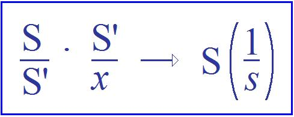

# Leçon 09 | 15 Janvier 1958

<!-- source-url: http://staferla.free.fr/S5/S5 FORMATIONS .docx -->
<!-- seminar: s5 -->
<!-- lesson: 09 -->

<!-- id: s5-09-0001 -->

Je vous ai annoncé que je vous parlerai aujourd’hui de ce à quoi, par exception, j’ai donné un titre,
et qui s’appelle *la métaphore paternelle.* Il n’y a pas très longtemps - un petit peu inquiet, j’imagine, de la tournure

<!-- id: s5-09-0002 -->

que j’al­lais donner aux choses - on m’a demandé :

<!-- id: s5-09-0003 -->

> « *De quoi comptez-vous nous parler à la suite de l’année ?* »
> Et j’ai répondu :
> « *Je compte aborder des questions de structure.* »

<!-- id: s5-09-0004 -->

Comme cela, je ne me suis pas compromis. Néanmoins, c’est bien de ça pourtant que j’entends vous parler

<!-- id: s5-09-0005 -->

cette année à pro­pos des *formations de l’inconscient,* des *questions de structure*, c’est-à-dire…
pour appeler les choses simplement
…des *questions* qui essayent de *mettre les choses en place*, *les choses* dont vous parlez tous les jours et dans lesquelles également vous vous embrouillez tous les jours d’une façon qui finit par ne même plus vous gêner.

<!-- id: s5-09-0006 -->

La *métaphore paternelle* donc, c’est quelque chose qui va concerner l’examen de *la fonction du père* - si vous voulez,
comme on dirait - en termes de *relations inter-humaines* et justement des complications que vous rencontrez,
je veux dire : tous les jours, dans la façon que vous pouvez avoir d’en faire usage, d’en faire usage comme d’un *concept*, de quelque chose même qui a pris une certaine tournure familière depuis le temps que vous en parlez.
Et il s’agit de savoir justement si vous en parlez sous la forme d’un discours bien cohérent.

<!-- id: s5-09-0007 -->

Cette *fonction du père* a sa place dans l’histoire de l’analyse, même une place assez large. Elle est au cœur de la question, inutile de le dire, de l’œdipe. Par conséquent, dans l’histoire de l’analyse c’est autour de la place donnée
au *complexe d’Œdipe* que vous la voyez présentifiée. FREUD l’a introduite tout au début. Le *complexe d’Œdipe* apparaît avec *La Science des rêves* [^24]*.* Ce que révèle là l’inconscient au début c’est d’abord et avant tout le *complexe d’Œdipe*.

<!-- id: s5-09-0008 -->

L’importance de la révélation de l’in­conscient c’est l’amnésie infantile portant sur quoi ?

<!-- id: s5-09-0009 -->

Sur le fait des *désirs* infantiles pour la mère et sur le fait que ces *désirs* sont refoulés, c’est-à-dire que non seulement ils ont été réprimés, mais qu’il a été *oublié* que ces *désirs* sont primordiaux, oublié non seulement qu’ils sont primordiaux
mais qu’ils sont toujours là. Il ne faut pas oublier que c’est de là qu’est partie l’analyse et que c’est autour de cela que se sont posées un certain nombre de questions introduites par la clinique.

<!-- id: s5-09-0010 -->

J’ai essayé de vous ordonner un certain nombre de directions des questions qui avaient été posées dans l’histoire de l’analyse à propos de l’œdipe. La première constitue une date : c’est quand la question s’est soulevée de savoir si justement ce complexe d’Œdipe, qui avait d’abord été promu comme fondamental dans la névrose sur laquelle l’œuvre de FREUD avait montré d’une façon patente la pensée de son auteur en faisant du *complexe d’Œdipe* quelque chose d’*universel*, c’est-à-dire qui n’est pas, non seulement *chez le névrosé* mais aussi *chez le normal*, et pour une bonne raison : c’est que ce *complexe d’Œdipe*, c’est lui justement qui, s’il pèche dans la névrose, il pèche en fonction du fait qu’il est essentiel dans une fonction de nor­malisation, que c’est un accident de l’œdipe qui provoque la névrose.
Cette première question, autour de laquelle je peux centrer un des pôle de *l’histoire de l’analyse* concernant
le *complexe d’Œdipe*, c’est celle-ci : y a-t-il des *névroses sans Œdipe* ?

<!-- id: s5-09-0011 -->

Il semblait en effet que certaines observations se présentaient d’une façon telle que le conflit, le drame œdipien n’avait pas joué le rôle essentiel, que par exemple, le rapport exclusif de l’enfant à la mère était ce qui était donné
dans l’analyse comme devant être admis par le fait de l’*expérience*, à savoir qu’il pouvait y avoir des sujets
qui présentaient des névroses où on ne trouvait pas du tout d’Œdipe. « [*Név**rose sans Œdipe*](#Odier_névrose_Oedipe) »[^25],

<!-- id: s5-09-0012 -->

c’est le titre d’un article de Charles ODIER.

<!-- id: s5-09-0013 -->

Cette notion de la *névrose sans Œdipe*, vous savez que dans l’histoire elle est essentiellement corrélative aux questions posées sur le sujet de ce qu’on a appellé le *surmoi maternel *: le *surmoi* est-il uniquement, comme FREUD déjà,
au moment où il s’était posé cette question de la *Névrose sans Œdipe*, l’avait formulé à ce moment-là, à savoir le *surmoi* est-t-il d’origine *paternelle* ? On posait la question : est-ce qu’il n’y a pas, derrière le *surmoi paternel*, ce *surmoi maternel* encore plus exigeant, encore plus opprimant, encore plus ravageant, encore plus insistant, dans la névrose,
que le *surmoi paternel* ? Je ne veux pas m’étendre là longuement, nous avons un long chemin à parcourir.

<!-- id: s5-09-0014 -->

L’autre centre autour duquel donne ceci, c’est le centre de l’*œdipe*, je veux dire les cas d’exception et le rapport
entre le *surmoi paternel* et le *surmoi maternel*. Il y avait alors la question ouverte de savoir si tout un champ

<!-- id: s5-09-0015 -->

de notre patholo­gie, de *la pathologie* qui vient *sous notre juridiction*, qui nous est offerte, à notre traite­ment, à nos soins,

<!-- id: s5-09-0016 -->

ne pouvait pas être référé - indépendamment de la question si le *complexe d’Œdipe* est là, ou s’il manque chez un sujet -
à ce que nous appellerons *le champ pré-œdipien.*

<!-- id: s5-09-0017 -->

S’il y a *œdipe*, si cet *œdipe* est considéré comme représentant une phase, s’il y a maturité à un certain moment essentiel d’évolution du sujet, il est toujours là, cet *œdipe*. Ce que FREUD avait lui-même avancé très vite,
dans les premiers moments de son œuvre, cinq ans après *La Science des rêves,* je veux dire tout ce qui retourne des

<!-- id: s5-09-0018 -->

*Trois essais sur la sexualité* [^26]*,* était de nature à nous faire entendre que *ce qui se passe avant l’œdipe* a aussi son importance.

<!-- id: s5-09-0019 -->

Bien sûr, dans FREUD ça prend son importance pour autant que *ça prend son importance à travers l’œdipe*. Mais déjà,
ou plus exactement jamais, jamais à cette époque-là, la notion de la *rétroaction*, d’une *Nachträglichkeit*, d’*œdipe*, *sur laquelle* vous savez qu’ici *j’attire* tout le temps et d’une façon assez insistante *votre attention,* jamais n’a été mise en valeur.

<!-- id: s5-09-0020 -->

C’est quelque chose qui semble échapper à *la pensée des exigences du passé temporel de la pensée*. Du moment qu’il y avait des choses qui étaient avant l’*œdipe*, et si certaines par­ties de notre champ se rapportaient spécialement à ce qui s’était passé dans notre champ d’expérience, dans ce champ de développement du sujet, il y avait donc bien une question qui se posait à propos *des étapes pré-œdipiennes* comme telles *et de leurs relations*, avec quoi ? Vous le savez :

<!-- id: s5-09-0021 -->

- d’une part la perversion.

<!-- id: s5-09-0022 -->

C’est l’état primaire, si je puis dire, l’état laissé en friche pour certains de la notion de la perversion.
Dieu merci, nous n’en sommes plus tout à fait là, mais pendant un certain temps quand même - et au début c’était légitime puisque ce n’est qu’une approximation de la question, ça l’est moins maintenant - la perversion était essentiellement considérée comme quelque chose dont l’étiologie, la cause, était d’être spécifiquement rappor­tée au champ *pré-œdipien*. C’était en raison d’une fixation anormale que la perver­sion prenait son conditionnement, sa racine.

<!-- id: s5-09-0023 -->

C’est pour cela d’ailleurs, que la perversion n’était donc que « *la névrose inversée* », ou plus exactement - la névrose ne s’étant pas inversée, la névrose restait latente - ce qui dans la névrose s’était inversé, dans la perversion se voyait au jour : l’inconscient était là à ciel ouvert, ce qui concernait la perversion n’avait pas été refoulé comme n’étant pas passé par l’*œdipe*. C’est une conception à laquelle personne ne s’arrête plus. Cela ne veut pas dire pour autant que nous soyons plus avancés, mais je vous signale, je pointe qu’*autour*, donc, *de la question du champ pré-œdipien se placent* :

<!-- id: s5-09-0024 -->

- d’une part *la question de la perversion*,

<!-- id: s5-09-0025 -->

- et d’autre part *la question de la psychose*.

<!-- id: s5-09-0026 -->

Toutes les choses peuvent s’éclairer pour nous maintenant de diverses façons. Pour l’instant il s’agit simplement
de vous situer dans quelle zone, dans quel angle d’inté­rêt peuvent se poser les questions autour de l’*œdipe*.

<!-- id: s5-09-0027 -->

Il s’agit toujours - dans *la perversion,* comme dans *la psychose* - de *la fonction imaginaire*, des rapports imaginaires.
Même sans être spécialement introduit au maniement que nous en fai­sons ici pour tout un chacun,

<!-- id: s5-09-0028 -->

chacun verra qu’il s’agit des rapports *imaginaires*, pré­cisément en ce sens que ce qui concerne l’*image* tout spécialement,
autant dans *la perversion* que dans *la psychose*, et bien entendu sous des angles différents :

<!-- id: s5-09-0029 -->

- autre chose est *une invasion* plus ou moins *endophasique*, faite *de paroles* plus ou moins auditivées \[*dans la psychose*\],

<!-- id: s5-09-0030 -->

- autre chose est le caractère encom­brant, *parasitaire,* *d’une image* dans une perversion.

<!-- id: s5-09-0031 -->

Mais il s’agit bien là, dans un cas comme dans l’autre, de manifestations pathologiques dans lesquelles c’est par l’*image* qu’est profondément troublé le champ de la réalité. Et ceci nous est attesté par l’histoire de l’analyse. C’est donc

<!-- id: s5-09-0032 -->

dans un certain rap­port avec l’*œdipe* comme tel puisque c’est spécialement au champ *pré-œdipien* que l’expérience
et le souci de la cohérence, la façon dont la théorie se fabrique, se tient debout.

<!-- id: s5-09-0033 -->

Ce serait précisément en raison de cela qu’en somme *le champ de la réalité*, pour autant qu’il est *perturbé*, dans certains cas profondément, *par l’invasion de l’imaginaire*…
il semble que c’est un terme qui, là, rend plus service que le terme « *fan­tasme* »*,*

car il serait inapproprié pour parler également des psychoses et des perversions
…vous avez en ce sens, dans le sens de l’exploration du champ *pré-œdipien*, toute une direction d’analyse qui s’est engagée, au point même de dire que c’est dans ce sens là que se sont faits tous les progrès essentiels depuis FREUD.

<!-- id: s5-09-0034 -->

Et je vous signale que ce paradoxe, je veux dire le caractère, dans ce que nous abordons aujourd’hui,
essentiel du paradoxe est constitué par le témoignage de l’œuvre de Mme Mélanie KLEIN. Dans une œuvre,
comme dans toute production en paroles, il y a deux plans :

<!-- id: s5-09-0035 -->

- il y a *ce qu’elle dit*, ce qu’elle formule dans son discours comme tel,

<!-- id: s5-09-0036 -->

- et *ce qu’elle veut dire*, parce que dans leur sens, séparant le « *veut* » et le « *dire* »*,* il y a *son intention*.

<!-- id: s5-09-0037 -->

Et puis il semble que nous ne serions pas analystes, tel que j’es­saye de faire entendre les choses ici,

<!-- id: s5-09-0038 -->

si nous ne savions pas qu’elle en dit quelquefois un petit peu plus au-delà. C’est même d’habitude en cela que consiste *notre approche* : c’est de voir *ce qu’elle dit au-delà de ce qu’elle veut dire*. L’œuvre de Mélanie KLEIN dit des choses qui ont d’ailleurs toute leur impor­tance, qui ont quelquefois d’ailleurs - rien que par leur texte - leur contradiction interne, de ce seul fait qu’elles peuvent être sujettes à certaines critiques qui ont été faites.

<!-- id: s5-09-0039 -->

Puis il y a aussi *ce qu’elle dit sans vouloir le dire*. Et une des choses les plus frap­pantes à cet endroit, c’est que cette femme qui nous a apporté des vues si profondes, si éclairantes sur ce qui se passe, non seulement dans le temps *pré-œdipien*, mais sur les enfants qu’elle examine, qu’elle analyse à une étape présumée *pré-œdipienne*…
je veux dire, par une première approximation de la théorie et dans toute la mesure où elle aborde chez ces enfants des thèmes tels qu’il \[l’œdipe\] est aussi bien en arrière, for­cément, qu’au moment où elle les aborde, puisque c’est souvent en « *verbaux* » ou « *pré-ver­baux* » dans l’histoire qu’elle les aborde, presque à l’apparition de la parole, enfin peu après
…il est tout à fait frappant que ce soit dans la mesure même où elle remonte plus au temps de l’histoire prétendue *pré-œdipienne* qu’elle y voit toujours et tout le temps une permanence de la *rogation* *œdipienne*.

<!-- id: s5-09-0040 -->

Si vous lisez cet article[^27] d’elle concernant précisément l’*œdipe*, vous verrez avec surprise qu’elle admet,
et elle nous montre même par des témoignages sans équi­voque de son expérience des dessins d’enfant,

<!-- id: s5-09-0041 -->

*extrêmement précieux,* où c’est justement à l’étape dite de la formation des mauvais objets, à l’étape où c’est *à l’in­térieur* du corps de la mère, qui semble, à l’entendre, jouer le rôle prédominant dans l’évolution de la première relation objectale chez l’enfant, où l’enfant est tout entier centré sur cet intérieur du corps de la mère et même, à une étape antérieure à la phase dite « *paranoïde* » - la phase très précise qui est liée à l’apparition du corps de la mère comme dans sa totalité - c’est à une phase déjà antérieure que, se fondant sur *des dessins*, sur *des dires*, sur toute une reconstruction de la psychologie de l’enfant à cette étape, Madame Mélanie KLEIN nous atteste *les mauvais objets* présents dans le corps de la mère, parmi lesquels, comme vous le savez, il y a tous les rivaux, les corps des *frères*, des *sœurs*, passés, présents et à venir, et il y a très précisément *le père* représenté sous la forme de son *pénis*.

<!-- id: s5-09-0042 -->

C’est bien là quelque chose qui mérite de nous arrêter au moment des rapports de *la fonction imaginaire*,
dans les 1ères étapes où peuvent se rattacher *les fonctions* proprement *schizophréniques, psychotiques en général*, et l’*œdipe*.
C’est qu’il est curieux d’aboutir à cette *contradiction* dans une *intention* qui est celle de Madame Mélanie KLEIN d’aller d’abord explorer les états *pré-œdipiens* : plus elle remonte, plus elle se trouve sur le plan imaginaire, plus elle constate
la précocité - *précocité*, si nous nous en tenons à une notion purement historique de l’*œdipe*, *bien difficile à expliquer -*
la précocité de l’apparition du *terme ternaire paternel,* et ceci *dès les premières phases imaginaires* de l’enfant.
C’est en cela que je dis que l’œuvre en dit plus qu’elle n’en veut dire.

<!-- id: s5-09-0043 -->

Voilà donc deux termes, deux pôles déjà définis de cette évolution de l’intérêt autour de l’*œdipe* :

<!-- id: s5-09-0044 -->

- ce qui concernait d’abord, nous l’avons dit, la question du *surmoi* et des *névroses sans œdipe*,

<!-- id: s5-09-0045 -->

- et ensuite, ce qui centre la question de l’*œdipe* autour de l’acquisition ou des *perturbations* plus exactement qui se produisent *dans le champ de la réalité*.

<!-- id: s5-09-0046 -->

*Troisième temps*, qui ne mérite pas moins de remarques et qui va ouvrir notre suivant chapitre, c’est le rapport
du *complexe d’Œdipe* avec quelque chose qui n’est pas la même chose : avec la *génitalisation,* comme on s’exprime.
Le *complexe d’Œdipe*, ne l’oublions pas, au milieu de tellement d’explorations, de questions, de discussions,
ceci est presque passé dans l’histoire au deuxième plan mais reste tou­jours implicite dans toutes les cliniques,

<!-- id: s5-09-0047 -->

*le complexe d’Œdipe a une fonction nor­mative*, non pas simplement dans la structure morale du sujet ni dans ses rapports, mais dans *l’assomption* de son sexe.

<!-- id: s5-09-0048 -->

C’est-à-dire quelque chose qui dans l’analyse, comme vous le savez, reste toujours dans une certaine ambiguïté.
Il y a la fonction proprement *génitale*, et cette fonction fait bien évidemment l’objet d’une matura­tion,

<!-- id: s5-09-0049 -->

d’une maturation comme telle.

<!-- id: s5-09-0050 -->

Elle est impliquée comme *fondamentale* dans l’analyse d’une première phase, première ascension de *maturation* qui, elle, est propre­ment organique et se produit dans l’enfance. La question de la liaison de cette première poussée sexuelle,
à laquelle, vous le savez, on a cherché son support *organique*, j’entends anatomique, dans *la double poussée* par exemple,
et qui se produit au niveau des testicules dans la formation des spermatozoïdes*,* la question de la relation entre ceci
et l’existence dans l’espèce humaine du *complexe d’Œdipe,* est restée une *question phylogénétique* sur laquelle beaucoup d’obscurité plane, au point que personne ne se risquerait plus à faire des articles sur le sujet même.
Mais enfin, ça n’en a pas moins été dans l’histoire de l’analyse.

<!-- id: s5-09-0051 -->

La question donc, de « la génitalisation » est double :

<!-- id: s5-09-0052 -->

- elle est celle, d’une part, qui comporte une évolution, une maturation,

<!-- id: s5-09-0053 -->

- et d’autre part, comporte dans l’*œdipe* quelque chose qui se réalise, qui est l’assomption par le sujet de son propre sexe, pour appeler les choses par leur nom, qui est le fait que *l’homme* assume le *type viril*, que *la femme* assume un certain *type féminin*, se reconnaît comme femme, s’identifie à ses fonctions de femme.
  La virilité et la féminisation, voilà les deux termes qui sont essentiellement la fonction de l’*œdipe*. Je dois dire que
  nous nous trouvons ici au niveau où l’*œdipe* est directement lié à la fonction de *l’idéal du moi*. Il n’y a pas d’autre sens.

<!-- id: s5-09-0054 -->

Voici donc *les trois chapitres* dans lesquels vous pourrez classer tout ce qui s’est produit comme discussions autour de l’*œdipe*, et du même coup autour de *la fonction du père*, car c’est une seule et même chose. Il n’y a pas de question :

<!-- id: s5-09-0055 -->

- s’il n’y a pas de père, il n’y a pas d’*œdipe*.

<!-- id: s5-09-0056 -->

- Et inversement, parler d’*œdipe* c’est introduire comme essentielle *la fonction du père*.

<!-- id: s5-09-0057 -->

Donc, pour ceux qui prennent des notes, sur le sujet historique de l’évolution du *complexe d’Œdipe*
tout tourne autour de trois chapitres :

<!-- id: s5-09-0058 -->

- par rapport au *surmoi*,

<!-- id: s5-09-0059 -->

- par rapport à *la réalité*,

<!-- id: s5-09-0060 -->

- par rapport à *l’idéal du moi*.

<!-- id: s5-09-0061 -->

*L’idéal du moi*, en toutes occasions *portant la génitalisation* en tant qu’elle est assumée, qu’*elle devient élément de l’idéal du moi*.

<!-- id: s5-09-0062 -->

La *réalité*, tête de cha­pitre, implique les rapports de l’œdipe avec les affections qui comportent un bou­leversement

<!-- id: s5-09-0063 -->

du rapport à la réalité : *perversion* et *psychose*.

<!-- id: s5-09-0064 -->

Maintenant, essayons d’aller un peu plus loin : il est clair qu’ici, dans le 3*ème chapitre*, à savoir autour de ce qui concerne *la fonction de l’œdipe* en tant qu’elle retentit directement *sur cette assomption du sexe*, toute *la question du com­plexe de castration* dans ce qu’elle a de pas tellement élucidé, c’est là que nous allons nous avancer.

<!-- id: s5-09-0065 -->

Quoi qu’il en soit donc, ces rapports *massifs*, *globaux*, soulignés par l’histoire étant pour tout un chacun suffisamment présents, on va donc se demander :

<!-- id: s5-09-0066 -->

- Alors, et le père ?

<!-- id: s5-09-0067 -->

- Qu’est-ce qu’il faisait, le père, pendant ce temps-là ?

<!-- id: s5-09-0068 -->

- En quoi est-ce que le père est impliqué dans le coup ?

<!-- id: s5-09-0069 -->

Il s’agit d’une *observation réelle* à propos de chaque sujet. La question de *l’absence* ou de *la présence* du père,
du caractère bénéfique ou maléfique du père est, vous le savez, une question qui n’est certainement pas *voilée*.
Nous avons même vu apparaître récemment le terme de « *carence paternelle* », ce n’était pas s’attaquer à un mince sujet.

<!-- id: s5-09-0070 -->

La question de savoir ce qu’on a pu dire là dessus et si ça tenait debout est une autre question.
Mais enfin, cette « *carence paternelle* », qu’on l’appelle ainsi, ou qu’on ne l’appelle pas ainsi, est en quelque sorte un sujet à l’ordre du jour, précisément et *surtout* dans une évolution de l’analyse qui devient de plus en plus *environnementaliste*, comme on s’exprime élégamment.

<!-- id: s5-09-0071 -->

C’est-à-dire, il s’agit de quoi ? Naturellement tous les *analystes* ne tombent pas dans ce travers, Dieu merci !
Beaucoup d’*analystes* auxquels vous apporterez des renseignements biographiques aussi intéressants que de leur dire :
« *Mais les parents ne s’entendaient pas, il y avait mésen­tente conjugale, ça explique tout !* » vous répondront - même ceux avec qui nous ne sommes pas toujours d’accord - vous diront : « *Et puis après ! Cela ne prouve absolument rien, nous ne devons*
*nous attendre à aucune espèce d’effet particulier.* »

<!-- id: s5-09-0072 -->

En quoi ils auront raison. Ceci dit, quand on cherche, on s’intéresse à quoi, concernant le père ?
Quand on veut parler de carence paternelle, ça se groupera sur *le registre* en quelque sorte *bio­graphique * :

<!-- id: s5-09-0073 -->

- Le père était-il là ou n’était-il pas là ?

<!-- id: s5-09-0074 -->

- Est-ce qu’il voyageait, est-ce qu’il s’*absentait* ?

<!-- id: s5-09-0075 -->

- Est-ce qu’il revenait souvent ?

<!-- id: s5-09-0076 -->

Questions qui représentent l’absence du père : est-ce qu’un *œdipe* peut se constituer de façon normale
quand il n’y a pas de père, par exemple ? Ce sont des *questions* assurément qui sont en elles-mêmes très intéressantes, et je dirai plus, c’est par là que se sont introduits, en somme, les pre­miers paradoxes, ceux qui ont fait se poser

<!-- id: s5-09-0077 -->

les questions qui ont suivi. On s’est aperçu que ce n’était pas si simple, qu’un *œdipe* pouvait très bien se constituer même quand le père n’était pas là.

<!-- id: s5-09-0078 -->

Au début même, on croyait toujours que c’était par quelque excès, si l’on peut dire, présence par excès du père, qu’étaient engendrés tous les drames au temps où l’image du père terrifique était considérée comme l’élément lésionnel. Dans la névrose, on s’est très vite aperçu que c’était encore plus grave quand il était trop gentil !

<!-- id: s5-09-0079 -->

On a fait ces écoles avec lenteur, et c’est à l’intérieur de cela d’abord que je vous parle à peu près de la question
où les choses en sont maintenant, et c’est à l’intérieur de cela que je vais essayer de remettre un peu d’ordre
pour voir où sont *les paradoxes*.

<!-- id: s5-09-0080 -->

Nous en sommes maintenant à l’autre bout, à nous interroger sur les « *carences paternelles* » : il y a ce qu’on appelle
les pères faibles, les pères soumis, les pères matés, les pères châtrés par leur femme, enfin les pères infirmes,
les pères aveugles, les pères bancroches, tout ce que vous voudrez. Il faudrait quand même essayer de s’apercevoir
de ce qui se dégage d’une telle situation. Nous essayons de trouver des formules mini­males qui nous permettent de progresser. D’abord la question de sa présence ou de son absence, je veux dire concrète.

<!-- id: s5-09-0081 -->

Si nous nous plaçons justement au niveau où se placent ces recherches, c’est-à-dire au niveau de la réalité

<!-- id: s5-09-0082 -->

\- c’est ce qu’on appelle l’environnement, en tant qu’élément d’en­vironnement, si l’on peut dire - on peut dire

<!-- id: s5-09-0083 -->

qu’il est tout à fait possible, concevable, réalisé, touchable par l’expérience, qu’il soit là, même quand il n’est pas là.
Ce qui déjà, devrait nous inciter à une certaine prudence concernant la fonction du père, dans le maniement
du point de vue purement et simplement environnementaliste.

<!-- id: s5-09-0084 -->

Des *complexes d’Œdipe* tout à fait normaux, normaux dans les deux sens :

<!-- id: s5-09-0085 -->

- nor­maux en tant que normalisants, d’une part,

<!-- id: s5-09-0086 -->

- et aussi normaux en tant qu’ils dénor­malisent, je veux dire par leur *effet névrosant*, par exemple
  s’établissent d’une façon exactement homogène aux autres cas, même dans les cas où *le père n’est pas là*,
  je veux dire quand l’enfant a été laissé seul avec sa mère. Première chose qui doit attirer notre attention.

<!-- id: s5-09-0087 -->

En ce qui concerne la carence, je voudrais simplement vous faire remarquer que quand le père est *carent,*
dans la mesure où on parle de carence on ne sait jamais en quoi, parce que :

<!-- id: s5-09-0088 -->

- si dans certains cas on dit qu’il est trop gentil, cela semblerait vou­loir dire qu’il faut qu’il soit méchant !

<!-- id: s5-09-0089 -->

- D’autre part, le fait que, manifestement, il puisse être trop méchant implique qu’il vaudrait peut–être mieux de temps en temps être gentil !

<!-- id: s5-09-0090 -->

En fin de compte, depuis longtemps on a fait le tour de ce petit manège. On a entrevu le problème de sa carence
non pas d’une façon directe, concernant directement le sujet, l’enfant dont il s’agit mais, comme c’était évident depuis le premier abord, c’est en tant que *membre du trio fondamental, ternaire, de la famille*, c’est-à-dire en tant que tenant sa *place* dans la famille, qu’on pouvait commencer à dire des choses un peu plus efficaces concernant la *carence*.
Mais on n’est pas arrivé pour autant *à les formuler mieux*.

<!-- id: s5-09-0091 -->

Je ne veux pas m’étendre longuement là-dessus, mais nous en avons déjà parlé *l’année dernière* à propos du petit Hans : nous avons vu les difficultés que nous avions du seul point de vue environnementaliste à bien préciser
en quoi consistait cette carence d’un personnage tout à fait loin d’être carent.

<!-- id: s5-09-0092 -->

Nous allons pouvoir aller plus loin, en ce sens que le per­sonnage était tout à fait loin d’être carent dans sa famille :

<!-- id: s5-09-0093 -->

- il était là, près de sa femme,

<!-- id: s5-09-0094 -->

- il tenait son rôle, il discutait,

<!-- id: s5-09-0095 -->

- il se faisait un tant soit peu *envoyer sur les roses* par sa femme, mais enfin il s’occupait beaucoup de l’enfant,

<!-- id: s5-09-0096 -->

- il n’était pas absent, et telle­ment peu absent qu’il faisait même analyser son enfant. C’est le meilleur point de vue qu’on puisse attendre d’un père, dans ce sens là tout au moins.

<!-- id: s5-09-0097 -->

Je crois que *cette question de la carence du père*, nous allons y venir, nous y reviendrons, mais on entre ici dans un monde tellement mouvant qu’il faut essayer de faire la distinction qui nous permette de voir en quoi la recherche pèche.
La recherche pèche, non pas à cause de ce qu’elle trouve, mais à cause de ce qu’elle cherche. Je crois que la faute d’orientation est celle-ci : c’est qu’on confond deux choses, qui ont un rapport mais qui ne se confondent pas,
c’est le rapport au *père en tant que normatif,* avec *le père en tant que normal.*

<!-- id: s5-09-0098 -->

Bien entendu, le père peut être dénormativant en tant que lui-même n’est pas normal, mais là, c’est rejeter la question au niveau de la structure névrotique, psychotique, du père. Donc, la question du *père normal* est une question,
la question de sa *position normale* dans la famille en est une autre, et cette autre question ne se confond pas encore
\- c’est le troisième point que je vous avance, qui est important - ne se confond pas avec une définition exacte
de son *rôle normativant*.

<!-- id: s5-09-0099 -->

Parce que je vous dis ceci : parler de *sa carence dans la famille,* n’est pas parler de *sa carence dans le complexe.*
Parce que, pour parler de *sa carence dans le complexe*, il faut introduire une autre dimension que la dimension réaliste,
si je puis dire, celle qui est définie par le mode caractérologique, biographique ou autre, de sa présence dans la famille. Voilà la direction où nous allons faire le pas suivant.

<!-- id: s5-09-0100 -->

Venons en maintenant aux remarques, aux rappels qui peuvent nous permettre d’introduire plus correctement
la question du rôle du père. Si c’est sa place dans le complexe dans laquelle nous pouvons trouver la direction
où nous avancer, la direction pour poser une formulation correcte, interrogeons maintenant le complexe

<!-- id: s5-09-0101 -->

et commen­çons par le rappeler par le commencement, par le *b.a.ba.*

<!-- id: s5-09-0102 -->

Au début, vous ai-je dit : le père terrible. Tout de même, l’image résume quelque chose de beaucoup plus complexe, comme le nom l’indique. Le père intervient sur plusieurs plans. Il interdit la mère, d’abord. C’est là le fondement,
le principe du *complexe d’Œdipe*, c’est là que le père est lié à la loi primordiale, loi d’interdiction de l’inceste.
C’est le père, nous rappelle-t-on, qui est chargé de représenter cette interdiction. Il a quelquefois à la manifester
d’une façon directe, si l’enfant se laisse aller à ses expansions, à ses manifestations, à ses penchants.
Mais c’est bien au-delà, qu’il exerce ce rôle : c’est par toute sa présence, par ses effets dans l’inconscient
qu’il exerce cette interdiction de la mère.

<!-- id: s5-09-0103 -->

Vous attendez que je dise « *sous menace de cas­tration* ». C’est vrai. C’est vrai, il faut le dire, mais ce n’est pas si simple.
C’est entendu, la castration entre dans un rôle évidemment manifeste, et qui sera d’ailleurs de plus en plus confirmé.
Le lien de la castration à la Loi est essentiel, mais voyons comment ça nous est présenté *cliniquement*, comment d’abord le *complexe d’Œdipe* se présente à nous. Je suis obligé de vous le rappeler parce que cela doit évo­quer en vous toutes sortes d’évocations textuelles.

<!-- id: s5-09-0104 -->

*Le rapport* - prenons d’abord le garçon - *entre l’enfant et le père est commandé*, c’est entendu, *par* *la crainte de la castration*. Cette crainte de la castration, quelle est-elle ? Comment, par quel bout l’abordons-nous ?

<!-- id: s5-09-0105 -->

D’abord, dans la première expé­rience du *complexe d’Œdipe*, sous la forme - de quoi ? - d’une rétorsion.

<!-- id: s5-09-0106 -->

Je veux dire que c’est à l’intérieur du rapport *agressif*, en tant que cette agression part de l’enfant, du garçon,
en tant que son objet privilégié, la mère, lui est interdite, c’est en tant que l’agression se dirige vers le père
que l’enfant - donc sur le *plan imaginaire*, dans le rapport duel - pour autant qu’il projette *imaginairement* dans le père

<!-- id: s5-09-0107 -->

les *intentions agressives*, équi­valentes ou renforcées par rapport aux siennes, mais dont le départ est dans ses propres tendances agressives. Bref, la crainte éprouvée devant le père est nettement centrifuge, je veux dire qu’elle a
son centre dans le sujet. Ceci est conforme à la fois à l’expérience et à l’histoire de l’analyse.

<!-- id: s5-09-0108 -->

C’est sous cet angle que très vite, l’expérience nous a appris que devait être mesurée l’incidence de la crainte éprouvée dans l’*œdipe* à l’endroit du père. *La castration* donc, pour autant que :

<!-- id: s5-09-0109 -->

- d’une part elle soit profondément liée à *l’articula­tion symbolique* de l’interdiction de l’inceste,

<!-- id: s5-09-0110 -->

- et d’autre part, et au premier plan dans toute notre expérience, bien plus encore, naturellement, chez ceux qui en sont les objets privi­légiés, à savoir les névrosés, est quelque chose qui se manifeste sur le *plan imaginaire* où elle a là, un départ qui n’est pas un départ du type du *commande­ment*, à savoir comme le dit la Loi de MANU : « *Celui qui couchera avec sa mère se coupera les génitoires et les tenant dans sa main* - *droite ou gauche,* je ne me souviens plus très bien - *s’en ira droit vers l’Ouest jusqu’à ce que la mort s’ensuive.* »

<!-- id: s5-09-0111 -->

Ça, c’est la *Loi*. Mais cette *loi* n’est pas spécialement parvenue aux oreilles de nos névrosés comme telle.
Elle est même en général plutôt laissée dans l’ombre. Il y a d’autres moyens d’en sortir d’ailleurs, mais je n’ai pas
le temps de m’y étendre aujourd’hui. Donc, c’est lié à l’*agression imaginaire* du sujet, la façon dont la névrose s’incarne :
*cette menace castrative*, elle, *est une rétorsion*. Pour autant que JUPITER est tout à fait capable de châtrer CHRONOS,
nos petits JUPITER craignent que CHRONOS commence lui-même par faire le travail.

<!-- id: s5-09-0112 -->

Et puis, il y a autre chose que nous apporte dès l’abord l’examen du *complexe d’Œdipe*, je veux dire la façon
dont il est articulé, présenté par l’expérience, par la théorie, par FREUD. C’est la délicate question de *l’œdipe inversé*.

<!-- id: s5-09-0113 -->

Je ne sais pas si cela vous paraît aller de soi, mais lisez l’article de FREUD ou n’importe quel article de n’im­porte quel auteur : chaque fois qu’est abordée la question de l’œdipe, on est toujours frappé du rôle extrêmement mouvant, nuancé, déconcertant, que joue *la fonction de l’œdipe inversé*. Cet *œdipe inversé* n’est jamais absent de la fonction de l’*œdipe*, je veux dire que la composante d’*amour pour le père* ne peut pas être éludée, c’est que c’est elle qui donne la fin
du *complexe d’Œdipe*, le déclin du *complexe d’Œdipe*. Que c’est dans une dialectique qui reste très ambiguë de *l’amour*
et de *l’identification*, à savoir de *l’identification* comme prenant sa racine dans *l’amour*, tout en n’étant pas la même chose. Ce n’est pas la même chose, néanmoins les *deux termes* sont étroitement liés et absolument *indis­sociables*.

<!-- id: s5-09-0114 -->

Lisez l’article que FREUD[^28] a écrit sur *le déclin du complexe*, dans l’explication qu’il donne de l’identification terminale qui en est la solution : c’est pour autant que le père est aimé que le sujet s’identifie à lui et qu’il trouve la solution,
le terme de l’*œdipe* :

<!-- id: s5-09-0115 -->

- d’une part dans cette composition du refoulement amnésique,

<!-- id: s5-09-0116 -->

- et d’autre part, cette acquisition en lui de ce terme idéal grâce à quoi il devient père.
  Il peut devenir lui aussi quelqu’un qui - je ne dis pas d’ores et déjà et immédiatement - est un petit mâle, qui si je puis dire, a déjà ses titres en poche, l’affaire en réserve. Quand le temps viendra, si les choses vont bien - si les petits cochons ne le mangent pas - au moment de la puberté, il a son pénis tout prêt avec son certificat :
  « *Papa est là pour me l’avoir, à la bonne date, conféré.* » Cela ne se passe pas comme ça si la névrose éclate
  parce qu’il y a quelque chose justement de pas régulier sur le titre en question.

<!-- id: s5-09-0117 -->

Seulement *l’œdipe inversé* n’est pas non plus si simple : c’est par cette voie, et par cette voie de l’amour,
que peut se produire la position à proprement parler d’inversion, c’est à savoir que le sujet se trouve aussi
par la même voie, à l’occasion donnée non pas d’une identification bénéfique, mais d’une brave et bonne petite *position passivée* sur le plan inconscient, qui fera aussi sa réapparition à la bonne date, c’est-à-dire qui le mettra
dans cette espèce de *bissectrice d’angle*, *squeeze-panic,* qui fera qu’il se trouvera pris dans une position qu’il a décou­verte tout seul et qui est bien avantageuse :

<!-- id: s5-09-0118 -->

Ce père qui est redoutable, qui a interdit tellement de choses mais qui est bien gentil ailleurs, c’est de se mettre
à la bonne place pour avoir ses faveurs, c’est-à-dire se faire aimer de lui. Mais comme se faire aimer de lui consiste bien appa­remment, consiste à passer d’abord au rang de *femme* et qu’on garde toujours son petit amour-propre viril...
c’est ce que FREUD nous explique : se faire aimer du père comporte le danger de la castration

<!-- id: s5-09-0119 -->

d’où cette forme d’homosexualité incons­ciente qui met le sujet dans cette position essentiellement conflictuelle,

<!-- id: s5-09-0120 -->

aux *reten­tissements multiples* et qui est :

<!-- id: s5-09-0121 -->

- d’une part, du retour toujours de la position homo­sexuelle à l’égard du père,

<!-- id: s5-09-0122 -->

- et d’autre part, de sa suspension, c’est-à-dire *son refoulement en raison de la menace de castration* qu’elle comporte.

<!-- id: s5-09-0123 -->

Tout cela n’est pas simplet, simplet. Or ce que nous essayons de faire, c’est d’aborder quelque chose
qui nous permette de le concevoir d’une façon plus rigoureuse, ce qui comportera que nous pourrons dans la suite,
à chaque observation et à chaque cas particulier, mieux et plus rigoureusement poser nos questions.

<!-- id: s5-09-0124 -->

Donc, résumé. Comme tout à l’heure le résumé va consister à introduire un cer­tain nombre de *distinctions* qui, je crois, sont le prélude du centrage du point qui ne va pas. Tout à l’heure déjà nous avions approché ceci : que c’était là, autour de *l’idéal du moi*, que la question n’avait pas été posée. Ici, tâchons aussi de faire la réduction que nous venons de rappeler et d’aborder. Je vous propose *ceci * : *d’ores et déjà*, je crois que ce n’est pas trop s’avancer de dire que
le père arrive ici tout de même en position de gêneur, pas simplement encombrant par son volume,
mais en position de gêneur parce qu’il interdit.

<!-- id: s5-09-0125 -->

Il interdit quoi ? Reprenons et distinguons : il interdit d’abord *la satisfaction réelle de la pulsion*. Si nous devons faire entrer en jeu l’apparition de la pulsion génitale, que ce ne soit pas là, puisqu’elle paraît bien intervenir avant.
Mais il est clair aussi que quelque chose s’articule autour du fait qu’il interdit au petit enfant de faire l’usage
de son pénis au moment où ledit pénis commence à manifester ce que nous appellerons des velléités.
C’est le rapport d’interdit du père à l’endroit de la pulsion réelle.

<!-- id: s5-09-0126 -->

Faisons tout de suite une remarque à ce niveau-là : pourquoi le père ?
L’expérience prouve que la mère le fait aussi bien. Rappelez-vous l’observation du petit Hans.
La mère lui dit : « *Rentre ça, ça ne se fait pas.* » Et même, c’est le plus souvent la mère qui dit :

<!-- id: s5-09-0127 -->

« *Si tu continues à faire comme ça, on appellera le docteur qui te la coupera.* »

<!-- id: s5-09-0128 -->

Donc, signalons bien ce qui se passe : c’est que le père, pour autant qu’il interdit au niveau de la pulsion réelle, n’est pas tellement essentiel. Alors, si vous vous sou­venez de mon tableau de l’année dernière *- vous voyez que ça finit toujours par ser­vir -* reprenons ce que je vous ai apporté, le tableau à trois étages : *castration, frus­tration, privation.*

<!-- id: s5-09-0129 -->

|                   |                          |                      |
|:-----------------:|:------------------------:|:--------------------:|
|       Agent       |          Manque          |        Objet         |
|    Père *réel*    | Castration *symbolique*  | Phallus *imaginaire* |
| Mère *symbolique* | Frustration *imaginaire* |     Sein *réel*      |
| Père *imaginaire* |    Privation *réelle*    | Phallus *symbolique* |

<!-- id: s5-09-0130 -->

De quoi s’agit-il ? J’attire votre attention : il s’agit donc de l’intervention réelle du père, concernant quoi ?
Une *menace imaginaire*. Car il est bien clair qu’il arrive assez rarement qu’on le lui coupe réellement.
Donc nous trouvons bien ce qui se passe justement au niveau de la menace de castration.

<!-- id: s5-09-0131 -->

Je vous fais remarquer que *la castration* est un *acte symbolique* dont l’agent est quelqu’un de *réel*, le père ou la mère
qui lui dit : « *On va te le couper* », et dont l’objet est un *objet imaginaire.* Si l’enfant se sent coupé, c’est qu’il l’imagine.

<!-- id: s5-09-0132 -->

Or, je vous le fais remarquer, c’est paradoxal. Parce que vous pourriez me dire :

<!-- id: s5-09-0133 -->

« *Ça, c’est proprement le niveau de la castration, et vous dites que le père n’est pas tel­lement utile.* »

<!-- id: s5-09-0134 -->

C’est bien ce que je dis. Mais oui !

<!-- id: s5-09-0135 -->

D’autre part, qu’est-ce qu’il inter­dit, le père ? Eh bien, le point d’où nous sommes partis, à savoir : la mère, comme objet, elle est à lui, elle n’est pas à l’enfant. C’est sur ce plan que s’établit, à une étape au moins, chez le garçon comme chez la fille, cette rivalité avec le père qui engendre à elle seule une agression.

<!-- id: s5-09-0136 -->

C’est que le père frustre bel et bien l’enfant de la mère. Voilà une autre *étape*, un autre *étage* si vous voulez :
je vous fais remarquer qu’ici le père intervient alors comme *ayant droit* et pas comme *personnage réel*, à savoir
que même s’il n’est pas là, s’il appelle la mère au téléphone par exemple, le résultat est le même.
C’est le *père*, ici en tant que *symbolique,* qui intervient dans une *frustration*, *acte imaginaire* concernant là *un objet* bien *réel,* qui est la mère en tant que l’enfant en a besoin.

<!-- id: s5-09-0137 -->

Puis il y a le troisième terme qui intervient dans cette articulation du *complexe d’Œdipe*, qui est le père en tant qu’il se fait préférer à la mère, car cette dimension, vous êtes absolument forcés de la faire intervenir dans la fonction terminale, dans celle qui aboutit à la formation de *l’idéal du moi*. *C’est pour autant que le père devient* - par quelque côté que ce soit, le côté de la force ou de la faiblesse - *un objet préférable à la mère, que va pouvoir s’établir l’identification terminale*.

<!-- id: s5-09-0138 -->

La question du *complexe d’Œdipe inversé* et de sa fonction s’établit à ce niveau. Je dirai plus : c’est même ici
que se centre la question tout à fait importante de la différence de l’ef­fet du complexe sur le garçon et sur la fille.
Il est bien évident qu’à ce niveau-là, ça va tout seul pour ce qui est de la fille, et c’est pour cela qu’on dit
que la fonction « *complexe de castration* » est dissymétrique pour le garçon et pour la fille :

<!-- id: s5-09-0139 -->

- pour la fille, c’est à l’entrée que cette question a de l’im­portance et qu’à la fin elle facilite la solution, parce que le père n’a pas de peine à se faire préférer à la mère comme *porteur du phallus*.

<!-- id: s5-09-0140 -->

- Pour le garçon, c’est une autre affaire, et vous le voyez, c’est toujours là que reste ouverte la béance.

<!-- id: s5-09-0141 -->

C’est à savoir que pour se faire préférer à la mère en tant que c’est par là que se produit l’issue du *complexe d’Œdipe*,
eh bien nous nous trouvons devant la même difficulté de l’instau­ration du *complexe d’Œdipe inversé*, et il nous semble bien donc que pour le gar­çon le *complexe d’Œdipe* doit être toujours et en tout cas tout *ce qu’il y a de moins normativant*, alors qu’il est tout de même impliqué qu’il l’est *le plus* puisque c’est par cette identification au père
qu’en fin de compte nous est dit être assumée la virilité.

<!-- id: s5-09-0142 -->

En fin de compte, le problème est de savoir comment ça se fait que ce père qui est essentiellement interdicteur n’aboutisse pas ici à ce qui est la conclusion très nette du troisième plan, à savoir que c’est en tant que se produit l’identification idéale - que le père devient *l’idéal du moi -* que se produit quelque chose.

<!-- id: s5-09-0143 -->

Quelque chose qui est quoi ? Qui en tout cas, tend à être *pour le garçon comme pour la fille*…
mais pour la fille, ce qu’il y a de bien c’est qu’elle reconnaisse qu’elle n’a pas de *phallus*, alors que pour le garçon, ce serait une issue absolument désastreuse, et ça l’est quelquefois
…en d’autres termes, ce que nous arrivons à centrer comme le moment d’issue normativant de l’*œdipe*, produit à un point et dans une relation telle : I → R → S \[l’agent I (*Imaginaire* : *le père*), le manque R (*Réel* : *la privation*), l’objet S (*Symbolique* : *le phallus*)\]

<!-- id: s5-09-0144 -->

| **Agent**             | **Manque**               | **Objet**                |
|-----------------------|--------------------------|--------------------------|
| Père *réel*           | Castration *symbolique*  | Phallus *imaginaire*     |
| Père *symbolique*     | Frustration *imaginaire* | Mère *réelle*            |
| Père ***I**maginaire* | Privation ***R**éelle*   | Phallus ***S**ymbolique* |

<!-- id: s5-09-0145 -->

C’est-à-dire que l’enfant reconnaît n’avoir pas *choisi*, il n’a pas vraiment *choisi* ce qu’il a, je vous l’ai dit.

<!-- id: s5-09-0146 -->

Ce qui se passe au niveau de l’*identification idéale*, niveau où le père se fait pré­férer à la mère, point essentiel

<!-- id: s5-09-0147 -->

et point de sortie de l’*œdipe,* c’est quelque chose qui doit littéralement aboutir à *la privation* alors que tout ceci

<!-- id: s5-09-0148 -->

est tout à fait admis­sible et tout à fait conformisant.

<!-- id: s5-09-0149 -->

Encore que ce n’est jamais réalisé complètement chez la femme comme issue de l’*œdipe*, car il lui reste toujours
ce petit arrière-goût - ce qui s’appelle le *Penisneid* - qui prouve donc que ça ne marche pas vraiment rigoureusement.
Mais dans le cas où ça doit marcher, si nous nous en tenons à ce schéma, le garçon, lui, devrait être toujours châtré.
Il y a donc quelque chose qui cloche, qui manque dans notre explication.

<!-- id: s5-09-0150 -->

Essayons maintenant d’introduire la solution. La solution est celle-ci : c’est que le père, je ne dis pas dans la famille…
dans la famille il est tout ce qu’il veut, il est une ombre, il est un banquier, il est tout ce qu’il doit être, il l’est ou il ne l’est pas, cela a toute son importance à l’occasion, mais ça peut aussi bien n’en avoir aucune
…toute la question est de savoir ce qu’il est dans le *complexe d’Œdipe*.

<!-- id: s5-09-0151 -->

Eh bien, *le père n’est pas un objet réel* : même s’il doit intervenir en tant qu’ *objet réel* pour donner corps à la castration,
*il n’est pas un objet réel*. Alors qu’est-ce qu’il est ? Il n’est pas uni­quement non plus cet *objet idéal*, parce que du côté
de cet objet il ne peut arriver que des accidents. Or quand même, le *complexe d’Œdipe* n’est pas uniquement
une *catastrophe* puisque c’est le fondement et la base de notre relation à la culture, comme on dit.

<!-- id: s5-09-0152 -->

Alors naturellement, vous allez me dire : « *Le père, c’est le père symbolique, vous l’avez déjà dit.* »
Mais si je n’avais que cela à vous répéter... Je vous l’ai déjà assez dit pour ne pas vous l’apporter aujourd’hui.
Ce que je vous apporte aujourd’hui, et ce qui justement permet d’apporter un peu plus de précision à cette notion
de *père symbolique*, c’est ceci : *le père est une métaphore.*

<!-- id: s5-09-0153 -->

Une *métaphore*, qu’est-ce que c’est ? Disons-le tout de suite pour le mettre sur le tableau, ce qui va nous permettre
de rectifier les conséquences scabreuses du tableau. Une *métaphore*, je vous l’ai déjà expliqué,
c’est *un signifiant qui vient à la place d’un autre signifiant*. Je dis :

<!-- id: s5-09-0154 -->

« *Le père, dans le complexe d’Œdipe...*

<!-- id: s5-09-0155 -->

> même si cela doit ahu­rir les oreilles de certains, je dis exactement :

<!-- id: s5-09-0156 -->

...*le père est un signifiant substitué à un autre signifiant.* »

<!-- id: s5-09-0157 -->

Et là est le ressort, et l’unique ressort essentiel du père en tant qu’il intervient dans le *complexe d’Œdipe*.
Et si ce n’est pas à ce niveau que vous cherchez les carences paternelles, vous ne les trouverez nulle part ailleurs.
La fonction du père dans le *complexe d’Œdipe*, est d’être un signifiant substi­tué au signifiant, c’est-à-dire au premier signifiant introduit dans la *symbolisation*, le signifiant maternel.

<!-- id: s5-09-0158 -->

C’est pour autant que le père vient, selon la formule que je vous ai expliquée une fois être celle de *la métaphore,*
vient à la place de la mère : S à la place de S’, qui est la mère déjà liée à quelque chose qui était *x,*
c’est-à-dire quelque chose qui était le *signifié* dans le rapport de l’enfant à la mère :

<!-- id: s5-09-0159 -->

> 

<!-- id: s5-09-0160 -->

C’est cette mère qui va, qui vient, parce que je suis un petit être déjà pris dans *le symbolique*.
C’est parce que j’ai appris à *symboliser* qu’on peut dire qu’elle va, qu’elle vient.Autrement, je la sens ou je ne la sens pas. Enfin, le monde varie avec son arrivée et puis peut s’évanouir.

<!-- id: s5-09-0161 -->

La question est : où est *le signifié* ? « *Qu’est-ce qu’elle veut, celle-là ? Je voudrais bien que ce soit moi qu’elle veuille, mais il est bien clair qu’il n’y a pas que moi qu’elle veut, il y a autre chose qui la travaille* ». Ce qui la travaille, c’est le *x,* c’est *le signifié*.
En somme, pour vous résumer mon séminaire de l’année dernière, la question n’est pas dans *les relations d’objet* : mettre cela au centre de *la relation d’objet*, c’est *pure bêtise*. L’enfant est, lui, *l’objet partiel*.

<!-- id: s5-09-0162 -->

*C’est parce que d’abord il est l’objet par­tiel qu’il est amené à se demander* : « *Qu’est-ce que ça veut dire qu’elle aille et qu’elle vienne ?* ». Ce *signifié* des *allées et venues* de la mère c’est le *phallus*. L’enfant, avec plus ou moins d’astuce, plus ou moins de chance, peut arriver très tôt à se faire *phallus* une fois qu’il a compris.

<!-- id: s5-09-0163 -->

Mais *la voie imaginaire* n’est pas la voie normale, c’est d’ailleurs pour cela qu’elle entraîne ce qu’on appelle des fixations, et puis elle n’est pas normale parce qu’en fin de compte, comme je vous le dirai, elle n’est jamais pure, elle n’est pas complètement accessible, elle laisse toujours quelque chose d’approximatif et d’in­sondable, voire de duel, qui fait tout le polymorphisme de la perversion.

<!-- id: s5-09-0164 -->

Mais par *la voie symbolique*, c’est-à-dire par *la voie métaphorique*…
je pose ça d’abord, je vous expliquerai comment ensuite, parce que nous ne pouvons pas aller plus vite, *mais je vous pose tout de suite*, puisque nous arrivons à peu près au terme de notre entretien d’aujourd’hui, *le schéma qui va nous servir de guide *:
…c’est *en tant que le père se substitue à la mère comme signifiant* que va se produire ce résultat ordi­naire de *la métaphore*,

<!-- id: s5-09-0165 -->

celui qui est exprimé dans la formule au tableau. Je ne vous dis pas que je vous présente la solution ici

<!-- id: s5-09-0166 -->

sous une forme déjà trans­parente, parce que je vous la présente dans son dernier terme, dans son résultat,
pour vous montrer où nous allons.

<!-- id: s5-09-0167 -->

Nous allons voir maintenant *comment on y va* et *à quoi ça sert* d’y être allé, c’est-à-dire tout ce que ça résout.
Alors, on a le choix entre deux choses :

<!-- id: s5-09-0168 -->

- ou que je vous laisse là, avec dans la main cette affirmation brute : l’intervention du père, je la pose - et je prétends que par là *tout peut être résolu -* comme étant ceci : *substitution d’un signifiant à un autre signifiant*, et vous allez voir s’éclairer toute la question des impasses de l’*œdipe*,

<!-- id: s5-09-0169 -->

- ou bien je com­mence un tout petit peu à vous expliquer la chose.

<!-- id: s5-09-0170 -->

Je vais vous introduire la chose, je vais vous faire une remarque qui - j’espère - va vous laisser tout de même l’objet pour vos rêves cette semaine, puisque la prochaine fois, pour vous parler de *la métaphore* et de son effet,
il faudra que je vous dise, que je vous rappelle, où elle se situe, c’est-à-dire *dans l’inconscient*.

<!-- id: s5-09-0171 -->

Je voudrais vous faire remarquer ceci : c’est qu’il y a une chose vraiment *bien surprenante*, c’est que l’on n’ait pas découvert l’inconscient plus tôt. Parce que bien entendu, il était là depuis tou­jours, et d’ailleurs il est toujours là.

<!-- id: s5-09-0172 -->

Il a fallu savoir ce qui se passe *à l’intérieur* pour savoir que *le lieu existait*.

<!-- id: s5-09-0173 -->

Mais je voudrais vous donner simplement quelque chose à la façon dont, vous qui vous en allez à travers le monde sous la forme, j’espère, d’apôtres de ma parole, vous pourriez l’introduire, la question de *l’inconscient,* à des gens
qui n’en ont jamais entendu parler. Vous leur diriez :

<!-- id: s5-09-0174 -->

« *Comme il est étonnant que depuis que le monde est monde, aucun de ces gens qui s’intitulent philosophes n’ait jamais songé*

<!-- id: s5-09-0175 -->

*à pro­duire* - au moins dans la période classique, maintenant nous sommes un peu égaillés mais il y a encore du chemin à faire –
*cette dimension essentielle qui est celle dont je vous ai parlé sous le nom de ce qu’on peut appeler : autre chose !* »

<!-- id: s5-09-0176 -->

Je vous l’ai déjà dit, *le désir d’autre chose,* on devrait tout de même sentir que c’est souvent là, *le désir d’autre chose*,
non pas peut-être comme vous le ressentez pour l’instant, *le désir* d’aller manger une saucisse plutôt que de m’écouter, mais en tout état de cause et de quoi qu’il s’agisse, *le désir d’autre chose* comme tel. Or cette dimension n’est pas uniquement, simplement, présente dans le désir. Je voudrais simplement vous évoquer qu’elle est présente
dans bien d’autres états qui sont absolument constants, permanents.

<!-- id: s5-09-0177 -->

La veille, par exemple. Ce qui s’appelle la veille. On ne pense pas assez à ça. Veiller, vous me direz…

<!-- id: s5-09-0178 -->

Quoi ? Veiller, c’est la chose, vous savez, que FREUD fait dans *Le Président Schreber* [^29].

<!-- id: s5-09-0179 -->

C’est bien le type de chose qui nous révèle à quel point FREUD vivait dans cet « *autre chose » :*
il nous parle *avant le lever du jour,* si vous vous y êtes reportés, je vous ai parlé du jour, de *la paix du soir*,
et de quelques autres petits trucs comme ça qui vous sont plus ou moins parvenus, c’était tout entier centré
autour de cette indication : *avant le lever du jour,* est-ce que c’est à proprement parler le soleil qui va apparaître ?

<!-- id: s5-09-0180 -->

C’est autre chose qui est latent : le moment de veille qui est attendu. Et puis, la claustration.
C’est tout de même une dimension tout à fait essentielle : dès qu’un homme arrive quelque part,
dans la forêt vierge ou dans le désert, il com­mence par s’enfermer. Au besoin, comme on dit,

<!-- id: s5-09-0181 -->

il emporterait deux fenêtres pour se faire des courants d’air entre elles, même s’il n’avait que ça.

<!-- id: s5-09-0182 -->

Cette claustration, c’est aussi une dimension tout à fait essentielle : il s’agit d’établir un intérieur,
et puis ce n’est pas simplement une notion d’*intérieur* et d’*extérieur*, c’est la notion de l’*autre,* ce qui est *autre* comme tel, ce qui n’est pas l’endroit où on est bien calfeutré. Et je dirai plus : si vous exploriez d’une façon un peu plus profonde cette phénoménolo­gie, comme on dirait, *de la claustration*, vous vous apercevriez à quel point c’est absurde de limiter la fonction de la peur à ce qu’on appelle une relation avec un danger réel. La liaison étroite de la peur avec la sécurité devrait vous être manifestée de la façon la plus claire par la phénoménologie de la phobie.

<!-- id: s5-09-0183 -->

Vous vous apercevriez que chez le phobique, ses moments d’angoisse, c’est quand il s’aperçoit qu’il a perdu sa peur, au moment où vous commencez un peu à lui lever sa phobie. C’est à ce moment-là qu’il se dit :

<!-- id: s5-09-0184 -->

« *Oh ! la ! la ! Ça ne va pas, je ne sais plus quels sont les endroits où il faut que je m’arrête.*
*En perdant ma peur, j’ai perdu ma sécurité.* »

<!-- id: s5-09-0185 -->

Enfin tout ce que j’ai dit l’année dernière sur le petit Hans*.*

<!-- id: s5-09-0186 -->

Il y a un moment auquel vous ne pensez pas assez, j’en suis persuadé, parce que vous y vivez comme dans votre air natal, si je puis dire, ça s’appelle l’*ennui.* Vous n’avez peut-être jamais bien réfléchi à quel point l’*ennui* est typiquement quelque chose qui arrive même à se formuler de la façon la plus claire : qu’on voudrait *autre chose.*

<!-- id: s5-09-0187 -->

On veut bien manger de la *m*... mais *pas toujours la même*. Ça, ce sont des espèces d’alibis, d’alibis formulés,

<!-- id: s5-09-0188 -->

déjà symbolisés de ceci, qui est ce rapport essen­tiel avec *autre chose.* Je voudrais terminer là-dessus.

<!-- id: s5-09-0189 -->

Vous pourriez croire que tout d’un coup je tombe dans le romantisme et dans *le vague à l’âme*.
Vous voyez ça : *le désir, la claustration, la veille* - j’allais presque vous dire *la prière* pendant que j’y étais ! Pourquoi pas ?
L’ennui, où est-ce qu’il va, où est-ce qu’il glisse ?

<!-- id: s5-09-0190 -->

Mais non. Ce sur quoi je voudrais attirer votre attention c’est sur ces diverses manifestations de la présence
de l’*autre chose* en tant que - réfléchissez-y - elles sont institutionnalisées.

<!-- id: s5-09-0191 -->

Vous pouvez faire un classement de toutes les formations humaines en tant qu’elles installent les hommes
où qu’ils aillent et partout. Ce qu’on appelle les *formations collectives* d’après la satisfaction qu’elles donnent
à ces différents modes de la relation à *autre chose.*

<!-- id: s5-09-0192 -->

Dès que l’homme arrive quelque part, il *fait des bêtises*, c’est-à-dire l’endroit où est véritablement le désir.
Dès qu’il arrive quelque part, il attend *quelque chose *: un meilleur monde, un monde futur.

<!-- id: s5-09-0193 -->

Il est là, *il veille*, il attend la révolution, mais sur­tout - et surtout dès qu’il arrive quelque part - il est excessivement important que toutes ses occupations suent l’ennui. En d’autres termes, une occupation ne com­mence à devenir sérieuse que quand ce qui la constitue, c’est-à-dire en général la régularité, est devenu parfaitement ennuyeux.

<!-- id: s5-09-0194 -->

Et en particulier, songez à tout ce qui, dans votre pratique analytique, est très exactement fait
pour que vous vous y ennuyiez. Tout est là. Une grande partie tout au moins des prescriptions,
ce qu’on appelle *règles techniques à observer par l’analyste,* ne sont pas dans leur fond autre chose
que de donner à cette occupation toutes les garanties de ce qu’on appelle son standard professionnel.

<!-- id: s5-09-0195 -->

Si vous regardez bien au fond des choses, vous vous apercevrez que c’est dans la mesure où elles créent, entretiennent et maintiennent, comme au cœur, la fonction de l’ennui. Ceci est en quelque sorte une petite introduction qui ne vous fait pas entrer à pro­prement parler dans ce que je vous dirai la prochaine fois.

<!-- id: s5-09-0196 -->

Je reprendrai la prochaine fois les choses pour vous montrer justement que c’est au niveau de cet Autre comme tel que se situe la dialectique du signifiant, et comment c’est de là qu’elle aborde la fonction, l’incidence, la pression précise, l’effet inducteur du *Nom du Père* égale­ment comme tel.

## Notes

[^24]: Sigmund Freud : *Die Traumdeutung,*  *L'interprétation des rêves,* PUF, 1926, 1967, 2000.

[^25]: Charles Odier : « *Une névrose sans complexe d'Œdipe ?* » in Revue Française de Psychanalyse*,* [Tome 6, N°3/4, 1933](http://gallica.bnf.fr/ark:/12148/bpt6k5443894t.image.langEN), pp. 298-343.

[^26]: Sigmund Freud : *[Drei Abhandlungen zur Sexualtheorie](http://gutenberg.spiegel.de/buch/910/1),* *Trois essais sur la théorie de la sexualité*, 1905.

[^27]: Melanie Klein : « *Le com­plexe d'Œdipe éclairé par les angoisses précoces* » (1945) in *Essais de psychanalyse*, Payot, 1968.

    « [*The Œdipus complexe in the light of early anxieties*](http://www.archive.org/details/ContributionsToPsycho-analysis1921-19451948) » in *Contributions to psycho-analysis,* 1921-1945.

[^28]: Sigmund Freud : « [*Der Unt**ergang des Ödipuskomplex*](#Ödipuskomplexes15_01)* »*, « *Le déclin du complexe d'Œdipe* », in *La vie sexuelle* (1924), Puf 1968.

[^29]: Sigmund Freud : *[Psychoanalytische Bemerkungen zu einem autobiographisch beschriebenen Fall von Paranoia](http://gutenberg.spiegel.de/buch/917/1), « Remarques psychanalytiques sur l'autobiographie*

    *d'un cas de paranoïa - le Président Schreber »* in *Cinq psychanalyses,* PUF, 1970.
