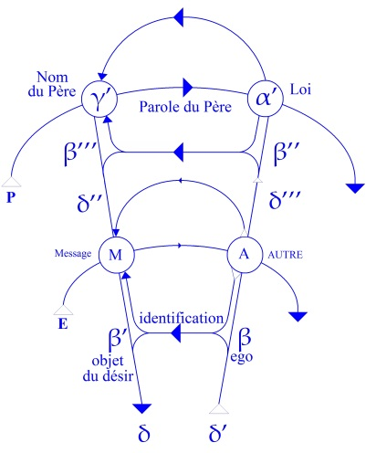
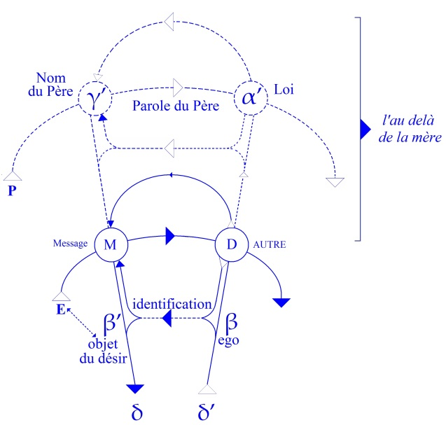
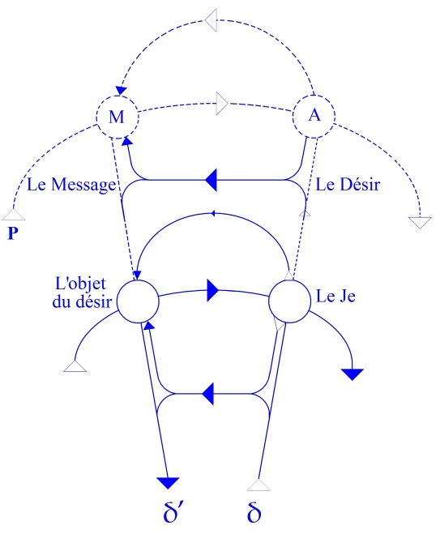

# Leçon 11 | 29 Janvier 1958

<!-- source-url: http://staferla.free.fr/S5/S5 FORMATIONS .docx -->
<!-- seminar: s5 -->
<!-- lesson: 11 -->

<!-- id: s5-11-0001 -->

Je vous parle de la *métaphore paternelle.* J’espère que vous vous êtes aperçus que je vous parle du *complexe de castration.* C’est important, parce que ce n’est pas parce que je parle de la *métaphore paternelle* que je vous parle de *l’œdipe*.

<!-- id: s5-11-0002 -->

Si c’était cen­tré sur *l’œdipe*, ça comporterait énormément de questions. Je ne peux pas tout dire à la fois.

<!-- id: s5-11-0003 -->

Le *schéma* que je vous ai apporté, en particulier la dernière fois, comme consti­tuant ce que j’ai essayé de vous faire comprendre sous le titre des *trois temps du complexe d’Œdipe,* c’est quelque chose dont je vous souligne à tout instant que c’est constitué ailleurs que dans l’aventure du *sujet* : dans la façon dont le *sujet* a à s’in­troduire dans ce *quelque chose* qui est *constitué* ailleurs, et auquel peuvent s’inté­resser à divers titres les psychologues, c’est-à-dire ceux qui projettent les relations individuelles dans ce qu’on appelle le champ *inter-humain*, ou *inter-psychologique*, ou *social*, ou les tensions
de groupe. Ils peuvent essayer d’inscrire cela sur leur schéma, s’ils le peuvent.

<!-- id: s5-11-0004 -->

De même les sociologues, j’en ai suffisamment indiqué pour dire que même pour eux, il faudra bien qu’ils tiennent compte d’autre chose, et en particulier de *rap­ports structuraux* qui là-dessus font notre commune mesure,

<!-- id: s5-11-0005 -->

pour la simple raison que c’est la racine dernière de l’existence, même sociale - car elle est socialement injustifiable,
je veux dire n’est fondable sur aucune finalité sociale - de l’existence, même sociale du *complexe d’Œdipe*.

<!-- id: s5-11-0006 -->

Mais pour nous, nous nous trouvons dans cette position de voir comment un sujet a à s’introduire dans cette relation qui est celle du *complexe d’Œdipe*. Ce n’est pas moi qui me suis aperçu, qui ai inventé, ni qui ai commencé à doc­triner, qu’il \[le sujet\] ne s’y introduit pas sans qu’y joue *un rôle de tout premier plan l’organe sexuel mâle*, centre, pivot, objet de tout ce qui se rapporte à *cet ordre d’évé­nements*, il faut le dire, *bien confus, bien mal discernés, qu’on appelle le complexe de castration*.
On ne continue pas moins dans les observations ou ailleurs, à en faire mention, il faut le dire, dans des termes \[tels\] qu’on ne s’étonne que d’une chose, c’est qu’ils n’entraînent pas, chez ceux qui en sont les auditeurs ou les lecteurs, plus d’in­satisfaction. J’essaie, dans cette sorte de *fulmination psychanalytique*, de vous donner *une lettre* qui ne s’embrume pas, je veux dire de distinguer par des *concepts* les divers niveaux de ce dont il s’agit dans le *complexe de castration*.

<!-- id: s5-11-0007 -->

Ce *complexe de castration* qu’on fera intervenir également au niveau *d’une perversion* que j’appellerai *pri­maire*,

<!-- id: s5-11-0008 -->

*sur le plan imaginaire*, ou *d’une perversion* dont nous allons peut-être parler un peu, un peu plus aujourd’hui, mais aussi intimement liée *à l’achèvement du complexe d’Œdipe* que *l’homosexualité*. Pour essayer d’y voir clair je vais quand même reprendre, puisque c’est assez nouveau, la façon dont je vous ai articulé la dernière fois le *complexe d’Œdipe*,
avec pour centre ce phénomène lié à la *fonction particulière d’objet* qu’y joue l’organe sexuel mâle.

<!-- id: s5-11-0009 -->

Je crois qu’il y a lieu de reprendre ces pas, pour bien les éclairer, et aussi à ce propos j’essaierai de vous montrer, comme je vous l’ai annoncé, comment cela apporte au moins quelques lumières sur des phénomènes bien connus,
mais mal situés, de l’homosexualité par exemple. Il faut partir de ces *schémas* directement extraits du *suc de l’expérience*. À partir du moment où vous essayez de faire des *temps*, ce n’est pas forcément des *temps chronologiques*,
mais quand même ça doit y recourir, parce que les temps chrono­logiques aussi, ne peuvent se dérouler que dans

<!-- id: s5-11-0010 -->

une certaine succession. Vous avez donc, vous ai-je dit, dans un premier temps *la relation de l’enfant*,
non pas comme on le dit « à la mère », mais *au désir de la mère*.

<!-- id: s5-11-0011 -->

*Désir de désir,* j’ai eu l’occa­sion de me rendre compte que ce n’était pas une formule si usuelle, et que certains avaient une certaine peine à s’accommoder à cette notion : que c’est différent

<!-- id: s5-11-0012 -->

- de dési­rer quelque chose,

<!-- id: s5-11-0013 -->

- ou de désirer le désir du sujet.

<!-- id: s5-11-0014 -->

Ce qu’il faut comprendre, c’est bien entendu que ce désir de ce désir assurément implique qu’on ait affaire
à quelque chose : au premier objet primordial, c’est la mère en effet. Je veux dire qu’on l’ait constituée de telle sorte que son désir soit quelque chose qui puisse être assurément un *autre désir*, dans *le désir de l’enfant* nommé­ment.

<!-- id: s5-11-0015 -->

Où se place la dialectique de cette première étape où vous voyez que l’enfant est particulièrement isolé, démuni de tout autre chose que du désir de cet autre qu’il a déjà constitué comme étant l’Autre, qui peut être *présent* ou *absent* ?

<!-- id: s5-11-0016 -->

Essayons de serrer aujourd’hui de bien près quelle est la relation avec ce dont il s’agit, ce qui s’introduit là, à savoir *l’objet du désir de la mère*. Ce qui est en somme à franchir, c’est ceci : c’est quelque chose que nous allons appeler « D »,
à savoir le désir de la mère. Et de voir comment ce *désir* qui est *désiré par l’enfant* - appelons le D provisoirement -
va pouvoir rejoindre ce quelque chose qui est constitué au niveau de la mère de façon infiniment plus élaborée.

<!-- id: s5-11-0017 -->

La mère est un peu plus avan­cée dans l’existence que l’enfant qui est l’objet de son désir. Cet objet, nous avons posé qu’en tant que pivot de toute la dialectique subjective, il est le *phallus*, le *phallus* en tant que désiré par la mère.
Ce qui suppose d’ailleurs des états différents au point de vue de *la structure* de ce rapport de la mère au *phallus* puisque, derrière ce *phallus*, en tant que pour la mère il est un objet joint à un rôle primordial dans sa *structuration subjective,*
il peut être - c’est même ce qui fera toute la complication de la suite - dans différents états en tant qu’objet.

<!-- id: s5-11-0018 -->

Mais pour l’ins­tant contentons-nous de le prendre. Nous pensons que nous ne pouvons introduire de l’ordre,

<!-- id: s5-11-0019 -->

à savoir une perspec­tive juste et normale dans tout ce qui est phénomène analytique, qu’en partant de *la structure*
et de *la circulation signifiante*. Nous avons toujours des repères stables et sûrs, parce que ce sont *des repères structuraux*, liés à ce qu’on pourrait appeler *les voies de construction signifiante*. C’est cela qui nous sert à nous conduire, et c’est pour cela qu’ici nous n’avons pas autrement à nous embarrasser de ce qu’est ce *phallus* pour la mère - la mère actuelle dans un cas déterminé : peut-être y a-t-il là des choses et nous y viendrons - mais à nous fier simplement à notre petit *schéma* habi­tuel, ce *phallus* se situe ici \[β’\], c’est un *objet métonymique*.

<!-- id: s5-11-0020 -->

<!-- id: s5-11-0021 -->

Dans le *signifiant*, nous pouvons nous contenter de le situer comme cela. C’est *un objet métonymique* essentiellement
en ceci *qu’il est de toute façon ce qui, à cause de l’existence de la chaîne signifiante, va circuler, comme le furet, partout dans le signifié*.
Il est *dans le signifié* ce qui résulte de *l’existence du signifiant*. Il se trouve - l’expérience nous le montre - que ce *signifié* prend un rôle majeur et en quelque sorte d’*objet universel* pour le sujet.

<!-- id: s5-11-0022 -->

C’est bien cela le surprenant, c’est cela qui fait le scandale de ceux qui voudraient que la situation concernant l’objet sexuel soit symétrique : de même que l’homme a à découvrir, puis à adapter à une série d’aventures l’usage
de son instrument, \[ils voudraient\] qu’il en fut de même pour la femme, à savoir que ce fut le *penisneid* qui soit au centre
de toute la dialectique. Il n’en est rien, et c’est précisément ce qu’a découvert l’analyse. De même, nous pouvons dire que c’est en effet la meilleure sanction : qu’il y a *un champ de l’Homme* qui est le champ de l’analyse et qui n’est pas simplement celui de la découverte d’un *développement instinctuel* plus ou moins rigoureux mais dans l’ensemble superposé à l’anatomie, c’est-à-dire à l’existence réelle des individus.

<!-- id: s5-11-0023 -->

Comment peut-on concevoir que ce dont il s’agit, c’est à savoir l’enfant qui a le désir d’être *l’objet du désir* de sa mère,
arrive à satisfaction ? Il n’y a évidemment pas d’autre moyen que de venir *à la place de cet objet de son désir* \[β’\].
Qu’est-ce que cela veut dire ? Voilà l’enfant \[E\] dont nous avons eu à maintes reprises à le représenter sous la forme de ce *schéma* : la relation de sa demande à ce quelque chose qui n’est pas seulement en lui, mais qui est d’abord
une rencontre essentiellement dans son premier rôle, à savoir *l’existence de l’articulation signifiante* \[A\]comme telle.

<!-- id: s5-11-0024 -->

<!-- id: s5-11-0025 -->

Ici \[β\] il n’y a encore rien, tout au moins *en principe*. Je veux dire que si *la consti­tution du* *sujet* comme « *je* » - je parle du discours - n’est pas encore du tout forcément différenciée, elle est impliquée déjà *dès la première modulation signifiante*.
Le « *je* » n’est pas forcé de se désigner comme tel dans le discours, pour être *le support* de ce dis­cours,

<!-- id: s5-11-0026 -->

dans une *interjection*, dans un *commandement* : « *Viens !* », dans un *appel* : « *Vous !* »*,* il y a un « *je* », mais latent.
Qu’il soit *latent*, c’est ce que nous exprimerons ici \[β → β’\] en mettant simplement une ligne de pointillés,
de même que *l’objet métonymique* n’est pas encore constitué pour l’enfant.

<!-- id: s5-11-0027 -->

Ici \[D\] est le *désir attendu de la mère*, et là \[M\] ce qui va être le résultat de cette rencontre de l’appel de l’enfant avec l’existence de la mère comme *Autre*, à savoir un *message*.

<!-- id: s5-11-0028 -->

<!-- id: s5-11-0029 -->

Il est clair que *pour que l’enfant parvienne à* ceci, qui est de *coïncider avec l’ob­jet du désir de la mère*, c’est-à-dire *quelque chose*
que nous pouvons déjà à ce niveau-là représenter comme ce qui est immédiatement à sa portée à atteindre \[β’\]
avec - mettons en pointillés, mais pour des raisons différentes : parce que ça lui est complètement inac­cessible -

<!-- id: s5-11-0030 -->

ce qui est *l’au-delà de la mère,* il faut et il suffit :

<!-- id: s5-11-0031 -->

- que *ce « je » qui est là dans ce discours de l’enfant* vienne ici se constituer au niveau de cet *Autre* qu’est la mère,

<!-- id: s5-11-0032 -->

- que ce « *je* » *de la mère* devienne *l’Autre* de l’enfant, et que ce qui circule ici au niveau de la mère en tant qu’elle articule elle-même *l’objet de son désir*, vienne ici remplir sa *fonc­tion de message* pour l’enfant.

<!-- id: s5-11-0033 -->

C’est à savoir en fin de compte :

<!-- id: s5-11-0034 -->

- que l’enfant renonce momentanément à quoi que ce soit - il n’y a pas de peine - qui soit sa propre parole, parce que sa propre parole est encore à ce moment-là plutôt en formation,

<!-- id: s5-11-0035 -->

- que l’enfant - pour tout dire - reçoive, sous forme d’un *message* qui se pro­duit ici \[M\], qui est le *message tout brut du désir de la mère,* reçoive ici \[E → β’\], au *niveau métonymique* par rapport à ce que dit *la mère,* reçoive absolu­ment - *au niveau métonymique* - son *identification à l’objet de la mère*. \[*Tu es mon*...\]

<!-- id: s5-11-0036 -->

Ceci est extrêmement théorique, mais si ceci n’est pas saisi au départ, il est tout à fait impossible de concevoir
ce qui doit se passer par la suite, c’est-à-dire précisé­ment l’entrée en jeu, l’introduction de cet *au-delà de la mère*
qui est constitué par son rapport à un autre discours qui doit être en l’occasion celui du père.

<!-- id: s5-11-0037 -->

Donc c’est pour autant que l’enfant assume - et il doit assumer, mais il ne l’assume d’un autre côté que d’une façon en quelque sorte brute dans la réalité de ce discours - assume d’abord *le désir de la mère*, qu’il est ouvert à ceci : *de pouvoir venir, lui, se mettre à la place de la métonymie de la mère*, c’est-à-dire *de devenir ce que je vous ai appelé l’autre jour son « assujet ».*

<!-- id: s5-11-0038 -->

Vous avez vu en quelque sorte sur quel déplacement ceci est fondé : précisément dans ce quelque chose qu’on nous appellera à cette occasion *identification primitive,* et qui consiste justement en cette sorte d’échange qui fait

<!-- id: s5-11-0039 -->

- que le « *je* » du sujet est venu *à la place de la mère* en tant qu’*Autre*,

<!-- id: s5-11-0040 -->

- cependant que le « *je* » de la mère est devenu son *Autre* à lui.

<!-- id: s5-11-0041 -->

C’est bien ce qui s’est passé dans cette sorte de « *remontée d’un cran dans la petite échelle* » de notre schéma,
qui vient d’être opérée dans ce second temps :

<!-- id: s5-11-0042 -->

<!-- id: s5-11-0043 -->

Le point central, le point pivot, *le point médiateur*, ou plus exactement *le moment où le père apparaît comme médié par la mère* dans le *complexe d’Œdipe,* est très précisément celui où maintenant il se fait sentir comme interdicteur. J’ai dit que là,
il est « *médié » *: il est *médié* parce que c’est en tant qu’interdicteur qu’il va appa­raître. Où ? Dans le discours de la mère.

<!-- id: s5-11-0044 -->

Je vous fais remarquer ici, de même que tout à l’heure *ce discours de la mère* était saisi à l’état brut dans cette première étape du *complexe d’Œdipe,* ici, dire qu’il est *médié,* ça ne veut pas dire que nous faisons encore intervenir
ce que le sujet-même de la mère, fait de *la parole du père*.

<!-- id: s5-11-0045 -->

Cela veut dire que cette *parole du père* intervient effectivement dans ce qui résulte sous la forme du *discours de la mère*.
Il apparaît donc à ce moment-là moins *voilé* que dans la 1ère étape, mais il n’est pas com­plètement *révélé* : c’est ce que veut dire cet usage du terme « *médié *» en cette occasion. En d’autres termes, à cette étape il intervient ici \[M\] au titre
du *message* pour la mère. « Lui » *il a la parole ici*, et ce qu’il dit, c’est une interdiction, c’est un « *ne pas...* » qui se transmet ici \[*message*\], au niveau où l’enfant reçoit *le message attendu* de la mère.

<!-- id: s5-11-0046 -->

*C’est un mes­sage sur un message, et cette forme particulière de mes­sage sur un message*…

<!-- id: s5-11-0047 -->

> dont je vais vous dire, *à ma très grande surprise*, que *les linguistes* ne la distinguent pas comme telle,
>
> en quoi on voit qu’il y a bien intérêt à ce que nous fassions notre jonc­tion avec *les linguistes*

<!-- id: s5-11-0048 -->

…*mes­sage sur un message,* c’est *le message d’interdiction*. Ce n’est pas simplement pour l’enfant, et déjà à cette époque
« *Tu ne coucheras pas avec ta mère* »*,* c’est aussi pour la mère « *Tu ne réintégreras pas -* et ce sont toutes les formes bien connues de ce qu’on appelle l’instinct maternel qui rencontrent ici un obstacle - « *Tu ne réintégreras pas ton produit* »*.*

<!-- id: s5-11-0049 -->

Chacun sait que la forme primitive de l’instinct mater­nel se manifeste chez certains animaux peut-être plus encore chez les hommes, en réintégrant, comme nous le disons élégamment, oralement ce qui est sorti par un autre côté. C’est très précisément de cela qu’il s’agit.

<!-- id: s5-11-0050 -->

Cette interdiction parvient ici \[M\] comme telle, de même qu’on peut dire ici \[A\], que quelque chose se manifeste, qui est précisément *le père* en tant qu*’Autre.* Et en principe, c’est de là qu’existe la *potentia­lité*, la virtualité, en fin de compte salutaire, qui tient à ce que, de ce fait, l’enfant est profondément mis en question, ébranlé dans sa position d’*assujet.*

<!-- id: s5-11-0051 -->

En d’autres termes, c’est pour autant :

<!-- id: s5-11-0052 -->

- que *l’objet du désir de la mère* est mis en question par l’in­terdiction paternelle,

<!-- id: s5-11-0053 -->

- que l’interdiction paternelle empêche que le cercle se referme complètement sur lui, à savoir qu’il devienne purement et simplement *objet du désir de la mère*,
  ...que tout le processus qui normalement devrait s’arrêter là - à savoir la relation symbolique à l’Autre - a déjà cette triplicité implicite qu’il y a dans le rap­port de l’enfant à la mère, puisque ce n’est pas elle qu’il désire, mais son désir.
  Il y a déjà cette ternarité : c’est déjà un rapport symbolique.

<!-- id: s5-11-0054 -->

Néanmoins tout est remis en question, du *désir de ce désir*, à partir du moment où son premier bouclage, sa pre­mière réussite, à savoir la trouvaille de *l’objet du désir de la mère* échappe complè­tement par l’interdiction paternelle,

<!-- id: s5-11-0055 -->

et laisse *le désir du désir* de la mère chez l’enfant le bec dans l’eau.

<!-- id: s5-11-0056 -->

Cette 2ème étape, un peu moins faite de potentialité que la première - elle, tout à fait sensible et perceptible
mais essentiellement *instantanée* si on peut dire, *transitoire -* est pourtant capitale, car en fin de compte
c’est elle qui est le cœur de ce qu’on peut appeler le moment privatif du *complexe d’Œdipe*.

<!-- id: s5-11-0057 -->

C’est pour autant que l’enfant est débusqué lui-même, et pour son plus grand bien, de cette *position idéale* dont lui
et la mère pourraient se satisfaire, de cette *fonction de son objet métonymique,* c’est pour autant qu’il est là débusqué,
que peut s’établir la 3ème relation, l’étape suivante : celle, féconde, où il devient autre chose. Il devient cette *autre chose* dont je vous ai parlé la dernière fois, celle qui comporte *l’identification au père* et le titre virtuel à avoir ce que le père a.

<!-- id: s5-11-0058 -->

Si je vous ai fait la dernière fois une espèce de brossage rapide des *trois temps de l’œdipe*, c’est pour n’avoir pas
à le recommencer aujourd’hui, ou plus exactement pour avoir tout le temps aujourd’hui de le reprendre pas à pas.
Arrêtons-nous un instant là, et ensuite nous arriverons à l’homosexualité. C’est presque une parenthèse, néanmoins c’est important. La façon dont le père intervient à ce moment-là dans *la dialectique de l’œdipe*, est extrêmement importante à considérer, parce que c’est là…
et vous pourrez y voir plus clair dans le dernier article que j’ai donné pour le pro­chain numéro de

*La Psychanalyse* [^31], qui donne un résumé de ce que j’ai dit l’année où nous avons parlé *des Structures freudiennes de la psychose*. Le niveau de publication que cela représente ne m’a pas permis de donner *ce schéma là*, qui aurait nécessité beaucoup trop d’explications dans cet article. Mais quand vous aurez lu cet article - j’espère dans pas trop longtemps - vous pourrez reprendre dans vos notes ce que je vais vous montrer maintenant

et qui consiste en ceci
…que pour autant que le *Nom du Père -* le père en tant que *fonction symbolique*, le père au niveau de ce qui se passe ici entre *message* et *code*, et *code* et *message -* est précisément *Verworfen* \[forclos\]*,* c’est *qu’il n’y a même pas ici ce que j’ai représenté*
*en pointillés, à savoir ce par quoi le père intervient en tant que Loi*, mais d’une façon pure et simple, brute, en tant que mes­sage du « *ne pas*... » sur *le message* de la mère à l’enfant, en tant que tout brut aussi, *source d’un code qui est au-delà de la mère*.

<!-- id: s5-11-0059 -->

Vous pouvez, sur ce *schéma* de conduction des signifiants, voir - sensible et parfaitement repérable - ceci qui se passe, quand pour avoir été sollicité à *un détour vital essentiel*, de faire répondre le *Nom du Père* à sa place, c’est-à-dire là où il
ne peut pas répondre parce qu’il n’y est jamais venu, le Pré­sident SCHREBER voit à sa place surgir très précisément cette *structure* réalisée par l’in­tervention massive, réelle du père *au-delà de la mère*, mais non absolument suppor­tée par lui en tant que fauteur de la Loi, qui fait que le Président SCHREBER entend *au point majeur fécond de sa psychose*

<!-- id: s5-11-0060 -->

\- quoi ? - très exactement deux sortes fonda­mentales d’*hallucinations* qui ne sont jamais - bien entendu -

<!-- id: s5-11-0061 -->

isolées comme telles dans les manuels classiques.

<!-- id: s5-11-0062 -->

Pour comprendre quelque chose à l’*hallucination*, il vaut mieux lire l’œuvre, remarquable sans doute et exceptionnelle,
d’un psychotique comme le Président SCHREBER, que de lire tous les meilleurs auteurs psychiatres qui ont abordé le problème de l’*hallucination* avec, *toute préparée dans leur poche, la fameuse échelle scolaire* apprise en classe de philosophie : sensation, perception, perception sans objet, et autres balivernes.

<!-- id: s5-11-0063 -->

Alors que le Président SCHREBER lui-même distingue très bien deux ordres de choses :

<!-- id: s5-11-0064 -->

- les voix qui parlent dans « *la langue fondamentale* » et dont le propre, en parlant cette « *langue fondamentale* », est d’en apprendre au sujet *le code* par cette parole même. C’est à savoir que tout ce qui concerne, tout ce qui est des messages qu’il reçoit en langue fondamentale est en même temps fait de mots qui, *néologiques* ou pas - ils le sont à leur façon - consistent à apprendre au sujet ce qu’ils sont dans un nouveau code, celui qui lui répète littéralement un nouveau monde, un univers signifiant. En d’autres termes, il y a une série d’hallucinations qui sont des messages sur un néo-code, donc quelque chose qui se présente comme venant de l’Autre - c’est tout ce qu’il y a de plus terriblement hallucinatoire - et sous forme de *mes­sage sur le code,* constitué comme tel dans cet Autre.

<!-- id: s5-11-0065 -->

- Et d’autre part, autre forme de messages qui se présentent essentiellement comme des *messages interrompus*, vous vous rappelez ces petits bouts de phrases : « *Il doit nommément*... », « *Maintenant je veux*... », etc.

<!-- id: s5-11-0066 -->

Autant dire des débuts d’ordres, et très précisément, dans certains cas, même de véritables principes :
« *Finir une chose quand on l’a commencée*… » et ainsi de suite. Bref, ces messages qui se présentent essentiellement en tant que purs messages, *ordres*, ou *ordres interrompus*, en tant que pures forces d’induction dans le sujet, également parfaitement localisables des deux côtés dissociés – *message* \[ **M** \] et *code* \[ **A** \] – où l’intervention du discours du père se résout quand ce quelque chose est aboli dès l’origine et n’a jamais d’aucune façon été intégré à la vie du sujet,
ce qui est très précisément ce qui fait la cohérence, l’*auto-sanction* du discours du père, à savoir ce en quoi,
ayant fini son discours, *il revient sur lui*, il sanc­tionne comme *Loi*.

<!-- id: s5-11-0067 -->

Pour l’étape suivante, qui suppose dans les conditions normales que le père puisse entrer en jeu, nous avons dit
la dernière fois de quoi il s’agissait : à savoir que c’est pour autant que *le père va intervenir pour donner* - en tant qu’il l’a -
*ce qui est en cause dans la privation phallique* et qui est intervenu comme *terme central* de l’évo­lution de *l’œdipe*, des *trois temps de l’œdipe,* c’est pour autant qu’il va apparaître effectivement comme *acte de don*, non plus *dans les actes* de la mère, et donc encore demi-voilé, mais *dans le discours.*

<!-- id: s5-11-0068 -->

La mère elle-même - en tant que le message du père devient le message de la mère - devient le message qui permet
et qui autorise, qui va produire ce quelque chose dont vous voyez bien que mon schéma de la dernière fois
ne veut rien dire d’autre que ceci : que pour autant que ce message du père s’incarne comme tel, il peut produire quelque chose qui est la remontée d’un cran du schéma, à savoir que le sujet peut *recevoir du message du père*
ce qu’il a tenté \[de recevoir\] *du message de la mère*.

<!-- id: s5-11-0069 -->

Mais là, par le truchement, par l’intermédiaire du don ou de la permission donnée à la mère, c’est-à-dire que ce *qu’il a* en fin de compte - et c’est effectivement réalisé par la phase du *déclin de l’œdipe -* il a ceci : qu’il lui est permis
d’avoir un pénis pour plus tard. C’est vraiment, nous l’avons dit la dernière fois, « *le titre en poche* ». C’est aussi, pour évoquer une citation historique et amusante : une femme dont le mari voulait être sûr qu’elle lui était fidèle, lui avait donné le certificat par écrit qu’elle lui était fidèle. À la suite de quoi elle s’était répandue à travers le monde en disant :

<!-- id: s5-11-0070 -->

> « *Ah, le beau billet qu’a La Châtre !* »

<!-- id: s5-11-0071 -->

Eh bien, ce LA CHÂTRE et notre petit *châtré* sont bien du même ordre : ils ont aussi à la fin de *l’œdipe* ce *beau billet* qui n’est pas rien, puisque c’est sur ce *beau billet* que reposera par la suite le fait qu’ils puissent assumer tranquillement,
c’est-à-dire dans le cas le plus heureux, d’avoir un pénis, autrement dit d’être quelqu’un d’identique à son père.

<!-- id: s5-11-0072 -->

Mais c’est précisément dans cette *étape* en somme *ambiguë*, dont vous voyez bien que les deux versants en quelque sorte toujours susceptibles de se reverser l’un dans l’autre, qu’il y a quelque chose en quelque sorte d’abstrait,

<!-- id: s5-11-0073 -->

de pourtant dialec­tique dans ce rapport qu’il y a entre les deux temps dont je viens de vous parler, celui où le père intervient comme *interdictif et privateur,* et celui d’autre part où il inter­vient comme *permissif et donateur,* mais donateur

<!-- id: s5-11-0074 -->

au niveau de la mère.

<!-- id: s5-11-0075 -->

Il peut se passer d’autres choses. Pour voir ce qu’il peut se passer, il faut mainte­nant nous placer *au niveau de la mère*. *Au niveau de la mère*, il faut nous reposer la question du paradoxe que représente ce caractère central de *l’objet phallique*, de *l’ob­jet imaginaire* comme tel. La mère est une femme que nous supposons arrivée à la plénitude de ses capacités
de voracité féminine, et il est bien clair que l’objection qui est faite - et tout à fait d’une façon valable –
à cette *fonction imaginaire du phallus*, c’est la mère, et ceci :

<!-- id: s5-11-0076 -->

« *Mais le phallus n’est pas purement et simplement cela, ce bel objet imagi­naire il y a déjà quelque temps qu’elle l’a gobé* ».

<!-- id: s5-11-0077 -->

En d’autres termes, que *le phallus* au niveau de *la mère* n’est pas uniquement un *objet phallique*. Il est aussi, parfaitement bien, quelque chose qui a rempli sa fonction alors, au niveau instinctuel, au niveau de sa fonction d’instrument normal de l’instinct. Il est, en d’autres termes, considé­rable par la mère comme l’*injet,* si je puis m’exprimer ainsi
par un mot qui ne veut pas simplement dire qu’elle se l’y introduit, mais qu’on l’y introduit,
mais que ce « *in* » aussi signale ce rapport de cet objet à sa fonction au niveau instinctuel.

<!-- id: s5-11-0078 -->

C’est un objet qui a sa fonction instinctuelle. C’est parce que l’homme doit traverser toute la forêt du *signifiant*
pour rejoindre ces objets instinctivement valables et primitifs, que nous avons affaire à toute cette dialectique
du *complexe d’Œdipe*. N’empêche que - quand même ! - il y atteint de temps en temps, Dieu merci ! Sinon depuis longtemps les choses se seraient éteintes, faute de combattants, vu la trop grande difficulté de rejoindre *l’objet réel*. Voilà une des possibilités du côté de la mère.

<!-- id: s5-11-0079 -->

Les autres, il faudrait tâcher - pour pouvoir distinguer de là - de voir ce que veut dire pour elle ce quelque chose
qui consiste alors dans son rapport au *phallus* en tant que, comme à tout sujet humain, il lui tient le plus à cœur.
Nous pouvons très facilement distinguer à côté de cette fonction l’*injet,* la fonc­tion d’*adjet,* c’est-à-dire l’appartenance *imaginaire* de quelque chose qui lui est ou non conféré comme ayant la permission de le désirer comme tel au niveau où nous sommes parvenus. C’est-à-dire comme *quelque chose qui, au niveau imaginaire, lui est donné ou ne lui est pas donné,*
*lui manque*, et alors, intervenant

<!-- id: s5-11-0080 -->

- comme *manque*,

<!-- id: s5-11-0081 -->

- comme quelque chose dont elle a été privée,

<!-- id: s5-11-0082 -->

- comme l’objet de ce *penisneid,* de cette privation toujours ressentie dont nous connaissons l’incidence dans la psychologie féminine, ou au contraire comme ce quelque chose qui lui est quand même alors donné de là où il est.

<!-- id: s5-11-0083 -->

Et vous voyez bien que c’est une autre fonction, que c’est autre chose…
encore qu’elle puisse se confondre avec celle de l’*injet* primitif dont il s’agit, et qui peut entrer à lui tout seul en ligne de compte d’une façon si je puis dire en quelque sorte très symbolique
…et pour autant que la femme comme telle :

<!-- id: s5-11-0084 -->

- si elle a toutes les difficultés que com­porte le fait de devoir s’introduire dans la dialectique du symbole pour arriver à s’in­tégrer à la famille humaine,

<!-- id: s5-11-0085 -->

- a d’autre part tous les accès - c’est absolument certain - à ce quelque chose de primitif et d’instinctuel qui l’établit dans un rapport direct à ce qui est *l’objet*, non plus là, *de son désir*, mais *de son besoin*.

<!-- id: s5-11-0086 -->

Maintenant, parlons des homosexuels, ceci étant bien élucidé.
Les homosexuels, on en parle. Les homosexuels, on les soigne. Les homosexuels, on ne les guérit pas. Et ce qu’il y a de plus *formidable*, c’est qu’*on ne les guérit pas*, malgré qu’ils soient absolument guérissables. Car il y a quelque chose
qui se dégage de la façon la plus claire des observations, c’est que ce qui s’appelle homosexualité masculine
est très proprement une inversion quant à l’objet, qui se motive, qui se structure au niveau d’un *œdipe* plein et achevé.

<!-- id: s5-11-0087 -->

À savoir au niveau d’un *œdipe* par­venu à cette troisième étape dont nous avons parlé à l’instant, ou plus exactement
à quelque chose qui, dans cette troisième étape, tout en la réalisant, la modifie assez sensiblement pour qu’on puisse dire que *l’homosexuel mâle* - *l’autre aussi*, mais aujourd’hui nous allons nous limiter au mâle pour des raisons de clarté - *l’homo­sexuel mâle a réalisé pleinement son œdipe*. Et vous me direz : « *Nous le savons bien : il l’a réalisé sous une forme inversée.* »

<!-- id: s5-11-0088 -->

Si cela vous suffit de le dire sous cette forme, vous pouvez toujours *en rester là*, je ne vous force pas à me suivre,
mais je considère que nous avons le droit d’avoir des exigences plus grandes que celles qui consistent à dire :
« *Votre fille est muette, c’est parce que l’œdipe est inversé* ». Nous avons à chercher dans la structure même de ce que
nous montre la clinique à propos des homosexuels si nous ne pouvons pas beaucoup mieux comprendre
*en quel point* précis cet achèvement de l’*œdipe* se situe :

<!-- id: s5-11-0089 -->

- sa position avec toutes ses caractéristiques,

<!-- id: s5-11-0090 -->

- le fait qu’il tienne *extrêmement* à cette position, au sens où l’ho­mosexuel, pour si peu qu’on lui en offre le biais et la facilité, tient extrêmement à sa position d’homosexuel, que ses rapports avec l’objet féminin sont bien loin d’être abolis, mais au contraire très profondément structurés.

<!-- id: s5-11-0091 -->

C’est précisément cette difficulté d’ébranlement de sa position mais encore bien plus ce pourquoi l’analyse échoue
en général alors, \[cette position\] débusquée, non pas en raison d’une impossibilité interne à sa position, mais du fait précisément que toutes sortes de conditions sont exigibles, de cheminement dans les détours par où sa position lui est devenue essentiellement précieuse et primordiale. Je crois que seules cette conception et cette façon de *schématiser* le problème permettent de les pointer. Il y a un certain nombre de traits qu’on peut voir chez l’homosexuel.

<!-- id: s5-11-0092 -->

On l’a dit d’abord : *un rapport profond et perpétuel à la mère*. La mère, on nous la qualifie, d’après la moyenne des cas, comme quelqu’un qui, dans le couple parental, a une fonction directrice, a une fonction éminente, qui s’est plus occupée de l’enfant que le père - c’est déjà autre chose cela - qui se serait occupée de l’enfant, nous dit-on,
d’une façon très castratrice, qui aurait pris un très, très grand soin, minutieux, trop prolongé, de son éducation.

<!-- id: s5-11-0093 -->

On ne semble pas se douter que dans tout cela, *tout ne va pas dans le même sens*. Il faut ajouter quelques petits chaînons supplémentaires pour penser que l’effet d’une intervention tellement castratrice, par exemple, serait chez l’enfant
*cette survalorisation de l’objet* - spécialement sous cette forme générale où il se présente chez l’homosexuel -
*qu’aucun partenaire susceptible de l’intéresser ne saurait en être privé*.

<!-- id: s5-11-0094 -->

Je ne veux pas vous faire languir, ni avoir l’air de vous poser des devinettes. Je crois que la clé du problème concernant l’homosexuel, est celle-ci : l’homosexuel en tant qu’homosexuel, à savoir dans toutes ses nuances,
accorde cette valeur prévalente à l’objet pénis, en fait une caractéristique absolument exigible du partenaire sexuel,
en tant que sous une forme quelconque *c’est la mère qui* - au sens où je vous ai appris à le distinguer - *fait la loi au père*.

<!-- id: s5-11-0095 -->

Je vous ai dit que le père intervenait dans cette dialectique du désir - dans l’œdipe - pour autant que *le père fait la loi*
*à la mère*. Ici, quelque chose qui peut être de diverses formes se résume toujours à ceci, que c’est la mère qui se trouve à un moment décisif avoir fait la loi au père. Cela veut dire quoi ? Vous allez le voir, cela veut dire *très précisément ceci *: qu’au moment où, de par l’intervention du père, aurait dû se passer la phase de *dissolution* concernant le rapport du sujet à *l’objet du désir de la mère*, c’est-à-dire au fait que la possibilité pour lui de s’identifier au *phallus* fut complètement passée, coupée à la racine par le fait de l’intervention interdictive du père, à ce moment-là, c’est dans la structure
de la mère qu’il trouve le renfort, le support, le quelque chose qui fait que cette crise ne se passe pas.

<!-- id: s5-11-0096 -->

À savoir, si vous voulez, qu’*au moment idéal*, au temps dia­lectique où la mère devrait être prise comme *privée de cet adjet* comme tel, c’est-à-dire que le sujet ne sache plus littéralement de ce côté-là à quel saint se vouer, à ce moment-là
il trouve sa sécurité.

<!-- id: s5-11-0097 -->

Cela tient le coup parfaitement, du fait qu’il *éprouve* qu’en fait c’est la mère qui est *la clé* de la situation, qu’elle,
elle ne se laisse ni priver, ni déposséder. En d’autres termes, que le père peut toujours bien dire ce qu’il veut,

<!-- id: s5-11-0098 -->

que pour une raison quel­conque *ça ne leur fera ni chaud ni froid*. Cela ne veut pas dire que le père n’est pas *entré en jeu*.

<!-- id: s5-11-0099 -->

FREUD, depuis très long­temps - je vous prie de vous reporter aux « *Trois essais sur la sexualité » -* a dit :

<!-- id: s5-11-0100 -->

« *Il n’est pas rare*... »

<!-- id: s5-11-0101 -->

et quand il dit « *il n’est pas rare* », il ne s’exprime pas au hasard : ce n’est pas parce *qu’il est mou* qu’il dit « *il n’est pas rare* », c’est parce qu’il l’a vu fréquemment. Reprenons donc :

<!-- id: s5-11-0102 -->

> « *Il est fréquent -* c’est une des possibilités *- qu’une inversion soit déterminée par la chute d’un père trop interdicteur.* »

<!-- id: s5-11-0103 -->

Il y a là-dedans les deux temps : l’interdiction, mais aussi que cette interdiction a échoué. En d’autres termes que c’est la mère qui, finalement là, a fait *la Loi*. Ceci explique aussi que dans de tout autres cas, où *la marque de ce père inter­dicteur* est brisée, le résultat soit exactement *le même*, et en particulier que dans des cas où le père aime trop la mère,

<!-- id: s5-11-0104 -->

où il apparaît par son amour comme trop dépen­dant de la mère, le résultat soit exactement le même.

<!-- id: s5-11-0105 -->

Je ne suis pas en train de vous dire que le résultat est toujours le même, mais que dans certains cas il est le même.
Ce dont il s’agit, ce n’est pas de différencier ce que cela fait quand du fait que le père aime trop la mère,
ça fait un autre résultat qu’une homosexualité. Simplement je fais remarquer au passage que je ne me réfugie pas
du tout dans la constitution pour cette occasion, parce qu’il y a des différences qui sont à établir, par exemple sur
un effet du type *névrose obsessionnelle*, et nous le verrons à une autre occasion, mais pour l’instant je veux simplement grouper des causes dif­férentes qui peuvent avoir un effet commun, à savoir que dans les cas où le père est trop amoureux de la mère, il se trouve en fait dans la même position d’être celui à qui la mère fait la loi.

<!-- id: s5-11-0106 -->

Il y a encore des cas…
et c’est là l’intérêt de prendre *cette perspective,* c’est de voir comment cela *peut rassembler des cas différents*
…des cas où le père - le sujet vous en témoigne - est toujours resté comme une espèce de personnage très à distance, dont les messages ne parvenaient que *par l’intermédiaire de la mère*. C’est ce dont témoigne le sujet.

<!-- id: s5-11-0107 -->

Mais en réalité, l’analyse montre qu’il est loin d’être absent, à savoir en particu­lier que derrière la relation tensionnelle, très souvent marquée de toutes sortes d’ac­cusations, de plaintes, de manifestations agressives comme on s’exprime, concernant la mère, qui constituent le texte de l’analyse d’un homosexuel, on s’aperçoit que la présence du père comme rival, c’est-à-dire dans le sens, non *pas du tout de l’œdipe inversé*, mais de *l’œdipe normal*, se découvre, et de la façon la plus claire, et dans ce cas-là on se contente de dire que l’agressivité contre le père a été transférée à la mère.

<!-- id: s5-11-0108 -->

On n’a tout de même pas quelque chose qui soit *bien clair*, mais on a quand même l’avantage de dire quelque chose qui, au moins, colle aux faits. Ce qu’il s’agit de *savoir*, c’est *pourquoi* il en est ainsi. Il en est ainsi parce que dans position critique où le père a été effec­tivement une menace pour l’enfant, l’enfant a trouvé sa solution.

<!-- id: s5-11-0109 -->

Mais re­marquez que sur ce schéma, cela apparaît être la même que celle qui consiste dans l’identification repré­sentée par l’homologie, la similitude de ces deux triangles. Il a considéré que la façon de tenir le coup - parce que c’était
la bonne, *parce que* la mère, elle, ne se lais­sait pas ébranler - c’était de *s’identifier à la mère*.

<!-- id: s5-11-0110 -->

Aussi bien c’est très précisément en tant qu’étant dans la position de la mère, mais ainsi définie, qu’il va se trouver :

<!-- id: s5-11-0111 -->

- d’une part, pour autant qu’il s’adresse à un partenaire qui est alors le substitut du personnage paternel, à savoir comme il apparaît très fréquemment dans les fan­tasmes, les rêves, des homosexuels, que le rapport avec lui va consister à le désarmer, à le mater, voire d’une façon tout à fait claire chez certains homosexuels, à le rendre incapable, lui, *le personnage substitut du père*, de se faire valoir auprès d’une femme ou des femmes,

<!-- id: s5-11-0112 -->

- que d’autre part, cette phase qu’a l’exigence de l’homosexuel de rencontrer chez son partenaire *l’organe pénien*, correspond bien précisément à ceci, que dans la position primitive, celle qu’occupe la mère qui, elle, fait la loi au père, ce qui est justement mis en ques­tion - non pas résolu, mais mis en question - c’est à savoir *si vraiment le père en a ou n’en a pas*.

<!-- id: s5-11-0113 -->

Et *c’est très précisément cela qui est demandé par l’homosexuel à son par­tenaire* - bien avant tout autre chose, et d’une façon prévalante par rapport à autre chose - c’est avant tout - après cela on verra ce qu’on aura à en faire -
mais avant tout : *montrer qu’il en a*.

<!-- id: s5-11-0114 -->

J’irai même plus loin, j’irai jusqu’à vous indiquer ici que la valeur de dépen­dance que représente pour l’enfant l’amour excessif du père pour la mère, consiste précisément en ceci…
dont vous pouvez vous souvenir et dont vous vous souvenez j’espère
…choisi à votre intention, c’est à savoir : qu*’« aimer, c’est toujours donner ce qu’on n’a pas, et non pas donner ce qu’on a *»*.*

<!-- id: s5-11-0115 -->

Je ne reviendrai pas sur les raisons pour les­quelles je vous ai donné cette formule, mais soyez-en *certains*, et prenez-la comme une formule clé, comme une petite rampe dont, à la toucher de la main, elle vous mènera - même si vous n’y comprenez rien, et c’est beaucoup mieux que vous n’y compreniez rien - elle vous mènera au bon étage.

<!-- id: s5-11-0116 -->

*Aimer, c’est donner à quelqu’un - qui, lui, a ou n’a pas ce qui est en cause, mais assurément - c’est donner ce qu’on n’a pas.*

<!-- id: s5-11-0117 -->

*Don­ner* par contre - c’est aussi donner - mais *c’est donner ce qu’on a*. C’est la différence. En tout cas, c’est pour autant que le père se montre véritablement aimant à l’en­droit de la mère qu’il est soupçonné d’être suspect de n’en avoir pas. Et c’est sous cet angle que *le mécanisme* entre en jeu. C’est d’ailleurs bien pourquoi cette remarque que je vous fais : jamais *les vérités* ne sont complètement obscures ni inconnues, quand elles ne sont pas articulées, elles sont
à tout le moins pressenties.

<!-- id: s5-11-0118 -->

Je ne sais pas jusqu’à quel point vous avez remarqué que ce thème brûlant n’est jamais abordé par les analystes, encore qu’il soit au moins aussi intéressant de savoir si le père aimait la mère, que si la mère aimait le père.

<!-- id: s5-11-0119 -->

On pose toujours la question dans ce sens : l’en­fant a eu une mère phallique castratrice, et tout ce que vous voudrez, et elle avait vis-à-vis du père une attitude autoritaire : manque d’amour, de respect, etc. Mais il est *très curieux* de voir que nous ne soulignons jamais *la relation du père à la mère*. C’est pré­cisément dans la mesure où nous ne savons pas trop qu’en penser et où, somme toute, il ne nous apparaît pas pouvoir dire rien de bien normatif concernant ce sujet. Aussi laissons-nous bien soigneusement de côté, tout au moins jusqu’à aujour­d’hui, cet aspect du problème.

<!-- id: s5-11-0120 -->

J’aurai très probablement à y revenir.

<!-- id: s5-11-0121 -->

Autre conséquence : il y a quelque chose aussi qui apparaît très fréquemment, et qui n’est pas un des moindres paradoxes de l’analyse des homosexuels, c’est quelque chose qui au premier abord, semble bien *paradoxal* par rapport à cette exigence du pénis chez le partenaire. Il apparaît de la façon la plus claire qu’il y a une chose dont ils ont
*une peur bleue*, et on nous dit que c’est de voir l’organe de la femme parce que cela leur suggère des idées de castration.
C’est peut-être vrai, mais pas de la façon que l’on pense, parce que ce qui les arrête devant l’organe de la femme,
c’est précisément qu’il est censé - dans beaucoup de cas on le rencontre - avoir ingéré le *phallus* du père,
que ce qui est redouté et craint dans la pénétration, c’est précisément la ren­contre avec ce *phallus*.

<!-- id: s5-11-0122 -->

Il y a des rêves, dont je vous citerai certains, qui sont bien enregistrés dans la lit­térature, et aussi bien dans *ma pratique*, où il apparaît de la façon la plus claire qu’au tournant où on peut arriver à articuler ce qu’il en est du rapport avec
la femme, c’est ceci : que ce qui émerge à l’occasion dans la rencontre possible avec un vagin fémi­nin,

<!-- id: s5-11-0123 -->

c’est *très précisément un phallus* qui se développe en somme comme tel, et qui représente *ce quelque chose d’insurmontable* devant lequel le sujet doit non seule­ment s’arrêter, mais rencontrer toutes les craintes, et qui donne au danger
du vagin un tout autre sens que celui qu’on a cru devoir mettre sous la rubrique du *vagin denté*, qui existe aussi mais qui \[...\] au regard du vagin en tant qu’il contient *le phallus hostile, le phallus paternel, le phallus* à la fois *fantasmatique*, pré­sent et absorbé par la mère, dont la mère elle-même détient la puissance véritable, est là *précisément dans l’organe féminin*, ceci articulant suffisamment *toute la com­plexité des rapports de l’homosexuel* avec les différents termes qui en quelque sorte \[...\].

<!-- id: s5-11-0124 -->

Et c’est précisément parce que c’est là, si l’on peut dire, une situation stable, pas du tout duelle, une situation pleine de sécurité, une situation à trois pieds, et qu’elle n’est jamais envisagée que soutenue, si je puis dire, sous l’aspect
d’une relation duelle, que jamais dans le labyrinthe des positions de l’homosexuel - et par conséquent par la faute
de l’analyste - la situation ne vient jamais à être *entièrement élucidée*.

<!-- id: s5-11-0125 -->

En d’autres termes, c’est pour *méconnaître que la situation*…
qui bien entendu, tout en ayant les rapports les plus étroits avec la mère
…*n’a son importance que par rapport au père*, à la façon de *ce qui devrait être le message de la Loi, est exactement tout le contraire*, c’est-à-dire ce quelque chose qui, ingéré ou pas, est en définitive entre les mains de la mère, dont la mère a la clef, mais d’une façon, vous le voyez, beaucoup plus complexe que simplement par cette notion globale et massive
qu’elle est la mère pourvue d’un *phallus* et que l’homosexuel se trouve être identifié à la mère.

<!-- id: s5-11-0126 -->

Non pas du tout en tant qu’elle est purement et simplement ce quelque chose qui a ou n’a pas d’*adjet,*
mais quelqu’un qui détient les clés de cette situation particulière qui est celle qui est au débouché de l’*œdipe*.
À savoir ce point où se juge de savoir *lequel des deux*, en fin de compte, détient la puissance, non pas n’importe quelle puissance, mais très précisément la puissance de l’amour et pour autant que les liens complexes de l’édification de l’*œdipe*, tels qu’ils vous sont présentés ici, vous permettent de comprendre *comment ce rapport à la puissance de la Loi*
*correspond*, retentit métaphoriquement *avec le rapport à l’objet fantasmatique qu’est le phallus* en tant qu’objet
auquel doit se faire à un moment l’identification du sujet comme tel.

<!-- id: s5-11-0127 -->

Je poursuivrai la prochaine fois sur quelque chose qui ici s’impose comme une petite annexe, à savoir le commentaire de ce qu’on a appelé « *les états de passivité du phallus* » - le terme est de LŒWENSTEIN - pour motiver certains troubles de la puissance sexuelle. Cela s’insère ici trop naturellement pour que je ne le fasse pas.

<!-- id: s5-11-0128 -->

Puis je reprendrai d’une façon générale, comment nous pouvons à travers ces dif­férents avatars du même *objet*

<!-- id: s5-11-0129 -->

\- depuis le principe, à savoir *sa fonction comme objet imaginaire de la mère*, jusqu’au moment où il est assumé par le sujet -
comment nous pouvons ébaucher la classification définitive des différentes formes où il intervient.

<!-- id: s5-11-0130 -->

C’est ce que nous ferons la prochaine fois, c’est-à-dire le 5 du mois suivant.

<!-- id: s5-11-0131 -->

Et la fois suivante, le 12, après laquelle je vous quitterai pendant 15 jours, nous conclurons sur ceci qui concernera proprement alors, d’une façon qui vous intéressera peut–être moins directement mais à laquelle je tiens beaucoup,
le rapport du *sujet* au *phallus*. J’ai terminé mon dernier trimestre sur ce que je vous ai apporté concernant la comédie. Cela n’a pas été très bien ingéré, quand je vous ai dit que l’es­sentiel de la comédie c’était quand le sujet reprenait

<!-- id: s5-11-0132 -->

toute l’affaire dialectique en main et disait :

<!-- id: s5-11-0133 -->

« *Après tout, toute cette affaire dramatique, la tragédie, les conflits entre le père et la mère, tout cela ne vaut pas l’amour,*
*et maintenant amusons-nous, entrons dans l’orgie, faisons cesser tous ces conflits.* »

<!-- id: s5-11-0134 -->

Tout de même, tout cela est fait pour l’homme, pour le sujet. J’ai été très étonné d’avoir surpris quelques personnes qui se sont scandalisées. Je vais vous faire une confidence : c’est dans HEGEL.

<!-- id: s5-11-0135 -->

Par contre, ce que je pourrai apporter de nouveau, et qui me paraît beaucoup plus démonstratif que tout ce qui a pu être élaboré par les diverses *phénoménologies de l’esprit*, c’est qu’à prendre cette voie, on retrouve une surprenante confirmation de ce que nous sommes en train d’avancer, à savoir le caractère crucial pour le sujet
et pour son développement de *l’identification imaginaire au phallus*.

<!-- id: s5-11-0136 -->

Et c’est là donc que ce dernier jour de cette période je vous donne rendez-vous pour vous montrer :

<!-- id: s5-11-0137 -->

- à quel point cela s’applique,

<!-- id: s5-11-0138 -->

- à quel point c’est démonstratif,

<!-- id: s5-11-0139 -->

- à quel point c’est sensa­tionnel,

<!-- id: s5-11-0140 -->

…pour donner une clé, un terme unique, une explication univoque à la fonc­tion de la comédie.

<!-- id: s5-11-0141 -->

Précisément, ce *phallus* en tant que fonction fondamentale à laquelle s’identifie imaginairement le sujet est complètement éludé pour être réduit à la notion d’*objet partiel*, qui n’est absolument pas, dans l’économie de FREUD, sa fonction originale. Ce *phallus* nous ramènera du même coup à ce *quelque chose* qui n’a pas été tout à fait compris,
du moins à ce que j’ai cru entendre, à la fin de mon discours de la dernière fois, c’est-à-dire à la comédie.

<!-- id: s5-11-0142 -->

Je vous laisserai sur ce thème aujourd’hui. Je voulais simplement pour terminer, vous montrer dans quelle direction
et dans quelle voie ce discours complexe, par lequel j’essaye de rassembler toutes les choses que nous avons dites,
se raccorde et tient ensemble.

## Notes

[^31]: Jacques Lacan : « *D'une question préliminaire à tout traitement possible de la psychose* » in *La Psychanalyse* n°4, Puf,1959, pp. 1-50.
