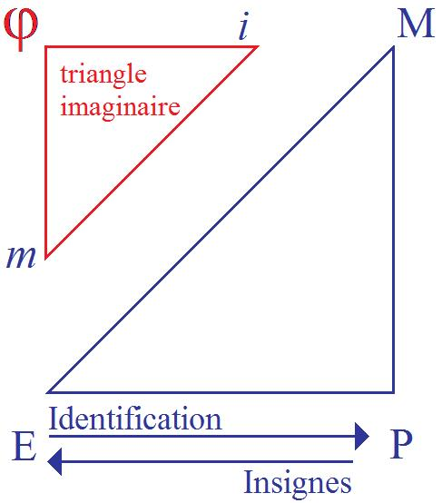

# Leçon 16 | 19 Mars 1958

<!-- source-url: http://staferla.free.fr/S5/S5 FORMATIONS .docx -->
<!-- seminar: s5 -->
<!-- lesson: 16 -->

<!-- id: s5-16-0001 -->

Je voudrais aujourd’hui commencer d’introduire la question des *identifications*.
Pour ceux qui n’étaient pas là la dernière fois, et aussi pour ceux qui y étaient, je rappelle le sens de ce qui a été dit :

<!-- id: s5-16-0002 -->

j’ai essayé de ramener l’attention sur les *difficul­tés* que pose la notion de la phase phallique, et de montrer
que si on éprouve quelque peine à faire entrer *le phallus* dans une rationalité biologique, ce que FREUD a dégagé
de l’expérience prend tout de suite plus de clarté si nous posons que *le phallus* est pris dans une certaine fonction subjective qui doit remplir un certain rôle, que j’appelle un rôle de signifiant.

<!-- id: s5-16-0003 -->

Et bien entendu, il ne tombe pas du ciel, ce *phallus* en tant que *signifiant*. D’un autre côté, il faut bien qu’il ait

<!-- id: s5-16-0004 -->

dans son origine, qui est *une origine ima­ginaire,* quelque propriété, quelque aptitude à remplir cette *fonction signifiante*
qui n’est pas n’importe laquelle, qui est une *fonction de signifiant* plus spécialement adaptée qu’une autre à ce qui
se passe, en somme, dans l’accrochage du sujet humain dans l’ensemble du mécanisme signifiant.

<!-- id: s5-16-0005 -->

C’est en quelque sorte un *signifiant carrefour*, un signifiant vers lequel converge plus ou moins ce qui se passe dans
la mise en prise du sujet humain dans le système signifiant pour autant qu’il faut que son désir passe par ce système pour se faire reconnaître et qu’il en est profondément modifié. C’est une donnée *expérimentale*.

<!-- id: s5-16-0006 -->

Il ressort de cela que ce *phallus*, nous le rencontrons littéralement à tout bout de champ de notre *expérience*,
de notre expérience du conflit, du drame œdipien. Nous le rencontrons à son entrée dans le drame œdipien

<!-- id: s5-16-0007 -->

et aux issues du drame œdi­pien, et même, d’une certaine façon problématique, débordant ce drame œdipien
puisque aussi bien on ne peut manquer d’être frappé du problème que pose la pré­sence de ce *phallus*, et du *phallus* paternel nommément, dans les fantasmes kleiniens primitifs, pour autant que justement c’est sa présence
qui pose la question de savoir dans quel registre allons-nous, ces fantasmes kleiniens, les insérer :

<!-- id: s5-16-0008 -->

- dans le registre que Melanie KLEIN elle-même a proposé, c’est-à-dire dans l’hypothèse d’une sorte d’*œdipe* ultra précoce ?

<!-- id: s5-16-0009 -->

- Ou au contraire, en admettant le fonctionnement imagi­naire primitif que nous allons classer comme pré-œdipien ?

<!-- id: s5-16-0010 -->

La question peut être lais­sée en suspens, au moins provisoirement. Pour éclairer cette fonction qui se présente ici d’une façon tout à fait générale, jus­tement parce qu’elle se *présente* essentiellement comme une *fonction de signifiant*, comme une *fonction symbolique,* nous devons - avant même de pousser nos *for­mules* au dernier terme - voir dans quelle économie signifiante ce *phallus* est impli­qué, autrement dit, examiner ce *quelque chose* que l’exploration de FREUD
a articulé sous cette forme : à la sortie de l’*œdipe*, après le refoulement du désir de l’*œdipe*, le sujet sort nouveau.

<!-- id: s5-16-0011 -->

Et pourvu de quoi ? La réponse est : d’un *idéal du moi*. Dans l’*œdipe* normal, le refoulement qui résulte du franchissement, du *passing,* de l’au-delà de l’*œdipe*, de la sortie de l’*œdipe*, a pour effet que dans le sujet s’est constitué quelque chose qui est vis-à-vis de lui dans un rapport à proprement parler ambigu.

<!-- id: s5-16-0012 -->

Là-dessus, il convient que nous procédions encore pas à pas, parce qu’on va tou­jours trop vite.

<!-- id: s5-16-0013 -->

Il y a une chose en tout cas qui se dégage d’une façon univoque - j’en­tends : d’une seule voix - de ce que FREUD aborde, et là-dessus tous les auteurs ne peuvent pas ne pas poser comme formule minimale que *c’est une identification dis­tincte de l’identification du moi*, si tant est qu’ici, c’est dans un certain rapport du sujet à l’image du semblable
que nous pouvons voir se dégager la structure qui s’appelle le *moi*. Celle de l’*idéal du moi* pose un problème
qui lui est propre : il ne se propose pas - c’est presque une lapalissade de le dire - comme un *moi idéal.*

<!-- id: s5-16-0014 -->

J’ai souvent souli­gné que les deux termes sont distincts chez FREUD dans son article même sur le nar­cissisme,

<!-- id: s5-16-0015 -->

et là-dessus, regardons bien avec une loupe : nous nous apercevrons que dans le texte c’est très difficile à distinguer.
Ce n’est pas exact d’abord, mais le serait-ce même, que nous devrions par conven­tion nous apercevoir qu’il n’y a aucune synonymie entre ce qui est attribué dans les textes de FREUD pris dans l’expérience à la fonction
de l’*idéal du moi,* et le sens que nous pouvons donner à l’*image du moi,* si exaltée que nous la supposions
quand nous en faisons une *image idéale*, ce à quoi le sujet s’identifie comme étant :

<!-- id: s5-16-0016 -->

- composition de réussite de lui-même,

<!-- id: s5-16-0017 -->

- *modèle*, si l’on peut dire, de lui-même, ce dans quoi le sujet se confond, se rassure lui-même de son entièreté.

<!-- id: s5-16-0018 -->

Par exemple, ce qui est menacé, ce qui est atteint quand nous faisons allusion aux nécessités de *réassurance narcissique*, aux craintes d’atteintes narcissiques au corps propre, ce quelque chose, nous pouvons le mettre au registre
de ce *moi idéal.*

<!-- id: s5-16-0019 -->

L’*idéal du moi,* nous le savons - puisqu’il intervient dans des fonctions qui sont souvent des fonctions dépressives, voire agressives à l’égard du sujet - FREUD le fait intervenir dans des formes diverses de dépression.
Vous savez qu’il a tendance, à la fin du *chapitre* qui dans « *Psychologie des masses et analyse du moi »* s’appelle :
« [*Un degré de développement du moi : l’Idéal du moi*](http://classiques.uqac.ca/classiques/freud_sigmund/essais_de_psychanalyse/Essai_2_psy_collective/Freud_Psycho_collective.pdf) » - c’est précisément la première fois qu’il introduit d’une façon décisive
et articulée cette notion d*’idéal du moi -* qu’il a ten­dance donc à mettre toutes les dépressions au chef et au registre,
non pas de l’*idéal du moi,* mais de quelque rapport vacillant, de quelque rapport conflictuel entre le *moi* et l’*idéal du moi.*

<!-- id: s5-16-0020 -->

Admettons qu’on peut prendre tout ce qui se passera sous ce registre dépressif, ou au contraire sous celui des *relations d’exaltation*, sous l’angle, si l’on peut dire, d’une hostilité ouverte entre les deux instances - de quelque instance

<!-- id: s5-16-0021 -->

que parte la déclara­tion des hostilités, que ce soit le *moi* qui s’insurge ou que l’*idéal du moi* devienne trop sévère -
avec ce que comporte de conséquences et de contrecoups tout déséquilibre de ce rapport excessif.

<!-- id: s5-16-0022 -->

Donc, cet *idéal du moi*, en tout cas, est quelque chose qui nous propose son pro­blème. On nous dit : l’*idéal du moi* sort d’une *identification*, d’une identification tar­dive liée à la relation en tout cas tierce qui est celle de l’*œdipe*, une relation
où se mêlent d’une façon complexe les relations de *désir* avec des relations de *rivalité*, d’agression, d’hostilité.

<!-- id: s5-16-0023 -->

Quelque chose se joue, et l’issue du conflit est l’objet d’une balance. S’il est incertain, le débouché du conflit
se propose en tout cas comme ayant entraîné une transformation subjective. Et l’introduction, l’introjection dit-on,
à l’intérieur d’une certaine structure de ce quelque chose qui, par rapport au sujet, se trouve être désormais une partie de lui–même tout en ayant néanmoins conservé une certaine relation avec un objet extérieur, les deux choses y sont.

<!-- id: s5-16-0024 -->

Et ici nous touchons du doigt ce que l’analyse nous apprend : *que ne peuvent pas être séparées intra-subjectivité*
*et inter-subjectivité.* C’est-à-dire qu’à l’intérieur du sujet, dans des fonctions qu’il emmène partout avec lui-même,
et quelles que soient les modifications qui interviennent dans son entourage et son milieu, ce qui est acquis comme *idéal du moi* est bien *quelque chose* qui est dans le sujet à la façon dont l’exilé emmène sa patrie à la semelle de ses souliers : son *idéal du moi* lui appartient bien, il est quelque chose d’acquis.

<!-- id: s5-16-0025 -->

Ce n’est pas un objet, c’est quelque chose qui est en plus dans le sujet. Je veux dire que lorsqu’on insiste sur la notion qu’*intra-subjectivité et inter-subjectivité* doivent rester liées dans tout cheminement analytique correct et qu’on parle
des relations entre les instances dont il s’agit, il est prouvé par les usages courants, par les moindres nécessités
du langage, que lorsque nous parlons *des rapports entre moi et idéal du moi*, on dit bien ordinairement dans l’analyse
qu’ils peuvent être *bons* ou *mauvais*, *conflictuels* ou *accordés*, mais on laisse entre parenthèses ou on n’achève pas
de formuler ce qui doit être formulé : c’est que *ces rapports sont structurés, articu­lés comme des rapports intersubjectifs.*

<!-- id: s5-16-0026 -->

*À l’intérieur du sujet se reproduit* - et bien entendu, vous le voyez bien, ne peut se reproduire qu’à partir d’une *organisation signifiante* - *le même mode de rapports qui existe entre des sujets*. Nous ne pouvons pas penser, encore que nous le disions, que cela puisse aller en le disant, que le *surmoi* est effectivement quelque chose de sévère qui guette le *moi* au tournant pour lui faire d’atroces misères.

<!-- id: s5-16-0027 -->

Ce n’est pas *une personne*. Il fonc­tionne à l’intérieur du sujet comme *un sujet* qui se comporte *par rapport à un autre sujet*, et justement en ceci qu’il y a un rapport entre les sujets qui n’implique pas pour autant l’existence de la personne.
Il suffit des conditions introduites par l’existence, par le fonctionnement comme tel du signifiant, pour que

<!-- id: s5-16-0028 -->

des rapports intersubjec­tifs puissent s’établir.

<!-- id: s5-16-0029 -->

C’est à cette *intersubjectivité*, *à l’intérieur* donc de la personne vivante, que nous avons affaire dans l’analyse, c’est dans cette *intersubjectivité* que nous devons nous faire une idée de ce qu’est cette fonction de l’*idéal du moi.* Vous le savez, vous n’irez pas la trouver, cette fonction, dans un dictionnaire, et on ne vous en donnera pas une réponse univoque. Vous y trouverez les plus grands embarras. Cette fonction n’est pas assurément confondue avec celle du *surmoi.*
Elle est venue presque ensemble, certes, dans la terminologie, mais elle s’en est, de ce fait même, distinguée.

<!-- id: s5-16-0030 -->

Et elle est également en partie confondue, elle peut avoir les mêmes instances, néanmoins elle est davantage orientée vers quelque chose qui dans *le désir* du sujet, joue une fonction *typifiante* qui, peut-être, paraît bien liée à l’assomption du type sexuel, ni plus ni moins, en tant qu’il est impliqué dans toute *une économie*, disons même à l’occasion *sociale,* dans l’assomption des *fonctions masculines et féminines*, non pas simplement en tant qu’elles aboutissent à l’acte nécessaire pour que reproduction s’ensuive, mais également pour *tout un mode de relations entre l’homme et la femme*. Quel est l’intérêt des *acquis de l’analyse* sur ce sujet ? C’est d’avoir pu pénétrer dans quelque chose qui ne se montre en quelque sorte qu’à la surface et, *par ces résul­tats*, d’y avoir pénétré par le biais des cas où le résultat est manqué. Et c’est précisé­ment

<!-- id: s5-16-0031 -->

la méthode bien connue, dite *psychopathologique*, qui consiste à nous décom­poser, à nous désarticuler une fonction

<!-- id: s5-16-0032 -->

en la saisissant là où elle s’est trouvée insensiblement décalée, déviée, là où, de ce fait même, ce qui s’insère d’habitude plus ou moins normalement dans un *complément d’entourage*, nous apparaît avec ses racines, et ses arêtes.

<!-- id: s5-16-0033 -->

Je voudrais…
avec l’expérience que nous avons prise de l’incidence en partie manquée, ou que nous supposons provisoirement manquée, de *l’identification* d’un certain type de sujet avec ce qu’on peut appeler leur type régulier, leur type satis­faisant : nous allons voir là comment nous choisissons, parce qu’il faut bien choisir
…je voudrais prendre un cas particulier. Prenons le cas des femmes, de ce qu’on a appelé le *masculinity complex,*
le *complexe de masculinité*, de la façon dont on l’ar­ticule avec l’existence de la phase phallique.

<!-- id: s5-16-0034 -->

Nous pouvons le faire parce que, de l’existence de cette phase phallique, je vous ai montré d’abord le côté problématique. Y a-t-il là quelque chose d’instinctuel ? Une sorte de vice du développement instinctuel, celui qui fait qu’en quelque sorte, nous dirait-on, l’existence du clitoris serait à elle seule la responsable, la cause de ce qui traduirait au bout de la chaîne l’existence du complexe de masculinité ?

<!-- id: s5-16-0035 -->

D’ores et déjà nous sommes préparés à comprendre que ça ne doit pas être aussi simple et qu’aussi bien,
si on y regarde de près, dans FREUD *ce n’est pas aussi simple*. Et en tout cas, le débat qui a suivi est fait pour nous montrer que ce n’est pas aussi simple, même si ce débat était mal inspiré, à savoir s’il partait en quelque sorte de *pétitions de principe*, à savoir que ce ne pouvait pas être comme cela. Il ne reste pas moins non questionnable qu’il a vu :

<!-- id: s5-16-0036 -->

- que ce n’était pas comme cela,

<!-- id: s5-16-0037 -->

- que ce n’était pas purement et simplement de la question d’un détour exigé dans le développement féminin par une anomalie naturelle ou simplement par la fameuse bisexualité qu’il s’agit,

<!-- id: s5-16-0038 -->

- que c’est assurément plus complexe,

<!-- id: s5-16-0039 -->

- que nous ne sommes pas pour autant capables tout de suite et simplement de formuler ce que c’est, mais qu’assurément ce que nous voyons, c’est que dans la vicissitude de ce qui se présente comme *complexe de masculinité* chez la femme il y a quelque chose qui nous montre d’ores et déjà une connexion
  de cet élément phallique, un jeu, un usage de cet élément phallique qui, en tous les cas, mérite d’être retenu, puisque aussi bien ce pour quoi un élément peut être mis en usage est tout de même de nature à nous éclairer sur ce qu’il est, cet élé­ment, dans son fond.

<!-- id: s5-16-0040 -->

Que nous disent donc les analystes - spécialement les analystes féminins - qui ont abordé le sujet ?
Nous ne dirons pas aujourd’hui *tout ce qu’ils nous disent*. Je me rapporte tout spécialement à deux de ces analystes
qui sont à l’arrière-plan de la discussion *jonesienne* du problème, Hélène DEUTSCH et Karen HORNEY.
Ceux d’entre vous qui lisent l’anglais pourront se reporter, d’une part, à un article d’Hélène DEUTSCH qui s’appelle *The significance of masochism in the mental life of women* [\[I.J.P. 1930, XI](http://www.archive.org/details/InternationaleZeitschriftFuumlrPsychoanalyseXvi1930Heft2)\] et d’autre part à un article de Karen HORNEY.

<!-- id: s5-16-0041 -->

Prenons Karen HORNEY[^49]. Que nous dit-elle ? Karen HORNEY, quoi qu’on puisse penser des *formulations*
des derniers termes auxquels elle a abouti dans la théorie comme dans la technique, a été sur le plan clinique,
dès le début et jusqu’au milieu de sa carrière, incontestablement une créatrice qui a vu des choses qui gardent
toute leur valeur. Quoi qu’elle ait pu en déduire de plus ou moins affaibli concernant la situation anthropologique
de la psychanalyse, il n’en reste pas moins que ses décou­vertes gardent toute leur valeur.

<!-- id: s5-16-0042 -->

Que met-elle *en valeur* dans cet [*art**icle sur le com­plexe de castration*](#Karen_Horney_19_03) ? Ce qu’elle met en valeur peut se résumer en ceci :

<!-- id: s5-16-0043 -->

elle remarque la liaison, l’ana­logie clinique, de formation chez la femme de tout ce qui s’ordonne autour de l’idée
de la castration avec tout ce que cela comporte de résonances, de traces cliniques dans ce que le sujet en analyse articule à proprement parler de revendications de l’organe *comme de quelque chose qui lui manque*. Elle montre par une série d’exemples cliniques - et il convient que vous vous reportiez à ce texte - qu’il n’y a pas de différence de nature : les cas sont dans la conti­nuité insensible de ceux qui se présentent comme certains types d’*homosexualité féminine*
où ce à quoi s’identifie le sujet dans une certaine position à l’endroit de son partenaire, c’est à l’image paternelle.

<!-- id: s5-16-0044 -->

Les temps sont composés de la même façon, *les fantasmes, les rêves, les inhibitions, les symptômes* sont les mêmes.
Il semble qu’il s’agisse d’une forme, on ne peut même pas dire atténuée de l’autre, simplement elle a ou n’a pas dépassé une certaine frontière, laquelle elle-même reste incertaine. Le point sur lequel, à ce propos,
Karen HORNEY se trouve mettre l’accent est celui-ci : ce qui se passe pour ces cas-là nous incite à concentrer
notre attention sur *un certain moment du* *complexe d’Œdipe*, qui n’est pas le premier, qui n’est même pas au milieu,
qui est *très loin vers la fin* puisqu’il suppose déjà atteint ce moment où non seulement *la relation au père est constituée*,
mais où elle est si bien constituée qu’elle se forme chez le sujet petite fille sous l’aspect d’un désir exprès du pénis paternel, de quelque chose, nous dit-on et nous souligne-t-on à très juste titre, qui implique donc une reconnaissance de cette réalité du pénis :

<!-- id: s5-16-0045 -->

- non pas même fantas­matique,

<!-- id: s5-16-0046 -->

- non pas même en général,

<!-- id: s5-16-0047 -->

- non pas dans cette demi lumière ambiguë qui nous fait à tout instant nous demander ce que c’est que le *phallus* sur ce plan-là, sur le plan de la question : est-il *imaginaire* ou ne l’est-il pas ?

<!-- id: s5-16-0048 -->

Et bien entendu, dans sa fonction centrale il implique cette existence *imaginaire*, ce *phallus* dont à diverses phases
du développement de cette relation le sujet féminin peut, envers et contre tout, maintenir qu’il le possède,
tout en sachant fort bien qu’il ne le possède pas. Il le possède simplement en tant qu’image :

<!-- id: s5-16-0049 -->

- soit qu’il l’ait eu dans ce qu’il articule,

<!-- id: s5-16-0050 -->

- soit qu’il *doive* l’avoir, comme c’est fréquent.
  Il s’agit bien là d’autre chose, nous dit-on : il s’agit d’un pénis réalisé comme réel, comme étant, comme tel, attendu.

<!-- id: s5-16-0051 -->

Je ne pourrais même pas avancer cela si déjà je ne vous avais pas, en modulant en trois temps le *complexe d’Œdipe,*
fait remarquer que c’est sous des modes divers qu’il arrive en chacun de ces trois temps, et que le père en tant que pos­sédant le pénis réel est quelque chose qui intervient au troisième temps, je vous l’ai dit, spécialement chez le garçon. Voici les choses parfaitement situées donc chez la petite fille. Que se passe-t-il d’après ce qu’on nous dit ?

<!-- id: s5-16-0052 -->

On nous dit que dans les cas dont il s’agit, c’est de *la privation* de ce qui est là attendu que va résulter ce phénomène,
qui n’est pas inventé par Karen HORNEY, qui est dans le texte de FREUD tout le temps *mis en action,*
qui est cette transformation, ce virage, cette mutation qui fait que *ce qui était amour est transformé en identification* :

<!-- id: s5-16-0053 -->

- que c’est dans la mesure où le père déçoit une attente donc orientée d’une certaine façon, qui comporte déjà une maturation avancée de la situation,

<!-- id: s5-16-0054 -->

- que c’est dans la mesure où, par rapport à cette exigence du sujet parvenu en somme, on pourrait le dire « *à l’acmé de la situation œdipienne* », si justement sa fonction ne consistait pas en ceci qu’elle doit être dépassée, c’est-à-dire que c’est dans son dépas­sement que le sujet doit trouver cette *identification* satisfaisante, celle à son propre sexe,
  …que c’est dans cette mesure donc qu’il se produit ce quelque chose qui reste et qui est articulé comme tel,
  comme un problème, comme posant un mystère.

<!-- id: s5-16-0055 -->

Dans FREUD lui-même, il est souligné que ce jeu que nous admettons comme étant la possibilité par excellence de la transformation de *l’amour* en *identification* est quelque chose qui ne va pas tout seul. Pourtant, cela nous l’admettons dans ce cas pour la première raison que nous constatons : que c’est à ce moment qu’il s’agit de l’articuler, de donner une formule qui nous permette de concevoir ce qu’est cette *identification* en tant que liée à un moment de *privation*.

<!-- id: s5-16-0056 -->

C’est pourquoi je voudrais essayer de vous donner quelques formules, parce que je considère qu’elles sont utiles pour distinguer ce qui est cela, d’avec ce qui n’est pas cela. En d’autres termes, essayer d’introduire cet élément essentiel de dialectique, d’articulation signifiante que je ne vous donne pas là pour le plaisir, si je puis dire, et par le goût de nous retrouver dans les paroles, mais au contraire pour que l’usage que nous faisons d’habitude des *paroles* et des *signifiants*
ne soit pas un usage semblable à celui qui s’appelle « *prendre des vessies pour des lanternes* », c’est-à-dire des choses insuffisamment articulées pour des choses suffisamment éclairantes.

<!-- id: s5-16-0057 -->

C’est en les bien *articulant* que nous pourrons mesurer effectivement ce qui se passe, et distin­guer ce qui se passe *dans un cas* de ce qui se passe *dans un autre*. Que se passe-t-il quand le sujet en question, le sujet féminin a pris une certaine position d’*identification* au père ? La situation, si vous voulez, est la suivante : voilà ici le père, quelque chose ici
au niveau de l’enfant a été attendu, enfin le résultat paradoxal, singulier, c’est que sous un certain angle
et d’une certaine façon, on nous dit que l’enfant devient, en tant qu’*idéal du moi,* ce père.

<!-- id: s5-16-0058 -->

Il ne devient pas réellement bien sûr le père. Et toujours, là, une femme dans ce cas peut vraiment parler
de ses relations à son père : il suffit de *l’écouter* de la façon la plus ouverte *dire* « *Je tousse comme lui* » par exemple.
C’est bien de quelque chose qui est une *identification* qu’il s’agit. Alors essayons de voir ce qui se passe,
essayons de voir pas à pas l’économie de la transformation : la *petite fille* n’est pas pour autant transformée en *homme*.
Ce que nous trouvons comme signes, comme stigmates De cette *identification*, ce sont des choses qui s’expriment
en partie, qui peuvent sortir comme celles-là, qui peuvent même être remarquées par le sujet, dont le sujet peut
se targuer jusqu’à un certain point. Qu’est-ce que c’est ?

<!-- id: s5-16-0059 -->

Alors là ce n’est pas douteux : ce sont *des éléments signifiants.* Si une femme dit : « *Je tousse comme mon père* »
ou « *Je me pousse du ventre ou du corps comme lui* », ce sont quand même là des éléments signifiants dont il s’agit,
dirons-nous provisoirement. Plus exactement, pour dégager ce dont il s’agit, provi­soirement nous les désignerons d’*un terme spécial*, parce que ce ne sont pas des signi­fiants mis en jeu dans une chaîne signifiante, nous les appellerons « *les insignes du père* »*.* L’attitude *psychologique* montre ici à la surface ceci : c’est que le sujet en somme, pour appeler
les choses par leur nom, se présente sous le masque qu’il pose sur ce quelque chose qui est le côté partiellement indifférencié qu’il y a dans tout sujet comme tel : il se pose *les insignes de la masculinité.*

<!-- id: s5-16-0060 -->

Il convient peut-être de se poser, avec la lenteur qui est toujours ce qui doit ici nous garder de l’erreur, la question
de ce que devient dans la démarche, le désir d’où tout cela est parti ? Le désir, après tout, n’était pas un *désir viril*, lui. Que devient le désir, pour autant que le sujet a pris ici, à ce niveau, *les insignes du père* ?

<!-- id: s5-16-0061 -->

Ces insignes vont être employés vis-à-vis de qui ? Vis-à-vis de quelque chose de tiers, vis-à-vis de quelque chose
dont on nous dira que cela prend - parce que l’expérience nous le montre - la place de ce qui, à la primitive évolution du *complexe d’Œdipe*, était à cette tierce place : c’est-à-dire la mère*.*

<!-- id: s5-16-0062 -->

L’analyse même d’un cas comme celui-là nous montrera qu’à partir du moment de l’identification, c’est-à-dire à partir du moment où le sujet se revêt des insignes de ce à quoi il est identifié, il y a une transformation du sujet dans un certain sens qui, lui, est de l’ordre d’un passage à l’état de *signifiant* de quelque chose qui est cela, *les insignes.*
Mais le désir qui entre en jeu n’est plus le même que si c’était ce qui était attendu dans ce rapport au père, si c’était ce quelque chose que nous pouvions supposer au point où les choses en sont parvenues, *à ce point* où nous en sommes à ce moment-là dans le *complexe d’Œdipe*, à savoir quelque chose d’extrêmement proche d’une position génitale passive, d’un désir passionné, d’un appel proprement féminin. Or il est bien clair que ce n’est plus le même qui est là
après la transformation. Nous laissons pour l’instant la question de savoir ce qui est arrivé à ce désir.

<!-- id: s5-16-0063 -->

Tout à l’heure nous avons dit *privation.* Cela vaut que nous y revenions, car aussi bien on pourrait dire *frustration.*
Pourquoi *privation* plutôt que *frustration* ? J’indique ici que le fil reste pendant. Quoi qu’il en soit, ce qui va s’établir,
pour autant que le sujet qui ici \[E\] est venu aussi là \[P\], pour autant qu’il a un *idéal du moi*, que *quelque chose* peut s’être passé *à l’intérieur de lui-même* qui est structuré comme dans *l’intersubjectivité,* c’est que ce sujet va exercer un certain désir. Qui est quoi ?

<!-- id: s5-16-0064 -->

<!-- id: s5-16-0065 -->

Sur ce schéma, ce qui apparaît ce sont les relations du père à la mère. Il est bien clair que ce que nous trouvons
dans une analyse, dans l’analyse d’un sujet comme celui-là au moment où nous l’analysons, ce n’est pas *le double*,
la reproduction de ce qui se passait entre le père et la mère, et cela pour toutes sortes de raisons, ne serait-ce
que parce que le sujet n’y a accédé que tout à fait imparfaitement.

<!-- id: s5-16-0066 -->

L’expérience montre au contraire que ce qui va venir dans la relation, c’est tout *le passé*, toute *la vicissitude* des relations extrêmement complexes qui jusque-là ont modulé les rap­ports de l’enfant avec la mère. C’est-à-dire tout ce qui s’est passé depuis *l’origine*, depuis les frustrations, les déceptions liées à ce qui existe forcément de contretemps, d’à-coups dans les relations de l’enfant à la mère, avec tout ce qu’ils entraînent d’une relation extraordinairement compliquée, faisant intervenir nommément avec un accent tout particulier les relations agressives - les relations agressives
dans leur forme la plus originelle - des relations aussi de rivalité.

<!-- id: s5-16-0067 -->

Toutes les incidences par exemple de la survenue d’éléments étrangers au *trio*, à savoir de tous les frères ou sœurs
qui ont pu intervenir plus ou moins inopportunément dans l’évolution du sujet et dans ses relations avec sa mère. Tout cela portera sa trace et son reflet pour tempérer ou pour renforcer ce qui se présentera alors comme revendication des insignes de la masculinité. C’est cela qui va se projeter dans les relations du jeune sujet avec

<!-- id: s5-16-0068 -->

son objet, qui seront dès lors com­mandées à partir de ce point de l’ *identification* où le sujet revêt *les insignes*
de ce à quoi il est identifié en tant qu’il est devenu, ou que se joue chez lui, le rôle et la fonc­tion d’*idéal du moi*.

<!-- id: s5-16-0069 -->

Bien entendu, c’est une façon d’imaginer les places dont je parle, mais cela sup­pose évidemment, si vous voulez

<!-- id: s5-16-0070 -->

le comprendre, une sorte d’allées et venues. Ces insignes, le sujet les ramène avec lui après le mouvement d’oscillation dont il s’agit. Il se retrouve constitué d’une certaine façon et avec un nouveau désir. Cette formule,
ce mécanisme de la transformation, comporte donc trois temps, à savoir :

<!-- id: s5-16-0071 -->

- l’intervention au départ d’un élément qui doit être d’abord libidinal \[la mère\].

<!-- id: s5-16-0072 -->

- Deuxièmement, l’existence - à côté - d’un troisième terme avec lequel le sujet est dans un rapport qui permet la distinction de ce troisième terme, ce qui exige en tout cas que dans le passé de la relation avec ce troisième terme \[le père\] soit intervenu cet élément radicalement différenciateur qui s’appelle la concurrence.

<!-- id: s5-16-0073 -->

- Et troisièmement une sorte d’échange se produit : ce qui a été l’objet de la relation libidinale devient autre chose, est transformé pour le sujet en fonc­tion signifiante, et son désir passe alors sur un autre plan,
  sur le plan du désir établi précédemment avec le troisième terme.

<!-- id: s5-16-0074 -->

Dans l’opération, l’autre désir, celui qui vient se substituer au désir refoulé, res­sort le même dans son fond,

<!-- id: s5-16-0075 -->

et tout de même transformé : c’est cela qui constitue le processus de l’identification. Il faut qu’il y ait d’abord l’élément libidinal pointant un certain objet en tant qu’objet. Cet objet devient dans le sujet un signifiant
pour occuper la place qui s’appellera dès lors *idéal du moi*. Le désir, d’autre part, subit ce quelque chose qui comporte un *ersatz,* c’est un autre désir qui vient à la place du premier.

<!-- id: s5-16-0076 -->

Cet autre désir n’est pas un désir qui vient de rien, il n’est pas néant : il existait avant, il concernait le troisième terme, et il sort de là transformé. Voilà le schéma que je vous prie de retenir dans votre esprit, parce que c’est en quelque sorte le schéma minimum de tout procès d’identification au sens propre, d’identification au niveau secondaire, d’identification en tant qu’elle fonde l’*idéal du moi*.

<!-- id: s5-16-0077 -->

Il ne manque jamais aucun de ces trois termes. Et *le chassé-croisé*, si l’on peut dire, qui résulte de la transformation, d’une part *d’un objet trans-signifiant*, et d’autre part *de la prise de place que ce signifiant réalise à ce moment-là dans le sujet*,
et qui constitue à proprement parler l’ *identification,* est ce quelque chose que nous trouvons à la base de ce qui constitue un *idéal du moi*. Et cela s’accompagne toujours aussi de ce que nous pouvons appeler *transfert du désir,*

<!-- id: s5-16-0078 -->

à savoir qu’un autre désir sur­vient d’ailleurs, qui est en rapport avec un troisième terme qui n’avait rien à faire
avec la relation libidinale première mise en cause, et que ce désir qui vient se substituer au premier est,
*dans* cette substitution et *par* cette substitution, transformé.

<!-- id: s5-16-0079 -->

C’est tout à fait essentiel. Nous pouvons encore l’expliquer, mais autrement. Disons, pour reprendre notre schéma sous la forme où nous le présentons habituellement, que l’enfant, dans un premier rapport avec l’objet primordial
\- ceci est la formule générale - se trouve prendre la *position symétrique* de celle *du père*. Il entre en rivalité.

<!-- id: s5-16-0080 -->

Il se situe *à l’op­posé*, par rapport à la relation primitive à l’objet, en un point X.

<!-- id: s5-16-0081 -->

C’est pour autant que là il devient quelque chose qui peut se revêtir des *insignes* de ce avec quoi il entre en rivalité, qu’il retrouve ensuite sa place là où il est forcément, c’est-à-dire à l’opposé de ce point *x* où les choses se sont passées et là où il vient se constituer sous cette nou­velle forme qui s’appelle *idéal du moi*. Il retient quelque chose de ce passage sous la forme la plus générale. Il s’agit là de quelque chose où vous voyez bien qu’il ne s’agit plus ni de père,
ni de mère : il s’agit de rapport avec l’objet. Et la mère c’est l’objet primitif, l’objet par excellence.

<!-- id: s5-16-0082 -->

Ce qu’il retient dans ce cas, dans cette allée et venue qui l’a fait - par rapport à l’ob­jet - entrer en rivalité

<!-- id: s5-16-0083 -->

avec un troisième terme c’est quelque chose qui se caractérise par ce qu’on peut appeler le facteur commun qui résulte de l’existence des signifiants, du fait que dans le psychisme humain, pour autant que les hommes ont affaire au *monde du signifiant* et que ce sont eux, les signifiants, qui sont la condition néces­saire, le défilé par où il faut

<!-- id: s5-16-0084 -->

qu’en passe leur désir. Dans cette allée et venue, il y a toujours quelque chose qui impliquera ce facteur commun

<!-- id: s5-16-0085 -->

- à l’incidence du signifiant dans *le désir*,

<!-- id: s5-16-0086 -->

- à ce qui le signifie,

<!-- id: s5-16-0087 -->

- à ce qui en fait nécessairement *un désir signifié*.

<!-- id: s5-16-0088 -->

Ce facteur commun, c’est précisément le *phallus.* C’est parce qu’il en fait toujours partie, qu’il est le *plus petit commun dénominateur* de ce facteur commun, que nous le trouvons toujours là, dans tous les cas, qu’il s’agisse de l’homme
ou de la femme. En d’autres termes, c’est pour cela que nous plaçons ici au point x, le *phallus*, le petit ϕ.

<!-- id: s5-16-0089 -->

Ce qui en résulte, c’est qu’il se place toujours par rapport au *moi*…
c’est-à-dire en tiers par rapport à ce qui s’est établi là d’un sujet avec lui-même, et toujours plus ou moins fragilement constitué par rapport en somme à l’identification primitive, en effet toujours plus ou moins idéale, que le sujet s’est fait de lui avec une image tou­jours plus ou moins contestée

<!-- id: s5-16-0090 -->

…qui n’a \[le *moi*\] rien à faire avec ce rapport de fond qu’il a avec ce à quoi il a adressé ses demandes, c’est-à-dire l’objet. L’*idéal du moi* se constitue dans cette allée et venue toujours à l’opposé, si l’on peut dire, de ce point virtuel où se produit la mise en concurrence, le *contest* du troisième terme. C’est à son opposé qu’il y a toujours un certain rapport avec ce facteur commun métonymique qu’est le *phallus*, qui se retrouve partout.

<!-- id: s5-16-0091 -->

Et bien entendu, ce qui se passe au niveau de l’*idéal du moi* consiste essentiellement à l’avoir au minimum, ce facteur commun, et bien entendu, composé d’une façon qui ne le laisse pas voir, ou qui ne le laisse voir que comme quelque chose qui nous file tou­jours entre les doigts, ce *quelque chose qui court au fond de toute espèce d’assomption signifiante*.

<!-- id: s5-16-0092 -->

Il y a ceci : c’est que ce signifiant, dans tous les cas, mord sur le signifié. L’*idéal du moi* se constitue dans ce rapport avec le père, il implique toujours le *phallus*. Ici, c’est le père le troisième terme. Il implique toujours le *phallus*.
Il l’implique toujours et uniquement pour autant que ce *phallus* est le facteur commun, le facteur pivot
de cette instance du *signifiant*.

<!-- id: s5-16-0093 -->

Que nous dit par exemple encore Hélène DEUTSCH ? Karen HORNEY nous a montré la continuité du complexe de castration avec l’ho­mosexualité féminine. Hélène DEUTSCH nous parlera d’autre chose. Elle aussi nous dira
que la phase phallique joue bien le rôle que nous dit FREUD, à ceci près que ce qui lui importe, c’est de s’apercevoir aussi de sa vicissitude ultérieure.

<!-- id: s5-16-0094 -->

Cette vicissitude, elle la verra en ceci : c’est que l’adoption, dit-elle, de *la position masochique* - essen­tielle, constitutive, dit-elle, à la position féminine - se base sur ce plan que c’est pour autant que la jouissance clitoridienne se trouve,
à la petite fille interdite, que celle-ci tirera sa satisfaction d’une position qui ne sera donc plus et uniquement

<!-- id: s5-16-0095 -->

une *posi­tion passive*, mais une *position de jouissance*, assurée - dans cette privation même qui lui est imposée -
de la jouissance clitoridienne.

<!-- id: s5-16-0096 -->

Il y a là quelque *paradoxe*, mais un *paradoxe* qu’Hélène DEUTSCH soutient, de quelque chose qui va chez elle jusqu’à des *préceptes techniques*, des *constats d’ex­périence* qui vont fort loin dans leur *paradoxe*. Je veux dire que je vous rapporte là les données de l’expérience d’une analyste, soumises comme telles sans aucun doute à un certain choix du matériel, mais qui valent la peine qu’on s’y arrête.

<!-- id: s5-16-0097 -->

Pour Hélène DEUTSCH, la question de la satisfaction féminine est quelque chose qui se présente d’une façon assez complexe pour qu’elle considère qu’une femme, dans sa nature de femme, et féminine, peut trouver une satisfaction,
assez accomplie en tous cas pour que rien n’apparaisse qui se présente comme névrotique ou atypique dans
son comportement, dans son adaptation à ses fonctions de femme, sans que se présente pour elle, sous nulle forme bien marquée, la satisfaction proprement génitale.

<!-- id: s5-16-0098 -->

Je le répète, c’est la position de Mme DEUTSCH. À savoir qu’en somme l’ac­complissement de la satisfaction

<!-- id: s5-16-0099 -->

de la position féminine peut tout entière se trouver sur le plan de sa *relation maternelle*, sur tout ce qui tient dans toutes ses étapes à *l’ac­complissement de la fonction de reproduction*, à savoir dans les satisfactions propres de l’état de grossesse,
du nourrissage et du maintien de la position maternelle.

<!-- id: s5-16-0100 -->

La maturation de la satisfaction liée à l’acte génital lui-même, de l’orgasme lui-même, pour l’appeler par son nom, étant quelque chose qui est assez lié à cette dialectique de la privation phallique pour qu’Hélène DEUTSCH formule que chez des sujets elle a rencontré d’une façon plus ou moins avancée, d’une façon plus ou moins poussée,
cette implication dans la dialectique phallique.

<!-- id: s5-16-0101 -->

À savoir que c’est par rapport à l’homme, par rapport à un certain degré d’identification masculine que s’est consti­tué un équilibre forcément, lui, conflictuel donc précaire, de la personnalité. Une réduction trop poussée de cette relation complexe, un avancement à un degré poussé trop loin de l’analyse, est de nature à frustrer le sujet de ce qu’il a,
jusque là, plus ou moins heureusement réalisé de la jouissance sur le plan génital.

<!-- id: s5-16-0102 -->

Cette considération va jusqu’à comporter pour Hélène DEUTSCH l’indication de lais­ser en quelque sorte au sujet

<!-- id: s5-16-0103 -->

\[le bénéfice\] de ses *identifications* plus ou moins réus­sies sur ce plan et en tout cas acquises, et de ne pas - par une analyse trop avancée - réduire, si l’on peut dire, décomposer, analyser ces *identifications*, sauf à le mettre en posture de perte par rapport à ce que ces analyses révèlent être le fond, la structure de la jouissance acquise :

<!-- id: s5-16-0104 -->

- en tant qu’il serait lié, cet acquis, sur le plan de *la jouissance génitale*, à quelque chose qui est justement le passé du sujet par rapport à ses *identifications*,

<!-- id: s5-16-0105 -->

- en tant que la jouissance peut consister dans *la frustration masochique* d’une certaine position qui a été un moment conquise et qui, pour que la *frustration* soit maintenue, nécessite du même coup le maintien des positions d’où cette *frus­tration* peut s’exercer.

<!-- id: s5-16-0106 -->

En d’autres termes, dans certaines conditions, la réduction d’identifications qui sont proprement des identifications masculines peut constituer un danger pour ce qui a été par le sujet conquis sur le plan de la jouissance dans la dialectique même de cette identification. Cela vaut ce que ça vaut. La question est simplement ici que cela ait pu être avancé, que cela a été avancé assurément par quelqu’un qui n’est point sans expé­rience et qui, ne serait-ce

<!-- id: s5-16-0107 -->

que par ses réflexions, se manifeste assurément comme quel­qu’un qui réfléchit sur son métier

<!-- id: s5-16-0108 -->

et sur les conséquences de ce qu’elle fait.

<!-- id: s5-16-0109 -->

Par contre, c’est à ce titre, et à ce seul titre, que cela mérite d’être maintenu dans la question. Je vous le répète,
et pour résumer la position de Madame DEUTSCH, c’est qu’en somme dans les relations inter-humaines
telles qu’elles se présentent effectivement…
je ne dis pas que cela se présente de la même façon chez les rouges-gorges et chez les mantes religieuses
…dans l’espèce humaine, il semblerait que le centre de gravité, l’élément de satisfaction majeur de la position féminine se trouverait dans l’au-delà de la relation génitale comme telle.

<!-- id: s5-16-0110 -->

En quelque sorte, tout ce qui pourrait y être trouvé par la femme se lierait essentiellement à une dialectique dont nous n’avons pas à être surpris qu’elle intervienne là. Qu’est-ce que cela veut dire ? Cela veut dire que ce quelque chose qui est aussi bien manifesté dans la position de l’homme vis-à-vis de l’acte génital, à savoir l’im­portance extrême de ce qu’on appelle le plaisir préliminaire, est là ce qui donne, peut-être simplement d’une façon
plus accentuée, les matériaux libidinaux à mettre en cause.

<!-- id: s5-16-0111 -->

Mais que ces matériaux libidinaux entrent en jeu effectivement à partir de leur prise dans l’histoire du sujet

<!-- id: s5-16-0112 -->

dans une certaine dialectique signifiante impliquant l’in­trusion de l’ *identification* possible au troisième objet,

<!-- id: s5-16-0113 -->

qui en l’occasion est le père, et que donc tout ce qui vient - sous le titre de revendication phallique et d’identifi­cation au père - compliquer la relation de la femme à son objet n’est simplement que l’élaboration signifiante de ce à quoi
se trouvent empruntées les satisfactions qui se produisent proprement dans l’acte génital, à savoir ce que j’ai appelé

<!-- id: s5-16-0114 -->

à l’instant plai­sir préliminaire, l’orgasme lui-même comme tel, je veux dire en tant qu’il serait identifié au sommet de l’acte lui-même, posant effectivement à l’expérience le pro­blème chez la femme de quelque chose qui mérite en effet d’être posé, étant donné tout ce que nous savons physiologiquement de l’absence d’une organisation nerveuse directement faite pour provoquer la volupté dans le vagin.

<!-- id: s5-16-0115 -->

Cela nous amène à essayer de formuler cette question de la relation de l’*idéal du moi* à une certaine vicissitude du désir, et à la formuler comme ceci : nous avons donc, aussi bien chez le garçon que chez la fille, à un moment donné,
une relation à un certain objet quel qu’il soit, à un objet d’ores et déjà constitué dans sa réalité d’objet.
Et cet objet va devenir quelque chose qui est l’*idéal du moi*. Il va le devenir par ses *insignes*.

<!-- id: s5-16-0116 -->

Pourquoi *le désir* dont il s’agit dans cette relation à l’objet a-t-il été appelé dans cette occasion *privation* ? Il a été appelé ainsi parce que ce qui constitue sa caracté­ristique est non pas, comme on le dit, qu’il concerne un objet réel…
il faut, bien entendu, que le père dans le moment où il intervient, dans le pre­mier exemple que j’ai donné, dans l’évolution chez la fille, soit en effet un être assez réel dans sa constitution physiologique pour que le *phallus* soit passé à un stade d’évolution qui va au-delà de la fonction purement *imaginaire* qu’il peut conserver longtemps dans le *Penisneid,* cela c’est certain
…mais qu’il vise quelque chose qui peut être demandé.

<!-- id: s5-16-0117 -->

Il ne peut s’instaurer à proprement parler de dialectique de *privation* que quand il s’agit de quelque chose que le sujet peut *symboliser*. C’est pour autant que le pénis paternel peut être *sym­bolisé*, peut être demandé, que se produit ce qui

<!-- id: s5-16-0118 -->

se passe au niveau de l’*identification* dont il s’agit aujourd’hui. Il y a là quelque chose qui est tout à fait distinct
de ce qui intervient au niveau de l’interdit qui se constitue pour autant par exemple que *la jouissance phallique*
\- *la jouissance clitoridienne* pour l’appeler par son nom - *est* peut-être, *à un moment donné* de l’évolution, *interdite*.

<!-- id: s5-16-0119 -->

Ce qui est interdit rejette le sujet dans quelque chose où il ne trouve plus en rien à se signifier. C’est ce qui en fait à proprement parler le caractère douloureux, et c’est pour autant que le *moi* peut, de la part de l’*idéal du moi* par exemple, à l’occasion se trouver dans cette position de rejet que s’établit l’état à proprement parler mélancolique.

<!-- id: s5-16-0120 -->

Nous reviendrons sur la nature de ce rejet, mais entendez d’ores et déjà ici que ce à quoi je fais allusion peut être mis en relation avec le terme même qui est dans notre vocabulaire ce que j’ai mis en relation avec ce rejet, à savoir
le terme de *Verwerfung.* C’est pour autant que de la part de l’*idéal du moi* le sujet peut se trouver lui-même dans
sa réalité vivante, dans *cette position d’exclusion* de toute signification possible, que s’établit l’état dépressif comme tel.

<!-- id: s5-16-0121 -->

Mais ce dont il s’agit dans la formation de l’*idéal du moi* est un processus tout opposé, il consiste en ceci : que cet objet qui se trouve confronté à quelque chose que nous avons appelé *privation*, pour autant qu’il est un désir négatif,
que c’est quelque chose qui peut être demandé, que c’est sur le plan de la demande que le sujet se voit refuser ce désir, cette liaison entre le désir en tant que refusé et l’objet, c’est cela qui est au départ la constitution de cet objet comme *un certain signifiant* qui prend une certaine place, qui se substitue au sujet, qui devient une métaphore du sujet.

<!-- id: s5-16-0122 -->

Ce qui se produit dans l’ *identification* à l’objet du désir, dans le cas où la fille s’identifie à son père, c’est bien ceci :
ce père qu’elle a désiré et qui lui a refusé le désir de sa demande, devient quelque chose qui est *à sa place*.

<!-- id: s5-16-0123 -->

Le caractère *métaphorique* de la formation de l’*idéal du moi* est un élément essentiel, et de même que dans la métaphore, ce qui en résulte c’est la modification de quelque chose :

<!-- id: s5-16-0124 -->

- qui n’a rien à faire avec le désir,

<!-- id: s5-16-0125 -->

- qui est intéressé dans la constitution de l’objet, qui est un désir qui est ailleurs à ce moment-là : le désir qui avait lié la petite fille à sa mère, appelons-le petit *d* par rap­port au grand D.

<!-- id: s5-16-0126 -->

Toute l’aventure précédente de la petite fille avec sa mère vient ici prendre place dans la question et subit
*les conséquences de cette métaphore*. Il devient lié.

<!-- id: s5-16-0127 -->

Nous retrouvons là *la formule de la métaphore* que je vous ai donnée, pour autant que c’est, vous le savez :

<!-- id: s5-16-0128 -->

> 

<!-- id: s5-16-0129 -->

c’est-à-dire quelque chose qui résulte d’un *changement de signification*. Après la *métaphore*, *ce changement de signification*
c’est quelque chose qui se produit dans les relations jusque-là établies par l’histoire du sujet, puisqu’en somme
nous sommes toujours sur le premier exemple de la petite fille avec la mère. Ce qui dès lors modè­lera ses relations avec son *objet*, ce sera cette histoire, cette histoire modifiée par l’ins­tauration de cette fonction nouvelle en lui,

<!-- id: s5-16-0130 -->

qui s’appelle *idéal du moi*.

<!-- id: s5-16-0131 -->

Karen HORNEY: [*On the genesis of the castration complex in women*1, Berlin](#Table) \[[Retour 19-03](#Retour_Karen_Horney_19_03)\]

<!-- id: s5-16-0132 -->

Whilst our knowledge of the forms which the castration complex may assume in women has become more and more comprehensive,2 our insight into the nature of the complex as a whole has made no corresponding advance. The very abundance of the material collected which is now familiar to us brings to our minds more strongly than ever the remarkable character of the whole phenomenon, so that the phenomenon in. itself becomes a problem. A survey of th.e forms assumed by the castration complex in women that have hitherto been observed and of the inferences tacitly drawn from them shows that, so far, the prevailing conception is based on a certain funda­mental notion which may be, briefly formulated as follows (I quote in part *verbatim* from Abraham’s work on the subject): Many females, both children and adults, suffer either temporarily or permanently from the fact of their sex. The manifestations in the mental life of women which spring from the objection to being a woman are trace­able to their covering a penis when they were little girls. The unwel­come idea of being fundamentally lacking in this respect gives rise to passive castration phantasies, while active phantasies spring from a revengeful attitude against the favoured male.
In this formulation we have it assumed as an axiomatic fact that females feel at a disadvantage in this respect of their genital organs, without this being regarded as constituting a problem in itself— possibly because to masculine narcissism this has seemed too self–evident to need explanation. Nevertheless, the conclusion so far
1 Paper delivered at the Seventh International Psycho–Analytical Congress, Berlin, Sept. 1922.
1 Cf. in particular Abraham,’ Manifestations of the Female Castration Complex’ (1921), I JPA, Vol. III, p. 1.

<!-- id: s5-16-0133 -->

drawn from the investigations—amounting as it dœs to an assertion that one–half of the human race is discontented with the sex assigned to it and can overcome this discontent only in favourable circum­stances—is decidedly unsatisfying, not only to feminine narcissism but also to biological’ science. The question arises, therefore: Is it really the case that the forms of the castration complex met with in women, pregnant with consequences as they are, not only for the development of neurosis but also for the character–formation and destiny of women who for all practical purposes are normal, are based solely on a dissatisfaction with the fact of womanhood—a dissatis­faction due to her coveting a penis ? Or is this possibly but a pretext (at any rate, for the most part) put forward by other forces, the dynamic power of which we know already from our study of the formation of neurosis ?
I think that this problem can be attacked from several sides. Here I merely wish to put forward from the purely ontogenetic stand­point, in the hope that they may contribute to a solution, certain considerations which have gradually forced themselves upon me in the course of a practice extending over many years, amongst patients the great majority of whom were women and in whom on the whole the castration complex was very marked.
According to the prevailing conception the castration complex in females is entirely centred in the ‘ penis–envy’ complex; in fact the term ‘ masculinity–complex ‘ is used as practically synonymous. The first question which then presents itself is: How is it that we can observe this penis–envy occurring as an almost invariable typical phenomenon, even when the subject has not a masculine way of life, where there is no favoured brother to make envy of this sort com­prehensible and where no ‘ accidental disasters ‘ 3 in the woman’s experience have caused the masculine r61e to seem the more desirable ? The important point here seems to be the fact of raising the question; once it has been put answers suggest themselves almost spontaneously from the material with which we are sufficiently fami­liar. For supposing we take as our starting–point the form in which ‘penis–envy’ probably most frequently directly manifests itself, namely, in the desire to urinate like a man, a –critical sifting of the material soon shows that this desire is made up of three component

<!-- id: s5-16-0134 -->

\* Cf.Freud, ‘Tabu der Virginitat’, *Sammlung klehier Schriften,* Vierte Folge..
parts, of which sometimes one and sometimes another is the more important.
The part about which I can speak most briefly is that of *urethral erotism* itself, for sufficient stress has already been laid on this factor, being as it is the most obvious one. If we want to appraise in all its intensity the envy springing from this source we must above all make ourselves realize the narcissistic overestimation 4 in which the excretory processes are held by children. Phantasies of omnipotence, especially such as are of a sadistic character, are as a matter of fact more easily associated with the jet of urine passed by the male. As an instance of this idea—and it is only one instance amongst many— I can quote something I was told of a class in a boys’ school: when two boys, they said, urinate to make a cross the person of whom they think at the moment will die.
Now even though it is certain that a strong feeling of being at a disadvantage must arise in little girls in connection with urethral erotism, yet it is exaggerating the part played by this factor if, as has hitherto been done in many quarters, we straightway attribute to it every symptom and every phantasy of which the content is the desire to urinate like a man. On the contrary, the motive force which originates and maintains this wish is often to be found in quite other instinct–components—above all in active and passive scopto–philia. This connection is due to the circumstance that it is just in the act of urinating that a boy can display his genital and look at himself and is even permitted to do so, and that he can thus in a certain sense satisfy his sexual curiosity, at least as far as his own body is concerned, every time he passes urine.
This factor, which is rooted –in the scoptophilic instinct, was particularly evident in a patient of mine in whom the desire to urinate like a male dominated the whole clinical picture for a time. During this period she seldom came to’ the analysis without declaring that she had seen a man urinating in the street, and once she exclaimed quite spontaneously: ‘ If I might ask a gift of Providence it would be to be able just for once to urinate like a man.’ Her associations completed this thought beyond all possibility of doubt: ‘ For then I should know how I really am made.’ The fact that men can see themselves when urinating, while women cannot, was in this patient.

<!-- id: s5-16-0135 -->

\* Cf. Abraham, ‘ Zur narzisstischen Uberwertung der Excretions–vorgange in Traum und Neurose’, *Internationale Zeitschrift,* 1920.

<!-- id: s5-16-0136 -->

whose development was to a great extent arrested at a pregenital stage, actually one of the principal roots of her very marked ‘ penis–envy.’
Just as woman, because her genital organs are hidden, is ever the great riddle for man\> so man is an object of lively jealousy for woman precisely on account of the ready visibility of his organ.

<!-- id: s5-16-0137 -->

The close connection between urethral erotism and the scopto­philic instinct was– obvious in yet another patient, a woman whom I will call Y. She practised masturbation in a very peculiar way which stood for urinating like her father. In the obsessional neurosis from which this patient suffered, the chief agent was the scoptophilic instinct; she had the most acute feelings of anxiety consequent on the idea of being seen by others whilst thus practising masturbation. She was therefore giving expression to the far–back wish of the little girl: I wish I had a genital too, which I could show, like father, every time I pass urine.
I think, moreover, that this factor plays a leading part in every case of exaggerated embarrassment and prudery in girls, and I further conjecture that the difference in the dress of men and women, at least in our civilized races, may be traced to this very circumstance that the girl cannot exhibit her genital organs and that therefore in respect of her exhibitionistic tendencies she regresses to a stage at which this desire to display herself still applied to her whole body. This puts us on the track of the reason of why a woman wears a low neck, while a man wears a dress–coat. I think too that this con­nection explains to some extent the criterion which is always men­tioned first when the points of difference between men and women are under discussion—namely, the greater subjectivity of women as compared with the. greater objectivity of men. The explanation would be that the man’s impulse to investigate finds satisfaction in the examination of his own body and may, or must, subsequently be directed to external objects; while the woman, on the other hand, can arrive at no clear knowledge about her own person, and therefore finds it far harder to become free of herself.
Finally, the \[wish which I have assumed to be the prototype of ‘ penis–envy’ has in it a third element, namely, suppressed onanistic wishes, as a rule deeply bidden but none the less important on that account. This element may be traced to a connection of ideas (mostly unconscious) by which the fact that boys are permitted to take hold of their genital when urinating is construed as a permission to masturbate.
Thus a patient who had witnessed a father reproving his little daughter for touching that part of her body with her tiny hands said to me quite indignantly: ‘ He forbids her to do that and yet dœs it himself five or six times a day.’ You will easily recognize the same connection of ideas in the case of the patient Y., in whom the male way of urinating became the decisive factor in the form of mastur­bation that she practised. Moreover, in this case it became clear that she could not become completely free from the compulsion to masturbate so long as she unconsciously maintained the claim that she should be a man. The conclusion I drew from my observation of this case is, I think, quite a typical one : girls have a very special difficulty in overcoming masturbation because they feel that they are unjustly forbidden something which boys are allowed to do on account of their different bodily formation. Or, in terms of the problem before us, we may put it in another way and say that the difference in bodily formation may easily give rise to a bitter feeling of injury, so that the argument which is used later to account for the repudia­tion of womanhood, namely, that men have greater freedom in their sexual life, is really based upon actual experiences to that effect in early childhood. Van Ophuijsen at the conclusion of his work on the masculinity–complex in women lays stress on the strong impression he received in analysis of the existence of an intimate connection between the masculinity–complex, infantile masturbation of the clitoris and urethral erotism. The connecting link would probably be found in the considerations I have just put before you.
These considerations, which constitute the answer to our initial question about the reason why ‘ penis–envy’ is of typical occurrence, may be summarized shortly as follows: The little girl’s sense of inferiority is (as Abraham has also pointed out in one passage) by no means primary. But it seems to her that, in comparison with boys, she is subject to restrictions as regards the possibility of gratifying certain instinct–components which are of the greatest importance in the pregenital period. Indeed, I think I should put the matter even more accurately if I said that *as an actual fact,* from the point of view of a child at this stage of development, little girls *are* at a disadvan­tage compared with boys in respect of certain possibilities of gratification. For unless we are quite clear about the *reality* of this disadvantage we shall not understand that ‘ penis–envy’ is an almost inevitable phenomenon in the life of female children, and one which cannot but complicate female development. The fact that later when she reaches maturity a great part in sexual life (as regards creative power perhaps even a greater part than that of men) devolves upon a woman—I mean when she becomes a mother—cannot be any compensation to the little girl at this early stage, for it still lies outside her potentialities of direct gratification.
I shall here break off this line of thought, for I now come to the second, more comprehensive, problem: Dœs the complex we are discussing really rest on ‘ penis–envy’ and is the latter to be regarded as the ultimate force behind it ?
Taking this question as our starting–point, we have to consider what factors determine whether the penis–complex is more or less successfully overcome or whether it becomes regressively reinforced so that fixation occurs. A consideration of these possibilities compels us to examine more closely *the form of object–libido* in such cases. We then find that the girls and women whose desire to be men is often so glaringly evident have at the very outset of life passed through a phase of extremely strong father–fixation. In other words: They tried first of all to master the œdipus complex in the normal way by retaining their original identification with the mother and, like the mother, taking the father as love–object.
We know that at this stage there are two possible ways in which a girl may overcome the ‘ penis–envy’ complex without detriment to herself. She may pass from the auto–erotic narcissistic desire for the penis to the woman’s desire for the man (= the father), precisely in virtue of her identification of herself with her mother; or to the material desire for a child (by the father). With regard to the sub­sequent love–life of healthy as well as abnormal women it is illumi­nating to reflect that (even in the most favourable instances) the origin, or at any rate one origin, of either attitude was narcissistic in character and of the nature of a desire for possession.
Now in the cases under consideration it is evident that this womanly and maternal development has taken place to a very marked degree. Thus in the patient Y., whose neurosis, like all those which I shall cite here, bore throughout the stamp of the castration complex, many phantasies of rape occurred which were indicative of this phase. The men whom she thought of as committing rape upon her were one and all unmistakably father–imagines; hence these phantasies had neces­sarily to be construed as the compulsive repetition of a primal phantasy in which the patient, who till late in life felt herself one with her mother, had experienced with her the father’s act of complete sexual appropriation. It is noteworthy that this patient, who in other respects was perfectly clear in her mind, was at the beginning of the analysis strongly inclined to regard these phantasies of rape as actual fact.
Other cases also manifest—in another form—a similar clinging to the fiction that this primal feminine phantasy is real. From another patient, whom I will call X., I heard innumerable remarks consti­tuting direct proof of how very real this love–relation with the father had seemed to her. Once, for instance, she recollected how her father had sung a love–song to her, and with the recollection there broke from her a cry of disillusion and despair: \* And yet it was all a lie!’ The same thought was expressed in one of her symptoms which I should like to cite here as typical of a whole similar group : at times she was under a compulsion to eat quantities of salt. Her mother had been obliged to eat salt on account of hemorrhages of the lungs, which had occurred in the patient’s early childhood; she had unconsciously construed them as the result of her parents’ intercourse. This symptom therefore stood for her unconscious claim to have suffered the same experience from her father as her mother had undergone. It was the same claim that made her regard herself as a prostitute (actually she was a virgin) and that made her feel a compelling need to make a confession of some kind to any new love–object.
The numerous unmistakable observations of this kind show us how important it is to realize that at this early stage—as an onto­genetic repetition of a phylogenetic experience—the child constructs, on the basis of a (hostile or loving) .identification with its mother, a phantasy that it has suffered full sexual appropriation by the father; and further, that in phantasy this experience presents itself as having actually taken place—as much a fact as it must have been at that distant time when all women were primarily the property of the father.
We know that the natural fate of this love–phantasy is a denial of it by reality. In cases which are subsequently dominated by the castration complex this frustration often changes into a pro­found *disappointment,* deep traces of which remain in the neurosis. Thus there arises a more or less extensive disturbance in the develop­ment of the sense of reality. One often receives the impression that the emotional intensity of this attachment to, the father is too strong to admit of a recognition of the essential unreality of the relation; in other cases again it seems as though from the outset there had been an excessive power of phantasy, making it difficult to grasp actuality correctly; finally the real relations with the parents are often so unhappy as to account for a clinging to phantasy.
These patients feel as if their fathers had actually once been their lovers and had afterwards been false to them or deserted them. Sometimes this again is the starting–point of doubt: Did I only imagine the whole thing, or was it true ? In a patient whom I will call Z., of whom I shall have to speak in a moment, this doubting attitude betrayed itself in a repetition–compulsion which took the form of anxiety whenever a man appeared attracted to her, lest she might only be imagining this liking on his part. Even when she was actually engaged to be married she had to be constantly reassuring herself that she had not simply imagined the whole thing. In a day–dream she pictured herself as assailed by a man whom she knocked down with a blow on the nose, treading upon his penis with her foot. Continuing the phantasy, she wished to give him in charge but re­frained because she was afraid he might declare she had imagined the scene. When speaking of the patient Y., I mentioned the doubt she felt as to the actuality of her phantasies of rape, and that this doubt had reference to the original experience with the father. In her it was possible to trace out the way in which the doubt from this source extended to every occurrence in her life and so actually became the basis of her obsessional neurosis. In her case, as in many others, the course of the analysis made it probable that this origin of the doubt had deeper roots than that uncertainty, with which we are familiar, about the subject’s own sex.8

<!-- id: s5-16-0138 -->

In the patient X., who used to revel in numerous recollections of that earliest period of her life which she called her childhood’s paradise, this disappointment was closely connected in her memory with an unjust punishment inflicted on her by her father when she was five or six years old. It transpired that at this time a sister had been born and that she had felt herself supplanted by this sister in her father’s affections. As deeper strata were revealed it became clear that behind the jealousy of her sister there lay a furious jeal­ousy of her mother which related in the first instance to her mother’s many pregnancies. \* Mother *always* had the babies’, she once said indignantly. More strongly repressed were two further roots (by no means equally important) of her feeling that her father was faith­less to her. The one was sexual jealousy of her mother dating from her witnessing parental coitus at a time when her sense of reality was sufficiently awakened for it to be impossible for her any longer completely to incorporate all that she saw in her phantasy of an experience undergone by herself. It was a mishearing on her part which put me on the track of this last source of her feeling: once as I was speaking of a time "*nach* der Enttäuschung" (after the dis­appointment), she understood me to say "*nach* der Enttäuschung" (the night of the disappointment) and gave the association of Bran–gane keeping vigil during Tristan and Isolde’s love–night. (\* Cf. the explanation Freud gives of doubt as doubt of the subject’s capacity for love (hate).)

<!-- id: s5-16-0139 -->

A repetition–compulsion in this patient spoke in language no less clear: the typical experience of her love–life– was that she first of all fell in love with a father–substitute and then found him faith­less. In connection with occurrences of this sort the final root of the complex became plainly evident: I allude to her feelings of guilt. Certainly a great part of these feelings was to be construed as re­proaches originally directed against the father and then turned upon herself. But it was possible to trace very clearly the way in which the feelings of guilt, especially those which resulted from strong impulses to do away with her mother (to the patient this identifi­cation had the special significance of ‘ doing away with her’ and \* replacing her’) had produced in her an expectation of calamity, which of course referred above all to the relation with her father.8 I wish especially to emphasize the strong impression I received in this case of the importance of *the desire to have a child* (from the father).7 My reason for laying stress upon it is that I think we are inclined to underestimate the unconscious power of this wish and in particular its Hbidinai character, because it is a wish to which the ego can later more easily assent than to many other sexual impulses. Its relation to the ‘ penis–envy’ complex is twofold. On the one hand it. is well known that the maternal instinct receives an ‘ un­conscious Hbidinai reinforcement’ 8 from the desire for a penis, a desire which comes eariier in point of time because it belongs to the auto–erotic period. Then when the little girl experiences the dis­appointment described in relation to her father she renounces not only her claim upon him but also the desire for a child. This is regressively succeeded (in accordance with the famiHar equation) by ideas belonging to the anal phase and by the old demand for the penis. When this takes place that demand is not simply revived, but is reinforced with all the energy of the girl–child’s desire for a child.

<!-- id: s5-16-0140 -->

• \[While revising the translation of this paragraph I wrote *competition’ repulsion* instead of repetition–compulsion 1—Trans. Ed.\]
\* Cf. O. Rank’s paper ,\* Perversion mid Neurosis,’ published in this Journal, Vol. IV, Part 3.
8 Cf. Freud, ‘ Uber Triebransetzimgen ‘insbesondere der Analerotik’, *Sammlung kleiner Schriften.* Vierte Folge.

<!-- id: s5-16-0141 -->

I could see this connection particularly clearly in the case of the patient Z., who, after several symptoms of the obsessional neurosis had vanished, retained as the final and most obstinate symptom a Hvely dread of pregnancy and childbirth.– The experience which had determined this symptom proved to be her mother’s pregnancy and the birth of a brother when the patient was two years old, while observations of parental coitus, continued after she was no longer an infant^ contributed to the same result. For a long time it seemed that this case was singularly well calculated to illustrate the central importance of the ‘ penis–envy’ complex. Her coveting of the penis (her brother’s) and her violent anger against him as the intru­der who had ousted her from her position of only child, when once revealed by analysis, entered consciousness heavily charged with affect. The envy was, moreover, accompanied by all the manifesta­tions which we are accustomed to trace to it: first and foremost the attitude of revenge against men, with very intense castration phan­tasies; repudiation of feminine tasks and functions, especially that of pregnancy; and further, a strong unconscious homosexual ten­dency. It was only when the analysis penetrated into deeper strata under the greatest resistances imaginable that it became evident that the source of the ‘ penis–envy’ was her envy on account of the child which her mother and not she had received from her father, whereupon by a process of displacement the penis had become the object of envy in place of the child. In the same way her vehement anger against her brother proved reaUy to have reference to her father, who she felt had deceived her, and to her mother who, in­stead of the patient herself, had received the child. Only when this displacement was canceUed did she reaUy become free from \* penis–envy ‘ and from the longing to be a man, and was she able to be a true woman and even to wish to have children herself.
Now what process had taken place ? Quite roughly, it shay be outlined as follows: (1) the envy relating to the child was displaced to the brother and his genital; (2) there clearly ensued the mechan­ism discovered by Freud, by which the father as love–object is given up and the object–relation to him is regressively replaced by an identi­fication with him.

<!-- id: s5-16-0142 -->

The latter process manifested itself in those pretensions to man­hood on her part of which I have already spoken. It was easy to prove that her desire to be a man was by no means to be understood in a general sense, but that the real meaning of her claims was to act her father’s part. Thus she adopted the same profession as her father, and after his death her attitude to her mother was that of a husband who makes demands upon his wife and issues orders. Once when a noisy eructation escaped her she could’ not help thinking with satisfaction: ‘ Just like Papa’. Yet she did not reach the point of a completely homosexual object–choice; the development of the object–libido seemed rather to be altogether disturbed, and the result was an obvious regression to an auto-erotic narcissistic stage. To sum up: displacement of the envy which had reference to chil­dren on to the brother and his penis, identification with the father, and regression to a pregenital phase all operated in the same direc­tion-to stir up a powerful "penis-envy" which then remained in the foreground and seemed to dominate the whole picture.
Now in my opinion this kind of development of the Œdipus complex is typical of those cases in which the castration complex is predominant. What happens is that a phase of identification with the mother gives way to a very large extent to one of identifi­cation with the father, and at the same time there is regression to a pregenital stage. This process of identification with the father I believe to be one root of the castration complex in women.
At this point I should like to answer at once two possible objec­tions. One of them might run like this: such an oscillation between father and mother is surely nothing peculiar. On the contrary, it is to be seen in every child, and we know that, according to Freud, the libido of each one of us oscillates throughout life between male and female objects. The second objection relates to the connection with homosexuality, and may be expressed thus: in his paper on the psychogenesis of a case of homosexuality in a woman Freud has convinced us that such a development in the direction of identifi­cation with the father is one of the bases of manifest homosexuality; yet now I am depicting the same process as resulting in the castration complex. In answer I would emphasize the fact that it was just this paper of Freud’s which helped me to understand the cas­tration complex in women. It is exactly in these cases that, on the one hand, the extent to which the libido normally oscillates is considerably exceeded from a quantitative point of view, whilst, on the other hand, the repression of the love–attitude towards the father and the identification with him are not so completely success­ful as in cases of homosexuality. And so the similarity in the two courses of development is no argument against its significance for the castration complex in women; on the contrary, this view makes homosexuality much less of an isolated phenomenon.
We know that in every case in which the castration complex predominates there is without exception a more or less marked ten­dency to homosexuality. To play the father’s part always amounts also to desiring the mother in some sense. There may be every possible degree of closeness in the relation between narcissistic re­gression and homosexual object–cathexis, so that we have an unbroken series culminating in manifest homosexuality.
A third criticism which suggests itself here relates to the tem­poral and causal connection with ‘ penis–envy \* and runs as follows : Is not the relation of the ‘ penis–envy’ complex to the process of identification with the father just the opposite of that depicted here ? May it not be that in order to establish this sort of permanent identi­fication with the father there has first to be an unusually strong “penis–envy” ? I think we cannot fail to recognize that a specially powerful ‘ penis–envy’ (whether it is constitutional or the result of personal experience) dœs help to prepare the way for the change­over by which the patient identifies herself with the father; never­theless, the history of the cases I have described, and of other cases as well, shows that notwithstanding the ‘ penis–envy’ a strong and wholly womanly love–relation to the father had been formed, and that it was only when this love was disappointed that the feminine role was abandoned. This abandonment and the consequent identifi­cation with the father then revives the ‘ penis–envy’, and only when it derives nourishment from such powerful sources as these can that feeling operate in its full strength.
For this revulsion to an identification with the father to take place it is essential that the sense of reality should be at least to some ex­tent awakened; hence it is inevitable that the little girl should no longer be able to content herself, as she formerly did, simply with a phantasied fulfilment of her desire for the penis, but should now begin to brood upon her lack of that organ or ponder over its possible existence. The trend of these speculations is determined by the girl’s whole affective disposition; it is characterized by the follow­ing typical attitudes: a feminine love–attachment, not yet wholly subdued, to her father, feelings of vehement anger and of revenge directed against him because of the disappointment suffered through him, and last but not least, feelings of guilt (relating to incestuous phantasies concerning him) which are violently aroused under the pressure of the privation. Thus it is that these broodings invariably have reference to the father.
I saw this very clearly in the patient Y., whom I have already mentioned more than once. I told you that this patient produced phantasies of rape—phantasies which she regarded as fact—and that ultimately these related to her father. She too had reached the point of identifying herself to a very great extent with him; for instance, her attitude to her mother was exactly that of a son. Thus she had dreams in which her father was attacked by a snake or wild beasts, whereupon she rescued him.
Her castration phantasies took the familiar form of imagining that she was not normally made in the genital region, and besides this she had a feeling as though she had suffered some injury to the genitals. On both these points she had evolved many ideas, chiefly to the effect that these peculiarities were the result of acts of rape. Indeed, it became plain that her obstinate insistence upon these sensations and ideas in connection with her genital organs was actu­ally designed to prove the reality of these acts of violence, and so, ultimately, the reality of her love–relation with her father. The clearest light is thrown upon the importance of this phantasy and the strength of the repetition–compulsion under which she laboured, by the fact that before analysis she had insisted on undergoing six laparotomy operations, several of which had been performed simply on account of her pains. In another patient, whose coveting of the penis took an absolutely grotesque form, this feeling of having sus­tained a wound was displaced on to other organs, so that when her obsessional symptoms had been resolved the clinical picture was markedly hypochondriacal. At this point her resistance took the following form: ‘ It is obviously absurd for me to be analysed, seeing that my heart, my lungs, my stomach, –and my intestines are evidently organically diseased.’ Here again the insistence on the reality of her phantasies was so strong that on one occasion she had almost compelled performance of an intestinal operation. Her associa­tions constantly brought the idea that she had been struck down *(geschlagen)* with illness by her father. As a matter of fact, when these hypochondriacal symptoms cleared up, phantasies of being *struck (Schlagephantasien)* became the most prominent feature in her neurosis. It seems to me quite impossible to account satisfac­torily for these manifestations simply by the ‘ penis–envy’ complex. But their main features become perfectly clear if we regard them as an effect of the impulse to experience anew after a compulsive fashion the suffering undergone at the hands of the father and to prove to herself the reality of the painful experience.
This array of material might be multiplied indefinitely, but it would only repeatedly go to show that we encounter under totally different guises this basic phantasy of having suffered castration through the love–relation with the father. My observations have led me to believe that this phantasy, whose existence has. indeed long been familiar to us in individual cases, is of .such typical and fundamental importance that I am inclined to call it the second root of the whole castration complex in women. The great significance of this combination is that a highly im­portant piece of repressed womanhood is most intimately bound up with the castration phantasies. Or, to look at it from the point of view of succession in time, that it is wounded womanhood which gives rise to the castration complex, and that it is this complex which injures (not *primarily,* however) feminine development.
Here we probably have the most fundamental basis of the revenge­ful attitude towards men which is so often a prominent feature in women in whom the castration complex is marked; attempts to explain this attitude as resulting from ‘penis–envy’ and the dis­appointment of the little girl’s expectation that her father would give her the penis as a present, do not satisfactorily account for– the mass of facts brought to light by an analysis of deeper strata of the mind. Of course in psycho–analysis the \* penis–envy’ is more read­ily exposed than is the far more deeply repressed phantasy which ascribes t*he* loss of the male genital to a sexual act with the father as partner. That this is so follows from the fact that no feelings of guilt at all are attached to ‘ penis–envy’ in itself. ‘
It is specially frequent for this attitude of revenge against men to be directed with particular vehemence against the man who
performs the act of defloration. The explanation is natural, namely, that it is precisely the father with whom, according to the phantasy, the patient mated for the first time. Hence in the subsequent actual love–life the first mate stands in a quite peculiar way for the father. This idea is expressed in the customs described by Freud in his essay on the taboo of virginity; according to these the performance of the act of defloration is actually entrusted to a father–substitute. To the unconscious mind, defloration is the repetition of the– phan–tasied sexual act performed with the father, and therefore when defloration takes place all those affects which belong to the phan–tasied act are reproduced—strong feelings of attachment combined with the abhorrence of incest, and finally the attitude described above of revenge on account of disappointed love and of the cas­tration supposedly suffered through this act.

<!-- id: s5-16-0143 -->

This brings me to the end of my remarks. My problem was the question whether that dissatisfaction with the female sexual role which results from ‘ penis–envy’ is really the alpha and omega of the castration complex in women. We have seen that the anatomi­cal structure of the female genitals is indeed of great significance in the mental development of women. Also, it is indisputable that ‘ penis–envy’ dœs essentially condition the *forms* in which the castra­tion complex manifests itself in them. But the deduction that there­fore their repudiation of their womanhood is based on that envy seems inadmissible. On the contrary we can see that ‘ penis–envy ‘ by no means precludes a deep and wholly womanly love–attachment to the father and that it is only when this relation comes to grief over the (Edipus complex (exactly as in the corresponding male neuroses) that the envy leads to a revulsion from the subject’s own sexual rôle.
The male neurotic who identifies himself with the mother and the female who identifies herself with the father repudiate, both in the same way, their respective sexual rôles. And from this point of view the castration fear of the male neurotic (behind which there lurks a castration wish upon which, to my mind, sufficient stress is never laid) corresponds exactly to the female neurotic’s desire for the penis. This symmetry would be much more striking were it not that the man’s inner attitude towards identification with the mother is diametrically opposed to that of the woman towards identi­fication with the father. And this in two respects: in a man this wish to be a woman is not merely at variance with his’conscious narcissism, but is rejected for a second reason, namely, because the notion of being a woman implies at the same time the1 realization of all his fears of punishment, centred as they are in the genital region; in a woman, on the other hand, the identification with the father is confirmed by old wishes tending in the same direction, and it dœs not cany with it any sort of feelings of guilt but rather a sense of acquittal. For there ensues, from the connection I have described as existing between the ideas of castration and the incest–phantasies relating to the father, the fateful result, opposite to that in men, that being a woman is in itself felt to be culpable.
In his papers entitled \* Trauer und Melancholie’8 (Grief and Melan­cholia) and ‘The Psychogenesis of aCase of Female Homosexuality’,10 and in his *Group Psychology and Analysis of the Ego,* Freud has shown more and more fully how largely the process of identification bulks in human mentality. It is just this identification with the parent of the opposite sex which seems to me to be the point from which in either sex both homosexuality and the castration complex are evolved.

<!-- id: s5-16-0144 -->

\* *Sammlung kleiner Schriften.* Vierte Folge.
w International Journal of Psycho–Analysis, Vol. I, p. 125.

## Notes

[^49]: Karen Horney : « *On the genesis of the castration complex in women* », *International journal of psychoanalysis,* 1924, V.
