# Leçon 17 | 26 Mars 1958

<!-- source-url: http://staferla.free.fr/S5/S5 FORMATIONS .docx -->
<!-- seminar: s5 -->
<!-- lesson: 17 -->

<!-- id: s5-17-0001 -->

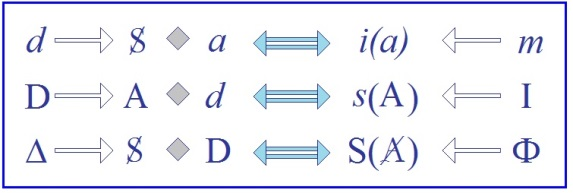

<!-- id: s5-17-0002 -->

J’écris cela au tableau pour commencer, pour éviter que je ne l’écrive incorrecte­ment ou incomplètement quand j’aurai à m’y référer. J’espère au moins pouvoir éclairer l’ensemble de ces trois formules d’ici la fin de notre discours d’aujourd’hui. Pour reprendre les choses un petit peu où je les ai laissées la dernière fois, j’ai pu constater
\- non sans satisfaction - que certains de mes propos n’avaient pas été sans pro­voquer quelque émotion.

<!-- id: s5-17-0003 -->

Nommément pour ce que je semblais avoir pu endosser des opinions de tel ou tel psychanalyste féminin qui avait cru devoir avancer cette opinion que certaines analyses de femmes ne gagnaient pas forcément à être pous­sées jusqu’à leur terme pour la raison, par exemple, que le progrès même de l’*analyse* pouvait - lesdits sujets en analyse - les priver, jusqu’à un certain point, de leurs relations proprement sexuelles. Je veux dire que la suite ou l’avancement de l’*analyse* pouvait menacer une certaine jouissance conquise et acquise.

<!-- id: s5-17-0004 -->

À la suite de quoi on m’a demandé si j’endossais cette formule, à savoir si l’ana­lyse devait en effet s’arrêter

<!-- id: s5-17-0005 -->

en un certain point pour des raisons en quelque sorte qui seraient situées en dehors des lois de son progrès même.
Je répondrai à ceci que tout dépend de ce qu’on considère comme étant le but de l’analyse. Non pas son but externe, mais ce qui la règle, si l’on peut dire, théoriquement.

<!-- id: s5-17-0006 -->

Il est bien certain qu’une perspective de l’analyse qui est celle d’un ajustement à la réalité, cet ajustement à la réalité étant considéré comme quelque chose qui est impliqué dans la notion même du développement de l’analyse,
je veux dire qu’il serait donné dans la condition de l’homme ou de la femme qu’une pleine élucidation
de cette condition doive le conduire obligatoirement à une *adaptation* en quelque sorte préformée, harmonieuse,
c’est une hypothèse, et une hypothèse qu’à la vérité rien dans l’expérience ne vient justifier.

<!-- id: s5-17-0007 -->

Autrement dit, pour éclairer ma lanterne et employer des termes qui sont ceux mêmes qui reviendront aujourd’hui, cette fois dans un sens tout à fait concret puis­qu’il s’agit de la femme, et à la vérité, c’est là un point tout à fait sensible de la théo­rie analytique, à savoir celle de son développement, de son adaptation propre à un certain ordre,
et assurément qui est de l’ordre humain, ne semble-t-il pas tout de suite bien certain qu’il convient, pour ce qui est
de la femme, de ne pas confondre :

<!-- id: s5-17-0008 -->

- ce qu’elle désire - je donne à ce terme « *désir* » son sens plein - avec ce qu’elle demande,
  <!-- -->

<!-- id: s5-17-0009 -->

- de ne pas non plus confondre ce qu’elle demande avec ce qu’elle veut, au sens où l’on dit que :
  « *ce que femme veut, Dieu le veut* ».

<!-- id: s5-17-0010 -->

Ces simples rappels, sinon d’évidence du moins d’expérience, peuvent être des­tinés à montrer que la question

<!-- id: s5-17-0011 -->

que l’on pose de savoir ce qu’il s’agit de réaliser dans l’analyse n’est pas quelque chose qui soit simple. La dernière fois si ceci est venu en quelque sorte latéralement dans notre dis­cours, ce dont nous parlions, ce à quoi je désirais
vous mener, ce sur quoi je vais vous ramener aujourd’hui pour en donner une formule plus généralisée
et qui me servira dans la suite de repère dans la critique des identifications fondamentales, normatives précisément, de l’homme et de la femme, ce que je vous ai amené la dernière fois, c’était un aperçu sur ce que nous devons considérer comme étant cette sorte d’*identification* qui produit l’*idéal du moi* en tant qu’il est *le point d’issue, le point pivot,*
*le point d’aboutissement* de cette crise de l’*œdipe* autour de laquelle s’est initiée l’ex­périence analytique,

<!-- id: s5-17-0012 -->

et autour de laquelle elle ne cesse plus de tourner, encore qu’elle prenne des positions de plus en plus centrifuges.

<!-- id: s5-17-0013 -->

Et j’ai insisté sur quelque chose qui pouvait se dire ainsi : que toute identification du type *idéal du moi* était une certaine mise en rapport du sujet à certains signifiants dans l’Autre, ce que j’ai appelé *insignes,* et que ce rapport venait en somme à se greffer lui–même sur un autre désir que sur celui qui avait confronté les deux termes du sujet
et de l’Autre en tant qu’il est porteur de ces *insignes*. Voilà à peu près à quoi cela se résumait. Ce qui, bien entendu,
n’a pas *satisfait* tout le monde, encore que, parlant à tel ou tel, je n’avais donné comme référence que ceci.

<!-- id: s5-17-0014 -->

Ne voyez-vous pas par exemple, ce qui d’ailleurs est indiqué comme un fait de premier plan par FREUD
aussi bien que par tous les auteurs, que c’est dans la mesure où une femme fait une *identification* à son père,
que dans ses rapports avec son mari, elle lui fait tout le grief qu’elle avait fait à sa mère ?

<!-- id: s5-17-0015 -->

Voici quelque chose, et il ne s’agit pas simplement de se fasciner sur cet exemple, il y a, bien entendu, d’autres *formes* sous lesquelles nous retrouverons la même formule, mais voilà quelque chose d’exemplaire qui illustre ce que je viens de vous dire : c’est dans la mesure où *l’identification s’est faite par l’assomption de certains signes, de signifiants caractéristiques* des rapports d’un sujet avec un autre, que ceci vient recouvrir et implique la mon­tée au premier plan des rapports

<!-- id: s5-17-0016 -->

de désir entre ce sujet et un tiers.

<!-- id: s5-17-0017 -->

Vous retrouvez le S sujet, le grand A et le petit *a.* Où est le grand A, où est le petit *a,* ici ? Peu importe !
L’important est qu’ils soient deux. Repartons de cette remarque à laquelle j’essaie de vous ramener et qui est quelque chose dont on pourrait dire qu’elle participe de la maxime de LA ROCHEFOUCAULD concernant les choses
qu’on ne saurait regarder en face : le soleil et la mort. Dans l’analyse, il y a des choses comme celles-là. Il est assez curieux que ce soit justement le point central de l’analyse que l’on regarde de plus en plus obliquement, et que l’on regarde par l’intermédiaire de lorgnettes théoriques de plus en plus lointaines. Le *complexe de castration* est de ceux-là.

<!-- id: s5-17-0018 -->

Observez ce qui se passe et ce qui s’est passé depuis les premières appréhensions que FREUD a eues.
Il y avait là quelque chose de pivot, quelque chose d’essentiel dans la formation du *sujet* : à savoir cette chose étrange, il faut bien le dire, et que l’on n’avait jamais promue jusque-là, jamais articulée, à savoir que dans la formation
du sujet se passe quelque chose autour d’une menace tout à fait précise, particularisée, paradoxale, archaïque,
voire provoquant l’horreur.

<!-- id: s5-17-0019 -->

À proprement parler, c’est *un moment décisif*, sans doute pathogène, mais aussi normatif, tourné autour d’une menace qui n’est pas, là, isolée, qui est cohérente avec ce rapport qui s’appelle le rap­port œdipien entre *le sujet, le père, la mère* :

<!-- id: s5-17-0020 -->

- le père faisant ici office de *porteur de la menace*,

<!-- id: s5-17-0021 -->

- la mère, objet du but, de visée d’un désir lui-même profondément caché.

<!-- id: s5-17-0022 -->

Vous retrouvez là, tout à fait à l’origine, ce qu’il s’agit précisément d’élucider. C’est que c’est dans ce rapport tiers que va se produire l’assomption de ces rapports à cer­tains *insignes* déjà indiqués en somme dans ce *complexe de castration*, mais d’une façon *énigmatique* puisqu’en quelque sorte ces *insignes* sont eux-mêmes mis, par rapport au sujet,
dans un rapport singulier. Ils sont - dit-on - menacés, et en même temps c’est tout de même eux qu’il s’agit

<!-- id: s5-17-0023 -->

de recueillir, de recevoir, et ceci dans un rap­port de désir concernant un tiers terme qui est celui de la mère.

<!-- id: s5-17-0024 -->

Au début, c’est bien cela que nous trouvons, et quand nous avons dit cela, nous sommes précisément devant
une énigme, devant quelque chose qui est à articuler, qui est à coordonner là-dessus par les praticiens.
Nous avons ce rapport complexe par définition et par essence, complexe à saisir, à articuler, et que nous rencontrons dans la vie de notre sujet. Qu’allons-nous trouver ?

<!-- id: s5-17-0025 -->

Mille formes, mille réflexions, une sorte de dispersion d’images, de rapports fondamentaux pour nous permettre

<!-- id: s5-17-0026 -->

d’en saisir toutes les inci­dences, tous les reflets psychologiques, toutes les multiples tâches psychologiques
qui sont portées dans l’expérience du sujet névrotique. Et alors, que se passe-t-il ?

<!-- id: s5-17-0027 -->

Il se passe ce phénomène que j’appellerai celui de la motivation psychologisante qui fera que pour rechercher
dans l’individu, dans le sujet lui-même, l’origine, le sens de cette crainte de la castration, nous arrivons à une série

<!-- id: s5-17-0028 -->

de *déplacements*, de *trans­positions* dans l’articulation de cette crainte de la castration qui ne font à peu près - je vais
me résumer - que s’étager ainsi : cette trace de la castration, qui est d’abord en relation avec l’objet du père,
la crainte du père, nous sommes d’abord amenés à la considérer dans son incidence et à nous apercevoir
de son rapport avec une tendance*,* un *désir* du sujet : celui de son intégrité corporelle. Et c’est autour de la notion
de crainte narcissique que celle de *la crainte de la castration* va être promue.

<!-- id: s5-17-0029 -->

Puis, sui­vant toujours, dans une ligne qui est forcément génétique, c’est-à-dire qui remonte aux origines à partir du moment où nous cherchons dans l’individu lui-même la genèse de ce qui ensuite se développe, nous trouvons, promue, mise au premier plan - parce qu’on a toujours du matériel, bien sûr, clinique pour saisir *les incarnations*
si l’on peut dire d’un certain effet, nous trouvons la crainte de l’organe féminin, d’une façon d’ailleurs ambiguë :

<!-- id: s5-17-0030 -->

- soit que ce soit lui qui devienne le siège de la menace contre l’organe incriminé,

<!-- id: s5-17-0031 -->

- soit au contraire qu’il soit le modèle de la disparition de cet organe.

<!-- id: s5-17-0032 -->

Plus loin, ce que nous allons trouver à l’origine de la crainte de castration, par un recul toujours plus grand où,
vous allez le voir, au dernier terme il me semble tout à fait frappant et singulier dans son aboutissement,
c’est ce qui va être craint comme avant *la castration*.

<!-- id: s5-17-0033 -->

Au dernier terme, c’est celui auquel nous sommes arrivés pro­gressivement et je ne vous referai pas aujourd’hui la liste des auteurs que nous trou­vons mais, pour le dernier, vous savez que c’est Mélanie KLEIN, ce qui est à l’origine
de *la crainte de la castration*, c’est le *phallus* lui-même*,* caché au fond de l’organe maternel, et perçu par l’enfant,
tout à fait aux origines, comme le *phallus* paternel, comme ayant son siège à l’intérieur du corps maternel.
C’est lui qui est redouté par l’enfant et par le sujet.

<!-- id: s5-17-0034 -->

Et - croyez-vous - c’est déjà assez frappant de voir apparaître, en quelque sorte en miroir, en face de l’organe menacé, cet organe menaçant, et d’une façon de plus en plus mythique à mesure qu’elle est plus reculée. Mais là, pour que
le dernier pas soit franchi, il faut en somme que l’organe paternel, à l’intérieur du sexe maternel, soit considéré comme menaçant. C’est parce que le sujet lui-même en a fait, aux sources de ce qu’on appelle *ses tendances agressives primordiales*, ses tendances sadiques pri­mordiales, en a fait l’arme idéale.

<!-- id: s5-17-0035 -->

Et tout revient, au dernier terme, à une sorte de *pur reflet de l’organe phallique*, considéré comme le *support d’une tendance pri­mitive* qui est celle *de la pure et simple agression*, le *complexe de castration* s’isolant, en somme, se réduisant à l’isolement d’une pulsion agressive primordiale partielle, en même temps déconnectée, semble-t-il dès lors. Et en effet, c’est bien tout l’effort des auteurs, ce qu’ils ont eu la plus grande peine, à partir de ce moment à réintégrer : ce qui concerne
*le complexe de castration* dans son contexte de complexe*,* à savoir de cela d’où il est parti, et qui profondément motivait son caractère central dans l’économie subjective dont il s’agissait à l’origine de l’exploration des *névroses*.
Et bien entendu, on sait à quels efforts les auteurs seront conduits pour restituer quand même, resituer à sa place,
ce qui apparaît en fin de compte, quand nous regardons les choses, comme un pur, simple et vain tour sur lui-même d’un système, d’un ensemble de concepts.

<!-- id: s5-17-0036 -->

Car en fin de compte, si nous examinons attentivement l’économie de ce que Mélanie KLEIN articule comme
se passant au niveau de cet *œdipe* précoce, ce qui est encore une sorte de contradiction dans les termes, c’est une façon de dire : « *l’œdipe pré-œdipien* », « *l’œdipe en tant qu’il est l’œdipe avant qu’aucun des personnages de l’œdipe ne soit apparu* »,

<!-- id: s5-17-0037 -->

ce que nous trouvons simplement articulé dans les signi­fiants interprétatifs dont elle se sert pour donner un nom

<!-- id: s5-17-0038 -->

à ces pulsions qu’elle ren­contre ou qu’elle croit rencontrer au dernier terme chez l’enfant, c’est qu’elle implique
dans ses propres signifiants à elle exactement toute la dialectique dont il s’agit à l’origine, à savoir la question
dont il s’agit et qu’il faut reprendre au départ et dans son essence, qui est ceci : si la castration a ce caractère essentiel, si nous la pre­nons pour autant qu’elle est promue par *l’expérience* et *la théorie* analytiques et par FREUD - ceci depuis son départ - sachons maintenant voir ce qu’elle veut dire.

<!-- id: s5-17-0039 -->

Avant d’être *crainte*, avant d’être *vécue*, avant d’être *psychologisable*, qu’est-ce que cela veut dire ? *La castration n’est pas*
*une castration réelle.* Cette castration est liée, avons-nous dit, à un désir. Elle est même liée à l’évolu­tion, au progrès,

<!-- id: s5-17-0040 -->

à la maturation du désir chez le sujet humain. Si elle est castration, il est bien certain d’autre part que le lien
à cet organe, si difficile, d’ailleurs dans la notion de *complexe de castration,* à bien centrer, ce n’est pas une castration s’adres­sant aux organes génitaux dans leur ensemble.

<!-- id: s5-17-0041 -->

C’est bien pour cela d’ailleurs que chez la femme elle ne prend pas l’aspect d’une menace contre les organes génitaux en tant que tels mais en tant qu’autre chose, justement en tant que *phallus*. De même chez l’homme, on a pu légitimement poser la question de savoir s’il fallait, dans cette notion de *complexe de castration,* isoler le pénis comme tel ou y comprendre le pénis et les testicules ? À la vérité, bien entendu, c’est bien ce qui désigne que ce dont il s’agit
est autre chose que *ceci* ou *cela* : c’est quelque chose qui a un certain rapport avec les organes mais un certain rapport dont *le caractère* justement *signifiant* déjà, dès l’origine, ne fait pas de doute. Et c’est ce *caractère signifiant* qui domine.

<!-- id: s5-17-0042 -->

Disons qu’à tout le moins, un minimum doit être retenu dans ce qu’est, dans son essence, le *complexe de castration* :
le rapport d’un *désir*, d’une part, avec d’autre part, ce que j’appellerai dans cette occasion, *une marque.* Pour que le *désir*, nous disent l’expérience freudienne et la théorie analytique, tra­verse heureusement certaines *phases*, arrive à *maturité*,

<!-- id: s5-17-0043 -->

il faut que quelque chose d’aussi problématique à situer, que le *phallus* soit marqué de ce quelque chose qui fait
*qu’il n’est maintenu, conservé, que pour autant qu’il a traversé la menace de castra­tion* à proprement parler.

<!-- id: s5-17-0044 -->

Et ceci doit être maintenu comme le minimum essentiel au-delà duquel :

<!-- id: s5-17-0045 -->

- nous partons dans *les synonymies*,

<!-- id: s5-17-0046 -->

- nous partons dans *les glisse­ments*,

<!-- id: s5-17-0047 -->

- nous partons dans *les équivalences*,

<!-- id: s5-17-0048 -->

- nous partons aussi, du même coup, dans *les obscurités*.

<!-- id: s5-17-0049 -->

Littéralement, nous ne savons plus ce que nous disons si nous ne retenons pas ces caractéristiques pour essentielles.
Et ne vaut-il pas mieux, d’abord et avant tout, se diri­ger vers le rapport de ces deux pôles, disons, du *désir* à la *marque,* avant d’essayer d’aller le chercher dans les diverses façons dont cela, pour le sujet, s’incarne, dans la rai­son

<!-- id: s5-17-0050 -->

d’une liaison qui, à partir du moment où nous quittons ce point de départ, va devenir de plus en plus énigmatique,
de plus en plus problématique, et bientôt de plus en plus éludée ?

<!-- id: s5-17-0051 -->

J’insiste sur ce caractère de *marque* qui a d’ailleurs…

<!-- id: s5-17-0052 -->

> dans toutes les autres mani­festations que les manifestations analytiques, interprétatives, significatives, et bien certainement dans tout ce qui l’incarne cérémoniellement, rituellement, sociologiquement
> …ce caractère d’être le signe de tout ce qui supporte cette relation castratrice dont nous avons commencé

<!-- id: s5-17-0053 -->

à apercevoir l’émergence anthropologique par l’inter­médiaire de l’analyse.

<!-- id: s5-17-0054 -->

N’oublions pas, jusque-là *les signes*, *les incarnations religieuses* par exemple, où nous reconnaissons *ce complexe de castration* : la circoncision par exemple, pour l’appeler par son nom, ou encore telle ou telle forme d’inscription, de *marque*
dans les rites de puberté, de tatouage, de tout ce qui produit les marques, imprime sur le sujet, en liaison avec
une certaine phase qui, d’une façon non ambiguë, se présente comme une phase d’accession à un certain niveau,
à un certain étage du désir, tout cela se présente toujours comme *marque* et impression. Et vous me direz :

<!-- id: s5-17-0055 -->

> « *Voilà, nous y sommes ! La marque, pas difficile de la ren­contrer !* »

<!-- id: s5-17-0056 -->

Déjà dans l’expérience, quand on a des troupeaux, chaque berger a sa petite marque de façon à distinguer ses brebis de celles des autres, et ce n’est pas une remarque si bête. Il y a bien un certain rapport, ne serait-ce que de ceci :
c’est qu’en tout cas nous y saisirions déjà que la *marque* se présente tout de même dans *une cer­taine* *transcendance*

<!-- id: s5-17-0057 -->

par rapport à la constitution du troupeau. Est-ce que cela doit nous suffire ? C’est bien vrai d’une certaine façon,
par exemple que la circoncision se présente comme constituant un certain troupeau, *le troupeau des élus*, fils de Dieu.

<!-- id: s5-17-0058 -->

Est-ce que nous ne faisons que retrouver cela ? Sûrement pas ! Ce que l’expé­rience analytique, et ce que FREUD,

<!-- id: s5-17-0059 -->

au départ, nous apportent :

<!-- id: s5-17-0060 -->

- c’est qu’il y a un rap­port étroit, intime, entre le désir et la marque,

<!-- id: s5-17-0061 -->

- c’est que la marque n’est pas simple­ment là comme signe de reconnaissance pour le berger, dont nous aurions de la peine à savoir où il est dans l’occasion, mais quand il s’agit de l’homme ceci veut dire que l’être vivant *marqué*, a ici *un désir* qui n’est pas sans un certain *rapport intime* avec cette *marque*.

<!-- id: s5-17-0062 -->

Il ne s’agit pas de s’avancer trop vite, ni de dire que c’est cette *marque* qui modi­fie le *désir*. Il y a peut-être dès l’origine dans ce *désir* une béance qui permet à cette *marque* de prendre son *incidence spéciale*, mais ce qu’il y a de certain,
c’est qu’il y a le rapport le plus étroit entre ce qui caractérise ce désir chez l’homme et l’incidence, le rôle et *la fonction de la marque*. Nous retrouvons cette confrontation du *signifiant* et du *désir* qui est ce autour de quoi doit porter
toute notre interrogation ici.

<!-- id: s5-17-0063 -->

Je ne voudrais pas m’éloigner trop, mais ici quand même une petite parenthèse : n’oublions pas que la question ici débouche bien évidemment sur la fonction de signifiant chez l’homme, et que ce n’est pas ici que vous en entendez parler pour la première fois. Si FREUD a écrit *Totem et tabou,* si cela a été pour lui un besoin et une satisfaction essentielle que d’articuler ce *Totem et tabou* - reportez-vous au texte de JONES pour bien voir l’importance que cela avait pour lui, et qui n’était pas simple­ment une importance de psychanalyse appliquée - de retrouver, agrandi

<!-- id: s5-17-0064 -->

aux dimensions du ciel, le petit animal humain auquel il se trouvait avoir affaire dans son cabinet :
ce n’est pas « *le chien céleste* » par rapport au « *chien terrestre* » comme dans SPI­NOZA, c’est que *c’est un mythe tellement essentiel que pour lui ce n’est pas un mythe*.

<!-- id: s5-17-0065 -->

Cela veut dire quoi le *Totem et tabou* ? C’est que nous sommes nécessairement amenés, si nous voulons comprendre quelque chose qui est *l’interrogation particulière de* FREUD au niveau de cette expé­rience de l’*œdipe* chez ses malades,

<!-- id: s5-17-0066 -->

c’est que nous sommes amenés nécessairement à ce thème du « *meurtre du père* ». Bien entendu vous savez, là,

<!-- id: s5-17-0067 -->

que FREUD *ne s’inter­roge pas*. Qu’est-ce que cela peut signifier que pour concevoir en somme un passage, qui est
le passage de la nature à l’humanité, il faille qu’on passe par *le meurtre du père* ? Selon sa méthode, qui est une méthode d’observateur, de naturaliste, il groupe, il fait *foisonner* autour de cette sorte de point de concours, de carrefour,
auquel il arrive, tous les documents, tout ce que lui apporte l’information ethnologique.

<!-- id: s5-17-0068 -->

Et bien entendu, que voyons nous *foisonner au premier chef* ? La contribution parti­culière de son expérience rencontre

<!-- id: s5-17-0069 -->

le matériel ethnologique. Peu importe qu’il soit plus ou moins désuet maintenant, cela n’a aucune importance.
Le fait que ce soit *la fonction de la phobie*, avec le thème du *totem*, qui soit là le point où il se retrouve, où il se satisfait, où il voit se conjuguer *les signes* dont il suit la trace, tout cela nous montre bien que ceci est absolument indiscernable d’un progrès qui met au premier plan cette fonction du signifiant. *La phobie c’est un symptôme où vient au premier plan*
*-* d’une façon isolée, et promu comme tel *-* *le signifiant*. Je passais l’année dernière à vous l’expliquer, à vous montrer
*à quel point le signifiant d’une phobie est quelque chose qui a trente six mille significations pour le sujet*. C’est le point clé :
*c’est le signifiant qui manque pour que les significations puissent se tenir -* au moins pour un temps - *un peu tran­quilles*.

<!-- id: s5-17-0070 -->

Sans cela le sujet en est littéralement submergé.

<!-- id: s5-17-0071 -->

De même, le *totem* est bien cela aussi : *le signifiant à tout faire*, *le signifiant-clé*, le signifiant grâce auquel tout s’ordonne,

<!-- id: s5-17-0072 -->

et principalement le sujet, car dans ce signi­fiant le sujet trouve ce qu’il est. Et c’est au nom de ce *totem* que pour lui s’ordonne aussi ce qui est interdit. Mais qu’est-ce que ceci, si l’on peut dire, nous *voile*, nous cache au dernier terme ? C’est ce « *meurtre du père* » lui-même, pour que ce soit autour de lui que puisse se faire la conversion,
la révolution grâce à quoi les jeunes mâles de la horde vont voir s’ordonner quelque chose qui va être la loi primitive, c’est-à-dire *l’interdiction de l’inceste*. Ceci nous cache simplement ce *lien étroit* qu’il y a entre :

<!-- id: s5-17-0073 -->

- la mort,

<!-- id: s5-17-0074 -->

- et l’apparition du signifiant.

<!-- id: s5-17-0075 -->

Car n’oubliez quand même pas ceci, c’est que dans son train ordi­naire, chacun sait que la vie ne s’arrête guère

<!-- id: s5-17-0076 -->

aux cadavres qu’elle fait, les grands pois­sons mangent les petits, ou même, les ayant tués, ne les mangent pas,

<!-- id: s5-17-0077 -->

mais il est cer­tain que le mouvement de la vie nivelle ce qu’elle a devant soi à abolir, et c’est déjà là tout le problème, de savoir en quoi une mort est mémorisée, même si cette mémo­risation est quelque chose qui reste en quelque sorte *implicite*, c’est-à-dire si, comme tout nous le laisse apparaître, il est de sa nature, à cette mémorisation,
que ce soit oublié par l’individu, qu’il s’agisse du « *meurtre du père* » ou du meurtre de MOÏSE.

<!-- id: s5-17-0078 -->

Il est essentiellement de sa nature d’oublier ce qui reste absolument nécessaire *comme la clé, comme le point pivot* autour duquel doit tourner notre esprit : c’est qu’un cer­tain lien a été fait *signifiant*, qui fait que cette mort existe autrement qu’à proprement parler dans le réel, dans le foisonnement de la vie.

<!-- id: s5-17-0079 -->

*Il n’y a pas d’existence de la mort*, il y a des *morts*, et voilà tout ! Et quand ils sont morts, personne dans la vie
n’y fait plus attention. En d’autres termes, qu’est-ce qui fait :

<!-- id: s5-17-0080 -->

- et la passion de FREUD quand il écrit *Totem et tabou,*

<!-- id: s5-17-0081 -->

- et *l’effet fulgurant* de la production *d’un livre* qui apparaît et qui est très généralement rejeté et vomi ?

<!-- id: s5-17-0082 -->

C’est-à-dire que chacun se met à dire :

<!-- id: s5-17-0083 -->

- *Qu’est-ce qu’il nous raconte celui là ?*

<!-- id: s5-17-0084 -->

- *D’où vient-il ?*

<!-- id: s5-17-0085 -->

- *De quel droit nous raconte-t-il cela ?*

<!-- id: s5-17-0086 -->

- *Nous, ethnographes, nous n’avons jamais vu cela !*

<!-- id: s5-17-0087 -->

Ce qui n’empêche pas que c’est un des événements tout à fait capitaux de notre siècle, et qu’autour de cela

<!-- id: s5-17-0088 -->

effecti­vement *toute l’inspiration du travail critique, ethnologique, littéraire, anthropolo­gique*, en est profondément transformée. Qu’est-ce que cela veut dire, si ce n’est que FREUD y conjugue deux choses : *il conjugue le désir avec le signifiant.*
Il les conjugue comme on dit qu’on conjugue un verbe. Il fait entrer la catégorie de cette *conjugaison* au sein
d’une pensée qui jusqu’à lui**,** concernant l’homme, reste une pensée que j’appellerai *une pensée académisante*, désignant par là une certaine filiation philosophique antique qui, depuis *le pla­tonisme* jusqu’aux *sectes stoïciennes* et *épicuriennes* et, passant à travers *le christia­nisme*, tend profondément :

<!-- id: s5-17-0089 -->

- *à oublier*, à éluder ce rapport organique du désir avec le signifiant,

<!-- id: s5-17-0090 -->

- *à le situer*, à l’exclure du signifiant,

<!-- id: s5-17-0091 -->

- *à le réduire*, à l’expliquer, à le motiver dans une certaine économie du plaisir,

<!-- id: s5-17-0092 -->

- *à éluder* ce qu’il y a en lui d’absolument *problématique*, irréductible, et à proprement parler *pervers*,

<!-- id: s5-17-0093 -->

- *à éluder* ce qui est le carac­tère essentiel, vivant, des manifestations du désir humain,

<!-- id: s5-17-0094 -->

> au premier plan duquel nous devons mettre ce caractère non seulement inadapté, inadaptable mais fonda­mentalement perverti, marqué.

<!-- id: s5-17-0095 -->

C’est la situation de ce lien entre *le désir* et *la marque*, entre *le désir* et *l’insigne*, entre *le désir* et *le signifiant*,
que *nous sommes ici en train* de nous efforcer *de faire*. Voici les *trois petites formules* que je vous ai écrites :

<!-- id: s5-17-0096 -->

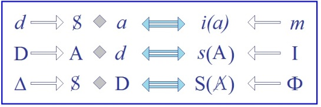

<!-- id: s5-17-0097 -->

Je veux simplement aujourd’hui les introduire, vous dire ce qu’elles veulent dire, parce que nous ne pourrons pas
aller plus loin. Mais ces formules sont - à mon gré - celles autour desquelles vous pourrez, non seulement essayer d’articuler quelque chose du problème que je viens de vous proposer, mais articuler toutes les [*vagations*](http://www.cnrtl.fr/definition/dmf/vagation),
voire même les divagations de la pensée analytique concernant ce qui reste toujours *notre problème fondamental*.

<!-- id: s5-17-0098 -->

En fin de compte n’oublions pas qu’*il est le problème du désir*. Commençons d’abord par dire ce que veulent dire
les lettres qui sont là :

<!-- id: s5-17-0099 -->

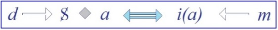

<!-- id: s5-17-0100 -->

- le *d* est le *désir*,

<!-- id: s5-17-0101 -->

- le S c’est le *sujet*,

<!-- id: s5-17-0102 -->

- le petit *a* c’est *le petit autre*, c’est *l’autre* en tant qu’il est *notre semblable*, *l’autre* en tant que son image \[*i(a)*\] nous retient, nous captive, nous sup­porte, et autour de laquelle nous constituons ce premier ordre d’*identification* que je vous ai défini comme l’*identification narcissique* qui est *m,* le *moi*.

<!-- id: s5-17-0103 -->

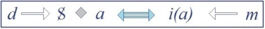 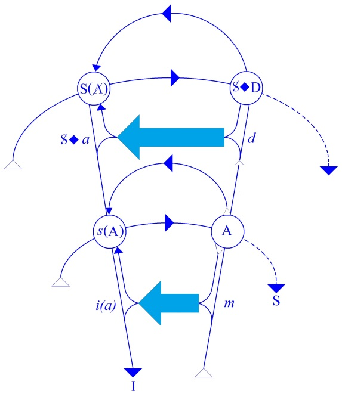

<!-- id: s5-17-0104 -->

Cette première ligne vous met dans un certain rapport dont les flèches vous indiquent qu’il ne peut pas être parcouru jusqu’au bout en partant de chaque extré­mité, qu’il s’arrête - en partant de chaque extrémité - au point précis où
la flèche directrice elle-même en rencontre une autre de signe opposé, mais met dans un certain rapport l’*identification moïque* ou *narcissique* avec d’autre part la fonction du *désir*. Je vais en reprendre le commentaire.

<!-- id: s5-17-0105 -->

La deuxième ligne concerne ce sur quoi j’ai articulé tout mon discours *au début de cette année*, et pour autant
que j’ai essayé de vous faire voir dans *le trait d’esprit*, *un certain rapport fondamental du désir*, non pas avec le *signifiant*
comme tel, mais *avec la parole, c’est à savoir, la demande*.

<!-- id: s5-17-0106 -->

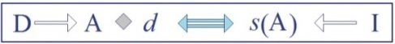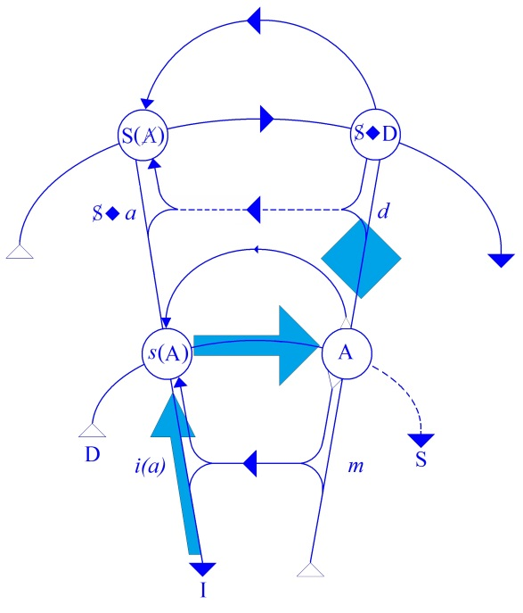

<!-- id: s5-17-0107 -->

- Le D, ici écrit, veut dire la *demande*.

<!-- id: s5-17-0108 -->

- Le A qui suit, c’est le grand *Autre*, le grand Autre en tant qu’il est *le lieu, le siège, le témoin* auquel le sujet se réfère dans son rapport avec un *a* quelconque, comme étant *le lieu de la parole*. Il n’est pas besoin ici de rappeler combien, depuis long­temps et en y revenant sans cesse, j’ai articulé la nécessité de ce grand Autre comme le lieu de la parole articulée comme telle.

<!-- id: s5-17-0109 -->

- Ici, on retrouve le petit *d.*

<!-- id: s5-17-0110 -->

- Ici, vous rencontrez un signe pour la première fois, c’est le petit *s.* Le petit *s* a ici la même signifi­cation qu’il a d’habitude dans nos formules à savoir celle du *signifié*. Le *s*(A) veut dire : « *ce qui dans l’Autre est signifié,*
  *ce qui dans l’Autre, pour moi sujet, prend valeur de signifié à l’aide du signifiant* », c’est-à-dire à proprement parler ce que nous avons appelé tout à l’heure les *insignes*.

<!-- id: s5-17-0111 -->

- C’est en relation avec ces *insignes* de l’Autre que se produit l’*identification* qui a pour fruit et résultat la constitution, dans le sujet, de I qui est l’*idéal du moi*. Rien déjà que par la constitution de *ces formules* vous avez présentifié *qu’il n’y a d’accession de signes à l’identification de l’idéal du moi que quand le terme du grand Autre est entré en ligne de compte.*

<!-- id: s5-17-0112 -->

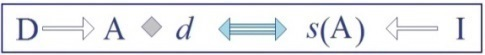

<!-- id: s5-17-0113 -->

- Vous retrouvez ici le petit *d.*

<!-- id: s5-17-0114 -->

*La troisième ligne*, autrement dit Δ :

<!-- id: s5-17-0115 -->

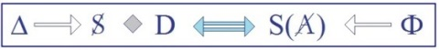

<!-- id: s5-17-0116 -->

est celle qui concerne le problème que j’es­saie d’articuler aujourd’hui devant vous, c’est à savoir qu’elle essaie d’articuler en une chaîne repère, comme les précédentes, ceci : le Δ c’est précisément ce sur quoi nous nous interrogeons, à savoir ce ressort même par quoi le sujet humain est mis dans un certain rapport au signifiant,
ceci dans son essence de *sujet*, de sujet total, de sujet dans son caractère complètement ouvert, problématique, énigmatique, et c’est ce qu’exprime cette formule. Vous voyez ici le sujet de nouveau revenir dans son rapport
avec le fait que son *désir* passe par la *demande* \[S **◊** D\], qu’il le *parle*, et que cela a certains effets, c’est simple­ment

<!-- id: s5-17-0117 -->

ce qui est symbolisé ici.

<!-- id: s5-17-0118 -->

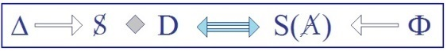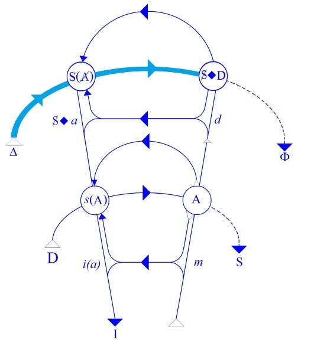

<!-- id: s5-17-0119 -->

Ici, vous avez le grand S qui est, comme d’habitude, la lettre par laquelle nous désignons le signifiant. Cette formule S(A) explique que S est quelque chose que je vais essayer de vous dire, et précisément ce que Φ, le *phallus*, réalise.

<!-- id: s5-17-0120 -->

Autrement dit, que le *phallus* est ce *signifiant* qui introduit dans A quelque chose de *nouveau*, et qui ne l’introduit
*que dans* A et *au niveau de* A, et qui est ce grâce à quoi cette formule va prendre son éclairage *des effets de signifiant*
en ce point précis d’incidence sur l’autre. C’est à savoir, ce que cette *formule* va nous per­mettre d’éclairer

<!-- id: s5-17-0121 -->

de ce qui arrive de par l’existence des rapports qui sont ainsi arti­culés.

<!-- id: s5-17-0122 -->

Reprenons maintenant ce dont il s’agit. Le rapport de l’homme au *désir* n’est pas un rapport pur et simple de *désir*,
ce n’est pas en soi un *rapport à l’objet*. Si ce rap­port à l’objet était d’ores et déjà institué, il n’y aurait pas de problème pour l’analyse. Les hommes, comme sont présumés aller la plupart des animaux, iraient à leur objet, il n’y aurait pas
ce rapport second, si je puis dire, de l’homme au fait qu’il est animal désirant, et dont tout ce qui se passe au niveau que nous appelons pervers consiste en ceci : *qu’il jouit de son désir.*

<!-- id: s5-17-0123 -->

Si toute l’évolution des origines du désir tourne autour de ces faits vécus qui s’ap­pellent la relation, disons *masochiste*,

<!-- id: s5-17-0124 -->

c’est celle qu’on nous fait, dans l’ordre géné­tique, sortir la première, mais on y vient par une sorte de régression
si je puis dire, celle qui s’offre comme la plus exemplaire, comme la plus « *pivot* », c’est le rapport dit *sadique*,
ou le rapport *scoptophillique*.

<!-- id: s5-17-0125 -->

Mais il est tout à fait clair que c’est par une réduction, un maniement et une décomposition artificielle, seconde
de ce qui est donné dans l’expérience, que nous les isolons sous forme de pulsions qui se substi­tuent l’une à l’autre

<!-- id: s5-17-0126 -->

et qui s’équivalent. *Le rapport scoptophillique*, en tant qu’il conjugue exhibition et voyeurisme, est toujours ambigu :
*le sujet se voit être vu*, ou voit le sujet comme *vu*, mais non pas, bien entendu, *le voit purement et simplement*. C’est dans
la jouissance, dans l’espèce d’irradiation ou de phosphorescence qui se dégage du fait que *le sujet* se trouve dans une position venue d’on ne sait quelle béance primitive en quelque sorte extraite de son rapport d’implication à l’objet.
Et de là il se saisit fondamentalement comme patient dans cette relation. D’où le fait que nous trouvons, au fond

<!-- id: s5-17-0127 -->

de cette explo­ration analytique du désir, le *masochisme*. Le *masochisme*, c’est que le sujet se saisit comme *souffrant*,
si l’on peut dire, dans son existence d’être vivant, comme, là, souffrant comme étant sujet du désir.

<!-- id: s5-17-0128 -->

*Où est maintenant le problème ?* Ceci, c’est le côté qui ne restera à tout jamais que caractère irréductible, côté tout à fait faux du désir humain, par rapport à aucune réduction et adaptation, et aucune *expérience psychanalytique* - elle - n’ira contre. Le sujet *ne satisfait pas* simplement *un désir*, *il jouit de désirer*, et c’est une dimension essentielle de *sa jouissance*.
Omettre cette sorte de donnée primitive, à laquelle, je dois dire, l’investigation dite *existentialiste* a apporté certaines lumières, a remis dans un certain éclairage ce que je vous articule là comme je peux, en pensant simplement que
vous vous référez assez à notre expérience de chaque jour pour que ceci ait un sens qui est développé, tout au long
de pages diversement magistrales, par Monsieur SARTRE dans *L’Être et le Néant.* Ce n’est pas toujours d’une absolue rigueur, philosophiquement parlant, mais c’est sûrement d’un talent littéraire incontestable.

<!-- id: s5-17-0129 -->

Le frappant, c’est que des choses de cet ordre n’aient pu être articulées et développées avec tellement d’éclat
que depuis justement que l’analyse a, en quelque sorte, donné droit de cité à cette dimen­sion du désir.

<!-- id: s5-17-0130 -->

Monsieur JONES, dont l’utilité et la fonction dans l’analyse aura été en fonction directement proportionnelle
avec ce qu’il ne comprenait pas, a très vite essayé d’articuler le *complexe de castration* en lui donnant un équivalent.
Pour tout dire, *le signifiant phallique* a fait pour lui, et tout au long de son existence d’écrivain et d’ana­lyste,

<!-- id: s5-17-0131 -->

l’objet de ce qu’on pourrait appeler chez lui *une véritable phobie.*

<!-- id: s5-17-0132 -->

Car vraiment ce qu’il a écrit de meilleur, qui culmine dans son article sur « *La phase phallique »,* consiste précisément
à essayer d’articuler, à dire pourquoi ce sacré *phallus* qu’on trouve là sous nos pas à tout instant, pourquoi ce privilège pour cet objet d’ailleurs inconsistant alors qu’il y a des choses tout aussi intéressantes, le vagin par exemple ?
Et en effet, il a raison cet homme : il est bien clair que cet *objet* n’a pas moins d’in­térêt que *le phallus* et nous le savons ! Seulement ce qui l’étonne, c’est que l’un et l’autre n’ont pas la même fonction.

<!-- id: s5-17-0133 -->

Il était strictement condamné à ne rien y com­prendre, dans la mesure même où dès le départ, dès qu’il essayait d’articuler ce que c’était, ce *complexe de castration* chez FREUD, il a éprouvé le besoin de lui donner un équivalent. Déjà, on voit le départ du premier jet, qui surgit là au lieu de retenir ce qu’il y a peut-être de coriace, d’irréductible dans le *complexe de castration*, à savoir *le signifiant phallus*. Il n’y était pas sans une certaine orientation.
Il n’avait peut-être qu’un tort, c’est de penser que cette phrase par laquelle il termine son article sur la *Phallic phase,*
à savoir « *Dieu les créa homme et femme* » - c’est là-dessus qu’il conclut, montrant bien les origines bibliques
de sa conviction - et puisque Dieu les a créés « *homme et femme* », c’est donc que c’est bien fait pour aller ensemble.
Et il faut que ce soit tout de même à cela que ça aboutisse ou *que ça dise pourquoi*.

<!-- id: s5-17-0134 -->

Or justement, nous sommes dans l’analyse pour nous apercevoir que quand on demande que « *ça dise pourquoi* »,
on entre dans toutes sortes de complications. Et c’est pour cela qu’au départ il a substitué au terme de *castration*

<!-- id: s5-17-0135 -->

ce terme d*’*ἀϕάνι*σ*ις \[aphanisis\]*,*qu’il a cherché dans le dictionnaire grec - il faut bien dire qu’il ne se pré­sente pas comme un mot des plus employés chez les auteurs - et qui veut dire *dis­parition*. Disparition de quoi ?

<!-- id: s5-17-0136 -->

Disparition du désir. C’est ce que *le sujet* redoute­rait dans le *complexe de castration*, au dire de Monsieur JONES.
Et alors de son petit pas allègre de *personnage shakespearien*, il ne semblait pas du tout se douter que c’était déjà
un énorme problème qu’un être vivant puisse se douter comme d’un danger, non pas de la disparition du *manque*,
du sevrage de son objet, mais de son *désir*, car il n’y a pas d’autre moyen de faire d*’*ἀϕάνι*σ*ις \[aphanisis\] un *équivalent* du *complexe de castration*, que de le définir comme il le définit, à savoir : « *la disparition du désir* ».

<!-- id: s5-17-0137 -->

N’y a-t-il donc pas là *quelque chose qui soit absolument infondé* ? Mais que ce soit déjà quelque chose de deuxième
ou de troisième degré par rapport à ce que nous pouvons appeler un rapport convenable en termes de besoin,
c’est ce qui semble ne pas être douteux et ce dont il n’a pas l’air le moins du monde de se douter.

<!-- id: s5-17-0138 -->

Ceci dit, en admettant même déjà que soient résolues toutes les complications que suggère la simple *position*
du problème en ces termes, il reste que le problème est de savoir comment dans ce rapport à l’Autre, en tant que c’est dans l’Autre et dans le regard de l’Autre, ce n’est pas *pour rien* que *je mets au cœur la position scoptophillique* :
c’est parce qu’effectivement elle est *au cœur de cette position*, mais aussi bien dans l’attitude de l’Autre. Je veux dire qu’il n’y a pas de position *sadique* qui, d’une certaine façon, ne s’accompagne, pour être qualifiable à proprement parler
de « *sadique »,* d’une certaine *identification masochiste*.

<!-- id: s5-17-0139 -->

Donc le problème est de savoir ce qui, dans ce rapport de son être à lui-même déta­ché où est le sujet humain, le met dans cette position tout à fait particulière vis-à-vis de l’Autre, où ce qu’il saisit, où ce dont il jouit, c’est d’autre chose que du rapport à l’objet, mais d’un rapport à son désir, il s’agit en fin de compte de savoir ce que le *phallus* comme tel vient faire là-dedans.

<!-- id: s5-17-0140 -->

C’est là qu’est le problème, et avant de chercher à l’engendrer, à l’imaginer par une reconstitution génétique fondée sur des références qui sont ce que j’appellerai « *des références fondamentales de l’obscurantisme moderne »*, à savoir des formules comme celle-ci, qui sont, à mon avis, excessivement plus imbéciles que tout ce que vous pouvez trouver
dans ces petits livres qu’on vous apprend sous le terme d’ins­truction religieuse ou de catéchisme, à savoir : « *l’ontogenèse reproduit la phylogénèse* »*.*

<!-- id: s5-17-0141 -->

Quand nos arrière-petits-enfants sauront que de notre temps cela suffisait à expliquer des tas de choses, ils se diront :
« *C’est tout de même une drôle de chose que l’homme !* », et ils ne s’apercevront d’ailleurs pas de ce qu’ils auront à la place
à ce moment là. Il s’agit donc de savoir ce que *le phallus* vient faire là.

<!-- id: s5-17-0142 -->

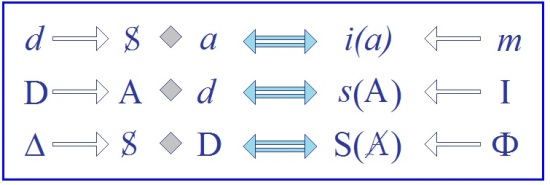

<!-- id: s5-17-0143 -->

Posons pour aujourd’hui ceci : que l’existence de cette troisième ligne, à savoir que le *phallus* en effet, est quelque chose qui joue un certain rôle, un rôle de *signifiant*. Qu’est-ce que cela veut dire ? Partons de la deuxième ligne,
qui veut dire ceci : que s’il y a un certain rapport de l’homme au *petit autre* qui est structuré, constitué comme
ce que nous venons d’appeler *le désir humain*, au sens où ce *désir* est déjà fondamentalement quelque chose de pervers,
toutes *ses demandes* seront marquées d’un certain *rapport*.

<!-- id: s5-17-0144 -->

C’est là le sens de ce que nous voyons dans *ce nouveau petit symbole losangique* que vous retrouvez sans cesse dans cette formule et qui implique simplement que tout ce dont il s’agit ici est commandé par quelque chose qui est justement ce rapport qua­dratique que nous avons mis depuis toujours au fondement de notre articulation du problème
et qui dit qu’il n’y a pas de S concevable ni articulable, ni possible, sans ce rapport ternaire *a → a’→* A.
C’est tout ce que cela veut dire.

<!-- id: s5-17-0145 -->

> 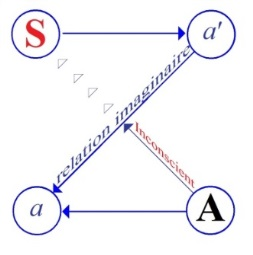

<!-- id: s5-17-0146 -->

Pour que la demande, si l’on peut dire, existe, *ait une chance*, soit quelque chose, il faut qu’il y ait donc *un cer­tain rapport* entre A en tant que *lieu de la parole*, et ce *désir* tel qu’il est structuré : S **◊** *a*, tel qu’il est structuré dans la première ligne.

<!-- id: s5-17-0147 -->

<!-- id: s5-17-0148 -->

Ce que *la composition* de ces lignes implique est ceci :

<!-- id: s5-17-0149 -->

- de même que l’*identifi­cation narcissique*, à savoir ce qui constitue le *moi* du sujet, se fait dans un certain rapport dont nous avons vu toutes les variations, toutes les différences, toutes les nuances de *prestige*, de *prestance*, de *domination*, dans un certain rapport avec *l’image de l’autre* : *i(a),* il y a là le correspondant, le corrélatif de ce qui, de l’autre côté du *point de révolution* de ce tableau, à savoir la ligne *d’équivalence double* \[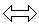\]qui est là au centre, met en rapport cette possibilité même de *l’existence d’un moi* avec le caractère fondamentalement désirant et *lié aux avatars du désir* qui est ici articulé dans la première partie de la ligne \[S **◊** *a*\],

<!-- id: s5-17-0150 -->

- de même *toute identification* qui soit *identification aux insignes de l’Autre* : *s*(A), c’est-à-dire du tiers en tant que tel, *dépend* - de quoi ? - *de la demande*, de la demande et des rapports de l’Autre au *désir *: A **◊** *d*.

<!-- id: s5-17-0151 -->

Ceci est tout à fait clair et évident, et c’est ce qui permet de donner sa pleine valeur au terme dont FREUD, lui, appelle ce que nous appelons d’une façon très impropre - je réarticulerai, je reviendrai sur ce pourquoi ce terme est très impropre - du terme de *frustration :* il s’agit de *Versagung.*

<!-- id: s5-17-0152 -->

Nous savons par expérience que c’est dans la mesure où quelque chose est *versagen qu’il* se produit chez le sujet ce phénomène de *l’identification secondaire* ou de *l’identi­fication aux insignes* de l’Autre : *s*(A). Qu’est-ce que cela implique ?
Ceci implique que pour qu’il y ait quelque chose qui puisse même s’établir - j’entends pour le sujet - entre :

<!-- id: s5-17-0153 -->

- le grand Autre comme lieu de la parole,

<!-- id: s5-17-0154 -->

- et ce phénomène de son désir, qui se place sur un plan tout à fait hété­rogène puisqu’il y a rapport avec le petit autre en tant que le petit autre est son image \[*i(a)*\]
  …il faut que quelque chose introduise dans l’Autre, dans l’Autre en tant que lieu de la parole, ce même rapport
  au petit autre qui est exigible, qui est nécessaire, qui est phénoménologiquement tangible, pour expliquer
  le désir humain en tant que désir pervers.

<!-- id: s5-17-0155 -->

C’est la nécessité du problème que nous avons proposé aujourd’hui. Cela peut vous sembler obscur.
Je ne vous dirai qu’une seule chose, c’est qu’à ne rien poser du tout, non seulement nous allons nous rendre compte que ça devient de plus en plus obscur, mais en plus tout s’embrouille au lieu que ce qu’il s’agit de savoir,
c’est que si nous posons cela, nous allons pouvoir faire sortir un peu d’ordre.

<!-- id: s5-17-0156 -->

Nous posons que Φ, le *phallus*, est ce signifiant par lequel est introduit dans A, en tant que lieu de la parole :
le grand A, par où est introduit le rapport à l’autre, *petit(a)* en tant que petit autre, par où ce rapport est introduit
\- ce n’est pas tout - en tant que le signifiant y est pour quelque chose. Voilà. Cela a l’air de se mordre la queue
mais il faut que cela se morde la queue. Il est clair que le signifiant y est pour quelque chose,

<!-- id: s5-17-0157 -->

puisque ce signifiant nous le ren­controns à tous les pas.

<!-- id: s5-17-0158 -->

Nous l’avons rencontré d’abord à l’origine : il n’y aurait pas d’origine, non pas de la culture, mais de ce qui est d’ailleurs la même chose si nous distinguons culture et société, il n’y aurait donc pas d’entrée de l’homme

<!-- id: s5-17-0159 -->

dans la cul­ture si ce *rapport au signifiant* n’était pas à l’origine. Ce que nous voulons dire ici, c’est que :

<!-- id: s5-17-0160 -->

- de même que nous avons défini le signi­fiant paternel comme le signifiant qui, dans le lieu de l’Autre, pose, autorise le jeu des signifiants,

<!-- id: s5-17-0161 -->

- il y a cet autre signifiant privilégié qui est le signifiant qui a pour effet d’instituer dans l’Autre ceci, qui le change de nature, à savoir que c’est pour cela qu’il est barré cet Autre : S(A).

<!-- id: s5-17-0162 -->

Ceci qui le change de nature, à savoir qu’il n’est pas purement et simplement le lieu de la parole, mais qu’il est quelque chose qui, comme le sujet, est impliqué dans cette *dialectique* située sur le plan phénoménal de la réflexion à l’endroit du petit autre et qui pose que l’Autre est impliqué dans ceci, et qui y ajoute - c’est purement et simplement comme *signifiant* que cela y ajoute - que ce rapport existe pour autant que c’est le *signifiant* qui l’inscrit.

<!-- id: s5-17-0163 -->

Je vous prie, quelque difficulté que ceci vous fasse de garder dans l’esprit ceci, de vous en tenir là pour aujourd’hui.

<!-- id: s5-17-0164 -->

Je vous montrerai par la suite ce que ceci nous per­met d’articuler et d’illustrer.
