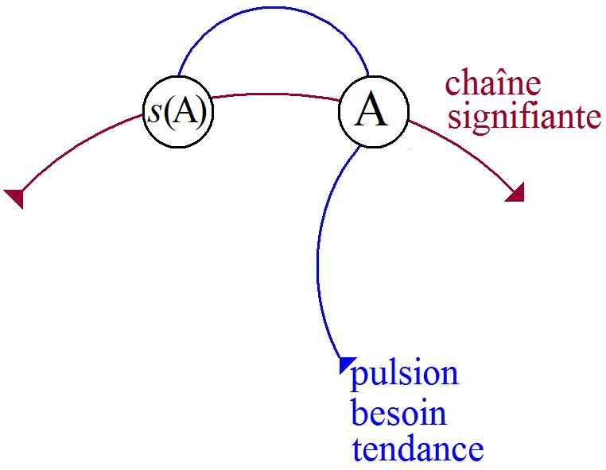
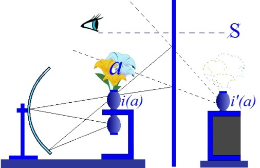
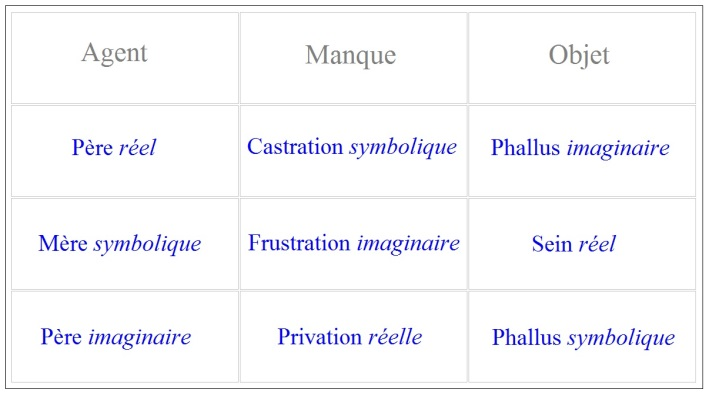
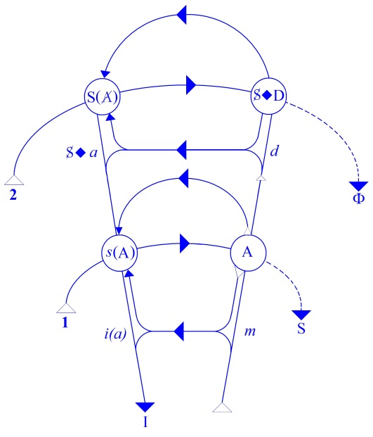
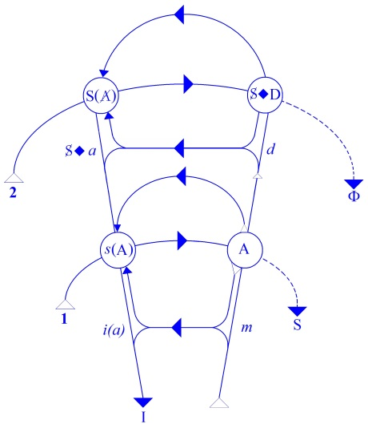
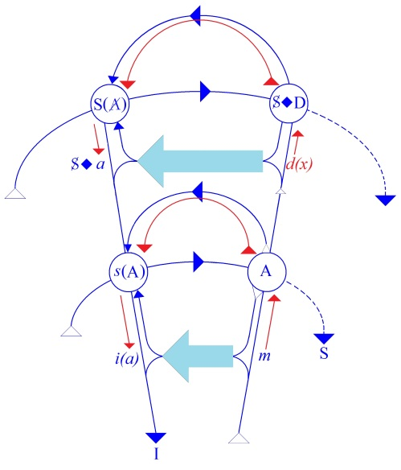
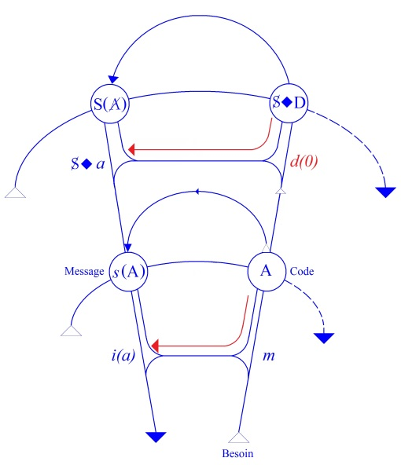

# Leçon 26 | 18 Juin 1958

<!-- source-url: http://staferla.free.fr/S5/S5 FORMATIONS .docx -->
<!-- seminar: s5 -->
<!-- lesson: 26 -->

<!-- id: s5-26-0001 -->

Le 18 Juin est *aussi* l’anniversaire de la fondation de la *Société Française de Psy­chanalyse*.

<!-- id: s5-26-0002 -->

Nous aussi nous avons dit NON, à un moment.

<!-- id: s5-26-0003 -->

La dernière fois j’avais commencé de commenter l’observation d’une obsession­nelle en train d’être soignée

<!-- id: s5-26-0004 -->

par l’un de nos confrères, et j’avais commencé d’amor­cer quelques uns des principes qui peuvent se déduire de
la façon dont nous essayons d’articuler les choses quant au caractère bien dirigé ou mal dirigé, correct ou non cor­rect de la conduite d’un traitement centré sur quelque chose qui évidemment se pré­sente comme existant dans le contenu de ce qu’apporte l’analyse, à savoir la prise de conscience de l’envie du pénis.

<!-- id: s5-26-0005 -->

Je crois que dans l’ensemble vous voyez l’intérêt de l’emploi de ce que nous en fai­sons. Il y a toujours naturellement des petits retards ou des schémas auxquels vous vous êtes arrêtés, des oppositions qui vous ont semblé faciles
à retenir et se trouvent un peu secouées ou remises en question par la suite de notre progrès et vous dérou­tent.

<!-- id: s5-26-0006 -->

Il n’y a qu’à nous demander par exemple s’il ne fallait pas voir une contradiction entre ce que j’avais apporté
la dernière fois et un principe auquel on avait cru vou­loir s’arrêter. Je disais qu’en somme pour la femme,

<!-- id: s5-26-0007 -->

son *développement sexuel* pas­sait obligatoirement par quelque chose qui pourrait s’appeler :

<!-- id: s5-26-0008 -->

« *elle doit être le phal­lus sur le fond quelle ne l’est pas* »*.*

<!-- id: s5-26-0009 -->

Pour l’homme c’est le complexe de castration qui peut se formuler par ceci :

<!-- id: s5-26-0010 -->

« *qu’il a le phallus sur le fond de ce qu’il n’a pas (ou est menacé de ne pas l’avoir)* ».

<!-- id: s5-26-0011 -->

Évidemment ce sont des *schémas* qui, sous un certain angle, et quand on parle, et quand on oppose le développement sexuel, à telle ou telle phase, peuvent montrer assez bien une certaine opposition. Il est tout à fait insuffisant
de s’y arrêter puisque aussi bien cette dialectique de *l’être* et de *l’avoir* vaut pour les deux. L’homme aussi doit s’apercevoir qu’il ne l’est pas. C’est même là en effet dans cette direction que nous pouvons voir se situer
une partie des problèmes appliqués par la solution du *complexe de castration* et du *penisneid.*

<!-- id: s5-26-0012 -->

Nous allons le voir plus en détail, et j’espère que peu à peu vous remettrez à leur place les choses qui ne sont pas fausses en elles-mêmes, mais qui sont des vues partielles. Pour cela repartons aujourd’hui de notre schéma.
Il est excessivement important d’articuler convenablement les différentes lignes dans lesquelles l’analyse se situe.

<!-- id: s5-26-0013 -->

Il y a un article dont je vous conseillerai la lecture, c’est l’article de GLOVER qui s’appelle « [*The Thera**peutic effects of inexact interpretation*](#Glover_18_06_58)* »* [^62]*.* C’est l’un des articles les plus remarquables et les plus intelligents qui puisse être écrit sur un tel sujet. Il met vrai­ment au point la base de départ sur laquelle peut être abordée la question de *l’inter­prétation*.

<!-- id: s5-26-0014 -->

En somme le fond de *cet article* et du problème qu’il pose est quelque chose qui peut à peu près se situer comme suit :
au point et au moment où GLOVER a écrit, nous sommes encore à un moment où FREUD est vivant,
mais où le grand tournant de la technique analytique autour de l’*analyse des résistances* et de l’agressivité s’est pro­duit.

<!-- id: s5-26-0015 -->

GLOVER articule que cette analyse des résistances et du transfert est quelque chose qui, avec l’expérience
et le développement de notions acquises dans l’analyse, est quelque chose qui implique le parcours, la couverture,
si on peut dire au sens qu’un terrain doit être couvert par le progrès analytique, de la somme des *systèmes fantasmatiques -* traduisons comme cela *« fantasm Systems », les systèmes de fantasmes -* que nous avons appris à reconnaître dans l’analyse.

<!-- id: s5-26-0016 -->

Il est clair qu’à ce moment on en a appris plus, on en connaît plus que tout au début de l’analyse, et que la question qui se pose c’est : qu’est-ce qu’étaient nos thérapeutiques au moment où nous ne connaissions pas
dans toute leur ampleur, dans tout leur éventail, ces « *systèmes de fan­tasmes* » ?

<!-- id: s5-26-0017 -->

Est-ce dire que ce que nous avons fait à ce moment-là était des cures théra­peutiques incomplètes, moins valables

<!-- id: s5-26-0018 -->

que celles que nous faisons à présent ? C’est une question évidemment fort intéressante, et à propos de laquelle
il est amené en quelque sorte à faire une espèce de situation générale de toutes les positions articu­lées,

<!-- id: s5-26-0019 -->

prises par celui qui se trouve en position de consultant par rapport à un trouble quelconque.

<!-- id: s5-26-0020 -->

D’une certaine façon il généralise, il étend, la notion d’« *interprétation* » à toute position articulée,
prise par celui que l’on consulte, et il fait l’échelle des diffé­rentes positions du médecin par rapport au malade.

<!-- id: s5-26-0021 -->

Il y a une anticipation de la relation *médecin-malade*, comme on dit aujourd’hui, mais vraiment articulée d’une façon dont je regrette qu’elle n’ait pas été *développée* dans ce sens qui pose une sorte de voie générale.

<!-- id: s5-26-0022 -->

C’est très précisément pour autant que nous *méconnaissons* la vérité incluse dans le *symptôme*, que nous nous trouvons de ce fait *collaborer avec cet acte symptomatique*. Il a pris ceci depuis le médecin de médecine générale qui dit au patient :
« *Secouez-vous, allez à la campagne, changez d’occupation !* », enfin qui se met en position de méconnaissance.

<!-- id: s5-26-0023 -->

Aussitôt il occupe une certaine place, ce qui n’est pas quelque chose d’inefficace puisque c’est quelque chose qui se situe, se repère très bien à la place même où certains symptômes se forment. Il occupe aussitôt une certaine fonction par rapport au patient qui est situable dans les termes mêmes de la topique analytique. Je n’insiste pas là-dessus.

<!-- id: s5-26-0024 -->

Il remarque en un certain point que toute la tendance de la *modern therapeutic analytic* à son époque est la direction d*’*interpréter ce qu’il appelle les « *systèmes sadiques *»  et les réactions de culpabilité*.* Il fait remarquer que jusqu’à
une époque récente tout ceci n’avait pas été mis en évidence. Sans aucun doute on soulageait le malade de l’*anxiété*, mais on laissait certainement irrésolu, irréprimé, et du même coup refoulé, ce fameux « *système sadique *»*.*

<!-- id: s5-26-0025 -->

Voilà un exemple de la direction dans laquelle, non pas il conclut des remarques, mais dans laquelle il les amorce,
et c’est bien là ce que de nos jours il serait intéres­sant de reprendre. Je vais vous faire à ce propos justement
une remarque : il s’agirait de situer en somme ce que veut dire cet avènement de l’analyse de l’*agressivité*.

<!-- id: s5-26-0026 -->

Pen­dant un certain temps, les *analystes* ont été tellement impressionnés par la découverte qu’ils avaient faite,
que c’était devenu une sorte de « *tarte à la crème* ». On a si bien ana­lysé notre *agressivité* que ce sont les termes

<!-- id: s5-26-0027 -->

dans lesquels les analystes en formation se parlaient quand ils se rencontraient. Il s’agirait de savoir ce qu’en effet a représenté *cette découverte*, et je pense que nous pouvons la situer quelque part *sur le schéma fondamental* qui est le nôtre. C’est ce que j’ai essayé de faire tout à l’heure, car enfin nous pouvons aussi là-dessus nous poser des questions.

<!-- id: s5-26-0028 -->

J’ai souvent fait remarquer combien une *ambiguïté* restait, au temps où je vous apprenais, où je vous criais à propos
du *système narcissique* en tant que tel, comme fondamental dans la formation des réactions agressives, que l’*agressivité,*
celle qui est provoquée dans *la relation imaginaire au petit autre,* n’est pas quelque chose qui puisse se confondre
avec la somme de la puissance agressive en tant que fonction vitale, mais simplement *une relation imaginaire*.

<!-- id: s5-26-0029 -->

D’un autre côté il est clair, pour rappeler ces choses de première évidence, que la violence est bien ce qui est essentiel dans l’agression, au moins si nous nous situons sur le plan humain. Ce n’est pas la parole, c’en est même exactement
le contraire. C’est la violence *<u>ou</u>* la parole qui peut se produire dans une relation inter-humaine.

<!-- id: s5-26-0030 -->

Si la violence est quelque chose dans son essence qui se distingue de la parole, la ques­tion peut se poser de savoir dans quelle mesure la violence comme telle - je dis la vio­lence pour la distinguer de l’usage que nous faisons

<!-- id: s5-26-0031 -->

de l’agressivité - peut être refou­lée puisque, si nous suivons ce qu’ici nous avons posé comme principe,
à savoir que *ne saurait être refoulé que ce qui se révèle balisé à la structure de la parole, c’est-à-dire à une articulation signifiante*.

<!-- id: s5-26-0032 -->

C’est une question qui doit bien être posée. En effet, par le biais de *l’imaginaire,* c’est par le biais de ce *meurtre*
*du semblable* qui est latent dans *la relation imaginaire* comme telle, que ce qui est de l’ordre de l’*agressivité* arrive à être *symbolisé* et, comme tel, pris dans le mécanisme de ce qui est, radicalement, inconscience, de ce qui est analysable,
de ce qui est même, disons-le d’une façon générale, interprétable. Reprenons bien en effet les choses.
Si nous suivons et si nous repartons, si nous ré-épelons notre petit schéma sous sa forme la plus simple, à savoir
dans cet entrecroisement

<!-- id: s5-26-0033 -->

- de *la tendance*, si vous voulez, *la pulsion* en tant qu’elle représente *un besoin* individualisé,

<!-- id: s5-26-0034 -->

- et de quelque chose qui est la *chaîne signifiante* où il doit venir s’articuler.

<!-- id: s5-26-0035 -->

<!-- id: s5-26-0036 -->

Que signifie ceci à soi tout seul ? Ceci déjà nous donne quelques éléments et nous permet de faire quelques remarques. Faisons une supposition : supposons qu’il n’y ait pour l’être humain que la réa­lité, cette fameuse réalité dont nous faisons un usage à tort et à travers. Supposons qu’il n’y ait que cela. Il n’est pas impensable que
quelque chose de signifiant l’articule, cette réalité.

<!-- id: s5-26-0037 -->

Pour fixer les idées, supposons que - comme on veut le dire quelquefois dans certaines écoles *- le signifiant* ce soit simplement un conditionnement, je ne dirai pas des réflexes, mais de ce quelque chose qui est réductible aux réflexes,
comme si le langage n’était pas quelque chose d’un autre ordre que ce que nous créons artificiellement en laboratoire chez l’animal en lui apprenant à sécréter du suc gastrique au son d’une clochette. *C’est un signifiant, le son de la clochette*.

<!-- id: s5-26-0038 -->

Et on peut supposer un monde humain tout entier organisé autour d’une coalescence de cha­cun des besoins

<!-- id: s5-26-0039 -->

qui ont à se faire entendre avec un certain nombre de signes prédé­terminés. Si ces signes sont valables pour tous,

<!-- id: s5-26-0040 -->

en principe ça doit faire une société qui fonctionne d’une façon parfaitement idéale : chaque émission pulsionnelle
à mesure des besoins sera associée à quelque chose que nous appellerons, si vous vou­lez, *le son de cloche*, diversement varié, qui fonctionnera de la façon convenable pour celui qui l’entend pour qu’aussitôt il satisfasse au dit *besoin*.
Nous arrivons ainsi à la société idéale. Je vous fais remarquer que ce que je dépeins, c’est ce qui est rêvé
depuis toujours par les utopistes : une société fonctionnant parfaitement et aboutissant à la satisfac­tion de :

<!-- id: s5-26-0041 -->

« *chacun selon ses besoins*, *tous y participant selon leurs mérites* » y ajoute-t-on*.* C’est là que commence le problème.

<!-- id: s5-26-0042 -->

En somme, ce schéma, s’il reste à ce niveau-là de l’entrecroisement du signifiant avec *la poussée* ou *la tendance*
du besoin, il aboutit à quoi ? À *l’identification* du sujet à l’autre, en tant que cet autre articule la distribution
de ce qui peut répondre au besoin, la distribution des ressources. Ceci est justement ce qui déjà vous fait apparaître qu’il n’en est pas ainsi.

<!-- id: s5-26-0043 -->

À savoir que cet arrière-plan de la *demande*, il est absolument nécessaire de le faire entrer en ligne de compte, simplement pour rendre compte de ce qui se passe dans cette arti­culation du sujet, dans cette prise de position

<!-- id: s5-26-0044 -->

du sujet dans un ordre qui existe au-delà de l’ordre du *réel* et que nous appelons *l’ordre symbolique*, qui le complique,
qui s’y superpose, qui n’y adhère pas. D’ores et déjà pourtant, à ce niveau, à cet état simple du *schéma*,
nous pouvons remarquer que déjà il se passe quelque chose, quelque chose de l’ordre naturel, de l’ordre organique,
disons tout au moins chez l’homme, quelque chose qui com­plique ce schéma simplement à ce stade où il est ici décrit au tableau et qui consiste en ceci, c’est que voilà : le sujet, cet enfant - mythique, disons-le, qui sert d’arrière-plan
à nos spéculations psychanalytiques - cet enfant, en présence de sa mère com­mence à manifester ses besoins.

<!-- id: s5-26-0045 -->

<!-- id: s5-26-0046 -->

- C’est ici \[A\] qu’il rencontre la mère en tant que sujet parlant.

<!-- id: s5-26-0047 -->

- C’est ici \[*s*(A)\] qu’aboutit son message, c’est-à-dire au moins \[dans la mesure\] où la mère le satisfait.

<!-- id: s5-26-0048 -->

Comme je vous l’ai fait remarquer, ce n’est pas au moment où la mère ne le satisfait pas, le frustre,
que commencent les problèmes. Ce serait trop simple, encore que bien entendu on s’efforce d’y revenir toujours, justement parce que c’est simple.

<!-- id: s5-26-0049 -->

Je vous l’ai dit, le problème intéressant, celui qui n’a pas échappé à quelqu’un comme WINNICOTT par exemple, dont on sait que c’est quelqu’un dont l’esprit et dont la pra­tique couvrent toute l’ampleur du développement actuel

<!-- id: s5-26-0050 -->

de la psychanalyse et de ses techniques, jusqu’à y compris une considération extrêmement précise des *systèmes fantasmatiques* qui sont sur la limite, sur le champ frontière avec la psychose. WIN­NICOTT, dans son article

<!-- id: s5-26-0051 -->

sur *les objets transitionnels* dont j’ai fait état auprès de vous, montre avec la plus grande précision que le problème essentiel c’est de savoir com­ment l’enfant *sort de la satisfaction,* et non pas de la frustration, *pour se construire un monde*.

<!-- id: s5-26-0052 -->

C’est pour autant que pour le sujet humain, un monde s’articule qui comporte *un au-delà de la demande,*
quand *la demande* est satisfaite et non pas quand elle est frus­trée, c’est cela qu’il appelle *les objets transitionnels,*

<!-- id: s5-26-0053 -->

c’est-à-dire ces menus objets que nous voyons très tôt prendre une extrême importance dans la relation avec la mère, à savoir un bout de couche sur lequel il tire jalousement, une bribe de n’importe quoi, un hochet,
et l’importance de cet *objet transitionnel* dans le système de déve­loppement de l’enfant est une chose absolument essentielle à voir et à situer et à com­prendre dans sa précocité.

<!-- id: s5-26-0054 -->

Ceci dit, arrêtons-nous à cette frustration, à savoir au fait qu’ici \[*s*(A)\] *le message* n’y vient pas, à partir d’une date que nous avons essayé de fixer quand nous nous inté­ressions, il y a 3 ans, au *stade du miroir*. Il ne s’est pas évaporé depuis.
J’aime bien ceux d’entre vous qui nous disent : « *Tous les ans c’est quelque chose de différent, le système change.* »
Il ne change pas, simplement j’essaye de vous en faire parcourir le champ.

<!-- id: s5-26-0055 -->

Ce que nous trouvons, c’est que ce qui se passe dans ce rapport avec la mère, pour autant qu’ici la mère impose
ce que j’ai appelé, plus que *sa loi,* «* sa toute-puissance *» *ou* «* son caprice *» est compliqué du fait que l’enfant, l’enfant humain - pas n’importe quel petit, et l’expérience nous le montre *-* est ouvert à un certain rapport *d’ordre imaginaire*
qui est le rapport à *l’image du corps propre* et *à l’image de l’autre*, nommément, pour autant que nous le voyons
sur notre schéma, dans l’au-delà de ce qui se passe sur la ligne de retour du besoin satisfait ou pas satisfait.

<!-- id: s5-26-0056 -->

C’est à savoir ce qu’il éprouve les réactions, par exemple, de déception, de malaise, de vertige, dans son propre corps, par rapport à une *image idéale* qu’il en a et qui prend chez lui une valeur tout à fait prévalente du fait d’un trait
de son organisation que nous avons liée à plus ou moins juste titre à la prématuration de sa naissance.

<!-- id: s5-26-0057 -->

<!-- id: s5-26-0058 -->

Bref, dès l’origine nous voyons interférer, jouer entre eux, deux circuits :

<!-- id: s5-26-0059 -->

- dont le premier est *le circuit symbolique*, pour vous fixer les idées, pour raccrocher les choses à un portemanteau que vous connaissez déjà : au surmoi féminin infantile,

<!-- id: s5-26-0060 -->

- et d’autre part *le rapport imaginaire* à cette *image idéale de soi* qui chez lui se trouve, à l’occasion de ses *frustrations* ou de ses *déceptions*, plus ou moins affectée, voire lésée.

<!-- id: s5-26-0061 -->

En d’autres termes, le circuit dès l’origine se trouve jouer sur deux plans, *plan symbolique* et *plan imaginaire* :

<!-- id: s5-26-0062 -->

- rapport à l’image de l’objet primordial, la mère, l’Autre en tant qu’elle est le lieu où se situe la possibilité d’articuler le besoin dans le signifiant,

<!-- id: s5-26-0063 -->

- et d’autre part *l’image de l’autre* \[*i(a)*\] en tant qu’elle est le point où le sujet a cette sorte de lien à soi-même, à une image qui représente ce que nous pouvons appe­ler la ligne de son accomplissement, accomplissement imaginaire bien entendu.

<!-- id: s5-26-0064 -->

En quoi a consisté le fait de dire tout ce que nous avons dit depuis le début de l’année, depuis que nous commençons à prendre les choses au niveau du *trait d’es­prit* ? Pour avoir l’occasion de vous apporter ce *schéma*, de vous en montrer la per­tinence, le caractère inévitable dans le *trait d’esprit,* je vous ai dit qu’en somme, rien ne pouvait s’organiser
d’une vie mentale qui corresponde à ce que l’expérience nous donne, à ce que l’expérience articule dans l’analyse,
si ce n’est qu’il y ait*, au-delà* de cet Autre - mis primordialement en position de toute puissance par son pouvoir,
*non pas de frustration*, car c’est insuffisant, *mais de Versagung, avec l’ambiguïté de pro­messe et de refus* que contient ce terme - qu’il y ait, si je puis dire, *l’Autre de cet Autre.* À savoir ce qui permet que cet Autre, lieu de la parole, que le sujet l’aperçoive comme lui-même *symbolisé*, c’est-à-dire *qu’il y ait cet Autre de l’Autre* dans l’occasion.

<!-- id: s5-26-0065 -->

Quand nous prenons le système du triangle œdipien familial, si vous voulez, vous sentez bien qu’il y a là quelque chose de plus radical, de plus fondamental que tout ce que nous donne l’expérience sociale, ce terme de *famille,* et c’est bien cela qui fait la perma­nence, je veux dire la constance de ce triangle œdipien et de la découverte freudienne.

<!-- id: s5-26-0066 -->

Je vous ai indiqué là le *Père* - avec un grand P - en tant qu’il n’est jamais *un père* mais bien plutôt « *le Père mort* »,
le *Père* en tant que porteur :

<!-- id: s5-26-0067 -->

- d’*un signifiant* comme tel signifiant au second degré,

<!-- id: s5-26-0068 -->

- d’*un signifiant qui autorise et fonde tout le système de signifiant*, qui fait qu’en quelque sorte le premier Autre, c’est-à-dire le premier sujet auquel l’individu parlant s’adresse, est lui-même symbolisé.

<!-- id: s5-26-0069 -->

C’est uniquement au niveau de cet *Autre*, de *la Loi* à proprement parler, et *d’une loi* - je vais y insister – *incarnée,*

<!-- id: s5-26-0070 -->

que peut prendre sa dimension propre le monde arti­culé humain tel que nous le voyons s’exercer par l’expérience
et tel que l’expérience nous montre comme absolument indispensable cet arrière-plan d’un *Autre par rap­port à l’Autre, sans lequel l’univers du langage*...

<!-- id: s5-26-0071 -->

> tel qu’il se montre efficace dans *la structuration*, non seulement des besoins, mais de ce quelque chose
>
> de nouveau dont j’essaye de vous démontrer, de vous faire comprendre cette année la dimension ori­ginale, et qui s’appelle le désir

<!-- id: s5-26-0072 -->

...*ne peut pas s’articuler*.

<!-- id: s5-26-0073 -->

C’est à ce niveau que s’aperçoit *l’Autre* en tant que *lieu de la parole*, cet *Autre* qui pourrait purement et simplement être le lieu du son de clochette dont je vous par­lais tout à l’heure, qui ne serait donc pas à proprement parler un Autre,

<!-- id: s5-26-0074 -->

mais sim­plement *le lieu organisé de ce système des signifiants*, *introduisant son ordre et sa régularité dans les échanges vitaux*
à l’intérieur d’une certaine espèce.

<!-- id: s5-26-0075 -->

On voit mal qui aurait pu l’organiser, et après tout on peut envisager que dans une société déter­minée

<!-- id: s5-26-0076 -->

« *les hommes pleins de bienveillance* » s’emploient à l’organiser et à le faire fonctionner. On peut même dire que c’est
un des *idéaux* de la politique moderne. Seulement *l’Autre* n’est pas cela. Justement il n’est pas purement et simplement le lieu qui est ce quelque chose de parfaitement organisé, de fixé, de figé. Il est un *Autre* *symbolisé* lui-même.

<!-- id: s5-26-0077 -->

C’est cela qui lui donne son apparence de liberté. Il est un fait qu’il est *symbolisé*, et que ce qui se passe à ce niveau
de *l’Autre de l’Autre*, c’est-à-dire du *Père* dans l’occasion, du lieu où s’articule *la Loi*, du point de visée où lui dépend d’un *Autre,* c’est que cet Autre *lui-même est soumis à l’articulation signi­fiante*. Plus que soumis, *marqué* de quelque chose

<!-- id: s5-26-0078 -->

qui est *l’effet dénaturant -* souli­gnons bien notre pensée * *:

<!-- id: s5-26-0079 -->

- de cette *présence du signifiant* qui est loin encore d’être parvenue à cet état d’articulation parfaite que nous prenons ici comme une espèce d’hypothèse de départ uniquement pour illustrer notre pensée

<!-- id: s5-26-0080 -->

- de *cet effet du signifiant* sur l’*Autre* comme tel, de *cette marque* qu’il en subissait à ce niveau.
  C’est *cette marque* que représente *la castration* comme telle.

<!-- id: s5-26-0081 -->

Si nous avons autrefois, dans la triade « *castration, frustration, privation »,* bien mar­qué *dans la castration* :

<!-- id: s5-26-0082 -->

- que *l’action est symbolique*,

<!-- id: s5-26-0083 -->

- que *l’agent est réel*,

<!-- id: s5-26-0084 -->

- que c’est *un père réel* dont on a besoin,

<!-- id: s5-26-0085 -->

- que *la castration* existe,

<!-- id: s5-26-0086 -->

- que *la castration c’est une action symbolique* et qu’elle porte *sur quelque chose d’imaginaire*,
  …nous en retrouvons là la nécessité.

<!-- id: s5-26-0087 -->

<!-- id: s5-26-0088 -->

C’est en tant que quelque chose de *réel* passe au niveau de la *Loi*…
un père plus ou moins défaillant - qu’importe ! -

ou quelque chose qui le remplace, mais quelque chose qui tient sa place
…que se produit ceci : c’est qu’est reflété dans *le sys­tème de la demande* où s’instaure le sujet *ce quelque chose*
*qui en est son arrière-plan*, à savoir qui marque dans ce système de la demande - bien loin d’être articulé,
bien loin d’être parfait, bien loin d’être à *plein rendement* ou à *plein emploi - ce quelque chose* qui s’appelle :

<!-- id: s5-26-0089 -->

- *effet du signifiant* sur le sujet,

<!-- id: s5-26-0090 -->

- *marque* du sujet par le signifiant,

<!-- id: s5-26-0091 -->

- *manque*, dimension du manque introduite dans le sujet par ce signifiant.

<!-- id: s5-26-0092 -->

Ce *manque* introduit est *symbolisé* comme tel dans *le système de signifiants* comme étant *l’effet du signifiant sur le sujet*,

<!-- id: s5-26-0093 -->

*le signifié* à proprement parler, *le signi­fié* qui ne vient pas tant des profondeurs, comme si la vie fleurissait en *significations*, mais qui vient d’ailleurs, du langage et du *signifiant* comme tel, pour y imprimer cette sorte d’effet qui s’appelle *signifié*.

<!-- id: s5-26-0094 -->

Ceci est primitivement *symbolisé*, comme l’indique ce que nous avons apporté sur *la castration*. Le fait que ce qui sert
de support à *l’action symbolique* propre qui s’appelle castration est *une image*, *une image* choisie si l’on peut dire dans
*le système imaginaire*. *Ce quelque chose où l’action symbolique de la castration choisit son signe est emprunté au domaine imaginaire : quelque chose dans l’image de l’autre est choisi pour porter la marque d’un manque qui est ce manque même par où le vivant s’aperçoit*,
parce qu’il est humain, c’est-à-dire parce qu’il est en rapport avec le lan­gage,

<!-- id: s5-26-0095 -->

- comme exclu de l’omnitude des désirs,

<!-- id: s5-26-0096 -->

- comme quelque chose de *limité*, de *local*,

<!-- id: s5-26-0097 -->

- comme *une créature*, à l’occasion comme *un chaînon* dans la lignée vitale, comme n’étant qu’un de ceux par lesquels la vie passe.

<!-- id: s5-26-0098 -->

À la différence de l’animal, qui n’est effectivement qu’un de ceux qui réalisent le type qui, à ce titre, par nous peut être considéré par rapport au type - comme chaque individu - *déjà mort*. Nous, nous le sommes aussi déjà pour eux.
Nous sommes *déjà morts* par rapport au mouvement lui-même, ce mouvement lui-même de la vie qu’à cause du langage nous sommes capable de projeter dans sa totalité, et même plus, dans sa totalité comme parvenue à sa fin.

<!-- id: s5-26-0099 -->

C’est exactement ce que FREUD articule dans la notion d’*instinct de mort*. Il veut dire que pour l’homme,
la vie d’ores et déjà se projette comme étant parvenue à son terme, c’est-à-dire au point où elle retourne à la mort.
Cette articulation par FREUD de l’*instinct de mort*, c’est l’articulation d’une posi­tion essentielle à un être animal qui

<!-- id: s5-26-0100 -->

est pris et articulé dans *un système signifiant qui lui permet de dominer son immanence de vivant et de s’apercevoir comme déjà mort.*

<!-- id: s5-26-0101 -->

C’est très précisément ce que justement il ne fait que d’une façon *imaginaire*, je veux dire ici comme *virtuel*,
comme à la limite, comme d’une façon *spéculative*. Il n’y a pas d’expérience de la mort, bien entendu, qui puisse
y répondre, et c’est bien pour cela que c’est *symbolisé* d’une autre façon. C’est *symbolisé* sur ce point et cet organe précis où apparaît de la façon la plus sensible ce qui est la poussée de la vie.

<!-- id: s5-26-0102 -->

C’est pour cela que c’est le *phallus*, en tant qu’il représente simplement la montée de la puissance vitale,
qui prend place dans l’ordre des signifiants pour représenter pour l’individu humain dans son existence
ce qui est marqué par le signifiant, ce qui par le signifiant est frappé de cette caducité essentielle
où peut s’articuler dans le signifiant lui-même *ce manque-à-être dont le signifiant introduit la dimension dans la vie du sujet*.

<!-- id: s5-26-0103 -->

C’est ce qui nous permet de comprendre dans quel *ordre les choses* se sont pré­sentées pour *l’analyse*, à partir du moment où simplement quelqu’un n’est pas parti de l’École pour aller au phénomène, mais est simplement parti des *phénomènes* tels qu’il les voyait se manifester chez *les névrosés*, terrain élu pour manifester cette arti­culation dans son essence, simplement du fait qu’elle se manifeste dans son *désordre*. Et l’expérience a prouvé que c’était toujours dans *le désordre* que nous apprenions à trouver assez facilement les rouages et les articulations de l’ordre.

<!-- id: s5-26-0104 -->

Nous pouvons dire que ce qui s’est donné d’abord, par FREUD, à une expérience, une expérience qui tout de suite
a mis au premier plan, a promu la sous-jacence du *complexe de castration* comme tel, c’est quelque chose qui, comme chacun sait, est parti de l’appréhension et de la perception des *symptômes* du sujet. Qu’est-ce que le *symptôme* veut dire ?
Où dans ce schéma, se situe-t-il ?

<!-- id: s5-26-0105 -->

<!-- id: s5-26-0106 -->

Il se situe quelque part en *s*(A), il se produit au niveau de *la signification*. C’est essentiellement tout ce que FREUD
a apporté :

<!-- id: s5-26-0107 -->

- un *symptôme* c’est une *signi­fication*,

<!-- id: s5-26-0108 -->

- un *symptôme* c’est un *signifié*,

<!-- id: s5-26-0109 -->

…c’est un *signifié* qui est bien loin d’intéres­ser seulement *le sujet*. C’est son *histoire*, toute son *anamnèse* qui est impliquée. C’est pour cela que l’on peut légitimement le symboliser à cette place par un *s*(A)*.* Entendez : *signifié de l’Autre*
venant comme tel du *lieu de la parole*.

<!-- id: s5-26-0110 -->

Mais ce que FREUD nous a appris aussi, c’est que

<!-- id: s5-26-0111 -->

- le *symptôme* n’est jamais simple :

<!-- id: s5-26-0112 -->

- le *symptôme* est toujours surdéterminé.
  Il n’y a pas de *symptôme* dont le *signifiant* ne soit apporté d’une expérience antérieure, précisément d’une expérience située au niveau où il s’agit de ce qui est réprimé et de ce qui est le cœur de tout ce qui est réprimé chez le sujet,
  à savoir ce *complexe de castration*, de ce S(A) qui est quelque chose qui, sans aucun doute, s’articule dans le *complexe*
  *de castration* mais qui n’y est pas forcément ni toujours totalement articulé.

<!-- id: s5-26-0113 -->

Le fameux *traumatisme* dont on est parti, *la fameuse scène primitive*, qu’est-ce que c’est, si ce n’est précisément quelque chose qui entre dans l’économie du sujet et qui joue, au cœur, à l’horizon de la découverte de l’*inconscient*, toujours comme *un signifiant* : *un signifiant en tant qu’il est défini dans son incidence* telle que tout à l’heure j’ai commencé de l’*articuler*.

<!-- id: s5-26-0114 -->

C’est à savoir que la vie, je veux dire l’être vivant saisi comme vivant, en tant que vivant, mais avec cet écart,
cette distance qui est justement celle qui constitue cette autonomie de la dimension signifiante, le traumatisme
ou la scène primitive, qu’est-ce donc si ce n’est cette vie qui se saisit dans une horrible aperception d’elle-même, dans son étrangeté totale, dans sa brutalité opaque comme pur signifiant d’une existence intolérable pour la vie elle-même, dès qu’elle s’en écarte pour voir le traumatisme et la scène primitive ?

<!-- id: s5-26-0115 -->

C’est ce qui apparaît de la vie à elle-même comme signifiant à l’état pur, c’est-à-dire comme quelque chose
qui ne peut pas encore d’aucune façon se résoudre, s’articuler. Cette nécessité, cet arrière-plan du *signifiant*
par rapport au *signifié*, c’est ce quelque chose qui dès le départ, dès que FREUD commence à articuler ce que c’est qu’un *symptôme,* est par lui impliqué dans la formation de *tout symptôme*, et qu’avons-nous vu ces derniers temps
chez *l’hystérique*, si ce n’est ceci qui nous permet de situer où se trouve le problème du névrosé ?

<!-- id: s5-26-0116 -->

C’est un problème de rapport de signifiant avec sa position de sujet dépendant de la demande. C’est ce en quoi l’hystérique a à articu­ler quelque chose que nous appellerons provisoirement son désir et l’objet de ce désir,
en tant justement qu’il n’est pas l’objet du besoin. C’est pour cela que j’ai quelque peu insisté sur *le rêve*
dit « *de la belle bouchère* ».

<!-- id: s5-26-0117 -->

Ce dont il s’agit, qu’est-ce ? Il apparaît là d’une façon tout à fait claire, et FREUD le dit dès le départ, dès l’orée même de la psychanalyse, qu’*il s’agit pour l’hystérique* de faire tenir, *de faire subsister l’objet du désir en tant que distinct et indépendant de l’objet de tout besoin*. Ce rapport au désir, à la constitution, au maintien sous sa *forme énigmatique du désir* comme tel dans son arrière-plan par rapport à toute demande, c’est le problème de *l’hystérique*, et chacun sait que ceci, à savoir, si vous voulez, quelque chose que nous avons appelé le *x*, est *l’indicible désir*.

<!-- id: s5-26-0118 -->

Qu’est-ce que le désir de mon *hystérique* ? C’est ce qui lui ouvre, je ne dirai pas l’univers, mais tout un monde
qui est déjà bien assez vaste, à savoir la dimension qu’on peut appeler la dimension de l’hystérie latente à toute espèce d’être humain dans le monde, à savoir tout ce qui peut se présenter comme question sur son propre désir.

<!-- id: s5-26-0119 -->

Voilà avec quoi *l’hystérique* se trouve communiquer de plain-pied, d’abord bien entendu avec tout ce qui peut se passer de cet ordre chez tous ses frères ou sœurs *hystériques*, à savoir que *c’est là-dessus* - comme FREUD nous l’articule -

<!-- id: s5-26-0120 -->

*que repose l’iden­tification hystérique*. À toute *hystérique* fait écho tout ce qui, dans l’*actualité*, se pose chez quelques autres, que ce soit comme questions sur son propre désir, surtout et en tant que cet autre est *hystérique*, mais aussi bien
pour autant que ce n’est qu’un mode *hystérique* de poser une question, même chez quelqu’un qui peut n’être

<!-- id: s5-26-0121 -->

qu’*occa­sionnellement* et même d’une façon latente, *hystérique*.

<!-- id: s5-26-0122 -->

Le monde est ouvert par cette « *question sur son désir* » à *l’hystérique*, *un monde d’identification qui la met*, si l’on peut dire, à proprement parler *dans un certain rap­port avec le masque*. Je veux dire avec tout ce qui peut d’une façon quelconque, fixer, symboliser selon un certain type, cette « *question sur le désir* » qui l’a faite *parente de l’hystérique* - disons là de *l’appel aux hystériques* comme tels - qui l’a faite essentielle­ment identifiée à une sorte de masque général sous lequel s’agitent
tous les modes possibles de *masque*.

<!-- id: s5-26-0123 -->

Nous en sommes maintenant à *l’obsessionnel*. *La structure de l’obsessionnel*, telle que j’essaye de m’y avancer, je vous l’ai dit est désignée aussi par *un certain rapport avec le désir* qui n’est pas ce rapport : *d /x*, mais qui est un autre rapport
que je vous ai indiqué comme étant chez lui essentiel, que nous appellerons, si vous voulez, aujourd’hui : *d /0*

<!-- id: s5-26-0124 -->

Le rapport de *l’obsessionnel* à son *désir* est soumis à ceci que nous connaissons depuis longtemps grâce à FREUD,
à savoir le rôle précoce qu’a joué ce qu’on appelle *Entbindung* « *défusion des pulsions* » \[*Entbindung : déliement*\], isolation
de quelque chose qui s’appelle « *destruction* ».

<!-- id: s5-26-0125 -->

C’est pour autant que *le premier abord du désir du sujet obsessionnel a été*, comme pour tout sujet, *l’apport du désir de l’Autre*, et que *ce désir de l’Autre a été* d’abord et comme tel *détruit, annulé*, que toute la structure de l’obsessionnel s’engage,
et qu’elle est comme telle et uniquement par là - je ne dis pas quelque chose de telle­ment nouveau, en disant cela, simplement je l’articule d’une façon nouvelle - qu’elle est comme telle et à partir de là, *déterminée*.

<!-- id: s5-26-0126 -->

Quand vous aurez en main un *obsessionnel*, et ceux qui en ont déjà en main peu­vent savoir que c’est un trait essentiel de sa condition, de sa structure, que non seu­lement, comme je vous l’ai déjà annoncé et dit, son propre désir,

<!-- id: s5-26-0127 -->

pour lui, baisse, cli­gnote, vacille et s’évanouit à mesure qu’il s’en approche, portant ici la marque de ceci :
que le désir a d’abord été abordé comme quelque chose qui se détruit parce que d’abord *la réaction de désir de l’Autre* s’est présentée à lui comme quelque chose qui était son *rival*, comme quelque chose qui a tout de suite porté
la marque à laquelle il réagit avec le style de la *réaction de destruction* qui est la réaction sous-jacente au rapport du sujet
à *l’image de l’autre* comme tel, à cette *image de l’autre* en tant qu’elle le dépossède et le ruine. Il y a donc cette marque
qui reste dans l’abord par *l’obsessionnel* de son *désir* et qui fait que toute approche le fait s’évanouir.

<!-- id: s5-26-0128 -->

C’est ce que *l’auteur dont je vous parle* \[Bouvet\], et disons, *que je critique* à l’occasion dans ce que je suis en train de dérouler devant vous depuis quelque leçons, c’est ce que l’auteur perçoit sous cette forme qu’il appelle « *distance à l’objet *»*,*
et qu’il confond avec quelque chose qu’il appelle « *destruction de l’objet* »*.* Je veux dire que l’idée qu’il se fait
de la psychologie de *l’obsessionnel* est celle de quelqu’un qui a perpétuellement à se défendre de la folie,
de la folie définie comme « *destruction de l’objet* ».

<!-- id: s5-26-0129 -->

Il n’y a là - et je vous expliquerai pourquoi - qu’une *projection* chez le dit auteur de quelque chose, étant donné
la perspective où lui-même opère et veut en venir, à la résolution de ce problème du *désir* chez *l’obsessionnel*
par la voie où il passe, où il la conçoit non seulement en fonction de ses *insuffisances* sur le plan théorique,
mais aussi en raison de facteurs personnels, car ceci n’est qu’un fantasme, un fantasme en quelque sorte nécessité.

<!-- id: s5-26-0130 -->

Je vous montrerai en quoi, par la perspective *imaginaire* où il engage la solution de ce problème du désir

<!-- id: s5-26-0131 -->

chez *l’obsessionnel*, mais il est d’expé­rience patente, courante, qu’*il n’y a chez les obsessionnels typiques pas le moindre danger*
*de psychose*, où que vous l’emmeniez, et je vous dirai - quand le temps en sera venu - pourquoi. Je pourrai vous dire pourquoi dans la mesure où les choses sont arti­culées d’une façon qui peut vous montrer à quel point *un obsessionnel*, dans sa structure, diffère d’*un psychotique*. Par contre, ce qui est aperçu là-dedans - quoique mal traduit -
c’est effectivement ceci : que *l’obsessionnel* ne se maintient dans un rapport possible avec son *désir* qu’à distance.

<!-- id: s5-26-0132 -->

*Ce qui doit être maintenu pour l’obsessionnel c’est la distance à son désir* et non pas *la distance à l’objet*. L’objet, nous allons
le voir, a dans l’occasion une bien autre fonction, et ce que l’expérience nous montre de la façon la plus claire,
c’est que précisément *il doit se tenir à une certaine distance de son désir pour que ce désir subsiste*.

<!-- id: s5-26-0133 -->

Mais il y a à ceci une autre face qui est celle-ci : c’est que pour autant que *l’obsessionnel* - observez ceci dans la clinique et dans le concret - établit avec l’autre un rapport qui de quelque façon s’articule pleinement *au niveau de la demande*, qu’il s’agisse de *sa mère d’abord*, mais aussi dans toute la suite des choses, et nommément à l’égard de *son conjoint*.
Car qu’est-ce que veut dire pour nous l’analyse, qu’est-ce que peut vouloir dire ce terme de *conjoint,*

<!-- id: s5-26-0134 -->

sinon bien quelque chose qui prend son *arti­culation pleine* au niveau des choses où nous essayons de le situer ?

<!-- id: s5-26-0135 -->

C’est à savoir celui avec qui il faut bien d’une façon quelconque, bon gré mal gré, revenir à être tout le temps
*dans un certain rapport de demande*, quelqu’un avec qui on est tout le temps dans ce rapport, même si sur toute une série de choses « *on la boucle* », ça n’est jamais sans douleur : la *demande* demande à être poussée jusqu’au bout.

<!-- id: s5-26-0136 -->

Que se passe-t-il sur le plan des rapports de *l’obsessionnel* avec son conjoint ? C’est très exactement ceci qui est le plus subtil à voir, comme vous le remarquerez, comme vous l’observerez, quand vous vous en donnerez la peine :

<!-- id: s5-26-0137 -->

c’est que *l’obses­sionnel s’emploie à détruire le désir de l’Autre*. Toute approche à l’intérieur, si l’on peut dire,
de « *l’aire de l’obsessionnel* » se solde dans le cas normal, pour peu qu’on s’y laisse prendre, par une sourde attaque,
une usure permanente qui tend chez l’autre, et du fait de *l’obsessionnel*, à aboutir à l’abolition, à la dévaluation,
à la dépréciation de ce qui est son propre désir. Ce sont là des nuances, des termes assurément dont le maniement demande un certain exercice, mais en dehors de ces termes, rien d’autre ne nous permettra même de s’apercevoir
de *la nature véritable* de ce qui se passe.

<!-- id: s5-26-0138 -->

J’ai déjà dit, j’ai déjà marqué d’autre part dans le passé de *l’obsessionnel*, dans l’enfance de *l’obsessionnel*,

<!-- id: s5-26-0139 -->

ce carac­tère tout à fait particulier et accentué que prend précisément chez lui *l’articulation de la demande*.

<!-- id: s5-26-0140 -->

<!-- id: s5-26-0141 -->

Sur ce schéma vous commencez de pouvoir le comprendre et le situer, car ce que je vous avais déjà marqué,
en vous représentant ce petit enfant qui est toujours à *demander* quelque chose et qui - chose surprenante -
a cette propriété, parmi tous les enfants qui en effet passent leur temps à demander quelque chose,
d’être celui de qui cette *demande* est toujours ressentie, et par les mieux intentionnés de ceux qui l’en­tourent,

<!-- id: s5-26-0142 -->

comme étant à proprement parler insupportable. L’enfant « *tannant* » comme on dit.

<!-- id: s5-26-0143 -->

Ce n’est pas qu’il demande des choses plus extraordinaires que les autres, c’est dans sa façon de le demander,
c’est dans le rapport du sujet à la demande que gît ce caractère spécifique ou précoce de l’articulation de la demande chez celui qui d’ores et déjà au moment où ceci se manifeste, dans la période par exemple juste de déclin de l’*œdipe*, dans la période dite de latence, c’est de ceci qu’il s’agit.

<!-- id: s5-26-0144 -->

Quant à notre *hystérique*, nous avons vu que pour soutenir son *désir énigmatique,* quelque chose chez elle est employé comme artifice \[*a*\], ce que nous pouvons représenter, si vous voulez, par la formation de deux tensions parallèles

<!-- id: s5-26-0145 -->

et iden­tiques, à ce niveau de formation idéalisante, d’identification à un *petit autre* \[→ S **◊** *a*, → i(a)*\]

<!-- id: s5-26-0146 -->

<!-- id: s5-26-0147 -->

Pensez au sentiment de Monsieur K. pour Dora. Chaque *hystérique* d’ailleurs, dans une des phases de son histoire,
a un support semblable qui vient jouer ici *le même rôle de support que* *petit a*. *L’obsessionnel* ne prend pas la même voie,
le même chemin. Il est lui aussi axé pour s’arranger avec ce problème de son *désir*, mais il doit partir avec

<!-- id: s5-26-0148 -->

*d’autres élé­ments*, il doit partir d’ailleurs.

<!-- id: s5-26-0149 -->

Ce que je commence de vous montrer c’est que c’est dans un certain rapport précoce et essentiel à sa *demande* \[S **◊** D\] qu’il peut, dans son rap­port à l’Autre, manifester la spécificité et la place, maintenir, si l’on peut dire, la dis­tance nécessaire à ce que soit possible quelque part, mais de loin, la position de ce *désir annulé* dans son essence,
de cette sorte de *désir aveugle*, si l’on peut dire, qui est celui dont il s’agit de *maintenir* la position.

<!-- id: s5-26-0150 -->

Nous allons faire le tour, circonscrire ce rapport de l’obsessionnel à son désir. Ceci est un premier trait du rapport spécifique du sujet à sa demande. Il y en a d’autres. Observons ceci : qu’est-ce que c’est que l’*obsession* ?

<!-- id: s5-26-0151 -->

Vous savez l’importance qu’y a la formule verbale. Au point que l’on peut dire que *l’obsession* est toujours quelque chose de verbalisé. FREUD là-dessus n’a aucun doute : même quand il a affaire à une conduite *obsessionnelle*,
si l’on peut dire *latente*, il considère qu’elle ne fait que révé­ler sa propre structure, tant elle prend la forme

<!-- id: s5-26-0152 -->

d’une *obsession verbale*.

<!-- id: s5-26-0153 -->

Il va même jusqu’à dire qu’en somme on a bien fait d’articuler les premiers pas, même dans la cure d’une *névrose obsessionnelle* : quand on a fait par le sujet donner à ses *symptômes* ce que l’on appelle tout leur développement,
ce qui peut se présenter cliniquement comme une aggravation de ce dont il s’agit, est une espèce de destruction
de toutes les formes obsessionnelles dans quelque chose de bel et bien articulé.

<!-- id: s5-26-0154 -->

Au reste est-il besoin d’insister sur le caractère d’*annulation verbale*, le caractère verbal qui va partir de la structure de *l’obsession* elle-même ? Et chacun sait que ce qui en fait *l’essence* et le pouvoir *phénoménologiquement angoissant* pour le sujet est ceci : c’est qu’il s’agit d’une *destruction verbale* par le verbe et par le signifiant. Le sujet se trouve en proie à ce qu’on appelle *cette destruction* que l’on appelle « *magique* » *-* je ne sais pourquoi : pourquoi ne pas dire *verbale* tout simplement -
*de l’Autre*, qui est donnée *dans la structure même du symptôme*.

<!-- id: s5-26-0155 -->

Ceci aussi nous introduit à une phénoménologie qu’il est essentiel de parcourir pour comprendre sa nécessité.
Je dirai que de même que vous avez vu ici, en somme, le circuit de *l’hystérique* qui aboutit sur les deux plans,
c’est-à-dire à une *idéalisation* \[S **◊** *a*\] ou *identification* dans le *schéma* à ce niveau supérieur, qui est le parallèle
de la symbolisation qui passe ici *sur le plan imaginaire* \[*i(a)*\].

<!-- id: s5-26-0156 -->

Si je me permettais d’utiliser jusqu’au bout ce *schéma*, je dirais que pour *l’obsessionnel*, le circuit est à peu près quelque chose comme ceci, de même que nous le retrouvons ici.

<!-- id: s5-26-0157 -->

<!-- id: s5-26-0158 -->

Je vais m’expliquer. Le schéma de l’*obsession verbale *:

<!-- id: s5-26-0159 -->

- ce schéma destructif du rap­port avec l’Autre,

<!-- id: s5-26-0160 -->

- cette crainte de faire mal à l’Autre par des pensées, autant dire par des paroles car ce sont des pensées parlées,

<!-- id: s5-26-0161 -->

- cette obsession du *blasphème* aussi est quelque chose qui nous introduit à toute une phénoménologie à laquelle il convien­drait de s’arrêter un peu longuement.

<!-- id: s5-26-0162 -->

Le *blasphème* lui-même, je ne sais pas si vous vous y êtes jamais intéressés, en soi c’est une très bonne introduction
à l’*obsession verbale*, ce thème du blasphème. Qu’est-ce que blasphémer ?

<!-- id: s5-26-0163 -->

Là-dessus je voudrais bien que quelque théologien me donne la réplique. Disons assurément que c’est quelque chose qui fait déchoir un *signifiant éminent* dont il s’agit de voir à quel *niveau de l’autorisation signifiante*, si l’on peut dire,
se situe assurément son rapport avec ce signifiant suprême qui s’ap­pelle *le Père méconnu*.

<!-- id: s5-26-0164 -->

Il ne se confond absolument pas, même s’il joue un rôle homologue.

<!-- id: s5-26-0165 -->

Que Dieu ait un rapport avec la création, signifiant en tant que tel, ce n’est pas douteux, et que le blasphème
dans son essence soit *quelque chose* qui ne se situe absolument que dans cette dimension, c’est-à-dire quelque chose
qui fait déchoir ce signifiant au rang d’objet, qui identifie en quelque sorte le λόγος \[logos\] à son effet métonymique, qui le fait tomber d’un cran, c’est quelque chose qui n’est sans doute pas la bonne réponse, la réponse complète
à la question du blasphème.

<!-- id: s5-26-0166 -->

Mais c’est assurément une approche essentielle pour ce dont il s’agit dans l’obsession, sacrilège verbal,
je veux dire dans le phénomène qui se constate chez l’obsessionnel. Rappelez-vous l’épisode de *L’homme aux rats,*
cette colère furieuse qui le saisit contre son père, à l’âge de quatre ans si mon souvenir est bon,

<!-- id: s5-26-0167 -->

où il se met à se rou­ler par terre en l’appelant : « *toi serviette, toi assiette* », etc.

<!-- id: s5-26-0168 -->

Comme toujours, c’est encore dans FREUD que nous trouvons les choses les plus colossalement exemplaires,
en une véritable collision et collusion du « *toi* » essentiel de l’autre avec ce « *quelque chose d’inerte* ».
Cet effet, si l’on peut dire *déchu* par l’introduction du signifiant dans le monde humain, qui s’appelle un objet
et spécialement un objet inerte, un objet en tant qu’il n’est de par lui-même qu’un objet d’échange, d’équivalence.
Toute la kyrielle de noms d’objets de la rage de l’enfant l’indique assez : il ne s’agit pas de savoir s’il est *lampe*, *assiette*
ou *serviette*, il s’agit de savoir que le « *toi* » descend, est détruit au rang d’objet.

<!-- id: s5-26-0169 -->

Vous me direz que ce dont il s’agit dans *cette destruction de l’Autre dans l’obses­sion verbale* est quelque chose…

<!-- id: s5-26-0170 -->

> et vous me permettez de finir là-dessus puisque nous serons forcés d’en rester là aujourd’hui
> …je dirai que c’est quelque chose qui se passe ici et dont nous verrons la prochaine fois toute la structure,
> ce quelque chose qui fait que ce n’est que dans une certaine articulation signifiante que le sujet *obsessionnel* arrive
> à préserver l’Autre, que l’effet de destruction vers lequel il aspire doit le soute­nir grâce à *une articulation signifiante*.

<!-- id: s5-26-0171 -->

Réfléchissez-y bien, vous trouvez là la trame même de ce monde que vit *l’obsessionnel*, *l’obsessionnel est un homme*
*qui vit dans le signifiant *: il y est très solidement installé, il n’y a absolument rien à craindre. Ce signifiant suffit, pour lui, à préserver la dimension de l’Autre. Mais c’est une dimension en quelque sorte *idôlifiée,* et son schéma nous donne
ce thème, que je vous rappelle de l’observation de *L’homme aux rats :* je dirai que le français nous per­met de l’articuler d’une façon d’ailleurs que j’ai une fois amorcée ici - ce ne sera pas pour vous une surprise - au niveau du rapport
à l’autre, et du « *tu* » qui commence ici : ce qu’articule le sujet à l’autre, c’est un : « *Tu es celui qui me…* »
Et pour *l’obsessionnel* ça s’arrête là.

<!-- id: s5-26-0172 -->

La *parole pleine*, qui est celle où s’articule l’engagement du sujet dans un rapport fondamental avec l’Autre,

<!-- id: s5-26-0173 -->

ne peut pas s’ache­ver, sinon par cette sorte de répétition dont un humoriste faisait surgir le fameux « *To be or not...* », et le type se gratte la tête pour continuer : « *To be or not... To be or not...* » et c’est en répétant qu’il trouve
la fin de la phrase : « *Tu es celui qui me... Tu es celui qui me... Tuer celui qui me <u>tue</u>.* »

<!-- id: s5-26-0174 -->

La langue française nous donne ici le schéma fondamental de ce rapport avec l’Autre. Ce rapport avec l’Autre
est fondé sur *une articulation* qui en quelque sorte, se forme elle-même *sur la destruction de l’Autre,*

<!-- id: s5-26-0175 -->

*mais qui du fait qu’elle est articu­lation, et articulation signifiante, le fait subsister*.

<!-- id: s5-26-0176 -->

C’est à l’intérieur de cette articulation que nous allons voir quel est ce rapport, cette place du *signifiant phallus*
quant à « *l’être* » et quant à « *l’avoir* », ce sur quoi nous sommes restés à la fin de cette dernière séance,

<!-- id: s5-26-0177 -->

qui nous permettra de voir la diffé­rence qu’il y a entre une solution qui permettrait de montrer à *l’obsessionnel*
ce qu’il en est vraiment de son rapport au *phallus* en tant que *signifiant du désir de l’Autre*, ou de le satisfaire
dans une sorte de *mirage imaginaire* de concession de la demande de *symbolisation* par l’analyse du *fantasme imaginaire*,
ce quelque chose dont vous savez dans quelle dimension se déroule toute cette observation, celle qui consiste
en somme à dire à la femme : « *Vous avez envie du pénis ? Eh bien*… » Comme disait Monsieur Casimir PÉRIER
à un type qui l’avait coincé contre une lanterne :

<!-- id: s5-26-0178 -->

- « *Qu’est-ce que vous voulez ?* »
  et le type lui répond :

<!-- id: s5-26-0179 -->

- « *La liberté ! »*

<!-- id: s5-26-0180 -->

- « *Eh bien, vous l’avez !* »
  lui disait Casimir PÉRIER, et il lui passe entre les jambes, et s’en va en le laissant tout *inter­loqué.*

<!-- id: s5-26-0181 -->

Ce n’est peut-être pas exactement ce que nous pouvons attendre d’une solu­tion analytique ! La terminaison même de cette observation, cette espèce d’identifi­cation euphorique, enivrée du sujet, la description qui recouvre entièrement un idéal masculin trouvé dans l’analyste, est peut-être quelque chose qui apporte au sujet un changement
dans son équilibre, mais assurément pas celui qui est la véritable réponse à la question de *l’obsessionnel*.

<!-- id: s5-26-0182 -->

The International Journal of Psycho-Analysis

<!-- id: s5-26-0183 -->

VOLUME XII, OCTOBER 1931, PART 4

<!-- id: s5-26-0184 -->

Edward GLOVER : *The therapeutic effect of inexact interpretation : a contribution to the theory of suggestion.*

<!-- id: s5-26-0185 -->

\[[Retour 18-06](#Retour_texte_Glover_18_06_58)\]

<!-- id: s5-26-0186 -->

*Psyho-analytic* interest in theories of cure is naturally directed for the most part to the curative processes occurring
in analytic treatment : the therapeutic effect of other methods is, nowadays at any rate, more a matter of general psychological interest. In earlier times, of course, it was necessary to pay special attention to the theoretical significance of non-analytic psychotherapy. Statements were frequently bandied about that psycho-analysis was nothing more than camouflaged suggestion : moreover, the fact that analytic method was based on experiences derived from situations of rapport between physician and patient, as for example, in hypnosis, made some theoretical differentia­tion desirable. Most discussions of the ‘ resolution of transference ‘ can be regarded as contributions to this problem, affording a rough but serviceable distinction between analytic and other therapeutic methods. And the special studies of Freud (1) on group psychology, Ferenczi (2) on transference, Ernest Jones (3) on suggestion and auto–suggestion, Abraham (4) on Cou&sm and an unfinished study by Radd (5) on the processes of cure, have given a broader theoretical basis to this differentiation.
Nevertheless we are periodically stimulated to reconsider the relations between different forms of psychotherapy, more particularly when any advance is made in analytic knowledge. When such advances occur we are bound to ask ourselves, ‘ what happened to our cases before we were in a position to turn this fresh knowledge to advantage ? ‘ Admittedly we would not be under this obligation had we not previously used terms such as ‘ cure ‘,’ thorough analysis ‘.etc., etc. But for many years now we have been in the habit of speaking in such terms and therefore cannot avoid this periodic searching of heart.
One possible answer is that the additional information dœs not affect therapeutic procedure at all; that, like M. Jourdain, we have been talking ‘ prose ‘ all the time. This certainly applies to a great deal of recent work on super–ego analysis, anxiety and guilt. It is true we have been able to sub-divide resistances into super–ego resist­ances, ego resistances and id resistance. But we always endeavoured to reduce such resistances, even when we had no special labels to attach to them. On the other hand when we consider the actual content of repression, it is clear that the discovery of fresh phantasy systems sets us a problem in the theory of healing. It might be stated as follows : what is the effect of inexact as compared with apparently exact interpretation ? If we agree that accuracy of interpretation amongst other factors contributes towards a cure, and if we agree that fresh phantasy systems are discovered from time to time, what are we to make of the cures that were effected before these systems were discovered ?
An obvious difficulty in dealing with this problem is the fact that we have no adequate and binding definitions of terms. Take for example standards of ‘ cure ‘: it may be that the standards have varied: that in former times the criterion was more exclusively a symptomatic one : that as our knowledge has increased our standards of cure have become higher or broader or more exacting. For example the application of analysis to character processes has certainly increased the stringency of therapeutic standards : whether it has given rise to fantastic criteria remains to be seen. In any case it is generally agreed that a distinction between analytic and non–analytic therapeutic processes cannot be solely or immediately established by reference to symptomatic changes.
Then as to the significance of phantasy systems, it might be suggested that presentation content is not in itself primarily patho­genic : that the history of the affect only is important in illness, hence that the value of fresh discoveries of phantasy content lies solely in providing more convenient or rapid access to affective reactions. The objection to this view is that it leaves the door open to complete interpretative distortion or glossing over of repressed content ; more-over it would deprive us ot a valuable distinction between psycho­analytical interpretation and pseudo-analytical suggestion.

<!-- id: s5-26-0187 -->

Incidentally a somewhat cynical view would hint that fresh discoveries are not necessarily or invariably accurate, or indeed fresh. One is bound to recall here the rapidity with which some analysts were able to discover ‘ birth traumas ‘ in all their patients for some time after Rank first published his book on the *Trauma of Birth,* and before it was officially exploded. A less cynical view is that many new phantasy systems or elaborations of known systems are mainly repeti­tive in nature ; repeating some central interest in varying idiom, the idiom being determined by stages of libido development and ego reaction. According to this view repetitions assist displacement and are therefore protective : the greater the number of systems we discover the more effectively we can prevent defensive displacement. We could then say that in the old days affective disturbances were worked through under a handicap (viz.: lack of knowledge of the variations of phantasy), but that they were nevertheless worked out.
The next view has some resemblances to the last but brings us closer to an *impasse.* It is that pathogenic disturbances are bound by fixation and repression to certain specific systems, but that these can be lightened by regression (displacement backwards) to earlier non–specific systems *(Riickphantasieren)* or again by distribution, i.e. forward displacement to later and more complicated systems of phantasy. Even then we could say that legitimate cures were effected in former times although under a handicap. But if anyone cared to claim that particular neuroses were defences against a specific set of unconscious phantasies, related to a specific stage of fixation and that unless these were directly released from repression no complete cure could be expected, we would be compelled to consider very carefully how cure came about in the days before these phantasies were discovered.
Obviously if such a claim were made, the first step in investigation would be to estimate the part played in previous cures by repression. This is always the unknown quantity in analyses. It dœs not require any close consideration to see that the rapid disappearance of symptoms which one occasionally observes in the opening phase of an analysis (e.g. in the first two or three months) is due partly to transference factors, but in the main to an increase in the effectiveness of repression. This efficiency reaches its height at one of two points ; first when the amount of free anxiety or guilt has been reduced, and second when the transference neurosis threatens to bring out deep anxiety or guilt together with their covering layer of repressed hate. One is apt to forget, however, that the same factors can operate in a more unobtrusive way and take effect at a much later date in analysis. In this case the gradual disturbance of deep guilt is undoubtedly the exciting cause of increased repression. According to this view cures effected in the absence of knowledge of specific phantasy systems would be due to a general redressing of the balance of conflict by true analytic means, bringing in its train increased effectiveness of repression.

<!-- id: s5-26-0188 -->

If we accept this view we can afford to neglect the practical significance of inexact interpretations. It will be agreed of course that in the hypothetical case we are considering, many of the interpretations would be inexact in that they did not uncover the specific phantasy system, although they might have uncovered systems of a related type with some symbolic content in common. Nevertheless, we are scarcely justified in neglecting the theoretical significance of inexact interpreta­tions. After all, if we remember that neuroses are spontaneous attempts at self–healing, it seems probable that the mental apparatus turns at any rate some inexact interpretations to advantage, in the sense of substitution products. If we study the element of displace­ment as illustrated in phobias and obsessions, we are justified in describing the state of affairs by saying that the patient unconsciously formulates and consciously lives up to an inexact interpretation of the source of anxiety. It seems plausible, therefore, that another factor is operative in the cure of cases where specific phantasy systems are unknown ; viz. that the patient seizes upon the inexact interpretation and converts it into a displacement–substitute. This substitute is not by any means so glaringly inappropriate as the one he has chosen himself during symptom formation and yet sufficiently remote from the real source of anxiety to assist in fixing charges that have in any case been considerably reduced by other and more accurate analytic work. It used to be said that inexact interpretations do not matter very much, that if they do no good at any rate they do no great damage, that they glide harmlessly off the patient’s mind. In a narrow sympto­matic sense there is a good deal of truth in this, but in the broader analytic sense it dœs not seem a justifiable assumption. It is probable that there is a type of inexact interpretation which, depending on an optimum degree of psychic remoteness from the true source of anxiety, may bring about improvement in the symptomatic sense at the cost of refractoriness to deeper analysis. A glaringly inaccurate interpretation
is probably without effect unless backed by strong transference authority, but a slightly inexact interpretation may increase our difficulties. Some confirmation of this can be obtained by studying the spontaneous interpretations offered us by patients. These are often extremely accurate in reference to *some* aspect of their phantasy activity, more particularly when the interpretation is truly intuitive, i.e. is not stimulated by intellectual understanding or previous analytic experience. But it will be found that except in psychotic cases, the interpretation offered is not at the moment the true interpretation. Test this by appearing to acquiesce in the patient’s view and in nine out of ten cases of neurosis the patient will proceed to treat you with the indifference born of relief from immediate anxiety. The moral is of course that, unless one is sure of one’s ground, it is better to remain silent.
The subject is one that could be expanded indefinitely, but I will conclude its purely analytic aspect here by giving a brief illustration. If we recall the familiar intrauterine phantasies which have been variously interpreted from being indications of birth traumas to being representations of pre–latency genital incest–wishes; or the phantasies of attacking the father or his penis in the mother’s womb or vagina to which special attention was drawn by Abraham ; or again the more ‘ abdominal’ womb phantasies to which Melanie Klein has attached a specific meaning and significance, it will be seen that we have ample material to illustrate the problem under discussion. I would add only one comment by way of valuation. It is that in the absence of definite evidence indicating specific fixation at some stage or another the more universally such phantasies are found, the greater difficulty we have in establishing their value in any one case. In other words the greater difficulty we have in establishing the neurotic option. In terms of a recent discussion (6) of precipitating factors in neurosis, we cannot speak of a specific qualitative factor in a precipitation series of events until by the uncovering of repression we have proved not only that the same factor existed in the predisposing series, but also that it was
pathogenic.

<!-- id: s5-26-0189 -->

\* \* \*

<!-- id: s5-26-0190 -->

Before leaving this aspect of the subject, and in order to prevent misunderstanding, it would be well to establish some distinction between an ‘ inexact’ and an ‘ incomplete ‘ interpretation. It is obvious that in the course of uncovering a deep layer of repressed phantasy, a great number of preliminary interpretations are made, in many cases indeed cannot be avoided. To take a simple example : it is common experience that in the analysis of unconscious homosexual phantasies built up on an anal organisation, much preliminary work has to be done at a genital level of phantasy. Even when genital anxieties are relieved and some headway has been made with the more primitive organization, patients can be observed to reanimate their genital anxieties periodically. The anal system has for the moment become too strongly charged. In such a case the preliminary interpre­tations of genital phantasy would be perfectly accurate and legitimate, but in the pathogenic sense incomplete and indirect. If, however, no attempt were made to uncover anal phantasies and if genital phantasies alone were interpreted, the interpretation would be inexact. If subsequently in the course of analysing anal phantasies, genital systems were re–cathected, and a genital interpretation alone were given, such an interpretation would be not only incomplete but inexact. A similar situation arises with sadistic components of an anal–sadistic system. Preliminary interpretation of the anal component would be incomplete : it would not be inexact unless the sadistic element were permanently neglected. This particular example is worthy of careful consideration : it brings out another point in the comparison of analytic results obtained in recent times with those obtained in earlier years. In the analysis of obsessional neuroses it can be observed that when sadistic components are causing resistance, the resistance frequently takes the form of an exaggeration of seemingly erotic phantasy and ceremonial. And the patient is only too glad to accept an interpretation in terms of libidinal phantasy. The same applies to the defence of erotic components by a layer of sadistic phantasy. Now the whole trend of modern psycho–analytic therapy is in the direction of interpreting sadistic systems and guilt reactions. We are bound, therefore, to consider whether some of the earlier symptomatic successes were not due to the fact that by putting the stress on libidinal factors and only slightly on sadistic factors, the patient was freed from anxiety but left with unresolved (repressed) sadistic systems. It would be interesting to compare the earlier results of analysis of transference and narcissistic neuroses respectively with those obtained in recent times. If the view I have presented is valid, one would expect to find that in former times the results in the narcissistic neuroses were comparatively barren, and the symptomatic results in the transference neurosis more rapid and dramatic. As against this one would expect to find better results from the modern
treatment of narcissistic neuroses and less rapid (if ultimately more radical) results in the transference neuroses. The deep examination of guilt layers might be expected to postpone alleviation in cases where the maladaptation lay more patently in the libidinal organization.1
One more comment on ‘ incomplete ‘ interpretation. Apart from the degree of thoroughness in uncovering phantasy, an interpretation is never complete until the immediate defensive reactions following on the interpretation are subjected to investigation. The same applies to an interpretation in terms of ‘ guilt’ or ‘ anxiety ‘ : the latter is incomplete until the phantasy system associated with the particular affect is traced. The tracing process may lead one through a trans­ference repetition to the infantile nucleus or through the infantile nucleus to a transference repetition (7).

<!-- id: s5-26-0191 -->

\* \* \*

<!-- id: s5-26-0192 -->

Turning now to the non–analytical aspect of the problem, there are one or two points worthy of consideration.
The psycho–analyst has never called in question the symptomatic alleviation that can be produced by suggestive methods either of the simple transference type or of the pseudo–analytical type, i.e. suggestions based on some degree of interpretative appreciation. He has of course queried the perman­ence of results or speculated as to the price paid for them in general happiness or adaptability or emotional freedom. But he could not very well question the occurrence of such alleviations ; in his own

<!-- id: s5-26-0193 -->

1 If a companion paper were written ‘ on the exacerbating effect of inexact interpretation ‘, it would doubtless be concerned mainly with the result of partial interpretation of sadistic phantasy. A common result of disturbing guilt systems without adequate interpretation is that the patient breaks off in a negative transference. Even if his anxiety symp­toms have disappeared he may depart with increased inferiority feeling, a sure sign of activated guilt. Short of this dramatic termination, there are many other indications of active resistance following inexact interpretation. During the discussion of this paper, Miss Searl drew attention to a common source of resistance or stagnation during analysis. It is the interpretation of an Id system in terms of a super–ego system or *vice versa.* This observa­tion is certainly sound. It can be demonstrated experimentally with ease during the analysis of obsessional cases. In the early stages of ceremonial formation the protective or cancelling (‘ undoing ‘) system is dictated by the super–ego. Sooner or later this is infiltrated with repressed libidinal and sadistic (Id) elements. Continuance of the ‘ Super–ego’ interpretation is then ‘ inexact’ and if persisted in brings the analysis to a standstill.

<!-- id: s5-26-0194 -->

consultative practice the analyst has many occasions of observing the therapeutic benefit derived from one or more interviews. Even in this brief space he is able to observe the same factors at work which have been described above. Patients get better after consultation either because they have relieved themselves of trigger charges of anxiety and guilt, or because they have been frightened off unconsciously by the possibility of being analysed or because in the course of consultation the physician has made some fairly accurate explanations which are nevertheless sufficiently inexact to meet the patient’s need.
Strictly speaking this observation is not an analytical one, but taken in conjunction with the earlier discussion of the effect of inexact interpretation in actual analysis, it seems to justify some reconsidera­tion of current theory of suggestion. One is tempted to short–circuit the process by stating outright that whatever psychotherapeutic process is not purely analytical must, in the long run, have something in common with the processes of symptom formation. Unless we analyse the content of the mind and uncover the mental mechanisms dealing with this content together with its appropriate affect, we automatically range ourselves on the side of mental defence.
When therefore an individual’s mental defence mechanisms have weakened and he gœs to a non–analytical psychotherapeutist to have his symptoms (i.e. subsidiary defences) treated, the physician is bound to follow some procedure calculated to supplement the secondary defence (or symptomatic) system. He must employ a tertiary defence system. Theoretical considerations apart, it would seem reasonable to commence by scrutinizing the actual technique employed in suggestion. This can be done most conveniently by using a common standard of assessment, to wit, the amount of psychological truth disclosed to the patient. Or, to reverse the standard, suggestive procedure can be classified in accordance with the amount of deflection from psycho­logical truth, or by the means adopted to deflect attention.
Using these standards it would no doubt be possible to produce an elaborate sub–division of methods, but there is no great advantage to be obtained by so doing. It will be sufficient for our purpose to con­trast a few types of suggestive procedure, using analytical objectivity as the common measure. The most extreme form of deviation from objectivity is not generally regarded as a suggestive method at all. Yet there is no doubt that it belongs to suggestive procedure and produces very definite results. It is the method of ‘ neglect’ combined with ‘ counter–stimulation ‘ employed by the general practitioner or consultant (8).

<!-- id: s5-26-0195 -->

The psychological truth is not even brushed aside ; it is completely ignored. Nevertheless, stimulated no doubt by intuitive understanding of counter–irritations and attractions, the practitioner recommends his patient to embark on activities outside his customary routine. He advises a change of place (holiday) or of bodily habit (recreation, sport, etc.) or of mental activity (light reading, music–hall, etc.). The tendencies here are quite patent. The physician un­wittingly tries to reinforce the mechanism of repression (neglect) and quite definitely invokes a system of counter–charge, or anticathexis. His advice to go for a holiday or play golf or attend concerts is therefore an incitement to substitute (symptom) formation. And on the whole it is a symptom of the obsessional type. The patient must do or think something new (obsessional ceremonial or thought), or take up some counter attraction (anticathexis, cancellation, undoing, expiation). This counter–charge system no doubt contributes to the success of the general manœuvre but the repression element is important. The physician encourages the patient by demonstrating his own capacity for repression. He says in effect,’ You see, I am blind ; I don’t knov what is the matter with you : go and be likewise ‘.
The next group, though officially recognized, dœs not differ very greatly from the unofficial type. It includes the formal methods of suggestion or hypnotic suggestion. Here again the tendency is in complete opposition to the analytical truth ; but the repression aspect is not so strongly represented. The suggestionist admits that he knows something of his patient’s condition but either commands or begs the patient to neglect it (auxiliary to repression). The patient can and will get better, is in fact better and so on. To make up for the inherent weakness of the auxiliary system, the suggestionist gœs through various procedures (suggestions or recommendations) that are again of an obsessional type. Interest has to be transferred to ‘ some­thing else ‘ more or less antithetical in nature to the pathogenic interest; and of course in hypnotic procedure there are always remainders of magical systems (gestures and phrases).
A third group is distinguished by the fact that a certain amount of use is made of psychological truth or analytic understanding. Explana­tions varying in detail and accuracy are put before the patient or expounded to him. This is followed by direct or indirect suggestion. By exhortation or persuasion or implication the patient is led to believe that he is now or ought now to be relieved of his symptoms. Auxiliary suggestions of an antithetical type may or may not be added. Although varying in detail, all these procedures can be included under one heading, viz.: pseudo–analytical suggestion. And as a matter of fact, although the view has aroused much resentment, analysts have made so bold as to describe all pseudo–Freudian analysis as essentially pseudo–analytic suggestion. The only difference they can see is that no open suggestive recommendations are made in the second or third stage of the procedure. As however the negative transference is not analysed at all, and very little of the positive, a state of rapport exists which avoids the necessity for open recommendation. Despite this, and presumably to make assurance doubly sure, a good deal of oblique ethical or moral or rationalistic influence is exerted.
There is one feature in common to all these methods ; they are all backed by strong transference authority, which means that by sharing the guilt with the suggestionist and by borrowing strength from the suggestionist’s super–ego, a new substitution product is accepted by the patient’s ego. The new ‘ therapeutic symptom construction ‘ has become, for the time, ego–syntonic.2
At this point the critic of psycho–analysis who for reasons of his own is anxious to prove that psycho–analysis is itself only another form of suggestion, may argue as follows : if in former times analysts did not completely uncover unconscious content, then surely the analytic successes of earlier days must have been due in part to an element of suggestion in the affective sense as distinct from the verbal sense. It may be remembered that the old accusation levelled against psycho–analysis was that analytic interpretations were disguised suggestions of the ‘ verbal’ or ideoplastic order. At the risk of being tedious the following points must be made clear. Analysis has always sought to resolve as completely as possible the affective analytic bond, both positive and negative. It has always pushed its interpretations to the existing maximum of objective understanding. It is certainly possible that the factor of repression (always an unknown quantity) has dealt with psychic constructions that were incompletely interpreted, but analysis has always striven its utmost to loosen the bonds of repression. It is equally possible that when interpretation has been incomplete some displacement systems are left *to* function as substitutes or anticathexes ; nevertheless analysis has always endeavoured to head

<!-- id: s5-26-0196 -->

2 I have omitted here any detailed description of the dynamic and topographic changes involved in the processes of suggestion. These have been exhaustively described by Ernest Jones in the papers already quoted.

<!-- id: s5-26-0197 -->

off all known protective displacements. In short, it has never sought to maintain a transference as an ultimate therapeutic agent; it has never offered less than the known psychological truth ; it has never sided with the mechanisms of repression, displacement or rationalisa­tion. Having made its own position clear, psycho–analysis offers no counter–attack to the criticism. It offers instead a theory of suggestion. It is prepared to agree that the criticism might be valid for bad analysis or faulty analysis or pseudo–analysis. It adds, however, that bad analysis may conceivably be good suggestion, although in certain instances it has some misgivings even on this point. For example, it has always been poor analysis to stir up repressed sadistic content and then, without analysing the guilt reactions fully, to remove the props of displacement. And it has probably always been good suggestion to offer new or reinforced displacement substitutes and to buttress what tendencies to withdraw cathexis are capable of conscious support. It is conceivably bad suggestion or more accurately bad pseudo–analytic suggestion to disturb deep layers of guilt. Presumably a good deal of the success of ethical suggestion and side–tracking is due not only to the fact that the patient’s sadistic reactions are given an extra coating of rationalization, but to the fact that the sidetracking activities recommended act as obsessional ‘ cancellings ‘ of unconscious sadistic formations.3
In addition to these two factors of repression and substitution there is a third fundamental factor to be considered. A great deal of information has now been collected from various analytical sources to show that at bottom mental function is and continues to be valued in terms of concrete experience. There has of course always been some academic interest in the relation of perceptual to conceptual systems, but the contributions of psycho–analysis to this subject have been so detailed and original that it is for all practical purposes a psycho­analytical preserve. For the unconscious a thought is a substance, a word is a deed, a deed is a thought. The complicated variations which psycho–analysis has discovered within this general system depend on the fact that in the upper layers of the unconscious (if we may use this loose topographical term) the substance is regarded as having different origin, properties and qualities. Put systematically,

<!-- id: s5-26-0198 -->

8 In a personal communication Mrs. Riviere has emphasized the importance of sadistic factors in any assessment of analytic or suggestive method.

<!-- id: s5-26-0199 -->

the nature of the substance depends upon the system of libidinal and aggressive interest in vogue during the formation of the particular layer of psychic organization.
During the primacy of oral interest and aggression, all the world’s a breast and all that’s in it good or bad milk. During the predominance of excretory interest and anal mental organization, all the world’s a belly. During infantile genital phases, the world at one time is a genital cloaca, at another a phallus. The overlappings and interdependence of these main systems give rise to the multiplicity and variety of phantasy formations. One element is however common to all phases, and therefore is represented in all variations of phantasy. This is the element of aggression direct or inverted. So all the substances in the world are benign or malignant, creative or destructive, good or bad.
Psycho–analysts have shown over and over again that, given the slightest relaxation of mental vigilance, the mind is openly spoken of as a bodily organ. The mind is the mouth ; talk is urine or flatus, an idea is fertile and procreative. Our patients are ‘ big with thought’ and tell us so when off guard. This has been demonstrated with considerable detail in the analysis of transference phantasies. An interpretation is welcomed or resented (feared) as a phallus. Analysts are reproached for speaking and for keeping silent. Their comments are hailed as sadistic attacks; their silences as periods of relentless deprivation. In short, analysis is unconsciously regarded as the old situation of the infant in or *versus* the world. An interpretation is a substance, good or bad milk, good or bad faeces or urine (or baby, or phallus). It is the supreme parent’s substance, friendly or hostile; or it is the infant’s substance, returning in a friendly or malignant form, after a friendly or hostile sojourn in the world.
As I have pointed out elsewhere (9) this innate tendency of the mind is a perpetual stumbling block to objectivity not only on the patient’s part but on the part of the analyst. It must be constantly measured and allowed for in all stages of analysis. This measurement and uncovering is the essence of transference interpretation. In both transference and projection forms it plays a large part in the fear of analysis which is universally observed. Only the other day a patient with intuitive understanding of symbolism, but without any direct or indirect orientation in analytic procedure expressed the following views during the first stage of analysis: words are really urine and the stream of urine is an attacking instrument: associations may be either unfriendly or friendly urine : interpretation is generally friendly urine,

<!-- id: s5-26-0200 -->

except on days when erotic and sadistic phantasies are important: when the associations are bad the urine is bad; when the interpretation is bad the analyst is putting bad urine into the patient: the patient must get it out or as the case may be the analyst must take it out. Prognostically speaking the situation in this case was not very good, but the material was entirely spontaneous.
As has been remarked this innate tendency of the mind is a perpetual stumbling block to analysis. But what is a stumbling block to analysis may be a keystone to suggestion. At any rate part of a key structure. From the earliest times some appreciation of the significance of ‘ sub­stance ‘ has crept into theories of suggestion ; it is to be seen in the old belief in a ‘ magnetic fluid ‘ and in the quite modern ‘ implantation ‘ theories of Bernheim and others (ideoplasty). And it seems plausible that these, in their time apparently scientific explanations, are remote derivatives from a more primitive ‘ concrete ‘ ideology such as is to be studied in the animistic systems of primitives, the delusional systems of paranoiacs and (given analytical investigation) the trans­ference systems of neurotics. Janet, it will be remembered, regarded the ‘ somnambulistic passion ‘ or craving as comparable with the craving of drug addicts ; and Ernest Jones (3) has pointed out the relation of this to psycho–analytic ideas concerning the significance of alcohol (Abraham). Discredited or inadequate theories of suggestion thus come into their own in an unexpected fashion. They *give* us one more hint of the nature of hypnotic and suggestive rapport. And they give us some hint of the therapeutic limits of pseudo–analytic sugges­tion. The essential substance, symbolized by words or other medium of communication, must be a friendly curative substance. It must be capable of filling a dangerous space in the patient’s body–mind, it must be able to expel gently the dangerous substances in the patient’s body–mind, or at the least it must be able to neutralize them. In the process of neutralizing guilt, it must not awaken anxiety. The hysteric, for example, must not be made psychically pregnant in the course of psychic laparotomy. So the pseudo–analytical suggestionist dœs well to alleviate anxieties before administering his suggestive opiate for guilt. And he should steer clear of analysing sadism. The general practitioner sets him a good example in his unofficial and unwitting system of suggestion (8). As we have seen the latter not only weighs in on the side of repression and inculcates policies of obsessional anticathexis, but he caters for the patient’s fundamental core of paranoia. He dœsn’t know what is wrong with his patient’s mind but he knows, or thinks he knows, what is wrong with his patient’s intestinal system. And he uses cathartic drugs or gentle laxatives to drive out the poison, following them up with friendly tonics and invigorating haematinics. In this way he deals with the paranoidal and dangerous omnipotence systems of his patient, without bringing the mind into the matter at all. The suggestionist who openly endeavours to deal with mind through mind should remember that in the last resort he must base his suggestive interferences on a system of ‘ friendly paranoia ‘. Here again the difference between suggestion and true analysis becomes apparent. Analysis must at all times uncover this deepest mental system : the suggestionist with an eye on his patient’s anxiety reactions must invariably exploit it.

<!-- id: s5-26-0201 -->

*Conclusion.*

<!-- id: s5-26-0202 -->

There are many other factors in the operation of suggestion, concerning which analysis has had or will have much to say. But for the present purpose it is unnecessary to go into greater detail. Examination of the effect of inexact interpretation in analysis focusses our attention on the possibility that what is for us an incom­plete interpretation is for the patient a suitable displacement. By virtue of the fact that the analyst has given the interpretation, it can operate as an ego–syntonic displacement system (substitution–product, symptom). Applying this to the study of methods of suggestion, we see that suggestion technique varies in accordance with the emphasis placed on various defensive mechanisms. All methods depend on the mechanism of repression, but as regards auxiliaries to repression there are quite definite variations in method. In general, non–analytical types of suggestion, by virtue of their complete opposition to the psychological truth and the stress they put on modifications of conduct and thought, might be regarded as ‘ obsessional systems of suggestion’. Pseudo–analytical types, although nearer the truth, are yet sufficiently remote to operate by focussing energy on a displacement, and in this respect might be called ‘ hysterical suggestions of a phobiac order ‘. But the most original and in a sense daring technician, who seldom gets credit for being an expert in suggestion, is the general practitioner or consultant. Intuitively he attempts to deal at once with the patient’s superficial anxiety layers and his deepest guilt layers. He is un­wittingly a pure ‘ hysterical suggestionist’ in the sense that he plumps for repression and tacitly offers his own repressions (ignorance) as a model; but by his use of drugs he shows intuitive appreciation of the deeper cores of guilt which, under other circumstances, give rise to paranoia. And he plays the rdle of the ‘ friendly persecutor’. He is
in this respect the lineal descendant of the first magical pharma­cologists.

<!-- id: s5-26-0203 -->

These conclusions do not pretend to be original. It has long been held that hypnotic manifestations represent an induced hysteria, and similar suggestions have been made by Rado" (5) for the abreaction phenomena of catharsis. Abraham (4) considered that states of auto­suggestion were induced obsessional systems and of course the induction or development of a transference ‘ neurosis ‘ during analysis is regarded as an integral part of the process. Current types of pseudo–analytical suggestion have not received the same amount of attention. And since they are being employed more and more frequently in psycho­therapeutic circles, it is high time to give them some more definite status. In the sense of displacement, the system they endeavour to exploit is a phobia system. For the treatihent to be successful, the patient must develop an ego–syntonic phobia. One might regard this form of suggestion as a kind of homeopathy. The suggestionist plays the patient at his own game of symptom formation.

<!-- id: s5-26-0204 -->

REFERENCES

<!-- id: s5-26-0205 -->

1\. Freud : Group Psychology and the Analysis of the Ego. Hogarth Press, 1922.
2\. Ferenczi : ‘ Introjection and Transference ‘. Contributions to Psycho–analysis, 1916.
3\. Ernest Jones : ‘ The Action of Suggestion in Psychotherapy ‘ ; ‘ The Nature of Auto-suggestion’.Papers on Psycho-analysis. Bailliere, Tindall & Cox.
4\. Abraham : ‘ Psycho-analytical Notes on Coue’s Method of Self–mastery ‘. International Journal of Psycho-Analysis, 1926, VII, 190-213.
5\. Rado : ‘ The Economic Principle in Psycho-Analytic Technique ‘. International Journal of Psycho-Analysis, 1925, vi, 35-44.
6\. ‘The Significance of Precipitating Factors in Neurotic Disorder’. A Symposium held by the British Psycho-Analytical Society, May 6, 1931.
7\. Glover : ‘ The Technique of Psycho-Analysis ‘. (Journal Supplement No. 3), 1928.
8\. Glover : ‘ The Psychology of the Psychotherapist ‘. British Journal of Medical Psychology, 1929, ix, 1–16.
9\. Glover : ‘ Introduction to the Study of Psycho-analytical Theory ‘ International Journal of Psycho-Analysis, 1930, xi, 471-484.

## Notes

[^62]: Edward Glover : « *The therapeutic effect of inexact interpretation : a contribution to the theory of suggestion* ». *International Journal of Psychoanalysis,* 1931, XII.
