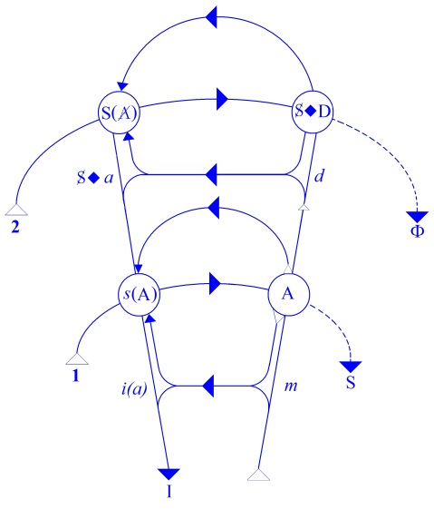
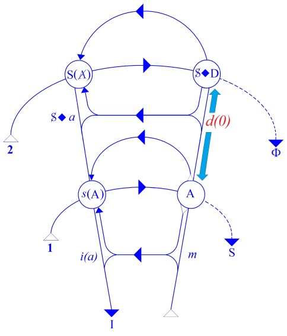
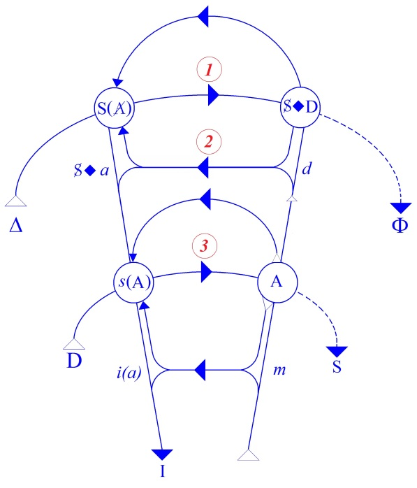
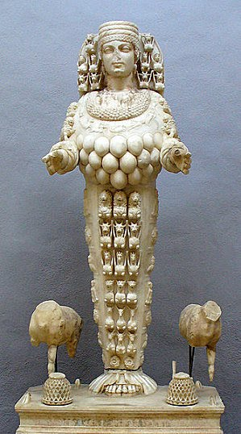

# Leçon 28 | 02 Juillet 1958

<!-- source-url: http://staferla.free.fr/S5/S5 FORMATIONS .docx -->
<!-- seminar: s5 -->
<!-- lesson: 28 -->

<!-- id: s5-28-0001 -->

Nous arrivons au bout du séminaire de cette année que j’ai mis sous le chef des *formations de l’inconscient*.
Peut-être pouvez-vous au moins voir l’opportunité de ce titre « *formations *» : *formes, relations,* peut-être *topologie.*
J’avais mes raisons pour éviter d’effaroucher tout de suite vos oreilles avec ces mots.

<!-- id: s5-28-0002 -->

Je pense que si *quelque chose* doit demeurer comme un pas, comme une marche, plus exactement comme
quelque chose sur quoi on peut poser le pied pour gravir l’échelon supérieur l’année prochaine, c’est quelque chose
qui vous montre qu’on ne saurait articuler quoi que ce soit qui relève à proprement parler des mécanismes
de l’inconscient qui sont le fondement de l’expérience et de la découverte de FREUD, à seulement faire état
de tensions considérées comme étant elles-mêmes seulement l’objet d’une sorte de progrès maturatif qui s’épanouit dans l’éventail du *prégénital* et du *génital*. Ceci d’une part.

<!-- id: s5-28-0003 -->

On ne peut pas non plus faire état seulement des relations d’identification telles qu’apparemment elles nous sont
\- je dis « *apparemment » -* données dans le cours de l’œuvre freudienne, si on voulait réduire ce rapport à une sorte

<!-- id: s5-28-0004 -->

de collection de per­sonnages, si vous voulez à la façon de la comédie italienne, dans lesquels viendraient
au premier plan par exemple les termes comme « *la mère* »*,* « *le père* »*,* voire même com­plétés de quelques autres.

<!-- id: s5-28-0005 -->

Ce que j’ai voulu montrer, c’est qu’il est impossible de rien articuler, ni dans ce progrès de la fixation du *désir*,

<!-- id: s5-28-0006 -->

ni d’autre part dans cette inter­subjectivité qui vient en effet *au premier plan de notre expérience* et de nos préoc­cupations dans l’analyse, si nous ne les situons pas par rapport à quelque chose qui s’appelle les conditions, les relations nécessaires qu’imposent, non seulement au désir de l’homme mais au sujet comme tel, des relations de signifiant.

<!-- id: s5-28-0007 -->

C’est pourquoi tout au long de cette année, j’ai essayé de vous familiariser avec ce « *petit graphe* » qu’il m’a paru,
quant à moi, opportun depuis quelque temps de mettre en usage pour supporter *mes expériences*, pour distinguer
des choses qui par exemple, pour prendre ce *signifiant* partout rencontré, *et pour cause* puisqu’il ne peut pas
ne pas être intéressé de façon directe ou indirecte chaque fois qu’il s’agit, non pas de n’importe quelle signification,
mais de *la signification* en tant qu’expressément engendrée par les conditions qu’impose à l’organisme,
cet organisme vivant qui est devenu le support, la proie, voire la victime de la parole, qui s’appelle l’homme.

<!-- id: s5-28-0008 -->

Je reprendrai ceci aujourd’hui, simplement pour vous mettre en somme au bord de *cette pluri-présence* je dirai,
du *signifiant phallus* dans un cas déterminé, toujours le même, celui qui nous occupe depuis quelques séances,
et pour simplement indiquer qu’il est extrêmement important de distinguer les places où, dans le sujet, ce *signifiant phallus* fait son apparition.

<!-- id: s5-28-0009 -->

Dire sans doute que « *la prise de conscience de l’envie du pénis est capitale dans une analyse de névrose obsessionnelle féminine »*,
c’est dire quelque chose qui va de soi, car si on n’avait jamais rencontré le *phallus* dans une analyse*,* qu’elle soit *fémi­nine* ou pas, d’une *névrose obsessionnelle*, et même de n’importe quelle névrose, ce serait vraiment bien étrange.
Il est possible qu’à force de pousser l’analyse dans un certain sens, celui qui est articulé dans *la psychanalyse* dite « *d’aujourd’hui »* [^65], à savoir la réduction des productions fantasmatiques du transfert à ce qu’on appelle
« *cette réalité si simple* », c’est-à-dire la situation analytique, à savoir qu’il y a là deux personnes qui, bien entendu,
n’ont rien à faire avec ces fantasmes.

<!-- id: s5-28-0010 -->

Quand on arrivera à réduire totalement les choses à ce *schéma*, on pourra peut-être arriver à se passer complètement du *phallus* dans *l’interprétation* d’une analyse. Mais jusque-là nous n’y sommes pas encore, car tout cela, ce sont des formulations incomplètes, et à la vérité aucune analyse ne se passe comme on la schématise dans ce bouquin.
Évidemment nous avons à faire quelque chose avec ce *signifiant phallus*, et dire que « *la prise de conscience est la clé* »
dans l’occasion de la solution *de la névrose obsessionnelle*, ce n’est naturellement pas dire grand chose.

<!-- id: s5-28-0011 -->

Car tout dépend, bien entendu, de la façon dont on l’interprétera, dont on le situera, dont on le compren­dra

<!-- id: s5-28-0012 -->

aux différents points où il apparaît. Et dans les points où il apparaît, il ne joue pas non plus *une fonction homologue* :
*tout ceci n’est pas plus réductible à une envie du pénis*, au sens où il s’agirait d’une rivalité avec le mâle, comme vraiment dans cette observation on finit tout de même en fin de compte par le formuler, à savoir assimiler les rapports de la malade avec son mari avec son analyste, avec les autres en général, ce qui est [*controuvé*](http://www.cnrtl.fr/definition/controuv%C3%A9) par l’observation elle-même.
Ce n’est évidemment pas sous cet angle que le *phallus* apparaît. Il apparaît en plusieurs points.

<!-- id: s5-28-0013 -->

Nous allons essayer simplement, sans prétendre faire, bien entendu, une analyse exhaustive d’une observation d’ailleurs donnée comme *une analyse non terminée*, et d’autre part, après tout comme nous n’avons que des documents qui sont partiels mais assurément tout de même assez posés, nous permettre d’en prendre une idée juste. Je voudrais d’abord commencer par vous faire quelques remarques qui amorce­ront pour vous certaines autres propriétés

<!-- id: s5-28-0014 -->

de ce *graphe* dont nous nous servons.

<!-- id: s5-28-0015 -->

Il y a quelque chose qui apparaît dans cette *observation*, qui nous est signalé comme étant *le sentiment de culpabilité très vif* qui accompagne chez la patiente ses obses­sions, par exemple ses obsessions religieuses, et si l’on peut dire *le paradoxe* que représente l’apparition si marquée qui vise *des sentiments de culpabilité* dans les névroses obsessionnelles,

<!-- id: s5-28-0016 -->

alors qu’assurément il semblerait que le sujet puisse consi­dérer *les pensées parasitaires* qui lui sont imposées - comme il le fait d’ailleurs d’une façon *corrélative -* comme quelque chose qui lui est en quelque sorte étranger, dont il est plus la victime que *le responsable*. Ceci nous permettra peut-être d’essayer d’articuler quelque chose sur *ce senti­ment de culpabilité*.

<!-- id: s5-28-0017 -->

En somme, depuis quelque temps on ne parle plus guère que du terme de *surmoi* qui semble ici avoir tout *couvert*.
On ne peut pas vraiment dire qu’il ait beaucoup éclairci les choses, car à la vérité si vous voulez regarder les choses de près, et très précisément considérer ce qui a été apporté dans la notion que le *surmoi* est quelque chose
de beaucoup plus ancien, archaïque comme formation, que ce qu’on avait pensé tout d’abord.

<!-- id: s5-28-0018 -->

On avait en effet pensé tout d’abord que le *surmoi* pouvait être considéré comme *la création correspondante des deux complexes :* *d’Œdipe* et *de castration*, et pour tout dire, comme on l’avait écrit, l’introjection du personnage considéré comme éminemment interdicteur dans le *complexe d’Œdipe*, à savoir le personnage paternel. Et vous savez que
toute l’expérience nous a forcés de montrer qu’il y avait un *surmoi* plus ancien, vous verrez que ce quelque chose,
qui par certains côtés nous imposait cette origine plus ancienne n’était pas sans rapport :

<!-- id: s5-28-0019 -->

- ni d’une part, avec *les effets d’introjection,*

<!-- id: s5-28-0020 -->

- ni d’autre part, avec *les effets d’interdic­tion.*

<!-- id: s5-28-0021 -->

Mais tâchons quand même de regarder les choses de plus près. Voilà une névrose obsessionnelle et, comme dans toute névrose, que nous avons d’abord à faire apparaître, en tant justement que nous ne sommes pas *des hypnoti­seurs*, que nous ne traitons pas par *la suggestion*, mais que c’est en un point au-delà que nous donnons en quelque sorte
au sujet un rendez-vous.

<!-- id: s5-28-0022 -->

<!-- id: s5-28-0023 -->

À ce point qui est figuré ici par la 2ème ligne, la ligne supérieure \[2\], *l’horizon*, si vous voulez, *de l’articulation signifiante*.
*Et de là, le sujet* - comme je vous l’ai expliqué longuement la dernière fois - *est confronté à sa demande*.

<!-- id: s5-28-0024 -->

Cela ne peut pas vouloir dire autre chose, quand nous parlons de ce processus alternant de régression
et d’identification successives, les deux alternant puisque dans la mesure où il en rencontre une en régressant,
il stoppe sur le chemin d’une régression qui toute entière s’inscrit en somme dans cette ouverture rétroactive
qui s’ouvre au sujet dès qu’il articule simplement sa parole, c’est-à-dire pour autant que la parole fait surgir tout l’arriéré et toute l’histoire, *jusqu’à son origine*, de cette demande dans laquelle toute sa vie d’homme parlant s’est insérée.

<!-- id: s5-28-0025 -->

Si nous y regardons de près, et sans d’ailleurs faire là autre chose que de retrou­ver ce qui a été toujours articulé concernant *la névrose obsessionnelle*, il y a une forme fondamentale pour *la névrose obsessionnelle*, que nous trouvons dans cette *demande*, à l’horizon de toute *demande* du *sujet*. Et justement, ce qui chez lui fait le plus obstacle à l’articulation

<!-- id: s5-28-0026 -->

de cette *demande*, c’est ce quelque chose que l’expé­rience vous apprend à qualifier d’« *agressivité* », qui nous a portés
de plus en plus vers la considération et l’accès de ce qu’on peut appeler « *vœu de mort ».*

<!-- id: s5-28-0027 -->

La difficulté inaugurale, la difficulté majeure devant laquelle, si l’on peut dire, se brise, se fragmente, se désarticule,

<!-- id: s5-28-0028 -->

*la demande de l’obsessionnel*, ce qui motive l’ac­cumulation de toutes les défenses, et très primordialement chez les grands obsédés, ce silence si souvent prolongé que vous avez toutes les peines du monde parfois à vaincre au cours
d’une analyse, et je l’évoque ici parce que c’est précisément ce qui nous est évoqué dans le cas sur lequel je me fonde,
c’est bien que *cette demande est une demande de mort*.

<!-- id: s5-28-0029 -->

En fait il est très frappant de le voir absolument étalé, répété tout au long de l’observation, sans être jamais
à proprement parler articulé. Comme si la chose faisait partie de je ne sais quelle expression naturelle d’une tension qui est au fond le rapport de cette *demande de mort* avec la difficulté d’articulation elle-même, qui pourtant est connotée dans les mêmes pages à quelques lignes près, et qui n’est absolument jamais mise en relief.

<!-- id: s5-28-0030 -->

Et pourtant n’est-ce pas là quelque chose qui demande que nous nous y arrêtions ?
Si cette demande est *demande de mort*, si cette demande est ce qui dessine l’ho­rizon de la demande de *l’obsessionnel*,

<!-- id: s5-28-0031 -->

c’est parce que ses premiers rapports avec l’Autre, comme nous l’enseigne la théorie de FREUD,
ont été essentiellement faits de cette contradiction : que la demande qui s’adresse à l’Autre dont tout dépend,

<!-- id: s5-28-0032 -->

abou­tit, a pour horizon - pour une raison qui du reste à ce moment est attachée à la patère du point d’interrogation...

<!-- id: s5-28-0033 -->

> Parce qu’il ne faut pas nous précipiter, nous verrons après pourquoi et comment cela peut se concevoir.
>
> Ce n’est pas *si simple* de parler - avec Mme Mélanie KLEIN - de « *pulsion agressive primordiale* ». Si nous partons de là, lisons la sorte de *mauvaiseté* primordiale de ce nourrisson dont le marquis de SADE nous souligne que son premier mouvement était, après tout, et s’il le pouvait, de mordre et de déchirer le sein de sa mère.
>
> Bien sûr, à la vérité cette articulation du problème du désir dans sa perversité fon­cière, c’est bien quelque chose dont ce n’est pas en vain que cela nous ramène à cet horizon du « *divin marquis* » qui, vous le savez, n’est pas le seul de son temps à avoir posé d’une façon très intense et très aiguë, cette question
>
> sur les rapports du *désir* et de « *la nature* », sur cette « *harmonie* » ou « *dysharmonie* » foncière qui fait en somme le fond de cette interrogation passionnée qui est absolument inséparable de toute la philosophie dite de l’*Aufklärung,* qui portait tout \[...\] de littérature du temps, sur laquelle, dans des séminaires anciens - je pense à mes premiers séminaires - j’avais pris appui pour montrer une analogie sur laquelle je reviendrai l’année prochaine à propos du *désir,* cette parenté entre l’interrogation première et l’interrogation sur la limite* :*

<!-- id: s5-28-0034 -->

- à sa *clarté philosophique* \[cf. Aufklärung\],

<!-- id: s5-28-0035 -->

- mais aussi à tout son accompagnement, à tout *son thème d’érotisme littéraire,* qui en est le corrélatif absolument indispensable.

<!-- id: s5-28-0036 -->

...Donc cette *demande de mort* nous ne savons pas d’où elle vient. Avant de nous dire qu’elle surgit des instincts
les plus primordiaux, d’une nature retournée contre elle-même, commençons seulement de la situer là où elle est, c’est-à-dire au niveau où, je ne dirai pas qu’elle s’articule, mais où *elle empêche toute articulation de la demande du sujet*,
où elle fait obstacle au discours de *l’obsessionnel*, aussi bien quand il est seul avec lui-même que quand il commence son analyse, quand il se trouve dans ce désarroi que nous décrit notre analyste en l’occasion. C’est à savoir
cette sorte d’impossibilité de parler qu’a son analysé au début de son analyse, qui ne se traduit que par des reproches,
voire des injures, voire l’étalage, l’articulation de tout ce qui fait obstacle à ce qu’une malade parle à un médecin :

<!-- id: s5-28-0037 -->

« ...*je connais assez bien les médecins pour savoir qu’entre eux ils se moquent de leurs malades* \[...\]
*Vous êtes plus instruit que moi* \[...\] *C’est impossible à une femme de parler aux hommes* \[...\] » \[R.F.P. 1950, p. 221.\]

<!-- id: s5-28-0038 -->

C’est *un déluge* qui montre là simplement le surgissement corrélatif de l’activité de *la parole*, de cette difficulté de l’articulation simple, quelque chose qui d’aucune façon puisse évoquer à l’horizon *le fond de cette demande* qu’il y a déjà dans le fait d’entrer dans le champ de la thérapeutique analytique, qui est là en fait ce qui se pré­sente tout de suite.

<!-- id: s5-28-0039 -->

Cette *demande de mort*, si *elle se situe* là où nous l’avons mise, c’est-à-dire *à cet horizon de la parole*, dans cette implication qui fait le fond de toute articulation possible de *la parole,* si c’est elle qui fait obstacle, je pense que ce schéma
vous montrera peut-être un peu mieux que cette articulation logique peut se faire aussi, mais non sans quelques

<!-- id: s5-28-0040 -->

sus­pensions ou arrêts de la pensée : que si la *demande de mort* est quelque chose qui représente pour le sujet *obses­sionnel* *cette sorte d’impasse* d’où résulte ce qu’on appelle improprement *ambiva­lence*, et qui est plutôt *ce mouvement de balancement ou d’escarpolette* dans lequel *l’obsessionnel* est renvoyé comme aux deux butées d’une impasse dont il ne peut pas sortir,
si effectivement cette *demande de mort* est ce quelque chose qui - comme le schéma l’articule - nécessite d’être formulé *au lieu de l’Autre, dans le discours de l’Autre,*

<!-- id: s5-28-0041 -->

- ce n’est pas simplement en raison d’une histoire de *quoi que ce soit* qui inté­resse, par exemple la mère comme ayant été l’objet de ce souhait de mort à propos de quelque frustration,

<!-- id: s5-28-0042 -->

- c’est essentiellement et d’une façon interne, *la demande de mort* en tant qu’elle concerne cet Autre, parce que cet Autre est le lieu de la demande, *implique la mort de la demande*.

<!-- id: s5-28-0043 -->

La *demande de mort* ne peut pas se soutenir chez *l’obsessionnel* - c’est-à-dire en tant qu’il est organisé selon les lois de l’articulation signifiante - sans en elle-même entraîner cette sorte de *destruction* que nous appelons ici *mort de la demande.*
Elle est condamnée à ce balancement sans fin qui fait que dès qu’elle ébauche son articulation,
cette articulation s’éteint. Et c’est bien cela qui fait le fond de la difficulté d’articulation de la position de *l’obsessionnel*.

<!-- id: s5-28-0044 -->

<!-- id: s5-28-0045 -->

C’est bien cela aussi qui nous fait dire qu’entre :

<!-- id: s5-28-0046 -->

- le rapport de *l’obsessionnel,* du sujet obsessionnel à *sa demande* \[S **◊** D\],

<!-- id: s5-28-0047 -->

- et ce *maintien de l’Autre* \[A\] qui lui est si paniquement nécessaire mais qui le maintient,
  car sans cela il serait autre chose qu’un *obsessionnel*
  nous trouvons *ce désir* \[*d(0)*\] en lui-même annulé, mais dont la place est maintenue, *ce désir* que nous avons caractérisé par une *Verneinung,* car il est exprimé, mais sous la forme négative, celle sous laquelle nous le voyons effectivement dans l’analyse apparaître.

<!-- id: s5-28-0048 -->

Quand l’analysé nous dit : « *Ce n’est pas que je pense à telle ou telle chose* », qu’il nous articule ce qui est *un désir* *agressif*, *désapprobatif*, *dépréciatif* à notre égard, il manifeste en effet là quelque chose qui est bien son désir, mais il ne peut
le manifester - c’est là le fait que nous donne l’expérience concernant la *Ver­neinung -* il le manifeste sous ce fond *dénié*.

<!-- id: s5-28-0049 -->

Comment se fait-il que cette forme déniée ne soit pas moins corrélative d’un sen­timent de culpabilité,

<!-- id: s5-28-0050 -->

puisqu’en somme elle est déniée ?

<!-- id: s5-28-0051 -->

C’est là je crois que notre *schéma* va nous permettre quelques *distinctions* qui nous resserviront par la suite. Je crois que les obscurités concernant les incidences du *surmoi* qui ont corres­pondu à l’extension de notre expérience concernant cette instance proviennent très essentiellement de ceci, qu’il convient de distinguer concernant la culpabilité :
qu’après tout il y a un rapport du *sujet à la Loi*, mais que la culpabilité naît sans aucune espèce de référence à cette *Loi*. C’est le fait que nous a apporté l’expérience analytique.

<!-- id: s5-28-0052 -->

En d’autres termes, le pas, si l’on peut dire « *naïf* » de la dialectique du rapport du « *péché* » à la *Loi*, depuis qu’il nous a été articulé dans la parole de Saint PAUL, à savoir que « *c’est la Loi qui fait le péché* », d’où il résulterait - j’y ai insisté dans un temps en évoquant la phrase du vieux KARAMAZOV : « *S’il n’y a pas de Dieu, alors tout est per­mis* ».

<!-- id: s5-28-0053 -->

Il est tout à fait clair que ce que l’expérience nous apporte - il a fallu l’analyse pour nous l’apporter et c’est bien naturellement une des choses les plus étranges qui soient - ce que l’expérience montre, c’est qu’il n’y a aucun besoin d’*une référence* quelconque, ni à Dieu, ni à sa *Loi* pour que *l’homme baigne littéralement dans la culpabilité*. Il semble même qu’on puisse formuler l’expression contraire, à savoir que « *Si Dieu est mort* - comme on l’a dit - *plus rien n’est permis* ».
J’ai déjà raconté tout cela dans son temps.

<!-- id: s5-28-0054 -->

Comment donc allons-nous pouvoir essayer de comprendre et d’articuler ce rapport tel qu’il surgit dans la vie
du sujet névrotique, qui s’appelle apparition du « *sentiment de culpabilité* » ? Rapportons-nous aux premiers pas
de l’analyse dans ce sens. À quel propos FREUD l’a-t-il d’abord fait apparaître comme fondamental,
comme concernant une manifestation subjective essentielle du sujet ? C’est à propos du *complexe d’Œdipe *:

<!-- id: s5-28-0055 -->

très exactement pour autant que les conte­nus de l’analyse faisaient surgir pour nous - quoi ? –

<!-- id: s5-28-0056 -->

- Le rapport d’*un désir* qui n’était *pas n’importe lequel*, un désir jusque là profondément caché : *le désir pour la mère*,

<!-- id: s5-28-0057 -->

- avec quoi ? avec l’intervention d’un personnage qui est ce père, tel qu’il a surgi des pre­mières appréhensions du *complexe d’Œdipe *: destructeur.

<!-- id: s5-28-0058 -->

Et ce *Père* qui nommé­ment intervient sous la forme des *complexes* donnés d’abord par *les fantasmes de cas­tration*…

<!-- id: s5-28-0059 -->

> également : découverte de *l’analyse*, découverte dont on n’avait pas le moindre soupçon avant *l’analyse*, découverte dont je crois que je vous ai cette année articulé le lien avec la nécessaire impensabilité
> …en dehors du fait que le *phallus* a ce rôle très précisément d’être porté à la *signification, signifiant* *une image*,
> *une image privilégiée, vitale*, à savoir *l’image du phallus*, mais qui ici prend fonction de ce quelque chose
> qui en somme va marquer cette sorte d’incidence, d’impact dans lequel *le désir* est frappé par l’interdiction \[→ *d(0)*\].

<!-- id: s5-28-0060 -->

<!-- id: s5-28-0061 -->

En fait, si nous voulons distinguer les trois étapes qui correspondent strictement à celles qui sont là schématisées :
1, 2, 3 et dans lesquelles tout ce qui se rapporte dans notre expérience au *surmoi* doit s’articuler, nous dirons que,
au niveau de cette ligne d’horizon qui précisément est celle qui ne se formule pas chez le névrosé - c’est pré­cisément pour cela qu’il est névrosé - ici règne *le commandement*, appelez-le comme vous voudrez, appelez-le *les 10 commandements*
à l’occasion, pourquoi pas ? Puisque je vous ai dit que *les 10 commandements* étaient très probablement *les comman­dements*

<!-- id: s5-28-0062 -->

qui sont *les lois de la parole*, à savoir que tous les désordres commencent à entrer dans le fonctionnement de *la parole*
à partir du moment où les *les 10 commandements* ne sont pas respectés.

<!-- id: s5-28-0063 -->

Prenons-les là sous une forme quelconque. Il s’agit de *la demande de mort*, et c’est évidemment le « *Tu ne tueras point* » qui est là à l’horizon pour en faire le drame. Mais vous voyez que ce n’est pas non plus parce que ce qui, *comme réponse*,
a cette place pour châtier celui qui tue, qu’effectivement *le com­mandement* prend son impact.

<!-- id: s5-28-0064 -->

C’est très précisément parce que *la demande de mort* - pour des raisons qui tiennent à la structure de l’Autre
pour l’homme - *la demande de mort* est équivalente à *la mort de la demande*. Ceci, c’est le niveau du commandement.
Ce *niveau du commandement* existe, il existe tellement bien qu’à la vérité il émerge, il émerge tout seul.

<!-- id: s5-28-0065 -->

N’oubliez pas que si vous lisez les notes qu’a prises FREUD sur son cas d’*obsessionnel* : *L’homme aux rats,* il vous dira...
il s’agit du *supplément* publié dans la *Standard Edition,* dans ce très joli complément où nous voyons dans

les notes certains éléments chronologiques appa­raître, notes qui restent tout à fait précieuses à connaître
...il vous dira que d’abord, ce dont le sujet lui parle comme *contenu obsessionnel*, ce sont *des commande­ments* qu’il reçoit.

<!-- id: s5-28-0066 -->

Et vous savez l’importance de ces commandements que le sujet reçoit :

<!-- id: s5-28-0067 -->

> « *Tu passeras ton examen avant telle date*… »
> ou
> « *Que se passerait-il, dit-il, si je recevais le commandement : «Tu vas te trancher la gorge » ?* »

<!-- id: s5-28-0068 -->

Et vous savez dans quel état de panique il entre quand le commandement lui vient à l’esprit :
« *Tu vas trancher la gorge à la vieille dame* » qui à ce moment, retient loin de lui son amie. Nous voyons aussi apparaître ces commandements dans un autre contexte, et de la façon la plus claire, chez les psychotiques, dont vous savez

<!-- id: s5-28-0069 -->

que ces commande­ments ils les reçoivent, et c’est bien un des points fermes de la classification du psy­chotique

<!-- id: s5-28-0070 -->

de savoir dans quelle mesure il leur obéit. Bref, l’autonomie de cette fonc­tion à l’horizon du rapport du sujet

<!-- id: s5-28-0071 -->

à *la parole du commandement* est quelque chose que nous ne pouvons tenir que pour fondamental.

<!-- id: s5-28-0072 -->

Ce *commandement* peut donc rester *voilé*. Il est *voilé*, il est *fragmenté*, il n’ap­paraît que par morceaux chez notre *obsessionnel*.

<!-- id: s5-28-0073 -->

Et *la culpabilité*, où allons-nous la situer ? *La culpabilité*, comme dirait Monsieur de La PALICE, c’est *une demande*
*« sentie comme interdite »*, et à la vérité, on sent bien habituellement là - et je dirai que tout se noie dans le terme d’*interdiction,* la notion de demande restant éludée lorsqu’il semble que les deux aillent ensemble. Ce n’est pas certain pourtant, comme nous allons le voir - qu’il y a quelque chose dont phénoménologiquement je vous prie de retenir
la dimension essentielle, et dont on est véritablement stupéfait qu’aucun analyste, sinon aucun phénoménologiste n’ait fait état. Pourquoi est-elle *« sentie comme interdite »* ?

<!-- id: s5-28-0074 -->

*Si elle était purement et simplement sentie comme interdite* parce que, comme on dit, c’est défendu, *il n’y aurait aucune espèce*
*de problème*. Comment la voyons-nous apparaître dans la clinique au niveau du point où nous sommes habitués à dire que la culpabilité intervient ? Les distinctions que nous avons faites, nous les avons faites à articuler ce dont il s’agit, et elles nous aideront peut-être à arti­culer ce qu’on appelle *culpabilité névrotique,* qui consiste en quoi ? Il est un fait quand même qu’on ne l’articule pas comme telle et qu’on n’en fait pas *un critère*. Or il est essentiel d’en faire *un critère*.

<!-- id: s5-28-0075 -->

*La demande est « sentie comme interdite »*, une *demande*, ou plus exactement *un sentiment de culpabilité*, en tant que c’est
une telle approche de *demande* - et c’est précisément en quoi il se distingue de l’angoisse diffuse dont vous savez combien c’est différent d’une demande - *« sentie comme interdite »* qui appelle le surgissement du *sentiment de culpabilité,*
*cette demande est « sentie comme interdite » parce qu’elle tue le désir*.

<!-- id: s5-28-0076 -->

C’est dans *le rapport du désir à la demande,* dans le fait que tout ce qui va dans la direction d’une certaine *formulation*
de la *demande* s’accompagne, par un ressort, par un mécanisme dont nous voyons ici les traits, les fils écrits dans ce *petit graphe* sur le tableau, mais qui, justement parce qu’il est dans ce *petit graphe*, justement pour cela, ne peut être senti, déterminé dans son ressort, vécu dans son ressort par le sujet.

<!-- id: s5-28-0077 -->

Parce que le sujet, lui, est condamné à être toujours à quelqu’une de ces places, mais il ne peut être à aucune
de ces places toutes en même temps : c’est cela qui est la culpabilité, c’est ce quelque chose où apparaît l’interdiction, non pas cette fois en tant qu’elle formule, mais en tant qu’elle frappe le *désir*, qu’elle le fait disparaître, qu’elle le tue.
Voilà donc quelque chose de clair : c’est pour autant que *l’obsessionnel* est condamné à mener sa bataille de salut,
pour son autonomie subjective, comme on s’exprime, au niveau du *désir* \[2\], que tout ce qui apparaît à ce niveau
de *désir*, même sous une forme déniée, est lié à cette *culpabilité*.

<!-- id: s5-28-0078 -->

Et au-dessous de cela, c’est-à-dire *au* 3ème *niveau*, au niveau que nous appellerons en cette occasion - personne
ne contestera ce repérage - celui du *surmoi*, que l’on appelle, je ne sais trop pourquoi, dans l’observation
que nous avons suivie dans la *Revue de Psychanalyse, « surmoi fémi­nin »*. Pourquoi « *féminin* » ? Disons « *maternel* »*.*

<!-- id: s5-28-0079 -->

Enfin il est ordinairement considéré comme le *surmoi* *maternel* dans tous les autres textes du même registre.
Il y a là une anomalie inhérente à l’observation elle-même et à cette sorte d’obsession engendrée par le fait
qu’il s’agit là de *l’envie de pénis* et de quelque chose qui intéresse *la femme* comme telle.

<!-- id: s5-28-0080 -->

Dans ce *surmoi maternel*, ce *surmoi archaïque*, ce *surmoi* auquel sont attachés les effets du surmoi primordial
dont parle Mélanie KLEIN, il s’agit de quelque chose, bien sûr, dont nous comprenons maintenant qu’il ait été mis,
si l’on peut dire, *dans la même perspective*, dans la même ligne de mire, que ce qui se produit *au niveau du commandement*,
de la culpabilité, lié en somme, vous le voyez, à *l’Autre de l’Autre*. \[*le « Nom du père »*, *clé de voûte du lieu de la parole*\]

<!-- id: s5-28-0081 -->

Au niveau du *premier Autre* - en tant qu’il est le support pur et simple des *pre­mières demandes*, des *demandes* si je puis dire émergentes, de ces premières *articu­lations vagissantes* de son besoin au niveau duquel on insiste tellement de nos jours, des premières frustrations - qu’avons-nous là ?

<!-- id: s5-28-0082 -->

Nous avons ce que l’on a appelé *dépendance,* et en effet, c’est bien autour de ce quelque chose qui s’appelle *dépendance* que tout ce qui est du *surmoi maternel* s’articule. Ici, qu’est-ce qui fait que nous pouvons le mettre *dans le même registre*
et non pas le distinguer foncièrement ? Cela veut dire que déjà cette *structure* à deux étages que nous voyons ici
doit y être. S’il n’y avait au départ que « *le nourrisson* » et « *la mère* », *si la relation était duelle*, ce serait quelque chose
de tout à fait différent de ce que nous avons articulé dans le rapport au *commandement*, dans le rapport de *la culpabilité*.
C’est très précisément parce qu’il faut admettre dès l’origine que, par le seul fait qu’il s’agit du signifiant,
il y ait ces *deux horizons de la demande*.

<!-- id: s5-28-0083 -->

Ce que je vous ai expliqué en vous disant que même derrière *la demande* la plus primitive, celle du *sein* et l’objet
que représente le sein maternel, il y a ce dédoublement créé dans la demande par le fait que la demande
est *demande d’amour* et *demande absolue*. *Demande qui symbolise l’Autre* comme tel, qui distingue donc :

<!-- id: s5-28-0084 -->

- *l’autre comme objet réel*, capable de donner telle *satisfaction*,

<!-- id: s5-28-0085 -->

- *de l’Autre en tant qu’objet symbolique* qui donne ou qui refuse, ce qu’on appelle « *présence* » ou « *absence* » et qui est la matrice dans laquelle vont se cristalliser ces rapports fonciers qui sont *à l’horizon de toute demande*,
  ces rapports qui s’appelleront *l’amour* d’une part, *la haine* d’autre part, et *l’ignorance* bien entendu.

<!-- id: s5-28-0086 -->

C’est parce que le premier rapport de dépendance est lié à cette menace qui s’ap­pelle *perte d’amour,*

<!-- id: s5-28-0087 -->

et non pas simplement à cette menace qui s’appelle faim ou *pri­vation des soins maternels,* qu’il est quelque chose

<!-- id: s5-28-0088 -->

qui déjà en soi est homogène à ce qui dans la suite s’organisera, s’articulera dans la perspective des *lois de la parole*.
Elles sont d’ores et déjà ici instantes, virtuelles, préformées dès la première *demande*. Elles ne sont pas complétées, elles ne sont pas articulées, et c’est pour cela qu’un nourrisson ne commence pas, dès sa première tétée à être
*un obsessionnel*, mais dès sa première tétée, il peut déjà fort bien commencer à créer cette béance qui fera que ce sera précisément dans *le refus de s’alimenter qu’il trouvera le témoignage* exigé par lui *de l’amour* de son partenaire maternel.

<!-- id: s5-28-0089 -->

Autrement dit, nous pourrons voir appa­raître très précocement les manifestations de l’anorexie mentale.

<!-- id: s5-28-0090 -->

Qu’est-ce qui spécifie le cas de *l’obsessionnel* ? Ce qui spécifie le cas de *l’obsessionnel*, qui est donc suspendu justement
à la formation précoce, à cet horizon du rapport de la demande, de ce qu’ici nous avons d’abord articulé comme *demande de mort* - *demande de mort*, ce n’est pas purement et simplement, et de soi, tendance mortifère,
c’est une demande articulée. Et du seul fait qu’elle est articulée, c’est jus­tement pour cela

<!-- id: s5-28-0091 -->

- *qu’elle ne se produit pas à ce niveau de rapport à l’autre*,

<!-- id: s5-28-0092 -->

- *qu’elle n’est pas relation duelle,*

<!-- id: s5-28-0093 -->

- *qu’elle vise, au-delà de l’autre, son être, son être symbolisé.*

<!-- id: s5-28-0094 -->

Et c’est aussi pour cela d’ailleurs qu’elle est ressentie, vécue par le sujet dans son retour \[A → γ\] : c’est que le sujet,
parce qu’il est un sujet parlant et uniquement à cause de cela, ne peut pas atteindre *l’Autre*, sans s’atteindre *lui-même*,
et que la *demande de mort* est *mort de la demande*. C’est à l’intérieur de cela que va se situer tout ce que j’appellerai
« *les avatars du signifiant phallus* » parce qu’à la vérité je ne vois aucune espèce de façon de ne pas tomber dans *la stupeur et l’étonnement* quand on le voit en effet - une fois qu’on sait lire -resurgir en tous les points de cette phénoménologie de *l’obsessionnel*. Rien d’autre ne permet de concevoir cette espèce de « *polyprésence du signifiant phallus* » au niveau
des différents *symptômes*, si on n’en fait pas essentiellement, si on ne trouve pas là la confirmation de la fonction
du *phallus* comme « *signifiant de l’incidence du signifiant sur le vivant* » en tant que, par son rapport à la parole,

<!-- id: s5-28-0095 -->

il est voué à se frag­menter en toutes sortes d’effets de signifiant.

<!-- id: s5-28-0096 -->

Que trouvons-nous ? On nous dit que cette femme est possédée par *le penisneid.* Je veux bien, mais alors pourquoi
la première chose que nous rencontrons dans l’observation elle-même concerne ses obsessions ? Et la première
qui nous est citée est la crainte obsédante d’avoir contracté la syphilis, ce qui l’amena, écrit-on, à s’oppo­ser, en vain d’ailleurs, au mariage de son fils aîné, de ce fils dont je vous ai fait gran­dement état dans la signification qu’il prend tout au long du cours de cette obser­vation. En fin de compte voilà donc ceci, c’est assez simple :
des miracles et des tours de passe-passe auxquels nous ferions bien de porter toujours attention en tant que tels,
de nous dire qu’il conviendrait de temps en temps de refaire briller un peu, de lus­trer notre capacité d’étonnement.

<!-- id: s5-28-0097 -->

Que voyons-nous chez les sujets obsessionnels mâles ? la crainte d’être contaminé et de contaminer.

<!-- id: s5-28-0098 -->

C’est quelque chose dont l’ex­périence courante nous montre à quel point elle est importante.
*L’obsessionnel* mâle a été en général assez précocement initié aux dangers des maladies dites *vénériennes*,
et chacun sait la place que cela peut tenir dans sa psychologie dans un très grand nombre de cas.
Je ne dis pas que ce soit constant, mais nous sommes habitués à l’in­terpréter comme quelque chose

<!-- id: s5-28-0099 -->

qui va bien au-delà de la rationnalité de la chose, ceci existe dans HEGEL, comme toujours.

<!-- id: s5-28-0100 -->

Et si les choses depuis quelque temps vont si bien grâce à quelques interventions médicamenteuses,
il n’en reste pas moins que *l’obsédé* reste très *obsédé* concernant tout ce que peuvent engendrer ses actes impulsifs
dans l’ordre libidinal, et que nous, nous serons habitués à le considérer comme quelque chose qui est quoi ?

<!-- id: s5-28-0101 -->

C’est à savoir que sous cette impulsion libidi­nale, l’impulsion agressive transparaît, qu’en quelque sorte le *phallus*

<!-- id: s5-28-0102 -->

est quelque chose de dangereux. Si nous nous en tenons à la notion que le sujet est dans un rapport, si l’on peut dire, d’exigence narcissique à l’endroit du *phallus*, il nous apparaît très difficile de le motiver. Pourquoi ?

<!-- id: s5-28-0103 -->

Justement parce qu’à ce niveau la patiente en fait *cet usage* qui est strictement équivalent à celui qu’en fera un homme, à savoir que, par l’intermé­diaire de son fils, cette femme se considère comme dangereuse. Elle le donne à cette occasion comme en quelque sorte son prolongement, c’est-à-dire que par consé­quent nul *penisneid* ne l’arrête, elle l’a, sous la forme de ce fils, elle l’a bel et bien, ce *phallus*, puisque c’est sur lui qu’elle va cristalliser la même obsession qu’un malade mâle fera à cette occasion. *Les obsessions infanticides qui suivent, voire les obsessions d’empoisonnement et les autres*, je ne vais pas ici m’y éterniser. Ce qu’on peut dire c’est que quelque chose très vite dans l’observation et dans toute
sa portée *va venir donner confirmation* à ce que nous avançons sur ce sujet, et ceci je le lis parce que cela vaut la peine :

<!-- id: s5-28-0104 -->

« ...*la violence même de ses plaintes contre sa mère était le témoignage de l’affection immense qu’elle lui portait*. » \[p. 219\]

<!-- id: s5-28-0105 -->

nous dit-on, après avoir fait quelques ronds de jambe autour de la possibilité ou non possibilité d’une relation vraiment œdipienne, en agi­tant des arguments qui sont complètement étrangers à la question.

<!-- id: s5-28-0106 -->

« *Elle la trouvait d’un milieu plus élevé que celui de son père, la jugeait plus intelligente et, surtout, était fascinée*
*par son énergie, son caractère, son esprit de décision, son autorité*. » \[p. 219\]

<!-- id: s5-28-0107 -->

C’est la première partie d’un paragraphe où il s’agit de nous faire voir *quelque chose* qui incontestablement existe,
à savoir le déséquilibre de la relation parentale, le côté je dirai opprimé, voire déprimé du père en présence
d’une mère qui peut avoir été avant tout virile. C’est ainsi que l’on interprète le fait que le sujet exige en quelque sorte que l’attribut phallique, à quelque titre, lui soit lié.

<!-- id: s5-28-0108 -->

« *Les rares moments où la mère se détendait la remplissaient d’une joie indicible.*
*Mais, jusqu’ici, il n’a jamais été question de désirs de possession de la mère franche­ment sexualisés.* » \[p. 219\]

<!-- id: s5-28-0109 -->

Il n’y a pas trace de *quoi que ce soit* qui y ressemble. Voyez comme on s’exprime :

<!-- id: s5-28-0110 -->

> « *Renée était liée à elle sur un plan exclusivement sadomasochique. L’alliance mère-fille jouait ici avec une extrême rigueur*
> *et toute transgression du pacte provoquait un mouvement d’une violence extrême qui, jusqu’à ces derniers temps,*
> *ne fut jamais objectivée. Toute personne s’immisçant dans cette union était l’objet de souhaits de mort*... » \[p. 219\]

<!-- id: s5-28-0111 -->

Ce point-ci est vraiment important, et vous ne le retrouverez pas seulement dans *les névroses obsessionnelles*.

<!-- id: s5-28-0112 -->

Mais ces liens puissants de fille à mère, sous quelque angle que nous en voyions l’incidence dans notre expérience analytique, cette sorte de nœud où nous nous trouvons une fois de plus devant *quelque chose* qui va au-delà
d’une espèce de distinction, je dirai de la distinction charnelle entre les êtres qui fait que ce qui s’exprime là,
c’est exactement *cette ambiguïté, cette ambivalence*, comme je l’ai appelée tout à l’heure, qui fait *équivaloir* *la demande de mort*
à *la mort de la demande,* mais qui nous montre en outre que *la demande de mort* est là - je ne dis rien de nouveau,
car FREUD s’en est fort bien aperçu à l’occasion - *la demande de mort* que Madame Mélanie KLEIN

<!-- id: s5-28-0113 -->

essayera de nous référer aux « *pulsions agressives pri­mordiales* » du sujet.

<!-- id: s5-28-0114 -->

Mais l’observation nous montre que ce n’est pas simplement le lien qui unit le sujet à la mère, *la demande de mort*,
c’est la demande de la mère elle-même. C’est en tant que la mère porte en elle cette *demande de mort* - et toute

<!-- id: s5-28-0115 -->

l’ob­servation nous le montre - qu’elle l’exerce sur ce malheureux personnage paternel, brigadier de gendarmerie,
qui malgré sa bonté et sa gentillesse dont la malade parle d’abord, se montre toute sa vie chagriné, déprimé, taciturne, n’arrivant pas à sur­monter la rigidité de la mère ni à triompher de l’attachement de sa femme à un pre­mier amour, d’ailleurs platonique, jaloux et ne rompant son mutisme que pour une demande dont il sortait toujours vaincu.

<!-- id: s5-28-0116 -->

Personne ne doute, bien sûr, que la mère n’y soit là pour quelque chose. On nous dit que l’on traduit cela sous l’angle et sous la forme de ce qu’on appelle « *la mère castratrice ».* À l’occasion, peut-être, y a-t-il lieu de regarder les choses
de plus près et de voir qu’en somme, ici le terme de « *demande de mort »* vaut beaucoup plus pour cet homme
que « castration », « privation de l’objet aimé », que semble avoir été la mère.

<!-- id: s5-28-0117 -->

Et l’inauguration chez lui de cette position dépressive est bien celle que FREUD nous apprend à reconnaître
comme étant déterminée par un souhait de mort sur soi-même. Mais sur soi-même en tant qu’il vise quoi ?
Un objet aimé et perdu. Bref, *la dialectique de la demande de mort*, en tant qu’elle est déjà et ici présente à la génération antérieure, est-ce que c’est la mère qui l’incarne ?

<!-- id: s5-28-0118 -->

C’est cette *demande de mort* en tant que justement elle n’est ici médiatisée par rien, non pas au niveau du sujet,
car si elle n’était médiatisée par rien au niveau du sujet, s’il n’y avait pas cet horizon œdipien en somme qui permet
à cette *demande* d’apparaître à *l’horizon de la parole* et non pas dans son immédiateté, nous n’aurions pas un *obsessionnel* mais un *psychotique*.

<!-- id: s5-28-0119 -->

Par contre, dans le rapport entre le père et la mère, cette *demande de mort* pour le sujet n’est nullement médiatisée,
par rien qui témoigne ici d’un respect pour le père, d’une mise en position d’autorité et de support de la *Loi*
par la mère à l’égard du père. La *demande de mort* dont il s’agit au niveau où le sujet l’éprouve et la voit s’exercer
entre la mère et le père, c’est une *demande de mort* directement exercée, directement manifestée dans ce quelque chose par quoi le père retourne l’agression contre lui-même : le chagrin, la quasi-surdité et la dépression.

<!-- id: s5-28-0120 -->

Elle est toute différente de cette *demande de mort* dont il pourrait s’agir, dont il s’agit toujours dans toute dialectique intersubjective et qui s’exprime devant un tribunal quand le procureur dit : « *Je demande la mort* ». Et il ne le demande pas *au sujet* dont il est question, il le demande à un tiers qui est le juge, et cela c’est la position œdipienne normale.

<!-- id: s5-28-0121 -->

Voilà donc au milieu de quel contexte le *penisneid -* ou ce qu’on appelle tel - du sujet est amené à jouer son rôle.
Nous le voyons là sous la forme de cette *arme dan­gereuse*. Qu’est-ce que cela veut dire ?

<!-- id: s5-28-0122 -->

Elle n’est là que comme *signifiant du danger* manifesté par tout *surgissement du désir dans* le contexte de *cette demande*.
Et aussi bien, ce caractère de signifiant, nous le verrons jusque dans les détails de cer­taines des obsessions du sujet.

<!-- id: s5-28-0123 -->

Une de ses premières obsessions a été très jolie : elle était de craindre de mettre des épingles dans le lit de ses parents - *et pourquoi ?* - pour piquer sa mère, pas son père.

<!-- id: s5-28-0124 -->

Voilà le premier niveau d’apparition du signifiant phallique. Ici quel est-il ? Il est le signifiant de ce désir en tant
que dangereux, de ce désir en tant que coupable. Il me semble que ce n’est pas la même fonction dans laquelle
il apparaît, par exemple à un autre moment. D’ailleurs il n’apparaît pas sous la même forme mais d’une façon
tout à fait claire, sous sa forme d’image après tout, partout où je vous l’ai montré. Là, il est voilé.

<!-- id: s5-28-0125 -->

Il est dans le *symptôme*, il vient d’ailleurs, il est interférence fantas­matique, c’est-à-dire que c’est à nous,

<!-- id: s5-28-0126 -->

en tant qu’analystes qu’il suggère la place où il existe comme *fantasme*. Mais il me semble que c’est autre chose
quand ce *phallus* apparaît dans une tout autre fonction, à savoir quand il se « *projette* »*,* si l’on peut dire, *en avant*
de l’image de l’hostie pour le sujet.

<!-- id: s5-28-0127 -->

J’ai déjà fait allusion à ces sortes d’obsessions profanatoires dont le sujet est habité, et là, il nous semble en effet
que si, pour autant que la vie religieuse, sous cette forme profondément remaniée, infiltrée de *symptômes*
où elle se présente chez *l’obsessionnel* et qui d’ailleurs, par une sorte de curieuse conformité - cette vie religieuse,
et spécialement cette vie sacramentelle - se démontre tellement appropriée à donner aux *symptômes* de *l’obsessionnel*
la voie, le sillon où elle se coule si aisément, c’est quand même bien pour autant que tout spécialement
dans la religion chrétienne…
je n’ai pas une grande pratique de l’obsession chez des musulmans par exemple, mais cela vaudrait la peine de voir comment ils s’en tirent, je veux dire quel office à l’occasion, à l’horizon de leurs croyances

tel qu’il est structuré dans l’Islam, vient ici s’impliquer dans la phénoménologie obsessionnelle
…assurément dans le Christianisme on ne peut pas ne pas voir…
et chaque fois que FREUD a eu *un obsessionnel* - que ce soit « *L’homme aux rats »* ou « *L’homme aux loups » -*

de formation chrétienne, il en a bien mon­tré l’importance dans leur évolution et dans leur économie

<!-- id: s5-28-0128 -->

…on ne peut pas quand même ne pas voir que par ses articles de foi, la religion chrétienne nous met devant
cette solution effectivement étonnante, hardie - c’est le moins qu’on puisse dire, culottée - de faire effectivement supporter par quelque chose qui est « homme-dieu », une personne incarnée, de faire justement supporter par lui cette fonction - puisqu’il est le *Verbe -* cette fonction du signifiant dans laquelle nous disons qu’est marquée justement l’action du signifiant sur la vie en tant que telle.

<!-- id: s5-28-0129 -->

Le λόγος \[logos\] chrétien en tant qu’il est le λόγος \[logos\] incarné, donne la solution précise à ce mystère
des rapports de l’homme et de la parole, et ce n’est pas pour rien justement que le Dieu incarné s’est appelé le *Verbe*.
Que ce soit au niveau du symbole même, toujours renouvelé, de cette incarna­tion que le sujet fasse apparaître

<!-- id: s5-28-0130 -->

le *signifiant phallus* qui s’y substitue pour elle, et qui bien entendu ne fait pas partie comme tel du contexte religieux, nous n’avons tout de même pas à nous étonner, si ce que nous disons est vrai, de le voir apparaître à cette place.

<!-- id: s5-28-0131 -->

Mais quand le sujet le voit apparaître à cette place, il est bien certain qu’il joue là un tout autre rôle que là où nous l’avons vu interprété tout d’abord. Et je crois qu’il est ensuite tout à fait abusif, dans un point ultérieur de l’observation, d’inter­préter la fonction du *signifiant phallus* comme homogène à l’angle sous lequel il est intervenu.
Ici par exemple, au niveau du *symptôme* quand, à une période beaucoup plus avancée de l’observation,
le sujet communique à son analyste ce fantasme :

<!-- id: s5-28-0132 -->

« *J’ai rêvé que j’écrasais la tête du Christ à coups de pied, et cette tête ressemblait à la vôtre.* »

<!-- id: s5-28-0133 -->

Il est certain qu’à ce moment la fonction du *phallus* est ici identifiée, non pas comme on croit devoir le dire,
à l’analyste, en tant qu’il serait porteur du *phallus*, mais en tant que c’est bien évidemment à ce niveau du transfert,

<!-- id: s5-28-0134 -->

en ce point de l’his­toire du transfert, que l’analyste est identifié au *phallus*. Il est identifié à celui qui, à ce moment, incarne pour le sujet justement cet effet du signifiant, ce rapport à *la parole* dont elle commence à ce moment-là

<!-- id: s5-28-0135 -->

un peu plus à projeter par l’effet d’un cer­tain nombre d’effets de détente.

<!-- id: s5-28-0136 -->

Et l’interpréter d’une façon homogène en termes de *penisneid* à ce moment-là, c’est justement louper l’occasion
de mettre en rapport la patiente avec ce qu’il y a de plus profond dans sa situation. À savoir de s’apercevoir
du rapport peut-être qui, dans un temps lointain, a été par elle fait entre,

<!-- id: s5-28-0137 -->

- d’une part, ce quelque chose d’*x* qui a provoqué fondamentalement à l’endroit de l’Autre cette *demande de mort, de mort de la demande,*

<!-- id: s5-28-0138 -->

- et d’autre part la toute première aperception, la forme sous laquelle pour elle, est apparue d’abord la rivalité intolé­rable, à savoir en l’occasion le désir de la mère pour *cet amour lointain* qui la dis­trayait à la fois de son mari et de son enfant, par exemple.

<!-- id: s5-28-0139 -->

Assurément, en tout cas, le fait que le *phallus* ici - et d’une façon répétée car il y a un 2ème *exemple* qui est donné après - apparaisse dans cette position, à savoir quelque part qui doit se situer au niveau du *signifiant de l’Autre* comme tel
en tant qu’atteint*,* en tant que barré \[A\], en tant qu’identique à la plus profonde signification que *l’Autre* ait atteint pour le sujet, ne doit pas être négligé comme tel.

<!-- id: s5-28-0140 -->

Et d’autre part, quand *le phallus* apparaît à un autre moment de l’analyse, à un moment de l’analyse qui lui est légèrement postérieur, parce qu’à ce moment-là déjà sont entrées en ligne de compte beaucoup d’*interprétations*
qui l’ont fait venir sous cet angle au jour, à savoir dans ces rêves où la patiente - c’est un des rêves les plus communs, qui s’ob­serve dans je dirai la plupart des névroses - où la patiente se réalise elle-même comme être phallique,
c’est-à-dire voit un de ses seins remplacé par un *phallus*, voire un *phallus* situé *entre* ses deux seins,
c’est un des *fantasmes* oniriques les plus fréquents que l’on puisse rencontrer, la question, je dois dire, me paraît liée à tout à fait autre chose dans cette occasion qu’à *un désir*, comme on dit « *d’identification masculine avec possession phallique* »*.*

<!-- id: s5-28-0141 -->

En effet, on spécule : si elle voit ses propres seins transformés en pénis, ne reporte-t-elle pas sur le pénis de l’homme l’agressivité orale dirigée primitivement contre le sein maternel ? C’est un acte de raisonnement. Mais d’un autre côté, si l’on observe l’extrême extension, sous sa forme donnée, du fait que ces formes peuvent elles-mêmes être
\- c’est bien connu - essentiellement *polyphalliques*, je veux dire que dès qu’il y a plus d’un *phallus*, je dirai presque
que nous nous trouvons devant une image tout à fait fondamentale, que « la DIANE éphèsienne » nous donne assez, dans cette espèce de ruissellement de seins dont tout son corps en quelque sorte est fait.

<!-- id: s5-28-0142 -->

<!-- id: s5-28-0143 -->

Voici ce que cette patiente voit, ce qui suit immédiatement, je veux dire que cela suit immédiatement
les deux premiers essais et est considéré comme les confirmant d’ailleurs, puisque l’analyste a déjà fait l’équivalence
à ce moment-là de la chaussure avec le *phallus* :

<!-- id: s5-28-0144 -->

« *Je fais réparer ma chaussure chez un cordonnier, puis je monte sur une estrade ornée de lampions bleus, blancs, rouges,*
*où il n’y a que des hommes - ma mère est dans la foule et m’admire.* » \[p. 225\]

<!-- id: s5-28-0145 -->

Pouvons-nous ici nous contenter de parler de *penisneid ?* N’est-il pas évident que le rapport au *phallus*
est ici d’un autre ordre que le rêve lui-même dont il s’agit, et indique qu’il est lié à un rapport d’exhibition,
d’exhibition non pas devant ceux qui le portent, ces autres hommes qui sont avec elle sur l’estrade
et dont c’est presque trop beau à dire, les lampions bleus, blancs, rouges nous évo­quent là toutes sortes d’arrière-plans diversement obscènes, mais c’est devant sa mère, et comme telle, qu’elle s’exhibe. En d’autres termes,
nous nous trouvons ici devant ce rapport fantasmatique compensatoire dont je parlais la dernière fois :
ce *rapport de puissance* sans doute, mais de *puissance* par rapport au tiers qu’est sa mère.

<!-- id: s5-28-0146 -->

Et c’est là quelque chose qui se produit à ce niveau dans le rapport où le sujet est avec l’image de son semblable,
de ce petit autre, de l’image du corps, et ce qui est à étudier, c’est précisément *la fonc­tion* de ce rapport fantasmatique dans l’équilibre du sujet. Et l’interpréter et l’assi­miler purement et simplement à la fonction et à l’apparition du *phallus* aux autres points est aussi quelque chose qui témoigne, je dirai *d’un manque de critère dans l’orientation de l’interprétation*.

<!-- id: s5-28-0147 -->

Car en fin de compte, à quoi vont tendre toutes les interventions de l’analyste dans cette observation ?

<!-- id: s5-28-0148 -->

À faciliter chez elle ce qu’il appelle prise de conscience de je ne sais quel *manque* ou *nostalgie du pénis* comme tel,
en lui facilitant l’issue de ses *fantasmes*, en la centrant sur ce *fantasme* comme tel, comme étant un *fantasme*
de moindre puissance, alors que la plupart des faits vont contre cette interprétation.

<!-- id: s5-28-0149 -->

Qu’est-ce que l’analyste fait en rendant à la patiente ou au sujet le phallus légi­time ? On le lui change de sens.

<!-- id: s5-28-0150 -->

Je veux dire par là que l’on fait quelque chose qui revient à peu près à lui apprendre à aimer ses *obsessions*, car en fait, c’est ce qui nous est donné comme le bilan de cette thérapeutique : les *obsessions* n’ont pas diminué, simplement
la malade ne les ressent plus pour coupables, ce qui est opéré par une cer­taine intervention essentiellement centrée sur la trame des fantasmes et sur la valo­risation de ce fantasme comme d’un fantasme de rivalité avec l’homme, supposé, par une simple supposition, transféré de je ne sais quelle agressivité envers la mère dont la racine
n’est nullement atteinte. C’est quelque chose qui aboutit à ceci : c’est qu’en somme, la trame des obsessions est,
par l’opération autorisante de l’analyste, disjointe d’avec cette demande de mort fondamentale.

<!-- id: s5-28-0151 -->

Mais je dirai qu’à opérer ainsi, c’est-à-dire à légitimer en fin de compte ses obsessions - car on ne peut que légitimer d’un bloc, dans toute la mesure où le fantasme est autorisé par l’interprétation - c’est que *l’obsession de la relation géni­tale est consommée* comme telle. Je veux dire qu’à partir du moment où le sujet apprend à aimer *ses obsessions* comme telles, pour autant que ce sont elles qui sont investies de *la pleine signification* de ce qui lui arrive, nous voyons se développer,
à la fin de l’observation, toutes sortes d’intuitions sans aucun doute extrêmement exal­tantes.

<!-- id: s5-28-0152 -->

Je vous prie de vous y reporter, parce que l’heure est trop avancée pour que je puisse aujourd’hui vous en faire
la lecture, mais assurément ceci a tout à fait l’aspect de ce style d’effusion narcissique que certains ont mis en valeur comme phénomène survenant à la fin des analyses, et sur lequel d’ailleurs l’auteur ne se fait pas trop d’illu­sion :

<!-- id: s5-28-0153 -->

« *Le transfert positif* - écrit-il - *s’est précisé, avec ses caractéristiques d’œdipe très fortement prégénitalisé*... »

<!-- id: s5-28-0154 -->

Et c’est sur une note de profond inachèvement, et je dois dire de très peu d’illusions concernant une solution *véritablement génitale,* comme on s’exprime, *concernant l’issue de cette analyse*, que lui-même conclut.

<!-- id: s5-28-0155 -->

Ce qui ne semble pas du tout y être vu, c’est précisément que ceci est en corréla­tion étroite avec le mode même

<!-- id: s5-28-0156 -->

de l’interprétation, le centrage d’une interprétation sur quelque chose qui en fin de compte vise à la réduction
de la demande plutôt qu’à son élucidation foncière. Et ceci est d’autant plus paradoxal de nos jours,
que l’on a quand même l’habitude par exemple de montrer l’importance de *l’interprétation de l’agressivité* comme telle.
Peut-être ce terme justement est-il trop vague pour que tou­jours les praticiens s’y retrouvent, et que le terme

<!-- id: s5-28-0157 -->

de *demande de mort* qui lui serait avantageusement substitué en allemand, serait ce qu’il est exigible d’atteindre
comme niveau de l’articulation subjective de la demande.

<!-- id: s5-28-0158 -->

Je voudrais en terminant, puisque j’ai fait allusion tout à l’heure à quelque chose qui s’appelait « *Les Commandements »,*
attirer votre attention - puisque j’ai parlé aussi du christianisme - sur quelque chose qui n’est pas justement
un des commandements les moins mystérieux de ce qu’on pourrait appeler, non pas une morale, car à la vérité
ce n’est pas un commandement moral, c’est un commandement justement fondé sur l’*identification*, c’est celui qui,
*à l’horizon de tous les commandements*, est promu par l’articulation chrétienne sous le terme de :

<!-- id: s5-28-0159 -->

> « *Tu aimeras ton prochain comme toi-même* »*.*

<!-- id: s5-28-0160 -->

Je ne sais pas si vous vous êtes jamais arrêtés à ce que cela comporte. Cela com­porte toutes sortes d’objections

<!-- id: s5-28-0161 -->

assez étonnantes. D’abord les belles âmes s’écrieront :

<!-- id: s5-28-0162 -->

- « *Comme toi-même !* » mais plus :

<!-- id: s5-28-0163 -->

- « *Pourquoi comme toi-même ? C’est bien peu !* »

<!-- id: s5-28-0164 -->

D’autre part les gens de plus d’*expérience* se diront :

<!-- id: s5-28-0165 -->

- « *Mais après tout, est-il bien sûr qu’on s’aime soi-même ?* »

<!-- id: s5-28-0166 -->

L’expérience nous prouve que nous avons *les sentiments* les plus contradictoires quant à nous-mêmes,
les plus singuliers, et qu’après tout, cette référence à un « *toi-même* » semble tout d’un coup mettre dans une certaine perspective l’égoïsme au cœur et en faire la mesure, le module, le parangon de l’amour. C’est tout de même
une des choses qui *surprend* le plus. Je crois qu’à la vérité ces objections, qui sont en quelque sorte tout à fait valables et que l’on pourrait en somme très facilement incarner par l’impossibilité de répondre à cette sorte d’interpellation
à la première personne.

<!-- id: s5-28-0167 -->

Jamais personne n’a supposé qu’à ce « *Tu aimeras ton prochain comme toi-même* » un « *J’aime mon pro­chain comme moi-même* » puisse répondre, parce que là, à l’évidence, la faiblesse de cette formulation éclate à tous les yeux.

<!-- id: s5-28-0168 -->

En fait, je crois que si quelque chose permet de s’arrêter à cette *formulation* comme à quelque chose qui nous intéresse profondément et qui, en quelque sorte, illustre ce que j’ai appelé ici *l’horizon du commandement*, *l’horizon de la parole*,
c’est bien quelque chose qui fait que, si nous l’articulons de là d’où ça doit partir, c’est-à-dire du lieu de l’Autre,
*si symétriquement et parallèlement* au point « *Tu es celui qui me tues* » que je vous montrais ici *sous-jacent* à la prise de position de l’Autre au simple niveau de la première demande, le « *Tu aimeras ton prochain comme toi-même* » est un cercle,
et « *toi* » nous a menés à ne reconnaître dans ce « *toi-même* » rien d’autre que le « *tu* » au niveau duquel *le commandement*
lui-même s’articule à s’achever par un « *comme toi-même »* :

<!-- id: s5-28-0169 -->

« *Comme toi-même, tu es, au niveau de la parole, celui que tu hais dans la demande de mort, que tu hais parce que tu l’ignores.* »

<!-- id: s5-28-0170 -->

C’est à ce niveau que le commandement chrétien rejoint celui qui nous donne le point d’horizon où s’articule
la consigne de FREUD « *Wo Es war, soll Ich werden.* » C’est la même chose encore qu’une autre sagesse exprime dans
le « *Tu es* » qui doit en fin de compte terminer une assomption authentique et pleine du sujet dans sa propre parole :
qu’il reconnaisse là où il est à cet horizon de *la parole* qui est celui sans lequel, rien dans l’analyse ne peut être articulé, sinon à produire des fausses routes et des méconnaissances.

<!-- id: s5-28-0171 -->

\[Fin du séminaire 1957-58 : « *Les formations de l’inconscient* »\]

## Notes

[^65]:
    #  *La Psychanalyse d'aujourd'hui* : sous la direction de S. Nacht, PUF 1956.
