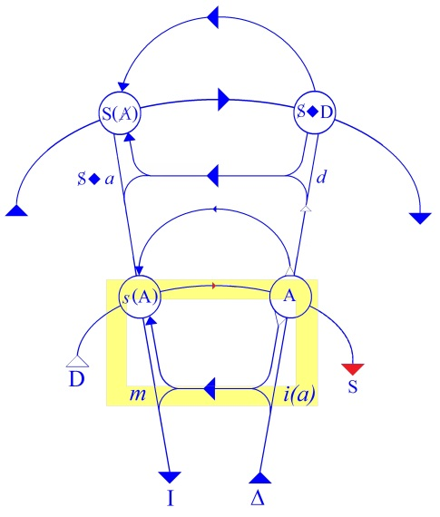
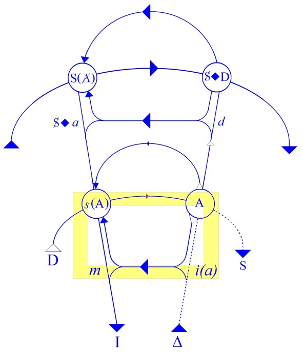
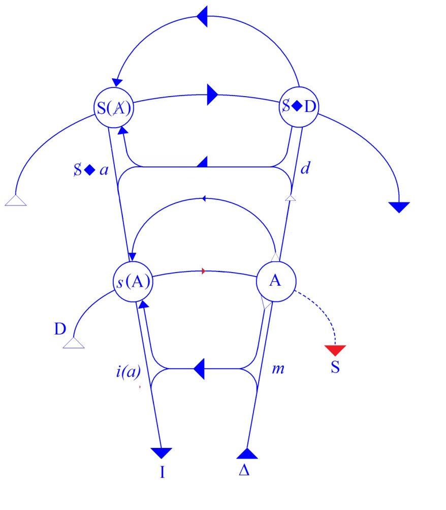
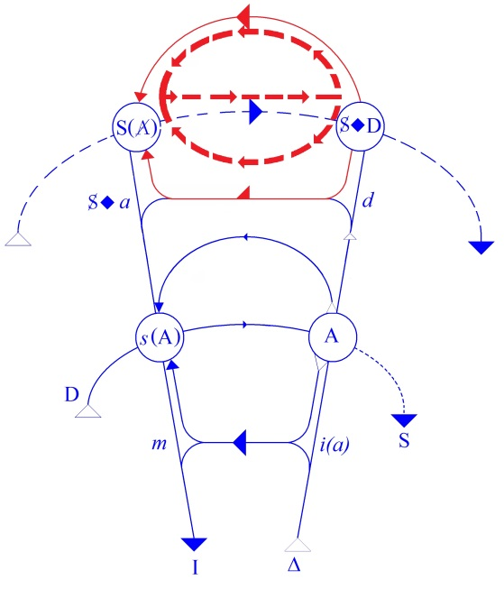
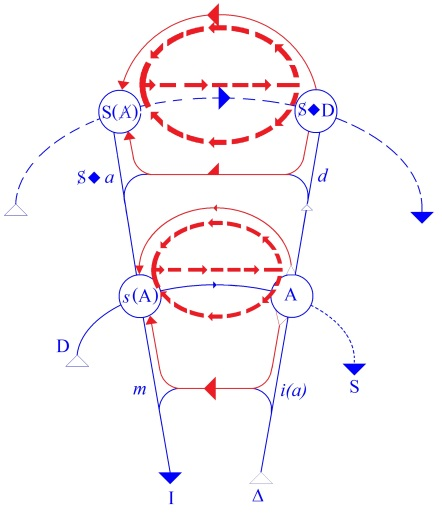

# Leçon 02 | 19 Novembre 1958

<!-- source-url: http://staferla.free.fr/S6/S6 LE DESIR.docx -->
<!-- seminar: s6 -->
<!-- lesson: 02 -->

<!-- id: s6-02-0001 -->

Je voudrais poser d’abord les limites de ce que je voudrais faire aujourd’hui. Je veux dire dans cette leçon même, vous énoncer ce que je vous montrerai aujourd’hui, et d’abord en abordant l’exemple de l’interprétation d’un rêve, ainsi que l’usage de ce que conventionnellement nous appelons depuis quelques temps « *le graphe* ». Comme je ne poursuis pas ce discours, si j’ose m’exprimer ainsi, simplement au-dessus de vos têtes, j’aimerais que s’établisse à travers lui une certaine communication, comme on dit.

<!-- id: s6-02-0002 -->

Je n’ai pas été sans avoir écho des difficultés que déjà vous-mêmes la dernière fois…

<!-- id: s6-02-0003 -->

> c’est-à-dire à un moment où il était loin d’être pour tous nouveau

<!-- id: s6-02-0004 -->

…avez éprouvées, et ce que la reposition de ce graphe a constitué encore pour certains. Pour beaucoup même, il reste, ne disons pas encore *maniable* puisqu’à la vérité, ce qui n’est pas *extraordinaire*, ce graphe nous l’avons construit ensemble l’année dernière, c’est-à-dire mis au point progressivement, vous l’avez vu en quelque sorte s’édifier dans les besoins d’une certaine formulation centrée autour de ce que j’ai appelé *Les formations de l’inconscient*.

<!-- id: s6-02-0005 -->

Que vous ne puissiez pas, comme certains le remarquent, vous apercevoir que son usage n’est pas encore pour vous univoque, il n’y a pas lieu de s’en étonner puisque précisément une partie de ce que nous aurons à articuler cette année sur le désir nous en montrera l’utilité et du même coup, nous en enseignera le maniement. Il s’agit donc d’abord de sa compréhension. C’est cela même qui semble faire pour *un certain nombre*…

<!-- id: s6-02-0006 -->

> à différents degrés, peut-être même moins qu’ils ne l’émettent eux-mêmes

<!-- id: s6-02-0007 -->

…qui semble faire difficulté.

<!-- id: s6-02-0008 -->

À propos de ce terme de « *compréhension* » je voudrais faire remarquer…

<!-- id: s6-02-0009 -->

je vous assure qu’il n’y a là nulle ironie

<!-- id: s6-02-0010 -->

…que c’est un terme problématique. S’il y en a parmi vous qui comprennent toujours, en tout état de cause et à tout instant ce qu’ils font, je les félicite et les envie.

<!-- id: s6-02-0011 -->

Ce n’est pas ce qui correspond, même après vingt cinq ans d’exercice, à mon expérience et, à la vérité, il nous montre assez les dangers qu’il comporte en lui-même, *danger d’illusion de toute compréhension*, pour que - je pense - il ne soit douteux que ce que je cherche à vous montrer, ce n’est pas tellement de comprendre ce que je fais, que de le savoir.

<!-- id: s6-02-0012 -->

Ce n’est pas toujours la même chose, cela peut ne pas se confondre, et vous verrez justement qu’il y a des raisons internes pour que ça ne se confonde pas, à savoir que vous puissiez dans certains cas savoir ce que vous faites, savoir où vous en êtes, sans toujours savoir comprendre, au moins immédiatement, de quoi il s’agit. Le graphe est précisément fait pour cet usage de repérage, il est destiné à annoncer tout de suite quelque chose.

<!-- id: s6-02-0013 -->

Je pense aujourd’hui, si j’en ai le temps, pouvoir commencer de voir par exemple comment ce graphe, et je crois seulement ce graphe ou quelque chose, bien entendu, d’analogue…

<!-- id: s6-02-0014 -->

> ce n’est pas à l’uniforme sous lequel il puisse être présenté qu’il faut s’attacher

<!-- id: s6-02-0015 -->

…vous paraîtra d’un usage éminent pour distinguer…

<!-- id: s6-02-0016 -->

je dis cela pour susciter votre intérêt

<!-- id: s6-02-0017 -->

…pour distinguer par des positions, des situations différentes, trois phases, que je dois dire il n’est que trop fréquent que vous confondiez au point de *glisser* sans précautions de l’une à l’autre, le *refoulé* par exemple.

<!-- id: s6-02-0018 -->

Nous aurons à dire des choses, ou simplement à prendre la façon dont FREUD lui-même le définit :

<!-- id: s6-02-0019 -->

- *le refoulé*,

<!-- id: s6-02-0020 -->

- *le désir,*

<!-- id: s6-02-0021 -->

- et *l’inconscient*.

<!-- id: s6-02-0022 -->

Refaisons le au moins à petits pas, avant de le mettre en application, pour qu’il ne soit pas douteux que ce qui représente au moins ce que nous appellerons les deux étages, encore que bien entendu…

<!-- id: s6-02-0023 -->

> et c’est même cela qui serait la difficulté pour beaucoup d’entre vous

<!-- id: s6-02-0024 -->

…ces deux étages ne correspondent en rien à ce qui d’habitude vous est présenté au niveau de ce que je pourrais appeler l’architectonie des fonctions supérieures et inférieures, automatismes et fonctions de synthèse.

<!-- id: s6-02-0025 -->

C’est justement parce que vous ne la retrouvez pas que ces deux étages vous *embarrassent*, et c’est pourquoi je vais essayer de les réarticuler devant vous, puisqu’il semble que *le second étage* de la construction…

<!-- id: s6-02-0026 -->

> étage évidemment abstraitement défini, parce que comme ce graphe est un discours,
>
> on ne peut pas tout dire en même temps

<!-- id: s6-02-0027 -->

…ce second étage - qui n’est pas forcément une seconde étape - fait pour certains, difficulté.

<!-- id: s6-02-0028 -->

Je reprends donc les choses : *quel est le but de ce graphe* ? C’est de montrer les rapports - *pour nous essentiels en tant que nous sommes analystes -* du sujet parlant avec le signifiant. En fin de compte, la question autour de laquelle se divisent ces deux étages est la même - pour lui le sujet parlant, c’est un bon signe - est la même que pour nous.

<!-- id: s6-02-0029 -->

Je disais à l’instant : *savons-nous ce que nous faisons* ? Eh bien lui aussi sait-il ou non ce qu’il fait en parlant ? Ce qui veut dire : peut-il se signifier efficacement son action de signification ?

<!-- id: s6-02-0030 -->

C’est justement autour de cette question que se répartissent *ces deux étages* dont je vous dis tout de suite…

<!-- id: s6-02-0031 -->

> parce que cela semble, la dernière fois, avoir échappé à certains

<!-- id: s6-02-0032 -->

…je vous le dis tout de suite, dont il faut penser qu’ils *fonctionnent tous les deux en même temps* dans le moindre acte de parole, et vous verrez ce que j’entends, et où j’étends le terme « *acte de parole* ».

<!-- id: s6-02-0033 -->

En d’autres termes, si vous pensez aux procès de ce qui se passe dans le sujet…

<!-- id: s6-02-0034 -->

> dans le sujet en tant qu’intervient dans son activité le signifiant

<!-- id: s6-02-0035 -->

…il faut que vous pensiez ceci…

<!-- id: s6-02-0036 -->

> que j’ai eu l’occasion d’articuler pour l’un d’entre vous à qui je donnais un petit supplément d’explications après mon séminaire, et si je vous le souligne, c’est parce que mon interlocuteur m’a fait remarquer
>
> ce que pouvait avoir pour lui de non-aperçu ce que je vais vous dire

<!-- id: s6-02-0037 -->

…c’est à savoir par exemple ceci : ce qu’il faut que vous considériez, c’est que les procès en question partent en même temps des quatre points : Δ, A, *d*, D.

<!-- id: s6-02-0038 -->

C’est-à-dire - vous allez voir ce qu’est cet appoint aujourd’hui de mon exposé - dans ce rapport respectivement :

<!-- id: s6-02-0039 -->

- l’intention du sujet \[Δ\],

<!-- id: s6-02-0040 -->

- le sujet en tant que je parlant \[A\],

<!-- id: s6-02-0041 -->

- l’acte de la demande \[D\],

<!-- id: s6-02-0042 -->

- et ceci \[*d*\] que nous appellerons tout à l’heure d’un certain nom et que je laisse pour l’instant réservé.

<!-- id: s6-02-0043 -->

Les procès donc sont simultanés dans ces quatre *trajets* : D – Δ – I – S(A), je pense que c’est assez appuyé.

<!-- id: s6-02-0044 -->

> \[*Niveau* 1 : D → A... *et* Δ → A → s(A) → I,
>
> *Niveau* 2 : S(A) →(S◊D), *et* A → *d* → (S◊D) → S(A) → *s*(A)\]

<!-- id: s6-02-0045 -->

Il y a donc *deux étages* dans le fait que le sujet fait quelque chose qui est en rapport avec l’action prévalente, la *structure* prévalente du signifiant . À l’étage inférieur il reçoit, il subit cette *structure*. Ceci est spécialement apparent...

<!-- id: s6-02-0046 -->

Entendez bien tout ce que je dis, parce que cela n’a rien d’improvisé, et c’est pour cela que ceux qui prennent des notes sont ceux qui sont dans le vrai.

<!-- id: s6-02-0047 -->

…ceci prend sa valeur d’être spécialement – pas uniquement mais spécialement – illustré. Je veux dire que c’est là que c’est spécialement compréhensible, mais du même coup, d’abord c’est cela aussi qui peut faire que vous n’en voyez pas toute la généralité, à savoir que cela engendre certaines incompréhensions.

<!-- id: s6-02-0048 -->

Dites-vous le tout de suite : *chaque fois que vous comprendrez, c’est là que commence le danger*. C’est spécialement que ceci prend sa valeur dans le contexte - je dis le contexte de *la demande -* c’est dans ce contexte que le sujet en tant qu’ici, à ce niveau, à cet étage, la ligne de *l’intentionnalité du sujet*, ce que nous supposons être le sujet…

<!-- id: s6-02-0049 -->

- un sujet tant qu’il n’est pas devenu le sujet parlant, tant qu’il est le sujet dont on parle toujours, dont je dirais même, on parle jusqu’ici, car je ne sache pas que personne n’en ait jamais vraiment bien fait la distinction comme j’essaie ici de vous l’introduire,

<!-- id: s6-02-0050 -->

- le sujet de la connaissance pour tout dire : le sujet corrélatif de l’objet, le sujet autour de quoi tourne l’éternelle question de l’idéalisme, et qui est lui-même un sujet idéal,

<!-- id: s6-02-0051 -->

…a toujours quelque chose de problématique, à savoir qu’après tout comme on l’a remarqué et comme son nom l’indique \[sub-jectum, sub-posé\], il n’est que *supposé*.

<!-- id: s6-02-0052 -->

Il n’en est pas de même, vous le verrez, pour *le sujet qui parle*, qui s’impose avec une complète nécessité. Le sujet donc, dans le contexte de *la demande*, c’est le premier état si je puis dire *informe* de notre sujet à nous, de celui dont nous essayons d’articuler par ce graphe les conditions d’existence.

<!-- id: s6-02-0053 -->

Ce sujet n’est pas autre chose que *le sujet du besoin*, car c’est ce qu’il exprime dans *la demande*, et je n’ai pas besoin d’y revenir une fois de plus.

<!-- id: s6-02-0054 -->

Tout mon point de départ consiste à montrer comment cette demande du sujet est du même coup, profondément modifiée par le fait que *le besoin doit passer par les défilés du signifiant*. Je n’insiste pas plus parce que je le suppose acquis, mais je veux simplement à ce propos vous faire remarquer ceci : que c’est précisément dans cet échange qui se produit entre la position primitive inconstituée du *sujet du besoin* et les conditions structurales imposées par le signifiant, que réside ce qui se produit et qui est ici sur ce schéma représenté par le fait :

<!-- id: s6-02-0055 -->

- que la ligne D → S est pleine jusqu’en A, alors que plus loin elle reste fragmentée,

<!-- id: s6-02-0056 -->

- qu’inversement c’est en tant qu’antérieure à *s*(A) que la ligne dite d’intentionnalité - dans l’occasion, du sujet - est fragmentée et qu’elle n’est pleine qu’après, disons spécialement dans ce segment *s*(A) → I,

<!-- id: s6-02-0057 -->

> et même provisoirement - car c’est secondairement que j’aurai à insister là-dessus - dans celui–ci :
>
> en tant que vous n’avez pas à tenir compte de la ligne : A → *i*(*a*) → *m* → *s*(A).

<!-- id: s6-02-0058 -->

<!-- id: s6-02-0059 -->

Pourquoi en est-il ainsi ? Il faut tout de même que je ne m’attarde pas éternellement sur ce graphe, d’autant plus que nous aurons à y revenir.

<!-- id: s6-02-0060 -->

Qu’est-ce que représente, en d’autres termes, cette *continuité de la ligne* jusqu’en ce point A dont vous savez que c’est le lieu du code, *le lieu où gît le trésor de la langue* dans sa synchronie, je veux dire *la somme des éléments taxématiques* ? Sans quoi il n’y a pas moyen de communiquer entre des êtres qui sont soumis aux conditions du langage.

<!-- id: s6-02-0061 -->

Ce que représente *la continuité de la ligne* D→S jusqu’au point A est ceci : c’est cette synchronie de l’organisation systématique de la langue. Je veux dire que synchroniquement, il est donné là comme un système, comme *un ensemble* à l’intérieur duquel *chacun de ces éléments a sa valeur en tant que distinct des autres*, des autres signifiants, des autres *éléments* du système. C’est là, je vous le répète, le point ressort de tout ce que nous articulons concernant la communication. C’est ceci qui est toujours oublié dans les théories de la communication, c’est que *ce qui est communiqué n’est pas le signe d’autre chose, et c’est simplement le signe de ce que c’est la place où un autre signifiant n’est pas.*

<!-- id: s6-02-0062 -->

C’est de la *solidarité* de ce système - synchronique en tant que reposant au lieu du code - que le discours de la demande en tant qu’antérieur au code prend sa solidité. En d’autres termes, que dans *la diachronie*, c’est-à-dire dans le développement de ce discours, apparaît ceci qui s’appelle « *minimum de durée exigible pour la satisfaction* »…

<!-- id: s6-02-0063 -->

> fût-elle ce qu’on appelle une satisfaction magique, du moins de refus

<!-- id: s6-02-0064 -->

…à savoir le temps de parler.

<!-- id: s6-02-0065 -->

C’est en raison de ce rapport que la ligne du discours signifiant \[D → A\] - du discours signifiant de la demande – qui de lui-même - puisqu’il est composé de signifiants - devrait ici apparaître et se représenter sous la forme fragmentée que nous voyons subsister ici, à savoir sous la forme d’une succession d’éléments discrets, donc séparés par des intervalles, c’est en fonction de *la solidité synchronique du code* auquel ces éléments successifs sont empruntés que se conçoit *cette solidité de l’affirmation diachronique* et la constitution de ce qu’on appelle dans l’articulation de la demande, le temps de la formule.

<!-- id: s6-02-0066 -->

Donc c’est antérieurement au code, ou en-deçà du code que cette ligne se présente comme continue. Par contre ce que représente ici ce *graphe* par la ligne fragmentée qui est celle de *l’intentionnalité* du sujet, qu’est-ce que c’est ?

<!-- id: s6-02-0067 -->

<!-- id: s6-02-0068 -->

Observons que déjà le fait d’affirmer le contexte de la demande simplifie la diversité supposée du sujet, à savoir ceci qui se présente comme essentiellement mouvant des moments, des variations de ce point. Vous le savez, ce problème de la continuité du sujet s’est posé depuis longtemps aux psychologues. C’est à savoir pourquoi un être essentiellement livré à ce qu’on peut appeler les *intermittences* - non pas simplement du cœur comme on l’a dit, mais de bien d’autres choses - peut se poser et s’affirmer comme un *moi*.

<!-- id: s6-02-0069 -->

C’est là le problème dont il s’agit, et assurément déjà la mise en jeu d’un besoin dans la demande est déjà quelque chose qui le simplifie, ce sujet, par rapport aux interférences plus ou moins chaotiques, plus au moins hasardeuses entre eux des différents besoins. Ce que représente l’apparition sur ce schéma de la forme fragmentée qui représente la première partie de la ligne Δ → I, ici jusqu’en ce A, c’est autre chose, c’est la rétroaction sur cette mouvance à la fois *continue et discontinue*, assurément confuse, nous devons la supposer être celle de la forme primitive de *la manifestation primitive de la tendance*.

<!-- id: s6-02-0070 -->

C’est la rétroaction sur elle précisément de la forme d’éléments discrets que lui impose le discours, c’est ce qu’elle subit rétroactivement de *la discursivité*, c’est pourquoi dans cette ligne, c’est en-deça, non pas du code mais du message lui-même, que la ligne apparaît dans sa forme fragmentée.

<!-- id: s6-02-0071 -->

*Ce qui se produit au-delà*, c’est ce que j’ai déjà suffisamment souligné à d’autres moments pour y passer vite maintenant, c’est ceci : c’est *l’identification* qui en résulte du sujet à l’Autre de la demande en tant que celui-ci est tout-puissant. Je ne pense pas que ce soit un thème sur lequel j’ai besoin de revenir, que celui de l’omnipotence tantôt à la pensée, tantôt à la parole dans l’expérience analytique.

<!-- id: s6-02-0072 -->

À ceci près que je vous ai fait remarquer combien il était abusif de le mettre dans la position dépréciative que prend d’habitude le psychologue…

<!-- id: s6-02-0073 -->

> pour autant qu’il est toujours plus ou moins, au sens original du terme, un pédant

<!-- id: s6-02-0074 -->

…de le mettre à la charge du sujet alors que l’omnipotence dont il s’agit, c’est celle de l’autre en tant qu’il dispose de la somme des signifiants, tout simplement.

<!-- id: s6-02-0075 -->

En d’autres termes, pour donner le sentiment que nous ne nous éloignons pas de quelque chose de concret en articulant les choses ainsi, je vais désigner très expressément ce que je veux dire par là dans *l’évolution*, dans le *développemen*t, dans l’*acquisition* du langage, dans les rapports enfant-mère, pour le dire enfin : c’est très précisément ceci que le quelque chose dont il s’agit et sur quoi repose cette identification primaire que je désigne par le segment *s*(A), *signifié de A*, et qui aboutit au premier « *noyau* »…

<!-- id: s6-02-0076 -->

> comme on s’exprime couramment dans l’analyse sous la plume de Monsieur GLOVER,
>
> vous verrez cela articulé : « *le premier noyau de la formation du moi* »

<!-- id: s6-02-0077 -->

…le noyau de l’identification auquel cela aboutit, ce processus.

<!-- id: s6-02-0078 -->

Il s’agit de ce qui se produit pour autant que la mère n’est pas simplement celle qui *donne le sein*, je vous l’ai dit, elle est aussi celle qui *donne le seing* de l’articulation signifiante, et pas seulement pour autant qu’elle *parle* à l’enfant…

<!-- id: s6-02-0079 -->

> comme il est bien manifeste qu’elle lui parle, et bien avant qu’elle puisse présumer qu’il y entend
>
> quelque chose, de même qu’il y entend quelque chose bien avant qu’elle ne se l’imagine

<!-- id: s6-02-0080 -->

…mais pour autant que toutes sortes de *jeux de la mère*, les jeux par exemple d’occultation qui si vite déchaînent chez l’enfant le sourire, voire le rire sont à proprement parler déjà *une action symbolique* au cours de laquelle ce qu’elle lui révèle, c’est justement la fonction du symbole en tant que révélateur.

<!-- id: s6-02-0081 -->

Elle lui révèle dans ces jeux d’occultation :

<!-- id: s6-02-0082 -->

- à faire disparaître quelque chose ou à le faire reparaître,

<!-- id: s6-02-0083 -->

- à faire disparaître son propre visage ou à le faire reparaître,

<!-- id: s6-02-0084 -->

- ou à cacher la figure de l’enfant ou à la découvrir

<!-- id: s6-02-0085 -->

…elle lui révèle la fonction révélatrice. C’est déjà une fonction au *second degré* dont il s’agit. C’est à l’intérieur de ceci que se font ces *premières identifications* à ce qu’on appelle dans l’occasion la mère…

<!-- id: s6-02-0086 -->

la mère comme toute-puissante

<!-- id: s6-02-0087 -->

…et vous le voyez, ceci a une autre portée que la pure et simple satisfaction du besoin.

<!-- id: s6-02-0088 -->

Passons au *second étage* de ce graphe, celui donc que la dernière fois, il semble - au moins pour certains - que la présentation a fait quelques difficultés. Ce second étage du graphe est autre chose que le sujet en tant qu’il passe sous les défilés de l’articulation signifiante. C’est le sujet qui assume l’acte de parler : c’est le sujet en tant que « *je* », encore ici me faut-il me suspendre à quelque articulation de réserve essentielle. Après tout ce « *je* », je ne m’y attarderai pas, je vais vous le faire remarquer, à l’origine ce « *je* »…

<!-- id: s6-02-0089 -->

> *alors que j’y ai fait allusion dans quelque développement*

<!-- id: s6-02-0090 -->

…n’est pas notre affaire, c’est pourtant le « *je* » du « *Je pense donc je suis* ».

<!-- id: s6-02-0091 -->

Sachez simplement qu’il s’agit ici d’une parenthèse, toutes les difficultés qui m’ont été soumises me l’ont été à propos du « *Je pense donc je suis* », c’est à savoir que ceci n’avait aucune valeur probante puisque le « *je* » a déjà été mis dans le « *Je pense* » et qu’il n’y a après tout qu’un *cogitatum*, *ça pense*, et pourquoi donc serait-ce « *je* » là-dedans ? Je crois que toutes les difficultés ici se sont élevées précisément de cette non-distinction des deux sujets, telle que d’abord je vous l’ai articulée.

<!-- id: s6-02-0092 -->

C’est à savoir que plus ou moins - d’abord - je pense que plus ou moins à tort on se reporte, dans cette expérience à laquelle nous convie le philosophe, à la confrontation du sujet à un objet - par conséquent à un objet imaginaire - parmi lesquels il n’est pas étonnant que le « *je* » ne s’avère être qu’un objet parmi les autres [^9].

<!-- id: s6-02-0093 -->

Si au contraire nous poussons la question au niveau du *sujet* défini comme *parlant*, la question va prendre une tout autre portée, comme *la phénoménologie,* que je vais simplement vous indiquer maintenant, *va vous le montrer*. Pour ceux qui veulent des références concernant toute cette discussion autour du « *je* », du *cogito*, je vous rappelle qu’il y a un article déjà cité de M. SARTRE dans les *Recherches philosophiques* [^10].

<!-- id: s6-02-0094 -->

Le « *je* » dont il s’agit n’est pas simplement le « *je* » articulé dans le discours, le « *je* » en tant qu’il se prononce dans le discours et ce que les linguistes appellent, au moins depuis quelque temps, un *shifter*. C’est un sémantème qui n’a pas d’emploi articulable qu’en fonction du *code*, je veux dire en fonction purement et simplement du *code* articulable *lexicalement*. C’est à savoir que comme l’expérience la plus simple le montre :

<!-- id: s6-02-0095 -->

- le « *je* » ne se rapporte jamais à quelque chose qui puisse être défini en fonction d’autres éléments du code dont un sémantème, mais simplement en fonction de l’acte du message.

<!-- id: s6-02-0096 -->

- Le « *je* » désigne celui qui est le support du message, c’est–à–dire quelqu’un qui varie à chaque instant.

<!-- id: s6-02-0097 -->

Ce n’est pas plus malin que cela, mais je vous ferai remarquer que ce qu’il en résulte, c’est que *ce « je » est essentiellement, donc, distinct* à partir de ce moment là - comme je vais vous le faire très vite sentir \- *de ce qu’on peut appeler « le sujet véritable de l’acte de parler »* en tant que tel, et c’est même ce qui donne au discours en « *je* » le plus simple, je dirais une toujours présomption de *discours indirect*.

<!-- id: s6-02-0098 -->

Je veux dire que ce « *je* » pourrait très facilement être suivi dans le discours même d’une parenthèse : « *je qui parle* » ou « *je dis que* », ceci qui d’ailleurs est rendu très évident - comme d’autres l’ont remarqué avant moi - par le fait qu’un discours qui formule « *je dis que* » et qui rajoute ensuite : « *et je le répète* », ne dit pas dans ce « *je le répète* » quelque chose d’inutile car c’est justement pour distinguer les deux « *je* » qui sont en question :

<!-- id: s6-02-0099 -->

- *celui qui a dit que*…

<!-- id: s6-02-0100 -->

- et *celui qui adhère* à ce que « *celui qui a dit que*… » a dit.

<!-- id: s6-02-0101 -->

En d’autres termes encore, je veux simplement - s’il faut d’autres exemples pour vous le faire sentir - vous suggérer la différence qu’il y a entre le « *je* » de « *je vous aime* » ou de « *je t’aime* » et le « *je* » de « *je suis là* ». Le « *je* » dont il s’agit est particulièrement sensible justement en raison de la structure que j’évoque, *là où il est pleinement occulté*. Et là où il est pleinement occulté c’est *dans ces formes du discours qui réalisent ce que j’appellerai « la fonction vocative* », c’est-à-dire celles qui ne font apparaître dans leur structure signifiante que *le destinataire* n’est absolument pas le « *je* ».

<!-- id: s6-02-0102 -->

C’est le « *je* » du « *lève-toi et marche* », c’est ce même « *je* » fondamental qui se retrouve dans n’importe quelle forme vocative impérative et un certain nombre d’autres. Je les mets toutes provisoirement *sous le titre de vocatif* :

<!-- id: s6-02-0103 -->

- c’est le « *je* » si vous voulez, vocatif,

<!-- id: s6-02-0104 -->

- c’est le « *je* » dont je vous ai déjà parlé au moment du séminaire du Président SCHREBER, parce qu’il était essentiel à faire apparaître - je ne sais pas si à ce moment là j’y suis pleinement parvenu, je ne l’ai même pas repris dans ce que j’ai donné concernant le *résumé de mon séminaire* sur le Président SCHREBER,

<!-- id: s6-02-0105 -->

- c’est le « *je* » *sous-jacent* à ce « *tu es celui qui me suivras* » et sur lequel j’ai tellement insisté, et dont vous voyez comment il s’inscrit avec tout le problème d’un certain futur d’ailleurs à l’intérieur de vocatifs à proprement parler, de vocatifs de la vocation.

<!-- id: s6-02-0106 -->

Je rappelle pour ceux qui n’étaient pas là, la différence qu’il y a en français…

<!-- id: s6-02-0107 -->

> c’est une finesse que toutes les langues ne permettent pas de mettre en évidence

<!-- id: s6-02-0108 -->

…entre « *tu es celui qui me suivras* » et « *tu es celui qui me suivra* ».

<!-- id: s6-02-0109 -->

Cette différence de pouvoir performant - du « *tu* » dans l’occasion - c’est effectivement une différence actuelle du « *je* » en tant qu’il opère dans cet acte de parler qu’il représente et qu’il s’agit de montrer une fois de plus et à ce niveau que *le sujet reçoit toujours son propre message* - à savoir ce qu’il est ici à s’avouer, c’est-à-dire le « *je* » - *sous une forme inversée*, à savoir par l’intermédiaire de la forme qu’il donne au « *tu* ».

<!-- id: s6-02-0110 -->

Ce discours…

<!-- id: s6-02-0111 -->

> donc le discours qui se formule au niveau du second étage,
>
> et qui est le discours de toujours, nous ne distinguons qu’arbitrairement ces deux étages

<!-- id: s6-02-0112 -->

…ce discours…

<!-- id: s6-02-0113 -->

> qui comme tout discours, est *le discours de l’Autre* même quand c’est le sujet qui le tient

<!-- id: s6-02-0114 -->

…est fondamentalement à son étage un appel de l’être.

<!-- id: s6-02-0115 -->

Avec plus ou moins de force, il contient toujours…

<!-- id: s6-02-0116 -->

> et c’est là une fois de plus une des merveilleuses équivoques homophoniques que contient le français

<!-- id: s6-02-0117 -->

…il contient toujours plus ou moins un « *sois* », en d’autres termes un « *fiat* », un *fiat* qui est la source et la racine de ce qui de *la tendance* devient pour l’être parlant et s’inscrit dans le registre du « *vouloir* », ou encore du « *je* » en tant qu’il se divise dans les deux termes étudiés de l’un à l’autre :

<!-- id: s6-02-0118 -->

- de l’impératif du « *lève-toi et marche* » dont je parlais tout à l’heure,

<!-- id: s6-02-0119 -->

- ou par rapport au sujet, de l’érection de son propre « *je* ».

<!-- id: s6-02-0120 -->

La question, si je puis dire, celle que la dernière fois j’ai ici articulée sous la forme du « *Che vuoi ?* » vous voyez maintenant à quel niveau elle se place. Ce « *Che vuoi ?* » qui est, si l’on peut dire, la réponse de l’Autre à cet acte de parler du sujet, elle répond - cette question - je dirais comme toujours, elle répond cette réponse avant la question à celle-ci, au point d’interrogation redoutable dont la forme même dans mon schéma articule cet acte de parler.

<!-- id: s6-02-0121 -->

Est-ce que parlant, le sujet sait ce qu’il fait ? C’est justement ce que nous sommes en train de nous demander ici, et c’est pour répondre à cette question que FREUD a dit non. Le sujet dans l’*acte de parler*, et pour autant que cet *acte de parler* va bien entendu beaucoup plus loin que simplement sa parole :

<!-- id: s6-02-0122 -->

- puisque toute sa vie est prise dans des *actes de parler*,

<!-- id: s6-02-0123 -->

- puisque sa vie en tant que telle, à savoir toutes ses actions sont des actions symboliques, ne serait-ce que parce qu’elles sont enregistrées.

<!-- id: s6-02-0124 -->

Elles sont sujettes à enregistrement, elles sont souvent action pour prendre acte, et qu’après tout, tout ce qu’il fera…

<!-- id: s6-02-0125 -->

> comme on dit, et contrairement à ce qui se passe, ou plus exactement conformément à tout ce qui se passe chez le juge d’instruction

<!-- id: s6-02-0126 -->

…tout ce qu’il fera pourra être retenu contre lui , toutes ses actions seront imposées dans un contexte de langage et ses gestes mêmes sont des gestes qui ne sont jamais que des gestes à choisir dans un rituel préétabli, à savoir dans une articulation de langage.

<!-- id: s6-02-0127 -->

Et FREUD à ceci - « *Sait–il ce qu’il fait ?* » - répond non. Ce n’est rien d’autre que ce qu’exprime le second étage de mon graphe, c’est à savoir que ce second étage ne vaut qu’à partir de la question de l’Autre…

<!-- id: s6-02-0128 -->

à savoir « *Che vuoi ?* » : *Qu’est-ce que tu veux ?*

<!-- id: s6-02-0129 -->

…que jusqu’au moment de la question, bien entendu nous restons dans l’ignorance et la niaiserie .

<!-- id: s6-02-0130 -->

J’essaie ici de faire cette preuve que le didactisme ne passe pas obligatoirement par la niaiserie. Ce ne peut évidemment être sur vous que l’on se base pour que la démonstration soit achevée !

<!-- id: s6-02-0131 -->

Où donc par rapport à cette question, et dans les réponses, le second étage du schéma articule où se placent les points de recroisement entre le discours véritable qui est tenu par le sujet et ce qui se manifeste comme « *vouloir* » dans l’articulation de la parole, où ces points de recroisement se placent, c’est là tout le mystère de ce symbole qui semble faire opacité pour certains d’entre vous.

<!-- id: s6-02-0132 -->

Si ce discours qui se présente à ce niveau comme *appel de l’être*, n’est pas ce qu’il a l’air d’être, nous le savons par FREUD, et c’est cela que le second étage du graphe essaie de nous montrer.

<!-- id: s6-02-0133 -->

On ne peut au premier abord que s’étonner que vous ne le reconnaissiez pas, car c’est ce que FREUD a dit. Qu’est-ce que nous faisons tous les jours, si ce n’est ceci : de montrer qu’à ce niveau, au niveau de l’acte de la parole, le code est donné par quelque chose qui n’est pas la demande primitive, qui est un certain rapport du sujet à cette demande en tant que le sujet est resté marqué par ses *avatars*. C’est cela que nous appelons *les formes orales, anales* *et autres*, de l’articulation inconsciente, et c’est pour cela qu’il ne me paraît pas soulever beaucoup de discussions.

<!-- id: s6-02-0134 -->

Je parle tout simplement, comme admission des prémisses que nous situons ici au niveau du code. La formule S◊*a* le sujet en tant que marqué par le signifiant en présence de sa demande comme donnant le matériel, le code de ce discours véritable qui est le véritable discours de l’être à ce niveau.

<!-- id: s6-02-0135 -->

Quant au message qu’il reçoit, ce message j’y ai déjà *plusieurs fois* fait allusion, je lui ai donné *plusieurs formes*, toutes – non sans quelques raisons – plus ou moins glissantes, comme c’est là tout le problème de la visée analytique, à savoir : quel est ce message. Je peux le laisser pour aujourd’hui, et en ce temps tout au moins de mon discours, à l’état de *problématique*, et le symboliser par un signifiant présumé comme tel.

<!-- id: s6-02-0136 -->

C’est une forme purement hypothétique, c’est un X, un signifiant, un signifiant de l’Autre puisque c’est au niveau de l’Autre que la question est posée d’un autre manquée, d’une part qui est justement l’élément problématique dans la question concernant ce message.

<!-- id: s6-02-0137 -->

Résumons-nous. La situation du sujet au niveau de l’inconscient telle que FREUD l’articule…

<!-- id: s6-02-0138 -->

ce n’est pas moi, c’est FREUD qui l’articule

<!-- id: s6-02-0139 -->

…c’est *qu’il ne sait pas avec quoi il parle*, on a besoin de lui révéler les éléments proprement signifiants de son discours, et qu’il ne sait pas non plus le message qui lui parvient *réellement* au niveau du discours de l’être, disons véritablement si vous voulez, mais ce « *réellement* » je ne le récuse point. En d’autres termes, *il ne sait pas le message qui lui parvient* de la réponse à sa demande dans le champ de ce qu’il veut.

<!-- id: s6-02-0140 -->

Vous savez déjà vous la réponse, la réponse *véritable*, elle ne peut être qu’une : c’est à savoir *le signifiant* – et rien d’autre – *qui est spécialement affecté à désigner justement les rapports du sujet au signifiant.* Je vous ai dit : je veux quand même l’exprimer, pourquoi ce signifiant était *le phallus*. Même pour ceux qui l’entendent pour la première fois, je leur demande provisoirement d’accepter ceci.

<!-- id: s6-02-0141 -->

L’important n’est pas là, l’important est que c’est pour cela qu’il ne peut pas avoir la réponse parce que comme la seule réponse possible c’est *le signifiant qui désigne ses rapports avec le signifiant*, à savoir si c’était déjà en question, dans toute la mesure où il articule cette réponse, lui, le sujet s’anéantit et disparaît.

<!-- id: s6-02-0142 -->

C’est justement ce qui fait que la seule chose qu’il puisse en ressentir, c’est cette menace directement portée sur *le phallus*, à savoir la castration ou cette notion du *manque du phallus* qui, dans un sexe et dans l’autre, est ce quelque chose à quoi vient se terminer l’analyse, comme FREUD – je vous le fais remarquer – l’a articulé.

<!-- id: s6-02-0143 -->

Mais nous n’en sommes pas à répéter ces *vérités premières*. Je sais que cela tape un peu sur les nerfs de quelques uns que l’on jongle un peu trop depuis quelques temps avec l’*être* et l’*avoir*, mais cela leur passera car cela ne veut pas dire qu’en route nous n’ayons pas à faire une cueillette précieuse, une cueillette clinique, une cueillette qui permette même à l’intérieur de mon enseignement de se produire avec toutes les caractéristiques de ce que j’appellerai « *le chiqué médical* ».

<!-- id: s6-02-0144 -->

Il s’agit maintenant à l’intérieur de ceci de situer ce que veut dire le désir. Nous l’avons dit, il y a donc à ce second étage aussi un trésor synchronique, il y a une batterie de signifiants inconscients pour chaque sujet, il y a un message où s’annonce la réponse au « *Che vuoi ?* » et où elle s’annonce comme vous pouvez le constater, dangereusement. Même cela, je vous le fais remarquer en passant, histoire d’évoquer en vous des souvenirs imagés, qui font de l’histoire d’ABÉLARD et d’HÉLOÏSE la plus belle histoire d’amour.

<!-- id: s6-02-0145 -->

Qu’est-ce que veut dire le désir ? Où se situe-t-il ?

<!-- id: s6-02-0146 -->

> 

<!-- id: s6-02-0147 -->

Vous pouvez remarquer que dans la forme complète du schéma, vous avez ici une ligne pointillée qui va du code du second étage à son message par l’intermédiaire de deux éléments :

<!-- id: s6-02-0148 -->

- *d* signifie la place d’où le sujet descend,

<!-- id: s6-02-0149 -->

- et S en face de *petit(a)* \[S◊*a*\] signifie – je l’ai déjà dit, donc je le répète – *le fantasme*.

<!-- id: s6-02-0150 -->

Ceci a une forme, *une disposition homologique à la ligne qui de A, inclut dans le discours le moi, le m dans le discours,* disons *la personne étoffée avec l’image de l’autre* *i(a)*, *c’est-à-dire ce rapport spéculaire* que je vous ai *posé comme fondamental à l’instauration du moi*. Il y a là dans le rapport entre les deux étages, *quelque chose* qui mérite d’être plus pleinement articulé.

<!-- id: s6-02-0151 -->

Je ne le fais pas aujourd’hui, uniquement…

<!-- id: s6-02-0152 -->

> non pas parce que j’en ai pas le temps car je suis disposé à prendre tout mon temps
>
> pour vous communiquer ce que j’ai à vous dire

<!-- id: s6-02-0153 -->

…mais parce que je préfère prendre les choses d’une façon indirecte, parce qu’elle me parait susceptible de vous en faire sentir la portée. Vous n’êtes pas dès maintenant incapables de deviner ce que peut avoir de riche le fait que ce soit une certaine reproduction d’un *rapport imaginaire* au niveau du champ de béance déterminé entre les deux discours, en tant que ce *rapport imaginaire* reproduit homologiquement celui qui s’installe dans le rapport avec l’autre du jeu de prestance.

<!-- id: s6-02-0154 -->

Vous n’êtes pas incapable *de le pressentir* dès maintenant, mais bien entendu il est tout à fait insuffisant *de le pressentir*. Je veux simplement avant de l’articuler pleinement, vous faire vous arrêter un instant sur ce que comporte à l’intérieur, situé, planté à l’intérieur de cette économie, le terme de « *désir*. »

<!-- id: s6-02-0155 -->

Vous le savez, FREUD a introduit ce terme dès le début de l’analyse. Il l’a introduit à propos du rêve et sous la forme du « *Wunsch* », c’est-à-dire en droit, de quelque chose qui s’articule sur *cette ligne*.

<!-- id: s6-02-0156 -->

Le « *Wunsch* » n’est pas en lui-même, à soi tout seul, le désir, c’est un désir formulé, c’est un désir articulé. Ce à quoi je veux pour l’instant vous arrêter, c’est à la distinction de ce qui mérite…

<!-- id: s6-02-0157 -->

dans ce que j’installe et introduis cette année

<!-- id: s6-02-0158 -->

…d’être appelé désir et de ce « *Wunsch* » .

<!-- id: s6-02-0159 -->

Vous n’êtes pas sans avoir lu *La science des rêves*, et ce moment où je vous en parle marque le moment où nous allons nous-mêmes cette année commencer d’en parler. De même que nous avons commencé *l’année dernière* par *le trait d’esprit*, nous commençons cette année par *le rêve*.

<!-- id: s6-02-0160 -->

Vous n’êtes pas sans avoir remarqué dès les premières pages et jusqu’à la fin, que si vous pensez au *désir* sous la forme où je dirais, vous avez affaire à lui tout le temps dans l’expérience analytique, c’est à savoir celle où il vous donne du fil à retordre par ses excès, par *ses déviations*, par – après tout disons-le – le plus souvent par *ses défaillances*, je veux dire *le désir sexuel*, celui qui joue des tours, encore que depuis tout le temps s’exerce sur tout le champ analytique là-dessus un accent de mise à l’ombre tout à fait remarquable, celui dont il s’agit constamment dans l’analyse.

<!-- id: s6-02-0161 -->

Vous devez donc remarquer la différence…

<!-- id: s6-02-0162 -->

> à condition bien entendu que vous lisiez vraiment, c’est-à-dire que vous ne continuiez pas à penser
>
> à vos petites affaires pendant que vos yeux parcourent *la Traumdeutung*

<!-- id: s6-02-0163 -->

…vous vous apercevrez que *c’est très difficile à saisir ce fameux désir, que dans chaque rêve* prétendument *on retrouve partout.*

<!-- id: s6-02-0164 -->

Si je prends le rêve inaugural, *Le rêve de l’injection d’Irma*, dont nous avons déjà plusieurs fois parlé, sur lequel j’ai un peu écrit, et sur lequel je réécrirai, et dont nous pourrions parler excessivement *longtemps.*

<!-- id: s6-02-0165 -->

Rappelez-vous ce que c’est que *Le rêve de l’injection d’Irma.* Que veut-il dire exactement ? Cela reste très incertain même dans ce qui arrive. Lui-même, FREUD, dans le désir du rêve veut faire céder Irma, qu’elle ne soit plus, comme on dit là-dedans : « *se hérissant* » à propos de toutes les approches de FREUD. Que veut-il ?

<!-- id: s6-02-0166 -->

- Il veut la déshabiller,

<!-- id: s6-02-0167 -->

- il veut la faire parler,

<!-- id: s6-02-0168 -->

- il veut discréditer ses collègues,

<!-- id: s6-02-0169 -->

- il veut forcer sa propre angoisse jusqu’à la voir projetée dans l’intérieur de la gorge d’Irma, ou il veut apaiser l’angoisse du mal ou du tort causé à Irma ?

<!-- id: s6-02-0170 -->

Mais ce mal est, nous semble-t-il, sans recours, il est assez articulé justement dans le rêve. Est-ce de cela qu’il s’agit : *qu’il n’y a pas eu de crime ?*

<!-- id: s6-02-0171 -->

Et ce qui n’empêche pas que l’on dise que, *puisqu’il n’y a pas eu de crime*, *tout ira bien puisque tout est réparé*, et puis que tout cela est dû au fait que tel et tel prennent de singulières libertés et que c’est le troisième terme qui en est responsable, et ainsi de suite. Nous pourrions aller comme cela excessivement loin.

<!-- id: s6-02-0172 -->

D’ailleurs je vous fais remarquer que FREUD lui-même souligne en un point de la *Traumdeutung*, et avec la plus grande énergie, au moins jusqu’à la 7ème édition, qu’il n’a jamais dit nulle part que le désir dont il s’agit dans le rêve soit toujours un désir sexuel. Il n’a pas dit le contraire non plus, mais enfin il n’a pas dit cela, ceci pour les gens qui, au niveau de cette 7ème édition, le lui reprochent.

<!-- id: s6-02-0173 -->

Ne nous trompons pas pour autant. Sachons que la sexualité y est toujours plus ou moins intéressée. Seulement elle l’est en quelque sorte latéralement, disons en dérivation.

<!-- id: s6-02-0174 -->

Il s’agit justement de savoir pourquoi, mais pour savoir pourquoi je veux simplement un petit instant m’arrêter là à ces choses évidentes que nous donnent l’usage et l’emploi du langage, c’est à savoir qu’est-ce que cela veut dire quand on dit à *quelqu’un*…

<!-- id: s6-02-0175 -->

> *si c’est un homme ou si c’est une femme, et dont il faut bien choisir que c’est un homme et que cela va peut-être entraîner nombre de références contextuelles*

<!-- id: s6-02-0176 -->

…qu’est- ce que cela veut dire quand on dit à une femme « *je vous désire* » ? Est-ce que cela veut dire…

<!-- id: s6-02-0177 -->

> *comme l’optimisme moralisant sur lequel vous me voyez de temps en temps rompre des lances à l’intérieur de l’analyse*

<!-- id: s6-02-0178 -->

…est-ce que cela veut dire : « *Je suis prêt à reconnaître à votre être autant, sinon plus de droits qu’au mien, à prévenir*

<!-- id: s6-02-0179 -->

*tous vos besoins, à penser à votre satisfaction. Seigneur que votre volonté soit faite avant la mienne ?* »

<!-- id: s6-02-0180 -->

Est–ce cela que cela veut dire ? Je pense qu’il suffit d’évoquer cette référence pour provoquer en vous les *sourires* que je vois, heureusement, s’épanouir à travers cette assemblée. Personne d’ailleurs, quand on emploie les mots qui conviennent, ne se trompe sur ce que veut dire la visée d’un terme comme celui-là, si *génitale* soit-elle.

<!-- id: s6-02-0181 -->

L’autre réponse est celle-ci : « *je désire* - disons *pour employer des bons gros mots* comme cela tout ronds - *coucher avec vous* ». C’est beaucoup plus vrai, il faut le reconnaître, mais est-ce si vrai que cela ?

<!-- id: s6-02-0182 -->

C’est vrai dans un certain contexte, je dirais *social*, et après tout parce que peut–être, vue l’extrême difficulté de donner son issue exacte à cette formulation « *je vous désire* », on ne trouve, après tout rien de mieux pour le prouver. Croyez-moi : peut-être suffit-il que cette parole ne soit pas liée aux incommensurables embarras et bris de vaisselle qu’entraînent les propos qui ont un sens, il suffit peut-être que cette parole ne soit prononcée qu’à l’intérieur pour qu’aussitôt vous saisissiez que si ce terme a un sens, c’est un sens bien plus difficile à formuler.

<!-- id: s6-02-0183 -->

« *Je vous désire* » articulé à l’intérieur si je puis dire, concernant un objet, c’est celui-ci à peu près : « *vous êtes belle* » autour de quoi *se fixent, se condensent toutes ces images énigmatiques* dont le flot s’appelle pour moi mon désir, à savoir : « *je vous désire parce que vous êtes l’objet de mon désir* ». Autrement dit : « *Vous êtes le commun dénominateur de mes désirs* ». Et Dieu sait si je peux mettre Dieu dans l’affaire, et pourquoi pas ?

<!-- id: s6-02-0184 -->

Dieu sait ce que remue avec soi le désir. C’est quelque chose qui en réalité mobilise, oriente dans la personnalité bien autre chose que ce vers quoi par convention paraît s’ordonner son but précis.

<!-- id: s6-02-0185 -->

En d’autres termes, pour nous référer à une expérience beaucoup moins infiniment poétique, aussi peut-être il semble que je n’ai pas besoin d’être analyste pour évoquer combien vite et immédiatement à ce niveau…

<!-- id: s6-02-0186 -->

> à propos de la moindre distorsion comme on dit de la personnalité ou des images

<!-- id: s6-02-0187 -->

…combien vite et au premier plan vient surgir *à propos* de cette implication dans le désir, ce qui peut, ce qui le plus souvent, ce qui en droit y apparaît comme prévalent, à savoir *la structure du fantasme*.

<!-- id: s6-02-0188 -->

Dire à quelqu’un : je vous désire, c’est très précisément lui dire…

<!-- id: s6-02-0189 -->

> mais cela ce n’est pas l’expérience qui le donne toujours,
>
> sauf pour les braves et instructifs petits pervers, petits et grands

<!-- id: s6-02-0190 -->

…c’est dire : « *Je vous implique dans mon fantasme fondamental* ».

<!-- id: s6-02-0191 -->

C’est ici…

<!-- id: s6-02-0192 -->

> *puisque j’ai décidé que je ne pousserai pas cette année au-delà d’un certain temps – j’espère m’y tenir encore –*
>
> *l’épreuve où je vous prie de m’entendre*

<!-- id: s6-02-0193 -->

…c’est ici - c’est-à-dire bien avant le point où je pensais aujourd’hui conclure - que je m’arrêterai. Je m’arrêterai

<!-- id: s6-02-0194 -->

*en désignant ce point du fantasme* qui est un point essentiel, qui est le point clef autour duquel je vous montrerai, la prochaine fois donc, à faire tourner le point décisif où doit se produire…

<!-- id: s6-02-0195 -->

> si ce terme de « *désir* » a un sens différent de celui de « *vœu* » dans le rêve

<!-- id: s6-02-0196 -->

…*où doit se produire l’interprétation du désir*. Ce point est donc ici, et vous pouvez faire remarquer qu’il fait partie du *circuit pointillé* qui est celui de cette espèce de petite queue qui se trouve au second étage du graphe.

<!-- id: s6-02-0197 -->

<!-- id: s6-02-0198 -->

Je voudrais vous dire simplement, histoire de vous laisser un peu en appétit, que ce circuit pointillé, ce n’est rien d’autre que le circuit dans lequel nous pouvons considérer *que tournent*…

<!-- id: s6-02-0199 -->

> c’est pour cela qu’il est construit comme cela, c’est parce que ça tourne,
>
> une fois que c’est alimenté par le début, ça se met à tourner indéfiniment à l’intérieur

<!-- id: s6-02-0200 -->

…*que tournent les éléments du refoulé*.

<!-- id: s6-02-0201 -->

En d’autres termes, *c’est le lieu sur le graphe de l’inconscient comme tel*, c’est de cela, et uniquement de cela que FREUD a parlé jusqu’en 1915 quand il conclut par les deux articles qui s’appellent respectivement *L’inconscient* et *Le refoulement*.

<!-- id: s6-02-0202 -->

C’est là que je reprendrai pour vous dire à quel point est articulé dans FREUD d’une façon qui soutient, qui est la substance même de ce que j’essaye de vous faire comprendre concernant le signifiant, c’est à savoir que FREUD lui-même articule bel et bien de la façon la moins ambiguë quelque chose qui veut dire : ne sont jamais – ne peuvent être jamais – refoulés que les éléments signifiants.

<!-- id: s6-02-0203 -->

C’est dans FREUD, il n’y a que le mot « *signifiant* » qui manque. Je vous montrerai sans ambiguïté que ce dont FREUD parle dans son article sur *L’inconscient*, concernant ce qui peut être refoulé, FREUD le désigne.

<!-- id: s6-02-0204 -->

Ce ne peuvent être que des signifiants. Nous verrons cela la prochaine fois. Et alors vous voyez deux systèmes ici s’opposer :

<!-- id: s6-02-0205 -->

- ce système ici pointillé : nous l’avons dit, c’est cela dont il s’agit, c’est le lieu de l’inconscient et le lieu où le refoulé tourne en rond jusqu’au point où il se fait sentir, c’est-à-dire où quelque chose du message au niveau du discours de l’être, vient déranger le message au niveau de la demande, ce qui est tout le problème du symptôme analytique.

<!-- id: s6-02-0206 -->

- Il y a un autre système, c’est celui qui prépare ce que j’appelle là le petit palier, à savoir la découverte de l’*avatar*, découvert parce qu’on avait déjà eu tellement de peine à s’habituer au premier système, que comme FREUD vous a fait le fatal bienfait de faire le pas suivant lui-même avant sa mort, c’est-à-dire que FREUD dans sa *seconde topique* a découvert le registre de l’autre système pointillé : petit palier, c’est justement cela

<!-- id: s6-02-0207 -->

- à quoi correspond sa seconde topique.

<!-- id: s6-02-0208 -->

<!-- id: s6-02-0209 -->

En d’autres termes, c’est concernant ce qui se passe, c’est dans la mesure où il s’est interrogé sur ce qui se passe au niveau du sujet prédiscours, mais en fonction même de ce fait que le sujet qui parle ne savait pas ce qu’il faisait en parlant, c’est-à-dire à partir du moment où l’inconscient est découvert comme tel, que FREUD a…

<!-- id: s6-02-0210 -->

si vous voulez pour schématiser les choses

<!-- id: s6-02-0211 -->

…ici cherché à quel niveau de cet endroit original d’où ça parle, à quel niveau et en fonction de quoi…

<!-- id: s6-02-0212 -->

> c’est-à-dire justement par rapport à une visée qui est celle de l’aboutissement du processus en I

<!-- id: s6-02-0213 -->

…à quel moment se constitue le *moi*, c’est-à-dire le *moi* en tant qu’il a à se repérer par rapport à la première formulation, la première prise dans la demande du *Ça*.

<!-- id: s6-02-0214 -->

C’est aussi là que FREUD a découvert ce discours primitif en tant que purement imposé, et en même temps en tant que marqué de son foncier arbitraire, que cela continue à parler, c’est-à-dire le *surmoi*.

<!-- id: s6-02-0215 -->

C’est là aussi bien entendu qu’il a laissé quelque chose d’ouvert, c’est là, c’est-à-dire dans cette fonction foncièrement métaphorique du langage, qu’il nous a laissé quelque chose à découvrir, à articuler, qui complète sa seconde topique et qui permet de la restaurer, de la re-situer, de la restituer dans l’ensemble de sa découverte.## Notes

[^9]: Cf. Hegel : *La phénoménologie de l’Esprit*, Aubier Montaigne, 1941, trad. Jean Hyppolite.

[^10]: Jean-Paul Sartre : *La Transcendance de l'ego*, in *Recherches philosophiques*, Vol. VI, 1936-1937, pp. 85-123.
