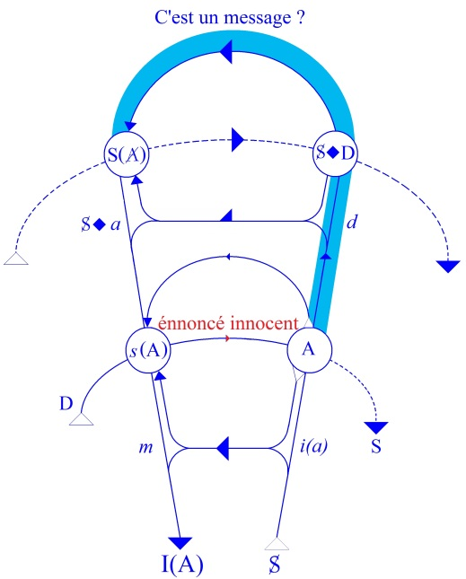
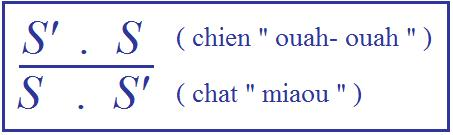
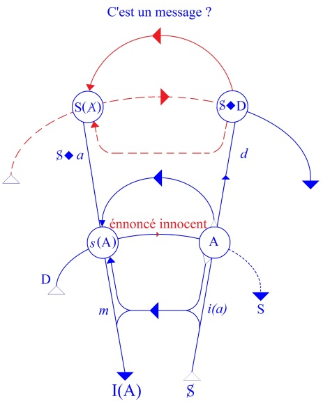

# Leçon 09 | 21 Janvier 1959

<!-- source-url: http://staferla.free.fr/S6/S6 LE DESIR.docx -->
<!-- seminar: s6 -->
<!-- lesson: 09 -->

<!-- id: s6-09-0001 -->

Le rêve d’Ella SHARPE (2)

<!-- id: s6-09-0002 -->

Nous étions restés la dernière fois au beau milieu de l’analyse de ce qu’Ella SHARPE appelle *le rêve singulier*, unique, auquel elle consacre un chapitre dans lequel se trouve converger la partie ascendante de *son livre*, puis ensuite les compléments qu’elle ajoute.

<!-- id: s6-09-0003 -->

Son livre ayant l’originalité d’être un livre important sur les rêves, fait après une trentaine d’années d’expérience analytique générale, si nous considérons que ces séminaires d’Ella SHARPE représentent des expériences se référant aux trente années précédentes.

<!-- id: s6-09-0004 -->

Ce rêve qui a fait l’objet d’*une séance* de son patient, est un rêve *extrêmement intéressant*, et les développements qu’elle donne, la connexion qu’elle établit…

<!-- id: s6-09-0005 -->

> non seulement entre ce qui est à proprement parler *associations* du rêve,
>
> voire *interprétations*, mais tout message de la séance dans son ensemble

<!-- id: s6-09-0006 -->

…le mérite est à lui rendre de cela qui indique chez elle *une grande sensibilité de la direction*, du sens *de l’analyse*.

<!-- id: s6-09-0007 -->

Il est d’autant plus frappant de voir que ce rêve dont je rappellerai les termes…

<!-- id: s6-09-0008 -->

> elle l’interprète, on le verra, ligne par ligne comme il convient de le faire

<!-- id: s6-09-0009 -->

…elle l’interprète dans le sens d’un *désir lié au vœu d’omnipotence chez son patient*, nous verrons ceci en détail.

<!-- id: s6-09-0010 -->

C’est justifié ou non, mais d’ores et déjà vous devez bien penser que si ce rêve peut nous intéresser, c’est ici dans ce biais par où j’essayais de vous montrer ce qu’il y a d’ambigu et de leurrant dans cette notion unilatérale, ce que comporte *ce vœu d’omnipotence*, de possibilités, *de perspectives de puissance*, ce *qu’on peut appeler le vœu névrotique*.

<!-- id: s6-09-0011 -->

Est-ce que c’est toujours de l’omnipotence du sujet qu’il s’agit ? J’ai introduit ici cette notion. Il est bien évident que l’omnipotence dont il s’agit, qu’elle soit l’omnipotence du discours n’implique nullement que le sujet s’en sente le support et le dépositaire : s’il a affaire à l’omnipotence du discours, c’est par l’intermédiaire de l’Autre qu’il profère. Ceci est oublié, tout particulièrement dans l’orientation qu’Ella SHARPE donne à son interprétation du rêve.

<!-- id: s6-09-0012 -->

Et pour commencer par la fin, vous verrez comment nous n’arriverons probablement pas à boucler cela dans cette leçon, parce qu’un travail aussi élaboré soulève un monde… D’autant plus un monde, qu’on s’aperçoit en fin de compte que presque rien n’a été dit – encore que tous les jours, ce soit le terrain même sur lequel nous opérions.

<!-- id: s6-09-0013 -->

Donc, je commence à indiquer ce qui va apparaître à la fin. Nous verrons en détail comment elle argumente son patient sur le sujet de son *vœu d’omnipotence*, et de son « *vœu d’omnipotence agressive* », souligne Ella SHARPE[^40].

<!-- id: s6-09-0014 -->

C’est ce patient dont elle ne nous donne pas absolument toutes les coordonnées, mais qui se trouve avoir au premier plan des difficultés majeures dans sa profession – il est au barreau – difficultés dont le caractère névrotique est si évident, qu’elle les définit d’une façon nuancée puisqu’elle précise qu’il ne s’agit pas tellement d’échec que d’une peur de trop bien réussir.

<!-- id: s6-09-0015 -->

Elle avait souligné dans la modulation même de la définition du symptôme quelque chose qui méritait de nous retenir par le clivage, la subtilité évidente de la nuance ici introduite dans l’analyse. Le malade donc, qui a d’autres difficultés que celles qui se produisent dans son travail, qui a - elle-même le signale - des difficultés dans l’ensemble des rapports avec les autres sujets. Rapports qui débordent *ses activités professionnelles*, qui peuvent tout spécialement s’exprimer dans *les jeux*, et nommément dans le jeu de tennis comme nous le verrons par les indications qu’elle nous donne à la suite sur quelques autres séances.

<!-- id: s6-09-0016 -->

Elle indique la peine qu’il a à faire ce qui lui serait bien nécessaire au moment d’enlever un set, ou une partie, *to corner*, de coincer son adversaire, de l’acculer dans un coin du court pour renvoyer comme il est classique, sa balle dans un autre coin où il ne la rattrapera pas. C’est le type d’exemple des difficultés qu’a assurément ce patient.

<!-- id: s6-09-0017 -->

Et ce ne sera pas un mince appui que des symptômes comme cela puissent être mis en valeur par l’analyste pour confirmer qu’il s’agit chez le patient d’une difficulté de manifester sa puissance, ou plus exactement son pouvoir.

<!-- id: s6-09-0018 -->

Elle interviendra donc d’une certaine façon, se trouvera en somme, toute réjouie d’un certain nombre de réactions qui vont suivre, ce qui sera vraiment le moment sommet, où elle va pointer où est le désir au sens vraiment où nous le définissons.

<!-- id: s6-09-0019 -->

On pourrait presque dire que ce qu’elle vise est justement ce que nous localisions dans une certaine référence par rapport à la demande. Vous le verrez, c’est tout à fait cela. Seulement, ce désir, elle l’interprète d’une certaine façon dans le sens d’un conflit agressif, elle le met sur le plan d’une référence essentiellement et profondément duelle, du conflit imaginaire. Je montrerai aussi pourquoi c’est justifié qu’elle aborde les choses sous ce biais. Seulement je pose ici la question : Pouvons-nous considérer comme une sanction de l’opportunité de ce type d’interprétation, deux choses qu’elle va elle-même nous déclarer être :

<!-- id: s6-09-0020 -->

La première…

<!-- id: s6-09-0021 -->

> suivant la première ébauche de son interprétation du type duel, du type interprétation de *l’agressivité* du sujet fondée sur un retour, sur un transfert du vœu *d’omnipotence*

<!-- id: s6-09-0022 -->

…elle note cette chose effarante, frappante chez un sujet adulte, que le sujet lui apporte ce résultat

<!-- id: s6-09-0023 -->

que pour la première fois depuis des *temps immémoriaux* de son enfance : *il a pissé au lit !*

<!-- id: s6-09-0024 -->

Nous reviendrons en détail là-dessus pour pointer où se poser problème.

<!-- id: s6-09-0025 -->

Et dans les quelques jours qui auront suivi cette séance qu’elle choisit parce que le sujet rapporte un très beau rêve mais aussi un rêve qui a été un moment crucial de l’analyse, au tennis…

<!-- id: s6-09-0026 -->

> où précisément il se trouve avoir ces embarras bien connus de tous les joueurs de tennis qui peuvent avoir un peu l’occasion de s’observer sur la façon dont ils mettent en œuvre leurs capacités, et dont aussi leur échappe quelquefois ce qui est la dernière récompense *d’une supériorité* qu’ils connaissent mais qu’ils ne peuvent pas manifester

<!-- id: s6-09-0027 -->

…ses partenaires habituels…

<!-- id: s6-09-0028 -->

> avec cette sensibilité à l’endroit des difficultés, des impasses inconscientes qui forment en fin de compte
>
> la trame de ce jeu des caractères, des façons dont s’imposent entre les sujets le ferraillement du dialogue,
>
> la taquinerie, la raillerie, la supériorité prise

<!-- id: s6-09-0029 -->

…le raillent comme d’habitude à propos de la partie perdue et *il se met assez en colère pour prendre son adversaire au kiki* et le coincer dans un coin du court, lui intimant l’ordre de ne plus jamais recommencer cette sorte de plaisanterie.

<!-- id: s6-09-0030 -->

Je ne dis pas que rien ne fonde la direction, l’ordre dans lequel Ella SHARPE poussait son interprétation. Vous verrez que, sur la base de *la plus fine dissection* du matériel, les éléments dont elle s’est servie sont situés, sont avérés pour elle.

<!-- id: s6-09-0031 -->

Nous essayerons de voir aussi quelles idées *a priori*, quelles idées préconçues, souvent fondées…

<!-- id: s6-09-0032 -->

> après tout, jamais une erreur ne s’engendre que d’un certain manque de vérité

<!-- id: s6-09-0033 -->

…fondées sur autre chose qu’elle ne *sait pas articuler*, encore qu’elle nous en donne…

<!-- id: s6-09-0034 -->

c’est là le précieux de cette observation

<!-- id: s6-09-0035 -->

…les éléments de l’autre registre. Mais l’autre registre, elle ne songe pas à le manier.

<!-- id: s6-09-0036 -->

Le centre, le point où elle va faire porter son interprétation, a un degré au­dessous de complexité. Vous verrez là ce que ce je veux dire, encore que je pense que j’en dise assez, que vous comprenez : en le mettant sur le plan de la rivalité imaginaire, du conflit de pouvoir, elle laisse de côté quelque chose dont il s’agit maintenant, en triant à proprement parler dans son texte même…

<!-- id: s6-09-0037 -->

C’est son texte qui va nous montrer, et je crois de façon éclatante, ce qu’elle laisse *perdre* et qui se manifeste…

<!-- id: s6-09-0038 -->

avec une cohérence telle !

<!-- id: s6-09-0039 -->

…être là ce dont il s’agit dans cette séance analysée et le rêve qui la centre, pour qu’évidemment nous essayions de voir si les catégories qui sont celles que je propose depuis longtemps et dont j’ai essayé de donner le repère…

<!-- id: s6-09-0040 -->

> *ce schéma topologique, ce graphe* dont nous nous servons

<!-- id: s6-09-0041 -->

…si nous n’arrivons pas tout de même à mieux centrer les choses.

<!-- id: s6-09-0042 -->

Je rappelle qu’il s’agit d’un rêve où le patient fait un voyage avec sa femme autour du monde. Il va arriver en Tchécoslovaquie où toutes sortes de choses vont lui arriver. Il souligne bien qu’il y a un monde de choses avant ce petit moment qu’il va raconter assez rapidement, car ce rêve n’occupe qu’une séance. Ce sont seulement les associations qu’il donne… Ce rêve est très court à raconter.

<!-- id: s6-09-0043 -->

Et parmi ces choses qui arrivent, il rencontre une femme sur une route qui lui rappelle celle-là même qu’il a décrite à son analyste deux fois déjà, où il se passait quelque chose, un :

<!-- id: s6-09-0044 -->

> « *sexuel play avec une femme devant une autre femme…* ». \[*sexual play with a woman in front of another woman*. (p.132)\]

<!-- id: s6-09-0045 -->

Cela arrive encore, nous dit-il en marge dans ce rêve, et il reprend :

<!-- id: s6-09-0046 -->

« *Cette fois c’est ma femme qui est là pendant que l’événement sexuel arrive. Cette femme que je rencontrais dans le rêve avait un aspect véritablement passionné, très passionné, et ceci me rappelle* *une femme que j’ai rencontrée au restaurant l’autre jour, très exactement la veille. Elle était noire et avait les lèvres très pleines, très rouges et avait ce même aspect passionné, il était évident que si je lui avais donné le moindre encouragement, elle aurait répondu à mes avances. Cela peut avoir stimulé le rêve. Et dans le rêve, la femme voulait la relation sexuelle avec moi, elle prenait l’initiative et comme vous le savez évidemment,c’est toujours ce qui m’aide beaucoup* ».

<!-- id: s6-09-0047 -->

\[*This time my wife was there while the sexual event occurred. The woman I met was very passionate looking and I am reminded of a woman I saw in a restaurant yesterday. She was dark and had very full lips, very red and passionate looking, and it was obvious that had I given her any encouragement she would have responded.* *She must have stimulated the dream, I expect. In the dream the woman wanted intercourse with me and she took the initiative which as you know is a course which helps me a great deal.* (p.132-133)\]

<!-- id: s6-09-0048 -->

Il répète en commentaire :

<!-- id: s6-09-0049 -->

« *Si la femme fait cela je suis grandement aidé. Dans le rêve la femme effectivement était sur moi. C’est juste maintenant que j’y pense. Elle avait évidemment l’intention to put my penis in her body (de mettre mon pénis dans son corps). Je peux dire cela d’après les manœuvres qu’elle faisait. Je n’étais pas du tout d’accord, elle était si désappointée que je pensais que je devais la masturber* ».

<!-- id: s6-09-0050 -->

\[*If the woman will do this I am greatly helped. In the dream the woman actually lay on top of me; that has only just come to my mind.* *She was evidently intending to put my penis in her body. I could tell that by the manœuvres she was making. I disagreed with this,* *but she was so disappointed I thought that I would masturbate her.* (p.133)\]

<!-- id: s6-09-0051 -->

Tout de suite après, la remarque qui ne vaut vraiment qu’en anglais :

<!-- id: s6-09-0052 -->

« *Cela sonne mal, tout à fait mal, cette façon d’utiliser le verbe masturbate d’une façon transitive. On peut simplement dire I masturbate* \- ce qui veut dire « *je me masturbe* » - *et ceci est correct*... ».

<!-- id: s6-09-0053 -->

\[*It sounds quite wrong to use that verb transitively. One can say « I masturbated » and that is correct…* (p.133)\]

<!-- id: s6-09-0054 -->

On verra dans la suite du texte un autre exemple qui montre bien que, lorsqu’on emploie *to masturbate*, il s’agit de « *se masturber* ». Ce caractère primitivement réfléchi du verbe est assez marqué pour qu’il fasse cette remarque à proprement parler de philologie, et ce n’est évidemment pas pour rien qu’il fait cela à ce moment-là. Je l’ai dit, d’une certaine façon nous pouvons *compléter*…

<!-- id: s6-09-0055 -->

> si nous voulons procéder comme nous l’avons fait pour le précédent rêve

<!-- id: s6-09-0056 -->

…*compléter cette phrase de la façon suivante : en complétant les signifiants éludés*, nous verrons que la suite nous le confirmera :

<!-- id: s6-09-0057 -->

« *Elle était très désappointée* » de n’avoir pas mon pénis (ou de pénis), je pensais : *She should masturbate* (*et non pas I should*) : *Qu’elle se masturbe* ! Vous verrez dans la suite ce qui nous permet de compléter les choses ainsi. \[…*but she was so disappointed I thought that I would masturbate her*. »\]

<!-- id: s6-09-0058 -->

À la suite de cela, nous avons une série d’*associations*, il n’y en a pas très long mais cela suffit amplement à nos méditations. Il y en a presque trois pages et pour ne pas vous fatiguer, je ne les reprendrai qu’après avoir donné le dialogue avec le patient qui suit ce rêve.

<!-- id: s6-09-0059 -->

Ella SHARPE *a écrit ce chapitre à des fins pédagogiques*. Elle fait le catalogue de ce que le patient lui a en somme apporté. Elle saura montrer à ceux qu’elle enseigne sur quel matériel elle va faire son choix :

<!-- id: s6-09-0060 -->

- premièrement sur *son interprétation* par devers elle,

<!-- id: s6-09-0061 -->

- deuxièmement sur ce que, de cette interprétation, elle va transmettre au patient,

<!-- id: s6-09-0062 -->

…signalant, insistant elle-même sur le fait que les deux choses sont loin de coïncider puisque ce qu’il y a à dire au patient n’est probablement pas tout ce qu’il y a à dire du sujet.

<!-- id: s6-09-0063 -->

De ce que le patient lui a fourni, il y a des choses bonnes à dire et d’autres à ne pas dire. Comme elle se trouve dans une position didactique, elle va d’abord faire le bilan de ce qu’on voit, de ce qu’on lit dans cette séance.

<!-- id: s6-09-0064 -->

– La toux. La dernière fois, je vous ai dit *ce dont il s’agissait* : il s’agit de cette « *petite toux* » que le patient a faite ce jour–là avant d’entrer à la séance.

<!-- id: s6-09-0065 -->

Cette « *petite toux* » dont Ella SHARPE…

<!-- id: s6-09-0066 -->

> vu la façon dont ce patient se comporte, si *contenue*, *compassée*, si manifeste d’une *défense* dont elle–même sent très bien les défenses et les difficultés, dont elle est loin d’admettre au premier plan que ce soit une défense de l’ordre « *défense contre ses propres sentiments* »

<!-- id: s6-09-0067 -->

…voit quelque chose qui serait d’une présence plus immédiate que cette attitude *où tout est réfléchi, où rien ne reflète*.

<!-- id: s6-09-0068 -->

*Et c’est bien à cela que nous réfère cette petite toux*. C’est une chose à laquelle d’autres ne se seraient peut-être pas arrêtés. Si peu que ce soit, c’est quelque chose qui lui fait entendre l’annonce - littéralement comme un rameau d’olivier – de je ne sais quelle décrue. Et elle se dit « *Respectons cela !* ».

<!-- id: s6-09-0069 -->

Or justement il se produit tout le contraire. C’est ce que le patient dit lui-même : *il fait un long discours* sur le sujet de cette « *petite toux* ». Je l’ai indiqué la dernière fois et nous allons *revenir* sur la façon dont à la fois Ella SHARPE le comprend, et dont à notre sens, il faut le comprendre. Voici en effet comment elle analyse elle-même ceci, à savoir ce qu’elle apprend du patient, venant à la suite de la « *petite toux* » ».

<!-- id: s6-09-0070 -->

Car le sujet est loin d’amener tout de suite le rêve, c’est par une série d’associations qui lui sont venues à la suite de la remarque que lui-même a faite de cette toux :

<!-- id: s6-09-0071 -->

- qu’elle lui a échappé,

<!-- id: s6-09-0072 -->

- et que sans doute, elle veut dire quelque chose,

<!-- id: s6-09-0073 -->

- qu’il s’était même dit que cette fois-ci il ne recommencerait pas, parce que ce n’est pas la première fois, que cela lui est déjà arrivé.

<!-- id: s6-09-0074 -->

Après avoir monté cet escalier - qu’elle ne l’entend pas monter tellement il est discret - il a fait cette « *petite toux* » – lui-même emploie le terme – et il s’en interroge.

<!-- id: s6-09-0075 -->

Nous allons maintenant reprendre ce qu’il a dit dans la perspective de la façon dont l’enregistre Ella SHARPE elle–même. *Elle fait le catalogue de ce qu’elle appelle « Idées concernant le but d’une toux* ». Voici comment elle l’enregistre.

<!-- id: s6-09-0076 -->

Premièrement : « *Cette petite toux apporte l’idée d’amants qui sont ensemble.*» \[*Brings thoughts of lovers being together*. p.136\] Qu’est-ce qu’a dit le patient ? Le patient, après avoir parlé de sa toux et posé la question : « *Quel but peut bien servir ceci ?* » \[…*but what possible purpose can be served by a little cough* …? p.131 \] dit :

<!-- id: s6-09-0077 -->

« *Oui! c’est une sorte de chose qu’on peut faire si on va entrer dans une chambre où deux amants sont ensemble. Si on approche on peut tousser un petit peu avec discrétion et par là leur faire savoir qu’ils vont être dérangés. J’ai fait cela, moi, par exemple* …//… *quand mon frère était avec sa girl friend dans le salon. J’avais l’habitude de tousser un peu avant d’entrer de façon à ce que s’ils étaient en train de s’embrasser, ils pouvaient s’arrêter.* …//… *car dans ce cas, ils ne se trouveraient quand même pas aussi embarrassés que si je les avais surpris en train de faire cela.* »

<!-- id: s6-09-0078 -->

\[*Well, it is the kind of thing that one would do if one were going into a room where two lovers were together.* *If one were approaching such a place one might cough a little discreetly and so let them know they were going to be disturbed. I have done that myself when,* *for example* …//… *my brother was with his girl in the drawing–room I would cough before I went in so that if they were embracing they could stop* …//… *They would not then feel as embarrassed as if I had caught them doing it.* p.131\]

<!-- id: s6-09-0079 -->

Cela n’est pas rien que de souligner, à ce propos donc, que premièrement la toux, le patient l’a manifestée, et nous nous en doutons parce que toute la suite nous l’a développé, la toux est un message. Mais notons tout de suite ceci…

<!-- id: s6-09-0080 -->

> qui déjà dans la façon dont Ella SHARPE analyse les choses, apparaît

<!-- id: s6-09-0081 -->

…c’est qu’elle ne *saisit pas*, qu’elle ne met pas *en relief*…

<!-- id: s6-09-0082 -->

> cela peut paraître un peu pointilleux, un peu minutieux comme remarque, mais néanmoins vous verrez que cet ordre de remarques que je vais introduire, c’est à partir de là que tout le reste s’ensuit, à savoir ce que
>
> j’ai appelé la chute de niveau qui marquera l’interprétation d’Ella SHARPE

<!-- id: s6-09-0083 -->

…que, si la toux est un message, il est évident, il ressort du texte même d’Ella SHARPE, que ce qui est important à relever, c’est que le sujet n’ait pas simplement toussé, mais justement…

<!-- id: s6-09-0084 -->

c’est elle qui le souligne à sa plus grande surprise

<!-- id: s6-09-0085 -->

…c’est que le sujet vient dire : « *C’est un message* ». \[*One would think some purpose is served by it*… p131\]

<!-- id: s6-09-0086 -->

Ceci elle l’élide, car elle signale dans le catalogue de son tableau de chasse - nous n’en sommes pas encore à ce qu’elle va choisir et qui va d’abord dépendre de ce qu’elle aura reconnu. Or il est clair qu’elle élide ceci qu’elle-même nous a expliqué, ceci que premièrement : il y a la toux sans aucun doute, mais que le sujet...

<!-- id: s6-09-0087 -->

> c’est là le point important sur cette *toux-message*, si *message* elle est

<!-- id: s6-09-0088 -->

...en parle en disant « *Quel est son but ?* *Qu’est-ce qu’elle annonce ?* ».

<!-- id: s6-09-0089 -->

Le sujet exactement commence par dire de cette toux, il le dit littéralement : « *C’est un message* ». Il la signale comme message. Et plus encore, dans cette dimension où il annonce que c’est un message, il pose une question « *Quel est le but de ce message ?* » \[…*what possible purpose can be served by a little cough*… p131\]

<!-- id: s6-09-0090 -->

Cette articulation, cette définition que nous essayons de donner de ce qui se passe dans l’analyse…

<!-- id: s6-09-0091 -->

en n’oubliant pas la trame structurale

<!-- id: s6-09-0092 -->

…de ce qui repose sur le fait que ce qui se passe dans l’analyse c’est avant tout un discours, ici sans procédé d’aucun raffinement spécial d’être désarticulé, analysé à proprement parler. Et on va voir quelle en est l’importance. Je dirai même que, jusqu’à un certain point, nous pouvons dès maintenant commencer de *nous repérer sur notre graphe*.

<!-- id: s6-09-0093 -->

Quand il pose cette question « *Qu’est-ce que c’est que cette toux ?* », c’est une question au second degré sur l’événement. C’est une question qu’il pose à partir de l’Autre, puisque aussi bien, c’est dans la mesure où il est en analyse qu’il commence à la poser, qu’il en est, je dirais, à cette occasion…

<!-- id: s6-09-0094 -->

on le voit à la surprise d’Ella SHARPE

<!-- id: s6-09-0095 -->

…bien plus loin qu’elle-même ne l’imagine, à peu près à la façon dont les parents sont toujours en retard sur le sujet de ce que les enfants comprennent et ne comprennent pas.

<!-- id: s6-09-0096 -->

Ici, l’analyste est en retard sur le fait que *le patient a depuis longtemps pigé le truc*, c’est-à-dire qu’il s’agit de s’interroger sur les symptômes de ce qui se passe \[dans ?\] l’analyse, de la moindre anicroche qui est là posant une question.

<!-- id: s6-09-0097 -->

Bref, cette question à propos de « *C’est un message ?* », elle est bien là, avec sa forme d’interrogation, dans la partie supérieure du graphe…

<!-- id: s6-09-0098 -->

> Je vous mets la partie inférieure pour vous permettre de vous repérer là où nous sommes

<!-- id: s6-09-0099 -->

…elle est justement dans cette partie que j’ai définie à un autre propos en disant que c’était au niveau du discours de l’Autre, ici, pour autant que c’est bien *le discours analytique* dans lequel entre le sujet. Et c’est une question – littéralement ! – concernant l’Autre qui est en lui, concernant son inconscient.

<!-- id: s6-09-0100 -->

<!-- id: s6-09-0101 -->

C’est à ce niveau d’articulation qui est toujours *en instance* dans chaque sujet pour autant que le sujet se demande « *Mais qu’est-ce qu’il veut ?* » mais qui ici, ne fait aucune espèce de doute dans sa distinction du premier plan verbal de *l’énoncé innocent*, pour autant que cela n’est pas un *énoncé innocent* qui est fait *à l’intérieur de l’analyse*.

<!-- id: s6-09-0102 -->

Et qu’ici, le lieu où pointe cette interrogation est bien celui où nous plaçons ce qui doit être finalement « *le schibboleth* » de l’analyse - à savoir *le signifiant de l’Autre -* mais qui est précisément ce qui au *névrosé* est *voilé*. Et *voilé* pour autant justement qu’il ne connaît pas cette incidence du *signifiant de l’Autre*, et que, dans cette occasion, non seulement il le reconnaît, mais que ce sur quoi il l’interroge, loin d’être la réponse, c’est l’interrogation, c’est effectivement :

<!-- id: s6-09-0103 -->

« *Qu’est-ce que c’est que ce signifiant de l’Autre en moi ?* »

<!-- id: s6-09-0104 -->

Pour tout dire, disons au départ de notre exposé qu’il est loin – et pour cause ! – d’avoir reconnu le pouvoir, de pouvoir reconnaître ceci que l’Autre, pas plus que lui soit châtré.

<!-- id: s6-09-0105 -->

Pour l’instant simplement, il s’interroge…

<!-- id: s6-09-0106 -->

> de cette innocence ou ignorance docte qui est constituée par le fait d’être en analyse

<!-- id: s6-09-0107 -->

…sur ceci : qu’est-ce que ce signifiant, en tant qu’il est signifiant de quelque chose dans mon inconscient, il est signifiant de l’Autre ?

<!-- id: s6-09-0108 -->

Ceci est élidé dans le progrès d’Ella SHARPE. Ce qu’elle va énumérer, ce sont « *les idées concernant la toux* », c’est ainsi qu’elle prend les choses. Bien sûr, ce sont des « *idées concernant la toux* », mais ce sont des idées qui, déjà, en disent beaucoup plus qu’une simple chaîne linéaire d’idées qui, nous le savons, est repérée ici nommément sur notre graphe. C’est à savoir que déjà quelque chose s’ébauche.

<!-- id: s6-09-0109 -->

Elle nous dit : « *Qu’est-ce qu’elle apporte, cette petite toux ? Elle apporte d’abord l’idée d’amants ensemble.* » Je vous ai lu ce qu’a dit le patient. Qu’est-ce qu’il a dit ? Il a dit quelque chose qui ne me semble pas pouvoir en aucune manière se résumer de *cette façon*, à savoir que ceci apporte « *L’idée d’amants ensemble* ».

<!-- id: s6-09-0110 -->

Il me semble qu’à l’ouïr, l’idée qu’il apporte, c’est le quelqu’un qui arrive *en tiers* auprès de ces amants qui sont ensemble. Il arrive *en tiers*, pas de n’importe quelle façon, puisqu’il s’arrange pour ne pas arriver *en tiers* de façon trop gênante. En d’autres termes, il est tout à fait important, dès le premier abord, de pointer que s’il y a trois personnages, leur mise *ensemble* comporte des variations dans le temps et des variations cohérentes, à savoir qu’ils sont ensemble tant que le tiers est dehors. Quand le tiers est entré, ils ne le sont plus, cela saute aux yeux.

<!-- id: s6-09-0111 -->

Dites-vous bien que *s’il fallait*…

<!-- id: s6-09-0112 -->

> comme il va nous falloir deux séminaires *pour couvrir la matière que nous apporte ce rêve et son interprétation*

<!-- id: s6-09-0113 -->

…*une semaine de méditation* pour venir au bout de ce que le patient nous apporte, *l’analyse pourrait paraître quelque chose d’insurmontable*, surtout parce que les choses ne manqueront pas de se gonfler et nous serons rapidement débordés. Mais en réalité, ceci n’est pas du tout une objection valable pour la bonne raison que, jusqu’à un certain degré, dans *ce schéma qui se dessine déjà* à savoir que :

<!-- id: s6-09-0114 -->

- quand le tiers est dehors, *les deux sont ensemble*,

<!-- id: s6-09-0115 -->

- et que quand le tiers est à l’intérieur, *les deux ne sont plus ensemble*,

<!-- id: s6-09-0116 -->

…je ne dis pas que le tout de ce que nous allons voir à ce propos est déjà là car ce serait un peu simple.

<!-- id: s6-09-0117 -->

Mais nous allons voir ceci se développer, s’enrichir, et pour tout dire, s’involuer dans soi­même comme un *leitmotiv* indéfiniment reproduit et s’enrichissant en tous points de la trame, constituer toute la texture d’ensemble. Et vous allez voir laquelle.

<!-- id: s6-09-0118 -->

Qu’est-ce qu’Ella SHARPE pointe ensuite comme étant la suite de la toux ? a\) Il a abordé des « *idées concernant les amants qui sont ensemble* ». b\) « *Rejet d’une fantaisie sexuelle concernant l’analyste* ». Est-ce là quelque chose qui rende compte de ce que *le patient* a apporté ?

<!-- id: s6-09-0119 -->

L’analyste lui a posé la question : « *Et alors, cette toux avant d’entrer ici ?* » \[*And why cough before coming in here ? p*.131\] Juste après qu’il a expliqué à quoi cela servirait *si c’était des amants* qui étaient à l’intérieur, il dit :

<!-- id: s6-09-0120 -->

« *C’est absurde, parce que naturellement je n’ai pas de raison de me demander*… *je n’aurais pas été prié de monter ici s’il y avait quelqu’un, et puis je ne pense pas du tout à vous de cette façon. Il n’y a aucune espèce de raison à celle-là. Ceci me rappelle un fantasme que j’ai eu dans une chambre où je n’aurais pas dû être*… » \[*That is absurd, because naturally I should not be asked to come up if someone were here, and I do not think of you in that way at all. There is no need for a cough at all that I can see. It has, however, reminded me of a phantasy I had of being in a room where I ought not to be… p*.131-132\]

<!-- id: s6-09-0121 -->

C’est là que s’arrête ce que vise Ella SHARPE. *Pouvons-nous dire qu’il y ait ici* « *rejet d’une fantaisie sexuelle  concernant l’analyste* »?

<!-- id: s6-09-0122 -->

Il semble qu’il n’y ait pas absolument « *rejet* » mais qu’il y a plutôt *admission* - *admission détournée certes* - *admission* par les associations qui vont suivre. On ne peut pas dire que, dans la proposition de l’analyste concernant ce sujet, le sujet rejette purement et simplement, soit dans une *position de* pure et simple *négation*. Cela paraît au contraire très typiquement *le type de l’interprétation opportune*, puisque cela va entraîner tout ce qui va suivre et que nous allons voir.

<!-- id: s6-09-0123 -->

Or justement, cette question de « *la fantaisie sexuelle* » qui est en cause à l’occasion de cette entrée dans le bureau de l’analyste où l’analyste est *censée être seule*, est quelque chose qui est bien en effet ce qui est en question et dont je crois qu’il va vous apparaître assez vite qu’il n’est pas besoin d’être grand clerc pour l’éclairer.

<!-- id: s6-09-0124 -->

c\) Le troisième élément que nous apportent *les associations* est, nous dit Ella SHARPE :

<!-- id: s6-09-0125 -->

« L*e fantasme d’être où il ne doit pas être et aboyant comme un chien pour dépister*… ». \[*Phantasy of being where he ought not to be, and barking like a dog to put people off the scent. p*.136\]

<!-- id: s6-09-0126 -->

C’est *une expression métaphorique* qui se trouve dans le texte anglais, « *to put*... *off the scent* » \[*lancer quelqu’un sur une mauvaise piste*\]. Il n’est jamais vain qu’*une métaphore* soit employée plutôt qu’une autre, mais ici il n’est pas trace de « *scent* » dans ce que nous dit le patient, que ce soit *refoulé ou pas*, nous n’avons aucune raison de le trancher.

<!-- id: s6-09-0127 -->

Je dis cela parce que « le *scent* » est « *la joie des dimanches* » de certaines formes d’analyse… Contentons-nous ici de ce qu’en dit le patient. À propos de l’interrogation que lui a portée l’analyste, il lui dit :

<!-- id: s6-09-0128 -->

« *Cela me fait souvenir de cette fantaisie que j’ai eue d’être dans une chambre où en effet*…

<!-- id: s6-09-0129 -->

ceci est conforme à ce que « *surmise* » l’analyste

<!-- id: s6-09-0130 -->

…*je n’ai pas de raison d’être*… - plus exactement : « *où je ne devais pas être.* …//… *en sorte que quelqu’un peut penser*… »

<!-- id: s6-09-0131 -->

La structure est double, de référence à la subjectivité de l’autre, et absolument constante. C’est là-dessus que je vais mettre l’accent car il s’agit de cela sans cesse, et c’est *ici et uniquement* *là*, que nous pouvons centrer où est le désir. C’est cela qui est tout le temps éludé dans le compte-rendu qu’en fait Ella SHARPE et dans la façon dont elle va tenir compte des différentes incidences tendancielles.

<!-- id: s6-09-0132 -->

Il dit donc « *Je pense que quelqu’un peut penser*… ». \[…*and thinking someone might think*…\] « …*j’ai eu cette fantaisie* \[…\] *de penser que quelqu’un pouvait penser que j’étais là et alors je pensais que pour empêcher quelqu’un d’entrer et me trouver, je pourrais aboyer comme un chien. Ceci déguiserait ma présence. Someone pourrait alors dire « Oh, c’est seulement un chien, il n’y a qu’un chien ici.* »

<!-- id: s6-09-0133 -->

\[...*a phantasy I had* \[…\] *and thinking someone might think I was there, and then I thought to prevent anyone from coming in and finding me there I would bark like a dog. That would disguise my presence. The « someone* » *would then say, « Oh, it’s only a dog in there.* » *p*.132\]

<!-- id: s6-09-0134 -->

Le caractère paradoxal de cette fantaisie du sujet appelle très probablement…

<!-- id: s6-09-0135 -->

> il dit lui-même que les souvenirs sont d’une enfance tardive, d’une adolescence

<!-- id: s6-09-0136 -->

…le caractère peu cohérent, voire absurde de certains fantasmes, n’en est pas moins perçu avec toute sa valeur, c’est-à-dire comme ayant du prix et retenu comme tel par l’analyste.

<!-- id: s6-09-0137 -->

Donc elle nous dit, dans la suite des idées qui lui viennent, associatives :

<!-- id: s6-09-0138 -->

« *C’est un fantasme d’être là où il ne devrait pas être, et pour dé-pister, d’aboyer comme un chien.* ». \[*Phantasy of being where he ought not to be, and barking like a dog to put people off the scent. p*.136\]

<!-- id: s6-09-0139 -->

La chose est juste, à ceci près que s’il s’imagine être là où il ne devrait pas être, le but du *fantasme*, le sens du fantasme, le contenu évident du fantasme est de montrer qu’il n’est pas là où il est. C’est l’autre phase ! Phase très importante parce que, nous allons le voir, c’est ce qui va être la caractéristique, la structure même de toute *affirmation subjective* de la part de ce patient. Et que *trancher dans le vif dans des conditions semblables*…

<!-- id: s6-09-0140 -->

> en lui disant qu’il est en tel point d’où il a voulu tuer son semblable, dont c’est le retour et la revanche

<!-- id: s6-09-0141 -->

…est quelque chose qui *est assurément prendre parti* et *prendre parti* dans des conditions où les chances à la fois d’erreur et de succès, c’est-à-dire *de faire effectivement adopter par le patient* d’une façon subjective ce sur quoi vous tranchez, sont là particulièrement évidentes. Et c’est ce qui fait l’intérêt de ce texte.

<!-- id: s6-09-0142 -->

Si d’autre part, nous pouvons voir que c’est là *mettre en évidence* ce qui s’annonce ici dans sa structure, à savoir ce que veut dire ce qui apparaît déjà dans le fantasme, à savoir qu’il n’est pas là où il est, nous allons voir le sens que cela a peut-être. Peut-être cela peut-il nous conduire aussi, nous allons le voir, à une toute autre *interprétation*.

<!-- id: s6-09-0143 -->

Quoi qu’il en soit, il ne prend pas n’importe quel « *moi* » pour se faire ne pas être là où il est. Il est trop clair, bien entendu, que du point de vue de la réalité, ce fantasme est insoutenable, et que se mettre à aboyer comme un chien dans une chambre où on ne doit pas être, n’est pas la meilleure façon d’échapper à l’attention.

<!-- id: s6-09-0144 -->

Laissons de coté bien entendu, cette phrase qui n’a de valeur que pour nous faire remarquer que nous sommes non pas dans le compréhensible mais dans la structure imaginaire, qu’après tout on entend des choses comme ça en cours de séance, et on se contente après coup de croire qu’on comprend puisque le malade a l’air de comprendre.

<!-- id: s6-09-0145 -->

Je vous l’ai dit, ce qui est le propre de tout *affect*, de toute cette marge, cet accompagnement, ces bordures du discours intérieur…

<!-- id: s6-09-0146 -->

> tout au moins spécialement tel que nous pouvons le reconstituer quand nous avons le sentiment
>
> que ce discours n’est justement pas un discours si continu qu’on le croit

<!-- id: s6-09-0147 -->

…c’est que la continuité est un effet, et *principalement* par le moyen de l’*affect*. À savoir que moins les affects sont motivés, plus – c’est une loi – ils apparaissent, pour le sujet, compréhensibles.

<!-- id: s6-09-0148 -->

Ce n’est pas – pour nous – une raison pour le suivre et c’est pour cela que la remarque que j’ai faite là, tout aussi évidente qu’elle puisse paraître, a tout de même sa portée.

<!-- id: s6-09-0149 -->

Ce qu’il s’agit d’analyser c’est le fantasme, sans le comprendre, c’est-à-dire en y retrouvant la structure qu’il révèle. *Or qu’est ce que cela veut dire, ce fantasme ?*

<!-- id: s6-09-0150 -->

De même que tout à l’heure l’important était de voir que le sujet nous disait à propos de sa toux : « *c’est un message ?* », il importe de s’apercevoir que ce fantasme n’a vraiment aucun sens du caractère totalement irréel de son efficacité éventuelle. C’est que *le sujet* en aboyant *dit* simplement « *c’est un chien* ».

<!-- id: s6-09-0151 -->

Là aussi il se fait *autre* mais ce n’est pas *la question*, il ne se demande pas quel est ce *signifiant de l’Autre* en lui. Là il fait un fantasme et, cela est quand même assez précieux quand cela nous vient pour que nous nous apercevions de ce qu’on nous donne, il se fait *autre* à l’aide de quoi ? D’un *signifiant* précisément. L’aboiement ici, c’est le *signifiant* de ce qu’il n’est pas : il n’est pas un chien *mais grâce à ce signifiant*, pour le fantasme *le résultat est parfaitement obtenu*, il est *autre* que ce qu’il est.

<!-- id: s6-09-0152 -->

je vais vous demander ici…

<!-- id: s6-09-0153 -->

> car nous n’avons pas épuisé ce qui s’est apporté en simple association de *la toux*, il y a un quatrième élément que nous verrons tout à l’heure et à propos de ceci, à savoir en cette occasion *la fonction du signifiant dans le fantasme*, car là c’est clair que *le sujet se considère comme suffisamment couvert par cet aboiement fantasmatique*

<!-- id: s6-09-0154 -->

…de faire une parenthèse.

<!-- id: s6-09-0155 -->

Ce n’est plus du rêve que je vous parle, mais de telle petite remarque clinique élémentaire. À la fin d’une communication scientifique récente, j’y ai fait allusion, que j’avais cela à vous apporter ici. Il faut bien dire que dans une matière si abondante, ce qu’il y aurait à enseigner est tellement démesuré par rapport à ce qui s’enseigne, c’est-à-dire à ce qui se rabâche, que vraiment certains jours je me sens moi-même ridiculement écrasé par la tâche que j’ai entreprise.

<!-- id: s6-09-0156 -->

Prenons ce « *c’est un chien* ». Je veux attirer votre attention sur quelque chose concernant la psychologie de l’enfant, ce qu’on appelle la psychologie génétique. On essaie - cet enfant qu’on veut comprendre - de faire avec lui cette *psychologie* que l’on appelle *génétique* et qui consiste à se demander comment le cher petit qui est si bête, commence d’acquérir ses idées. Et alors on se demande comment l’enfant procède. Son monde serait primitivement auto-érotique, les objets ne viendraient que plus tard. J’espère – Dieu merci ! – que vous avez tous, sinon directement l’expérience de l’enfant, du moins assez de patients qui peuvent vous raconter l’histoire de leur petit enfant pour voir qu’il n’y a rien de plus intéressé aux objets, aux reflets des objets qu’un tout petit enfant. Laissons cela de côté.

<!-- id: s6-09-0157 -->

Il s’agit pour l’instant de nous apercevoir comment entre en jeu chez lui l’opération du signifiant. Je dis que nous pouvons voir chez l’enfant, *à la source*…

<!-- id: s6-09-0158 -->

> à l’origine de sa prise sur le monde qui s’offre à lui et qui est avant tout un monde de langage,
>
> un monde où les gens lui parlent, ce qui est évidemment un affrontement assez stupéfiant

<!-- id: s6-09-0159 -->

…comment il va entrer dans ce monde.

<!-- id: s6-09-0160 -->

J’ai déjà fait allusion à ceci que peuvent remarquer les gens, à condition d’avoir simplement l’oreille attentive et de ne pas trouver comme forcément confirmées les idées préconçues avec lesquelles ils peuvent entrer dans l’abord de l’enfant. Un ami me faisait récemment remarquer que lui-même ayant pris le parti de vouloir garder son enfant auquel il consacre beaucoup de temps, il ne lui avait jamais parlé du chien que comme *le chien*. Et il n’avait pas manqué d’être un peu surpris du fait que l’enfant, qui avait parfaitement repéré ce qui était nommé par la nomination primitive de l’adulte, se mit à l’appeler un « *ouah­ ouah* ».

<!-- id: s6-09-0161 -->

D’autres personnes…

<!-- id: s6-09-0162 -->

> qui peuvent à l’occasion me parler d’une façon, je ne dirais pas directement éclairée par
>
> les plans d’enquête que je leur donne, mais seulement du fait de mon enseignement

<!-- id: s6-09-0163 -->

…m’ont fait remarquer cette autre chose, que non seulement l’enfant borne à la désignation du chien ce « *ouah­ ouah* » qui est quelque chose qui est choisi dans le chien primitivement entre tous ses caractères.

<!-- id: s6-09-0164 -->

Et comment s’en étonner, car l’enfant ne va pas évidemment commencer déjà à le qualifier, son chien, mais bien avant de pouvoir avoir le maniement d’aucune espèce d’attribut, il commence à faire entrer en jeu ce qu’il peut en dire, à savoir ce comme quoi l’animal se présente comme produisant lui-même un *signe* – qui n’est pas un signifiant. Mais remarquez qu’ici c’est par l’abord, par la faveur que lui présente ceci qu’il y a dans ce qui se manifeste, la présence précisément d’un animal, quelque chose qui est assez isolé pour en fournir le matériel, quelque chose qui est déjà émission laryngée, que l’enfant prend cet élément, comme quoi ?

<!-- id: s6-09-0165 -->

Comme quelque chose qui - puisque cela remplace *le chien -* qu’il a déjà parfaitement compris et entendu au point de pouvoir aussi bien diriger son regard vers le chien quand on nomme ce chien que vers une image de ce chien lorsqu’on dit *chien*, et le remplace par un « *ouah­ ouah* », ce qui est faire la première métaphore. En quoi c’est là que nous voyons s’amorcer, et de la façon qui est la plus conforme à la vraie genèse du langage, l’opération prédicative.

<!-- id: s6-09-0166 -->

On a remarqué que dans les formes primitives du langage, ce qui joue comme *fonction d’adjectif, ce sont des métaphores*. Cela est confirmé ici chez le sujet, à ceci près que nous ne nous trouvons pas là devant quelque mystérieuse opération primitive de l’esprit, mais devant une nécessité structurale du langage qui veut que, *pour que quelque chose s’engendre dans l’ordre du signifié, il faut qu’il y ait substitution d’un signifiant à un autre signifiant*.

<!-- id: s6-09-0167 -->

Vous me direz : « *Qu’est-ce que vous en savez ?* ». Je veux dire : « *Pourquoi affirmez-vous que ce qui est essentiel, c’est la substitution de « ouah­ ouah » à chien ?* »

<!-- id: s6-09-0168 -->

Premièrement je vous dirai qu’il est d’observation courante, et elle m’a été rapportée il n’y a pas si longtemps, qu’à partir du moment où l’enfant a su appeler « *ouah­ ouah* » un chien, il appellera « *ouah­ ouah* » un tas de choses qui n’ont absolument rien à faire avec un chien, montrant donc tout de suite par là que ce dont il s’agit, c’est bien effectivement de *la transformation du signe en signifiant* qu’on met à l’épreuve de toutes sortes de *substitutions* par rapport à ce qui, à ce moment-là, n’a pas plus d’importance, que ce soient *d’autres signifiants* ou des unités du *réel*.

<!-- id: s6-09-0169 -->

Car ce dont il s’agit, c’est de mettre à l’épreuve le pouvoir du signifiant. La pointe de cela est marquée dans ce moment décisif où l’enfant…

<!-- id: s6-09-0170 -->

> c’est de cela que je fais la remarque à la fin de la communication scientifique dont je parlais

<!-- id: s6-09-0171 -->

…déclare avec la plus grande autorité et la plus grande insistance : « *le chien fait miaou* » ou « *le chat fait ouah-ouah* ».

<!-- id: s6-09-0172 -->

Pointe absolument décisive car c’est à ce moment-là que la primitive métaphore qui est constituée purement et simplement par *la substitution signifiante*, *par l’exercice de la substitution* *signifiante,* engendre la catégorie de la qualification. Entendez-moi bien, nous pouvons à l’occasion formaliser si vous voulez cela, et dire que le pas, le progrès qui est accompli consiste en ceci :

<!-- id: s6-09-0173 -->

- que d’abord une chaîne monolinéaire est établie qui dit : « *le chien = ouah-ouah* »,

<!-- id: s6-09-0174 -->

- que ce dont il s’agit, et ce qui est démontré de la façon la plus évidente par le fait que *l’enfant superpose, combine une chaîne à l’autre*, c’est qu’il est venu faire se croiser par rapport à la chaîne : « *le chien fait ouah-ouah* », la chaîne : « *le chat fait miaou* »,

<!-- id: s6-09-0175 -->

- qu’en substituant le « *miaou* » au « *ouah-ouah* », il va faire entrer en jeu la possibilité du croisement d’une chaîne avec une autre, c’est-à-dire d’une redivision de chacune des chaînes en deux parties, ce qui provisoirement sera fixe et ce qui, non moins provisoirement, sera mobile, c’est-à-dire de quelque chose qui restera d’une chaîne autour de quoi tournera ce qui peut s’échanger.

<!-- id: s6-09-0176 -->

<!-- id: s6-09-0177 -->

En d’autres termes, c’est uniquement *à partir du moment* où s’est associé le *S’* du chat en tant qu’il est *signifié par ce signe*, avec le *S*, le « *ouah-ouah* » *signifiant* du chien, et que ceci suppose qu’en dessous…

<!-- id: s6-09-0178 -->

et pour commencer, il n’y a pas d’en dessous

<!-- id: s6-09-0179 -->

…l’enfant lie les deux lignes à savoir que le signifié du « *ouah-ouah* », le chien, fait *S’* le « *miaou* », signifiant du chat.

<!-- id: s6-09-0180 -->

Seulement *à partir du moment* où cet exercice a été accompli et l’importance que l’enfant donne à cet exercice est tout à fait évidente et démontrée par ceci que, si les parents ont la maladresse d’intervenir, de le reprendre, de le réprimander ou le gourmander pour dire de pareilles bêtises, l’enfant a des réactions émotionnelles très vives…

<!-- id: s6-09-0181 -->

il pleure pour tout dire

<!-- id: s6-09-0182 -->

…car lui sait bien ce qu’il est en train de faire, contrairement aux adultes qui croient qu’il bêtifie.

<!-- id: s6-09-0183 -->

Car c’est uniquement à partir de ce moment-là et selon la formulation que j’ai donnée de *la métaphore* qui consiste très essentiellement en ceci : c’est que *quelque chose* au niveau de *la ligne supérieure* s’est déplacé, s’est élidé par rapport à *quelque chose* qui, dans la ligne inférieure du signifié, s’est aussi déplacé.

<!-- id: s6-09-0184 -->

C’est en d’autres termes, pour autant que du point de vue du *graphe*, à partir du moment où ce jeu a été introduit…

<!-- id: s6-09-0185 -->

> le « *ouah-ouah* » peut être élidé et vient dans les dessous de l’énonciation concernant le chien

<!-- id: s6-09-0186 -->

…que cette énonciation devient proprement une énonciation signifiante et non pas simple connexion imitative par rapport à la réalité.

<!-- id: s6-09-0187 -->

Le chien, qu’il soit indiqué ou qu’il soit nommé, cela revient au même. Mais littéralement le fait que, quand la qualification, l’attribution d’une qualité du chien lui est donnée, cela n’est pas sur la même ligne, c’est sur celle de la qualité comme telle : il y a ceux qui font « *ouah-ouah* », il y a ceux qui font « *miaou* », et tous ceux qui feront les autres bruits sont ici impliqués dans la verticalité, dans la hauteur, pour que commence à naître de la métaphore, la dimension de l’adjectif.

<!-- id: s6-09-0188 -->

Vous savez, ce n’est pas d’hier que ces choses-là ont été vues ! DARWIN s’en était occupé déjà. Seulement, faute d’appareil linguistique, les choses sont restées pour lui très problématiques.

<!-- id: s6-09-0189 -->

Mais c’est un phénomène si général, si essentiel, si fonctionnellement dominant dans le développement de l’enfant, que même DARWIN…

<!-- id: s6-09-0190 -->

> qui était plutôt porté vers les explications naturalistes

<!-- id: s6-09-0191 -->

…n’avait quand même pas manqué d’être frappé de *ceci* : il était quand même bien drôle qu’un enfant qui avait une astuce déjà remarquable qui lui permettait d’isoler du canard le « *couac* »…

<!-- id: s6-09-0192 -->

> c’est ainsi que dans le texte de DARWIN, le cri du canard, repris par l’enfant est phonétisé

<!-- id: s6-09-0193 -->

…que ce « *couac* » est par lui reporté sur toute une série d’objets dont l’homogénéité générique va être suffisamment remarquée par le fait que si mon souvenir est bon, il y avait parmi ces objets du *vin* et un *sou*. Je ne sais pas très bien ce que ce terme « *sou* » désigne, s’il désigne *un penny* ou autre chose. Je n’ai pas vérifié ce que cela voulait dire au temps de DARWIN, mais c’était une *pièce de monnaie* car DARWIN, dans son embarras, ne manque pas de remarquer que cette *pièce de monnaie* était marquée au coin d’un *aigle*.

<!-- id: s6-09-0194 -->

Il peut paraître que l’explication qui unifierait le rapport du « *couac* » à l’espèce volatile en général sous prétexte qu’une image aussi ambiguë que celle d’un aigle aux ailes déployées sur une *pièce de monnaie* puisse être quelque chose que nous puissions considérer comme devant être homogénéisé par un enfant à son aperception du canard. Évidemment, celle du vin, du liquide, ferait encore problème. Peut-être simplement pouvons nous penser qu’il y a quelque rapport entre le vin, quelque chose qui serait, disons, d’élément liquide pour autant que le canard y barbote.

<!-- id: s6-09-0195 -->

Nous voyons qu’en tous les cas, ce dont il s’agit est une fois de plus bien plus désigné comme marqué par le travers de l’élément signifiant comme tel. Ici, admettons-le dans la contiguïté de la perception si nous voulons admettre en effet que c’est de la qualité liquide qu’il s’agit lorsque l’enfant y applique le « *couac* » du canard.

<!-- id: s6-09-0196 -->

Vous voyez bien que c’est en tous cas dans le registre de *la chaîne signifiante* que nous pouvons appréhender ce qui se fonde, chez l’enfant, de fondamental dans son appréhension du monde, comme monde structuré par *la parole*. Cela n’est pas non plus qu’il cherche le sens ni l’essence des oiseaux, du fluide ou des sous… C’est que littéralement, il les trouve par l’exercice du *non-sens*.

<!-- id: s6-09-0197 -->

Car en fin de compte, si nous avons le temps, nous nous poserons des questions sur ce qui est techniquement le *non-sens*, je veux dire dans la langue anglaise le *nonsense*. C’est précisément un genre. La langue anglaise a deux exemples éminents de *nonsense*, très nommément :

<!-- id: s6-09-0198 -->

- Edward LEAR[^41], auteur des *Nonsenses* qu’il a défini comme tels,

<!-- id: s6-09-0199 -->

- et Lewis CARROLL[^42] dont je pense que vous connaissez au moins *Les Aventures d’Alice au pays des merveilles*.

<!-- id: s6-09-0200 -->

Je dois dire que si j’avais quelque chose à *conseiller* comme livre d’introduction à ce qui doit être un psychiatre ou un psychanalyste d’enfants, plutôt que n’importe lequel des livres de M. PIAGET, je lui conseillerais de commencer par lire *Alice au pays des merveilles*.

<!-- id: s6-09-0201 -->

Car il saisirait effectivement cette chose dont j’ai les meilleures raisons de penser…

<!-- id: s6-09-0202 -->

étant donné ce qu’on sait de Lewis CARROLL

<!-- id: s6-09-0203 -->

…que c’est quelque chose qui repose sur la profonde expérience du *jeu d’esprit* de l’enfant et qui effectivement nous montre la valeur, l’incidence, la dimension du jeu de *nonsense* comme tel.

<!-- id: s6-09-0204 -->

Je ne peux ici qu’amorcer cette indication. Je l’ai amorcée en manière de parenthèse et à propos du « *c’est un chien* » de notre sujet.

<!-- id: s6-09-0205 -->

Je veux dire de la façon formulée, signifiante dont il convient d’interpréter ce qui ici s’ébauche de fantasme et dont, à tout le moins, vous repérerez ici je crois facilement le titre aux termes du *fantasme*. Je veux dire dans ce *fantasme* « *C’est un chien, ce n’est qu’un chien* ».

<!-- id: s6-09-0206 -->

Vous retrouverez ce que je vous ai donné être la formule du fantasme : S◊*a.* À savoir que ce que le sujet paraît élider, ce n’est pas lui pour autant qu’il y a là un autre, un autre imaginaire : *a*. Première indication de la convenance de ce *schéma* pour vous faire repérer la validité du *fantasme* comme tel.

<!-- id: s6-09-0207 -->

d\) J’arrive au quatrième élément associatif que nous donne à cette occasion Ella SHARPE : « *Un chien encore apporté à la mémoire sous cette forme d’un chien qui se masturbe.* ». \[*Dog again brought memory of masturbating a dog. p.*136\]

<!-- id: s6-09-0208 -->

Emploi naturellement intransitif : il s’agit d’un chien qui se masturbe, comme le patient l’a raconté, à savoir que comme tout de suite après, le schéma :

<!-- id: s6-09-0209 -->

- *(Analyst)* « *A dog ?* », *un chien* ?

<!-- id: s6-09-0210 -->

- *(Patient)* « *Ceci me rappelle un chien qui se frottait contre ma jambe, réellement, se masturbant lui-même, avec grand-honte de vous en parler parce que je ne l’ai pas arrêté,* *je l’ai laissé continuer et quelqu’un pourrait être entré à ce moment-là.* »

<!-- id: s6-09-0211 -->

\[*That reminds me of a dog rubbing himself against my leg, really masturbating himself. I’am ashamed to tell you because I did not stop him.* *I let him go on and someone might have come in. p*.132\]

<!-- id: s6-09-0212 -->

Est-ce que la connotation de la chose comme un élément à mettre à la suite de la chaîne par l’analyste à savoir « *souvenir d’un chien qui se masturbe* » est quelque chose qui doive ici complètement nous satisfaire ? Je crois que non. Parce que cet élément nous permet d’avancer encore un peu plus loin dans *ce dont il s’agit dans ce message apportant le rêve*. Et pour vous montrer la première boucle qui a été parcourue par les associations du patient, et vous montrer là où elle est, je dirai que rien n’est plus évident dans cette occasion que la ligne associative.

<!-- id: s6-09-0213 -->

C’est précisément celle que je vous dessine ici en pointillé, pour autant qu’elle est dans l’énonciation du sujet. Ces éléments signifiants, rompus, vont passer - comme dans la parole ordinaire et normale \[*de l’étage inférieur*\] – par ces deux points-repères du « *message* » \[S(A)\] et du « *code* » \[S◊D\], et « *le message* » et « *le code* » étant ici d’une bien autre nature que le partenaire qui parle la même langue dont il s’agit chez le terme de l’Autre, A.

<!-- id: s6-09-0214 -->

<!-- id: s6-09-0215 -->

Et ce que nous voyons ici, dans cette *ligne associative* parcourue, est justement d’abord le fait que nous sommes arrivés là sous la forme : « *Il s’agit du signifiant de l’Autre qui est en moi.* » C’est la question.

<!-- id: s6-09-0216 -->

Et ce que le sujet à ce propos commence à dévider, ce n’est rien moins que de passer par ce point-ci \[S(A)\], auquel nous reviendrons dans la suite, puis ici à *d*, à ce niveau où est la question de son désir. \[S(A)→S◊D *→d*\]

<!-- id: s6-09-0217 -->

Qu’est-ce qu’il fait en faisant cette « *petite toux* », c’est-à-dire au moment d’entrer dans un endroit où il y a *quelque chose* dont il ne sait pas ce que c’est : « *Fantaisie sexuelle à propos de l’analyste.* » Laquelle ? Ce qui se montre après, c’est son propre fantasme, à savoir lui là, s’il était à la place de l’autre, songerait d’abord à ne pas y être, ou plus exactement à être pris pour un autre que lui-même. Et maintenant, nous arrivons à quoi ?

<!-- id: s6-09-0218 -->

Mais très exactement à ce qui se passe : La scène ici tout d’un coup se découvre, est développée par le patient. Ce qui se passe, c’est quoi ? Ce *chien* en tant qu’il est lui-même, il n’est pas là. Ce *chien* le voilà non plus fantasmatique, mais bel et bien en réalité.

<!-- id: s6-09-0219 -->

C’est un *autre* cette fois-ci, non plus du tout *un signifiant* mais *une image*, un compagnon dans cette pièce, et *un compagnon* d’autant plus évidemment proche de lui, assimilé à lui, que c’est contre sa propre jambe, au patient, que le chien vient se masturber.

<!-- id: s6-09-0220 -->

Quel est le schéma de ce qui se passe à ce moment ? Il est essentiellement fondé en ceci que l’*autre*…

<!-- id: s6-09-0221 -->

> ici l’animal en tant que réel et dont nous savons qu’il a un rapport au sujet parce que le sujet
>
> a pris soin auparavant de nous en informer : il pouvait être imaginairement cet animal,
>
> à condition de s’emparer du signifiant « *aboyant* »

<!-- id: s6-09-0222 -->

…cet *autre* présent se masturbe : il lui montre quelque chose, très précisément à se masturber.

<!-- id: s6-09-0223 -->

Est-ce que la situation est là déterminée ? Non, comme nous le dit le patient lui-même : il y a la possibilité que quelqu’un d’autre entre, et alors quelle honte ! La situation ne serait plus tenable. *Le sujet littéralement disparaîtrait de honte* devant cet Autre, témoin de ce qui se passe. En d’autres termes, ce qui s’articule ici : montrez-moi ce qu’il faut que je fasse à condition que l’autre, en tant qu’il est le grand Autre, le tiers, ne soit pas là.

<!-- id: s6-09-0224 -->

Je regarde l’autre que je suis, ce chien, *à condition que l’Autre n’entre pas*, sinon je disparais dans la honte. Mais par contre *cet autre* que je suis, à savoir *ce chien, je le regarde comme* *Idéal du moi*, comme faisant ce que je ne fais pas, comme « *idéal de puissance* » comme dira plus tard Ella SHARPE. Mais assurément pas dans le sens où elle l’entend, parce que justement cela n’a rien à faire avec les mots.

<!-- id: s6-09-0225 -->

Là, c’est pour autant justement que *le chien*, lui, n’est pas *un animal parlant* qu’il peut être ici *le modèle* et *l’image*, et que le sujet peut voir en lui ce qu’il désire voir, à savoir qu’on lui montre ce qu’il doit faire, ce qu’il peut faire, et ceci tant qu’il est hors de la vue de l’Autre, de celui qui peut entrer et de celui qui parle.

<!-- id: s6-09-0226 -->

Et en d’autres termes, c’est en tant que je ne suis pas *entré encore* chez mon analyste que je peux l’imaginer, Ella SHARPE nommément, la pauvre chère femme, me montrant à se masturber, et je tousse pour *l’avertir*, elle, d’avoir à reprendre une position normale.

<!-- id: s6-09-0227 -->

C’est dans ce jeu entre les deux « autre » :

<!-- id: s6-09-0228 -->

- *celui qui ne parle pas, qu’on imagine* \[l’autre\],

<!-- id: s6-09-0229 -->

- *et celui à qui on va parler* \[l’Autre\], qui est prié de faire attention à ce que la confrontation ne se produise pas trop vite, que le sujet ne se mette pas à disparaître

<!-- id: s6-09-0230 -->

…c’est là où est le point-pivot où tout d’un coup va surgir à la mémoire, comme le rêve…

<!-- id: s6-09-0231 -->

Eh bien le rêve, nous le reprendrons *la prochaine fois* pour que nous nous apercevions que l’intérêt du rêve, et du fantasme qu’il va nous montrer, c’est très précisément d’être tout le contraire de ce fantasme forgé à l’état de veille, dont nous avons aujourd’hui cerné les linéaments.## Notes

[^40]: Ella Sharpe Freeman : *Dream Analysis*, op. cit. : « Agressive phantasy of omnipotence. » p.145.

[^41]: Edward Lear : *Nonsense*, éd. Ombres 1998, bilingue Coll. Petite bibliothèque Ombres.

[^42]: Lewis Carroll : *Alice's Adventures in Wonderland *; *Les Aventures d'Alice au pays des merveilles*, 1970, Aubier-Flammarion.
