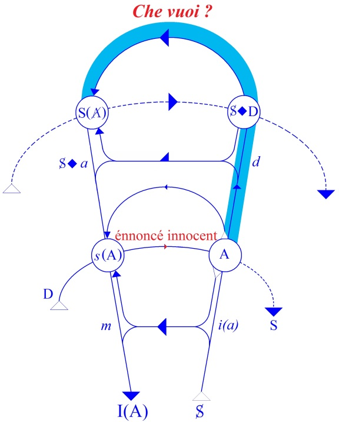
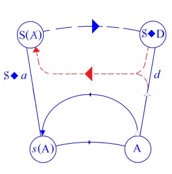
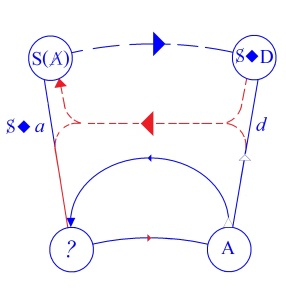

# Leçon 17 | 15 Avril 1959

<!-- source-url: http://staferla.free.fr/S6/S6 LE DESIR.docx -->
<!-- seminar: s6 -->
<!-- lesson: 17 -->

<!-- id: s6-17-0001 -->

HAMLET (5)

<!-- id: s6-17-0002 -->

J’ai annoncé somme toute qu’aujourd’hui, à titre d’appât, je parlerais de cet appât qu’est OPHÉLIE. Et je pense que je vais tenir ma parole. Cet objet, ce thème, ce personnage, vient ici comme élément dans notre propos,

<!-- id: s6-17-0003 -->

celui que nous suivons depuis déjà quatre de nos rencontres, qui est de montrer dans HAMLET, *la tragédie du désir*.

<!-- id: s6-17-0004 -->

De montrer que si elle peut à proprement parler être qualifiée ainsi, c’est dans toute la mesure où *le désir* comme tel, où *le désir* humain, *le désir* à quoi nous avons affaire dans l’analyse, *le désir* que nous sommes en posture - selon le mode de notre visée à son endroit - d’infléchir voire de confondre avec d’autres termes, *ce désir* ne se conçoit, *ne se situe que par rapport aux coordonnées fixes dans la subjectivité* telles que FREUD a démontré qu’elles fixent à une certaine *distance* l’un de l’autre, *le sujet* et *le signifiant*, ce qui met le sujet dans une certaine dépendance du signifiant comme tel.

<!-- id: s6-17-0005 -->

Ceci veut dire que nous ne pouvons pas rendre compte de l’expérience analytique en partant de l’idée que *le signifiant serait par exemple un pur et simple reflet*, un pur et simple produit *de ce qu’on appelle en l’occasion «* *les relations inter-humaines* ». Et cela n’est pas seulement un instrument, c’est un des composants initiaux essentiel d’une *topologie*, faute de laquelle on voit l’ensemble des phénomènes se réduire, se raplatir d’une façon qui ne nous permet pas, à nous analystes, de rendre compte de ce qu’on peut appeler les présupposés de notre expérience.

<!-- id: s6-17-0006 -->

J’ai commencé dans ce chemin, prenant HAMLET comme un exemple de quelque chose qui nous dénonce un sens dramatique très vif des coordonnées de cette *topologie*, et qui fait que c’est à ceci que nous attribuons l’exceptionnel pouvoir de captivation qu’a HAMLET, qui nous fait dire :

<!-- id: s6-17-0007 -->

- que si la tragédie d’HAMLET a ce rôle prévalent dans les préférences du public critique,

<!-- id: s6-17-0008 -->

- que si elle est toujours séduisante pour ceux qui en approchent,

<!-- id: s6-17-0009 -->

…cela tient à quelque chose qui montre que le poète y a mis par quelque biais, quelques aperçus de *sa propre expérience.*

<!-- id: s6-17-0010 -->

Et tout l’indique dans *la sorte de tournant que représente* HAMLET dans l’œuvre shakespearienne, voire aussi que son expérience de poète, au sens technique du terme, lui en ait peu à peu montré les voies. *C’est à cause de certains détours*…

<!-- id: s6-17-0011 -->

> que nous pensons ici pouvoir interpréter en fonction de certains de nos repères,
>
> de ceux qui sont articulés dans notre *gramme*

<!-- id: s6-17-0012 -->

…que nous pouvons saisir la portée de cette étude certainement très essentielle. Une péripétie est accrochée d’une façon qui distingue la pièce de SHAKESPEARE des pièces précédentes ou des récits de SAXO GRAMMATICUS, de BELLEFOREST, comme des pièces sur lesquelles nous avons *des aperçus fragmentaires*.

<!-- id: s6-17-0013 -->

Ce détour est celui du personnage d’OPHÉLIE qui est certes présent dans l’histoire depuis le début : OPHÉLIE, je vous l’ai dit, c’est le piège - dès l’origine de la légende d’HAMLET - c’est le piège où HAMLET ne tombe pas, d’abord parce qu’on l’a averti, ensuite parce que l’appât lui-même, à savoir l’OPHÉLIE de SAXO GRAMMATICUS, ne s’y prête pas, *amoureuse* qu’elle est depuis longtemps - nous dit le texte de BELLEFOREST - *du prince* HAMLET.

<!-- id: s6-17-0014 -->

Cette OPHÉLIE, SHAKESPEARE en a fait tout autre chose. Dans l’*intrigue* peut-être n’a-t-il fait qu’approfondir cette fonction, ce rôle qu’a OPHÉLIE dans *la légende*, destinée qu’elle est à prendre, à captiver, à surprendre le secret d’HAMLET. Elle est peut-être *quelque chose* qui devient un élément des plus intimes du drame d’HAMLET que nous a fait SHAKESPEARE, d’HAMLET qui a perdu la route, la voie de son désir. Elle est un élément d’articulation essentiel dans ce cheminement qui fait aller HAMLET à ce que je vous ai appelé la dernière fois « *l’heure de son rendez-vous mortel* », de l’accomplissement d’un acte qu’il accomplit en quelque sorte malgré lui.

<!-- id: s6-17-0015 -->

Nous verrons encore plus aujourd’hui à quel point HAMLET est bien l’image de ce niveau du sujet où l’on peut dire que c’est en terme de signifiants purs que la destinée s’articule, et que *le sujet n’est en quelque sorte que l’envers d’un message qui n’est même pas le sien*. Le premier pas que nous avons fait dans cette voie a donc été d’articuler combien la pièce, qui est *le drame du désir* dans le rapport *au désir de l’Autre,* combien elle est dominée de cet Autre qui est ici *le désir* – de la façon la moins ambiguë – *de la mère*, c’est-à-dire le sujet primordial de la demande.

<!-- id: s6-17-0016 -->

Ce sujet dont je vous ai montré que c’est le vrai *sujet tout puissant* dont nous parlons toujours dans l’analyse. Cela n’est pas la \[...\] de la femme qui a en elle cette dimension dont elle est la *toute puissance,* dite *toute puissance, toute puissance de la pensée*. C’est de *toute puissance du sujet* comme sujet de la première demande qu’il s’agit, et c’est à elle que cette *toute puissance* doit toujours être référée, je vous l’ai dit aussi lors de *nos premières démarches*.

<!-- id: s6-17-0017 -->

Il s’agit de quelque chose, au niveau de ce *désir de l’Autre*, qui se présente au prince HAMLET…

<!-- id: s6-17-0018 -->

c’est-à-dire au sujet principal de la pièce

<!-- id: s6-17-0019 -->

…tellement comme tragédie, le drame d’une *subjectivité*. HAMLET est toujours là, et on peut dire éminemment plus qu’en tout autre drame. *Le drame se présente d’une façon toujours double*, ses éléments étant à la fois *inter* et *intra-subjectifs*. Donc dans la perspective même du sujet, du prince HAMLET, ce désir de l’Autre, ce désir de la mère se présente essentiellement comme un désir qui…

<!-- id: s6-17-0020 -->

- entre un objet éminent, cet objet idéalisé, exalté qu’est son père,

<!-- id: s6-17-0021 -->

- et cet objet déprécié, méprisable qu’est CLAUDIUS, le frère criminel et adultère

<!-- id: s6-17-0022 -->

…ne choisit pas. Elle ne choisit pas en raison de quelque chose qui est présent comme de l’ordre d’une *voracité instinctuelle* qui fait que, chez elle, ce sacro-saint objet génital de notre récente terminologie se présente comme rien d’autre que comme l’objet d’une jouissance qui est vraiment satisfaction directe d’un besoin.

<!-- id: s6-17-0023 -->

Cette dimension est essentielle, elle est celle qui forme un des pôles entre lesquels vacille l’*adjuration* d’HAMLET à sa mère. Je vous l’ai montré dans la scène où confronté à elle, *il lui lance cet appel vers l’abstinence* à ce moment où, dans les termes, au reste les plus crus, les plus cruels, il transmet le message essentiel que le fantôme, son père, l’a chargé de transmettre. *Soudain cet appel échoue et se retourne : il la renvoie à la couche de* CLAUDIUS, aux caresses de l’homme qui ne manqueront pas de la faire, une fois de plus, céder.

<!-- id: s6-17-0024 -->

Dans cette sorte de chute, d’abandon, de la fin de l’adjuration d’HAMLET, nous trouvons le terme même, le modèle qui nous permet de concevoir en quoi lui, son désir, son élan vers une action qu’il brûle d’accomplir…

<!-- id: s6-17-0025 -->

> le monde entier devient pour lui vivant reproche de n’être jamais à la hauteur de sa propre *volonté*

<!-- id: s6-17-0026 -->

…cette action retombe de la même façon que l’*adjuration* qu’il adresse à sa mère.

<!-- id: s6-17-0027 -->

C’est essentiellement dans cette dépendance du désir du sujet par rapport au sujet Autre que se présente l’accent majeur, l’accent même du drame d’HAMLET, ce qu’on peut appeler sa dimension permanente.

<!-- id: s6-17-0028 -->

Il s’agit de voir en quoi…

<!-- id: s6-17-0029 -->

> d’une façon plus articulée, en entrant dans un détail psychologique qui resterait, je dois dire, foncièrement *énigmatique* s’il n’était pas - *ce détail* - soumis à cette visée d’ensemble qui *fait le sens de la tragédie* d’HAMLET

<!-- id: s6-17-0030 -->

…comment ceci retentit sur le nerf même du vouloir d’HAMLET, sur ce quelque chose qui dans mon graphe est le crochet, le point d’interrogation du « *Che vuoi ?* » de *la subjectivité constituée dans l’Autre*, et *s’articulant dans l’Autre*.

<!-- id: s6-17-0031 -->

<!-- id: s6-17-0032 -->

C’est le sens de ce que j’ai à dire aujourd’hui : ce qu’on peut appeler « *le réglage imaginaire* » :

<!-- id: s6-17-0033 -->

- de ce qui constitue le support du désir,

<!-- id: s6-17-0034 -->

- de ce qui, en face d’un point indéterminé, un point variable, ici sur l’origine de la courbe, et qui représente cette assomption par le sujet de son vouloir essentiel,

<!-- id: s6-17-0035 -->

- de ce qui vient se régler sur *quelque chose* qui est quelque part *en face* et en quelque sorte – on peut le dire tout de suite – *au niveau* du *sujet inconscient*, l’aboutissant, la butée, le terme de ce qui constitue la question du sujet,

<!-- id: s6-17-0036 -->

- de ce *quelque chose* que nous symbolisons par cet S *en présence de* *a* : S ◊ *a*, et que nous appelons *le fantasme*,

<!-- id: s6-17-0037 -->

- de ce qui dans l’économie psychique, représente quelque chose que vous connaissez, ce quelque chose d’ambigu autant qu’il est effectivement dans le conscient, quand nous l’abordons par une certaine phase, un dernier terme, ce terme qui fait le fond de toute passion humaine, en tant qu’elle est marquée par quelques uns de ces traits que nous appelons traits de perversion.

<!-- id: s6-17-0038 -->

Le mystère du *fantasme*, en tant qu’il est en quelque sorte le dernier terme d’un désir, est que toujours, plus ou moins, il se présente sous une forme assez paradoxale pour avoir à proprement parler motivé le rejet antique de sa dimension comme étant de l’ordre de l’absurde. Et ce pas essentiel, qui a été fait à l’époque moderne où *la psychanalyse* constitue le tournant premier qui tente – ce fantasme en tant que pervers – de l’interpréter, de concevoir :

<!-- id: s6-17-0039 -->

- qu’il n’a pu être conçu que pour autant qu’il a été ordonné à une économie inconsciente,

<!-- id: s6-17-0040 -->

- que s’il apparaît dans la butée de son dernier terme, dans son énigme, il peut être compris en fonction d’un circuit inconscient, qui lui, s’articule à travers *une autre chaîne signifiante* profondément différente de la chaîne que le sujet commande, en tant que c’est celle-ci, celle qui est au-dessous de la première.

<!-- id: s6-17-0041 -->

Et au niveau, premièrement de la demande, si ce fantasme intervient - ou aussi bien n’intervient pas - c’est dans la mesure où *quelque chose* \[S◊*a*\] qui normalement n’en parvient pas par cette voie \[S◊*a* *→* *s*(A)\], n’en revient pas au niveau du message…

<!-- id: s6-17-0042 -->

> du signifié de l’Autre \[*s*(A)\] qui est le module, la somme de toutes les significations
>
> telles qu’elles sont acquises par le sujet dans l’échange inter-humain et le discours complet

<!-- id: s6-17-0043 -->

…c’est en tant que ce *fantasme* \[S◊*a*\] passe ou ne passe pas, pour arriver au message \[*s*(A)\], que nous nous trouvons dans une *situation normale* ou dans une *situation atypique*.

<!-- id: s6-17-0044 -->

 

<!-- id: s6-17-0045 -->

Il est normal *que par cette voie il ne passe pas, qu’il reste inconscient*, qu’il soit séparé. Il est aussi essentiel qu’à certaines phases, et à des phases qui s’inscrivent plus ou moins *dans l’ordre du pathologique*, il franchisse aussi ce passage. Nous donnerons leur *nom* à *ces moments* de franchissement, ces moments de communication qui ne peuvent se faire, comme vous l’indique le schéma, que dans *un seul sens*. J’indique cette *articulation* essentielle puisque c’est pour avancer en somme dans le maniement de cet appareil que nous appelons ici *le gramme*, que nous sommes ici.

<!-- id: s6-17-0046 -->

Nous allons voir pour l’instant simplement ce que veut dire, et comment fonctionne *dans la tragédie shakespearienne*, ce que j’ai appelé le moment d’affolement du désir d’HAMLET, pour autant que c’est à ce réglage imaginaire qu’il convient de le rapporter.

<!-- id: s6-17-0047 -->

OPHÉLIE, dans ce repérage se situe au niveau de la lettre *a*, la lettre en tant qu’elle est inscrite dans cette symbolisation d’un fantasme, le fantasme étant le support, le substrat imaginaire de quelque chose qui s’appelle à proprement parler le désir, en tant qu’il se distingue de la demande, qu’il se distingue aussi du besoin.

<!-- id: s6-17-0048 -->

Cet *a* correspond à ce quelque chose vers quoi se dirige toute l’articulation moderne de l’analyse quand elle cherche à articuler l’*objet* et *la relation de l’objet*. Il y a quelque chose de juste dans cette recherche, en ce sens que le rôle de cet objet est sans doute décisif comme elle l’articule - je veux dire la notion commune de *la relation d’objet -* quand elle l’articule comme ce qui structure fondamentalement le mode d’appréhension du monde.

<!-- id: s6-17-0049 -->

Simplement, dans la relation d’objet telle qu’elle nous est expliquée le plus communément actuellement dans la plupart des traités qui lui font une plus ou moins grande part…

<!-- id: s6-17-0050 -->

> que ce soit un volume paru assez près de nous auquel je fais allusion comme à l’exemple le plus caricatural, comme d’autres plus élaborés comme ceux de FEDERN ou tel ou tel autre[^81]

<!-- id: s6-17-0051 -->

…l’erreur et la confusion consistent dans cette théorisation de l’objet en tant qu’objet, qui s’appelle lui-même objet pré-génital. Un objet génital est aussi nommément à l’intérieur des diverses formes de l’objet pré-génital et des diverses formes de l’objet anal, etc. C’est précisément ce qui vous est matérialisé sur ce schéma, en ceci que c’est prendre la dialectique de l’objet pour la dialectique de la demande.

<!-- id: s6-17-0052 -->

Et cette confusion est explicable parce que dans les deux cas le sujet se trouve lui-même dans un moment, dans une posture dans son rapport avec le signifiant, qui est la même. Le sujet est *en position d’éclipse*.

<!-- id: s6-17-0053 -->

Pour autant que dans ces deux points de notre *gramme*, qu’il s’agisse du *code* au niveau de l’inconscient \[S◊D\]…

<!-- id: s6-17-0054 -->

> c’est-à-dire de la série de rapports qu’il a avec un certain appareil de la demande

<!-- id: s6-17-0055 -->

…ou qu’il s’agisse du *rapport imaginaire* qui le constitue d’une façon privilégiée dans une certaine posture aussi définie par son rapport au signifiant devant un *objet(a)* \[S◊*a*\], dans ces deux cas *le sujet est en position d’éclipse*.

<!-- id: s6-17-0056 -->

Il est dans cette position que j’ai commencé à articuler la dernière fois sous le terme de *fading*. J’ai choisi ce terme pour toutes sortes de raisons philologiques, et aussi parce qu’il est devenu tout à fait familier à propos de l’utilisation des appareils de communication qui sont les nôtres. Le *fading* c’est exactement ce qui se produit dans un appareil de communication, de reproduction la voix, quand la voix *disparaît*, *s’effondre*, *s’évanouit*, pour reparaître au gré de quelque variation dans le support lui-même, dans *la transmission*.

<!-- id: s6-17-0057 -->

C’est en tant donc que le sujet est en un même moment d’oscillation qui est celui qui caractérise…

<!-- id: s6-17-0058 -->

> nous viendrons naturellement à donner *son support et ses coordonnées réelles* à ce qui n’est qu’une métaphore

<!-- id: s6-17-0059 -->

…le *fading* devant la demande et devant l’objet, que la confusion peut se produire et qu’en fait, ce qu’on appelle relation d’objet est toujours rapport du sujet, dans ce moment privilégié et dit de *fading du sujet,* à des - non pas « *objets* » comme on le dit - signifiants de la demande. Et pour autant que *la demande* reste fixe, c’est au mode, à l’appareil signifiant qui correspond aux différents types, oral, anal et autres, que l’on peut articuler quelque chose qui a en effet une sorte de correspondance clinique.

<!-- id: s6-17-0060 -->

Mais il y a un grand inconvénient à confondre :

<!-- id: s6-17-0061 -->

- ce qui est rapport au signifiant,

<!-- id: s6-17-0062 -->

- avec ce qui est rapport à l’objet.

<!-- id: s6-17-0063 -->

Car cet objet est autre, car cet objet, en tant qu’objet du désir, a un autre sens, parce que toutes sortes de choses rendent nécessaire que nous ne méconnaissions pas…

<!-- id: s6-17-0064 -->

> même donnerions-nous toute leur valeur primitive déterminante, comme on le fait, aux signifiants de la demande en tant qu’ils sont signifiants oraux, anaux, avec toutes les subdivisions, toutes les différences d’orientation ou de polarisation que peut prendre cet objet en tant que tel par rapport au sujet,
>
> ce que *la relation d’objet*, telle qu’elle est pour l’instant articulée, méconnaissait

<!-- id: s6-17-0065 -->

…justement cette corrélation au *sujet* qui est exprimée ainsi en tant que le sujet est marqué de la barre.

<!-- id: s6-17-0066 -->

C’est ce qui fait que le sujet, même quand nous le considérons aux stades les plus primitifs de la période orale telle que l’a articulée par exemple, d’une façon autrement proche, autrement rigoureuse, exacte, une Mélanie KLEIN : nous nous trouvons, remarquez-le dans le texte même de Mélanie KLEIN, en présence de certains paradoxes, et que ces paradoxes ne sont pas inscrits dans la pure et simple articulation qu’on peut faire du sujet comme étant mis face à face avec l’*objet* correspondant à un besoin, nommément *le mamelon*, *le sein* dans l’occasion.

<!-- id: s6-17-0067 -->

Car le paradoxe apparaît en ceci que, dès l’origine, un autre signifiant énigmatique se présente à l’horizon de cette relation. Ceci est parfaitement mis en évidence dans Mélanie KLEIN, qui n’a qu’un seul mérite en cette occasion, c’est de ne pas hésiter à foncer, c’est-à-dire à entériner ce qu’elle trouve dans *l’expérience clinique* et, faute d’explication, de se contenter d’explications fort pauvres. Mais assurément elle témoigne que le *phallus* est déjà là comme tel et comme, à proprement parler, destructeur par rapport au sujet.

<!-- id: s6-17-0068 -->

Elle en fait dès l’abord *cet objet primordial* qui est à la fois le meilleur et le pire, ce autour de quoi vont tourner tous les avatars de la période paranoïde comme de la période dépressive. Je ne fais ici bien entendu qu’*indiquer*, que *rappeler*.

<!-- id: s6-17-0069 -->

Ce que je puis *articuler* plus avant à propos de cet S, et pour autant qu’il nous intéresse, non pas en tant qu’il est confronté, mis en rapport avec la demande, mais avec cet élément que nous allons cette année essayer de serrer de plus près, qui est représenté par le *a*.

<!-- id: s6-17-0070 -->

Le *a*, objet essentiel, objet autour de quoi tourne, comme telle, la dialectique du désir, objet autour de quoi le sujet s’éprouve dans une altérité *imaginaire*, devant un élément qui est altérité au niveau imaginaire tel que nous l’avons déjà articulé et défini maintes fois. Il est *image*, et il est *pathos*.

<!-- id: s6-17-0071 -->

Et c’est par cet *autre* qu’est l’objet du désir, qu’est remplie une fonction qui définit le désir dans cette double coordonnée qui *fait qu’il ne vise pas* - non pas du tout ! - *un objet en tant que tel d’une satisfaction de besoin*, mais un *objet* en tant qu’il est déjà lui-même relativé, je veux dire mis en relation avec le sujet, le sujet qui est présent dans le fantasme. Ceci est une évidence phénoménologique, et j’y reviendrai plus loin.

<!-- id: s6-17-0072 -->

Le sujet est présent dans le fantasme. Et la fonction de l’objet…

<!-- id: s6-17-0073 -->

> qui est objet du désir uniquement en ceci qu’il est *terme* du fantasme

<!-- id: s6-17-0074 -->

…l’objet prend la place, dirais-je, de ce dont le sujet est privé *symboliquement*.

<!-- id: s6-17-0075 -->

Ceci peut vous paraître un peu abstrait, je veux dire, à ceux qui n’ont pas fait tout le chemin qui précède avec nous. Disons pour ceux-là que c’est pour autant que dans l’articulation du fantasme, l’objet prend la place de ce dont le sujet est privé. C’est quoi ? C’est du *phallus* que l’objet prend cette fonction qu’il a dans le fantasme, et que le désir, avec le fantasme pour support, se constitue. Je pense qu’il est difficile d’aller plus loin dans l’extrême de ce que je veux dire concernant ce que nous devons appeler à proprement parler le désir et son rapport avec le fantasme.

<!-- id: s6-17-0076 -->

C’est en ce sens, et pour autant que cette formule : *L’objet du fantasme est cette altérité, image et pathos par où un autre*

<!-- id: s6-17-0077 -->

*prend la place de ce dont le sujet est privé symboliquement*, vous le voyez bien, c’est dans cette direction que cet *objet imaginaire* se trouve en quelque sorte en position de *condenser sur lui* ce qu’on peut appeler les vertus ou *la dimension de l’être*,

<!-- id: s6-17-0078 -->

qu’il peut devenir ce véritable *leurre de l’être* qu’est l’objet du désir humain.

<!-- id: s6-17-0079 -->

Ce quelque chose devant quoi Simone WEIL s’arrête quand elle pointe le rapport le plus épais, le plus opaque qui puisse nous être présenté de l’homme avec l’objet de son désir, le rapport de l’avare avec sa cassette, où semble culminer pour nous de la façon la plus évidente *ce caractère de fétiche* qui est celui de *l’objet du désir* humain, et qui est aussi bien le caractère ou l’une des faces de tous ces objets.

<!-- id: s6-17-0080 -->

Il est assez comique de voir - comme il m’a été donné récemment - un bonhomme, qui était venu nous expliquer le rapport de la théorie de la signification avec le marxisme, dire qu’on ne saurait aborder la théorie de la signification sans la faire partir des relations inter-humaines : ceci allait assez loin ! Au bout de trois minutes nous apprenions que le signifiant était l’instrument grâce à quoi l’homme transmettait à son semblable ses pensées privées… Cela nous a été dit textuellement dans une bouche qui s’autorisait de MARX. À ne pas rapporter les choses à ce fondement de la relation inter-humaine nous tombions, parait-il, dans le danger de fétichiser ce dont il s’agit dans le domaine du langage !

<!-- id: s6-17-0081 -->

Assurément je veux bien qu’en effet nous devions rencontrer quelque chose qui ressemble fort au fétiche, mais je me demande si ce quelque chose qui s’appelle fétiche, cela n’est justement pas une des dimensions mêmes du monde humain, et précisément celle dont il s’agit de rendre compte.

<!-- id: s6-17-0082 -->

Si nous mettons le tout dans la racine de la relation inter-humaine nous n’aboutissons qu’à une chose, c’est à renvoyer le fait de la fétichisation des objets humains à je ne sais quel *malentendu inter-humain* qui, lui-même donc, suppose un renvoi à des significations. De même que les pensées privées dont il s’agissait…

<!-- id: s6-17-0083 -->

je pense dans une pensée génétique

<!-- id: s6-17-0084 -->

…sont bien là pour vous faire sourire, car déjà si les pensées privées sont là, à quoi bon aller chercher plus loin !

<!-- id: s6-17-0085 -->

Bref, il est assez surprenant que ce rapport, non pas à *la praxis humaine*, mais à une *subjectivité humaine* donnée comme essentiellement primitive, soit soutenu dans une doctrine qui se qualifie marxiste, alors qu’il me semble qu’il suffit d’ouvrir le premier tome du *Capital* pour s’apercevoir que le premier pas de l’analyse de MARX est très à proprement parler à propos du caractère fétiche de la marchandise, d’aborder le problème très exactement au niveau propre et, comme tel, encore que le terme n’y soit pas dit, comme tel au niveau du signifiant.

<!-- id: s6-17-0086 -->

Les rapports signifiants, les rapports de valeurs sont donnés d’abord, et toute la subjectivité, celle de la fétichisation éventuellement, vient s’inscrire à l’intérieur de cette dialectique signifiante. Ceci ne fait pas l’ombre d’un doute. Ceci est une simple parenthèse, reflet que je déverse dans votre oreille, *de mes indignations occasionnelles*, et de l’ennui que je peux ressentir d’avoir perdu mon temps.

<!-- id: s6-17-0087 -->

Maintenant essayons de nous servir de *ce rapport* S *en présence du* *a* \[S◊*a*\] qui est pour nous *le support fantasmatique du désir*. Il faut que nous l’*articulions* nettement, parce que *a*, cet *autre imaginaire*, qu’est-ce que cela veut dire ?

<!-- id: s6-17-0088 -->

Cela veut dire que *quelque chose* de *plus ample qu’une personne* peut s’y inclure, toute une chaîne, tout un scénario. Je n’ai pas besoin de revenir à cette occasion à ce que, l’année dernière, j’ai mis ici en avant à propos de l’analyse du *Balcon* de Jean GENET. Il suffit, pour donner son sens à ce que je veux dire en l’occasion, de renvoyer à ce que nous pouvons appeler *le bordel diffus*, pour autant qu’il devient la cause de ce qu’on appelle chez nous le sacro-saint génital.

<!-- id: s6-17-0089 -->

Ce qui est important dans cet élément à proprement parler structurel du fantasme imaginaire en tant qu’il se situe au niveau de *a*, c’est d’une part ce caractère opaque, celui qui le spécifie sous ses formes les plus accentuées comme le pôle du *désir pervers*, en d’autres termes : qui en fait l’élément structural des perversions et nous montre donc que la perversion se caractérise en ceci : que tout l’accent du fantasme est mis du côté du corrélatif proprement imaginaire de l’autre : *a*, ou de la parenthèse dans laquelle quelque chose qui est (*a* + *b* + *c*...) c’est toute la combinaison des objets les plus élaborés qui peuvent se trouver là réunis selon l’aventure, les séquelles, les résidus dans lesquels est venu se cristalliser la fonction d’un fantasme dans un désir pervers.

<!-- id: s6-17-0090 -->

Néanmoins ce qui est essentiel…

<!-- id: s6-17-0091 -->

> et ce qui est cet élément de phénoménologie auquel je faisais allusion tout à l’heure

<!-- id: s6-17-0092 -->

…c’est de vous rappeler que *si étrange*, *si bizarre* que puisse être dans son aspect *le fantasme du désir pervers*, le désir y est toujours de quelque façon intéressé. Intéressé dans un rapport qui est toujours lié au *pathétique*, à *la douleur d’exister* comme tel, d’exister tout purement, ou d’exister comme terme sexuel. C’est évidemment dans la mesure où celui qui subit l’injure dans le *fantasme sadique* est quelque chose qui intéresse le sujet en tant que lui-même peut être offert à cette injure, que le *fantasme sadique* subsiste.

<!-- id: s6-17-0093 -->

Et de cette dimension on ne peut dire qu’une chose, c’est qu’on ne peut être que surpris que, même un seul instant, on ait pu penser à l’éluder en faisant de la tendance sadique quelque chose qui d’aucune façon puisse se rapporter à une pure et simple agression primitive.Je ne m’étends que trop. Si je le fais, ce n’est que pour bien accentuer *quelque chose* qui est ce vers quoi il nous faut articuler maintenant la véritable opposition entre perversion et névrose.

<!-- id: s6-17-0094 -->

Si la perversion est donc quelque chose d’articulé bien sûr…

<!-- id: s6-17-0095 -->

> et exactement du même niveau, vous allez le voir, que la névrose

<!-- id: s6-17-0096 -->

…quelque chose d’interprétable, d’analysable…

<!-- id: s6-17-0097 -->

> pour autant que dans les éléments imaginaires quelque chose se trouve d’un rapport essentiel du sujet
>
> à son être, sous une forme essentiellement localisée, fixée comme on l’a toujours dit

<!-- id: s6-17-0098 -->

…la névrose se situe par un accent mis sur l’autre terme du fantasme, c’est-à­dire au niveau de l’S.

<!-- id: s6-17-0099 -->

Je vous ai dit que *ce fantasme* comme tel se situe à l’extrême, à la pointe, au niveau de butée du reflet de l’interrogation subjective, pour autant que le sujet tente de s’y ressaisir dans cet au-delà de la demande, dans la dimension même du discours de l’Autre où il a à retrouver ce qui a été perdu par cette entrée dans le discours de l’Autre.

<!-- id: s6-17-0100 -->

Je vous ai dit qu’au dernier terme ce n’est pas du *niveau de la vérité*, mais de *l’heure de la vérité* qu’il s’agit. C’est en effet essentiellement ce qui nous montre, ce qui nous permet de désigner ce qui distingue le plus profondément *le fantasme de la névrose* du *fantasme de la perversion*. Le fantasme de la perversion - vous ai-je dit - est appelable, il est dans l’espace, il suspend je ne sais quelle relation essentielle. Il n’est pas à proprement parler a-temporel, il est hors du temps. Le rapport du sujet au temps, dans la névrose, est justement ce quelque chose dont on parle trop peu et qui est pourtant la base même des rapports du sujet à son objet au niveau du fantasme.

<!-- id: s6-17-0101 -->

Dans la névrose, l’objet se charge de cette signification qui est à chercher dans ce que j’appelle *l’heure de vérité*. L’objet y est toujours *à l’heure d’avant*, ou *à* *l’heure d’après *:

<!-- id: s6-17-0102 -->

- si *l’hystérie* se caractérise par la fondation d’*un désir* en tant qu’*insatisfait*,

<!-- id: s6-17-0103 -->

- *l’obsession* se caractérise par *la fonction d’un désir impossible*.

<!-- id: s6-17-0104 -->

Mais ce qu’il y a au-delà de ces deux termes est quelque chose qui a un rapport double et inverse…

<!-- id: s6-17-0105 -->

dans un cas et dans l’autre

<!-- id: s6-17-0106 -->

…avec ce phénomène qui affleure, qui pointe, qui se manifeste d’une façon permanente dans *cette procrastination* *de l’obsessionnel* par exemple, fondée sur le fait d’ailleurs qu’il anticipe toujours trop tard. De même que pour *l’hystérique*, il y a qu’il répète toujours ce qu’il y a d’initial dans son trauma, à savoir un certain « *trop tôt* », une *immaturation* fondamentale.

<!-- id: s6-17-0107 -->

C’est ici…

<!-- id: s6-17-0108 -->

> dans ce fait que le fondement d’un comportement névrotique, dans sa forme la plus générale, et que dans son objet, le sujet cherche toujours à lire son heure, même si l’on peut dire qu’il apprend à lire l’heure,

<!-- id: s6-17-0109 -->

…c’est en ce point que nous retrouvons notre HAMLET.

<!-- id: s6-17-0110 -->

Vous verrez pourquoi HAMLET peut être gratifié, qu’on peut lui prêter au gré de chacun, toutes les formes du comportement névrotique aussi loin que vous les poussiez, à savoir jusqu’à *la névrose de caractère*. Mais aussi bien, tout aussi légitimement, il y a à cela une raison qui, elle, s’étale à travers toute l’intrigue et qui fait véritablement un des facteurs communs de la structure d’HAMLET :

<!-- id: s6-17-0111 -->

- de même que le 1er terme, le 1er facteur était *la dépendance* par rapport au désir de l’Autre, *au désir de la mère*,

<!-- id: s6-17-0112 -->

- voici le 2nd caractère commun que je vous prie maintenant de retrouver à la lecture ou à la relecture d’HAMLET, HAMLET est toujours suspendu à l’heure de l’autre, et ceci jusqu’à la fin.

<!-- id: s6-17-0113 -->

Vous rappelez-vous un des premiers *tournants* où je vous ai arrêté en commençant de déchiffrer ce texte d’HAMLET, celui après la *play scene*, *la scène des comédiens* où le roi s’est troublé, a dénoncé visiblement aux yeux de tous, à propos de ce qui se produisait sur la scène, son propre crime, qu’il ne pouvait en supporter le spectacle.

<!-- id: s6-17-0114 -->

HAMLET triomphe, exulte, bafoue celui qui ainsi s’est dénoncé, et sur le chemin qui le mène au rendez-vous déjà pris, avant la *play scene*, avec sa mère…

<!-- id: s6-17-0115 -->

> et dont tout un chacun presse sa mère de hâter le terme

<!-- id: s6-17-0116 -->

…sur le chemin de cette rencontre où va se dérouler la grande scène sur laquelle j’ai déjà tant de fois mis l’accent, il rencontre son beau-père, CLAUDIUS, en prière, CLAUDIUS ébranlé jusque dans ses fondements par ce qui vient de le toucher, en lui montrant le visage même, le scénario de son action. HAMLET est là devant son oncle dont tout semble indiquer, même dans la scène, que non seulement il est peu disposé à se défendre, mais même qu’il ne voit pas la menace qui pèse au-dessus de sa tête. *Et il s’arrête parce que ce n’est pas l’heure*.

<!-- id: s6-17-0117 -->

Ce n’est pas l’heure de l’autre. Ce n’est pas l’heure où l’autre doit avoir à rendre ses comptes devant l’Éternel. Cela serait *trop bien* d’un côté, ou *trop mal* de l’autre. Cela ne vengerait pas assez son père, parce que, peut-être dans ce geste de repentir qu’est la prière, s’ouvrirait pour lui la voie du salut.

<!-- id: s6-17-0118 -->

Quoiqu’il en soit, il y a une chose certaine, c’est qu’HAMLET qui vient de faire cette *capture de la conscience du roi*…

<!-- id: s6-17-0119 -->

« *The play’s the thing Where in I’ll catch the conscience of the king.* »[^82]

<!-- id: s6-17-0120 -->

…qu’il se proposait, HAMLET s’arrête. Il ne pense pas un seul instant que c’est maintenant son heure. Quoi qu’il puisse par la suite advenir, *ce n’est pas l’heure* de l’autre, et il suspend son geste. De même ce ne sera jamais, et toujours dans tout ce que fait HAMLET, *qu’à l’heure de l’autre* qu’il le fera.

<!-- id: s6-17-0121 -->

Il accepte tout. N’oublions pas tout de même, qu’au départ et dans l’écœurement où il était déjà, avant même la rencontre avec le *ghost* et le dévoilement du fond du crime, de ces simples ré-épousailles de sa mère, il ne songeait qu’à une chose : *partir pour Wittenberg*.

<!-- id: s6-17-0122 -->

C’est ce que quelqu’un illustrait récemment pour commenter un certain style pratique qui tend à s’établir dans les mœurs contemporaines, il faisait remarquer qu’HAMLET *était le plus bel exemple de ce que l’*« *on évite beaucoup de drames* *en donnant des passeports à temps* ». Si on lui avait donné ses passeports pour Wittenberg, il n’y aurait pas eu de drame.

<!-- id: s6-17-0123 -->

- C’est à l’heure de ses parents *qu’il reste là*.

<!-- id: s6-17-0124 -->

- C’est à l’heure des autres *qu’il suspend son crime*.

<!-- id: s6-17-0125 -->

- C’est à l’heure de son *beau-père,* *qu’il s’embarque* *pour l’Angleterre*.

<!-- id: s6-17-0126 -->

- C’est à l’heure de ROSENCRANTZ et de GUILDENSTERN qu’il est amené, évidemment avec une aisance qui faisait l’émerveillement de FREUD, à les envoyer au-devant de la mort grâce à un tour de passe-passe assez joliment accompli.

<!-- id: s6-17-0127 -->

- Et c’est quand même à l’heure d’OPHÉLIE aussi, à l’heure de son suicide, que cette tragédie va trouver

<!-- id: s6-17-0128 -->

- son terme, dans un moment où HAMLET, qui vient – semble-t­il – d’apercevoir que cela n’est pas difficile de tuer quelqu’un, « *le temps de dire one* », il n’aura pas le temps de « *faire ouf* ».

<!-- id: s6-17-0129 -->

Et pourtant on vient de lui annoncer quelque chose *qui ne ressemble en rien* à une occasion de tuer CLAUDIUS. On vient de lui proposer un très joli tournoi dont tous les détails ont été minutieusement minutés, préparés, et dont les enjeux sont constitués par ce que nous appellerons au sens collectionniste du terme, une série d’objets qui sont tous à caractère d’*objets précieux*, d’*objets de collection*.

<!-- id: s6-17-0130 -->

Il faudrait reprendre le texte, il y a même là des raffinements, nous entrons dans le domaine de la collection.

<!-- id: s6-17-0131 -->

Il s’agit d’*épées*, de *dragonnes*, de choses qui n’ont de valeur que comme objets de luxe. Et ceci va fournir l’enjeu d’une sorte de joute dans laquelle HAMLET en fait est provoqué sur le thème d’une certaine infériorité dont on lui accorde le bénéfice du challenge.

<!-- id: s6-17-0132 -->

C’est une cérémonie compliquée, un tournoi qui, bien entendu, pour nous, est le piège où il doit tomber, qui a été fomenté par son beau–père et son *ami* LAERTE, mais qui pour lui, n’oublions pas, n’est rien d’autre que d’accepter encore de faire *l’école buissonnière*, à savoir : « *on va beaucoup s’amuser* ».

<!-- id: s6-17-0133 -->

Quand même il ressent au niveau du cœur un petit avertissement. Il y a là quelque chose qui l’émeut. La dialectique du *pressentiment* à ce moment – du héros – vient ici donner un instant son accent au drame.

<!-- id: s6-17-0134 -->

Mais tout de même, essentiellement, c’est encore « *à l’heure de l’autre* » et, d’une façon encore bien plus énorme, pour soutenir la gageure de l’autre…

<!-- id: s6-17-0135 -->

> car ce ne sont pas ses biens qui sont engagés, c’est au bénéfice de son beau-père, et lui-même comme tenant de son beau-père

<!-- id: s6-17-0136 -->

…qu’il va se trouver entrer dans cette lutte, courtoise en principe, avec celui qui est présumé être plus fort que lui en escrime et, comme tel, va susciter en lui les sentiments de rivalité et d’honneur au piège desquels on a calculé qu’on le prendrait sûrement.

<!-- id: s6-17-0137 -->

Il se précipite donc dans le piège. Je dirais que ce qu’il y a de nouveau à ce moment-là, c’est seulement l’énergie, le cœur avec lequel il s’y précipite. Jusqu’au dernier terme, jusqu’à l’heure dernière, jusqu’à l’heure qui est tellement déterminante qu’elle va être sa propre heure…

<!-- id: s6-17-0138 -->

> à savoir qu’il sera atteint mortellement avant qu’il puisse atteindre son ennemi

<!-- id: s6-17-0139 -->

…c’est « *à l’heure de l’autre* » que la tragédie poursuit tout le temps sa chaîne, et s’accomplit. Ceci est, pour concevoir ce dont il s’agit, un cadre absolument essentiel.

<!-- id: s6-17-0140 -->

C’est en ceci que la résonance du personnage et du drame d’HAMLET, est la résonance même, métaphysique, de la question du héros moderne, pour autant qu’en effet quelque chose pour lui a changé dans son rapport à son destin. Je vous l’ai dit, *ce qui distingue* HAMLET d’ŒDIPE, *c’est que lui,* HAMLET*, sait.* Et ceci d’ailleurs explique avant tout, menés en ce point cœur, ce que nous venons de désigner être *des traits de surface*.

<!-- id: s6-17-0141 -->

Par exemple, la folie d’HAMLET. Il y a des héros tragiques, dans la tragédie antique, qui sont fous, mais à ma connaissance *il n’y en a pas* \- je dis dans la tragédie, je ne parle pas des textes légendaires - *qui fassent le fou comme tel*.

<!-- id: s6-17-0142 -->

Est-ce qu’on peut dire que tout dans la folie d’HAMLET se résume à *faire le fou* ? C’est une question que nous allons maintenant nous poser. Mais *il fait le fou parce qu’il sait qu’il est le plus faible*. Et ceci n’a d’intérêt à être pointé - vous voyez que, tout superficiel que ce soit, je le pointe maintenant – non pas parce que cela va plus avant dans notre direction, mais seulement parce que *c’est secondaire*.

<!-- id: s6-17-0143 -->

Ce n’est cependant pas secondaire en ceci…

<!-- id: s6-17-0144 -->

> il faut réfléchir à ceci si nous voulons comprendre ce que SHAKESPEARE a voulu dans HAMLET

<!-- id: s6-17-0145 -->

…*c’est que c’est le trait essentiel de la légende originale*, ce qu’il y a dans SAXO GRAMMATICUS et dans BELLEFOREST. SHAKESPEARE a choisi le sujet d’un héros contraint, pour poursuivre les cheminements qui l’amènent au terme de son geste, à *faire le fou*. Ceci est une dimension proprement moderne. Celui qui sait est dans une position si dangereuse, comme tel tellement désigné pour l’échec et le sacrifice, que son cheminement doit être - comme dit quelque part PASCAL - « *d’être fou avec les autres* »[^83]

<!-- id: s6-17-0146 -->

Cette façon de *faire le fou* qui est un des enseignements, une des dimensions de ce que je pourrais appeler la politique du héros moderne, est quelque chose qui mérite de n’être pas négligé si nous pensons que c’est ce dont s’est saisi SHAKESPEARE au moment où il veut faire la tragédie d’HAMLET. Ce que lui offrent les auteurs, c’est essentiellement cela. Et il ne s’agit que de cela, de savoir ce que ce fou a derrière la tête. Que ce soit à l’intérieur de cela que SHAKESPEARE ait choisi son sujet est un point tout à fait essentiel.

<!-- id: s6-17-0147 -->

Nous voici maintenant arrivés au point où OPHÉLIE a à remplir son rôle. Si la pièce a vraiment tout ce que je viens déjà de vous développer dans sa structure, en fin de compte à quoi bon ce personnage d’OPHÉLIE ? Je rappelle ce que certains me reprochent de n’avoir avancé qu’avec une certaine timidité, je ne crois pas que j’ai fait preuve d’une exceptionnelle timidité.

<!-- id: s6-17-0148 -->

Je ne voudrais pas vous encourager à cette sorte de calembredaine dont les textes psychanalytiques fourmillent littéralement, je suis seulement étonné qu’on n’ait pas donné qu’OPHÉLIE est l’ὀμϕαλός \[omphalos\][^84] parce qu’on en trouve d’aussi *gros* et d’aussi *énormes*, des *pas piqués des hannetons* à seulement ouvrir les *Unfinished papers on Hamlet* qu’Ella SHARPE a peut-être laissés regrettablement inachevés avant sa mort, et qu’on a peut-être eu tort de publier. *Mais* OPHÉLIE *est évidemment essentielle. Elle correspond à ça, et est liée à jamais, pour les siècles à la figure d’*HAMLET.

<!-- id: s6-17-0149 -->

Je veux simplement…

<!-- id: s6-17-0150 -->

> puisqu’il est assez tard pour que je ne puisse pas en finir aujourd’hui avec OPHÉLIE

<!-- id: s6-17-0151 -->

…vous scander ce qui se passe le long de la pièce. OPHÉLIE, nous en entendons d’abord parler comme de la cause du triste état d’HAMLET. Cela c’est la *sagesse psychanalytique* de POLONIUS :

<!-- id: s6-17-0152 -->

- « *Il est triste, c’est parce qu’il n’est pas heureux. il n’est pas heureux, c’est à cause de ma fille.* *Vous ne la connaissez pas ? C’est la fine fleur, et comme de bien entendu, moi, le père, je ne tolérerai pas cela !* »

<!-- id: s6-17-0153 -->

On la voit apparaître à propos de quelque chose qui en fait déjà une personne très remarquable, à savoir à propos d’une observation clinique, que c’est elle qui a eu le bonheur d’être la première personne qu’HAMLET a rencontrée *après* la rencontre avec le *ghost*. C’est-à-dire qu’à peine sorti de cette rencontre qui avait quand même quelque chose d’assez secouant, il a rencontré OPHÉLIE. Et la façon dont il se comporte avec OPHÉLIE est quelque chose qui, je crois, vaut la peine d’être rapportée :

<!-- id: s6-17-0154 -->

- « *My lord, as I was sewing in my closet, Monseigneur, comme j’étais à coudre dans ma chambre, Le seigneur HAMLET, son pourpoint tout défait, Point de chapeau sur la tête, les bas crottés et qui sans jarretières tombaient sur ses talons, Pale as his shirt, his knees knocking each other, Pale comme sa chemise, ses genoux s’entrechoquant, Et l’air aussi malheureux que s’il eut été délivré de l’enfer pour parler de ses horreurs, Le voilà qui vient à moi* \[...\].

<!-- id: s6-17-0155 -->

> *He took me by the wrist and held me the hard, Il me prend par le poignet et le serre bien fort, Then gœs he to the length of all his arms, Il se recule de toute la longueur de son bras, And with his other hand thus o’er his brow, Avec son autre main sur les sourcils, He falls to such perusal of my face, Il tombe dans un tel examen de ma figure, comme s’il voulait la dessiner. Il se tient longuement ainsi, Et à la fin, me secouant légèrement le bras, Et par trois fois hochant la tête de haut en bas, And thrice his head thus waving up and down, Il exhala un soupir si triste et si profond que ce soupir parut ébranler tout son être et terminer sa vie; Après quoi il me lâche: Et toujours regardant par dessus son épaule, He seem’d to find his way without his eyes, Il paraît trouver son chemin sans l’aide de ses yeux, Hors de la porte et jusqu’à la fin il les tient fixes sur moi .* » \[II, 1, 87-100\]

<!-- id: s6-17-0156 -->

Aussitôt POLONIUS s’écrie : « *c’est l’amour !* »

<!-- id: s6-17-0157 -->

Cette observation et, je crois, cette interrogation, cette distance prise à l’objet comme pour procéder à je ne sais quelle *identification* désormais difficile, cette vacillation en présence de ce qui jusqu’alors a été *l’objet d’exaltation suprême*, est quelque chose qui nous donne *le premier temps*, « *estrangement* »[^85] si l’on peut dire. Nous ne pouvons pas en dire plus. Néanmoins je crois, jusqu’à un certain point, que nous ne *forçons* rien en désignant comme proprement pathologique ce qui se passe dans ce moment, qui témoigne d’un grand désordre d’HAMLET dans sa tenue, et en le rendant parent de ces périodes d’irruption de désorganisation subjective quelle qu’elle soit.

<!-- id: s6-17-0158 -->

Il se passe pour autant que *quelque chose vacille dans le fantasme*, y fait *apparaître ses composantes*, les fait apparaître et recevoir dans quelque chose qui se manifeste dans *ces symptômes comme ce qu’on appelle une expérience de dépersonnalisation*, et qui est ce par quoi les limites imaginaires entre le sujet et l’objet trouvent à se changer, au sens propre du terme, dans l’ordre de ce qu’on appelle le fantastique.

<!-- id: s6-17-0159 -->

C’est bien proprement quand quelque chose dans la structure imaginaire du fantasme trouve à se rejoindre, à communiquer avec ce qui parvient beaucoup plus aisément au niveau du message, à savoir ce qui vient en-dessous, à ce point-là qui est l’*image de l’autre*, en tant que *cette image de l’autre c’est mon propre moi*.

<!-- id: s6-17-0160 -->

C’est ce dans quoi les auteurs comme FEDERN marquent avec beaucoup de finesse les corrélations nécessaires entre le sentiment du propre corps et *l’étrangeté* de ce qui parvient dans une certaine *crise*, dans une certaine *rupture*, dans une certaine atteinte de l’*objet* comme tel, et d’un niveau spécifié que nous trouvons là.

<!-- id: s6-17-0161 -->

Peut-être ici forçé-je un peu les choses dans le dessein de vous intéresser, je veux dire dans le dessein de vous montrer en quoi ceci se rapporte à des expériences électives de notre clinique. Nous y reviendrons sans doute.

<!-- id: s6-17-0162 -->

Dites-vous qu’il est impossible en tout cas, sans cette référence à ce schéma pathologique, à ce drame, de bien situer ce qui a été promu pour la première fois par FREUD au niveau analytique sous le nom d’*Unheimliche*. Ce n’est pas lié, comme certains l’ont cru, à toutes sortes d’irruptions de l’inconscient. C’est lié à cette sorte de *déséquilibre qui se produit dans le fantasme*, et pour autant que le fantasme, franchissant les limites qui lui sont d’abord assignées, se décompose et vient retrouver ce par quoi il rejoint *l’image de l’autre*. En fait, ceci n’est qu’une touche.

<!-- id: s6-17-0163 -->

Dans le cas d’HAMLET, nous trouvons après, quelque chose en quoi OPHÉLIE est complètement *dissoute* en tant qu’objet d’amour.

<!-- id: s6-17-0164 -->

« *I did love you once. Je vous aimais autrefois.* \[III, 1\] », dit HAMLET.

<!-- id: s6-17-0165 -->

Et les choses passent dans les rapports avec OPHÉLIE dans ce style d’agression cruelle, de sarcasmes poussés très loin, qui n’en fait pas les scènes les moins étranges de toute la littérature classique. Car si on a pu voir jouer sur cette corde dans des pièces extrêmes, dans quelque chose qui se situe avec ce caractère vraiment central, milieu, de la scène tragique de la pièce d’HAMLET, une scène comme celle qui a eu lieu entre HAMLET et OPHÉLIE n’est pas une scène banale.

<!-- id: s6-17-0166 -->

Ça, c’est ce qui caractérise cette attitude par quoi nous trouvons trace de ce que j’indiquais tout à l’heure comme déséquilibre de *la relation fantasmatique* en tant qu’il verse vers l’objet côté pervers. C’est un des traits de cette relation. Un autre des traits, c’est que cet objet dont il s’agit n’est plus du tout traité comme il pouvait l’être, *comme une femme*. Elle devient pour lui la porteuse d’enfants, de tous les péchés, celle qui est désignée pour engendrer les pécheurs et celle qui est désignée ensuite comme devant succomber sous toutes les calomnies. *Elle devient le pur et simple support d’une vie qui, dans son essence, devient pour Hamlet, condamnée*.

<!-- id: s6-17-0167 -->

Bref, ce qui se produit à ce moment, c’est *cette destruction ou perte de l’objet* qui est réintégrée dans son cadre narcissique. Pour le sujet il apparaît, si je puis dire, au-dehors. Ce dont il est l’équivalent, selon la formule que j’employais tout à l’heure, ce dont il prend la place, et ce qui ne peut être donné au sujet qu’au moment où littéralement il se sacrifie, où il ne l’est plus lui-même, où il le rejette de tout son être, il est bien et uniquement le *phallus*.

<!-- id: s6-17-0168 -->

En quoi OPHÉLIE est à ce moment-là le *phallus*, c’est en ceci, et pour autant qu’ici le sujet extériorise le *phallus* en tant que symbole signifiant de la vie et que comme tel il le rejette. Ceci c’est *le deuxième temps de la relation à l’objet*.

<!-- id: s6-17-0169 -->

Le temps un peu avancé me fait scrupule de vous donner toutes les coordonnées, et j’y reviendrai. Que c’est bien de cela qu’il s’agit, c’est-à-dire d’une transformation de la formule S◊ ϕ, (ϕ : *le phallus*) et sous la forme du rejet, ceci est démontré une fois que vous vous en êtes aperçu, par tout à fait autre chose que l’étymologie d’OPHÉLIE. D’abord parce qu’il ne s’agit que de cela, à savoir de la fécondité.

<!-- id: s6-17-0170 -->

- « *La conception est une bénédiction*... \[*Conception is a blessing*...\] dit HAMLET à POLONIUS

<!-- id: s6-17-0171 -->

…*mais prenez garde à votre fille.* » \[...*but not as your daughter may conceive. Friend, look to’t.* (II, 2) \]

<!-- id: s6-17-0172 -->

Et tout le dialogue avec OPHÉLIE est bien la femme conçue ici uniquement comme le porteur de cette turgescence vitale qu’il s’agit de maudire et de tarir. Une *nunnery* peut aussi bien à l’époque désigner un bordel \[III, 1, 121-141\], l’usage sémantique le montre.

<!-- id: s6-17-0173 -->

D’autre part, l’attitude d’HAMLET avec OPHÉLIE dans la *play scene* est aussi quelque chose où se désigne ce rapport entre *le phallus* et *l’objet*.

<!-- id: s6-17-0174 -->

Là, parce qu’il est devant sa mère et expressément en tant qu’il est devant sa mère, en lui disant :

<!-- id: s6-17-0175 -->

« …*il y a ici un métal qui m’attire plus que vous.* » \[III,2\] il va situer sa tête entre les jambes - « *Lady, shall I lie* *in your lap ?* » \[III,2\] - d’OPHÉLIE, en le lui demandant expressément.

<!-- id: s6-17-0176 -->

Le rapport phallique de l’objet du désir est aussi clairement indiqué à ce niveau-là, et ne se trouve pas non plus superflu d’indiquer - puisque l’iconographie en a fait un tel état - que *parmi les fleurs avec lesquelles* OPHÉLIE *va se noyer*, il est expressément mentionné que les « *dead men’s fingers* » dont il s’agit sont désignées d’une façon plus grossière par les gens du commun.

<!-- id: s6-17-0177 -->

Cette plante dont il s’agit est l’*orchis mascula*. Il s’agit de quelque chose qui a un rapport quelconque avec *la mandragore* qui fait que ceci a quelque rapport avec l’élément phallique. J’ai cherché ceci dans le *New English Dictionnary*, mais j’ai été très déçu, car encore que ceci soit cité en référence au terme *finger*, il n’y a aucune allusion à ce à quoi SHAKESPEARE fait allusion par cette appellation.

<!-- id: s6-17-0178 -->

*Troisième temps* qui est celui où je vous ai déjà plusieurs fois amenés et où je vais une fois de plus vous quitter, *le temps de la scène du cimetière*. C’est à savoir le lien en valeur entre quelque chose qui se pose comme une réintégration de *a* et la possibilité enfin pour HAMLET de boucler la boucle, c’est-à-dire enfin de se précipiter vers son destin.

<!-- id: s6-17-0179 -->

Ce *troisième temps*, pour autant qu’entièrement gratuit, absolument capital, car toute la scène du cimetière est faite pour qu’elle se produise, cette chose que SHAKESPEARE n’a trouvé nulle part ailleurs : cette sorte de bataille furieuse au fond d’une tombe sur laquelle j’ai déjà insisté.

<!-- id: s6-17-0180 -->

Cette désignation comme d’une pointe de la fonction de l’objet comme n’étant ici reconquis qu’au prix du deuil et de la mort, c’est là-dessus que je pense qu’enfin je pourrai achever la prochaine fois.## Notes

[^81]: Maurice Bouvet : *La relation d’objet*, PUF 2006. Paul Federn : *La Psychologie du moi et les psychoses*, PUF 1979.

[^82]: Trad. Letourneur : « *Un drame est le piège où je surprendrai la conscience du roi*. ». ( II, 2 : fin )

[^83]: Pascal : « *Les hommes sont si nécessairement fous que ce serait être fou par un autre tour de folie, de n’être pas fou*. »

[^84]: Omphalos : littéralement l’ombilic, le centre du monde. Cf. l’omphallos de Delphes.

[^85]: Estrangement : en vieux français : aliénation.

    en anglais : rupture, séparation, brouille.
