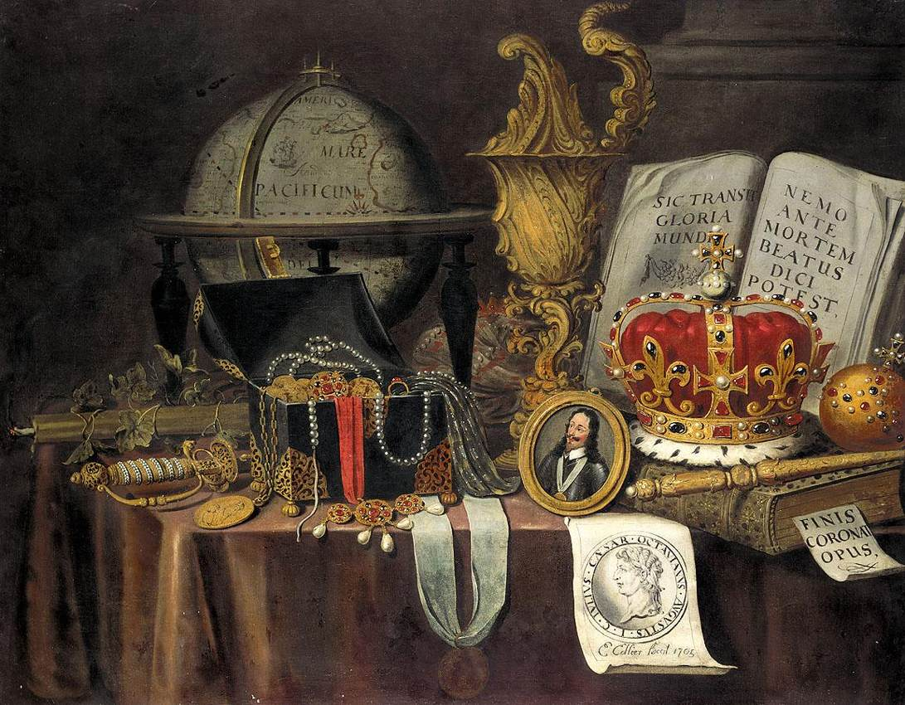

# Leçon 18 | 22 Avril 1959

<!-- source-url: http://staferla.free.fr/S6/S6 LE DESIR.docx -->
<!-- seminar: s6 -->
<!-- lesson: 18 -->

<!-- id: s6-18-0001 -->

HAMLET (6) HAMLET, nous l’avons dit, ne peut supporter le rendez-vous.

<!-- id: s6-18-0002 -->

Le rendez-vous est toujours trop tôt pour lui, et il le retarde.

<!-- id: s6-18-0003 -->

Cet élément de *la procrastination* ne peut pas, d’aucune façon...

<!-- id: s6-18-0004 -->

> *encore que certains auteurs*, dans une littérature que j’ai de plus en plus, au cours de cette étude, approfondie…

<!-- id: s6-18-0005 -->

...être écarté. La *procrastination* reste une des dimensions *essentielles* de la tragédie d’HAMLET.

<!-- id: s6-18-0006 -->

Quand il agit par contre, c’est toujours *avec précipitation*. Il agit quand tout d’un coup, il semble qu’une occasion s’offre, quand je ne sais quel *appel de l’événement* au-delà de lui-même, de sa *résolution*, de sa *décision*, semble lui offrir je ne sais quelle ouverture ambiguë qui est proprement pour nous, analystes, ce qui a introduit dans la dimension de l’accomplissement cette perspective que nous appelons *la fuite*. Rien n’est plus net que ce moment où il se précipite sur ce quelque chose qui remue *derrière la tapisserie*, où il tue POLONIUS.

<!-- id: s6-18-0007 -->

En d’autres moments aussi, la façon *quasi mystérieuse*…

<!-- id: s6-18-0008 -->

> je dirai presque en état second, quand la nuit il se réveille sur ce bateau dans la tempête

<!-- id: s6-18-0009 -->

…dont il va vérifier les messages, rompre les sceaux du message dont GUILDENSTERN et ROSENCRANTZ sont porteurs, et la façon aussi quasi automatique dont il substitue un message à un autre, refait grâce à sa bague le sceau royal, et va rencontrer aussi cette prodigieuse occasion de l’enlèvement par les pirates pour fausser compagnie à ses gardiens qui iront sans s’en douter vers leur propre exécution.

<!-- id: s6-18-0010 -->

Nous avons là quelque chose d’une vraie *phénoménologie* - puisqu’il faut appeler les choses par leur nom - dont nous savons tout l’accent *facilement reconnaissable*, *presque familier, de notre expérience*, comme aussi bien à nos conceptions, dans la relation avec la vie du névrosé. C’est ce que la dernière fois j’ai essayé de vous faire sentir au-delà de ces caractéristiques si sensibles, dans cette référence structurale qui parcourt toute la pièce : *HAMLET est toujours à l’heure de l’Autre*.

<!-- id: s6-18-0011 -->

Bien sûr ce n’est là qu’un mirage, car *l’heure de l’Autre*…

<!-- id: s6-18-0012 -->

> et c’est aussi ce que je vous ai expliqué lorsque j’ai appelé *la réponse dernière dans ce signifiant de l’Autre barré* :
>
> *il n’y a pas* - vous ai-je dit - *d’Autre de l’Autre*. *Il n’y a pas, dans le signifiant lui-même, de garant de la dimension de vérité instaurée par le signifiant*

<!-- id: s6-18-0013 -->

…il n’y a que la sienne d’heure, et il n’y a aussi qu’une seule heure : c’est l’heure de sa perte.

<!-- id: s6-18-0014 -->

Et toute la tragédie d’HAMLET est de nous montrer le cheminement implacable d’HAMLET vers cette heure. Ce qui spécifie sa destinée, ce qui en fait la valeur hautement problématique, qu’est-ce donc ?

<!-- id: s6-18-0015 -->

Car ce rendez-vous avec l’heure de sa perte, n’est pas seulement *le sort commun* qui est significatif pour toute destinée humaine. *La fatalité d’*HAMLET *a un signe particulier* car elle n’aurait pas pour nous autrement cette valeur éminente. C’est là donc que nous en sommes. C’est là que nous en étions à la fin de notre discours *la dernière fois*.

<!-- id: s6-18-0016 -->

Qu’est-ce qui manque à HAMLET ? Et jusqu’à quel point le dessein de la tragédie d’HAMLET telle que SHAKESPEARE nous l’a composée, nous permet-il une articulation, un repérage de ce manque qui va au-delà des approximations dont toujours nous nous contentons et qui aussi bien, pour ce que nous nous contentions qu’elles soient approximatives, font aussi le flou, pas seulement de notre langage : de notre conduite, de nos suggestions – il faut le dire – à l’endroit du patient ?

<!-- id: s6-18-0017 -->

Commençons tout de même par cette approximation dont il s’agit.

<!-- id: s6-18-0018 -->

On peut le dire, ce qui manque c’est à tout instant, chez HAMLET…

<!-- id: s6-18-0019 -->

> ce que nous pourrions appeler d’un langage communicatif, dans le langage de tous les jours

<!-- id: s6-18-0020 -->

…*cette sorte de fixation d’un but, d’un objet dans son action* qui comporte toujours quelque *part* de ce qu’on appelle *arbitraire*.

<!-- id: s6-18-0021 -->

HAMLET, nous l’avons vu, nous avons même commencé d’explorer pourquoi, est quelqu’un - comme le disent les bonnes femmes - qui « *ne sait pas ce qu’il veut* ».

<!-- id: s6-18-0022 -->

Et en quelque sorte cette première dimension est par lui, dans le discours que lui fait tenir SHAKESPEARE, présentifiée. Elle est présentifiée à un certain tournant qui est bien significatif d’ailleurs. C’est le tournant de son éclipse dans sa tragédie. Je veux dire pendant le court moment où il ne va pas être là, où il va faire ce circuit marin duquel il va revenir excessivement vite, à peine sorti du port, où il va faire ce voyage vers l’Angleterre, sur les ordres du roi, toujours obéissant.

<!-- id: s6-18-0023 -->

Il croise les troupes de FORTINBRAS qui est là dans l’arrière-plan de la tragédie, évoqué dès le début, et qui à la fin vient faire le ménage sur la scène, ramasser les morts, remettre en ordre les dégâts. Et voici comment notre HAMLET parle de ce FORTINBRAS. Il est frappé de voir ces troupes vaillantes qui vont conquérir quelques arpents de Pologne *au nom d’un prétexte guerrier plus ou moins futile* qui est celui d’une occasion de retour sur lui-même.

<!-- id: s6-18-0024 -->

- « *La moindre occasion m’accuse, Elle éperonne ma vengeance qui s’engourdit ! Qu’est-ce qu’un homme si son bonheur suprême, si l’emploi de son temps est seulement manger et dormir ? Une bête sans plus. Celui qui mit en nous cet œil de la raison*… »

<!-- id: s6-18-0025 -->

En anglais, c’est :

<!-- id: s6-18-0026 -->

- « *Sure he that made us with such large discourse, Looking before and after, gave us not  
  That capability and godlike reason To fust in us unused.* »

<!-- id: s6-18-0027 -->

Ce que le traducteur transcrit par : « …*la raison*…

<!-- id: s6-18-0028 -->

> c’est le grand discours, le discours fondamental, ce que j’appellerai ici le discours concret

<!-- id: s6-18-0029 -->

…*qui nous fait voir devant et derrière, et nous donne cette capacité* - ici le mot raison vient à sa place - *ne nous a sûrement pas fait ce don divin pour que faute d’emploi il moisisse en nous.*

<!-- id: s6-18-0030 -->

- *Or -* dit HAMLET *- soit oubli bestial, bestial oblivion*…

<!-- id: s6-18-0031 -->

c’est un des mots clefs de la dimension de son être dans la tragédie

<!-- id: s6-18-0032 -->

…*soit lâche scrupule, craven scruple, qui trop minutieux envisage l’issue, - pensée qui mise en quatre, a un quart de sagesse contre trois quart de lâcheté - je vis disant, je ne sais trop pourquoi, « cette chose est à faire », « This thing’s to do », quand j’ai mieux de la faire et le puis, Sith I have cause, and will, and strength, and means, To do’t. Quand j’ai la raison, la cause, la volonté, la force et les moyens de la faire. Des exemples gros comme le monde m’y convient, comme ces grosses et onéreuses armées conduites par un tendre et délicat prince, dont l’esprit, au souffle d’une ambition divine, nargue le dénouement invisible, exposant sa faiblesse débile et mortelle aux audaces de la fortune, du danger et de la mort, even for an egg-shell, pour une coquille vide.*

<!-- id: s6-18-0033 -->

*Être grand, sans conteste ce n’est point de s’émouvoir sans grand sujet, c’est de trouver ce grand sujet dans un fétu quand l’honneur est en jeu. Rightly to be great is not to stir without great argument, but greatly to find quarrel in a straw When honour’s at the stake.* *Que suis-je moi si mon père tué et ma mère salie, deux motifs, ma raison et mon sang laissent tout sommeiller, quand je vois à ma honte le trépas imminent de plus de vingt mille hommes qui pour un fantôme de gloire vont au tombeau ainsi qu’au lit, en combattant pour un lopin sur lequel ne peut lutter leur nombre, dont la capacité comme tombe ne peut tenir les morts, Which is not tomb enough and continent to hide the slain ? Et que dorénavant mes pensées soient de sang ou qu’elles ne soient dignes de rien. O, from this time forth, My thoughts be bloody, or be nothing worth.* » \[[IV, 4, 32–66](#Hamletquatriemeacte)\]

<!-- id: s6-18-0034 -->

Telle est *la méditation* d’HAMLET sur ce que j’appellerais « *l’objet de l’action humaine* », cet objet qui ici, laisse la porte ouverte à ce que j’appellerai toutes les particularisations auxquelles nous nous arrêtons.

<!-- id: s6-18-0035 -->

Nous appellerons cela l’oblativité : verser son sang pour une noble cause, l’honneur. L’honneur est aussi désigné : *être engagé par sa parole*. Nous appellerons cela le don. En tant qu’analystes effectivement, nous ne pouvons pas ne pas rencontrer ces déterminations concrètes, ne pas être saisis de leur poids, qu’il soit de chair ou d’engagement. Ce que j’essaye de vous montrer ici, c’est quelque chose qui de tout cela n’est pas seulement la forme commune, *le plus petit commun dénominateur*.

<!-- id: s6-18-0036 -->

Il ne s’agit pas seulement d’une *position*, d’une *articulation* qui pourrait se caractériser comme un *formalisme*, quand je vous écris la formule S◊*a* mise au terme de cette question que le sujet pose dans l’Autre qui, s’adressant à lui, s’appelle le « *Que veux-tu ?* ».

<!-- id: s6-18-0037 -->

Cette question qui est le « *Che vuoi ?* » où le sujet est à la recherche de son dernier mot, et qui n’a aucune chance :

<!-- id: s6-18-0038 -->

- hors de l’exploration de la chaîne inconsciente en tant qu’elle parcourt le circuit de la chaîne signifiante supérieure, mais qui n’est - hors *conditions spéciales* que nous appelons *analytiques -* rien qui ne soit effectivement *ouvert à l’investigation*,

<!-- id: s6-18-0039 -->

- hors ce secours de la chaîne inconsciente en tant qu’elle a été, par l’analyste, par l’expérience freudienne découverte.

<!-- id: s6-18-0040 -->

Ce à quoi nous avons affaire, c’est ce quelque chose à quoi peut s’accorder, dans un court circuit imaginaire, dans le rapport à mi-chemin de *ce circuit du désir* \[*d*\] avec ce qui est en face, à savoir *le fantasme* \[S◊*a*\] et *la structure du fantasme*…

<!-- id: s6-18-0041 -->

sa structure générale, c’est ce que j’exprime

<!-- id: s6-18-0042 -->

…à savoir un certain rapport du sujet au signifiant, c’est ce qui est exprimé par

<!-- id: s6-18-0043 -->

- le S, *c’est le sujet en tant qu’il est affecté irréductiblement par le signifiant avec toutes les conséquences que ceci comporte,*

<!-- id: s6-18-0044 -->

- dans un certain rapport spécifique avec une conjoncture *imaginaire* dans son essence : *a*, non pas l’*objet du désir*, mais l’*objet dans le désir*.

<!-- id: s6-18-0045 -->

C’est de cette fonction de l’*objet dans le désir* qu’il s’agit d’approcher. C’est pour autant que la tragédie d’HAMLET nous permet de l’approcher, de l’articuler d’une façon exemplaire que nous nous penchons avec cet intérêt insistant sur *la structure de l’œuvre de* SHAKESPEARE.

<!-- id: s6-18-0046 -->

Approchons plus près. S◊*a* comme tel signifie ceci :

<!-- id: s6-18-0047 -->

- c’est en tant que le sujet est privé de quelque chose de lui–même qui a pris valeur du signifiant même de son aliénation, (*ce quelque chose c’est le phallus*)

<!-- id: s6-18-0048 -->

- c’est en tant donc que le sujet est privé de *quelque chose* qui tient à sa vie même, parce que ceci a pris valeur de ce qui le rattache au signifiant

<!-- id: s6-18-0049 -->

- c’est en tant qu’il est dans cette position qu’un objet particulier devient *objet de désir*.

<!-- id: s6-18-0050 -->

Être *objet de désir* est quelque chose d’essentiellement différent d’être l’objet d’aucun besoin.

<!-- id: s6-18-0051 -->

C’est de cette subsistance de l’objet comme tel, de l’*objet dans le désir*, *dans le temps*, qu’il vient prendre *la place de ce qui*, au sujet, *reste de par sa nature masqué*. Ce sacrifice de lui-même, cette « *livre de chair* » engagée dans son rapport au signifiant, c’est parce que quelque chose vient prendre la place de ça, que ce quelque chose devient *objet dans le désir*.

<!-- id: s6-18-0052 -->

Et ceci qui est si profondément énigmatique d’être dans son fond une relation au caché, à l’occulté, c’est parce qu’il en est ainsi, c’est parce que…

<!-- id: s6-18-0053 -->

> si vous me permettez une formule qui est de celles qui viennent sous ma plume dans mes notes et qui me revient là, mais n’en faites *pas une formule doctrinale, prenez­là tout au plus pour une image*

<!-- id: s6-18-0054 -->

…c’est en tant que la vie humaine pourrait se définir comme un calcul dont le zéro serait *irrationnel*.

<!-- id: s6-18-0055 -->

Cette formule n’est qu’une métaphore mathématique et il faut donner ici à l’*irrationnel* son sens mathématique. Je ne fais pas ici allusion à je ne sais quel affectif insondable, mais à quelque chose qui se manifeste à l’intérieur même des mathématiques sous la forme équivalente de ce qu’on appelle *un nombre imaginaire* qui est √-1. .

<!-- id: s6-18-0056 -->

Car il y a quelque chose qui ne saurait correspondre à quoi que ce soit d’intuitivable, et qui pourtant veut être gardé avec sa pleine fonction. C’est ce rapport, dis-je : de l’objet avec cet élément caché du support vivant du sujet, pour autant que prenant fonction de signifiant il ne peut pas être subjectivité comme tel. C’est parce qu’il en est ainsi que cette structure, de la même façon, dans le même rapport où nous sommes avec la √-1. . ... qui est quelque chose qui en soi ne saurait correspondre à rien de réel au sens aussi mathématique du terme

<!-- id: s6-18-0057 -->

…c’est justement aussi à cause de cela que nous ne pouvons saisir la véritable fonction de l’objet qu’en faisant le tour d’une série de ses relations possibles avec le S, c’est-à-dire avec le S qui, au point précis où le (*a*) prend le maximum de sa valeur, ne peut être qu’occulté. Et c’est justement ce tour des fonctions de l’objet, ce serait beaucoup de dire que la tragédie d’HAMLET nous le fait fermer, mais assurément en tout cas elle nous permet d’aller beaucoup plus loin que l’on n’est jamais allé par aucune voie.

<!-- id: s6-18-0058 -->

Partons de la fin, du point de rencontre, de l’heure du rendez-vous, de cet *acte* où, en fin de compte, vous devez bien vous rendre compte que *l’acte terminal*, celui où enfin il jette, pour prix de son action accomplie, tout le poids de sa vie, cet acte mérite d’être appelé acte qu’il active et qu’il subit.

<!-- id: s6-18-0059 -->

Il y a bien tout autour de cet acte un côté d’*hallali*. Au moment où son geste s’accomplit, il est aussi bien le cerf forcé de DIANE. Il est celui autour duquel se resserre le complot ourdi - je ne sais pas si vous vous en rendez compte - avec un cynisme et une méchanceté incroyable, entre CLAUDIUS et LAERTE, quelles que puissent être les raisons de l’un et de l’autre, probablement y étant impliquée aussi cette sorte de tarentule, le courtisan ridicule qui est venu lui proposer le tournoi où se cache le complot.

<!-- id: s6-18-0060 -->

Telle est la structure, elle est des plus claires : *le tournoi* qui lui est proposé *le met en position de champion* d’un autre. J’ai déjà insisté là-dessus. Il est le tenant du pari, de la gageure de son oncle et beau-père, CLAUDIUS.

<!-- id: s6-18-0061 -->

I

<!-- id: s6-18-0062 -->

l se passe quelque chose sur quoi j’ai insisté déjà la dernière fois, *c’est à savoir* pour des enjeux, des *objets(a)* qui se caractérisent là avec tout leur éclat, à savoir que comme tous les objets et tous les enjeux, ils sont essentiellement d’abord dans le monde du désir humain caractérisés par ce que la tradition religieuse, dans des représentations exemplaires, …nous apprend à nommer une *vanitas*, une sorte de tapisserie au petit point. C’est l’accumulation de tous les objets de prix qui sont là et mis dans une balance en face de la mort.

<!-- id: s6-18-0063 -->

<!-- id: s6-18-0064 -->

Il a gagé avec LAERTE six chevaux de Barbarie contre lesquels il a mis en balance six rapières et des poignards français, à savoir tout un attirail de duelliste, avec tout ce qui en dépend, comme ce qui sert à les pendre, leurs fourreaux, je pense. \[V,2,141\] Et particulièrement, il y en a trois qui ont ce que le texte appelle des « *carriages* ». Ce mot « *carriage* » est une forme particulièrement précieuse d’exprimer une sorte de boucle dans laquelle doit pendre l’épée. C’est un mot de collectionneur qui fait ambiguïté avec l’affût du canon, de sorte qu’il s’établit tout un dialogue entre HAMLET et celui qui vient lui rapporter les conditions du tournoi.

<!-- id: s6-18-0065 -->

Pendant un assez long dialogue tout est fait pour faire miroiter devant vos yeux la qualité, le nombre, la panoplie de ces objets, donnant tout son accent à cette sorte d’*épreuve* dont je vous ai dit le caractère paradoxal, voire absurde, ce tournoi qui vient se proposer à HAMLET. Et pourtant HAMLET semble une fois de plus tendre le cou, comme si rien en somme ne pouvait en lui s’opposer à une sorte de disponibilité fondamentale. Sa réponse est là tout à fait significative.

<!-- id: s6-18-0066 -->

- « *Monsieur, je vais me tenir dans cette salle n’en déplaise à sa Majesté, c’est mon heure de délassement; qu’on apporte les fleurets, au bon vouloir du gentilhomme, et si le roi persiste dans sa décision, je le ferai gagner si je peux; sinon, je ne gagnerai rien que ma courte honte et les bottes reçues.* » \[V,2,164-68\]

<!-- id: s6-18-0067 -->

Voilà donc quelque chose qui, dans *l’acte terminal*, nous montre *la structure même du fantasme *: au moment où il est à la pointe de sa résolution, enfin, comme toujours à la veille de sa résolution, le voilà qui se loue littéralement à un autre et encore pour rien, de la façon la plus gratuite, cet autre étant justement son ennemi et celui qu’il doit abattre. Et ceci, il le met en balance avec les choses du monde, premièrement qui l’intéressent le moins, à savoir que ce n’est pas à ce moment-là tous *ces objets de collection* qui sont sa préoccupation majeure, mais qu’il va s’efforcer de gagner pour un autre.

<!-- id: s6-18-0068 -->

Sans doute à l’étage au-dessous il y a quelque chose dont les autres pensent que c’est avec cela qu’on va le captiver, et à quoi bien entendu il n’est pas tout à fait étranger, non pas comme les autres le pensent, mais quand même sur le même plan où les autres le situent, à savoir qu’il est intéressé d’honneur…

<!-- id: s6-18-0069 -->

> c’est-à-dire à un niveau de ce que HEGEL appelle « *la lutte de pur prestige* »

<!-- id: s6-18-0070 -->

…intéressé d’honneur dans ce qui va l’opposer à un rival d’autre part admiré.

<!-- id: s6-18-0071 -->

Et nous ne pouvons pas ne pas nous arrêter un instant à la sûreté de cette connection mise là, poussée en avant par SHAKESPEARE. Vous y reconnaissez quelque chose qui est ancien dans notre discours, dans notre dialogue, à savoir *le stade du miroir*.

<!-- id: s6-18-0072 -->

Que LAERTE à ce niveau soit son semblable, c’est ce qui est expressément articulé dans le texte. C’est articulé d’une façon indirecte, je veux dire à l’intérieur d’une parodie. C’est quand il répond à ce courtisan trop borné, qui s’appelle OSRIC, et qui vient lui proposer le duel, lui parler de son adversaire en commençant à faire jouer devant ses yeux la qualité éminente de celui auquel il aura à montrer son mérite.

<!-- id: s6-18-0073 -->

Il lui coupe la parole en faisant encore mieux que lui :

<!-- id: s6-18-0074 -->

- « *Sir, his definement suffers no perdition in you, Monsieur, sa représentation ne souffre point en vous de défaillance, si comme je le sais, diviser ses mérites pour en faire l’inventaire doit dépasser l’arithmétique de la mémoire, et cependant ne saurait le désemparer, si merveilleusement grande est la rapidité de ses voiles.* » \[V,2,110 \]

<!-- id: s6-18-0075 -->

C’est un discours *extrêmement précieux* qu’il poursuit, très alambiqué, qui parodie en quelque sorte le style de son interlocuteur, et par lequel il conclut :

<!-- id: s6-18-0076 -->

- « *I take him to be a soul of great article, je tiens que son âme est une âme d’assez grand prix, et qu’en lui est infuse une telle rareté et un tel prix que pour faire de lui prononciation véritable, son semblable ne peut être que son miroir, et qui d’autre pourrait tracer son portrait sinon à être sa propre ombre et rien de plus.* » \[V,2,113-117\]

<!-- id: s6-18-0077 -->

Bref, la référence à *l’image de l’autre* \[*i(a)*\] comme étant ce qui ne peut qu’absorber complètement celui qui le contemple, est là à propos des mérites de LAERTE certainement présentée, gonflée d’une manière très gongorique, le *concetti* est quelque chose qui a tout son prix à ce moment-là.

<!-- id: s6-18-0078 -->

D’autant plus que, comme vous allez le voir, c’est dans cette attitude qu’HAMLET va aborder LAERTE avant le duel. C’est sur ce pied qu’il l’aborde et qu’il n’en devient que plus significatif qu’à ce paroxysme de l’absorption imaginaire formellement articulée comme une *relation spéculaire*, une réaction en miroir, ce soit là qu’est situé par le dramaturge également le point manifeste de l’agressivité.

<!-- id: s6-18-0079 -->

Celui qu’on admire le plus est celui qu’on combat. Celui qui est l’*Idéal du moi* c’est aussi celui que - *selon la formule hegelienne de l’impossibilité des cœxistences* - on doit tuer. Ceci HAMLET ne le fait que sur un plan que nous pouvons appeler désintéressé, sur le plan du tournoi. Il s’y engage d’une façon qu’on peut qualifier de formelle, voire de fictive. C’est à son insu qu’il entre en réalité tout de même dans le jeu le plus sérieux. Qu’est-ce que cela veut dire ?

<!-- id: s6-18-0080 -->

Cela veut dire qu’*il n’y est pas entré*, disons *avec* *son phallus.* Cela veut dire que ce qui se présente pour lui dans cette relation agressive est un *leurre*, est un *mirage*, que c’est malgré lui qu’il va y perdre la vie, que c’est à son insu qu’il va, précisément à ce moment, à la fois à la rencontre :

<!-- id: s6-18-0081 -->

- de l’accomplissement de son acte,

<!-- id: s6-18-0082 -->

- et de sa propre mort qui va à peu d’instant près coïncider avec lui.

<!-- id: s6-18-0083 -->

*Il n’y est point entré avec son phallus*, c’est une façon d’exprimer ce que nous sommes en train de chercher, à savoir où est le manque, où est la particularité de cette position du sujet HAMLET dans le drame. *Il y est entré tout de même*, car si les fleurets sont *mouchetés*, ce n’est que dans son leurre.

<!-- id: s6-18-0084 -->

En réalité, il y en a au moins un qui n’est pas *moucheté* qui, au moment de la distribution des épées, est déjà à l’avance soigneusement marqué pour être donné à LAERTE. Celui-là est une pointe véritable et en plus c’est une pointe *envenomed*, empoisonnée.

<!-- id: s6-18-0085 -->

Ce qui est frappant, c’est qu’ici *le sans-gêne du scénariste* rejoint ce qu’on peut appeler *la formidable intuition du dramaturge*. Je veux dire qu’il ne se donne pas tellement de peine pour nous expliquer que cette arme empoisonnée va passer dans la bagarre…

<!-- id: s6-18-0086 -->

> Dieu sait comment ! Cela doit être une des difficultés du jeu de scène

<!-- id: s6-18-0087 -->

…de *la main d’un des adversaires* dans *la main de l’autre*.

<!-- id: s6-18-0088 -->

Vous savez que c’est dans une espèce de corps à corps où ils se mêlent, après que LAERTE ait porté le coup de pointe dont HAMLET ne peut pas guérir et dont il doit périr. En quelques instants il se trouve que cette même pointe est dans la main d’HAMLET. Personne ne se donne de mal pour expliquer un si étonnant incident de séance.

<!-- id: s6-18-0089 -->

Personne n’a d’ailleurs à se donner le moindre mal, car ce dont il s’agit c’est bien de cela, c’est-à-dire de montrer qu’ici *l’instrument de la mort*…

<!-- id: s6-18-0090 -->

> dans l’occasion *l’instrument le plus voilé du drame*, ce qu’HAMLET ne peut *recevoir que de l’autre*

<!-- id: s6-18-0091 -->

…l’instrument qui fait mourir est quelque chose qui est ailleurs que dans ce qui est là matériellement représentable.

<!-- id: s6-18-0092 -->

Ici on ne peut pas ne pas être frappé de quelque chose qui littéralement se trouve dans le texte. Il est clair que ce que je suis en train de vous dire, c’est qu’au-delà de cette parade du tournoi…

<!-- id: s6-18-0093 -->

> de la rivalité avec celui qui est son semblable, en plus beau, le moi-même qu’il peut aimer

<!-- id: s6-18-0094 -->

…au-delà se joue le drame de l’accomplissement du désir d’HAMLET, au-delà le *phallus* est là.

<!-- id: s6-18-0095 -->

Et en fin de compte, c’est dans cette rencontre avec l’autre qu’HAMLET va enfin s’identifier avec le signifiant fatal. Eh bien, chose très curieuse, c’est dans le texte : on parle des fleurets, des *foils*, au moment de les distribuer :

<!-- id: s6-18-0096 -->

- « *King* : *Give them the foils, young OSRIC, donne-leur les fleurets.* *Cousin HAMLET, you know the wager, vous connaissez la gageure ?* »

<!-- id: s6-18-0097 -->

Et plus haut HAMLET dit : « *Give us the foils.* » Entre ces deux termes où il est question des fleurets, HAMLET fait un jeu de mots :

<!-- id: s6-18-0098 -->

- « *I’ll be your foil, LAERTE. In mine ignorance Your skill shall, like a star i’th’darkest night, Stick fiery off indeed.* »

<!-- id: s6-18-0099 -->

Ce que l’on a traduit en français comme on a pu : « *LAERTE, mon fleuret ne sera que fleurette auprès du vôtre.* »

<!-- id: s6-18-0100 -->

*Foil* veut dire *fleuret* dans le contexte. Ici *foil* ne peut pas avoir ce sens, et il a un sens parfaitement repérable, c’est un sens parfaitement attesté à l’époque, il est même assez fréquemment employé. C’est le sens où *foil*, qui est le même mot que le mot français « *feuille* » en ancien français, est utilisé sous une forme précieuse pour désigner la feuille dans laquelle quelque chose de précieux est porté, c’est-à-dire « *un écrin* ».

<!-- id: s6-18-0101 -->

Ici il est utilisé pour dire :

<!-- id: s6-18-0102 -->

- « *Je ne vais être ici que pour mettre en valeur votre éclat d’étoile dans la noirceur du ciel en combattant avec vous.* »

<!-- id: s6-18-0103 -->

D’ailleurs ce sont les conditions mêmes dans lesquelles le duel a été engagé, à savoir qu’HAMLET n’a aucune chance de gagner, qu’il aura suffisamment gagné si l’autre ne lui gagne que *trois* pointes sur *douze*. Le pari est engagé à neuf contre douze, c’est-à-dire qu’on donne un handicap à HAMLET. Je dirai que dans ce jeu de mot sur *foil* nous trouvons légitimement ceci qui est inclus dans les dessous du calembour, je veux dire que c’est *une des fonctions* d’HAMLET de faire tout le temps *des jeux de mots, des calembours, des doubles sens,* de jouer sur l’*équivoque*.

<!-- id: s6-18-0104 -->

Ce jeu de mots n’est pas là par hasard. Quand il lui dit « *je serai votre écrin* », il emploie le même mot qui fait jeu de mots avec ce qui est en jeu à ce moment-là, à savoir la distribution des épées. Et très précisément dans le calembour d’HAMLET, il y a en fin de compte cette identification du sujet au *phallus* mortel pour autant qu’il est là présent. Il lui dit, je serai votre écrin pour faire miroiter votre mérite, mais ce qui va venir dans un instant, c’est bel et bien l’épée de LAERTE, pour autant que cette épée est celle qui l’a blessé lui, HAMLET, à mort, mais c’est également *la même* qu’il va se trouver avoir dans la main pour achever son parcours et tuer en même temps, et son adversaire, et celui qui est l’objet dernier de sa mission, à savoir le roi qu’il doit faire périr immédiatement après.

<!-- id: s6-18-0105 -->

Cette référence verbale, ce jeu de signifiant n’est certainement pas là par hasard. Il est légitime de le faire entrer en jeu, cela n’est pas en effet un accident dans le texte, c’est une des *dimensions* dans lesquelles se présente HAMLET, et sa texture est en effet celle-ci à travers tout le texte de SHAKESPEARE, et ceci à soi tout seul mériterait un développement.

<!-- id: s6-18-0106 -->

Vous voyez, comme y jouant un rôle essentiel, *ces personnages divers qu’on appelle les clowns, qu’on appelle les fous de la Cour* qui sont à proprement parler ceux qui, ayant leur franc-parler, peuvent se permettre de dévoiler les motifs les plus cachés, les traits de caractère des personnes que la politesse interdit d’aborder franchement. C’est quelque chose qui n’est pas simplement cynisme et jeu plus ou moins injurieux du discours, c’est essentiellement par la voie de *l’équivoque*, de *la métaphore*, du *jeu de mots*, d’un certain usage du *concetti*, d’un parler précieux, de ces substitutions de signifiants sur lesquels ici j’insiste quant à leur fonction essentielle : ils donnent à tout le théâtre de SHAKESPEARE *un style*, *une couleur*, qui est absolument caractéristique de son style et qui en crée *essentiellement la dimension psychologique*.

<!-- id: s6-18-0107 -->

Le fait qu’HAMLET soit un personnage angoissant plus qu’un autre, ne doit pas nous dissimuler que la tragédie d’HAMLET c’est la tragédie qui - par un certain côté, au pied de la lettre - porte ce *fou*, ce *clown*, ce *faiseur de mots* au rang du *zéro*. Si par quelque raison on devait ôter cette dimension d’HAMLET de la pièce de SHAKESPEARE, plus des *quatre cinquièmes* de la pièce disparaîtraient comme l’a remarqué quelqu’un.

<!-- id: s6-18-0108 -->

Une des dimensions où s’accomplit la tension d’HAMLET, c’est cette perpétuelle équivoque, celle qui nous est en quelque sorte dissimulée par le côté, si je puis dire, masqué de l’affaire. Je veux dire, ce qui se joue entre CLAUDIUS, le tyran, l’usurpateur et le meurtrier HAMLET, c’est à savoir le démasquage des intentions d’HAMLET, à savoir pourquoi il fait le fou.

<!-- id: s6-18-0109 -->

Mais ce qu’il ne faut pas oublier, c’est la façon dont il fait le fou, cette façon qui donne à son discours cet aspect quasi maniaque, cette façon d’attraper au vol les idées, les occasions d’*équivoque*, les occasions de faire briller un instant devant ses adversaires cette sorte d’éclair de sens.

<!-- id: s6-18-0110 -->

Il y a là-dessus dans la pièce, des textes où ils se mettent eux-mêmes à construire, voire à affabuler. Cela les frappe non pas comme quelque chose de discordant, mais comme quelque chose d’étrange par *leur tour de spéciale pertinence*. C’est dans ce jeu qui n’est pas seulement un jeu de dissimulation, mais un jeu d’esprit, un jeu qui s’établit au niveau des signifiants, dans la dimension des sens, que se tient ce qu’on peut appeler l’esprit même de la pièce.

<!-- id: s6-18-0111 -->

C’est à l’intérieur de cette disposition *ambiguë* qui fait de tous les propos d’HAMLET, et du même coup de la réaction de ceux qui l’entourent, un problème où le spectateur lui-même, l’auditeur, s’égare et s’interroge sans cesse, c’est là qu’il faut situer la base, le plan sur lequel la pièce d’HAMLET prend sa portée. Et je ne le rappelle ici que pour vous indiquer qu’il n’y a rien d’arbitraire, ni d’excessif à donner tout son poids à ce dernier petit *jeu de mots* sur le *foil*.

<!-- id: s6-18-0112 -->

Voici donc la caractéristique de la constellation dans laquelle s’établit l’acte dernier, le duel entre HAMLET *et celui qui est ici une sorte de semblable ou de double plus beau que lui-même*. Nous avons insisté sur cet élément qui est en quelque sorte au niveau inférieur de notre schéma : *i(a)*, qui est ce qui se trouve pour HAMLET un instant remodelé, que lui…

<!-- id: s6-18-0113 -->

> pour qui plus aucun homme ni femme n’est autre chose qu’une ombre inconsistante et putride

<!-- id: s6-18-0114 -->

…trouve ici un *rival* à sa taille.

<!-- id: s6-18-0115 -->

Disons-le, ce semblable « *remodelé* », celui qui va lui permettre au moins pour un instant de soutenir en sa présence la gageure humaine d’être lui aussi un homme ce n’est là, ce remodelage, qu’une conséquence, ce n’est pas un départ. Je veux dire que c’est la conséquence de ce qui se manifeste dans la situation, à savoir la position du sujet en présence de l’autre comme *objet du désir*, la présence immanente du *phallus* qui ne peut ici apparaître dans sa fonction formelle qu’avec la disparition du sujet lui-même. Qu’est-ce qui rend possible le fait que *le sujet* lui-même succombe avant même que de le prendre en main pour devenir lui-même le meurtrier ?

<!-- id: s6-18-0116 -->

Nous revenons une fois de plus à notre carrefour. Ce carrefour si singulier dont j’ai parlé, dont j’ai marqué dans HAMLET le caractère essentiel :

<!-- id: s6-18-0117 -->

- à savoir ce qui se passe dans le cimetière,

<!-- id: s6-18-0118 -->

- à savoir quelque chose qui devrait bien intéresser un de nos collègues qui se trouve dans son œuvre avoir traité éminemment à la fois et de la jalousie et du deuil[^86].

<!-- id: s6-18-0119 -->

C’est quelque chose qui est un des points les plus saillants de cette tragédie : la jalousie du deuil. Car je vous prie de vous reporter à la scène qui termine *l’acte du cimetière*, celui sur lequel je vous ai ramené par trois fois au cours de mon exposé.

<!-- id: s6-18-0120 -->

C’est à savoir ceci d’absolument caractéristique : c’est qu’HAMLET ne peut pas supporter la parade ou l’ostentation, et qu’il articule comme tel *ce qu’il y a d’insupportable dans l’attitude de* LAERTE au moment de l’enterrement de sa sœur. Cette *ostentation du deuil* chez son partenaire, c’est par cela même qu’il se trouve arraché à lui-même, bouleversé, secoué dans ses fondements au point de ne pouvoir, comme tel, le tolérer. Et la première rivalité, *celle-là beaucoup plus authentique*, car si c’est avec tout l’apparat de la courtoisie et avec un fleuret moucheté qu’HAMLET aborde le duel, c’est à la gorge de LAERTE qu’il saute dans le trou où l’on vient de descendre le corps d’OPHÉLIE, pour lui dire :

<!-- id: s6-18-0121 -->

« *Montre-moi ce que tu sauras faire. Pleureras­tu, te battras-tu, jeûneras-tu ?* \[...\] *Moi je le ferai. Es-tu venu séant pour geindre, me narguer en sautant dans sa tombe ? Fais-toi enterrer vif avec elle, moi aussi je le ferai. Et si tu jases de montagnes, qu’on jette sur nous des millions d’arpents, tant qu’auprès de ce tertre qui roussira son sommet à la zone de feu, [Ossa](http://fr.wikipedia.org/wiki/Mont_Ossa) paraisse une verrue !* *Et si tu brailles, je vociférerai.* »[^87] \[V,1,263-272 \]

<!-- id: s6-18-0122 -->

Et là-dessus tout le monde se scandalise, se répand pour séparer ces *frères ennemis* en train de s’étouffer. Et HAMLET tient encore ces propos en parlant à son partenaire :

<!-- id: s6-18-0123 -->

- « *Et Monsieur, qui vous fait en user de la sorte avec moi ? Moi je vous ai toujours aimé. Il n’importe.* *Hercule a beau faire ce qu’il pourra, le chat miaulera, et le chien aura toujours son jour.* » \[V,1,276\]

<!-- id: s6-18-0124 -->

Ce qui est d’ailleurs un élément proverbial qui, ici, me semble prendre toute sa valeur de certains rapprochements que certains d’entre vous peuvent faire, mais je ne peux pas m’arrêter. L’essentiel est que lorsqu’il s’entretiendra avec HORATIO il lui expliquera : « *Je n’ai pu supporter de voir cette sorte d’étalage de son deuil.* » \[V,2,78-79\]

<!-- id: s6-18-0125 -->

Nous voici portés au cœur de quelque chose qui va nous ouvrir toute une problématique. Quel rapport y a-t-il entre ce que nous avons apporté sous la forme S◊*a*, concernant la constitution de l’objet dans le désir, et le deuil ? Observons ceci, abordons par ses caractéristiques les plus manifestes qui peuvent paraître aussi les plus éloignées du centre que nous cherchons ici, ce qui se présente à nous. HAMLET s’est conduit avec OPHÉLIE d’une façon plus que méprisable et cruelle. J’ai insisté sur le caractère d’*agression* dévalorisant, d’*humiliation* sans cesse imposée à cette personne qui est *devenue soudain* le symbole même du rejet comme tel de son désir.

<!-- id: s6-18-0126 -->

Nous ne pouvons pas manquer d’être frappés de quelque chose qui complète pour nous une fois de plus, sous une autre forme, dans un autre trait, la structure pour HAMLET. C’est que *soudain*, cet *objet* va reprendre pour lui sa présence, sa valeur. Il déclare :

<!-- id: s6-18-0127 -->

- « *J’aimais OPHÉLIE, et trente-six mille frères avec tout ce qu’ils ont d’amour n’arriveraient point à la somme du mien.* *Que feras-tu pour elle ?* » \[V, 1, 257\]

<!-- id: s6-18-0128 -->

C’est dans ces termes que commence le défi adressé à LAERTE. C’est en quelque sorte dans la mesure où l’objet de son désir est devenu un objet impossible qu’il redevient pour lui l’objet de son désir. Une fois de plus nous croyons nous trouver là à un détour familier, à savoir une des caractéristiques du désir de l’obsessionnel. Ne nous arrêtons pas trop vite à ces apparences trop évidentes.

<!-- id: s6-18-0129 -->

L’obsessionnel, ce n’est pas tellement que l’objet de son désir soit impossible qui le caractérise…

<!-- id: s6-18-0130 -->

> si tant est que de par la structure même des fondements du désir,
>
> il y a toujours cette note d’impossibilité dans l’objet du désir

<!-- id: s6-18-0131 -->

…ce qui le caractérise…

<!-- id: s6-18-0132 -->

> cela n’est donc pas que l’objet de son désir soit impossible, car il ne serait là,
>
> et par ce trait il n’est là qu’une des formes spécialement manifestes d’un aspect du désir humain

<!-- id: s6-18-0133 -->

…c’est que l’obsessionnel met l’accent sur la rencontre avec cette impossibilité.

<!-- id: s6-18-0134 -->

Autrement dit, il s’arrange à ce que l’objet de son désir prenne valeur essentielle de signifiant de cette impossibilité. C’est là une des notes par laquelle nous pouvons aborder déjà cette forme. Mais il y a quelque chose de plus profond qui nous sollicite. Le deuil est quelque chose que notre théorie, que notre tradition, que *les formules freudiennes* nous ont déjà appris à formuler en termes de *relation d’objet*. Est-ce que par un certain côté nous ne pouvons pas être frappés par le fait que l’objet du deuil, *c’est* FREUD *qui l’a mis*…

<!-- id: s6-18-0135 -->

> pour la première fois depuis qu’il y a des psychologues et qui pensent

<!-- id: s6-18-0136 -->

…*en valeur*.

<!-- id: s6-18-0137 -->

L’objet du deuil, c’est dans un certain rapport d’identification…

<!-- id: s6-18-0138 -->

> et qu’il a essayé de définir de plus près, d’appeler un *rapport d’incorporation* avec le sujet

<!-- id: s6-18-0139 -->

…qu’il prend sa portée, que *se groupent*, *s’organisent*, les manifestations du deuil. Alors, est-ce que nous ne pouvons pas essayer, nous, de réarticuler de plus près, dans le vocabulaire que nous avons appris ici à manier, ce que peut-être cette identification du deuil ? Quelle est la fonction du deuil ?

<!-- id: s6-18-0140 -->

Si nous nous avançons dans cette voie nous allons voir…

<!-- id: s6-18-0141 -->

> et uniquement en fonction des *appareils symboliques* que nous employons dans cette exploration

<!-- id: s6-18-0142 -->

…apparaître de la fonction du deuil des conséquences que je crois nouvelles, et pour vous *éminemment suggestives*. Je veux dire destinées à vous ouvrir des aperçus efficaces et féconds auxquels vous ne pouviez pas accéder par une autre voie. La question de ce qu’est l’identification doit s’éclairer des catégories qui sont celles qu’ici devant vous, depuis des années, je promeus, c’est à savoir celles du *symbolique*, de l’*imaginaire* et du *réel*.

<!-- id: s6-18-0143 -->

Qu’est-ce que c’est que cette *incorporation de l’objet perdu* ? En quoi consiste le travail du deuil ? On reste dans un vague qui explique l’arrêt de toute spéculation autour de cette voie pourtant ouverte par FREUD autour du deuil et de la mélancolie, du fait que la question n’est pas articulée convenablement. Tenons-nous-en aux premiers aspects, les plus *évidents*, de l’expérience du deuil. Le sujet s’abîme dans le vertige de la douleur et se trouve dans un certain rapport, ici en quelque sorte illustré de la façon la plus manifeste par ce que nous voyons se passer dans la scène du cimetière…

<!-- id: s6-18-0144 -->

> le saut de LAERTE dans la tombe et le fait qu’il embrasse,
>
> hors de lui, l’objet dont la disparition est cause de cette douleur

<!-- id: s6-18-0145 -->

…qui en fait dans le temps, au point de cet embrassement, de la façon la plus manifeste, une sorte d’existence d’autant plus absolue qu’elle ne correspond plus à rien qui soit.

<!-- id: s6-18-0146 -->

En d’autres termes, le *trou dans le réel* provoqué par une perte, une perte véritable, cette sorte de perte intolérable à l’être humain qui provoque chez lui le deuil, ce *trou dans le réel* se trouve par cette fonction même dans cette relation qui est l’inverse de celle que je promeus devant vous sous le nom de *Verwerfung*.

<!-- id: s6-18-0147 -->

De même que « *ce qui est rejeté du symbolique réapparaît dans le réel* »… ces formules doivent être prises au sens littéral …de même la *Verwerfung*, le trou de la perte dans le *réel* de quelque chose :

<!-- id: s6-18-0148 -->

- qui est la dimension à proprement parler intolérable offerte à l’expérience humaine,

<!-- id: s6-18-0149 -->

- qui est non pas l’expérience de la propre mort, que personne n’a, mais celle de la mort d’un autre, qui est pour nous un être essentiel, ceci est *un trou dans le réel*.

<!-- id: s6-18-0150 -->

Ce *trou dans le réel* de ce fait, se trouve…

<!-- id: s6-18-0151 -->

> et en raison de la même correspondance qui est celle que j’articule dans la *Verwerfung*

<!-- id: s6-18-0152 -->

…offrir la place où se projette précisément :

<!-- id: s6-18-0153 -->

- ce signifiant manquant,

<!-- id: s6-18-0154 -->

- ce signifiant essentiel, comme tel, à la structure de l’Autre,

<!-- id: s6-18-0155 -->

- ce signifiant dont l’absence rend l’Autre impuissant à vous donner votre réponse,

<!-- id: s6-18-0156 -->

- ce signifiant que vous ne pouvez payer que de votre chair et de votre sang,

<!-- id: s6-18-0157 -->

- *ce signifiant* qui est essentiellement *le phallus sous le voile*.

<!-- id: s6-18-0158 -->

C’est parce que ce signifiant trouve là sa place…

<!-- id: s6-18-0159 -->

et en même temps ne peut la trouver parce que ce signifiant ne peut pas s’articuler au niveau de l’Autre

<!-- id: s6-18-0160 -->

…que viennent, comme dans la psychose…

<!-- id: s6-18-0161 -->

> et c’est ce par quoi le deuil s’apparente à la psychose

<!-- id: s6-18-0162 -->

…pulluler à sa place toutes *les images* dont relèvent les phénomènes du deuil…

<!-- id: s6-18-0163 -->

> et dont les phénomènes de premier plan, ceux par quoi se manifeste non pas telle ou telle *folie particulière*, mais *une des folies collectives les plus essentielles* de la communauté humaine comme telle, c’est à savoir
>
> ce qui est là mis au premier plan, au premier chef de la tragédie d’HAMLET

<!-- id: s6-18-0164 -->

…à savoir le *ghost*, *le fantôme*, cette *image* qui peut surprendre l’âme de tous et de chacun.

<!-- id: s6-18-0165 -->

Si du côté du mort, de celui qui vient de *disparaître*, ce quelque chose n’a pas été accompli qui s’appelle les rites.

<!-- id: s6-18-0166 -->

Les rites destinés à quoi en fin de compte ? Qu’est-ce que c’est que les rites funéraires ? Les rites par quoi nous satisfaisons à ce qu’on appelle la mémoire du mort, qu’est-ce, si ce n’est l’intervention totale, massive, de l’enfer jusqu’au ciel, de tout le jeu *symbolique*.

<!-- id: s6-18-0167 -->

Je voudrais avoir le temps de vous faire quelques séminaires sur ce sujet du rite funéraire à travers une enquête ethnologique. Je me souviens, il y a de nombreuses années, d’avoir passé assez de temps sur un livre qui en est une illustration vraiment admirable et qui prend toute sa valeur, pour nous exemplaire, d’être d’une civilisation assez distante de la nôtre pour que les reliefs de cette fonction en apparaissent vraiment d’une façon éclatante. C’est le 禮經 \[Lǐjīng \], un des *livres chinois consacrés*. Le caractère macrocosmique des rites funéraires…

<!-- id: s6-18-0168 -->

> à savoir le fait qu’en effet il n’y a rien qui puisse combler de signifiants ce trou dans
>
> le réel si ce n’est la totalité du signifiant

<!-- id: s6-18-0169 -->

le travail accompli au niveau du λόγος \[logos\]…

<!-- id: s6-18-0170 -->

> je dis cela pour ne pas dire au niveau du groupe ni de la communauté : bien sûr c’est le groupe
>
> et la communauté en tant que culturellement organisés qui en sont les supports

<!-- id: s6-18-0171 -->

…le travail du deuil se présente d’abord comme une satisfaction donnée à ce qui se produit de désordre en raison de l’insuffisance de tous les éléments signifiants à faire face au *trou* créé dans l’existence, par la mise en jeu totale de *tout le système signifiant* autour du moindre deuil.

<!-- id: s6-18-0172 -->

Et c’est ce qui nous explique que toute la croyance folklorique met essentiellement la relation la plus étroite entre le fait que quelque chose soit manqué, élidé ou refusé de cette satisfaction au mort, et le fait que se produisent ces phénomènes qui correspondent à l’emprise, à l’entrée en jeu, à la mise en marche des fantômes et des larves, à la place laissée libre par le rite signifiant.

<!-- id: s6-18-0173 -->

Et ici nous apparaît une nouvelle dimension de la tragédie d’HAMLET. Je vous l’ai dit au départ, c’est une tragédie du monde souterrain : le *ghost* surgit d’une inexpiable offense.

<!-- id: s6-18-0174 -->

OPHÉLIE apparaît, dans cette perspective, neutre, rien d’autre qu’une victime offerte à cette offense primordiale. Le meurtre de POLONIUS et le ridicule traînage de son cadavre par le pied, par un HAMLET qui devient soudain littéralement déchaîné et s’amuse à narguer tout le monde qui lui demande où est le cadavre, et qui s’amuse à proposer toute une série d’énigmes de fort mauvais goût dont le sommet culmine dans la formule :

<!-- id: s6-18-0175 -->

> « *Hide fox, and all after.* » \[IV, 2, 29\]

<!-- id: s6-18-0176 -->

Ce qui est évidemment *une référence à une espèce de jeu de cache-tampon*. Cela veut dire : « *Le renard est caché, courons après !* » Le meurtre de POLONIUS et cette extraordinaire scène du cadavre caché au défi de la sensibilité et de l’inquiétude de tout l’entourage n’est encore qu’une dérision de ce dont il s’agit, à savoir : d’un deuil non satisfait.

<!-- id: s6-18-0177 -->

Nous avons ici, dans quelque chose dont - vous le voyez - je n’ai pas pu vous donner encore aujourd’hui le dernier mot, cette perspective, ce rapport entre la formule S◊*a*, le fantasme, et quelque chose qui en apparaît paradoxalement éloigné, c’est à savoir *la relation d’objet* pour autant que le deuil nous permet de l’éclairer.

<!-- id: s6-18-0178 -->

Nous allons, la prochaine fois, le poursuivre dans le détail, en montrant, en reprenant les détours de la pièce d’HAMLET pour autant qu’elle nous permet de mieux saisir l’économie ici étroitement liée du *réel*, de l’*imaginaire* et du *symbolique*.

<!-- id: s6-18-0179 -->

Peut-être au cours de ceci beaucoup d’idées préconçues chez vous resteront-elles en panne, voire - je l’espère bien - fracassées, mais ceci je pense que vous y serez préparés par le fait que, puisque nous commentons une tragédie où l’on ne ménage guère les cadavres, ces sortes de dégâts purement idéiques ne vous paraîtront…

<!-- id: s6-18-0180 -->

à côté des dégâts laissés derrière lui par HAMLET

<!-- id: s6-18-0181 -->

…que peu de chose et que, pour tout dire, vous vous consolerez du chemin peut-être difficile que je vous fais parcourir avec cette formule hamlétique :

<!-- id: s6-18-0182 -->

> « *On ne fait pas d’HAMLET sans casser des neufs !* »

<!-- id: s6-18-0183 -->

[IV, 4, 32–66](#RetourHamletquatriemeacte)

<!-- id: s6-18-0184 -->

\[ Now, whether it be  
Bestial oblivion, or some craven scruple  
Of thinking too precisely on th’ event,  
A thought which, quarter’d, hath but one part wisdom  
And ever three parts coward,– I do not know  
Why yet I live to say ‘This thing’s to do,’  
Sith I have cause, and will, and strength, and means  
To do’t. Examples gross as earth exhort me.  
Witness this army of such mass and charge,  
Led by a delicate and tender prince,  
Whose spirit, with divine ambition puff’d,  
Makes mouths at the invisible event,  
Exposing what is mortal and unsure  
To all that fortune, death, and danger dare,  
Even for an eggshell. Rightly to be great  
Is not to stir without great argument,  
But greatly to find quarrel in a straw  
When honour’s at the stake. How stand I then,  
That have a father kill’d, a mother stain’d,  
Excitements of my reason and my blood,  
And let all sleep, while to my shame I see  
The imminent death of twenty thousand men  
That for a fantasy and trick of fame  
Go to their graves like beds, fight for a plot  
Whereon the numbers cannot try the cause,  
Which is not tomb enough and continent  
To hide the slain? O, from this time forth,  
My thoughts be bloody, or be nothing worth ! \]

<!-- id: s6-18-0185 -->

Traduction LETOURNEUR :

<!-- id: s6-18-0186 -->

\[HAMLET : « Comme toutes les circonstances s’élèvent contre moi, et réveillent ma vengeance assoupie ! Qu’est–ce que l’homme, si son bien suprême et tout le prix du marché de son temps se réduisent à manger et dormir ? Une brute, rien de plus. Sûrement celui qui nous a formés avec cette vaste raison, qui peut voir dans le passé et dans l’avenir, ne nous a pas donné cette intelligence et cette divine faculté pour qu’elle reste en nous oisive et sans emploi. Maintenant, soit par un oubli stupide semblable à celui de la brute, soit par une délicatesse scrupuleuse qui craint de trop approfondir l’événement (et dans ce scrupule, pour un quart de sagesse, il y en a trois de lâcheté) je ne sais pas pourquoi je vis encore, pour toujours dire : « j’ai cette chose à faire » puisque j’ai un motif, la volonté, la force et les moyens de la faire. Des exemples, plein l’univers ! Le globe est couvert d’exemples qui m’exhortent : témoin la masse énorme de cette armée nombreuse conduite par un prince jeune et délicat dont l’âme, stimulée par une divine ambition, affronte l’événement invisible; exposant une vie mortelle et incertaine à tous les hasards,

<!-- id: s6-18-0187 -->

à la mort et aux dangers les plus terribles, pour une poignée de terre. Ce n’est pas être vraiment grand que de ne jamais agir sans un grand motif : c’est de trouver avec noblesse une sujet de querelle dans un atome quand il s’agit de l’honneur. Comment resté–je donc immobile, ici, moi qui ai un père assassiné, une mère souillée; … autant d’aiguillons qui pressent mon courage et ma raison; et comment les laissé–je tous s’engourdir dans un lâche sommeil ? Tandis qu’à ma honte, je vois la mort prochaine de vingt milliers d’hommes, qui, pour une chimère, pour une vaine renommée, vont à leurs tombeaux comme à leurs lits; combattant pour un projet dont la multitude ne peut juger la cause; pour un terrain qui n’est pas même une tombe assez vaste pour cacher les morts ! Oh ! que désormais donc mes pensées soient sanguinaires ou nulles.\]## Notes

[^86]: Daniel Lagache : « Deuil pathologique » in La Psychanalyse N°2 : Mélanges cliniques, pp. 45-74, Puf 1956.

[^87]: Hamlet : “Swounds, show me what thou't do. Woo't weep? woo't fight ? woo't fast? woo't tear thyself ?  
    Woo't drink up esill ? eat a crocodile ? I'll do't. Dost thou come here to whine ?  
    To outface me with leaping in her grave ? Be buried quick with her, and so will I.  
    And if thou prate of mountains, let them throw Millions of acres on us, till our ground,

    Singeing his pate against the burning zone, Make Ossa like a wart! Nay, an thou'lt mouth,  
    I'll rant as well as thou”.
