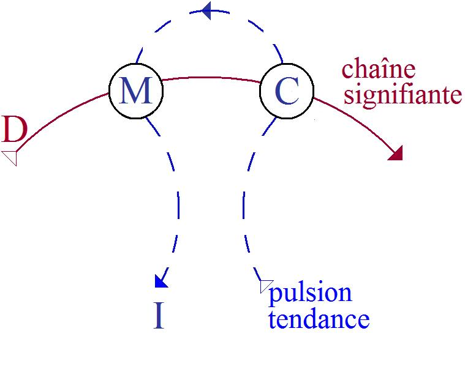
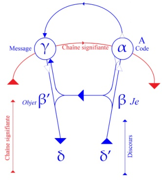
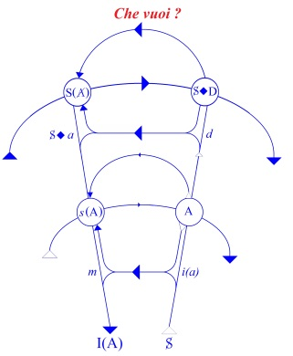
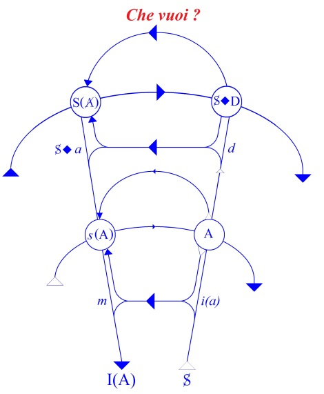
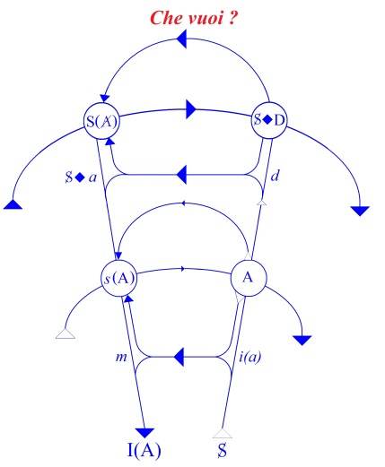
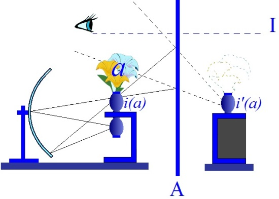
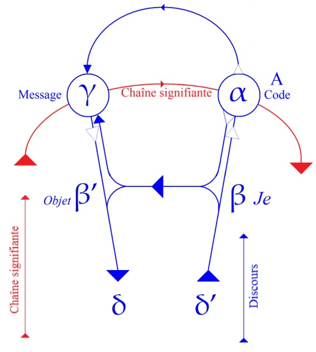
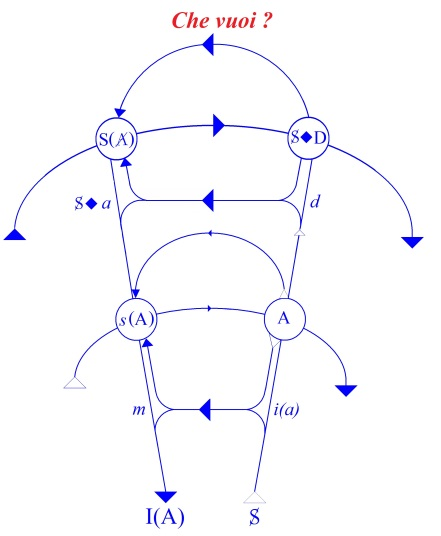

# Leçon 01 | 12 Novembre 1958

<!-- source-url: http://staferla.free.fr/S6/S6 LE DESIR.docx -->
<!-- seminar: s6 -->
<!-- lesson: 01 -->

<!-- id: s6-01-0001 -->

Nous allons parler cette année du *désir* et de son interprétation.Une analyse est une thérapeutique, dit-on, disons un traitement, un traitement psychique qui porte à divers niveaux du psychisme sur :

<!-- id: s6-01-0002 -->

- d’abord - ça a été le premier objet scientifique de son expérience - ce que nous appellerons *les phénomènes marginaux ou résiduels,* le *rêve*, les *lapsus*, le *trait d’esprit*, j’y ai insisté l’année dernière,

<!-- id: s6-01-0003 -->

- et sur des *symptômes* d’autre part - si nous entrons dans cet aspect curatif du traitement - sur des *symptômes* au sens large, pour autant qu’ils se manifestent dans le sujet par des inhibitions, qu’elles sont constituées en symptômes et soutenues par ces symptômes.

<!-- id: s6-01-0004 -->

- D’autre part, ce *traitement modificateur de structures*, de *ces structures* qui s’appellent *névroses* ou *neuro-psychoses* que FREUD a d’abord en réalité structurées et qualifiées comme *neuro-psychoses de défense*.

<!-- id: s6-01-0005 -->

La psychanalyse, intervient pour traiter à divers niveaux avec ces diverses réalités phénoménales en tant qu’elles mettent en jeu le désir. C’est nommément sous cette rubrique du *désir* - comme *significatifs* du *désir* - que les phénomènes que j’ai appelés tout à l’heure résiduels, marginaux, ont été d’abord appréhendés par FREUD, dans les symptômes que nous voyons décrits d’un bout à l’autre de la pensée de FREUD. C’est l’intervention de l’*angoisse*, si nous en faisons le point clé de la détermination des symptômes, mais pour autant que telle ou telle activité qui va entrer dans le jeu des symptômes est *érotisée*, disons mieux : c’est-à-dire *prise dans le mécanisme du désir*.

<!-- id: s6-01-0006 -->

Enfin que signifie même le terme de défense à propos des *neuro-psychoses*, si ce n’est *défense* - contre quoi ? - contre quelque chose qui n’est pas encore autre chose que le *désir*. Et pourtant cette théorie analytique…

<!-- id: s6-01-0007 -->

> au centre de laquelle il est suffisant d’indiquer que la notion de *libido* se situe, qui n’est point autre chose que *l’énergie psychique du désir*, c’est quelque chose – s’il s’agit d’énergie – dans quoi…
>
> je l’ai déjà indiqué en passant, rappelez-vous autrefois la métaphore de l’usine
>
> …certaines conjonctions du *symbolique* et du *réel* sont nécessaires pour que même subsiste la notion d’énergie. Mais je ne veux pas ici, ni m’arrêter ni m’appesantir

<!-- id: s6-01-0008 -->

…cette théorie analytique donc repose tout entière sur cette notion de *libido*, sur *l’énergie du désir*.

<!-- id: s6-01-0009 -->

Voici que depuis quelque temps, nous la voyons de plus en plus orientée vers *quelque chose* que ceux-là mêmes qui soutiennent cette nouvelle orientation, articulent eux-mêmes très consciemment…

<!-- id: s6-01-0010 -->

> au moins pour les plus conscients d’entre eux ayant emprunté à FAIRBAIRN, parce qu’il l’écrit
>
> à plusieurs reprises, parce qu’il ne cesse d’articuler ni de l’écrire, nommément dans le recueil qui s’appelle *Psychoanalytic Studies of the Personality*

<!-- id: s6-01-0011 -->

…que la théorie moderne de l’analyse a changé quelque chose à l’axe que lui avait donné d’abord FREUD en faisant ou en considérant que la libido n’est plus pour nous « *pleasure–seeking* » comme s’exprime FAIRBAIRN, qu’elle est « *object-seeking* ».

<!-- id: s6-01-0012 -->

C’est dire que Monsieur FAIRBAIRN est le représentant le plus typique de cette tendance moderne. Ce que signifie cette tendance orientant la fonction de la *libido* en fonction d’*un objet* qui lui serait en quelque sorte *prédestiné*, c’est quelque chose à quoi nous avions déjà fait allusion cent fois, et dont je vous ai montré sous mille formes les incidences dans la technique et dans la théorie analytique, avec ce que j’ai cru à plusieurs reprises pouvoir vous y désigner comme entraînant des déviations pratiques, quelques unes non sans incidences dangereuses.

<!-- id: s6-01-0013 -->

L’importance de ce que je veux vous signaler pour vous faire aborder aujourd’hui le problème, c’est en somme ce voilement du mot même « *désir* » qui apparaît dans toute la manipulation de l’expérience analytique, et en quelque sorte quelle impression, je ne dirais pas de renouvellement, je dirais de dépaysement, nous produisons à le réintroduire.

<!-- id: s6-01-0014 -->

Je veux dire qu’au lieu de parler de *libido* ou *d’objet génital*, si nous parlons de *désir génital*, il nous apparaîtra peut-être tout de suite *beaucoup plus difficile* de considérer comme allant de soi que le *désir génital* et sa maturation impliquent par soi tout seul cette sorte de *possibilité* ou d’ouverture, ou de plénitude de réalisation sur l’*amour* dont il semble que ce soit devenu ainsi doctrinal d’une certaine perspective de la maturation de *la libido*.

<!-- id: s6-01-0015 -->

Tendance et réalisation - et implication quant à la maturation de la libido - qui paraissent tout de même d’autant plus *surprenantes* qu’elles se produisent au sein d’une doctrine qui a été précisément la première non seulement à mettre en relief, mais même à *rendre compte* de ceci que FREUD a classé sous le titre du [*rav**alement de la vie amoureuse*](#Freud_Erniedrigung_des_Liebeslebens)[^1] : c’est à savoir que si en effet le désir semble entraîner avec soi *un certain quantum* en effet *d’amour*, c’est justement et précisément, et très souvent d’un amour qui se présente à la personnalité comme conflictuel, d’un amour qui ne s’avoue pas, d’un amour qui se refuse même à s’avouer.

<!-- id: s6-01-0016 -->

D’autre part, si nous *réintroduisons* aussi *ce mot* « *désir* »…

<!-- id: s6-01-0017 -->

> là où nous déterminons comme « *affectivité* », comme « *sentiment positif ou négatif* », sont employés couramment dans une sorte d’approche honteuse – si l’on peut dire – des forces encore efficaces, et nommément par
>
> la relation analytique, par le transfert

<!-- id: s6-01-0018 -->

…il me semble que du seul fait de l’emploi de *ce mot*, un clivage se produira qui aura par lui-même quelque chose d’éclairant.

<!-- id: s6-01-0019 -->

Il s’agit de savoir si le transfert est constitué, non plus par une *affectivité* ou des « *sentiments positifs ou négatifs* » que ce terme comporte de vagues et de voilés, mais s’il s’agit - et ici on nomme le désir éprouvé par un seul - de désir sexuel, désir agressif à l’endroit de l’analyste, ce qui nous apparaîtra tout de suite et du premier coup d’œil. Ces désirs ne sont point tout dans *le transfert*, et de ce fait même *le transfert* nécessite d’être défini par autre chose que par des références plus ou moins confuses à la notion positive ou négative d’affectivité. Et enfin de sorte que si nous prononçons *ce mot* *désir*, le dernier bénéfice de cet usage plein c’est que nous nous demanderons : « *Qu’est-ce que c’est que le désir ?* »

<!-- id: s6-01-0020 -->

Ce ne sera pas une question à laquelle nous aurons ou nous pourrons répondre. Simplement, si je n’étais ici lié par ce que je pourrais appeler le rendez-vous urgent que j’ai avec mes « *besoins pratiques expérientiels* » je me serais permis une interrogation sur le sujet du sens de *ce mot* « *désir* », auprès de ceux qui ont été plus qualifiés pour en valoriser l’usage, c’est à savoir les poètes et les philosophes. Je ne le ferai pas, d’abord parce que :

<!-- id: s6-01-0021 -->

- l’usage du mot « *désir* »,

<!-- id: s6-01-0022 -->

- la transmission du terme,

<!-- id: s6-01-0023 -->

- et la fonction du désir dans la poésie,

<!-- id: s6-01-0024 -->

…est quelque chose que, je dirais, nous retrouverons après coup *si nous poursuivons assez loin notre investigation*.

<!-- id: s6-01-0025 -->

S’il est vrai…

<!-- id: s6-01-0026 -->

> comme c’est ce qui sera toute la suite de mon développement cette année

<!-- id: s6-01-0027 -->

…que la situation est profondément marquée, arrimée, rivée *à une certaine fonction du langage, à un certain rapport du sujet au signifiant*, l’expérience analytique nous portera - je l’espère tout au moins - assez loin dans cette exploration pour que nous trouvions tout le temps :

<!-- id: s6-01-0028 -->

- à nous aider peut-être de l’évocation proprement poétique qui peut en être faite,

<!-- id: s6-01-0029 -->

- et aussi bien à comprendre plus profondément à la fin la nature de la création poétique dans ses rapports avec le désir.

<!-- id: s6-01-0030 -->

Simplement, je ferai remarquer que les difficultés…

<!-- id: s6-01-0031 -->

dans le fond même *du jeu d’occultation* que vous verrez être au fond de ce *que nous découvrira notre expérience*

<!-- id: s6-01-0032 -->

…apparaissent déjà en ceci par exemple que *précisément* on voit bien dans la poésie combien le rapport *poétique* au désir s’accommode mal, si l’on peut dire, de la peinture de son objet. Je dirais :

<!-- id: s6-01-0033 -->

- qu’à cet égard la poésie figurative - j’évoque presque « *les roses et les lys de la beauté* » - a toujours quelque chose qui n’exprime le désir que dans le registre d’une singulière froideur,

<!-- id: s6-01-0034 -->

- que par contre la loi à proprement parler de ce problème de l’évocation du désir, c’est dans une poésie qui curieusement se présente comme la poésie que l’on appelle « *métaphysique* ».

<!-- id: s6-01-0035 -->

Et pour ceux qui lisent l’anglais, je ne prendrai ici que *la référence* la plus éminente *des poètes métaphysiques* de la littérature anglaise : John DONNE[^2], pour que vous vous y reportiez pour constater combien c’est très précisément le problème de la structure des rapports du désir qui est là évoquée dans un poème célèbre. Par exemple [*The Ec**stacy*](#Ecstacy) dont le titre indique assez les amorces, dans quelle direction s’élabore poétiquement sur le plan lyrique tout au moins, l’abord poétique du *désir* quand il est recherché, visé lui-même à proprement parler.

<!-- id: s6-01-0036 -->

Je laisse de côté ceci qui assurément va beaucoup plus loin pour présentifier le *désir *: le jeu du poète quand il s’arme de *l’action dramatique*, c’est très précisément la dimension sur laquelle nous aurons à revenir cette année. Je vous l’annonce déjà parce que nous nous en étions approchés l’année dernière : c’est *la direction de la comédie*.

<!-- id: s6-01-0037 -->

Mais laissons là les poètes. Je ne les ai nommés là qu’à titre d’*indication liminaire*, et pour vous dire que nous les retrouverons *plus tard*, plus ou moins diffusément.

<!-- id: s6-01-0038 -->

Je veux plus ou moins m’arrêter à ce qui a été, à cet endroit, *la position des philosophes*, parce que je crois qu’elle a été très exemplaire du point où se situe pour nous le problème…

<!-- id: s6-01-0039 -->

> j’ai pris soin de vous écrire là-haut ces trois termes « *pleasure-seeking* », « *object-seeking* »

<!-- id: s6-01-0040 -->

…en tant *qu’elle recherche le plaisir*, en tant *qu’elle recherche l’objet*.

<!-- id: s6-01-0041 -->

C’est bien ainsi que depuis toujours s’est posée la question pour *la réflexion* et pour *la morale*, j’entends *la morale théorique*, *la morale* qui s’énonce en préceptes et en règles, en opérations de *philosophes*, tout spécialement, dit-on, d’*éthiciens*, je vous l’ai déjà indiqué.

<!-- id: s6-01-0042 -->

Remarquez au passage en fin de compte *la base de toute morale* que l’on pourrait appeler physicaliste, comme on pourrait voir en quoi le terme a le même sens, en quoi dans la philosophie médiévale on parle de « *la théorie physique de l’amour* », au sens où précisément elle est opposée à « *la théorie extatique de l’amour* ». *La base de toute morale*…

<!-- id: s6-01-0043 -->

> qui s’est exprimée jusqu’à présent, jusqu’à un certain point dans la tradition philosophique

<!-- id: s6-01-0044 -->

…revient en somme à ce qu’on pourrait appeler la tradition hédoniste qui consiste à faire établir une sorte d’équivalence entre ces deux termes du *plaisir* et de *l’objet *…

<!-- id: s6-01-0045 -->

- au sens où *l’objet* est l’objet naturel de la libido,

<!-- id: s6-01-0046 -->

- au sens où il est un bienfait,

<!-- id: s6-01-0047 -->

…en fin de compte à admettre *le plaisir au rang des* « *biens* » cherchés par le sujet, voire même à s’y refuser dès lors qu’on en a le même critère, au rang du *souverain bien*.

<!-- id: s6-01-0048 -->

Cette tradition hédoniste de la morale est une chose qui assurément n’est capable de cesser de surprendre qu’à partir du moment où l’on est en quelque sorte *si engagé dans le dialogue de l’école*, qu’on ne s’aperçoit plus de ses paradoxes, car *en fin de compte* quoi de plus contraire à ce que nous appellerons l’expérience de la raison pratique, que cette prétendue convergence du *plaisir* et du *bien* ?

<!-- id: s6-01-0049 -->

En fin de compte, si l’on y regarde de près, si l’on regarde par exemple ce que *ces choses* tiennent dans ARISTOTE, qu’est-ce que nous voyons s’élaborer ? Et c’est *très clair*, *les choses sont* *très pures* dans ARISTOTE.

<!-- id: s6-01-0050 -->

C’est assurément quelque chose qui n’arrive à réaliser cette *identification* du *plaisir* et du *bien* qu’à l’intérieur de ce que j’appellerai « *une éthique de maître* » ou quelque chose dont l’idéal flatteur - *les termes de la tempérance ou de l’intempérance* - c’est-à-dire de quelque chose qui relève de *la maîtrise* du sujet par rapport à ses propres habitudes.

<!-- id: s6-01-0051 -->

Mais *l’inconséquence de cette théorification* est tout à fait *frappante*. Si vous relisez ces passages célèbres qui concernent précisément *l’usage des plaisirs*, vous y verrez que *rien* n’entre dans cette optique moralisante qui ne soit *du registre* de cette maîtrise *d’une morale de maître*, de ce que le maître peut discipliner, peut discipliner beaucoup de *choses*, principalement comportant relativement à *ses habitudes*, c’est-à-dire au maniement et à l’usage de son *moi*.

<!-- id: s6-01-0052 -->

Mais pour ce qui est du « *désir* », vous verrez à quel point ARISTOTE[^3] lui-même doit reconnaître…

<!-- id: s6-01-0053 -->

> il est *fort lucide* et *fort conscient* que ce qui résulte de cette théorisation morale *pratique et théorique*

<!-- id: s6-01-0054 -->

…c’est que les ἐπιθυμία \[épithémia\], *les désirs se présentent très rapidement*…

<!-- id: s6-01-0055 -->

> au-delà d’une certaine limite qui est précisément la limite de la maîtrise et du *moi*

<!-- id: s6-01-0056 -->

…*dans le domaine de* ce qu’il appelle nommément *la bestialité*.

<!-- id: s6-01-0057 -->

Les *désirs* sont exilés du champ propre de l’homme…

<!-- id: s6-01-0058 -->

si tant est que l’homme s’identifie à *la réalité du maître* -

<!-- id: s6-01-0059 -->

…à l’occasion c’est même *quelque chose comme les perversions*, et d’ailleurs il a une conception à cet égard singulièrement moderne du fait que quelque chose *dans notre vocabulaire* pourrait assez bien se traduire par le fait que *le maître* ne saurait être jugé là-dessus, ce qui reviendrait presque à dire que *dans notre vocabulaire*, il ne saurait être reconnu comme responsable.

<!-- id: s6-01-0060 -->

Ces textes valent la peine d’être rappelés. Vous vous y éclairerez à vous y reporter.

<!-- id: s6-01-0061 -->

À l’opposé de cette tradition philosophique, il est quelqu’un que je voudrais tout de même ici nommer…

<!-- id: s6-01-0062 -->

> nommer comme - à mes yeux - *le précurseur de ce quelque chose* que je crois être nouveau, qu’il nous faut considérer comme nouveau dans, disons *le progrès*, le sens de certains rapports de l’homme à lui-même, qui est celui de l’analyse que FREUD constitue

<!-- id: s6-01-0063 -->

…c’est SPINOZA[^4], car après tout je crois que c’est chez lui, en tout cas avec un accent *assez exceptionnel* que l’on peut lire une formule comme celle-ci :

<!-- id: s6-01-0064 -->

« *Que le désir est l’essence même de l’homme* ».

<!-- id: s6-01-0065 -->

Pour ne pas isoler le commencement de la formule de sa suite, nous ajouterons :

<!-- id: s6-01-0066 -->

« *Pour autant qu’elle est conçue à partir de quelqu’une de ses affections, conçue comme déterminée et dominée par* *l’une quelconque de ses affections à faire quelque chose* ».

<!-- id: s6-01-0067 -->

On pourrait déjà beaucoup faire à partir de là pour articuler *ce qui dans cette formule reste encore*, si je puis dire, *irrévélé*. Je dis « *irrévélé* » parce que, bien entendu, on ne peut pas traduire SPINOZA à partir de FREUD, il est quand même très singulier…

<!-- id: s6-01-0068 -->

> je vous le donne comme témoignage très singulier, sans doute personnellement j’ai peut–être plus
>
> de propension qu’un autre, et dans des temps très anciens j’ai beaucoup pratiqué SPINOZA

<!-- id: s6-01-0069 -->

…je ne crois pas pour autant que ce soit pour cela qu’à le relire à partir de mon expérience, il me semble que quelqu’un qui participe à l’expérience freudienne peut se trouver aussi à l’aise dans les textes de celui qui a écrit le *De Servitute humana* [^5], et pour qui toute la réalité humaine se structure, s’organise en fonction des attributs de la substance divine. Mais laissons de côté aussi pour l’instant – quitte à y revenir – cette amorce.

<!-- id: s6-01-0070 -->

Je veux vous donner un exemple beaucoup plus accessible, et sur lequel je clorai *cette référence philosophique* concernant notre problème. Je l’ai pris là au niveau le plus accessible, voire le plus *vulgaire* de l’accès que vous pouvez en avoir.

<!-- id: s6-01-0071 -->

Ouvrez le dictionnaire du charmant défunt LALANDE, *Vocabulaire Philosophique* qui est toujours, je dois dire…

<!-- id: s6-01-0072 -->

> en toute espèce d’exercice de cette nature, celui de faire un « *Vocabulaire* »

<!-- id: s6-01-0073 -->

…toujours une des choses les plus périlleuses et en même temps les plus fructueuses, tellement *le langage* est dominant en tout ce qui est des problèmes. On est sûr qu’à organiser un « *Vocabulaire* », on fera toujours quelque chose de suggestif. Ici, nous trouvons ceci :

<!-- id: s6-01-0074 -->

« *Désir (Begerang, Begehrung)*…

<!-- id: s6-01-0075 -->

> il n’est pas inutile de rappeler ce qu’articule le désir dans le plan philosophique allemand

<!-- id: s6-01-0076 -->

…*tendance spontanée et consciente vers une fin que vous imaginez.*  » « *Le désir repose donc sur la tendance dont il est un cas particulier et plus complexe. Il s’oppose d’autre part à la volonté ou à la volition en ce qu’elle superpose :*

<!-- id: s6-01-0077 -->

- *la coordination, au moins momentanée, des tendances,*

<!-- id: s6-01-0078 -->

- *l’opposition du sujet et de l’objet,*

<!-- id: s6-01-0079 -->

- *la conscience de sa propre efficacité,*

<!-- id: s6-01-0080 -->

- *la pensée des moyens par lesquels se réalisera la fin voulue.* »

<!-- id: s6-01-0081 -->

Ces rappels sont fort utiles, seulement il est à remarquer que dans un article qui veut définir *le désir*, il y a deux lignes pour le situer *par rapport à* *la tendance*, et que tout ce développement se rapporte à *la volonté*. C’est effectivement à ceci que se réduit le discours sur le désir dans ce *Vocabulaire*, à ceci près qu’on y ajoute encore :

<!-- id: s6-01-0082 -->

« *Enfin selon certains philosophes, il y a encore à la volonté un fiat d’une nature spéciale irréductible aux tendances, et qui constitue la liberté.* »

<!-- id: s6-01-0083 -->

*Je ne sais quel air d’ironie dans ces dernières lignes*, il est frappant de le voir surgir chez cet auteur philosophe. En note :

<!-- id: s6-01-0084 -->

« *Le désir est la tendance à se procurer une émotion déjà éprouvée ou imaginée, c’est la volonté naturelle d’un plaisir* » (*citation de* ROQUE).

<!-- id: s6-01-0085 -->

Ce terme de « *volonté naturelle* » ayant tout son intérêt de référence. À quoi LALANDE personnellement ajoute :

<!-- id: s6-01-0086 -->

« *Cette définition apparaît trop étroite en ce qu’elle ne tient pas assez compte de l’antériorité de certaines tendances par rapport aux émotions correspondantes. Le désir semble être essentiellement le désir d’un acte ou d’un état, sans qu’il y soit nécessaire dans tous les cas de la représentation du caractère affectif de cette fin.* »

<!-- id: s6-01-0087 -->

Je pense que cela veut dire du *plaisir*, ou de quelque chose d’autre. Quoiqu’il en soit, ce n’est certainement pas sans poser le problème de savoir de quoi il s’agit, *si c’est de la représentation du plaisir, ou si c’est du plaisir*.

<!-- id: s6-01-0088 -->

Certainement je ne pense pas que la tâche de ce qui s’opère par la voie du vocabulaire, pour essayer de serrer la signification du *désir*, soit une tâche simple, d’autant plus que peut-être la tâche vous ne l’aurez pas non plus par la tradition à quoi elle se révèle absolument préparée. Après tout le désir est-il la réalité psychologique, rebelle à toute organisation, et en fin de compte serait-ce par *la soustraction* des caractères indiqués pour être ceux de *la volonté* que nous pourrons arriver à nous approcher de ce qu’est la réalité du *désir* ?

<!-- id: s6-01-0089 -->

Nous aurions alors le contraire de ce qui nous a abandonné à *la non-coordination – même momentanée – des tendances*, *l’opposition du sujet et de l’objet serait vraiment retirée*. De même nous serions là dans « *une présence* », « *une tendance* » *sans conscience* de sa propre efficacité, *sans penser les mots* par lesquels elle réalisera la fin désirée.

<!-- id: s6-01-0090 -->

Bref, assurément nous sommes là dans un champ dans lequel en tout cas l’analyse a apporté certaines articulations plus précises, puisqu’à l’intérieur de ces déterminations négatives, l’analyse dessine très précisément au niveau, à ces différents niveaux, « *la pulsion* », pour autant qu’elle est justement ceci :

<!-- id: s6-01-0091 -->

- *la non coordination – même momentanée – des tendances*,

<!-- id: s6-01-0092 -->

- *le fantasme* pour autant qu’il introduit une articulation essentielle, ou plus exactement une espèce tout à fait caractérisée à l’intérieur de cette *vague détermination* de *la non opposition du sujet et de l’objet*.

<!-- id: s6-01-0093 -->

Ce sera précisément ici cette année notre but que d’essayer de définir ce qu’est *le fantasme*, peut-être même un peu plus précisément que la tradition analytique jusqu’ici n’est arrivée à le définir. Pour ce qui reste, *derniers termes de l’idéalisme de la pragmatique* qui sont ici impliqués, nous n’en retiendrons pour l’instant qu’une chose : très précisément combien il semble difficile de situer le désir et de l’analyser en fonction de références purement objectales.

<!-- id: s6-01-0094 -->

Nous allons ici nous arrêter pour entrer à proprement parler dans les termes dans lesquels je pense pouvoir cette année articuler pour vous le problème de notre expérience, en tant qu’ils sont nommément ceux du désir, du désir et de son interprétation. Déjà le lien interne, le lien de cohérence dans l’expérience analytique du *désir* et de *son interprétation*, présente en soi-même *quelque chose* que seule l’habitude nous empêche de voir combien est suggestive déjà à soi toute seule l’interprétation du désir, et *quelque chose* qui soit en quelque sorte lié de façon aussi interne, il semble bien, à la manifestation du désir.

<!-- id: s6-01-0095 -->

Vous savez de quel point de vue, je ne dirais pas nous partons, nous cheminons…

<!-- id: s6-01-0096 -->

> car ce n’est pas d’aujourd’hui que nous sommes ensemble – je veux dire qu’il y a déjà cinq ans que nous essayons de désigner les linéaments de la compréhension par certaines articulations de notre expérience

<!-- id: s6-01-0097 -->

…vous savez que ces linéaments viennent cette année converger sur ce problème qui peut être le problème point de concours de tous ces points, certains éloignés les uns des autres, dont je veux d’abord pouvoir préparer son abord.

<!-- id: s6-01-0098 -->

La psychanalyse - et nous avons marché ensemble au cours de ces cinq ans - la psychanalyse nous montre essentiellement ceci que nous appellerons :

<!-- id: s6-01-0099 -->

- *la prise de l’homme dans le constituant de la chaîne signifiante*,

<!-- id: s6-01-0100 -->

- que cette *prise* sans doute est liée au *fait de l’homme*,

<!-- id: s6-01-0101 -->

- mais que cette *prise* n’est pas *coextensive* à ce fait, dans ce sens que l’homme parle sans doute, mais pour parler il a à *entrer* dans le langage et dans son discours préexistant.

<!-- id: s6-01-0102 -->

Je dirais que cette loi de la subjectivité que l’analyse met spécialement en relief, sa dépendance fondamentale de langage est quelque chose de tellement essentiel que littéralement sur ceci glisse toute la psychologie elle-même. Nous dirons qu’il y a une psychologie qui est servie, pour autant que nous pourrions la définir comme la somme des études concernant ce que nous pourrons appeler au sens large « *une sensibilité* » en tant qu’elle est fonction du maintien d’une totalité ou d’une homéostase. Bref, les fonctions de la sensibilité par rapport à un organisme.

<!-- id: s6-01-0103 -->

Vous voyez que là tout est impliqué, non seulement *toutes les données expérimentales de la psycho-physique*, mais aussi bien tout ce que peut apporter, dans l’ordre le plus général, la mise en jeu de notion de « *forme* » quant à l’appréhension des moyens du maintien de la constance de l’organisme. Tout *un champ de la psychologie* est ici inscrit, et l’expérience propre soutient ce champ dans lequel la recherche se poursuit.

<!-- id: s6-01-0104 -->

Mais *la subjectivité* dont il s’agit…

<!-- id: s6-01-0105 -->

- en tant que l’homme est pris dans le langage,

<!-- id: s6-01-0106 -->

- en tant qu’il y est pris, *qu’il le veuille ou pas*, et qu’il y est pris *bien au-delà* du savoir qu’il en a,

<!-- id: s6-01-0107 -->

…c’est *une subjectivité qui n’est pas immanente à une* *sensibilité*…

<!-- id: s6-01-0108 -->

en tant qu’ici le terme « *sensibilité* » veut dire le couple *stimulus-réponse*

<!-- id: s6-01-0109 -->

*…pour la raison suivante : c’est que le stimulus y est donné en fonction d’un code qui impose son ordre, au besoin qui doit s’y traduire*.

<!-- id: s6-01-0110 -->

J’articule ici l’émission, et non pas d’un signe…

<!-- id: s6-01-0111 -->

> *comme on peut à la rigueur le dire, au moins dans la perspective expérimentale, dans l’épreuve expérimentale de ce que j’appelle le cycle stimulus réponse : on peut dire que c’est un signe que le milieu extérieur donne à l’organisme d’avoir à répondre, d’avoir à se défendre. Si vous chatouillez la plante des pieds d’une grenouille, elle assure un signe, elle y répond en faisant une certaine détente musculaire*

<!-- id: s6-01-0112 -->

…mais pour autant que *la subjectivité est prise par le langage*, il y a émission, non pas d’un signe *mais d’un signifiant*, c’est-à-dire, retenez bien ceci qui paraît simple : que quelque chose – le signifiant – qui vaut…

<!-- id: s6-01-0113 -->

non pas comme on le dit quand on parle dans *la théorie de la communication *

<!-- id: s6-01-0114 -->

*…*de quelque chose qui vaut par rapport à une troisième chose, que ce signe *représente*.

<!-- id: s6-01-0115 -->

Encore tout récemment, on peut lire ceci : avec trois termes, ce sont les termes minimum :

<!-- id: s6-01-0116 -->

- il faut qu’il y ait *un récepteur*, celui qui entend,

<!-- id: s6-01-0117 -->

- il suffit ensuite d’un signifiant, il n’y a même pas besoin de parler d’émetteur, il suffit d’*un signe* et de dire que ce signe *signifie* une troisième chose, qu’elle *représente* simplement.

<!-- id: s6-01-0118 -->

On la construit fausse \[la théorie de la communication\], parce que *le signe* ne vaut pas par rapport à une troisième chose qu’il représente, mais il vaut *par rapport à un autre signifiant qu’il n’est pas*.

<!-- id: s6-01-0119 -->

Quant à ces trois schémas que je viens de mettre sur le tableau :

<!-- id: s6-01-0120 -->

<!-- id: s6-01-0121 -->

je veux vous en montrer, je dirais non pas la genèse car ne vous imaginez pas qu’il s’agit là d’étapes…

<!-- id: s6-01-0122 -->

> encore que quelque chose puisse s’y retrouver à l’occasion

<!-- id: s6-01-0123 -->

…d’étapes effectivement réalisées par le sujet. Il faut bien que le sujet y prenne sa place, mais n’y voyez pas d’étapes au sens où il s’agirait d’étapes typiques, d’étapes d’évolution, il s’agit plutôt d’une génération, et pour marquer *l’antériorité logique* de chacun de ces schémas sur celui qui le suit.

<!-- id: s6-01-0124 -->

Qu’est-ce que représente ceci que nous appellerons D pour partir d’un D ?

<!-- id: s6-01-0125 -->

Ceci représente *la chaîne signifiante*. Qu’est-ce à dire ?

<!-- id: s6-01-0126 -->

Cette structure basale, fondamentale, soumet toute manifestation de langage à cette condition d’être réglée par une *succession*, autrement dit par une *diachronie*, par quelque chose qui se déroule *dans le temps*. Nous laissons de côté les propriétés temporelles intéressées, nous aurons peut-être à y revenir en leur temps. Disons qu’assurément toute la plénitude de *l’étoffe temporelle*, comme on dit, n’y est point appliquée.

<!-- id: s6-01-0127 -->

Ici les choses se résument à *la notion de la succession*, avec ce qu’elle peut déjà amener et impliquer de *notion de scansion*. Mais nous n’en sommes même pas encore là. Le seul élément *discret*, c’est-à-dire *différentiel*, est la base sur laquelle va s’instaurer notre problème de l’implication du sujet dans le *signifiant*.

<!-- id: s6-01-0128 -->

Ceci implique…

<!-- id: s6-01-0129 -->

> étant donné ce que je viens de vous faire remarquer, à savoir que le signifiant se définit par son rapport
>
> à son sens, et prend sa valeur du rapport à un autre signifiant, d’un système d’opposition signifiante

<!-- id: s6-01-0130 -->

…*ceci se développe dans une dimension* qui implique du même coup et en même temps *une certaine synchronie des signifiants*.

<!-- id: s6-01-0131 -->

C’est cette *synchronie des signifiants*, à savoir l’existence d’une certaine *batterie signifiante* dont on peut poser le problème de savoir quelle est la batterie minimale. J’ai essayé de m’exercer à ce petit problème. \[*Cf. les* α,β,γ,δ, *in La lettre volée*, *Écrits*\] Cela ne vous entraînerait pas trop loin de votre expérience de savoir si après tout on peut faire un langage avec une *batterie* qui semble être *la batterie minimale, une batterie de* 4. Je ne crois pas que ce soit impensable, mais laissons cela de côté. Il est clair que dans l’état actuel des choses nous sommes loin d’en être réduits à ce minimum.

<!-- id: s6-01-0132 -->

L’important est ceci qui est indiqué par *la ligne pointillée qui vient recouper* d’avant en arrière en la coupant *en deux points*, la ligne représentative de *la chaîne signifiante*, c’est à savoir *la façon dont le sujet a à entrer dans le jeu de la chaîne signifiante*.

<!-- id: s6-01-0133 -->

<!-- id: s6-01-0134 -->

Ceci qui est représenté par *la ligne pointillée* représente la première rencontre \[C\] au niveau *synchronique*, au niveau de la simultanéité des signifiants. Ici, C c’est là ce que j’appelle le point de rencontre du *Code*. En d’autres termes :

<!-- id: s6-01-0135 -->

- c’est pour autant que l’enfant s’adresse à un sujet qu’il sait parlant, qu’il a vu parlant, qui l’a pénétré de rapports depuis le début de son éveil à la lumière du jour,

<!-- id: s6-01-0136 -->

- c’est pour autant qu’il y a quelque chose qui joue comme *jeu du signifiant*, comme « *moulin à paroles* »,

<!-- id: s6-01-0137 -->

…que le sujet a à apprendre très tôt que c’est là une voie, un défilé par où essentiellement doivent s’abaisser les manifestations de ses besoins pour être satisfaits.

<!-- id: s6-01-0138 -->

Ici, le deuxième point de recoupement M est le point où se produit le *Message*, et est constitué par ceci : c’est que c’est toujours par un jeu *rétroactif* de la suite des signifiants que *la signification* s’affirme et se précise. C’est-à-dire que c’est après-coup que le message prend forme à partir du signifiant qui est là en avant de lui, du code qui est en avant de lui et sur lequel inversement lui, le message, pendant qu’il se formule à tout instant, anticipe, tire une traite.

<!-- id: s6-01-0139 -->

Je vous ai déjà indiqué ce qui résulte de ce *processus*. En tout cas ce qui en résulte et qui est marquable sur ce schéma, c’est ceci : c’est que ce qui est à l’origine sous la forme d’éclosion du besoin *- de la tendance comme disent les psychologues -* …qui est là représenté sur mon schéma là au niveau de ce *Ça* *qui ne sait pas ce qu’il est*, qui étant pris dans le langage, ne se réfléchit pas de cet apport innocent du langage dans lequel le sujet se fait d’abord discours.

<!-- id: s6-01-0140 -->

Il en résulte que même réduit à ses formes les plus primitives d’appréhension de ceci par le sujet : qu’il est en rapport avec d’autres sujets parlants, se produit ce quelque chose *au bout de la chaîne intentionnelle* que je vous ai appelé ici la première identification primaire I, la première réalisation d’un idéal dont on ne peut même pas dire à ce moment du schéma qu’il s’agisse d’un *idéal du moi*, mais qu’assurément le sujet y a reçu le premier *seing*, *signum*, de sa relation avec l’Autre.

<!-- id: s6-01-0141 -->

La deuxième étape du schéma peut recouvrir d’une certaine façon une certaine étape évolutive, à cette simple condition que vous ne les considériez pas comme tranchées. Il y a des choses tranchées dans l’évolution, ce n’est pas au niveau de ces étapes du schéma que ces césures se trouvent là. Ces césures - comme quelque part FREUD l’a remarqué - se marquent au niveau du jugement d’attribution par rapport à la nomination simple. Ce n’est pas de cela que je vous parle maintenant, j’y viendrai dans la suite.

<!-- id: s6-01-0142 -->

Dans *la première partie* du schéma et dans la seconde, il s’agit de la différence d’un niveau *infans* du discours, car il n’est peut-être même pas nécessaire que l’enfant parle encore pour que déjà cette marque, cette empreinte mise sur le besoin par la *demande*, s’exerce au niveau déjà des vagissements alternants. Cela peut suffire. *La deuxième partie* du schéma implique que même si l’enfant ne sait pas encore tenir un discours, tout de même déjà il sait parler et ceci vient très tôt. Quand je dis « *sait parler* » je veux dire qu’il s’agit, au niveau de la deuxième étape du schéma, de quelque chose qui va au-delà de la prise dans le langage.

<!-- id: s6-01-0143 -->

Il y a à proprement parler rapport pour autant qu’il y a appel de l’Autre comme présence, cet appel de l’Autre comme *présence*, comme présence sur fond d’*absence,* à ce moment signalé du *fort-da* qui a si *vivement impressionné* FREUD à la date que nous pouvons fixer à 1915, ayant été appelé auprès d’un de ses petits-fils - devenu lui-même un psychanalyste - je parle de l’enfant qui a été l’objet de l’*observation* de FREUD.

<!-- id: s6-01-0144 -->

Voilà qui nous fait passer au niveau de cette seconde étape de réalisation du schéma, dans ce sens qu’ici, au-delà de ce qu’articule la chaîne de discours comme existante au-delà du sujet et lui imposant, qu’il le veuille ou non, sa forme, au-delà de cette appréhension, si l’on peut dire *innocente* de la forme langagière par le sujet, quelque chose d’autre va se produire qui est lié au fait que c’est dans cette expérience du langage que se fonde son appréhension de l’autre comme tel, de cet autre qui peut lui donner la réponse, la réponse à son appel, cet autre auquel fondamentalement il pose la question que nous voyons, dans *Le diable amoureux* de CAZOTTE, comme étant *le mugissement de la forme terrifique* qui représente l’apparition du *surmoi*, en réponse à celui qui l’a évoqué dans une caverne napolitaine :

<!-- id: s6-01-0145 -->

- *Che vuoi* ? *Que veux-tu* ?

<!-- id: s6-01-0146 -->

La question posée à l’Autre de ce qu’il veut, autrement dit : de là où le sujet fait la première rencontre avec le désir, le désir comme étant d’abord le désir de l’Autre, le désir grâce à quoi il s’aperçoit qu’il réalise comme étant cet au-delà autour de quoi tourne ceci :

<!-- id: s6-01-0147 -->

- que l’Autre fera qu’un signifiant ou l’autre, sera, ou non, dans la présence de la parole,

<!-- id: s6-01-0148 -->

- que l’Autre lui donne l’expérience de son désir en même temps qu’une expérience essentielle,

<!-- id: s6-01-0149 -->

car jusqu’à présent c’était en soi que la batterie était là des signifiants dans laquelle un choix pouvait être fait, mais maintenant c’est dans l’expérience que ce choix s’avère comme commutatif, qu’il est à la portée de l’Autre de faire que l’un ou l’autre des signifiants soit là, que s’introduisent dans l’expérience, et à ce niveau de l’expérience, les deux nouveaux principes qui viennent s’additionner à ce qui était d’abord pur et simple principe de succession impliquant ce principe de choix.

<!-- id: s6-01-0150 -->

Nous avons maintenant un principe de substitution, car – et ceci est essentiel – c’est cette *commutativité* à partir de laquelle s’établit pour le sujet ce que j’appelle, entre le signifiant et le signifié, *la barre*. À savoir qu’il y a *entre le signifiant et le signifié* cette cœxistence, cette simultanéité qui est en même temps marquée d’*une certaine impénétrabilité*, je veux dire le maintien de la différence, de la distance entre le signifiant et le signifié : S/*s.* Chose curieuse, *la théorie des groupes* telle qu’on l’apprend *dans l’étude abstraite des ensembles*, nous montre le lien absolument essentiel de toute *commutativité* avec la possibilité même d’user de ce que j’appelle ici le signe de la barre, dont on se sert pour la représentation des fractions. Laissons cela pour l’instant de côté. C’est une indication latérale sur ce dont il s’agit.

<!-- id: s6-01-0151 -->

La structure de la chaîne signifiante à partir du moment où elle a réalisé l’appel de l’Autre, c’est-à-dire où *l’énonciation*, le procès de l’énonciation se superpose, se distingue de la formule de l’énoncé, en exigeant comme tel, quelque chose qui est justement la prise du sujet, prise du sujet qui était d’abord innocente, mais qui ici - la nuance est là pourtant essentielle - est inconsciente dans l’articulation de la parole. À partir du moment où la commutativité du *signifiant* y devient une dimension essentielle pour la production du *signifié*, c’est à savoir que c’est d’une façon *effective* et retentissant dans la conscience du sujet, que *la substitution d’un signifiant à un autre signifiant* sera comme telle l’origine de la multiplication de ces significations qui caractérisent l’enrichissement du monde humain.

<!-- id: s6-01-0152 -->

Un autre terme également se dessine, ou un autre principe qui est le principe de similitude, autrement dit qui fait qu’à l’intérieur de la chaîne, c’est par rapport au fait que dans la suite de la chaîne signifiante, un des termes signifiants sera ou non semblable à un autre, que s’exerce également une certaine dimension d’effets qui est à proprement parler la dimension *métonymique*. Je vous montrerai dans la suite que c’est dans cette dimension – essentiellement dans cette dimension – que se produisent les *effets* qui sont caractéristiques et fondamentaux de ce qu’on peut appeler le discours poétique, les effets de la poésie.

<!-- id: s6-01-0153 -->

C’est donc au niveau de la deuxième étape du schéma que se produit ceci qui nous permet de placer au même niveau que le message, c’est-à-dire dans la partie gauche du schéma, que le message dans le premier schéma, l’apparition de ce qui est *signifié* de l’Autre *s*(A) par opposition au *signifiant* donné par l’Autre S(A) qui, lui, est produit *sur la chaîne*, elle, pointillée puisque c’est une chaîne qui n’est articulée qu’en partie, qui n’est qu’implicite, qui ne représente ici que le sujet en tant qu’il est le *support de la parole*.

<!-- id: s6-01-0154 -->

<!-- id: s6-01-0155 -->

Je vous l’ai dit, c’est dans l’expérience de l’Autre, en tant qu’Autre ayant un désir, que se produit cette deuxième étape de l’expérience. Le *désir* \[*d*\], dès son apparition, son origine, se manifeste dans cet *intervalle*, cette *béance* qui sépare l’articulation pure et simple - *langagière* - de *la parole*, de ceci qui marque que *le sujet* y réalise quelque chose de lui-même qui n’a de portée, de sens, que par rapport à cette émission de la parole et qui est à proprement parler ce que le langage appelle son être.

<!-- id: s6-01-0156 -->

C’est entre :

<!-- id: s6-01-0157 -->

- les avatars de sa demande et ce que ces avatars l’ont fait devenir,

<!-- id: s6-01-0158 -->

- et d’autre part cette *exigence de reconnaissance* par l’Autre, qu’on peut appeler *exigence d’amour* à l’occasion, où se situe un horizon d’être pour le sujet, dont il s’agit de savoir si le sujet, oui ou non, peut l’atteindre.

<!-- id: s6-01-0159 -->

...c’est dans cet *intervalle*, dans cette *béance*, que se situe une expérience qui est celle du *désir*, qui est appréhendée d’abord comme étant celle du désir de l’autre et à l’intérieur de laquelle le sujet a à situer son propre désir. Son propre désir comme tel ne peut pas se situer ailleurs que dans cet espace.

<!-- id: s6-01-0160 -->

Ceci représente la troisième étape, la troisième forme, la troisième phase du schéma. Elle est constituée par ceci : c’est que dans la présence primitive du désir de l’autre comme opaque, comme obscure, le sujet est sans recours. Il est *hilflosigkeit*. J’emploie le terme de FREUD, en français cela s’appelle *la détresse du sujet*. C’est là le fondement de ce qui dans l’analyse a été exploré, expérimenté, situé, comme l’expérience traumatique.

<!-- id: s6-01-0161 -->

Ce que FREUD nous a appris après le cheminement qui lui a permis de situer enfin à sa vraie place l’expérience de l’angoisse, c’est quelque chose qui n’a rien de ce caractère, à mon avis par certains côtés diffus, de ce qu’on appelle l’expérience existentielle de l’angoisse.

<!-- id: s6-01-0162 -->

Que si l’on a pu dire dans une référence *philosophique* que l’angoisse est quelque chose qui nous confronte avec *le néant*, assurément ces formules sont *justifiables* dans une certaine perspective de la réflexion. Sachez que sur ce sujet, FREUD a un enseignement articulé, positif, il fait de l’angoisse quelque chose de tout à fait situé dans une théorie de la communication. L’angoisse est un signal. Ce n’est pas au niveau du désir…

<!-- id: s6-01-0163 -->

> si tant est que le désir doive se produire à la même place où d’abord s’origine, s’expérimente la détresse

<!-- id: s6-01-0164 -->

…ce n’est pas au niveau du *désir* que se produit *l’angoisse*.

<!-- id: s6-01-0165 -->

Nous reprendrons cette année attentivement, ligne par ligne, l’étude de « *Inhibition, Symptôme, Angoisse »* de FREUD. Aujourd’hui, dans cette première leçon, je ne peux faire autrement que déjà vous amorcer quelques points majeurs pour savoir les retrouver ensuite, et nommément celui-là.

<!-- id: s6-01-0166 -->

FREUD nous dit que *l’angoisse* se produit comme un signal dans le *moi*, sur le fondement de l’*hilflosigkeit* à laquelle elle est appelée comme signal à remédier. Je sais que je vais trop vite, que cela méritera que *tout un séminaire* je vous parle de cela, mais je ne peux vous parler de rien si je ne commence pas par vous montrer le dessin du chemin que nous avons à parcourir.

<!-- id: s6-01-0167 -->

<!-- id: s6-01-0168 -->

C’est en tant donc qu’au niveau de cette troisième étape intervient l’expérience spéculaire…

<!-- id: s6-01-0169 -->

> l’expérience du rapport à l’image de l’autre en tant qu’elle est fondatrice de l’*Urbild* du *moi*

<!-- id: s6-01-0170 -->

…que nous allons en d’autres termes nous retrouver cette année à utiliser…

<!-- id: s6-01-0171 -->

dans un contexte qui lui donnera une résonance toute différente

<!-- id: s6-01-0172 -->

…ce que nous avons articulé *à la fin de notre 1ère année* concernant les rapports du *moi idéal* et de *l’idéal du moi*, c’est en tant que nous allons être amenés à repenser tout cela dans ce contexte-là, qu’est l’action symbolique que je vous montre ici comme essentielle.

<!-- id: s6-01-0173 -->

Vous allez voir quelle *utilisation* elle pourra enfin avoir. Je ne fais pas allusion ici uniquement à ce que j’ai dit et articulé sur la relation spéculaire, à savoir la confrontation dans le miroir du sujet avec sa propre image. Je fais allusion au *schéma* dit *optique*, c’est-à-dire à l’usage du miroir concave qui nous permet de penser la fonction d’une *image réelle* elle-même réfléchie, *et qui ne peut être vue* comme réfléchie *qu’à partir* d’une certaine position, *d’une position symbolique qui est celle de l’Idéal du moi*.

<!-- id: s6-01-0174 -->

<!-- id: s6-01-0175 -->

Ce dont il s’agit est ceci : dans la troisième étape du schéma nous avons l’intervention comme tel de l’élément *imaginaire* de la relation du *moi* \[*m*\] à l’autre *i(a)* comme étant ce qui va permettre au sujet de parer à cette détresse dans la relation au désir de l’autre.

<!-- id: s6-01-0176 -->

Par quoi ? Par quelque chose qui est emprunté au jeu de maîtrise que l’enfant, à un âge électif, a appris à manier dans une certaine référence à son semblable comme tel. L’expérience du semblable au sens où il est regard, où il est l’autre qui vous regarde, où il fait jouer un certain nombre de relations imaginaires parmi lesquelles au premier plan les relations de *prestance*, les relations aussi de soumission et de défaite.

<!-- id: s6-01-0177 -->

C’est au moyen de cela, en d’autres termes, comme ARISTOTE dit que l’homme pense, il faut dire que l’homme pense, il ne faut pas dire l’âme pense, mais l’homme pense avec son âme. Il faut dire que le sujet se défend. C’est cela que notre expérience nous montre.

<!-- id: s6-01-0178 -->

Avec son *moi*, il se défend contre cette détresse, et avec ce moyen que l’expérience imaginaire de la relation à l’autre lui donne, il construit quelque chose qui est la différence de l’expérience spéculaire flexible avec l’autre. Parce que ce que le sujet réfléchit, ce ne sont pas simplement des jeux de prestance, ce n’est pas son opposition à l’autre dans le prestige et dans la feinte, c’est lui-même comme sujet parlant, et c’est pourquoi ce que je vous désigne ici \[S **◊** *a*\] comme étant ce lieu d’issue, ce lieu de référence par où le désir va apprendre à se situer, c’est le fantasme.

<!-- id: s6-01-0179 -->

C’est pourquoi *le fantasme*, je vous le symbolise, je vous le formule par ces symboles : S **◊** *a*. Le S ici -je vous dirai tout à l’heure pourquoi il est *barré* - le S, c’est-à-dire le sujet en tant que parlant, en tant qu’il se réfère à l’autre comme regard, à l’autre imaginaire.

<!-- id: s6-01-0180 -->

Chaque fois que vous aurez affaire à quelque chose qui est à proprement parler un fantasme, vous verrez qu’il est articulable dans ces termes de référence du sujet comme parlant à l’autre imaginaire. C’est cela qui définit le fantasme, et la fonction du fantasme comme fonction de niveau d’accommodation, de situation du désir du sujet comme tel, et c’est bien pourquoi le désir humain a cette propriété d’être fixé, d’être adapté, d’être coapté, non pas à un objet, mais toujours essentiellement à un *fantasme*. Ceci est un fait d’expérience qui a pu longtemps demeurer mystérieux.

<!-- id: s6-01-0181 -->

C’est tout de même le fait d’expérience, n’oublions pas, que l’analyse a introduit dans le courant de la connaissance. Ce n’est qu’à partir de l’analyse que ceci *n’est pas une anomalie*, quelque chose d’opaque, quelque chose de l’ordre de la *déviation*, du *dévoiement*, de la *perversion du désir*. C’est à partir de l’analyse que même tout ceci…

<!-- id: s6-01-0182 -->

> qui peut à l’occasion s’appeler dévoiement, perversion, déviation, voire même délire

<!-- id: s6-01-0183 -->

…est conçu et articulé dans une dialectique qui est celle qui peut, comme je viens de vous le montrer, concilier *l’imaginaire* avec *le symbolique*.

<!-- id: s6-01-0184 -->

Je sais que je ne vous mène pas, pour commencer, par un sentier facile, mais si je ne commence pas tout de suite par poser nos termes de références, que vais-je arriver à faire ? À y aller lentement, pas à pas, pour vous suggérer la nécessité d’une référence, et si je ne vous apporte pas ceci que j’appelle *le graphe* tout de suite, il faudra tout de même que je vous l’amène comme je l’ai fait l’année dernière, peu à peu, c’est-à-dire d’une façon *qui sera d’autant plus obscure.*

<!-- id: s6-01-0185 -->

Voilà donc pourquoi j’ai commencé par là, je ne vous dis pas que je vous ai rendu pour autant l’expérience plus facile, c’est pour cela que maintenant pour la détendre, cette expérience, je voudrais vous en donner tout de suite de petites illustrations. Ces illustrations, j’en prendrai une d’abord et vraiment au niveau le plus simple puisqu’il s’agit des rapports du sujet au signifiant, la moindre et la première chose qu’on puisse exiger d’un schéma, c’est de voir à quoi il peut servir à propos du fait de commutations.

<!-- id: s6-01-0186 -->

Je me suis souvenu de quelque chose que j’avais lu autrefois dans le livre de DARWIN[^6]. Le passage qui est cité ici se réfère à l’autobiographie de Charles DARWIN sur l’expression chez l’homme et chez l’animal et qui, je dois dire, m’avait bien amusé. DARWIN raconte qu’un nommé Sidney SMITH qui, je suppose devait être un homme de la société anglaise de son temps, et dont il dit ceci : il pose une question, DARWIN, il dit :

<!-- id: s6-01-0187 -->

« *J’ai entendu Sidney SMITH dans une soirée, dire tout à fait tranquillement la phrase suivante :* *« il m’est revenu aux oreilles que la chère vieille Lady COCK y a coupé »* ».

<!-- id: s6-01-0188 -->

En réalité « *overlook* » veut dire que le surveillant ne l’a pas repérée, sens étymologique. « *Overlook* » est *d’un usage courant dans la langue anglaise*. Il n’y a rien de correspondant dans notre usage courant. C’est pour cela que l’usage des langues est à la fois si utile et si nuisible, parce qu’il nous évite de faire des efforts, de faire cette *substitution* de signifiants dans notre propre langue, grâce à laquelle nous pouvons arriver à viser un certain signifié, car il s’agit de changer tout le contexte pour obtenir le même effet dans une société analogue.

<!-- id: s6-01-0189 -->

Cela pourrait vouloir dire : *l’œil lui est passé au-dessus*, et DARWIN s’émerveille que ce fut absolument parfaitement clair pour chacun, mais sans aucun doute que cela voulait dire que le diable l’avait oubliée, je veux dire qu’il avait oublié de l’emporter dans la tombe, ce qui semble avoir été à ce moment dans *l’esprit* de l’auditeur sa place naturelle, voire souhaitée. Et DARWIN laisse vraiment le point d’interrogation ouvert : *Comment fit-il pour obtenir cet effet ?* - dit DARWIN - *Voilà, je suis vraiment incapable de le dire*.

<!-- id: s6-01-0190 -->

Remarquez que nous pouvons lui être reconnaissants à lui-même de marquer l’expérience qu’il fait là d’une façon spécialement significative et exemplaire de sa propre limite dans l’abord de ce problème. Qu’il ait pris d’une certaine façon le problème des émotions, dire que l’expression des émotions y est tout de même intéressée justement à cause du fait que *le sujet n’en manifeste strictement aucune*, qu’il dise cela *placidely* c’est peut-être porter les choses un peu loin. En tout cas DARWIN ne le fait pas, il est vraiment très étonné de ce quelque chose qu’il faut prendre au pied de la lettre, parce que comme toujours quand nous étudions un cas, il ne faut pas le réduire en le rendant vague.

<!-- id: s6-01-0191 -->

DARWIN dit : *tout le monde a compris que l’autre parlait du diable*, alors que le diable n’est nulle part, et c’est cela qui est intéressant, c’est que DARWIN nous dise que le frisson du diable est passé sur l’assemblée. Essayons maintenant un peu de comprendre. Nous n’allons pas nous attarder sur les limitations mentales propres à DARWIN, nous y viendrons forcément tout de même bien, mais pas tout de suite.

<!-- id: s6-01-0192 -->

Ce qu’il y a de certain, c’est qu’il y a dès le premier abord quelque chose qui participe d’une connaissance frappante, parce qu’enfin il n’y a pas besoin d’avoir posé les principes de *l’effet métaphorique*…

<!-- id: s6-01-0193 -->

> c’est-à-dire de la substitution d’un signifiant à un signifiant

<!-- id: s6-01-0194 -->

…autrement dit, il n’y a pas besoin d’exiger de DARWIN qu’il en ait le pressentiment pour qu’il s’aperçoive tout de suite que l’effet en tous cas tient d’abord à ce qu’il n’articule même pas dans le fait qu’une phrase qui commence quand on dit « *Lady Cock* », se termine normalement par « *ill* », *malade* : « *j’ai entendu dire quand même qu’il y a quelque chose qui ne tourne pas rond* », donc la substitution, *quelque chose*…

<!-- id: s6-01-0195 -->

> qu’il paraît que l’on attend une nouvelle concernant la santé de la vieille dame,
>
> car c’est toujours de leur santé que l’on s’occupe d’abord quand il s’agit de vieilles dames

<!-- id: s6-01-0196 -->

…est remplacé par *quelque chose d’autre*, voire même d’irrévérencieux par certains côtés.

<!-- id: s6-01-0197 -->

Il ne dit pas, ni qu’elle est à la mort, ni non plus qu’elle se porte fort bien. Il dit qu’elle a été oubliée. Alors ici qu’est-ce qui intervient pour que cet effet métaphorique, à savoir en tous cas *quelque chose d’autre* que ce que cela voudrait dire si « *overlook* » pouvait être attendu ? C’est en tant qu’il n’est pas attendu, qu’il est substitué à un autre signifiant, *qu’un effet de signifié se produit qui est nouveau*, qui n’est ni dans la ligne de ce qu’on attendait, ni dans la ligne de l’inattendu.

<!-- id: s6-01-0198 -->

Si cet *inattendu* n’avait pas justement été caractérisé comme *inattendu*, c’est quelque chose d’original qui d’une certaine façon a à être réalisé dans l’esprit de chacun selon ses angles de réfraction propres. Dans tous les cas il y a cela : qu’il y a ouverture d’un nouveau signifié à ce quelque chose qui fait par exemple que Sidney SMITH passe dans l’ensemble pour un homme d’esprit, c’est-à-dire ne s’exprime pas par clichés. Mais pourquoi diable ?

<!-- id: s6-01-0199 -->

Si nous nous reportons à notre petit schéma, cela nous aidera tout de même beaucoup. C’est à cela que ça sert, si l’on fait des schémas, c’est pour s’en servir.

<!-- id: s6-01-0200 -->

On peut d’ailleurs arriver au même résultat en s’en passant, mais le schéma en quelque sorte nous guide, nous montre très évidemment que ce qui se passe là dans le réel, ceci qui se présentifie, c’est *un fantasme* à proprement parler, et par quels mécanismes ?

<!-- id: s6-01-0201 -->

C’est ici que le schéma aussi peut aller plus loin que ce que permet, je dirais, une espèce de notion naïve que les choses sont faites pour exprimer quelque chose, qu’en somme se communiquerait une émotion comme on dit, comme si les émotions en elles-mêmes ne posaient pas à soi toutes seules tellement d’autres problèmes :

<!-- id: s6-01-0202 -->

- à savoir ce qu’elles sont,

<!-- id: s6-01-0203 -->

- à savoir si elles n’ont pas besoin déjà, elles, de communication.

<!-- id: s6-01-0204 -->

Notre sujet, nous dit-on, est là parfaitement tranquille, c’est-à-dire qu’il se présente en quelque sorte à l’état pur, la présence de *sa parole étant* son pur effet *métonymique*. Je veux dire *sa parole en tant que parole dans sa continuité de parole*. Et dans cette continuité de parole précisément, il fait intervenir ceci : la présence de la mort en tant que le sujet peut ou non lui échapper. C’est-à-dire pour autant qu’il évoque cette présence de quelque chose qui a la plus grande parenté avec la venue au monde du signifiant lui-même, je veux dire que s’il y a une dimension où la mort - ou le fait qu’il n’y en a plus - peut être à la fois directement évoquée, et en même temps voilée, mais en tout cas incarnée, devenir immanente à un acte, c’est bien *l’articulation signifiante*.

<!-- id: s6-01-0205 -->

C’est donc pour autant que ce sujet qui parle si aisément de la mort, il est bien clair qu’il ne lui veut pas spécialement du bien à cette dame, mais que d’un autre côté la parfaite placidité avec laquelle il en parle, implique justement qu’à cet égard il a dominé son désir, en tant que ce désir comme dans *Volpone* [^7], pourrait s’exprimer par l’aimable formule : « *Pue et crève !* »

<!-- id: s6-01-0206 -->

Il ne dit pas cela, il articule simplement *sereinement* que ce qui est le niveau qui nous vaut ce destin - chacun à notre tour, là pour un instant oublié - mais cela, si je puis m’exprimer ainsi, ce n’est pas le diable, et *l’au-delà* ça viendra un jour ou l’autre, et du même coup ce personnage, lui se pose comme quelqu’un qui ne redoute pas de s’égaliser avec celle dont il parle, de se mettre au même niveau, sous le coup de la même faute, de la même *légalisation* terminale par le *Maître absolu* ici présentifié. En d’autres termes, ici le sujet se révèle à l’endroit de ce qui est voilé du langage comme y ayant cette sorte de *familiarité*, de *complétude*, de *plénitude* du maniement du langage qui suggère quoi ?

<!-- id: s6-01-0207 -->

Justement quelque chose sur quoi je veux terminer, parce que c’est ce qui manquait à tout ce que j’ai dit dans mon développement en trois étapes, pour qu’ici le ressort, le relief de ce que je voulais vous articuler soit complet. Au niveau du *premier* schéma nous avons l’image *innocente*.

<!-- id: s6-01-0208 -->

<!-- id: s6-01-0209 -->

Il est inconscient bien sûr, mais c’est une inconscience qui ne demande qu’à passer au *savoir*. N’oublions pas que dans l’inconscience cette dimension de « *avoir conscience* », même en français implique cette notion.

<!-- id: s6-01-0210 -->

 

<!-- id: s6-01-0211 -->

Au niveau de la *deuxième* et de la *troisième* étape du schéma, je vous ai dit que nous avions un usage beaucoup plus conscient du savoir, je veux dire que le sujet sait parler et qu’il parle. C’est ce qu’il fait quand il appelle l’Autre et pourtant c’est là à proprement parler que se trouve l’originalité du champ que FREUD a découvert et qu’il appelle l’inconscient. C’est-à-dire ce quelque chose qui met toujours le sujet à une certaine distance de son *être* et qui fait que précisément cet être ne le rejoint jamais, et que c’est pour cela qu’il est nécessaire qu’il ne peut faire autrement que d’atteindre son *être* dans cette *métonymie de l’être* dans le sujet qu’est le *désir*.

<!-- id: s6-01-0212 -->

Et pourquoi ? Parce qu’au niveau où le sujet est engagé…

<!-- id: s6-01-0213 -->

> entré lui-même dans la parole et par là dans la relation à l’Autre comme tel, comme *lieu de la parole*

<!-- id: s6-01-0214 -->

…il y a un signifiant qui manque toujours. Pourquoi ? Parce que c’est un signifiant, et le signifiant est spécialement délégué au rapport du *sujet* avec *le signifiant*. Ce signifiant a un nom, c’est *le phallus*.

<!-- id: s6-01-0215 -->

- *Le désir est la métonymie de l’être dans le sujet.*

<!-- id: s6-01-0216 -->

- *Le phallus est la métonymie du sujet dans l’être.*

<!-- id: s6-01-0217 -->

Nous y reviendrons.

<!-- id: s6-01-0218 -->

Le *phallus*…

<!-- id: s6-01-0219 -->

> *pour autant qu’il est élément signifiant soustrait à la chaîne de la parole, en tant qu’elle engage tout rapport avec l’Autre*

<!-- id: s6-01-0220 -->

…c’est là le principe limite qui fait que le sujet, dans toute parole, et pour autant qu’il est impliqué dans la parole, tombe sous le coup de ce qui se développe dans toutes ses conséquences cliniques *sous le terme de complexe de castration*.

<!-- id: s6-01-0221 -->

Ce que suggère toute espèce d’usage, je ne dirais pas « *pur* » mais peut-être plus impur des « *mots de la tribu* »[^8], toute espèce d’inauguration métaphorique, pour peu qu’elle se fasse audacieuse et au défi de ce que le langage voile toujours, et ce qu’il voile toujours au dernier terme, c’est la mort.

<!-- id: s6-01-0222 -->

Ceci tend toujours à faire surgir, à faire sortir cette figure énigmatique du signifiant manquant, du *phallus* qui ici apparaît - et comme toujours bien entendu - sous la forme qu’on appelle diabolique : *oreille, peau, voire phallus lui-même*, et si dans cet usage bien entendu la tradition du jeu d’esprit anglais, de ce quelque chose de contenu qui n’en dissimule pas moins le désir le plus violent, mais cet usage suffit à soi tout seul à faire apparaître dans l’imaginaire, dans l’autre qui est là comme spectateur, dans le *petit(a)*, cette image du sujet en tant qu’il est marqué par ce rapport au signifiant qui s’appelle l’*interdit*.

<!-- id: s6-01-0223 -->

Ici en l’occasion en tant qu’il viole un interdit, en tant qu’il montre qu’au-delà des interdits qui font la loi des langages, on ne parle pas comme cela des vieilles dames. Il y a quand même un monsieur qui entend parler le plus placidement du monde et *qui fait apparaître le diable*, et c’est au point que le cher DARWIN *se demande : comment diable, a-t-il fait cela* ?

<!-- id: s6-01-0224 -->

Je vous laisserai là-dessus aujourd’hui.

<!-- id: s6-01-0225 -->

Nous reprendrons la prochaine fois *un rêve* dans FREUD, et nous essayerons d’y appliquer nos *méthodes d’analyse*, ce qui en même temps nous permettra de situer les différents modes d’interprétation.

<!-- id: s6-01-0226 -->

[John Donne : The Ecstacy](#Retour_Ecstacy)

<!-- id: s6-01-0227 -->

Where, like a pillow on a bed,  
A pregnant bank swell’d up, to rest  
The violet’s reclining head,  
Sat we two, one another’s best.

<!-- id: s6-01-0228 -->

Our hands were firmly cemented  
By a fast balm, which thence did spring;  
Our eye–beams twisted, and did thread  
Our eyes upon one double string.

<!-- id: s6-01-0229 -->

So to engraft our hands, as yet  
Was all the means to make us one;  
And pictures in our eyes to get  
Was all our propagation.

<!-- id: s6-01-0230 -->

As,’twixt two equal armies, Fate  
Suspends uncertain victory,  
Our souls -which to advance their state,  
Were gone out- hung ‘twixt her and me.

<!-- id: s6-01-0231 -->

And whilst our souls negotiate there,  
We like sepulchral statues lay;  
All day, the same our postures were,  
And we said nothing, all the day.

<!-- id: s6-01-0232 -->

If any, so by love refined,  
That he soul’s language understood,  
And by good love were grown all mind,  
Within convenient distance stood,

<!-- id: s6-01-0233 -->

He —though he knew not which soul spake,  
Because both meant, both spake the same—  
Might thence a new concoction take,  
And part far purer than he came.

<!-- id: s6-01-0234 -->

This ecstasy doth unperplex  
(We said) and tell us what we love;  
We see by this, it was not sex;  
We see, we saw not, what did move:

<!-- id: s6-01-0235 -->

But as all several souls contain  
Mixture of things they know not what,  
Love these mix’d souls doth mix again,  
And makes both one, each this, and that.

<!-- id: s6-01-0236 -->

A single violet transplant,  
The strength, the colour, and the size —  
All which before was poor and scant—  
Redoubles still, and multiplies.

<!-- id: s6-01-0237 -->

When love with one another so  
Interanimates two souls,  
That abler soul, which thence doth flow,  
Defects of loneliness controls.

<!-- id: s6-01-0238 -->

We then, who are this new soul, know,  
Of what we are composed, and made,  
For th’ atomies of which we grow  
Are souls, whom no change can invade.

<!-- id: s6-01-0239 -->

But, O alas! so long, so far,  
Our bodies why do we forbear?  
They are ours, though not we; we are  
Th’ intelligences, they the spheres.

<!-- id: s6-01-0240 -->

We owe them thanks, because they thus  
Did us, to us, at first convey,  
Yielded their senses’ force to us,  
Nor are dross to us, but allay.

<!-- id: s6-01-0241 -->

On man heaven’s influence works not so,  
But that it first imprints the air;  
For soul into the soul may flow,  
Though it to body first repair.

<!-- id: s6-01-0242 -->

As our blood labours to beget  
Spirits, as like souls as it can;  
Because such fingers need to knit  
That subtle knot, which makes us man;

<!-- id: s6-01-0243 -->

So must pure lovers’ souls descend  
To affections, and to faculties,  
Which sense may reach and apprehend,  
Else a great prince in prison lies.

<!-- id: s6-01-0244 -->

To our bodies turn we then, that so  
Weak men on love reveal’d may look;  
Love’s mysteries in souls do grow,  
But yet the body is his book.

<!-- id: s6-01-0245 -->

And if some lover, such as we,  
Have heard this dialogue of one,  
Let him still mark us, he shall see  
Small change when we’re to bodies gone.

<!-- id: s6-01-0246 -->

Là où comme sur un lit un oreiller,  
Une rive en crue invitait les violettes  
A reposer leurs testes,  
Nous nous assîmes, l’un à l’autre tout entiers.

<!-- id: s6-01-0247 -->

Nos mains étaient fermement cimentées  
Par siccatif rapide, et de là s’exhalaient, subtil;  
Nos oeillades enfilaient, et tenaient enlacés  
Nos regards, sur un collier à double fil.

<!-- id: s6-01-0248 -->

Ainsi greffer nos mains  
Restait pour nous unir le seul moyen;  
Et des images captées dans nos yeux  
De nostre route les seules lieues.

<!-- id: s6-01-0249 -->

Comme entre deux égales Armées  
La Fortune, une victoire indécise balance à attribuer parfois,  
Nos asmes -qui avaient quitté leurs corps pour leur état rapprocher- Se tenaient suspendues entre elle, et moi.

<!-- id: s6-01-0250 -->

Et tandis que là, négociaient nos asmes,  
Nous, comme gisants restions étendus;  
De tout le jor nous ne bougeâmes,  
De tout le jor, de nous, rien ne fut entendu.

<!-- id: s6-01-0251 -->

S’il en fut un, si raffiné par l’amour,  
Que langage de l’asme il connut,  
Et que son esprit se fut nourri de bon amour,  
Non loin de nous se fut tenu,

<!-- id: s6-01-0252 -->

Lui - quelle asme parloit, bien qu’il ne put l’apprendre  
Car les deux pensoient et disoient de mesme- peut–être put  
Nouvel élixir prendre,  
Et repartir bien plus pur qu’il n’éstoit venu.

<!-- id: s6-01-0253 -->

Cette Extase, de son index  
(Dit–on), ce qu’aimons nous désigne pour sûr;  
Par celle–ci, on voit que ce n’était pas le sexe;  
Nous voyons ce qu’avant nous estoit mouvement obscur:

<!-- id: s6-01-0254 -->

Mais comme les asmes contiennent à la fois  
Un mélange de choses qu’elles ignorent,  
Amour, ces asmes meslées, il les remesle encore,  
Et chacune ceci, et cela, d’une seule, deux finalement faict.

<!-- id: s6-01-0255 -->

De violettes un simple transplant,  
La force, la taille, et la couleur —  
Tout ce qui étoit pauvre et chétif avant—  
Connaît regain, et vigueur.

<!-- id: s6-01-0256 -->

Mais lors doncque l’amour, l’un à l’autre opère  
Telle entr’animation, il obtient le croisement,  
D’une nouvelle asme, étrangère  
Aux défauts de ses éléments.

<!-- id: s6-01-0257 -->

Lors nous, qui sommes cette novelle asme éclose,  
Nous savons de quelle paste nous sommes faicts  
Car les anatomies qui nous composent  
Et desquelles nous croissons, ce sont nos asmes, sur quoy rien n’a d’effet.

<!-- id: s6-01-0258 -->

Mais, O hélas! Tant que vivons l’un et l’autre  
Nos corps, pourquoi les tenons–nous à mépris?  
Bien qu’ils ne soient pas nous–mesmes, ils sont nostres  
Ils sont la sphère, nous sommes leurs esprits.

<!-- id: s6-01-0259 -->

Nous leur devons reconnaissance  
Car ce sont eux qu’à nous–mesme unis, nous ont d’abord conviés  
Nous donnèrent leur vigueur, leurs sens,  
Et nous sont alliage, non déchets.

<!-- id: s6-01-0260 -->

Sur l’homme, l’influence du paradis ne se peut si bien étendre,  
Qu’elle improigne l’ayr d’abord;  
Car l’asme dans l’asme ne se peut répandre,  
Qu’elle n’ait avant habité le corps.

<!-- id: s6-01-0261 -->

Comme notre sang besogne à faire  
Des Esprits, que le plus semblable aux asmes il veut;  
Par ce que de tels doigts sont nécessaires  
Pour nouer de l’homme le subtile noeud;

<!-- id: s6-01-0262 -->

Ainsi que des purs amants les asmes descendent  
Jusqu’aux facultés et affections,  
Que peut–être les sens atteignent et appréhendent,  
Sinon un grand Prince végète en prison.

<!-- id: s6-01-0263 -->

Lors, tournons–nous vers nos corps, qu’ainsi le vulgaire  
Puisse l’amour contempler ;  
Dans les asmes, ont beau s’épanouir des amours les mystères,  
Reste que le corps est son Livre Révélé.

<!-- id: s6-01-0264 -->

Et si quelqu’amant, à notre semblance,  
A compris ce dialogue, d’un seul ja cité,  
Qu’il nous marque, il verra peu de différence  
Quand en nos corps serons ressuscités.

<!-- id: s6-01-0265 -->

*Traduction française : Gilles de Seze*

<!-- id: s6-01-0266 -->

[Stéphane Mallarmé](#cf.-infra-stéphane-mallarmé-le-tombeau-dedgar-pœ), « Le tombeau d’Edgar Pœ »

<!-- id: s6-01-0267 -->

Tel qu’en Lui-même enfin l’éternité le change,  
Le Poète suscite avec un glaive nu  
Son siècle épouvanté de n’avoir pas connu  
Que la mort triomphait dans cette voix étrange !

<!-- id: s6-01-0268 -->

Eux, comme un vil sursaut d’hydre oyant jadis l’ange  
Donner un sens plus pur *aux mots de la tribu*  
Proclamèrent très haut le sortilège bu  
Dans le flot sans honneur de quelque noir mélange.

<!-- id: s6-01-0269 -->

Du sol et de la nue hostiles, ô grief !  
Si notre idée avec ne sculpte un bas-relief  
Dont la tombe de POE éblouissante s’orne

<!-- id: s6-01-0270 -->

Calme bloc ici-bas chu d’un désastre obscur,  
Que ce granit du moins montre à jamais sa borne  
Aux noirs vols du Blasphème épars dans le futur.

<!-- id: s6-01-0271 -->

\[[Retour texte 12-11](#Retour_Freud_Erniedrigung)\]

<!-- id: s6-01-0272 -->

[Sigmund FREUD : *Über die allgemeinste* *Erniedrigung des Liebeslebens* (1912)](#Table)

<!-- id: s6-01-0273 -->

**1**

<!-- id: s6-01-0274 -->

Wenn der psychoanalytische Praktiker sich fragt, wegen welches Leidens er am häufigsten um Hilfe angegangen wird, so muß er – absehend von der vielgestaltigen Angst – antworten: wegen psychischer Impotenz. Diese sonderbare Störung betrifft Männer von stark libidinösem Wesen und äußert sich darin, daß die Exekutivorgane der Sexualität die Ausführung des geschlechtlichen Aktes verweigern, obwohl sie sich vorher und nachher als intakt und leistungsfähig erweisen können und obwohl eine starke psychische Geneigtheit zur Ausführung des Aktes besteht. Die erste Anleitung zum Verständnis seines Zustandes erhält der Kranke selbst, wenn er die Erfahrung macht, daß ein solches Versagen nur beim Versuch mit gewissen Personen auftritt, während es bei anderen niemals in Frage kommt. Er weiß dann, daß es eine Eigenschaft des Sexualobjekts ist, von welcher die Hemmung seiner männlichen Potenz ausgeht, und berichtet manchmal, er habe die Empfindung eines Hindernisses in seinem Innern, die Wahrnehmung eines Gegenwillens, der die bewußte Absicht mit Erfolg störe. Er kann aber nicht erraten, was dies innere Hindernis ist und welche Eigenschaft des Sexualobjekts es zur Wirkung bringt. Hat er solches Versagen wiederholt erlebt, so urteilt er wohl in bekannter fehlerhafter Verknüpfung, die Erinnerung an das erste Mal habe als störende Angstvorstellung die Wiederholungen erzwungen; das erste Mal selbst führt er aber auf einen »zufälligen« Eindruck zurück. Psychoanalytische Studien über die psychische Impotenz sind bereits von mehreren Autoren angestellt und veröffentlicht worden [**\[Fußnote\]M. Steiner (1907) – W. Stekel (1908) – Ferenczi (1908).**](http://gutenberg.spiegel.de/?id=5&xid=5453&kapitel=15&cHash=3aa83cf0982##). Jeder Analytiker kann die dort gebotenen Aufklärungen aus eigener ärztlicher Erfahrung bestätigen. Es handelt sich wirklich um die hemmende Einwirkung gewisser psychischer Komplexe, die sich der Kenntnis des Individuums entziehen. Als allgemeinster Inhalt dieses pathogenen Materials hebt sich die nicht überwundene inzestuöse Fixierung an Mutter und Schwester hervor. Außerdem ist der Einfluß von akzidentellen peinlichen Eindrücken, die sich an die infantile Sexualbetätigung knüpfen, zu berücksichtigen und jene Momente, die ganz allgemein die auf das weibliche Sexualobjekt zu richtende Libido verringern [**\[Fußnote\]W. Stekel (1908, 191 ff.).**](http://gutenberg.spiegel.de/?id=5&xid=5453&kapitel=15&cHash=3aa83cf0982##). Unterzieht man Fälle von greller psychischer Impotenz einem eindringlichen Studium mittels der Psychoanalyse, so gewinnt man folgende Auskunft über die dabei wirksamen psychosexuellen Vorgänge. Die Grundlage des Leidens ist hier wiederum – wie sehr wahrscheinlich bei allen neurotischen Störungen – eine Hemmung in der Entwicklungsgeschichte der Libido bis zu ihrer normal zu nennenden Endgestaltung. Es sind hier zwei Strömungen nicht zusammengetroffen, deren Vereinigung erst ein völlig normales Liebesverhalten sichert, zwei Strömungen, die wir als die *zärtliche* und die *sinnliche* voneinander unterscheiden können. Von diesen beiden Strömungen ist die zärtliche die ältere. Sie stammt aus den frühesten Kinderjahren, hat sich auf Grund der Interessen des Selbsterhaltungstriebes gebildet und richtet sich auf die Personen der Familie und die Vollzieher der Kinderpflege. Sie hat von Anfang an Beiträge von den Sexualtrieben, Komponenten von erotischem Interesse mitgenommen, die schon in der Kindheit mehr oder minder deutlich sind, beim Neurotiker in allen Fällen durch die spätere Psychoanalyse aufgedeckt werden. Sie entspricht der *primären kindlichen Objektwahl*. Wir ersehen aus ihr, daß die Sexualtriebe ihre ersten Objekte in der Anlehnung an die Schätzungen der Ichtriebe finden, geradeso, wie die ersten Sexualbefriedigungen in Anlehnung an die zur Lebenserhaltung notwendigen Körperfunktionen erfahren werden. Die »Zärtlichkeit« der Eltern und Pflegepersonen, die ihren erotischen Charakter selten verleugnet (»das Kind ein erotisches Spielzeug«), tut sehr viel dazu, die Beiträge der Erotik zu den Besetzungen der Ichtriebe beim Kinde zu erhöhen und sie auf ein Maß zu bringen, welches in der späteren Entwicklung in Betracht kommen muß, besonders wenn gewisse andere Verhältnisse dazu ihren Beistand leihen. Diese zärtlichen Fixierungen des Kindes setzen sich durch die Kindheit fort und nehmen immer wieder Erotik mit sich, welche dadurch von ihren sexuellen Zielen abgelenkt wird. Im Lebensalter der Pubertät tritt nun die mächtige »sinnliche« Strömung hinzu, die ihre Ziele nicht mehr verkennt. Sie versäumt es anscheinend niemals, die früheren Wege zu gehen und nun mit weit stärkeren Libidobeträgen die Objekte der primären infantilen Wahl zu besetzen. Aber da sie dort auf die unterdessen aufgerichteten Hindernisse der Inzestschranke stößt, wird sie das Bestreben äußern, von diesen real ungeeigneten Objekten möglichst bald den Übergang zu anderen, fremden Objekten zu finden, mit denen sich ein reales Sexualleben durchführen läßt. Diese fremden Objekte werden immer noch nach dem Vorbild (der Imago) der infantilen gewählt werden, aber sie werden mit der Zeit die Zärtlichkeit an sich ziehen, die an die früheren gekettet war. Der Mann wird Vater und Mutter verlassen – nach der biblischen Vorschrift – und seinem Weibe nachgehen, Zärtlichkeit und Sinnlichkeit sind dann beisammen. Die höchsten Grade von sinnlicher Verliebtheit werden die höchste psychische Wertschätzung mit sich bringen. (Die normale Überschätzung des Sexualobjekts von Seiten des Mannes.) Für das Mißlingen dieses Fortschrittes im Entwicklungsgang der Libido werden zwei Momente maßgebend sein. Erstens das Maß von *realer Versagung*, welches sich der neuen Objektwahl entgegensetzen und sie für das Individuum entwerten wird. Es hat ja keinen Sinn, sich der Objektwahl zuzuwenden, wenn man überhaupt nicht wählen darf oder keine Aussicht hat, etwas Ordentliches wählen zu können. Zweitens das Maß der *Anziehung*, welches die zu verlassenden infantilen Objekte äußern können und das proportional ist der erotischen Besetzung, die ihnen noch in der Kindheit zuteil wurde. Sind diese beiden Faktoren stark genug, so tritt der allgemeine Mechanismus der Neurosenbildung in Wirksamkeit. Die Libido wendet sich von der Realität ab, wird von der Phantasietätigkeit aufgenommen (Introversion), verstärkt die Bilder der ersten Sexualobjekte, fixiert sich an dieselben. Das Inzesthindernis nötigt aber die diesen Objekten zugewendete Libido, im Unbewußten zu verbleiben. Die Betätigung der jetzt dem Unbewußten angehörigen sinnlichen Strömung in onanistischen Akten tut das Ihrige dazu, um diese Fixierung zu verstärken. Es ändert nichts an diesem Sachverhalt, wenn der Fortschritt nun in der Phantasie vollzogen wird, der in der Realität mißglückt ist, wenn in den zur onanistischen Befriedigung führenden Phantasiesituationen die ursprünglichen Sexualobjekte durch fremde ersetzt werden. Die Phantasien werden durch diesen Ersatz bewußtseinsfähig, an der realen Unterbringung der Libido wird ein Fortschritt nicht vollzogen. Es kann auf diese Weise geschehen, daß die ganze Sinnlichkeit eines jungen Menschen im Unbewußten an inzestuöse Objekte gebunden oder, wie wir auch sagen können, an unbewußte inzestuöse Phantasien fixiert wird. Das Ergebnis ist dann eine absolute Impotenz, die etwa noch durch die gleichzeitig erworbene wirkliche Schwächung der den Sexualakt ausführenden Organe versichert wird.

<!-- id: s6-01-0275 -->

Für das Zustandekommen der eigentlich sogenannten psychischen Impotenz werden mildere Bedingungen erfordert. Die sinnliche Strömung darf nicht in ihrem ganzen Betrag dem Schicksal verfallen, sich hinter der zärtlichen verbergen zu müssen, sie muß stark oder ungehemmt genug geblieben sein, um sich zum Teil den Ausweg in die Realität zu erzwingen. Die Sexualbetätigung solcher Personen läßt aber an den deutlichsten Anzeichen erkennen, daß nicht die volle psychische Triebkraft hinter ihr steht. Sie ist launenhaft, leicht zu stören, oft in der Ausführung inkorrekt, wenig genußreich. Vor allem aber muß sie der zärtlichen Strömung ausweichen. Es ist also eine Beschränkung in der Objektwahl hergestellt worden. Die aktiv gebliebene sinnliche Strömung sucht nur nach Objekten, die nicht an die ihr verpönten inzestuösen Personen mahnen; wenn von einer Person ein Eindruck ausgeht, der zu hoher psychischer Wertschätzung führen könnte, so läuft er nicht in Erregung der Sinnlichkeit, sondern in erotisch unwirksame Zärtlichkeit aus. Das Liebesleben solcher Menschen bleibt in die zwei Richtungen gespalten, die von der Kunst als himmlische und irdische (oder tierische) Liebe personifiziert werden. Wo sie lieben, begehren sie nicht, und wo sie begehren, können sie nicht lieben. Sie suchen nach Objekten, die sie nicht zu lieben brauchen, um ihre Sinnlichkeit von ihren geliebten Objekten fernzuhalten, und das sonderbare Versagen der psychischen Impotenz tritt nach den Gesetzen der »Komplexempfindlichkeit« und der »Rückkehr des Verdrängten« dann auf; wenn an dem zur Vermeidung des Inzests gewählten Objekt ein oft unscheinbarer Zug an das zu vermeidende Objekt erinnert. Das Hauptschutzmittel gegen solche Störung, dessen sich der Mensch in dieser Liebesspaltung bedient, besteht in der psychischen *Erniedrigung* des Sexualobjektes, während die dem Sexualobjekt normalerweise zustehende Überschätzung dem inzestuösen Objekt und dessen Vertretungen reserviert wird. Sowie die Bedingung der Erniedrigung erfüllt ist, kann sich die Sinnlichkeit frei äußern, bedeutende sexuelle Leistungen und hohe Lust entwickeln. Zu diesem Ergebnis trägt noch ein anderer Zusammenhang bei. Personen, bei denen die zärtliche und die sinnliche Strömung nicht ordentlich zusammengeflossen sind, haben auch meist ein wenig verfeinertes Liebesleben; perverse Sexualziele sind bei ihnen erhalten geblieben, deren Nichterfüllung als empfindliche Lusteinbuße verspürt wird, deren Erfüllung aber nur am erniedrigten, geringgeschätzten Sexualobjekt möglich erscheint. Die in dem ersten Beitrag [**\[Fußnote\]›Über einen besonderen Typus der Objektwahl beim Manne‹, S. 193, oben.**](http://gutenberg.spiegel.de/?id=5&xid=5453&kapitel=15&cHash=3aa83cf0982##) erwähnten Phantasien des Knaben, welche die Mutter zur Dirne herabsetzen, werden nun nach ihren Motiven verständlich. Es sind Bemühungen, die Kluft zwischen den beiden Strömungen des Liebeslebens wenigstens in der Phantasie zu überbrücken, die Mutter durch Erniedrigung zum Objekt für die Sinnlichkeit zu gewinnen.

<!-- id: s6-01-0276 -->

**2**

<!-- id: s6-01-0277 -->

Wir haben uns bisher mit einer ärztlich–psychologischen Untersuchung der psychischen Impotenz beschäftigt, welche in der Überschrift dieser Abhandlung keine Rechtfertigung findet. Es wird sich aber zeigen, daß wir dieser Einleitung bedurft haben, um den Zugang zu unserem eigentlichen Thema zu gewinnen. Wir haben die psychische Impotenz reduziert auf das Nichtzusammentreffen der zärtlichen und der sinnlichen Strömung im Liebesleben und diese Entwicklungshemmung selbst erklärt durch die Einflüsse der starken Kindheitsfixierungen und der späteren Versagung in der Realität bei Dazwischenkunft der Inzestschranke. Gegen diese Lehre ist vor allem eines einzuwenden: sie gibt uns zu viel, sie erklärt uns, warum gewisse Personen an psychischer Impotenz leiden, läßt uns aber rätselhaft erscheinen, daß andere diesem Leiden entgehen konnten. Da alle in Betracht kommenden ersichtlichen Momente, die starke Kindheitsfixierung, die Inzestschranke und die Versagung in den Jahren der Entwicklung nach der Pubertät, bei so ziemlich allen Kulturmenschen als vorhanden anzuerkennen sind, wäre die Erwartung berechtigt, daß die psychische Impotenz ein allgemeines Kulturleiden und nicht die Krankheit einzelner sei. Es läge nahe, sich dieser Folgerung dadurch zu entziehen, daß man auf den quantitativen Faktor der Krankheitsverursachung hinweist, auf jenes Mehr oder Minder im Beitrag der einzelnen Momente, von dem es abhängt, ob ein kenntlicher Krankheitserfolg zustande kommt oder nicht. Aber obwohl ich diese Antwort als richtig anerkennen möchte, habe ich doch nicht die Absicht, die Folgerung selbst hiemit abzuweisen. Ich will im Gegenteil die Behauptung aufstellen, daß die psychische Impotenz weit verbreiteter ist, als man glaubt, und daß ein gewisses Maß dieses Verhaltens tatsächlich das Liebesleben des Kulturmenschen charakterisiert. Wenn man den Begriff der psychischen Impotenz weiter faßt und ihn nicht mehr auf das Versagen der Koitusaktion bei vorhandener Lustabsicht und bei intaktem Genitalapparat einschränkt, so kommen zunächst alle jene Männer hinzu, die man als Psychanästhetiker bezeichnet, denen die Aktion nie versagt, die sie aber ohne besonderen Lustgewinn vollziehen; Vorkommnisse, die häufiger sind, als man glauben möchte. Die psychoanalytische Untersuchung solcher Fälle deckt die nämlichen ätiologischen Momente auf, welche wir bei der psychischen Impotenz im engeren Sinne gefunden haben, ohne daß die symptomatischen Unterschiede zunächst eine Erklärung finden. Von den anästhetischen Männern führt eine leicht zu rechtfertigende Analogie zur ungeheuren Anzahl der frigiden Frauen, deren Liebesverhalten tatsächlich nicht besser beschrieben oder verstanden werden kann als durch die Gleichstellung mit der geräuschvolleren psychischen Impotenz des Mannes [**\[Fußnote\]Wobei gerne zugestanden sein soll, daß die Frigidität der Frau ein komplexes, auch von anderer Seite her zugängliches Thema ist.**](http://gutenberg.spiegel.de/?id=5&xid=5453&kapitel=15&cHash=3aa83cf0982##). Wenn wir aber nicht nach einer Erweiterung des Begriffes der psychischen Impotenz, sondern nach den Abschattungen ihrer. Symptomatologie ausschauen, dann können wir uns der Einsicht nicht verschließen, daß das Liebesverhalten des Mannes in unserer heutigen Kulturwelt überhaupt den Typus der psychischen Impotenz an sich trägt. Die zärtliche und die sinnliche Strömung sind bei den wenigsten unter den Gebildeten gehörig miteinander verschmolzen; fast immer fühlt sich der Mann in seiner sexuellen Betätigung durch den Respekt vor dem Weibe beengt und entwickelt seine volle Potenz erst, wenn er ein erniedrigtes Sexualobjekt vor sich hat, was wiederum durch den Umstand mitbegründet ist, daß in seine Sexualziele perverse Komponenten eingehen, die er am geachteten Weibe zu befriedigen sich nicht getraut. Einen vollen sexuellen Genuß gewährt es ihm nur, wenn er sich ohne Rücksicht der Befriedigung hingeben darf, was er zum Beispiel bei seinem gesitteten Weibe nicht wagt. Daher rührt dann sein Bedürfnis nach einem erniedrigten Sexualobjekt, einem Weibe, das ethisch minderwertig ist, dem er ästhetische Bedenken nicht zuzutrauen braucht, das ihn nicht in seinen anderen Lebensbeziehungen kennt und beurteilen kann. Einem solchen Weibe widmet er am liebsten seine sexuelle Kraft, auch wenn seine Zärtlichkeit durchaus einem höherstehenden gehört. Möglicherweise ist auch die so häufig zu beobachtende Neigung von Männern der höchsten Gesellschaftsklassen, ein Weib aus niederem Stande zur dauernden Geliebten oder selbst zur Ehefrau zu wählen, nichts anderes als die Folge des Bedürfnisses nach dem erniedrigten Sexualobjekt, mit welchem psychologisch die Möglichkeit der vollen Befriedigung verknüpft ist.

<!-- id: s6-01-0278 -->

Ich stehe nicht an, die beiden bei der echten psychischen Impotenz wirksamen Momente, die intensive inzestuöse Fixierung der Kindheit und die reale Versagung der Jünglingszeit, auch für dies so häufige Verhalten der kulturellen Männer im Liebesleben verantwortlich zu machen. Es klingt wenig anmutend und überdies paradox, aber es muß doch gesagt werden, daß, wer im Liebesleben wirklich frei und damit auch glücklich werden soll, den Respekt vor dem Weibe überwunden, sich mit der Vorstellung des Inzests mit Mutter oder Schwester befreundet haben muß. Wer sich dieser Anforderung gegenüber einer ernsthaften Selbstprüfung unterwirft, wird ohne Zweifel in sich finden, daß er den Sexualakt im Grunde doch als etwas Erniedrigendes beurteilt, was nicht nur leiblich befleckt und verunreinigt. Die Entstehung dieser Wertung, die er sich gewiß nicht gerne bekennt, wird er nur in jener Zeit seiner Jugend suchen können, in welcher seine sinnliche Strömung bereits stark entwickelt, ihre Befriedigung aber am fremden Objekt fast ebenso verboten war wie die am inzestuösen. Die Frauen stehen in unserer Kulturwelt unter einer ähnlichen Nachwirkung ihrer Erziehung und überdies unter der Rückwirkung des Verhaltens der Männer. Es ist für sie natürlich ebensowenig günstig, wenn ihnen der Mann nicht mit seiner vollen Potenz entgegentritt, wie wenn die anfängliche Überschätzung der Verliebtheit nach der Besitzergreifung von Geringschätzung abgelöst wird. Von einem Bedürfnis nach Erniedrigung des Sexualobjekts ist bei der Frau wenig zu bemerken; im Zusammenhange damit steht es gewiß, wenn sie auch etwas der Sexualüberschätzung beim Manne Ähnliches in der Regel nicht zustande bringt. Die lange Abhaltung von der Sexualität und das Verweilen der Sinnlichkeit in der Phantasie hat für sie aber eine andere bedeutsame Folge. Sie kann dann oft die Verknüpfung der sinnlichen Betätigung mit dem Verbot nicht mehr auflösen und erweist sich als psychisch impotent, d. h. frigid, wenn ihr solche Betätigung endlich gestattet wird. Daher rührt bei vielen Frauen das Bestreben, das Geheimnis noch bei erlaubten Beziehungen eine Weile festzuhalten, bei anderen die Fähigkeit, normal zu empfinden, sobald die Bedingung des Verbots in einem geheimen Liebesverhältnis wiederhergestellt ist; dem Manne untreu, sind sie imstande, dem Liebhaber eine Treue zweiter Ordnung zu bewahren. Ich meine, die Bedingung des Verbotenen im weiblichen Liebesleben ist dem Bedürfnis nach Erniedrigung des Sexualobjekts beim Manne gleichzustellen. Beide sind Folgen des langen Aufschubes zwischen Geschlechtsreife und Sexualbetätigung, den die Erziehung aus kulturellen Gründen fordert. Beide suchen die psychische Impotenz aufzuheben, welche aus dem Nichzusammentreffen zärtlicher und sinnlicher Regungen resultiert. Wenn der Erfolg der nämlichen Ursachen beim Weibe so sehr verschieden von dem beim Manne ausfällt, so läßt sich dies vielleicht auf einen anderen Unterschied im Verhalten der beiden Geschlechter zurückführen. Das kulturelle Weib pflegt das Verbot der Sexualbetätigung während der Wartezeit nicht zu überschreiten und erwirbt so die innige Verknüpfung zwischen Verbot und Sexualität. Der Mann durchbricht zumeist dieses Verbot unter der Bedingung der Erniedrigung des Objekts und nimmt daher diese Bedingung in sein späteres Liebesleben mit. Angesichts der in der heutigen Kulturwelt so lebhaften Bestrebungen nach einer Reform des Sexuallebens ist es nicht überflüssig, daran zu erinnern, daß die psychoanalytische Forschung Tendenzen so wenig kennt wie irgendeine andere. Sie will nichts anderes als Zusammenhänge aufdecken, indem sie Offenkundiges auf Verborgenes zurückführt. Es soll ihr dann recht sein, wenn die Reformen sich ihrer Ermittlungen bedienen, um Vorteilhafteres an Stelle des Schädlichen zu setzen. Sie kann aber nicht vorhersagen, ob andere Institutionen nicht andere, vielleicht schwerere Opfer zur Folge haben müßten.

<!-- id: s6-01-0279 -->

**3**

<!-- id: s6-01-0280 -->

Die Tatsache, daß die kulturelle Zügelung des Liebeslebens eine allgemeinste Erniedrigung der Sexualobjekte mit sich bringt, mag uns veranlassen, unseren Blick von den Objekten weg auf die Triebe selbst zu lenken. Der Schaden der anfänglichen Versagung des Sexualgenusses äußert sich darin, daß dessen spätere Freigebung in der Ehe nicht mehr voll befriedigend wirkt. Aber auch die uneingeschränkte Sexualfreiheit von Anfang an führt zu keinem besseren Ergebnis. Es ist leicht festzustellen, daß der psychische Wert des Liebesbedürfnisses sofort sinkt, sobald ihm die Befriedigung bequem gemacht wird. Es bedarf eines Hindernisses, um die Libido in die Höhe zu treiben, und wo die natürlichen Widerstände gegen die Befriedigung nicht ausreichen, haben die Menschen zu allen Zeiten konventionelle eingeschaltet, um die Liebe genießen zu können. Dies gilt für Individuen wie für Völker. In Zeiten, in denen die Liebesbefriedigung keine Schwierigkeiten fand, wie etwa während des Niederganges der antiken Kultur, wurde die Liebe wertlos, das Leben leer, und es bedurfte starker Reaktionsbildungen, um die unentbehrlichen Affektwerte wiederherzustellen. In diesem Zusammenhange kann man behaupten, daß die asketische Strömung des Christentums für die Liebe psychische Wertungen geschaffen hat, die ihr das heidnische Altertum nie verleihen konnte. Zur höchsten Bedeutung gelangte sie bei den asketischen Mönchen, deren Leben fast allein von dem Kampfe gegen die libidinöse Versuchung ausgefüllt war. Man ist gewiß zunächst geneigt, die Schwierigkeiten, die sich hier ergeben, auf allgemeine Eigenschaften unserer organischen Triebe zurückzuführen. Es ist gewiß auch allgemein richtig, daß die psychische Bedeutung eines Triebes mit seiner Versagung steigt. Man versuche es, eine Anzahl der allerdifferenziertesten Menschen gleichmäßig dem Hungern auszusetzen. Mit der Zunahme des gebieterischen Nahrungsbedürfnisses werden alle individuellen Differenzen sich verwischen und an ihrer Statt die uniformen Äußerungen des einen ungestillten Triebes auftreten. Aber trifft es auch zu, daß mit der Befriedigung eines Triebes sein psychischer Wert allgemein so sehr herabsinkt? Man denke z. B. an das Verhältnis des Trinkers zum Wein. Ist es nicht richtig, daß dem Trinker der Wein immer die gleiche toxische Befriedigung bietet, die man mit der erotischen so oft in der Pœsie verglichen hat und auch vom Standpunkte der wissenschaftlichen Auffassung vergleichen darf? Hat man je davon gehört, daß der Trinker genötigt ist, sein Getränk beständig zu wechseln, weil ihm das gleichbleibende bald nicht mehr schmeckt? Im Gegenteil, die Gewöhnung knüpft das Band zwischen dem Manne und der Sorte Wein, die er trinkt, immer enger. Kennt man beim Trinker ein Bedürfnis, in ein Land zu gehen, in dem der Wein teurer oder der Weingenuß verboten ist, um seiner sinkenden Befriedigung durch die Einschiebung solcher Erschwerungen aufzuhelfen? Nichts von alldem. Wenn man die Äußerungen unserer großen Alkoholiker, z. B. Böcklins, über ihr Verhältnis zum Wein anhört [**\[Fußnote\]G. Flœrke (1902, 16).**](http://gutenberg.spiegel.de/?id=5&xid=5453&kapitel=15&cHash=3aa83cf0982##), es klingt wie die reinste Harmonie, ein Vorbild einer glücklichen Ehe. Warum ist das Verhältnis des Liebenden zu seinem Sexualobjekt so sehr anders? Ich glaube, man müßte sich, so befremdend es auch klingt, mit der Möglichkeit beschäftigen, daß etwas in der Natur des Sexualtriebes selbst dem Zustandekommen der vollen Befriedigung nicht günstig ist. Aus der langen und schwierigen Entwicklungsgeschichte des Triebes heben sich sofort zwei Momente hervor, die man für solche Schwierigkeit verantwortlich machen könnte. Erstens ist infolge des zweimaligen Ansatzes zur Objektwahl mit Dazwischenkunft der Inzestschranke das endgültige Objekt des Sexualtriebes nie mehr das ursprüngliche, sondern nur ein Surrogat dafür. Die Psychoanalyse hat uns aber gelehrt: wenn das ursprüngliche Objekt einer Wunschregung infolge von Verdrängung verlorengegangen ist, so wird es häufig durch eine unendliche Reihe von Ersatzobjekten vertreten, von denen doch keines voll genügt. Dies mag uns die Unbeständigkeit in der Objektwahl, den »Reizhunger« erklären, der dem Liebesleben der Erwachsenen so häufig eignet.

<!-- id: s6-01-0281 -->

Zweitens wissen wir, daß der Sexualtrieb anfänglich in eine große Reihe von Komponenten zerfällt – vielmehr aus einer solchen hervorgeht –, von denen nicht alle in dessen spätere Gestaltung aufgenommen werden können, sondern vorher unterdrückt oder anders verwendet werden müssen. Es sind vor allem die koprophilen Triebanteile, die sich als unverträglich mit unserer ästhetischen Kultur erwiesen, wahrscheinlich, seitdem wir durch den aufrechten Gang unser Riechorgan von der Erde abgehoben haben; ferner ein gutes Stück der sadistischen Antriebe, die zum Liebesleben gehören. Aber alle solche Entwicklungsvorgänge betreffen nur die oberen Schichten der komplizierten Struktur. Die fundamentellen Vorgänge, welche die Liebeserregung liefern, bleiben ungeändert. Das Exkrementelle ist allzu innig und untrennbar mit dem Sexuellen verwachsen, die Lage der Genitalien – *inter urinas et faeces* – bleibt das bestimmende unveränderliche Moment. Man könnte hier, ein bekanntes Wort des großen Napoleon variierend, sagen: die Anatomie ist das Schicksal. Die Genitalien selbst haben die Entwicklung der menschlichen Körperformen zur Schönheit nicht mitgemacht, sie sind tierisch geblieben, und so ist auch die Liebe im Grunde heute ebenso animalisch, wie sie es von jeher war. Die Liebestriebe sind schwer erziehbar, ihre Erziehung ergibt bald zuviel, bald zuwenig. Das, was die Kultur aus ihnen machen will, scheint ohne fühlbare Einbuße an Lust nicht erreichbar, die Fortdauer der unverwerteten Regungen gibt sich bei der Sexualtätigkeit als Unbefriedigung zu erkennen. So müßte man sich denn vielleicht mit dem Gedanken befreunden, daß eine Ausgleichung der Ansprüche des Sexualtriebes mit den Anforderungen der Kultur überhaupt nicht möglich ist, daß Verzicht und Leiden sowie in weitester Ferne die Gefahr des Erlöschens des Menschengeschlechts infolge seiner Kulturentwicklung nicht abgewendet werden können. Diese trübe Prognose ruht allerdings auf der einzigen Vermutung, daß die kulturelle Unbefriedigung die notwendige Folge gewisser Besonderheiten ist, welche der Sexualtrieb unter dem Drucke der Kultur angenommen hat. Die nämliche Unfähigkeit des Sexualtriebes, volle Befriedigung zu ergeben, sobald er den ersten Anforderungen der Kultur unterlegen ist, wird aber zur Quelle der großartigsten Kulturleistungen, welche durch immer weitergehende Sublimierung seiner Triebkomponenten bewerkstelligt werden. Denn welches Motiv hätten die Menschen, sexuelle Triebkräfte anderen Verwendungen zuzuführen, wenn sich aus denselben bei irgendeiner Verteilung volle Lustbefriedigung ergeben hätte? Sie kämen von dieser Lust nicht wieder los und brächten keinen weiteren Fortschritt zustande. So scheint es, daß sie durch die unausgleichbare Differenz zwischen den Anforderungen der beiden Triebe – des sexuellen und des egoistischen – zu immer höheren Leistungen befähigt werden, allerdings unter einer beständigen Gefährdung, welcher die Schwächeren gegenwärtig in der Form der Neurose erliegen. Die Wissenschaft hat weder die Absicht zu schrecken noch zu trösten. Aber ich bin selbst gern bereit zuzugeben, daß so weittragende Schlußfolgerungen wie die obenstehenden auf breiterer Basis aufgebaut sein sollten und daß vielleicht andere Entwicklungseinrichtungen der Menschheit das Ergebnis der hier isoliert behandelten zu korrigieren vermögen.## Notes

[^1]: Sigmund Freud : (1912) *Sur le plus général des rabaissements de la vie amoureuse* in *La vie sexuelle,* Paris, 1969, P.U.F., pp. 55-65.

[^2]: [John Donne : *Poésies*](http://www.pierdelune.com/donne1.htm), coll. Poésies Gallimard, 1992.

[^3]: Aristote : [*Éthique de Nicomaque*, Livre VII, Chapitre II, § 1](http://remacle.org/bloodwolf/philosophes/Aristote/morale7.htm#II). Traduction, préface et notes : Jean Voilquin, éd. Garnier 1940 (avec texte grec),

    ou Flammarion, coll. GF, 1965.

[^4]: Spinoza : [*Éthique*, III, définition des affections](http://www.spinozaetnous.org/modules.php?name=Tutoriaux&rop=navig&did=44&eid=115), Seuil 2010, Coll. Points Essais, bilingue latin-français.

[^5]: Spinoza : *Éthique*, IV : [*De la servitude humaine*](http://hyperspinoza.caute.lautre.net/spip.php?rubrique80), ou de la force des affects.

[^6]:
    #  Charles Darwin : *L'expression des émotions chez l'homme et les animaux*, éd Rivages 2001.

[^7]: Ben Jonson : *Volpone ou le Renard*, Les Belles lettres, 2004, Bilingue.

[^8]:
    #  Cf. infra, Stéphane Mallarmé : « [*Le tombeau d’Edgar Pœ* ](#Mallarme)»