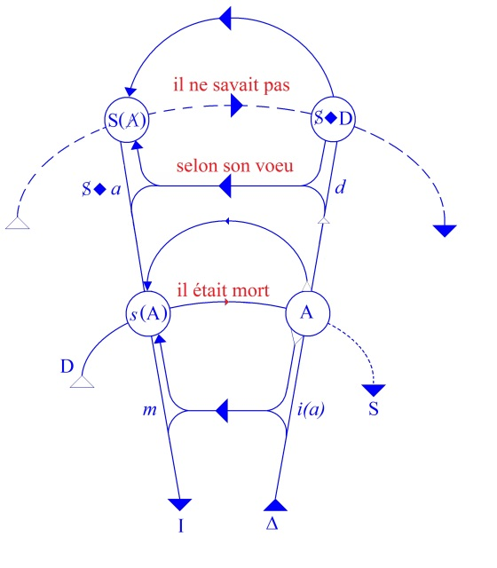
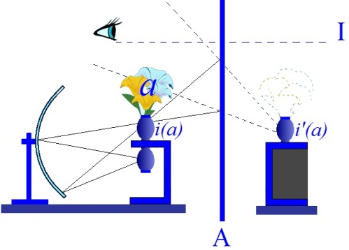

# Leçon 06 | 17 Décembre 1958

<!-- source-url: http://staferla.free.fr/S6/S6 LE DESIR.docx -->
<!-- seminar: s6 -->
<!-- lesson: 06 -->

<!-- id: s6-06-0001 -->

J’ai fait allusion la dernière fois à la grammaire française de Jacques DAMOURETTE et d’Édouard PICHON, éditeur : D’ARTREY. Ce que j’ai dit de la négation, du « *forclusif* » et du « *discordantiel* », est réparti en deux endroits de cette grammaire, dans le deuxième volume où il y a ramassé tout un article sur la négation, qui fixe les données du « *forclusif* » et du « *discordantiel* ».

<!-- id: s6-06-0002 -->

Ce « *forclusif* » qui est si singulièrement *incarné* dans la langue française par ces « *pas* », « *point* » ou « *personne* », « *rien* », « *goutte* », « *mie* », qui portent en eux-mêmes ce signe de *leur origine dans la trace*, comme vous le voyez. Car tout cela, ce sont des mots qui désignent *la trace*, c’est là que l’action de « *forclusion* », l’acte *symbolique* de « *forclusion* », est rejeté en français, le « *ne* » demeurant réservé à ce qu’il est plus originellement, au « *discordantiel* ».

<!-- id: s6-06-0003 -->

*La négation*, dans son origine, dans sa racine linguistique *est quelque chose qui émigre de l’énonciation vers l’énoncé*, comme j’ai essayé de vous le montrer la dernière fois. Je vous ai montré en quoi on pouvait le représenter sur ce petit graphe dont nous nous servons. Nous en sommes restés, la dernière fois, à cette mise en position des termes, des éléments du rêve : « *Il ne savait pas qu’il était mort* », et c’est *autour* du « *selon son vœu* » que nous avions désigné le point d’incidence réel, pour autant que le rêve à la fois *marque et porte le désir*.

<!-- id: s6-06-0004 -->

Il nous reste à continuer d’avancer pour nous demander en quoi et pourquoi une telle action est possible et j’avais, en terminant, montré autour de quoi j’entendais interroger *cette fonction du désir* telle quelle est articulée dans FREUD, à savoir nommément au niveau du *désir inconscient*.

<!-- id: s6-06-0005 -->

J’entendais l’interroger autour de cette formule qui est celle à laquelle tout ce que nous avons montré de la structure de ce rêve, de ce en quoi il consiste, à savoir de cet affrontement : le sujet est un autre - *un petit autre* en l’occasion - le père réapparaît vivant à propos du rêve et dans le rêve, et il se trouve être par rapport au sujet dans ce rapport dont nous avons commencé d’interroger les ambiguïtés, à savoir que :

<!-- id: s6-06-0006 -->

- c’est lui qui fait que le sujet se charge de ce que nous avons appelé la douleur d’exister,

<!-- id: s6-06-0007 -->

- c’est lui dont il a vu l’âme agoniser, dont il a souhaité la mort, souhaité la mort pour autant que rien n’est plus intolérable que l’existence réduite à elle–même, cette existence au-delà de tout ce qui peut la soutenir, cette existence soutenue dans l’abolition précisément du désir.

<!-- id: s6-06-0008 -->

Et nous avons indiqué y pressentir que \[c’est\] dans cette répartition, je dirais des fonctions *intra-subjectives*,

<!-- id: s6-06-0009 -->

qui fait que le sujet se charge de la douleur de l’autre, rejetant sur l’autre ce qu’il ne sait pas et qui n’est pas,

<!-- id: s6-06-0010 -->

dans l’occasion, autre chose que sa propre ignorance à lui, le sujet.

<!-- id: s6-06-0011 -->

L’ignorance dans laquelle c’est précisément du désir du rêve qu’il désire *se soutenir*, qu’il désire *s’entretenir*, et qu’ici le désir de mort prend son plein sens qui est le désir de ne pas s’éveiller, de ne pas s’éveiller au message qui est précisément celui qui est le plus secret, qui est porté par le rêve lui–même et qui est ceci, c’est que le sujet \- par la mort de son père - est désormais affronté à la mort, ce dont jusque là la présence du père le protégeait.

<!-- id: s6-06-0012 -->

C’est-à-dire à ce quelque chose qui est lié à la fonction du père, à savoir ce quelque chose qui est là présent dans cette *douleur d’exister*, ce quelque chose qui est le point pivot autour de quoi tourne tout ce que FREUD a découvert dans le *complexe d’Œdipe*, à savoir l’X, la signification de *la castration*. Telle est la fonction de *la castration*.

<!-- id: s6-06-0013 -->

Que signifie assumer la castration ? La castration est-elle vraiment jamais assumée ?

<!-- id: s6-06-0014 -->

Cette sorte de point autour duquel viennent se briser les dernières vagues de l’*Analyse finie ou infinie*, comme dit FREUD : « *qu’est-ce que c’est ?* »

<!-- id: s6-06-0015 -->

Et jusqu’à quel point dans ce rêve et à propos de ce rêve l’analyste n’est-il pas seulement en droit, n’est-il pas en position, en puissance, en pouvoir de l’interpréter ?

<!-- id: s6-06-0016 -->

<!-- id: s6-06-0017 -->

C’est ce sur quoi, à la fin de ce que nous disions *la dernière fois* de ce rêve, j’avais laissé la question posée : les trois façons de la part de l’analyste de réintroduire le « *selon son vœu* ».

<!-- id: s6-06-0018 -->

La façon *selon la parole du sujet*, *selon ce que le sujet a voulu* et dont il a bien parfaitement le souvenir qui n’est point oublié, c’est-à-dire que « *selon son vœu* »…

<!-- id: s6-06-0019 -->

rétabli là au niveau de la ligne supérieure

<!-- id: s6-06-0020 -->

…que « *selon son vœu* » rétablit là, au niveau de l’énoncé caché du souvenir inconscient, les traces du *complexe d’Œdipe*, du désir infantile de la mort du père…

<!-- id: s6-06-0021 -->

qui est ce quelque chose dont FREUD nous dit qu’il est dans toute formation du rêve « *le capitaliste* »

<!-- id: s6-06-0022 -->

…Ce *désir infantile*…

<!-- id: s6-06-0023 -->

dans l’occasion d’un désir actuel qui a à s’exprimer dans le rêve, *et qui est loin d’être toujours un désir inconscient*

<!-- id: s6-06-0024 -->

…trouve *l’entrepreneur*.

<!-- id: s6-06-0025 -->

Ce « *selon son vœu* » restauré au niveau du *désir infantile*, n’est-ce pas quelque chose qui se trouve là en position en somme, d’aller dans le sens du *désir du rêve ?*

<!-- id: s6-06-0026 -->

Puisqu’il s’agit d’interposer…

<!-- id: s6-06-0027 -->

> à ce moment crucial de la vie du sujet qui est réalisé par la disparition du père

<!-- id: s6-06-0028 -->

…puisqu’il s’agit dans le rêve d’interposer cette image de l’objet et, incontestablement le présenter comme support d’un voile, d’une ignorance *perpétuelle*, d’un appui donné à ce qui était en somme jusque là alibi du désir.

<!-- id: s6-06-0029 -->

Puisque aussi bien *la fonction même de l’interdiction* véhiculée par le père, c’est bien là quelque chose qui donne au désir, dans sa forme énigmatique, voire abyssale, ce quelque chose dont le sujet se trouve séparé, cet abri, cette défense en fin de compte, qui est, comme l’a très bien entrevu JONES…

<!-- id: s6-06-0030 -->

> et nous verrons aujourd’hui que JONES a eu certaines aperceptions très extraordinaires
>
> de certains points de cette dynamique psychique

<!-- id: s6-06-0031 -->

…ce prétexte moral à ne point affronter son désir.

<!-- id: s6-06-0032 -->

Pouvons-nous dire que l’interprétation pure et simple du désir œdipien ne soit pas ici quelque chose qui en somme s’accroche à quelque étape intermédiaire de l’interprétation du rêve ?

<!-- id: s6-06-0033 -->

En permettant au sujet de faire quoi ? À proprement parler ce quelque chose dont vous allez reconnaître la nature avec la désignation de « *s’identifier à l’agresseur* », est-ce autre chose que l’interprétation du désir œdipien, à ce niveau et dans ces termes, que vous avez voulu la mort de votre père à telle date et pour telle raison.

<!-- id: s6-06-0034 -->

Dans votre enfance, quelque part dans l’enfance, est « *l’identification à l’agresseur* ». N’avez-vous pas reconnu typiquement que pour être une des formes de la défense, cela est essentiel ?

<!-- id: s6-06-0035 -->

N’y a-t-il pas quelque chose qui se propose à la place même où est élidé le « *selon son vœu* » ? Est-ce que le « *selon* » et son sens, ne sont pas pour nous une interprétation pleine du rêve ?

<!-- id: s6-06-0036 -->

Sans aucun doute !

<!-- id: s6-06-0037 -->

Ceci, mises à part les opportunités et les conditions qui permettent à l’analyste d’en arriver jusque là : elles dépendront du temps du traitement, du contexte de la réponse du sujet dans les rêves, puisque nous savons que dans l’analyse le sujet répond à l’analyste, tout au moins à ce qu’est devenu l’analyste dans le transfert, par ses rêves.

<!-- id: s6-06-0038 -->

Mais essentiellement, je dirais *dans la position logique des termes,* est-ce qu’au « *selon son vœu* » n’est pas posée une *question* à laquelle nous risquons toujours de donner : quelque forme précipitée, quelque réponse précipitée, quelque réponse prématurée, quelque évitement offert, au sujet de ce dont il s’agit, à savoir :

<!-- id: s6-06-0039 -->

- *l’impasse où le met cette structure fondamentale qui fait de l’objet de tout désir le support d’une métonymie essentielle,*

<!-- id: s6-06-0040 -->

- et quelque chose où l’objet du désir humain comme tel, se présente sous une forme évanouissante et dont peut-être nous pouvons entrevoir que la castration se trouve être ce que nous pourrions appeler le dernier tempérament.

<!-- id: s6-06-0041 -->

Nous voici donc amenés à reprendre par l’autre bout, c’est-à-dire par celui qui n’est pas donné dans les rêves, à interroger de plus près ce que veut dire, ce que signifie le désir humain. Et cette *formule*, je veux dire cet *algorithme* : S **◊** *a ,* le S *affronté, mis en présence, mis en face de* *(a)*, de *l’objet*…

<!-- id: s6-06-0042 -->

> et nous l’avons introduite à ce propos dans ces images du rêve, et du sens qui nous y est révélé

<!-- id: s6-06-0043 -->

…n’est-ce pas quelque chose que nous ne pouvons pas essayer de mettre à l’épreuve de *la phénoménologie du désir* telle qu’elle se présente à nous, chose curieuse, au désir qui est là qui est là depuis \[toujours\], qui est là au cœur de \[...\].

<!-- id: s6-06-0044 -->

Essayons de voir sous quelle forme, pour nous *analystes*, ce désir se présente.

<!-- id: s6-06-0045 -->

Cet algorithme va pouvoir nous mener ensemble dans le chemin d’une interrogation qui est celle de notre expérience commune, de notre expérience d’analystes, de la façon dont chez le sujet…

<!-- id: s6-06-0046 -->

> chez le sujet qui n’est pas obligatoirement ni toujours le sujet névrosé

<!-- id: s6-06-0047 -->

…dont il n’y a point de raison de présumer que sur ce point sa structure ne soit pas incluse, car révélatrice d’une structure plus générale.

<!-- id: s6-06-0048 -->

Dans tous les cas il est hors de doute que le névrosé se trouve situé quelque part dans ce qui représente les prolongements, les processus d’une expérience qui pour nous a valeur universelle. C’est bien là le point sur lequel se déroule toute la construction de la doctrine freudienne.

<!-- id: s6-06-0049 -->

Avant d’entrer dans une interrogation sur certaines des façons dont déjà a été abordée cette dialectique des rapports du sujet à son désir, et nommément ce que j’ai annoncé tout à l’heure de *la pensée de* JONES, *pensée* qui est restée en route, qui assurément a entrevu - vous allez le voir - quelque chose, je veux me rapporter à quelque chose de recueilli d’une expérience clinique la plus commune, à un exemple qui m’est venu assez récemment dans mon expérience et qui me paraît assez bien fait pour introduire ce que nous cherchons à illustrer.

<!-- id: s6-06-0050 -->

Il s’agissait d’un impuissant. Ce n’est pas mal de partir de l’impuissance pour commencer de s’interroger sur ce qu’est le désir. Nous sommes en tous cas sûrs d’être au niveau humain. C’était là un jeune sujet qui, bien entendu, comme beaucoup d’impuissants, n’était *pas du tout* impuissant. Il avait fait l’amour très normalement au cours de son existence et il avait eu quelques liaisons. Il était marié et c’est avec sa femme que ça ne marchait plus.

<!-- id: s6-06-0051 -->

Ceci n’est pas à porter au compte de l’impuissance. Pour être localisé précisément à l’objet avec lequel les relations sont pour le sujet des plus *souhaitables* - car il aimait sa femme - le terme ne semble pas approprié. Or voici à peu près ce qui ressortait - au bout d’un certain temps d’épreuve analytique - des propos du sujet.

<!-- id: s6-06-0052 -->

Ce n’était pas absolument que tout élan lui manquât, mais s’il s’y laissait conduire un soir…

<!-- id: s6-06-0053 -->

> et quelque autre soir qui était dans la période actuelle vécue de l’analyse

<!-- id: s6-06-0054 -->

…pourrait-il, cet élan, le soutenir ? Les choses avaient été fort loin dans le conflit entraîné par cette *carence* qu’il venait de traverser : était-il en droit d’imposer à sa femme encore quelque nouvelle épreuve, quelque nouvelle péripétie de ses essais et de ses échecs ?

<!-- id: s6-06-0055 -->

Bref, ce désir dont on sentait à tout propos assurément qu’il n’était point absent de toute présence, de toute possibilité d’accomplissement, ce désir était-il légitime ? Et sans pouvoir ici pousser plus loin la référence à ce cas précis dont, bien entendu, je ne peux pas ici pour toutes sortes de raisons vous donner l’observation…

<!-- id: s6-06-0056 -->

> ne serait-ce que parce que c’est une analyse en cours et pour beaucoup d’autres raisons encore,
>
> et c’est l’inconvénient qu’il y a toujours à faire des allusions à des analyses présentes

<!-- id: s6-06-0057 -->

…j’emprunterai à d’autres analyses ce terme tout à fait décisif dans certaines évolutions, quelquefois menant à des écarts, voire à ce que l’on appelle des « *perversions* » d’une autre importance structurelle, que ce qui y a joué à nu, si l’on peut dire, dans le cas de l’impuissance.

<!-- id: s6-06-0058 -->

J’évoquerai donc ce rapport qui se produit dans certains cas, dans l’expérience, dans le vécu des sujets et qui paraît au jour dans l’analyse. Une expérience qui peut avoir une fonction décisive et qui…

<!-- id: s6-06-0059 -->

comme dans d’autres endroits

<!-- id: s6-06-0060 -->

…révèle une structure, le point où le sujet se pose la question, le problème : « *a-t-il un assez grand phallus* » ? Sous certains angles, sous certaines incidences, cette question à soi toute seule peut entraîner chez le sujet toute une série de solutions, lesquelles se superposant les unes aux autres, se succédant et s’additionnant, peuvent l’entraîner fort loin du champ d’une exécution normale de ce dont il a tous les éléments.

<!-- id: s6-06-0061 -->

Cet « *assez grand phallus* » ou plus exactement ce « *phallus* » essentiel pour le sujet, à un moment de son expérience se trouve forclos. Et c’est quelque chose que nous retrouvons sous mille formes, pas toujours bien entendu apparentes, ni manifestes, latentes, mais c’est précisément dans le cas où, comme dirait Monsieur DE LA PALICE, ce moment de cette étape est là à ciel ouvert, que nous pouvons la voir et la toucher et aussi lui donner sa portée.

<!-- id: s6-06-0062 -->

Le sujet, si je puis dire, nous le voyons plus d’une fois dans la confrontation, dans la référence avec ce quelque chose qu’il nous faut prendre là *au moment de sa vie* - souvent au détour et à l’éveil de la puberté - *où il en rencontre le signe*. Le sujet est là confronté avec quelque chose qui, comme tel, est du même ordre que ce que nous venons d’évoquer tout à l’heure. Le désir - par quelque chose d’autre - se trouve-t-il légitimé, sanctionné ?

<!-- id: s6-06-0063 -->

D’une certaine façon déjà ce qui apparaît ici en éclair se \[...\] dans la phénoménologie sous laquelle le sujet l’exprime. La phénoménologie sous laquelle il l’exprime nous pourrions l’assumer sous la forme suivante : *le sujet a-t-il ou non l’arme absolue ?* Faute d’avoir l’arme absolue, il va se trouver entraîné dans une série d’identifications, d’alibis, de jeux de cache-cache qui…

<!-- id: s6-06-0064 -->

je vous le répète, nous ne pouvons pas plus ici en développer les dichotomies

<!-- id: s6-06-0065 -->

…peuvent le mener fort loin.

<!-- id: s6-06-0066 -->

L’*essentiel* est ceci, c’est que je veux vous indiquer :

<!-- id: s6-06-0067 -->

- comment le désir trouve l’origine de sa péripétie à partir du moment où il s’agit que le sujet l’ait comme « *aliéné* » dans quelque chose qui est un *signe*, dans une promesse, dans une anticipation comportant d’ailleurs comme telle *une perte possible*.

<!-- id: s6-06-0068 -->

- Comment le désir est lié à la dialectique d’un manque subsumé dans un temps qui, comme tel, est un temps qui n’est pas là, pas plus que le signe dans l’occasion n’est le désir.

<!-- id: s6-06-0069 -->

Ce à quoi le désir a à s’affronter, c’est à cette crainte qu’il ne se maintienne pas sous sa forme actuelle, qu’« *artifex* » - si je puis m’exprimer ainsi - il périsse. Mais bien entendu cet « *artifex* » qu’est le désir que l’homme ressent, éprouve comme tel, cet « *artifex* » ne peut périr qu’au regard de l’*artifice* de son propre dire. C’est dans la dimension du dire que cette crainte s’élabore et se stabilise.

<!-- id: s6-06-0070 -->

C’est là que nous rencontrons ce terme si surprenant et si curieusement délaissé dans l’analyse, qui est celui…

<!-- id: s6-06-0071 -->

> dont je vous dis que JONES l’avait émis pour support de sa réflexion

<!-- id: s6-06-0072 -->

…qui est celui d’ἀϕάνισις \[aphanisis\]. Quand JONES s’arrête, médite sur la phénoménologie de la castration…

<!-- id: s6-06-0073 -->

> Phénoménologie - vous le voyez bien par expérience, par les publications - qui reste de plus en plus voilée dans l’expérience analytique si l’on peut dire moderne

<!-- id: s6-06-0074 -->

…JONES, à l’étape de l’analyse où il se trouve confronté à toutes sortes de tâches qui sont différentes de celles que donne l’expérience moderne…

<!-- id: s6-06-0075 -->

- un certain rapport au malade dans l’analyse qui n’est pas celui qui a été réorienté depuis, *selon d’autres normes*,

<!-- id: s6-06-0076 -->

- à une certaine nécessité d’interprétation, d’exégèse, d’apologétique, d’explication de la pensée de FREUD

<!-- id: s6-06-0077 -->

…JONES, si l’on peut dire *essaye de trouver ce truchement*, *ce moyen* de se faire entendre à propos du *complexe de castration*, que ce dont le sujet craint d’être privé, c’est de son propre désir.

<!-- id: s6-06-0078 -->

Il ne faut pas s’étonner que ce terme d’ἀϕάνισις \[aphanisis\] qui veut dire cela, *disparition* et nommément du *désir*…

<!-- id: s6-06-0079 -->

> dans le texte de JONES vous verrez que c’est bien de *cela* qu’il s’agit, que c’est cela qu’il articule

<!-- id: s6-06-0080 -->

…ce terme lui sert d’introduction en raison d’une problématique qui - *le cher homme* - lui a donné beaucoup de soucis, c’est celle des rapports de la femme au *phallus*, dont il ne s’est jamais dépêtré.

<!-- id: s6-06-0081 -->

Tout de suite il use de cet ἀϕάνισις \[aphanisis\] pour mettre sous le même dénominateur commun les rapports de l’homme et de la femme à leur désir, ce qui est l’engager dans une impasse, puisque c’est méconnaître que, précisément, ces rapports sont foncièrement différents et uniquement…

<!-- id: s6-06-0082 -->

puisque c’est là ce qu’a découvert FREUD

<!-- id: s6-06-0083 -->

…en raison de leur *asymétrie* par rapport au *<u>signifiant</u> phallus*. Ceci, je pense vous l’avoir déjà assez fait sentir pour que nous puissions considérer, au moins à titre provisoire aujourd’hui, qu’il y a là quelque chose d’acquis.

<!-- id: s6-06-0084 -->

Aussi bien cette utilisation de l’ἀϕάνισις \[aphanisis\]…

<!-- id: s6-06-0085 -->

> qu’elle soit à l’origine de l’invention ou qu’elle soit seulement dans ses suites

<!-- id: s6-06-0086 -->

…marque une sorte d’inflexion qui en somme, détourne son auteur de ce qui est la véritable question, à savoir qu’est-ce que signifie dans la structure du sujet cette possibilité de l’ἀϕάνισις \[aphanisis\] ?

<!-- id: s6-06-0087 -->

Est-ce qu’elle ne nous oblige pas justement à une structuration du sujet humain en tant que tel, justement en tant que c’est un sujet pour qui l’existence est supposable et supposée au-delà du désir, un sujet qui *ex-*siste, qui *sub-*siste en dehors de ce qui est son désir.

<!-- id: s6-06-0088 -->

La question n’est pas de savoir si nous avons à tenir compte objectivement du désir dans sa forme la plus radicale, le désir de vivre, les instincts de vivre, comme nous disons. La question est toute différente, *elle est que ce que l’analyse nous montre, nous montre comme mis en jeu dans le vécu du sujet*, c’est cela même, je veux dire que ce n’est pas seulement *que* *le vécu humain soit soutenu* - comme de bien entendu nous nous en doutons - *par le désir*, mais que le sujet humain *en tient compte*, si je puis dire *qu’il compte avec ce désir* comme tel, qu’il a peur, si je puis m’exprimer ainsi, que l’« *élan vital* »…

<!-- id: s6-06-0089 -->

> ce cher « *élan vital* », cette charmante incarnation, c’est bien là le cas de parler d’*anthropomorphisme*
>
> du désir humain dans la nature

<!-- id: s6-06-0090 -->

…que justement, ce fameux « *élan* » avec lequel nous essayons de faire tenir debout cette « *nature* » à laquelle nous ne comprenons pas grand chose, c’est que cet « *élan vital* », quand il s’agit de lui, quand le sujet humain le voit devant soi, il a peur qu’il lui manque.

<!-- id: s6-06-0091 -->

À soi tout seul, ceci suggère bien quand même l’idée que nous ne ferions pas mal d’avoir quelques *exigences* de structure, car enfin il s’agit tout de même là d’autre chose que des « *reflets de l’inconscient* ». Je veux dire de ce rapport sujet-objet immanent, *si je puis dire*, à la pure dimension de la connaissance et que, dès lors qu’il s’agit du désir, comme d’ailleurs l’expérience nous le prouve, je veux dire l’expérience freudienne, cela va tout de même nous poser des problèmes un petit peu plus compliqués.

<!-- id: s6-06-0092 -->

En effet nous pouvons, puisque nous sommes partis de l’impuissance, aller à l’autre terme. S’il ne craint ni puissance ni impuissance, le sujet humain en présence de son *désir*…

<!-- id: s6-06-0093 -->

- il lui arrive aussi de le satisfaire,

<!-- id: s6-06-0094 -->

- il lui arrive de l’anticiper comme satisfait,

<!-- id: s6-06-0095 -->

…il est également très remarquable de voir ces cas où, à portée de le satisfaire, c’est-à-dire non frappé d’impuissance, le sujet redoute la satisfaction de son désir, et c’est plus souvent qu’à son tour qu’il redoute la satisfaction de son désir comme le faisant dépendre désormais justement de celui ou de celle qui va le satisfaire, à savoir de l’autre.

<!-- id: s6-06-0096 -->

Le fait phénoménologique est quotidien, il est même le texte courant de l’expérience humaine. Il n’y a pas besoin d’aller aux grands drames qui ont pris figure d’exemples et d’illustrations de cette problématique, pour voir comment une *biographie*, tout au long de son cours, *passe son temps* à se dérouler dans un successif évitement de ce qui toujours y a été ponctué comme le plus prégnant désir.

<!-- id: s6-06-0097 -->

Où est cette dépendance de l’autre, cette dépendance de l’autre qui en fait est la forme et le *fantasme* sous lequel se présente ce qui est par le sujet *redouté* et qui le fait s’écarter de *la satisfaction de son désir* ? Ce n’est peut-être pas simplement ce qu’on peut appeler « *la crainte du caprice de l’autre* », ce « *caprice* » qui…

<!-- id: s6-06-0098 -->

je ne sais pas si vous vous en rendez compte

<!-- id: s6-06-0099 -->

…n’a pas beaucoup de rapport avec l’*étymologie vulgaire*, celle du dictionnaire LAROUSSE qui le rapporte à *la chèvre*. « *Caprice* », *capriccio*, ça veut dire « *frisson* » en italien auquel nous l’avons emprunté, ce n’est rien d’autre que le même mot que celui tellement chéri par FREUD qui s’appelle *sich sträuben*, « *se hérisser* ».

<!-- id: s6-06-0100 -->

Et vous savez qu’à travers toute son œuvre, c’est là une des formes métaphoriques sous laquelle, pour FREUD, s’incarne à tout propos…

<!-- id: s6-06-0101 -->

> je parle dans les propos les plus concrets, qu’il parle de sa femme,
>
> qu’il parle d’Irma, qu’il parle du sujet qui résiste en général

<!-- id: s6-06-0102 -->

…c’est une des formes sous lesquelles il incarne de la façon la plus sensible *son appréciation de la résistance*.

<!-- id: s6-06-0103 -->

Ce n’est pas tellement tel que le sujet dépend essentiellement : parce qu’il se représente l’autre comme tel de son caprice, c’est - et c’est ceci qui est voilé - c’est justement que l’autre ne marque ce caprice de signe et qu’il n’y a pas de signe suffisant de la bonne volonté du sujet, sinon la totalité des signes où il subsiste, qu’il n’y a, à la vérité, pas d’autre signe du sujet, que le signe de son abolition de sujet. C’est ce qui est écrit comme cela : S. Ceci vous montre que quant à son désir en somme, « *l’Homme* » n’est pas vrai[^29] puisque quelque peu ou beaucoup de courage qu’il y mette, la situation lui échappe radicalement.

<!-- id: s6-06-0104 -->

Qu’en tous cas cet évanouissement, ce quelque chose que quelqu’un qui après mon dernier séminaire a appelé, en parlant ensuite avec moi : cette « *ombilication du sujet au niveau de son vouloir* ». Et je recueille très volontiers cette image de ce que j’ai voulu vous faire sentir autour du S en présence de *l’objet(a)*. \[S **◊** *a*\]

<!-- id: s6-06-0105 -->

D’autant plus que c’est strictement conforme à ce que FREUD désigne quand il parle du rêve : point de convergence de tous les signifiants où le rêveur finalement s’impliquait tant qu’il s’appelle l’inconnu lui-même, n’a pas reconnu que cet *Unbekannt* \[inconnue\] - terme très étrange sous la plume de FREUD - n’est justement que ce point par où j’ai essayé de vous indiquer ce qui faisait la différence radicale de l’inconscient freudien, c’est que :

<!-- id: s6-06-0106 -->

- ce n’est pas qu’il *se constitue*, qu’il *s’institue* comme inconscient simplement dans la dimension de l’innocence du sujet, par rapport au signifiant qui s’organise, qui s’articule à sa place,

<!-- id: s6-06-0107 -->

- c’est qu’il y a dans ce rapport du *sujet* au *signifiant* cette impasse essentielle, ceci – et je viens de reformuler – *qu’il n’y a pas d’autre signe du sujet que le signe de son abolition de sujet*.

<!-- id: s6-06-0108 -->

Les choses ne s’en tiennent pas là vous pensez bien, car après tout, s’il ne s’agissait que d’une impasse comme on dit, ça ne nous mènerait pas loin. C’est que le propre des impasses, c’est justement qu’elles sont fécondes et cette impasse n’a d’intérêt que de nous montrer ce qu’elle développe comme ramifications qui sont justement celles dans lesquelles va s’engager effectivement *le désir*.

<!-- id: s6-06-0109 -->

Essayons de l’apercevoir, cet ἀϕάνισις \[aphanisis\]. Il y a un moment auquel il faut que dans votre expérience : je veux dire cette expérience pour autant qu’elle n’est pas simplement l’expérience de votre analyse, mais *l’expérience* aussi des modes mentaux sous lesquels vous êtes amenés à penser cette *expérience*, sur le point du *complexe d’Œdipe* où elle apparaît en éclair, qui est quand on vous dit que dans l’*œdipe inversé*, c’est-à-dire au moment où le sujet entrevoit *la solution du conflit œdipien* dans le fait de s’attirer purement et simplement l’*amour du plus puissant*, c’est-à-dire du père, le sujet se dérobe, nous dit-on :

<!-- id: s6-06-0110 -->

- pour autant que son *narcissisme* y est menacé,

<!-- id: s6-06-0111 -->

- pour autant que recevoir cet amour du père comporte pour lui la castration.

<!-- id: s6-06-0112 -->

Cela va de soi parce que, bien entendu *quand on ne peut pas résoudre une question, on la considère comme compréhensible*. C’est ce qui fait habituellement que ce n’est tout de même pas si clair que cela : que le sujet lie ce moment de solution possible, une solution d’autant plus possible qu’en partie ce sera la voie empruntée, puisque l’introjection du père sous la forme de l’*Idéal du moi* sera bien quelque chose qui ressemble à cela.

<!-- id: s6-06-0113 -->

Il y a une participation de la fonction dite « *inverse* » de l’œdipe dans la solution normale, qui est tout de même un moment mis en évidence par une série d’expériences, d’entrevues, spécialement dans la problématique de l’homosexualité où le sujet ressent cet amour du père comme essentiellement menaçant, comme comportant cette menace que nous qualifions de narcissique, faute de pouvoir lui donner un terme plus approprié.

<!-- id: s6-06-0114 -->

Et après tout il n’est pas, ce terme tellement inapproprié, les termes ont gardé dans l’analyse, heureusement assez de sens et de plénitude, de caractère *dense, lourd et concret*, pour que ce soit cela en fin de compte qui nous dirige : on sent bien, on repère *qu’il y a du narcissisme dans l’affaire et que ce narcissisme est intéressé à ce détour du complexe d’Œdipe.*

<!-- id: s6-06-0115 -->

Surtout - la chose nous sera confirmée par les voies ultérieures de la dialectique - quand le sujet sera entraîné dans les voies de l’homosexualité. Elles sont, vous le savez, beaucoup plus complexes bien entendu, que celles d’une pure et simple exigence sommaire de *la présence du phallus dans l’objet*, mais fondamentalement elle y est recélée. Ce n’est pas là que je veux m’engager. Simplement, ceci nous introduit à cette proposition : que pour faire face à cette suspension du désir, à l’orée de la problématique du signifiant, le sujet va avoir devant lui plus d’une astuce, si l’on peut dire.

<!-- id: s6-06-0116 -->

Ces astuces portent, bien entendu, d’abord essentiellement sur la manipulation de *l’objet*, du *(a)* dans la formule. Cette prise de l’objet dans la dialectique des rapports du sujet et du signifiant ne doit pas être mise au principe de toute espèce d’articulation de la relation que j’ai essayée de faire ces dernières années avec vous, car on la voit tout le temps et partout.

<!-- id: s6-06-0117 -->

Est-il besoin de vous rappeler ce moment de la vie du *Petit Hans* où, à propos de tous les *objets*, il se demande : a-t-il ou n’a-t-il pas un *phallus* ? Il suffit d’abord de voir un enfant pour s’apercevoir sous toutes ses formes, de cette fonction essentielle qui joue là, bien à ciel ouvert.

<!-- id: s6-06-0118 -->

Il s’agit dans le cas du Petit Hans, *du fait-pipi*, *du Wiwimacher*. Vous savez pendant quelle période, à quel propos et à quel détour, à deux ans cette question se pose pour lui à propos de tous les objets, définissant une sorte d’analyse que FREUD signale incidemment comme un mode d’interprétation de cette phobie.

<!-- id: s6-06-0119 -->

Ceci bien entendu, n’est pas une position qui d’aucune façon ne fasse que traduire la présence du *phallus* dans la dialectique. Cela ne nous renseigne d’aucune façon, ni sur l’usage, la fin que j’ai essayée de vous faire voir en son temps, ni sur la stabilité du procédé. Ce que je veux simplement vous indiquer, c’est que nous avons tout le temps des témoignages que nous ne nous égarons pas, à savoir que les termes en présence sont bien ceux-ci :

<!-- id: s6-06-0120 -->

- le *sujet*, et cela par sa disparition,

<!-- id: s6-06-0121 -->

- son affrontement à un *objet*, quelque chose qui de temps en temps se révèle comme étant le *signifiant* essentiel autour duquel se joue le sort de tout ce rapport du sujet à l’objet.

<!-- id: s6-06-0122 -->

Et maintenant, pour rapidement évoquer dans quel sens, au sens le plus général, se porte cette incidence concernant *l’objet* - je veux dire le *petit(a)* de notre algorithme - du point de vue de ce qu’on pourrait appeler la spécificité *instinctuelle*, du point de vue du besoin.

<!-- id: s6-06-0123 -->

Nous savons déjà ce qui arrive dans un rapport impossible, si l’on peut dire, rendu impossible à *l’objet* par la présence, par l’interposition du *signifiant*, pour autant que *le sujet* a à s’y maintenir en présence de *l’objet*.

<!-- id: s6-06-0124 -->

Il est bien clair que l’objet humain subit cette sorte de volatilisation qui est celle que nous appelons dans notre pratique concrète la possibilité de déplacement, ce qui ne veut pas dire simplement que le sujet humain, comme tous les sujets animaux, voit son désir se déplacer d’objet en objet, mais que ce déplacement même est le point où peut se maintenir le fragile équilibre de son désir. En fin de compte, de quoi s’agit-il ? Il s’agit, je dirais d’envisager d’un certain côté, d’empêcher la satisfaction tout en gardant toujours un objet de désir.

<!-- id: s6-06-0125 -->

D’une certaine façon, c’est encore un mode, si l’on peut dire, de symboliser métonymiquement la satisfaction, et nous nous avançons là tout droit dans la dialectique de la cassette et de *L’avare*. Elle est loin d’être la plus compliquée, encore qu’on ne voie guère ce dont il s’agit. C’est qu’il faut que le désir subsiste dans cette occasion, dans une certaine *rétention* de l’objet comme nous disons, en faisant intervenir *la métaphore anale*.

<!-- id: s6-06-0126 -->

Mais c’est *pour autant que cet objet retenu n’est lui-même l’objet d’aucune jouissance* que cette rétention du support du désir…

<!-- id: s6-06-0127 -->

c’est bien le cas de le dire ! *la phénoménologie juridique en porte les traces : on dit qu’on a la jouissance d’un bien*.

<!-- id: s6-06-0128 -->

Qu’est-ce que cela veut dire, si ce n’est que justement qu’il est tout à fait concevable humainement *d’avoir un bien* *dont on ne jouisse pas, et que ce soit un autre qui en jouisse*. Ici l’objet révèle sa fonction de gage du désir si l’on peut dire, pour ne pas dire d’otage.

<!-- id: s6-06-0129 -->

Et si vous voulez que nous essayions ici de faire le pont avec *la psychologie animale*, nous évoquerons ce qui a été dit…

<!-- id: s6-06-0130 -->

> pour ce qui est de l’éthologie, par un de nos confrères

<!-- id: s6-06-0131 -->

…de plus exemplaire et des plus imagés. J’ai assez tendance quant à moi à le croire. Je m’en suis aperçu avec quelqu’un qui vient de faire paraître un petit volume…

<!-- id: s6-06-0132 -->

> je ne voulais pas vous le dire parce que cela va vous donner des distractions

<!-- id: s6-06-0133 -->

…cette plaquette vient de sortir, elle s’appelle *L’Ordre des choses*. C’est heureusement un petit livre paru chez PLON, qui est de Jacques BROSSE : personnage jusqu’ici complètement inconnu. Il s’agit d’*une sorte de petite histoire naturelle*…

<!-- id: s6-06-0134 -->

c’est comme cela que je vous l’interprète

<!-- id: s6-06-0135 -->

…une « *petite histoire naturelle* » à la mesure de notre temps.

<!-- id: s6-06-0136 -->

Je veux dire que :

<!-- id: s6-06-0137 -->

- cela nous restitue ce qui est si subtil et si charmant, que nous trouvons dans la lecture de BUFFON et plus jamais dans aucune publication scientifique, encore que tout de même nous pourrions nous livrer à cet exercice, alors que nous en savons sur le comportement, sur l’*éthologie* des animaux, encore beaucoup plus que BUFFON. Dans les revues spécialisées c’est illisible.

<!-- id: s6-06-0138 -->

- Ce qui est dit dans ce petit bouquin, vous le verrez exprimé dans un style, je dois dire, très très remarquable. Vous lirez surtout ce qu’il y a au milieu, qui s’appelle : *Des vies parallèles*, *la vie de la mygale, la vie de la fourmi*.

<!-- id: s6-06-0139 -->

J’ai pensé à ce petit livre parce que son auteur a ceci en commun avec moi que pour lui la question des mammifères est résolue. Il n’y a en dehors de l’homme…

<!-- id: s6-06-0140 -->

> *mammifère essentiellement problématique,* il n’y a qu’à voir le rôle que jouent les mammes dans notre imagination

<!-- id: s6-06-0141 -->

…il n’y a en dehors de l’homme, de mammifères qu’un seul mammifère vraiment sérieux c’est l’hippopotame.

<!-- id: s6-06-0142 -->

Tout le monde est d’accord là-dessus, pourvu qu’il ait un peu de sensibilité. Le poète T.S. ELIOT[^30]…

<!-- id: s6-06-0143 -->

> qui a de bien mauvaises idées métaphysiques, mais qui est tout de même un grand poète

<!-- id: s6-06-0144 -->

…a du premier coup symbolisé l’Église militante dans l’*Hippopotamus*. Nous y reviendrons plus tard.

<!-- id: s6-06-0145 -->

Revenons à l’hippopotame. Que fait-il, cet *hippopotame* ? On nous souligne les difficultés de son existence.

<!-- id: s6-06-0146 -->

Elles sont grandes semble-t-il, et une des choses essentielles, c’est qu’il garde le champ de son *pacage*…

<!-- id: s6-06-0147 -->

> parce qu’il faut quand même bien qu’il ait quelques réserves de ressources

<!-- id: s6-06-0148 -->

…avec ses excréments. Ceci est un point essentiel : il repère donc ce qu’on appelle son territoire en le limitant par une série de relais, de points devant marquer suffisamment pour tous ceux qui ont à s’y reconnaître \- à savoir ses semblables - qu’ici, c’est chez lui.

<!-- id: s6-06-0149 -->

Ceci pour vous dire que nous savons bien que nous ne sommes pas sans *amorce d’activité symbolique chez les animaux*. Comme vous le voyez, c’est un symbolisme très spécialement excrémentiel chez le mammifère. Si en somme *l’hippopotame*, lui, se trouve garder son pacage avec ses excréments, nous trouvons que le progrès réalisé par *l’homme*…

<!-- id: s6-06-0150 -->

> et à la vérité ceci ne saurait entrer dans la question si nous n’avions pas ce singulier truchement du langage qui, lui, nous ne savons pas d’où il vient, mais c’est lui qui fait intervenir là-dedans la complication essentielle, c’est-à-dire qu’il nous a menés à ce rapport problématique avec l’objet

<!-- id: s6-06-0151 -->

…que l’homme, lui, ce n’est pas son pacage qu’il *garde* avec de la merde donc, c’est sa merde qu’il garde en gage du pacage essentiel, du pacage essentiellement à déterminer.

<!-- id: s6-06-0152 -->

Et c’est ceci *la dialectique* de ce qu’on appelle *le symbolisme anal* de cette nouvelle révélation *des Noces chymiques*[^31], si je puis m’exprimer ainsi, *de l’homme avec son objet*, qui est une des dimensions absolument insoupçonnée jusque là, que l’expérience freudienne nous a révélée. En fin de compte, j’ai simplement voulu ici vous indiquer dans quelle direction, et pourquoi, se produit ceci en somme qui est la même question que pose sans la résoudre MARX dans sa polémique avec PROUDHON, et dont nous pouvons tout de même donner une petite ébauche tout au moins, d’explication : comment il se fait que les objets humains passent d’une valeur d’usage à une valeur d’échange ?

<!-- id: s6-06-0153 -->

Il faut lire ce morceau de MARX parce que c’est une bonne éducation pour l’esprit. Cela s’appelle « *Misère de la philosophie, Philosophie de la misère »*. Il s’adresse à PROUDHON et les quelques pages pendant lesquelles il le tourne en ridicule, ce *cher* PROUDHON, pour avoir décrété que ce passage de l’un à l’autre se faisait par une sorte de *pur décret des coopérateurs*, dont il s’agit de savoir pourquoi ils sont devenus coopérateurs, et à l’aide de quoi. Cette façon dont MARX l’étripe pendant quelques vingt, trente, bonnes pages, sans compter la suite de l’œuvre, est quelque chose d’assez salubre et éducatif pour l’esprit.

<!-- id: s6-06-0154 -->

Voici donc tout ce qui se passe pour l’*objet*, bien sûr, et le sens de cette *volatilisation*, de cette *valorisation* qui est également *dévalorisation* de l’*objet*, je veux dire arrachement de l’*objet* au champ pur et simple du besoin. C’est là quelque chose qui après tout, n’est qu’un rappel de la phénoménologie essentielle, de la phénoménologie du *bien* à proprement parler et dans tous les sens du mot « *bien* », figurez-vous.

<!-- id: s6-06-0155 -->

Mais laissons cela pour l’instant aujourd’hui simplement à l’état d’amorce. Disons simplement qu’à partir du moment où *ce qui est intéressé comme objet* *c’est l’autre, c’est l’autrui, c’est le partenaire sexuel* spécialement, ceci bien entendu entraîne un certain nombre de conséquences. Elles sont d’autant plus sensibles qu’il s’agissait tout à l’heure du *plan social*. Il est bien assuré ici que ce dont il s’agit est à la base même du « *contrat social* », pour autant qu’il y a à tenir compte « *des structures élémentaires de la pensée* », pour autant que le partenaire féminin…

<!-- id: s6-06-0156 -->

> sous une forme qui est elle-même une forme qui n’est pas sans latence et sans retour

<!-- id: s6-06-0157 -->

…y est comme nous l’a montré LÉVI-STRAUSS, *objet d’échange*.

<!-- id: s6-06-0158 -->

Cet « *échange* » ne va pas tout seul. Pour tout dire, nous dirons que comme « *objet d’échange* » la femme est - si l’on peut dire - une très mauvaise affaire pour ceux qui réalisent l’opération. Puisque aussi bien tout ceci nous engage dans cette mobilisation si l’on peut dire réelle, qui s’appelle la prestation, le louage des services du *phallus*. Nous nous plaçons là *dans la perspective* naturellement de l’« *utilitarisme social* » et ceci, comme vous le savez, ne va pas sans présenter quelques inconvénients. C’est même de là que je suis parti tout à l’heure.

<!-- id: s6-06-0159 -->

Que la femme dans ceci ne subisse quelque chose de fort inquiétant comme transformation, à partir du moment où elle est *incluse* dans cette dialectique - *à savoir comme objet socialisé -* c’est quelque chose dont il est vraiment très amusant de voir comment FREUD, dans l’innocence de sa jeunesse - à la page 192­193 du tome I de JONES[^32] - peut parler.

<!-- id: s6-06-0160 -->

La façon dont, à propos des termes émancipatoires de la femme dans MILL…

<!-- id: s6-06-0161 -->

> dont vous savez que FREUD s’est fait *le traducteur* à un moment, sur les instances de GOMPREZS

<!-- id: s6-06-0162 -->

…dont MILL parle des thèmes émancipatoires[^33] et dont, dans une lettre à sa fiancée elle-même, il lui représente à quoi sert une femme, « *une bonne femme* » - cela vaut « *mille* » quand on pense qu’il était au maximum de sa passion ! - cette lettre qui se termine par le fait qu’une femme doit bien rester à sa place et rendre tous les services qui ne sont pas du tout différents des fameux : « *Kinder, Küche, Kirche.* ». \[*Enfants, Cuisine, Église*\]

<!-- id: s6-06-0163 -->

Je pense à l’époque où il se faisait volontiers lui-même le \[…\] éventuel de sa femme. Et le texte se termine sur un passage que je dois vous lire en anglais puisque ce texte n’a jamais été publié dans une autre langue :

<!-- id: s6-06-0164 -->

« *Ni la loi ni la coutume n’ont beaucoup à donner à la femme qui lui ait été précédemment retiré, mais fondamentalement,* *la position des femmes doit sûrement être ce qu’elle est dans la jeunesse, une chère adorée, un adorable petit meuble,* *une potiche angélique, et dans son âge mûr, une femme aimée.* »

<!-- id: s6-06-0165 -->

Voilà quelque chose qui n’est pas du tout sans intérêt pour nous et qui nous montre de quelle expérience est parti FREUD, et nous fait également apercevoir quel chemin il a dû parcourir. L’autre face possible - ce n’est pas pour rien que nous sommes entrés ici dans la dialectique sociale - c’est que devant cette position problématique, il y a une autre solution pour le sujet. L’autre solution pour le sujet, nous la savons également par FREUD : c’est l’*identification*.

<!-- id: s6-06-0166 -->

L’*identification* à quoi ? L’*identification* au père. L’*identification* au père, pourquoi ? Je vous l’ai déjà indiqué : en tant que c’est celui qui, de quelque façon, est aperçu comme celui qui a réussi à surmonter réellement ce lien en impasse, à savoir celui qui est censé avoir réellement châtré la mère. Je dirais qui est « *censé* » parce que, bien entendu, il n’est que « *censé* » et que d’ailleurs il y a là quelque chose qui se présente essentiellement, c’est la problématique du père.

<!-- id: s6-06-0167 -->

Et peut-être si j’y reviens aujourd’hui avec quelque insistance, est-ce dans la ligne de quelque chose qui a été agité hier soir à notre « *Réunion scientifique* », c’est à savoir justement la fonction du père, la *seigneurialité* du père, la fonction *imaginaire* du père dans certaines sphères de la culture.

<!-- id: s6-06-0168 -->

Il est certain qu’il y a là une problématique qui n’est pas sans présenter toutes sortes de possibilités de *glissement* parce que ce qu’il faut voir, c’est que la solution ici préparée, est si l’on peut dire, une solution directe : le père est déjà un « *type* » - au sens propre du terme - « *type* » sans aucun doute présent dans des variations temporelles.

<!-- id: s6-06-0169 -->

Nous ne serions pas tellement intéressés en ce qu’il n’y ait pas de ces variations, mais en ce que nous ne pouvons pas concevoir ici la chose autrement que dans ses rapports avec une fonction imaginaire, en niant le rapport du sujet avec le père, cette *identification* à *l’idéal du père* grâce à laquelle peut-être en fin de compte, nous pouvons dire qu’en moyenne les nuits de noces réussissent et tournent bien, encore que *la statistique* n’ait jamais été faite *d’une façon strictement rigoureuse*.

<!-- id: s6-06-0170 -->

Ceci est évidemment lié à des données de fait, mais aussi à des données *imaginaires* et ne résout en rien pour nous la problématique…

<!-- id: s6-06-0171 -->

> d’ailleurs ni pour nous ni, bien entendu, pour nos patients, et peut-être sur ce point nous nous confondons

<!-- id: s6-06-0172 -->

…ne résout en rien la problématique du désir.

<!-- id: s6-06-0173 -->

Nous allons voir en effet que cette *identification à l’image du père* n’est qu’un cas particulier de ce qu’il nous faut maintenant aborder comme étant la solution la plus générale…

<!-- id: s6-06-0174 -->

> je veux dire dans les rapports, dans cet affrontement du S avec le *(a)* de *l’objet* \[S **◊** *a*\]

<!-- id: s6-06-0175 -->

…l’introduction sous la forme la plus générale de *la fonction imaginaire*.

<!-- id: s6-06-0176 -->

Le support, la solution, la voie de solution qu’offre au sujet la dimension du narcissisme, qui fait que l’Éros humain est engagé dans un certain rapport avec une certaine image \[*i(a)*\] qui n’est pas autre chose qu’un certain rapport à son *corps propre*, et dans lequel va pouvoir se produire cet échange, cette *interversion* dans laquelle je vais essayer d’articuler pour vous la façon dont se présente le problème de *l’affrontement* de S avec *petit(a)*.

<!-- id: s6-06-0177 -->

<!-- id: s6-06-0178 -->

C’est sur ce point que nous reprendrons - puisqu’il est déjà deux heures moins le quart - après les vacances. Je reprendrai le 7 Janvier puisque je n’ai pas pu aujourd’hui avancer les choses plus loin.

<!-- id: s6-06-0179 -->

Vous verrez comment sur ce *petit(a)* que nous allons enfin avoir l’occasion de le préciser dans son essence, dans sa fonction, à savoir la nature essentielle de l’objet humain en tant que, comme je vous l’ai déjà longuement amorcé dans les séminaires précédents, il est foncièrement marqué, comme tout objet humain, d’une structure narcissique, de ce rapport profond avec l’Éros narcissique.

<!-- id: s6-06-0180 -->

Comment cet objet humain en tant que marqué de ceci se trouve, dans la structure la plus générale du fantasme, recevoir normalement le plus essentiel des *Ansätze* du sujet, à savoir ni plus ni moins son affect en présence du désir, cette crainte, cette immanence dans laquelle je vous désignais tout à l’heure ce qui retient par essence le sujet au bord de son désir. Toute la nature du fantasme est de la transférer à l’objet.

<!-- id: s6-06-0181 -->

Ceci nous le verrons en étudiant, en reprenant un certain nombre des fantasmes qui sont ceux dont nous avons jusqu’ici développé la dialectique, et ne serait-ce qu’à partir d’un, fondamental, parce qu’un des premiers découverts, ce fantasme *On bat un enfant* [^34], où vous en verrez les traits les plus essentiels, de ce transfert de l’affect du sujet en présence de son désir, sur son objet en tant que narcissique.

<!-- id: s6-06-0182 -->

Inversement ce que devient le sujet, le point où il se structure, pourquoi il se structure comme *moi* et *Idéal du moi*, ceci ne pourra justement, en fin de compte vous être livré…

<!-- id: s6-06-0183 -->

> à savoir par vous être aperçu dans sa nécessité structurale absolument rigoureuse

<!-- id: s6-06-0184 -->

…que comme étant le retour, le renvoi de cette délégation que le sujet a faite de son affect à cet objet, à ce *(a)* dont nous n’avons jamais encore véritablement parlé, comme étant son renvoi.

<!-- id: s6-06-0185 -->

Je veux dire comment nécessairement il doit lui-même se poser non pas en tant que *(a)*, mais en tant qu’*image de a*, *image de l’autre*, ce qui est une seule et même chose avec le *moi*, cette *image de l’autre* étant marquée de cet indice, d’un grand I, d’un *Idéal du moi* en tant qu’il est lui-même l’héritier d’un rapport premier du sujet non pas avec son désir, mais avec le désir de sa mère, l’*Idéal* prenant la place de ce qui, chez le sujet a été éprouvé comme l’effet d’un enfant désiré.

<!-- id: s6-06-0186 -->

Cette nécessité, ce développement est ce par quoi il vient s’inscrire dans une certaine trace, formation de l’algorithme que je peux déjà inscrire au tableau pour vous l’annoncer pour la prochaine fois :

<!-- id: s6-06-0187 -->

*i(a)I* **◊** *a*(S)

<!-- id: s6-06-0188 -->

Dans un certain rapport avec l’autre, pour autant qu’il est affecté d’un autre, c’est-à-dire du sujet lui-même en tant qu’il est affecté par son désir. Ceci, nous le verrons la prochaine fois.## Notes

[^29]: Cf. les nombreux ricannements de Lacan à propos des « Sciences de <u>l’Homme</u> », des « Sciences <u>Humaines</u> ».

[^30]: Thomas-Stearns Eliot : *La terre vaine et autres poèmes*, trad. Pierre Leyris, Seuil, Points Poésie (bilingue), pp.46-50.

[^31]: Christian Rosencreutz : [*Les Noces Chymiques*](http://gallica.bnf.fr/ark:/12148/bpt6k649192), éd. Traditionnelles 2004.

[^32]: Ernest Jones : *La Vie et l'Œuvre de Sigmund Freud*, Puf 2006.

[^33]: Cf. John Stuart Mill : [*De l'assujettissement des femmes*](http://classiques.uqac.ca/classiques/Mill_john_stuart/assujettissement_femmes/assujettissement_femmes.pdf) (1869).

[^34]: Freud : *Un enfant est battu*, in « *Névrose, psychose et perversion* », PUF 2002, p. 219.
