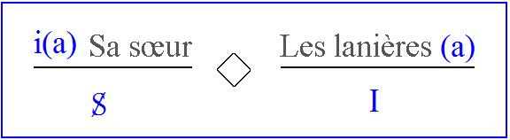
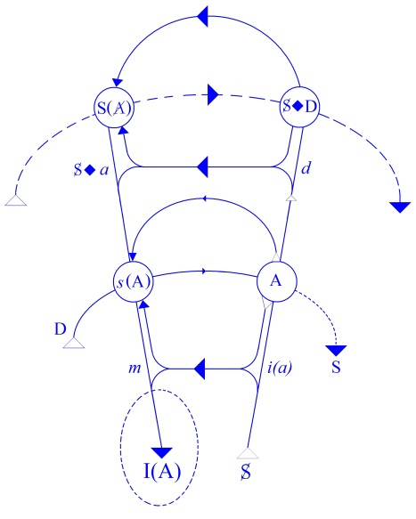

# Leçon 12 | 11 Février 1959

<!-- source-url: http://staferla.free.fr/S6/S6 LE DESIR.docx -->
<!-- seminar: s6 -->
<!-- lesson: 12 -->

<!-- id: s6-12-0001 -->

Le rêve d’Ella SHARPE (5)

<!-- id: s6-12-0002 -->

J’ai annoncé la dernière fois que je terminerai cette fois-ci l’étude de ce rêve que nous avons particulièrement fouillé du point de vue de son interprétation, mais je serai obligé d’y consacrer encore une séance.

<!-- id: s6-12-0003 -->

Je rappelle rapidement que c’est ce rêve d’un patient avocat qui a de grands embarras dans son métier. Et Ella SHARPE n’en approche qu’avec prudence, le patient ayant toute l’apparence de se *tenir à carreau*, sans qu’il s’agisse d’ailleurs de rigidité dans son comportement.

<!-- id: s6-12-0004 -->

Ella SHARPE n’a pas manqué de souligner que tout ce qu’il raconte est du pensé, non pas du senti. Et au point où on en est de l’analyse, il a fait un rêve remarquable qui a été un tournant de l’analyse et qui nous est brièvement rapporté. C’est un rêve que le patient concentre en peu de mots encore qu’il y ait eu là, dit-il, « *un énorme rêve* », si *énorme* que s’il s’en souvenait, il n’en finirait pas de le rapporter.

<!-- id: s6-12-0005 -->

Il émerge de ceci quelque chose qui jusqu’à un certain degré présente les caractères d’un rêve répété, c’est-à-dire d’un rêve qu’il a déjà eu.

<!-- id: s6-12-0006 -->

C’est-à-dire que quelque part dans ce voyage qu’il a entrepris, comme il dit, « ...*avec sa femme autour du monde*... » – et j’ai souligné cela – en un point qui est *en Tchécoslovaquie*…

<!-- id: s6-12-0007 -->

> c’est le seul point sur lequel Ella SHARPE nous dira qu’elle n’a pas obtenu de lumières suffisantes
>
> faute d’avoir interrogé le patient sur ce que signifie le mot *Tchécoslovaquie*, et elle le regrette
>
> car cette *Tchécoslovaquie*, après tout, nous pouvons peut-être en penser quelque chose

<!-- id: s6-12-0008 -->

…il se passe : « …*un jeu sexuel avec une femme devant sa femme*.» \[*p*.132\]

<!-- id: s6-12-0009 -->

La femme avec qui le jeu sexuel se poursuit est quelqu’un qui se présente par rapport à lui comme dans une position supérieure. D’autre part il n’apparaît pas tout de suite dans son *dire*, mais nous le trouvons dans ses *associations*, qu’il s’agit pour elle de manœuvrer « *to get my penis* ». J’ai signalé le caractère très spécial du verbe *to get* en anglais. To get, c’est « *obtenir* », de toutes les façons possibles du verbe obtenir.

<!-- id: s6-12-0010 -->

C’est un verbe beaucoup moins limité qu’obtenir, c’est *obtenir*, *attraper*, *saisir*, *en finir avec*. Et *to get*, si la femme arrive à « *to get my penis* », *cela voudrait dire qu’elle l’a*. Mais ce pénis entre d’autant moins en action que le sujet nous dit que le rêve se termine sur ce vœu que devant le désappointement de la femme il pensait qu’elle devrait bien se masturber. Et je vous ai expliqué que ce dont il s’agissait évidemment là est le *sens clef*, le *sens secret* du rêve. Dans le rêve cela se manifeste par le fait que le sujet dit « *Je voudrais bien la masturber* ». \[...*I thought that I would masturbate her. p*.133\]

<!-- id: s6-12-0011 -->

En fait il y a une véritable exploration de quelque chose qui est interprété…

<!-- id: s6-12-0012 -->

> avec beaucoup d’insistance et de soin dans l’observation par Ella SHARPE

<!-- id: s6-12-0013 -->

…comme étant l’équivalent du chaperon. Quand on regarde de près, ce quelque chose mérite de retenir notre attention. C’est quelque chose qui montre que l’organe féminin est là comme une sorte de *vagin retourné ou prolabé*. Il s’agit de *vagin, non pas de chaperon*.

<!-- id: s6-12-0014 -->

Et tout se poursuit comme si cette *pseudo-masturbation* du sujet n’était pas autre chose qu’une sorte de vérification de l’absence du phallus.Voilà dans quel sens j’ai dit que *la structure imaginaire*, l’articulation manifeste du rêve, devait au moins nous obliger à limiter le caractère du signifiant.

<!-- id: s6-12-0015 -->

Et je pose en somme la question de savoir si par une méthode plus prudente…

<!-- id: s6-12-0016 -->

pouvant être considérée comme plus stricte

<!-- id: s6-12-0017 -->

…nous ne pouvons pas arriver à une précision plus grande dans l’interprétation, à condition que les éléments structuraux avec lesquels nous avons ici pris le parti de nous familiariser soient *suffisamment* mis en ligne de compte pour permettre justement de différencier ce qui est le sens de ce cas.

<!-- id: s6-12-0018 -->

Et nous allons voir qu’à le faire, nous voyons que comme d’habitude, les cas les plus particuliers sont les cas dont la valeur est la plus universelle, et que ce que nous montre cette observation est quelque chose qui n’est pas à négliger.

<!-- id: s6-12-0019 -->

Car il s’agit de rien moins que de préciser à cette occasion ce *caractère de signifiant* sans lequel on ne peut pas donner sa véritable position à la fonction du *phallus*…

<!-- id: s6-12-0020 -->

> qui reste à la fois toujours si importante, si immédiate, si « *carrefour* » dans l’interprétation analytique

<!-- id: s6-12-0021 -->

…sans qu’à tout instant nous ne nous trouvions à propos de son maniement dans des impasses, dont le point le plus frappant est « *traduit–trahi* » par la théorie de Mme Mélanie KLEIN, dont on sait qu’elle fait de l’objet *phallus* le plus important des *objets*.

<!-- id: s6-12-0022 -->

L’objet *phallus* s’introduit dans la théorie kleinienne, et dans son interprétation de l’expérience, comme quelque chose, dit-elle, qui est le substitut, le premier substitut qui vient à l’expérience de l’enfant - qu’il s’agisse de la petite fille ou du garçon - comme étant un signe plus commode, plus maniable, plus satisfaisant.

<!-- id: s6-12-0023 -->

C’est quelque chose à provoquer des questions sur le rôle, le mécanisme… Comment faut-il que nous concevions cette issue *d’un fantasme* tout à fait *primordial*, comme étant *ce autour de quoi* déjà va s’ordonner ce conflit très profondément *agressif* qui met le sujet dans un certain rapport avec le contenant du corps de la mère ?

<!-- id: s6-12-0024 -->

Pour autant que du contenant il convoite, il désire…

<!-- id: s6-12-0025 -->

> tous les termes sont employés, malheureusement toujours *avec difficulté* : c’est-à-dire juxtaposés

<!-- id: s6-12-0026 -->

…*il veut arracher ces bons et ces mauvais objets qui sont là dans une sorte de primitif mélange à l’intérieur du corps de la mère.*

<!-- id: s6-12-0027 -->

Et pourquoi *à l’intérieur du corps*, le privilège accordé à cet objet *phallus* ?

<!-- id: s6-12-0028 -->

Assurément, si tout cela nous est apporté avec *la grande autorité*, *le style* de description si *tranché*, dans une sorte d’éblouissement par *le caractère déterminé* des styles, je dirais presque « *non ouvert* » à aucune discussion des énoncés kleiniens, on ne peut pas manquer aussi de se reprendre après en avoir entendu attester et à chaque instant se demander : qu’est-ce qu’elle vise ?

<!-- id: s6-12-0029 -->

Est-ce que c’est l’enfant effectivement qui apporte le témoignage de cette prévalence de l’objet *phallus*, ou bien au contraire c’est elle-même qui nous le donne, le signal du caractère de *signifiant* comme ayant le sens du *phallus* ?

<!-- id: s6-12-0030 -->

Et je dois dire que, dans de nombreux cas, nous ne sommes pas éclairés sur le choix qu’il faut faire quant à l’interprétation. En fait je sais que certains d’entre vous se demandent où il faut placer ce *signe du phallus* dans les différents éléments du graphe autour duquel nous essayons d’orienter l’expérience du désir et de son interprétation.

<!-- id: s6-12-0031 -->

Et j’ai eu quelques échos de la forme qu’a pu prendre pour certains la question : quel est le rapport de ce *phallus* avec l’Autre, le grand Autre dont nous parlons comme du lieu de la parole ?

<!-- id: s6-12-0032 -->

Il y a un rapport entre le *phallus* et le grand Autre, mais ce n’est certainement pas un rapport au-delà, dans le sens où le *phallus* serait l’être du grand Autre, si tant est que quelqu’un a posé la question dans ces termes. Si le *phallus* a un rapport avec quelque chose, c’est bien plutôt avec *l’être du sujet*.

<!-- id: s6-12-0033 -->

Car je crois que c’est là le point nouveau, important que j’essaye de vous faire saisir dans l’introduction du sujet dans cette dialectique qui est celle qui se poursuit dans le développement inconscient des diverses étapes de l’identification, à travers le rapport primitif avec la mère puis avec l’entrée du jeu de l’Œdipe et du jeu de la loi.

<!-- id: s6-12-0034 -->

Ce que j’ai mis là en valeur est quelque chose qui est à la fois très sensible dans les observations…

<!-- id: s6-12-0035 -->

> très spécialement à propos de la genèse des perversions

<!-- id: s6-12-0036 -->

…et qui est souvent voilé dans ce rapport avec *le signifiant phallus*.

<!-- id: s6-12-0037 -->

C’est qu’il y a deux choses très différentes selon qu’il s’agit :

<!-- id: s6-12-0038 -->

- pour le sujet d’*être -* par rapport à l’Autre - *ce phallus*,

<!-- id: s6-12-0039 -->

- ou bien par quelques *voies*, *ressorts* ou *mécanismes* qui sont ceux que nous allons justement reprendre dans la suite de l’évolution du sujet, mais qui déjà sont là, ces rapports, installés dans l’Autre, dans la mère.

<!-- id: s6-12-0040 -->

Précisément la mère a un certain rapport avec *le phallus*, et c’est dans ce rapport avec le *le phallus* que le sujet a à se faire valoir, à *entrer en concurrence avec le phallus*. C’est de là que nous sommes partis il y a deux ans quand j’ai commencé de réviser cette relation.

<!-- id: s6-12-0041 -->

Ce dont il s’agit, de la fonction du *signifiant phallus* par rapport au sujet, l’opposition de ces deux possibilités du sujet par rapport au *signifiant phallus *:

<!-- id: s6-12-0042 -->

- *de l’être* \[*le phallus*\],

<!-- id: s6-12-0043 -->

- ou *de l’avoir* \[*le phallus*\],

<!-- id: s6-12-0044 -->

…est là quelque chose qui est une distinction essentielle.

<!-- id: s6-12-0045 -->

Essentielle pour autant :

<!-- id: s6-12-0046 -->

- que les incidences ne sont pas les mêmes,

<!-- id: s6-12-0047 -->

- que ce n’est pas au même temps du rapport d’identification que *l’être* et *l’avoir* surviennent,

<!-- id: s6-12-0048 -->

- *qu’il y a entre les deux une véritable ligne de démarcation, une ligne de discernement* : *qu’on ne peut pas l’être <u>et</u> l’avoir*,

<!-- id: s6-12-0049 -->

- *et que pour que le sujet vienne* *– dans certaines conditions –* *à l’avoir, il faut de la même façon qu’il y ait renoncement à l’être*.

<!-- id: s6-12-0050 -->

Les choses en fait sont beaucoup moins simples à formuler si nous cherchons à serrer d’aussi près que possible la dialectique dont il s’agit. Si le *phallus* a un rapport à l’être du sujet :

<!-- id: s6-12-0051 -->

- ce n’est pas avec l’être du sujet pur et simple,

<!-- id: s6-12-0052 -->

- ce n’est pas par rapport à ce sujet prétendu *sujet-de-la-connaissance*, support noétique de tous les objets,

<!-- id: s6-12-0053 -->

- c’est avec un sujet parlant, avec un sujet en tant qu’il assume son identité et comme tel, je dirais

<!-- id: s6-12-0054 -->

> \- c’est pour cela que *le phallus* joue sa fonction essentiellement signifiante - *que le sujet à la fois l’est et ne l’est pas*.

<!-- id: s6-12-0055 -->

Je m’excuse du *caractère algébrique* que prendront les choses, mais il faut bien que nous apprenions à *fixer les idées* puisque, pour certains, des questions se posent.

<!-- id: s6-12-0056 -->

Si dans la notation quelque chose se présente - et nous allons y revenir tout à l’heure - comme étant *le sujet barré* *en face de l’objet* : S**◊***a,* c’est-à-dire le sujet du désir, le sujet en tant que dans son rapport à l’objet, il est lui-même profondément mis en question et que c’est cela qui constitue la spécificité du rapport du désir dans le sujet lui-même. C’est en tant que le sujet est dans notre notation *le sujet barré*, qu’on peut dire qu’*il est possible, dans certaines conditions,* *de lui donner comme signifiant,* *le phallus* \[Φ *: signifiant, et non pas *ϕ *:* *phallus imaginaire*\]. Ceci en tant qu’il est *le sujet parlant*.

<!-- id: s6-12-0057 -->

Il est et il n’est pas le *phallus *:

<!-- id: s6-12-0058 -->

- il l’est parce que c’est le signifiant sous lequel le langage le désigne,

<!-- id: s6-12-0059 -->

- et il ne l’est pas pour autant que le langage, et justement *la loi du langage*, sur un autre plan le lui dérobe.

<!-- id: s6-12-0060 -->

*En fait les choses ne se passent pas là sur le même plan*. Si *la loi* le lui dérobe, c’est précisément pour arranger les choses, c’est qu’un certain choix, à ce moment-là, est fait. La loi en fin de compte apporte dans la situation une définition, une répartition, un changement de plan. La loi lui rappelle qu’il l’a ou qu’il ne l’a pas.

<!-- id: s6-12-0061 -->

Mais en fait ce qui se passe est quelque chose qui joue tout entier dans *l’intervalle* entre cette identification signifiante, et cette répartition des rôles : le sujet est le *phallus*, mais le sujet - bien entendu - n’est pas le *phallus*. Je vais mettre l’accent sur quelque chose que la forme même du jeu de la négation dans la langue nous permettra de saisir dans une formule où se passe le glissement concernant l’usage du verbe être. On peut dire que le moment décisif, celui autour duquel tourne l’assomption de la *castration* est ceci : oui, on peut dire « *qu’il est »* et « *qu’il n’est pas » le phallus*... mais il n’est pas sans l’avoir.

<!-- id: s6-12-0062 -->

C’est dans cette inflexion de « *n’être pas sans* », c’est autour de cette assomption subjective qui s’infléchit *entre* *l’être* et *l’avoir*, que joue la réalité de la castration. C’est-à-direque c’est pour autant que le *phallus*, que le pénis du sujet dans une certaine expérience, est quelque chose qui a été mis en balance…

<!-- id: s6-12-0063 -->

> qui a pris une certaine fonction d’équivalent ou d’étalon dans le rapport à l’objet

<!-- id: s6-12-0064 -->

…qu’il prend sa valeur centrale et que - jusqu’à un certain point - on peut dire que c’est en proportion d’un certain renoncement à son rapport au *phallus* que le sujet entre en possession de cette sorte d’infinité, de pluralité, d’omnitude du monde des objets, qui caractérise le monde de l’homme.

<!-- id: s6-12-0065 -->

Remarquez bien que *cette formule*, dont je vous prie de garder la modulation, l’accent, se retrouve sous d’autres formes dans toutes les langues : « *Il n’est pas sans l’avoir* » a son correspondant qui est clair, nous y reviendrons dans la suite. Le rapport de la femme au *phallus,* et la fonction essentielle de *la phase phallique* dans le développement de la sexualité féminine s’articulent littéralement sous la forme différente, opposée, qui suffit à bien distinguer cette différence des départs du sujet *masculin* et du sujet *féminin* par rapport à la sexualité.

<!-- id: s6-12-0066 -->

La seule formule exacte, celle qui permet de sortir des impasses, des contradictions, des ambiguïtés autour desquelles nous tournons concernant *la sexualité féminine*, *c’est qu’« elle l’est sans l’avoir* ». Le rapport du sujet féminin au *phallus*, c’est *d’« être sans l’avoir »*. Et c’est cela qui lui donne *la transcendance* de sa position, car c’est à cela que nous arriverons. Nous arriverons à articuler, concernant *la sexualité féminine*, ce rapport si particulier, si permanent, dont FREUD a insisté sur le caractère irréductible et qui se traduit psychologiquement sous la forme du *Penisneid*.

<!-- id: s6-12-0067 -->

En somme nous dirons…

<!-- id: s6-12-0068 -->

> pour pousser les choses à l’extrême et les bien-faire-entendre

<!-- id: s6-12-0069 -->

…que pour l’homme son pénis lui est restitué par un certain acte dont à la limite on pourrait dire qu’il l’en prive.

<!-- id: s6-12-0070 -->

Ce n’est pas exact, c’est pour vous faire ouvrir les oreilles, c’est-à-dire que ceux qui ont déjà entendu la précédente formule ne la dégradent pas dans l’accent second que je lui donne. Mais cet accent second a son importance parce que c’est là que se fait la jonction avec l’élément d’abord développemental dont on part habituellement, et qui est celui que je vais essayer de réviser à l’instant avec vous en nous demandant :

<!-- id: s6-12-0071 -->

- comment nous pouvons formuler, *avec les éléments algébriques* dont nous nous servons, ce dont il s’agit dans ces fameux premiers rapports de l’enfant avec *l’objet*, avec l’objet maternel nommément,

<!-- id: s6-12-0072 -->

- et comment à partir de là nous pouvons concevoir que vienne se faire la jonction avec *ce signifiant privilégié* dont il s’agit et dont j’essaie ici de situer la fonction .

<!-- id: s6-12-0073 -->

L’enfant - dans ce qui est articulé par les psychiatres, nommément Mme Mélanie KLEIN - a toute une série de rapports premiers qui s’établissent avec *le corps de la mère*, conçu ici, représenté dans une expérience primitive que nous saisissons mal d’après les comptes-rendus kleiniens : le rapport du *symbole* et de l’*image*. Et chacun sait bien que c’est de cela qu’il s’agit dans les textes kleiniens, du rapport de *la forme* au *symbole*, encore que ce soit toujours un contenu *imaginaire* qui soit ici promu.

<!-- id: s6-12-0074 -->

Quoi qu’il en soit nous pouvons dire que jusqu’à un certain point, quelque chose qui est *symbole* ou *image*, mais qui assurément est une sorte de l’*Un*…

<!-- id: s6-12-0075 -->

> nous trouvons presque là une opposition qui recouvre des oppositions philosophiques,
>
> parce ce qui fait toujours le jeu du fameux *Parménide* entre l’Un et l’être

<!-- id: s6-12-0076 -->

…nous pouvons dire que l’expérience du rapport à la mère est une expérience entièrement centrée autour d’une *appréhension de l’unité ou de la totalité*. Tout le progrès primitif, que Mélanie KLEIN nous articule comme étant essentiel au développement de l’enfant, est celui d’un rapport du morcellement à quelque chose qui représente hors de lui :

<!-- id: s6-12-0077 -->

- à la fois l’ensemble de tous ces objets morcelés, fragmentés qui semblent être là dans une sorte, non de chaos, mais de désordre primitif,

<!-- id: s6-12-0078 -->

- et d’autre part qui progressivement lui apprendra à *saisir de ces rapports de ces objets divers, de cette pluralité, dans l’unité de l’objet privilégié qui est l’objet maternel*, de saisir l’aspiration, le progrès, *la voie vers sa propre unité*.

<!-- id: s6-12-0079 -->

L’enfant, je le répète, appréhende les objets primordiaux comme étant contenus dans *le corps de la mère*, *ce contenant universel* qui se présente à lui et qui serait le *lieu idéal*, si l’on peut dire, *de ses premiers rapports imaginaires*.

<!-- id: s6-12-0080 -->

Comment pouvons-nous essayer d’articuler ceci ? Il y a évidemment là, non pas *deux termes, mais quatre termes*. Le rapport de l’enfant au corps de la mère, si primordial, est le cadre où viennent s’inscrire ces rapports de l’enfant à son propre corps, qui sont ceux que depuis longtemps j’ai essayé d’articuler pour vous autour de la notion de *l’affect spéculaire*, pour autant que c’est là le terme qui donne la structure de ce que l’on appelle *l’affect narcissique*.

<!-- id: s6-12-0081 -->

C’est en tant qu’à partir d’un certain moment le sujet se reconnaît, dans une *expérience originale* :

<!-- id: s6-12-0082 -->

- comme séparé de sa propre image,

<!-- id: s6-12-0083 -->

- comme ayant un certain rapport électif avec l’image de son propre corps.

<!-- id: s6-12-0084 -->

Rapport spéculaire qui lui est donné soit dans l’expérience spéculaire comme telle, soit dans un certain rapport de castration transitif dans les jeux avec l’*autre* d’un âge voisin - très voisin - et qui oscille dans une certaine limite qui n’est pas à dépasser de maturation motrice. Ce n’est pas à n’importe quel type de petit *autre*…

<!-- id: s6-12-0085 -->

> ici le mot « petit » visant le fait de petits camarades

<!-- id: s6-12-0086 -->

…que le sujet peut faire cette expérience, ces jeux de prestance avec l’autre compagnon. L’âge joue ici un rôle sur lequel dans le temps j’ai insisté.

<!-- id: s6-12-0087 -->

Le rapport de ceci avec un Ἔρως \[Éros\], *la libido*, joue un rôle spécial. Est ici articulée toute la mesure où le couple de l’enfant à l’autre qui lui représente *sa propre image* vient se juxtaposer, interférer, se mettre dans la dépendance d’un rapport plus large et plus obscur entre l’enfant, dans ses tentatives *primitives* - les *tendances* issues de son besoin - et *le corps de la mère* en tant qu’il est effectivement, en effet, *l’objet de l’image*, l’identification primitive.

<!-- id: s6-12-0088 -->

Et ce qui se passe, ce qui s’établit, gît tout entier dans le fait que ce qui se passe dans *le couple primitif*…

<!-- id: s6-12-0089 -->

> c’est-à-dire la forme inconstituée dans laquelle se présente
>
> le premier vagissement de l’enfant, le cri, l’appel de son besoin

<!-- id: s6-12-0090 -->

…la façon dont s’établissent les rapports de cet état primitif encore inconstitué du sujet par rapport à quelque chose qui se présente alors comme un *Un* au niveau de l’Autre, à savoir le corps maternel, le contenant universel, est ce qui va régler d’une façon tout à fait primitive le rapport du sujet en tant qu’*il se constitue d’une façon spéculaire*…

<!-- id: s6-12-0091 -->

à savoir comme *moi*, et *le moi c’est l’image de l’autre*

<!-- id: s6-12-0092 -->

…avec un certain *autre* qui doit être *différent de la mère* : dans le rapport spéculaire, c’est le petit autre.

<!-- id: s6-12-0093 -->

Mais, vous allez le voir, c’est de tout autre chose dont il s’agit, étant donné que c’est dans *ce premier rapport quadripartite* que vont se faire les premières adéquations du sujet à sa propre identité.

<!-- id: s6-12-0094 -->

N’oubliez pas que *c’est à ce moment*, dans ce rapport le plus radical, *que tous les auteurs d’un commun accord*, *situent le lieu* *des anomalies psychotiques ou para-psychotiques* de ce que l’on peut appeler l’intégration de tel ou tel terme des rapports auto­érotiques du sujet avec lui-même, dans les frontières de l’image du corps.

<!-- id: s6-12-0095 -->

Le petit schéma dont je me suis servi autrefois et que j’ai rappelé récemment, qui est celui du fameux *miroir concave*, en tant qu’il permet de concevoir que puisse se produire…

<!-- id: s6-12-0096 -->

> à condition qu’on se place dans un point favorable déterminé, je veux dire à l’intérieur de quelque chose qui prolonge les limites du *miroir concave* à partir du moment où on les fait passer par le centre du *miroir sphérique*

<!-- id: s6-12-0097 -->

…quelque chose qui est imagé par l’expérience que j’ai fait connaître en son temps, celle qui provoque l’apparition…

<!-- id: s6-12-0098 -->

qui n’est pas un fantasme mais *une image réelle*,qui peut se produire, dans certaines conditions qui ne sont pas très difficiles à produire

<!-- id: s6-12-0099 -->

…celle qui se produit quand on fait surgir *une image réelle* d’une fleur à l’intérieur d’un vase parfaitement existant grâce à la présence de ce miroir sphérique, à condition de regarder l’ensemble de l’appareil d’un certain point[^50].

<!-- id: s6-12-0100 -->

<!-- id: s6-12-0101 -->

C’est un appareil qui nous permet d’imaginer ce dont il s’agit, à savoir que c’est pour autant que l’enfant s’identifie à *une certaine position* de son être dans les pouvoirs de la mère, qu’il se réalise. C’est bien là-dessus que porte l’accent de tout ce que nous avons dit concernant l’importance des premiers rapports concernant la mère. *C’est pour autant* que c’est d’une façon satisfaisante *qu’il s’intègre dans ce monde d’insignes* que représentent tous les comportements de la mère.

<!-- id: s6-12-0102 -->

C’est à partir de là - pour autant qu’il ira ici se situer d’une façon favorable - que pourra se placer…

<!-- id: s6-12-0103 -->

- soit *à l’intérieur* de lui-même,

<!-- id: s6-12-0104 -->

- soit *hors* de lui-même,

<!-- id: s6-12-0105 -->

- soit lui manquant si l’on peut dire,

<!-- id: s6-12-0106 -->

…ce quelque chose qui lui est à lui-même caché, à savoir ses propres tendances, ses propres désirs, qu’il pourra dès le premier rapport être dans un rapport plus ou moins faussé, dévié, avec ses propres pulsions.

<!-- id: s6-12-0107 -->

Ce n’est pas tellement compliqué d’imaginer cela. Rappelez-vous *autour de quoi* j’ai fait tourner *l’explication narcissique* : une expérience manifeste, cruciale, depuis longtemps décrite, le fameux exemple mis en avant dans « *Les confessions* » de Saint AUGUSTIN, celui de l’enfant qui voit son *frère de lait* en possession du sein maternel :

<!-- id: s6-12-0108 -->

« *Vidi ego et expertus sum zelantem parvulum : nondum loquebatur et intuebatur pallidus amaro aspectu conlactaneum suum.* »[^51]

<!-- id: s6-12-0109 -->

Ce que j’ai traduit par :

<!-- id: s6-12-0110 -->

« *J’ai vu de mes yeux et bien connu un tout petit en proie à la jalousie. Il ne parlait pas encore et déjà il contemplait d’un regard amer*...

<!-- id: s6-12-0111 -->

> « *amaro* » a un autre accent qu’en français « *amer* », on pourrait traduire par « *empoisonné* »
>
> mais cela ne me satisfait pas non plus.

<!-- id: s6-12-0112 -->

…*son frère de lait.* »

<!-- id: s6-12-0113 -->

Cette expérience une fois formalisée, vous allez la voir apparaître dans toute sa portée absolument générale. Cette expérience est le rapport de sa propre image qui, pour autant que le sujet voit son semblable dans un certain rapport avec la mère comme primitive identification idéale, comme première forme de l’*Un*, de cette totalité dont…

<!-- id: s6-12-0114 -->

> à la suite des explorations concernant cette expérience primitive

<!-- id: s6-12-0115 -->

…les analystes font un état tel qu’on ne parle que de totalité, que de notion de prise de conscience de la totalité, comme si portés sur ce versant nous nous mettions à oublier de la façon la plus tenace, que justement ce que l’expérience nous montre est poursuivi jusqu’au plus extrême de tout ce que nous voyons dans les phénomènes : c’est que justement il n’y a dans l’être humain aucune possibilité d’accéder à cette expérience de la totalité, que l’être humain est divisé, déchiré, et qu’aucune analyse ne lui restitue cette totalité.

<!-- id: s6-12-0116 -->

Parce que précisément autre chose est introduit dans sa dialectique qui est justement celle que nous essayons d’articuler parce qu’elle nous est littéralement *imposée par l’expérience*, et en premier lieu, par le fait que l’être humain, en tout état de cause, ne peut se considérer en rien de plus, *au dernier terme*, que *comme un être en qui il manque quelque chose*, un être - qu’il soit mâle ou femelle - châtré. C’est pour cela que c’est à la dialectique de l’être, à l’intérieur de cette expérience de l’*Un*, que se rapporte essentiellement *le phallus*.

<!-- id: s6-12-0117 -->

Mais ici nous avons donc cette *image du petit autre*, cette *image du semblable*, dans un rapport avec cette *totalité* que le sujet a fini par assumer, *non pas sans lenteurs*.

<!-- id: s6-12-0118 -->

Mais c’est bien là-dessus, autour de cela que Mélanie KLEIN fait pivoter l’évolution chez l’enfant. C’est le moment dit de la « *phase dépressive* » qui est le moment crucial, quand la mère comme totalité, a été à un moment réalisée. C’est de cette *première identification idéale* qu’il s’agit.

<!-- id: s6-12-0119 -->

Et qu’avons-nous en face de cela ? Nous avons la prise de conscience de l’objet désiré en tant que tel, à savoir que l’autre est en train de posséder le sein maternel. Et il prend cette valeur élective qui fait de cette expérience une *expérience cruciale*, autour de laquelle je vous prie de vous arrêter comme étant essentielle pour notre formalisation, pour autant que dans ce rapport avec cet objet qui, dans cette occasion, s’appelle le sein maternel, le sujet prend conscience de soi-même comme privé.

<!-- id: s6-12-0120 -->

Contrairement à ce qui est articulé dans JONES : toute privation, dit-il quelque part…

<!-- id: s6-12-0121 -->

> et c’est toujours autour de la discussion de la phase phallique que c’est formulé

<!-- id: s6-12-0122 -->

…engendre le sentiment de la frustration. C’est exactement le contraire : c’est dans la mesure où le sujet est *imaginairement frustré*, où il a la première expérience de quelque chose qui est devant lui à sa place, qui usurpe sa place, qui est dans ce *rapport* avec la mère qui devrait être le sien et où il sent cet intervalle *imaginaire* comme frustration…

<!-- id: s6-12-0123 -->

> je dis *imaginaire* parce qu’après tout rien ne prouve qu’il soit lui-même privé,
>
> un autre peut être privé, ou on peut s’occuper de lui à son tour

<!-- id: s6-12-0124 -->

…que naît la première appréhension de l’objet en tant que le sujet en est privé.

<!-- id: s6-12-0125 -->

C’est là que s’amorce, que s’ouvre le quelque chose qui va permettre à cet objet d’entrer dans un certain rapport avec un sujet, dont ici, nous ne savons pas effectivement si c’est un S auquel il faut que nous mettions l’indice petit i. \[Si \]

<!-- id: s6-12-0126 -->

> une sorte d’auto-destruction passionnelle absolument adhérant à cette pâleur, à cette décomposition que nous montre ici le pinceau littéraire de celui qui nous le débite, à savoir Saint AUGUSTIN

<!-- id: s6-12-0127 -->

…ou si c’est quelque chose que déjà nous pouvons concevoir comme à proprement parler une appréhension de l’ordre *symbolique*. À savoir qu’est-ce que cela veut dire ?

<!-- id: s6-12-0128 -->

À savoir :

<!-- id: s6-12-0129 -->

- que déjà dans cette expérience *l’objet soit symbolisé*, d’une certaine façon *prenne valeur signifiante,*

<!-- id: s6-12-0130 -->

- que déjà l’objet dont il s’agit - *à savoir le sein de la mère* - non seulement puisse être conçu comme *étant là* ou *n’étant pas là*, mais puisse être mis dans le rapport avec quelque chose d’autre qui puisse lui être substitué,

<!-- id: s6-12-0131 -->

…c’est à partir de cela que cela devient *un élément signifiant*.

<!-- id: s6-12-0132 -->

En tout cas Mélanie KLEIN - *sans savoir la portée de ce qu’elle dit à ce moment-là -* prend bien ce parti en disant qu’il peut y avoir quelque chose de meilleur, à savoir le *phallus*. Mais elle ne nous explique pas pourquoi, c’est là le point qui reste mystérieux. Or, tout repose sur ce moment où naît l’activité d’une métaphore que je vous ai pointée comme étant si essentielle à déceler dans le développement de l’enfant.

<!-- id: s6-12-0133 -->

Rappelez-vous ce que je vous ai dit l’autre jour :

<!-- id: s6-12-0134 -->

- de ces formes particulières de l’activité de l’enfant devant lesquelles les adultes sont à la fois si déconcertés et maladroits

<!-- id: s6-12-0135 -->

- de celle de l’enfant qui, non content de s’être mis à appeler « *ouah-ouah* » - c’est-à-dire par un signifiant qu’il a invoqué comme tel - ce que vous vous êtes obstiné à lui appeler un chien, se met à décréter que le chien fait « *miaou* » et que le chat fait « *ouah-ouah* ».

<!-- id: s6-12-0136 -->

C’est dans cette activité de *substitution* que gît tout le rôle, le ressort du *progrès symbolique*, et c’est - beaucoup plus primitivement, bien entendu - ce que l’enfant articule.

<!-- id: s6-12-0137 -->

Ce dont il s’agit, c’est en tout cas de quelque chose qui dépasse cette expérience passionnelle de l’enfant qui se sent frustré, c’est-à-dire celle précisément que nous pouvons formaliser en ceci : *que cette image de l’autre va pouvoir être substituée au sujet*…

<!-- id: s6-12-0138 -->

> dans sa passion anéantissante, dans sa passion jalouse dans l’occasion

<!-- id: s6-12-0139 -->

…et se trouver dans un certain rapport à l’objet en tant que lui est dans un certain rapport aussi avec la totalité qui peut ou non le concerner.

<!-- id: s6-12-0140 -->

Mais c’est pour autant que l’objet est substituable à cette totalité, pour autant que *l’image de l’autre* est substituable au sujet, que nous entrons à proprement parler dans *l’activité symbolique*, dans celle qui fait de l’être humain un être parlant, ce qui va définir tout son rapport ultérieur à notre objet.

<!-- id: s6-12-0141 -->

Ceci dit, dans le cas qui est celui dont nous nous occupons, comment des distinctions si fondamentales, à rester dans leur caractère aussi primitif, peuvent nous servir à nous orienter, je veux dire à créer les discriminations qui nous permettent justement de tirer le maximum de profit de ces faits qui nous sont donnés dans l’expérience du rêve et du sujet particulier dont nous analysons le cas ?

<!-- id: s6-12-0142 -->

Voyons si ce rapport *au désir*, ce rapport appelé *désir*…

<!-- id: s6-12-0143 -->

> ce rapport à l’objet en tant qu’il est rapport de désir humain

<!-- id: s6-12-0144 -->

…nous devons à chaque instant nous proposer de le saisir de près, et s’il est toujours exigible que nous y trouvions ce rapport à un objet en tant que le sujet s’y avère comme à la limite anéanti.

<!-- id: s6-12-0145 -->

Si c’est S par rapport à *a* qui est *la formule du désir*, et si tout ceci s’inscrit dans ce rapport quadruple qui fait que le sujet dans l’*image de l’autre* \[*i(a)*\] - à savoir dans les successives identifications qui vont s’appeler « *moi* » \[*i(a → moi→* I(A)\] – trouve à se substituer une forme à ce quelque chose de foncièrement pali, de foncièrement angoissé, qu’est le rapport du sujet dans le désir \[S**◊***a*\].

<!-- id: s6-12-0146 -->

Qu’est-ce que nous trouvons dans les différents éléments symptomatiques qui nous sont apportés ici dans cette observation ? Nous pouvons le prendre à bien des bouts ce matériel qui nous est apporté par le malade. Prenons le autant que possible dans les bouts qui ont le plus de relief, dans les bouts symptômatiques.

<!-- id: s6-12-0147 -->

Il y a un moment où il nous dit qu’il a coupé les lanières, les courroies des sandales de sa sœur. Ceci vient au cours de l’analyse du rêve, c’est-à-dire après un certain nombre d’*interventions* - *sans doute minimales mais pour autant pas nulles* - d’Ella SHARPE, l’analyste. De simples relances ont fait arriver peu à peu, de fil en aiguille :

<!-- id: s6-12-0148 -->

- après *le capuchon*… le fait que *le capuchon* ait la forme de *l’organe génital féminin* dans ce rapport qui est celui du rêve,

<!-- id: s6-12-0149 -->

- après *la capote de la voiture*,

<!-- id: s6-12-0150 -->

- *les lanières* qui servent à fixer, à arrimer cette *capote*,

<!-- id: s6-12-0151 -->

- puis ces lanières qu’il coupait à un certain moment aux sandales de sa sœur, sans pouvoir encore maintenant rendre compte de l’objectif que sans aucun doute il poursuivait, qui lui paraissait bien utile sans qu’il puisse bien, en quoi que ce soit, en montrer la nécessité.

<!-- id: s6-12-0152 -->

Ce sont très exactement les mêmes termes dont il se sert concernant *sa propre voiture* dont, dans une séance ultérieure, après la séance d’interprétation du rêve, il dit à l’analyste que cette voiture que le garagiste ne lui a pas remise…

<!-- id: s6-12-0153 -->

> et qu’il ne songe pas à en faire une affaire avec cet excellent brave homme

<!-- id: s6-12-0154 -->

…et dont *il n’a aucun besoin*, *il la voudrait bien*, bien qu’elle ne lui soit pas nécessaire. Il dit qu’il « *aime cela* ».

<!-- id: s6-12-0155 -->

Voilà deux formes, semble-t-il, de l’objet avec lequel le sujet a bien entendu un rapport dont lui-même articule le caractère singulier, à savoir que cela ne répond dans les deux cas à aucun besoin. Ce n’est pas nous qui le disons, nous ne disons pas : « *L’homme moderne n’a aucun besoin de sa voiture.* » encore que chacun en y regardant de près s’aperçoit que c’est trop *évident*. Ici c’est le sujet qui le dit :

<!-- id: s6-12-0156 -->

- « *Je n’en ai pas besoin de ma voiture, seulement j’aime cela, je la désire.* »

<!-- id: s6-12-0157 -->

Et *comme vous le savez*, c’est là-dessus qu’Ella SHARPE…

<!-- id: s6-12-0158 -->

> saisie du mouvement du chasseur devant le gibier, l’objet de la recherche

<!-- id: s6-12-0159 -->

…nous dit qu’elle est intervenue avec la dernière énergie, *sans nous dire* - chose curieuse - *dans quels termes elle l’a fait*.

<!-- id: s6-12-0160 -->

Commençons de décrire un peu *ces choses* dont il s’agit. Et puisque j’ai voulu partir de ce qui est le plus simple, le plus repérable dans une équation ancienne c’est que si elle a 8 ans de plus que lui, elle avait 11 ans quand lui, le sujet, avait 3 ans, au moment de perdre son père.

<!-- id: s6-12-0161 -->

Un certain goût pour le signifiant a l’avantage de nous faire faire de temps à autre de l’*arithmétique*. Ce n’est pas quelque chose d’abusif car il n’est absolument pas douteux que dans l’âge le plus jeune, les enfants ne cessent pas d’en faire concernant leur âge et leur rapport d’âge. Nous autres - Dieu merci ! - nous oublions que nous avons passé la cinquantaine, nous avons des raisons pour cela, mais les enfants tiennent beaucoup à savoir leur âge. Et quand on fait ce petit calcul, on s’aperçoit d’une chose qui est très frappante, que le sujet nous dise que lui ne commence à avoir des souvenirs qu’à partir de 10 ou 11 ans. Ceci est dans l’observation. On n’en tire pas un grand parti mais ce n’est pas simplement une espèce de trouvaille de hasard que je vous donne là, parce que si vous lisez maintenant *l’observation*, vous verrez que cela va beaucoup plus loin.

<!-- id: s6-12-0162 -->

C’est-à-dire que c’est au moment même où ceci est porté à notre connaissance par le sujet…

<!-- id: s6-12-0163 -->

> je veux dire qu’il avait une mauvaise mémoire pour tout ce qui est au-dessous de 11 ans

<!-- id: s6-12-0164 -->

…qu’il parle tout de suite après de sa *girl friend* qui est *rudement calée*, une fille *rudement chouette* concernant les « *impersonations* », c’est-à-dire *pour imiter tout un chacun*, et *particulièrement les* *hommes*, d’une façon épatante puisqu’on l’utilise à la B.B.C.

<!-- id: s6-12-0165 -->

C’est frappant qu’il parle de cela tout à fait au moment où il parle de quelque chose qui semble d’un autre registre, à savoir qu’au-dessous de 11 ans c’est le trou noir.

<!-- id: s6-12-0166 -->

Il faut croire que ce n’est pas sans rapport avec un certain rapport d’aliénation imaginaire de lui-même dans ce personnes sororal : *i(a)* c’est bien sa sœur, et cela peut nous expliquer beaucoup de choses, y compris qu’il fera ensuite l’élision concernant l’existence dans sa famille de *pram*, « *voiture d’enfant* ».

<!-- id: s6-12-0167 -->

Sur ce plan-là c’est le passé, c’est l’affaire de la sœur. Enfin, *il y a un moment où cette sœur il l’a rattrapée* si l’on peut dire, c’est-à-dire qu’il est venu à la rencontrer au même point où il l’avait laissée, autour d’un événement qui est crucial. Elle a raison, Ella SHARPE, de dire que *la mort du père est cruciale. La mort du père* l’a laissé confronté avec toutes sortes d’éléments, sauf un qui lui aurait été probablement très précieux *pour surmonter les diverses captations* dont il va s’agir.

<!-- id: s6-12-0168 -->

Ici de toute façon, c’est le point qui bien entendu va nous être un peu mystérieux car le sujet lui-même le souligne, pourquoi ces lanières ? Il n’en sait rien. Dieu merci, nous sommes analystes et nous devinons bien que c’est ce qui est là au niveau de l’S. Je veux dire qu’il est exigible que nous nous fassions une petite idée de ce qui est là parce que nous connaissons d’autres observations.

<!-- id: s6-12-0169 -->

C’est quelque chose qui a évidemment rapport avec, non la castration…

<!-- id: s6-12-0170 -->

> si c’était la castration bien assimilée, bien enregistrée, assumée
>
> par le sujet, il n’y aurait pas eu ce petit symptôme transitoire

<!-- id: s6-12-0171 -->

…mais à ce moment-là c’est tout de même bien autour de la castration que cela tournait, mais que nous n’avons pas le droit jusqu’à nouvel ordre, d’extrapoler, et qui est ici I, à savoir ce qui a rapport à quelque chose que jusqu’à nouvel ordre nous pouvons bien nous permettre de suspendre un peu dans nos conclusions.

<!-- id: s6-12-0172 -->

Si nous sommes en analyse, c’est justement pour essayer un peu de comprendre, et comprendre ce qu’il en est, à savoir qu’est-ce que le I du sujet, son *idéal*, cette identification extrêmement particulière à laquelle j’ai déjà indiqué la dernière fois qu’il convenait de s’arrêter.

<!-- id: s6-12-0173 -->

<!-- id: s6-12-0174 -->

Nous allons voir comment nous pouvons le préciser dans *un rapport* qu’il a par rapport à la première \[identification\], quelque chose de plus évolutif. Ce doit être quelque chose se rapportant à la situation actuelle dans l’analyse, et concernant les rapports avec l’*analyste*.

<!-- id: s6-12-0175 -->

Eh bien, recommençons à nous poser les questions concernant ce qu’il en est actuellement. Il y aurait bien des façons à se poser ce problème car dans cette occasion, on peut dire que tous les chemins mènent à Rome ! On peut partir du rêve et de cette masse de choses que le sujet amène comme matériel en réaction aux interprétations qu’en fait l’analyste.

<!-- id: s6-12-0176 -->

Nous sommes d’accord avec le sujet que l’essentiel c’est la voiture, la voiture et les lanières – cela n’est évidemment pas la même chose, il y a eu quelque chose qui a évolué dans l’intervalle. Le sujet a pris des positions, lui-même a fait des réflexions concernant cette voiture, et des réflexions qui ne sont pas sans porter les traces de quelque ironie : « *C’est drôle qu’on en parle comme de quelque chose de vivant*... ». \[*Strange how one speaks of the life of a car as if it were human*. *p*.135\]

<!-- id: s6-12-0177 -->

Là-dessus, je n’ai pas à insister, on sent - je l’ai déjà fait remarquer la dernière fois - que le caractère évidemment symbolique de la voiture a son importance. Il est certain qu’au cours de son existence le sujet a trouvé dans cette voiture un objet plus *satisfaisant*, semble-t-il, que les lanières. Pour la simple raison que - les lanières - il n’y comprend toujours rien actuellement, tandis qu’il est tout de même capable de dire qu’évidemment la voiture *ne sert pas tellement* à satisfaire un besoin, mais qu’il y tient beaucoup ! Et puis il en joue, il en est maître, il est bien à l’intérieur de sa voiture.

<!-- id: s6-12-0178 -->

Qu’allons-nous trouver ici au niveau de l’image ? Au niveau de l’*image de a*, *i(a)*, nous trouvons des choses qui sont évidemment différentes selon que nous prenons les choses au niveau du fantasme et du rêve, ou au niveau de ce qu’on peut appeler les fantasmes du rêve et du rêve éveillé. Dans le rêve éveillé, qui a bien son prix aussi, nous savons ce qu’est *l’image de l’autre* : c’est quelque chose vis à vis de quoi il a pris des attitudes bien particulières.

<!-- id: s6-12-0179 -->

*L’image de l’autre*, c’est ce couple d’amants que, sous prétexte de ne pas déranger, remarquez-le, il ne manque jamais de déranger de la façon la plus effective, c’est-à-dire de sommer de se séparer.

<!-- id: s6-12-0180 -->

*L’image de l’autre*, c’est cet autre dont tout le monde dira… rappelez-vous ce fantasme assez piquant qu’il dit avoir eu encore il n’y a pas tellement longtemps : oh pas la peine de vérifier ce qu’il y a dans cette pièce, « *ce n’est qu’un chien* ».

<!-- id: s6-12-0181 -->

Bref, *l’image de l’autre*, c’est quelque chose qui laisse en tout cas très peu de place à la conjonction sexuelle, qui exige ou bien la séparation ou bien, au contraire, quelque chose qui est vraiment tout à fait en dehors du jeu, un phallus animal, un *phallus*, lui, qui est tout à fait mis hors des limites du jeu. S’il y a un *phallus*, c’est un *phallus* de chien.

<!-- id: s6-12-0182 -->

Cette situation, comme vous le voyez, semble avoir fait des progrès dans le sens de la désintégration. C’est-à-dire que si pendant longtemps, le sujet a été quelqu’un qui a pris son support dans une *identification féminine*, nous constatons que son rapport avec les possibilités de conjonction, le fait de l’étreinte, de la satisfaction génitale, se présente d’une façon qui en tout cas laisse béant, ouvert, le problème de ce que fait le *phallus* là-dedans. Il est très certain en tout cas que le sujet n’est pas à l’aise. La question du *double* ou *simple* est là :

<!-- id: s6-12-0183 -->

- si c’est double c’est séparé,

<!-- id: s6-12-0184 -->

- si c’est simple c’est pas humain.

<!-- id: s6-12-0185 -->

De toute façon cela ne s’arrange pas bien. Et quant au sujet dans cette occasion, il y a une chose tout à fait claire. Nous n’avons pas à nous demander comme dans l’autre cas ce qu’il est, et où il est. C’est tout à fait clair, il n’y a plus *personne*, c’est vraiment le οὔτις \[outis\][^52] dont nous avons fait état dans d’autres circonstances.

<!-- id: s6-12-0186 -->

Que ce soit le rêve, où la femme fait tout pour « *to get my penis* », où littéralement il n’y a rien de fait - on fera tout ce qu’on voudra avec la main, voire même de montrer qu’il n’y a rien dans les manches, mais quant à lui « *personne* » ! Et quant à ce qui est son fantasme, c’est à savoir : qu’est–ce qu’il y a dans ce lieu où il ne doit pas être, il n’y a en effet *personne*. Il n’y a *personne*, parce que, s’il y a un *phallus*, c’est le *phallus* d’un chien qui se masturbait dans un endroit où il aurait été bien embêté qu’on entre - en tout cas pas lui !

<!-- id: s6-12-0187 -->

Et ici, qu’est-ce qu’il y a au niveau de I ? On peut dire, *on est sûr qu’il y a* Mme Ella SHARPE, et que Mme Ella SHARPE n’est pas sans rapport avec tout ça. Mme Ella SHARPE, on l’avertit à l’avance par « *une petite toux* » de renverser la formule, de ne pas mettre son doigt, elle non plus, *entre l’arbre et l’écorce*.

<!-- id: s6-12-0188 -->

C’est-à-dire que si elle est en train d’opérer sur elle-même d’une façon plus ou moins suspecte, elle ait à rentrer ça avant que le sujet arrive. Il faut, pour tout dire, que Mme Ella SHARPE soit tout à fait à l’abri des coups du sujet. C’est ce que j’ai appelé la dernière fois…

<!-- id: s6-12-0189 -->

> *en me référant aux propres comparaisons de* Mme Ella SHARPE *qui considère l’analyse comme un jeu d’échecs*

<!-- id: s6-12-0190 -->

…que le sujet ne veut pas perdre sa « *dame* ».

<!-- id: s6-12-0191 -->

Il ne veut pas perdre sa « *dame* » parce que, sans aucun doute, sa « *dame* » est la clef de tout cela, que tout cela ne peut tenir debout que

<!-- id: s6-12-0192 -->

- parce que c’est du côté de la « *dame* » que rien ne doit être changé,

<!-- id: s6-12-0193 -->

- parce que c’est du côté de la « *dame* » qu’est la *toute puissance*.

<!-- id: s6-12-0194 -->

La chose étrange, c’est que cette idée de *toute puissance*, Ella SHARPE la flaire et la reconnaît partout. Au point de dire au sujet qu’il se croit *tout puissant*, sous prétexte qu’il a fait « *un rêve énorme* » par exemple, alors qu’il n’est pas capable de dire plus que ce petit bout d’aventure qui se passe sur une route de Tchécoslovaquie.

<!-- id: s6-12-0195 -->

Mais ce n’est pas le sujet qui est tout puissant. Ce qui est tout puissant, c’est l’Autre, et c’est bien pour cela que la situation est plus spécialement redoutable ! N’oublions quand même pas que c’est un sujet qui ne peut pas arriver à plaider, il ne peut pas, et c’est tout de même quelque chose de très frappant.

<!-- id: s6-12-0196 -->

La clef de la question est celle-ci : *est-ce qu’il est vrai ou non* que le sujet ne peut pas arriver à plaider parce que l’Autre \- en lieu et place duquel nous nous plaçons toujours si nous avons à plaider - pour lui il ne faut pas y toucher ? En d’autres termes l’Autre, lui - et dans l’occasion c’est la femme - l’Autre ne doit être en aucun cas châtré. je veux dire que l’Autre apporte en lui-même ce signifiant qui a toutes les valeurs.

<!-- id: s6-12-0197 -->

Et c’est bien ici qu’il faut considérer le *phallus*. Je ne suis pas le seul : lisez à la page 272 de Mme Mélanie KLEIN[^53] : concernant l’évolution de la petite fille, elle dit très bien que le signifiant *phallus*, primitivement, concentre sur lui toutes les tendances que le sujet a pu avoir dans tous les ordres, *oral*, *anal*, *urétral*, et qu’avant même qu’on puisse parler de génital, déjà le signifiant *phallus* concentre en lui toutes les valeurs, et spécialement les valeurs pulsionnelles, les tendances agressives que le sujet a pu élaborer. C’est dans toute la mesure où :

<!-- id: s6-12-0198 -->

- le signifiant *phallus*, le sujet ne peut pas le mettre en jeu,

<!-- id: s6-12-0199 -->

- où le signifiant *phallus* reste inhérent à l’Autre comme tel,

<!-- id: s6-12-0200 -->

…que le sujet se trouve lui-même dans une posture qui est la posture en panne que nous voyons.

<!-- id: s6-12-0201 -->

Mais ce qu’il y a de tout à fait frappant, c’est que, là comme dans tous les cas où nous nous trouvons en présence d’une résistance du sujet, cette résistance est celle de l’analyste. Car effectivement, s’il y a quelque chose que Mme Ella SHARPE *s’interdit*, dans l’occasion sévèrement - elle ne se rend pas compte pourquoi, mais il est certain qu’elle l’avoue comme tel qu’elle se l’interdit - c’est de plaider.

<!-- id: s6-12-0202 -->

Dans cette occasion où justement une barrière est offerte à franchir, qu’elle pourrait franchir, elle s’interdit de la franchir. Elle s’y refuse car elle ne se rend pas compte que ce contre quoi le sujet *se tient à carreau *:

<!-- id: s6-12-0203 -->

- ce n’est pas comme elle le pense, quelque chose qui concernerait une prétendue *agression paternelle*… le père, lui, il y a bien longtemps qu’il est mort, bel et bien mort, et on a eu toutes les peines du monde à lui donner une petite réanimation à l’intérieur de l’analyse,

<!-- id: s6-12-0204 -->

- ce n’est pas d’inciter le sujet à se servir du *phallus* comme d’une arme qu’il s’agit,

<!-- id: s6-12-0205 -->

- ce n’est pas de son conflit homosexuel,

<!-- id: s6-12-0206 -->

- ce n’est pas qu’il s’avère plus ou moins courageux, agressif en présence des gens qui se moquent de lui au tennis parce qu’il ne sait pas donner le dernier shot.

<!-- id: s6-12-0207 -->

Ce n’est pas du tout de cela qu’il s’agit, il est en deçà de ce moment où il doit consentir à s’apercevoir que la femme est châtrée. Je ne dis pas que *la femme n’ait pas le phallus* - *ce qu’il démontre dans son fantasme de rêve tout à fait ironiquement* - mais que l’autre comme tel, du fait même qu’il est dans l’Autre du langage, est soumis à ceci, pour ce qui est de la femme : « *Elle est sans l’avoir.* » Or cela c’est justement ce qui ne peut pas être admis pour lui, en aucun cas.

<!-- id: s6-12-0208 -->

Pour lui elle ne doit pas « *être sans l’avoir* » et c’est pour cela qu’il ne veut à aucun prix qu’elle le risque. Sa femme est *hors du jeu* dans le rêve, ne l’oubliez pas. Elle est là qui ne joue en apparence aucun rôle. Il n’est même pas souligné qu’elle regarde. C’est là, si je puis dire, que *le phallus est mis à l’abri*.

<!-- id: s6-12-0209 -->

*Le sujet n’a même pas lui-même à le risquer*, *le phallus*, parce qu’il est tout entier en jeu dans un coin où personne n’irait songer à le chercher. Le sujet ne va pas jusqu’à dire *qu’il est dans la femme*, et pourtant *c’est bien dans la femme qu’il est.* Je veux dire que c’est pour autant qu’Ella SHARPE *est là.* *Ce n’est pas spécialement inopportun qu’elle soit une femme.*

<!-- id: s6-12-0210 -->

Cela pourrait être *tout à fait opportun* si elle s’apercevait de ce qu’il y a à dire au sujet, à savoir qu’elle est là comme femme, et que ceci pose des questions, que le sujet ose devant elle plaider sa cause. *C’est précisément ce qu’il ne fait pas.* *C’est précisément ce qu’elle s’aperçoit qu’il ne fait pas*, et c’est autour de là que tourne ce moment critique de l’analyse.

<!-- id: s6-12-0211 -->

À ce moment-là elle l’incite à se servir du *phallus* comme d’une arme. Elle dit : *ce phallus c’est quelque chose qui a toujours été excessivement dangereux, n’ayez pas peur, c’est bien de cela qu’il s’agit, il est « boring and biting »*. \[*I then affirmed my conviction of his actual sight of his mother’s genitals and the projection on to them of revenge phantasies which were to be correlated with the phantasies of aggression associated with his own penis as a biting and boring thing, and with the power of his water. p.* 146\]

<!-- id: s6-12-0212 -->

Il n’y a rien dans le matériel qui nous donne une indication du caractère agressif du *phallus*, et c’est pourtant *dans ce sens qu’elle intervient* par la parole. Je ne pense pas que ce soit là la meilleure chose. Pourquoi ? Parce que la position qu’a le sujet, et que selon toute apparence il a gardée, qu’il gardera en tout cas encore plus *après l’intervention* de Mme Ella SHARPE, c’est celle justement qu’il avait à un moment de son enfance qui est bien celui que nous essayons de préciser dans le fantasme des courroies coupées et de tout ce qui s’y rattache des identifications à la sœur et de l’absence des voitures d’enfant, c’est quelque chose qui apparaît…

<!-- id: s6-12-0213 -->

> vous le verrez si vous relisez bien attentivement ses associations

<!-- id: s6-12-0214 -->

…c’est une chose dont il est sûr qu’il a *l’expérience* : c’est lui ficelé, c’est lui « *pined up* » dans son lit.

<!-- id: s6-12-0215 -->

C’est lui en tant qu’on l’a certainement *contenu*, *maintenu* dans des positions qui ne sont pas sans rapport…

<!-- id: s6-12-0216 -->

à ce que nous pouvons présumer

<!-- id: s6-12-0217 -->

…avec quelque répression de la masturbation, en tout cas avec quelque expérience qui a été pour lui liée à ses premiers abords d’émotions érogènes, et que tout laisse penser avoir été traumatiques.

<!-- id: s6-12-0218 -->

C’est dans ce sens qu’Ella SHARPE l’interprète. Tout ce que le sujet produit, c’est quelque chose qui a dû jouer un rôle, dit-elle, avec *quelque scène primitive*, avec l’accouplement des parents. Cet accouplement, sans aucun doute il l’a interrompu, soit par ses *cris*, soit par quelque *trouble intestinal*. C’est là qu’elle retrouve même la preuve que cette « *petite colique* » qui remplace la toux au moment de frapper est une confirmation de son interprétation. *Ce n’est pas sûr !*

<!-- id: s6-12-0219 -->

Le sujet, qu’il soit petit ou pour autant que quelque chose se produit en écho comme symptôme transitoire au cours de l’analyse, lâche ce qu’il a à l’intérieur du corps. C’est cela une « *petite colique* », ce n’est pas pour autant trancher la question de la fonction de cette *incontinence*. Cette *incontinence*, vous le savez, se reproduira au niveau urétral, sans aucun doute avec *une fonction* différente.

<!-- id: s6-12-0220 -->

Et j’ai déjà dit combien était important à noter le caractère en écho de la présence des parents en train de consommer l’acte sexuel, à toute espèce de manifestation d’énurésie.Ici soyons prudents, il convient de ne pas toujours donner une finalité univoque à ce qui peut en effet avoir certains effets, être ensuite utilisé secondairement, par le sujet, comme constituant en effet une intervention entière dans les relations inter-parentales.

<!-- id: s6-12-0221 -->

Mais là le sujet, tout récemment, c’est-à-dire à une époque assez rapprochée de ce rêve de l’analyse, a eu un fantasme tout à fait spécial, et dont à cette occasion Mme Ella SHARPE fait grand état pour confirmer la notion de cette relation avec la conjonction parentale : c’est qu’il a craint un jour d’avoir une petite panne de sa fameuse voiture, décidément de plus en plus identifiée à sa propre personne, et de l’avoir en travers de la route où devrait passer le couple royal, ni plus ni moins ! Comme s’il était là pour nous faire écho au *jeu d’échecs*. Mais, chaque fois que vous trouvez le roi, pensez moins au père qu’au sujet.

<!-- id: s6-12-0222 -->

Quoi qu’il en soit ce fantasme, cette petite angoisse que le sujet manifeste : pourvu, s’il devait lui aussi se rendre à cette petite réunion d’inauguration où le couple royal… Nous sommes en 1934, la couronne anglaise n’est pas d’une reine et d’un petit consort, il y a bien un roi et une reine qui vont se trouver là bloqués par la voiture du sujet. Ce que nous devons nous contenter purement et simplement à cette occasion de dire, c’est : voilà quelque chose qui renouvelle imaginairement, fantasmatiquement, purement et simplement, une attitude agressive du sujet, une attitude de rivalité, comparable, à la rigueur, à celle qu’on peut donner au fait de mouiller son lit. *Cela n’est pas sûr !*

<!-- id: s6-12-0223 -->

Si cela doit éveiller en nous quelque écho, c’est quand même que le couple royal n’est pas dans n’importe quelle condition : il va se trouver dans sa voiture arrêté, exposé aux regards. Il semble que ce dont il s’agit en cette occasion, c’est quand même quelque chose qui est beaucoup plus près de cette recherche éperdue du *phallus*, furet qui n’est nulle part et qu’il s’agit de trouver, et dont on est bien sûr qu’on ne le trouvera jamais.

<!-- id: s6-12-0224 -->

C’est à savoir que si ce sujet est là dans ce capuchon, dans cette protection construite depuis le temps autour de son *moi* par *la capote de la voiture*, c’est aussi la possibilité de se dérober avec une « *pin of speed* », une « *pointe de vitesse* ». Le sujet va se trouver dans la même position que celle où nous avons autrefois entendu *retentir le rire des* Olympiens : c’est le VULCAIN qui nous saisit sous des rêts communs, MARS et VENUS. Et chacun sait que le rire des dieux assemblés à cette occasion résonne encore dans nos oreilles et dans les vers d’HOMÈRE. Où est le *phallus* ?

<!-- id: s6-12-0225 -->

C’est bien toujours le ressort majeur du comique, et après tout n’oublions pas que ce fantasme est avant tout un fantasme autour d’une notion d’incongruité beaucoup plus que d’autre chose. Il se raccorde de la façon la plus étroite à cette même situation fondamentale qui est celle qui va donner l’unité de ce rêve et de tout ce qui est autour, à savoir celle d’une ἀϕάνισις \[aphanisis\], non pas dans le sens de « *disparition du désir* », mais dans le sens propre que le mot mérite si nous en faisons le substantif d’ἀϕάνισoς \[aphanisos\], qui n’est pas tellement « *disparaître* », que « *faire disparaître* ».

<!-- id: s6-12-0226 -->

Tout récemment un homme de talent, Raymond QUENEAU, a mis en épigraphe à un très joli livre : *Zazie dans le métro* : ‘Ο πλάσας ἠϕάνισεν \[O plasas ephanissen\][^54] : « *celui qui a fait cela a soigneusement dissimulé ses ressorts* ».

<!-- id: s6-12-0227 -->

C’est bien de cela qu’il s’agit en fin de compte. L’ἀϕάνισις \[aphanisis\] dont il s’agit ici, c’est l’escamotage de l’objet en question, à savoir le *phallus*. C’est pour autant que le *phallus* n’est pas mis dans le jeu, que le *phallus* est réservé, qu’il est préservé, que le sujet ne peut pas accéder au monde de l’Autre.

<!-- id: s6-12-0228 -->

Et vous le verrez, il n’y a rien de plus névrosant, non pas que la peur de perdre le *phallus* ou la peur de la castration…

<!-- id: s6-12-0229 -->

c’est là le ressort tout à fait fondamental

<!-- id: s6-12-0230 -->

…mais que de ne pas vouloir que l’Autre soit châtré.## Notes

[^50]: Cf. séminaire 1953-54 : « *Les Écrits techniques de Freud* », op. cit., ou « *Le Stade du miroir comme formateur de la fonction du Je* », in *Écrits*, 1966, Seuil.

[^51]: Saint Augustin : [*Les Confessions*, Livre I, 7 (11)](http://www.abbaye-saint-benoit.ch/saints/augustin/confessions/livre1.htm).

[^52]: οὔτις \[outis\] : « *Personne* », patronyme que se donne Ulysse pour tromper le cyclope Polyphème.

[^53]: Mélanie Klein : « *Le retentissement des premières situations anxiogènes sur le développement sexuel de la fille* », Ch.11 de « *La Psychanalyse des enfants* », Paris, 1959, PUF, pp. 209-250.

[^54]: ὁ πλάσας ἠϕάνισεν (o plasas èphanissen) : La citation provient de [Strabon : *Géographie*, Livre XIII (laTroade), Ch. I, §36](http://remacle.org/bloodwolf/erudits/strabon/livre131.htm), qui lui-même cite un écrit (aujourd’hui perdu) d’Aristote à propos d’Homère (*Illiade*, ChantXII). πλάσας : de πλάσσω (*fabriquer, construire*) et ἠϕάνισεν :

    de ἀϕανίζω (*faire disparaître*).

    « \[36\] Καὶ μὴν τό γε ναύσταθμον τὸ νῦν ἔτι λεγόμενον πλησίον οὕτως ἐστὶ τῆς νῦν πόλεως, ὥστε θαυμάζειν εἰκότως ἄν τινα τῶν μὲν τῆς ἀπονοίας τῶν δὲ τοὐναντίον τῆς ἀψυχίας· ἀπονοίας μέν, εἰ τοσοῦτον χρόνον ἀτείχιστον αὐτὸ εἶχον, πλησίον οὔσης τῆς πόλεως καὶ τοσούτου πλήθους τοῦ τ´ ἐν αὐτῇ καὶ τοῦ ἐπικουρικοῦ· νεωστὶ γὰρ γεγονέναι ϕησὶ τὸ τεῖχος (ἢ οὐδ´ ἐγένετο, <u>ὁ δὲ πλάσας ποιητὴς ἠϕάνισεν</u>, ὡς Ἀριστοτέλης ϕησίν)· »

    « \[36\]*Telle est, en outre, la proximité du naustathme (comme on l'appelle encore aujourd'hui) par rapport à la ville actuelle *\[*d'Ilion*\]*, qu'elle donnerait lieu en vérité de se demander comment les Grecs, d'une part, ont pu être si peu sages et les Troyens, de l'autre, si peu hardis : les Grecs, si peu sages d'avoir tant attendu pour fortifier une position pareille à portée de la ville ennemie et de l'immense agglomération de ses défenseurs, indigènes et auxiliaires, puisque Homère confesse que le mur du Naustathme ne fut élevé que très tard, si même il a jamais existé ailleurs que dans l'imagination du poète, qui alors a bien pu se croire en droit, pour nous servir de l'expression d'Aristote, de jeter par terre à un moment donné ce que lui seul avait construit.* »
