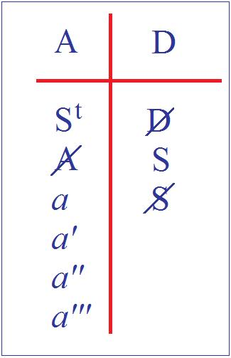

# Leçon 20 | 13 Mai 1959

<!-- source-url: http://staferla.free.fr/S6/S6 LE DESIR.docx -->
<!-- seminar: s6 -->
<!-- lesson: 20 -->

<!-- id: s6-20-0001 -->

Nous parlons du *désir*. Pendant cette interruption d’une quinzaine de jours, j’ai essayé moi-même de recentrer ce chemin qui est le nôtre cette année et qui nous oblige, comme tout chemin, parfois à de longs détours. Dans mon effort de ressaisir l’origine en même temps que la visée de notre propos, je crois avoir essayé de refaire aussi pour vous cette mise au point qui aussi bien n’est qu’une façon de plus de se concentrer dans le progrès de notre attention.

<!-- id: s6-20-0002 -->

Il s’agit en somme, au point où nous en sommes, d’essayer d’articuler où est notre *rendez-vous *:

<!-- id: s6-20-0003 -->

- il n’est pas seulement *le rendez-vous de ce séminaire*,

<!-- id: s6-20-0004 -->

- ni non plus le *rendez-vous* de notre travail quotidien d’analystes,

<!-- id: s6-20-0005 -->

- il est aussi bien *le rendez-vous de notre fonction d’analyste et du sens de l’analyse*.

<!-- id: s6-20-0006 -->

On ne peut qu’être surpris de *la persistance d’un mouvement* tel que l’analyse, s’il était seulement - parmi d’autres dans l’histoire - une entreprise thérapeutique plus ou moins fondée, plus ou moins réussie. Il n’y a pas d’exemple d’aucune théorisation, d’une orthopédie psychique quelconque qui ait eu une carrière plus longue qu’un demi-siècle.

<!-- id: s6-20-0007 -->

Et assurément, on ne peut manquer de sentir que ce qui fait *la durée* de l’analyse, ce qui fait *sa place* au-delà de sa fonction, de son utilisation médicale - que personne en fin de compte ne songe à contester - c’est qu’il y a dans l’analyse quelque chose concernant l’homme de façon tout à fait nouvelle, sérieuse, authentique. Nouvelle dans son apport, sérieuse dans sa portée, authentifiée par quoi ? Sûrement par autre chose que des résultats souvent discutables, parfois précaires.

<!-- id: s6-20-0008 -->

Je crois que ce qui est le plus caractéristique dans le phénomène, c’est ce sentiment qu’on a de cette chose que j’ai appelée une fois *La Chose freudienne*, que c’est une chose dont on parle pour la première fois.

<!-- id: s6-20-0009 -->

J’irai plus loin, jusqu’à dire que ce qui est à la fois le témoignage et *la manifestation la plus certaine* de cette authenticité dont il s’agit *de la Chose*, le témoignage en est donné chaque jour par le formidable verbiage qu’il y a autour. Si vous prenez dans sa masse *la production analytique*, ce qui saisit c’est cet effort des auteurs…

<!-- id: s6-20-0010 -->

qui en fin de compte glisse toujours

<!-- id: s6-20-0011 -->

…à saisir de sa propre activité, *un principe*.

<!-- id: s6-20-0012 -->

Mais ce principe, à l’articuler d’une façon qui, tout au cours de l’analyse, ne se présente jamais comme clos, fermé, accompli, satisfaisant, ce perpétuel mouvement, glissement dialectique, qui est le mouvement et la vie de *la recherche analytique*, est quelque chose qui témoigne de la spécificité du problème autour duquel cette recherche est accrochée.

<!-- id: s6-20-0013 -->

Auprès de cela, tout ce que notre recherche comporte de maladresse, de confusion, de mal assuré même dans ses principes, tout ce que dans sa pratique cela apporte d’équivoque…

<!-- id: s6-20-0014 -->

> j’entends de retrouver toujours non seulement devant soi mais dans sa pratique même, ce qui est justement son principe, ce qu’on voulait éviter, à savoir *la suggestion, la persuasion, la construction, voire la mystagogie*

<!-- id: s6-20-0015 -->

…toutes ces contradictions dans *le mouvement analytique* ne font que mieux accuser la spécificité de *La chose freudienne*.

<!-- id: s6-20-0016 -->

Cette *chose*, nous l’envisageons cette année *par hypothèse*…

<!-- id: s6-20-0017 -->

> soutenus par toute la marche concentrique de notre recherche précédente

<!-- id: s6-20-0018 -->

…sous cette forme, à savoir que *cette chose c’est le désir*. Et en même temps, au moment où nous articulons cette formule, nous nous apercevons d’une sorte de contradiction du fait que tout notre effort semble s’exercer dans le sens de faire perdre à ce désir sa valeur, son accent original, sans pourtant que nous puissions toucher du doigt, voire faire que l’expérience nous montre que c’est bien avec son accent original que nous avons affaire à lui.

<!-- id: s6-20-0019 -->

Le désir n’est pas quelque chose que nous puissions considérer comme réduit, normalisé, fonctionnant à travers les exigences d’une sorte de préformation *organique* qui nous entraînerait à l’avance dans *la voie* et *le chemin* tracé dans lequel nous aurions à le faire rentrer, à le ramener.

<!-- id: s6-20-0020 -->

Le désir, depuis l’origine de l’articulation analytique par FREUD, se présente avec ce caractère :

<!-- id: s6-20-0021 -->

- qu’en anglais *lust* veut bien dire *convoitise* aussi bien que *luxure*, ce même mot qui est dans le *lust principle*.

<!-- id: s6-20-0022 -->

- Et vous savez qu’en allemand, il garde toute l’ambiguïté du « *plaisir* » et du « *désir* ».

<!-- id: s6-20-0023 -->

Ce quelque chose qui se présente d’abord pour l’expérience comme trouble, comme quelque chose qui trouble la perception de l’objet, quelque chose…

<!-- id: s6-20-0024 -->

aussi bien que les malédictions des poètes et des moralistes

<!-- id: s6-20-0025 -->

…qui nous montre, comme aussi bien il le dégrade cet objet, le désordonne, l’avilit, en tout cas l’ébranle, parfois va jusqu’à dissoudre celui-là même qui le perçoit, c’est-à-dire le sujet.

<!-- id: s6-20-0026 -->

Cet accent est certainement *articulé* au principe de la position freudienne pour autant que la mise au premier plan du *Lust*, tel qu’il est *articulé* dans FREUD, nous est présentée d’une façon radicalement *différente* de tout ce qui a été articulé précédemment concernant le principe du désir. Et il nous est présenté dans FREUD comme étant, dans son origine et sa source, opposé au *principe de réalité*. L’accent est conservé, dans FREUD, de l’expérience originale du désir comme étant opposée, contraire, à la construction de la réalité.

<!-- id: s6-20-0027 -->

Le désir est précisé comme marqué, accentué par le caractère aveugle de la recherche qui est la sienne, comme quelque chose qui se présente comme le tourment de l’homme, et qui est effectivement fait d’une contradiction dans la recherche de ce qui jusque-là…

<!-- id: s6-20-0028 -->

> pour tous ceux qui ont tenté d’articuler le sens des voies de l’homme dans sa recherche

<!-- id: s6-20-0029 -->

…de tout ce qui jusque-là, a toujours été articulé au principe comme étant « *la recherche de son bien* » par l’homme.

<!-- id: s6-20-0030 -->

Le *principe du plaisir*, à travers toute *la pensée philosophique* et *moraliste* à travers les siècles, n’est jamais parti dans toute définition originelle par laquelle toute théorie morale de l’homme se propose, s’est toujours affirmé, quelle qu’il soit, comme hédoniste. À savoir que l’homme *recherchait* fondamentalement *son bien*, qu’il le sût ou qu’il ne le sût pas, et qu’aussi bien ce n’était que par une sorte d’*accident* que se trouvait promue l’expérience de cette erreur de son désir, de ses aberrations. C’est dans son principe, et comme fondamentalement contradictoire, que pour la première fois dans une théorie de l’homme, *le plaisir* se trouve articulé avec un accent différent, et dans toute la mesureoù le terme du plaisir dans son signifiant même, dans FREUD, est contaminé de l’accent spécial avec lequel se présente *the lust, la Lust, la convoitise, le désir*.

<!-- id: s6-20-0031 -->

Le désir donc ne s’organise pas, ne se compose pas dans une sorte d’« *accord préformé avec le chant du monde* » comme après tout une idée *harmonique*, optimiste du développement humain pourrait le supposer. L’expérience analytique nous apprend que les choses vont dans un sens différent. Comme vous le savez, comme nous l’avons ici énoncé, elle nous montre quelque chose qui est justement ce qui va nous engager dans une voie d’expérience qui est aussi bien, de par son développement même, quelque chose où nous allons perdre l’accent, l’affirmation de cet instant primordial.

<!-- id: s6-20-0032 -->

C’est à savoir que l’histoire du désir s’organise en un discours qui se développe dans l’insensé - *ceci c’est l’inconscient* - en un discours dont les déplacements, dont les condensations sont sans aucun doute ce que sont déplacements et condensations dans le discours, c’est-à-dire *métonymies* et *métaphores*,

<!-- id: s6-20-0033 -->

- *mais métaphores qui n’engendrent aucun sens*, à la différence de la métaphore,

<!-- id: s6-20-0034 -->

- *déplacements qui ne portent aucun être* et où le sujet ne reconnaît pas quelque chose qui se déplace.

<!-- id: s6-20-0035 -->

C’est autour de l’exploration de ce discours de l’inconscient que l’expérience de l’analyse s’est développée, c’est donc autour de quelque chose dont la dimension radicale, nous pouvons l’appeler *la diachronie du discours*. Ce qui fait l’essence de notre recherche, ce où se situe ce que nous essayons de ressaisir quant à ce qu’il en est de ce désir, c’est notre effort pour *le situer dans la synchronie*.

<!-- id: s6-20-0036 -->

Nous sommes introduits à ceci par *quelque chose qui se fait entendre* chaque fois que nous abordons notre expérience. Nous ne pouvons pas ne pas voir, ne pas saisir…

<!-- id: s6-20-0037 -->

> que nous lisions le compte-rendu, le *text book* de *l’expérience la plus originelle de l’analyse*, à savoir *L’Interprétation des rêves* de FREUD, ou que nous nous rapportions à une séance quelconque, une suite d’interprétations

<!-- id: s6-20-0038 -->

…le caractère de renvoi indéfini qu’a tout exercice d’interprétation, qui ne nous présente jamais *le désir* que sous une forme articulée, mais qui suppose au principe quelque chose qui nécessite ce mécanisme de *renvoi de vœu en vœu* où le mouvement du sujet s’inscrit, et aussi bien cette distance où il se trouve de ses propres vœux.

<!-- id: s6-20-0039 -->

C’est pourquoi il nous semble qu’il peut légitimement se formuler comme un espoir, la référence à *la structure* \- référence linguistique comme telle - en tant qu’elle nous *rappelle* qu’*il ne saurait y avoir formation symbolique si à côté*…

<!-- id: s6-20-0040 -->

> et principiellement, primordialement à tout exercice de la parole qui s’appelle discours

<!-- id: s6-20-0041 -->

…*il n’y a nécessairement un synchronisme, une structure du langage comme système synchronique*.

<!-- id: s6-20-0042 -->

C’est là que nous cherchons à repérer quelle est la fonction du désir. Où *le désir* se situe-t-il dans ce rapport qui fait que ce *quelque chose* d’X désormais, que nous appelons « *l’homme* » dans la mesure où il est le sujet du λόγος \[logos\], où il se constitue dans le signifiant comme sujet ? Où se situe dans ce rapport comme *synchronique*, le *désir* ?

<!-- id: s6-20-0043 -->

Ce qui - je pense - vous fera sentir la nécessité primordiale de cette reprise, c’est ce quelque chose où nous voyons la recherche analytique - en tant qu’elle méconnaît cette organisation structurale - s’engager.

<!-- id: s6-20-0044 -->

En effet au moment même où j’articulais plus tôt la fonction contraire, instaurée à l’origine, principiellement, par l’expérience freudienne entre *principe du plaisir* et *principe de réalité*, vous ne pouviez pas en même temps vous apercevoir que nous en sommes justement au point où la théorie essaye de *s’articuler*, justement dans les termes mêmes où je disais que nous pouvions dire que *le désir*, là ne se *compose* pas.

<!-- id: s6-20-0045 -->

Il se compose pourtant dans l’appétit qu’ont les auteurs de le penser, de le sentir d’une certaine façon, dans ce certain « *accord avec le chant du monde* ». Tout est fait pour essayer de déduire d’une convergence de l’expérience avec une *maturation* ce qui est au moins à souhaiter comme un *développement achevé*.

<!-- id: s6-20-0046 -->

Et en même temps, il est bien clair que tout ceci voudrait dire que les auteurs ont abandonné eux-mêmes tout contact avec leur expérience, s’ils pouvaient effectivement articuler la théorie analytique dans ces termes, c’est-à-dire trouver quoi que ce soit de satisfaisant, de classique, à l’adaptation ontologique du sujet à son expérience.

<!-- id: s6-20-0047 -->

*Le paradoxe est le suivant*, c’est que plus on va dans le sens de cette exigence à laquelle on va par toutes sortes d*’erreurs*...

<!-- id: s6-20-0048 -->

> il faut bien le dire *d’erreurs révélatrices, révélatrices justement qu’il faudrait essayer d’articuler les choses autrement*

<!-- id: s6-20-0049 -->

…plus on va dans le sens de cette expérience, plus on arrive à *des paradoxes comme le suivant*. Je prends un exemple.

<!-- id: s6-20-0050 -->

Et je le prends chez *un des meilleurs auteurs* qui soit, chez *un des plus soucieux* précisément d’une articulation juste, non seulement de notre expérience mais aussi bien de la somme de ses données, dans un effort aussi pour recenser nos *termes*, les *notions* dont nous nous servons, les *concepts*, j’ai nommé Edward GLOVER dont l’œuvre est assurément une des plus utiles pour quiconque veut essayer…

<!-- id: s6-20-0051 -->

> d’abord dans l’analyse, cela est absolument indispensable, plus qu’ailleurs

<!-- id: s6-20-0052 -->

…de savoir ce qu’il a fait, et aussi bien dont la somme d’expériences qu’il inclut dans ses écrits.

<!-- id: s6-20-0053 -->

Je prends un exemple d’un des nombreux articles qu’il faut que vous lisiez, celui qui est paru dans le *International Journal of Psycho-analysis, d’Octobre* 1933*, part* 4* *: « *De la relation de la formation perverse au développement du sens de la réalité* »[^98]. Beaucoup de choses sont importantes à discuter dans cet article, ne seraient­ce que les termes de départ qu’il nous donne dans le dessein de *manier* correctement ce qu’il s’agit pour lui de nous montrer, nommément :

<!-- id: s6-20-0054 -->

- La définition du « *Sens de la réalité comme étant cette faculté dont nous inférons l’existence dans l’examen de l’épreuve de la réalité.* » Il y a grand intérêt à ce que les choses soient formulées quelques fois.

<!-- id: s6-20-0055 -->

- Deuxièmement, ce qu’il appelle « *L’épreuve efficiente de la réalité, pour tout sujet ayant passé l’âge de la puberté, c’est la capacité de conserver le contact psychique avec les objets qui permettent la gratification de l’instinct, incluant aussi bien ici les pulsions infantiles modifiées résiduelles.* »

<!-- id: s6-20-0056 -->

- Troisièmement, « *L’objectivité est la capacité d’asseoir correctement la relation de la pulsion instinctuelle à l’objet instinctuel, quels que soient les buts de cette impulsion, c’est à savoir qu’ils puissent être ou non gratifiés.* »

<!-- id: s6-20-0057 -->

Voilà des données de principe qui sont *fort importantes* et qui, assurément, ne peuvent manquer de vous frapper comme donnant au terme d’*objectivité* en tout cas un caractère qui n’est plus celui qui lui est habituellement dévolu.

<!-- id: s6-20-0058 -->

Sa nature va nous donner l’idée qu’en effet quelque chose n’est pas perdu de la dimension originale de la recherche freudienne, puisque quelque chose peut être bouleversé de ce qui, justement jusque-là, nous paraissait être les catégories et les ordres nécessités par notre vue du monde. On ne peut d’autant plus qu’être frappé de ce que comporte notre enquête avec un tel départ. Elle comporte en l’occasion une recherche de ce que signifie la relation perverse, ceci étant entendu au sens le plus large, par rapport au « *sens de la réalité* ».

<!-- id: s6-20-0059 -->

Je vous le dis, l’esprit de l’article comporte que la formation perverse est conçue par l’auteur comme étant en fin de compte un moyen pour le sujet de parer aux déchirures, aux choses qui font « *flop* », aux choses qui ne se disent pas pour lui dans une réalité cohérente. La *perversion* est très précisément articulée par l’auteur comme « *le moyen de salut pour le sujet d’assurer à cette réalité une existence continue.* » Assurément voici encore une vue originale, je vous passe ceci, ce qu’il résulte de cette forme d’articulation une sorte d’omniprésence de la fonction perverse.

<!-- id: s6-20-0060 -->

Car aussi bien, faisant l’épreuve d’en retracer si l’on peut dire les insertions chronologiques, je veux dire par exemple où il convient de la placer dans un système d’antériorité et de postérité où nous verrions s’étager comme plus primitifs les troubles psychotiques, ensuite les troubles névrotiques et, dans l’intermédiaire, le rôle que joue dans le système de GLOVER la toxicomanie pour autant qu’il en fait quelque chose qui répond à une étape intermédiaire, chronologiquement parlant, entre les points d’attache, les points féconds historiquement, les points dans le développement où remonte l’origine de ces diverses affections. Nous ne pouvons pas ici entrer dans un détail de la critique de cette vue qui n’est pas sans être critiquable, comme chaque fois qu’on essaye un pur et simple repérage génétique des affections analysables.

<!-- id: s6-20-0061 -->

Mais de tout cela je veux détacher un paragraphe qui vous montre à quel point de paradoxe on est amené par toute tentative qui, en quelque sorte, part d’un principe de réduire la fonction à laquelle nous avons affaire au niveau du désir, au niveau du principe du désir, à quelque chose comme à une étape *préliminaire*, préparatoire, non encore informée, de l’adaptation à la réalité, à une première forme du rapport à la réalité comme telle.

<!-- id: s6-20-0062 -->

Car c’est en partant de ce principe de classer la formation perverse par rapport au sens de la réalité que GLOVER, ici comme ailleurs, développe sa pensée. Ce que ceci comporte je vous l’indiquerai simplement par ceci, que vous reconnaîtrez par ailleurs dans mille autres récits, qui ici prend son intérêt de se présenter sous une forme en quelque sorte imagée, littéraire, paradoxale et véritablement expressive. Vous y reconnaîtrez quelque chose qui n’est rien d’autre que, vraiment, la période qu’on peut appeler kleinienne de la pensée de GLOVER.

<!-- id: s6-20-0063 -->

Aussi bien cette période n’est pas tellement une période de la lutte qu’il a cru devoir mener sur le plan théorique avec Mélanie KLEIN, sur beaucoup de points on peut dire qu’*une telle pensée a beaucoup de points communs avec celui du système kleinien*. Il s’agit de la période qui, dit-il, se présente au moment où la phase dite *paranoïde* du sujet se trouve aboutir à ce « *système de réalité* » qu’il appelle « *oral-anal* », et qui serait celui que l’enfant se trouverait vivre à cette époque.

<!-- id: s6-20-0064 -->

Il le caractérise comme : « *le monde extérieur qui représenterait la combinaison d’une boutique de boucher, d’un public lavatory* \- autrement dit d’un urinoir ou quelque chose même de plus élaboré - *sous un bombardement, et d’une post mortem room, d’une morgue.* » \[...*the external world has represented a combination of a butcher’s shop, a public lavatory under shell-fire, and a post mortem room*. (p. 492)\]

<!-- id: s6-20-0065 -->

Il explique que l’issue particulière que donne ce qui est le pivot et le point central de son intention à ce moment-là, transforme ce monde, comme vous le voyez en effet, plutôt bouleversé, catastrophique : « *en une rassurante et fascinante boutique de pharmacien dans laquelle pourtant il y a cette réserve, c’est que l’armoire où se trouvent les poisons a la clef dessus.* »[^99] \[*And the drug addict converts this into a more reassuring and fascinating chemist’s shop, in wich, however, the poison cupboard is left unlocked*. (p. 492)\]

<!-- id: s6-20-0066 -->

Ceci qui est fort joli et fort pittoresque, et de nature à suggérer qu’il y a tout de même quelque difficulté à concevoir qu’effectivement l’abord de la réalité est quelque chose que nous devons voir dans un vécu si profond, si immergé, si implicite, que nous le supposons comme devant être pour le petit homme, celui d’une boutique de boucher, d’un cabinet de nécessité public sous un bombardement et d’une chambre froide.

<!-- id: s6-20-0067 -->

Il y a là assurément quelque chose, dont ce n’est pas une raison parce que cela se présente sous un aspect d’abord heurtant pour que nous en repoussions le principe, mais qui peut en même temps nous faire légitimement émettre quelque doute sur l’exactitude de cette formulation, qui d’une façon certaine, manifeste, ne saurait recouper une forme régulière du développement du petit homme, que l’on considérerait comme caractérisé par les modes d’adaptations du sujet à la réalité.

<!-- id: s6-20-0068 -->

Nécessairement, une telle formulation implique à tout le moins l’articulation d’une double réalité :

<!-- id: s6-20-0069 -->

- de celle dans laquelle pourrait s’inscrire l’expérience behaviouriste,

<!-- id: s6-20-0070 -->

- et d’une autre dans laquelle nous serons obligés, réduits, à surveiller les éruptions dans le *comportement* du sujet, c’est-à-dire effectivement, à restaurer dès l’origine quelque chose qui implique l’autonomie, l’originalité d’une autre dimension qui n’est pas *la réalité primitive*, mais qui est dès le départ un au-delà du vécu du sujet.

<!-- id: s6-20-0071 -->

Je vais peut–être avoir à m’excuser d’aussi longtemps appuyer sur une contradiction…

<!-- id: s6-20-0072 -->

> qui après tout, une fois qu’elle est articulée, devient si évidente

<!-- id: s6-20-0073 -->

…mais nous ne pouvons pas non plus ne pas nous apercevoir de ce que comporte le fait que dans certaines formulations, elle soit masquée. En effet, nous aboutissons à quelque chose qui comporte à l’endroit du terme de réalité une grave équivoque. Si la réalité est considérée comme ayant pour nous quoi que ce soit qui permette de l’accorder à un développement parallèle à celui des instincts - et c’est bien là la vérité la plus communément reçue - nous aboutissons à d’étranges paradoxes, qui eux ne manquent pas d’avoir des *retentissements dans la pratique*.

<!-- id: s6-20-0074 -->

Si le désir est là, il est justement nécessaire de le parler sous sa forme originelle, et non pas sous sa forme masquée, à savoir *l’instinct*, de ce dont il s’agit dans l’évolution, de ce à quoi nous avons affaire dans notre expérience analytique. Si ce désir s’inscrit dans un ordre homogène, en tant qu’il est entièrement articulable et assumable en termes de *réalité*, s’il est du même *ordre de la réalité*, alors en effet, on conçoit ce paradoxe impliqué dans des formulations qui tiennent de l’expérience analytique la plus quotidienne. C’est que le désir ainsi situé comporte que ce soit sa maturation qui permette au monde de s’achever dans son objectivité. Ceci fait à peu près partie du *credo* d’une certaine analyse.

<!-- id: s6-20-0075 -->

Je veux simplement ici poser la question de ce que ceci veut dire concrètement.

<!-- id: s6-20-0076 -->

Qu’est-ce qu’un monde, pour nous vivants ? Qu’est-ce que la réalité au sens où, par exemple, la psychanalyse hartmanienne, celle qui donne toute la part qu’ils méritent aux éléments structurants que comporte l’organisation du *moi*, en tant que le *moi* est adapté à se déplacer d’une façon efficace dans la réalité constituée, dans un monde qui est à peu près identique pour l’instant à un champ tout au moins important de notre univers.

<!-- id: s6-20-0077 -->

Ceci veut dire que la forme la plus typique de ce monde, la plus achevée…

<!-- id: s6-20-0078 -->

> je voudrais moi aussi me permettre de donner des *images* qui vous fassent sentir ce dont nous parlons

<!-- id: s6-20-0079 -->

…la réalité adulte, nous l’identifierons, pour fixer les idées, à « *un monde d’avocats américains* » ! Le « *monde d’avocats américains* » me paraît actuellement le monde le plus élaboré, le plus poussé qu’on puisse définir concernant le rapport avec ce que, dans un certain sens, il faut s’entendre appeler la réalité.

<!-- id: s6-20-0080 -->

À savoir que rien n’y manque d’un éventail qui part d’un certain rapport fondamental de *violence essentielle*, marquée, toujours présente pour que la réalité soit là quelque chose que nous puissions dire n’être nulle part élidée, et qui s’étend jusqu’à ces raffinements de procédure qui permettent, dans ce monde, d’insérer toutes sortes de paradoxes, de nouveautés qui sont essentiellement définis par un rapport à la loi étant essentiellement constitué par les détours nécessaires à obtenir sa violation la plus parfaite. Voilà le monde de la réalité.

<!-- id: s6-20-0081 -->

Quel rapport y a-t-il entre ce monde et ce qu’on peut appeler un désir mûr, un désir mûr au sens où nous l’entendons, à savoir *maturation génitale*, qu’est-ce ? La question assurément peut être tranchée de plusieurs manières dont l’une qui est celle de l’expérience, à savoir le comportement sexuel de « *l’avocat américain* ».

<!-- id: s6-20-0082 -->

Rien ne semble, jusqu’à ce jour, confirmer qu’il y a un rapport, une corrélation exacte entre l’achèvement parfait d’un monde aussi bien tenu en mains dans l’ordre de toutes les activités, et une parfaite harmonie dans les rapports avec l’autre, pour autant que ceux–ci comportent une réussite sur le plan de ce qu’on appelle l’accord de l’amour. Rien ne le prouve, et presque personne même ne songera à le soutenir, ceci aussi bien n’est après tout qu’une façon globale, illustrative, de montrer où se pose la question.

<!-- id: s6-20-0083 -->

La question se pose en ceci qu’une confusion est maintenue à ce niveau à propos du terme « objet », entre la réalité au sens où nous venons de l’articuler, où il se situerait, et le rapport du *sujet* à l’*objet*, pour autant qu’il implique connaissance, d’une façon latente. Dans l’idée que la maturation du désir est quelque chose qui comporte du même coup une maturation de l’objet, il s’agit d’un bien autre objet que celui que nous pouvons effectivement situer là. Un repérage objectif nous permet de caractériser les rapports de réalité.

<!-- id: s6-20-0084 -->

Cet objet dont il s’agit nous le connaissons depuis longtemps, encore qu’il soit là tout à fait masqué, voilé, il est cet objet qui s’appelle « *l’objet de la connaissance* ». L’objet qui est le but, la visée, le terme d’une longue recherche au cours des âges, celle qui est là, derrière les fruits qu’elle a obtenus au terme de ce que nous appelons la science, mais qui pendant longtemps dût traverser les voies d’un enracinement, d’un certain rapport du sujet au monde. Enracinement - je l’entends sur le plan philosophique - de quelque chose dont nous ne pouvons pas nier que ce soit sur son terrain que *la science* ait pu prendre à un moment son départ, originellement.

<!-- id: s6-20-0085 -->

Et c’est justement ce qui maintenant la distingue…

<!-- id: s6-20-0086 -->

> comme un enfant qui prend son indépendance, mais qui pendant longtemps en était nourri

<!-- id: s6-20-0087 -->

…de ce rapport de méditation dont il nous reste des traces sous le nom de « *théorie de la connaissance* », et qui, dans cet ordre, s’est approché aussi loin qu’il se peut de ce terme, de cette pensée d’un rapport de l’objet au sujet par quoi « *connaître* » comporte une profonde identification, le rapport à une *connaturalité* par quoi toute prise de l’objet manifeste quelque chose d’une harmonie principielle.

<!-- id: s6-20-0088 -->

Mais ceci, ne l’oublions pas, n’est que le fait d’une expérience spécialisée, historiquement définissable en plusieurs rameaux. Mais nous nous contenterons de nous reporter l’esprit, en l’articulant, sur ce rameau qui est le nôtre, qui est celui de la philosophie grecque. Cet effort d’assertion, de cernage de ce quelque chose qui s’appelle *objet*, comporte une attitude principielle dont on aurait tout à fait tort de considérer que nous pouvons maintenant, une fois les résultats obtenus, l’élider, comme si sa position de principe était sur son effet sans importance.

<!-- id: s6-20-0089 -->

Assurément nous autres analystes sommes capables d’introduire la question de ce qui,dans cet effort de la connaissance, était impliqué d’une position de désir. Nous ne ferons - aussi bien ici qu’ailleurs - que retrouver quelque chose qui n’est pas passé inaperçu à l’expérience religieuse qui, pour autant qu’elle peut s’indiquer à elle-même d’autres fins, a *individualisé* ce désir comme « *désir de savoir* » : *cupido sciendi*.

<!-- id: s6-20-0090 -->

Que nous lui trouvions des assises plus radicales sous la forme de *quelque pulsion* ambivalente du type de la *scoptophilie*, voire même de *l’incorporation orale*, c’est là question où nous ne faisons qu’ajouter notre touche, mais il y a une chose certaine c’est qu’en tout cas tout *ce développement de la connaissance*, avec ce qu’elle comporte comme portant ces notions implicites de la fonction de l’objet, *est le fait d’un choix*. Toute instauration, *toute introduction à la position philosophique* n’a jamais été, au cours des âges, sans se faire reconnaître comme étant une position de *sacrifice de quelque chose*.

<!-- id: s6-20-0091 -->

C’est pour autant que le sujet entre dans l’ordre de ce qu’on appelle la recherche désintéressée - après tout son fruit, *l’objectivité*, ne s’est jamais défini autrement que comme *l’atteinte d’une certaine réalité dans une perspective désintéressée* - dans l’exclusion au moins de principe d’une certaine forme de désir, c’est dans cette perspective que s’est constituée la notion de l’objet que nous réintroduisons :

<!-- id: s6-20-0092 -->

- parce que nous savons ce que nous faisons,

<!-- id: s6-20-0093 -->

- parce qu’elle est implicite à ce que nous faisons quand nous la réintroduisons, quand nous *supposons* qu’à toute notre *investigation du désir* nous pouvons - *comme virtuelle, comme latente, comme à retrouver, comme à obtenir* - mettre une correspondance de l’objet, comme objet naturellement de ce que nous avons exploré dans la perspective du désir.

<!-- id: s6-20-0094 -->

C’est par une confusion donc entre :

<!-- id: s6-20-0095 -->

- la notion de *l’objet* telle qu’elle a été le fruit de l’élaboration des siècles dans la recherche philosophique, *l’objet satisfaisant le désir de la connaissance*

<!-- id: s6-20-0096 -->

- avec ce que nous pouvons attendre de *l’objet de tout désir*,

<!-- id: s6-20-0097 -->

…que nous nous trouvons amenés à poser aussi *facilement* *la correspondance* d’une certaine constitution de l’objet avec une certaine maturation de la pulsion.

<!-- id: s6-20-0098 -->

C’est m’opposant à cela que j’essaie pour vous d’articuler autrement, et d’une façon que je prétends plus conforme à notre expérience, à savoir de vous permettre de saisir à chaque instant quelle est la véritable articulation entre *le désir et* ce qu’on appelle à l’occasion *son objet*. C’est cela que j’appelle l’articulation synchronique - que j’essaye d’introduire auprès de vous - du rapport du désir à son objet. C’est la forme vraie de la prétendue relation d’objet telle qu’elle est jusqu’ici pour vous articulée. La formule symbolique S**◊***a*, pour autant qu’elle est celle qui vous permet de donner sa forme à ce que j’appelle le fantasme – je l’appelle ici *fondamental* – cela ne veut rien dire d’autre, si ce n’est dans la perspective synchronique qui assure la structure minima à ce qui doit être le support du désir. Dans cette structure minima, deux termes dont la relation l’un à l’autre constitue le fantasme lui-même, complexe pour autant que *c’est dans un rapport tiers avec ce fantasme que le sujet se constitue comme désir.*

<!-- id: s6-20-0099 -->

Nous prenons aujourd’hui la perspective tierce de ce fantasme en faisant passer l’assomption du sujet par *a*, ce qui est tout aussi légitime que de le faire passer par S, étant donné que c’est dans le rapport de confrontation : S**◊***a* que se tient *le désir*. Vous m’avez déjà entendu articuler les choses assez loin pour n’être point, je pense, étonnés, déroutés ni surpris, si j’avance que *l’objet(a) se définit d’abord comme le support que le sujet se donne pour autant qu’il défaille.*

<!-- id: s6-20-0100 -->

Ici, arrêtons-nous un instant. Commençons par dire quelque chose d’approximatif pour que cela vous parle, au sens, si je puis dire « *qu’il défaille dans sa certitude de sujet* ». Et puis je me reprendrai pour le dire sous un autre terme…

<!-- id: s6-20-0101 -->

> parlant trop peu à l’intuition pour que je n’ai pas craint de l’amener pour vous d’abord

<!-- id: s6-20-0102 -->

…qui est pourtant le terme exact : pour autant « *qu’il défaille dans sa désignation de sujet* ». Car ce dont il s’agit repose tout entier sur ce qui se passe pour autant - vous ai-je dit - que le sujet a comme tel, ce désir dans l’Autre.

<!-- id: s6-20-0103 -->

C’est pour autant que dans l’Autre, *dans ce discours de l’Autre qu’est l’inconscient* , quelque chose fait défaut au sujet…

<!-- id: s6-20-0104 -->

*nous y reviendrons tout à l’heure, nous y reviendrons autant de fois qu’il faudra, nous y reviendrons jusqu’à la fin*

<!-- id: s6-20-0105 -->

…c’est pour autant que quelque chose, de par la structure même qu’instaure le rapport du sujet à l’Autre en tant que lieu de la parole, quelque chose au niveau de l’Autre fait défaut, qui permet au sujet de s’y identifier comme précisément le sujet de ce discours qu’il tient, ce quelque chose qui fait :

<!-- id: s6-20-0106 -->

- que le sujet y disparaît comme tel en tant que ce discours est le discours de l’inconscient,

<!-- id: s6-20-0107 -->

- que le sujet emploie à cette désignation quelque chose qui est pris à ses dépens… à ses dépens non pas de sujet constitué dans la parole, mais de sujet réel, bel et bien vivant …c’est-à-dire de quelque chose qui à soi tout seul n’est pas du tout un sujet,

<!-- id: s6-20-0108 -->

- que le sujet payant le prix nécessaire à ce repérage de lui–même en tant que défaillant est introduit à cette dimension toujours présente chaque fois qu’il s’agit du désir, à savoir d’avoir à payer la castration.

<!-- id: s6-20-0109 -->

*C’est-à-dire que quelque chose de <u>réel</u>, sur lequel il a prise dans un rapport <u>imaginaire</u>, est porté à la pure et simple fonction de <u>signifiant</u>*. C’est le sens dernier, c’est le sens le plus profond de *la castration* comme telle. Le fait que *la castration* soit intéressée dès que se manifeste d’une façon claire le désir comme tel :

<!-- id: s6-20-0110 -->

- c’est là la découverte essentielle du freudisme,

<!-- id: s6-20-0111 -->

- c’est la chose qui était jusque-là méconnue,

<!-- id: s6-20-0112 -->

- c’est la chose qui a permis de nous donner toutes sortes *de vues et d’aperçus historiques* auxquels on a donné *des traductions diversement mythiques*, lesquelles, elles-mêmes, *on a essayé ensuite de réduire en termes développementaux*.

<!-- id: s6-20-0113 -->

La *fécondité* dans cette dimension n’a pas été douteuse. Elle ne doit pas nous dispenser de rechercher dans l’autre dimension que celle-là : diachronique, c’est-à-dire dans la dimension synchronique, quel est ici le rapport essentiel qui est intéressé. Le rapport qui est intéressé est celui-ci, à savoir que le sujet payant - j’essaye là d’être le plus imagé possible, ce ne sont pas toujours les termes les plus rigoureux que j’amène - payant de sa personne, doive suppléer à ce rapport qui est rapport du sujet au signifiant, où il ne peut se désigner, où il ne peut se nommer comme sujet. Il intervient par ceci dont nous pouvons trouver l’analogue dans la fonction de certains *symboles* du langage, pour autant que les linguistes les distinguent sous le terme de *shifter symbols* nommément. J’y ai fait allusion, au pronom personnel, pour autant que la notion *symbolique*, dans le système lexical, fait qu’il est quelque chose qui désigne celui qui parle quand c’est le « *je* ». De même sur le plan de l’inconscient - qui lui n’est pas un *symbole*, qui est un élément réel du sujet - *(a) est ce qui intervient pour supporter ce moment, au sens synchronique, où le sujet défaille* *pour se désigner au niveau d’une instance qui, justement, est celle du désir*.

<!-- id: s6-20-0114 -->

Je sais ce que peut avoir de fatigant pour vous *la gymnastique mentale* d’une articulation portée à ce niveau. Aussi bien n’illustrerai-je, pour vous donner quelque relâche, que certains termes qui sont ceux de notre expérience concrète. Le *(a)*, j’ai dit que c’était l’effet de la castration. Je n’ai pas dit que c’était l’objet de la castration. Cet objet de la castration nous l’appelons *le phallus*. Le *phallus* qu’est-ce que c’est ?

<!-- id: s6-20-0115 -->

Il faut reconnaître que dans notre expérience, quand nous le voyons apparaître dans *les phallophanies* - comme je le disais la dernière fois - *artificielles de l’analyse : c’est là aussi que l’analyse s’avère comme ayant été une expérience absolument unique, originale* : dans aucune espèce d’alchimie - thérapeutique ou non - du passé nous ne l’avions vu apparaître. Dans Jérôme BOSCH nous voyons des tas de choses, toutes sortes de membres disloqués, nous voyons le *flatus* dont M. JONES a cru devoir retrouver plus tard le prototype de celui \[...\], et vous savez que c’est rien moins qu’un *flatus* odorant. Nous trouvons tout cela étalé sur des images tout ce qu’il y a de plus manifestes, le *phallus* vous pouvez remarquer qu’on ne le voit pas souvent !

<!-- id: s6-20-0116 -->

Nous, nous le voyons. Nous le voyons et nous apercevons aussi qu’il n’est pas non plus très facile à désigner comme étant ici ou là. Je ne veux faire là-dessus qu’une référence, celle par exemple à notre expérience de l’homosexualité. Notre expérience de l’homosexualité s’est définie à partir du moment où l’on a commencé d’analyser *les homosexuels*. Dans un premier abord on ne les analysait pas. Le Professeur FREUD nous dit, dans les *Trois essais sur la sexualité*, que l’homosexualité masculine - il ne peut pas, à ce moment-là, avancer plus loin - se manifeste par cette exigence narcissique que l’objet ne saurait être dépourvu de cet attribut considéré par le sujet comme essentiel. Nous commençons d’analyser les homosexuels. Je vous prie de vous reporter à ce moment-là aux travaux de BŒHM tels qu’ils ont commencé, vers les années 29 jusqu’à 33 et au-delà, à s’ordonner. Il a été un des premiers. Je vous signale cela parce que c’est très exemplaire. D’ailleurs j’ai indiqué la bibliographie de l’homosexualité quand je vous ai parlé de l’importance des articles de \[...\].

<!-- id: s6-20-0117 -->

Le développement de l’analyse nous montre que l’homosexualité est bien loin d’être *une exigence instinctuelle primordiale*. Je veux dire identifiable avec une pure et simple fixation ou déviation de l’instinct. Nous allons trouver dans un second stade que le *phallus*, de quelque façon qu’il intervienne dans le mécanisme de l’homosexualité, est bien loin d’être celui de l’objet, que le *phallus* dont il s’agit est un *phallus* qu’on identifie peut-être hâtivement au *phallus* paternel pour autant que ce *phallus* se trouve *dans le vagin de la femme*. Et c’est parce que c’est là qu’il est, là qu’il est redouté, que le sujet se trouve porté jusqu’aux extrêmes, et à l’homosexualité.

<!-- id: s6-20-0118 -->

Voilà donc un *phallus* d’une toute autre portée, d’une toute autre fonction, et d’une toute autre place que ce que nous avions vu tout d’abord. Ce n’est pas tout. Après nous être réjouis, si je puis dire, de *tenir ce lièvre par les oreilles*, voici que nous poursuivons les analyses des homosexuels, et que nous nous apercevons qu’au fond…

<!-- id: s6-20-0119 -->

> c’est là que je me rapporte plus spécialement aux travaux de BŒHM
>
> particulièrement *illustratifs* et confirmés par une expérience très abondante

<!-- id: s6-20-0120 -->

…l’image que nous rencontrons à une date ultérieure, dans des structurations *analytiques* de l’homosexualité, est une image qui, pour se présenter comme l’appendice…

<!-- id: s6-20-0121 -->

> nous l’attribuons dans une première croyance à la femme pour autant qu’elle ne serait pas encore châtrée

<!-- id: s6-20-0122 -->

…se montre, à être serrée plus dans les détails, comme quelque chose qui est ce qu’on peut appeler l’*évagination*, l’*extraposition* de l’intérieur de cet organe.

<!-- id: s6-20-0123 -->

Que ce *fantasme*, que justement nous avons rencontré dans le rêve et que j’ai si longuement analysé pour vous, dont j’ai si longuement repris l’analyse devant vous, ce rêve de ce chaperon retourné, d’*appendice* fait de quelque chose qui est en quelque sorte l’*extériorisation* de l’intérieur, c’est là quelque chose qui, dans une certaine perspective d’investigation, s’avère comme le terme imaginaire dernier auquel l’homosexuel dont il s’agit en l’occasion…

<!-- id: s6-20-0124 -->

et il y en a plusieurs analysés par BŒHM

<!-- id: s6-20-0125 -->

…se trouve confronté lorsqu’il s’agit de lui montrer la dialectique quotidienne de son désir.

<!-- id: s6-20-0126 -->

Qu’est-ce à dire si ce n’est qu’ici *le phallus se présente bien sous une forme radicale* où il est quelque chose, pour autant :

<!-- id: s6-20-0127 -->

- que ce quelque chose est à montrer à l’extérieur ce qui est à l’intérieur imaginaire du sujet,

<!-- id: s6-20-0128 -->

- que dans le dernier terme il n’y a presque pas à se surprendre qu’une certaine convergence s’établisse entre la fonction imaginaire de ce qui est ici - dans l’imaginaire - en posture d’extraposition, d’extirpation, presque détaché, mais non encore détaché de l’intérieur du corps, ce qui se trouve le plus naturellement pouvoir être porté à la fonction de symbole, sans pour autant être détaché de son insertion radicale, de ce qui le fait ressentir comme une menace à l’intégrité de l’image de soi.

<!-- id: s6-20-0129 -->

Cet aperçu étant donné, je ne veux pas vous laisser là, car ce n’est pas cela qui va vous donner le sens et la fonction de *(a)* en tant qu’objet dans toute sa généralité. Je vous ai dit, *l’objet dans le fantasme*…

<!-- id: s6-20-0130 -->

> c’est-à-dire dans sa forme la plus achevée pour autant que le sujet est désir,
>
> que le sujet est donc en imminence de ce rapport castratif

<!-- id: s6-20-0131 -->

…*l’objet est ce qui donne à cette position son support*. Ici je voudrais vous montrer dans quelle *synchronie* ceci peut s’articuler. Je souligne *synchronie*, car aussi bien, la nécessité du discours va forcément vous en donner une formule qui, elle, sera *diachronique*. C’est-à-dire que vous allez pouvoir confondre ce que je vais vous donner ici avec une genèse.

<!-- id: s6-20-0132 -->

Il ne s’agit pourtant de rien de tel. Ce que je veux vous indiquer par les rapports de lettres que je vais maintenant inscrire au tableau, c’est quelque chose qui nous permet de situer à sa place cet acquis et cet objet dans son rapport au sujet comme en présence de la castration imminente, dans un rapport que provisoirement j’appellerai rapport de rançon de cette position, puisque aussi bien il me faut accentuer ce que je veux dire en parlant de rapport de support.

<!-- id: s6-20-0133 -->

Comment ce rapport synchronique s’engendre-t-il ? Il est le suivant. Si nous partons de la position subjective la plus originelle, celle de la demande…

<!-- id: s6-20-0134 -->

> telle que nous la trouvons, au niveau du schéma, illustrée

<!-- id: s6-20-0135 -->

…comme l’illustration, l’exemple manifestable dans le comportement qui nous permet de saisir dans son essence comment le sujet se constitue en tant qu’il entre dans le signifiant, le rapport est le suivant : il va s’établir dans le très simple algorithme qui est celui de la division.

<!-- id: s6-20-0136 -->

<!-- id: s6-20-0137 -->

Il est essentiellement constitué par cette barre verticale, la barre horizontale étant en l’occasion adjointe mais n’ayant rien d’essentiel puisqu’on peut la répéter à chaque niveau.

<!-- id: s6-20-0138 -->

Disons que c’est pour autant qu’est introduit par le rapport le plus primordial du sujet, le rapport de l’Autre…

<!-- id: s6-20-0139 -->

en tant que lieu de la parole

<!-- id: s6-20-0140 -->

…à la demande, que la dialectique s’institue, dont *le résidu* \[*le reste*\] va nous apporter *la position de (a)*, *l’objet*. Je vous l’ai dit, par le fait que c’est en termes d’alternative signifiante que *s’articule primordialement*…

<!-- id: s6-20-0141 -->

au départ du processus qui est celui-là, ce qui nous intéresse

<!-- id: s6-20-0142 -->

…que s’articule primordialement le besoin du sujet, que s’instaure tout ce qui dans la suite va structurer ce rapport du sujet à lui-même qui s’appelle le désir.

<!-- id: s6-20-0143 -->

L’Autre, pour autant qu’il est ici quelqu’un de réel mais qui est interpellé dans la demande, se trouve en posture de faire passer cette demande quelle qu’elle soit à une autre valeur qui est celle de *la demande d’amour* comme telle, en tant qu’elle se réfère purement et simplement à l’alternative *présence­absence*. Et je n’ai pu manquer d’être *surpris, touché*, voire *ému*, de retrouver dans les *Sonnets* de SHAKESPEARE, littéralement ce terme « *présence-absence* », au moment où il s’agit pour lui d’exprimer la relation de l’amour, avec un tiret.

<!-- id: s6-20-0144 -->

Voici donc le sujet constitué en tant que l’Autre est un personnage réel, comme étant celui par lequel la demande elle-même est chargée de signification, comme étant celui par qui la demande du sujet devient autre chose que ce qu’elle demande nommément, à savoir la satisfaction d’un besoin.

<!-- id: s6-20-0145 -->

*Il n’y a* - c’est un principe que nous avons à maintenir comme principe de toujours - *de sujet que pour un sujet *:

<!-- id: s6-20-0146 -->

- c’est en tant que l’Autre a été posé primordialement comme celui qui, en présence de *la demande*, peut ou ne peut pas jouer un certain jeu,

<!-- id: s6-20-0147 -->

- c’est en tant que déjà, comme terme d’une tragédie, l’Autre est instauré comme sujet.

<!-- id: s6-20-0148 -->

Dès lors, c’est à partir de ce moment que l’introduction du sujet, de l’individu dans le signifiant prend fonction de le subjectiver.C’est pour autant que l’Autre est un sujet comme tel que le sujet, à ce moment, s’instaure et peut s’instituer lui-même comme sujet, que s’établit à ce moment ce nouveau rapport à l’Autre par quoi il a, dans cet Autre, à se faire reconnaître comme sujet, non plus comme demande, non plus comme amour, mais comme sujet.

<!-- id: s6-20-0149 -->

Ne croyez pas que je sois en train d’attribuer ici à je ne sais quelle larve toutes les dimensions de la méditation philosophique. Il ne s’agit pas de cela. Mais il ne s’agit pas de cela comme caché non plus. Il s’agit de cela sous une forme bien concrète et bien réelle, à savoir ce quelque chose par quoi toute espèce de fonction et de fonctionnement de l’Autre dans le réel, comme répondant à sa demande, *ce en quoi ceci a à trouver sa garantie*, la vérité de ce comportement quel qu’il soit.

<!-- id: s6-20-0150 -->

C’est-à-dire précisément ce quelque chose qui est au fond concret de la notion de vérité, comme d’inter-subjectivité, à savoir ce qui donne son sens plein au terme de « *truth *», en anglais, qui est employé simplement pour exprimer la *Vérité* avec un grand V, mais aussi bien ce que nous appelons…

<!-- id: s6-20-0151 -->

> dans une décomposition du langage qui se trouve être le fait d’un système langagier

<!-- id: s6-20-0152 -->

…« *la foi en la parole* ». En d’autres termes, *ce en quoi on peut compter sur l’Autre*. C’est de cela qu’il s’agit quand je vous dis qu’« *il n’y a pas d’Autre de l’Autre* ». Qu’est-ce que cela veut dire si ce n’est justement cela : qu’aucun signifiant n’existe qui *garantisse* la suite concrète d’aucune manifestation de signifiants.

<!-- id: s6-20-0153 -->

C’est là que s’introduit ce terme qui se manifeste en ceci qu’au niveau de l’Autre, quelque chose se manifeste comme un garant devant la pression de la demande du sujet devant quoi ce quelque chose se réalise d’abord et primordialement de ce manque par rapport auquel le sujet aura à se repérer. Ce manque, observez­le, se produit au niveau de l’Autre en tant que lieu de la parole, non pas au niveau de l’Autre en tant que réel.

<!-- id: s6-20-0154 -->

Mais rien de réel du côté de l’Autre ne peut y suppléer, si ce n’est par une série d’additions qui ne seront jamais épuisées mais que je mets en marge, à savoir le *(a)* ou le *(a’)* en tant qu’*autre*, en tant qu’il se manifestera au sujet tout au cours de *son existence* par des dons ou par des refus, mais qu’il ne se situera jamais qu’en marge de ce manque fondamental qui se trouve comme tel au niveau du signifiant. Le sujet sera intéressé historiquement par toutes ces expériences avec l’Autre - l’Autre maternel dans l’occasion - mais rien de ceci ne pourra épuiser le manque qui existe au niveau du signifiant comme tel, au niveau où c’est à ce niveau que le sujet a à se repérer pour se constituer comme sujet, au niveau de l’Autre. C’est là que, pour autant que lui-même se trouve marqué de cette défaillance, de cette non-garantie au niveau de la vérité de l’Autre, il aura à instituer :

<!-- id: s6-20-0155 -->

- ce quelque chose que nous avons déjà essayé d’approcher tout à l’heure sous la forme de sa genèse,

<!-- id: s6-20-0156 -->

- ce quelque chose qui est *(a)*.

<!-- id: s6-20-0157 -->

- ce quelque chose qui se trouve soumis à cette condition d’exprimer sa tension dernière, *celle qui est le reste*, *celle qui est le résidu*, *celle qui est en marge* de toutes ces demandes et qu’aucune de ces demandes ne peut épuiser,

<!-- id: s6-20-0158 -->

- ce quelque chose qui est destiné comme tel à représenter un manque et à le représenter avec une tension réelle du sujet.

<!-- id: s6-20-0159 -->

C’est, si je puis dire, l’os de la fonction de l’objet dans *le désir*. C’est ce qui vient en rançon du fait que le sujet ne peut se situer dans *le désir* sans se châtrer, autrement dit sans perdre le plus essentiel de sa vie. Et c’est aussi bien ce autour de quoi se situe cette forme, une des plus exemplaires du désir, celle que déjà le propos de Simone WEIL vous proposait comme ceci :

<!-- id: s6-20-0160 -->

- « *Si l’on savait ce que l’avare enferme dans sa cassette on en saurait beaucoup sur le désir.* » \[Cf. [note 25](#note_25) \]

<!-- id: s6-20-0161 -->

Bien sûr, c’est justement *pour garder sa vie* que l’avare - et c’est une dimension essentielle, observez-le - renferme dans quelque chose, dans une enceinte, *(a)*, l’objet de son désir, et dont vous allez voir que de ce fait même cet objet se trouve un objet mortifié. C’est pour autant que ce qui est dans la cassette est *hors du circuit* de la vie, en est *soustrait* et *conservé* comme étant *l’ombre de rien*, qu’il est l’objet de l’avare. Et aussi bien ici se sanctionne la formule que : « *Qui veut garder sa vie, la perd* »[^100]. Mais ce n’est pas dire si vite que celui qui consent à la perdre la retrouve comme cela, directement. Où il la retrouve, c’est ce que nous essayerons de voir à la suite.

<!-- id: s6-20-0162 -->

Assurément ce n’est pas un des moindres prix du chemin que nous avons parcouru aujourd’hui, de nous faire voir que le chemin où il s’engage pour la retrouver va lui présenter en tout cas ce qu’il consent à perdre, à savoir *le phallus*. S’il en a fait - nous l’avons indiqué comme une étape nécessaire - son deuil à un moment, il ne peut l’apercevoir, le viser que comme un objet caché.

<!-- id: s6-20-0163 -->

Que le terme du *(a)* en tant que terme opaque, en tant que terme obscur, en tant que terme participant d’un rien auquel il se réduit, *c’est au-delà de ce rien qu’il va chercher l’ombre de sa vie d’abord perdue*, ce relief du fonctionnement du désir qui nous montre que cela n’est pas seulement l’objet primitif de l’impression primordiale, dans une perspective génétique, qui est l’objet perdu à retrouver.

<!-- id: s6-20-0164 -->

Qu’il est de la nature même du désir de constituer l’objet dans cette dialectique, c’est cela que nous reprendrons la prochaine fois.## Notes

[^98]: Edward Glover : *The relation of perversion-formation to the development of reality-sense*, The International Journal of Psycho-Analysis, 1933, vol. 14,

    N° 4, pp. 486-504. Trad. in *Ornicar* N*°* 43, éd. Navarin 1987-88, pp. 17-37.

[^99]: *Ornicar*, op. cit. p.23

[^100]: Cf. Juvenal, Satires, VIII, 83-84: « ...*et propter vitam vivendi perdere causas*. »
