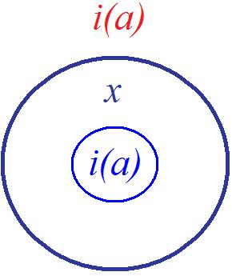
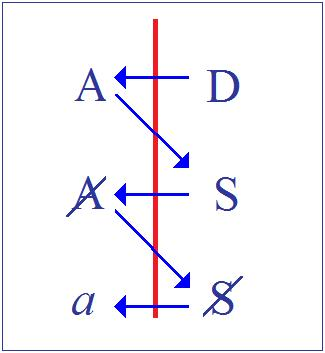
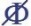

# Leçon 25 | 17 Juin 1959

<!-- source-url: http://staferla.free.fr/S6/S6 LE DESIR.docx -->
<!-- seminar: s6 -->
<!-- lesson: 25 -->

<!-- id: s6-25-0001 -->

Il y a quelque chose d’instructif, je ne dirai pas *jusque dans les erreurs*, mais même *surtout dans les erreurs*, ou dans les errances si l’on veut. Vous me voyez assez constamment utiliser les hésitations mêmes, voire les impasses, qui se manifestent dans la théorie analytique, comme étant par elles-mêmes révélatrices d’une structure de la réalité à laquelle nous avons affaire.

<!-- id: s6-25-0002 -->

À cet égard, il est clair qu’il y a quelque chose d’*intéressant*, de *remarquable*, de *significatif* pour nous, dans des travaux pas tellement anciens puisque celui, par exemple, auquel je me référerai est de 1956 : *numéro* de *Juillet-Octobre* de l’*International journal of Psycho-analysis, volume* XXXVII.

<!-- id: s6-25-0003 -->

C’est un article, je crois, de quelques uns de nos collègues parisiens, je ne désignerai pas leurs noms, puisque ce n’est pas leur position en tant que personnelle qui est ainsi visée.[^114] C’est un effort pour mettre au point *le sens de la perversion*. Et il est clair que dans cet article - extrêmement curieusement - réservé dans ses conclusions, il ne ressort vraiment que cette conclusion formellement articulée :

<!-- id: s6-25-0004 -->

- « *Il n’y a, par conséquent, aucun contenu inconscient spécifique dans les perversions sexuelles puisque les mêmes trouvailles peuvent être reconnues dans les cas des névroses et des psychoses.* »

<!-- id: s6-25-0005 -->

Il y a là quelque chose d’assez frappant que tout l’article illustre, et on ne peut pas dire d’une façon qui soit absolument convaincante car, sans même avoir besoin de prendre un très grand recul, on s’aperçoit que tout l’article part sur une confusion vraiment constamment maintenue entre « *fantasme pervers* » et « *perversion* ». Du fait qu’il y a des fantasmes conscients et inconscients qui se recouvrent, que les fantasmes se manifestent avec l’apparence de se recouvrir dans les névroses et dans les perversions, on en conclut avec cette étonnante aisance, qu’il n’y a pas de différence fondamentale, au point de vue de l’inconscient, entre *névrose* et *perversion* !

<!-- id: s6-25-0006 -->

Il y a là une des choses les plus étonnantes où certaines réflexions, qui elles-mêmes se présentent sans précautions \[...\] assez libre de la tradition analytique et se présentent comme une sorte de révision des valeurs et des principes. La seule conclusion à quoi on s’arrête *en fin de compte*, c’est que c’est une relation en somme anormale qui, dans la perversion, est érotisée. Ce n’est point donc d’un rapport à l’objet qu’il s’agit, mais plutôt d’une valorisation d’une relation \[...\] et comme telle érotique, ce qui tout de même, après un examen tant soit peu sensé, à la reprise de la lecture, ne peut apparaître vraiment autre chose que comme quelque cause de « *la vertu dormitive* »[^115]. Cela correspond à l’objet, qu’elle soit érotisée, ce n’est pas douteux !

<!-- id: s6-25-0007 -->

En fait, c’est bien de cette question du rapport du fantasme et de la perversion que nous sommes amenés à nous occuper aujourd’hui, à la suite de ce que nous avons approché la dernière fois, à savoir nous avons commencé d’indiquer les termes les plus généraux du rapport du fantasme à la névrose.

<!-- id: s6-25-0008 -->

Un tout petit mot d’histoire. Ce qui s’est passé dans l’analyse…

<!-- id: s6-25-0009 -->

> et c’est important ici à rappeler et, je dirais à la lumière de notre progrès,
>
> peut être approché, serré d’une façon plus rigoureuse

<!-- id: s6-25-0010 -->

…c’est essentiellement ceci : c’est qu’en somme très peu de temps après avoir articulé les fonctions de l’inconscient…

<!-- id: s6-25-0011 -->

> ceci tout à fait spécialement à propos de l’hystérie, des névroses et du rêve

<!-- id: s6-25-0012 -->

…FREUD a été amené à poser *la présence* dans l’inconscient de ce qu’il a appelé « *tendances perverses polymorphes* », « *polymorph perverse Anlage* » \[*Dr**ei Abhandlungen zur Sexualtheorie*, 1905\].

<!-- id: s6-25-0013 -->

C’est de là et c’est là pendant un certain temps - très dépassé maintenant, bien sûr - que l’on en est resté. Et ce qu’il semble que l’on ait manqué à articuler, c’est que ce dont il s’agit - cette notion de « *tendances perverses polymorphes »* ce n’est rien que ceci : c’est qu’il a découvert la structure des fantasmes inconscients. La structure des fantasmes inconscients ressemblait au mode relationnel qui s’épanouit, qui s’étale au grand jour, qui se démontre dans les perversions. Et ainsi, la notion dans l’inconscient de la « *tendance perverse polymorphe* » a été d’abord posée.

<!-- id: s6-25-0014 -->

En fin de compte - *ceci peut être dit* - cela relevait du fait que la forme de ces fantasmes inconscients recouvre quoi ? Ce qui est une partie de la perversion, ce qui se présente à nous dans la perversion sous l’aspect suivant, que nous pouvons essayer d’articuler, à savoir *quelque chose* qui occupe le champ imaginatif : le désir, celui qui constitue le désir du pervers.

<!-- id: s6-25-0015 -->

Et ce *quelque chose* qu’en somme le pervers met en scène, ce *quelque chose* comme quoi cela se présente dans son aspect patent en clinique, est quelque chose qui pour nous…

<!-- id: s6-25-0016 -->

> avec ce que nous connaissons, avec la relation que nous avons faite de ces fantasmes à l’histoire du sujet,
>
> là où nous réussissons à le rattacher, si vous voulez, à cette histoire

<!-- id: s6-25-0017 -->

…c’est en somme que *le fantasme du pervers* se présente comme :

<!-- id: s6-25-0018 -->

- quelque chose que l’on pourrait appeler une séquence, je veux dire comme on pourrait l’appeler dans un *movie*, dans un *film cinématographique*, j’entends une séquence coupée du développement du drame,

<!-- id: s6-25-0019 -->

- quelque chose comme on voit apparaître sous le nom - je ne suis pas sûr du terme - de « *rush » * : cet élément qui dans les films-annonces nous apparaît sur l’écran comme étant ces quelques images éclairées qui sont faites pour exciter notre appétit de revenir la semaine prochaine voir le film, précisément, qui est ainsi annoncé.

<!-- id: s6-25-0020 -->

Ce qu’ont de séduisant ces images tient bien, en effet, à leur côté de désinsertion de la chaîne, de rupture par rapport au thème. Et c’est bien de quelque chose de cet ordre qu’il s’agit dans le fantasme du pervers. Ceci, nous le savons pour autant que l’analyse nous a appris à y voir.

<!-- id: s6-25-0021 -->

C’est en effet quelque chose qui, jusqu’à un certain degré, replacé dans son contexte, dans sa suite dramatique, celle du passé du sujet, peut à différents degrés, voire au prix de quelques modifications, retouches, transformations à l’envers, reprendre sa place et son sens.

<!-- id: s6-25-0022 -->

Aussi bien, ce rapport qu’a le fantasme du pervers à son désir, n’est-ce pas pour rien. Je veux dire : c’est bien dans le relief de ce que déjà nous, dans notre formulation, nous avons déjà situé de la valeur, de la position du désir par rapport au sujet, je veux dire cet au-delà du *nommable*, cet au-delà du sujet dans lequel se situe ce désir.

<!-- id: s6-25-0023 -->

C’est là, je le dis rétrospectivement et en passant, c’est quelque chose qui nous explique la qualité propre dont le fantasme se revêt quand il s’avoue, qu’il soit ou non celui du pervers. À savoir cette sorte de gêne qu’il faut bien nommer, dans sa pointe, celle qui effectivement retient longtemps souvent les sujets de le livrer, à savoir cette face *ridicule*, qui ne *s’explique*, ne se *comprend* que si déjà nous avons pu apercevoir les relations que nous avons faites entre le désir dans sa position propre et le champ, le domaine de la comédie. Ceci n’est qu’un rappel.

<!-- id: s6-25-0024 -->

Et ayant rappelé cette position, cette fonction du fantasme spécialement à propos du pervers, et les problèmes qui sont donc posés tout de suite :

<!-- id: s6-25-0025 -->

- de savoir quelle était leur nature réelle,

<!-- id: s6-25-0026 -->

- si elle était d’une nature en quelque sorte radicale, naturelle,

<!-- id: s6-25-0027 -->

- si elle était un terme dernier, cette nature du fantasme pervers,

<!-- id: s6-25-0028 -->

- ou bien s’il fallait y voir d’autres choses d’aussi complexe, d’aussi élaboré, pour tout dire, d’aussi significatif que *le symptôme névrotique*.

<!-- id: s6-25-0029 -->

C’est bien là pourquoi toute une élaboration qui s’est faite, s’est intégrée au problème de la perversité, et qui a pris une part essentielle dans l’élaboration de ce qu’on appelle « *la relation d’objet* » ou du rapport à l’objet, comme devant être défini d’une façon évolutive, d’une façon génétique : comme réglant les stades, les phases du développement du sujet, non pas simplement comme « *momentalités* » de l’Éros du sujet, \[...\], donc sexuels, phases érogènes du sujet, mais modes d’une relation au monde que chacune de ces phases définit. C’est à partir de là que se sont faits…

<!-- id: s6-25-0030 -->

> *tant par* ABRAHAM, *par* FERENCZI *que par d’autres*, je n’ai pas besoin de vous en rappeler ici les initiateurs

<!-- id: s6-25-0031 -->

…que se sont faits ces *tableaux* dits des « *phases corrélatives* » dites

<!-- id: s6-25-0032 -->

- d’une part de « *réservoirs de tendances* »,

<!-- id: s6-25-0033 -->

- « *formes libidinales de l’ego* » d’autre part.

<!-- id: s6-25-0034 -->

Dans *cette forme de la libido, cette structure de l’ego* semblait répondre et spécifier à un type de relation spéciale à la réalité.[^116]

<!-- id: s6-25-0035 -->

Vous savez ce que, d’une part cette sorte d’*élaboration* a apporté de clarté, voire d’enrichissement, ce qu’elle a pu d’autre part poser de problèmes. Il suffit de se rapporter au moindre des travaux…

<!-- id: s6-25-0036 -->

> *pour le moins des travaux concrets essayant effectivement d’articuler à propos d’un cas précis, d’une forme précise*

<!-- id: s6-25-0037 -->

…de retrouver les correspondances, établies toujours d’une façon un peu théorique, pour s’apercevoir que le problème est quelquefois par lui-même, dans son développement, suggestif de quelque chose, d’une estimation \[...\] qui lui manque.

<!-- id: s6-25-0038 -->

Je vous rappelle donc que c’est à cela…

<!-- id: s6-25-0039 -->

à ce terme « *recherche de l’ensemble de la relation de l’objet* »

<!-- id: s6-25-0040 -->

…c’est cela que nous disons, c’est cela que je désigne quand il s’agit par exemple d’opposition comme telle entre « *objet partiel* », et « *objet* *total* » qui apparaît sous une forme élaborée, à notre avis inappropriée.

<!-- id: s6-25-0041 -->

Dans les élaborations plus récentes, par exemple celle de la fameuse notion de « *distance à l’objet* », si dominante dans des travaux, des règles techniques auxquelles j’ai maintes fois fait allusion ici, cette notion de « *distance à l’objet* » telle qu’un auteur français \[M. Bouvet\] en particulier veut faire décisive dans la relation de la névrose obsessionnelle.

<!-- id: s6-25-0042 -->

Comme s’il n’était pas évident, et bien plus évident encore, que par exemple cette notion de « *distance* » joue un rôle décisif quand on veut simplement essayer d’articuler certaines positions perverses, celle du fétichisme par exemple, où la distance d’un objet est bien plus évidemment manifestée par la phénoménologie même du fétichisme.

<!-- id: s6-25-0043 -->

Bien d’autres formes sont évidemment articulables dans ce sens et la première des vérités que nous aurions là-dessus à apporter est qu’assurément cette notion de « *distance* » est même si essentielle qu’après tout, peut-être bien est-elle inéliminable comme telle du désir lui-même, je veux dire nécessaire au maintien, au soutien, à la sauvegarde même de la dimension du désir.

<!-- id: s6-25-0044 -->

Il suffit en effet de considérer que si quelque chose peut répondre enfin au mythe d’un rapport à l’objet sans distance, on voit mal en effet comment pourrait se soutenir ce qui est à proprement parler le désir. Il y a là quelque chose qui, je le dis, a une forme proprement mythologique, celle d’une sorte d’*accord*.

<!-- id: s6-25-0045 -->

Je dirais qu’il y a deux faces, deux mirages, deux apparences d’*accord*…

<!-- id: s6-25-0046 -->

- je dirais « *animal* » d’un côté,

<!-- id: s6-25-0047 -->

- on pourrait aussi bien dire d’ailleurs, d’un autre côté, « *mystique* », n’est-ce pas ?

<!-- id: s6-25-0048 -->

…avec l’objet qui est bien un *reste*, à l’intérieur de l’élaboration analytique, de quelque chose qui ne coïncide nullement avec les données de l’expérience.

<!-- id: s6-25-0049 -->

Aussi bien d’ailleurs, ce qui est indiqué dans la technique analytique comme devant corriger, rectifier cette *prétendue* « *mauvaise distance maintenue à l’objet* » de *l’obsessionnel*, chacun sait de la façon la plus claire que ceci est indiqué comme devant être surmonté *hic et nunc* dans le rapport analytique, et ceci *par une identification idéale, voire idéalisante, avec l’analyste* considéré lui-même à cette occasion comme non pas l’objet, mais le prototype d’une relation satisfaisante à l’objet !

<!-- id: s6-25-0050 -->

Nous aurons à revenir à *ce à quoi peut correspondre exactement un tel idéal* pour autant qu’il est réalisé *dans l’analyse*. Je l’ai déjà abordé, mais nous aurons peut-être à le situer, à l’articuler différemment tout à l’heure.

<!-- id: s6-25-0051 -->

En effet, ces problèmes ont été abordés d’une façon beaucoup plus serrée et beaucoup plus sérieuse, toujours dans la même voie, dans d’autres contextes, dans d’autres groupes, et je mettrai, comme je vous l’ai déjà indiqué ici, au premier rang les articulations d’Edward GLOVER. Je vous rappelle la place de l’article que j’ai déjà cité, dans le *volume XIV* de l’*International Journal of Psycho-analysis*, *octobre* 1933, sur *La Relation de la formation de la perversion* *au développement du sens de la réalité .* \[Cf. 13-05\]

<!-- id: s6-25-0052 -->

C’est dans le souci qui est par lui poursuivi dans le sens :

<!-- id: s6-25-0053 -->

- d’une élaboration génétique, des rapports du sujet à ce monde, à la réalité qui l’entoure,

<!-- id: s6-25-0054 -->

- et d’une évolution qui doit être serrée de près, autant par la reconstruction par les analyses d’adultes que par l’appréhension directe du comportement de l’enfant, aussi serrée qu’il est possible dans une perspective *rénovée par l’analyse*, que GLOVER essaye de situer ces perversions quelque part par rapport à une chaîne.

<!-- id: s6-25-0055 -->

Il a déjà établi une chaîne comportant des dates, si l’on peut dire, d’insertion des diverses anomalies psychiques auxquelles a affaire l’analyse, et qui l’a amené à faire une série, dont l’ordre n’est pas sans prêter, comme d’habitude, à critique, mais qui sans y insister plus, est constituée par le caractère primitif, primordial, des perturbations psychotiques, nommément des perturbations paranoïdes, à la suite desquelles se succèdent les différentes formes de névrose qui s’articulent, se situent dans *un ordre progressif*, je veux dire d’avant en arrière, des origines vers le plus tard, en commençant par *la névrose obsessionnelle* qui se trouve donc exactement à la limite avec *les formes paranoïaques*.

<!-- id: s6-25-0056 -->

C’est pour autant qu’il a situé là…

<!-- id: s6-25-0057 -->

> quelque part dans l’intervalle, dans un article précédent qui est celui du *volume* XIII, de *juillet* 1932*, partie* 3*,*
>
> *pages* 298-328 de l’*International journal of Psycho-analysis* sur les *drug-addictions* \[*On the Aetiology of Drug-Addiction*\], autrement dit ce que nous appelons les *toxicomanies*

<!-- id: s6-25-0058 -->

…qu’il a pu croire situer avec assez de précision les rapports entre les formes paranoïdes et les névroses, qu’il cherche à situer là quelle peut être la fonction des perversions, à quelle étape, à quelle date, à quel mode de relation du sujet au réel.

<!-- id: s6-25-0059 -->

Pour autant que la forme paranoïde est liée à des mécanismes tout à fait primitifs de projection et d’introjection, il est à ce moment-là – disons-le tout nettement – travaillant tout à fait sur le même plan et expressément d’accord, d’ailleurs d’une façon formulée,avec Mélanie KLEIN. Vous savez qu’il s’en est fait *le contradicteur avec éclat*.

<!-- id: s6-25-0060 -->

C’est sur ce plan qu’il adhère à l’élaboration kleinienne et c’est pour autant qu’un mode de relation à l’objet…

<!-- id: s6-25-0061 -->

> très spécifique de cette étape type paranoïde, considéré comme primitif

<!-- id: s6-25-0062 -->

…existe, qu’il situe, qu’il élabore, articule, qu’il comprend la fonction de la *drug-addiction*, de la *toxicomanie*.

<!-- id: s6-25-0063 -->

C’est à ceci que se rapporte le passage que je vous ai lu il y a quelques séances, à savoir le passage où, d’une façon métaphorique très brillante, où sur le mode très instructif, il n’hésite pas à comparer *le monde primitif de l’enfant* à quelque chose qui participe :

<!-- id: s6-25-0064 -->

- « *d’une boucherie, d’un lavatory public sous un bombardement et d’une morgue combinés* » \[p.23\]

<!-- id: s6-25-0065 -->

À quoi assurément apporte une organisation plus bénigne la transformation de ce spectacle initial inaugural de la vie, la succession à cette étape d’une « *pharmacie* » avec ses réserves d’objets, *les uns bénéfiques, les autres maléfiques*.\[Cf. 13-05-59 \]

<!-- id: s6-25-0066 -->

Ceci donc est articulé de la façon la plus claire et est instructif pour autant qu’il nous signifie dans quelle direction est faite la recherche de la fonction du fantasme, dans la direction de son fonctionnement comme structural, comme organisateur de la découverte, de la construction de la réalité par le sujet. Là-dessus, il n’y a pas de différence, en effet, entre GLOVER et Mme Mélanie KLEIN.

<!-- id: s6-25-0067 -->

Et Mme Mélanie KLEIN nous articule proprement ceci : c’est qu’en somme les objets sont conquis *successivement* par l’enfant, pour autant…

<!-- id: s6-25-0068 -->

> ceci est articulé dans l’article *Symbol’s formation and ego* [^117]

<!-- id: s6-25-0069 -->

…pour autant que, à mesure que les objets sont moins proches des besoins de l’enfant, sont appréhendés, ils se chargent de l’anxiété liée à leur utilisation dans les relations agressives, sadiques, fondamentales qui sont celles, au départ, de l’enfant à son entourage comme suite à toute frustration.

<!-- id: s6-25-0070 -->

C’est pour autant que le sujet déplace son intérêt sur des objets plus bénins, lesquels à leur tour se chargeront de la même anxiété, que l’extension du monde de l’enfant est conçue comme telle. Observez ce que ceci représente. Cela représente la notion que nous devons chercher dans un mécanisme, en somme, que nous pourrions appeler *contraphobique*. À savoir que c’est pour autant que les objets ont d’abord et primitivement une fonction d’*objets* *contraphobique*, et que l’objet phobique, si l’on peut dire, est cherché ailleurs, c’est par une extension progressive du monde des objets dans une dialectique *contra-phobique*, ceci est le mécanisme même de conquête de la réalité.

<!-- id: s6-25-0071 -->

Si ceci ou non correspond à la clinique, c’est une question qui n’est pas directement ici dans le champ de notre visée. Je crois que directement et dans la clinique, beaucoup de choses peuvent aller contre, qu’il y a là une *unilatéralisation*, une *partialisation* d’un mécanisme qui assurément n’est pas sans interférer avec la conquête de la réalité, mais qui ne la constitue pas à proprement parler.

<!-- id: s6-25-0072 -->

Mais ce n’est pas ici notre but de critiquer la théorie de Mélanie KLEIN, puisque c’est *par rapport à une toute autre visée* que nous la faisions entrer en ligne de compte, en jeu, c’est *par rapport à quelque chose, une fonction qui est le désir*. Or c’est bien là ceci qui aussitôt montre ses conséquences, c’est à savoir que GLOVER aboutit à un paradoxe qui assurément semble plus instructif pour lui que pour nous, puisqu’il ne semble pas y avoir à s’en étonner.

<!-- id: s6-25-0073 -->

Il aboutit à ceci, c’est que s’il essaie concrètement de situer les diverses perversions par rapport à sa dialectique, à ce mécanisme tel qu’il essaye de l’élaborer, de le reconstituer, de le réintégrer dans la notion d’un développement régulier de l’*ego,* pour autant qu’il serait parallèle aux modifications de la *libido*, pour autant l’on peut inscrire pour tout dire, la destinée, la structuration du sujet, en termes de pure expérience individuelle de conquête de la réalité. Tout est là en effet.

<!-- id: s6-25-0074 -->

La différence qu’il y a entre la théorie que je vous donne des phobies, par exemple, et celle que vous verrez chez tels auteurs français récents…

<!-- id: s6-25-0075 -->

> pour autant qu’ils essayent d’indiquer la genèse de la phobie dans des formes structurales de l’expérience infantile – par exemple de la façon dont l’enfant a à s’arranger de ses rapports avec ceux qui l’entourent, du passage de la clarté à l’obscurité – il s’agit d’une genèse purement expérimentale, d’une expérience de crainte à partir de laquelle est engendrée et déduite la possibilité de la phobie

<!-- id: s6-25-0076 -->

…la différence entre cette position et celle que je vous enseigne est typiquement celle–ci : c’est de dire qu’il n’y a aucune espèce de juste déduction de la phobie, sinon à admettre la fonction, l’exigence comme telle d’une fonction du signifiant, laquelle suppose une dimension propre qui n’est pas celle du rapport du sujet à son entourage, qui n’est pas celle du rapport à aucune réalité, sinon à la réalité et à la dimension du langage comme tel, du fait qu’il a à se situer comme *sujet dans le discours*, à s’y manifester comme *être*, ce qui est différent.

<!-- id: s6-25-0077 -->

Il y a quelque chose de tout à fait frappant concernant l’appréciation de ces phobies, même chez quelqu’un d’aussi perspicace que GLOVER. Il essaye d’expliquer la genèse, la stabilisation d’une phobie. Quand il déclare que :

<!-- id: s6-25-0078 -->

- « ...*il est assurément plus avantageux d’être pourvu d’une phobie du tigre, quand on vit comme un enfant dans les rues* *de Londres, que trouver la même phobie s’il vivait au milieu de la jungle indienne.* » \[p.21\]

<!-- id: s6-25-0079 -->

On peut se demander si on ne pourrait pas lui rétorquer *qu’effectivement ce n’est pas dans ce registre que se pose le problème*. Après tout, on pourrait même renverser sa proposition et dire que la phobie du tigre dans *la jungle indienne* est au contraire, semble-t-il, la plus avantageuse pour adapter l’enfant à une adaptation réelle.

<!-- id: s6-25-0080 -->

Mais que par contre, il est fort *encombrant* de souffrir d’une phobie du tigre, pour autant que nous savons quels en sont les corrélatifs, à savoir que celle de l’enfant, voire du sujet le plus avancé déjà dans son développement, au moment où il est la proie d’une phobie, est assurément un comportement des plus entravé et qui, lui, est sans aucun rapport avec le réel.

<!-- id: s6-25-0081 -->

En fait, quelque chose se présente qui pose à GLOVER son problème dans ces termes : c’est de s’apercevoir que la plus grande diversité de distorsions de la réalité est réalisée dans les perversions, et de dire qu’il ne peut situer, *dans une perspective génétique*, la perversion qu’à condition de la fragmenter, de l’interpoler à toutes les étapes supposées ou présupposées du développement. À savoir d’admettre l’existence aussi bien de perversions très archaïques…

<!-- id: s6-25-0082 -->

> plus ou moins contemporaines de l’époque paranoïde, voire de l’époque dépressive

<!-- id: s6-25-0083 -->

…que d’autres perversions qui, elles, se situent à des phases très avancées, voire non seulement phalliques, mais à proprement parler œdipiennes voire génitales, du développement.

<!-- id: s6-25-0084 -->

Ceci ne lui semble pas une objection pour la raison suivante, c’est qu’il finit par donner de *la perversion* une définition qui est la suivante : c’est qu’en somme, *la perversion est une des formes, pour lui*…

<!-- id: s6-25-0085 -->

> il ne peut pas aboutir à autre chose dans la perspective dont il est parti

<!-- id: s6-25-0086 -->

…du « *reality testing* », de « *l’épreuve de la réalité* ».

<!-- id: s6-25-0087 -->

C’est pour autant - selon GLOVER - que quelque part, quelque chose dans « *l’épreuve de la réalité* » n’aboutit pas, échoue, que la perversion vient recouvrir ce « *hole* », ce « *trou* » n’est-ce pas, par un mode particulier d’appréhension du *réel* comme tel, du *réel* dans l’occasion c’est un *réel* psychique, c’est un *réel* projeté et d’autre part introjecté.

<!-- id: s6-25-0088 -->

Que c’est donc à proprement parler comme fonction de maintien, préservation d’une réalité qui serait menacée dans son ensemble, c’est pour autant que la perversion sert, si vous voulez, on peut dire à la fois de « *reprise* », au sens où l’on dit qu’un tissu est *reprisé*, ou encore de clef de voûte, quelque *décharge*, quelque moment boiteux, et quelque moment menaçant compromettant l’équilibre de l’ensemble de la réalité pour le sujet.

<!-- id: s6-25-0089 -->

Bref ce n’est que, d’une façon non-ambiguë, comme forme de *salut* par rapport à une *menace* supposée *de psychose*, que la perversion est conçue par Edward GLOVER. Il y a là une perspective. Peut-être certaines observations peuvent montrer effectivement quelque chose qui semble l’illustrer, mais beaucoup d’éléments nous commandent de nous en éloigner.

<!-- id: s6-25-0090 -->

Outre ceci : qu’il semble tout à fait paradoxal de faire de la perversion quelque chose qui a ce rôle économique…

<!-- id: s6-25-0091 -->

> ce rôle économique que beaucoup d’éléments contredisent

<!-- id: s6-25-0092 -->

…serait ce quelque chose qui nous indique que ce n’est certes pas la précarité de l’édifice du pervers qui est quelque chose qui, cliniquement ni non plus dans l’expérience analytique, nous frappe, au premier aspect tout au moins !

<!-- id: s6-25-0093 -->

Pour indiquer ici quelque chose, je n’abandonnerai pas cette dialectique kleinienne sans faire remarquer comment elle rejoint et amorce le problème que nous posons.

<!-- id: s6-25-0094 -->

En effet si nous cherchons ce dont il s’agit dans la *dialectique kleinienne*, à savoir les deux étapes qu’elle distingue entre : *la phase paranoïde*, puis ensuite *la phase dépressive* qui est caractérisée, comme vous le savez, par rapport à la première, par le rapport du sujet à son objet majeur et prévalant : la mère, comme à un tout.

<!-- id: s6-25-0095 -->

Auparavant, c’est à des éléments disjoints auxquels il a affaire. Puis la *schize* en objets bons et mauvais, avec tout ce qu’elle va instaurer chez lui, dans cette phase qui est celle de la projection et de l’introjection. C’est ainsi que la barrière paranoïde se caractérise. Enfin, qu’est-ce que nous pouvons dire dans notre perspective ? Je veux dire, essayons de comprendre, par la perspective où nous l’articulons nous-mêmes, ce dont il s’agit dans ce processus, ce processus tout à fait inaugural, mis au début de la vie du sujet, c’est qu’en somme la réalité des premières appréhensions de l’objet, telle que Mme KLEIN nous la montre, provient de ceci, c’est qu’en somme l’objet est d’abord, au-delà du fait qu’il peut être bon ou mauvais, profitable ou frustrant, c’est qu’il est significatif.

<!-- id: s6-25-0096 -->

Car la notion, la distinction qui, si l’opposition comme telle est stricte…

<!-- id: s6-25-0097 -->

> et je dirais sans nuances, sans transitions, sans apercevoir d’aucune façon que c’est le même objet qui peut être bon ou mauvais selon les heures, à savoir la mère

<!-- id: s6-25-0098 -->

…qu’il y a ici non pas *expérience* chez le jeune sujet, ni tout ce qu’elle peut comporter comme *habitudes transitionnelles*, mais qu’il y a oppositions tranchées, passage de l’objet comme tel à une fonction d’oppositions signifiantes qui est la base de toute la dialectique kleinienne, et dont on s’aperçoit, me semble­t-il, trop peu que, pour fondée qu’elle soit, elle est tout à fait *à l’opposé, au bord opposé, au pôle opposé*, qu’elle est le contraire de cet autre élément mis en relief par notre expérience, à savoir de l’importance de la communication vivante, aussi essentielle au départ pour le développement, qui s’exprime, se manifeste dans la dimension des soins maternels.

<!-- id: s6-25-0099 -->

Il y a là quelque chose d’un autre registre, qui est contemporain mais qui ne peut pas être confondu. Et ce que Mélanie KLEIN nous apporte, c’est une sorte d’algèbre primitive, dont on peut dire qu’elle rejoint tout à fait, en effet, ce que nous essayons de mettre ici en relief sous le nom de « *fonction du signifiant* ». Ce sont les formes primaires, primitives de cette fonction du signifiant comme tel, qui sont, à tort ou à raison…

<!-- id: s6-25-0100 -->

> qu’il soit *effectivement présent à cette date* ou simplement « *Rück-Phantasie* », « *fantasme* » mais « *en* *arrière* »

<!-- id: s6-25-0101 -->

…c’est cela, nous n’avons qu’à l’enregistrer, que nous décrit Mélanie KLEIN.

<!-- id: s6-25-0102 -->

Dès lors, quelle valeur va prendre cette phase limite entre période paranoïde avec son ordonnance *de bons objets* qui sont comme tels intériorisés – *internalised* dit-elle – par le sujet, et *de mauvais* qui sont rejetés ? Que se passe-t-il ? Comment pouvons-nous décrire ce qui se passe à partir du moment où intervient la notion du sujet comme un tout, qui est essentielle pour que le sujet lui–même se considère comme ayant un dedans et un dehors ?

<!-- id: s6-25-0103 -->

Car en fin de compte, ce n’est qu’à partir de là qu’il est concevable que se manifeste, se définisse le processus d’internalisation et d’externalisation, d’introjection et de projection, qui va être pour Mélanie KLEIN décisif pour cette structuration de l’animal primitif. Avec les repères qui sont les nôtres, nous voyons que ce dont il s’agit est quelque chose qui resitue ce rapport, *cette schize* - comme elle s’est exprimée elle-même - *primitive des objets en bons* *et en mauvais* par rapport à cet autre registre du *dedans* et du *dehors* du sujet.

<!-- id: s6-25-0104 -->

Ce quelque chose que, je crois, nous pouvons, sans excès de sollicitation par rapport aux perspectives kleiniennes, que nous pouvons rapporter au moment dit du *stade du miroir*, c’est pour autant que *l’image de l’autre* donne au sujet cette forme de l’unité de l’autre comme tel, que peut s’établir quelque part cette division du *dedans* et du *dehors*, ou par rapport à laquelle vont se reclasser les *bons* et les *mauvais objets* :

<!-- id: s6-25-0105 -->

- *les bons* pour autant qu’ils doivent venir au-dedans,

<!-- id: s6-25-0106 -->

- *les mauvais* pour autant qu’ils doivent rester au-dehors.

<!-- id: s6-25-0107 -->

Eh bien, ce qui arrive ici à se définir de la façon la plus claire, parce qu’imposée par l’expérience, c’est la même chose que ce que nous pourrions dire dans notre discours à nous. C’est à savoir que le discours qui organise réellement le monde des objets, je dirais selon l’être du sujet, au départ, déborde celui où le sujet lui-même se reconnaît dans l’épreuve narcissique, l’épreuve dite du *stade du miroir*, à savoir :

<!-- id: s6-25-0108 -->

- où il se reconnaît comme maîtrise et comme *moi* unique,

<!-- id: s6-25-0109 -->

- où il se reconnaît donc une relation d’identification narcissique d’une *image* à *l’autre*,

<!-- id: s6-25-0110 -->

- où il se reconnaît comme maîtrise d’un *moi*.

<!-- id: s6-25-0111 -->

C’est pour autant que quelque chose qui le définit dans une première identification…

<!-- id: s6-25-0112 -->

> dans celle qui est exprimée ici au niveau de la première identification à la mère,
>
> comme objet de la première identification *aux insignes de la mère*

<!-- id: s6-25-0113 -->

…c’est pour autant que ceci conserve pour le sujet une valeur assimilatrice qui déborde ce qu’il va pouvoir mettre au-dedans de lui-même, pour autant que ce dedans est défini par ses premières expériences de maîtrise, de prestance, pour autant qu’il est « *i* » de l’autre \[*i(a)*\], « *i* » typiquement et idéalement de ce jeune semblable, avec lequel nous le voyons de la façon la plus claire faire ses expériences de maîtrise.

<!-- id: s6-25-0114 -->

<!-- id: s6-25-0115 -->

c’est pour autant que ce qui se rapporte \[...\], c’est pour autant que les deux expériences ne se recouvrent pas, je ne dis pas, moi : toute l’expérience du développement s’ordonne - que nécessairement nous devons admettre ceci pour comprendre ce dont il s’agit dans ce que nous décrit Mélanie KLEIN. En effet, ce qui définit cette différence, ce champ *x* où *i(a)* qui, à la fois, fait partie du sujet et en même temps n’en fait pas partie de ce sujet, c’est quoi ?

<!-- id: s6-25-0116 -->

C’est cet objet dont on ne semble pas s’étonner du *paradoxe* à partir des prémisses que pose Mélanie KLEIN, c’est ce qu’elle appelle le mauvais objet interne.

<!-- id: s6-25-0117 -->

Le mauvais objet interne se présente pour nous d’emblée dans la dialectique kleinienne, de la façon la plus manifeste, comme l’objet problématique. En ce sens que *vu*, si l’on peut dire *du dehors*, là où le sujet n’est pas sujet mais où nous devons le prendre comme un être réel, nous pouvons nous demander, ce mauvais objet auquel prétendument le sujet s’identifie, le sujet, en fin de compte : *l’est-il* ou ne *l’est-il pas* ?

<!-- id: s6-25-0118 -->

Inversement, *vu du dedans*, vu du point de vue de la \[...\], de la maîtrise du premier exercice du sujet, de se tenir, de s’affirmer, de se contenir, nous devons nous demander si, ce mauvais objet dont nous savons le rôle absolument décisif à partir de là, le sujet *l’a* ou *ne l’a pas*. *La question* qui se pose c’est : *l’a-t-il* ou ne *l’a-t-il pas* ?

<!-- id: s6-25-0119 -->

Car si nous avons défini bons et mauvais objets comme déterminant le processus de structuration par quoi :

<!-- id: s6-25-0120 -->

- le sujet *intériorise les bons objets* et fait qu’ils font primitivement partie de lui-même,

<!-- id: s6-25-0121 -->

- et *rejette les mauvais* comme étant ce qui n’est pas lui, tout le reste, le paradoxe du mauvais objet intériorisé apparaît au premier plan.

<!-- id: s6-25-0122 -->

Que signifie cette \[zone ?\] du premier objet en tant que le sujet l’intériorise, qu’il le fait à la fois sien et qu’en quelque sorte, comme mauvais virtuellement, il le dénie ? Il est clair qu’ici la fonction ultérieure de l’interdit est justement ce qui a la valeur délinéatrice, grâce à quoi le mauvais objet cesse de se proposer en espèce d’énigme permanente, d’énigme anxiogène par rapport à l’être du sujet.

<!-- id: s6-25-0123 -->

L’interdit est précisément ce qui introduit, à l’intérieur de cette fonction problématique du mauvais objet, cette délinéation essentielle. C’est cela qui fait sa fonction d’interdit, c’est que *s’il l’est*, ce mauvais objet, *il ne l’a pas*. En tant *qu’il l’est* – identifié – il est défendu *qu’il l’ait*. L’euphonie française entre le subjonctif du verbe avoir et l’indicatif du verbe être est à utiliser. Autrement dit :

<!-- id: s6-25-0124 -->

- en tant qu’*il l’est*, *il ne l’a pas*,

<!-- id: s6-25-0125 -->

- en tant qu’*il l’a*, *il ne l’est pas*.

<!-- id: s6-25-0126 -->

Autrement dit, c’est qu’*au niveau du mauvais objet le sujet expérimente*, si je puis m’exprimer ainsi *la servitude de sa maîtrise*.

<!-- id: s6-25-0127 -->

C’est que le maître vrai…

<!-- id: s6-25-0128 -->

> *chacun sait qu’il est au-delà de tout visage, qu’il est quelque part dans le langage, encore qu’il ne puisse même y être nulle part*

<!-- id: s6-25-0129 -->

…le maître vrai lui délègue l’usage limité du *mauvais objet* comme tel, c’est à savoir *d’un objet qui n’est pas situé par rapport à la demande, d’un objet qu’on ne peut pas demander*. Car c’est de là, en effet, que part toute la portée de nos données.

<!-- id: s6-25-0130 -->

Auparavant, puis-je vous indiquer que ce qui se lit d’une façon saisissante dans les cas précis qui nous sont présentés par Mélanie KLEIN : c’est pour autant qu’il est manifestement dans cette impasse, *dans ce champ du non-demandable* comme tel, que nous trouvons cet enfant si singulièrement inhibé auquel elle a affaire, et qu’elle nous présente dans l’article sur « *La Formation du développement de l’ego dans son rapport avec la formation du symbole »*. \[op. cit.\]

<!-- id: s6-25-0131 -->

Est-ce qu’il n’est pas clair que ce qu’elle obtient dès qu’elle commence à parler à cet enfant, c’est quelque chose qui tout de suite se cristallise dans une demande, une demande panique : « *Nurse coming ?* », « *Est-ce que la nurse va venir ?* »

<!-- id: s6-25-0132 -->

Et qui tout de suite après…

<!-- id: s6-25-0133 -->

> dans la mesure où l’enfant va se permettre de reprendre contact avec ses objets dont il apparaît au départ, dans l’expérience, singulièrement séparé

<!-- id: s6-25-0134 -->

…est quelque chose qu’elle nous signale comme un fait très étonnant, décisif.

<!-- id: s6-25-0135 -->

Puisque - vous vous en souvenez - c’est dans l’exercice d’une sorte de petit coupage, d’arrachage à l’aide des ciseaux de l’enfant…

<!-- id: s6-25-0136 -->

> qui est loin d’être un maladroit, puisqu’il se sert de toutes sortes d’éléments, tels que poignées de porte

<!-- id: s6-25-0137 -->

…les ciseaux, il n’a jamais pu les tenir. Là, il les tient, et pour essayer de détacher – et il y arrive – un petit morceau de charbon de quelque chose qui n’est pas non plus sans signification, puisque c’est un élément de chaîne du train avec lequel on réussit à le faire jouer : un *tender* nommément...

<!-- id: s6-25-0138 -->

> sans vouloir même ici m’étendre sur les curieux jeux et termes qui pourraient se faire autour de ce *tender,*
>
> qui est aussi *tender* en anglais, ce n’est pas « *la carte du tendre* » mais « *la carte du tender* » qui ici, s’offre à nous !

<!-- id: s6-25-0139 -->

...et c’est dans ce petit morceau que l’enfant, à la vérité, s’isole, se définit, se situe lui-même dans ce quelque chose qu’il peut détacher de la chaîne signifiante.

<!-- id: s6-25-0140 -->

C’est dans ce reste, dans ce petit tas minuscule, dans cette ébauche d’un objet, qui n’apparaît ici que sous la forme de petit morceau, d’un tout petit morceau, le même qui provoquera tout d’un coup sa sympathie « *panique* » quand il le verra sous la forme de taillures de crayon sur la poitrine de Mélanie KLEIN et, la première fois, s’émouvra en présence de cette autre en s’écriant : « *Pauvre madame Klein !* » \[p. 272\]

<!-- id: s6-25-0141 -->

Le désir donc n’est pas la demande. Cette première intuition expérimentée à tout instant, qui nous ramène aux conditions originelles, ne doit pas freiner l’attention. Un sujet vient nous trouver. Pourquoi cela ? Qu’est-ce qu’il demande ? En principe, satisfaction et bien-être. À ceci près que toute satisfaction n’entraîne pas pour lui bien-être, loin de là !

<!-- id: s6-25-0142 -->

Qu’est-ce que nous lui répondons ? À organiser l’histoire du sujet, - comme l’histoire de l’analyse, comme l’histoire de la technique ! - dans le sens de quelque chose qui doit répondre à cette demande de satisfaction. Par quelle voie ? Par une voie qui est celle-ci, à savoir en tentant de répondre à la demande de satisfaction du sujet par une réduction de ses désirs à ses besoins.

<!-- id: s6-25-0143 -->

Or n’y a-t-il pas là un paradoxe, alors que d’autre part, toute notre expérience on peut dire, se soutient dans cette dimension d’ailleurs aussi évidente pour le sujet que pour nous ? Pour nous, parce que tout ce que nous avons articulé va se résumer à ce que je vais dire. Et pour le sujet, parce qu’en fin de compte, le sujet le sait fort bien au moment où il vient nous trouver.

<!-- id: s6-25-0144 -->

On est en train de me dire que quelqu’un est en train de faire une thèse importante sur la signification sociale de l’analyse[^118], et cela me laisse entendre qu’il y aura là des éléments extrêmement riches d’expériences et extrêmement bien poursuivis. J’ose espérer, car je crois qu’effectivement la représentation sociale de l’analyse est beaucoup moins distordue dans l’ensemble de la communauté qu’on ne l’imagine, que ce qu’il en ressortira de la façon la plus claire c’est cette chose qui est franchement à la base, au principe même de ce qu’un sujet implique devant nous par sa présence même, c’est quoi ?

<!-- id: s6-25-0145 -->

C’est que dans les données de sa demande il y a ceci qu’il ne se fie pas à son désir. Le facteur commun devant lequel les sujets nous abordent est ceci : c’est que son désir, il ne s’y fie pas.Qu’il puisse, par suite de nos artifices, s’engager à notre suite dans sa référence au besoin, dans ce désir, voire dans sa sublimation dans les voies élevées de l’amour, il reste, au départ, ce qui caractérise le désir, c’est qu’il y a *quelque chose* *qui* comme tel *ne peut pas être demandé*, et à propos de quoi la question est posée, et que c’est cela qui est à proprement parler, *le champ et la dimension du désir*.

<!-- id: s6-25-0146 -->

Vous savez - pour introduire cette division, cette dialectique du désir - ce que j’ai fait à une date très précise, à savoir maintenant il y a deux ans et demi, *je suis parti de quoi* ? *De ce que* FREUD *dit à propos du* *complexe d’Œdipe* *chez la femme.* Est-ce que ceci, est-ce que ce que je viens d’articuler n’est pas lisible dans le fait que, au niveau de l’expérience analytique, au niveau de l’expérience inconsciente, est-ce qu’il n’y a pas lieu de détacher ceci : qu’est ce que la femme demande au départ, *ce par quoi*, nous dit FREUD, elle entre dans l’œdipe ?

<!-- id: s6-25-0147 -->

Ce n’est pas d’avoir une satisfaction, c’est d’avoir ce qu’elle n’a pas comme tel. Il s’agit, vous le savez, du *phallus*. Ce n’est pas autre chose que la source jaillissante de tous les problèmes qui surgirent pour essayer de réduire la dialectique de la maturation du désir chez les femmes à quelque chose de naturel.

<!-- id: s6-25-0148 -->

Le fait est que nous y parvenions ou pas - à cette réduction - ce que nous avons à surmonter c’est un fait d’expérience, un fait d’expérience qui est celui-ci : c’est que la petite fille, à un moment de son développement…

<!-- id: s6-25-0149 -->

> *après tout, peu nous importe que ce soit un processus primaire ou secondaire, c’est un processus saillant et irréductible*

<!-- id: s6-25-0150 -->

…ce qu’elle demande d’avoir, à savoir le *phallus*, c’est de l’avoir, à ce moment critique du développement que FREUD met en valeur, c’est à l’avoir à la place où elle devrait l’avoir si elle était un homme. *Il s’agit bien de cela, il n’y a pas là-dessus d’ambiguïté*.

<!-- id: s6-25-0151 -->

Et tout le procès de ce qui se passe implique qu’en fait, même quand elle parviendra à l’avoir…

<!-- id: s6-25-0152 -->

> car elle est dans une position très privilégiée, la femme, par rapport à l’homme

<!-- id: s6-25-0153 -->

…ce *phallus*, qui est un *signifiant*, je dis bien *un signifiant,* elle peut l’avoir réellement. C’est même ce qui fait son avantage et la relative simplicité de ses problèmes affectifs par rapport à ceux de l’homme.

<!-- id: s6-25-0154 -->

Mais il ne faut pas que cette relative simplicité nous aveugle, parce que ce *phallus* qu’elle peut avoir, réel, il n’en reste pas moins qu’en raison du départ, à savoir qu’il s’est introduit dans sa dialectique, dans son évolution, comme un signifiant, *elle l’aura toujours en moins* à un niveau de son expérience. Je réserve toujours la possibilité limite de l’union parfaite avec un être, à savoir de quelque chose qui fonde complètement, dans l’étreinte, l’être aimé avec son organe.

<!-- id: s6-25-0155 -->

Mais ce qui constitue le test de notre expérience et les difficultés mêmes auxquelles nous avons affaire dans l’ordre sexuel, se situe précisément à ceci : c’est que ce moment idéal…

<!-- id: s6-25-0156 -->

> et en quelque sorte poétique, voire apocalyptique, de l’union sexuelle parfaite

<!-- id: s6-25-0157 -->

…ne se situe qu’à la limite, et que ce à quoi en fait, dans le test commun de l’expérience, la femme a affaire, même quand elle parvient à la réalisation de sa féminité, c’est à *l’objet phallique* toujours en tant que séparé.

<!-- id: s6-25-0158 -->

C’est même parce qu’elle y a affaire comme tel, et sous ce registre, que son action, son incidence peut être perçue par l’homme comme castratrice. Au reste, ceci bien sûr reste pour elle, jusqu’à analyse, inconscient. De même que reste inconscient ceci, *c’est que ce phallus qu’elle n’a pas, elle l’est symboliquement*, pour autant qu’*elle est l’objet du désir de l’autre*. Mais pas plus l’un que l’autre, ceci elle ne le sait. Cette position spécifique de la femme vaut en tant qu’elle lui est inconsciente, ce qui veut dire en tant qu’elle ne vaut que pour l’*autre*, pour le *partenaire*.

<!-- id: s6-25-0159 -->

Il reste néanmoins que la formule, la formule très singulière dans laquelle se résout son rapport au *phallus*, c’est paradoxalement que dans l’inconscient elle l’est, à la fois, et elle l’a. C’est là un des effets les plus singuliers du rapport au discours, c’est que c’est à cette position \[...\] de la *femme idéale*, de la femme en son monde fantasmatique : dans l’inconscient, elle l’est et elle l’a – au meilleur des cas – à ceci près qu’elle *ne le sait pas*, sinon par son désir.

<!-- id: s6-25-0160 -->

Et par son désir de ceci il résulte - vous le verrez dans la suite de mon développement - qu’il y a une singulière similarité de sa formule, si l’on peut s’exprimer ainsi, de sa formule trans-subjective, de sa formule inconsciente, avec celle du pervers.

<!-- id: s6-25-0161 -->

Si tout ce que nous avons découvert de l’économie inconsciente de la femme tient dans des *équivalences symboliques du phallus* avec *tous les objets qui peuvent se séparer d’elle*…

<!-- id: s6-25-0162 -->

> et y compris au premier chef *l’objet le plus naturel* à se séparer d’elle, à savoir son « *produit infantile* »

<!-- id: s6-25-0163 -->

…si c’est là ce qu’elle trouve à situer dans une série d’équivalences phalliques…

<!-- id: s6-25-0164 -->

> je ne fais que reproduire ici le test même de la doctrine analytique

<!-- id: s6-25-0165 -->

…nous allons nous trouver en présence de ceci : que pour elle, le plus naturellement du monde, *les objets naturels* finissent par réaliser cette fonction d’objet du désir, *en tant que ce sont des objets dont on se sépare*.

<!-- id: s6-25-0166 -->

Et c’est ceci qui nous explique, je crois, la moindre fréquence de la perversion chez la femme, c’est que, inscrites dans le contexte culturel - il n’est pas question qu’elle soit ailleurs - ses satisfactions naturelles trouvent naturellement, si je puis m’exprimer ainsi, à se situer dans la dialectique de la séparation comme telle, dans la dialectique d’objets signifiants du désir.

<!-- id: s6-25-0167 -->

Et c’est ce que des auteurs analystes, ils sont plus d’un, ont exprimé très clairement, et d’une façon qui vous paraîtra sans doute beaucoup plus concrète que ce que je viens de dire, en disant que s’il y a moins de perversions chez les femmes que chez les hommes, c’est qu’elles satisfont, en général, leurs ardeurs perverses dans leurs rapports avec leurs enfants. C’est pourquoi, non pas « *votre fille est muette* », mais c’est pourquoi il y a quelques enfants dont nous avons, comme analystes, à nous occuper. On retombe, comme vous le voyez, sur des vérités premières, mais il n’est pas inutile d’y retomber par une voie qui soit correcte et claire.

<!-- id: s6-25-0168 -->

J’en profiterai aussi pour vous indiquer quelque chose destiné, au moins pour la partie masculine de mon assemblée, à apporter un tempérament à ce qu’elle pourrait éprouver d’*étonnement*, voire d’*impatience*, devant une des propriétés singulières de leurs rapports avec leur partenaire de l’autre sexe. Je veux parler de ce qu’on appelle communément la jalousie. Comme d’habitude, l’analyste qui a apporté tant de *clarté*, a apporté bien entendu autant *d’obscurité* :

<!-- id: s6-25-0169 -->

- « *Aucun progrès* - disait NESTROY, si apprécié par FREUD - *n’est moitié aussi grand qu’on ne se l’imagine.* »

<!-- id: s6-25-0170 -->

Le problème de la jalousie, et spécialement de la jalousie féminine, a été noyé dans l’analyse, sous la forme bien différente de la jalousie masculine.

<!-- id: s6-25-0171 -->

La jalousie féminine, qui par des dimensions marquées, des dimensions aussi distinctes, le style de l’amour dans l’un et l’autre sexe, est vraiment quelque chose qui, je crois, ne peut vraiment bien se situer qu’au point le plus radical.

<!-- id: s6-25-0172 -->

Et si vous vous souvenez dans mon petit graphique de la demande, du rapport à l’autre du sujet, qui interroge cette relation et qui, si je puis dire, y frappe l’autre de la déchéance signifiante, pour apparaître lui-même comme déchu en présence de quelque chose qui est en fin de compte le reste de cette division, ce quelque chose d’irréductible, de *non-demandable*, qui est précisément *l’objet du désir.*

<!-- id: s6-25-0173 -->

<!-- id: s6-25-0174 -->

C’est pour autant que pour le sujet, en tant qu’il se fait *objet d’amour*, la femme dans l’occasion, voit bien dans ce reste ce quelque chose qui en elle est le plus essentiel, qu’elle accorde tant d’importance à la manifestation du désir. Car enfin, il est tout à fait clair que dans l’expérience, l’amour et le désir sont deux choses différentes, et qu’il faut tout de même parler clair et dire que l’on peut beaucoup aimer un être et en désirer un autre.

<!-- id: s6-25-0175 -->

C’est précisément dans la mesure où la femme occupe cette position particulière, et qu’elle sait très bien la valeur du désir, à savoir qu’au-delà de toutes les sublimations de l’amour, le désir a un rapport à l’être :

<!-- id: s6-25-0176 -->

- même sous sa forme la plus limitée, la plus bornée, la plus fétichiste et, pour tout dire, la plus stupide,

<!-- id: s6-25-0177 -->

- sous la forme même limite où, dans le fantasme, le sujet se présente comme aveuglé et où le sujet n’est littéralement plus rien qu’un support et un signe, le signe de ce *reste* signifiant des rapports avec l’autre,

<!-- id: s6-25-0178 -->

…c’est néanmoins à cela qu’en fin de compte la femme attachera la valeur de preuve dernière que c’est bien à elle qu’on s’adresse. L’aimer, avec toute la tendresse et le dévouement que l’on peut imaginer, il n’en restera pas moins que si un homme désire une autre femme, elle sait que même si ce que l’homme aime c’est son soulier ou le bas de sa robe ou la peinture qu’elle a sur le visage, c’est néanmoins de ce côté-là que l’hommage à l’être se produit.

<!-- id: s6-25-0179 -->

Il est de temps en temps nécessaire de rappeler des vérités premières, et c’est pour cela que je pense que vous m’excuserez du ton peut-être un peu poussé que j’ai donné à cette digression. Et maintenant, voyons où vont les choses : à savoir par rapport à cette zone de l’objet où s’instaure cette ambiguïté.

<!-- id: s6-25-0180 -->

Et quelle est la fonction comme telle du *phallus* ? Déjà, elle ne peut pas ne pas vous apparaître comme singulièrement amorcée par ce que je viens de vous dire concernant le mauvais objet interne. On peut dire que *la métaphore paternelle*, comme je l’ai appelée, y instaure sous la forme du *phallus*, une dissociation qui est exactement celle qui recouvre la forme générale - *comme il fallait s’y attendre* - que je vous ai donnée comme pour être celle de l’interdit, à savoir que :

<!-- id: s6-25-0181 -->

- ou bien *le sujet ne l’est pas*,

<!-- id: s6-25-0182 -->

- ou bien *le sujet ne l’a pas*.

<!-- id: s6-25-0183 -->

Ce qui veut dire que si le sujet l’est, le *phallus*…

<!-- id: s6-25-0184 -->

> et cela s’illustre tout de suite sous cette forme, à savoir comme objet du désir de sa mère

<!-- id: s6-25-0185 -->

…eh bien *il ne l’a pas* ! C’est-à-dire qu’il n’a pas le droit de s’en servir, et c’est là la valeur fondamentale de la loi dite de prohibition de l’inceste. Et que, d’autre part, s’il l’a - c’est-à-dire qu’il a réalisé *l’identification paternelle –* eh bien il y a une chose certaine, c’est que, ce *phallus*, *il ne l’est pas* !

<!-- id: s6-25-0186 -->

Voilà ce que signifie, au niveau, je dirais, symbolique le plus radical, l’introduction de la dimension de l’œdipe. Et tout ce qu’on élaborera à ce sujet reviendra toujours à cet : « *ou bien*..., *ou bien*...» qui introduit un ordre au niveau de « *l’objet qu’on ne peut pas demander* ».

<!-- id: s6-25-0187 -->

Le *névrosé*, lui, se caractérise de quelle façon ? Eh bien le *névrosé*, bien sûr, use de cette alternance. C’est pour autant qu’il se situe pleinement au niveau de l’œdipe, au niveau de la structuration signifiante de l’œdipe comme tel, qu’il en use, et d’une façon que j’appellerai *métonymique*, et même que j’appellerai…

<!-- id: s6-25-0188 -->

> pour autant qu’ici « *il ne l’est pas* » se présente comme premier par rapport à « *elle ne l’a pas* »

<!-- id: s6-25-0189 -->

…une métonymie régressive.

<!-- id: s6-25-0190 -->

Je veux dire que le névrosé est celui qui utilise l’alternative fondamentale sous cette forme métonymique en ceci que, pour lui, « ne pas l’avoir » est la forme sous laquelle il s’affirme, et de façon masquée, « l’être », j’entends le *phallus*.

<!-- id: s6-25-0191 -->

Il « *n’a pas* » le *phallus* pour « *l’être* » de façon cachée, inconsciente, pour ne pas « *l’avoir* » afin de « *l’être* ». C’est le « *pour être* » un peu énigmatique sur lequel j’avais terminé, je crois, notre dernier entretien. *C’est un autre qui l’a*, pendant que lui « *l’est* » de façon inconsciente. Observez bien ceci, c’est que le fond de la névrose est constitué en ceci, c’est que dans sa fonction de désirant, le sujet prend un substitut.

<!-- id: s6-25-0192 -->

Prenez l’obsessionnel, et regardez effectivement ce qui se passe au terme de ses démarches compliquées : ce n’est pas lui qui jouit. De même que pour l’hystérique, ce n’est pas d’elle dont on jouit.

<!-- id: s6-25-0193 -->

La substitution imaginaire dont il s’agit est précisément la substitution du sujet au niveau où je vous apprends ici à le situer, c’est-à-dire du S, c’est la substitution de son *moi* comme tel à ce *sujet* S, concernant le désir dont il s’agit. C’est pour autant qu’il substitue son *moi* au sujet, qu’il introduit la demande dans la question du désir.

<!-- id: s6-25-0194 -->

C’est parce que quelqu’un, qui n’est pas lui mais son image, est substitué à lui dans la dialectique du désir, qu’en fin de compte il ne peut demander, comme l’expérience le fait toucher sans cesse, que des substituts. Ce qu’il y a de caractéristique dans l’expérience du névrosé, et ce qui affleure à son propre sentiment, c’est que tout ce qu’il demande, il le demande pour autre chose.

<!-- id: s6-25-0195 -->

Et la suite de cette scène, par où l’*imaginaire* en somme, vous le voyez, vient ici jouer ce rôle dans ce que j’ai appelé « *la métonymie régressive du névrosé* », a une autre conséquence, car dans ce domaine il ne peut pas être arrêté : le sujet est substitué à lui-même au niveau de son désir, *il ne peut demander que des substituts en croyant demander ce qu’il désire*.

<!-- id: s6-25-0196 -->

Et plus loin encore, il est d’expérience qu’en raison même de la forme dont il s’agit, c’est-à-dire du *moi* en tant qu’il est « *le reflet d’un reflet* », et *la forme de l’autre*, il se substitue aussi à celui dont il demande. Car il est tout à fait clair que nulle part plus que chez le névrosé, ce *moi* séparé ne vient facilement prendre la place de cet objet séparé que je vous désigne comme étant la forme originelle de *l’objet du désir*.

<!-- id: s6-25-0197 -->

L’altruisme du névrosé, contrairement à ce que l’on dit, est permanent. Et rien n’est une voie plus commune des satisfactions qu’il cherche que ce que l’on peut appeler « *se dévouer à satisfaire* » alors tant qu’il peut, chez l’autre, toutes les demandes, dont il sait bien pourtant qu’elles constituent chez lui un perpétuel échec du désir. Ou en d’autres termes, de s’aveugler dans son dévouement à l’autre, sur sa propre insatisfaction.

<!-- id: s6-25-0198 -->

Ce ne sont pas là, je crois, des choses qui soient compréhensibles en dehors de la perspective que j’essaie pour vous d’articuler ici. C’est à savoir, en fin de compte, que la formule S**◊***a* pour le névrosé se transforme en *quelque chose* \- si vous voulez, sous réserve et sommairement - de l’identification de son être inconscient. Et c’est pour cela que nous lui donnerons le même signe qu’au « *S barré* », S, à savoir « *phallus barré* ». À savoir qu’en présence d’un objet,

<!-- id: s6-25-0199 -->

*c’est la forme la plus générale d’un objet du désir*, qui n’est autre que cet autre en tant qu’il s’y *situe* et s’y *retrouve* : **◊***i(a)*.

<!-- id: s6-25-0200 -->

Il nous faut maintenant passer à la perversion.

<!-- id: s6-25-0201 -->

Eh bien, il est tard ! Je remettrai donc à la prochaine fois la suite de ce discours. Si je ne peux pas le faire avancer plus vite, n’y voyez d’autre effet que de la difficulté en quoi nous avons à progresser.## Notes

[^114]: S. Nacht, R. Diatkine et J. Favreau : « *Le moi dans la relation perverse* », XIXème congrès international de psychanalyse, Genève, 24-28 juillet

    1955, in [Revue française de psychanalyse, Paris, PUF 1956 1-2, pp. 457-478](http://gallica.bnf.fr/ark:/12148/bpt6k5445916k.image.langEN).

[^115]: Cf. Molière : «  la *vertu dormitive de l’opium* » dans « *Le malade imaginaire* ».

[^116]: Cf. Karl Abraham : « *Débuts et développements de l'amour objectal* » seconde partie de « *Esquisse d'une histoire du développement de la libido*… »

    in *Œuvres complètes*, t.2, Paris, Payot 1965, ( réédition 2000, pp.211-226 ).

[^117]: Mélanie Klein : « *L’importance de la formation du symbole dans le développement du Moi* », (1930) in *Essais de psychanalyse*. Paris, Payot 1968, pp. 263-278.

[^118]: Serge Moscovici : *La Psychanalyse, son image et son public*, Paris, PUF 1961, 3ème éd. 2004.
