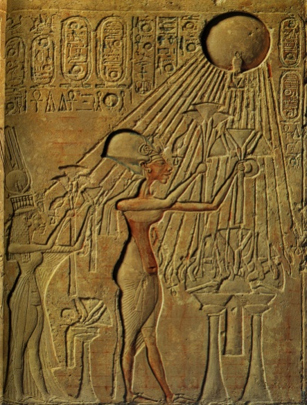

# Leçon 14 | 16 Mars 1960

<!-- source-url: http://staferla.free.fr/S7/S7 L'ETHIQUE.docx -->
<!-- seminar: s7 -->
<!-- lesson: 14 -->

<!-- id: s7-14-0001 -->

Cet article de SPERBER[^37] dont Madame HUBERT vous a donné la traduction la dernière fois était quelque chose d’accroché à notre train sur la sublimation, et je voulais que vous en ayez connaissance.

<!-- id: s7-14-0002 -->

Je ne me livrerai pas à une critique extrêmement approfondie de ce texte. J’espère que, pour la plupart d’entre vous, après les quelques années d’enseignement que vous avez suivies ici, quelque chose a dû vous chiffonner dans ce mode de procéder. Je veux dire que, si la visée de l’article est quelque chose d’incontestablement intéressant - aussi bien ne nous y serions-nous pas attardé sans ça - je pense que le mode de démonstration n’a pas dû vous apparaître sans faiblesse. Je veux dire que de s’appuyer, de se référer, pour démontrer une sorte d’origine sexuelle commune - sous une forme sublimée - des activités humaines fondamentales, sur le fait que des mots à signification présumée originellement sexuelle se sont mis à véhiculer successivement toute une traînée de sens, progressivement, toujours plus éloignés de leur signification primitive, c’est évidemment là, prendre une voie dont le caractère de démonstration me semblait devoir, aux yeux de tout esprit de bon sens, être éminemment *réfutable*.

<!-- id: s7-14-0003 -->

Ça se sent d’abord parce qu’aussi bien le fait que des mots à signification primitivement sexuelle aient en quelque sorte fait tache d’huile, quant au champ de la signification, pour arriver à découvrir des significations très éloignées, cela ne veut pas dire qu’il soit démontré que tout le champ de la signification soit pour autant recouvert.

<!-- id: s7-14-0004 -->

Cela ne veut pas dire que tout ce que nous usons comme langage soit en fin de compte réductible à ces mots clé qu’il donne, et dont évidemment la valorisation, la posture est considérablement facilitée pour la démonstration par le fait qu’on admet même comme démontré ce qu’il y a de plus contestable, la notion de racine, ou de radical, au sens où la racine et le radical seraient constitutivement, dans le langage humain, liés à un sens.

<!-- id: s7-14-0005 -->

La mise en valeur des racines et des radicaux dans les langues flexionnelles est quelque chose qui pose des problèmes particuliers qui sont loin d’être applicables à l’universalité des langues. Ce serait bien difficile à mettre en valeur pour ce qui est par exemple du chinois où tous les éléments signifiants sont monosyllabiques. La notion de la racine devient des plus fuyantes.

<!-- id: s7-14-0006 -->

En fait, il s’agit bien là d’une illusion liée au développement significatif du langage, de l’usage de la langue, où tout ce qui est racine ne saurait que nous être très suspect. Ce qui ne veut pas dire que tout ce que vous avez entendu produit devant vous comme remarques concernant l’usage que ces mots, disons à racine sexuelle, dans les langues, au reste toutes indo-européennes, soit sans intérêt. Mais dans la perspective qui est celle dans laquelle je pense vous avoir suffisamment maintenant rompus et formés, qui consiste à bien distinguer *la fonction du signifiant*, de *la création de la signification* par l’usage métonymique d’une part, métaphorique d’autre part, des signifiants, je dirai qu’évidemment c’est là que le problème commence.

<!-- id: s7-14-0007 -->

Pourquoi ces zones dans lesquelles *la signification sexuelle*, comme je disais tout à l’heure, fait tache d’huile, pourquoi ces rivières où elle s’épand ordinairement - et vous avez vu que ce n’était pas n’importe quel sens - sont-elles en somme spécialement choisies pour qu’on mette en usage pour les atteindre les mots qui ont eu déjà des emplois dans l’ordre sexuel ?

<!-- id: s7-14-0008 -->

Il est extrêmement intéressant, par exemple, de se demander pourquoi c’est justement à ce propos : d’un acte plus ou moins amorti, étouffé, d’un acte plus ou moins bousillé, de couper, de sécation, un acte à demi manqué, qu’on fera resurgir l’origine présumée dans le forage des travaux les plus primitifs, avec une *signification* d’opération sexuelle, de pénétration phallique ?

<!-- id: s7-14-0009 -->

Pourquoi, en d’autres termes, on fera resurgir *la métaphore* « *foutre* » à propos de quelque chose de *mal foutu* ? Pourquoi c’est l’image de *la vulve* qui surgira pour exprimer des actes divers parmi lesquels celui de *se dérober*, de *s’enfuir*, de *se tailler* comme on a à plusieurs reprises traduit le terme allemand du texte ?

<!-- id: s7-14-0010 -->

Je vous le dis en passant : cette si jolie expression, « *se tailler* » pour dire s’enfuir, se dérober, j’ai essayé d’en trouver l’attestation, je veux dire le moment où, dans l’histoire, nous la voyons apparaître comme telle avec ce sens, et j’ai eu un temps trop court pour le faire. Dans les dictionnaires ou les appareils que j’ai à ma disposition, je ne l’ai pas trouvé. Si quelqu’un là-dessus pouvait faire cette recherche. Il est vrai que je n’ai pas à Paris les dictionnaires concernant l’usage familier des mots. C’est tout de même une question.

<!-- id: s7-14-0011 -->

Donc, pourquoi dans la vie, c’est d’un certain type de signification, certains signifiants marqués d’un primitif usage pour la relation sexuelle qu’il s’agit dans un usage métaphorique ? Comment se servir de tel ou tel terme argotique qui a primitivement une signification sexuelle pour des situations qui ne le sont pas, dans un usage métaphorique comme je le définis ? Et cet usage métaphorique est utilisé pour obtenir une certaine modification.

<!-- id: s7-14-0012 -->

N’y a-t-il donc plus dans cet article que ce quelque chose qui est une occasion de voir, à propos d’un cas tout à fait particulier comment sont mis en usage, selon le mode métaphorique, dans l’évolution normale, diachronique, des usages dans le langage, comment on use, et pourquoi, de références sexuelles dans un certain usage métaphorique ?

<!-- id: s7-14-0013 -->

Est-ce que ce serait réduire à cela la portée de l’article, c’est-à-dire montrer qu’il avait tout à fait manqué sa visée ? *Assurément pas*. Si ce n’était que cela, c’est-à-dire comme un exemple de plus de certaines aberrations de la spéculation psychanalytique que cet article pouvait être pris, je ne l’aurais pas fait produire ici devant vous. Je crois que ce qui lui maintient sa valeur, c’est ce quelque chose qui est à son horizon, qui n’est pas démontré mais qui est visé dans son intention, qui est justement ce par quoi un rapport tout à fait radical, celui des rapports instrumentaux premiers, des techniques premières,des actes majeurs de l’agriculture, celui d’ouvrir le ventre de la terre, les actes majeurs de la fabrication du vase sur lequel j’ai mis tellement l’accent, et tel et tel autre actes, se trouvent si naturellement métaphorisés autour de quelque chose de très précis qui est moins *l’acte sexuel* que l’organe sexuel féminin.

<!-- id: s7-14-0014 -->

Je veux dire que c’est pour autant que l’organe sexuel féminin, plus exactement la forme d’ouverture et de vide, était au centre de toutes ces métaphores, que l’article prenait son intérêt et sa valeur centrante pour la réflexion. Car il est bien clair qu’il y a une béance, un saut de la référence supposée, c’est une idée fort intéressante, de l’appel sexuel comme tel, de la vocalisation censée accompagner l’acte sexuel comme ayant pu donner l’amorce, *l’origine de l’usage du signifiant* aux hommes pour désigner : soit substantivement l’organe et spécialement l’organe féminin, soit verbalement l’acte de coïter.

<!-- id: s7-14-0015 -->

Le saut, dans cet article, c’est à savoir que si l’usage d’un terme qui signifie coït primitivement, est quelque chose qui est susceptible d’une extension qu’on présume presque indéfinie, que l’usage d’un terme qui signifie vulve originellement est susceptible de toutes sortes d’usages métaphoriques, ceci nous fait le pont entre ce qui est supposé, c’est à savoir que la prévalence de l’usage vocal du signifiant chez l’homme peut avoir son origine dans le fait que dans certaines activités, ces activités accompagnées par des appels chantés qu’on suppose être ceux de la relation sexuelle primitive chez les hommes, comme elles le sont chez tels animaux, spécialement chez les oiseaux, il y a là évidemment un saut dans l’article.

<!-- id: s7-14-0016 -->

Car vous sentez bien quelle différence il y a entre le cri plus ou moins typifié qui accompagne une activité et l’usage d’un signifiant qui en détache tel élément d’articulation, à savoir : soit l’acte, soit l’organe. Aussi bien, même si nous admettons que c’est par cette voie, et il n’est pas dépourvu d’intérêt de supposer que l’homme a été introduit par là à l’usage du signifiant, il est trop clair que pour autant nous n’avons pas *la structure signifiante*, à savoir que rien n’implique déjà à l’horizon dans le donné de « *l’appel sexuel naturel* », que l’élément d’opposition qui fait la structure de l’usage du signifiant, celui qui est déjà tout entier développé dans le *fort-da* dont nous avons pris l’exemple originel, soit donné dans l’appel sexuel. L’appel sexuel peut se rapporter à une modulation temporelle d’un acte dont la répétition peut comporter la fixation de certains éléments de l’activité vocale. Il n’est pas encore ce quelque chose qui peut nous donner l’élément structurant, même le plus primitif. Il y a là une béance.

<!-- id: s7-14-0017 -->

Néanmoins l’intérêt de l’article est de nous montrer par quel biais peut se concevoir ce qui est si essentiel d’autre part, dans l’élaboration de notre expérience et dans la doctrine de FREUD, c’est tout de même comment le symbolisme sexuel, au sens ordinaire du terme, peut se trouver tout à fait, à l’origine polariser le jeu métaphorique du signifiant. Au reste je m’en tiendrai là pour aujourd’hui, quitte à y revenir ultérieurement.

<!-- id: s7-14-0018 -->

Je me suis interrogé sur la façon dont je renouerai le fil, et sur quoi je repartirai aujourd’hui. Je me suis dit - pour m’en être aperçu autour de la conversation avec certains - qu’en somme il n’était pas dépourvu d’intérêt que je vous donne une idée des conférences, propos ou causeries auxquelles je me suis livré à Bruxelles. C’est qu’aussi bien j’ai quelque chose à vous transmettre. Ceci reste toujours au centre de la ligne de mon discours, et je ne fais guère, même quand je le transporte au dehors, que de le reprendre à peu près au point où je le soutiens.

<!-- id: s7-14-0019 -->

Bien sûr, ce n’est pas un ni deux séminaires de plus que j’ai fait devant mes auditeurs à Bruxelles, c’est néanmoins quelque chose qui se situe au point où nous en sommes de ce que j’articule ici que j’ai essayé de dire devant eux. Ce que je risque donc c’est d’en franchir pour vous trop vite le saut, en supposant implicitement par vous déjà connu ce que j’ai dit là-bas. Ce n’est pas sûr pourtant car aussi bien ce que j’ai dit devant une audience différente peut avoir comporté, amené des éléments ici non encore dits, dont il y a tout de même intérêt à ce qu’ils ne soient pas ici, dans notre discours, éludés.

<!-- id: s7-14-0020 -->

Ceci peut vous paraître après tout d’un bien grand sans-gêne dans la façon de procéder sur ce que je peux avoir à dire, mais cela le méritait. Je n’ai pas trop le temps, avec le chemin qui nous reste à parcourir, de m’arrêter à des soucis à proprement parler de « *professeur* ». Ça n’est pas ma fonction, comme je le leur ai laissé entendre et même dit formellement. Il me déplaît même, pour dire le terme, d’avoir à me mettre devant un auditoire en position d’enseignement, car un *psychanalyste* qui parle devant un auditoire non introduit, prend toujours un sens de propagandiste. Si j’ai accepté de parler dans *cette université* qui est l’*Université Catholique de Bruxelles*, je l’ai fait dans un certain esprit qui n’est pas à mes yeux le mode de voir qui soit à mettre au tout premier plan, mais à mettre en second rang, dans un esprit *d’entre-aide* et aux fins de venir par quelque côté - j’ose espérer que je l’ai fait - en accorder la présence et l’action de ceux qui sont de nos amis, de nos camarades en Belgique.

<!-- id: s7-14-0021 -->

J’étais donc devant un public, assurément très large, et dont tout m’a donné la meilleure impression, convoqué par l’appel d’une université catholique et ceci à soi tout seul pourra vous expliquer pourquoi je leur ai parlé d’abord de quelque chose, c’est à savoir dans la première leçon de ce qui se rapporte dans FREUD au thème, et à *la notion*, et à *la fonction* *du père*. Comme on pouvait l’attendre de moi, je ne leur ai pas mâché les mots, ni ménagé les termes, à savoir que ce n’est pas *la position de* FREUD vis-à-vis de la religion que j’ai essayé, devant un tel auditoire, d’atténuer.

<!-- id: s7-14-0022 -->

Néanmoins vous savez quelle est ma position concernant, si je puis dire, le domaine de ce qu’on appelle « *les vérités religieuses* ». Cela mérite peut-être une fois, à cette occasion, d’être précisé, encore que je crois que déjà je l’ai - par *mes propos*, par *ma façon* *de procéder* avec elles - rendu assez clair.

<!-- id: s7-14-0023 -->

C’est qu’à se trouver soi-même, soit tout simplement par une position personnelle, soit au nom d’une position de méthode, d’une position dite scientifique à laquelle il arrive que se tiennent des gens qui sont par ailleurs des croyants qui, néanmoins, dans un certain domaine se croient tenus de mettre, comme on dit de côté le point de vue proprement confessionnel, soit dans un cas, soit dans l’autre, il y a quelque *paradoxe* à aboutir à cette position d’*exclure* pratiquement du débat, de la discussion, de l’examen des choses, des termes, des doctrines qui ont été articulées dans le champ propre de la foi, comme restant dès lors en quelque sorte d’un *domaine* qui serait *réservé* *aux croyants*.

<!-- id: s7-14-0024 -->

Vous m’avez un jour entendu engréner directement sur un morceau de l’*Épître de St* Paul *aux Romains*, à propos du thème de *la loi qui fait le péché*. Et vous avez vu qu’au prix d’un artifice d’ailleurs dont j’aurais bien pu me passer, *la substitution de ce terme*, encore en blanc, de mon discours au moment où je le faisais, de *la Chose* à ce qui dans le texte de Saint PAUL s’appelle *le péché*, on arrivait à *une formulation* très exacte et très précise de ce que je voulais vous dire alors concernant les rapports, *le nœud de la loi au désir*. Cet exemple, qui prend à propos d’un cas particulier son ordre d’efficace, est quelque chose sur lequel j’éprouve le besoin de revenir, car je ne considère pas qu’il s’agisse là d’un emprunt de hasard, de quelque chose qui s’est trouvé particulièrement favorable par une sorte *d’escamotage* à aboutir à ce dont, à ce moment là, j’avais devant vous à faire état.

<!-- id: s7-14-0025 -->

Je crois au contraire qu’il n’y a nul besoin de donner cette forme d’adhésion, quelle qu’elle soit, sur laquelle je n’ai pas même à entrer ici, dont l’éventail peut se déployer dans l’ordre de ce qu’on appelle la foi, pour que se pose pour nous analystes, je veux dire pour nous qui prétendons, dans des phénomènes qui sont de notre champ propre, vouloir aller au-delà de certaines conceptions d’une pré-psychologie, à savoir aborder ces réalités humaines sans préjugé, je considère que nous ne pouvons pas non seulement les laisser, mais nous ne pouvons pas ne pas nous intéresser de la façon la plus précise, à ce qui s’est articulé \- j’entends ce qui s’est articulé comme tel, dans ces propres termes - dans l’expérience religieuse, sous les termes par exemple du conflit entre la liberté et la grâce.

<!-- id: s7-14-0026 -->

Une notion aussi articulée, aussi précise, et aussi irremplaçable que celle de la grâce, quand il s’agit de la psychologie de l’acte, est quelque chose dont nous ne trouvons ailleurs - je veux dire dans *la psychologie académique classique -* rien d’équivalent. Et je considère donc que non seulement *les doctrines*, mais *le texte historique*, l’histoire des choix, c’est-à-dire *les hérésies* qui ont été faites, qui sont attestées au cours de l’histoire dans ce registre, la ligne des *emportements* qui ont motivé un certain nombre de directions dans l’éthique concrète des générations, est quelque chose qui non seulement appartient à notre examen, mais qui requiert, j’insiste, dans son registre propre, dans son mode d’expression, toute notre attention.

<!-- id: s7-14-0027 -->

Il ne suffit pas, parce que de certains thèmes ne sont usités, mis en usage, que dans le champ des gens dont nous pouvons dire qu’ils croient croire - *après tout qu’en savons-nous ?* - que ce domaine leur reste réservé. Pour eux, ce ne sont pas des croyances. Si nous supposons qu’ils y croient vraiment, ce sont des vérités. Ce à quoi ils croient, qu’ils croient, qu’ils y croient ou qu’ils n’y croient pas, rien n’est plus ambigu que la croyance, il y a une chose certaine, c’est qu’*ils croient le savoir*.

<!-- id: s7-14-0028 -->

C’est un savoir comme un autre, et à ce titre cela tombe dans le champ de l’examen que nous devons accorder, du point où nous sommes, à tout savoir, dans la mesure même où, en tant qu’analystes, nous pensons qu’il n’est aucun savoir qui ne s’élève sur un fond d’ignorance. C’est cela qui nous permet d’admettre comme tels *bien d’autres savoirs que le savoir scientifiquement fondé*.

<!-- id: s7-14-0029 -->

J’ai donc cru devoir, devant une audience dont il me paraît qu’il n’est pas inutile que je l’aie affrontée, moins pour telle ou telle oreille que j’ai pu faire se dresser, ce qui reste toujours problématique et que seul l’avenir peut démontrer, mais qu’après tout cette audience - qui n’est pas hypothétique puisqu’elle a eu lieu - me permet devant vous, qui êtes une tout autre audience, de mettre en valeur *un certain nombre de traits* qui n’ont peut-être pas, pour vous, la même portée qu’ils peuvent avoir pour elle, mais dont il est tout de même nécessaire que vous voyiez comment devant une certaine audience qui représente un secteur important du domaine public, les choses peuvent être *présentées*.

<!-- id: s7-14-0030 -->

Je crois qu’il n’y a pas de préjugé plus courant, sinon que FREUD parce qu’il a pris sur le sujet de l’expérience religieuse la position la plus *tranchante*, à savoir qu’il a dit que tout ce qui dans cet ordre était d’appréhension sentimentale, cet ordre, littéralement ne lui disait rien, que c’était littéralement pour lui aller jusqu’à *la lettre morte*. Seulement si nous avons ici, vis-à-vis de *la lettre*, la posture qui est la nôtre, cela ne résout rien, parce que toute morte qu’elle est cette lettre, elle peut néanmoins avoir été une lettre bel et bien articulée et articulée précisément au moins dans certains champs, dans certains domaines, précisément de la même façon que l’expérience religieuse l’a articulée.

<!-- id: s7-14-0031 -->

En d’autres termes, devant des gens supposés répondre à l’appel d’une Université Catholique, supposés ne pouvoir se désolidariser d’un certain message, au moins en tant qu’il intéresse Dieu le Père, je puis avancer en toute sécurité qu’au moins, quant à ce qui s’articule sur ce message, en tant qu’il concerne la fonction du père, en tant que cette fonction est au cœur de l’expérience qui se définit comme religieuse, FREUD - comme je m’exprimais dans un sous-titre qu’on m’avait proposé pour ma conférence, mais qui a un peu effarouché - FREUD fait le poids.

<!-- id: s7-14-0032 -->

Ceci, il est plus que facile de le démontrer. Il vous suffit d’ouvrir ce petit livre qui s’appelle *Moïse et le monothéisme* sur lequel FREUD, après l’avoir mijoté depuis quelques dix ans - *à partir de Totem et Tabou il ne pensait qu’à ça, à cette histoire de Moïse et de* *la religion de ses pères -* articule ce qui concerne le monothéisme. Car il faut tout de même savoir lire, s’apercevoir de quoi il s’agit, où FREUD va, dans ce livre sur lequel à la fin de sa vie, quasiment : s’il n’y avait pas l’article sur le *Splitting* dans la *Spaltung* de l’*Ego*, on pourrait dire que la plume lui tombe de la main avec la fin de *Moïse et le monothéisme*.

<!-- id: s7-14-0033 -->

Contrairement à ce qui me semble insinué - si j’en crois ce qu’on me raconte depuis quelques semaines - sur ce qu’on peut dire sur la production intellectuelle de FREUD à la fin de sa vie, je ne crois pas du tout quant à moi qu’elle fût en déclin. Rien ne me paraît en tout cas plus fermement articulé, plus conforme à toute la pensée antérieure de FREUD que ce *Moïse et le monothéisme*. Autour de quoi porte la question de *Moïse et le monothéisme* ? Il s’agit évidemment, de la façon la plus claire, du message monothéiste comme tel. C’est cela qui intéresse FREUD. C’est cela d’ailleurs qui d’emblée n’a pas besoin pour lui d’être discuté dans l’ordre de la connotation de valeur.

<!-- id: s7-14-0034 -->

Je veux dire que pour lui il ne fait pas de doute que le message monothéiste comporte en soi-même un accent incontestable de valeur supérieure à tout autre. Le fait que FREUD soit athée ne change rien à ceci. Il reste que pour un athée, celui qui est FREUD - je ne dis pas pour tout athée : c’est à voir - en tout cas pour lui la visée du message monothéiste saisie dans son fondement radical, est quelque chose qui a une valeur décisive.

<!-- id: s7-14-0035 -->

Il est possible de dire qu’il passe par là quelque chose *à gauche* duquel il y a certaines choses qui sont dès lors dépassées, périmées, qui ne peuvent plus tenir au-delà de la manifestation de ce message. *À droite* c’est autre chose. L’affaire est tout à fait claire dans l’esprit de l’articulation de FREUD. En dehors du monothéisme, ça ne veut pas dire qu’il n’y a rien, loin de là.

<!-- id: s7-14-0036 -->

Il fait allusion, il ne nous donne pas une théorie des dieux, mais il y en a suffisamment de dit pour que nous nous rappelions de l’atmosphère que l’on a l’habitude de connoter de païenne - ce qui est, vous le savez, une connotation tardive, et liée à son effacement, à sa réduction dans la sphère paysanne - mais dans l’atmosphère païenne, alors qu’on ne l’appelait pas comme cela, qu’elle était en pleine floraison, le *numen* surgit à chaque pas, si l’on peut dire, à tous les coins des routes, surgit dans la grotte, à la croisée des chemins. Ce *numen* tisse l’expérience humaine. Nous pouvons encore apercevoir les traces de ce mode de véhicule, beaucoup de champs en existent encore dans l’existence humaine. C’est là quelque chose qui, par rapport à la manifestation, à la profession monothéiste, est dans un certain rapport de *contraste*. Je dis que le « *numineux* » surgit à chaque pas et inversement je dirais que chaque pas du « *numineux* » laisse une trace, engendre, si je puis dire, *un mémorial*.

<!-- id: s7-14-0037 -->

Il n’en faut pas beaucoup pour qu’un temple s’élève, qu’un nouveau culte s’instaure. Le « *numineux* » pullule et agit de partout dans l’existence humaine, si abondant d’ailleurs que quelque chose à la fin doit se manifester tout de même par l’homme de maîtrise qui ne se laisse pas déborder. C’est ce formidable enveloppement, et en même temps une dégradation dans la fable, ces fables antiques, si riches de sens, dont nous pouvons encore nous bercer, et dont nous avons peine à concevoir comment elles étaient compatibles avec quoi que ce soit qui comportât une foi à ces dieux, puisqu’aussi bien ces fables, qu’elles soient *héroïques*, *épiques* ou *vulgaires* sont tout de même marquées : de je ne sais quel *désordre*, de je ne sais quelle *ivresse*, de je ne sais quel *anarchisme*, si l’on peut dire, des passions divines.

<!-- id: s7-14-0038 -->

Le rire des dieux dans l’*Iliade* l’illustre suffisamment sur le plan héroïque. Il y aurait beaucoup à dire sur ce rire des Olympiens. Je ne veux aujourd’hui m’attarder qu’à cette phase à laquelle les païens étaient sensibles. Nous en avons la trace sous la plume des philosophes, et c’est au caractère de *l’envers de ce rire*, ou du *caractère dérisoire des aventures des dieux*, c’est cela que nous avons peine à concevoir.

<!-- id: s7-14-0039 -->

En face de cela qu’avons-nous ? Nous avons donc *le message monothéiste* et c’est à cela que FREUD consacre son examen. Comment ce *message monothéiste* est-il possible, comment a-t-il affleuré ? La façon dont FREUD l’articule est capitale pour apprécier le niveau où se situe *la procession* de FREUD. Vous le savez, tout repose sur la notion de « *Moïse l’Égyptien »*. Je ne pense pas que devant un auditoire comme celui–ci je sois obligé de faire un séminaire où quelqu’un analysera *Moïse et le monothéisme*. Je crois que pour des gens qui, comme vous, sont des psychanalystes à 80 %, vous devez savoir ce livre par cœur.

<!-- id: s7-14-0040 -->

Tout repose donc sur la notion de *Moïse l’Égyptien* et de *Moïse le Midianite*. *Moïse l’Égyptien* est *le Grand Homme*, *le Législateur*, et aussi *le Politique*, *le Rationaliste*, celui dont FREUD prétend découvrir la voie dans l’apparition historique à une date précise, au XIVème siècle avant JÉSUS-CHRIST de la religion d’AKHÉNATON attestée par des découvertes récentes. C’est à savoir quelque chose qui promeut *la fonction unique*, l’*unitarisme de l’énergie* d’où rayonne, si l’on peut dire, la distribution du monde symbolisée par *l’organe solaire*.

<!-- id: s7-14-0041 -->

<!-- id: s7-14-0042 -->

Le personnage qu’est *Moïse l’Égyptien* est pour FREUD au delà des débris humains de cette première entreprise d’une vision entièrement scientifique, rationaliste du monde, qui est supposée dans cet unitarisme, qui est unitarisme du réel, unité substantielle du monde centrée dans le soleil, et dont vous savez que l’histoire de l’Égypte a démontré l’échec. À savoir qu’à peine disparu AKHÉNATON, le fourmillement des thèmes religieux, multipliés en Égypte plus qu’ailleurs, le pandémonium des dieux reprend le dessus et la barre, et réduit à néant toute la réforme d’AKHÉNATON. *Un homme garde avec lui le flambeau de cette visée rationaliste*, c’est *Moïse l’Égyptien* qui choisit un petit groupe d’hommes pour les mener à travers l’épreuve qui les rendra dignes de fonder une communauté acceptant à sa base ces principes.

<!-- id: s7-14-0043 -->

Voilà le texte de FREUD. En d’autres termes, quelqu’un qui voulait faire le socialisme dans un seul pays. À ceci près qu’en plus il n’y avait pas de pays, il y avait une poignée d’hommes pour le faire. Voilà la conception freudienne de ce qu’est essentiellement le vrai MOÏSE, *le Grand Homme*, celui dont il s’agit de savoir comment son message nous est encore, pour l’instant, transmis.

<!-- id: s7-14-0044 -->

Bien sûr, naturellement vous me direz : *quand même, ce* MOÏSE *était un tant soit peu magicien*. Ceci n’a pas tellement d’importance. Comment est-ce que MOÏSE opérait pour faire tout d’un coup fourmiller les sauterelles et les grenouilles, c’est son affaire. Ce n’est pas une question d’un intérêt essentiel du point de vue qui nous occupe de sa position religieuse, et laissons de côté l’usage de la magie. Elle ne lui a jamais nui, d’ailleurs, à ce *Moïse l’Égyptien*, aux yeux de personne.

<!-- id: s7-14-0045 -->

Et il y a *Moïse le Midianite*, le gendre de JETHRO, et c’est celui-là dont FREUD nous enseigne que la figure a été confondue avec celle du premier, *Moïse le Midianite* que FREUD appelle aussi celui du Sinaï, de l’Horeb. C’est en effet bien là la question. C’est celui-là qui entend surgir du *buisson ardent* *la Parole*, à mes yeux, tout à fait décisive, qui ne saurait être élidée en la matière. FREUD l’élide, cette parole fondamentale qui est celle-ci : « *Je suis*, non pas...

<!-- id: s7-14-0046 -->

comme toute la gnose chrétienne a essayé de le faire entendre, c’est-à-dire de nous introduire dans des difficultés concernant l’être qui ne sont pas près de finir, et qui peut-être n’ont pas été sans compromettre ladite exégèse

<!-- id: s7-14-0047 -->

...*celui qui est* », mais « *Je suis ce que je suis* ».

<!-- id: s7-14-0048 -->

C’est-à-dire *un Dieu* qui se présente comme *essentiellement caché*. Ce *Dieu caché* est un *Dieu jaloux* et ce *Dieu caché* paraît très difficile à dissocier de celui tout de même qui, dans le même entourage de feu qui le rend *inaccessible*, fait entendre - nous dit la tradition biblique - les fameux *commandements* au peuple rassemblé autour, qui n’a pas le droit d’approcher, de franchir une certaine limite.

<!-- id: s7-14-0049 -->

À partir du moment où *ces commandements* s’avèrent pour nous être des commandements à toute épreuve, c’est à savoir qu’appliqués ou non, nous les entendons encore, je l’ai souligné devant vous, dans leur caractère indestructible, à partir du moment où *ces commandements peuvent s’avérer comme les lois mêmes de la parole*, comme j’ai essayé de vous le démontrer, il est certain qu’ici un problème s’ouvre. Pour tout dire, *Moïse le Midianite* me paraît poser son problème propre, celui que je voudrais bien savoir : en face de *qui*, en face de *quoi* il était sur le Sinaï et sur l’Horeb.

<!-- id: s7-14-0050 -->

Mais enfin, faute d’avoir pu soutenir l’éclat de la face de celui qui a dit « *Je suis ce que Je suis* », nous nous contenterons du point où nous sommes, de dire que *le buisson ardent* en somme c’était *la Chose* de MOÏSE et puis de la laisser là où elle est, quitte à supputer les conséquences qu’ont eu la révélation de ces choses. Quoi qu’il en soit, le problème pour FREUD concernant ces conséquences, est résolu d’une autre sorte. Il est résolu de la façon suivante. C’est parce que *Moïse l’Égyptien* a été assassiné par son menu peuple, moins docile que les nôtres envers le socialisme dans un seul pays, par des gens qui se sont ensuite voués à Dieu sait quelles paralysantes observances, à quelques troubles exercices envers d’innombrables voisins.

<!-- id: s7-14-0051 -->

Car n’oublions pas ce qu’est effectivement l’histoire des Juifs. Il faut un tout petit peu relire ces anciens livres pour s’apercevoir qu’en matière de colonialisme impérialiste, en Canaan, ils s’y entendaient un peu. Il leur arrive même d’inciter doucement les populations voisines de se faire circoncire puis, profitant dans les délais de cette paralysie qui vous reste après cette opération entre les jambes, de les exterminer proprement. Ceci n’est pas pour faire des griefs à l’endroit d’une période de la religion depuis révolue. Ceci dit, FREUD ne doute pas un seul instant que l’intérêt majeur de l’histoire juive…et il a bien raison…ne soit pas là. Il est dans le véhicule que le message du Dieu unique met d’une façon très particulière. Voici donc où les choses en sont.

<!-- id: s7-14-0052 -->

Nous avons la dissociation du *Moïse rationaliste* et du *Moïse inspiré* dont on parle à peine, du *Moïse obscurantiste*. Mais FREUD, se fondant sur l’examen des traces de l’histoire, ne peut trouver de voie justifiant, de voie motivée au message de *Moïse rationaliste* que pour autant que *ce message* s’est transmis dans *l’obscurité*. C’est pour autant que *ce message* s’est trouvé lié, dans le refoulement, au meurtre du *Grand Homme*, c’est précisément par là, nous dit FREUD, qu’il a pu être véhiculé, conservé dans un état d’efficacité qui est celui que nous pouvons mesurer dans l’histoire. C’est pour autant...

<!-- id: s7-14-0053 -->

et en ceci je ne dis pas qu’il s’identifie - mais c’est si près que c’en est impressionnant - avec la tradition chrétienne

<!-- id: s7-14-0054 -->

...c’est pour autant que ce *meurtre primordial* du *Grand Homme* vient émerger, selon les Écritures, dans un second meurtre qui,

<!-- id: s7-14-0055 -->

en quelque sorte le traduit, le promeut au jour, celui du Christ, que ce message s’achève et que cette malédiction secrète

<!-- id: s7-14-0056 -->

du meurtre du *Grand Homme*, qui n’a lui–même son pouvoir que d’être, de s’inscrire, de résonner sur le fond du *meurtre primordial*, du meurtre inaugural de l’humanité, du meurtre du père primitif, c’est pour autant que ceci vient enfin au jour, que ce qu’il faut bien appeler - parce que c’est dans le texte de FREUD - *la rédemption chrétienne*, s’accomplit. Seule cette tradition poursuit

<!-- id: s7-14-0057 -->

jusqu’au bout, jusqu’à son terme l’œuvre de révéler de quoi il s’agit dans le crime primitif, inaugural, de la loi primordiale.

<!-- id: s7-14-0058 -->

Comment ne pas, après cela, avec cela, ne pas au moins constater l’originalité de la position freudienne par rapport à tout ce qui existe en matière d’histoire des religions ? L’histoire des religions consiste essentiellement à chercher à dégager le commun dénominateur de *la religiosité*. Nous faisons une dimension de ce qu’on appelle *l’Homme*, de son lobe religieux, et alors nous constatons la diversité des manifestations religieuses, et nous sommes obligés de faire rentrer là-dedans des religions aussi différentes : qu’une religion de Bornéo, la religion confucéenne, taoïste, la religion chrétienne.

<!-- id: s7-14-0059 -->

Comme vous le savez, ceci ne va pas sans difficultés. Quoique, *quand on se livre au domaine des typifications*, il n’y a aucune raison qu’on n’aboutisse pas à quelque chose. On aboutit à des images, à une classification de *l’imaginaire*, c’est-à-dire très précisément ce qui distingue l’origine de la tradition monothéiste, ce qui est intégré aux commandements primordiaux en tant qu’ils sont des *lois de la parole* : « *Tu ne feras pas de moi d’image taillée, mais tu ne feras, pour ne pas risquer d’en faire, pas d’image du tout.* »

<!-- id: s7-14-0060 -->

Et puisqu’il est arrivé que je vous parle de *l’architecture de la sublimation primitive*, je dirai que nous pouvons vraiment nous poser le problème de ce qu’était la caractéristique de « *ce temple détruit dont il ne reste pas de traces* ». Quelles précautions, quelle symbolique particulière et quelles dispositions exceptionnelles avaient pu avoir été remplies pour que soit au moins réduit jusqu’à sa plus extrême encoignure quoi que ce soit qui, sur les parois de ce vase, a pu faire - et Dieu sait si c’est facile - resurgir l’image des animaux, des plantes, de toutes les formes qui se profilent sur les parois de *la caverne*, pour faire que ce temple ne fût que l’enveloppe de ce qui était au cœur, à savoir l’« *Arche d’alliance* », à savoir le pur symbole, le symbole du pacte, du nœud entre celui qui dit :

<!-- id: s7-14-0061 -->

« *Je suis ce que je suis, et je t’ai donné ces lois, ces commandements pour qu’entre tous les peuples soit marqué celui qui a des lois sages et intelligentes* ».

<!-- id: s7-14-0062 -->

Comment ce temple devait-il être pour éviter tous les pièges de l’art ? Ceci n’est pas quelque chose qui pour nous puisse être résolu par aucun document, par aucune image sensible. J’en laisse ici la question ouverte.

<!-- id: s7-14-0063 -->

Ce dont il s’agit et ce à quoi nous sommes amenés, c’est donc que FREUD, quand il nous parle, dans *Moïse et le monothéisme* de l’affaire de *la loi morale*, puisque c’est de cela qu’il s’agit pour lui, l’intègre pleinement à une aventure qui n’a trouvé, *écrit-il textuellement*, son achèvement, son plein déploiement que dans l’histoire, dans la trame judéo-chrétienne. Il est écrit que pour ce qui est des autres religions qu’il appelle vaguement d’orientales, je pense qu’il fait allusion à toute la lyre : à BOUDDHA, à LAO TSEU et à bien d’autres, *elles se caractérisent toutes* - dit-il, avec une hardiesse devant laquelle il n’y a qu’à *s’incliner*, aussi *hasardeuse* qu’elle nous paraisse - *ce n’est en fin de compte* - nous dit-il - *que le culte du Grand Homme*.

<!-- id: s7-14-0064 -->

Je ne suis pas du tout en train de *souscrire à cela*. Il dit que simplement les choses sont restées à mi-route, plus ou moins avortées, à savoir qu’est-ce que cela veut dire *le meurtre primitif du Grand Homme* ? Je pense qu’il pense la même chose à propos du *Bouddha*. Et bien sûr, dans l’histoire des avatars de BOUDDHA, on trouverait bien des choses où il retrouverait son schéma, légitimement ou non, que c’est *pour ne pas avoir,* au fond, *poussé jusqu’au bout le développement du drame*, jusqu’au bout, à savoir jusqu’au terme de la rédemption chrétienne, que *ces religions autres en sont restées là*.

<!-- id: s7-14-0065 -->

Inutile de vous dire que ce très singulier *christocentrisme* est tout de même pour le moins surprenant sous la plume de FREUD. Et pour qu’il s’y laisse glisser presque sans s’en apercevoir, il faut tout de même qu’il y ait à cela quelque raison.

<!-- id: s7-14-0066 -->

Quoi qu’il en soit, nous voici ramenés à ce qui pour nous est la suite du chemin. La suite du chemin est celle-ci : pour que quelque chose dans l’ordre de *la loi* donc soit véhiculé, il faut que ceci passe : par le chemin tracé par le drame primordial, par celui qui s’articule dans *Totem et Tabou*, à savoir celui du meurtre du père et, comme vous le savez, ses conséquences. *Ce meurtre* qui nous est proposé au début, *à l’origine de la culture* comme étant conditionné par des figures dont on ne peut vraiment rien dire, pour lesquelles le terme de redoutable ne peut se doubler que de redouté, aussi bien que de douteux, à savoir celle du tout puissant personnage de la horde primordiale, personnage à demi animal, tué par ses fils.

<!-- id: s7-14-0067 -->

À la suite de quoi - chose, articulation, à laquelle on ne s’arrête quelquefois pas assez - s’instaure quelque chose que nous pouvons appeler une sorte de *consentement inaugural* qui est tout de même un temps essentiel dans l’institution de cette loi dont tout l’art de FREUD est de le lier pour nous au meurtre même du père, de l’identifier à l’*ambivalence* qui fonde à ce moment les rapports du fils au père, à savoir à ce retour de *l’amour* après l’acte accompli dont on voit bien qu’il est justement là, tout le mystère et qu’il est fait en somme pour nous voiler la faille qui consiste en ceci : *non seulement le meurtre du père n’ouvre pas la voie vers la jouissance que la présence du père était censée interdire, mais si je puis dire, elle en renforce l’interdiction*.

<!-- id: s7-14-0068 -->

Tout est là, et c’est bien là ce qu’on peut appeler à tous les points de vue - je veux dire dans le fait et aussi dans l’explication - la faille, c’est à savoir que l’obstacle étant exterminé sous la forme du meurtre, la jouissance n’en reste pas moins *interdite*. Bien plus - ai-je dit - cette *interdiction* est renforcée. Cette faille interdictive est donc, si je puis dire, soutenue, articulée, *rendue visible par le mythe*, mais elle est en même temps *profondément camouflée par lui*. C’est bien pourquoi l’important de *Totem et Tabou* est d’être un mythe, on l’a dit, peut-être le seul mythe dont l’époque moderne ait été capable. Et c’est FREUD qui l’a inventé.

<!-- id: s7-14-0069 -->

L’important est ceci : c’est de nous attacher à ce que comporte cette faille, au fait que tout ce qui la franchit, l’affranchit, fait l’objet d’une dette au *Grand Livre de la dette*. Tout exercice de la jouissance comporte quelque chose qui s’inscrit à ce *Livre de la dette* dans la loi. Bien plus, il faut bien que quelque chose dans cette régulation soit ou paradoxe, ou le lieu de quelque dérèglement, car le contraire, le franchissement de la faille dans l’autre sens, n’est pas équivalent.

<!-- id: s7-14-0070 -->

FREUD écrit le *Malaise dans la civilisation* pour nous dire que tout ce qui est viré de *la jouissance* à *l’interdiction* va dans le sens d’un renforcement toujours croissant de *l’interdiction*. Quiconque s’applique à se soumettre à *la loi morale* voit, lui, toujours se renforcer les exigences toujours plus minutieuses, plus cruelles de son *surmoi*.

<!-- id: s7-14-0071 -->

Pourquoi n’en est-il pas de même en sens contraire ? Il est un fait, c’est qu’il n’en est rien, et que quiconque s’avance dans la voie de *la jouissance sans frein*, au nom de quelque forme que ce soit du rejet de *la loi morale*, rencontre des obstacles dont notre expérience nous montre tous les jours la vivacité sous des formes innombrables et qui n’en supposent peut-être pas moins *quelque chose d’unique à sa racine*.

<!-- id: s7-14-0072 -->

C’est au point que nous arrivons à la formule qu’une transgression est nécessaire pour accéder à cette jouissance et que, pour retrouver Saint PAUL, *c’est très précisément à cela que sert la loi*, que la transgression dans le sens de *la jouissance* ne s’accomplit qu’à s’appuyer sur *le principe contraire*, sur les formes de *la loi*. Et si les voies vers la jouissance ont quelque chose en elles-mêmes qui s’amortit, qui tend à *être impraticable*, c’est *l’interdiction* qui lui sert, si je puis dire, de véhicule tout-terrain, d’autochenille, pour sortir de ces boucles qui ramènent toujours l’homme, *tournant en rond, vers l’ornière d’une satisfaction courte et piétinée*.

<!-- id: s7-14-0073 -->

Voici à quoi nous introduit, à condition que nous soyons guidés par l’articulation de FREUD, ce quelque chose qui est tout simplement notre expérience. Il fallait que *le péché* eût *la loi* pour que - dit Saint PAUL - il pût devenir, rien ne dit qu’il y parvient, mais pût entrevoir de devenir démesurément *pécheur*. C’est dans le texte. En attendant, ce que nous voyons ici serré, c’est le nœud étroit du *désir* et de *la loi*.

<!-- id: s7-14-0074 -->

Moyennant quoi, assurément l’idéal de FREUD est cet idéal tempéré d’honnêteté, que l’on peut appeler - en donnant son sens idyllique au mot - *honnêteté patriarcale*, est fait là où le père de famille, à figure aussi larmoyante qu’il vous plaira : tout un certain idéal humanitaire qui vibre dans telle pièce bourgeoise de DIDEROT, voire dans telles figures auxquelles se complaît la gravure au XVIIIème siècle, *cette honnêteté patriarcale qui nous donne la voie d’accès la plus mesurée à des désirs tempérés, à des désirs normaux*.

<!-- id: s7-14-0075 -->

Ainsi ce que FREUD propose devant nous par son mythe, n’est tout de même pas là, dans sa nouveauté, sans avoir été par quelque biais exigé. Par quoi il est exigé, ce n’est pas bien difficile de le voir : si le mythe de l’origine de la loi s’incarne dans le meurtre du père, c’est de là que sont sortis ces prototypes qui s’appellent successivement : l’*animal totem*, puis tel *Dieu* plus ou moins *puissant*, plus ou moins *jaloux*, en fin de compte *le Dieu unique*, et *Dieu le Père*. Le mythe du meurtre du père, c’est bien le mythe d’un temps pour qui « *Dieu est mort* ».

<!-- id: s7-14-0076 -->

*Mais si Dieu est mort pour nous, c’est qu’il l’est depuis toujours*, et c’est bien là ce que nous dit FREUD. *Il n’a jamais été « le père » que* *dans la mythologie du fils*, c’est-à-dire celle du commandement qui *ordonne de l’aimer*, lui « *le père* », et *dans le drame de la passion* qui nous montre qu’il y a une résurrection au-delà de la mort, c’est-à-dire que l’homme qui a incarné *la mort de Dieu* est toujours là.

<!-- id: s7-14-0077 -->

Il est toujours là avec ce commandement qui ordonne d’aimer Dieu. Vous le savez, c’est devant quoi FREUD s’arrête. Il s’arrête du même coup - la chose est articulée dans le *Malaise dans la civilisation -* devant « *l’amour du prochain* ». L’amour du prochain nous parait quelque chose d’insurmontable, voire d’incompréhensible, et nous essaierons la prochaine fois de dire pourquoi.

<!-- id: s7-14-0078 -->

Ce que je voulais seulement aujourd’hui accentuer, c’est que ça n’est pas moi qui ai employé la formule ni fait la remarque qu’il y a un certain message athée du christianisme lui-même, c’est HEGEL comme vous le savez, dans le sens où par le christianisme, se complète *la destruction des dieux*.

<!-- id: s7-14-0079 -->

L’homme survit à « *la mort de Dieu* », assumée par lui-même, mais ce faisant, se *propose-t-il* lui-même devant nous. La légende païenne nous dit que sur la mer Égée, au moment où se déchirait le voile du temple, retentit le message : « *Le grand* PAN *est mort* ». Nous voici ramenés aux rapports du *grand* PAN à la mort.

<!-- id: s7-14-0080 -->

Même si FREUD moralise dans le *Malaise dans la civilisation*, s’arrête devant le commandement de « *l’amour du prochain* », c’est tout de même au cœur de ce problème que nous allons être ramenés par toute sa théorie du sens de la tendance. Les rapports du grand PAN à la mort, c’est là que vient achopper tout le psychologisme de ses disciples présents. C’est pour cela que j’ai fait tourner ma seconde conférence à Bruxelles autour de l’amour du prochain. Vous le voyez, c’était encore un thème de rencontre avec mon public.

<!-- id: s7-14-0081 -->

À savoir que ce que j’y ai effectivement rencontré, je vous donnerai l’occasion d’en juger la prochaine fois.## Notes

[^37]: Hans Sperber : « [*Über den Einfluß sexueller Momente auf Entstehung unt Entwicklung der Sprache »*, *Imago*, 1912, Heft 5, p.405](http://www.archive.org/details/Imago.ZeitschriftFrAnwendungDerPsychoanalyseAufDie_985).
